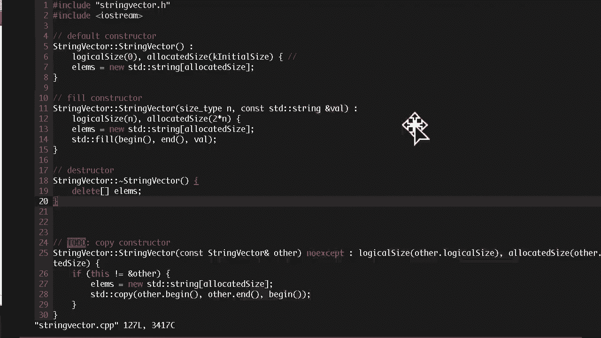
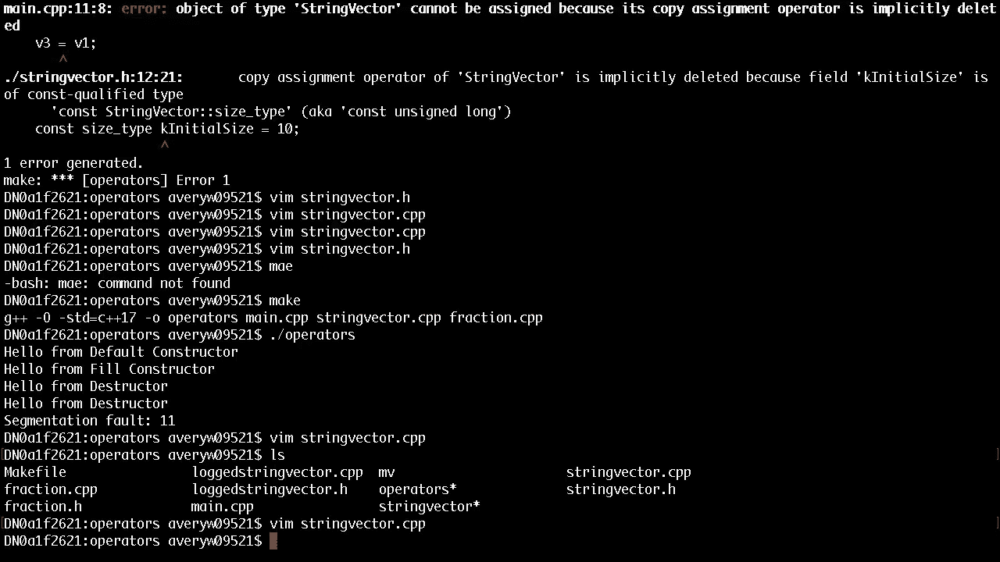
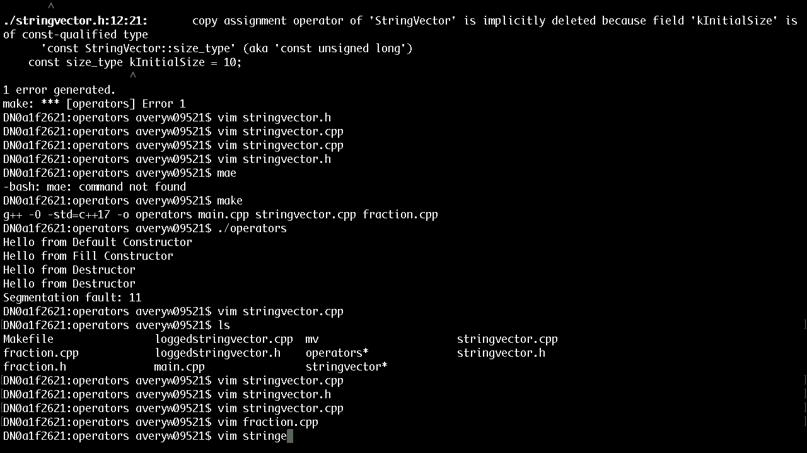
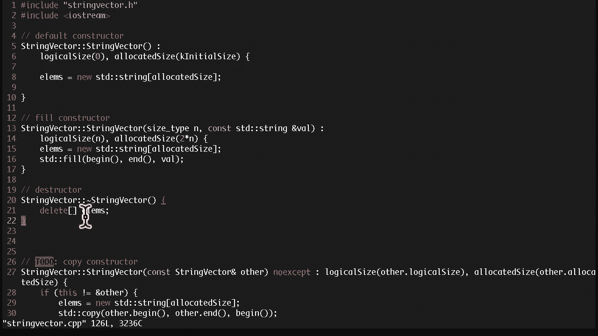
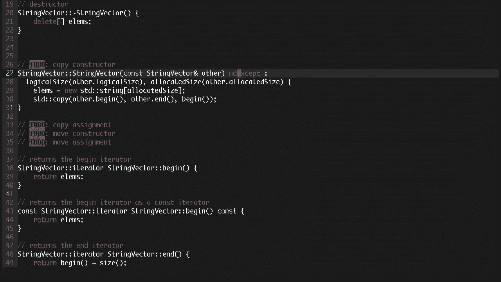
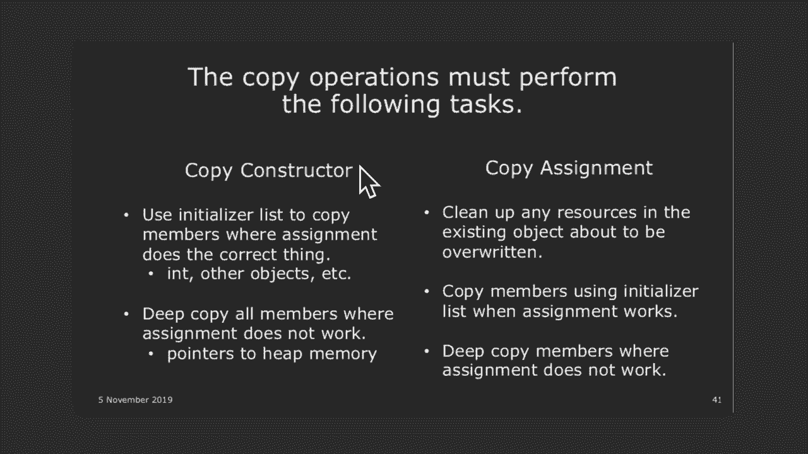
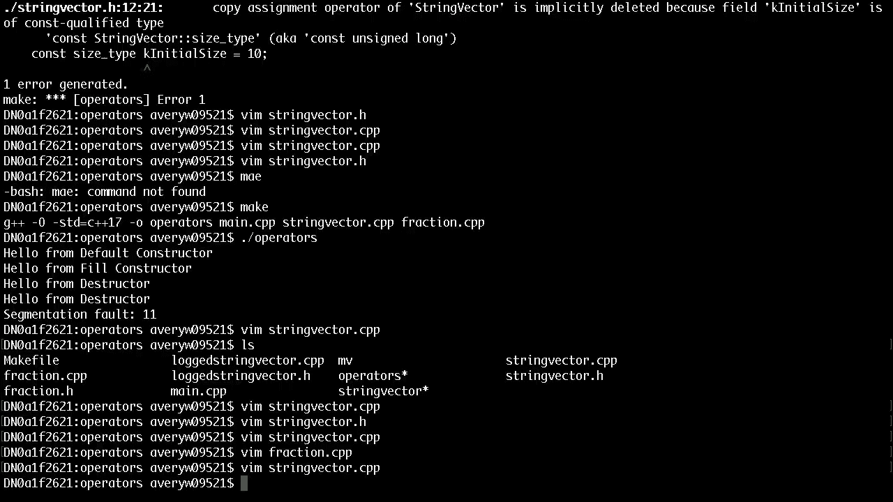
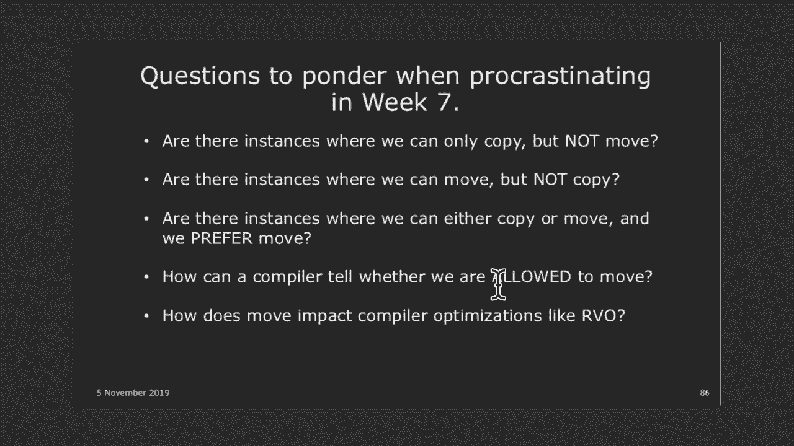

# 斯坦福大学《CS106L： C++编程｜ Stanford  CS106L C++ Programming 2019+2020》中英字幕（豆包翻译 - P13：[19]CS 106L Fall 2019 - Lecture 12_ Special Member Functions - GPT中英字幕课程资源 - BV1Fz421q7oh

不，这是一回事。这些是剩下的所有东西。我在考虑这些应该如何分配，是按问题分还是随机分配？偏袒？一，二，三，四，五，六，七，八，九。有九个。超过九个。好，有人真的想要一个菠萝蛋糕吗？好，那绝对少于九个。

一，二，三，我数到三个，还有其他人吗？四，五，六，好，七，好。好，七个少于九个，所以每个真的想要的都可以拿到一个。你们想要直接过来拿一个吗？因为上次有点混乱，所以直接过来拿一个吧。另外。

只有举手的才下来。有什么不同？这是蔓越莓味的，其他的都是普通的。谢谢。只是不同的品牌。你认为哪个更好？两个都很好。谢谢。好，最后两个，有人真的想要一个吗？如果你真的想要一个，就来拿一个吧。没问题。

还有其他人想要一个吗？最后一个。我们应该把这些拍卖掉。最后一个，是蔓越莓味的。好，太棒了。给你。菠萝蛋糕。好，大家好。今天是第一天，是第七周的星期二，所以记住这门课只有九，周，因为这个季度非常特殊。

感恩节发生在第九周之后，这，意味着我们将在感恩节之前完全结束。好吗？是的，感恩节快到了。关于作业的几项通知。如果你在作业二的A部分，即网络测试中遇到任何问题，安，娜应该已经给你发了邮件。

如果还有进一步的问题，请告知，我们。另外，我们对A部分的截止日期并不是特别严格。我们真正想检查的是确保你的网络正常工作，所以如果你，还没有完成，但想要继续做作业二，请尽快告诉我们，好吗？

作业二的截止日期大约在一周半之后？一周半。下周四，不是这周四。好，所以，是的，开始做作业吧。我查看了一些提交的作业。实际编写的代码并不特别长，记住这次作业的关键点是使，用模板。

使用STL库提供的函数和算法。好吗？所以，如果你发现自己写了很多代码来做一个STL算法可以，完成的事情，你应该重新考虑你的方法。好吗？实际的代码非常简短。我们还会查看像算法的使用、随机数的使用等。

这应该从作业说明中自然体现出来，所以如果你对如何着，手感到困惑，务必回来找我们或发邮件给我们。好。上周日，是周日吗？我们在周日举行了作业一的评分派对，问题是并不是所有，的评分员都来了。

因为他们还在评分期中考试。所以有些已经评分，有些还没有评分。我们会尽快回复你，好吗？你们肯定会在下周初拿回它们的。好吗？哦，对了，成绩方面其实很简单。要么是成功了，要么是失败了。你想要修正它吗？好吗？

是的。不用担心。我们并不主动想让任何人失败。是的。好的。是的。所以今天我们要讲解特殊成员函数。本周和下周，我们会详细讨论这些重要的函数。这些就是特殊成员函数。为什么它们是特殊的？它们之所以特殊。

是因为如果你不在类中声明这些函数，编，译器会为你创建它们。好吗？但问题是，有时候编译器为你创建的函数可能不是你实际，需要的。所以你确实需要知道如何声明它们，以备不时之需。所以我们快速讲一下。

今天我们将讨论特殊成员函数。我们主要关注复制。然后在周四，我们会讨论除了复制之外，是否可以移动东西，我会说这个周四的讲座可能是更具概念性的挑战之一。所以我认为你们都在从期中考试中恢复。周四请全力以赴。

好吧？酷。那么对上周的快速回顾。上周我们快速讲了运算符重载，并讨论了一些可以重载的，运算符。好的？有一些非常常见的，比如加号、减号、等号。也有一些比较晦涩的，比如逗号，甚至括号也可以被重载。好的？

我们看了很多例子。我不认为我讲完了所有计划中的例子，所以有些例子在上，次的讲座幻灯片中。我正在整理上次和这次的代码，确保本周内上传。好的？是的。那么上次的关键点是，如果我们声明了自己的类，C++ 如何。

知道这些运算符对我们的类是什么意思？答案是你可以通过编写这些重载运算符函数来定义你自己，的运算符。好的？所以你可以编写一个运算符加等于函数，来重载加等于运，算符。上次的关键点是，无论何时重载这些函数。

都要遵守该运算，符的通常语义。例如，当你重载加等于时，你应该返回对原始对象的引用，即 this 自身。这样做的原因是我们希望我们的运算符与基本类型的运算，符一致。好吗？以便使用它的人不会感到意外。

其他我们提到的要点包括，如果你重载了加号，确保如果合，适也重载减号。这样当有人使用这些运算符时，他们不会感到惊讶。哦，加号有效，但减号也有效，尽管直观上它们都应该存在，另一件事是。

如果你在实现这些二元对称运算符时，确保将，它们实现为非成员函数而不是成员函数。这背后的原因是，如果这两个向量在这个例子中被平等对，待，你不希望它们一个是自身，而另一个是一个外部的。

你希望它们被实现为对称的。这样做的原因是，如果你使用加号，你可以对称地使用它们，明白了吗？当你实现这些函数时，你也应该考虑 const 和非 const ，的情况。所以上周我略过了这个例子。

但如果你重载括号运算符，最好实现一个 const 版本和一，个非 const 版本。明白了吗？对于向量字符串，括号运算符返回一个引用，这样你可以访，问向量中的不同元素或编辑向量中的元素。

你认为实现 const 版本和非 const 版本是个好主意的原，因是什么？有什么想法吗？是的，请说。对，完全正确。因为有时候我们可能需要这个函数是 const 的。

一个好的例子是如果我们尝试运行这个代码。明白了吗？所以你可以看到我声明了两个向量。一个向量是非 const 向量。一个向量是 const 向量。明白了吗？

const 向量就像 const 整数或 const 字符串一样。它们本质上是你不能改变的对象。而对于你实现的类来说，不能改变的定义是你只能调用 ，const 成员函数。明白了吗？

这个想法是 const 成员函数不会改变它们的内部状态，而，非 const 成员函数会改变。所以如果你有一个像这样的 const 对象，那么你只能调用， const 成员。明白了吗？

为了考虑我们可能有一个 const 向量和一个非 const 向，量的情况，如果我们运行这一行，这将调用这里的非 const， 版本。这可以工作，因为这会返回。对了，这些不是字符串。这些是整数。

但你可以想象我们用其他字符串替换它。然后因为我们返回的是字符串的引用，我们可以将那个字，符串，比如 v 括号 1，设置为其他字符串。明白了吗？但如果我们尝试。如果我们只有第一个而没有第二个。

那么我们的 const 成，员函数将无法调用这个。它将无法调用这个括号运算符，因为这是一个 const 对象，const 对象只能调用 const 函数。这有意义吗？

所以为了让我们的 const 对象能够像这样调用括号表示，法，我们应该声明一个 const 版本。在使用 const 版本时，返回的字符串引用是 const 的。所以有人不能尝试这样做。

因为那样你会将一个 const 字，符串设置为某个值。我这里打错了。这些不应该是零。这些应该是其他字符串。到目前为止有任何问题吗？太好了，是的。所以现在你可以看到 const 正确性在处理类时是非常重。

要的。你应该想象所有可能的使用情况，以便其他人使用你的类，好，最后我们通过了最小惊讶原则，这意味着当你实现这些，运算符时，让它们按你期望的方式工作。例如，一个关键的点是，除非你有充分的理由，否则不要重。

载逗号操作符，因为没有人真正知道逗号操作符的作用是，什么。如果你重载了加号，你可能还应该实现加等于，因为直观上，如果你能将某物加到一个对象中，你也应该能将两个对象，加在一起。好了。

让我们快速复习一下构造函数和析构函数。我知道106B和X已经非常详细地讲解了这些内容，所以我会，跳过，基本上快速过一下复习部分，然后进入关于构造函数，和析构函数的最重要的部分。

这是我们将为字符串向量实现的构造函数和析构函数。

快速回顾一下，字符串向量基本上就是一个字符串的向量。

它的私有成员包括一个元素数组、一个逻辑大小和一个分，配大小。如果你开始使用优先队列，你应该知道逻辑大小与分配大，小的区别。逻辑大小是向量中实际包含的元素数量。

分配大小是我们可以在当前数组中放置的元素数量。如果我们需要超出分配大小，那么你必须以某种方式扩展，数组。是的，优先队列会让你实现这一点。我们不会过多讨论这个，但关键部分是我们有这个元素数，组。

在构造函数内部，正如你们所知道的，当你实现构造函数时，你必须初始化所有成员。例如，在106B中，你可能会写出这样的代码。你可能会写，好的，让我们把逻辑大小设置为零。让我们将分配大小设置为某个初始大小。

这是一个常量，我认为。然后你将elims设置为其他值。现在，这通常是有效的，对于106B的目的，你应该实现这样，的代码。但这会遇到一个问题，那就是常量正确性。如果我尝试声明一个常量向量。

你会遇到什么问题？有什么想法？对，正是如此。如果你声明一个常量向量，这意味着在创建该向量后，你不，能更改任何成员，即使在你的类内部也不允许这样做。如果我们这样做，那么我们基本上是声明了变量，但随后将。

变量赋值为某个值，而我们不被允许这样做。那么我们在这里要介绍的关键概念是初始化列表，初始化，列表的意思是，当声明这些私有成员时，它们也被直接初始，化。这与声明变量如const int i。

然后尝试做i = 3之间的关，键区别。你不被允许这样做。但你可以做const int i = 3。在声明变量的同时，你也同时初始化它。对于常量变量，你必须同时进行，因为声明后不允许编辑它。

这在这里是一样的道理。如果你有一个常量向量，那么这个变量是常量，所以你在声，明后不能编辑它。将其放入初始化列表中的想法是，在这些变量被声明时，你，也同时用这些值初始化它们。我们不在这里进行赋值。

而是直接使用初始化列表。有任何问题吗？好的。这还有一个有用的地方，这不仅仅对常量正确性有用。你能再想一个例子吗？在初始化某个东西后，你不能重新赋，值那个变量？在 C++ 中还有其他类似的情况吗？

在初始化之后，你不能，重新赋值那个变量？静态的？这是对的。我对此不太确定。静态的情况稍微不同。是的，静态的情况稍微不同。静态涉及到哪些变量、哪些常量。我们可能在未来的讲座中会讨论这个，但你猜得很好。

猜得很好。好的，答案是引用。记住，我们需要清除一个引用。引用有点像是另一个变量的别名。一旦你将引用设置为某个东西，你不能重新赋值那个引用，如果你尝试重新赋值，它只会改变它引用的其他变量。

如果你有类似的东西，我本来想举一个例子，在那个例子中，我们将创建一个新的向量，称为 loggedStringVector。它的作用是每次执行某些操作时，会写入一个文件，说明它，现在正在做什么。

我本来打算进入那个例子，但实现起来花了太多时间。而不是这样告诉你，但你会如何设计这样的东西呢？作为你的向量的成员，你可能会保持某种 OStream。你会保持一个 OFStream。

然后每次你向向量写入内容时，你会写入那个 OFStream。这有点像是日志。每次你对向量执行某些操作时，它会将日志记录到某个文，件中。那么你会如何跟踪这样的东西呢？你可能会希望作为成员保持一个引用。

在这种情况下，你不能仅仅复制文件等于文件是什么。在这种情况下，你必须使用初始化列表。这个想法是，只要可能，你应该尝试使用初始化列表来复制，成员。大家对初始化列表的语法清楚吗？是的。语法有点奇怪。

关键部分是你放置一个冒号，然后基本上有一个用逗号分，隔的列表，你可以说，好吧，我想声明 logical size 为零，我想声明 allocated size 为那个。这非常有趣，因为通常当你。

我想我在分数中有这个例子。记得我们上次写了分数吗？上次，如果我们想声明一个这样的分数，你必须使用这个，因为如果你只是做 num 等于 num，它不知道你指的是哪个，成员还是参数。但这不是很好。

我们想使用初始化列表，在这种情况下，如果你使用初始化，列表，你实际上可以像这样使用两个名称。这表示初始化 num 成员变量为这个 num，然后你会看到初，始化 denum 为参数。

这是一个变量作用域不同并不重要的例子。这将编译通过。你会经常看到这种情况。你会看到 i，括号 i，j，括号 j，作为一些懒惰的程序员不，想给他们的变量命名。有任何问题吗？我有事要做。

如果你声明了一个 const fraction 并且没有初始化列表，它不会起作用吗？是的，因为如果你有一个 const fraction，那么。安娜，如果我错了请纠正我，但如果你有一个常量分数，你。

不能像这样给它赋值。是的，为了更清楚，你是说常量分数还是常量分子？比如一个常量分数，比如说3除以4，我们初始化它像常量分，数3，常量4。所以我相信你仍然可以在没有初始化列表的情况下使用它。

因为你会创建分数，然后将那个分数设置为常量。艾弗里谈到的关于常量正确性的问题是，如果类的任何私，有成员变量被声明为常量，那么没有初始化列表你不能初，始化它们。哦。

所以这只是当私有成员被声明为常量时的唯一情况。是的。所以你仍然可以将它们声明为常量变量。这是个好问题。是的，好问题。另一个可能比较棘手的初始化列表问题，或者至少以前让，我困惑的地方是。

如果你使用初始化列表，你必须按类中私，有成员变量的声明顺序进行初始化。所以这只是一个小的实现提示，有时可能会让人感到困惑。

太棒了。然后对于析构函数，我不会详细讲解，但析构函数，你要确。

保你实现了一个析构函数。

很酷。让我们谈谈拷贝操作。通常由编译器生成的特殊成员函数通常意味着有很多例外，但通常你会得到这四个函数。你会得到一个默认构造函数、一个拷贝构造函数、一个拷，贝赋值运算符，然后是一个析构函数。

所以对于一些类，比如分数，我们没有实现析构函数，但编，译器仍然会为你创建一个析构函数。我不认为它做了什么，但它仍然会在你的分数超出范围时，调用析构函数。它调用析构函数。

我们要讨论的最重要部分是这些拷贝构造函数和拷贝赋值，关键的想法是它们在你使用等号时有时非常重要。你可能经常会想，好吧，如果我创建一个向量，然后说另一，个向量等于那个向量会发生什么？

你刚刚赋值的向量会发生什么？然后这个想法是，当你尝试做这样的事情时，它会调用拷贝，构造函数或拷贝赋值运算符。这两者之间的关键区别是拷贝构造函数在你使用现有对象，创建新对象时调用。

这个想法是我们只是创建一个现有对象的副本。而拷贝赋值运算符则是你有两个对象，一个你正在赋值给，另一个，然后发生的事情是你赋值的那个对象，你必须首先，清除那里的一切，并用另一个向量的内容替换它。

一个是构造函数。一个是我们直接创建一个新对象。另一个是对象已经存在。我们只是清除它并把其他东西的副本放进去。这样理解吗？关键的想法是这两者之间的区别。作为一个快速测试，让我们看看这些。

假设我们实现了拷贝构造函数和拷贝赋值。每行调用了哪些特殊成员函数？第一个被调用的是什么？我给你一个提示。一些拷贝构造函数在 Vec0 中被调用。创建了哪个拷贝构造函数？

在 Vec0 中创建了哪个特殊成员函数？是的，正是这样。拷贝构造函数，因为我们正在创建一个新的构造函数，并且，由于我们按值传递，所以我们传递的任何向量都会在这里，创建一个名为 V0 的拷贝。

什么是 Vec1？哪个被调用了？默认构造函数？是的，因为我们没有给它任何参数。第二个呢？第二个有点棘手，因为这不是真正的特殊成员函数。如果你不声明任何构造函数，它将无法编译。这只是一个普通构造函数。

这只是你创建的一个普通构造函数。这实际上是初始化列表构造函数，我们稍后会讲到这个。第三个呢？这实际上是一个陷阱问题。第三个实际上不是构造函数。这个第三个实际上声明了一个函数。非常奇怪。

这被称为 C++ 最令人困惑的解析。除了不要这样做之外，没有太多别的要点。如果你问我为什么这是一个函数而不是构造函数，我也不，知道。安娜，你有没有好的理由解释为什么这是一个函数？理论上。

你可以想象你可以从你任何一个作业中拿到一个，函数，然后将返回值、流向量、函数名称改成 Vec3，然后，删除任何参数。这在理论上是一个有效的函数原型，如果你曾经用过那种。

在顶部声明然后在代码的后面实现的函数原型。这只是函数原型存在的一个不幸结果。如果你对函数原型不熟悉，不用担心或者问第二节课。哎呀，我跳到下一个了。这里调用了哪个？拷贝构造函数。

因为其中一个参数是另一个向量，Vec4 成，为 Vec2 的拷贝。第五个呢？棘手，棘手。是的，第五个是默认构造函数。C++11 引入花括号的原因是为了让你不再需要这样做。你可以直接使用这个。

这将调用默认构造函数。好吧，我要继续这些。这个调用了拷贝构造函数。我们创建了 Vec3 加 Vec4，那是一个向量，然后我们用它，来创建 Vec6 的拷贝。好吧，快速问题。下一行，我不想展示答案。

下一行调用了哪个？Vec7。是的，确实是拷贝，肯定是拷贝什么。构造函数还是赋值？好吧，谁认为是构造函数？谁认为是赋值？好吧，要考虑答案，你应该考虑，我是创建一个新的对象作，为 Vec4 的拷贝。

还是将一个现有对象替换为 Vec4 的内，容？这是什么？是的，答案是我们创建了一个全新的向量。这个 Vec7 直到我们现在声明它之前不存在，所以这实际，上调用了拷贝构造函数。

我们不是将 Vec7 赋值给某个新的东西，因为 Vec7 是我，们直接创建的东西。这就是为什么有些人不喜欢这种赋值方式。大多数人，嗯，有些C++程序员更喜欢这种构造函数，因为这。

样可以清楚地看到这是一个拷贝构造函数，而这，感觉有点，混淆，不是赋值也不是构造函数。这是一个构造函数，好吗？Vec7等于Vec2。好吧，Vec7已经存在了，所以我们要替换Vec7。这是一个拷贝赋值。

好的，快速提问，在返回值中，记住当你返回某物时，你实际，上创建了一个新的向量，因为，我的意思是，Vec7当前是一，个在这个作用域中的向量，所以你必须创建一个新的向量，才能将其传递到另一个函数中。

所以当你按值返回某物时，拷贝构造函数会再被调用一次，好的，到目前为止有任何问题吗？我们只是想确保我们知道哪个构造函数是哪个，以便在实，现时，可以考虑正在实现的内容。酷。好的，所以上次的问题。

我们简要讨论了上次的问题，当我，们实现加法运算符时，这段代码没有起作用，原因是因为当，你做等号操作时，我们从未实现拷贝构造函数。所以当你没有实现拷贝构造函数时，C++做的事情是编译器。

为你创建一个拷贝构造函数。这个拷贝构造函数是相当直观的。它基本上只是复制每个成员。所以，例如，当你创建拷贝时，它复制for，因为这是一个原，始数据类型，它是一个int，但它还复制了指针。现在。

当你复制一个指针时，你并没有实际创建数组的完整，深拷贝。你只是创建了另一个指针，它指向相同的数组。因此，默认的拷贝构造函数并没有完全做我们想要的。好的，到目前为止有明白吗？此时有任何问题吗？

因为这真的很重要。所以当你向拷贝中添加元素时，它实际上是在添加到两个，共享的数组中。然后当你调用返回值时，它会创建另一个拷贝。所以现在你有三个指针指向同一个。然后当vec和copy超出作用域时。

会发生什么？所以vec的析构函数试图释放这里的内存。所以那个数组被释放了一次。然后当copy的析构函数超出作用域时，会发生什么？所以copy调用它自己的析构函数，它试图释放那个数组两，次。

你不想释放东西两次。最糟糕的是，后来，这东西还会被再次释放。所以你会释放这个数组三次，这很糟糕。好的，那么我们怎么防止这种情况？好吧，问题在于这个拷贝操作。所以我们必须自己实现这个拷贝构造函数。好的。

细节。所以这是一长串基本上拷贝操作必须做的事情。但这简单来说就是拷贝构造函数需要复制所有成员。然后特别是当它遇到某个成员时，你不能仅仅做简单的赋，值，你必须找出一种方法来深拷贝它。

所以让我们实现我们的字符串拷贝构造函数。哎呀，我已经在这里有我的答案了。好的，这只是一个构造函数。我们将其设置为构造函数。但它接受的参数是对另一个向量的const引用。这有意义，对吧？

我们正在创建一个已有向量的拷贝。然后我们遍历所有可以轻松复制的成员。我们可以直接使用等号来复制这些内容。我们在初始化列表中使用它们。因此，这里的逻辑大小应该与其他逻辑大小相同。

然后分配的大小也应该与其他分配的大小相同。有趣的是，这些是私有成员。所以当你实现这个拷贝构造函数时，你实际上可以访问其，他类的私有成员并从中复制内容。这只是一个有趣的点。但是有一件事我们不能简单地复制。

那就是指针本身。那么我们如何对那个数组进行深拷贝呢？当你做 PQ 时，你也需要这样做。所以希望你已经考虑过了。人们开始做 PQ 吗？好的，很好。好吧，我想是的。嗯哼。好的，很棒。

所以基本上我们需要创建一个新的字符串向量，即新的 ，std string。大小是多少？就是分配的大小。好的，然后 elims 已经是指针了，所以我们也将指针设置，为指向一个新的数组。

我们需要进行逐元素的复制。我们怎么做呢？我希望你不是在想 for 循环。是的，对吧？有一个叫做 copy 的算法。好的，那么我们传递给 copy 的是什么？我们想复制的范围是什么？是 other。

begin，很好，到 other。end。然后我们复制到哪里呢？对，所以基本上复制到 elims，对吧？或者因为这个类我们也支持 begin，所以我们可以直接调，用 begin。

Begin 会给你一个指向数组起始位置的迭代器。就这样，非常简单明了。有问题吗，嗯？好的，好问题。所以我在尝试编译这个代码，显然如果你想在一个非常现，代的 C++ 编译器中编译这个，你必须指定这个词。

这基本，上意味着构造函数不能抛出异常。你可以想象如果构造函数抛出异常会发生奇怪的事情。这有点像，好的，你实际上做了一个拷贝还是没做拷贝？我不太确定。我还需要再实验一下，因为我不知道你必须写这个，直到大。

约 20 分钟前我尝试运行它的时候。所以是的，我还需要再检查一下，但显然你必须写这个 ，noexcept 才能编译，明白了吗？如果你使用旧版编译器，我认为你不需要 noexcept，它可，以为我检查。

明白了吗？因为我很惊讶发现你还需要写这个。是的，这在 C++ 11 中。11，好的，是的。但这很有意义，因为如果你不知道是否会抛出异常，因为你，不太确定是否会抛出异常。我到底分配了内存还是没分配内存？

不确定。所以你必须指定 noexcept 来说，好的，我保证我不会抛出，异常。所以你可以假设当这个函数完成时，你已经分配了内存，记，得释放它。

好的，就这样。让我们谈谈拷贝赋值。拷贝赋值有点不同，因为拷贝赋值不是构造函数。

拷贝赋值只是你在实现等号。所以记住我们如何实现，我们如何重载等号？好，你会使用这种语法，字符串运算符等于，对吧？它有一些返回值，并且还有一些参数。好，思考一下，和你的伙伴讨论一下返回值和参数是什么。

当你使用等号时，你期望参数是什么，等号的返回值是什么，和你的伙伴讨论，30秒。我在后面听不到很多讨论声。我们害羞还是累了？好，那么你对参数有什么看法？参数应该是什么？好。

考虑一下我们如何调用拷贝赋值运算符，对吧？拷贝赋值发生在你有一个字符串向量 V1 和 V2，然后你想，将 V1 设置为等于 V2，对吧？如果我们将其改写成运算符形式，那就是 V1 点运算符等，于。

那么你会传入什么参数，对吧？记住，在这些成员函数中，你将右侧作为参数之一传入，好，吗？所以这就是，你也会传入一个向量。常量还是非常量，对吧？等号不应该改变右侧，对吧？那将是一个非常奇怪的等号运算符。

所以确保你将其传入为常量。好，等号的返回值是什么？同样的，对，你说得对。你说同样的是什么意思？对，嗯，类型相同。字符串向量，好，我们传入的是副本还是引用？引用还是副本？对，是引用，好吗？

通常你不想以这种方式编写代码，但从技术上讲，你可以这，样做。你可以做 V1 等于，然后 V2 等于 V3。所以这会将 V2 赋值给 V3，然后将 V1 赋值给 V2，因为这，会计算为对 V2 的引用。

好吗？你会在很糟糕的 C 代码中看到这种情况。如果你查看很糟糕的 C 代码，你会看到，像是赋值链在一，起。所以为了避免人们在尝试编写这样的代码时感到惊讶，确，保你返回对这个的引用。

所以我们已经知道最后你返回对这个的引用。好，我们如何复制所有内容？有什么想法？从高层来看，你需要做哪些步骤来将内容复制到现有的一，个中？对，继续。你只需要复制这些东西，比如对于数组，基类中的数组可能。

大小不同，所以你需要确保它与数组的大小相同。好，所以复制逻辑大小，复制分配的大小，然后确保你复制，比如，创建数组的副本。好。确保。对。我们要做的一件事是，你基本上只是完全擦除原来的内容，好吗？好。

所以将 elims 改为大小为分配大小的新数组会更简单，对吧？所以最后，我们将 elims 更改为一个新的分配大小的数组，然后我们只是将 elims 从其他复制到这个。但在我们这样做之前。

我们需要做一些事情，对吧？因为我们正在将 elims 更改为指向一个新数组。旧数组发生了什么？对，嗯哼。对，记得释放它。当你进行拷贝赋值时，你基本上需要销毁所有。你需要释放旧的所有资源。

然后才能设置新的资源。所以在这里，确保你释放旧的资源。我们来快速实现一下这个。如何释放旧的资源？你可以直接说，delete elims，然后我们创建一个新的数组，elims 等于 new。是的。

记住数组是不可以调整大小的，所以你基本上需要删，除旧的数组并创建一个新的。新的 std string，分配大小。记得还要复制所有内容，所以 allocated size 等于 ，other。

allocatedsize，logical size 等于 ，other。logical。好的，快速问一下。为什么我们不能在这里使用初始化列表？因为这不是一个构造函数，对吧？记住。

你只能在初始化完全新的内容时使用初始化列表。这是一个运算符，只是覆盖东西，所以不能使用初始化列表，这意味着代码看起来比这个丑陋一点，但，随便啦。好，我们完成了吗？还有一步。记得复制所有内容。

所以复制 other。begin，end 和 begin，我漏掉了什么吗？我觉得我准备好了。现在，有一个奇怪的边界情况需要注意，那就是当你做这样，的事情时，技术上这是被允许的。

如果你做 v1 等于 v1 呢？这是自我赋值。你正在将 v1 赋值给 v1。这段代码现在会发生什么？好的，所以它删除了自己，然后尝试从删除的自己复制所有，内容到新的单元，这样是不允许的。在这种情况下。

你基本上只需要检查，我是否在尝试赋值给，自己？如果是的话，就什么都不做。好的，所以你通常会看到的代码是，确保这不是其他的。确保这个，所以这是一个指针，那么我们如何将这个与其他，进行比较呢？好的，等于。

和百分号其他，是的，完全正确。记住其他就是向量本身。这是一个指针，所以你要检查指针是否相等。好的，再问一个问题。为什么不能这样做？我在想为什么不能这样做。有什么想法吗？是的，嗯。嗯哼。哦，不，继续。

继续，是的，嗯。对，嗯哼。说得对，所以是的，嗯哼。是的，这两个都是好的点。所以是的，这要求一个字符串向量实现等号，我们没有这个，嗯，不一定。我们不一定有这个。所以一般来说，正确的检查方式是使用这个。

是的，嗯哼。问题？说得很好。所以我们实际上是在检查指针是否指向相同的东西。好，如果是这样的话，实际上大多数情况下，通常像这样实，现，如果不相等，那么做所有这些，但无论如何，仍然返回向，量本身。问题。

是的，嗯哼。继续。other。begin 与 begin。还有 other。哦，这个？你是说这个，对吧？是的，这就是在说如果左边的指针与右边的地址相同。不一定，因为向量，所以因为向量本身。

你不能确切知道它，是如何存储元素的。它在别的地方存储元素，对吧？但实际上，对象本身有一个地址。

我没有图示。来看看，这里有一个图示。这个和&其他的，这个和&其他的指的是这个地址，这个东西，的地址和这个东西的地址。但你并不一定比较数组本身的位置，因为数组本身在这里，是的。

所以我们只是检查这个地址是否等于这个地址。

如果它们相等，那么它们是相同的向量。还有其他问题吗？是的，继续。可以是const，嗯，好点子。所以是的，这些可以是常量成员变量，原因是，因为，如果你，要复制某些东西，那么要在其中使某些东西变为常量是非。

常困难的，因为你试图将东西复制到一个已经有常量成员，的常量中。所以是的，那些不能是常量，特别是在这种情况下，那些也，不能是常量，因为你在实现一个向量。是的，好问题。如果你想做一些你有常量成员变量的事情。

那么你可以在，赋值运算符内不赋值，但记住在拷贝构造函数中，你仍然可，以赋值。所以在这种情况下，如果你想说逻辑大小是常量，那么我们，可以将其设置为常量，在拷贝构造函数中赋值，但在拷贝赋，值操作符中，抱歉。

拷贝赋值时，我们只需要不再设置它，因，为我们知道它已经存在并且具有正确的值。

好吧，最后几分钟，简单提一下你可以做的事情，但你可能。

会看到这个，有时。所以在一些情况下，你不希望能够复制你的对象，例如，对，于ifstream，人们说ifstream。对于ifstream，你不能复制ifstream，因为它有一个文件正，在读取或写入。

你不能复制这个。为了防止这种情况，你可以声明拷贝构造函数为删除，这会，告诉编译器，嘿，甚至不要为我声明一个拷贝构造函数。好的，如果有人试图使用我的拷贝构造函数，就会抛出编译，器错误。好吧。

快速提一下三法则。那么什么时候需要你自己特定的成员函数？当默认的一个不起作用时。默认的一个什么时候不起作用？当你的类使用了它拥有的某些资源时，默认的一个不起作，用。例如，如果你有一个指针。

你假设你的类本身拥有指针所指，向的内容。其他类不应该拥有那个东西。如果你尝试使用默认的拷贝来做一个简单的拷贝，它将拷，贝指针，但实际上不会拷贝资源。这在不同种类的资源中都是如此。例如，文件流。

你不能复制它们的原因是，当你打开一个文，件时，你拥有对那个文件的所有权，在大多数情况下。所以是的，还有其他一些常见的原因你可能会遇到拥有权，问题。所以当这种情况发生时，三法则，即一个非常常见的习语是。

如果你定义或删除了复制构造函数、复制赋值操作符或，析构函数中的任何一个，你就应该定义或删除这三者。如果其中之一存在，那么这三者都必须存在。有没有人能想到为什么会这样呢？作为提示。

考虑一下何时需要声明析构函数。是的，请继续。嗯哼。嗯哼。对，是的，完全正确。当你特别需要处理指针的所有权问题时，你会实现一个析，构函数。所以如果你必须在析构函数中处理一个问题，那么在复制，构造函数中。

当你想要复制指针时，这个问题也会出现，在，复制赋值操作符中，当你想要替换另一个指针并进行复制，时，这个问题也会出现。所以如果你声明了一个，你应该声明所有三个。现在，问题是你不会再听到三法则了。

现在称为五法则，因为接下来在星期四，我们将讨论另外两，个特殊成员函数。还有一个叫做零法则的概念，这意味着如果默认的函数有，效，那么就不需要声明它们。例如，在我们编写的分数类中，没有特别的资源需要处理。

所以不需要声明这三种特殊的成员函数。这样会更简洁，也不会出错，如果它有效的话。好，复制的小问题，我将快速讲解一下，但假设你有这段代，码，它本质上创建了一个单词向量。它将一堆单词读入向量中。它返回向量。

然后将这个局部变量赋值给新的向量。明白了吗？这段代码有意义吗？这可能是你们在需要读取字典时为 n-gram 编写的代码。现在问题是，在整个过程中创建了多少个向量？所以我将快速过一遍。在 main 中。

你在这里创建了一个。在 main 中，我们创建了一个单词向量，所以那里有一个。然后当你调用 find all words 时，你创建了一个局部变，量 words，它本身有一个数组。我们用某些东西填充它。

当你调用 return 时，会进行一次复制。会进行一次复制，以便你能够返回值，然后当你在这里进行，赋值时，当你在这里进行赋值时，我们调用了复制赋值操作，符，再次复制了那个数组。总共创建了多少次向量？

三个不同的向量，三个不同的数组。好，如果你考虑一下，这有点没意义，对吧？为什么要复制这么多次？它确实是同一个数组。现在在实践中，有一个概念叫做复制省略和返回值优化。它本质上是，如果编译器足够智能。

知道当你返回这个向量，时，你最终会返回这个向量，所以当你在局部作用域中创建，这个向量时，它实际上在 main 的栈中创建它。所以你可以看到，它实际上跳过了这个局部向量，以便只调，用复制赋值操作符。

注意到使用复制省略时，我们跳过了一个向量。好，但这里的问题是我们能做得更好吗？一个可能更好的想法是，好吧，我们可以这样做，我们在这，里创建一个向量，在这里创建那个向量，但不需要复制所有，内容。

我们可以这样做吗？我们把旧的数组去掉，用第一个向量的单词。它可以窃取它在这里的这个数组吗？然后它可以驱逐另一个数组，从而基本上是窃取了它的资，源。好的，是的。所以下周，或者说下周四。

我们会讨论一个叫做移动语义的，新概念，本质上是问你是否可以在不复制的情况下移动东，西？因为移动会更高效。我们会讨论， 有些人说移动语义就像是在谈论窃取和驱逐，别人的房子，这种说法有点道理。

我们是在从另一个变量中窃取资源。有问题吗？移动和复制是非常深奥的事情，你确实需要在做之前认真，考虑，这就是我们下周四要做的事。好的，如果你有问题，请在外面问。

