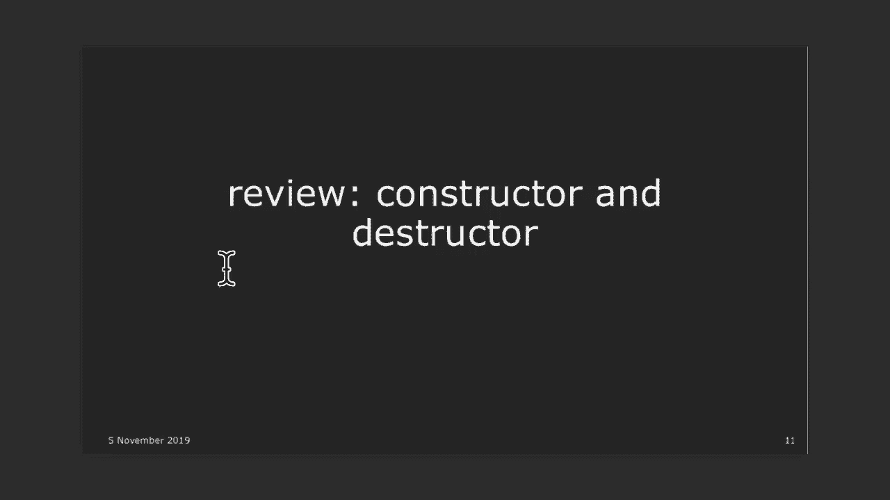
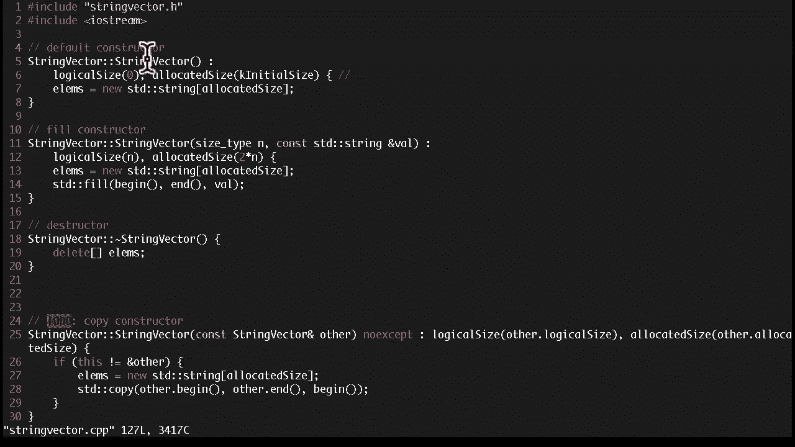
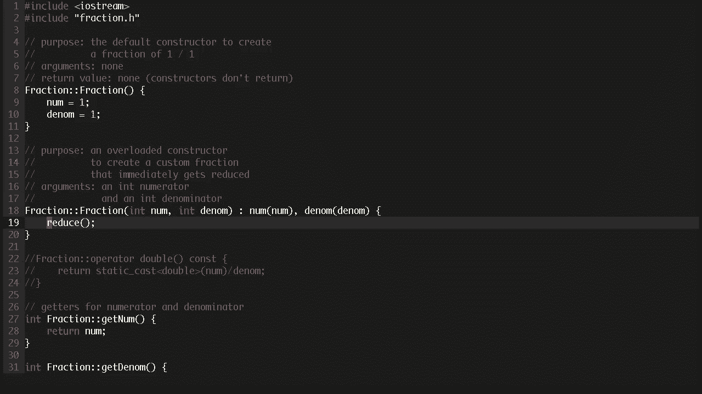
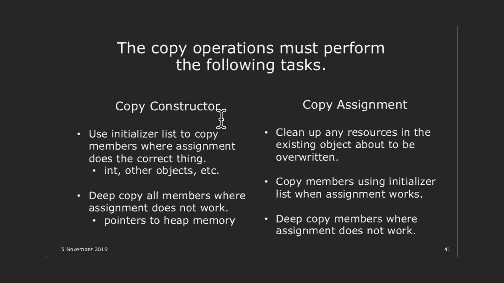
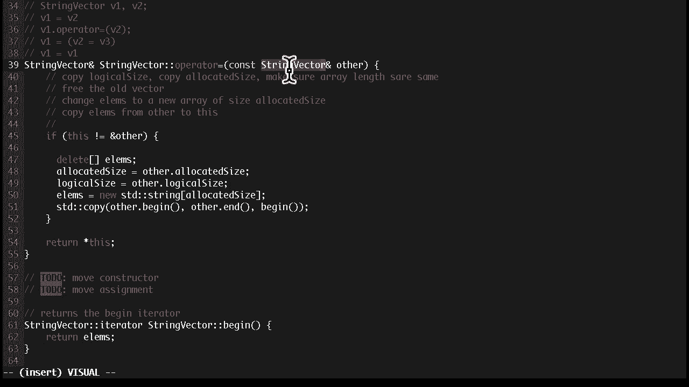
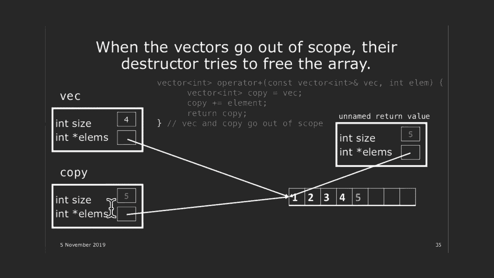
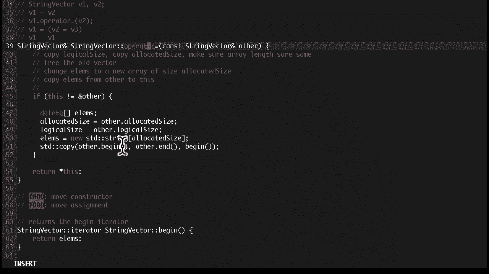

# 课程12：特殊成员函数 🧩

在本节课中，我们将学习C++中的特殊成员函数。这些函数之所以“特殊”，是因为如果你不在类中声明它们，编译器会自动为你生成。然而，编译器生成的版本有时并不符合我们的需求，因此理解如何正确声明和实现它们至关重要。我们将重点讨论与“拷贝”相关的特殊成员函数。

---

## 回顾：运算符重载

上一节我们介绍了运算符重载，它允许我们为自定义类型定义运算符的行为。本节中，我们来看看如何确保这些运算符的行为符合预期。

以下是实现运算符重载时的一些关键原则：
*   **遵守运算符的通常语义**：例如，重载 `+=` 运算符时，应返回对原始对象的引用（`*this`），以保持与基本类型行为的一致性。
*   **保持对称性**：对于二元对称运算符（如 `+`），最好将其实现为非成员函数，以确保操作数被平等对待。
*   **考虑 `const` 正确性**：为可能被 `const` 对象调用的运算符（如 `[]`）同时提供 `const` 和非 `const` 版本。
*   **遵循最小惊讶原则**：确保重载的运算符行为直观。例如，如果重载了 `+`，通常也应重载 `+=`。

---

## 构造函数与析构函数复习

在深入特殊成员函数之前，我们先快速回顾构造函数和析构函数的基础知识。

### 初始化列表






在构造函数中初始化成员变量时，应优先使用**初始化列表**，而非在构造函数体内赋值。

**代码示例：使用初始化列表**
```cpp
class StringVector {
private:
    std::string* elems;
    size_t logicalSize;
    size_t allocatedSize;
public:
    // 使用初始化列表
    StringVector(size_t initSize = 0) : logicalSize(initSize), allocatedSize(initSize + 10) {
        elems = new std::string[allocatedSize];
    }
};
```
使用初始化列表的主要原因有两个：
1.  **`const` 成员和引用成员**：对于 `const` 成员或引用成员，必须在声明时初始化，不能先声明后赋值。初始化列表是唯一的方法。
2.  **效率**：对于类类型成员，使用初始化列表直接调用其拷贝构造函数，通常比先调用默认构造函数再赋值更高效。

**注意**：初始化列表中成员的初始化顺序应与它们在类中声明的顺序一致。

---

## 特殊成员函数：拷贝操作

编译器通常会自动生成四个特殊成员函数：默认构造函数、拷贝构造函数、拷贝赋值运算符和析构函数。本节我们聚焦于**拷贝构造函数**和**拷贝赋值运算符**。

### 拷贝构造函数 vs. 拷贝赋值运算符

两者的核心区别在于调用的时机：
*   **拷贝构造函数**：在**创建新对象**并将其初始化为另一个对象的副本时调用。
    *   例如：`StringVector v2 = v1;` 或 `StringVector v2(v1);`
*   **拷贝赋值运算符**：在**已存在对象**被赋予另一个对象的值时调用。
    *   例如：`v2 = v1;`




### 默认拷贝的问题（浅拷贝）

如果我们不声明自己的拷贝操作，编译器会生成默认版本。默认的拷贝操作执行**浅拷贝**（按成员拷贝）。对于指针成员，这会导致多个对象指向同一块内存。

**问题场景**：
```cpp
StringVector original; // 拥有一个动态数组
StringVector copy = original; // 默认浅拷贝：copy.elems 指向 original.elems 的同一数组
// 当 original 和 copy 析构时，同一块内存会被释放两次，导致未定义行为！
```

### 实现深拷贝

为了解决浅拷贝的问题，我们需要自己实现拷贝操作，进行**深拷贝**，即为指针指向的内容创建全新的副本。

#### 1. 拷贝构造函数

拷贝构造函数接受一个对同类型对象的 `const` 引用作为参数。

**代码示例：实现拷贝构造函数**
```cpp
class StringVector {
public:
    // 拷贝构造函数
    StringVector(const StringVector& other) noexcept
        : logicalSize(other.logicalSize), allocatedSize(other.allocatedSize) {
        // 1. 为数组分配新内存
        elems = new std::string[allocatedSize];
        // 2. 复制元素（使用 std::copy）
        std::copy(other.begin(), other.end(), begin());
    }
private:
    std::string* elems;
    size_t logicalSize;
    size_t allocatedSize;
};
```



#### 2. 拷贝赋值运算符

拷贝赋值运算符重载 `=` 操作符。它需要处理自我赋值，并确保在分配新资源前释放旧资源。

**代码示例：实现拷贝赋值运算符**
```cpp
class StringVector {
public:
    // 拷贝赋值运算符
    StringVector& operator=(const StringVector& other) {
        // 1. 检查自我赋值
        if (this != &other) {
            // 2. 释放旧资源
            delete[] elems;
            // 3. 分配新资源并复制成员
            allocatedSize = other.allocatedSize;
            logicalSize = other.logicalSize;
            elems = new std::string[allocatedSize];
            std::copy(other.begin(), other.end(), begin());
        }
        // 4. 返回 *this 以支持链式赋值 (a = b = c)
        return *this;
    }
};
```

**关键点**：
*   **自我赋值检查**：`if (this != &other)` 防止将对象赋给自己时导致资源被提前释放。
*   **返回引用**：返回 `*this` 的引用以支持连续赋值。
*   **异常安全**：更健壮的实现可能会先分配新内存，复制成功后再释放旧内存并替换指针，以保证异常安全。


---

## 三法则与五法则

C++ 中有一个重要的设计原则：

*   **三法则**：如果一个类需要显式定义**拷贝构造函数、拷贝赋值运算符、析构函数**中的任何一个，那么它很可能需要定义全部三个。这是因为它们通常共同管理着同一份资源（如动态内存）。
*   **五法则**：随着 C++11 引入了移动语义（下节课内容），规则扩展为五法则，增加了移动构造函数和移动赋值运算符。
*   **零法则**：如果一个类不需要管理任何资源，依赖编译器生成的默认特殊成员函数就足够了，这样代码更简洁安全。

### 禁止拷贝

有时，类的设计决定了其对象不可拷贝（例如，表示唯一文件句柄的类）。这时，可以将拷贝操作声明为 `= delete`。

**代码示例：禁止拷贝**
```cpp
class NonCopyable {
public:
    NonCopyable() = default;
    // 禁止拷贝
    NonCopyable(const NonCopyable&) = delete;
    NonCopyable& operator=(const NonCopyable&) = delete;
};
```



---



## 拷贝的代价与优化前瞻




考虑以下函数：
```cpp
StringVector getAllWords() {
    StringVector words; // 局部对象
    // ... 填充 words
    return words; // 返回时触发拷贝
}
int main() {
    StringVector myWords = getAllWords(); // 再次触发拷贝（或移动）
}
```
在这个过程中，可能会发生多次昂贵的深拷贝。编译器会尝试进行**返回值优化 (RVO)** 或**拷贝省略**来避免不必要的拷贝。但我们可以做得更好吗？

一个更高效的想法是“移动”而非“拷贝”：将临时对象（如 `words`）的资源“窃取”过来，直接交给新对象，而无需复制大量数据。这正是下节课要讲的**移动语义**的核心思想。

---

## 总结

本节课中我们一起学习了C++中的特殊成员函数，重点是拷贝构造函数和拷贝赋值运算符。

*   我们理解了编译器生成的默认拷贝操作执行**浅拷贝**，对于管理资源的类（如拥有动态数组）会导致问题。
*   我们学会了如何通过实现**深拷贝**来正确管理资源，包括在拷贝构造函数中分配新内存并复制数据，在拷贝赋值运算符中处理自我赋值和资源释放。
*   我们了解了**三/五法则**，知道何时需要自己定义这些特殊成员函数。
*   最后，我们看到了多次深拷贝可能带来的性能开销，并引出了通过**移动语义**来优化资源转移的概念。


掌握这些知识是编写安全、正确且高效的C++类的基石。下节课，我们将深入探讨移动语义，学习如何让我们的类“移动”而非“拷贝”，从而进一步提升性能。