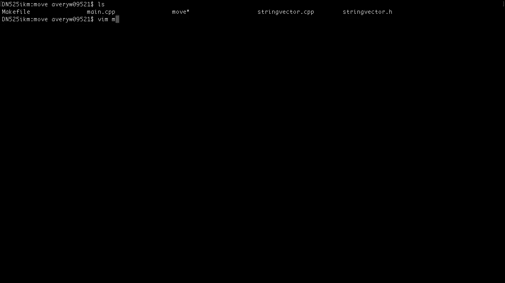
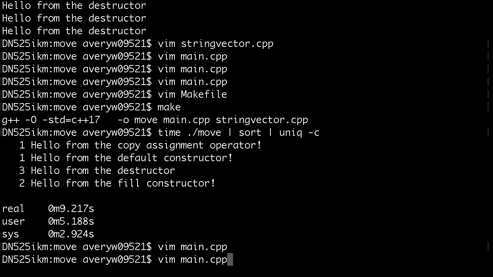
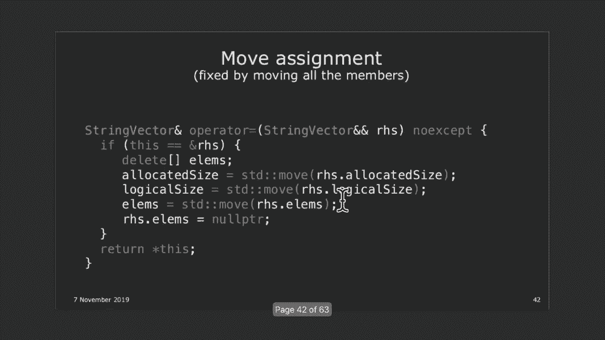
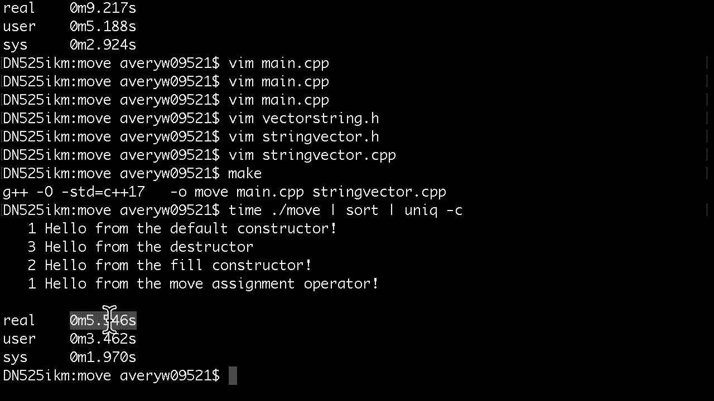

# 斯坦福大学《CS106L： C++编程｜ Stanford  CS106L C++ Programming 2019+2020》中英字幕（豆包翻译 - P14：[20]CS 106L Fall 2019 - Lecture 13_ Move Semantics (Screencast) - GPT中英字幕课程资源 - BV1Fz421q7oh

不，不是那个。CS106L。好吧，我的文件组织几乎为零，所以一片混乱。移动，move。pdf，好了。

然后，代码，就这样。这些我们不需要。我应该从 mplaceback 开始吗？好吧，我从 mplaceback 开始。好，所以，大家好。欢迎回来。今天我们要讨论移动语义，这可能是我讲过的所有讲座中。

最酷的一门。这是一个非常现代的话题。这个特性是九年前才出现的。八九年前。所以，这是一个非常现代，非常新的话题。我喜欢它的原因是它 encapsulates C++ 最大的哲学之一，不要牺牲效率。

尽可能快和高效。好吧？所以，移动语义会涵盖这些内容。但首先，我想快速插入一个旁注。所以，今天我们要讨论一个叫做 L 值和 R 值的东西。顺便说一下，上次我说这是一个很难理解的概念。大家准备好了吗？

大家都带上了最佳状态了吗？今天大家都还好吗？好。我昨晚睡了 10 个小时，所以我准备好了。当然。当然。好了，我们都准备好了吗？我们都没缺觉吗？好。是的，那么我们将讨论移动构造函数和赋值，它们是拷贝构。

造函数和赋值的亲戚。然后我们会讨论一个叫做交换函数的东西。所以，我们将实现一个交换函数，这个交换函数是一个非常，好的交换函数。不是你通常写的那种普通的交换函数，而是一个非常非常，好的交换函数。

不会产生额外的拷贝。然后，如果有时间，我们会讨论完美转发。虽然在制作幻灯片时，我做了两张幻灯片，然后我觉得，我，们永远不会到这一步，所以我停下来了。但如果有时间，我会讲的。这非常非常非常酷。

但我没有幻灯片。所以，我就直接打代码。酷。在我们谈论这个之前，我想讲一下 mplaceback。

所以，如果你去 CPP reference，你会看到在 vector 中，vector 中有两个非常相似的方法。一个叫做 pushback，另一个叫做 mplaceback。

有没有人用过 mplaceback？这是一个很奇怪的函数。所以，pushback 就是你想的那样。所以，pushback，我直接打开 pushback。Pushback，基本上，它接受一些值。

这是一个模板类，Anna 下周会讲到。但本质上，你只需输入你的值，它就会被添加到 vector 中，这就是你在整个 1。6b 中一直在做的事情。但是 mplaceback 有一个非常奇怪的参数，arg。

两个 &，然，后后面跟着三个点。我们不会讨论这三个点。这叫做变参模板。我们本来打算讲的，但三周前时间不够所以停了。这叫做变参模板。基本上，这个函数接受一个可变数量的参数。它不仅仅接受两个参数或三个参数。

你可以输入任意数量的参数。现在，这里特别的是两个 & 符号，今天我会讲解这个。但我只是想简单地谈谈 mplaceback 是做什么的。mplaceback 解决了一个奇怪的问题：如果你想将某个东西。

添加到向量中，通常你可以直接将那个值放进去，这样就完，成了。例如，如果你有一个患者的向量，你如何将一个患者添加到，向量中？你会创建一个患者对象，然后调用 vector。push_back 来。

添加这个患者。但问题是，想想你要创建多少个患者对象。你必须首先创建一个患者对象。然后你必须把它放入向量中，这样就会创建另一个副本。这有点低效。为什么在将患者放入向量之前必须先创建这个虚拟的患者。

mplaceback 的作用是，你不需要创建患者对象本身，而是，可以传入创建患者所需的参数，然后向量会直接在向量内，原地创建患者对象。好吧，这有点长。让我再重复一遍。通常。

当你有一个患者并且想将它添加到向量时，你必须首，先创建一个患者对象，然后在那个患者上调用 push_back，这样就会在向量中创建另一个患者对象。现在你有两个患者副本。你有原始患者。

然后你还有一个在向量中的副本。这些是分开的。明白吗？但问题是，如果你只是将患者添加到向量中，并且你不真的，需要那个最初的患者，那么为什么不让向量直接在向量内，创建患者，而不是从最初的向量开始？

你如何初始化一个患者？你给它一个优先级和名字。与其创建一个虚拟的患者对象并将其拷贝到向量中，不如，直接将名字和患者传递给向量，然后向量会在其中直接创，建患者对象。关键点是这里没有额外的拷贝。

这就是 emplace_back 的作用，它接受可变数量的参数，因，为你传入了调用构造函数所需的所有参数。对于患者的向量，你需要传入名字和优先级。很酷，对吧？这基于一个整体的哲学。如果不需要额外的拷贝。

就不要创建额外的拷贝，这就是 ，emplace_back 的作用。如果你看这里的例子，我们有一个总统的向量。我正在找 emplace_back 的位置。在这里，你可以看到。为了创建。

我们有一个总统的向量，总统有名字、国家和年，份。一种将总统推入向量的方法是你可以调用构造函数，这会，创建一个对象，然后将该对象传递给向量，这样向量会再创，建一个副本来放入向量中。相反。

你可以直接传入创建总统所需的参数，将其传递给向，量，向量会在向量内直接创建总统对象。我只是想简要提一下。如果我们在最后谈到完美转发时，我们可以解释如何实现，这一点，但我们不会涉及到这一点。

所以我只是提一下。emplace_back，就是这样工作的。有问题吗？就可读性而言，当你在扩展项目时，如果我是一个新开发者，我读到这些内容，我很难立刻理解你正在创建的这些对象。

以及这些是总统对象所需的所有参数。这在行业中被认为是最佳实践吗？当然，是的。这在行业中确实被认为是一个很好的实践，因为你可以看，看 elections 是什么，然后你可以弄清楚它的类型，这会。

告诉你需要传入哪些参数。这么做的原因并不是为了可读性。而是为了提高效率。想象一下，不是一个总统对象（只是一个小的结构体），而是，一个巨大的向量。替代的方法是创建这个巨大的向量，复制它，并将其放入向。

量中。而我们要做的是直接通过传递给该向量的参数来创建这个，巨大的向量。我不想在这上面花太多时间，但这只是一个 FYI。这就是为什么这种方法存在。直到最近我才理解这种方法，但这是一个非常酷的函数。

通常对于一个 int 的向量，因为 int 不需要构造函数，你，只需传递 int 就可以了。对于 int 的向量，pushback 和 emplaceback 完全一样。但对于较大的对象。

emplaceback 的作用是获取参数并将，其转发给构造函数，构造函数会在向量中创建对象。这个思想被称为完美转发。它是为你将参数转发给构造函数。我们不会详细讨论完美转发，因为我们没有时间。

但 FYI ，它存在，而且这就是使这个函数更高效的原因。有问题吗？当你说 emplaceback 对于 int 时，你的意思是 pushback， 和 emplaceback 之间没有区别？是的。

因为对于 int 来说，效率上没有太大区别。只是你复制 int，然后将它放入。你必须复制，对吧？是的，没错。你说的这个 forward byte 复制或其他东西并不重要，对，吗？确实不太重要。

因为对于 int 来说，int 其实。int 的构造函数，你传入一个 int，然后得到同样的 int。int 的构造函数实际上没有做太多事情。它只是接收一个 int 并返回一个 int。

对于 int 来说，这并不重要，但对于构造函数需要不同参，数的较大对象来说，这就是 emplaceback 发挥作用的地方。

。功能上，emplaceback 和 pushback 是不同的东西吗？

完全一样。这只是解决了一个非常烦人的问题，有时你可能。让我们考虑 n-gram。对于 n-gram，你必须创建一个初始向量，然后将其放入 ，map 中。相反，想象一下，如果你可以跳过初始复制。

直接在 map 中，创建它。

我不想在这上面花太多时间，因为这并不是特别重要，但我，只是想说这种方法存在。转到语义部分。上周，我们简要讨论了特殊成员函数。默认构造函数、复制构造函数、复制赋值函数和析构函数，上次。

我们为 string 向量实现了构造函数和析构函数。你们应该都知道如何做这一点，从 1。06b 中学到的。我们简要讨论了拷贝构造函数和拷贝赋值运算符的作用，并且我们实现了它们。关键思想是。

如果你有一个指针，它自己拥有对数组的唯一，所有权，你不能仅仅复制指针，因为那样两个指针都会指向，同一个数组。相反，你必须对那个数组进行深拷贝，这就是这里所做的。我们正在创建一个完全独立的数组副本。

并将所有元素复，制到那个新数组中，以便如果你修改其中一个数组，另一个，向量的数组不会被改变。对于拷贝赋值运算符，一切都是一样的，只有两个例外。一个是你必须记住释放旧对象的资源，因为你要覆盖它，所。

以你必须确保释放那个对象中的资源。基本上，这就是析构函数的作用。然后你还要确保不要自我赋值。如果我将 A 赋值给 A，那应该是有效的。A 应该什么都不做。我们简要讨论了三法则。

然后我们快速谈谈复制的问题。我上次简要讲过这个，但这是一个挑战。看看这段代码，并与伙伴讨论一下。告诉我每个特殊成员函数被调用了多少次。一共有四个特殊成员函数。在这段小代码中。

字符串向量的这些特殊成员函数被调用，了多少次？然后我们实际运行代码，看看你是否正确。我给你一分钟时间。和伙伴讨论一下。考虑每个函数被调用的次数。哦，有或者没有。假设没有拷贝消除。如果你不知道那是什么。

完全没关系。只是假装它不存在。哦，对不起。这不是查找所有单词。是查找名称。是的，对不起。完全忘记了这个。是查找名称。读取名称。好，好。

你知道吗？这太难了。我就这样做吧。

Main。cpp。好了，这就是函数。用这个代替。

一，我的错。二，读取。是什么？好了，做这个。

然后将名称两个等于读取名称。就这样。特殊成员函数被调用了多少次？好了，有人有答案吗？

不确定？好的。这很棘手，但让我们检查一下答案。只是为了给你展示现在发生了什么，我进入了 string ，vector。cpp。

注意在所有这些构造函数中，我写了这行代码。来自默认构造函数的问候。来自填充构造函数的问候。来自拷贝构造函数的问候。以及来自拷贝赋值运算符的问候。实际上，我得先注释掉这个。这是我们今天要写的。

但我得先注释掉它。

好的，然后在 string vector。cpp。h 中，我们有特殊成员。

函数，忽略这两个。

好的，所以我要运行这个命令。哎呀，我得先运行 make。好的，然后我要运行这个命令。不要担心它做了什么，但它基本上只是计时一切，同时还会，计算每个函数被调用的次数。好的，我还缺少一件事。好的，稍等一下。

这本来不应该发生的。

好，然后我告诉你忽略拷贝消除，所以我要写，好吧，不要做。

拷贝消除。我要把这个改为 C++11。好，酷。再试一次，我们就叫做 move。好，所以有一个填充构造函数。有一个拷贝构造函数。有一个析构函数，拷贝构造函数，默认构造函数，填充构造，函数，拷贝构造函数。

析构函数，拷贝赋值，析构函数，析构，函数，析构函数。我们完成了吗？好，我们来了。这就是所有被调用的函数，我们来看看。我不想再运行命令了。好，但是看看每个函数被调用了多少次。析构函数被调用了六次。哦。

是的，所以填充构造函数不是一个特殊成员函数。它只是这个构造函数，vector。cpp。

就是这个构造函数。它不是默认的构造函数，但它只接受元素数量和默认值。它是这里正在使用的构造函数。这里正在使用的构造函数。好，所以这就算了，好吗？所以我们调用 read names，这里调用了。

这里调用了什么构造函数？填充构造函数，好。这里发生了什么？我们返回 names。是的，我们必须调用拷贝构造函数，因为当你返回一个值时，你在创建一个该局部变量的拷贝。names 只存在于局部变量中。

但你必须创建一个拷贝以便，在主函数中出现。所以我们调用了拷贝构造函数。这里发生了什么？我们将 name one 设置为这个向量的值。好，这是一个拷贝构造函数，记住，因为这本身是在构造一，个新对象。

所以即使你看到一个等号，这实际上是一个拷贝，构造函数。好，有问题吗？是的。是的。是的，好点子。好，所以在拷贝构造函数发生后，names 被销毁，这就是为。

什么你最初看到的时候，看到填充构造函数、拷贝构造函，数，然后这个析构函数说，好吧，names 的局部变量已经消。

失了。好，我们继续。read names，所以它读取了某些数量的名字。这是一个向量。这是一个拷贝构造函数，因为我们正在构造 V1。这里调用了什么？默认构造函数，好。好。

然后我们再次调用 read names。同样的事情在这里发生。我们调用了填充构造函数。我们调用了拷贝构造函数。然后我们对 names 调用了一个析构函数。这现在是一个向量。这里发生了什么？拷贝赋值。

因为 name two 存在，所以我们用这个新的向量，替换 name two 中的内容。好，最后，在最后发生了什么？所以 name one 消失了，name two 消失了。好，总共六个。哦，对了。

此外，这在技术上也是一个向量，所以一旦这一行，结束，这个对象就消失了，所以你也必须对这两个临时对象，调用析构函数。好，这有意义吗？所以总结一下，所有六个析构函数在哪里？第一个析构函数在哪里调用？是的。

在 return names 后，这个已经消失了。第二个析构函数在哪里调用？是的，所以当这个临时对象消失时，我们对那个临时对象调，用了一个析构函数，所以有两个。第三个析构函数在哪里？是的。

在返回 names 时，我们必须调用 names 的析构函数，所以有三个。第四个在哪里？好吧，renames，这是一个临时向量，所以这行代码执行完后，那个向量也会消失，所以有四个，第五个和第六个在哪里？

是的，name one 本身就是一个向量，name two 是一个向量，你必须析构全部六个。明白了吗？

酷，对吧？好吧，我们做了多少次拷贝？这很多拷贝。一、二、三、四。我们做了四次拷贝。好吧，这有点让人失望。我们能做得更好吗？上次，我简要介绍了一个叫做拷贝省略的东西，基本上就是，当你返回一个值时。

有时编译器能够跳过那个拷贝构造函，数。它知道你会返回一个向量，因此当你在内部声明那个向量，时，当你最初声明这个 names 向量时，它知道你会返回它。

因此当它创建向量时，会直接在这里创建它。明白了吗？好吧，如果我启用拷贝省略，我们就忽略这个，然后把它改，为 C++17。顺便说一下，在 C++17 中，拷贝省略是有保证的，所以你的。

编译器会基本上为你加速代码。你甚至不需要要求它这样做。我们这样做，然后，实际上，让我们这样做。好吧，然后这做了相同的事情，只是它计时，并且基本上汇，总了一切，所以它计算每个出现的次数。好吧，完成了。

所以这花了九秒钟，它调用了拷贝赋值一次。它调用了默认构造函数一次。它调用了三个析构函数，并且调用了两个填充构造函数。你在这次运行中注意到了什么？好吧，半数的析构函数消失了，这意味着一半的构造函数也。

消失了。哪一半构造函数消失了？是的，拷贝构造函数消失了，具体来说，是返回 names 的拷。

贝构造函数消失了。返回 names 本身必须做一个拷贝以便将本地的拷贝到这，里，但由于拷贝省略，编译器足够聪明，知道当你创建这个，向量时，它只是直接在这里创建这个向量，所以你不需要做，拷贝。好吧。

这样会有显著的加速效果。

我认为之前的时间大约是 16 秒。现在是 9 秒。好吧，今天，我们要做得更好，那么这里的哪一部分可以做，得更好？我们可以做得更好的部分是拷贝赋值。好的，因为注意这里，你会发现应该仍然有一个拷贝构造函。

数。好吧，所以我想它也，哦，它跳过了一个拷贝构造函数。

好吧，我想它跳过了这个拷贝构造函数，因为它知道你会赋，值。好的，关键部分是我们如何改进这一行？好的，因为这本身就是一个向量。读 names，这本身就是一个向量。这是相同的向量，但你只是移动。

实际上是将这个向量拷贝，到 name two。所以你现在有两个向量的拷贝。这有点让人失望，因为这个向量将在下一秒钟就会消失。这是一个临时向量，它将被返回，但它会在这行代码执行完，后就消失。对。

析构函数将被调用。那么为什么我们还要拷贝所有东西呢，如果这个向量实际，上会消失呢？我们能否将这里的内容直接放入新的名称二，而不进行任，何复制？好吧，这就是今天的目标。大家到目前为止都跟上了吗？

这非常重要，明白了吗？你可以看到，为什么这是一个临时对象，它会在下一秒就消，失。所以，我们为何不直接将这里的所有内容移动到名称二呢？反正它都会消失。

好吧，但是问题是，简单问一下，假设我稍微改一下代码，让。

它变成这样。所以我本质上是把它捕获到名称三中，然后让名称二等于，名称三。所以这完全是一样的代码。不是把这行放在这里，而是放在一个单独的变量中。好吧，这里。我们还能尝试将名称二中的内容转移到名称三中吗？

我们可以转移它，并将它放入名称三中吗？为什么不呢？嗯，是的。为什么不呢？嗯，是的，没错。因为这里的名称三，我们可能还想用它做其他事情，对吧？这不是一个临时值。这有点不同，因为在这行代码完成后。

名称三仍然存在。它仍然是一个有效的向量。所以我们不能只是偷走它的向量，然后将它放入名称二中，对吧？这个例子，与另一个例子不同，在那个例子中，这个向量反，正会消失。所以我们可以安全地从中偷取。

它会在下一秒就消失。好吧，所以现在的问题是，如何区分这两者？一个是临时向量，所以我们可以安全地从这个向量中偷取，另一种情况是，另一个向量不是临时向量。它是一个仍然可以使用的实际向量。我们不能从中偷取。

我们如何区分这两者？

好吧，我们将讨论一个叫做 L 值和 R 值的东西。好吧，这是一种对超级复杂主题的粗略简化。如果你和任何 C++ 专家交谈，他们会非常生气，如果你试，图向他们解释这些内容。好吧，这是一种非常粗略的简化。

但问题是，这足够让你编写良好的代码。你不必了解 GL 值、PR 值、X 值等语义。我们不会讨论所有这些。我们将讨论两个非常简单的类别。所以，简单定义一下。L 值是一个有名称和身份的表达式。

因为它有名称和身份，你可以使用取地址运算符找到这个，值的地址。而 R 值是一个没有名称或身份的表达式。这些是临时值。好的，因为它们是临时值，你不能使用取地址运算符找到它，们的地址。明白了吗？所以。

直观上，这不完全准确，如果你想要精确的解释，但直，观上，你可以理解为 L 值是可以出现在等号左右两边的，而 R 值只能出现在等号的右边。明白为什么 R 值不能出现在左边吗？好吧，如果你有一个临时值。

你不能将那个临时值设置为某，个值。好的，例如，如果你写了整数三，那么这个三没有被分配给，任何变量，所以它就像一个临时值。你不能把三分配给某个东西。这没有任何意义。好的，快速举几个例子。好的。

这些会越来越复杂。明白了吗？所以，我想让你们看一下等号两边的内容。它们是左值还是右值？好的，第一个。二，是右值还是左值？右值，对吧？这是一个临时值。它没有地址。二没有地址。所以，这是一个右值。

那val呢？左值，对吧？因为val有一个名字val，它也有一个地址，对吧？你可以用取地址符ampersand val来获取它的地址。大家到现在为止都明白了吗？好的，下一个。这个奇怪的地址。

是右值还是左值？右值，对吧？所以，这也是一个临时对象。在这一行之后，我不能重用这里的内容。而且，即使这是一个地址，你也找不到那个地址。那个表达式。它和这边的是一样的。你不能找到二的地址。

因为二不是实际存在于内存中的东，西。所以，你也找不到这个地址。什么是指针？左值还是右值？左值，对吧？因为，你能找到指针的地址吗？是的，你可以，对吧？只需用取地址符ampersand pointer即可。

你将得到指针存在的地址。好的，一、二、三。这些是右值。什么是V1？左值，对吧？因为它有一个名字。它有一个标识。现在，变得非常棘手。什么是V1？V1是左值还是右值？V1是左值。让我为录音重复一遍。

V1是左值，因为它有一个名字，有一个标识。你可以找到V1所在位置的地址。V2也是一样。什么是V1加V2？左值还是右值？右值，对吧？V1加V2返回一个向量，但这个向量是一个临时值。它只是浮动的。

它只是一个由函数返回的值。它实际上并不存在于内存地址中。V1加V2是一个右值。这是一个临时值，在下一行就会消失。想一想。除非V4是它的副本，否则你无法访问这一行中的V1加V2。什么是V4？左值。

快速提示一下，基本上这里左边的所有内容都是左值。V1加等于V4？左值。那V4呢？左值。好的。Size underscore TE。Size等于V点size。什么是size？左值，对吧？它在左边。

它有一个名字，有一个标识。什么是V点size？V点size是一个右值，因为V点size是一个临时值。它是一个由函数返回的整数，但这是一个临时值。它不存在于任何地方。你找不到它的地址。好吧，非常非常棘手。

大小。什么是大小？L 值。大小有一个名字，有一个身份。什么是大小，但你将它强制转换为 int 呢？这是一个 R 值，对吧？因为这是大小，但你将它强制转换为另一种类型。

但那个用新类型的表达式没有自己的内存地址。所以这是一个临时值。这是一个 R 值。明白了吗？好。Val 是一个 R 值，当然。四倍 I 是什么？R 值，对吧？I 本身是一个 L 值，但如果你将它乘以四。

那么没有内存，地址存储值四倍 I，所以这是一个 R 值。这是一个 R 值。基本上，如果你不能给它一个名字，比如你不能给它一个变，量名，那么它就是一个 R 值。V1 括号 1 是什么？L 值还是 R 值？

所以你知道这是一个 L 值。为什么这是一个 L 值？这是一个常见的误解。如果这是一个函数返回的值，比如这里的 V。size，V。size ，是一个 R 值，但 V1 括号 1 是一个 R 值。

但它们都是由，函数返回的东西。为什么？是的，V1 括号 1 是一个 L 值。为什么 V1 括号 1，作为一个函数返回的东西，为什么是一，个 L 值，而 V。size 为什么是一个 R 值？是的。

所以括号操作符，如果你记得的话，它返回的是一个，引用的元素。不是字符。它返回的是通过引用的元素。所以因为你是通过引用返回的，每次你使用 V1 括号 1，你，都在引用一个实际的变量。

你在引用向量中的一个实际字符串。所以这是一个 L 值。但 V。size，它返回的是 size_t，而不是 size_t &，所以它，返回的是一个临时值 size_t。最后几个。Val 的地址。

R 值还是 L 值？R 值，对吧？这是一个地址，但地址本身没有地址。你不能说 &val 等于某个东西。这只是设置一个地址。你不能这样做。你不能说 &val 等于某个东西。指针是一个 L 值。

如果你取消引用某个东西，好吧，哦，这，很棘手。什么是 &pointer？L 值还是 R 值？所以我听到的是一个 L 值。有投票支持 R 值吗？快速问题。你可以做 *pointer = 某个东西吗？

这有效吗？是的，对吧？你只是取消引用并将当前值设置为另一个值。所以指针的地址，那是一个 L 值，是的。我们应该只用左值和右值吗？好吧，L 值。好吧，这为什么重要？哦，这里是答案，以防你想检查。好吧。

我们将跳过为什么重要，直到下一张幻灯片。好吧，现在有一种叫做 L 值引用和 R 值引用的东西。所以之前，我们谈到过一种叫做 L 值引用的东西。L 值引用是对 L 值的引用。之前，当我们做这个事情时。

pointer2 基本上是 pointer ，的另一个名字。你可以改变 pointer2，它对 pointer 做相同的事情。这有意义吗？我们已经看过很多次了。当你通过引用传递时，这就是它的工作方式。

你在创建对原，始变量的引用。你对 pointer2 所做的任何更改都在改变 pointer。到目前为止明白了吗？我们暂停一下。此时有任何问题吗？因为如果我们现在不解决任何概念问题，会变得越来越混，乱。

所以现在有任何问题吗？你想让我重新解释什么吗？有人在打瞌睡吗？好的。现在的问题是，你不能将左值引用绑定到右值。左值引用仅绑定到左值。但你可以将右值绑定到右值引用。这叫做右值引用。

它的作用基本上是延长这个的生命周期。这个通常应该在下一行就消失了，但通过将右值引用附加，到这个，你基本上延长了它的生命周期。对 V4 进行的任何更改都会改变你对象的临时值。明白了吗？是的。

所以双与号表示这是右值引用，而不是左值引用。我在这里使用 auto，但你可以使用类型本身。所以你可以这样做，这将是一个 int 星号与号。这将是一个向量 int 与号与号。好的？酷。这不行。

因为这是一个右值。你不能将左值引用绑定到右值。类似地，你不能将右值引用绑定到左值。不过，你可以做一个奇怪的例外，你可以将一个常量左值引，用绑定到右值。好的？如果你这样做，你会经常看到这个错误。

你可能之前见过这种情况，如果你尝试将一个临时右值传，递到这里，如果你将其作为左值传递给左值引用，这不会编，译。这第四行不会编译。但如果你将其作为常量引用传递，那就会编译。有没有人见过这个错误？好的。

这在凯斯的下一季度更常见。是的，因为凯斯真的很喜欢临时值。所以凯斯在下一季度你会看到很多这些错误，但在本季度，不会。好的，但回到之前，嗯，你可以将常量左值引用绑定到临时，值。这为什么有意义？

为什么非 const 左值不起作用，但常量左值可以绑定到右，值？有什么猜测吗？是的，说说看。如果是非 const，那么当你修改左值时，你会为所有地方修，改它。你不是说，你应该为所有地方修改它。而常量。

无所谓它技术上是一样的，因为你反正不会修改它，对，完全正确。所以在这里，如果我们可以修改 V 是不合适的，因为如果，我们在这里修改 V，那么我们就修改了这个临时表达式。好的？除非你明确说，是的。

我想要临时表达式，并且我确实想要，修改它，那么它就允许你。好的？但如果你只是说，哦，我只是想要一个常规左值，那么这将，不起作用。但如果它是常量，那么你可以修改它，因为即使它是临时值，但你反正不会改变它。

所以这没问题。好的？好吧，我们为什么要在乎？让我暂停一秒钟。到目前为止有任何问题吗？这非常重要。是的，有问题。我想，我的问题是，所有这些分析是否都是为了提高效率？因为到目前为止在我的 C++ 程序中。

我从未考虑过这些，但也许我通过忽视一些特定情况而没有使我的代码尽可能，高效，例如何时某个东西是 L 值还是 R 值。但是否还有其他的考虑？是的，正是如此。这正是我们接下来要讨论的内容，即移动操作。

这个概念是，R 值是临时值，所以它们很快就会消失。你可以窃取它的资源。听起来真的很黑暗。听起来真的很黑暗。是的，临时值不再存在了，所以你可以随意获取它的资源。但如果它是 L 值。

那意味着那个地址有一个名称，有一个，身份，这意味着其他人可能会在之后使用它，这意味着你不，能从 L 值中窃取资源。你可以从 R 值中窃取资源，但不能从 L 值中窃取资源。因为 R 值会很快消失。

所以你可以从中窃取资源，没问题，是的，这与 C++ 的一个核心目标有关，即允许程序员拥有，尽可能大的控制权，并允许他们编写高效的程序。你可以想象效率可能很重要。

人们通常将 C++ 用于像嵌入式设备这样的东西，在这些情，况下，效率确实是一个重要因素。但正如你所说，你可能已经注意到，在你编程 C++ 的整个，过程中，你从未真正担心过移动语义或类似的东西。是的。

这是一个非常高级的 C++ 话题。大多数 C++，斯坦福的大多数人都不知道什么是移动语义，这个概念是在八年前刚刚发展的。好的，很好。另一种说法是，L 值是不可丢弃的。它有一个名称，有一个身份。

它不是一个可丢弃的值。你不能从它那里窃取资源。而 R 值是可丢弃的。R 值是一个临时对象。它很快就会消失。所以你可以获取它的资源。你可以从中窃取东西。另一种说法是，你可以从 L 值中复制。

但不能从 L 值中移，动。而对于 R 值，你可以选择复制或移动，最好是移动。获取它的资源比查看它拥有的资源然后自行复制要便宜。这有意义吗？好的。今天我们将介绍两个新的特殊成员函数，移动构造函数和。

移动赋值函数。注意关键区别。复制构造函数从现有的 L 值创建一个新对象，而移动构造，函数从现有的 R 值创建一个新对象。因为这是 R 值，移动构造函数可以将 R 值中的东西移动，到自身。

而不必担心 R 值。明白了吗？如果明白了，请点头示意。到目前为止有任何问题吗？如果没有，我们将开始编程。好的。所以函数签名看起来是这样的。我只是添加了这些，然后添加了异常处理来确保，我们不会，抛出异常。

但我做了一些研究。显然你不需要它们。我不是很确定。我不认为你需要它们。但它们本来不应该抛出异常，所以我只是把它放在那儿。很好。所以注意移动构造函数、拷贝构造函数和赋值运算符，它。

们接受的是 const L 值引用，但移动的接受的是普通的 R， 值。很好。所以移动构造函数的关键步骤。它是一样的，只是我们不是复制所有元素，而是将所有内容。

移动过去。好。例如，想一下 vector 内部发生了什么。实际上，让我打开 string vector。h。让我取消注释这些。

。这两个函数是我们要写的。

vim string vector。cpp。

好。不管怎样，我们要写这个函数。实际上，我已经写好了，所以我们来看一下。好。特别之处在于，让我们看看，移动构造函数。好，所以注意到，哦，抱歉，我跳过了一个步骤。对不起，大家。这个不应该在这里。好。

所以这是你如何实现这样的东西。你会说，好，elements 是一个指针。我们只需复制那个指针。逻辑大小，复制逻辑大小。已分配，复制已分配。基本上，复制所有内容。为什么在这种情况下是移动？

因为我们不是像之前那样创建新的数组，而是把其他拥有，的指针复制到自己身上，然后我们说，好，其他，这个数组现，在不属于你了。把它设置为空指针。好，明白了吗？关键区别在于。

我们不是创建一个新指针并复制所有元素，而是从其他那里偷走指针，这个数组现在是我们的了。好。我有一个动画，但它是为了赋值运算符的，所以让我先讲讲，赋值运算符的。这些在哪里？烦人的事情是。

我不得不在稍后重新输入这些，因为接下来，就是这些，所以我必须删除这些。好，所以移动赋值运算符也做同样的事情，不过你必须进行，额外检查，这意味着你必须首先删除，必须删除被擦除的 。

string vector 的数组。我们覆盖了 elums。我们复制一切，复制指针，然后 RHS 就没有指针了。

让我做个模拟。所以，在之前我们有这个，这个，哦，这不是未命名返回值，这是其他。很抱歉，我复制了幻灯片，忘记更改它，不过这里，好，所以，我们做的是，首先删除旧向量拥有的东西，对吧，这一行做。

的就是这个。

我们复制逻辑大小和分配大小到 words，然后我们复制指，针，这个指针现在指向这里，然后我们说，好，其他，这个数，组不属于你了，把那个指针设置为没有指针，现在你的这个，向量对这个向量拥有唯一的所有权。

我们没有复制任何东西，我们只是把所有东西移动过去。所以，这是那个代码。是的，这是那个代码。好，这还不是完美的，还有一个问题。实际上，有人能看到这个问题是什么吗？这真的把所有东西都移动了吗？

还有一些副本被创建了，不是向量本身，不是数组本身，而，是其他东西被复制了。你能看到那是什么吗？是的，嗯哼。对不起，我听到有人说话了。他说了什么？是的，嗯哼。这些都是拷贝，对吗？好吧，你可能会觉得，好的。

这是一个 int，所以拷贝一个 ，int 没什么大不了的。拷贝一个指针，好吧，这也没什么大不了的，但这些都是拷，贝。如果我们有一个更极端的例子呢？所以，让我们看看另一个类。

另一个名为 Access 的类。它有一个学生的向量，然后如果我们想进行移动操作，我们，会这样做。Students 等于 rhs。students。这是一个拷贝。这个等号是一个拷贝。为什么这是一个拷贝？

我觉得我有点跳过了，但问题是，这是一个拷贝，因为 ，rhs。students 是左值还是右值？这是右值吗？这是左值。它有一个名字，有一个身份，有一个内存地址。非常混乱的是，尽管我们说好的，这是一个右值。

我们说 ，rhs 绑定到一个右值，但 rhs 本身是左值。这有意义吗？Rhs 绑定到一个右值，所以无论 access 传递进去的是什，么，那是一个右值，但在这个函数中，rhs 有一个名字，有一，个身份。

它是左值。当你做这样的事情时，这会生成一个拷贝，这是不对的。在这里的例子中，rhs 在我们的向量中，这个是左值，所以，所有这些都是拷贝。在这里更严重，因为我们实际上是在拷贝所有学生，那么我，们该怎么办？

如果这只是一个右值，那么这将是一个移动操作。有任何想法吗？你怎么把它变成右值？你可以将其强制转换为右值，这就是 move 函数的作用。Rhs 是一个左值，但我们希望它成为一个右值，这样当你做，等号时。

学生将被拷贝过来。在这里我们希望这样做，我们这样做 std move。move 做的是它接受你传递的任何参数并返回右值。它无条件地将变量强制转换为右值。这现在是一个移动操作，因为无论这个类看什么。

它都会说，哦，是的，无论你正在做的拷贝赋值，那拷贝，即你传递的 ，rhs 是一个右值。这有意义吗？最令人困惑的部分是为什么这是一个左值？这不是右值引用吗？右值引用绑定到一个右值，但右值引用本身是左值。

因为它，有一个名字，它有一个身份。move 做的就是它基本上覆盖了这一点，它说把它当作临时，值对待。这意味着如果你对任何东西调用 move，你应该不要再使用，你调用了 move 的那个东西。

你把它当作临时值对待。我们假设在这段代码之后，我们不再使用 rhs 了。那就是那段代码。

让我快速修改一下代码。唯一的区别是你必须在所有这些地方添加 std move，以确，保你移动了它们所有。从技术上讲，这些是 int 值，所以这没有太大区别，但每当，你编写需要拷贝其他成员的代码时。

你必须确保对它们所，有调用 move。在这里你必须对它们所有调用 move。有任何问题吗？

有趣。让我们看看它快了多少。请不要有编译错误。是的。它会非常快。什么？好的。够好了，够好了。看，相比于九秒，现在是五秒。大约是原来的一半。有人看出为什么大约是原来的一半吗？

最初我们使用填充构造函数创建了向量。我们做了它的一个副本。实际上我们创建了两个不同的向量。现在我们只有一个，因为我们创建了向量然后将它移动了，时间大约减半了。明白了吗？

现在，在接下来的两分钟里，你们的任务是编写一个名为 ，swap 的函数。哦，我将在最后做后续的工作。交换。我希望你们编写一个名为 swap 的函数，它接受两个参数，并交换它们。例如，这里我们有 v1。

我们有 v2。这些是巨大的向量。交换后，v2 应该包含大量的 ends，而 v1 应该包含大量的， etos。我不认为我在讲座中曾经大声说过这两个词，但确实是这，样。你会怎么写这个？与伙伴讨论一下。

考虑一下你会怎么写。代码有三行长。如果你卡住了，就假装你不知道任何关于右值的知识。如果你只是要天真地交换它们，你会怎么做？从那里开始，然后看看你是否能做得更好。好的。

好吧。我看到你们中的一些人真的很累，特别是后面的那些人。我们快速写出代码。如果我们没有任何关于移动语义的知识，这会是什么样的？有没有志愿者？好的。在我讲到这一点之前，你们说得完全对，但在我讲到这一点。

之前，让我先处理参数。参数应该是什么样的？两个参数还是向量？好的，但我们希望它用于多种类型，对吧？所以我们使用模板。类型名 t。好的，我们有两个，称之为 a 和 b。它们应该怎么传递？按引用？好的。

只是普通的引用吗？最好是常量引用，对吧？好的。哦，不，实际上，不可以是常量引用，因为我们在交换它们。好吧。好。好吧，你们提到的，所以设置一个临时变量。好的，那么你们怎么声明它？temp 等于 a。好的。

但 temp 的类型是什么？对，是 t。你也可以使用 auto。好的，然后呢？还有其他人吗？好的，所以首先不要做移动，因为我们可以稍后添加移动，但 a 等于 b，然后 b 等于 temp。

我们只是交换它们。这就是你现在如何交换，对吧？如果你做的是向量，你会这样写，对吧？你们都已经开始了向量。好的，那么我们怎么做得更好？因为所有三行都在复制。这是一个副本，这是一个副本，这是一个副本。

a、b、temp，它们都是左值或右值。左值，对吧？它们有名字，有身份。所以这些都是左值，这意味着所有三个操作都是复制。我们怎么才能把它们变成移动操作呢？对，嗯？移动 temp？是的，t。

temp 等于 std：move(a)。所以 a 是一个左值，但这将它转换为右值。好的，所以 std：move。好的，所以这会将所有东西转换为一个右值，然后当你进行，复制时，因为它看到这是一个右值。

它会对这一项执行移动，构造函数，对这两项执行移动赋值。明白了吗？如果我看这里的代码，是的。这是一个快速的模拟，明白了吗？所以我们首先声明一个新变量 temp，或者我们叫它 c，然。

后我将 a 转换为移动的，这意味着当我偷取它时，我将偷，取这个。然后当我声明这个时，我将从那个偷取，然后当我偷取时，我将得到那个。好的，这真的很快，我们没时间了，但你可以再次查看这个，模拟。

它正在执行交换，明白了吗？没有额外的数组副本被创建。酷，这里是通用的交换函数。哦，五大规则，之前是三大规则，但现在你有了两个额外的，函数。相同的规则适用，如果你声明其中任何一个，你应该声明全，部。好的。

然后，是的，我们不可能完成这个，所以我们结束了。好的，谢谢大家。

