# 课程13：移动语义 🚀

在本节课中，我们将要学习C++中一个非常现代且强大的特性——移动语义。这个特性完美体现了C++“不牺牲效率”的核心哲学。我们将从理解左值（L-value）和右值（R-value）开始，然后学习如何实现移动构造函数和移动赋值运算符，最后利用这些知识编写一个高效的交换函数。


---

## 概述：为什么需要移动语义？

在上一节中，我们介绍了拷贝构造函数和拷贝赋值运算符，它们通过创建资源的完整副本来确保对象的独立性。然而，这种拷贝操作有时是低效的，尤其是当源对象是一个即将被销毁的临时对象时。

本节中，我们来看看如何通过“移动”而非“拷贝”来优化这种情况，从而显著提升程序性能。

---

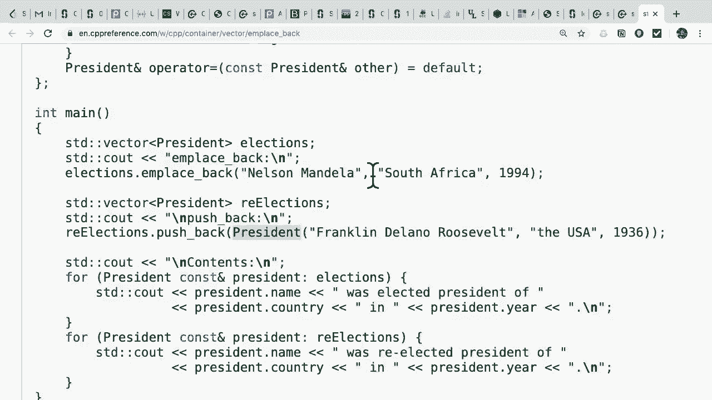

## 左值（L-value）与右值（R-value）

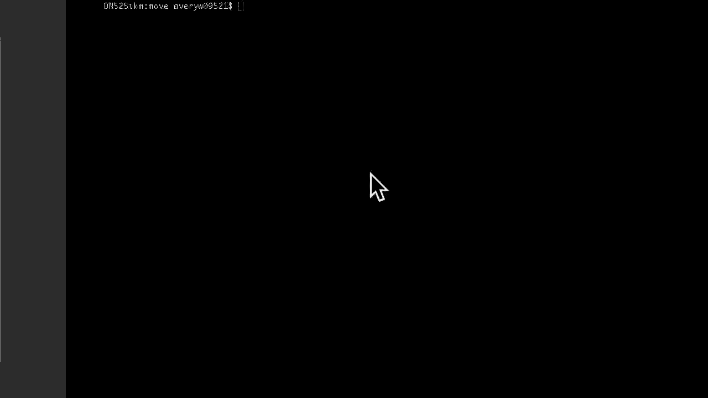


为了理解移动语义，我们首先需要区分两种表达式：左值和右值。这是一种简化的理解，但足以让我们编写高效的代码。

*   **左值**：一个有名称和身份的表达式。你可以使用取地址运算符 `&` 获取其地址。
*   **右值**：一个没有名称或身份的临时表达式。你不能获取其地址。

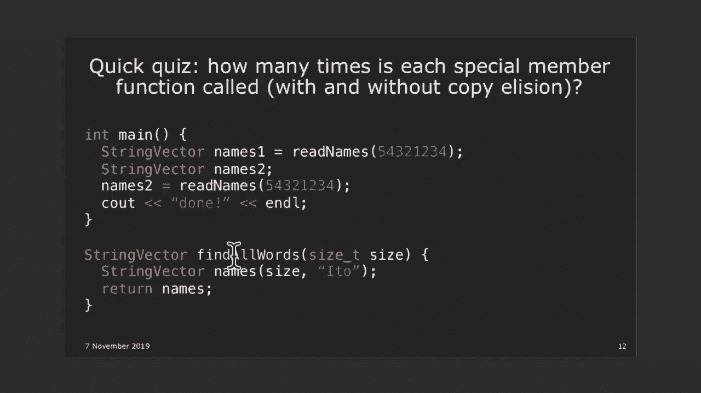


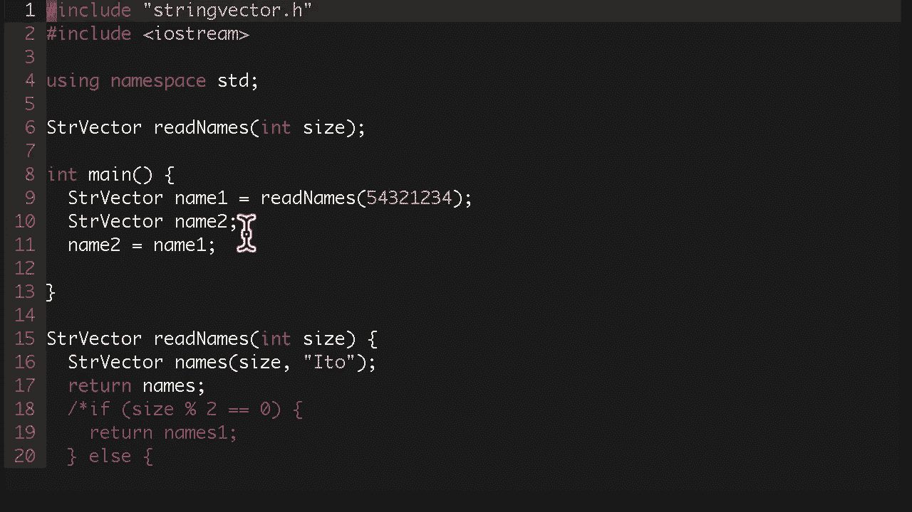

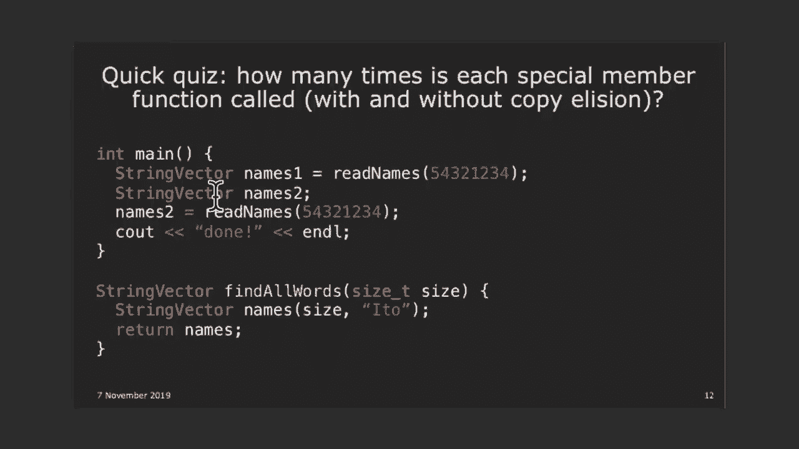

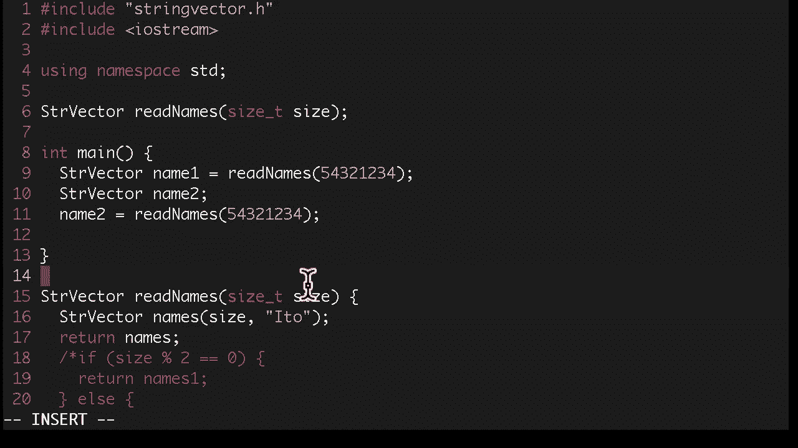

**直观理解**：左值通常可以出现在赋值运算符的左侧，而右值只能出现在右侧。

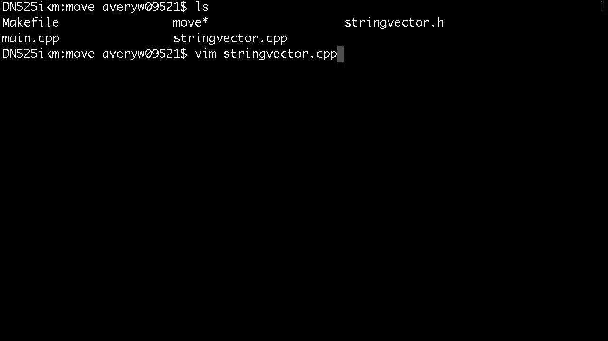

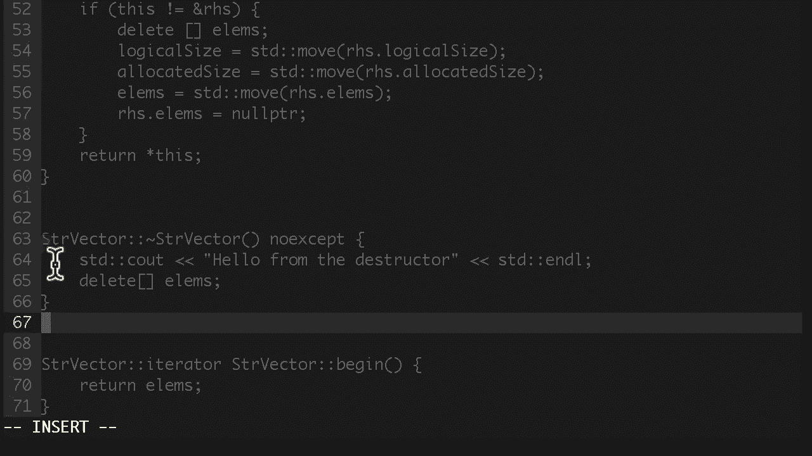

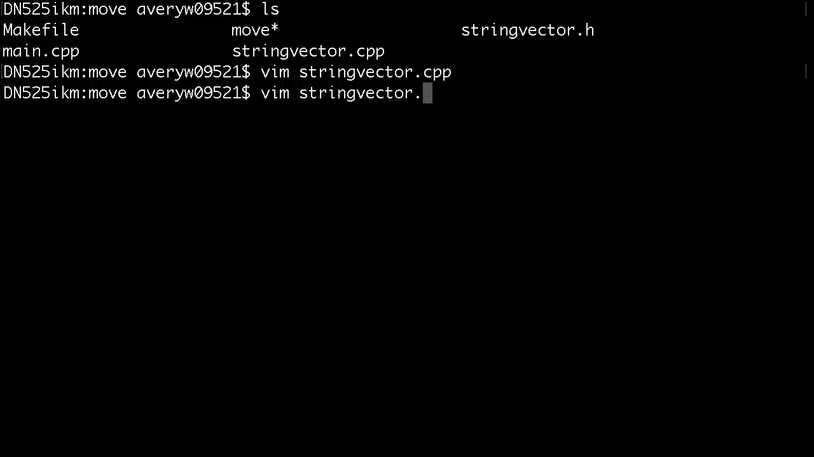


以下是几个例子：
*   `int val = 2;` 中，`val` 是左值，`2` 是右值。
*   `vector<int> v4 = v1 + v2;` 中，`v1 + v2` 的结果是一个右值（临时向量）。
*   `v[1]` 通常返回一个左值引用，因此它是左值。
*   `v.size()` 返回一个 `size_t` 类型的值，这是一个右值。

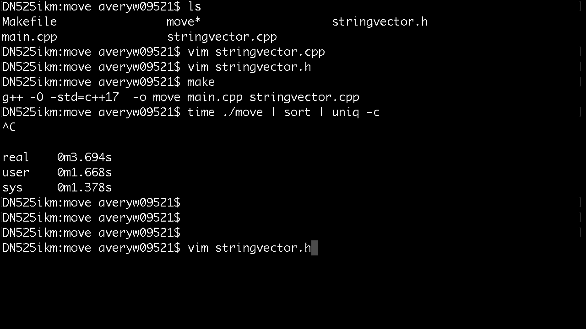


---


## 左值引用与右值引用

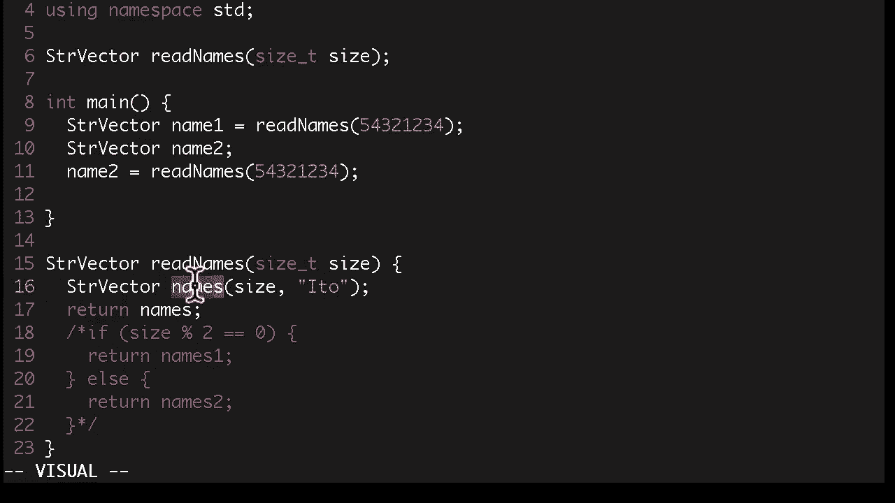

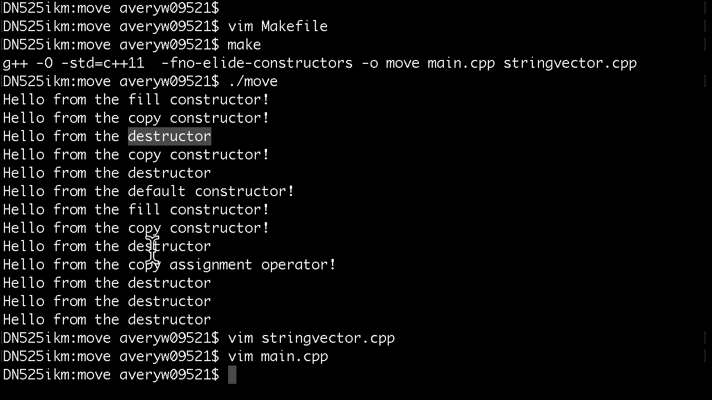

理解了值的类别后，我们来看看引用。

*   **左值引用**：使用单个 `&` 声明，只能绑定到左值。
    ```cpp
    int a = 10;
    int& lref = a; // 正确：左值引用绑定到左值
    // int& bad_ref = 5; // 错误：不能将左值引用绑定到右值
    ```
*   **右值引用**：使用双 `&&` 声明，只能绑定到右值。它可以“延长”临时对象的生命周期。
    ```cpp
    int&& rref = 5; // 正确：右值引用绑定到右值
    // int&& bad_rref = a; // 错误：不能将右值引用绑定到左值
    ```
*   **常量左值引用**是一个例外，它可以绑定到右值，因为承诺了不会修改它。
    ```cpp
    const int& cref = 5; // 正确
    ```


**核心思想**：右值是“可丢弃的”临时值。既然它马上就要消失，我们就可以安全地“窃取”它的资源，而不是进行昂贵的拷贝。这就是移动语义的基础。

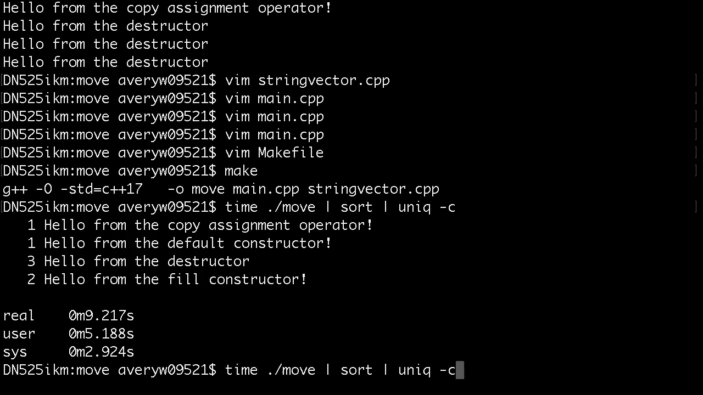


---


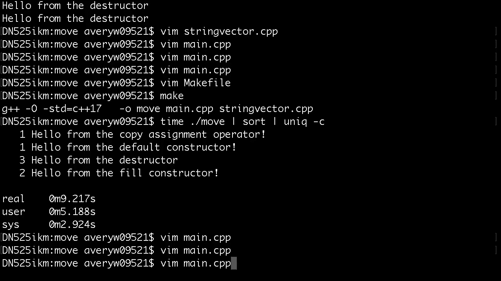

## 移动构造函数与移动赋值运算符

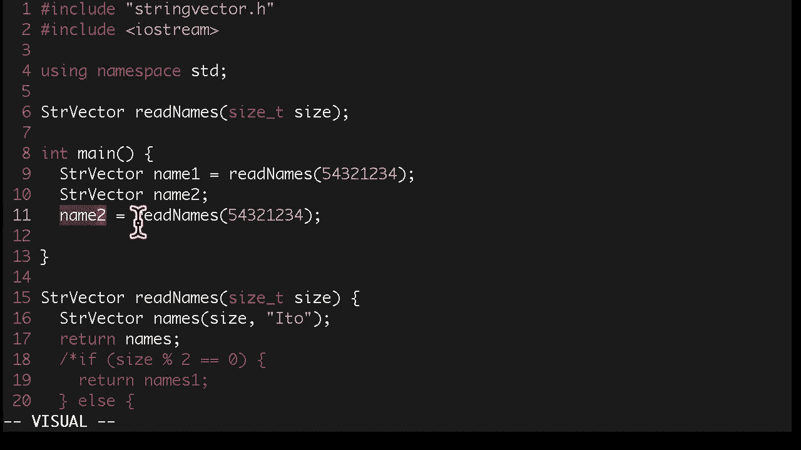

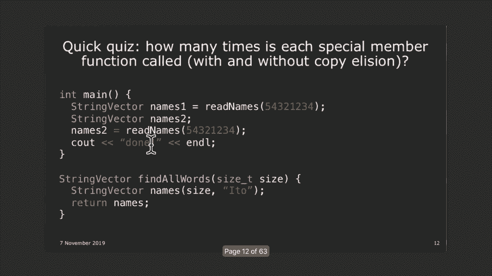

现在，我们引入两个新的特殊成员函数，它们是拷贝操作的“高效亲戚”。

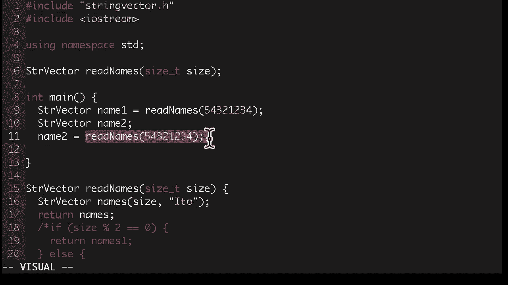

*   **移动构造函数**：从一个右值（临时对象）构造新对象。
*   **移动赋值运算符**：将一个右值的内容赋值给一个已存在的对象。

它们的函数签名与拷贝版本类似，但参数是**右值引用**。

以下是 `StringVector` 类的移动构造函数实现示例：
```cpp
// 移动构造函数
StringVector::StringVector(StringVector&& other) noexcept
    : elements(other.elements), logicalSize(other.logicalSize), allocatedSize(other.allocatedSize) {
    // “窃取” other 的资源
    other.elements = nullptr; // 关键步骤：使 other 处于有效但空的状态
    other.logicalSize = 0;
    other.allocatedSize = 0;
}
```
**关键区别**：移动操作不是分配新内存并拷贝数据，而是直接“接管”源对象（`other`）内部的指针等资源，然后将源对象的指针置为 `nullptr`，使其成为一个安全的空对象。

移动赋值运算符逻辑类似，但需要先释放当前对象持有的旧资源：
```cpp
// 移动赋值运算符
StringVector& StringVector::operator=(StringVector&& rhs) noexcept {
    if (this != &rhs) { // 自赋值检查
        delete[] elements; // 释放当前资源
        // 窃取 rhs 的资源
        elements = rhs.elements;
        logicalSize = rhs.logicalSize;
        allocatedSize = rhs.allocatedSize;
        // 将 rhs 置于有效空状态
        rhs.elements = nullptr;
        rhs.logicalSize = 0;
        rhs.allocatedSize = 0;
    }
    return *this;
}
```

---

## `std::move` 与成员变量的移动

有一个常见的陷阱：即使一个对象本身是右值引用（如 `rhs`），它的成员变量在函数内部仍然是**左值**。

例如，在一个包含 `std::vector` 成员的类中：
```cpp
class MyClass {
    std::vector<int> data;
public:
    // 移动构造函数
    MyClass(MyClass&& other) : data(other.data) { // 错误！这里调用的是拷贝构造函数！
        // ...
    }
};
```
`other.data` 是一个有名字的表达式，因此是左值，所以 `data(other.data)` 会调用 `std::vector` 的拷贝构造函数。

为了正确移动成员，我们需要使用 `std::move` 将其强制转换为右值：
```cpp
MyClass(MyClass&& other) noexcept : data(std::move(other.data)) {
    // 现在调用的是 std::vector 的移动构造函数
}
```
**`std::move` 的作用**：它不做任何实际的移动操作，只是无条件地将其参数转换为右值引用，告诉编译器“这个对象可以被移动”。调用 `std::move(x)` 后，你应该假设 `x` 的内容已被移走，不再使用它（除非重新赋值）。

---

## 应用：实现高效的交换（Swap）函数

利用移动语义，我们可以编写一个通用且高效的 `swap` 函数，它不会产生任何不必要的拷贝。


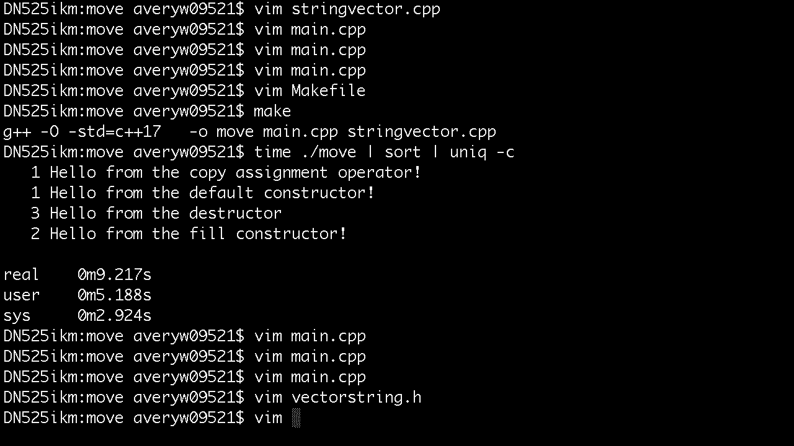


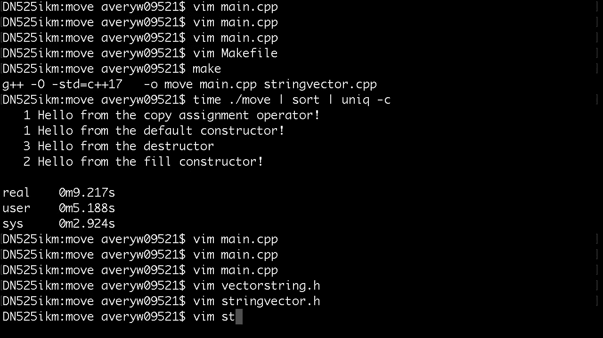

以下是实现步骤：
1.  首先，我们写出一个朴素的、基于拷贝的版本。
2.  然后，我们使用 `std::move` 将其优化为基于移动的版本。

```cpp
template <typename T>
void swap(T& a, T& b) {
    T temp = std::move(a); // 移动构造 temp
    a = std::move(b);      // 移动赋值 a
    b = std::move(temp);   // 移动赋值 b
}
```
**过程分析**：
*   `T temp = std::move(a);`：将 `a` 的内容移动到新变量 `temp` 中，`a` 变空。
*   `a = std::move(b);`：将 `b` 的内容移动到 `a` 中，`b` 变空。
*   `b = std::move(temp);`：将 `temp`（原 `a` 的内容）移动到 `b` 中。
整个过程中，资源只发生了三次“所有权转移”，没有任何深拷贝，效率极高。


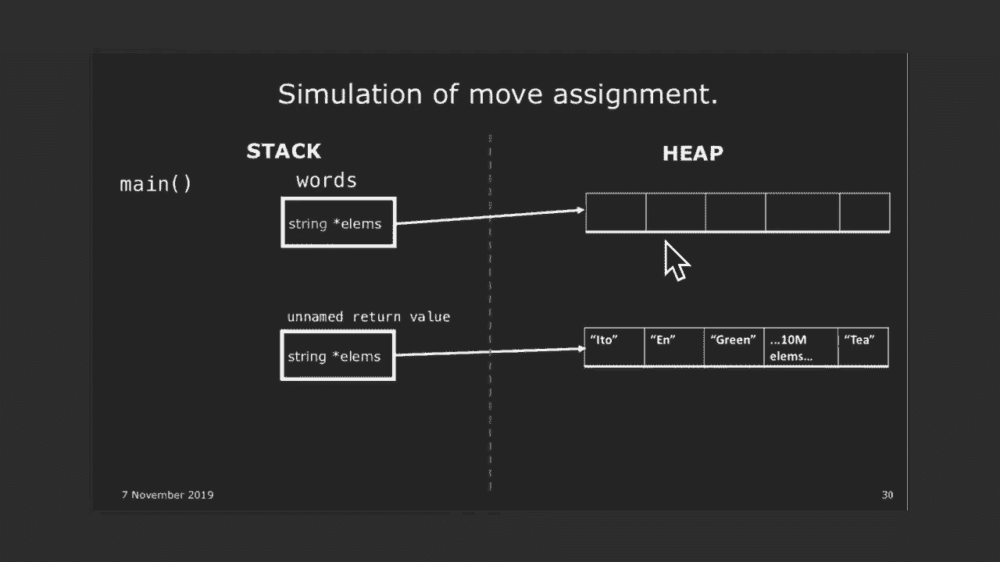

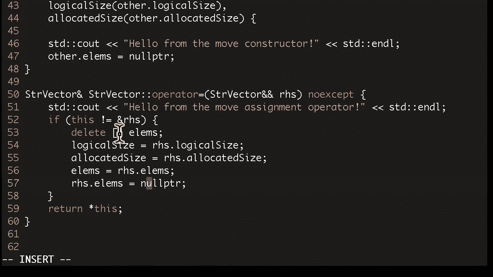

---

## 五大法则（Rule of Five）

之前我们学过“三大法则”：如果一个类需要自定义析构函数、拷贝构造函数或拷贝赋值运算符中的任何一个，那么它很可能需要全部三个。


现在，加上移动操作，它扩展为“五大法则”：如果你声明了拷贝构造函数、拷贝赋值运算符、移动构造函数、移动赋值运算符或析构函数中的任何一个，你应该仔细考虑是否需要声明全部五个，以确保资源管理的正确性。


---

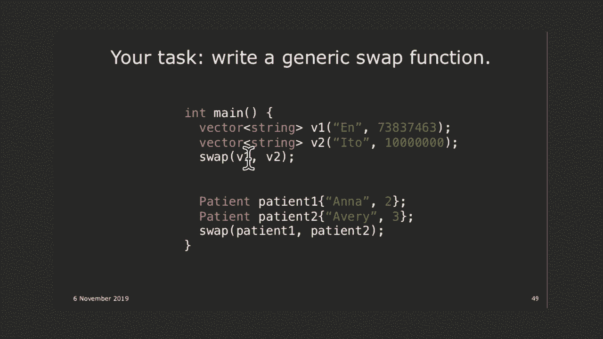


## 总结

本节课中我们一起学习了C++移动语义的核心内容：
1.  **左值与右值**：区分了有身份的持久对象和可丢弃的临时对象。
2.  **右值引用**：通过 `&&` 语法，允许我们绑定并延长临时对象的生命周期。
3.  **移动语义**：通过移动构造函数和移动赋值运算符，我们可以“窃取”临时对象的资源，避免不必要的拷贝，大幅提升性能。
4.  **`std::move`**：用于将左值强制转换为右值，指示编译器可以对其进行移动操作。
5.  **高效交换**：利用移动语义，可以实现零拷贝的通用 `swap` 函数。
6.  **五大法则**：管理资源时，需要协调好五个特殊成员函数。


移动语义是现代C++高效编程的基石，它使得在返回大型对象、容器操作等场景下，代码既能保持清晰安全，又能拥有接近手写C语言的效率。