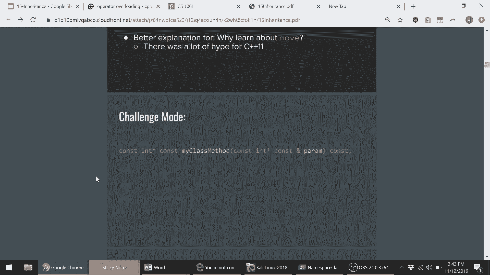
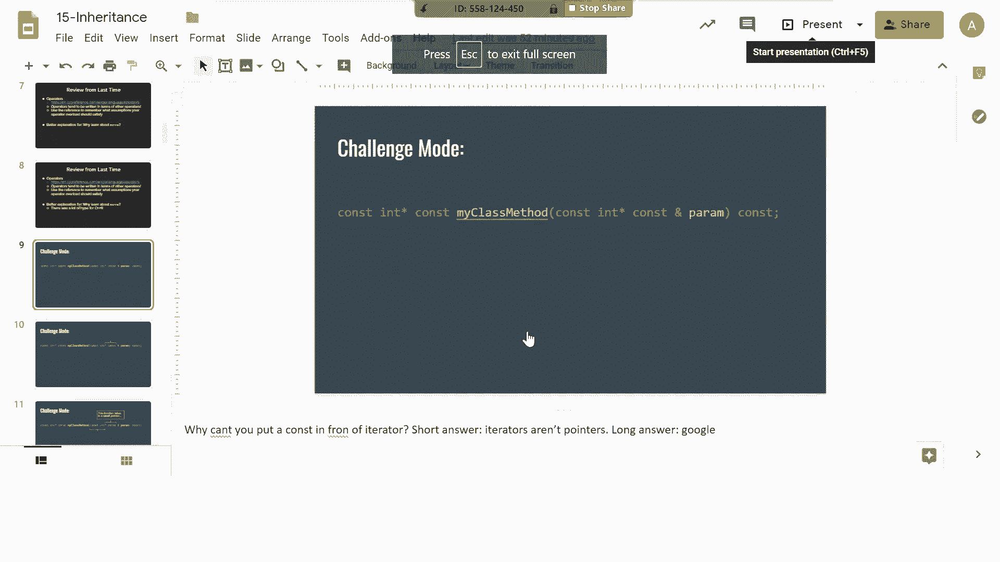
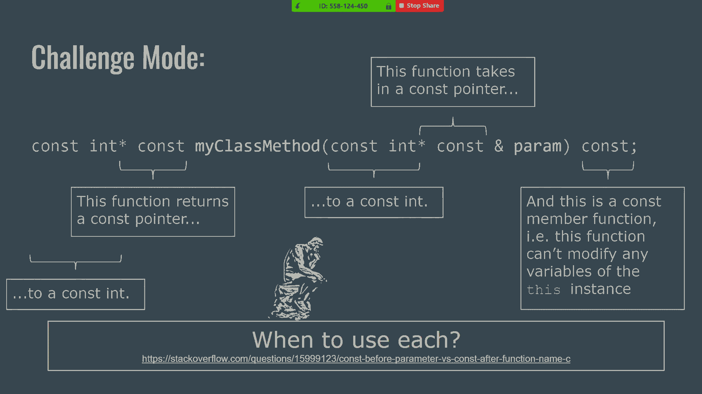
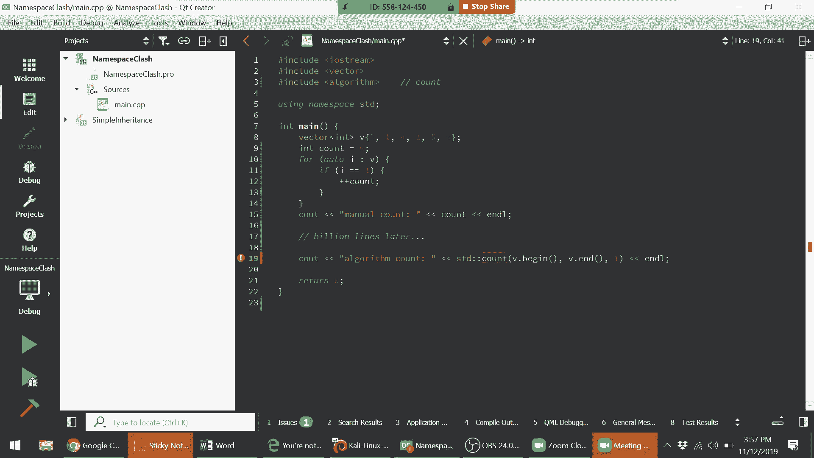
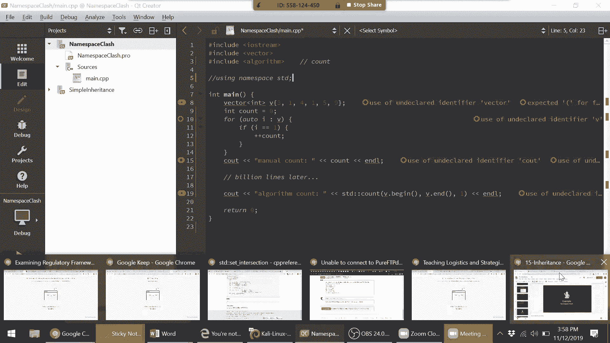
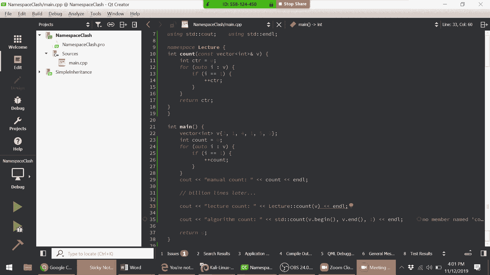
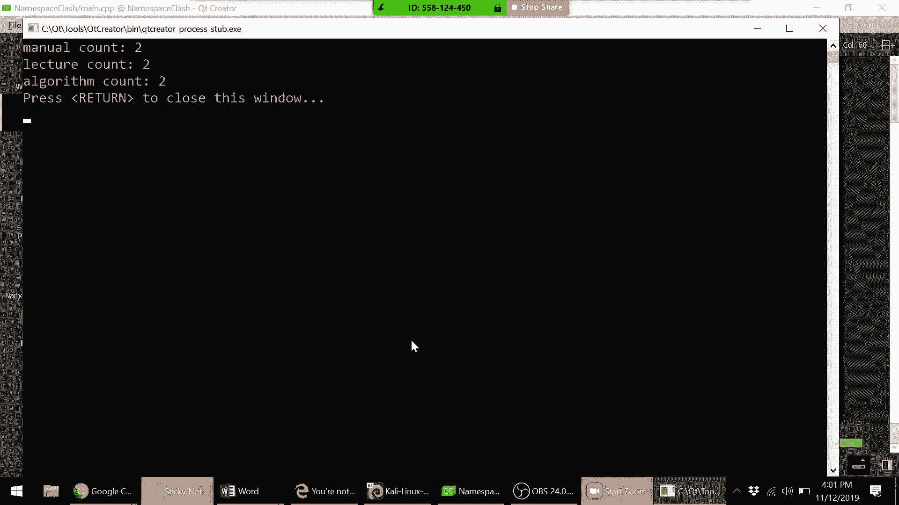
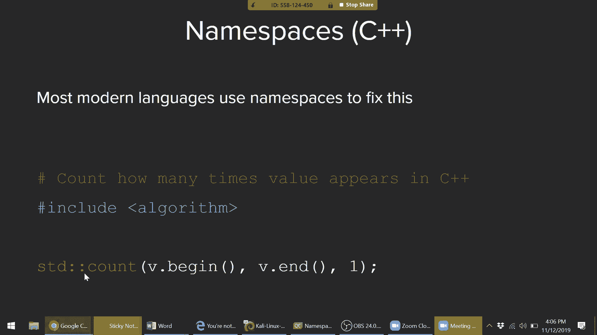
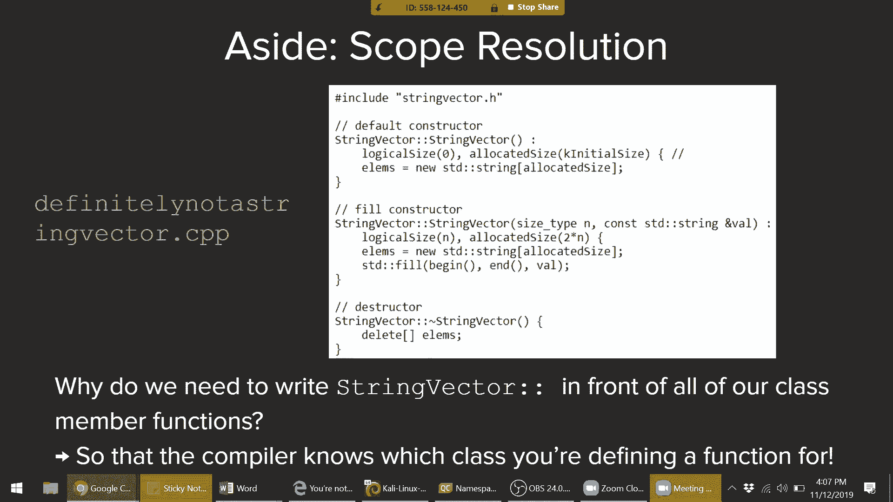
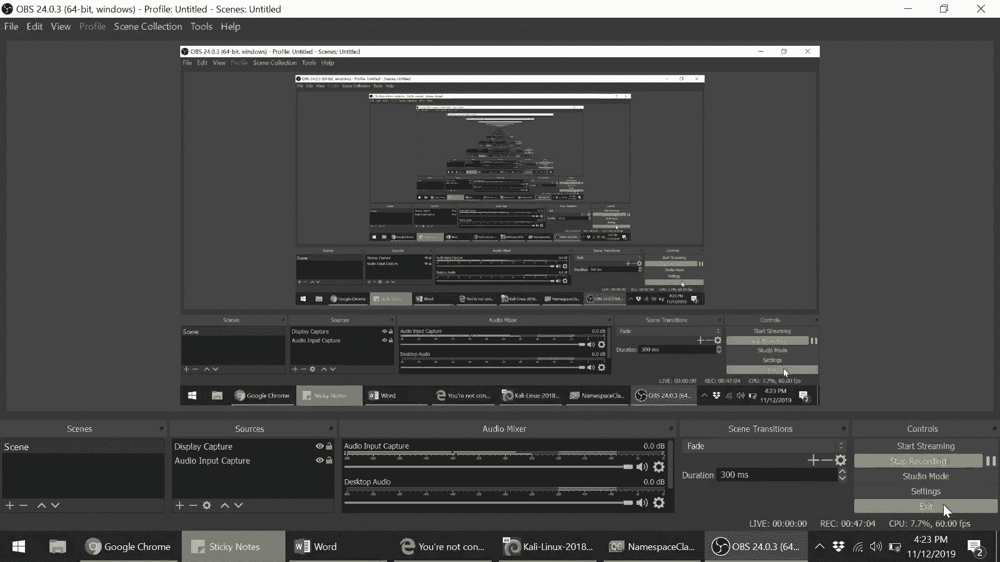

# 斯坦福大学《CS106L： C++编程｜ Stanford  CS106L C++ Programming 2019+2020》中英字幕（豆包翻译 - P15：[22]CS 106L Fall 2019 - Lecture 14_ Inheritance (Screencast) - GPT中英字幕课程资源 - BV1Fz421q7oh

好，那么我们今天要讲的内容，之前我们讲过移动语义、拷，贝语义、类结构的基础知识。今天我们要讲两个内容，来，充实我们对面向对象编程和C++的知识，一个是命名空间，另一个是继承。

这两者不一定是C++特有的概念，特别是继，承。因此，我们会讲一些特定于C++的内容，然后你们可以，选择在106B课程或108课程中深入学习更多相关内容。但是首先，在第3张幻灯片中。

这是最后四节课中的第一节，提醒一下，我们第10周没有课，所以你们可以享受真正的，死周，至少是我们这边没有课程。如果我们看看目前为止的进展，见第4张幻灯片，这是我们，在课程开始时向你们展示的进度图。

你们可以看到到目前，为止已经学到了多少东西，我们已经涵盖了所有的基础知，识，讲解了标准模板库。在面向对象编程中，我们做了一些，调整以适应Avery的时间表，所以我们去掉了多线程的部分。

讲解了特殊成员函数和移动语义，特殊成员函数包括拷贝，赋值运算符和构造函数。今天我们将讲解继承，这个星期，四我们将讲解模板类，下个星期二我们将讲解RAII和智能，指针。

最后一节课我们会让你们投票选择你们想要讲解的，主题。所以可以是，我们可以讲多线程，可以讲makefiles，可以讲，区块链，也可以讲你们感兴趣的任何内容。我们将在本周晚些时候或下周初发出调查问卷。

请关注。好的，如果你们查看标有“上次操作符复习”的幻灯片，我希，望你们点击那个链接，它会带你们到cppreference。com上。

的“操作符重载”页面。我想提及这个页面作为你们的参考，Avery已经讲了操作符，重载、拷贝、移动函数，你们会记得里面有几个难点，其中，之一是，例如，如果你在这个页面上使用控制F或命令F，找。

到赋值运算符，你会注意到它实际上有一个赋值运算符的，示例模板。具体来说，我们提到的一个难点是检查这不是自我赋值，即，检查this是否不等于对其他的引用。因此，如果这是你通常会忘记的内容。

那么这个网站是一个，很好的参考。如果你正在编写自己的类，你可以回去了解，你的自定义拷贝或移动运算符重载应该满足哪些假设，以，便与C++库中的其他类良好配合。所以，这是一个很好的参考。

你还可以从这里注意到其他一些内容，如果你滚动到像关，系运算符这样的部分，你会发现对于许多相似的运算符，例，如大于和小于，或者加一和减一，可能不是这些，但你会注，意到很多运算符是基于其他运算符定义的。

这是另一个很好的风格建议，如果你在编写自己的类时，当，你定义一个运算符时，通常会基于其他运算符来编写它们，再次提醒，这个页面将有示例模板，说明你的运算符重载应，该满足哪些假设。所以，是的。

自己看看这个资料，真的很有用，只是想让你们。

知道它在那里。

太棒了。好了，回到幻灯片上。我想回顾的另一件事是有人问了一个很好的问题，关于为，什么特别要学习移动（move）。所以，我们学习了复制（copy）。为什么移动函数存在？

有人能告诉我移动函数相比复制函数、复制构造函数和赋，值函数的好处是什么吗？是的，去说吧。它将数据从左值（L value）移动到右值（R value），这样可，以节省大量内存。你不会创建额外的副本。没错。

没错。因此，移动的整个目的其实就是为了避免使用不必要的额，外内存。我们上次给出的答案是这样的，嗯，是的，移动确实完全是，为了效率，当你在处理像物联网设备这样的内存有限的小，型设备时，这非常有用。

但我认为值得提到的是，移动实际上非常有用，不仅仅是在，那些边缘情况中，而是在你编写的普通程序中也是如此。举个例子，当C++11引入移动语义时，这对社区来说确实是，一件非常激动人心的事。原因就是这样。

假设你有一个你写的程序。C++11发布后，你只需点击重新编译，它的速度会提高一倍，这就是移动语义所做的。原因是，因为很多C++库的内置类型在C++11发布时都写了，移动构造函数和赋值函数。

这意味着你代码中的每个等号，之前是复制赋值或构造函，数，现在只需用新的C++版本重新编译，就会变成移动赋值，或构造函数。正如Avery上次所展示的，它使代码速度提高了50%，这是巨，大的。

所以这就是我们想花整节课来教的原因。这也是我们确实鼓励你们在自己的代码中使用的，特别是，当你定义自己的类时。对于大多数你们会遇到的类（不是自己定义的），它们通常，已经定义了移动函数。太棒了。好了。现在。

如果你们看看写着“挑战模式”的幻灯片，有多少人记，得关于“所有const”的讲座？有多少人记得最后的这个挑战问题？你不一定需要做过它。我只是想看看这是否看起来很熟悉。好吧。好的。这是你的机会。

我会给你们两分钟时间。和一个伙伴讨论一下。根据斯坦福荣誉规范，千万不要看下一个幻灯片，因为它们，绝对没有答案。和一个伙伴讨论一下，问问自己，这五个const关键字分别。

在做什么？它们在说什么？和一个伙伴讨论一下。给我两分钟，我会找到一个屏幕共享的方式，以便我们可以，稍后进行代码操作。是的。不用担心。不用担心。是的。是的。是的。一定会有的。好的。所以是const。

我不知道它之前是什么。好的。const。两个。好的。好的。那这个呢？然后听剩下的幻灯片。好的。所以。我们走吧。我们有很多时间。所以我们看看吧。我去。好的。我还有一些其他的内容在课堂上。

你可以确保你给出那些，要点。然后，如果你有东西要和小组分享，首先，你应该和小组讨，论你要做什么。哦，等等。你能给我们一个更宽的视图吗？这是概念的参数。这只是一个指向的点。

记住我们谈过的不改变它所指向的东西吗？是的。哦，你不能这样做。哦，Anna。是的。在共享屏幕之前，你尝试让两者都显示出来。我只是，是的。是的，是的。谢谢。这是一个很好的建议。指针不在你的屏幕上。好的。

好的，让我们重新整理一下。好的，是的，谢谢。Victoria。是的，好的。是的，所以Victoria也提供了一个很好的选项。如果你们去Piazza，我发布了讲义幻灯片，在那里有一个，Zoom会议链接。

请加入那个链接，让我知道你们是否能看到我的屏幕。问号，问号。

一旦你能看到我的屏幕，请举手。是的，它应该在我发布的讲义幻灯片下面。哦，好吧。我听到一些人进来了。好吧，我再给你们30秒。看看你们能否解决。你好，欢迎。

如果你点击链接，它应该会自动填充会议ID。哦，我明白了。好的，如果可以的话，你也可以尝试与其他人一起看，如果，需要时间的话？但如果不行，你应该能用你的Stanford ID作为ID。谁还看不到Zoom？

好的，你愿意看看别人的肩膀吗？向你旁边坐着的人自我介绍一下。我希望你们今天结束时至少认识这个班上的一个人，今天，结束时。好的，太棒了。是的，谢谢你们的耐心。我很高兴我们都能再次看到屏幕。好的。

那么谁来逐一讲解。所以你可以给我解释一下，如果你们看到我的屏幕，这个，const关键字在做什么？有什么想法？你们讨论了什么？是的，Byron。完全正确，完全正确。所以正如Byron所说。

它表示作为一个参数，这个函数接受，一个const指针。这个下一个const在说什么？随意喊出来。是的，Victoria。完全正确。所以总的来说，这个函数接受一个指向常量整数的常量指，针作为参数。是的。

Byron。完全正确，这是一个完美的总结。所以对于麦克风来说，这意味着指针始终指向内存中的同，一位置，并且该内存无法被修改。完全正确。然后同样适用于返回值。这个下一个 `const` 关键字在说什么？

是的，Mason，继续吧。完全正确。继续，这个下一个 `const` 在说什么？完全正确。再一次，这意味着指针和内存都被指向。它不能被修改。然后最后，这个是最难的一个。

这个在函数末尾的最后一个 `const` 在说什么？是的，Eva。它没有改变任何东西。完全正确。所以这是让很多人感到困惑的事情。所以，函数末尾的 `const` 关键字整体上表示这是一个常，量成员函数。

这意味着如果你编写一个成员函数并将其声，明为 `const`，这个函数不能改变该实例中的任何私有变，量。一个清晰的说法是，如果你记得Avery谈到 `this` 关键字，并且其他人提到该类的特定实例。

那么这个函数不能改变，这些私有变量。太棒了。所以这是一个有点棘手的问题。事实证明，这实际上并不是在选择使用哪一种。这些是基于你想要什么返回值，想要什么参数，以及是否希。

望函数能够修改类的私有变量的三种不同功能。所以，是的，这也是在作业2中出现的内容。每当你编写自己的函数时，总是要检查你的两个问题。我希望它是 `const` 吗？我希望它通过引用传递吗？诸如此类。是的。

Elliot。在这个例子中，`param` 到底是什么？是的，它看起来像是被解引用了。像是，`&param` 成为 `const` 指针吗？好问题。所以这回到 `&` 在参数列表中的作用。

这是 C++ 中一个棘手的区别。在这种情况下，`&` 只是表示我们通过引用传递。所以，就像我们通常所做的，`&` 只是表示我们通过引用传，递。所以 `param` 只是你传递的参数的术语。所以。

明确一下，我们在参数部分做的是，我们通过引用传，递一个 `const` 指针到 `const int`。所以在这种情况下，引用实际上是不必要的，因为我们不需，要通过引用传递一个指针。

但如果你仍然困惑，可以课后再讨论。但这是一个很好的问题。太棒了。好的，今天有一些快速公告。作业2将在本周四截止。也就是说，不要忘记你有迟交天数可以使用。如果你填写了介绍调查，每个人都有四个迟交天数。

我会举行办公时间。我不能进行正常的周四办公时间，但我发布了其他时间。如果你需要，请查看 Piazza。作业1的成绩将在今天或明天发布。评分员的截止日期是今天。所以我们会尽快把成绩发给你。

如果你对你的成绩有任何问题，务必来找我们。我们很乐意查看你的代码或解释，如果你只是感兴趣的话，我可以做得更好吗？我们也很乐意这样做。然后，第三次作业将于本周四发布。再说一次。

你只需要完成这门课中的三项作业中的两项。所以，如果你完成了第二次作业，并且做了第一次作业，你，就完全完成了。祝贺你。好吧，完全完成是在你周四提交的时候。好的，是的。有人有任何问题吗？对不起。

我说得太快了。我在尽量弥补一些丢失的时间。是的。故意的。确切的。这是正确的链接。是的，好问题。还有其他问题吗？我刚刚意识到我一直忘记丢掉糖果。好吧。那么，我们会继续处理这个问题。好的。让我们看看。好的。

在这种情况下，我们今天会讨论命名空间。好的，所以命名空间有点有趣。如果我们看看到目前为止我们一直在使用的内容，你们已，经在使用命名空间，无论是有意还是无意。所以你们会记得我们写的代码中。

我们使用了很多 STD 标，准，无论是你们在其他课程中看到的 `using namespace ，STD`，还是使用显式的 `using` 声明，例如 `using STD ，CL` 等等。实际上。

我们在编写自己的类时也见过作用域解析。所以当 Avery 和你们一起实现 `string vector` 时，你，们会记得，当我们在 `。cpp` 文件中声明实现时，我们必须。

写类似 `string vector：` 的东西，然后是我们试图编写，的函数。所以这实际上是我们看到作用域解析在实践中的另一个地，方。我们实际上会在最后理解为什么这是必要的。那么。

C++ 中为什么会有命名空间呢？这种动机来自于我们在标准库中所工作过的内容，我们已，经看到它倾向于使用很多常见的名称，比如 `string` 或 ，`max` 或 `count`。

假设我们想定义一个自己的类，它也有一个看起来逻辑上，名为 `count` 的函数。我们该怎么做？如果我们想同时使用标准库和我们自己的库，我们需要一，种方法来区分我们使用的是哪种 `count`。

这可能比最初看起来更复杂。所以我们实际上将查看一段看似非常无害的代码。

所以让我们看看这个。大家能看到代码吗？好的。似乎看不到。好的，太棒了。所以让我们看看这段代码。我们在这里做的是，我们有一个 `int` 类型的向量。我们所做的只是计算值 1 在该向量中出现的次数。

然后最后，我们会输出计数。这样我们可以双重检查它是否按预期运行。我们会得到手动计数 2。完美。假设这是我们正在编写的某个非常大型程序的一部分。假设在大约一亿行代码后，我们仍然在主函数中实现它，因。

为我们还不知道分解。但没关系。所以，经过了十亿行代码后，假设我们想使用标准算法库的，计数函数。这可能是我们之前见过也可能没见过的东西。但是在算法库中，有一个叫做 count 的算法，你可以传递。

一个迭代器到你想要计数的容器中。它会返回出现的次数。所以，我们可以做的一个事情是，比如说，好的，来吧，你知，道吗？我不喜欢我们的手动计数。让我们试试使用 C++ 库，它需要一个第一个迭代器。

所以我们要说 v。begin，一个第二个迭代器，即 v。end，以，及第三个，值 1。这看起来挺好的。这看起来挺好的。所以我们可以尝试运行这个。完美。我们看到，好的，它返回 2。我们知道，好的。

我们在上面声明了使用 namespace std。这就是为什么我们不需要指定这是 std 的 count。我们已经在之前指定过了。所以我们可能会有一个问题，那就是，好的，假设，这又是一，个庞大的代码库。

在这中间有十亿行代码。而我没有意识到我实际上之前有一个手动计数。所以忽略那个错误。自然的，过了一段时间，我确实想使用这个算法计数，它已，经被标准库为我们定义了。你们觉得会发生什么？你们的直觉猜测是什么？

再次，当我写这个的时候，我在想，好的，我已经声明了使用， namespace std。所以我不需要指定它是 std 的 count。你们认为会发生什么？你们觉得会有多少？实际上，我不会这样做。

我不会说多少会编译，因为我们在共享屏幕。它在那儿显示了一个错误。所以让我们实际运行一下，看看会发生什么。因为这有点违反直觉。而且错误信息，如果你在现实生活中遇到它，真的没有意义，所以啊。

这是我们看到的错误。对象类型 int 不是一个函数或函数指针。Count 不能被用作函数。好的，发生了什么？有人能解释一下他们认为发生了什么吗？为什么会抛出那个错误？所以再一次，这就是它抛出的错误。

是的，我回来了。正是，正是这样。所以在这种情况下，我们所做的是完全合理的。我们声明了一个叫做 count 的变量，这对于我们要做的事，情来说是一个完全合理的变量名。然后在我们代码中的某个时刻。

我们想要使用算法 count，作为程序员，我们期望它能按我们预期的方式解析，因为 ，count 是一个变量。对不起，手动计数是一个变量。而算法计数是一个函数。但是编译器看到的是这个局部变量 count。

它认为你正在尝试调用这个局部变量的函数操作符，即那，两个括号。它会说，你不能对一个整数如 1 做这样的操作。所以这就是发生的情况。这就是命名空间的一件棘手的事情。所以如果我们想解决这个问题。

一个非常简单的方法就是，即使我们已经说过使用命名空间 std，你也必须指明这是 ，std count。这样就能解决问题。

这样就会如我们所期望的那样打印出两个2。

没错。但这实际上是一个更好的例子，说明为什么我们在这门课，程的早些时候说我们更倾向于不使用 using namespace ，std。事实上。

这相当于对于那些使用过 Python 或 JavaScript。

 的人来说。所以再次说明，这被称为命名空间。到目前为止，我们一直在使用标准命名空间，std：在 Python 中有一个类似的概念。我们说 import random。然后要使用该库中的某些东西。

我们必须说出库名和其中，的函数。在 Python 中，我们也说像 from random import * 这样，的做法也是相当糟糕的，因为你的代码中塞满了许多你不，需要的代码。

这里为什么我们不喜欢使用 using namespace std 的原。

因完全相同。相反，我们更喜欢使用的是，正如你可能在作业代码中看到，的，比如 using std：vector，using std：cout，using ，std：到目前为止，这说得通吗？有什么问题吗？

关于命名空间的另一件事，给命名空间下个定义，它听起来，就像它的字面意思。它是一种方法，让你将代码行或你声明的类分组到一个单，一的命名空间中，以便以后引用。所以我们实际上可以编写自己的命名空间。

到目前为止，我们只使用了标准命名空间。但我们在这里可以使用的语法是 namespace。然后让我们把我们的命名空间称为 lecture。然后语法是我们可以写一些东西，比如，让我们实际上声明。

我们自己的 count 函数。所以我们会说，让我们声明一个名为 count 的函数，它接，受一个 vector 并返回其中元素的数量。为了清晰起见，让我们把它改成类似的东西。

所以如果我们想使用我们刚刚在自己的命名空间中定义的， count 函数，你们觉得我们应该怎么做？所以 count，然后让我们说 lecture count。你认为语法应该是什么？所以不是 std：

count v。begin，语法应该是什么？没错，完全正确。所以正如我们所期望的，我们将使用我们新定义的命名空，间 lecture，而不是标准的。然后我们可以从那里调用 count 到 v 和 n。

所以如果我。

们尝试运行它，完美。

我们得到了我们所期望的结果。是的，Brian，请说。如果你滚动到代码的最顶部，你必须进行 count include ，vector algorithm。是的。

即使你已经做了 using namespace std，为什么你不需要，做 using std：count？啊，事实上，我们确实做了。你说的是下面这个算法吗？是的。它就在那里。

所以你不需要在上面再写一遍。是的，没错。所以这是一个很好的问题。为什么我们不需要在这里声明 using std：count？事实证明，我们完全可以。我们可以使用 std：count。然后这样一来。

在这里我们不再需要指定。哦，实际上，对不起。我收回刚才的话。所以我们确实需要再次指定，即使我们在上面提到使用，因，为我们有一个局部变量，它优先于我们在上面声明的使用，声明。是的，很好的问题。是的。

还有其他问题。所以即使 std 是一个命名空间，你仍然需要使用包含吗？是的，那么命名空间和包含之间有什么区别？所以可以把命名空间看作是两个不同的步骤。首先，你需要让代码知道其他代码的存在。

所以为了做到这一点，你使用这个包含语句来将所有的向，量代码从云端（可能，并不是真的）带到你运行的程序中。然后你使用命名空间来标记，在我正在使用的这个程序中，的所有代码中，我想使用哪一部分？

所以这是两个不同的步骤。首先，你必须包含代码本身。然后第二，你需要定义你想使用的代码部分。是的。你不需要为向量使用包含，因为你已经在那儿了。确切地说。所以在这种情况下，我们已经实际编写了代码。实际上。

你可以把这些代码写到一个单独的类中，然后包含，那个类。但在这种情况下，你已经在那个文件中包含了代码。是的，很好的问题。很棒。还有其他关于命名空间的问题吗？是的，Yizu。是的，实际上，是的，正是这样。

所以实际上，std 向量只包含了向量的一个特定实现。但是代码仍然需要知道你想使用的向量实际上是来自那个，包含括号向量类的向量。是的，所以它首先需要通过使用包含，包含语句把它引入范，围内。

然后它需要用名称标记它，以便知道它在使用哪个向量。是的，所以我们实际上可以完全编写自己的类。实际上，我们可以编写类似 class our own vector 的内，容，然后进行所有的正常公共私有操作。

然后那会接受是模板类型名称 t。然后，实际上，我们可以在这里引用我们自己实现的向量。所以再次，我会在之前调试错误。但本质上，一旦你在自己的命名空间中声明了它，你可以通。

过做类似 lecture vector 的操作来使用你自己的向量。所以这是 100% 有效的代码，前提是它确实能编译。是的，我会回去更新那里的语法。这是个好问题。我会再次发布更新。

因为我仍然看到困惑的表情。但是的，我会再跟进这个问题。是的，还有其他关于命名空间的问题吗？

另一个关于命名空间的事情是，如果你想在命名空间中有，命名空间，这类小的棘手细节。我们没有涵盖这些，因为我们认为如果你遇到这种情况，我，们希望你具备足够的信心去自己查找这些细节。

但这是 C++ 中命名空间的一个总体概述。但确实，我们希望 equip 你的是学习如何查找所有奇怪的，小细节。但如果您对此有疑问，也请随时向我们提问，您之后也可以，在网上查找。好的，继续说。

对于命名空间，如果你熟悉 JavaScript，它，在 JavaScript 中也是同样的情况。在 JavaScript 中，我们使用 require 关键字。然后同样，要调用一个函数。

我们必须说库名加上我们想要，使用的函数。所以在 C++中，完全是一样的。在这种情况下，两个冒号，作用域解析就是我们确定正在使，用哪个库的方式。

好的，所以我们可能会有的一个问题是回到我们编写自己，的类的时候，为什么我们必须在所有成员变量的定义前面，标注类的名称？事实证明，我们必须这样做的原因有点类似。

这是因为我们需要让编译器知道我们正在为哪个类定义函，数。因此，到目前为止，对于您的所有项目，您所看到的是有两，个文件。有类名。h 和类名。cpp。事实证明，您实际上可以将您的。

cpp 文件命名为您想要的，任何名称。您可以将其命名为而不是字符串向量。您可以肯定地将其命名为不是字符串向量。cpp。并且您仍然可以包含所有相同的代码，并且它会编译良好，所以当您编写自己的。

cpp 实现时，我们需要作用域解析的，原因是让编译器知道您正在尝试实现哪个头文件。所以这是一个小细节，因为我知道，我总是忘记添加作用域，解析，因为它看起来像是字符串向量。cpp。

当然，它是针对字符串向量的。好的，是的。在我们继续之前，关于命名空间还有最后的问题吗？命名空间还是作用域解析运算符？是吗？那么我们应该只在我们的。cpp 文件中使用命名空间吗？

所以这是一个常见的风格建议，就是只在。cpp 文件中使用， using namespace standard，而不是在头文件中。您甚至不必在。cpp 文件中使用它，但您说得对，您确实不。

希望在头文件中使用它。这是因为如果您的类被任何其他类调用或包含，那么您就，是在强制那个类完全导入整个标准命名空间。所以在。cpp 中做会更好。即使在。cpp 中，您仍然可以有选择地选择您正在使用的 。

using。但是在那里使用 using namespace 是可以的。是的，并且您只是要小心像我们之前展示的那些错误。是吗？比如 100 个语句？是的，没错。这是一个很好的观点。比如。

如果我们只是使用 std：cl 好几天呢？这是一个很好的问题。这又回到了风格的概念。所以在那种情况下，作为程序员，您 100％可以自由地使用 ，using namespace standard。是的。

所以所有这些都有点像它们自己的取舍，但无论什么，是合理的，无论什么是常识。是的，布莱恩？使用 std： 的动机是无论如何都不要使东西混乱。但是如果我们正在做 #include <algorithm>。

我假设算法，是很大的，对吧？那么在那个时候，我们可以这样做吗？是的，所以这是一个很好的问题。所以这实际上很有趣。所以我得再次检查编译器实际上是如何处理井号包含与使，用语句的。我最初的猜测是。

即使它包含了所有文件，实际上也不会。让我再检查一下。让我回复您，以免给您任何错误的信息。但肯定存在某种效率，不包含整个命名空间。我得再回复您确切原因。好的，是的，所以我有这个，还有尤西的问题。

还有其他问题吗？好的，太棒了。所以再次，我们要转向继承。而且再次，我们的目的不是让你们对如何使用继承有一个，广泛的理解，诸如此类。那是您从像 108 这样的课程中会获得的东西，或者我相信。

他们有时仍然会在 A、B 或 X 中涵盖它。所以如果您对构建自己的类感兴趣，我肯定会看一下一般，的继承。但如果您想在 C++ 中构建，这些就是事情。这些是您需要知道的核心事情。好的。

所以先给你们一个关于继承是什么的总体概述，其动，机来自一个熟悉的问题。所以再一次，假设我们有一个文件流和一个字符串流。并且它们两个都在上面定义了这个插入运算符。并且假设我们有另一个类。

我们想要找到一个打印语句，它，对流做一些额外的事情，然后最终调用那个流插入运算符，然后对于字符串流也是同样的事情。它对那个流做同样的事情，然后调用唯一的区别是它必须，在这两个流上调用不同的插入运算符。

你们会如何解决这个问题？对于如何解决这个问题，您最初的直觉是什么？所以再次，我们更愿意只有一个我们可以在 if 流和 i 字，符串流上调用打印的函数。我们知道您可能会想到什么？是的。模板？对，完全正确。

好主意。所以我们之前已经看到过，好的，这似乎是一个熟悉的问题，为什么我们不只用一个模板？完美。所以我们只是定义某种流类型名称，然后让编译器为我们，创建这两个单独的函数。所以这个星期四。

我们实际上将涵盖一种叫做模板类的东，西，这是类似的。这又回到了这个问题，您会看到我们对继承做了什么。继承所做的与模板所做的似乎几乎有点类似。所以这个星期四，我们将讨论为什么我们想要使用模板而，不是继承。

或者其中之一。所以这是为了给你们介绍另一种解决这个问题的方法。所以再次，我们之前看到的模板是它使用了一种隐式接口，如果您还记得艾弗里的讲座，我们在问，这个函数代表我们，假设了什么样的事情？

所以没有一个明确的列表。但在这种情况下，它假设的一件事是，好的，无论是什么流，它上面都定义了某种插入运算符。作为一个附注，我们这个星期四还将涵盖的另一件事是，实，际上，在 C++20 中。

有一种方法可以明确说明您的模板需，要哪些运算符或函数。所以这实际上是非常令人兴奋的。但那会是下一次讲座的内容。所以这是一个插曲。模板是一个很好的解决方案。结果是，还有一种更通用的解决方案。

适用于其他面向对象，编程语言，这就是继承和接口。所以你可以这样理解，就像在模板中我们有一个隐式接口，一样，实际上还有一种叫做显式接口或仅称为接口的东西，它是C++中最简单的继承形式。

所以它是C++中继承的一个子集。所以它的工作原理是，你们中有多少人熟悉Java？在这里的Java。好的，完美。所以你们可能在Java中见过这样的情况，比如我们定义自，己的接口类。

使用关键字interface，类的名字。然后稍后，我们定义一个实现那个接口的类。在C++中，你可以镜像Java中完全相同的概念。所以在C++中，对应的做法是声明一个叫做drink的类，将你。

想要作为接口函数的函数声明为虚拟的，即关键字，virtual，然后稍后声明你的类T，其中冒号等同于实现，drink。到目前为止有任何问题吗？没有。好的。为了更清楚地说明C++语法。

需要注意的关键点是首先在接，口类中使用virtual这个词。然后注意在那个虚拟函数中，有一种我们之前没见过的独，特语法。我们说virtual void，函数的名字，等于0。

所以等于0的作用是强制任何继承自叫做drink的类必须实，现一个make函数，否则它不能被视为一个真正的类，编译器，将会抛出一个错误。所以这，还是，属于术语的一部分。为了让你们熟悉。

如果你们以后去阅读有关C++中继承的内，容，这被称为纯虚函数，pure表示继承类必须定义该函数。所以总结一下，在C++中，没有像Java中那样的interface关，键字。相反，如果你想定义一个接口。

如果你想使你的类成为一个，接口，方法是确保你的类只包含纯虚函数。所以这只是一个定义。要成为接口，类是一个只包含纯虚函数的类。然后如果你想实现一个接口作为另一个类，那么那个类必，须定义所有这些纯虚函数。

否则它将无法编译。是的，这对大家都明白了吗？这是一个关于继承的奇怪概述。是的，是的。观众成员3。所以我们之前遇到的问题是我们在类中写了太多实例。所以这实际上是一个很好的点。

所以接口确实没有解决我们开始时提出的问题。是的，这确实是一个完美的点。所以接口实际上解决了一个与我们引入接口时不同的问题，接口解决了这样一个问题，比如说茶和咖啡有不同的make，函数。在这种情况下。

你可以使用drink来指定饮料的总体设计，然后将如何实现make函数的细节留给两个不同的类。但这完全正确。我们之前的问题是两个函数是一样的。所以我们想要一种避免重复编写相同函数的方法。是的。

所以我们在解决几个不同的问题。是的。所以这样，我们不能？绝对可以。这是个很好的问题。确切地说。所以我们不能创建，你不能做类似 drink D equals new ，drink 的事情。

因为这是一个接口。所以唯一可以定义的类是那些没有纯虚函数的类。是的，很好的问题。然后是布莱恩。所以我已经写了那个。在继承类中，我们能否有一些公共函数在那里实际定义，而，其他函数没有？很好的问题。

那么我们能否有某些函数在其他函数中定义而其他没有？这是个很好的问题，以至于未来的我回到过去告诉过去的，我创建一个幻灯片。那么如果我们确实想定义某个函数呢？这是个很好的问题。是的。

这实际上是 C++ 中称为抽象类的东西。再次，这涉及很多术语。这只是为了让你们熟悉这些词汇，因为这些是特定的 C++ ，术语。但是如果你见过继承，概念应该感觉有些熟悉。所以如果一个类有至少一个纯虚函数。

那么它就被称为抽，象类。回到之前的问题，确切地说，抽象类不能被实例化。所以只有那些没有纯虚函数的类才能被实例化。例如，假设我们有一个基类。那么在那个类中，我们可以有一个纯虚函数，这意味着任何。

继承它的类必须实现那个函数。我们可以有一个非纯虚函数，这意味着基类也实现了 foo，但是继承类可以用它们自己的实现覆盖那个函数。最后，我们可以有我们自己的普通函数，返回生命的意义。是的。

到目前为止有任何问题吗？这些问题很好。是的？你能回到你认为关键词 public 的幻灯片吗？是的，很好的问题。所以我们看到它写着 class T colon public drink。

所以 public 关键字实际上是三种可能的访问控制符中的，一种。我写了关于它们的幻灯片，但实际上我预见到我们不会在，下一节课之前覆盖它们。

所以这三个词是 public、private 和 protected，你可能，以前见过。在这种情况下，这就是说 drink 中的所有公共函数在 T ，中仍然是公共函数。

drink 中的所有受保护函数在 T 中仍然是受保护函数。而 drink 中的所有私有函数 T 是无法访问的。所以 public drink 实际上是你在 C++ 中处理类时最常，用的关键字。实际上。

如果你不指定任何访问关键字，它会默认为 ，public。所以这是你最常见的情况。更少见的是你会看到类似 class T colon protected ，drink 这样的东西。

这表示将 drink 的所有公共函数转换为 T 中的受保护函，数。是的。是的，这是个很好的问题。是的，布莱恩？杰瑞说的某些内容。实际上，Jerry 说如果你没有它，它会默认为私有。谢谢。谢谢。不，不。

不。这是百分之百正确的。所以实际上，涉及到类时，一切默认为私有。这就是类的一个主要优点。涉及到结构体时，这里实际上会有一个例子。所以在这里，当你做 struct B 从另一个结构体继承时，这。

实际上默认为公有。这就是结构体和类之间的一个关键区别。是的，谢谢你提醒我这一点。好的，太棒了。所以，回到之前的问题，现在知道我们可以有类来实现可以，被多个类继承的相同函数，解决我们问题的另一种方法是。

有一个通用的基类来实现一个通用的打印函数，然后有两，个类，iStream 和 iFstream，它们只需从该基类继承，因此，无需重新实现该函数。是的，到目前为止这样说有道理吗？

我们同时解决了两种不同的问题。太棒了。好的，作为最后一点，当涉及到成员变量时，虽然不是函数，你可以把它们想象成在这个例子中，它们的作用与函数类，似，除了当你重新定义一个成员名称，即使它是不同的类型。

它会使任何以前写的成员名称“隐藏”。所以是的，在这种情况下，如果你尝试在结构体 B 上调用 ，A，你唯一能看到的 A 是 double A。你甚至不会知道 int A 的存在。

这只是关于继承的最后一点小小的难点。接下来剩下的内容，我们将在下次上课时开始讲解。实际上继承部分没剩下多少了。但要记住的大概念是纯虚函数，然后我们将在下一节课上，讲解公有、私有和保护。是的，太棒了。

谢谢大家在屏幕分享问题中耐心等待，祝你们度过一个愉，快的星期二和星期三。还有，来拿一根果冻棒吧。有五种不同的口味，你可以拿走或者付款。哦，是的，我不知道。你要一个吗？所以你认为，这个你叫什么？果冻棒。

一根果冻棒。我认为那可能是，哦，果冻条，抱歉。果冻条，有很多种吃果冻的方式。哦，是的。是的，谢谢。是的。你从哪里得到这些的？啊，从一个亚洲市场。还有，我刚刚在来这里之前把其他课程的代码弄好了。

我非常自豪。哦，我的天哪。是的，它非常有利。

好的。需要帮忙清理吗？啊，不需要。不过谢谢你。好的。谢谢。周四见。

