# 课程14：命名空间与继承 🧩

在本节课中，我们将学习C++中的两个重要概念：**命名空间**和**继承**。命名空间帮助我们组织代码并避免命名冲突，而继承则是面向对象编程的核心，允许我们创建类之间的层次关系。我们将通过简单的例子来理解它们的基本用法和核心思想。

---

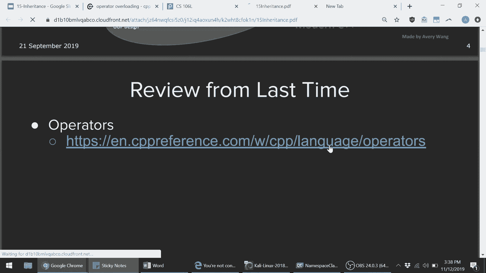

## 课程回顾与公告

上一节我们深入探讨了移动语义和特殊成员函数。本节开始前，我们先回顾一下课程进度并发布一些公告。

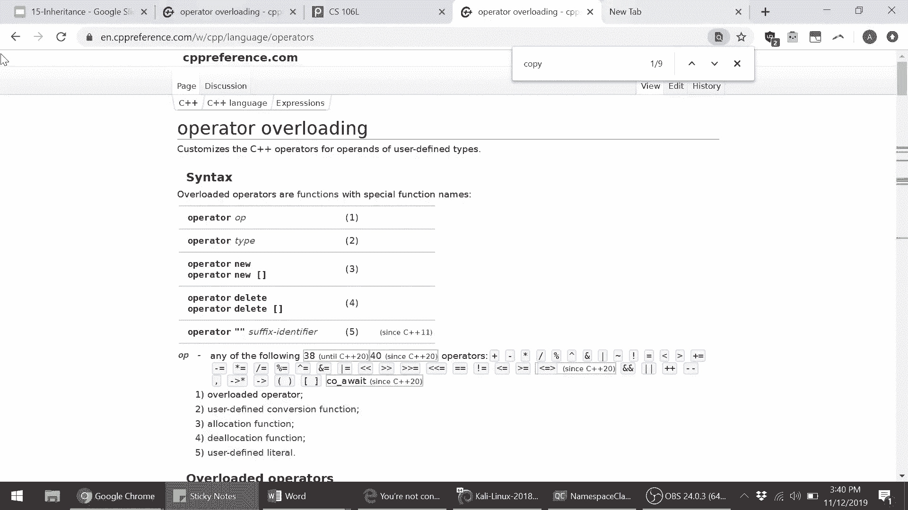

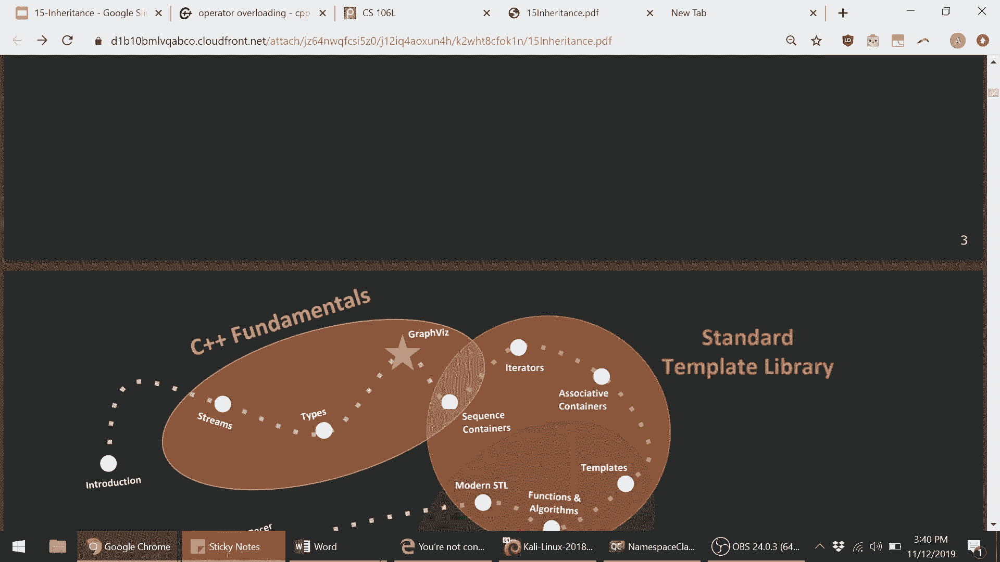

**课程进度**：我们已经涵盖了C++的基础知识、标准模板库、特殊成员函数和移动语义。今天是关于继承的四节课中的第一讲。

**重要公告**：
1.  作业2将于本周四截止，请合理使用迟交天数。
2.  作业1成绩即将发布。
3.  作业3将于本周四发布。
4.  请关注后续关于期末主题的投票调查。

---

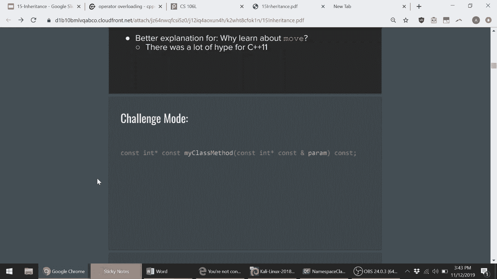

## 运算符重载参考

在深入新内容之前，我们提供一个有用的资源。关于运算符重载（包括拷贝和移动赋值运算符），`cppreference.com` 是一个极佳的参考网站。

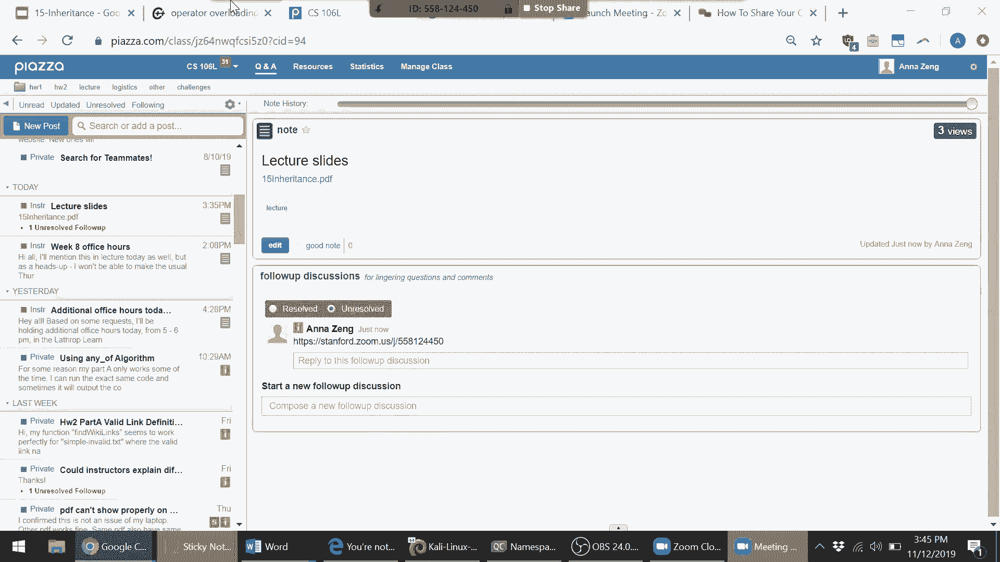

以下是该网站提供的一些关键指导：
*   **自我赋值检查**：在赋值运算符中，应检查 `this` 是否不等于 `&other`，以避免自我赋值。
*   **基于其他运算符定义**：许多运算符（如关系运算符）可以基于其他运算符（如 `==` 和 `<`）来定义，这是一种良好的编程风格。
*   **模板示例**：该网站提供了运算符重载应满足的假设性模板，有助于编写与C++标准库良好协作的代码。

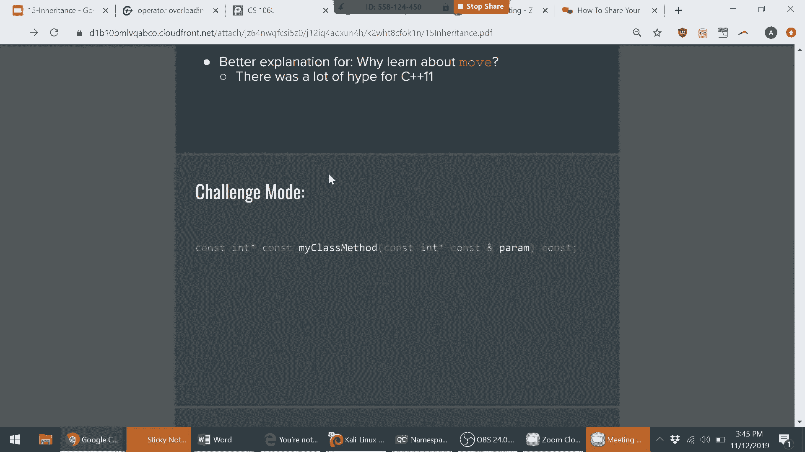

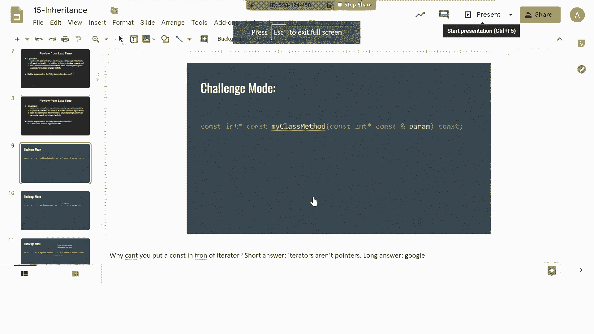

---

## 移动语义的重要性

有人提出了一个很好的问题：既然有了复制语义，为什么还需要移动语义？

移动语义的核心优势在于**效率**。它通过将资源从一个对象“移动”到另一个对象，避免了不必要的深层拷贝和额外的内存分配。这不仅在内存受限的嵌入式系统中至关重要，在普通程序中也意义重大。

例如，在C++11引入移动语义后，许多程序仅通过重新编译就能获得显著的性能提升，因为标准库类型都实现了移动构造函数和移动赋值运算符，使得许多原有的拷贝操作自动升级为更高效的移动操作。

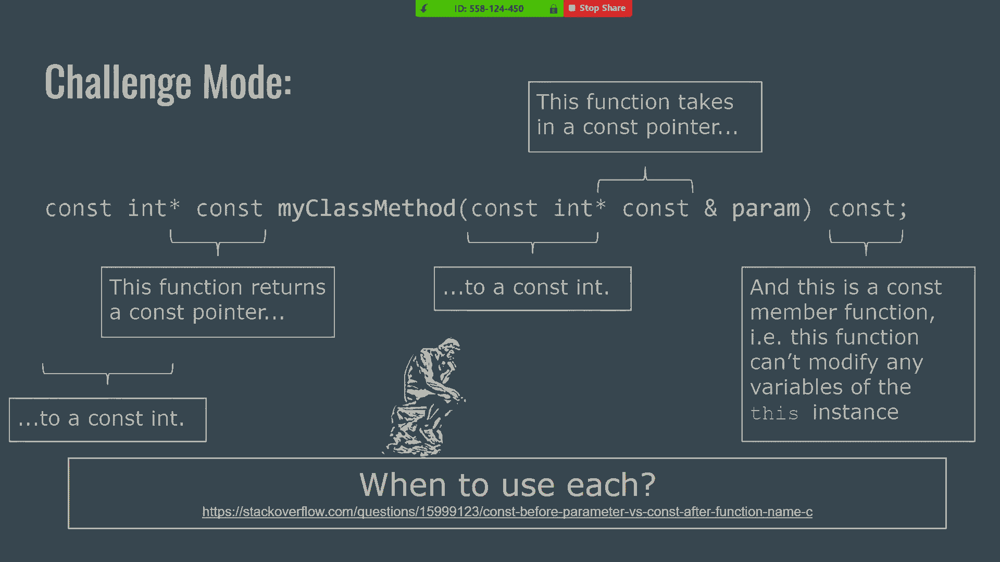

---

## `const` 关键字挑战回顾

现在，我们来回顾一个关于 `const` 关键字位置的挑战。理解每个 `const` 的含义对于编写正确的代码至关重要。

考虑以下函数声明：
```cpp
const int* const& Function(const int* const& param) const;
```
以下是每个 `const` 关键字的含义：
1.  第一个 `const`（在 `int` 前）：指针指向的 `int` 是常量，不可修改。
2.  第二个 `const`（在 `*` 后）：指针本身是常量，其指向的地址不可改变。
3.  函数末尾的 `const`：这是一个**常量成员函数**，意味着该函数不能修改调用它的对象实例的任何成员变量。

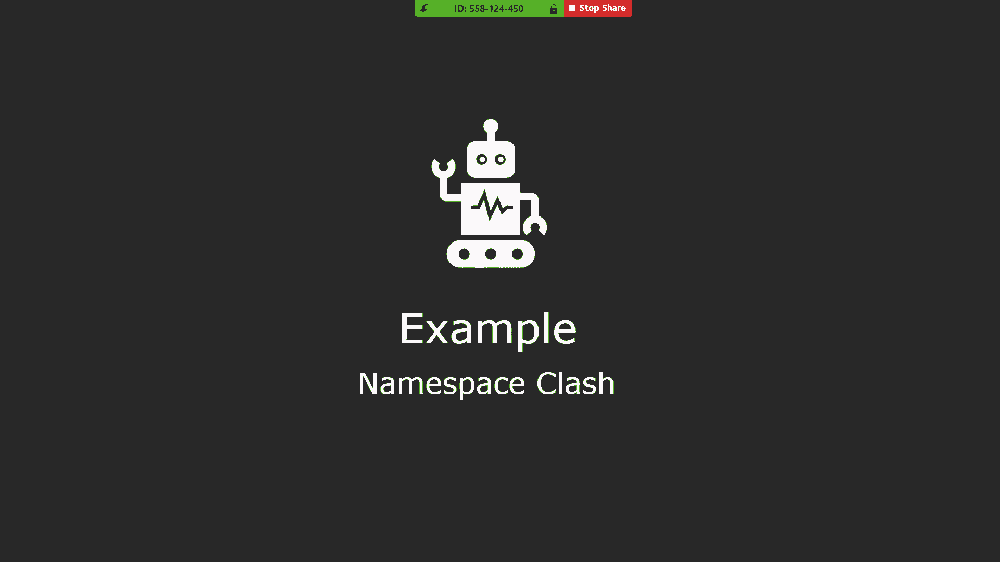

这些 `const` 分别约束了返回值、参数和成员函数的行为，是基于不同需求所做的不同选择。

---

## 命名空间

上一节我们回顾了 `const` 的复杂用法。本节中，我们来看看如何用**命名空间**来管理代码中的名称。

### 为什么需要命名空间？

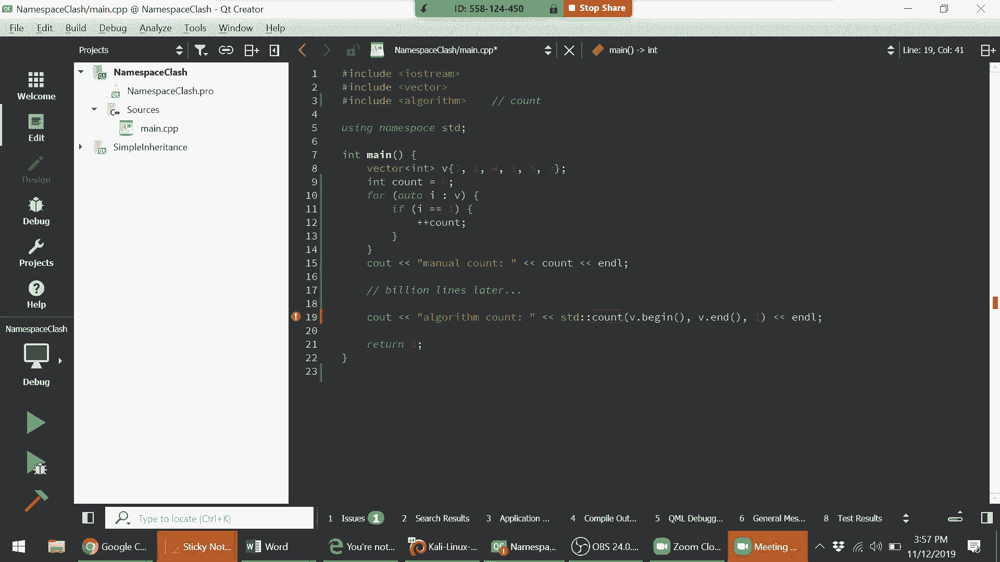

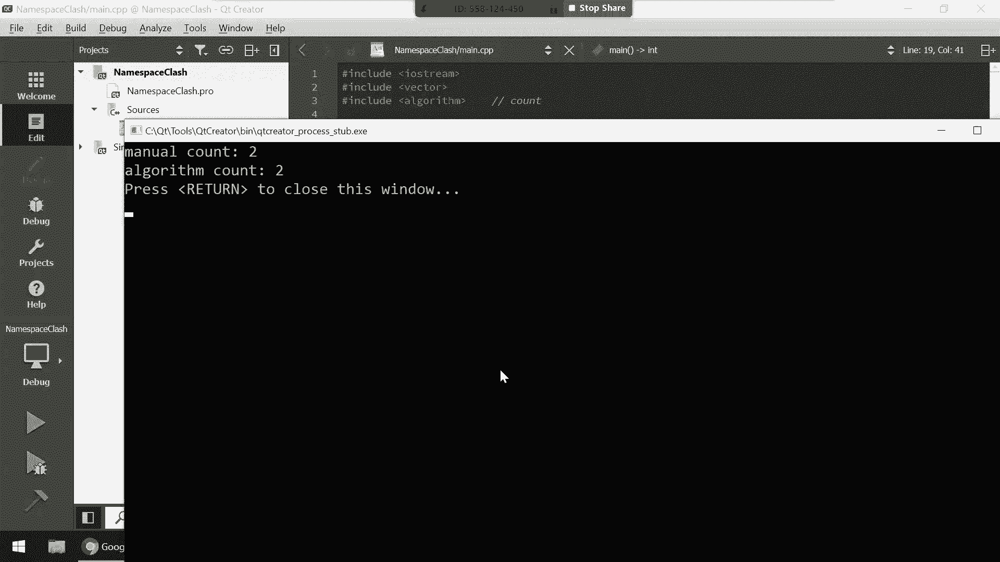

命名空间的主要目的是避免**命名冲突**。C++标准库使用了大量常见的名称（如 `vector`, `count`, `max`）。如果我们自己编写的类或函数也使用了这些名称，就需要一种机制来区分它们。

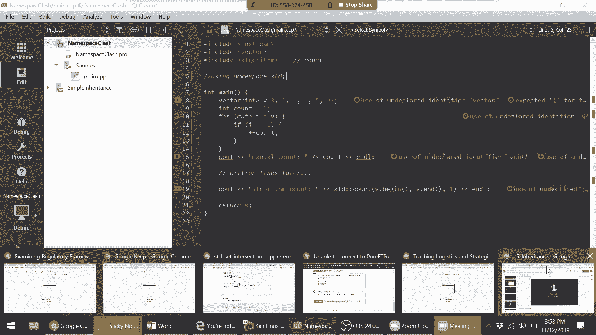

### 命名冲突示例

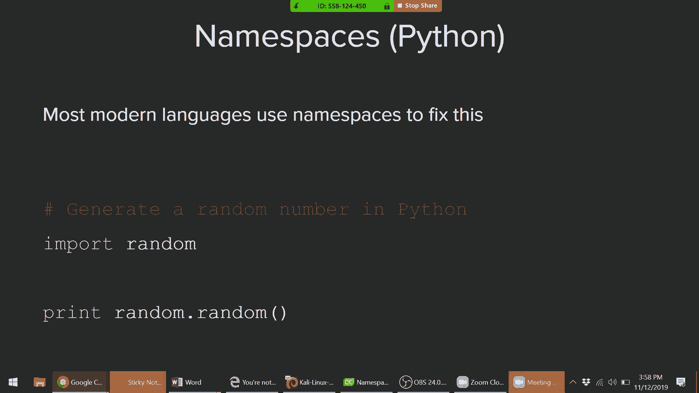

以下代码演示了一个潜在的冲突：
```cpp
#include <vector>
#include <algorithm>
using namespace std;

int main() {
    vector<int> v = {1, 2, 1, 3};
    int count = 0; // 局部变量 count
    // ... 手动计数逻辑 ...
    // 稍后想使用标准库的 std::count
    auto result = count(v.begin(), v.end(), 1); // 编译错误！
}
```
编译器会将 `count` 解释为局部变量 `int count`，并尝试对其使用函数调用运算符 `()`，从而导致错误。


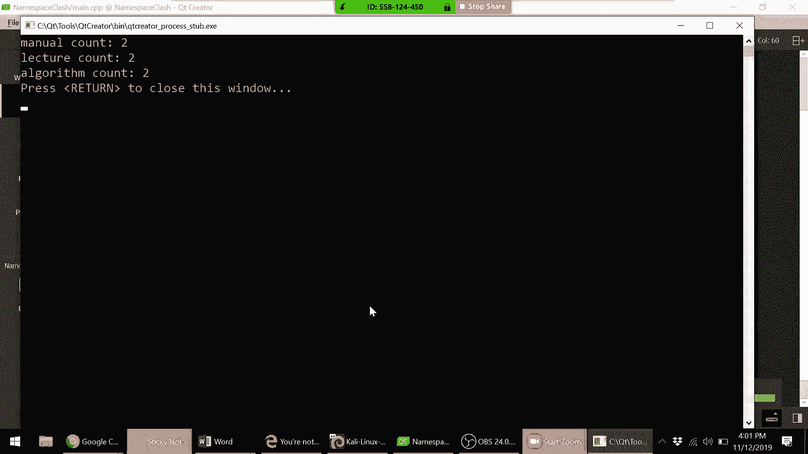

**解决方案**：即使使用了 `using namespace std;`，在存在冲突时也应明确使用作用域解析运算符 `::`。
```cpp
auto result = std::count(v.begin(), v.end(), 1); // 正确
```
这也说明了为什么我们更推荐使用 `using std::vector;` 等具体声明，而非 `using namespace std;`。

### 定义自己的命名空间

我们可以创建自己的命名空间来组织代码：
```cpp
namespace lecture {
    size_t count(const std::vector<int>& vec) {
        return vec.size();
    }
}

// 使用自定义命名空间中的函数
size_t c = lecture::count(my_vector);
```
命名空间可以嵌套，并帮助将代码逻辑分组。

### 命名空间与头文件

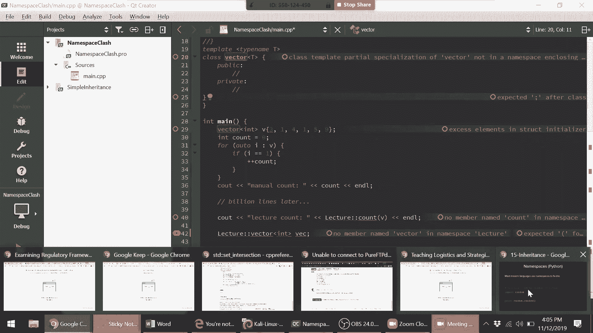

一个重要的风格建议是：**避免在头文件（`.h`）中使用 `using namespace`**。因为这会将命名空间强加给所有包含该头文件的代码。在源文件（`.cpp`）中酌情使用是更可取的。

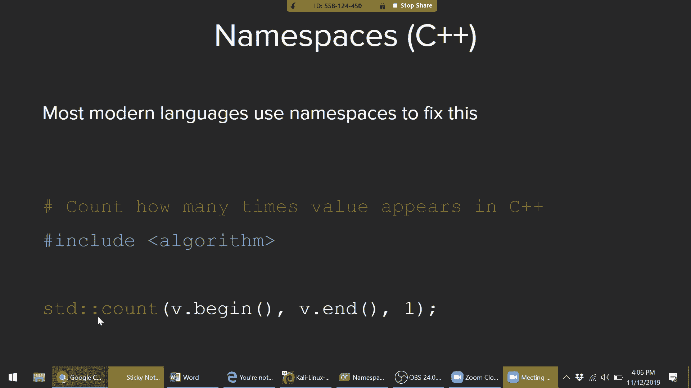

---

## 继承

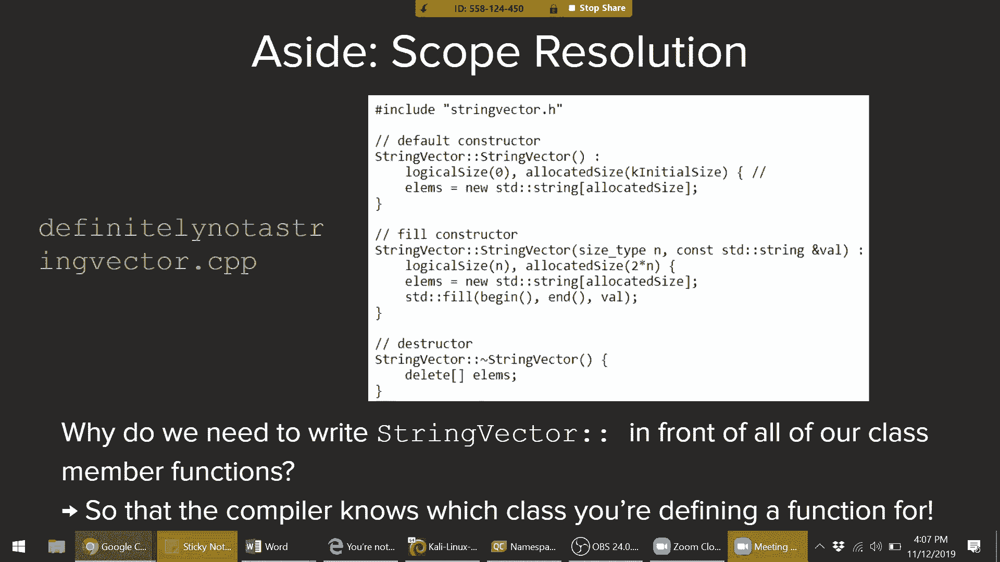

了解了如何用命名空间组织代码后，我们进入面向对象编程的另一个基石——**继承**。

### 继承要解决什么问题？

假设我们有两个类 `FileStream` 和 `StringStream`，它们都需要一个相似的 `print` 函数。我们不想在两个类中重复编写相同的代码。

一种解决方案是使用**模板**，它通过隐式接口实现代码复用。继承提供了另一种解决方案，通过显式接口建立类之间的层次关系。

### 接口与纯虚函数

在C++中，通过**纯虚函数**来定义接口（类似于Java中的`interface`）。

```cpp
class Drink { // 作为“接口”的基类
public:
    virtual void make() = 0; // 纯虚函数
};
```
*   `virtual` 关键字表示这是一个虚函数。
*   `= 0` 使其成为**纯虚函数**，意味着任何继承自 `Drink` 的类**必须**实现 `make()` 方法。
*   包含纯虚函数的类称为**抽象类**，它不能被实例化。

### 实现接口

类通过继承来实现接口：
```cpp
class Tea : public Drink { // 公有继承
public:
    void make() override { // 实现纯虚函数
        std::cout << "Steeping the tea.\n";
    }
};

class Coffee : public Drink {
public:
    void make() override {
        std::cout << "Brewing the coffee.\n";
    }
};
```
现在，`Tea` 和 `Coffee` 都是可以实例化的具体类，它们共享 `Drink` 接口所规定的 `make()` 行为。

### 继承中的访问控制

继承时使用的访问说明符（`public`, `protected`, `private`）决定了基类成员在派生类中的访问权限：
*   `class Tea : public Drink`：基类 `Drink` 中的 `public` 成员在 `Tea` 中仍是 `public`，`protected` 成员仍是 `protected`。
*   默认情况下（对于 `class` 关键字），继承是 `private` 的；而对于 `struct`，默认是 `public` 继承。

### 成员隐藏

在继承体系中，如果派生类定义了一个与基类同名的成员（即使是不同类型），它会**隐藏**基类中的那个成员。
```cpp
struct A { int value; };
struct B : A { double value; }; // 隐藏了 A::value
B b;
b.value = 5.5; // 访问的是 B::value
// int 类型的 A::value 被隐藏了
```

---

## 总结

本节课我们一起学习了两个关键概念：
1.  **命名空间**：用于组织代码和避免名称冲突的工具。我们应谨慎使用 `using namespace`，优先使用作用域解析运算符 `::` 或具体的 `using` 声明。
2.  **继承**：面向对象编程的核心概念，允许类从基类继承接口和实现。我们重点介绍了：
    *   通过**纯虚函数**定义接口。
    *   使用 `class Derived : public Base` 语法实现继承。
    *   理解抽象类与具体类的区别。

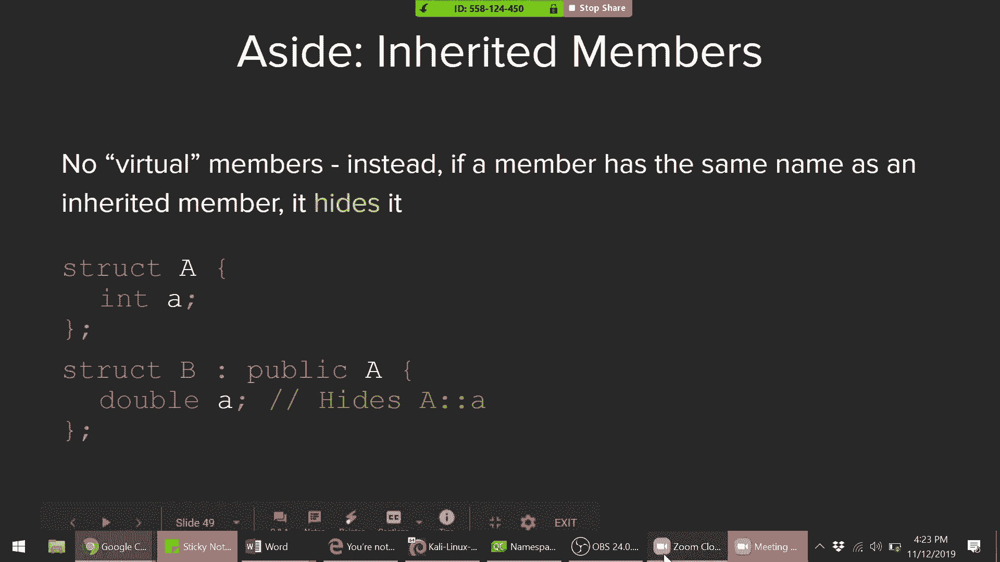


继承为我们提供了一种强大的代码复用和抽象建模方式。在下节课中，我们将探讨另一种复用代码的机制——模板，并比较它与继承的适用场景。