# 斯坦福大学《CS106L： C++编程｜ Stanford  CS106L C++ Programming 2019+2020》中英字幕（豆包翻译 - P16：[21]CS 106L Fall 2019 - Lecture 15_ Inheritance and Template Classes - GPT中英字幕课程资源 - BV1Fz421q7oh

好的，大家讨论的时候，我们为了让视频中的人跟上进度，一开始我们发了一些食物，只是开玩笑，我的意思是，我们，确实发了，但没关系，我知道有些人不能来上课，所以我们。

让大家考虑一下纯虚函数和非纯虚函数之间的区别，因此，今天我们将完成上次没有完成的继承部分，然后进入模板，类和概念，也就是说，重新审视模板的整体概念，但现在是，应用在面向对象的环境中。

所以今天非常令人兴奋，好的，那么谁能告诉我纯虚函数和非纯虚函数之间的区别，举手，好的，Brian，说说吧。纯虚函数等于零，而非纯虚函数是非纯虚函数。这完全正确，还有什么其他的不同之处吗？比如。

你的子类可能实际上会定义纯虚函数，因为，你在应，用虚函数，但纯虚函数对每个类都是不同的，而对于非纯虚，函数，你可以说，它只是一个通用的定义，但子类可以选择，使用它。完全正确，是的。

所以为了让后面的人能听到，如果有任何，人听不见的话，功能上的区别，语法上的区别就是这些，功，能上，纯虚函数必须由继承该类的任何类来实现。非纯虚函数是，你说，啊，我在这个类中实现了一个通用的，解决方案。

但如果我的派生类想要重写这个函数，它们可以，实际上有一个问题，就是，好的，比如说，正如我们之前看到，的，抽象类就是任何具有至少一个纯虚函数的类，换句话说，它有至少一个尚未定义的函数。所以我们上次看到的。

啊，是的，抽象类也可以拥有正常类，的一切，它可以有自己的变量，它可以有自己的非虚函数，像这个 bar。所以，有时出现的问题是，等一下，我觉得我在其他地方看，到过人们实际上重写了这个 bar 函数。

换句话说，非虚函，数。我认为适当的回答是，重写非虚函数是合法的，但不道德。

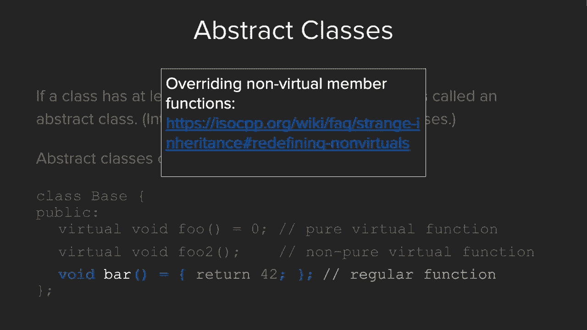

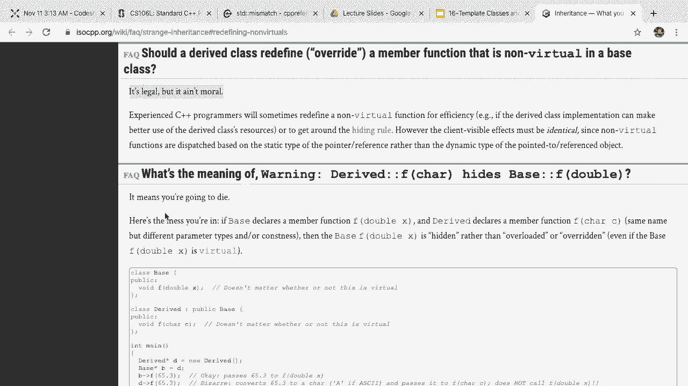

是的，为了澄清，当你设计自己的类时，如果你希望你的函，数可以被重写，你需要声明它为虚函数。如果你希望强制它可以被重写，你可以通过添加等于零来，声明它为纯虚函数。好的，到目前为止有问题吗？有吗？

等于零除了像 x 等于零那样的标记外还有其他作用吗？绝对有，你可以把它想象成将指针设置为 null 的等效物，是的，它有点像函数的等效物。好问题。是的，Brian？你在说什么，像你在做什么？啊。

那确实是一个打字错误。谢谢。我在跟随上面的等于零，但谢谢你发现了这个问题。是的，好问题。好的，关于上次没有讲到的一些术语，我们到现在为止一直，在使用这些词，但为了正式定义，当我们说基类时，它是被。

继承的类。也就是父类或超类。派生类是继承的类。所以我们稍后会看到一个例子，但这只是为了让你知道，如，果你在阅读继承的文档时，基类和派生类是你最可能看到，的术语。好的，关于实现你自己的类和继承关系。

有几件事要注意，比如说，如果你想设计你自己的类。所以有几个方面需要记住。关于构造函数，作为一种良好的实践，你在从另一个类继承，你的类时，你的构造函数中要包括父类构造函数作为初始，化列表参数之一。

所以具体来说，我们稍后也会看到一个例子。但要记住，当你实现你自己的构造函数时，你要调用前一个，类的构造函数，以便你可以使用它已经为你创建的任何构，造函数。然后，如果需要。

你也可以添加你在类中添加的任何新变量，同样，关于析构函数，也有类似的规则。在这种情况下，无论是编写你自己的类还是从一个类继承，时，关键是如果你打算让你的类可继承，你基本上总是将析，构函数设为虚拟。

这样做的原因是，否则可能会出现一些非常棘手的内存泄，漏，这些泄漏不容易预见。举个例子……，啊，是的。一般来说，一个类的析构函数是否为虚拟是判断它是否打，算被继承的一个好标志。这就是为什么会这样。

所以在这种情况下，我们有一个基类，然后我们有一个从基，类继承的派生类。问题是，假设一个用户想要创建一个类型为基类的指针B，指向一个新的派生函数。这整行代码就是继承变得棘手的地方。就是。

当你在处理不同的指针和不同的对象时，如何解释不，同的继承类？这正是我们在这门课程中跳过的内容。所有这些都是继承的棘手细节，你将在CS108课程中学习，或者在线阅读更多内容。但对了。

我们不会覆盖那部分内容。但本质上，如果我们在这里删除B，我们只调用基类析构函，数而不是派生类析构函数。因此，在派生类中分配的任何内存现在都会变成悬空的。所以，是的，这就是这一政策的原因。

所以这些只是两件风格上的事情，以防你发现自己编写自，己的类时。到目前为止有任何问题吗？是的，这些大多是定义性的或只是一些事实，以防你发现自，己想编写自己的类时。好的，所以另一个人们问过的问题是。

私有、保护和公共之，间的区别是什么？这又是关于同一主题的一些杂项事实。私有意味着任何私有的成员或变量只能由这个类访问。保护意味着保护的成员或函数可以被这个类或任何派生类，访问。

然后公共意味着任何人都可以访问。举个例子，假设我们有一个名为drink的基类，其中foo是公，共的，bar是保护的，baz是私有的。那么这意味着drink类本身可以访问这三个变量。

假设 tea 继承了 drink。那么 tea 可以访问公共和保护成员。而 rock，虽然与 drink 完全无关，只能访问公共成员，也，就是 foo。是的，所以这算是更多的定义。

到目前为止有任何问题吗？

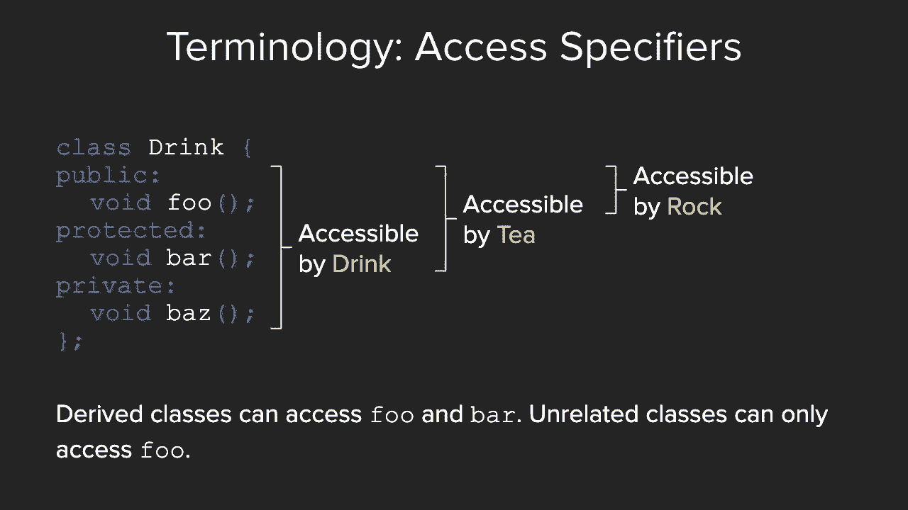

太棒了。所以在这种情况下，给你们。完美。好的，我认为我们回到录制状态了。这很有趣。哎呀。所以这是今天晚些时候的内容。好的。所以假设。我们要做的是我只是想演示一下如何使用声明自定义类的，语法。

看看你是否想在自己的代码中使用这个。所以再次，我们上次看到为什么我们使用特定的 using 语，句而不是使用标准命名空间。假设我们有一个叫 drink 的类，我们正在实现它。

而类的语法就像你们到目前为止实现的任何头文件一样。你可以有一个公共部分。你可以有一个私有部分。假设在我们的公共部分，我们只是想保留默认构造函数。假设我们还想要另一个构造函数，我们传入一个字符串作。

为口味。我们想要什么口味的饮料？然后我们将实现它。我们来维护一个私有字符串 flavor。然后在这里，我们当然只需初始化我们的 flavor 变量。注意这里我们使用了 Avery 讲过的初始化列表。

哎呀。然后假设我们想要一个纯虚函数。所以任何继承 drink 的类必须实现一个叫 make 的函数，这进一步意味着，在我们的 int main 中，我们不能做诸如， drink D = 等等 的操作。

原因是，因为，如果我们实际完成它，你会看到编译器会抱，怨，这是因为我们有一个纯虚函数，这意味着这个类不能被，实例化。所以假设我们知道我们希望这个类是可继承的，那么作为，我们的好习惯。

我们希望声明我们的析构函数为虚函数。我们还会将它设置为虚析构函数。太棒了。好的。所以在这种情况下，我们来实现一个类 T，它也会有一些公，共变量。假设它也使用默认析构函数。好的。

所以根据我们所说的构造函数，我们应该如何编写 T 构造，函数？对不起。这应该实际上写作 class T 继承自 public drink。你认为我们应该如何编写这个 T 构造函数？

假设它接受一个字符串作为口味。这里应该写什么？是的。使用它。完美。你认为这个语法是什么？陷阱问题。或者说，它可能是有点直观的。它可能有点直观的。是的。所以这完全正确。

所以我们需要做的就是使用已经定义在 drink 上的构造，函数。这有意义吗？大家跟上了吗？点赞。点踩。你能再讲一遍这一行吗？是的。绝对可以。是的。所以这行代码的意思是，我们想为这个 T 类定义另一个构。

造函数，因为我们希望用户能够传入他们想要构造的 T 的，类型。因此，他们会传入一个字符串表示的类型。我们想强调的一点是，在创建派生类的构造函数时，比如在，这个例子中是 T。

我们理想的做法是总是要在该构造函数，中调用基类的构造函数。这是因为基类已经有了一种接口或使用成员变量的方式，你希望继承这个类时能够复用这些方式。是的。这是个好问题。语法方面。

我们再次使用了 Avery 讲座中的初始化列表。太棒了。是的。这有意义吗？是的。所以下划线类型只是一个风格上的选择。我本来可以直接叫它类型。在这种情况下，它仍然会起作用，因为在初始化列表中，它。

知道哪个是这个类型，哪个是参数。所以，是的。为了避免混淆，我们实际上可以保持这样。很好。是的。到目前为止的问题都很好。是的。这段时间内输入了相当多的代码。所以类的语法对大家来说有意义吗？好的。独特的是。

如果你查看 106B 或 X 作业中的 。h 文件，你，会发现它实际上使用的正是这种语法。只是通常定义了更多的函数，你不会特别注意到类的语法，以及公共和私有语法。是的。

所以我们正在做的是在这个文件中定义一个类。通常定义类的地方是在它们自己的头文件中。

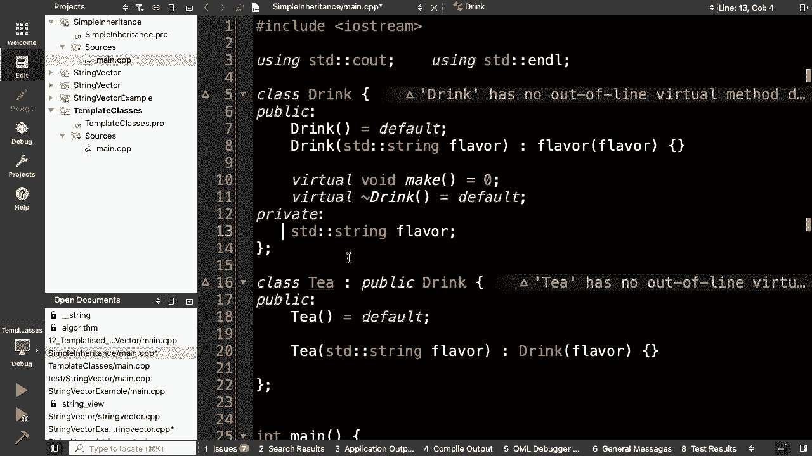

所以在这种情况下，恰好我们在主 。cpp 文件中定义了类。

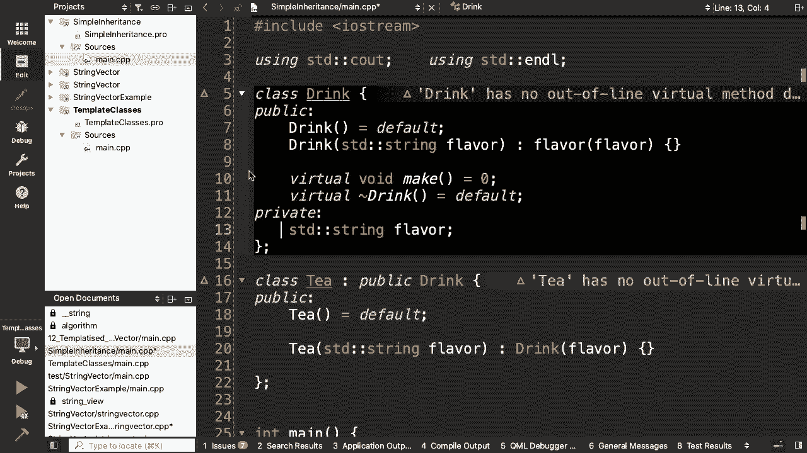

。是的。这有意义吗？是的。所以每次你想使用父类中的某个方法时，只需在方法前加，冒号和空格，然后调用父类中的方法？或者调用父类中的任何方法？是的。这个冒号实际上只是构造函数特有的。它只用于初始化列表。

我想这是两节讲座前的内容。是的。是的。是的。有一种方法。假设 make 实际上不是一个纯虚函数。假设它实际上是一个有。假设我们定义它为 make does get a cup 或类似的东西。

有一种方法可以使用作用域解析来访问父类的函数。但我们不会涵盖这个内容。所以如果你感兴趣，可以找我们讨论或查找相关资料。是的。但这是你可以做的事情。太棒了。好的。是的。所以如果我们继续。所以，再次。

如果我们希望 T 可以被继承。我们可以做类似的事情。所以，再次，我们将析构函数设为虚函数。然后，在 drink 中，make 被声明为纯虚函数。这意味着在 T 中，我们必须实现那个函数。

我们也可以将其声明为纯虚函数。然后交给另一个函数来实现。是的。我很高兴。测试得很好。测试得很好。嗯。好的。好的。所以如果我们要实现 make，比如说。所以在这一点上，比如说我们只是想把这个函数做成。

比如说，我们希望所有的 T 以相同的方式创建。所以我们会做一些像。 创建它。从 T 类中创建 T。完美。然后实际上，这就像是，为 T 取一个杯子。好的。到目前为止这有意义吗？

所以我们所做的是声明了一个名为 drink 的类。我们还声明了一个名为 T 的类，它继承自 drink。我们涉及的四件事是。构造函数的使用情况如何？析构函数的使用情况如何？

然后像虚函数这样的东西如何在两个类中实现？是的。嗯。所以在 T 的情况下。所以在这种情况下，由于 T 不再有任何纯虚函数，我们理，论上可以做一些像 TT 的事情。然后让我们用像红色这样的口味来初始化它。

所以。对。所以这实际上也需要自己的口味变量。然后我们可以做一些像 T。make 的事情。所以如果你想象这是另一个。嗯。所以 drink 和 T 是一种矫揉造作的例子。但你可以想象，假设这两个类是流类。

那么这可以是流类的某种接口。而这可以是它的实际实现。所以这实际上会是像打印到流中的东西。嗯。正是如此。所以在这种情况下，我们会调用 T。make。原因是因为 drink 实际上没有定义 make 函数。

好问题。是的。嗯，很好的问题。那么为什么 T 的析构函数是虚函数？实际上，它不必是虚函数。我本来打算声明两个更多从 T 继承的函数。但我们可能没有时间去做。所以，是的，我现在实际上要跳过这部分。所以。

是的，假设 T 实际上是一个最终类。我们不希望 T 被继承。那么绝对我会去掉虚函数。嗯，好问题。事实上，由于这个原因，我甚至不需要写它。但我只是为了注释的目的留在那里。嗯，Eva。绝对是的。绝对是的。

所以问题是，再次问，如果我们有两个 make 函数，一个在，父类中？假设这个函数是像，从 drink 类中创建 T。那么绝对可以。我们可以调用 T。make。事实上，我相信我们可以实际运行它。

看看它打印了什么。所以，再次，我们用 T 初始化它。那看起来很熟悉。对。好的。它打印了一个奶昔。它打印了一个奶昔。相当不错的 make 函数。好的。这就是 C++ 的未定义行为。完美。

并且它说从 tea 类创建了 T。但是如果您愿意，有一种方法可以访问父类的 make 函数，要做到这一点的方法是使用名称空间解析。所以应该是——好吧，我得记住语法。

但应该是类似 drink 或 tea 这样的东西。不，应该是 T。drink。我认为是这样的。我们看看是否正确。从 drink 类创建了 T。好了。好的。是的。所以，绝对是。老实说。

这是一个比这长得多的主题。所以，是的，如果看起来有点仓促，我道歉。是的，这些只是一些特定的 C++特性。如果您查看 CPP 参考——如果您在 C++中搜索继承，您会——，您会深入了解所有奇怪的情况。

比如，如果您从这个创建一，个类但想访问那个中的东西等等。是的。所以这绝对是一个非常大的主题。并且有很多——是的。你们问了很好的问题。是的。还有其他问题吗？在我们继续之前？是的。对。我不记得了。

您能重复一下为什么调用虚析构函数是好的吗？是的。是的。所以我们想要调用虚析构函数的原因是因为我们想要保证。

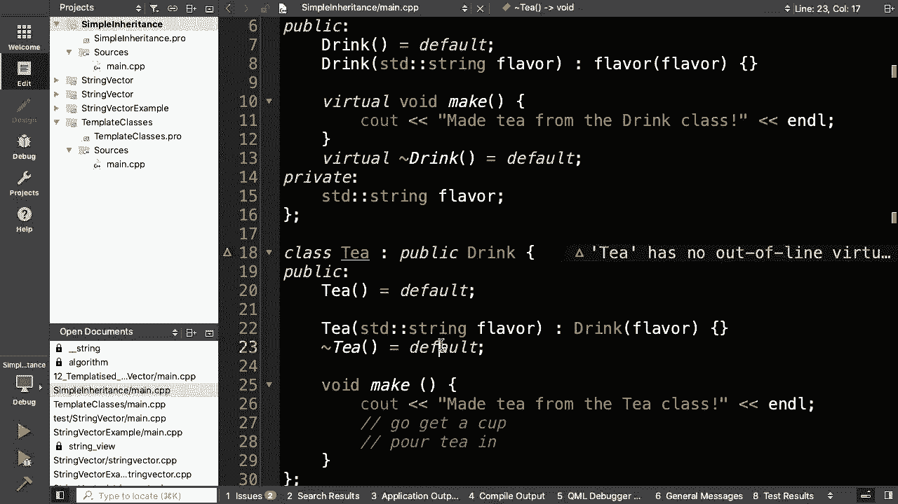

——如果我们回到这里。我们想要保证，比如说，如果用户出于某种原因声明——是的，这进入了一些奇怪棘手的继承细节。但是比如说，您想要声明一个派生类型的对象但声明一个，指向基类型对象的指针。

虚函数确保如果您说删除 B，它将转到派生类的——派生类，的析构函数而不是基类的析构函数。是的。所以在删除的情况下以及析构函数被调用的任何其他地方，在这种情况下——所以，是的。

我们强制析构函数为虚函数的原因只是为了防止内存泄漏，所以在构造函数中，没有——是的。在构造函数中，实际上没有内存问题。是的。我们可以再讨论。是的。如果我们感到困惑。是的。好的。好的。好的。是的。

在我继续之前还有问题吗？没有。好的。所以我上次提到的一件事是我给了你们这个问题。问题是我们有——让我们看看。我们有一个针对 F 流的打印语句，还有一个针对字符串流，的打印语句，我问你们，你们会怎么解决？

我们最初的直觉是，哦，等等。我们不是学过模板吗？这不正是他们试图解决的那个问题吗？绝对是。模板是这个问题的完美解决方案。然后我就说，好吧。但是 JK，这里有另一种方法来做。这里是显式接口。所以再一次。

记住，模板是隐式接口，而这些是显式接口。所以一个自然的问题是，再一次，什么时候使用每一个？所以事实证明，这实际上是一个更大的问题，什么时候使用，被称为静态多态性而不是动态多态性的东西？

在继承部分这将是一个常见的反复出现的问题，因为这是，一个非常大的部分。我不会详细讲解多态性是什么。你可以把它理解为编译器如何能够接受不同类型，并对每，种类型使用相同的代码。所以这有点像你对模板的熟悉感。

它可以使用相同的模板代码，并根据你传入的类型选择使，用哪个模板代码。所以模板和我们刚才讨论的内容之间的区别在于，模板，你，可能还记得，这是一点小细节，但是模板的工作方式是，当，你编写某个东西时。

假设我们有一个向量模板，然后在我们，的代码中我们写了类似“vector of ints”的东西，那么编，译器在编译时会实际创建一个全新的模板函数，只要我们，有类型名称T，它会字面插入“int”。因此。

模板被称为静态多态性，在编译时生成所有实际不同，的代码片段。在这种情况下，继承实际上是一种动态多态性。换句话说，在比如说，基类指针B等于新建派生类的情况下，它不会知道你指的是哪个类，直到运行时。

直到你实际运行，代码时。所以没有办法提前确定什么代码在什么地方有效。它只会在运行时知道，啊哈，B实际上是基类的类型，即使它，指向一个派生对象。所以，如果那些细节不明白也没关系。要记住的一般概念是。

模板在编译时进行它们的多态性，而，派生类在运行时确定它们的所有类型。所以，这就是何时使用每种方法的主要区别。对吗？去做吧。那些将会有所不同。静态的，是的。完全正确。静态与动态通常意味着编译时与运行时。

是的。但这是一个好问题。所以作为你们的参考，如果你们遇到类似之前的问题，你们，有两个打印语句，但它们实际上指的是相同的代码，只是有，两种不同的类型，你们现在有两个解决方案。你们可以创建两个不同的类。

或者使用模板。这就是何时使用每种方法的一个想法。当你非常关心使运行时快速时使用模板。换句话说，让所有工作发生在编译时。或者当，例如，假设我们的两个类像是，再次，比如说，像岩，石和茶。换句话说。

它们没有共同的基类。在这种情况下，继承相同类的解决方案实际上并不适用。然后，是的，派生类你希望在节省编译时间时使用。实际上，还有一个使用派生类的好处。再次澄清一下，我们在这里使用派生类的方式是。

假设我们，有一个名为drink的类，并且我们有两个子类叫做茶和咖啡，那么如果drink类已经定义了make函数，那么茶和咖啡就不，需要定义自己的make函数。

这就是我所说的在这里作为替代方案使用派生类的意思。明白吗？这样我们使用派生类的方式是否和使用模板时相同？Victoria，你能总结一下吗？是的，绝对可以。绝对可以。正是如此。正是如此。所以对于模板。

编译器必须创建每一种类型，而在类中只有，一个函数。只是运行时必须确定使用哪个函数。在这种情况下，只有一个函数。正是如此。是的。所以派生类的另一个好处是你会注意到，使用模板时，实际。

上每次都是在复制和粘贴代码。每次只是将 T 替换为另一个变量类型。因此，你的代码中可能实际上有六个不同版本的相同模板，一个用于 int，一个用于 double。从程序员的角度来看，这只是一个模板。

但是当你在代码中编译时，将会有多个模板版本。这就是所谓的代码膨胀。所以这是不使用模板的另一个优势。话虽如此，我们也熟悉为什么模板使用起来很好。所以这是另一个关于何时使用每种方法的情况。

这是一个很好的参考。好的。是的。有人有任何问题想在讲座中澄清的吗？是的。我们也可以将讨论放到线下进行。好的。是的。为了给你们提供一些背景，首先，我们没有涵盖的内容，就，是这就结束了继承的部分。

我们没有涵盖多态性是如何工作的。我们也没有涵盖像 base pointer B = new derived 这样，的那些棘手的细节，诸如如何解析你所引用的函数。是的。这些都是继承的一些棘手细节。

为了给你们提供一些背景，比如如何放置这次讲座，可以将，继承视为如果你正在尝试设计自己的大型系统，其中需要，不同类型的不同类。比如说你要设计一个访问系统，你需要像学生类型和课程，类型。

这时你就要开始考虑继承，思考哪些类型是其他类型的类，型？例如，我如何构建我的整体系统？这就是面向对象编程的整体概念：你如何与所有这些不同，类型（如学生、课程或作业）一起工作，使它们协同工作。所以。

如果你的项目不涉及那种大型系统设计，那么请记住，这一点。但如果你不理解它，也不要担心。是的。如果你想设计那种大型系统，这就是用到的地方。好的。棒极了。这是另一张幻灯片。

我想我们已经有了几个关于类型转换的问题。你应该如何进行类型转换？我实际上会留给你们以后阅读。简而言之，现代 C++ 中，最佳实践不再是像圆括号 int B ，或 int 圆括号 B 这样的做法。

正如你们可能在许多其他课程中看到的，最佳实践实际上，是使用被称为静态转换的方式。所以，是的，我会把这个放在那里作为参考，但现在为了节，省时间我不会进去看。但是，是的。

这是一个关于如何将事物从一种类型转换到另，一种类型的说明。好的。目前有没有人有任何问题需要回答？好的。好。是的，这对继承的讲解确实像是速成课程，尤其是你之前没，有见过它的话。所以尽量理解你能理解的部分。

祝贺你在那些你不理解的，地方。好的。很好。在这种情况下，公告。所以作业一的成绩。好的。Avery，纠正我一下。它们都发布了吗？所以有一位课程组长本周遇到了紧急情况。是的。所以他们还没有完成。

但他们很快就会完成评分。否则，我认为其他人的成绩已经全部评分完毕了。是的。所以如果你去 paperless。stanford。edu，你应该能够看到，你的作业反馈。再次说明。

我们很愿意坐下来讨论任何反馈，或者如果你想，深入了解你的代码，或者看看你如何改进它。是的。一定要联系我们。我们很乐意讨论这个问题。是的。顺便提一下，我认为到目前为止所有已经评分的同学都通，过了。所以耶。

所有人都通过了。太棒了。是的。所以其他行政事务。作业二今天到期，但记住你可以在整个学期内使用四天的，延期天数，如果你还没用过的话。然后，如果你完成了作业，恭喜你。你已经正式完成了这门课程。

你已经完成了所有要求，我们几乎可以保证你会通过。然后作业三已经发布了。作业三，我放了。是的。所以它已经发布了。PDF上的截止日期不正确。是的。所以我现在要改一下。用这个来说明。是的。然后我还会加一个。

我要添加一个小的说明，因为我在作业中添加了移动语义，所以我要添加一个关于移动语义的特别说明。是的。这是一个相当具有挑战性的作业，但它也是其中一个。我认为这是最有趣的作业。它结合了所有的主题。

它不仅结合了课程后半部分的主题，还重新讲述了一些算，法和模板的内容。所以。是的。是的。你会看到真的。你会在那个作业上工作。这是一个非常酷的作业。是的。材料涵盖到今天的内容。Anna会讲解模板类。

那将涵盖作业三的材料。好的。是的。从后勤角度来说，作业三将在这门课结束讲座之后到期。也就是说，我知道我。我们可能还会在最后一周继续有办公时间，如果你想继续，做这个作业或者过来和我们讨论。

然后我们会把成绩发给你们。是的。如果你有任何问题，请像往常一样在Piazza上发帖。这个。11点钟。哦！是的。应该是。是12月。是的。是。是星期四。是的。是的。不，其实是明年2020年到期。所以。

有很多延迟日期。太棒了。好的。所以，是的。所以，我们要讲的最后一个大主题就是模板类。好消息是，你们实际上对所有的模板类都非常熟悉。不是完全熟悉。但是在语法上，它与我们看到的模板函数非常相似。事实上。

为了让你们回忆一下，因为我又查看了一遍，模板，是在第四周，这感觉好像是很久以前的事了。所以，回到我们的STL模板讲座，你们还记得使用我们最喜，欢的计数函数吗？好的。是的。所以。

为了回顾一下我们之前看到的模板，逻辑是。好的。我们有一个对整型向量非常有效的函数。但是它做了很多假设。那么，我们如何去除这些假设，并把它们放到模板中呢？所以，第一个假设是。好的。它不一定是整型向量。

它可以是任何数据类型的向量。我们说。 好的。好的。这很不错。然后我们说。好的。不。我们可以做得更好。它不一定是数据类型的向量。它可以是任何数据类型的集合。但这时候我们遇到一个问题。

就是并不是所有的集合都能，以线性方式进行迭代。例如，我们看到的映射和集合，它们没有按照顺序递增的概，念。所以，我们找到的解决方案是。好的。相反，我们将使用我们最喜欢的迭代器来遍历函数。然后。

这又做了最后一个假设。实际上，我们为什么需要它成为一个集合呢？实际上，我们可以使用任何迭代器的范围，统计值在该范围，内出现的次数。好的。这对你们来说熟悉吗？点头表示是的。好的。好的。太棒了。所以。

总结一下，我们用函数模板所做的就是描述如何构建，一组相似的函数。所以，在这里我们能够构建一个函数，该函数可以计算某个，值在任何其他东西范围内出现的次数。所以。

这是一个基于你传入的迭代器类型和数据类型的家，族。猜猜类模板是什么？事实上，你会发现它的语法也非常相似。所以，我们来看一下模板类是如何工作的。

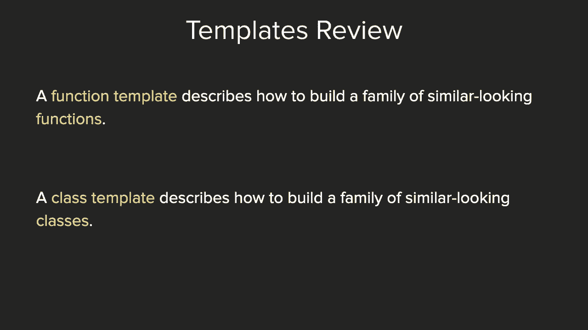

这会有点有趣，因为我很确定。

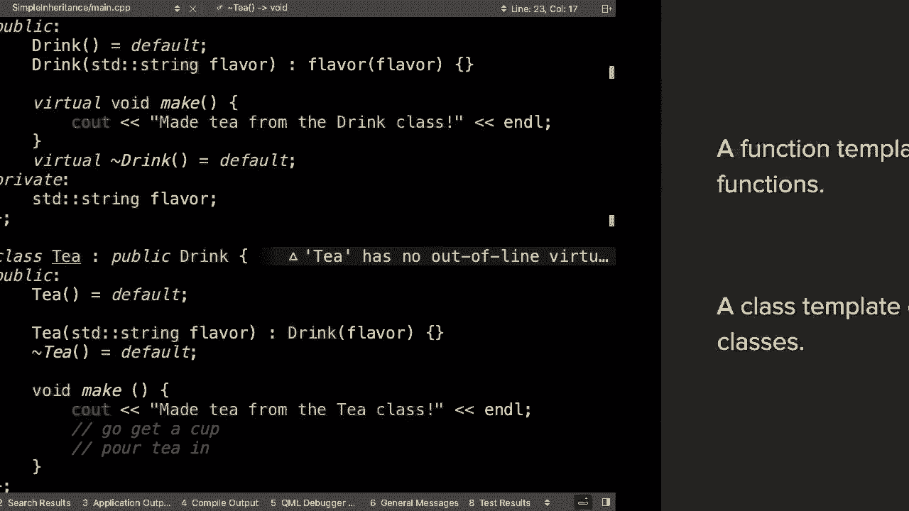

是的，我所有的代码还在里面。好的。所以，我实际上很快。哦，不要看，不要看，不要看，不要看。好了。好的。所以，假设我们从一个函数开始，比如，一个看起来像这样，的类。为了让你了解发生了什么。

我们现在要做的是实际实现你，在第二次作业中使用的优先队列。不完全是这样。实际上我们不会实现 compare 函数部分，因为它需要一些，额外的细节。但我们现在要做的是把这个优先队列。

从现在只处理 int ，的状态。它要求只传入 int 类型。我们将把它改成一个模板化的类，以便它可以是任何类型，的优先队列。所以，这有很多代码。所以，快速总结一下它在做什么。

我们有我们的 main 函数。我们将创建我们的优先队列类型。现在它只定义了一个 int 向量。所以，我们甚至不需要做任何事情，因为我们没有进行任何，参数化。我们推送了 3、5 和 7。

然后 cout 了它。然后在我们的类优先队列中。所以，再次注意我们使用这个类语法来定义一个类。再说一次。我们有构造函数和析构函数。我们将实现的三个函数是你在第二次作业中可能使用过的，三个函数：

top、pop 和 push。不，我在开玩笑。和 push。所以，是的。不要在意这些实现的东西。实际上挺有趣的。如果你看看斯坦福库中的优先队列实现，它使用了我们在，这里使用的方式。

也就是使用一种称为堆的数据结构。但不要在意这个。我们实际上现在只是把它简化一下。

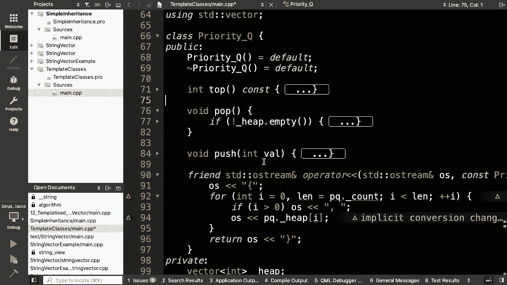

所以，这就是我们的类。然后我们还定义了一个输出运算符。

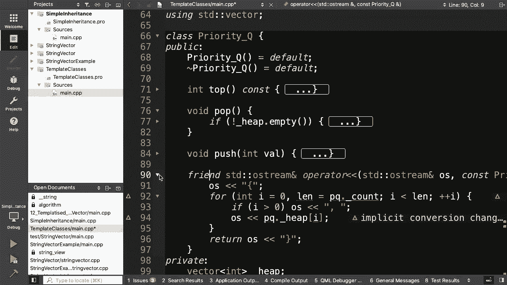

所以，如果我们现在运行这个。哎呀，我们还在运行简单继承。给我一点时间。来自 drink 类的 T。如果我们把它设为活动项目。我就做这个。

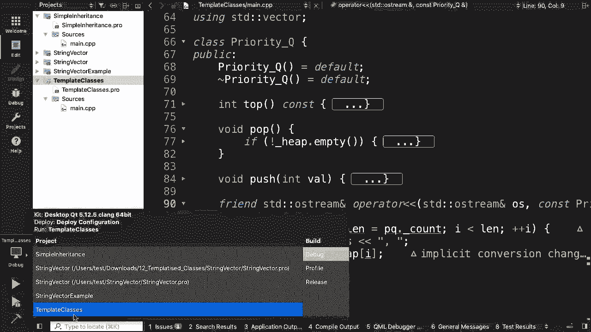

意外的。啊，对了。

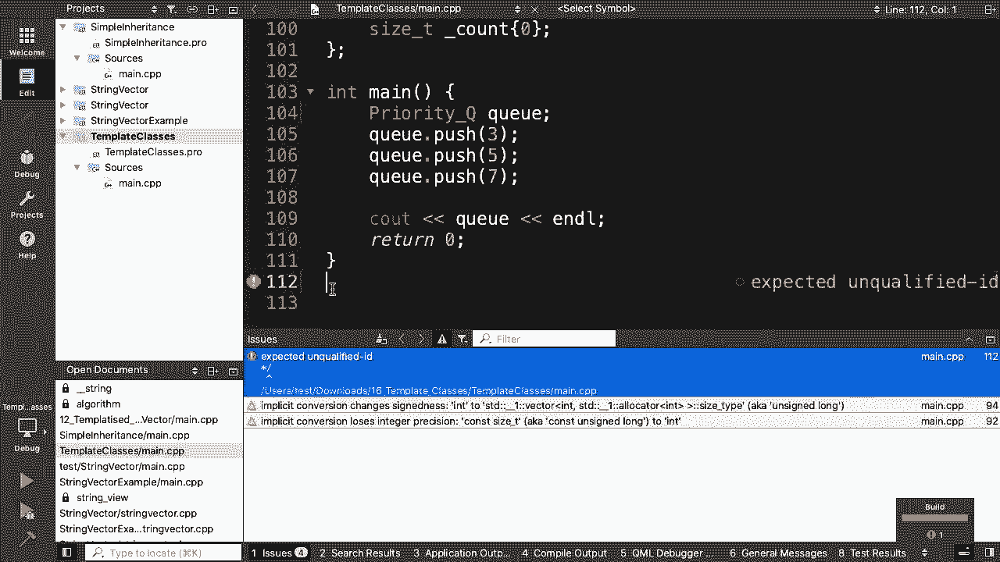

你说什么，你不认识结束注释符号？完美。它输出了 735。好的。输出的顺序很奇怪只是因为我们打印的方式。所以，不要在意那个。我们只要确保它能工作。好的。所以，完美。所以，我们定义了这四样东西。

top、pop、push 和输出。然后我们有一些用于实现类的私有变量。所以，这就是这个类。再次说明，这个类目前只允许是 int 类型的优先队列。所以，你们对如何将它语法上变成模板化类有什么直觉？

你们认为我们会写什么？是的，Zach。好的。好的。告诉我，告诉我，告诉我，告诉我该怎么输入。我会输入。只要大写 T。T 前面需要什么？输入它。好了。因此，这将是第一个区别。所以。

函数模板和类模板之间的一个区别实际上只是我们，模板化的变量类型。在这种情况下，它将是一个类。不，我收回刚才的话。对不起。实际上，我们在这里不会做的事情，但你可以在其他地方做，的是。

你实际上可以让类本身成为一种模板变量类型。所以，比如说，我们定义了另一个东西，比如说我们定义了，一个结构体像 node。然后那个 node 有一个 int priority 和一个 int 数据。

之类的。然后我们可以做的是，我们可以在类上定义我们的模板类，在这种情况下，我们可以将 node 作为类型传入。但在这种情况下，我们可以坚持。它一定要是一个类吗，你可以做到吗？不一定。所以，实际上。

让我们做类吧。所以，一个类将包括任何东西，包括像标准库这样的东西。因此，它将包括向量，诸如此类的东西。因此，在这种情况下，由于我们想做一个字符串的向量，我，们将使用类。是的，你需要澄清吗？是的。

因为我几周前在想这个问题。我认为类和类型做了类似的事情。我认为有一个边缘情况，如果你想做像嵌套模板这样的事，情，如果你想做一个模板的模板，那么那里会有一些奇怪的，情况。大多数人不会编写类的模板模板。

因此，对于大多数用途，类和类型名称类是完全相同的。好的。这实际上是一个很好的澄清。很好。好的。因此，你可能记得从作业分发单中，我们有一些东西也写了。

 class container 等于 std vector of t。所以，这句话的意思是，它说，好吧，这个类模板接受两个参，数，第一个是某个类 t，第二个我们称之为 container。

这句话的意思是，默认情况下，除非另有指定，否则将其设，置为 t 的向量容器。好的。到目前为止这有意义吗？到目前为止关于模板化的任何问题吗？棒极了。好的。那么。

我们还需要做什么才能将这个类完全转换为模板类？所以，现在，我们已经声明了我们的模板变量，但我们是否，在任何地方使用了它们？好的。那么，我们的代码中需要在哪里更改？是的。完美。正是这样。好的。完美。

我们看到一个 int 在那里。还在哪里？好问题。我们需要改变构造函数吗？不。是的。不。这是一个非常好的问题。因此，在这种情况下，由于我们在构造函数中没有做任何特，殊的事情，我们仍然可以使用默认的。

它将调用我们传入的任何类型的默认构造函数。因此，如果，例如，我们传入的 t 是一个向量，那么它将能，够调用默认的向量构造函数。是的。好问题。是的。我们还需要在代码中的其他地方修改，以便将其完全转换。

为模板函数、模板类？完美。完全正确。然后还有一个地方。你看到了吗？完美。完全正确。所以，在这种返回类型的顶部。太棒了。是的。所以，这个 t 堆的向量实际上与我们传递的内容没有关系。

这只是我们在底层实现优先队列的方式。是的。所以，我们其实可以选择用其他方式实现，比如链表，这样，我们就不会使用向量了。我们会使用不同的东西。是的。这是个好问题。这个向量与这个向量无关。是的。好问题。

所以，是的。实际上，这是个好问题，因为我们并没有在任何地方使用容，器。确实如此。在这个函数或我们现在实现的方式中，没有地方实际使用，容器。但这算是一种接口。难道不能把容器作为保存堆的东西吗？是的。

我们可以。在这种情况下，我们可以。是的。我们不一定要这么做，但完全可以。太棒了。很酷。那么，在这种情况下，我们现在可以使用。所以，就这些。你们刚刚对一个类进行了模板化。所以，是的。太棒了。

这感觉很像你们模板化一个函数的方式，这很好。所以，现在我们可以使用它了。注意，我们将其命名为 priority_ 单字母 Q 以避免拼写，错误，因为 Q 很难拼写。不，其实也还好。所以。

正如我们在作业中看到的，为了证明我们模板化的类，确实有效，在作业中，我们使用了一个字符串的向量，我们，只是没有定义字符串。是的，谢谢。完美。好的。所以。是的。做得好。做得好，你们。是的。不，捕捉得很好。

捕捉得很好。是的。所以，完美。所以，在这种情况下，我们现在做的是优先队列的类型不再，存储整数。它存储的是字符串的向量。所以，让我们选择这三个非常随意选择的词。然后看看。

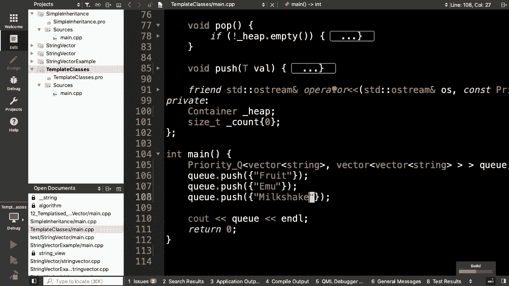

对。所以，这是我们最后一次需要做的更改，而不是。是的。所以，实际上，我们想做的是一个每个循环，因为这是一个。

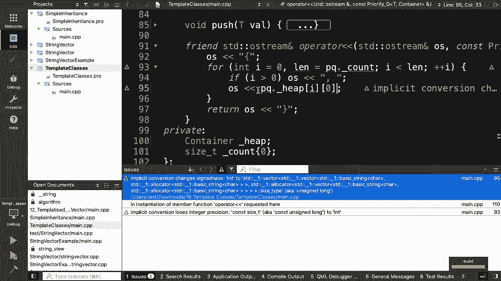

字符串的向量。在这种情况下，我有点偷懒，因为我知道每个只是大小为 1，所以，我们可以直接访问零索引。但我们创建了自己的模板化类并使用了它。做得非常好。这实际上是我们结束的地方。所以，我们还有一分钟。

所以，我实际上会尝试讲解概念，因为，再次强调，概念我们，早在模板讲座中和 Avery 一起讨论过。而且，你们看到的是。对。所以，当我们有一个模板时，我们做了各种隐含的假设。所以。

Avery 给你们的一点提前预览是，在 C++20 中，有一，些称为概念和约束的东西。因此，约束是定义模板后，语法中的内容，你说“requires”，然后提供一系列布尔值。在这种情况下，仅就术语而言。

概念是这些约束的一个名称，集。因此，C++20 中的概念的作用是，它允许我们将那些隐式接，口转换为显式要求。所以，现在，如果你尝试在编译时运行这段代码，如果你传，入的东西没有，例如，输入迭代器。

那么你的代码实际上会，抛出一个错误，表示好的，我甚至不需要你运行这个。我已经知道这不会成功。这非常重要，因为现在，与其收到像“__first 不等于 ，__last”这样的非常模糊的错误信息。

使用 C++20 的概念，你将收到更清晰的错误信息，如“其类型没有输入迭代器”，所以，这就是概念的整个想法。同样，这些可以与类模板、函数模板，甚至类模板的成员函，数一起使用。因此。

任何定义在模板化类上的函数。而且，STL 已经定义了一堆概念。因此，这些只是命名要求的集合。一个概念可能看起来像这样。从 requires 派生，is base of，和 is convertible。

因此，这些都是 C++20 中出现的内容。超级激动人心。你可以编写自己的概念。你可以使用并创建自己的概念。所以，这就是一个非常简要的概述。如果有的话，我会在下节课开始时专门讲一下这个。

但你们已经完成了面向对象编程。所以，祝贺你们。还有一件事。所以下周还有两节课，星期二和星期四。请来。我星期四不会在这里。我总是有一个传统，就是在最后一节课时与我的班级自拍，所以，那将是星期二。

如果你想成为自拍的一部分，请来。我告诉大家，如果你不在那张照片里，我不会记得你。如果我在街上看到你，我会忽略你。明白了吗？哦，对了。所以，我想我有两个在这门课上的学生，但他们不再来了。所以，我不知道。

他甚至不记得他们是谁。好了。总之，是的。确保你星期一来。不，是星期二。视频中的人，请星期二来。太棒了。是的。祝你们周末愉快。如果你们想，可以多拿一些果冻。是的。然后见到你们最后两节课。

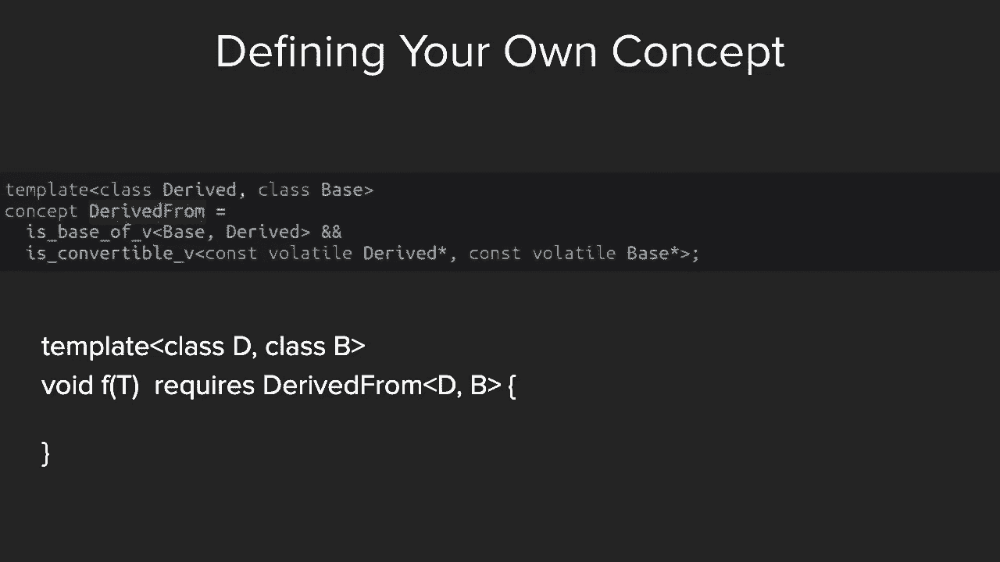

谢谢。你们有什么想法？你有问题吗？

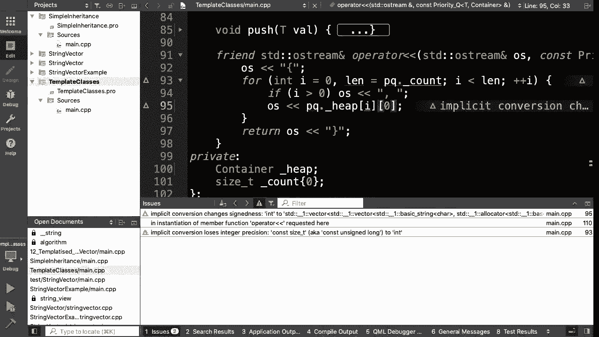

是的。