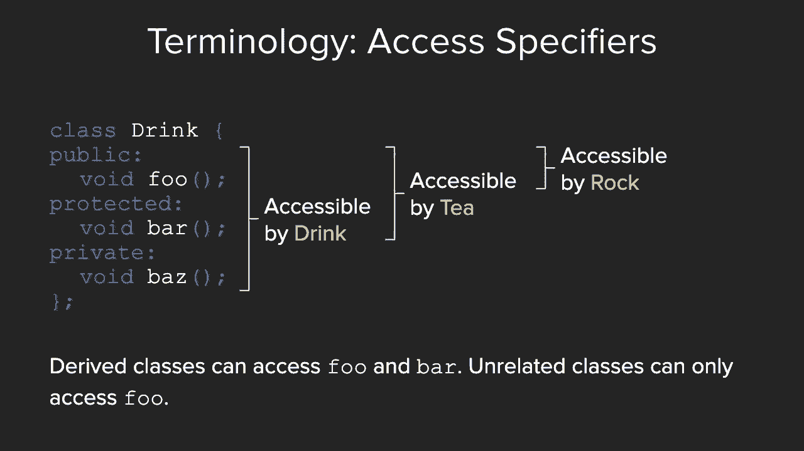
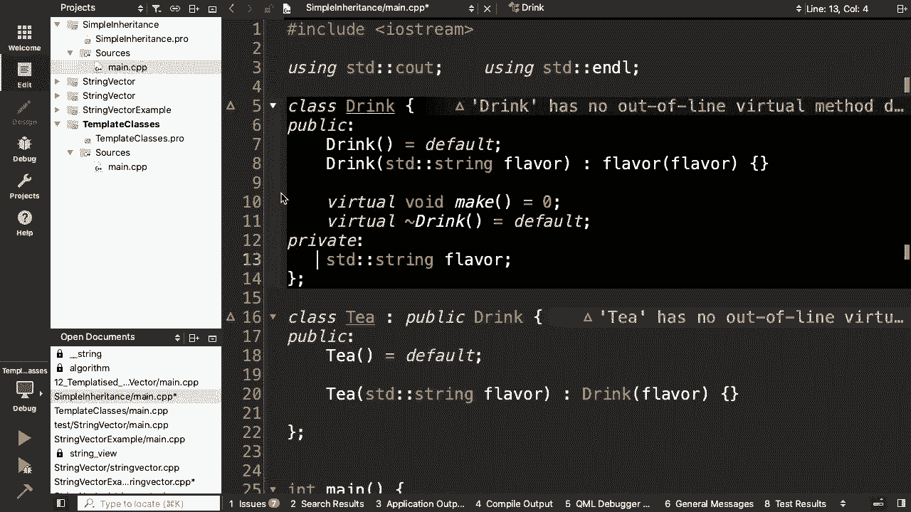
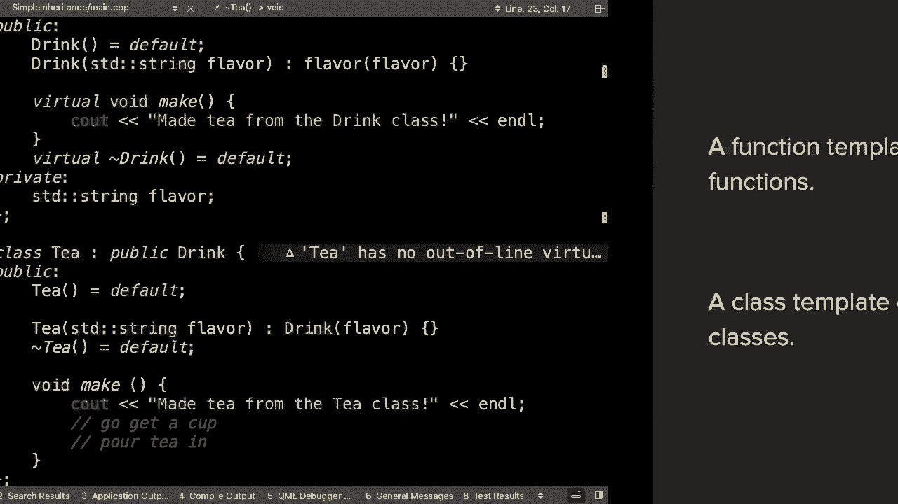
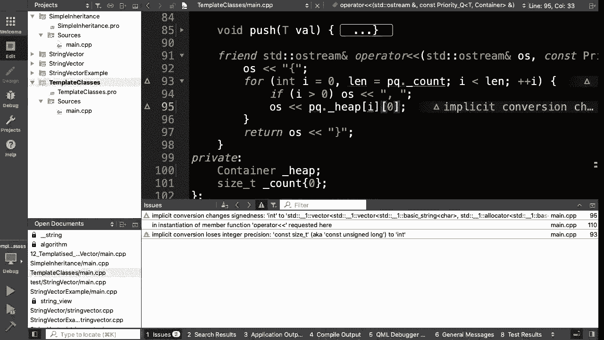

# 课程15：继承与模板类 🧬🔧

在本节课中，我们将要学习C++中两个核心的高级特性：继承和模板类。我们将首先完成对继承的讨论，包括纯虚函数、抽象类以及构造函数和析构函数在继承中的使用。然后，我们将进入模板的世界，学习如何将类模板化以创建通用的数据结构，并简要了解C++20中的“概念”。


---

## 概述

上一节我们介绍了虚函数和抽象类的基本概念。本节中，我们来看看继承的更多细节，并学习如何将模板应用于类。

### 纯虚函数与非纯虚函数的区别

纯虚函数与非纯虚函数在语法和功能上都有区别。



以下是它们的主要区别：
*   **语法区别**：纯虚函数在声明末尾添加 `= 0`，例如 `virtual void func() = 0;`。非纯虚函数则没有这个标记。
*   **功能区别**：任何继承包含纯虚函数的类（抽象类）的派生类，都必须实现该纯虚函数。非纯虚函数在基类中提供了一个通用实现，派生类可以选择重写它，但不是必须的。

### 抽象类与重写规则

抽象类是包含至少一个纯虚函数的类。它不能被直接实例化。

抽象类可以拥有普通类的所有成员，如变量和非虚函数。关于重写，有一个重要的规则：重写一个非虚函数在语法上是合法的，但这是不推荐的做法。如果你希望一个函数能被派生类重写，应该将其声明为 `virtual`。


### 继承中的关键术语与最佳实践



在讨论继承时，会用到一些特定术语。

以下是需要了解的关键术语：
*   **基类**：被继承的类，也称为父类或超类。
*   **派生类**：继承自基类的类。

当设计自己的继承体系时，有几项最佳实践需要注意。

以下是关于构造函数和析构函数的实践建议：
*   **构造函数**：在派生类的构造函数中，应通过初始化列表调用基类的构造函数，以正确初始化继承来的成员。
*   **析构函数**：如果一个类打算被继承，应将其析构函数声明为虚函数（`virtual ~ClassName()`）。这可以确保通过基类指针删除派生类对象时，能正确调用派生类的析构函数，避免内存泄漏。

### 访问控制：private, protected, public


成员访问说明符决定了类成员的可见性。

以下是三种访问说明符的区别：
*   **private**：仅能被该类自身的成员函数访问。
*   **protected**：能被该类及其任何派生类的成员函数访问。
*   **public**：能被任何代码访问。

### 继承语法示例

让我们通过一个简单的例子来看看如何定义和使用继承。

```cpp
// 基类：Drink
class Drink {
public:
    Drink() = default;
    Drink(const std::string& flavor) : _flavor(flavor) {}
    virtual ~Drink() = default; // 虚析构函数

    // 纯虚函数，派生类必须实现
    virtual void make() const = 0;

private:
    std::string _flavor;
};

// 派生类：Tea
class Tea : public Drink {
public:
    // 调用基类构造函数来初始化继承来的部分
    Tea(const std::string& type) : Drink(type) {}

    // 实现基类的纯虚函数
    void make() const override {
        std::cout << "Making tea from the Tea class." << std::endl;
    }
};

int main() {
    Tea t("Green");
    t.make(); // 输出: Making tea from the Tea class.
    // Drink d; // 错误！Drink是抽象类，不能实例化
}
```

### 模板与继承：静态多态与动态多态

我们之前用模板解决了为不同容器编写相同逻辑函数的问题。继承提供了另一种解决方案。这两者代表了两种不同的“多态”方式。

*   **模板（静态多态）**：在编译时，编译器会为每种使用的类型生成一份独立的代码。这可能导致“代码膨胀”，但运行时效率高。
*   **继承（动态多态）**：通过虚函数表在运行时决定调用哪个函数。只有一个函数体，但运行时有一次间接寻址的开销。它更节省代码空间，并能在运行时处理未知的具体类型。

选择哪种方式取决于你的需求：追求极致运行时性能可考虑模板；希望代码更紧凑或需要运行时类型灵活性时可考虑继承。

### 类模板


就像我们可以创建函数模板一样，我们也可以创建类模板。这使得类能够处理多种数据类型。



假设我们有一个只处理 `int` 类型的简单 `PriorityQueue` 类。我们可以通过以下步骤将其模板化：


1.  在类定义前添加模板声明：`template <typename T>`
2.  将类内部代码中特定的 `int` 类型替换为模板参数 `T`。


```cpp
// 模板化前的类
class PriorityQueueInt {
    std::vector<int> heap;
    // ... 成员函数操作 int ...
};

// 模板化后的类
template <typename T>
class PriorityQueue {
    std::vector<T> heap;
public:
    void push(const T& value);
    T top() const;
    // ... 其他成员函数 ...
};

// 使用
int main() {
    PriorityQueue<int> intPQ;
    PriorityQueue<std::string> stringPQ;
}
```

### C++20 概念简介

在早期C++中，模板对类型的要求是隐式的，这可能导致难以理解的错误信息。C++20引入了“概念”来定义这些要求的显式约束。

概念是一组命名的约束，可以在模板声明中使用 `requires` 子句来指定。它使得编译器能提供更清晰的错误信息。


```cpp
// 一个概念示例：要求类型T可递增且可比较
template<typename T>
concept IncrementableAndComparable = requires(T a) {
    { ++a } -> std::same_as<T&>; // 可前缀递增
    { a++ } -> std::same_as<T>;  // 可后缀递增
    { a < a } -> std::convertible_to<bool>; // 可比较
};


// 使用概念约束模板函数
template <IncrementableAndComparable T>
T findMax(T a, T b) {
    return (a < b) ? b : a;
}
```

---

## 总结




本节课中我们一起学习了C++继承的收尾知识，包括纯虚函数、抽象类以及构造/析构函数在继承中的正确用法。接着，我们探索了如何将类模板化，从而创建出像 `PriorityQueue<T>` 这样的通用容器。最后，我们预览了C++20中“概念”这一特性，它能让模板的类型要求更加清晰和安全。掌握这些特性将帮助你构建更灵活、更强大的C++程序。