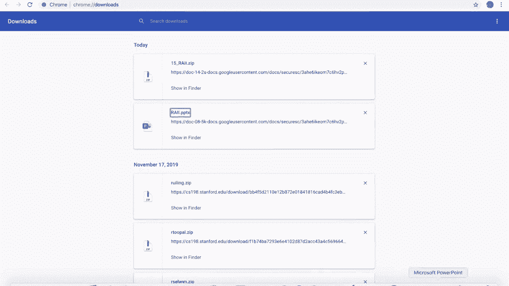
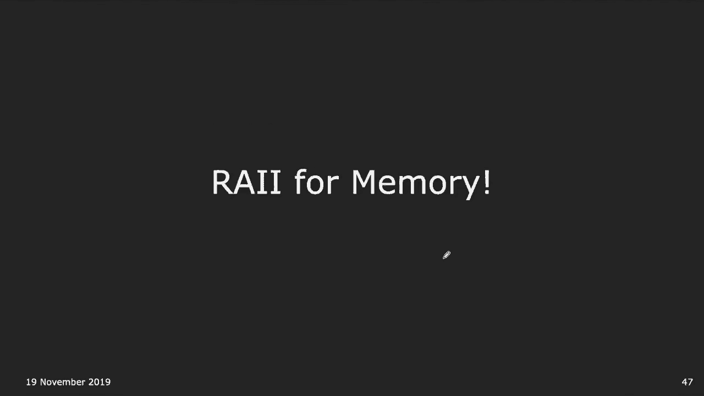
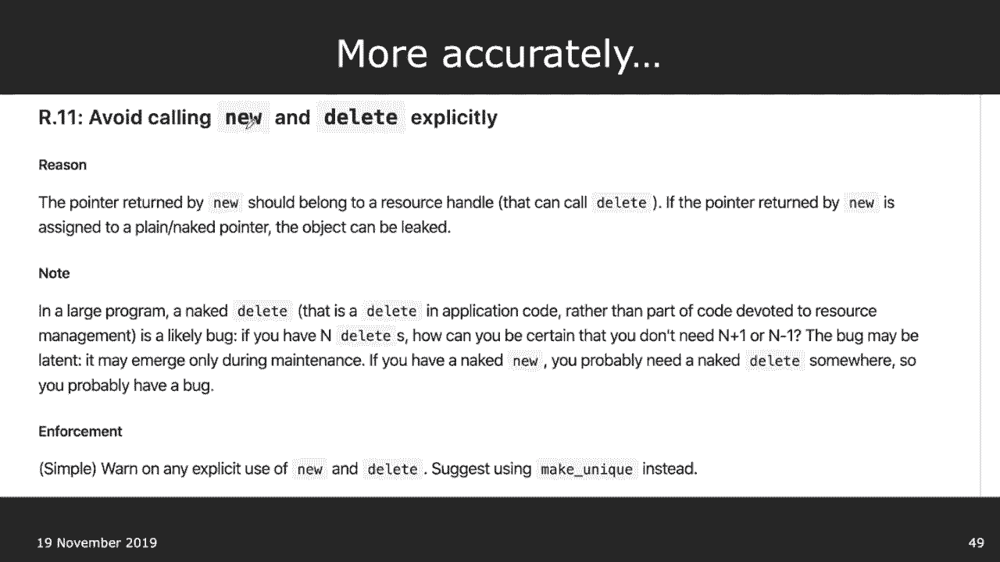
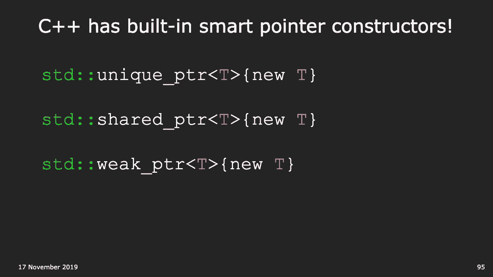

# 课程16：RAII与智能指针 🧠

在本节课中，我们将学习C++中一个至关重要的编程范式——RAII（资源获取即初始化），以及它的重要应用：智能指针。我们将探讨如何利用这一技术来编写异常安全、无内存泄漏的健壮代码。

## 概述：代码路径与资源泄漏

上一节我们讨论了函数的基本控制流。本节中，我们来看看一个看似简单的函数背后隐藏的复杂性。

考虑以下函数：
```cpp
void exampleFunction(Employee e) {
    if (e.title == "Manager" || e.salary > 100000) {
        std::cout << e.first + " " + e.last << std::endl;
    }
    return;
}
```
一个关键问题是：这个函数有多少条可能的代码路径（即控制流进入和退出的不同方式）？

除了`if`条件判断带来的3条明显路径外，代码中许多操作都可能抛出异常（例如，拷贝构造函数、运算符重载、流操作等），这至少会额外产生20条异常退出路径。因此，该函数至少有23条代码路径。

这之所以重要，是因为在涉及资源管理的代码中，异常可能导致资源无法被释放。

## 资源泄漏问题

假设我们有以下分配堆内存的代码：
```cpp
void processEmployee() {
    Employee* e = new Employee("John", "Doe", 80000);
    // ... 一些可能抛出异常的操作 ...
    delete e; // 释放内存
}
```
对于正常的3条路径，`delete`会被执行，内存得以释放。但对于其他20条因异常而退出的路径，程序会直接跳转到异常处理部分，`delete`语句将被跳过，从而导致**内存泄漏**。

内存泄漏是指程序在堆上分配了内存，但在使用完毕后未能将其释放回操作系统，导致该内存无法被再次使用。长期运行的程序（如服务器）若存在内存泄漏，最终可能耗尽所有可用内存。

以下是内存泄漏不好的几个原因：
*   可能导致安全漏洞。
*   在长时间运行或高频调用的程序中，会逐渐耗尽系统内存（RAM）。

在C++中，除了堆内存，还有其他需要手动管理生命周期的资源，例如：
*   **文件**：使用`open()`获取，需要使用`close()`释放。
*   **锁（Mutex）**：使用`lock()`获取，需要使用`unlock()`释放。
*   **网络套接字**。

## RAII：资源获取即初始化

为了解决资源泄漏问题，C++引入了**RAII**（Resource Acquisition Is Initialization）惯用法。其核心思想是：**将资源的生命周期与对象的生命周期绑定**。

*   **资源获取（初始化）**：在对象的**构造函数**中获取资源（分配内存、打开文件、加锁）。
*   **资源释放**：在对象的**析构函数**中释放资源（释放内存、关闭文件、解锁）。

由于C++保证，当对象离开其作用域时，其析构函数一定会被调用（无论是因为正常返回还是异常抛出），因此资源总能被正确释放。

RAII有时也被更直观地称为**CADRe**（Constructor Acquires, Destructor Releases）。

### RAII实践示例

**1. 文件流 (`std::ifstream`)**
不符合RAII的旧式写法：
```cpp
std::ifstream infile;
infile.open("data.txt"); // 资源获取不在构造函数中
// ... 读取文件 ...
infile.close();          // 资源释放不在析构函数中
```
符合RAII的现代写法：
```cpp
{ // 进入一个作用域
    std::ifstream infile("data.txt"); // 资源在构造函数中获取
    // ... 读取文件 ...
} // 离开作用域，infile的析构函数被调用，自动关闭文件
```
`std::ifstream`的析构函数会自动调用`close()`。显式调用`close()`不是必须的，有时甚至是多余的。

**2. 互斥锁与锁守卫 (`std::lock_guard`)**
直接操作锁不符合RAII：
```cpp
std::mutex mtx;
mtx.lock();   // 获取资源
// ... 访问受保护的数据 ...
mtx.unlock(); // 释放资源 (可能被异常跳过!)
```
使用锁守卫符合RAII：
```cpp
std::mutex mtx;
{
    std::lock_guard<std::mutex> guard(mtx); // 构造函数中调用 mtx.lock()
    // ... 访问受保护的数据 ...
} // 离开作用域，guard的析构函数被调用，自动调用 mtx.unlock()
```
`std::lock_guard`是一个RAII包装器，它在其构造函数中加锁，在析构函数中解锁，确保锁在任何情况下都会被释放。

## 智能指针：RAII管理动态内存

将RAII思想应用于堆内存管理，就产生了**智能指针**。它们封装了原始指针，并在析构函数中自动调用`delete`。

C++标准库提供了几种智能指针，我们将重点介绍两种最常用的。




### 独占指针：`std::unique_ptr`




`std::unique_ptr`独占其所指向对象的所有权。同一时间只能有一个`unique_ptr`指向一个给定对象。当`unique_ptr`被销毁时，它所指向的对象也会被自动销毁。



**关键特性：不可复制**
`unique_ptr`删除了拷贝构造函数和拷贝赋值运算符，防止被意外复制，从而避免多个指针管理同一内存导致的“双重释放”问题。它只能通过**移动语义**转移所有权。
```cpp
std::unique_ptr<Employee> e = std::make_unique<Employee>("Alice", "Smith", 90000);
// std::unique_ptr<Employee> e2 = e; // 错误！禁止拷贝
std::unique_ptr<Employee> e2 = std::move(e); // 正确：所有权转移，e变为nullptr
```

### 共享指针：`std::shared_ptr`

`std::shared_ptr`允许多个指针共享同一个对象的所有权。它使用**引用计数**来跟踪有多少个`shared_ptr`指向同一对象。当最后一个指向该对象的`shared_ptr`被销毁时，对象才会被自动销毁。

**实现机制**
每个`shared_ptr`关联一个控制块，其中包含引用计数器。
*   **构造或拷贝赋值**时，引用计数加1。
*   **析构或重置**时，引用计数减1。
*   当**引用计数变为0**时，销毁并释放对象内存。
```cpp
{
    std::shared_ptr<int> p1 = std::make_shared<int>(42); // 引用计数 = 1
    {
        std::shared_ptr<int> p2 = p1; // 拷贝构造，引用计数 = 2
        // 使用 p1 和 p2
    } // p2 离开作用域被销毁，引用计数 = 1
} // p1 离开作用域被销毁，引用计数 = 0，内存被释放
```

### 使用智能指针重写示例

使用`std::unique_ptr`修复最初的内存泄漏问题：
```cpp
void processEmployee() {
    std::unique_ptr<Employee> e = std::make_unique<Employee>("John", "Doe", 80000");
    // ... 一些可能抛出异常的操作 ...
    // 无需手动 delete！当 e 离开作用域时，无论是否发生异常，内存都会自动释放。
}
```

## 现代C++内存管理准则

现代C++编程风格强烈建议：
*   **避免直接使用`new`和`delete`**。
*   优先使用智能指针（`unique_ptr`, `shared_ptr`）来管理动态内存。
*   让析构函数、容器和智能指针来自动处理资源的释放。

这与一些带垃圾回收机制的语言（如Java、Python）不同。RAII提供了**确定性析构**，你能准确知道资源何时被释放，从而使资源管理更可预测、更高效。



## 总结


本节课中我们一起学习了：
1.  **RAII（资源获取即初始化）** 是C++的核心惯用法，通过将资源生命周期绑定到对象生命周期，确保资源自动、正确地释放。
2.  **智能指针**（`std::unique_ptr`和`std::shared_ptr`）是RAII用于动态内存管理的具体实现。
    *   `unique_ptr`用于独占所有权，轻量且高效。
    *   `shared_ptr`用于共享所有权，通过引用计数管理生命周期。
3.  采用RAII和智能指针可以编写出**异常安全**的代码，从根本上避免资源泄漏（如内存泄漏、文件未关闭、锁未释放）。
4.  现代C++最佳实践是优先使用智能指针和容器，而非裸指针和显式的`new`/`delete`。


掌握RAII是编写健壮、可靠C++程序的关键一步。