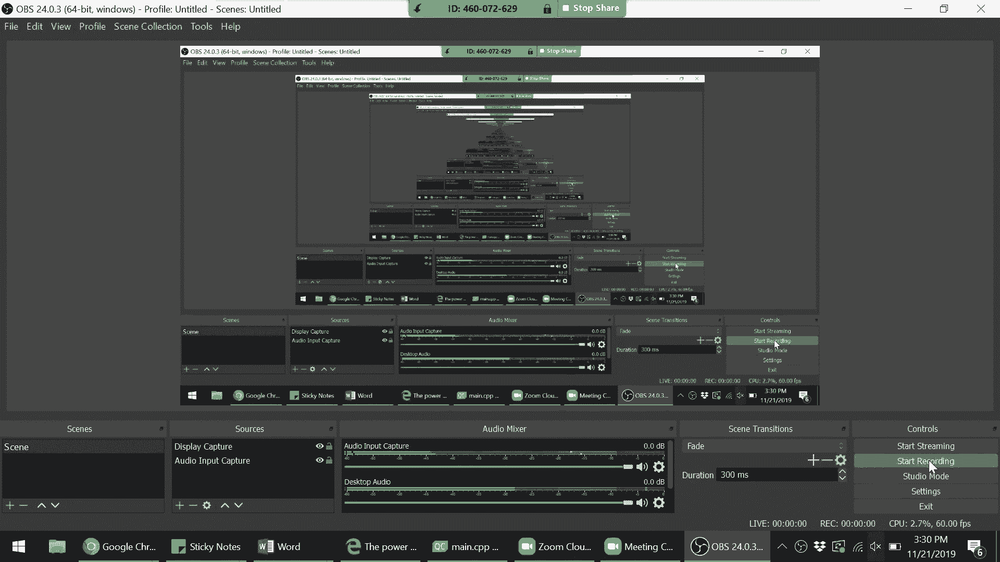


# 斯坦福大学《CS106L：C++编程》课程笔记 - P18：多线程编程 🧵

在本节课中，我们将要学习C++中的多线程编程。多线程允许程序同时执行多个任务，这对于提高程序效率、处理I/O等待等场景至关重要。我们将从基本概念入手，通过代码示例理解线程的创建、同步以及如何避免常见问题。

---

## 概述：为什么需要多线程？ 🤔

在开始之前，我们先思考一个问题：如果计算机只有一个CPU，为什么还需要多线程？答案在于**等待**。程序经常需要等待某些操作完成，例如从磁盘读取文件、等待网络响应或等待用户输入。在这些等待期间，CPU可以转而执行其他任务，而不是空闲。多线程使得一个线程在等待时，其他线程可以继续工作，从而更有效地利用计算资源。

上一节我们介绍了多线程的基本动机，本节中我们来看看C++标准库中提供的多线程工具。

---

## C++标准库中的多线程支持 📚

C++标准库在 `<thread>` 头文件中提供了对多线程的核心支持。此外，还有其他相关头文件用于处理同步和原子操作。


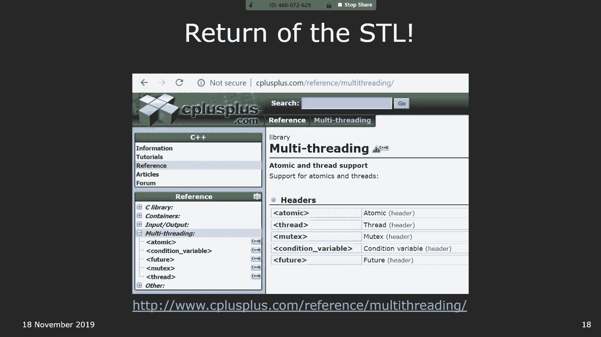

以下是标准库中与多线程相关的主要部分：


*   **`<atomic>`**：提供了**原子类型**（如 `std::atomic<int>`）和原子操作。它们保证了针对单个变量的操作是**不可分割**的，从而避免数据竞争。
*   **`<thread>`**：包含 `std::thread` 类，用于创建和管理线程。
*   **`<mutex>`**：提供了互斥锁（如 `std::mutex`）以及锁包装器（如 `std::lock_guard` 和 `std::unique_lock`），用于保护共享数据。
*   **`<condition_variable>`**：提供了线程间通信的机制，允许线程等待特定条件成立或向其他线程发出信号。
*   **`<future>`**：支持异步操作，类似于其他语言中的 `async/await` 模式。


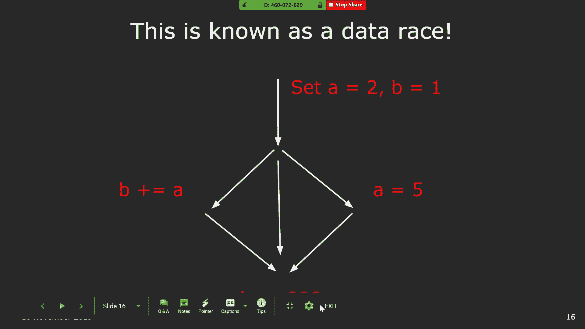

接下来，我们将重点学习如何使用 `std::thread` 和锁来编写多线程程序。

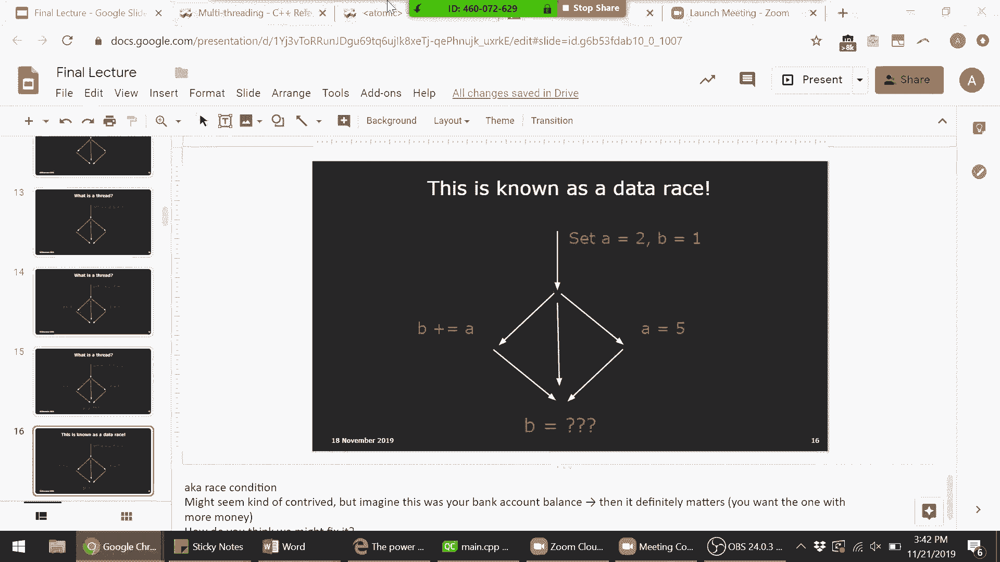

---

## 创建与运行线程 🚀

创建一个线程非常简单：你需要提供一个函数（或可调用对象）作为线程的“工作”，然后启动它。

```cpp
#include <iostream>
#include <thread>


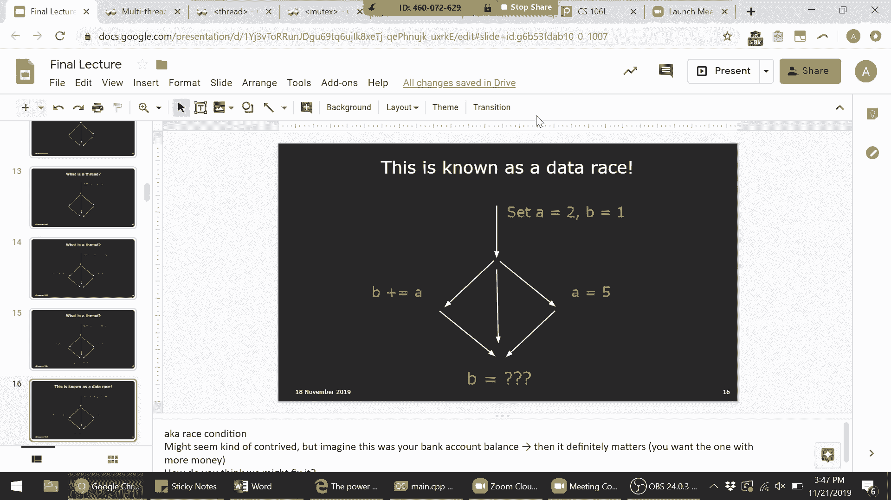


void greet(int id) {
    std::cout << "Hello, my name is " << id << std::endl;
}

int main() {
    // 创建两个线程，分别执行greet函数，并传入参数1和2
    std::thread thread1(greet, 1);
    std::thread thread2(greet, 2);

    // 等待两个线程执行完毕
    thread1.join();
    thread2.join();

    std::cout << "All greetings done!" << std::endl;
    return 0;
}
```

**代码解释**：
1.  `std::thread thread1(greet, 1);` 这行代码创建了一个名为 `thread1` 的线程。它的工作是执行 `greet` 函数，并传入参数 `1`。**线程在创建后会立即开始尝试执行其任务**。
2.  `thread1.join();` 这行代码告诉主线程（`main` 函数）等待 `thread1` 完成其工作。如果没有 `join`，主线程可能会在子线程结束前就退出，导致程序异常终止。

---


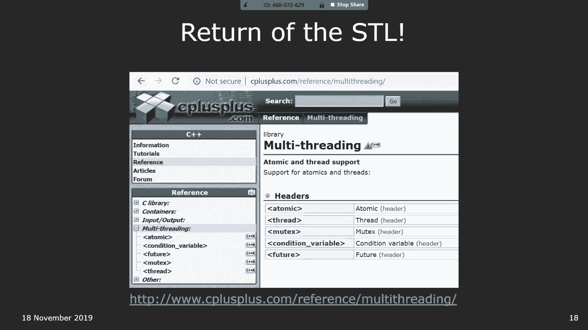


## 数据竞争与锁的保护 🛡️

多线程编程的核心挑战之一是**数据竞争**。当多个线程同时访问和修改同一份共享数据，且访问顺序不确定时，就会发生数据竞争，导致程序结果不可预测。

考虑以下看似简单的输出语句：
```cpp
std::cout << "Hello, my name is " << id << std::endl;
```
实际上，这行代码包含了多个操作（插入 `"Hello, my name is "`，插入 `id`，插入 `std::endl`），它们可能被其他线程的操作打断，导致输出内容交错混乱。

为了解决这个问题，我们需要使用**互斥锁（Mutex）**来确保某一时刻只有一个线程能执行受保护的代码块。为了使锁的管理符合RAII（资源获取即初始化）原则，避免忘记解锁，我们使用 `std::lock_guard`。

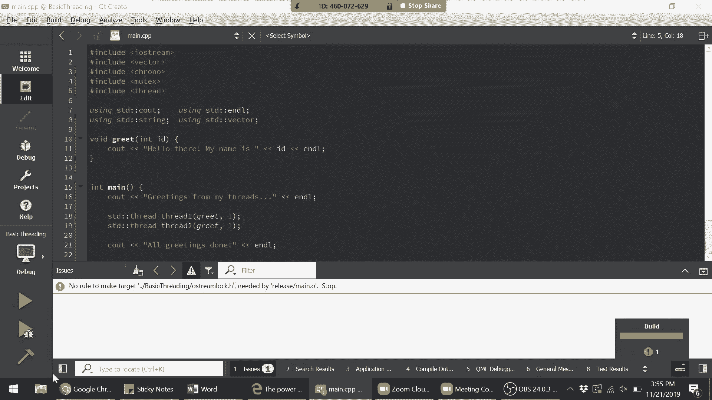


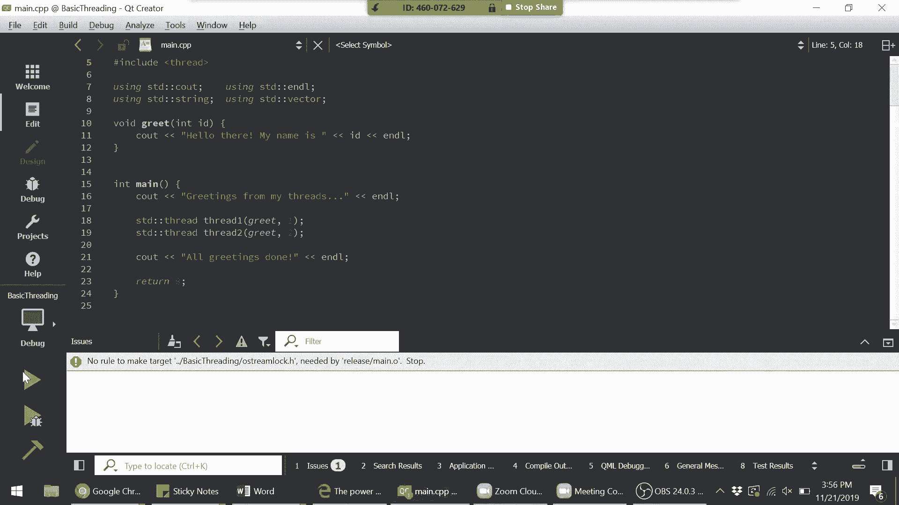

```cpp
#include <iostream>
#include <thread>
#include <mutex>

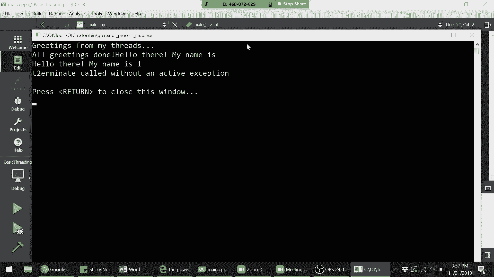

std::mutex cout_mutex; // 创建一个全局互斥锁

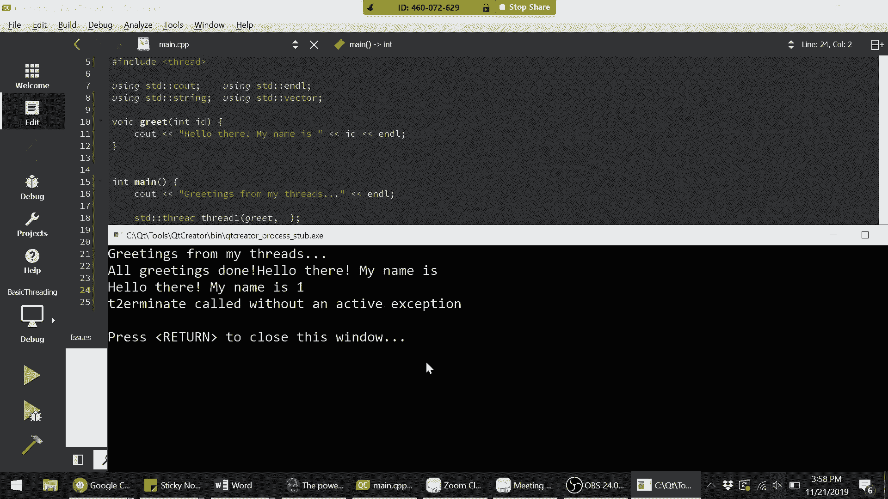

void safe_greet(int id) {
    std::lock_guard<std::mutex> lock(cout_mutex); // 构造时加锁
    std::cout << "Hello, my name is " << id << std::endl;
    // lock_guard析构时自动解锁
}

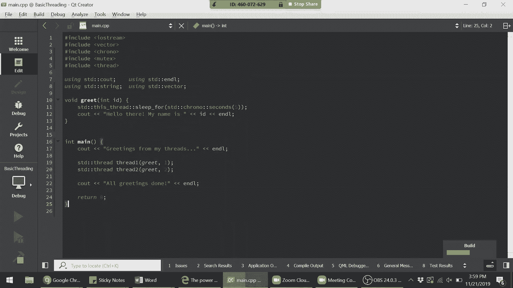


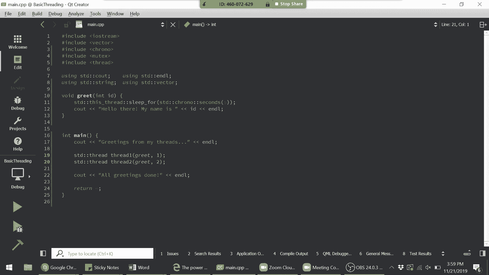

int main() {
    std::thread t1(safe_greet, 1);
    std::thread t2(safe_greet, 2);

    t1.join();
    t2.join();
    return 0;
}
```
现在，`safe_greet` 函数中的输出语句成为了一个**临界区**，保证了输出的完整性。


---


## 管理多个线程 📝

我们通常需要创建和管理多个线程。使用容器（如 `std::vector`）可以方便地做到这一点。

以下是创建并等待多个线程完成的示例：


```cpp
#include <iostream>
#include <thread>
#include <vector>
#include <mutex>

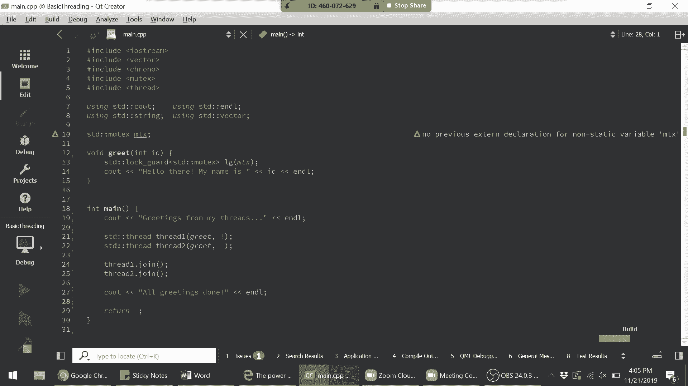

std::mutex mtx;
const int kNumThreads = 10;

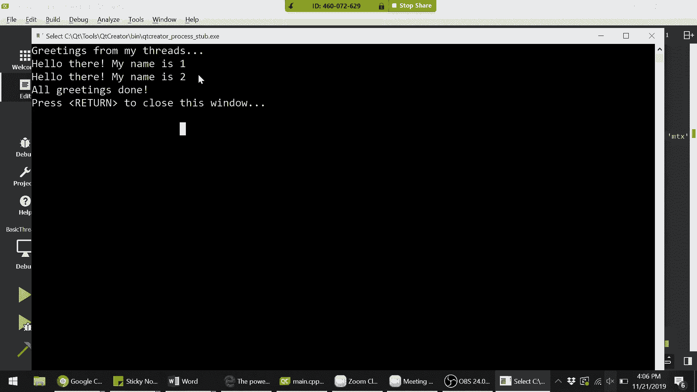

void worker(int id) {
    std::lock_guard<std::mutex> lock(mtx);
    std::cout << "Thread " << id << " is working." << std::endl;
}

int main() {
    std::vector<std::thread> threads;

    // 启动所有线程
    for (int i = 0; i < kNumThreads; ++i) {
        // 将线程对象放入向量。注意：std::thread不可复制，必须使用std::move
        threads.emplace_back(worker, i);
    }

    // 等待所有线程完成
    for (std::thread& t : threads) {
        t.join(); // 必须通过引用访问vector中的线程对象
    }

    std::cout << "All threads finished." << std::endl;
    return 0;
}
```

**关键点**：
*   `threads.emplace_back(worker, i);` 直接在向量末尾构造一个 `std::thread` 对象，避免了拷贝操作（因为 `std::thread` 不可拷贝）。
*   必须使用引用 `for (std::thread& t : threads)` 来遍历线程向量，以便调用 `join()` 方法。
*   先启动所有线程，再统一等待它们结束，这样才能实现真正的并行。如果启动一个线程后立即 `join`，就会变成串行执行。

---

## 原子操作 ⚛️

对于简单的共享变量操作，除了使用锁，还可以使用**原子类型**。原子操作保证该操作从任何线程的角度看都是瞬间完成的，不会被中断。


```cpp
#include <iostream>
#include <thread>
#include <atomic>

std::atomic<int> counter(0); // 原子整数


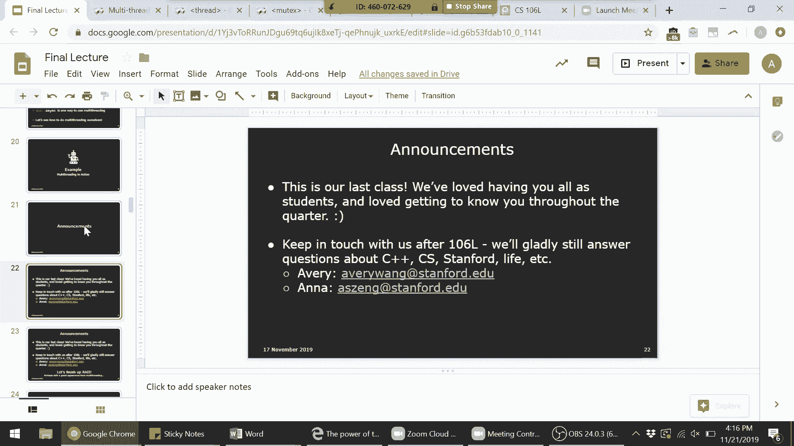

void increment() {
    for (int i = 0; i < 1000; ++i) {
        counter.fetch_add(1); // 原子加法
        // 等价于 counter++
    }
}

int main() {
    std::thread t1(increment);
    std::thread t2(increment);

    t1.join();
    t2.join();

    std::cout << "Counter = " << counter << std::endl; // 总是2000
    return 0;
}
```
使用 `std::atomic` 通常比使用锁的性能开销更小，但它只适用于对单个变量的操作。对于复杂的、涉及多个变量的逻辑，仍然需要锁来保护。

---

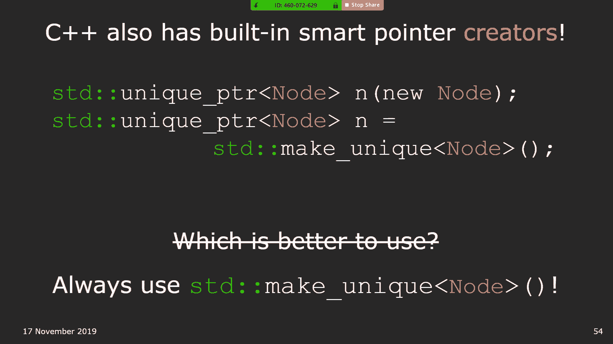

## 总结与后续学习路径 🎓


本节课中我们一起学习了C++多线程编程的基础：
1.  **动机**：多线程能有效利用CPU资源，尤其在存在I/O等待的场景下。
2.  **线程创建**：使用 `std::thread` 类，并传递要执行的函数及参数。
3.  **线程同步**：必须使用 `join()` 等待子线程结束，防止主线程提前退出。
4.  **数据竞争**：多个线程无序访问共享数据会导致未定义行为。
5.  **锁**：使用 `std::mutex` 和 `std::lock_guard`（RAII包装器）保护临界区，确保线程安全。
6.  **原子操作**：使用 `std::atomic` 类型对简单变量进行线程安全的操作。
7.  **管理线程**：使用容器（如 `std::vector`）来管理多个线程对象。

多线程编程是一个复杂但强大的主题。要深入掌握，建议：
*   **多实践**：在个人项目或工作中尝试使用多线程。
*   **阅读经典书籍**：如《Effective Modern C++》。
*   **关注专家博客**：如C++标准委员会成员Herb Sutter的博客。
*   **学习系统课程**：如CS110，深入了解操作系统层面的线程调度、同步原语等。


恭喜你完成了CS106L课程的核心内容学习！希望这些知识能为你的编程之旅打下坚实的基础。