# 斯坦福大学《CS106L： C++编程｜ Stanford  CS106L C++ Programming 2019+2020》中英字幕（豆包翻译 - P19：[01]CS 106L Fall 2020 - Guest Lecture_ Template Metaprogramming - GPT中英字幕课程资源 - BV1Fz421q7oh

我通常会这样做，是的。

让我们看看，幻灯片，我想Ethan或Nikhil可以分享它们。我现在就把它们上传上去。好的，非常好。然后在代码方面，我觉得你可以直接打开一个空的Qt ，Creator项目。我有点犹豫分享某些东西。

因为我们今天会使用一些相当，新的C++17的内容。所以，我不是很确定你的编译器是否支持这个，可能支持，也可能不支持。

但如果不支持，我实际上会使用这个网站来演示大量代码，如果你修过CS107，你可能以前使用过这个网站。当你在这里输入代码时，它实际上会生成你可以看到的汇，编代码。你今天不需要理解汇编代码。

尽管我会突出一些我们将要，做的汇编代码中的有趣内容。好的，这个网站的URL在这里。这个链接应该可以让你访问编译器。是的，实际上，它支持C++17，也支持C++20编译器。

好的，那我们开始吧。

好的。所以，是的，我叫Avery。我去年是Windows Excel讲师之一，我非常期待今天和你们。

讨论模板元编程。总体议程是，我们将从一些激励示例开始，这些示例将介绍，我们如何在类型上进行计算的概念。你们编写的普通程序，程序的总体概念是你将处理数据，进，行一些计算，然后返回数据的处理版本。但相反。

我们将改变我们的计算模型，开始考虑在类型上进，行计算。而不是处理像这三个变量这样的值，我们实际上会对这些，类型进行计算，例如int、double、引用、const等。然后我们将讨论元函数。

它们像函数一样，但实际上不是函，数。然后我们将一起实现两个元函数。一个叫做identity，仅仅是让你们准备好了解什么是元函，数。然后我们实际上会学习一些更复杂的模板规则，这些规则。

将帮助我们实现另一个叫做isSame的元函数。最后，我们将用constexpr总结一切，这是C++中的一个非常，新的发展。好的，那么事不宜迟，我们开始吧。所以，作为一个总体免责声明。

今天的目标是尝试介绍一些，更高级的模板概念。我们将介绍至少两个或三个。然后我们还将看到这些模板概念实际上是如何有用的。毫无疑问，今天的代码将感觉非常不自然，你可能会感到我，们编写的代码。

C++的设计者并没有打算让你以这种方式使，用C++。它会感觉非常hacky。这实际上是很贴切的，因为C++的这一部分是无意中的。它是通过偶然发现的。在2003年，我认为。

一些C++程序员在C++会议上展示了这个，奇怪的程序，它完全不是预期的使用方式，但做了一些有趣，的事情。好的，这导致现在它变得非常有用，你会在STL中看到它的，应用。好的，现在，TMP，模板元编程。

你可能会问，这段代码看起来很奇怪。我会写 TMP 代码吗？答案是可能会。如果你在实现库，那么你肯定会看到 TMP 代码。好的，所以我会给你一些 PyTorch 的例子。我会给你一些 STL 的例子。

这些例子大量使用了 TMP 代，码。然而，无论你最终用 C++ 做什么，当你尝试调试模板错误，信息时，你可能会看到一些 TMP 代码。所以理解这些错误信息的含义是非常有用的。

我相信 Ethan 和 Nikhil 已经给你展示了一些例子，你尝，试编译一个程序时，它生成了大量的错误信息，今天我们实，际上会看看这些错误信息的含义。因为这样，有些人可能不会编写 TMP 代码。

我希望你们关，注 TMP 的高层次直觉，即 TMP 是什么，我们为什么需要 ，TMP，而不是具体的语法细节。好吧，现在我们把这个问题放到一边，来谈谈一个激励例子。

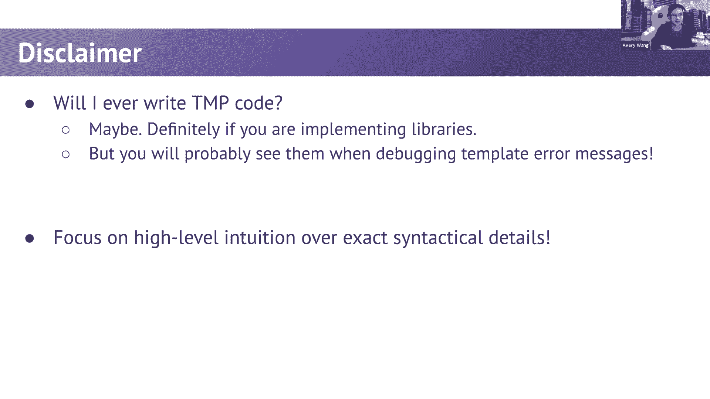

。

所以我实际上会开始尝试实现，打开编译器。好的，所以这里是这个想法。激励例子是我们想要实现一个类似这样的函数。所以我们来包含 vector，包含 deck，包含 set。好的，为了让我们的生活更轻松。

我们使用命名空间 std。我将首先创建一个名字的向量。所以我将创建一个名字的向量，假设名字是 Avery，稍后你，会明白这点的重要性。我们再加上 Ethan、Nikhil 和 Anna。

所以我们有一个名字的向量。我想做的是实现这个函数。所以这个函数叫做 distance，它基本上接受两个迭代器。所以假设我们实际上可以从这个向量中获得两个迭代器。

假设我们有一个指向 Anna 的 Anna 迭代器。我们可以做 find names。begin，end，然后是 Anna。所以这会找到元素 Anna 并返回一个指向 Anna 的迭代器。

我们也可以返回一个指向 Avery 的迭代器，find ，names。end 和 Avery。好的，所以这个例子现在有意义吗？所以我们基本上是在创建一个向量，从这个向量中获取一。

些指向 Anna 和 Avery 的迭代器。这应该是 Avery。然后我们要做的是编写一个叫做 distance 的函数，它接，受两个迭代器。它基本上返回这两个迭代器之间的距离。所以在这个例子中。

这个颜色现在并不令人烦恼。颜色稍后会有用，但现在还不重要。所以我要做的是切换到暗模式，这样你看不到颜色。

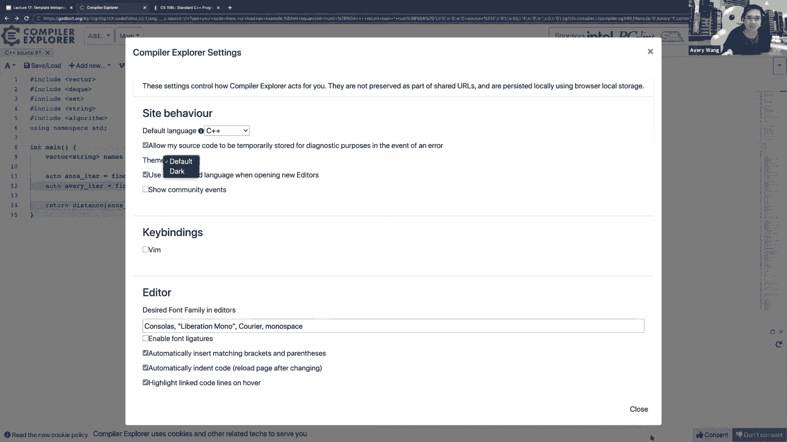

好了。好的。那么这个 distance 函数会返回什么呢？这个 distance 函数返回四，因为第一个迭代器指向第一，个元素。这个 Avery 指向最后一个元素。那么它们之间的距离是 一、二、三。

所以你会将第一个迭代器递增三次以到达最后一个迭代器，好的，所以这是我们要实现的函数。标准库中已经有一个 distance 函数。你可以实际运行程序，它会返回三。好的。好的。

所以这基本上是我们今天要用的总体例子。让我们快速实现一个距离的示例。我们称之为我的距离，这样就不会有冲突。在我输入这些内容时，想一想您会如何实现距离。这里的距离，我们希望它尽可能通用。

这样即使我们将向量，更改为牌组，或者将牌组更改为集合，我们都可以通过传入，任意迭代器来使用这个距离函数，有点像 STL 算法本身。那么让我们写出一个模板。我们将传入一个任意的迭代器类型。

然后距离返回一个大小 T，它接收两个参数，距离，第一个，迭代器和最后一个迭代器。好的，现在让我们想一想我们将如何实现这个。所以让我们想一想我们将如何实现这个。所以实现这个的一种方法。

我可能会稍微回顾一下迭代器，但实现这个的一种方法是做类似于最后一个减去第一个的，操作。所以如果这是，让我们看看，如果这是一个向量，回想一下，向量，从最强大到最不强大有不同类别的迭代器。

最强大的迭代器是随机访问迭代器。

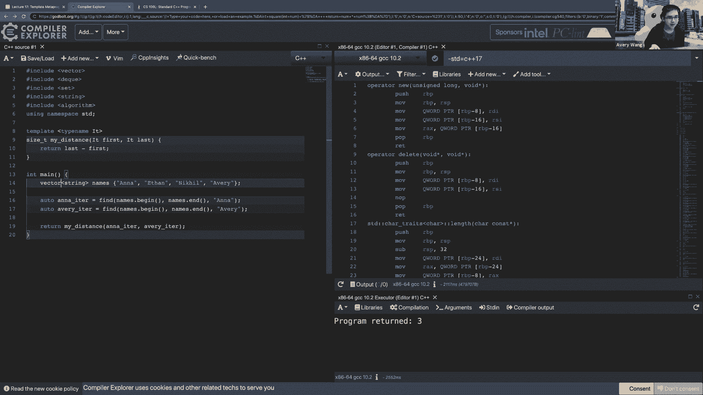

我实际上有关于这个的一张幻灯片，我想。所以我实际上有关于这个的一张幻灯片，我们回想一下有，不同类别的迭代器。最强大的迭代器是随机访问迭代器，它允许您向前和向后，任意移动迭代器。所以您可以做 += 3。

然后迭代器向前跳三步。好的，这与其他类型的迭代器相反，在那里它们不允许随机，访问，您必须逐个逐个地递增这些迭代器。那么随机访问迭代器，哪些集合具有随机访问迭代器？向量、牌组、数组。而您知道的其他集合。

映射、集合、列表，它们没有随机访，问迭代器。它们具有前向迭代器或其他不太强大的迭代器。所以这是来自 Stiopa 的一个问题，他问，如果我们正在做，这个模板函数，对吧，我们如何确保它实际上是一个迭代器。

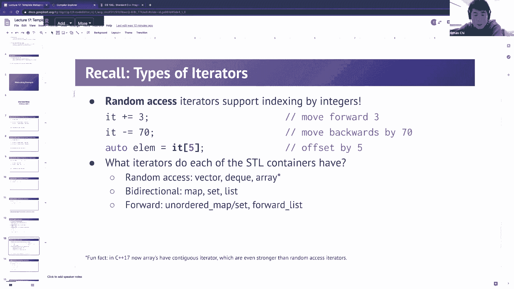

类型而不是像整数或字符串？是的，好问题。那么，让我们看看。这个问题有两个部分。第一是我们如何确保它是一个迭代器类型？以前，当您编写这些函数，这些模板函数时，您会，我认为使，用的术语是隐式接口。

如果模板函数内部的代码，如果它对于模板类型不起作用，例如，如果我们传入的不是迭代器，而是向量，那么会发生，的是，当编译器试图弄清楚您的迭代器类型是什么。所以，现在，它确定它的类型实际上是一个向量。

然后这里发生的是，我们应该得到一个编译器错误。哦，我们应该得到一个编译器错误。好的，那不是一个非常有用的编译器错误。嗯，我们可以在减号下看到，如果您转到减号函数。从最后一个减去第一个返回。对吗？哦。

是的。哦，是的，就是这样。就是这样。是的，是的。所以在这里您可以看到，那个隐式接口，那个类型必须满足，它必须有一个减号函数。无论它是什么类型都必须有一个减号函数。因为向量没有减号函数。

它不满足这个隐式接口。好的，但在这里你还应该问另一个问题，那就是，这只有在，迭代器是随机访问迭代器时才有效。好的，所以我们实际回到这一点。好的，迭代器和重新迭代器。这个。

我的距离函数只有在它是随机访问迭代器时才有效。

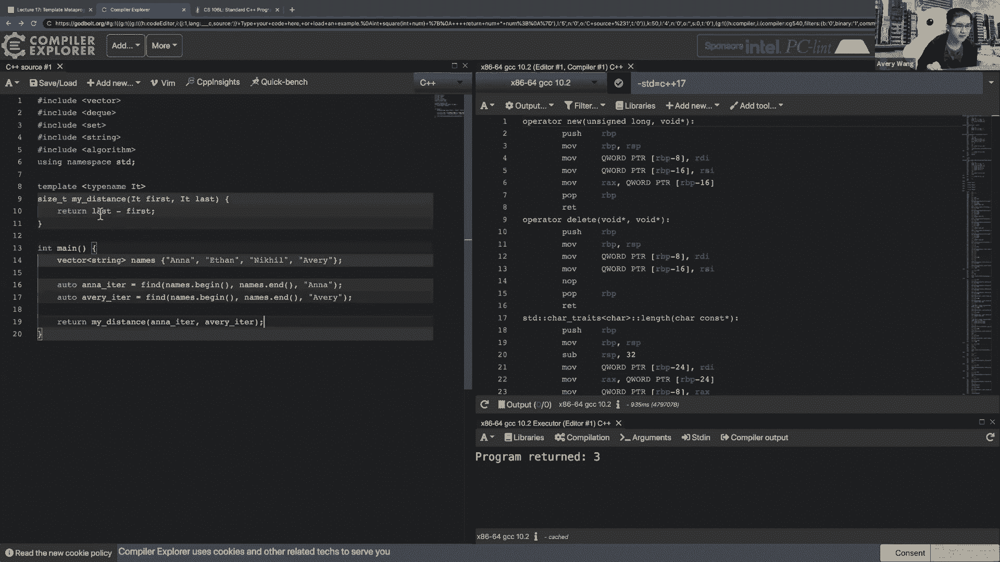

好的，因为回想一下，只有随机访问迭代器才有减号。

所以，为什么这会是一个问题？嗯，如果我们把它改成一个双端队列（deque），这仍然会有，效。仍然有效，因为双端队列有随机访问迭代器。所以当它调用我的距离函数时，它能够进行这个减号操作。

但假设我们把它改成一个集合（set）。然后我们会得到一个编译错误，因为集合迭代器没有减号，好的，因此，基于此，这个函数适用于随机访问迭代器，但不，适用于所有其他类型的迭代器。解决这个问题的一种方法是。

好的，这不适用。但你可以用暴力破解的方法来尝试找出距离。创建一个结果。然后不断递增第一个迭代器。所以在第一个迭代器不等于最后一个迭代器时，保持递增，然后计算你需要递增多少次，然后返回结果。例如。

如果这是一个向量（vector），那么我们将从第一个迭，代器开始。所以迭代器到安娜（Anna），递增三次。所以是三次。如果这是一个集合，如果是集合的话，因为集合是有序的。

所以安娜和艾弗里（Avery）应该实际上是相邻的，这就是为，什么当你运行这段代码时，它返回一。我们称之为集合是有序的。好的。现在因为我们实现了这个，所以这段代码不假设迭代器类，型是随机访问迭代器。对。

对，现在我们只是在对这些迭代器进行递增操作。所有迭代器都允许你递增它们。所以这段代码适用于所有类型。是的。所以如果我们把函数保持这样，这段代码将适用于任何类，型。这段代码有什么缺点？有人有想法吗？

为什么这段代码可能不理想？考虑一下效率。对。我们尝试的第一个方法非常高效。但总是假设我们会这样做有什么问题？所以，在之前我们写最后减去第一个，这非常高效。如果迭代器是随机访问迭代器。

这将以 O(1) 时间计算距，离。你可以想象你有两个迭代器。你只是在计算它们之间的距离。所以这是非常快的。如果它是一个随机访问迭代器。如果它不是随机访问迭代器，那么你必须这样做。

现在的代码将始终运行这个慢版本，即使它是随机访问迭，代器。现在，这段代码适用于任何类型的迭代器。它将执行这个 O(n) 代码，其中 n 是距离。它将始终运行这个 O(n) 代码。这似乎很可惜，对吧？

因为如果它是一个随机访问迭代器，你可以实现这个函数，更快。现在，如果你实际查看 STL 中距离函数的实现。

你会看到，如果你查看复杂度，这将会说明。它会说明距离函数是线性时间 O(n)。但是如果输入迭代器是随机访问迭代器类型，那么复杂度，是常数的。所以某种程度上，STL 实现达到了两全其美，对吧？

它的做法是，如果一般情况下，它会运行这个 O(n) 版本，这个版本在一般情况下有效。但是如果迭代器具体是随机访问迭代器，它会识别出来。然后它会运行这个更快的版本。所以这是我们面临的问题。

我们必须能够处理它，处理这个模板类型，而你对它一无所，知。你必须以某种方式能够提取出一些关于它的信息。我们需要确定它是否是随机访问的。其次，一旦你确定它是随机访问的，你就可以确定，好的，我。

应该运行这段代码还是那段代码？我们应该根据是否是随机访问来运行快速版本还是慢速版，本？这是问题。如果它不是随机访问，这行代码甚至无法编译。第一个，last 减去 first 甚至无法编译。

这将成为我们尝试编译这段代码时的问题。所以这是我们试图在最后实现的目标。我们将尝试做类似这样的事情。Category 等于任意类型，无论是什么样的迭代器。然后我们将进行一些类似这样的逻辑处理。

如果 category 是随机访问，则返回 last 减去 first。否则你就运行这个慢速版本。好的，在今天的讲座结束时，我们将编写看起来像这样的代，码。我们将能够找出如何获取有关它的信息。

这个模板类型是，什么，是什么样的迭代器，然后能够检查迭代器是否是那种，类型。好的，有一种类型分发的概念，即使你有一个模板函数，它，能够接受任何不同的类型，但我们实际上可以根据确切的，类型来实现这个函数。

这结合了模板的灵活性，并能够尝试弄清楚确切的类型，并，可能基于此进行优化。好的，这就是我们在最后要达到的代码目标。这只是一个问题，对吧，我认为有相当充分的理由说明我们，不这样做。但从理论上讲。

这个问题是否可以通过重载来解决？你可以想象，如果你让所有的随机访问迭代器继承自随机，访问迭代器，而所有其他的继承自其他迭代器，那么你可以，对这两种类型进行重载，并使用类型解析来解决它。当然。是的，是的。

那么我们来看看。是的，这是一个很好的观点。所以我不认为这学期的 106L 课程中对继承进行了太多讲，解。但你确实提出了一个很好的观点，即为什么不这样做？你可以用像一个版本这样的重载。

即如果它是一个随机访，问迭代器的迭代器，然后另一个函数用于一般情况。我会说我们不这样做的原因有两个。一个是需要某种继承层次结构来实现那种逻辑。这使得类型系统有些不灵活，因为假设你想要，不仅根据迭。

代器的类型，输入，输出进行分发。例如，我们也可能会根据输入是否为 double、底层容器是，否存储 doubles、存储 ints 来进行分派。如果你有不同的维度，想要根据类型有不同的实现，这样做。

不一定会有效。是的，模板相比于继承的一个重要改进是它更灵活，如果你，有多个维度想要使用模板，模板在这方面更为灵活。所以总结一下，我们希望能够做出决策，不仅仅是基于基本，类型，也许还要基于其他许多特征。

好吧，你能回答关于这段代码的任何问题吗？显然这段代码还不能编译。那么我们实际要搞清楚这意味着什么。我们怎么能实现这样的功能？

好的，我们继续。我想我有点落后于时间了。

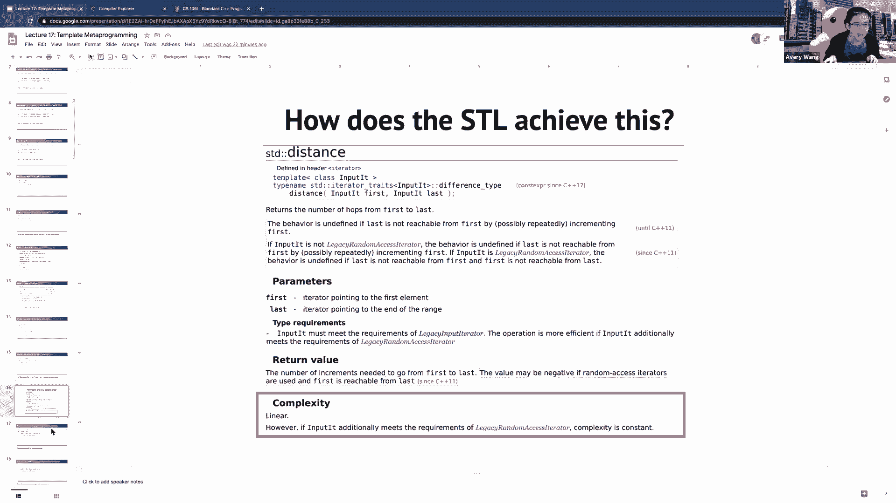

所以我会稍微加快速度。好的，我们来谈谈类型上的计算。

请注意这里。是的。所以我们实际上要讨论类型上的计算，因为我们面临的根，本问题是需要能够获取模板类型的一些信息。好的，所以我们必须在类型 IT 上进行操作。

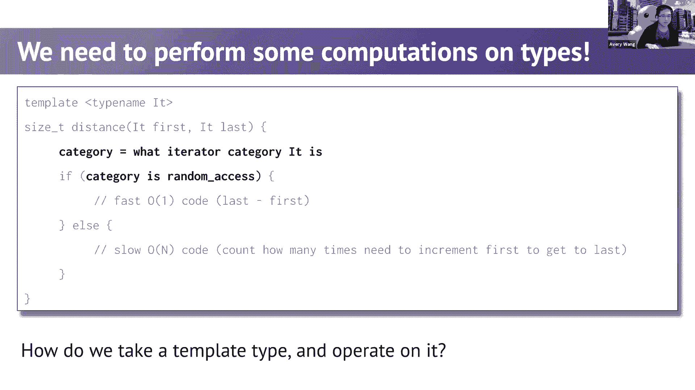

我们将引入的是我们将使用类型计算的概念。

我们要做到这一点，将进行并排比较。计算值是你现在大多数编写的程序。然后我们还将看到如何对不同类型进行类似的计算。所以你计算的变量实际上是类型。在正常的计算中，当你处理值时，你可以将这些值存储在变，量中。

所以我们有一个存储三的变量 S。在计算方面，你可以存储类型，这些不是变量，但它们像是，类型别名。你可以在这个变量 S 中存储一些类型。好的，这就是值与，类型之间的比较。好的，根本上，如果你试图存储变量。

这些是两种方法。这些是值和类型的存储方法。你可以使用先前值的值创建新的值。所以我们可以创建一个使用之前变量 S 的变量 triple。对于类型，你可以创建一个新类型，它是一些旧类型。

但你可以尝试在其上应用一些操作。所以在值的方面，我们将其乘以三。在类型方面，你实际上可以取一个现有的类型，比如类型 ，S，然后用 const 和引用装饰它。

所以 CL 引用这里是类型 const S 引用，const int 引用，好的，最常见的做法是将值传递到函数中，然后得到返回值，好的，现在很难想到如何对类型做这件事。

所以这是我们今天将引入的一个重要概念。你可以将类型传递给我们称之为元函数的东西。所以一个元函数是这样的。你可以将它们传递给元函数。然后你可以从这些元函数中获得类型。注意语法有点奇怪。

这里有些东西与模板有关。现在我们将深入探讨为什么会有这样的语法。在值方面，您可以对现有变量进行比较并获得布尔值。所以您可以评估某些布尔表达式。在类型方面，您可以做类似的事情。您可以将类型传递到元函数中。

并且注意，在这里我们从元函数中获得了一个值。我们通过将两种类型传递到元函数中得到了一个布尔值。好的，在这里尝试专注于元函数的概念。我们仍然能够将类型传递到元函数中，并且我们可以从这。

些元函数中获得类型或值。然后最后，在值方面，一旦您计算了这些布尔值，您可以根，据这些布尔表达式更改控制流。例如，如果等于 true，那么您可以退出您的程序。当您在类型上进行计算时，您可以做类似的事情。

这里的这些等于是一个常量布尔表达式，代码将变为 0 或， 1。然后您可以根据这些表达式更改编译器生成的代码。那么这到底意味着什么？我稍后会更详细地介绍。但我希望您大致了解的概念是。

我们在值上能做的大多数，事情。在类型上有类似的事情我们可以做。您可以更改控制流，您可以更改，您可以获取变量，您可以，将它们传递到函数中。对于在类型上能做的每件事，都有一个类似的对应。在值上能做的每件事。

在类型上也有类似能做的事情。在类型上也有您能做的事情。好的，我在下一张幻灯片上停下来回答问题。因此基于此，我不期望您完全理解这些元函数的上下文是，什么。我们稍后会处理。

但是一些旧的东西您之前应该已经看到过，他们在这里使，用了语句。这些是类型别名。紫色的东西，这边的这个类型，这是一个成员类型。对。当您尝试访问集合的迭代器类型是什么类型时，您会使用，看起来像这样的语法：

iterator 来能够访问某个类的成，员类型。您在这里看到的这个类型是一个成员类型。一些新的东西您之前应该没有看到过，蓝色的那些我们在，这里看到的。这些是元函数。它们的行为像函数。

但语义看起来有点不同。您不应该，专家应该是新的。我们将在今天讲座的最后谈论那个。然后还有这些静态成员值。106B 和 106L 已经开始不涵盖静态是什么。而且这不是超级重要。

但这里的想法是这里的这个值是一个实际的值。那是某个类的一部分。然后然后这个值是一个静态值，这意味着我们不必创建一，个对象就能够访问该值。这个值属于这个类。

我也会在接下来的几张幻灯片中更详细地介绍静态是什么，是的，我不想在这里停下来回答问题，因为这只是一个预览，您应该还不完全理解这三个概念是什么。让我们谈谈元函数。所以快速回顾一下，模板类型。

模板类型是当您尝试编写模板类时可以使用的。在编写模板类时，你需要指定你的任意模板类型是什么。然后，当你实际创建一个 int 类型的向量时，你在类中实，现的就是 T。然后，编译器所做的就是进入你的向量。

并将其中每个 T ，的实例替换为你实例化时指定的模板类型。所以在这里它会是 int。所以它就是你之前使用过的那些经典模板类型。结果是，你不仅可以使用模板类型，还可以使用这些模板值，在模板参数中。

你实际上可以放置实际的值。所以记住，这里的 n 不是一个类型。它是 size_t。这是允许的。整个实现看起来完全一样。你可以在实现中使用这个值 n。

一个实际可以做到这一点的 STL 类是 array 类，你可以，在这里看到。这些是固定大小的数组。这本质上是一个 C++ 数组，但它更智能，知道它的大小。我相信它是在 C++ 11 中出现的。

所以这只是一个模板类型的回顾，然后再加一点额外的内，容。你还可以使用模板值。我们覆盖了这个幻灯片，每次你实例化向量时，你都会给它，一些类型 int 或 double。编译器所做的就是取这里的代码。

并将每个 T 实例替换为，你实例化时指定的类型 int。所以你会得到这个代码，或者 double。你会得到这个代码。一个元函数。我们来谈谈什么是元函数。在一个非常抽象的层面上，元函数是一个“函数”。

它对某些，类型和/或值进行操作。所以这类似于函数的参数，它输出一些类型和值，这类似于，返回值。这是对元函数的一个非常抽象的看法。它本质上是一个函数，它作用于输入并返回输出，就像普通，函数一样。

关键是输入和输出可以是类型和/或值。好的，但这是一个非常抽象的定义。我们实际来弄清楚什么是元函数。下一行可能会让你感到惊讶。元函数是一个结构体。我们一直在讨论的这个元函数，它是一个结构体。

它有公共成员类型和字段，这些取决于模板类型和值是如，何实例化的。这些模板类型和值就是输入。然后，元函数，也就是结构体，会创建这些公共成员类型和，字段。这就是元函数的输出。元函数，即结构体。

会查看其模板类型和值作为输入，然后，将成员类型和字段作为结构体的一部分，这代表了输出。好的，所以输入来自模板类型。结构体所做的就是将函数的输出放入这些公共类型和字段，中。好的，这就是抽象的。

我不想过多地关注这个定义，因为当你看到一个示例时会，更有意义。哦，这里有一个很好的图示，将常规函数与元函数进行比较，常规函数，你传入参数，得到返回值。对于元函数，你传入模板类型作为模板参数的一部分。

然后它将生成一个称为 type 的成员类型。这是输出。或者它将放置一个静态成员，称为值，这将是返回的值。不想过多地停留在这个话题上，因为它非常抽象。让我们进入一个具体的定义。我们将编写一个身份函数。

它的作用是接受一些输入。输入可以是一个类型，也可以是一个值。它所做的就是输出完全相同的类型或值。所以它并不会做什么特别有趣的事情。它只是返回它自身。我们如何使用这个元函数？嗯。

它有点像我们之前看到的语法。对。你不是调用，而是使用结构体。你将把输入作为模板类型或模板值的模板值传入。然后你将尝试访问它的成员类型或静态成员变量。好的。成员类型称为type。成员变量称为values。

按照惯例，你总是使用type如果你要返回一个类型。如果你想返回一个值，你总是使用value。所以这就是这些元函数将如何使用的方式。让我们实际尝试实现它。这些元函数是结构体。

这些结构体的模板类型是元函数应，该获取的输入。所以身份元函数的输入应该是一个类型。这就是为什么我们将其模板化，使用某种类型T。然后在值方面，我们将输入放在它上面。所以我们将基于输出对其模板化。

我们将获取任何给定的，输入。我们将对其进行一些操作，并将其作为输出。左侧的输出是，我们将输出放在一个别名和一个成员类型，上，称为type，在变量侧的右侧。我们将输出V作为静态值。

作为称为value的静态成员。通过查看这个例子，你应该能够看到我们如何基于这个实，现得到这个用法。对。你在这里传入T。当你传入T时，这个结构体会用T实例化为int。它将T替换为这里的int。

这就是为什么当你写identity：type时，它将访问type成，员，这里我们将其替换为int。所以这就是为什么整个过程给你一个int。类似地。当你传入3时，编译器用V等于3实例化这个结构体。

所以我们有一个身份结构体，其中V等于3。然后当你尝试调用identity：value时，它会为你检索这个，值。好的，让我在这里暂停一下，因为我相信你们对这有什么问，题。有一个问题是我提前准备好的。

让我们看看是否有人会问那个问题。但除此之外，还有其他问题我可以回答这个例子。这个目标是向你们展示我们如何获取元函数的输入，如何，获取元函数的输出，身份函数本身并没有做任何有用的事，情。所以我的问题是。

是否有必要像这样编写两个函数来访问，类型名或值，或者有没有某种简洁的方法来将这两者结合，起来？我明白了。所以你是说我就像是左右两边，我们能把它们合并成一个，吗？对的。嗯，我认为这可能会有点挑战。

因为我觉得这可能会有点挑，战，因为这样的话你需要一种方法来判断这里是否有一个，类型，这里是否有一个值。我相信有一些技巧可以做到这一点，比如你可以设置一个，类型名称 T 和一个 int。

然后可以用默认参数，如果你只，提供类型，那么你可以忽略值。如果你提供值，那么你可以忽略类型，然后在这里，你可以，根据类型或值来访问你需要的那个。所以我认为这可能是可以做到的。是的。一般来说。

他们会将这些命名得不同，以避免对 T 和我们，使用的内容产生混淆。是的，好问题。我还有一个问题。当然。我有点不明白。所以所有这些都发生在编译时。对的。是的，那么它能做多少？如果我们有一个 for 循环。

会发生什么呢？比如一个 for 循环运行三次，而在 for 循环内部。我们有一个像是 using K 等于对 K 的引用。对的。这能做到吗？它会有三重引用吗？是的，是的。是的。好问题。

所以现在我们一直在编写一个比较简单的函数。你不需要做太多的类型。如果你想让这个元函数稍微复杂，一点，我们将不得不引入一些新的技术，以便实际改变 T ，是什么。好的。如你所提到的，编写一个 for 循环。

记住，在这个结构体中，你实际上并不在任何函数中。这目前是在结构体声明中。所以你实际上没有一个函数。所以你不能真正有像 for 循环这样的东西。你可以有变量。你不能有任何类似的东西。是的。

我们的结构体中还没有函数。所以你不能使用到目前为止你知道的大多数技术。例如，如果你想要返回像是，如果你想使用这个示例，但不，是返回 V。你想要返回像是斐波那契数列。

你不能在这里编写 for 循环来计算斐波那契数列，因为你，在这里没有真正的函数。你实际上只是有一些需要在编译时计算的表达式。我们将会看到一个技术。是的，我们只能在结构体内部使用 using 关键字。

如果你想要使用。你可以使用 using 关键字。记住，结构体有点像类。所以你可以在类声明中放入任何东西，但当我们尝试计算，这个类型时，你不能通过编写函数和普通函数来确定这个，类型是什么。

因为编写普通函数。这需要在运行时执行某些操作。有一种方法是使用 constexpr，但我会把这个留到后面。是的，但我确实同意目前这种技术感觉非常有限。现在你能做的不多，因为在类型方面。

我们能做的只是把 T， 作为类型。如果你想用 T 做更复杂的事情，我们就得引，入一种新技术。这说得通吗。是的。好的，是的，稍后我会更深入地探讨你的问题，因为会有一。

些关于你能用这个类型 T 做什么的新进展。但是，呃，哦，是的。所以我认为有人会问的问题是为什么我们在这里需要一个，静态的。我们在这里需要一个静态的原因是，请注意，当我们使用这，个元函数时。

我们从不实例化一个结构体。所以正因为如此，我们不想创建一个 identity 类型的对，象。我们真的只是想用这个元函数本身。所以通过在这里设置一个静态的，我们的意思是这个值属。

于整个结构体而不是特定的对象。对。通过这样做，现在，我们就不必调用构造函数来创建一个 ，identity 结构体然后调用它的值字段，我们可以简单地使，用这个符号。

因为这里的值字段属于 identity 。好的。还有其他我可以回答的问题吗。我知道我的时间有点紧。有人问我们是否可以禁用这些的构造函数 是的，嗯，你可，以禁用构造函数。嗯，你可以禁用构造函数。

虽然我认为一般来说，如果你知道你要使用这些元函数。对于这些有一种惯例，就像这些是元函数。不要试图不要试图创建这些元函数本身的实例。

所以我猜你可以通过使用 constructor = delete 通常来，禁用构造函数，因为使用这个的人知道这是元函数。我不知道，可能有也可能没有必要这样做。我不确定 STL 是否会这样做。

STL 可能会这样做只是为了，防止你可能做一些事情。是的。好的。还有其他问题吗。所以是的，这是一种有趣的看待结构体的方式。对，我们没有像预期的那样使用它们。我们没有把结构体当作它原本的用途来使用。

它原本是类似于类的，但现在我们用结构体来模拟函数的，样子。并且这个函数可以接受和返回类型或值。好的，所以总结一下，元函数是一个结构体，它将其模板类，型和值视为参数，并将返回值作为公共成员。

我们从不创建这个结构体的实例。好的，这就是为什么公共成员是静态的。我想我已经问过她问题了。所以我想我要继续另一个例子。让我们写一个叫做 is_same 的元函数，is_same 要做的是。

它将接受两个类型或两个值，并将要么真要么假放入静态，成员 fair_value 中。所以记住这里，这两个的输出都将是值。和之前一样，我们可以接受两个类型或两个整数，然后你会。

有一个叫做 value 的静态字段。所以在右边，这很容易实现，你只需要说 V = W 。这就是这个叫做 value 的字段的值。所以如果你放 3 和 3，这将是真的。如果你把三和四放在一起。

这将是错误的。所以这一部分很容易实现。另一方面，这一部分有点难，对吧，左边，因为你需要检查 T， 是否等于 U，而我们实际上没有一种方法来做到这一点。实际上。

实现这一点的整个要点是能够检查 T 是否等于 U，所以你还不知道有任何可以检查两个类型是否相等的构造，因此，我们需要解决这个问题。

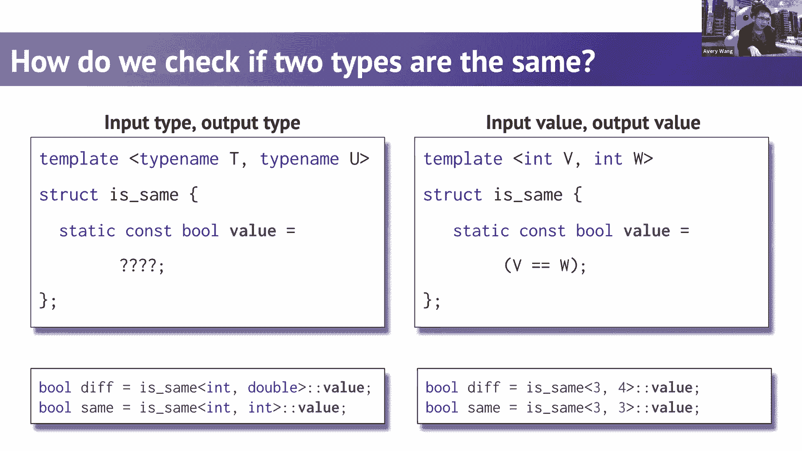

这就引出了模板推导。好吧，这是一种更高级的模板技术，我现在将简要介绍一下。

。有一个概念叫做模板特化。模板特化意味着你可以有通用模板以及专用模板。一旦我们做一个例子，这将会有意义。这是一个非常著名的特化示例。STL 实现的向量有一个通用实现。它也有一个专用实现。

通用实现正是你所知道的。这是一个使用数组的实现，如果需要的话会调整大小。布尔向量的实现被特化为更节省空间。而不是使用一个存储一个布尔值的数组。如果你这样做，我认为每个布尔值需要大约八字节。所以。

它所做的是将所有布尔值存储在一个位数组中。所以这样更节省空间。每个元素占用一个位。好吧。而 C++ 允许你做的是，如果你实现一个通用模板，你可以，为特定类型专用这个模板。

注意这里模板类型 T 已经消失了。我们将说，如果你有一个布尔值的向量，那么选择了专用实，现。所以再总结一下，如果你实例化一个布尔值的向量，你得到，的是底下那个。如果你实例化一个整数的向量。

你得到的是上面的那个。好吧。到目前为止有意义吗？Josh，要实例化专用向量，你只需要做 std：vector 布尔，值，它会自动选择专用实现。这很糟糕，因为专用版本实际上不符合向量的所有类型要，求。

特别是，你不能通过引用来编辑它的元素，因为没有变量。这只是一个位。所以这是个灾难，非常糟糕。这就像是最好的主意，但却是地球上最糟糕的执行。对吧。对。所以这实际上很有趣。斯坦福图书馆。

斯坦福图书馆就像是 STL 之上的一层。而 Julie 所做的，我觉得很酷，是她写了一些逻辑，以便如，果你尝试实例化一个斯坦福布尔向量，实际上得到的是一，个布尔 Deck。因为布尔向量是，像是。

谁想出这个主意的试图很聪明，但，结果证明这是个坏主意。所以人们往往避免布尔向量。Stefano 也有个问题，问如果模板在第二个示例中没有任，何作用，那模板有什么意义？比如，为什么不直接删除那个呢？是的。

是的。好问题。所以这里的模板确实只是为了强调这些都是模板类。只是它们在不同程度上进行了专用化。所以这是一个通用的模板。我们只是说这个模板没有使用任何模板类型。它仍然是一个模板类。

因为它是所有这些模板类的一部分，但这个特别的模板没有使用任何模板参数，因为我们将用，布尔值来替换它们。好的。我认为我的重点是要强调这些都是模板类。这个不只是覆盖了这个。现在，你可以部分专用化一个模板类。

所以，在顶部的我们有一个完全通用的哈希表。在底部的我们有一个完全专用的哈希表。所以在这里我们将键和值专用化为整数。你不能实际上进行半途而废的专用化。例如，你可以专用化一个参数。

所以另一个类型v仍然可以是某种任意类型。你还可以更复杂一些，你可以编写这些额外的模板。这个模板只有在你的第一个类型可以匹配到K星时才会匹，配。所以那个类型必须是一个指针。所以我们有不同程度的专用化。

编译器将尝试匹配所有这些模板中最专用的一个。如果没有一个适用，那么你会默认使用更通用的一个。好的，现在实际上没有人以这种方式专用化哈希表。我只是做一个示例。但你可以想象一些优化。

如果你的键或你的值非常好。你可以以更专用化的方式存储你的哈希表。好的，在你的作业中，你可以尝试专用化哈希表类。好的。总之，我跳过了一些幻灯片，如果你想了解更多关于这些模，板规则的内容，你可以阅读它们。

有很多奇怪的模板规则。我希望你明白的一般概念是，当你编写所有这些模板时。编译器会对所有这些模板进行排序，然后会逐一尝试这些，模板，直到找到一个有效的模板。这种排序将从最专用到最通用。

所以它会先尝试最具体的模板，然后才尝试较少成功的模，板。如果它失败了。如果它尝试了一个模板而失败了。这完全没问题。它会按照顺序尝试下一个，直到你看到没有一个有效，这种，情况下你会得到一个编译器错误。

或者如果有类型问题。现在如果没有有效的模板。你实际上已经看到了，如果没有有效模板时的错误信息，当，你编写模板类时。你会看到的错误信息是，哦，它尝试了，我认为你会看到类，似“哦，它尝试了这个。

然后尝试了这个，然后尝试了这个”，这样的信息。如果你查看编译器输出的错误信息，你可以看到它说，它尝，试了这个不工作。它尝试了这个。它不工作。它尝试了这个。它不工作。结果表明向量有超过10种不同的专用化。

所以当你在使用向量时做错了什么，你实际上会看到一大，堆错误消息，关于哦，你做错了什么。你做错了什么，它通过告诉你第一个尝试失败来证明你做，错了。它尝试了第二个也失败了。它尝试了每一种可能。都不成功。

好的，这就是为什么你会收到错误消息，因为它尝试了每一，种特化。我们快没时间了。我确实想快点结束这个。我们在这个小的代码片段中。花两三分钟时间尝试弄清楚为什么这个实现有效。我得给大家再一分钟。

尝试弄清楚这个、这些如何工作。可能值得讨论这两个例子，为什么第一个给你假，第二个给，你真。有人想试试吗？聊天里有一些人。我可以试试。你可以试试。这有点奇怪。就像是，如果你传入的是相同的类型。

那么它会默认使用 ，is same，因为它有 TT 这表示相同类型，但如果你有两种，不同类型，它们会使用类型名 T 类型名，你，我认为，可能，对，对，完美。所以，嗯。

我们在这里利用编译器会在转到通用的之前，始，终检查最特化的这一事实。好的，这一点非常重要。在第一个例子中，当类型不同的时候。它首先尝试匹配底部的那个，它会尝试，好的，我可以把 T ，作为 int 吗？

不行，这不起作用。我可以尝试把 T 作为 double 吗？不行，这也不起作用。所以这个失败了，它默认使用这个。这就是为什么当你运行第一个时你会得到假，因为值字段，这里是假的。当 T，什么时候。是的。

第一个的澄清，应该是 is same 括号 T 逗号 U。是的，好问题。所以实际上我也曾对这个感到困惑很久。事实证明，如果你写的是通用模板，你不需要在这里写类型。

所以你是否特化是根据是否有尖括号来区分的。对于底部的例子，如果 T。所以如果两个都是 ints，编译器会首先尝试匹配底部的那，个，它尝试 T 等于 int，结果成功了。所以当你创建这个类时。

你得到的是底部那个，这就是为什，么如果你尝试访问它的值字段你会得到真。在回答问题之前，只是想说一下。所以以后作为参考，你可以阅读幻灯片以获取参考，但，我。

们实际上可以使用相同的技术来实现许多其他不同的功能，每当你需要一个如果-否则语句时，你可以使用这个技术，这将给你一个如果-否则语句。例如，你可以实现 is pointer。好的，几乎相同的实现。

它会尝试匹配底部的那个。这个只有在你实际选择 T 为匹配指针的类型时才会成功，这样，底部的那个将为真。否则，它会默认为旧的那个，会是假的。类似地，我们可以做的是，除了返回一个值，你实际上可以。

返回一个类型。所以有一个叫做 remove_const 的元函数。它的作用是尝试匹配一个常量。如果它成功匹配了常量，那么它会将 T 作为它的类型。所以注意这里的常量已经没有了。如果它失败了。

不能匹配常量，那么它也会将 T 作为类型，所以如果你尝试去除一个不包含常量的东西的常量，那么，它会返回那个值。好的，你可以看到，这种技术基本上用于实现一个巨大的 ，if-else 语句。

如果你需要一个 if-else-if-else-if-else-if-else 语，句，你基本上可以做同样的事情，只需做很多不同的特化。确保你写它们的顺序是有意义的。

然后这基本上就是一个巨大的 if-else 语句。这个通用的就是巨大的 else，如果没有任何特化的能工作，简单总结一下。是的，继续吧。在这个例子中，如果里面的内容在两种情况下都是相同的。

为什么我们需要两个不同的呢？是的，好问题。所以我们这里需要不同的原因是底部的一个会做稍微不同，的匹配。当你尝试匹配底部的一个，例如 const T，并且我们尝试将。

其匹配到这里的 const int 时，这里的 T 不是 const ，int，而是 int。好的，所以我们在看这部分，并且尝试将其匹配到尖括号中，的内容。我们得到的 T 实际上是 int。

这就是为什么当你在这里放，置它时，我们得到 int 的类型。嗯，上面虽然主体是相同的，但它尝试匹配的内容有些不同，所以在这里，如果你尝试匹配，这里说 T 是整个内容，而不。

仅仅是 const 后面的内容。谢谢。是的，没问题。好的，我想时间快没了，所以我想快点完成这个。如果你需要离开，我们已经涵盖了我想介绍给你的最重要，的内容。

这就是你可以在编译时实现 if-else 语句的方法，这非常笨拙，但它有效，并且非常有用。好的，我会稍微超时，以便我们可以把所有内容都完成。但是，是的，这是一种技巧。

我们利用编译器的模板匹配规则来实现 if-else 语句。我们通过利用模板匹配规则来实现 if-else 语句。

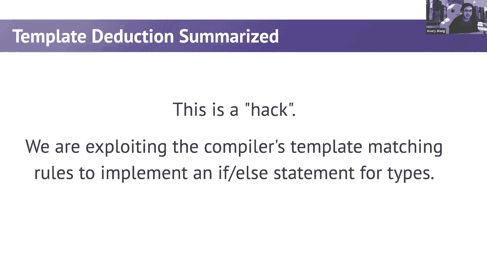

好的，让我快速总结一下。

那么我们如何实现这个距离函数？让我快速实现这个距离函数。

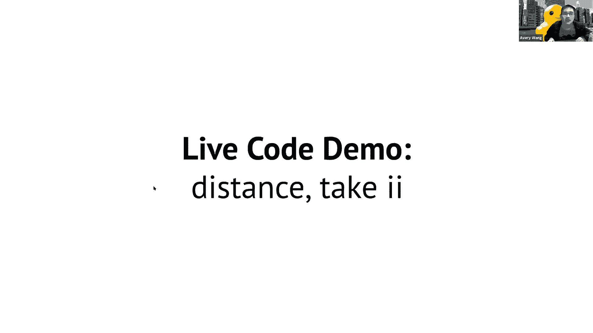

好的，所以我们来实现这个距离函数，我要做的是，首先尝，试实现这两行代码。Category 等于无论什么类型的迭代器。我们怎么实现呢？所以结果是我们还没有编写这个元函数，但 STL 里有很多。

非常有用的元函数。有一个叫做 iterator_traits 的元函数。所以使用 category 等于 std：iterator_traits。这是一个元函数。它的作用是你可以输入一个迭代器类型。

这非常酷。这个元函数有很多不同的返回值。好的，它不仅仅有一个返回值。它有很多不同的返回值。你可以使用不同的名称来访问每个返回值。所以我们想要的名字是迭代器，迭代器编译失败。哦，对了，这里有独立的作用域。

所以这是之前 Ethan 或 Nikhil 介绍的类型名称错误。因为我们在这里放入了一个迭代器类型，我们有一个依赖，的模板类型。所以我们在这里只需放置一个类型名称。

这是 C++ 中唯一有用的编译器错误信息。所以这是一个元函数。它有很多返回值。我们将特别选择一个称为迭代器类别的返回值。发生的情况是，类别是一个代表某种类型的类型，它实际上，是一个常量类型。

你可以将其视为一个常量，它告诉你这个迭代器属于哪个，类别。然后我们可以在这里实际使用我们自己的 is_same 实现，好的，是的，我们可以使用我们自己的实现。我们也可以使用 STL 的实现。

你将传入类别，并检查它是否等于随机访问迭代器，这里有，一个类型，有一个常量，称为随机访问迭代器标记。这基本上是如果这是一个随机访问迭代器，它将是什么类，别。不要忘记获取返回值，即双冒号值。Avery。

一些学生想知道你能否重复一下为什么需要类型名，称。当然。所以我不太确定类型名称是如何引入的。但原因是因为有一个叫做依赖模板类型的东西，当你试图，在这里放入一个模板参数并尝试访问成员类型时，你必须。

放一个类型名称，以便 C++ 不会被角括号或其他东西混淆，老实说，我教的方式是，这是 C++ 中唯一有用的错误信息，如果你收到错误信息，它会明确告诉你如何修复它，然后就，去修复它。

所以我们在这里的教学方式就是你必须这么做，因为有一，些，它只是为了消除一些奇怪的编译器解释。你就这么做了。原因是因为它是一个依赖类型，也就是在双冒号之后，它是，一个控制依赖类型的模板参数。

而这种特定的操作序列会导致一些编译歧义，除非你修复，它。我必须坦白。我几乎不理解为什么我们需要在这里使用类型名称。但我知道编译器会准确告诉你为什么。所以如果你收到那个错误，就写类型名称。无论如何。是的。

所以这基本上是实现。但请注意，它仍然无法编译。好的，如果我们放入 vector，它会编译。如果我们放入 vector，这会编译。这会有效。是的，这编译了。好的。我想要的，其实。

我会向你展示接下来的很酷的东西。但如果我在这里放一个 set，它不会编译。原因是，因为在编译时，编译器会发现这个表达式是假的。所以你将永远不会运行第一个。你将始终运行第二个，这是我们想要的。

问题是这段代码仍然在代码中。对。这行仍然在代码中。而这行无法编译。如果你传入的是 set 迭代器，因为迭代器之间不能进行减，法操作。这就是我们有这个编译器错误的原因。好的。

所以问题是我们不仅需要能够确定要运行哪个分支，我们还需要一种方法来完全从源代码中移除另一个分支。即使这行代码永远不会被运行，我们也不能在源代码中保，留它。如果它在源代码中，代码就不能编译。好的。

那么最后我们要介绍的是如何在编译时更改源代码？

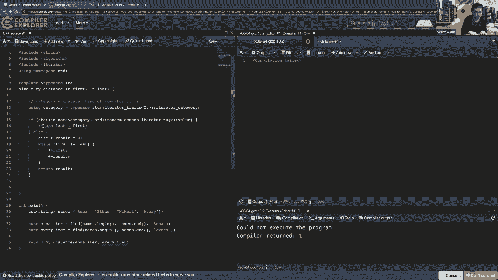

哦，实际上，我有一张幻灯片讲这个。是的。所以其他分支和编译，即使我们知道那个分支永远不会被，运行。我们需要一种方法来移除这些有问题的代码，如果我们能，找出哪些部分不会被运行。

我们知道 if 语句永远不会被运行。所以我们必须完全将其从代码中移除。好的，在 C++ 17 之前。所以注意我们现在是 2017 年。你必须使用这个 enable if，这可能是我最喜欢的函数之，一。

这是你能找到的最 hacky 的函数。它会故意生成替代失败以欺骗编译器。如果你感兴趣，课后问我。这真的很有趣。但这也有点复杂。所以 C++ 17 引入了一个叫做 if constexpr 的东西。

if constexpr 做的是在编译时计算布尔表达式。然后根据它是 true 还是 false，它会用实际运行的代码，替换整个 if else 分支。这真的很酷。它在更改源代码。

所以我们实际上加上 constexpr。

if constexpr，注意错误消失了。好的，所以现在这还不够酷，因为我想给你展示实际生成的，源代码。所以我们实际去设置里。

把它切换到浅色模式。我不知道为什么深色和浅色会给你不同的东西。但在浅色模式下，你可以看到一些真的很酷的东西。所以如果你不理解汇编也没关系。老实说，我现在也几乎不理解它。但如果我们去看看。

我觉得这些中有一个是我们想要的。是这个吗？对，就是这个。好的，所以这是我的距离函数。好的，这非常好，因为它会突出显示每行代码如何转化为汇，编。这里有一件事非常明确，那就是注意第 15 行和第 16 行。

它们没有被突出显示。所以在汇编代码中，这两行甚至不属于汇编代码的一部分，这就是为什么一旦你添加了 constexpr，你不会得到编译，器错误，因为当编译器将这个表达式计算为 false 时，它。

会完全移除这部分代码。所以这就是为什么在汇编代码中，你只有这些行。好的，然后只是为了演示，如果你做一个向量，你会得到另，一个分支。是的，你会得到另一个分支，你可以自己查看。如果你去看看那个函数。是的。

超级短的函数，因为它只有一行。你可以看到它调用的是减法运算符。所以注意这部分代码完全从源代码中移除了。如果你在 C++ 17 中，只是想给你展示一些酷的东西，你可。

以清楚地看到这是一个 while 循环，因为有很多跳转。如果你现在正在做二进制炸弹的练习，那就有一个测试。有一个 J 等于。这里有一个跳转，它显示了这段代码正是这段代码。好的，很酷。基本上就是这样了。

我想讲的内容就这些了。我们超出了些许时间，不过没关系。我们实现的最终代码是这样的，其中 if constexpr 让你，在编译时确定这个表达式，它会实际改变 if 语句或运行，的分支。因此。

你可以在 if 语句中放置不编译的代码，只要 if 语，句能够帮助你确定那行代码是否编译。非常感谢。这真是一次非常有趣的讲座。我还有两张幻灯片。所以，是的，关键点是，最终生成的代码是这两种。然后。

模板元编程就是你在修改程序的实际源代码，constexpr if 可以让你打开或关闭代码中的不同部分，等等。关键要点是，模板让你处理变量类型，元函数让你修改这些，类型或查询信息。

constexpr if 给你灵活性来修改源代码，这允许你根据类型优化代码。你可以想象这种代码在 STL 算法库中随处可见，根据迭代，器的类型，它会基于该类型进行优化。就是这样。哦。

CMP 是在哪里出现的？你大约两周前学过 std：move。我不认为 Ethan 和 Nikhil 曾经深入研究过 std：move ，的参数和返回值，但你可以看到。是的，你可以看到 std：

move 的返回值是你需要基于元函，数获取的那个值和类型。这是一项非常有趣的练习，去弄清楚为什么。这是一个你必须考虑的奇怪边界情况。好吧，所以 STL 的 std：move 中有一个名为 。

remove_reference 的元函数。其次，如果你做任何机器学习，PyTorch 有一个索引选择函，数。我在 CS224n 中经常使用这个函数。注意你会看到 enable 这里的情况也是一样的。

这本质上是他们优化的一种方式，如果你的张量是 float ，类型与其他类型的比较。所以很酷的优化。好吧，就是这样。接下来去哪里。有一个很酷的讲座，受到我的讲座的启发很大。去看看吧。

C++20 引入了一个叫做概念的东西。概念的目标是让一切变得不那么奇怪。让整个代码，一切我们今天学到的东西，更自然，而不是像，黑客一样。所以如果你想进一步学习，可以看看概念。概念是非常非常酷的。好的。

很棒。感谢你们让我超时。这很典型，当我教这个课程时。我认为到最后，我们就放弃了 50 分钟的讲座，改成了 70 ，分钟的讲座。无论如何，很酷。我可以回答任何问题吗？在回答问题之前。

我想感谢大家今天的到来。这是一次非常有趣的讲座，所以谢谢大家。让我们都解开静音，为 Avery 鼓掌吧。谢谢。太好了。是的，我认为 Avery 会在这里回答你们的问题。我能在聊天中留下的一个问题是。

如果在你的作业中使用 ，hash if 会发生什么，以及为什么当它设置为零时会使代，码失效？我相信那是一个预处理指令。它在一个更基本的层面上工作，也就是在你开始编译之前，将文本传递到计算机中。

所以你可以避免它。这是一种不同的避免方式。但使用预处理指令不是很灵活，因为你只能做非常简单的，事情。是的。实际上，今年夏天，我尝试改进测试工具，实际上使用模板，元编程。但我没能在时间内完成。

以便向你们发布。所以你们必须处理旧版本。但是下个学期的课程将会得到华丽的模板元编程版本。太棒了。这就是为什么我们依赖 Avery 来编写我们的作业，因为我，们不知道如何做 TMP。是的。

我可以回答任何问题吗？我有一个问题。当然。你能讲讲 enable if 吗？我花了一些时间阅读有关它的内容。我还是不明白它是如何工作的。所以了解一下会很有帮助。当然。啊，有六张幻灯片。是的。

实现看起来是这样的。所以看几秒钟。实际上，我让你们看几秒钟，然后我会回答其他问题。然后尝试思考一下为什么，这个是如何有用的。有趣的部分是，注意到 enable if 的通用版本没有类型。

所以它有点像下面那个。下面那个是特定类型，其中如果 B 是布尔值。所以如果 B 为真，那么它将匹配下面的那个，你将会有一，个叫 type 的成员。好吧，所以如果 B 在这里为真，那么整个东西都会给你它。

如果 B 为假呢？那么你会得到垃圾，因为那个类型甚至没有定义，你会得到，一个 schema 错误。是的，你会得到一个编译器错误。然后，启用条件在这个上下文中使用，所以注意到这个和布，尔值相同。

这个在这里和布尔值相同。对。好的。但是如果，如果相同在这里返回假值，那么整个函数不会编，译失败吗？因为那里没有定义类型。是的，完全正确。所以，如果在这里相同为假，那么 enable if 就没有一个。

叫 type 的成员。所以这一行将会编译失败。好吧，这里就变得非常hacky了。我们故意让这一行不编译，因为我跳过了一张幻灯片，因为，它太复杂了，但是有一个叫 SFINAE 的模板规则。

替换失败不是错误，当你尝试替换一个类型，失败时，编译，器会忽略它。但我很惊讶这样的错误，比如说，根本没有放入类型。是的，它只是把它视为 SFINAE 错误，而不是像总体的终止，编译器错误。是的，是的。

然后，你必须以特定的方式使用它，你必须把 enable if ，放在头文件中。在模板之后，因为那样被认为是模板替换错误。是的，这里有趣的地方在于这一行。如果它为真，它什么也不会做。

就只是给你一个空的返回。好吧，这个东西你本可以直接在这里写 void，一切都会很，好，但我们故意在这里添加了额外的内容，以便如果这个内，部布尔值为假，这将会生成一个编译器错误。

我们故意制造一个编译器错误，以便编译器会决定忽略它，这就是为什么它叫做启用如果（enable if）。如果它为真，如果它真的为真，那么这个函数存在。如果它为假，那么这个函数不存在。这说得很好。是的。

我得承认，在我理解模板元编程之前，我遇到过启用，如果（enable if），我只是很难弄清楚这一行到底在做什么，好的，但现在你知道，为什么你会在这里得到编译器错误，是因为它甚至没有类型。正是这些时候。

你会希望自己写的是动态类型语言。是的，你告诉自己，这值得为了速度的提升。是的，你会看到一些编程语言尝试，嗯，我对其他编程语言，了解不多，也许是 Rust，也许是 Go。Rust 不做这种事情。

Rust 没有，Rust 在整体上对奇怪的模板情况了解较少，他，们一般尽量避免这些，至少我知道的情况是这样，但再次强，调，我对 Rust 极为不熟悉。好的，是的。你只能在 C++ 中遇到这种疯狂的情况。

哦，引用一下，我该如何，我要如何在 Rust 中复制我的基，于 SFINAE 的 C++ 代码。有一种叫做特化（specialization）的东西，它让你用更优。

雅的方式实现这一点。它和 SFINAE 完全不同。

而且它仅在 Nightly Rust 中可用，因此不太可靠。你可以使用特性（traits），它们基本上类似于概念，（concepts），对吧，这解决了所有问题，而且方式要好得多，对不起。

特性（traits），不是接口（interfaces）。有趣的是，Google 推荐你避免模板编程。是的。所以基本上，如果我没记错的话，在 Rust 中，特性（trait），让你在类上贴标签。

而无需通过继承系统。它让你只为类编写函数，并匹配特定的特性，这让你可以绕，过整个编译时检查类的问题，因为你可以定义一个符合需，求的特性。是的，是的。事实上，你在这里看到的这些模板，这些元函数，实际上是。

类型特性（type traits）库的一部分。太棒了。所以，对不起。是的，所以你现在知道如何自己实现这些元函数，但实际上，有一个完整的库。有一个巨大的库，里面包含了你可能需要的每一个元函数，例如。

如果你想检查类型是否为浮点数，你可以在这里找到，然后你可以实际查看它是如何实现的。不，你实际上可以查看它是如何实现的。是的，有趣的是，你基本上从这些低级的构造开始，比如 is， same。

然后你可以逐渐构建到更复杂的构造，比如 is ，floating point，然后不知怎么的，你能够获得这些。你可以检查它是否有拷贝构造函数，我觉得这很酷。你可以检查它是否有虚析构函数。

你可以检查它是否有。是的，各种各样的东西。有一个问题，抱歉。编译时宏中的字符串文字哈希是什么意思？是的，是的。嗯，让我看看，嗯，已经有一段时间没有写这个了，所以让我，给你展示一下。

编译时宏中的字符串文字哈希。所以，你会创建一个，创建一个类似宏的东西。然后，嗯，是的，所以发生的事情是，你会创建一个宏。然后，每次你想要哈希那个宏，每次你想要哈希一个字符串，时，你将字符串包裹在宏周围。

所以，让我打出来。所以你会做一些事情，你会创建一些宏，它可以是一个实际，的宏，也可以是一个称为哈希字符串的模板元编程宏。然后，每当你在代码中想要哈希一个字符串时，你就把它包，裹起来。你好。然后。

这需要在编译时用实际的哈希码47374替换每一个实，例。是的，关键思想，我记得做这个很难让它编译成功。让它工作并不难，让它编译成功是非常困难的。是的，我刚刚发布了一个不使用TMP的旧版本链接，但基本。

上他们写了一堆互相接口的宏来实现某种字符串哈希算法，我会说，第二个会更容易理解，一旦你上过一门七的课程，因为有很多编译器相关的内容，如果你更深入地理解编译，器的工作原理会有帮助。是的。

尤其是如果你查看Ethan提到的那个链接，其中有很，多位移操作。所以我认为一旦你上过一门七的课程，研究这个会更有意，义。如果这种无聊的东西对你有吸引力，考虑参加一个编译器，课程。有一些很不错的。

我的意思是，每个人都知道在这个领域应该学些什么，但像，高级编译器课程有一些非常有趣的东西。是的，我还没有上编译器课程，但我会在某个时候去上。是的，我没上。是的，是的。

我决定出于某种原因参与了那一季度的229，跳过了编译器，课程。所以，我没有上编译器课程，但我可能会去上编译器课程。是的，但无论如何，这些关于操作系统和编译器的课程都很，酷。

你会了解到很多关于编译器的工作原理。然后这将大大帮助你理解C++，真正理解C++。了解性能的带来，查看汇编代码有很大帮助。我最喜欢的C++ YouTuber之一。是的，有C++ YouTuber。

你不敢相信，有C++ ，YouTuber，Jason Turner，他的视频总是使用这个编译器探，索器，他会向你展示代码是什么样的，汇编是什么样的，告，诉你哦，是的，实际上有性能提升。

我们通过写这个而不是那个节省了两个汇编指令，类似这，样的东西。是的，通过查看课程来想象优化的样子很有帮助。好，还有其他问题吗？你看到C++的短视频了吗？哦，真的吗？哦，哇，我实际上从未见过那个。

有人在聊天中提到，甚至提到过C++短视频，我不认为它们，真的存在。我希望它们不存在。不存在。使它成为替代作业或一个好点子。让我停止录制。

