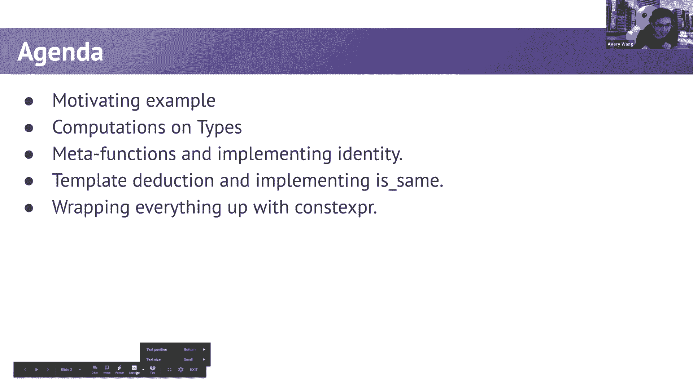


# 课程19：模板元编程入门 🧠

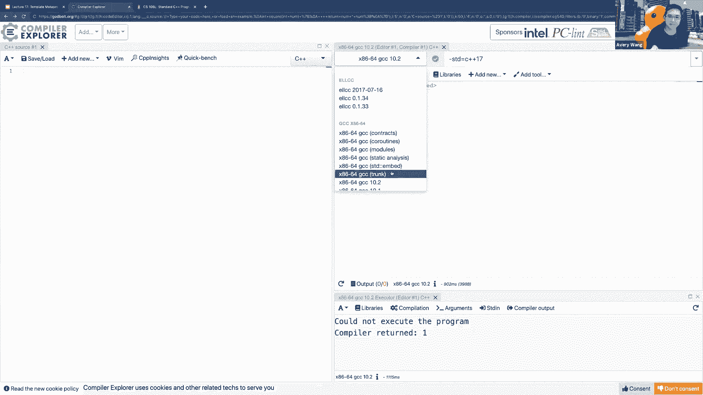


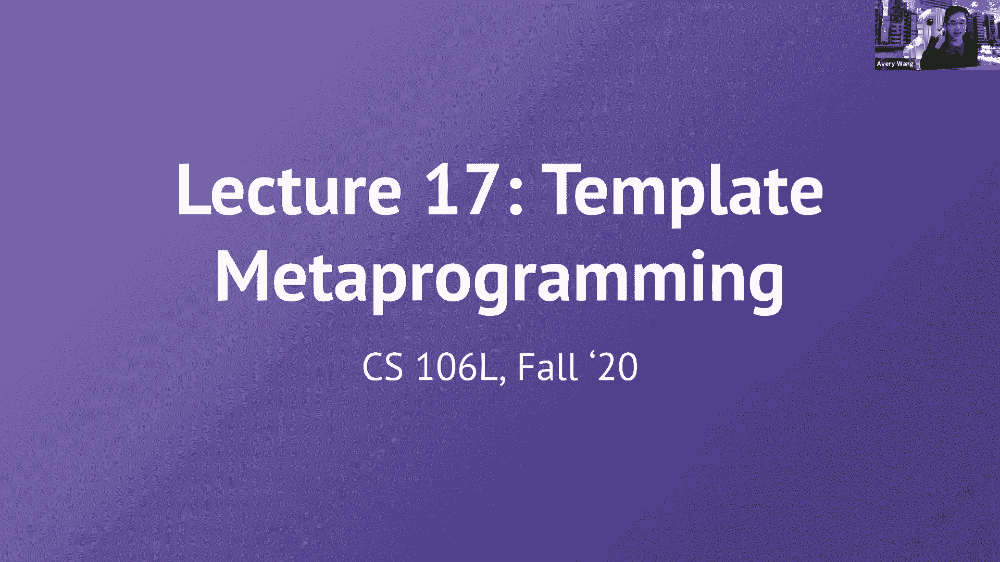

在本节课中，我们将学习模板元编程（Template Metaprogramming， TMP）的核心概念。这是一种在C++编译时对**类型**而非**值**进行计算的高级技术。我们将从理解其动机开始，逐步学习元函数、模板特化等概念，并最终实现一个能根据迭代器类型进行优化的`distance`函数。

## 概述：从值计算到类型计算

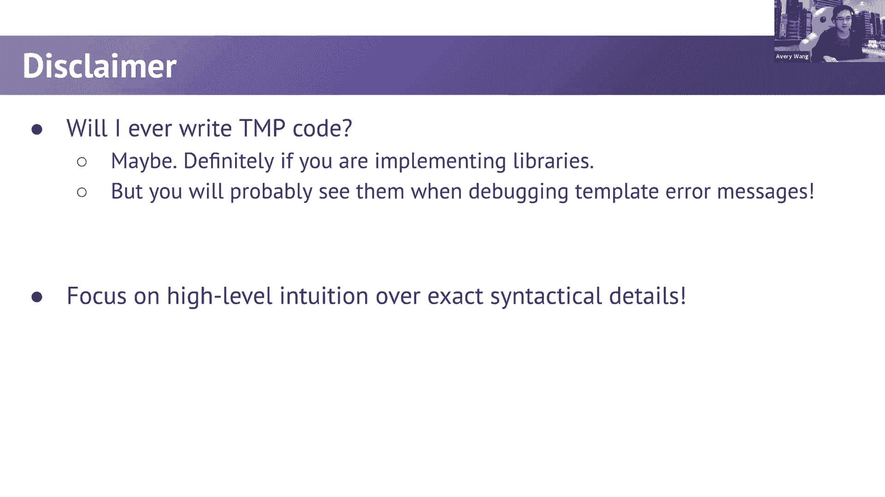


我们通常编写的程序是在**值**上进行计算。例如，处理数字、字符串等数据，并返回处理后的结果。然而，模板元编程改变了这个模型，它允许我们在**类型**上进行计算。这意味着我们可以操作`int`、`double`、引用、`const`等类型本身，并根据类型信息在编译时做出决策和生成不同的代码。

上一节我们介绍了模板元编程的基本思想，本节中我们来看看如何具体实现这种“类型计算”。

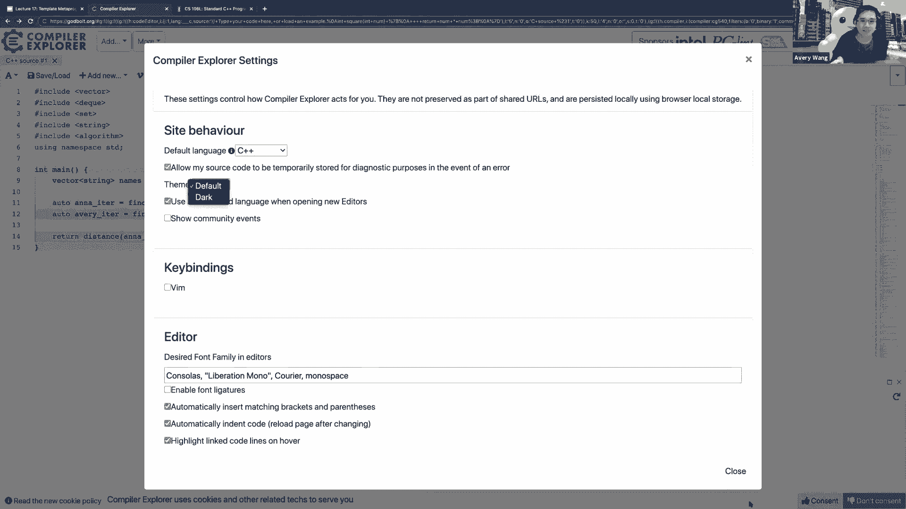

## 元函数：操作类型的“函数”

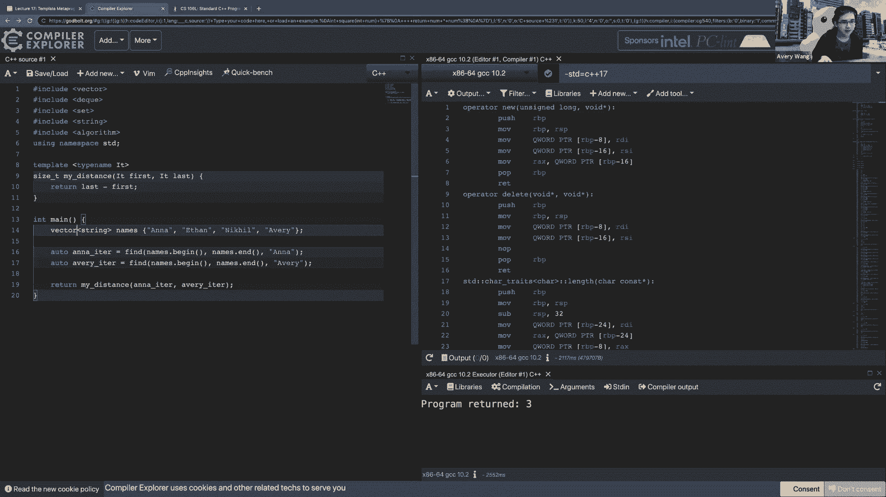

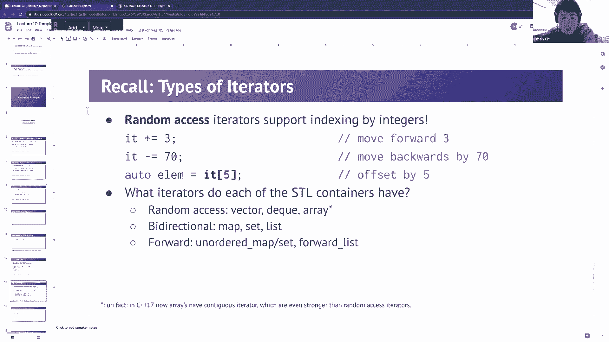

元函数是模板元编程的核心构建块。它类似于普通函数，但输入和输出可以是**类型**或**编译时常量值**。关键的是，元函数在C++中通常通过一个**结构体（struct）**来实现。

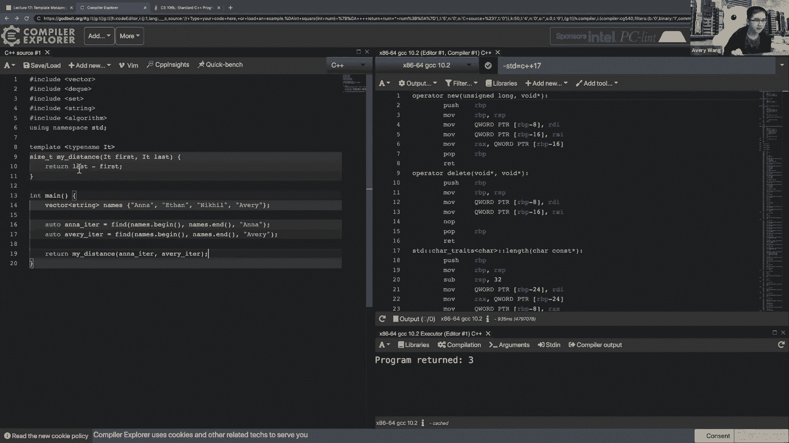

### 身份元函数示例

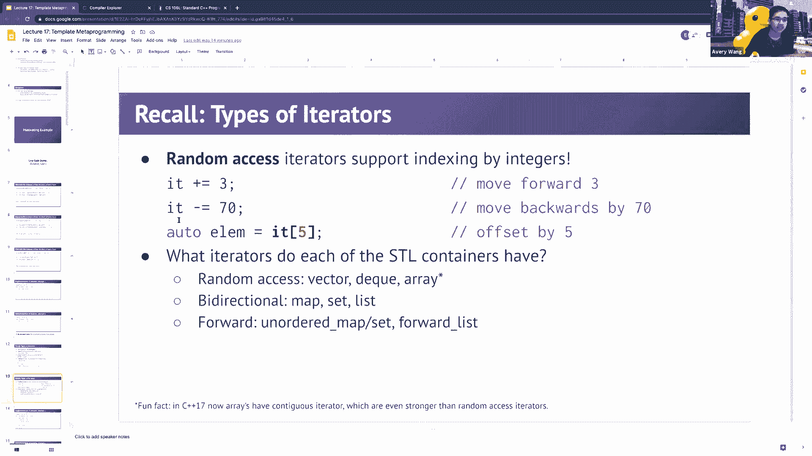

让我们从一个简单的元函数开始：`identity`。它的作用是接收一个输入（类型或值），然后原封不动地返回它。虽然它不做任何实际工作，但能帮助我们理解元函数的结构和用法。

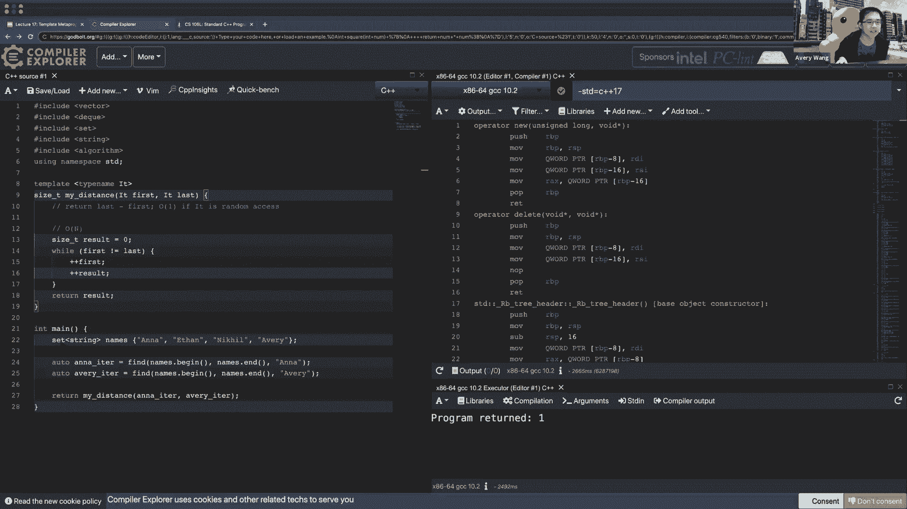

以下是`identity`元函数的实现，分别针对类型和值：

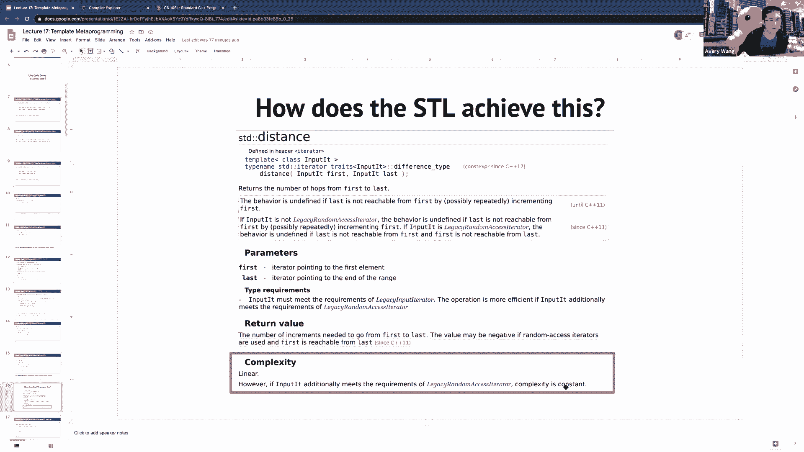

```cpp
// 处理类型的元函数
template <typename T>
struct identity {
    using type = T; // 输出类型
};

// 处理值的元函数
template <auto V>
struct identity_value {
    static constexpr auto value = V; // 输出值
};
```

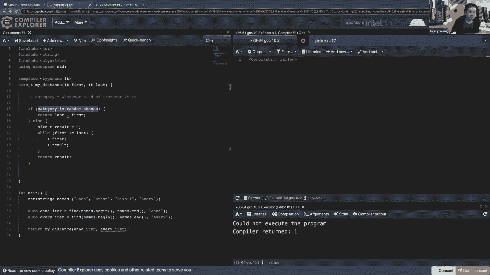

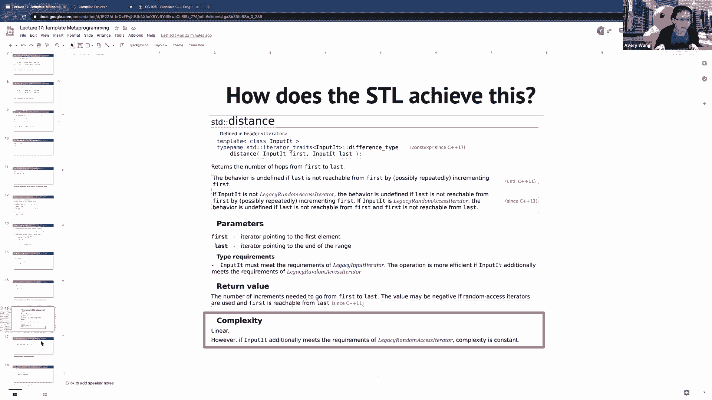


**如何使用元函数：**
*   对于类型元函数，我们通过 `typename identity<T>::type` 来获取结果类型。
*   对于值元函数，我们通过 `identity_value<V>::value` 来获取结果值。

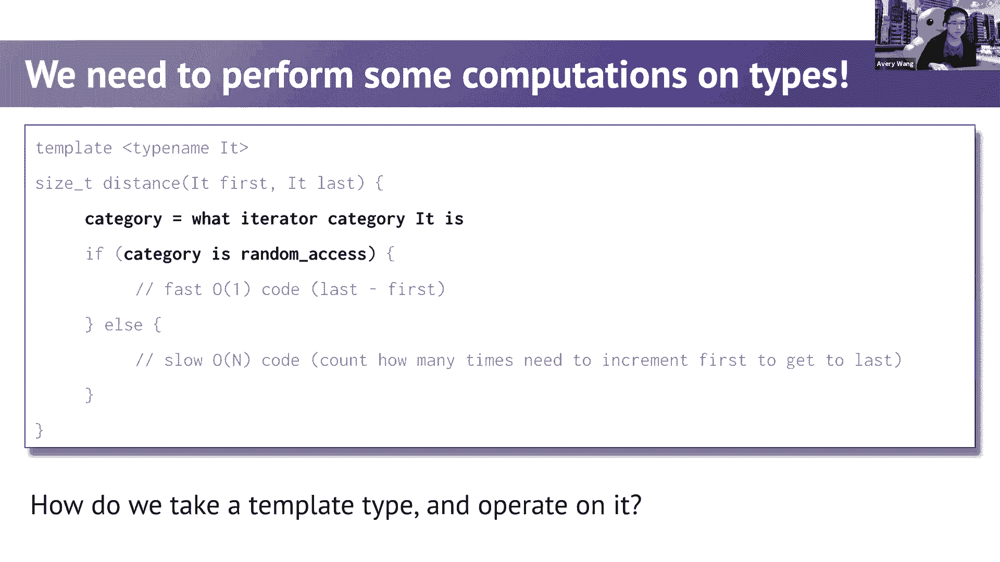

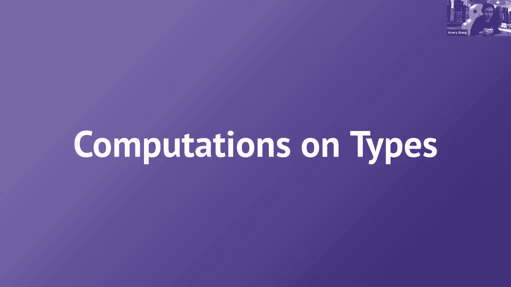

例如：
```cpp
using MyType = typename identity<int>::type; // MyType 就是 int
constexpr auto myVal = identity_value<42>::value; // myVal 就是 42
```

请注意，我们从不实例化这些结构体对象。我们直接访问结构体内部的静态成员（`type`或`value`）。按照惯例，返回类型的元函数使用`type`作为成员别名，返回值的元函数使用`value`作为静态成员。

## 实现更复杂的元函数：`is_same`

仅仅返回输入还不够，我们经常需要判断类型之间的关系。`is_same`元函数用于判断两个类型是否完全相同，它返回一个布尔值（`true`或`false`）。

实现`is_same`的关键在于利用**模板特化**技术。

### 模板特化简介

模板特化允许我们为模板类或函数提供特定类型或条件下的特殊实现。编译器会尝试匹配最特化的版本。

以下是一个模板特化的简单示例：
```cpp
// 通用模板
template <typename T>
struct MyStruct {
    static constexpr char* value = "generic";
};

// 针对 int 类型的特化版本
template <>
struct MyStruct<int> {
    static constexpr char* value = "int";
};

// 使用
std::cout << MyStruct<double>::value; // 输出 "generic"
std::cout << MyStruct<int>::value;    // 输出 "int"
```

### 实现 `is_same`

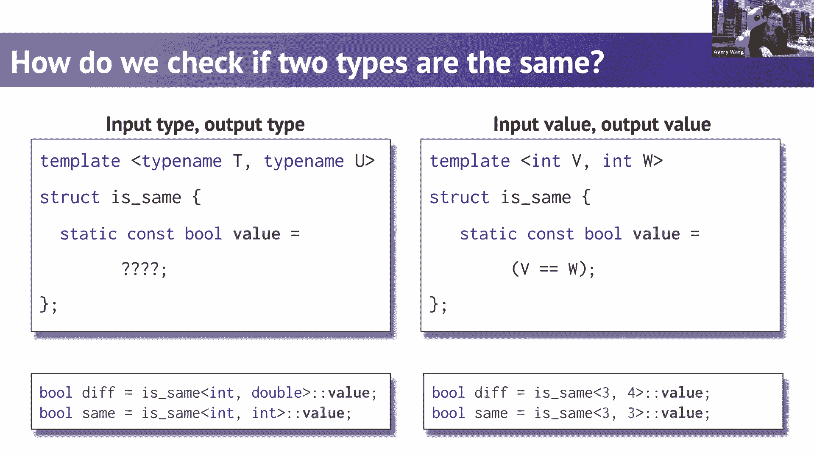


我们可以利用特化来实现`is_same`：当两个类型相同时，匹配特化版本并返回`true`；否则，匹配通用版本并返回`false`。

```cpp
// 通用版本：默认两个类型不同，值为 false
template <typename T, typename U>
struct is_same {
    static constexpr bool value = false;
};

// 特化版本：当两个类型 T 和 U 完全相同时，匹配此版本，值为 true
template <typename T>
struct is_same<T, T> { // 注意这里的模板参数列表是 <T, T>
    static constexpr bool value = true;
};

// 使用示例
bool test1 = is_same<int, double>::value; // false
bool test2 = is_same<int, int>::value;    // true
```

**工作原理：**
1.  当调用`is_same<int, double>`时，编译器首先尝试匹配特化版本`is_same<T, T>`。它需要让第一个`T`为`int`，第二个`T`为`double`，这失败了。因此编译器回退到通用版本，其`value`为`false`。
2.  当调用`is_same<int, int>`时，编译器匹配特化版本成功（`T`被推导为`int`），因此其`value`为`true`。

这种“尝试特化，失败则回退通用”的机制，本质上在编译时实现了一个`if-else`分支逻辑。

## 综合应用：实现智能的 `distance` 函数

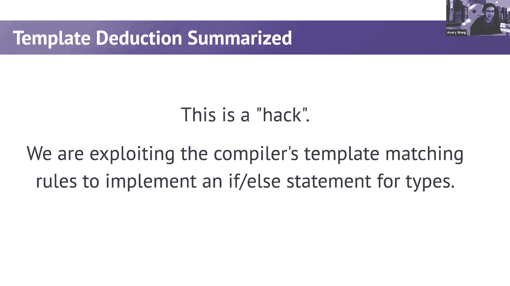


现在，让我们回到课程开始的动机示例：实现一个高效的`distance`函数，它能根据迭代器类型选择最优算法。

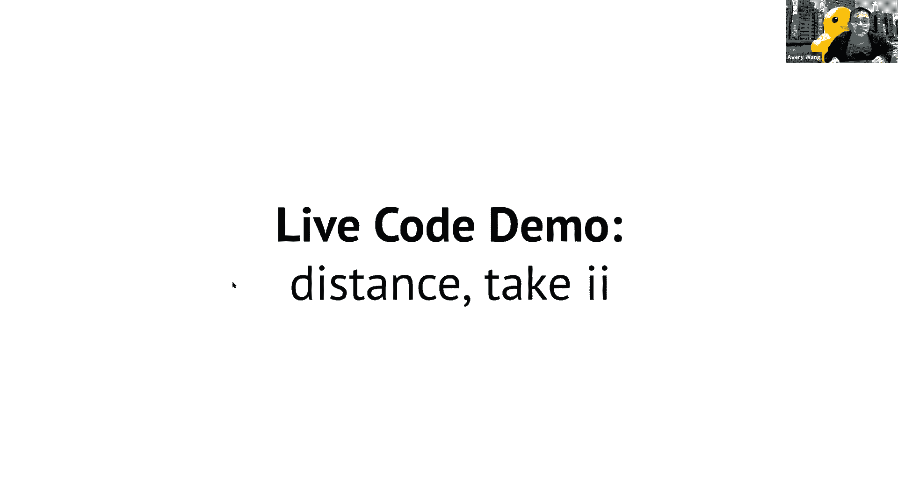

### 目标与挑战

我们的目标是：
*   对于支持随机访问的迭代器（如`vector`、`deque`的迭代器），使用 `last - first` 的O(1)算法。
*   对于其他迭代器（如`set`、`list`的迭代器），使用 `while (first != last)` 循环递增的O(n)算法。

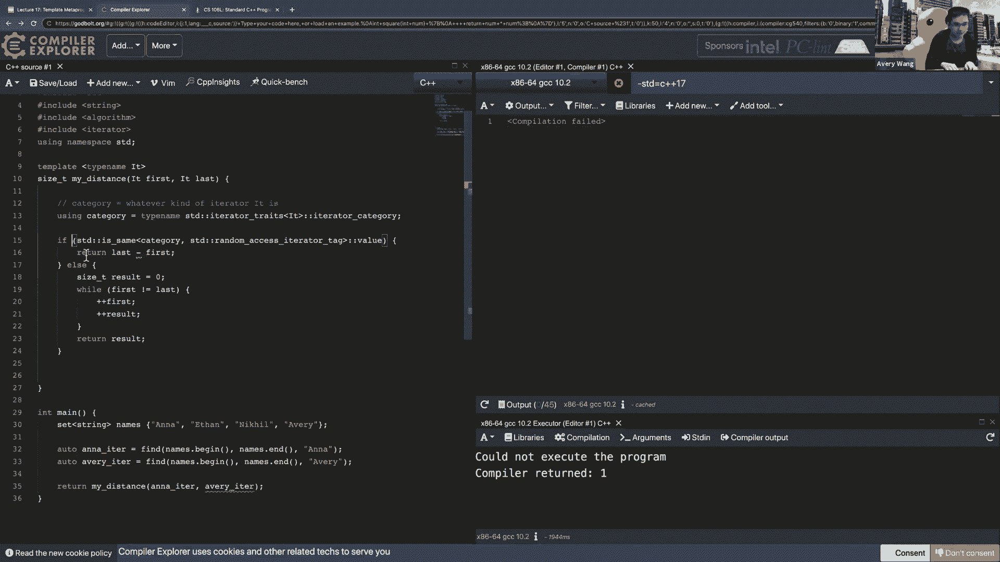

直接编写代码会遇到问题：`last - first`这行代码对于非随机访问迭代器无法编译，即使它所在的`if`分支永远不会被执行。

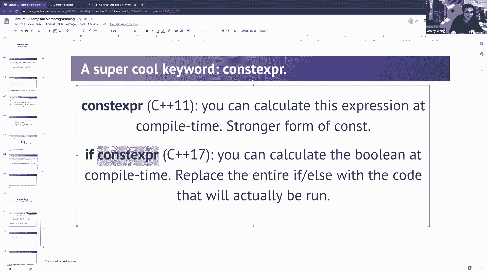

### 解决方案：`if constexpr` 与类型萃取

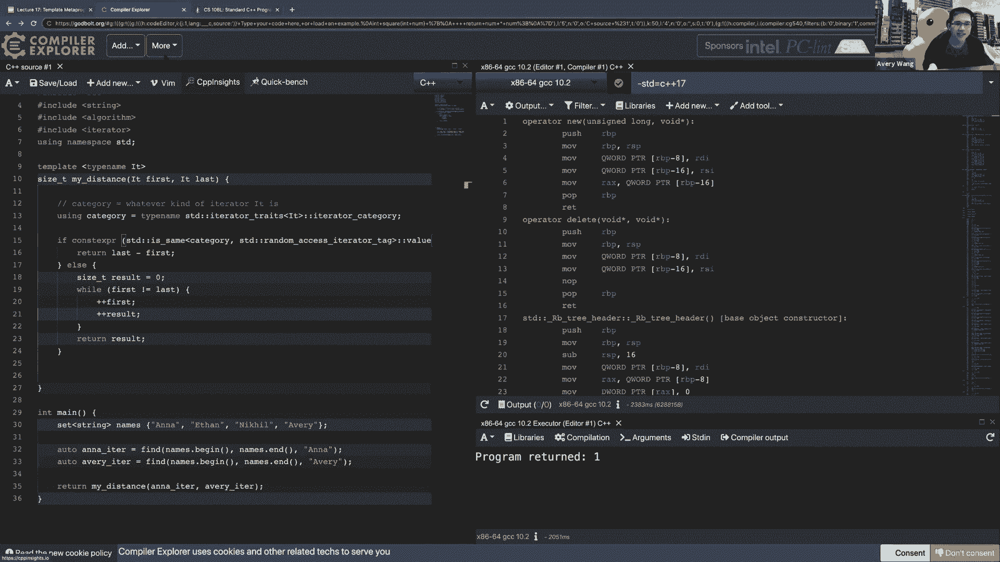

C++17引入了`if constexpr`，它能在编译时判断条件，并**只将符合条件的分支代码包含到最终程序中**。这解决了“无效代码导致编译错误”的问题。

我们需要在条件中判断迭代器类型。C++标准库提供了`std::iterator_traits`这个元函数来获取迭代器的各种属性，其中就包括迭代器类别。

以下是最终的`my_distance`实现：

```cpp
template <typename Iter>
size_t my_distance(Iter first, Iter last) {
    // 使用 iterator_traits 获取迭代器类别
    using category = typename std::iterator_traits<Iter>::iterator_category;

    // 编译时判断：是否是随机访问迭代器？
    if constexpr (std::is_same_v<category,
                                 std::random_access_iterator_tag>) {
        // 此分支仅当迭代器为随机访问时才会被编译
        return last - first; // O(1) 算法
    } else {
        // 此分支用于其他所有迭代器类型
        size_t result = 0;
        while (first != last) {
            ++first;
            ++result;
        }
        return result; // O(n) 算法
    }
}
```

**代码解析：**
1.  `std::iterator_traits<Iter>::iterator_category` 是一个类型，表示迭代器的类别（如随机访问、双向、前向等）。
2.  `std::is_same_v`是C++17提供的`is_same`元函数的便捷别名（`_v`代表`value`），直接返回布尔值。
3.  `if constexpr`在编译时计算条件。如果迭代器是随机访问的，则`else`分支的代码根本不会进入编译阶段；反之亦然。这确保了代码总能通过编译。

通过结合**类型萃取（`iterator_traits`）**、**类型判断（`is_same`）**和**编译时分支（`if constexpr`）**，我们成功实现了一个既通用又高效的函数。这正是模板元编程在标准库和许多高性能库中广泛应用的一个缩影。

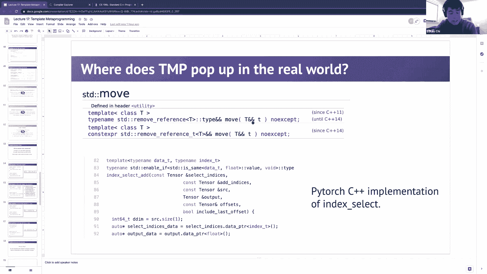


## 总结

本节课中我们一起学习了模板元编程的基础知识：

1.  **核心理念**：将计算从**运行时**的值转移到**编译时**的类型上。
2.  **核心工具**：**元函数**，通常实现为包含`type`或`value`成员的类模板，用于操作和返回类型/编译时常量。
3.  **关键技巧**：**模板特化**，通过为特定模式提供特殊实现，在编译时实现条件逻辑（如`is_same`）。
4.  **现代应用**：结合**类型萃取**（如`iterator_traits`）和 **`if constexpr`**，可以根据类型信息在编译期选择不同的代码路径，编写出既通用又高度优化的代码。

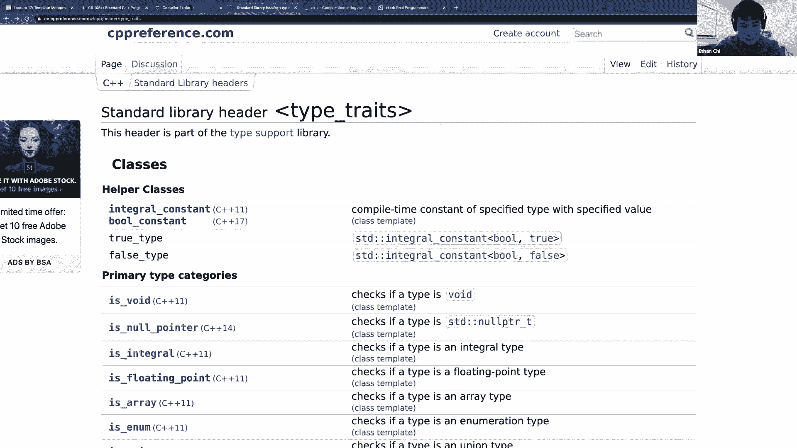

模板元编程是C++中强大而复杂的特性，它使得库作者能够构建极其灵活和高效的抽象。虽然日常编程中可能不会直接编写复杂的TMP代码，但理解其原理对于读懂高级库的代码、分析模板编译错误至关重要。