# 斯坦福大学《CS106L： C++编程｜ Stanford  CS106L C++ Programming 2019+2020》中英字幕（豆包翻译 - P2：[1]CS 106L Winter 2020 - Lecture 2_ Streams - GPT中英字幕课程资源 - BV1Fz421q7oh

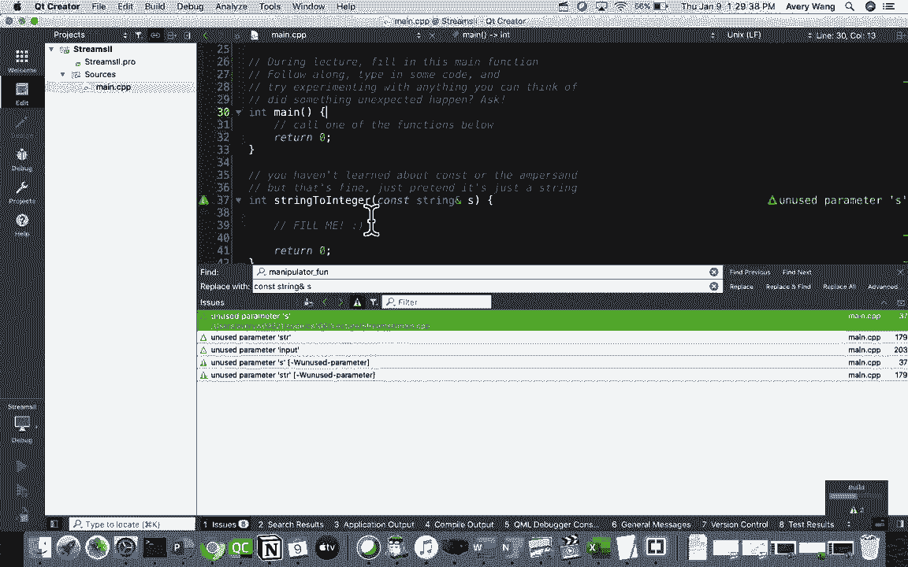

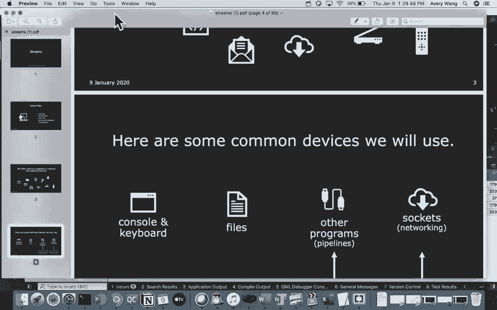

这有点烦人。

工作太多了。

没事，没事。我明白了，我明白了。

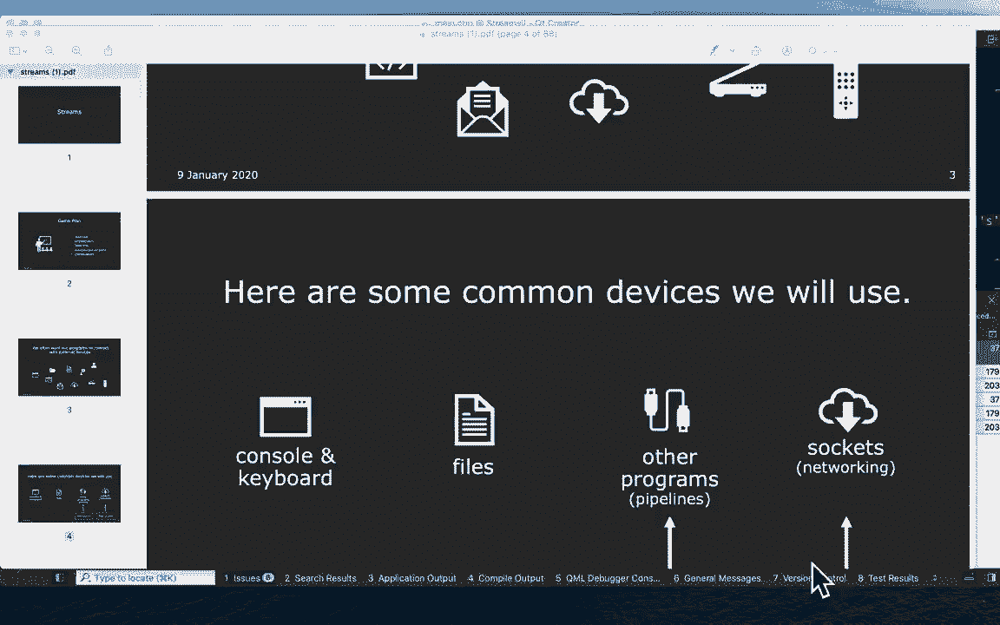

这是全屏。

太棒了。好吧，我会在一分钟内开始。这个给你，好吗？好的。大家好。欢迎回来。耶。那么，你们的第一周怎么样？课程确定了吗，一切都安定下来了吗？太棒了。好吧，今天开始下雨了。我担心你们有些人可能不会来。

但雨停了，我很高兴你们都，来了。今天，我们将讨论流。为了提供背景，我这里大约有100张幻灯片。上个季度，我有300张，一个学生在反馈表上写道这是他们，经历过的最压力的体验之一。所以，是的。

今天会非常非常可管理。好的，我们要讨论流。今天我们要涵盖的内容是，首先进行流的高层次概述以及，流存在的原因。然后我们将讨论最基本的流类型，字符串流。接下来我们将讨论状态位，并讨论IO流。最后。

如果时间允许，我会做一个两分钟的流操作符介绍。

它们不是特别重要。好吗？但在此之前，我意识到Keith没有讲解C++中的字符串是什，么，所以我将给你们一个关于C++字符串的快速速成课程。好的？那么，在大多数语言中，你怎么表示一个字符串？

你怎么创建一个字符串？对。当然，对。所以字符串，一些变量名，比如str等于，然后你可以在这里，声明你想要的内容。比如说hello world。好吗？所以，是的，这会创建一个字符串对象，字符串。

然后字符串，本身保存hello world。所以如果你尝试输出，它会将字符串打印到cout。字符串的一些奇怪的特性。让我们看看。关于字符串的一点特别之处是，如果你说你想获取一个单，一的字符。

有人知道怎么做吗？这和Java和Python一样。你怎么获取一个单一的字符？是的。对，好的，对。在Java中，你会使用。carat，对吧？是的，嗯嗯。在Python中呢？你索引它，对吧？好的。

在C++中，你做索引的操作，比如说你想获取第一个字符。这会打印什么？e，对吧？因为别忘了，字符串是零索引的，就像其他数据结构一样。所以如果你打印1，你会得到e。不同于Python，你不能做奇怪的。

像负一这样的操作。你不能那样做。在C++中，你只能基于实际的索引来索引。还有什么？你怎么修改一个字符？假设我想把hello world中的e换成其他字符。对，嗯嗯。酷，对。在Java中。

如果你想修改一个字符，你必须做这样的操作。字符串会从0到1做一个子字符串，再加上新字符，比如i，再，加上另一个子字符串到其他地方。但在C++中，这非常好。在 C++ 中，你可以将这个字符串视为一个数组。

所以你可以直接这样做，好吗？在 Java 中，因为字符串对象更安全，所以你不能这样做。但在 C++ 中，你可以将字符串视为字符数组，并且可以直，接这样设置。明白了吗？有问题吗？是的，有问题，是的。

好问题，是的。当你索引一个字符串时，每一个字符都是字符。所以你应该将其设置为字符。是的，这确实是个很好的观点。尤其是如果这是你第一次使用 C++，你可能会尝试这样做，然后你会遇到编译错误。是的。

编译错误也很困惑。所以，好问题。好了。最后我想简要提一下，如果你传入——好吧，我在决定如何引，导 C 字符串。这个字面量，其实是一个 C 字符串。C++ 中有两种字符串。一种是 C 字符串。

另一种是 C++ 字符串。明白了吗？C 字符串的类型是 char*，或者 char[]。而 C++ 字符串是一个真正的字符串。明白了吗？通常，总是使用 C++ 字符串。要使用 C++ 字符串。

基本上声明一个名为 str 的字符串，对象。明白了吗？好了。今天我们就讲到这里。其他的内容你会在周五跟 Keith 学到。

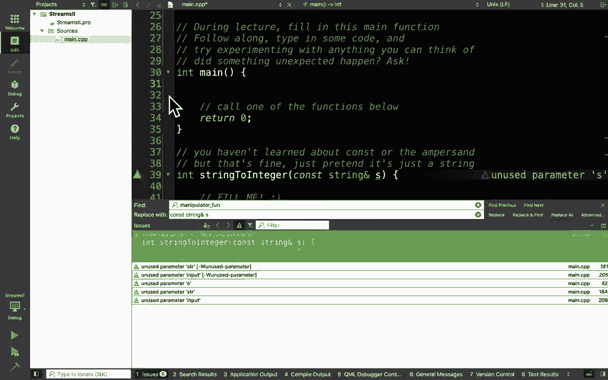

好。我们来谈谈流。那么流为什么存在呢？嗯，我们通常希望流能够与外部设备进行交互。有很多外部设备，你的程序可能需要与它们交互。一些最常见的，比如键盘。所以控制台和键盘是你最常见的设备。事实上。

在 CS106B 中，你已经见过 cout。Cout 是一个连接到控制台的流。所以如果你打印一些内容到 cout，你会在控制台上看到它，这些流也与键盘连接。所以如果你输入字符。

这些是连接的——键盘连接到一个流，内部。你也可以处理文件。我们今天不会讲文件，但 Keith 明天会讲文件。明白了吗？所以明天你会学习如何从文件中读取内容。你会学习如何写入文件。

这些也都是通过流来完成的。我们不会讲这两个，因为这两个相对高级。你可以写——你可以让不同的程序同时运行，然后它们相互，发送消息。它们在相互通信。这使用了一个叫做管道的概念。

你会在 CS110 中学习这个。非常酷，但基本上你还可以使用流将内容发送到其他程序，最后，流也用于网络编程。我们不会讲这个，但你可以参加 CS144。你将学习如何将内容发送到流，然后流会处理将内容发送。

到其他服务器。明白了吗？流的酷炫之处在于它是一个统一的接口，对吧？几乎所有的——有一个流。流可以做各种各样的事情，并且使用流的方式对所有四种，都非常相似。好的？例如。

你们都知道如何将内容打印到 cout。你们基本上对其他操作也是做同样的事情。好的？我个人喜欢称之为鳄鱼运算符。它是两个小于号。对吧？这就是你如何打印到 cout 的方式。

这也是你如何打印到其他程序的方式。好的？所以流的重点在于它提供了一个统一的接口来处理各种交，互。所以假设你有一个名为 date 的对象。我们还没有讲到对象，但我假设如果你来自 Java 或 。

Python，你知道这些对象是存在的。你如何打印——假设你想将这个对象打印到控制台上。你会怎么做？嗯，有两个主要步骤你必须完成。首先，你需要将程序中的信息变量类型对象转换为字符串。

计算机没有直接、简单的方法来知道，将其转换为流后会，变成什么。所以这是你必须管理的第一件事，类型转换。然后第二部分是你必须实际将那个字符串写入控制台。明白了吗？好的。你认为哪个操作更难？有什么猜测吗？

哪个似乎更难？好的。是的，类型转换似乎有点复杂，对吧？你需要读取字段并进行处理。但是你知道怎么做吗？如果我给你一个对象，你能将它转换为字符串吗？可能可以，对吧？你可以写一个表格。一个是一月，二是二月。

只需在那儿有一个表格。你可以读取月份，找出是哪个月份，找到日期，打印出来，将，日期放入字符串中。好的？所以这有点复杂，但你们都知道怎么做。另一部分，实际写入控制台，那比较复杂，对吧？比如。

你如何实际操作控制台？对吧？你可能甚至在 Java 中也没有学过这些内容，对吧？你还没有学会如何将内容显示到控制台上。好的？所以第二部分是难点。流的目标——好的，我再举一个例子。

假设你想从文件中读取一个双精度浮点数。那么有两个步骤。你首先必须从文件中读取字符串表示，因为，记住，文件只，是一个字符的集合。然后你将其转换为双精度浮点数。好的？你可能能做到这一点。这有点麻烦。

你首先要找到小数点的位置。你必须找到所有字符。你需要将它们全部转换为数字。但你能做到这一点。你如何从文件中读取一个字符？这有点复杂。所以，是的。再次，这两个挑战就是这样。

流的重点在于它提供了一个统一的接口来处理整个过程。不用担心你如何读取或写入内容，你可以将流视为字符的，缓冲区。好的？不要担心流如何实际接收你的字符并将它们放入控制台或，你正在写入的任何文件中。

你可以将整个过程视为一个大的数组。明白了吗？然后，交互流的接口是通过输出和输入运算符。明白了吗？所以，是的。例如，如果你在向 cout 打印，你只需将内容放入 cout 中，然后，cout 会将字符。

比如 3。14，写入 cout 的缓冲区中，之后，cout 缓冲区会将缓冲区中的内容转移到你的控制台，中。明白了吗？反方向也是一样的。你其实不知道你的流是如何从文件中读取到缓冲区的，但。

你知道里面有一个缓冲区，你可以从中读取内容。明白了吗？所以你只需要关注这个操作。流本身会处理其他所有事情。明白了吗？目前有什么问题吗？这有点像是一个高级的概念。这比较抽象。

你实际上还不知道这是如何工作的，所以我们会很快举个，例子。明白了吗？首先，我们来谈谈字符串流。字符串流很简单，因为它们不依赖于任何东西。明白了吗？它们基本上只是做这个转换而已。明白了吗？

如果你向字符串流缓冲区写入内容，这些内容就会保留在，那里。不会转移到其他地方。明白了吗？

所以让我们做一个例子。你们都把这段代码调出来了吗？如果没有，那也没关系。你可以找一个旁边的人，他有调出来的代码。我喜欢讲座有互动性，所以边做边填充内容。正如我在这里写的，我写了很多内容。

你可以看看下面写了什么，但你可以调用这些函数看看发，生了什么。继续跟着做。尝试输入一些代码。你也可以尝试不同的东西。如果你注意到有什么意料之外的情况。明白了吗？首先，我们将尝试使用字符串流做一些操作。

我们需要做的第一件事是如何构造一个字符串流？构造字符串流有两种类型。有输入字符串流和输出字符串流。我们先创建一个输出字符串流。好的，所以我们刚刚声明了一个输出字符串流。实际上。

我们稍后会学习为什么这是一个错误。是的，所以我们声明了一个输出字符串流。实际上，为了让它更有趣，我会先在字符串流中放入一些内，容。比如说 ito 和 greenT。好的，所以现在你应该想象一下。

一旦你创建了字符串流，你就有了一个字符串流，并且它的缓冲区中已经包含了这，些字符。明白了吗？好的，这是一个输出字符串流，这意味着你可以向字符串流，中写入内容，但不能从中读取。好的。

那么假设我向其中写入一些东西。比如我写 16。9 盎司。实际上，在我们这样做之前，先试着运行一下这个代码。好的，所以流有一个特殊的操作，你可以基本上将缓冲区中，的内容转储出来，创建一个字符串。例如。

我可以做类似 oss。str 的操作。这个方法将缓冲区中的内容转换成一个字符串。好的，这样理解了吗？那么你期待这里打印出什么？Ito 和 greenT，因为我们构造了一个字符串流。在它的缓冲区中。

你开始时是这些字符，我们只是立即将缓，冲区转换回字符串。所以它应该仍然是 ito 和 greenT。好吧，目前有任何问，题吗？好，现在我们实际上可以向 oss。str 写入内容。例如。

我们可以写入 16。9 盎司，然后我们可以再次尝试打，印 oss。str。你期望打印出什么？是吗？好问题。所以当你声明。问题是，当你创建一个字符串流对象时，它是否有自己的缓，冲区。

或者当你创建多个字符串流对象时，它们是否共享同，一个缓冲区？答案是每个字符串流都有自己的缓冲区。所以你可以看到我们实际上有两个流在运行。我们有 ostringstream。这是一个字符串流。

我们还有一个 cout。Cout 也是一个流。这两个缓冲区不。它们不会互相共享内容。所以我们可以向 cout 打印内容，而我们的 oss 仍然在进，行操作。好的，好问题。是的，好问题。

你为什么会使用流而不是字符缓冲区？正如我们很快会看到的，写入内容是很好的，但真正的强大，之处在于从流中读取内容。流本身会自动为你找到字符。它还会进行类型转换。例如，如果你想从缓冲区中读取一个整数。

这有点困难。你必须找到空格的位置。你必须将字符转换成一个整数。如果你使用流，你可以直接读取整数，我会很快展示这个。这是个很好的问题。每当我们教你们东西时，询问为什么使用这个而不是其他。

类似的东西总是好的。这是一个值得持续提问的好问题。好吧，你能猜测这里打印了什么吗？有任何猜测吗？好吧，如果不确定，你总是可以运行代码。

让我们看看发生了什么。

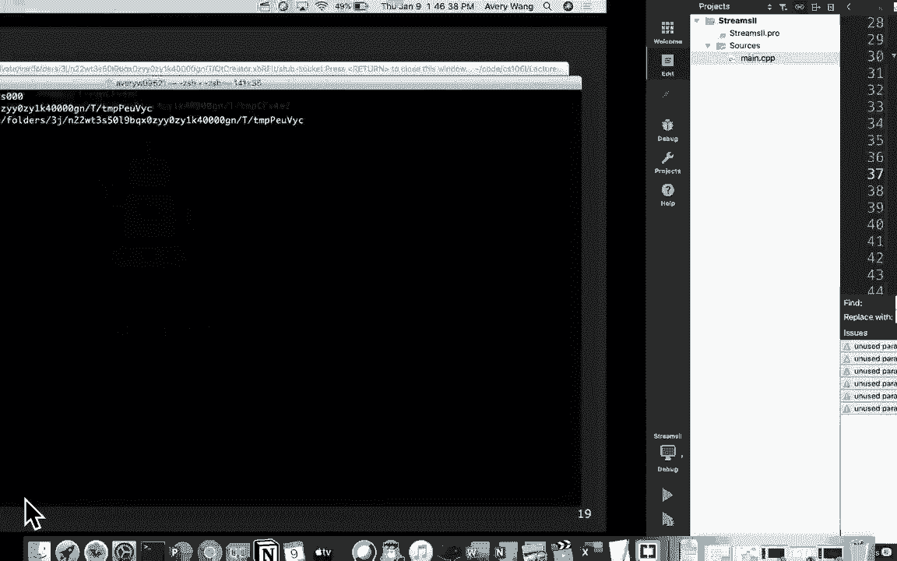

好的，那么刚刚发生了什么？是的。好的，所以长度相同。有什么变化？正是这样。16。9 盎司，我们基本上覆盖了里面的缓冲区。

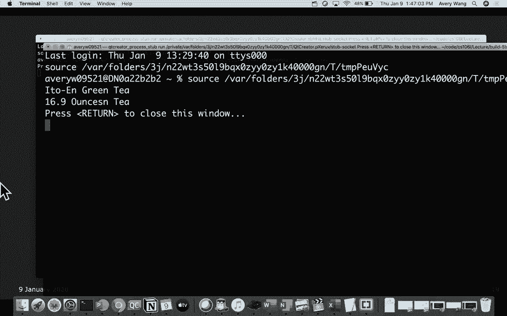

所以这是一个非常重要的概念，就是缓冲区本身。

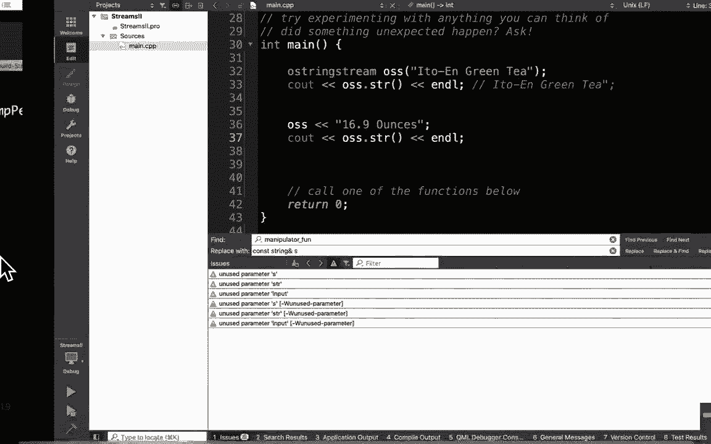

如果你查看这些幻灯片，你会注意到我有一个箭头，它会显，示当前位置。这决定了所有内容的读取和写入位置。当你写入内容时，位置指针会一直向下移动。最初，当你构造一个字符串流时，它最初从开始处开始，这。

就是为什么我们覆盖了缓冲区。

好的？你不需要记住这些，但如果你想从字符串流的末尾开始，你，可以做类似 stream， stream 的操作。你可以提供一个常量，称为 A-T-E，代表末尾。

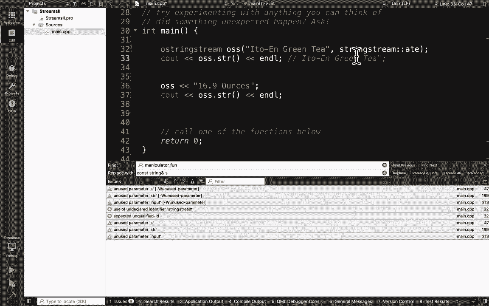

字符串流，它未定义。

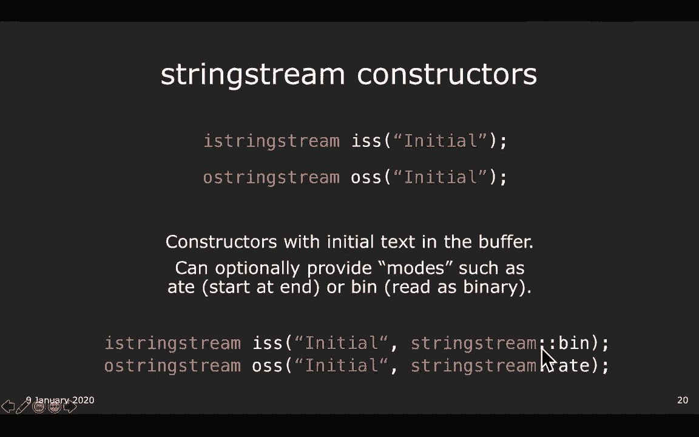

真的吗？这应该能工作。好吧，这很奇怪。哦，字符串流。哦，搞定了。谢谢你。是的，好吗？所以你可以这样做，然后如果你尝试运行这个，位置指针从，最末尾开始。而且，当然，这个文件没有找到。

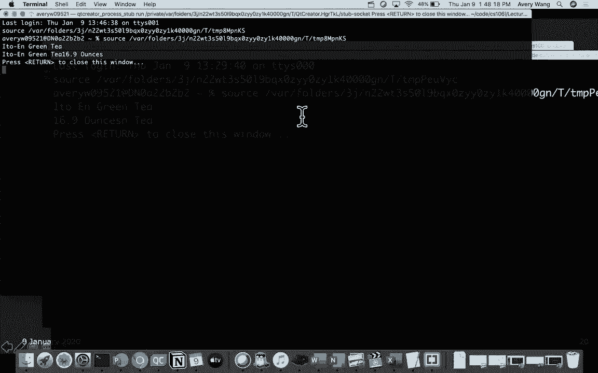

明白了吗？这可能是我们最初想要的。现在位置指针从末尾开始。

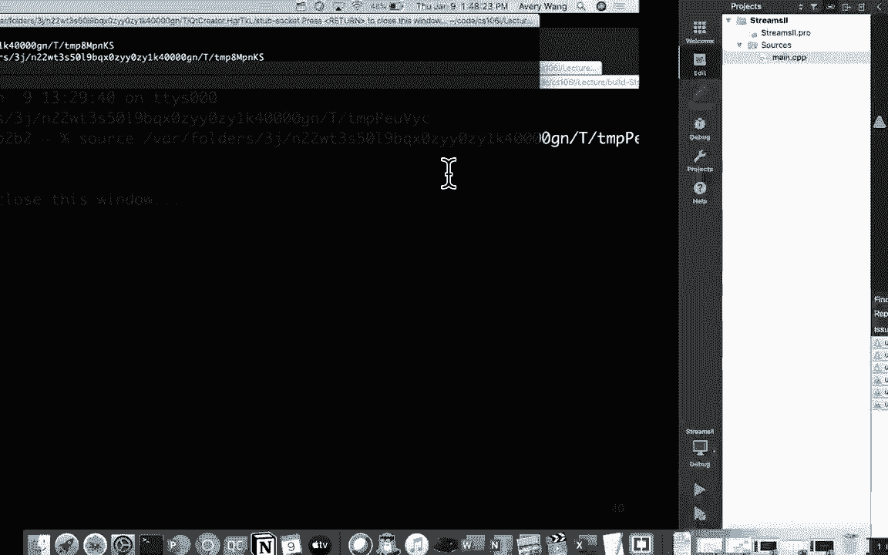

好吧，还有其他问题吗？嗯？一、二。是的，它们被表示为字符。你指的是哪一张幻灯片？是这张吗？第18张，好。这张幻灯片？是的。所以不要忘记流的抽象在这里。这就是流的抽象。所以这个字符串表示。

其实是缓冲区中的写入内容，字符被，存储在那个缓冲区里。你在这里看到的变量，就是你在程序中写入缓冲区的内容。

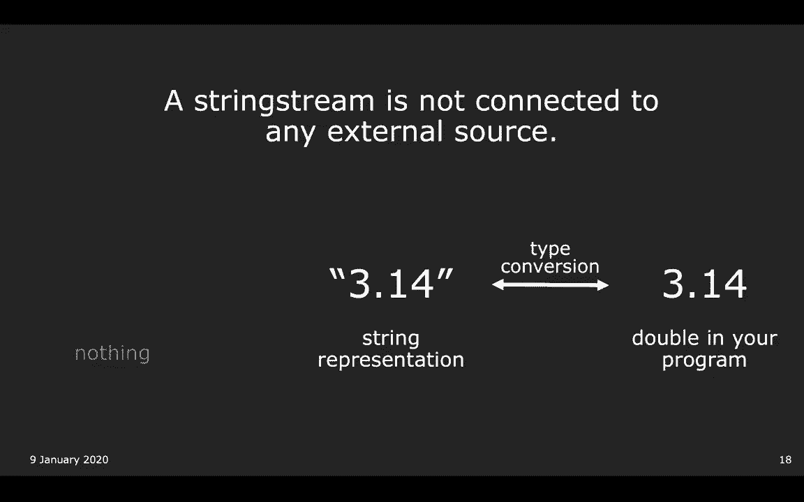

。我想我知道你的意思了。你的意思是，比如说，在这里我们可以直接写16。9吗？我们可以尝试这样做吗？是的。数字到字符串的转换，它只是将其转换为字符串并存储在，那个字符串里，无论那个字符串是否在内存中。

好问题。所以字符串流或任何流的一个很酷的功能是它们会为你进，行转换。所以你可以放置任何支持插入的类型，它会在放入之前将，任何类型转换为字符串。这样会有效。所以如果我们改为16。9。

它们会被转换成单个字符并放入，缓冲区中。明白了吗？很酷。好吧。所以字符串流没有太多复杂的，但它们很好玩。让我们尝试一个输入字符串流。我们从相同的内容开始。实际上，让我们做16。9盎司。明白了吗？

所以输入字符串流的好处是它们为你做了转换。明白了吗？所以假设我想读取开头的内容。所以16。9。然后我想在我的程序中实际使用它。明白了吗？我可以做的是直接用一个双精度浮点数变量。

我们还可以创建一个叫做单位的字符串。然后我们可以直接提取双精度浮点数，再提取单位。明白了吗？所以注意会发生什么，我们创建一个输入字符串流，它有这，些字符在缓冲区中。位置从开始处开始。当你调用这个操作时。

字符串流会将位置向下移动尽可能，远，直到遇到空白字符，然后抓取它经过的字符，并将其转，换成你所要求的类型。所以这里，位置从开始处开始，然后向下移动，读取尽可能，多的内容，直到遇到空白字符。

然后将它读取的字符转换为，你要求的类型。所以在这里，它将16。9直接转换为一个值为16。9的双精度，浮点数。明白了吗？到现在为止怎么样？这有意义吗？好吧，为了证明它是双精度浮点数。

我们尝试打印amount除，以2。你期望打印什么？8。45，正是这样。好的，给你这个。8。45。好的，重要的是你读入的类型很重要。好的，如果我把这个转换成字符串，哎呀，这仍然会工作，除，非你做ISS。

它尝试抓取一个字符串，它抓取16。9而不是将，其转换成字符串。好的，这就是为什么这个amount除以2不工作，因为amount，是一个字符串。快速问题，如果我这样做呢？然后我打印出来，好吧。

你期望打印出什么？我听到有人说了答案。8，对，因为它向前移动，尝试提取尽可能多的字符，这些字，符对读取为整数有意义。它看到小数点，然后就像，好吧，小数点不能是整数的一部，分，所以我们必须在这里停止。

然后它抓取16，将其转换为整数，放入amount，所以你在这，里得到8。unit是什么？unit会是什么？好的，我听到。9和16。9。答案是。9，原因是位置已经移动到这个位置。它尝试读取16。

所以位置移动到那个位置。然后当你尝试做这个操作时，它读取到下一个空白字符，所，以它读取这个。明白了吗？所以试试看，它可能会工作。

是的，所以8，然后是一个空格，接着是。9。

问题？是的？

好问题。所以你问的是，当你进行错误操作时，分隔符是什么？好的，是的，好问题。所以如果你在读取一个字符串时，如果你在提取东西到字，符串中，那么分隔符将是一个空格。明白了吗？事实上，不只是任何空格。

这是一个幻灯片，显示了什么是空白字符分隔的标记。如果我们尝试读取，假设这些是字符串，如果你尝试一个一，个地读取字符串，第一个会是标记。它会跳过反斜杠n，这表示换行，点后面是一个句号。

它将单个句号读取为标记3。它跳过这些反斜杠键，这是一个制表符。一堆换行符。它跳过所有内容，只读取下一个。明白了吗？是的，它读取一个空白字符分隔的标记。还有其他问题吗？后面有人有问题吗？好的，太棒了。

好的，所以类型确实很重要。如果你尝试，第二部分的回答是，如果你正在读取各种其他，类型，而不是字符串，那么它会读取尽可能多的内容，只要，类型仍然有意义。所以如果你读取一个整数，1和6作为整数是有意义的。

但句，号不再有意义，所以它在这里停止，读取6作为整数。明白了吗？现在，这应该引起很多问题，比如说，好吧，它试图读取整数，如果不能怎么办？那应该是你立刻想要思考的问题。如果不能怎么办？

我们很快会讨论这个问题。你有问题？好的，正是如此。好的，太棒了。是的，所以简单回顾一下。如果你，分隔符操作，它将变量转换为某种字符串字符形式，插入到缓冲区中，就是这样。所以你可以链式操作这些操作。

所以如果你链式操作，它首先执行第一个操作，然后执行第，二个操作。如果你链式调用底部的那个，它会读取到第一个，然后读取，到第二个。他们确实有一个关于为什么这样有效的问题，对吗？比如说，当我学习这门课时。

我总有一个问题，就是，这到底，是做什么的？这看起来像一个非常奇怪的符号。你不能用其他对象这样做，对吗？比如说，你不能读取到一个 vector 中。你不能读取到其他对象中。为什么这样有效？具体来说。

为什么你可以这样链式调用？好吧，实际上，我现在有点想回答这个问题。这些叫做运算符，我们稍后会更多地讨论运算符。但这些运算符是特别定义的，来说明如果你用这个运算符，和流以及其他对象一起使用会发生什么？

在这里，无论是谁编写了流库，都说好吧，你应该将右边的，对象转换成字符，并将其插入到左边对象的缓冲区中。明白了吗？显然，这只有在左边的对象有缓冲区时才有意义。为什么可以链式调用？通过某种操作顺序。

它先执行左边的操作，这个左边的操作，变成并返回 OSS 本身。所以实际上这里发生的事情是，假设我们尝试链式调用这。

个结果。这会起作用。发生的事情是，在这个初始操作完成后，这将返回 ISS 本，身。所以这将折叠成这个。鳄鱼运算符返回流本身，这就是你可以链式调用它们的原，因。有任何问题吗？

很好。好吧。我们跳过吧。我们回答了这些问题。有没有一种流可以同时进行插入和提取？有的。这只是叫做常规流，而不是 I 流或 O 流。你可以在网上搜索一下。这很有趣。这些东西叫做流定位函数。它们比较底层。

它们有点无聊。基本上，你可以根据需要移动位置指针。你可以很容易地在网上搜索它们。你可以弄明白它们是怎么工作的。好吧。如果你愿意的话，你实际上可以访问缓冲区本身。我们不会教授这个，因为那需要理解指针。

但只是供参考，这些东西是存在的。很好。好吧。

信不信由你，你实际上已经足够了解来实现你第一个斯坦，福库函数了。所以第一个斯坦福库函数，字符串转整数。字符串转整数做什么？它接受一个字符串，将其转换为整数。如果转换失败，它会抛出一个异常。现在。

不要担心抛出异常的部分，你可以和你身边的人一起，讨论。尝试想办法写出这个函数。你已经足够了解如何编写这个函数了。而且它只有四行长。开始吧。我没有放那个原型。真糟糕。好吧。所以每个人也必须做这个。好吧。

我们可以继续吗？好的。那么，有什么想法吗？有人想自愿提出一个想法吗？有任何想法吗？有任何想法吗？我给你一个提示。你需要字符串流。那么你觉得第一行是什么？好的。声明一个字符串流。你在参数中放什么？S？

好的。很好。所以我们将S传入，创建一个字符串流，其缓冲区字符来自S，好的。接下来是什么？对不起？好的。在这里声明一个整数，因为我们将其转换为整数。所以是整数结果。接下来。是的。读取。

从字符串流中读取一个整数。最后。好的。是的。所以C out将其打印出来，但这里这是一个函数，所以我们，只需返回结果。好的？是的。很简单，对吧？好的。所以在这里输入代码。所以我在下面写了一个函数。

字符串转整数测试，它让你输，入不同的整数，并为你调用函数。好的？不要担心这个是如何工作的。你下周会学习这个。但是是的。是的。所以在主函数中，尝试调用字符串转整数测试。我写了一个小错误。

我忘了声明这个函数的原型，所以你需要复制它，放在最上，面。好的？我忘了声明原型。所以确保你这样做。然后你可以尝试调用这个函数，你会看到类似的弹出信息。

。它会提示你输入一个整数，比如30。好的。然后它说，你输入了30。我将把它转换为整数。这仍然是30。30的一半是15。好的？所以在这里我们可以看到它成功地读取了字符串30，将其，转换为整数，并除以2。

明白了吗？好的。我们试试其他的。7。好的。所以你输入了7。那一半就是3。所以在这里你可以看到它将字符串形式的30和7转换为整，数，然后对其进行除以2，打印出一半的值。好的？到目前为止明白了吗？好的。

你可以测试一下吗？试着破坏程序。尝试做任何你能做的事情。只要试图让它做错什么事。好的？这并不难。是的？好的。所以如果你输入A，它认为你输入了0，0的一半是0。是的。所以这确实破坏了程序。

还有其他可以破坏程序的方式吗？字符，字母，当然。是的。这也破坏了程序。还有其他方式吗？回车？好的。是的。所以如果你输入回车，它会认为是0。

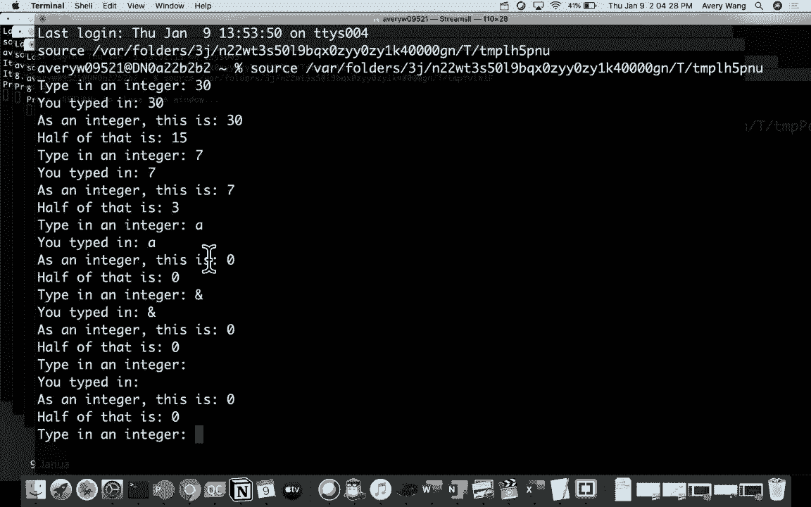

哦，是的。哦，好问题。你可能不会得到0。请注意一下。大家好。如果你输入回车或输入错误的内容，你可能不会得到0。明白了吗？原因是——Keith讲过了吗？如果你声明整数但没有初始化，它们只是随机垃圾。好的？

所以这个结果不一定是0。它是你声明时计算机里随机的垃圾数据。所以当你打印出来时——如果它不能读取一个整数，这一行，什么也不做。然后当它返回结果时，返回的是结果中原本的垃圾数据。明白了吗？

这些是未初始化的值。

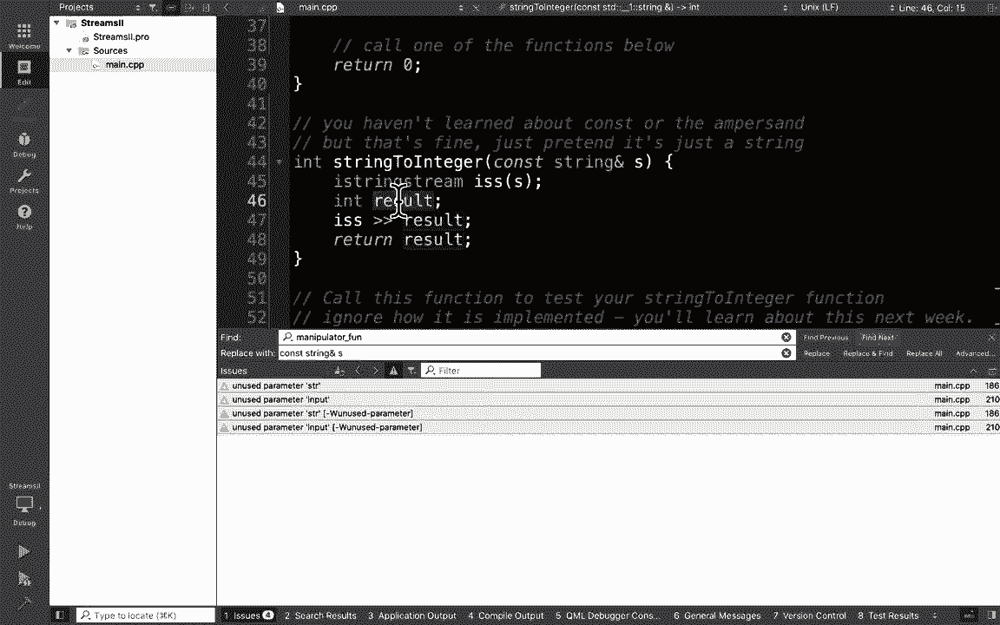

它们不好。它们会引发严重的安全问题。问问Anna吧。对。尝试一些其他有趣的东西。如果我输入8，也就是一个有效的整数，然后我再输入另一，个整数会怎么样？发生了什么？也许我应该试试，比如9和3。

它基本上只读取了第一个。它忽略了其他的。明白了吗？如果我输入一个无效字符然后再输入一个9会怎么样？发生了什么？对。

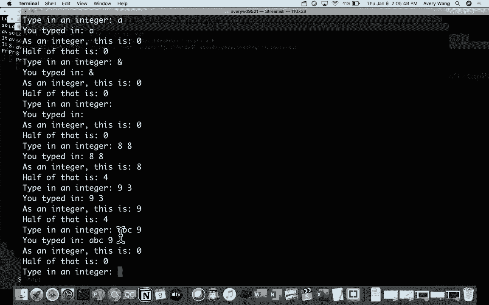

它执行了第一个，发现哦，这个是错的，所以它什么也没做，明白了吗？

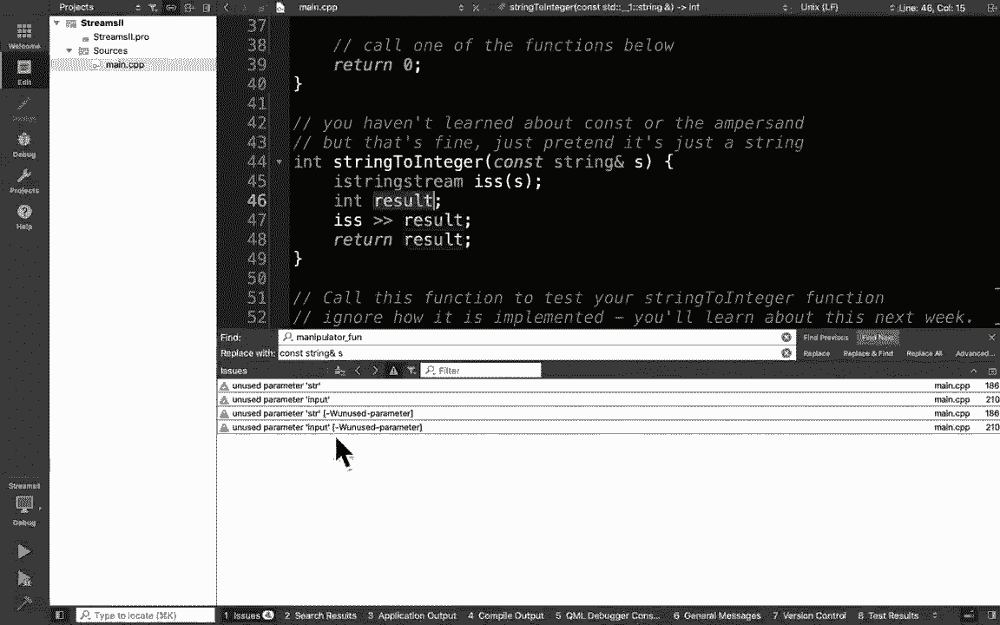

所以我们会尝试修复这个问题，因为——对。这就是通常发生的情况，如果你尝试使用cin而不学习如何，使用流。基本上，在你的第一次作业中，你会通过所有正常的测试，然后当他们尝试使用错误的输入来测试你的程序时。

你会，失败所有的测试。所以在CS106B中不要使用cin。明白了吗？或者考试中。我们来看。我有很多窗口。

好的。这是第一次尝试。问题是，如果这个操作失败了会怎么样？我们来谈谈状态位。有四个位表示流的状态。明白了吗？它们用颜色编码标识，如这里所示。有一个好位、一个失败位、一个EOF位和一个错误位。明白了吗？

快速概述一下。好位意味着一切正常。失败位意味着之前的操作失败了。EOF位意味着之前的操作达到了你拥有的缓冲区的末尾。而错误位意味着发生了一些坏事。挺容易理解的。嗯，除了EOF和失败。明白了吗？

所以你会注意到，如果发生失败，或者其他任何位被激活，所有未来的操作都会被冻结。

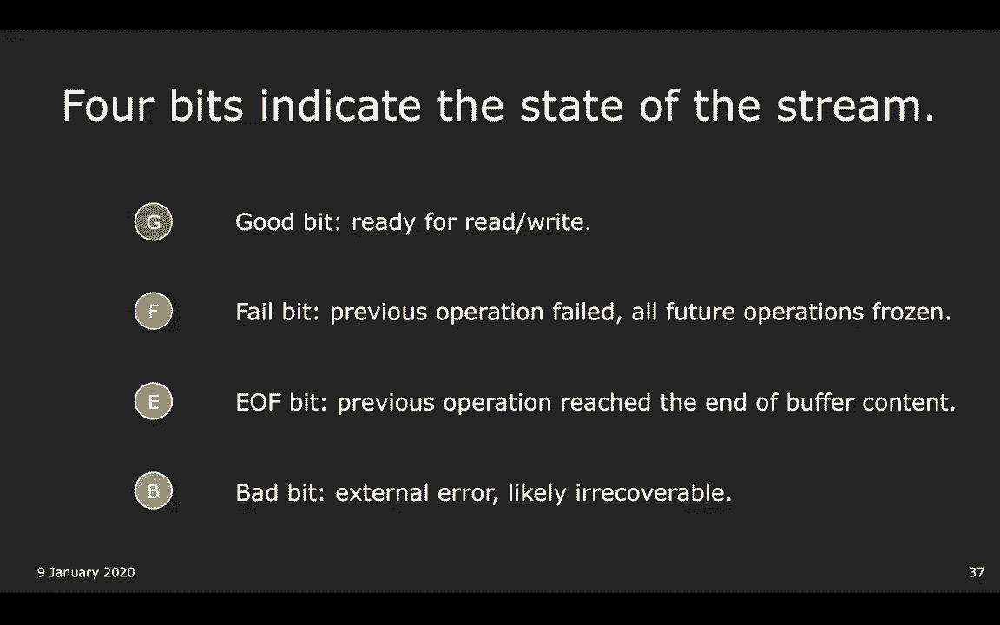

明白了吗？这是什么意思？这意味着如果这个操作失败了，那么失败位就会被激活。你可以尝试做一些随机的操作，比如有效的、无效的，随便。

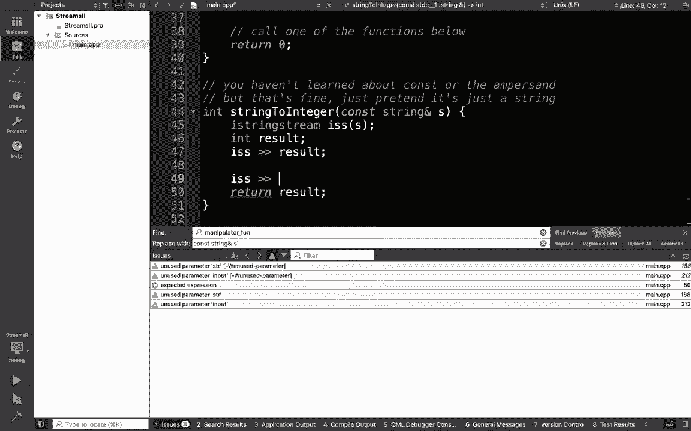

什么。所有这些操作都不会有任何效果。所以这些位非常重要。它们指示流现在发生了什么。明白了吗？那么一个位可能被激活的常见原因。第一个，没有什么特别的。如果其他位都没有激活，那么好位会被激活。失败位。

最常见的是类型不匹配。这是什么意思？就是我们刚刚做的，对吧？当你尝试读取一个整数，但它不能读取整数，因为它不是整，数。明白了吗？如果发生这种情况，失败位会被激活，未来的操作会失败。EOF。

当你到达缓冲区的末尾时，我们稍后会看到。然后错误位很少被激活。如果错误位被激活，那么发生了一些非常非常糟糕的事情，程序可能内部发生了错误。你可能无法从错误位问题中恢复过来。

我们可以从失败位和EOF中恢复过来。现在，关于状态位的重要事项，这一点并不直观。良好和失败不是对立的。明白了吗？这些也是需要思考的哲学性问题。良好和失败不是对立的。好吧？良好和失败不是对立的。

当你拿到冬季学期的考试成绩时，请记住良好和失败不是，对立的。明白了吗？所以，仅仅因为你想检查是否失败，并不意味着这实际上是，良好的。所以，即使你检查了考试成绩，你没有失败，这也不一定意，味着你做得很好。

明白了吗？良好和失败不是对立的。良好和坏不是对立的。是的，但我们最关心的是失败和EOF，这意味着你很少需要，检查良好，因为良好不是失败的对立面。良好不是EOF的对立面。

明白了吗？酷。让我们尝试查看状态位。为了做到这一点，我为你写了一个可爱的函数，叫做print ，state bits。明白了吗？你可以快速读取它。它的作用是打印状态位。明白了吗？需要注意的是。

我使用了一个叫做转向运算符的东西。你不需要真正理解它。Keith实际上会教这个。Keith是唯一会教这个的讲师。是的。基本上，转向运算符是一个非常简短的if-else语句。明白了吗？可以理解。

有些人讨厌它，因为它不像if-else语句。但Keith真的很喜欢它。所以，是的，你会学到更多关于它的内容。它的好处在于，如果你需要做这样的事情，你可以用一行代，码来替代。明白了吗？有趣。

我应该告诉你一个有趣的事实吗？不。我会留到下次再说。酷。酷。让我们看看。好的。所以我们要做的是在这个函数内部尝试一下。让我们尝试打印状态位。所以print state bits。

你必须传入你想查看状态位的流。所以这里我们想查看ISS。明白了吗？所以我将在这里打印状态位。我将在读取之后打印状态位。我想就是这些了。明白了吗？所以我们将尝试在构造之后立即打印状态位，并在你尝试。

从中读取之后立即打印状态位。明白了吗？好的。所以尝试输入这些代码并运行程序，看看你得到什么。

好的。让我们尝试一个常规操作。137，Keith最喜欢的数字。好的。这有意义吗？最初，良好位是打开的。读取之后，EOF位是打开的。这有意义吗？好的。直观上有意义，对吧？最初，一切都是良好的。

当你读取某些内容时，你到达了缓冲区的末尾，EOF位是打。

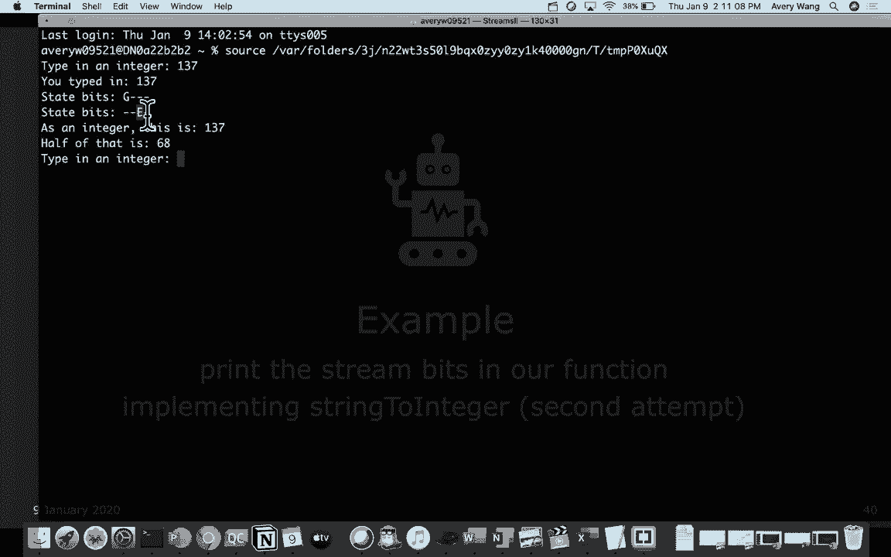

开的。是的。当然。所以基本上就是这四行代码。但你调用了下面定义的print state bits函数。你传入你想查看状态位的流。明白了吗？还有其他问题吗？问题？是的。是的。这通常会打印得很好。

唯一的例外是构造函数如果以某种方式失败了。我不知道构造函数怎么会在这里失败。如果你传递了什么奇怪的东西，也许会失败。明白了吗？好吧？一切都好吗？

好的。现在，我希望你继续测试这个，尝试所有其他的错误输入。看看错误位会发生什么变化。我给你大约30秒钟。只管测试你能想到的任何东西。看看你能得到什么样的错误位。我会给能够开启错误位的同学一个特别奖。

因为我还没有，找到如何做到这一点的方法。明白了吗？我还没有找到如何做到这一点的方法，而不是真的崩溃计，算机。所以看看你能否做到这一点。

哦，抱歉。这里，这里，这里。这是代码。这是代码。是的，问题？好问题。你想尝试一下吗？是的。这不起作用。不起作用？好的。

哦，好的。我不确定。差不多吗？我想它给你的是整型最大值。这里。这是整型最大值。是的，所以我想它将其解释为整型最大值，是的。所以它可能能够感知到你超过了整型最大值。相当酷，对吧？很聪明。好的。

你尝试了什么？有人能开启失败位吗？好的，你尝试了什么？故障的相反。是的，你可以看到失败位已经开启了。还有其他的吗？是的，嗯哼。对的。当它判断将会失败时，它会停止。它返回到开始的地方，并且说，哦。

我失败了。所以如果你输入一个字符，它会查看第一个字符，并且说，哦，这不合法。它会将位置指针移动回到开始的地方。当缓冲区为空时，它能够感知到，并且，它就会停下来，不做，任何操作。回到操作之前的地方。

操作开始之前的地方。是的，明白了吗？需要注意的一点是，即使你输入了空字符串，EOF位还没有，开启。EOF只有在你尝试读取超出末尾时才会开启。然后它会开启EOF。明白了吗？这是非常常见的错误。

如果你测试EOF，你需要小心，这也是我不推荐检查EOF的原，因。好的，还有其他的吗？有人能在最后开启良好位吗？是的，嗯哼。所以8a。注意到良好位在最后开启了。好的，现在问题是，你是否能够检查错误？

鉴于你知道这些位，你能检查是否发生了错误吗？所以在操作之后，你怎么知道字符串转整数是否成功？你得到什么？对不起？好的。确切地说，你会得到EOF位。明白了吗？你会得到EOF位，特别是，你不会得到失败位。

你不会得到失败位，在最后你会得到EOF位。明白了吗？是的，但不能仅仅是EOF，因为你还需要更关注这个边缘情，况。你不能有失败，并且你想要EOF。对了，有问题吗？

当然。当你处理文件时，这一点更为重要，当你尝试从文件中读取，时。有时你会写这个条件。当我们还没有到达文件末尾时，尝试读取一个字符。明白了吗？所以你会一直读取。你会一直读取。你会一直读取。

然后发生的事情是，如果你检查EOF，它实际上不会在执行，一次后完成，最终会失败。所以，取决于你如何构建循环，它有点像是一个多出的错误，如果你必须等待EOF，这种情况会超出最后一个字符。明白了吗？

取决于你如何构建循环，但通常你会遇到这种方式的错误，我现在没有示例，但我会找一个示例并发布在Piazza上。

明白了吗？好吧，我们可能会超出几分钟的时间，但我希望这没问题。

因为这很酷，对吧？这真的很酷。不是吗？

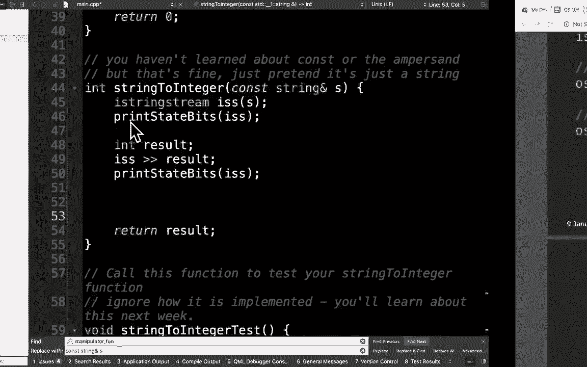

好吧。好吧，我会诚实地说。流不是我最喜欢的主题，但它们是我最炫的幻灯片，所以我，必须讲解它。

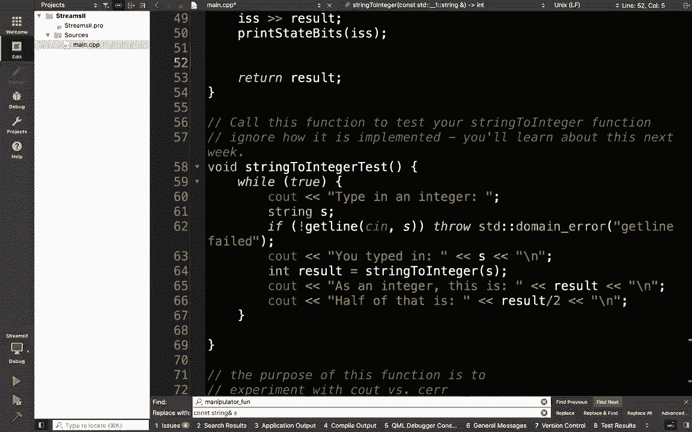

好吧，顺便说一下，一种方法是检查EOF标志是否开启。另一种我更喜欢的方法是尝试读取一个字符。确保失败标志没有开启。然后尝试读取一个字符。确保失败标志开启。这有意义吗？

让我打出来，然后我们来理解为什么这样做有意义。好吧，我要尝试这个操作。如果失败标志开启，那么这意味着发生了很严重的问题。抛出一个异常。我将抛出一个称为域错误的异常。不要太担心它是什么。

它只是抛出一个异常。错误。这个检查不够，因为我们在示例中看到你可能仍然有好的，标志，这样不好，对吧？所以我们还可以检查。好吧，你还要检查是否尝试读取另一个字符。保持ISS。ISS。ISS。fail。

现在我们确实想要失败。所以如果它没有失败，那么抛出STD域错误。明白了吗？再看一遍这段代码，然后向你旁边的人解释。超出了五分钟。没关系，对吧？这是缓冲时间的好处。是的。更好的错误信息？好吧。好吧。

这是一个好的观点。好吧。好吧。为了测试你的理解，这个错误信息应该怎么写？什么是更具信息性的错误信息？开头没有有效的整数。好吧。第二个错误信息说了什么？以及一个有效的。好吧。或者甚至是，因为从技术上讲。

你可以有一个有效的整数，然后一个无效的整数。所以我想你可以重新措辞为，比如说，有有效整数之后还有，其他内容。很酷。是的。棒极了。所以，是的。这就是错误位如何有帮助，以及你如何能够检查。检查错误。

有问题吗？是的。ISS。哦，EOF？是的。好的问题。所以，是的，你可以在这个例子中这样做。是的，这样会有效。所以你也可以这样做。我更喜欢另一个方法的原因是，那个方法在我们稍后涉及，输入输出流时更好。

输入输出流中，文件结束符（EOF）比较少被使用。是的。因为有些情况你输入了一堆内容，但它只读取了一小部分，是的。所以我个人不喜欢使用文件结束符（EOF）。但在这个例子中。

你可以肯定地使用文件结束符（EOF）。那样会有效。好的。我只是想让它在所有地方更一致。哦，这里你想检查文件结束符（EOF）是否开启。如果开启了，那么你需要抛出错误。不，其实，不，抱歉。如果没有开启。

那么你需要抛出错误。酷。我们时间不多了，但因为课实际上在2：50结束，所以我可以。

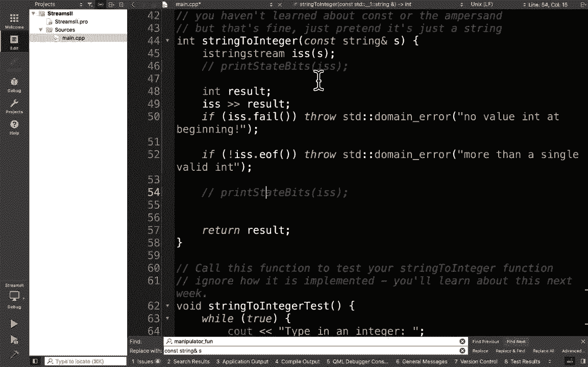

稍微多讲一点，对吧？好的。如果你需要离开，随时离开。

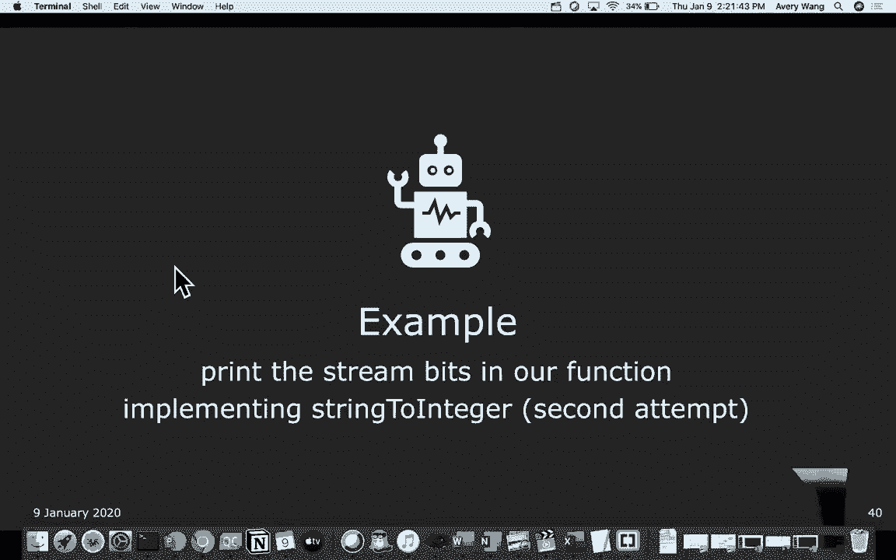

但，好的。

所以，作为一个例子。是的。这是我们做的例子。

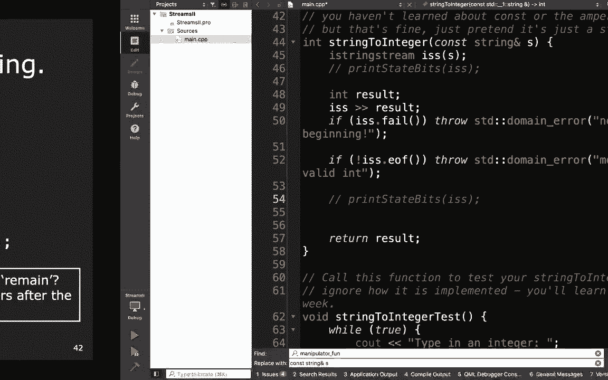

此外，作为一个快捷方式，这个东西，有人提醒我，这个操作，返回什么？是流，对吧？好的。有趣的是，这个流可以被重新解释为布尔值，其中流本身被，转换为真，如果失败标志位（fail bit）关闭。好的。

这有点让人困惑。本质上，我的意思是，我们可以直接将这个表达式放到这里，而不是检查这个。所以，这个操作返回流，该流被转换为是否失败标志位，（fail bit）关闭。所以，我们可以把这个放进去，然后这样做。

好的。然后在这里，不是读取单个字符，像 char remain，我们可，以使用 ISS，读取单个字符，确保它是关闭的。如果它是开启的，所以如果这是成功的，那么它返回这个。另一种考虑方式是。

这个操作返回 true 如果失败标志位，（fail bit）没有开启，并且返回 false 如果失败标志位，（fail bit）开启。好的。这只是写法更紧凑的一种方式。

当你明天在106b课程中学习文件流时，你会再次看到这种，习惯用法。好的。你可能会在文件相关的上下文中看到它。是的，你可能会在这种上下文中看到它。我只是想指出，这等同于失败，是指能够不失败。酷。

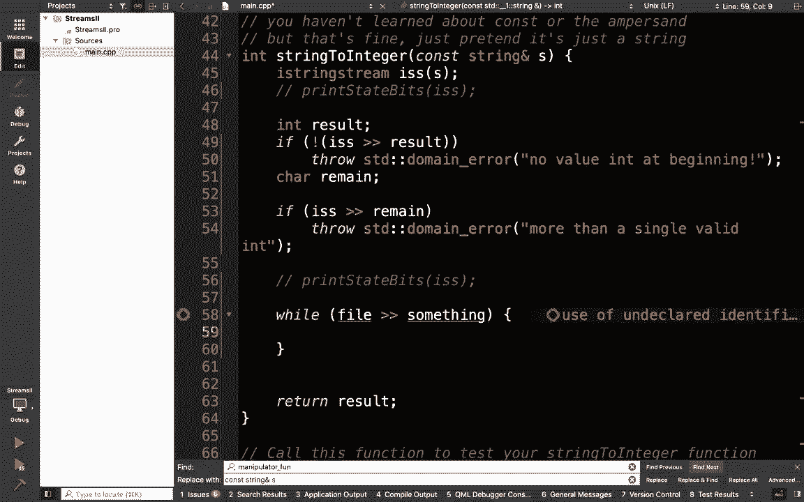

我不能谈论这些。太可惜了。好的。好吧。所以，讲座实际上结束了。这实际上是可选材料，所以如果你想留下来听，这完全没问，题，好吗？如果学生有问题，我很介意你们回答问题。是的。我有一个问题要问大家。

还有其他人无法从网站上下载源代码吗？好的。好的。所以，只是前面的一些人。是的，好的。听起来不错。好的。这是可选材料，所以如果你想离开，随时离开。但实际上，我会一直到2：50。我会在学期中重复很多次这个。

所以，我会继续讲。你不必听这些内容。这是可选的。这可能对你的作业没有帮助，但它会给你一些在鸡尾酒会，谈论的好话题。好吧。正在缓冲中。

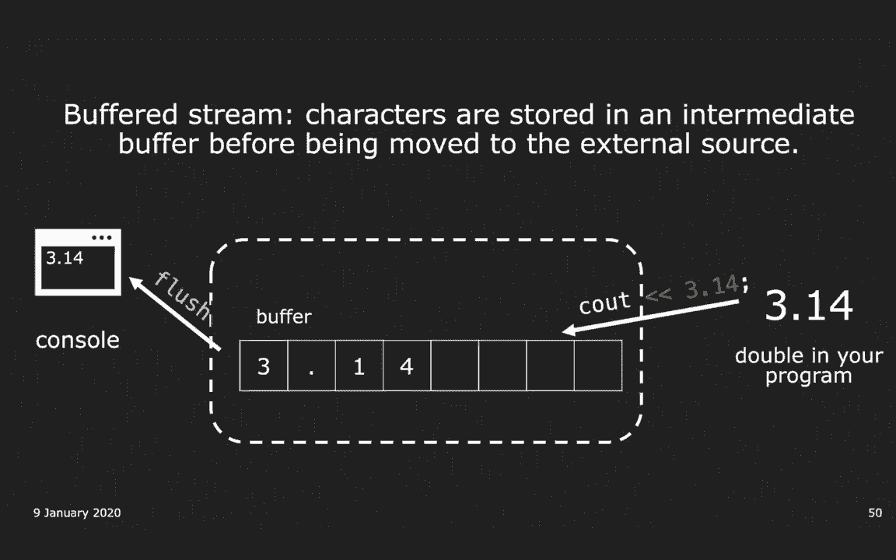

好的。所以，是的，问题。主函数。主函数？好的。嗯哼。是的。好点子。原因是我忘记在顶部声明函数原型了。所以，直接把这行复制到最上面。复制这行，你会得到更大的那一行。好问题。你们都有2点30的课吗？

因为我有点难过。好的。好的。所以，我们要尝试这个实验。我们将尝试运行。我们将打印到cout cs。然后我们将打印106。我们将打印l，然后打印endl。好的。我还不会执行刷新操作。

我还不会执行endl操作。好的。所以，基本上，它将尝试。这将是cout。所以，我只是尝试打印cout。它会做一些无意义的工作。然后它会尝试打印106，做更多的无意义工作。我们可以去掉这些无意义的工作。

它将打印l，做更多的无意义工作，然后在最后。让我们做换行。好的。所以，这些无意义的工作大约需要两到三秒钟。你期待打印出什么？好的。这有点难以解释。所以，你可能在想它会先打印cs，过几秒钟，打印106。

过几，秒钟，打印l，过几秒钟，空格，换行。好的。对。这很直观。这实际上发生了吗？哦，抱歉。调用错了东西。在这里调用了。你不需要输入这些，但我会把它们输入出来。好的。看看发生了什么。

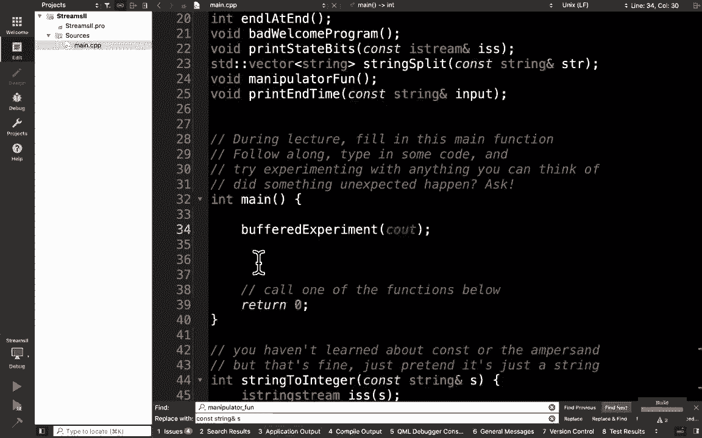

好的。那么，发生了什么？是的。

它一次性打印了所有内容。正是如此。好的。这就是缓冲区的酷炫之处。当你把东西发送到cout时，它会把内容放入缓冲区，但不会，立即将缓冲区中的内容转移到控制台。有什么猜测为什么会这样吗？

为什么它不会每次都有机会就转移？嗯哼。是的，正是如此。读写操作很昂贵。它们有点慢。好的。所以，如果你每次都这样做，那会使程序变慢。事实上，cout是一个缓冲流。还有另一个流叫做cerror。

它用于打印错误信息。我拼写对了吗？E-E-R？哦，S-T-D。S-T-D。好的。

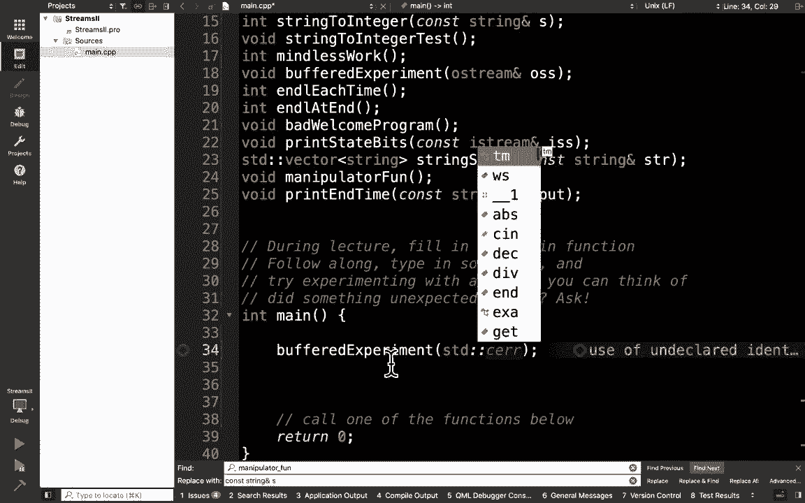

好的，还有另一个流叫做cerror。它用于打印错误信息。你可以想象错误信息不是那么重要，没有缓冲。每次你发送内容，它会直接移到控制台。好的？大家都看到了吗？C-S，立刻。然后106，立刻。

然后L，立刻。没有等到所有东西完成才打印。好吧，为了好玩，我这里有一个东西。它叫做。哦，不，我把东西移除了。呃，好吧，好吧。没事，没事，没事。Cout。Endle at。EndleEachTime。

好吧，我要调用函数 EndleEachTime，它返回所需的时间。如果我们尝试一下，让我们看看 EndleEachTime 做了什么。

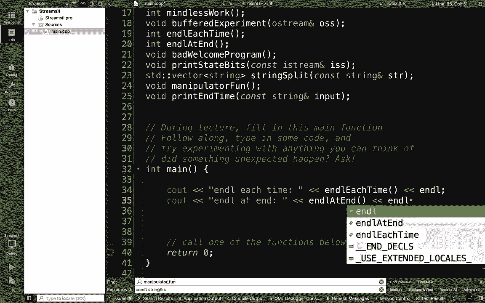

。EndleEachTime 是。好吧，这是为了。不用担心这个 chrono 是什么。它基本上是一个计时器。要注意的是这个。那是干什么的？好吧，大家。我想大家都同时说了，但。对，你打印前100个整数。

包括零，每个整数在每行打印一次，关于 Endle 有趣的是，Endle 是一个换行符加上一个叫做， Flush 的东西。有人想猜测一下 Flush 的作用吗？是吗？那就是它的作用吗？

其实是一个模板控制台？完全正确。好吧，Flush 触发。告诉它将内容打印到控制台。那么这会做什么呢？它每次都按行打印到控制台。

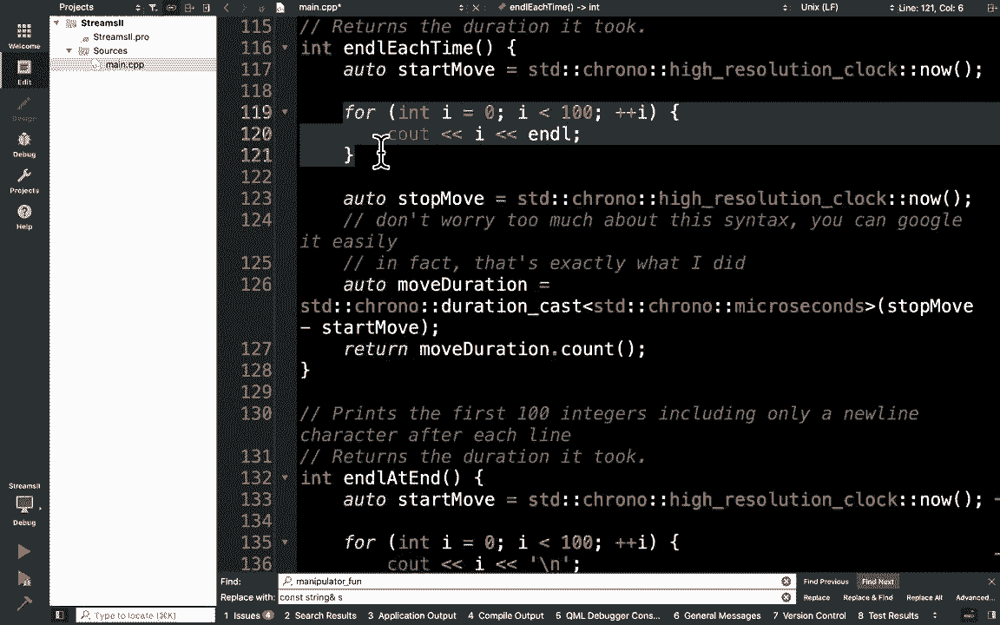

与这个相比。相同的操作，但这里，你在每次换行符后没有 Flush，而是，在最后只 Flush 一次。好吧，你认为哪个更快？第二个，对吗？好的。为了公平起见，我的电脑有点怪，所以我不太确定。 哦。

不。哦，我知道了。我知道原因了，我知道原因了。我不能立即打印这个。我必须先调用函数。所以 int a 等于那个，int b 等于 Endle at a。所以我们先调用两个函数，然后打印它们所花的时间。

所以 a 和 b。

不要把你的变量命名为 a 和 b。而且。对，所以你可以看到第二种方法明显更快。

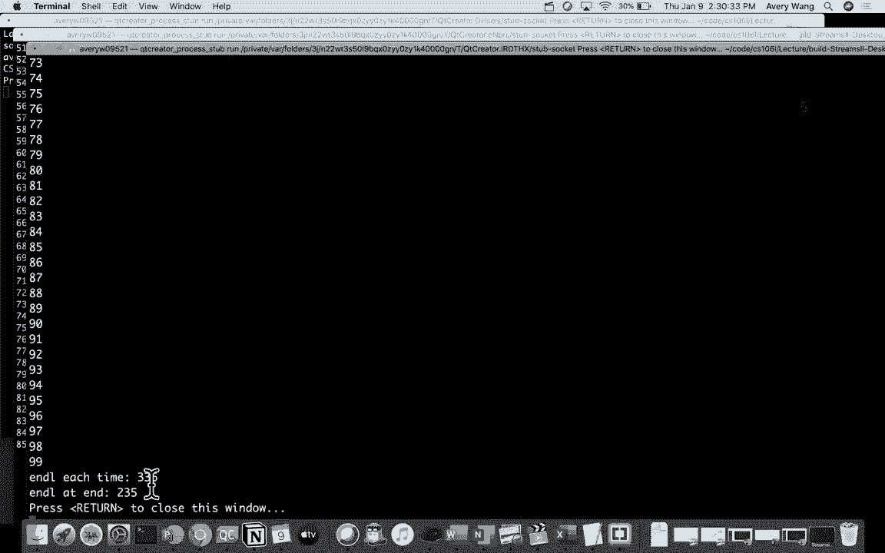

好吧，现在公平地说，快了多少？可能快了一点，但不会快得太多。出于习惯，你还会看到我输入 Endle，但如果你去一个被称，为 Stack Overflow 的毒性在线论坛，如果你写的代码中。

包含 Endle，别人只会关注那一行。所以只是提醒一下，如果你在高性能领域，不要过多使用 ，Endle。话虽如此，如果你不在高性能领域，尽管 Stack Overflow ，上的用法。

可能还是在每行末尾使用 Endle 更好。这种经验尤其在你在 106B 时，作业中将 Endle 放在每行，末尾几乎是最佳实践，因为如果不这样做，有时会导致很难，调试的错误。

所以如果你在处理 106B 作业时遇到奇怪的打印错误，请，检查是否在每行末尾添加了 Endle，因为这很可能是原因，有时你会说，哦，我正确打印了所有内容，但在控制台上没，有显示出来。好吧，答案是。

你是否尝试使用 Endle？你会看到控制台上的内容。现在，有些操作会自动触发刷新。其中之一是如果你调用 C in，它会自动刷新 C out。这很有道理，因为用户在 C out 打印完所有内容之前，实。

际上无法输入任何东西。

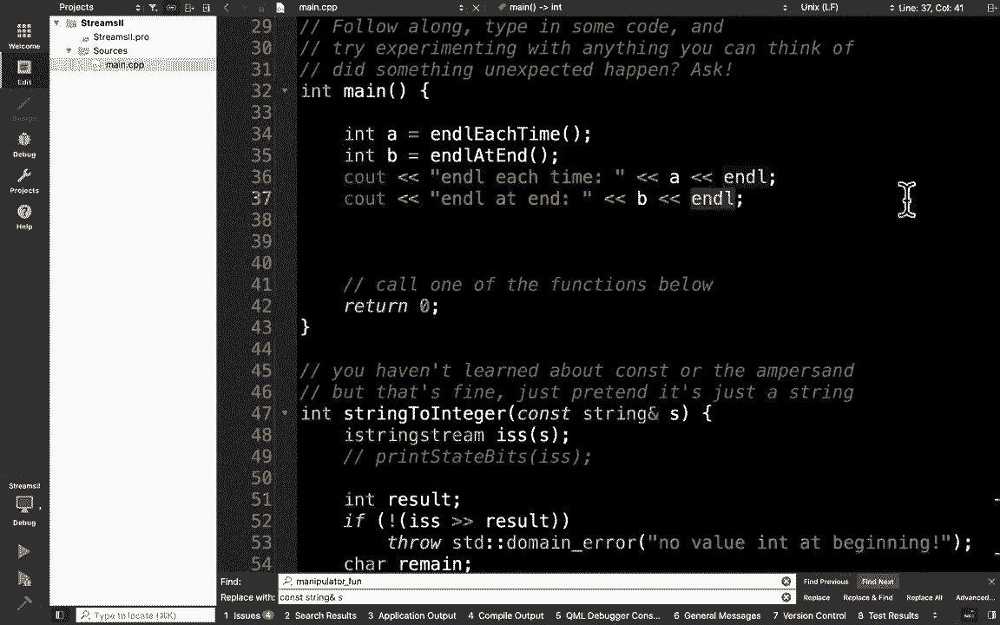

酷。就这样了吗？我还应该继续吗？我有点想多说一点。有问题吗？是的，好吧。让我关闭所有这些标签页。

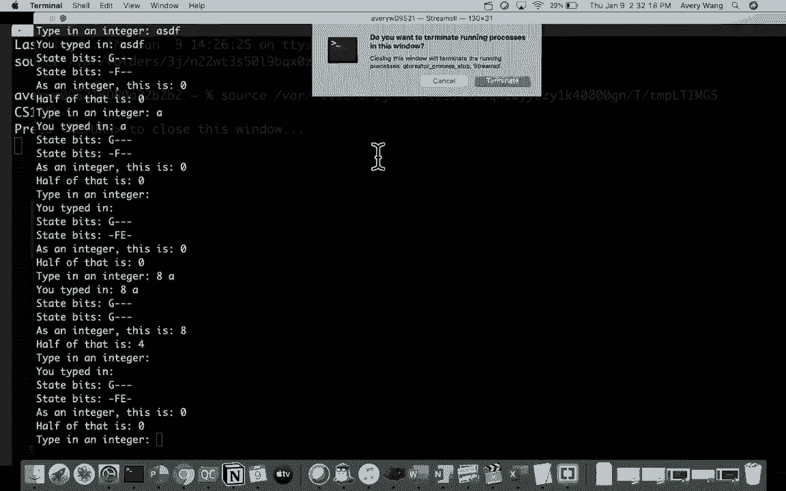

我有点烦躁。好的。是的。哦，好问题。好问题。好问题。你看，我有这些很棒的动画。浪费了。浪费了。好的。操控符。这些只是特殊的关键词。如果你将它们插入到字符串中，它们会改变字符串的行为。

Endle 是这些字符之一。本质上，如果你输入 Endle，它基本上就像是，嘿，打印一个，新行并且刷新字符串。好的。这是一个常量吗？这些是常量吗？这是个好问题。或者说，它们像是枚举，对吗？我认为是枚举。

枚举？好的。是的。我们下次会讨论枚举是什么。但这些就像是常量。好的。所以有不同的操控符实现，它们需要枚举。确切地说，是的。我们稍后会讨论如何编写操控符。好问题。所以 Endle 是一个操控符。

Flush 是一个操控符。使用操控符，你可以做一些奇怪的事情。空间、填充，你可以让一切看起来很华丽。这些很容易 Google，所以我们不会多谈。有问题吗？实际上，结果是操控符是函数。哦，这些是函数？

是的。哦，酷。好的。所以我猜操控符的作用是，它检查，哦，这是一个函数。让我调用它。这可能就是它的作用。是的，问题？是的。

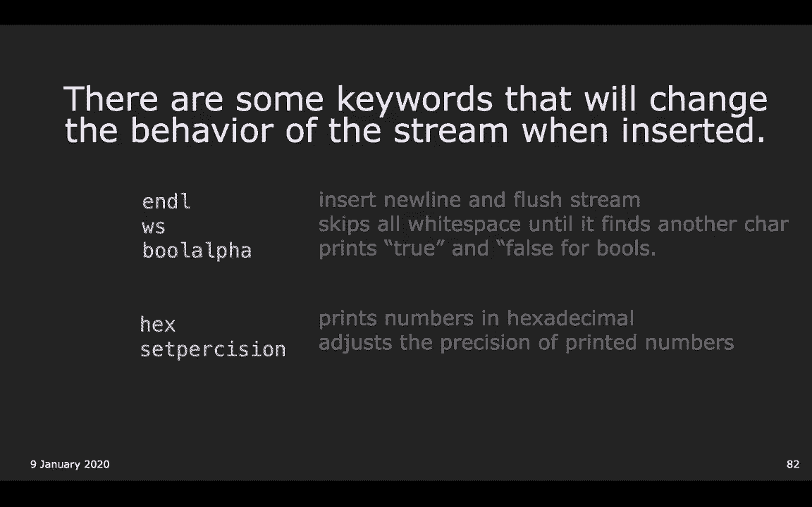

哦，好的问题。确实有一个最大大小，你实际上可以获取大小。实际上有一种方法可以获取大小。有一种类似的限制最大大小的方法，是的。如果你覆盖它，会发生什么？安娜，你知道答案吗？我猜是未定义行为。是的。

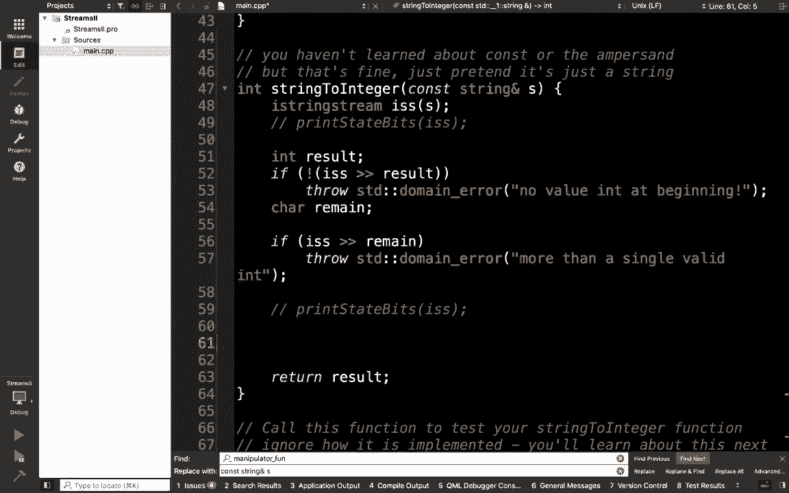

还有其他问题吗？我觉得我差不多了。好吧，有些人离开了，在我给你们布置作业之前，所以这有，点没意义，但我想，哪个比较好？这个有点酷，但它使用了向量。这个有点无聊。不，好的，不。这个还挺有趣的。好的。

所以给定一个输入流，看起来像这样，你要么进行错，误检查，要么打印结束时间。所以有一个开始时间，有一个持续时间，有一个结束时间。基本上，打印结束时间。解析它，打印结束时间。好的？所以你将需要使用流。

字符串流。是的，所有操控符都适用于所有流吗？比如说，你的查询语言是否适用于网络流？它是否在网络流中除了 cout 之外？好问题。并非所有操控符都有效。例如，对于输入流，对于输出流，不，对不起。

不是输出流。对于输入流，你不能使用 ndl。你不能使用 ndl，因为你不能真正读取到那个。你不能真正读取新行。但是，我的意思是，即使对于输出的混合呢？文件，我认为，会有效。对于 ndl，文件会有效。

因为它是相同的概念——我不是在谈，论 ndl。所以其实，这有点有趣。我们隐藏了一些类的细节。结果发现，所有这些不同的流都属于不同类型的类。

有一个 oStream 类，oStringStream 是它的一个特定子集，因此，根据操控符的定义位置，它可以应用于所有 ，oStreams，或者只应用于，例如，oStringStream。

这将在编译时检查吗？再说一遍？这将在编译时检查。这将在编译时检查。还有，对，检查一下。所以如果你去 C++ 文档，它会告诉你你可以使用哪些。所以是的，你可以全部 Google 这些。当然，不要记住这些。

真正地，你如何使用这些是，当你突然想到，“哦，我的输入，太丑了。”，我想让它变得漂亮。然后你 Google oStringStream 操控符，然后出现了这个，图表，你查看你想要的。明白了吗？

不要记住这些。没有人会记住这些。

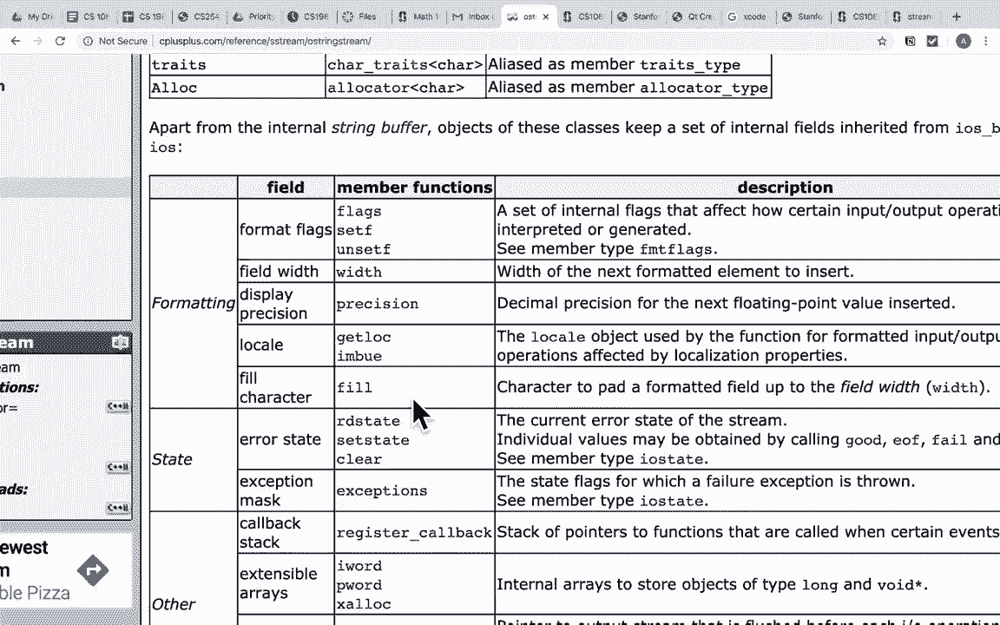

所以就这样。明白了吗？我想我已经差不多准备好了。没有什么。我有一个问题要问你，我之前甚至见到你之前就有了。所以 Avery 简短提到过，不仅仅有 oStreamStream 和 。

iStreamStream。还有一个 StringStream，它结合了输入和输出。所以有人能告诉我为什么，如果有东西同时做这两件事，我，们为什么还会使用输入流、iStreamStream 或输出流？

为什么不在任何地方都使用 StringStream？你们觉得怎么样？是的，我们继续。好的。记忆丧失，因为你以为它会假定你要同时流它们，对吧？所以你可能不想做两者。是的，等等。所以如果我可以用另一种说法。

那就是，如果你知道你只想，做一个，那么你就不需要那个可以同时做这两者的。是的，完全正确。那么你们觉得怎么样？类似的东西吗？是的。一样的东西？完全一样。是的。所以我想把它用 C++ 的哲学来表述。

虽然我们可以在任何，地方使用 StringStream 并且它在功能上完全正常，实际，上没有任何区别。嗯，不，那有点儿不对。有一个轻微的性能差异和一个轻微的内存差异。所以这回到一个风格点。

就是明确声明意图。这是我们想指出的六个要点之一，就是当你在 C++ 中编写，代码时，你要明确声明你想用对象做什么。另一个部分是，使用更具体的一个会有一些轻微的性能好，处。所以这有点直观，但再次提醒你。

对于所有不同的选项，你，要问自己，我想要使用每一个选项做什么？我想要用什么？像是一个更通用的选项。好的。然后我们基本上完成了，但我没有覆盖的是基本上。是的，我下次会讲这个。基本上。

它向你展示了为什么CN是个噩梦。好吗？而像这样的无害代码，这就是我假设如果你不了解字符串，你会写的代码。这不起作用，特别是因为鳄鱼运算符只读取空格分隔的标，记。所以我们将在下周二讨论这个。好吧？下次。

我们要做的是讨论类型。我们将讨论现代C++类型，包括对、更复杂的类型。我们将学习auto。然后我们还将实现getInteger，这可能是斯坦福库中最难，实现的函数。好的？下次见。

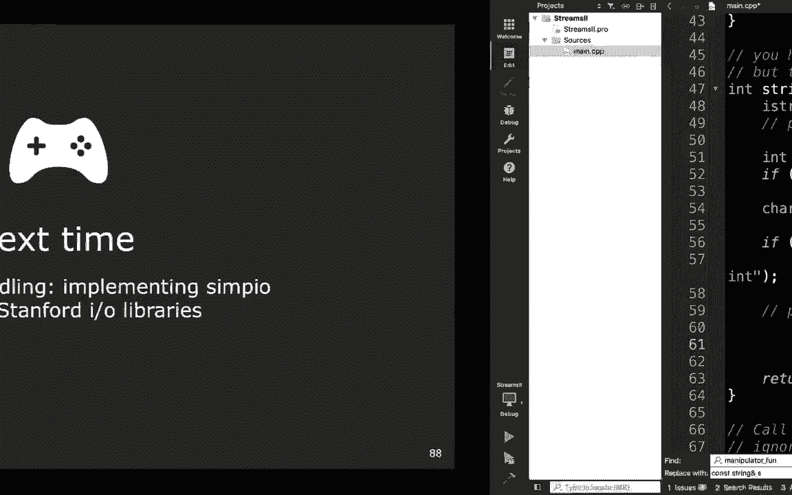

是的，没问题。