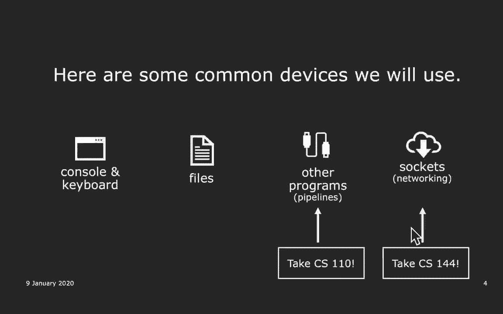


# æ–¯å¦ç¦å¤§å­¦ã€ŠCS106L：C++编程》课程笔记 - 第2è®²ï¼šæµ (Streams) 📚


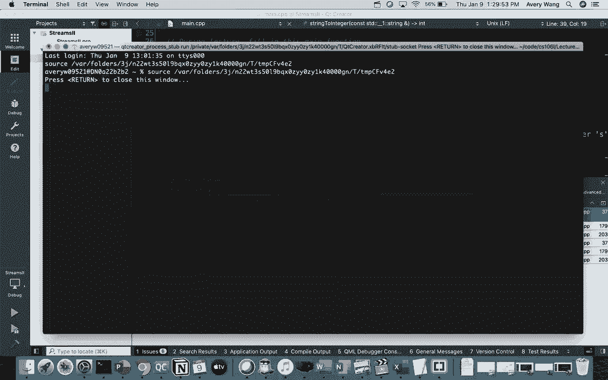

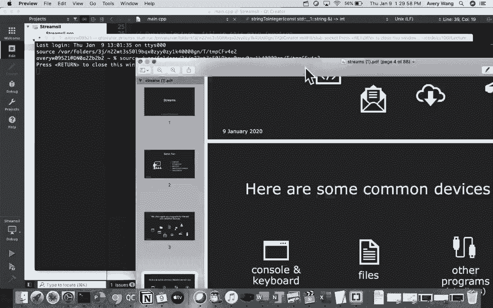


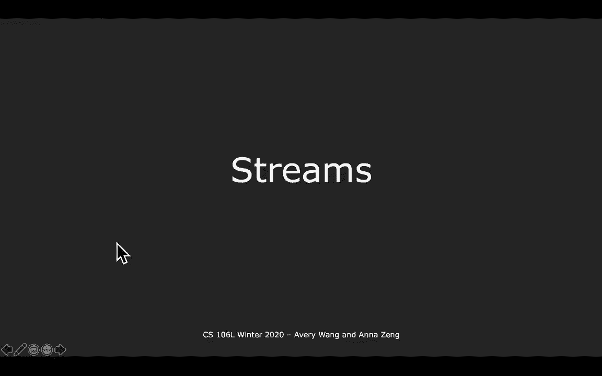

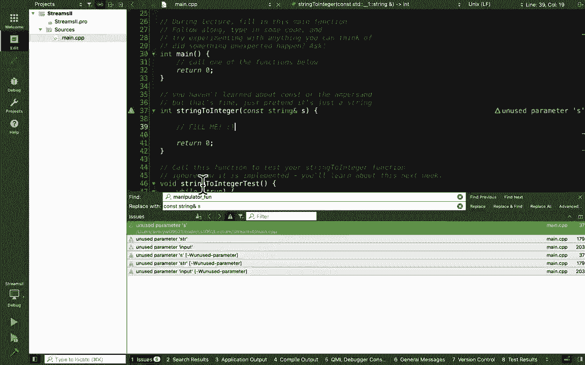

在本节课中，我们将è¦å­¦ä¹ C++中一个é常é‡è¦çš„概念：**æµ (Streams)**。æµæ˜¯ç¨‹åºä¸å¤–部世界（如æ§åˆ¶å°ã€æ–‡ä»¶ã€ç½‘络等）进行数æ®äº¤äº’的统一æ¥å£ã€‚我们将ä»é«˜å±‚次概述开始，然å深入æ¢è®¨å­—符串æµã€çŠ¶æ€ä½ä»¥åŠè¾“å…¥/输出æµï¼Œæœ€å简è¦äº†è§£æµæ“作符。

---

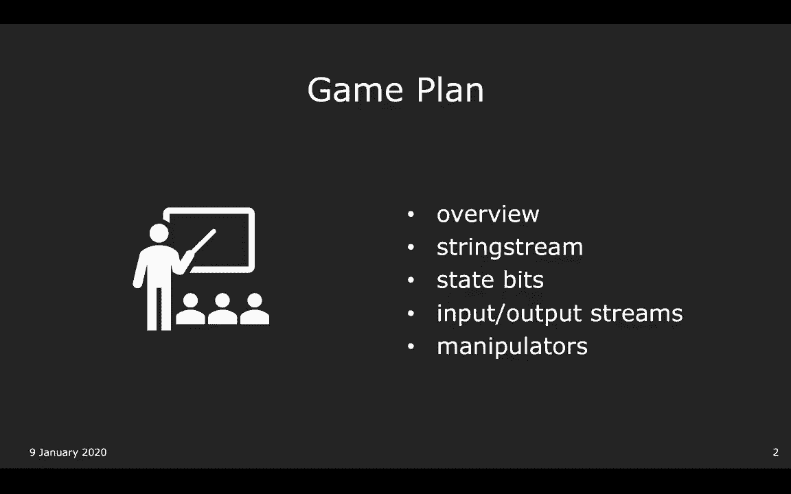

## 概述：为什么需è¦æµï¼Ÿ 🤔

我们通常希望程åºèƒ½ä¸å„ç§å¤–部设备交互，例如键盘ã€æ§åˆ¶å°ã€æ–‡ä»¶ã€ç½‘络等。æµæ供了一个统一的æ¥å£æ¥å¤„ç†æ‰€æœ‰è¿™äº›äº¤äº’。无论你是å‘å±å¹•æ‰“å°å†…容ã€ä»æ–‡ä»¶è¯»å–æ•°æ®ï¼Œè¿˜æ˜¯é€šè¿‡ç½‘络å‘é€ä¿¡æ¯ï¼Œéƒ½å¯ä»¥ä½¿ç”¨ç›¸ä¼¼çš„æ“作方å¼ã€‚

例如，å‘æ§åˆ¶å°è¾“出内容使用 `cout`，其æ“作符是 `<<`。这个统一的æ¥å£æŠ½è±¡äº†åº•å±‚å¤æ‚的读写过程，让我们åªéœ€å…³æ³¨æ•°æ®çš„转æ¢å’Œä¼ è¾“。

---


## C++字符串快速入门 🚀

在深入æµä¹‹å‰ï¼Œæˆ‘们先快速å›é¡¾ä¸€ä¸‹C++中的字符串，因为æµç»å¸¸å¤„ç†å­—符串数æ®ã€‚

在C++中，我们使用 `std::string` ç±»å‹æ¥è¡¨ç¤ºå­—符串。

```cpp
std::string str = "hello world";
```

**访问和修改字符**：你å¯ä»¥åƒè®¿é—®æ•°ç»„一样访问和修改字符串中的å•ä¸ªå­—符。C++字符串是零索引的。

```cpp
std::cout << str[1]; // 输出 'e'
str[1] = 'i'; // 将字符串修改为 "hillo world"
```

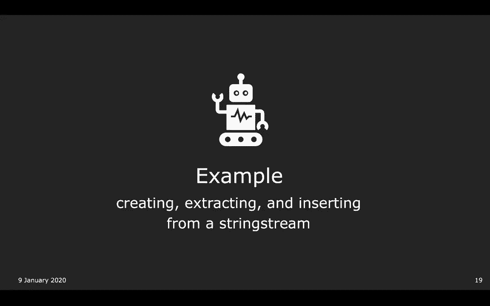

**é‡è¦åŒºåˆ«**：C++中有两ç§å­—符串：Cé£æ ¼å­—符串（`char*` 或 `char[]`）和C++字符串（`std::string`）。在C++编程中，应优先使用 `std::string`，因为它更安全ã€åŠŸèƒ½æ›´å¼ºå¤§ã€‚

---

## æµçš„高层次概念 🌊

æµçš„核心ç†å¿µæ˜¯å°†ç¨‹åºä¸å¤–部设备的交互抽象为对一个**字符缓冲区**的读写æ“作。

当你å‘æµå†™å…¥æ•°æ®ï¼ˆä¾‹å¦‚ `cout << 3.14`）时：
1.  æ•°æ®ï¼ˆå¦‚åŒç²¾åº¦æµ®ç‚¹æ•° `3.14`）被转æ¢ä¸ºå­—符串形å¼ã€‚
2.  字符串被放入æµçš„内部缓冲区。
3.  æµè´Ÿè´£å°†ç¼“冲区的内容传输到目标设备（如æ§åˆ¶å°ï¼‰ã€‚

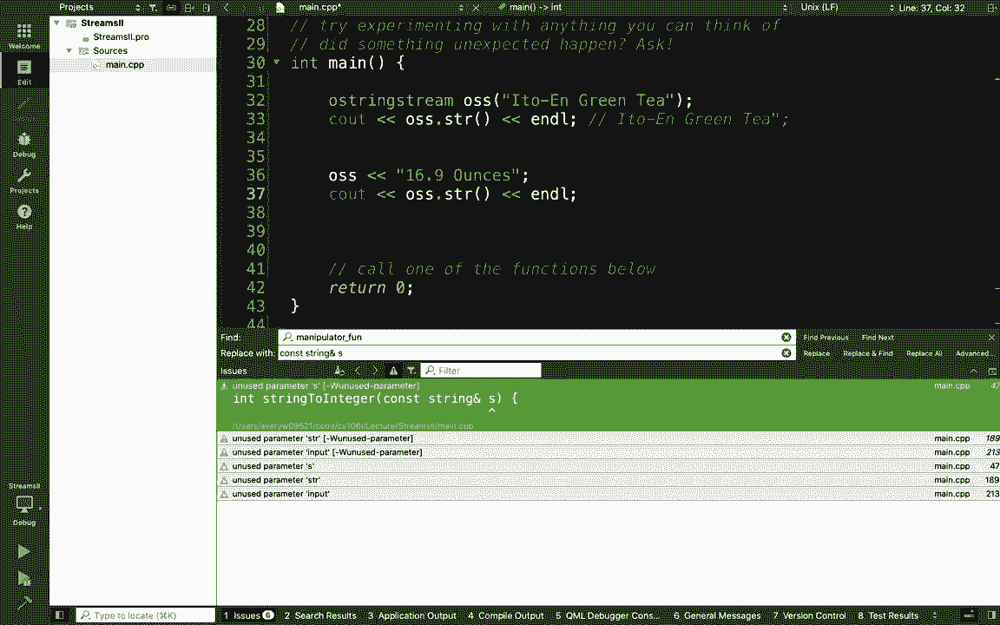


当你ä»æµè¯»å–æ•°æ®æ—¶ï¼Œè¿‡ç¨‹ç›¸å。æµä¼šä»ç¼“冲区读å–字符，并将其转æ¢ä¸ºä½ æŒ‡å®šçš„ç±»å‹ï¼ˆå¦‚æ•´æ•°ã€æµ®ç‚¹æ•°ï¼‰ã€‚


è¿™ç§æŠ½è±¡è®©æˆ‘们无需关心数æ®å¦‚何具体地显示到å±å¹•æˆ–ä»æ–‡ä»¶è¯»å–，åªéœ€å…³æ³¨ä¸ç¼“冲区的交互。


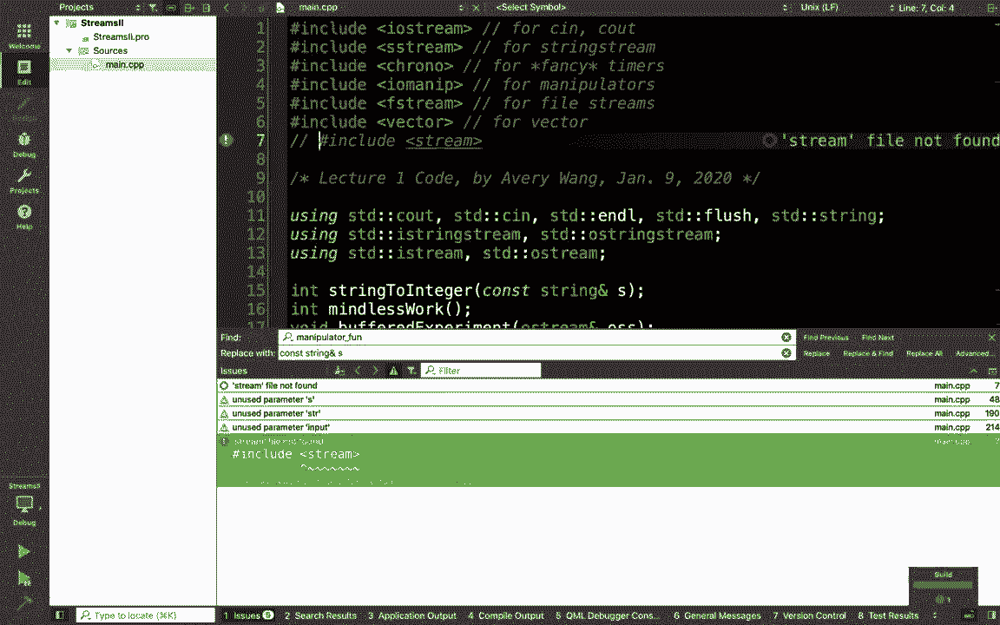


---


## å­—ç¬¦ä¸²æµ (String Streams) 🔤

字符串æµæ˜¯æœ€ç®€å•çš„æµç±»å‹ï¼Œå®ƒä¸ä¸ä»»ä½•å¤–部设备关è”，åªç”¨äºåœ¨å†…存中进行字符串的转æ¢å’Œæ ¼å¼åŒ–。它完ç¾åœ°å±•ç¤ºäº†æµçš„“转æ¢â€åŠŸèƒ½ã€‚

主è¦æœ‰ä¸¤ç§å­—符串æµï¼š
*   `std::ostringstream`：用äºè¾“出（æ„建字符串）。
*   `std::istringstream`：用äºè¾“入（解æ字符串）。

### è¾“å‡ºå­—ç¬¦ä¸²æµ (ostringstream)

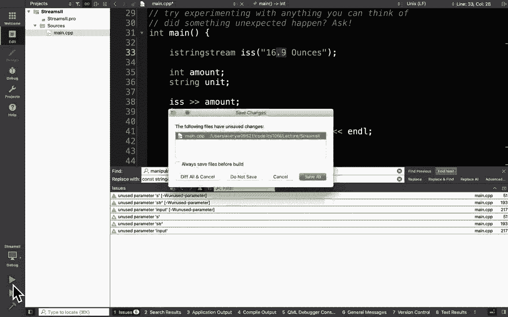

输出字符串æµå…许你将å„ç§ç±»å‹çš„æ•°æ®â€œå†™å…¥â€åˆ°ä¸€ä¸ªå­—符串缓冲区中。

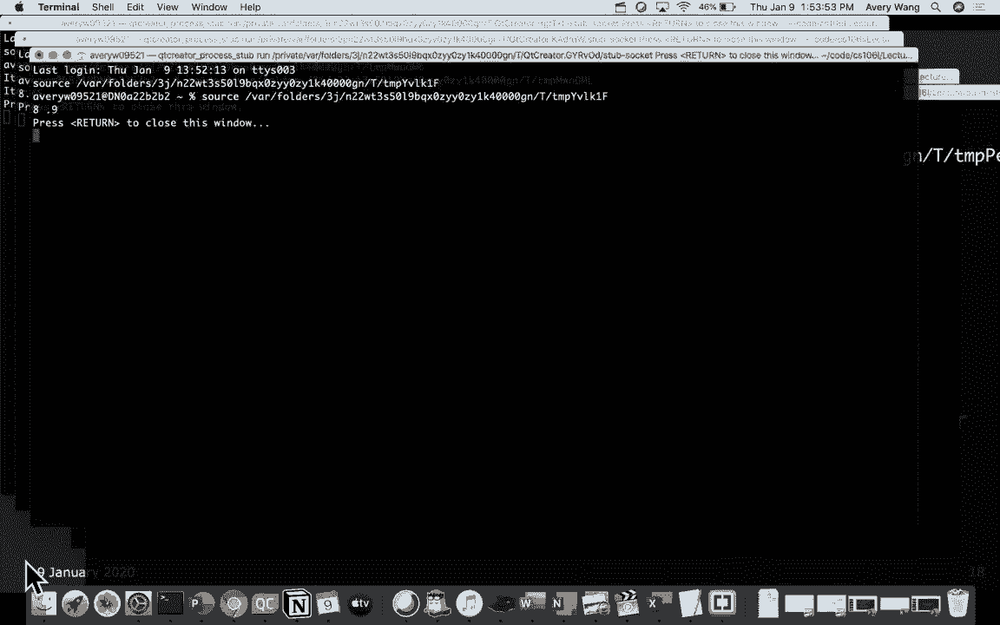

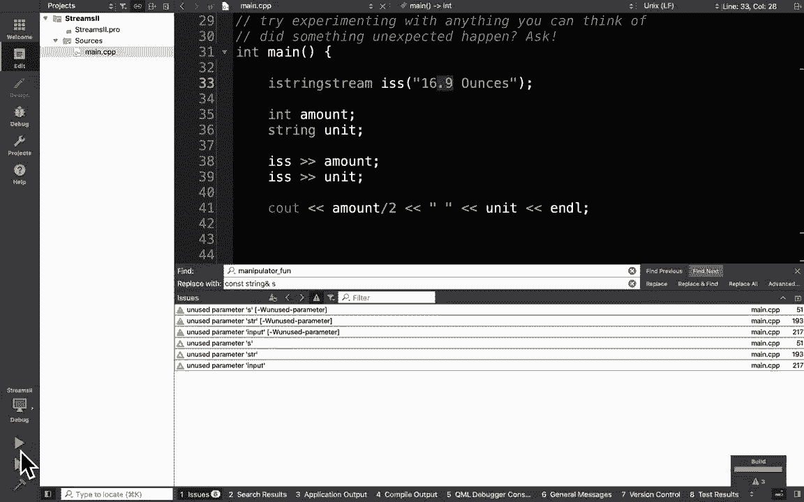

以下是使用 `ostringstream` 的基本步骤：

首先，你需è¦åŒ…å«å¤´æ–‡ä»¶å¹¶å£°æ˜ä¸€ä¸ª `ostringstream` 对象。

```cpp
#include <sstream> // 字符串æµæ‰€éœ€çš„头文件
std::ostringstream oss;
```


æ¥ç€ï¼Œä½ å¯ä»¥ä½¿ç”¨æ’å…¥è¿ç®—符 `<<` å‘æµä¸­å†™å…¥å†…容。

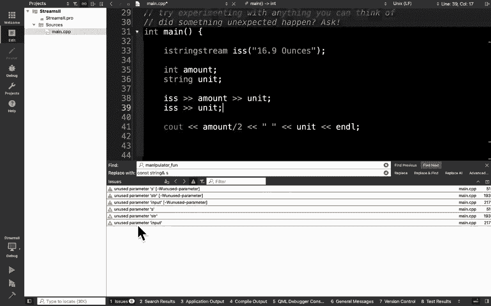

```cpp
oss << "The answer is: ";
oss << 42;
```


最å，你å¯ä»¥ä½¿ç”¨ `.str()` æˆå‘˜å‡½æ•°è·å–缓冲区中的所有内容，并将其作为一个完整的 `std::string` è¿”å›ã€‚

```cpp
std::string result = oss.str();
std::cout << result; // 输出: The answer is: 42
```

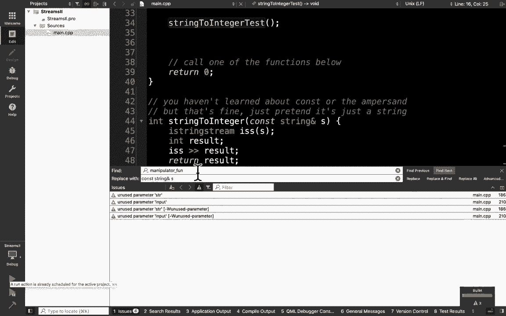

**一个é‡è¦æ¦‚念——ä½ç½®æŒ‡é’ˆ**：æµå†…部有一个“ä½ç½®æŒ‡é’ˆâ€ï¼ŒæŒ‡ç¤ºä¸‹ä¸€ä¸ªè¯»å†™æ“作å‘生的ä½ç½®ã€‚当你在一个全新的 `ostringstream` 上写入时，会ä»å¼€å¤´è¦†ç›–。如æœä½ å¸Œæœ›ä»æœ«å°¾è¿½åŠ ï¼Œå¯ä»¥åœ¨æ„造时指定模å¼ã€‚

```cpp
// ä»æœ«å°¾å¼€å§‹å†™å…¥ï¼ˆè¿½åŠ æ¨¡å¼ï¼‰
std::ostringstream oss(std::ios::ate);
oss << "Initial";
oss << "Appended";
std::cout << oss.str(); // 输出: InitialAppended
```


### è¾“å…¥å­—ç¬¦ä¸²æµ (istringstream)


输入字符串æµå…许你ä»ä¸€ä¸ªå·²æœ‰çš„字符串中“读å–â€å¹¶è§£æ出å„ç§ç±»å‹çš„æ•°æ®ã€‚

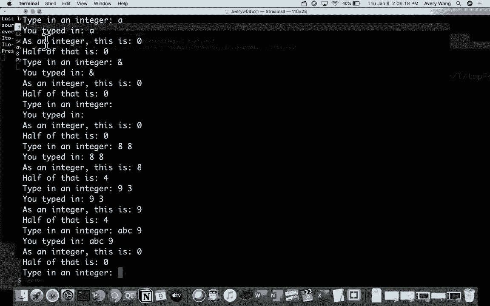

以下是使用 `istringstream` 的基本步骤：


首先，用一个字符串æ¥åˆå§‹åŒ– `istringstream`。


```cpp
std::string data = "123 45.6 hello";
std::istringstream iss(data);
```

然å，使用æå–è¿ç®—符 `>>` ä»æµä¸­è¯»å–æ•°æ®åˆ°å˜é‡ä¸­ã€‚æµä¼šè‡ªåŠ¨è·³è¿‡ç©ºç™½å­—符（空格ã€æ¢è¡Œã€åˆ¶è¡¨ç¬¦ç­‰ï¼‰ï¼Œå¹¶å°è¯•å°†è¯»å–到的“标记â€è½¬æ¢ä¸ºç›®æ ‡å˜é‡çš„ç±»å‹ã€‚

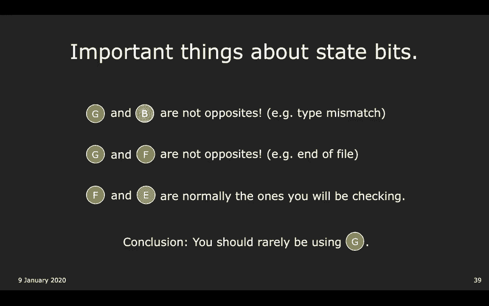

```cpp
int num;
double val;
std::string word;

iss >> num;   // 读å–æ•´æ•° 123
iss >> val;   // 读å–浮点数 45.6
iss >> word; // 读å–字符串 "hello"
```

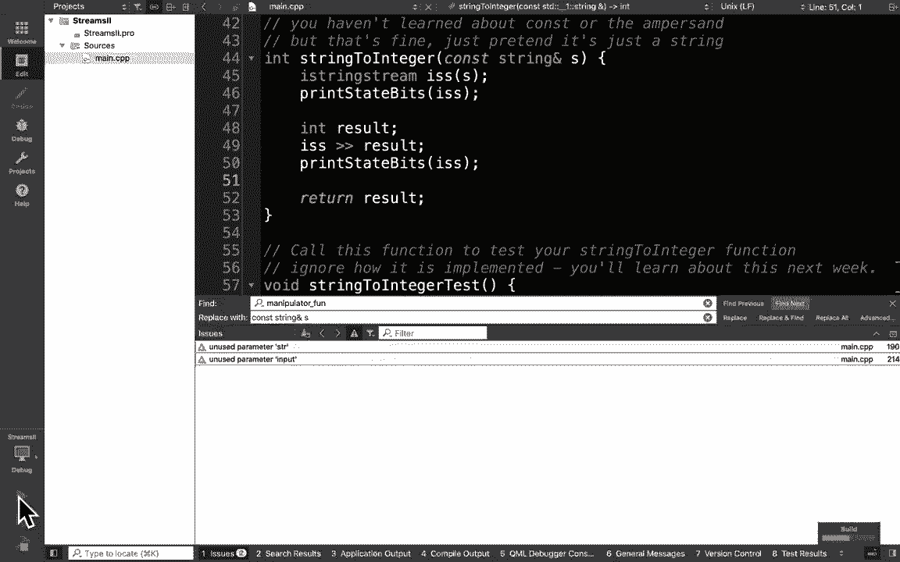


**ç±»å‹è½¬æ¢æ˜¯å…³é”®**：`>>` æ“作符会根æ®ä½ æ供的å˜é‡ç±»å‹è¿›è¡Œè½¬æ¢ã€‚如æœä½ å°è¯•å°† `"hello"` 读入一个 `int` å˜é‡ï¼Œæ“作会失败。

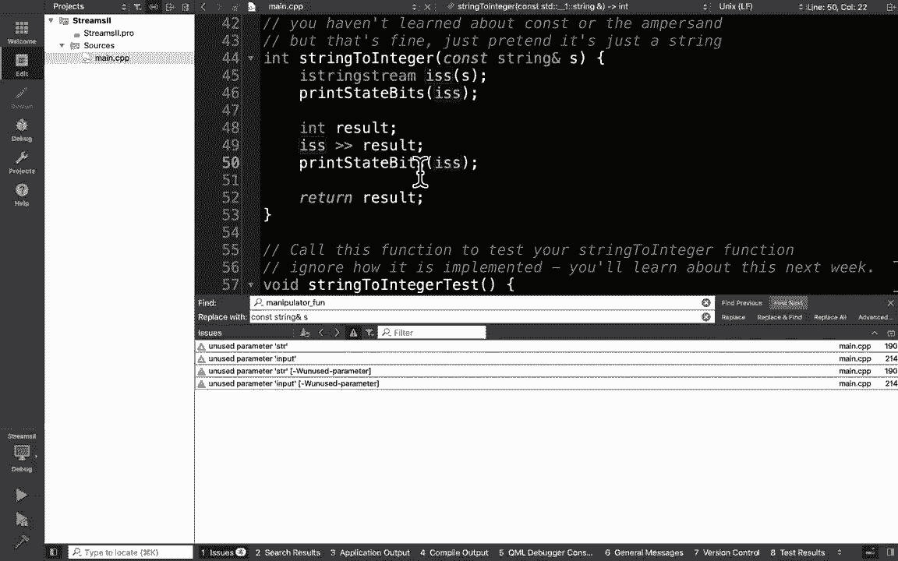

---

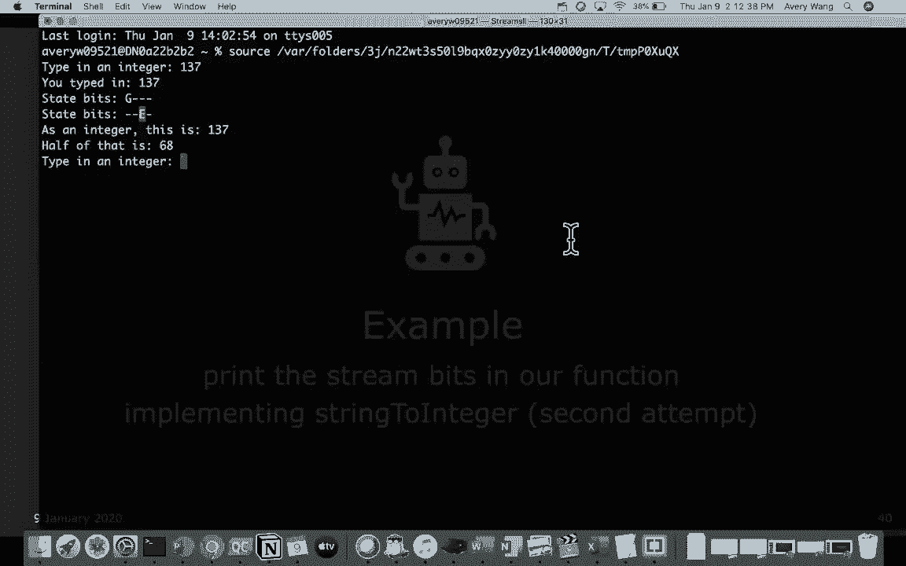

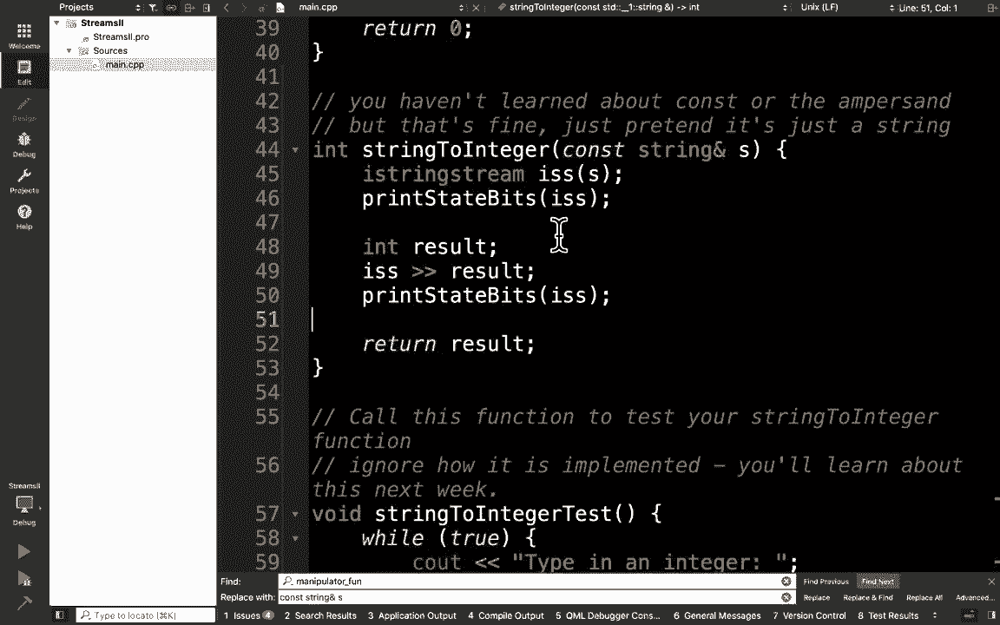

## æµçš„状æ€ä½ (State Bits) 🚦

当我们ä»æµä¸­è¯»å–æ•°æ®æ—¶ï¼Œå¯èƒ½ä¼šå¤±è´¥ï¼ˆä¾‹å¦‚ç±»å‹ä¸åŒ¹é…ã€åˆ°è¾¾æœ«å°¾ï¼‰ã€‚æµä½¿ç”¨å››ä¸ªçŠ¶æ€ä½æ¥è®°å½•å…¶å½“å‰çŠ¶æ€ï¼š


1.  **`goodbit`**：一切正常，没有错误。
2.  **`failbit`**：上一次读å–/写入æ“作失败（例如，å°è¯•å°† `"abc"` 读入 `int`）。
3.  **`eofbit`**：已到达æµçš„末尾（End Of File）。
4.  **`badbit`**：å‘生了ä¸æµç¼“冲区相关的严é‡é”™è¯¯ï¼ˆå¾ˆå°‘è§ï¼‰ã€‚

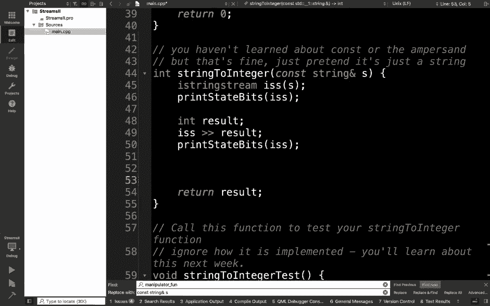

**状æ€ä½çš„é‡è¦æ€§**：一旦 `failbit` 或 `badbit` 被设置，所有åç»­çš„æµæ“作都会被忽略，直到你清除了这些错误状æ€ã€‚

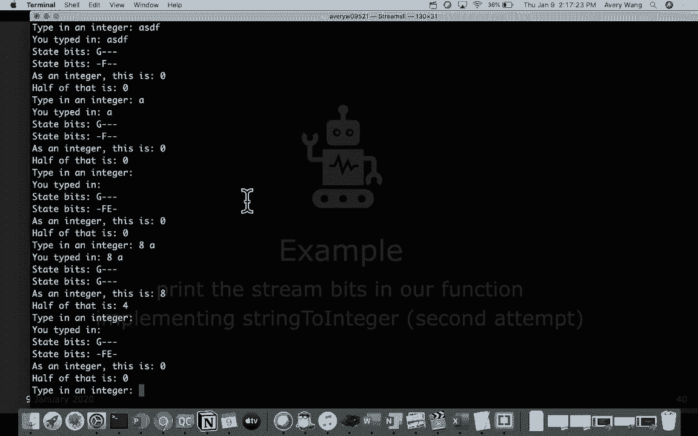


ä½ å¯ä»¥é€šè¿‡æˆå‘˜å‡½æ•°æ¥æ£€æŸ¥è¿™äº›çŠ¶æ€ï¼š
*   `stream.good()`
*   `stream.fail()`
*   `stream.eof()`
*   `stream.bad()`

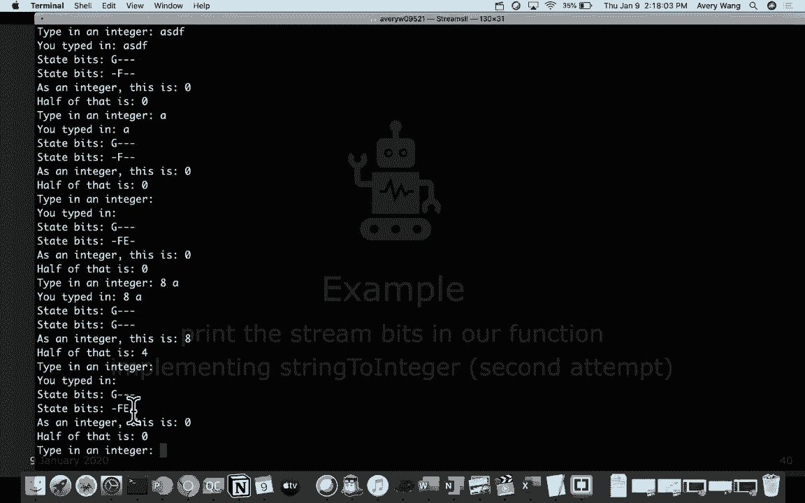

**一个关键点**：`good()` 并é `fail()` 的简å•å¯¹ç«‹é¢ã€‚`good()` 仅在**所有**错误ä½éƒ½æœªè®¾ç½®æ—¶ä¸ºçœŸã€‚而 `fail()` 为真时，`good()` 必然为å‡ã€‚通常我们更关心 `fail()` å’Œ `eof()`。

### å®è·µï¼šå®ç° `stringToInteger` 函数

利用字符串æµå’ŒçŠ¶æ€ä½ï¼Œæˆ‘们å¯ä»¥å®ç°ä¸€ä¸ªå¥å£®çš„字符串转整数函数。


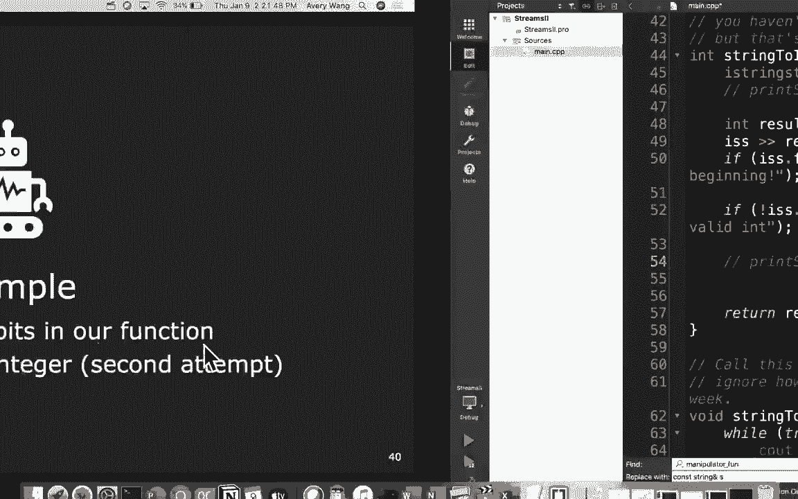


基本æ€è·¯ï¼š
1.  用输入字符串创建一个 `istringstream`。
2.  å°è¯•ä»ä¸­è¯»å–一个整数。
3.  检查读å–æ“作åæµçš„状æ€ã€‚
    *   å¦‚æœ `failbit` 被设置，说æ˜æ ¹æœ¬æ²¡èƒ½è¯»å–整数。
    *   如æœè¯»å–æˆåŠŸå，æµä¸­è¿˜æœ‰é空白字符，说æ˜è¾“å…¥ä¸â€œçº¯å‡€â€ï¼ˆå¦‚ `"123abc"`）。
4.  æ ¹æ®çŠ¶æ€å†³å®šæ˜¯è¿”å›æ•´æ•°è¿˜æ˜¯æŠ›å‡ºé”™è¯¯ã€‚

以下是核心代ç æ¡†æ¶ï¼š


```cpp
int stringToInteger(const std::string& str) {
    std::istringstream iss(str);
    int result;
    iss >> result; // å°è¯•è¯»å–

    // 检查是å¦è¯»å–失败，或者读å–å还有多余内容
    if (iss.fail() || !iss.eof()) {
        // 抛出异常或进行错误处ç†
        throw std::domain_error("字符串无法转æ¢ä¸ºæ•´æ•°ï¼Œæˆ–包å«é¢å¤–字符。");
    }
    return result;
}
```


**更简æ´çš„写法**：æµå¯¹è±¡æœ¬èº«åœ¨å¸ƒå°”上下文中会被转æ¢ä¸º `true`ï¼ˆå¦‚æœ `!fail()`）或 `false`ï¼ˆå¦‚æœ `fail()`）。因此，检查 `if (iss >> result)` å¯ä»¥åˆ¤æ–­è¯»å–是å¦æˆåŠŸã€‚

```cpp
int stringToInteger(const std::string& str) {
    std::istringstream iss(str);
    int result;
    char remaining;
    // 如æœè¯»å–æ•´æ•°æˆåŠŸï¼Œå¹¶ä¸”下一个字符读å–失败（说æ˜åé¢åªæœ‰ç©ºç™½æˆ–已到末尾）
    if (!(iss >> result) || (iss >> remaining)) {
        throw std::domain_error("无效的整数格å¼ã€‚");
    }
    return result;
}
```


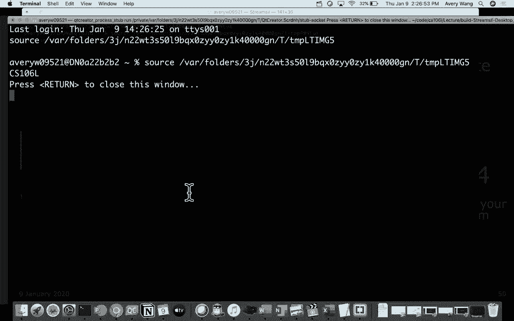

---


## 输入/è¾“å‡ºæµ (I/O Streams) ä¸ç¼“冲 ğŸ¢âš¡

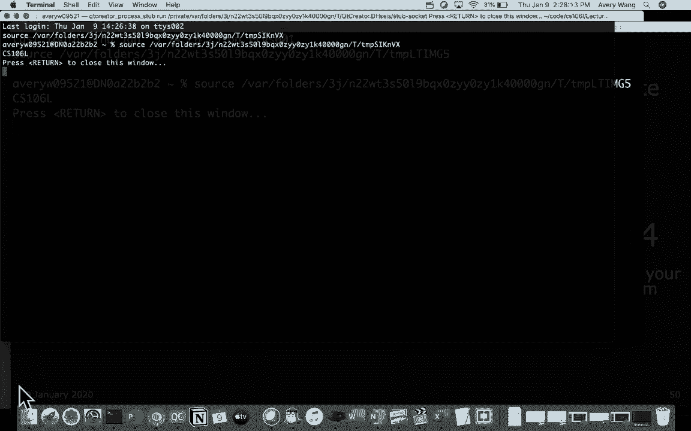


我们最熟悉的 `std::cout` å’Œ `std::cin` 就是标准的输出/输入æµã€‚它们è¿æ¥åˆ°æ§åˆ¶å°ã€‚


### 缓冲 (Buffering)

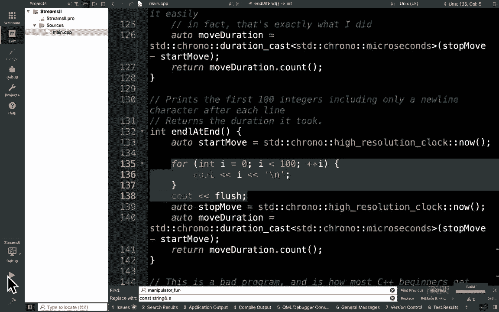

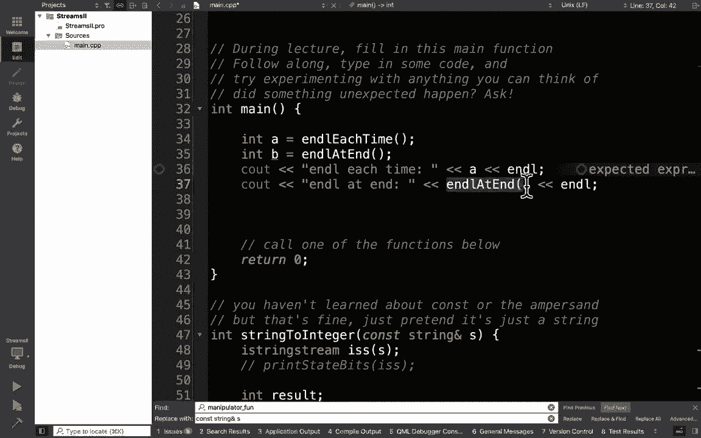

为了æ高效ç‡ï¼Œåƒ `cout` 这样的输出æµé€šå¸¸æ˜¯**缓冲的**。这æ„味ç€ä½ å†™å…¥çš„æ•°æ®ä¸ä¼šç«‹å³æ˜¾ç¤ºåœ¨å±å¹•ä¸Šï¼Œè€Œæ˜¯å…ˆå­˜å‚¨åœ¨ä¸€ä¸ªå†…存缓冲区中。缓冲区会在以下情况被“刷新â€åˆ°å®é™…设备：
*   缓冲区已满。
*   é‡åˆ°æ¢è¡Œç¬¦ `\n`（但 `\n` 本身ä¸ä¸€å®šè§¦å‘刷新）。
*   显å¼ä½¿ç”¨ `std::endl`（它输出æ¢è¡Œç¬¦**并**刷新缓冲区）。
*   显å¼ä½¿ç”¨ `std::flush` æ“æ§ç¬¦ã€‚
*   åœ¨è¯»å– `std::cin` 之å‰ï¼Œ`cout` 的缓冲区会被自动刷新，以确ä¿ç”¨æˆ·èƒ½çœ‹åˆ°æ示信æ¯ã€‚


**示例：`endl` vs `\n`**
```cpp
// 方法一：使用 endl，æ¯æ¬¡éƒ½ä¼šåˆ·æ–°ç¼“冲区，å¯èƒ½è¾ƒæ…¢
for (int i = 0; i < 1000; ++i) {
    std::cout << i << std::endl;
}

// 方法二：使用 \n，最å一次性刷新，通常更快
for (int i = 0; i < 1000; ++i) {
    std::cout << i << '\n';
}
// 循ç¯ç»“æŸå，缓冲区å¯èƒ½åœ¨ç¨‹åºé€€å‡ºæ—¶è‡ªåŠ¨åˆ·æ–°
```
在需è¦é«˜æ€§èƒ½çš„场景，应é¿å…频ç¹ä½¿ç”¨ `std::endl`。但在调试或需è¦ç¡®ä¿è¾“出立å³å¯è§æ—¶ï¼Œ`std::endl` 很有用。


### æµæ“作符 (Manipulators) ğŸ›ï¸

æµæ“ä½œç¬¦æ˜¯åƒ `std::endl`ã€`std::flush` 这样的特殊对象，当用 `<<` 或 `>>` 将它们放入æµæ—¶ï¼Œä¼šæ”¹å˜æµçš„æ ¼å¼æˆ–状æ€ï¼Œè€Œä¸æ˜¯è¾“出字符本身。


常è§çš„æ“作符包括：
*   `std::endl`：æ¢è¡Œå¹¶åˆ·æ–°ã€‚
*   `std::flush`：仅刷新缓冲区。
*   `std::setw(n)`：设置下一个输出字段的宽度。
*   `std::setprecision(n)`：设置浮点数输出精度。

它们的使用方å¼å¦‚下：
```cpp
#include <iomanip> // å¯¹äº setw, setprecision
std::cout << std::setw(10) << std::left << "Hello" << std::setprecision(2) << 3.14159 << std::endl;
```

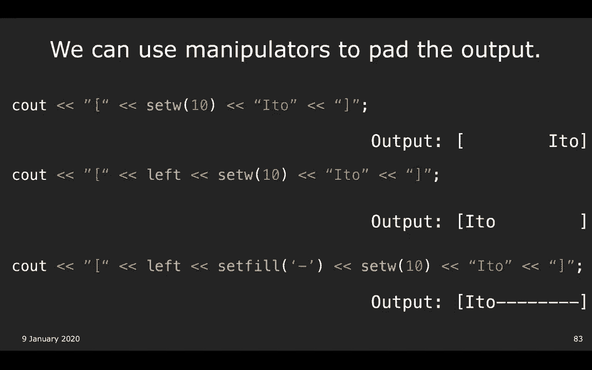

---


## 总结 ğŸ“

本节课我们一起学习了C++中æµçš„核心概念：

1.  **æµçš„角色**：作为程åºä¸å¤–部设备交互的统一ã€æŠ½è±¡çš„æ¥å£ã€‚
2.  **字符串æµ**：`std::istringstream` 用äºä»å­—符串解ææ•°æ®ï¼Œ`std::ostringstream` 用äºå°†æ•°æ®æ ¼å¼åŒ–为字符串。它们是内存中强大的类å‹è½¬æ¢å·¥å…·ã€‚
3.  **状æ€ä½**：`goodbit`ã€`failbit`ã€`eofbit`ã€`badbit` 用äºè¯Šæ–­æµæ“作的æˆåŠŸä¸å¦ï¼Œæ˜¯ç¼–写å¥å£®ä»£ç çš„关键。
4.  **I/Oæµä¸ç¼“冲**：`cout`/`cin` 是标准I/Oæµï¼Œäº†è§£ç¼“冲机制和 `std::endl` ä¸ `\n` 的区别对程åºæ€§èƒ½å’Œè°ƒè¯•æœ‰é‡è¦æ„义。
5.  **æµæ“作符**ï¼šåƒ `std::endl` 这样的特殊对象，å¯ä»¥æ§åˆ¶æµçš„æ ¼å¼å’Œè¡Œä¸ºã€‚


ç†è§£æµæ˜¯æŒæ¡C++输入输出的基础。在æ¥ä¸‹æ¥çš„课程中，我们将继续æ¢ç´¢C++的其他特性，并å®ç°æ›´å¤æ‚的库函数。