# 斯坦福大学《CS106L：C++编程》课程笔记 - 第3讲：类型与高级流操作 🧠


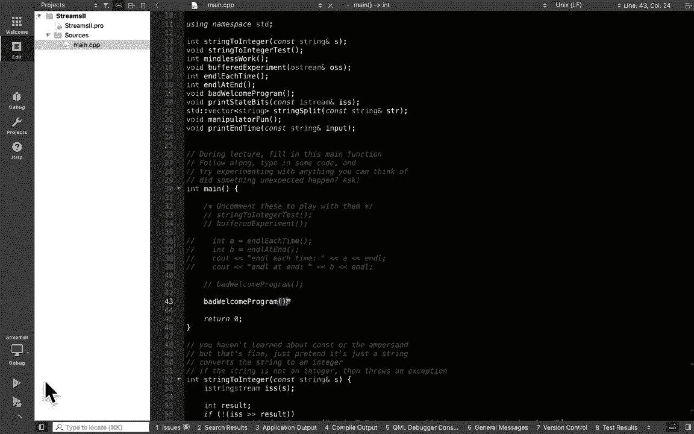

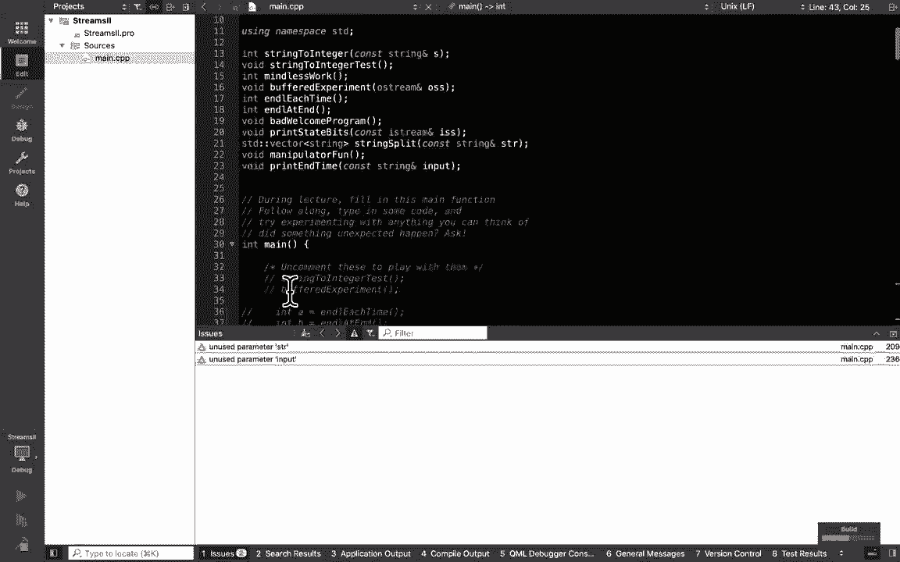

在本节课中，我们将要学习C++中输入输出流（I/O）的高级用法，以及现代C++中的一些核心类型概念。我们将从分析一个常见的输入错误程序开始，逐步探讨如何稳健地处理用户输入，并介绍`auto`、`pair`、`struct`等有用的类型工具。


## 流操作回顾与问题引入

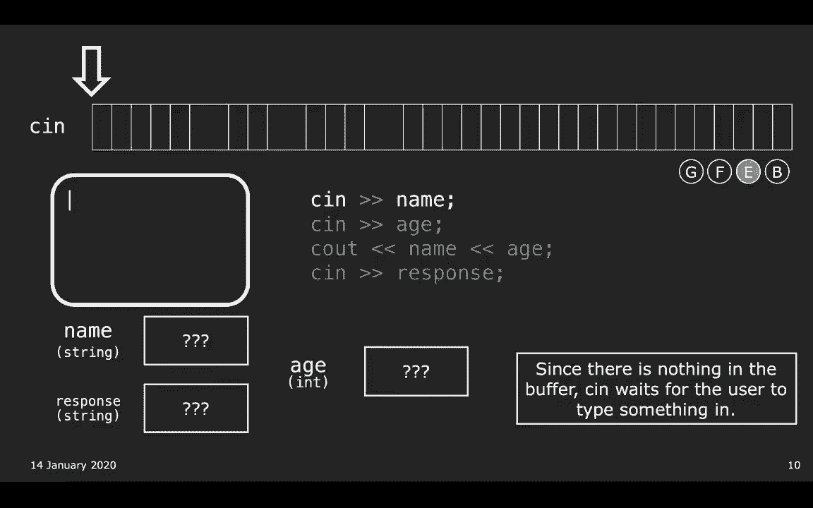


上一节我们介绍了字符串流（`stringstream`）用于解析字符串。本节中我们来看看标准输入流`cin`的工作原理及其常见陷阱。

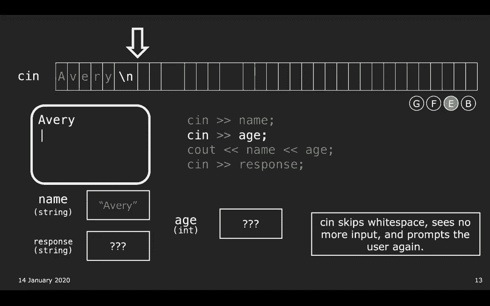


`cin`与提取运算符`>>`结合使用时，其行为类似于字符串流，但有一个关键区别：当缓冲区为空时，`cin`会使程序等待用户输入。

```cpp
std::string name;
int age;
std::cin >> name; // 程序在此等待用户输入
std::cin >> age;
```

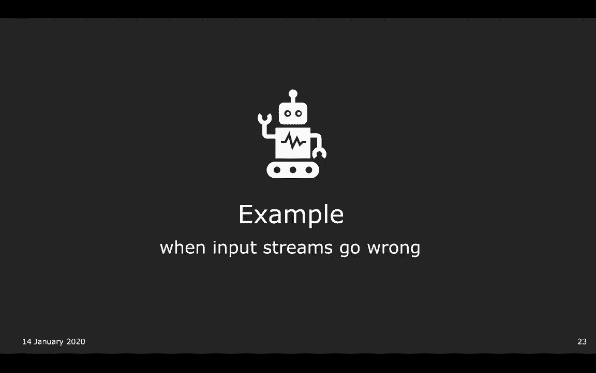

然而，这种简单的结合使用会带来几个问题。让我们通过一个“糟糕的欢迎程序”来演示。

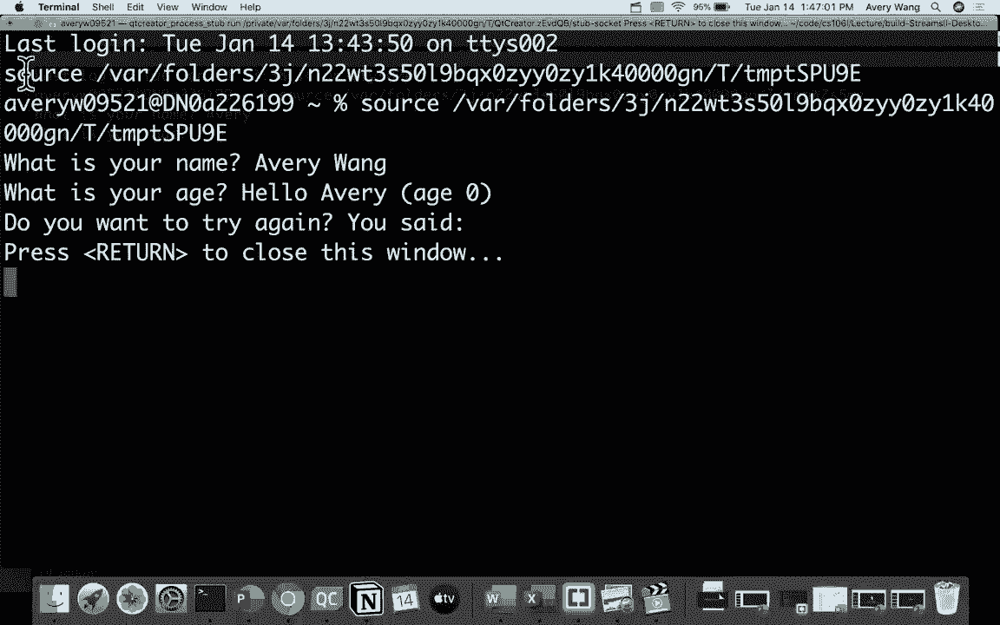

## 分析“糟糕的欢迎程序” 🚫

以下程序尝试读取用户名和年龄，但其实现存在缺陷。

```cpp
void badWelcome() {
    std::string name;
    int age;
    std::string response;

    std::cout << "What's your name? ";
    std::cin >> name;
    std::cout << "What's your age? ";
    std::cin >> age;
    std::cout << "Hello, " << name << " of age " << age << std::endl;
    std::cout << "Try again? ";
    std::cin >> response;
}
```

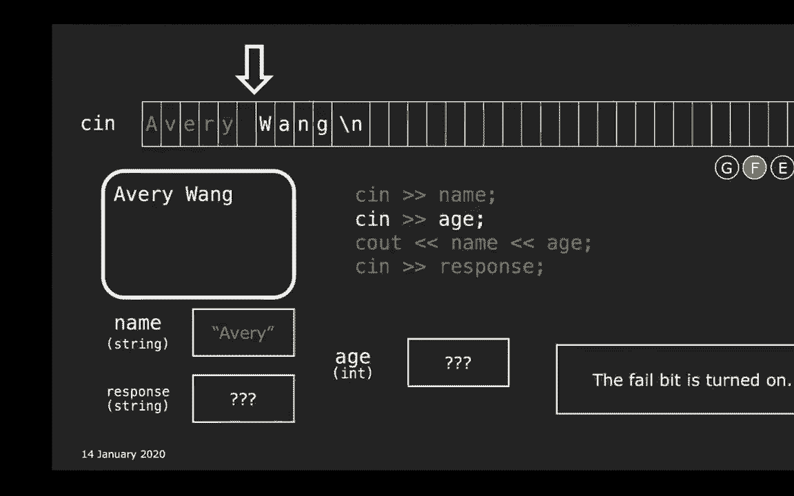


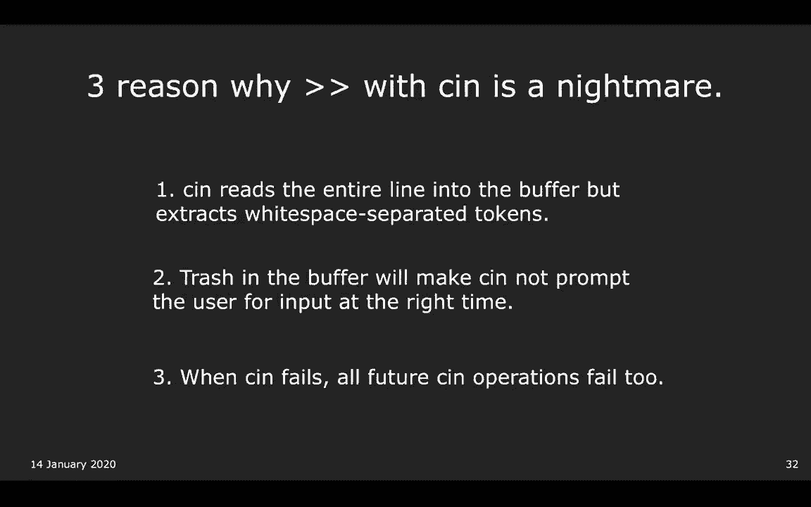

### 程序存在的三个核心问题


以下是该程序输入机制的主要缺陷：


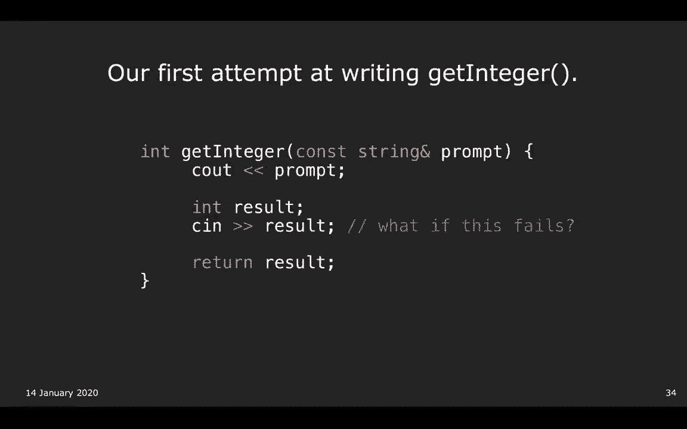

1.  **逐标记读取**：`cin >>`只读取到下一个空白字符（如空格、换行），不消耗该空白字符。如果用户输入“Avery Wang”，`name`变量只会得到“Avery”，“Wang”会留在缓冲区。
2.  **缓冲区残留导致提示错乱**：由于上一个问题留下的残留数据，后续的`cin`操作可能不会在预期时刻暂停并提示用户，因为缓冲区非空。
3.  **失败状态蔓延**：一旦某次`cin`操作失败（例如尝试将“abc”读入`int`），流的失败标志位会被设置，所有后续的`cin`操作都会立即失败，不会尝试读取。


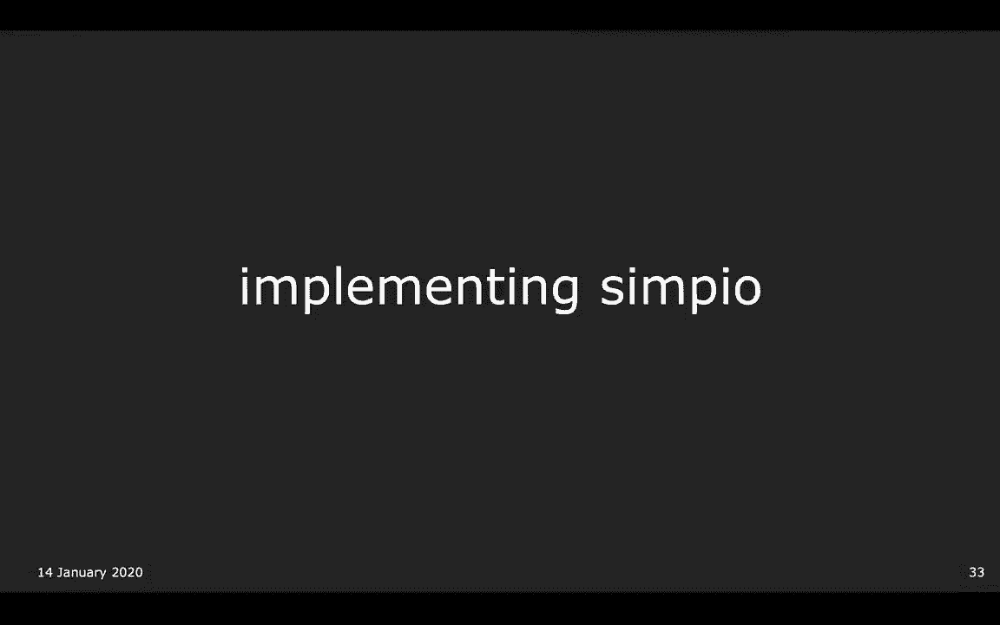

## 实现稳健的输入：使用`getline`和`getInteger` ✅

为了解决上述问题，我们需要采用更稳健的输入方法。


### 使用`getline`读取整行


`getline`函数可以读取一整行输入，直到遇到换行符，并且会消耗掉这个换行符。这解决了逐标记读取和缓冲区残留的问题。

```cpp
std::string line;
std::getline(std::cin, line); // 读取整行到line变量中
```

**注意**：混合使用`cin >>`和`getline`时需要小心。因为`cin >>`在读取后会在缓冲区留下换行符，紧接着的`getline`会立刻读到空行。解决方法是在`cin >>`后使用`cin.ignore()`忽略一个字符。

### 实现安全的`getInteger`函数

对于读取整数，我们需要一个能处理错误输入并重新提示的函数。其思路是：读取整行字符串，然后尝试用`stringstream`将其转换为整数。

以下是`getInteger`函数的一个实现框架：

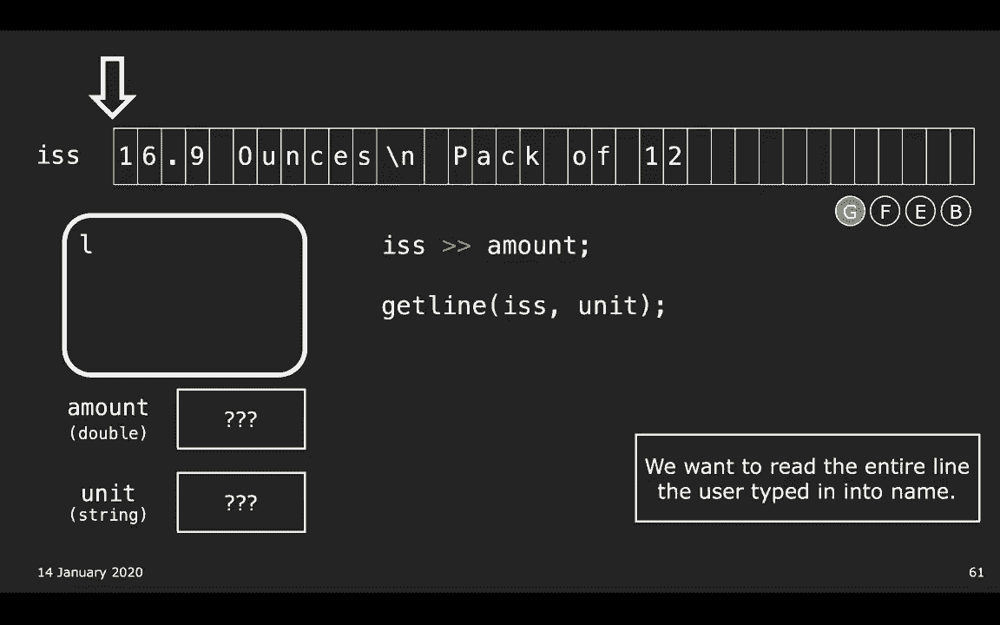

```cpp
int getInteger(const std::string& prompt) {
    int result;
    std::string line;
    while (true) {
        std::cout << prompt;
        std::getline(std::cin, line);
        std::istringstream iss(line);
        // 尝试转换，并确保字符串后面没有多余字符
        if (iss >> result && !(iss >> std::ws).eof()) {
            std::cout << "Invalid input. Please enter only an integer." << std::endl;
        } else if (iss.fail()) {
            std::cout << "Invalid input. Please enter an integer." << std::endl;
        } else {
            return result; // 成功读取
        }
        // 循环继续，重新提示
    }
}
```

## 现代C++类型简介 🆕


在解决了流输入的问题后，我们转向现代C++中一些有用的类型概念。


### 无符号类型与`size_t`

C++中整数有有符号（如`int`，可正可负）和无符号（如`unsigned int`，仅非负）之分。像`string.size()`这样的函数返回的就是无符号类型`size_t`。

```cpp
std::string str = "hello";
// 警告：有符号与无符号整数比较
for (int i = 0; i < str.size(); ++i) { /* ... */ }
// 正确：使用 size_t
for (size_t i = 0; i < str.size(); ++i) { /* ... */ }
```

**常见错误**：对无符号数进行`size() - 1`操作时，如果`size()`为0，会下溢变成一个非常大的正数，导致访问越界。

### 类型别名与`auto`关键字

**类型别名** (`using`) 可以为复杂的类型名创建简短的别名。
**`auto`** 关键字让编译器自动推导变量类型。

```cpp
// 类型别名
using MapIterator = std::map<std::string, int>::iterator;

// auto 示例
auto x = 3.14; // x 被推导为 double
auto name = std::string("Avery"); // name 是 std::string
const auto& ref = x; // ref 是 const double&
```

**何时使用`auto`**：当类型名称很长（如迭代器），或者你不关心具体类型时。对于`int`、`double`等简单类型，直接声明可能更清晰。

### 复合类型：`pair`, `tuple` 和 `struct`

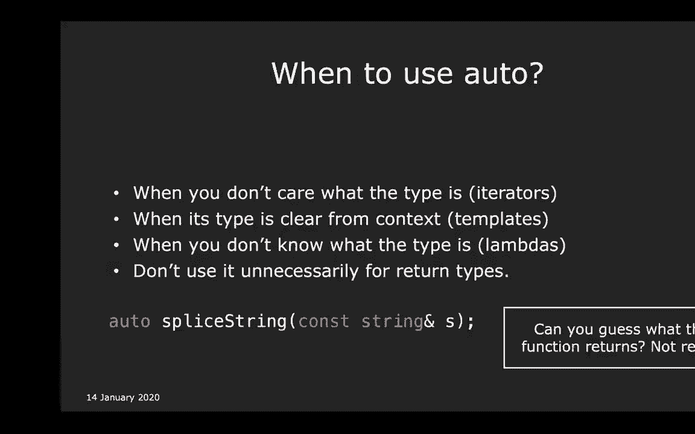

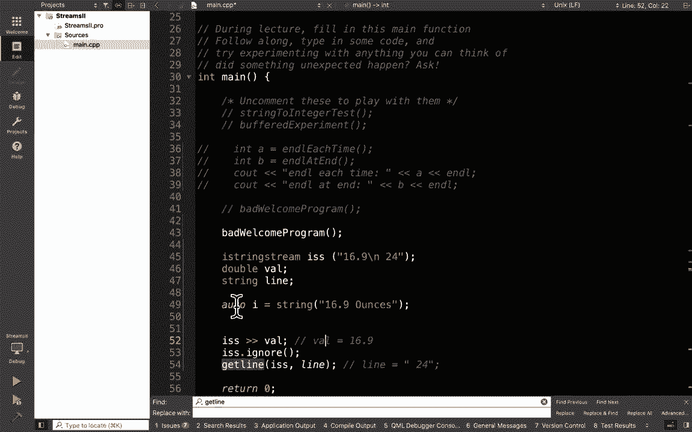

*   **`std::pair`**：将两个值组合成一个单元。
    ```cpp
    auto price = std::make_pair(19.99, "USD");
    std::cout << price.first << " " << price.second << std::endl;
    ```
*   **结构化绑定** (C++17)：方便地从`pair`或`tuple`中提取值。
    ```cpp
    auto [amount, currency] = price; // amount=19.99, currency="USD"
    ```
*   **`struct`**：将多个可能不同类型的成员组合成一个自定义类型。它比`pair`更清晰，因为成员有名字。
    ```cpp
    struct Coupon {
        double discount;
        std::string expiryDate;
    };
    Coupon c = {0.2, "2024-12-31"};
    ```

### 参数传递的惯用法

函数参数的类型传达了其用途，这是一种自我文档化的方式。


*   **`void func(int x)`**：值传递。用于廉价拷贝的类型（如`int`, `double`）。函数内修改`x`不影响外界。
*   **`void func(const std::vector<int>& x)`**：常量引用传递。用于不想修改的大型输入数据，避免拷贝开销。
*   **`void func(std::vector<int>& x)`**：非常量引用传递。用于需要修改的输入输出参数。
*   **`std::vector<int> func()`**：直接返回值。现代C++中，返回一个局部容器是高效且推荐的做法。

## 总结与挑战 🎯

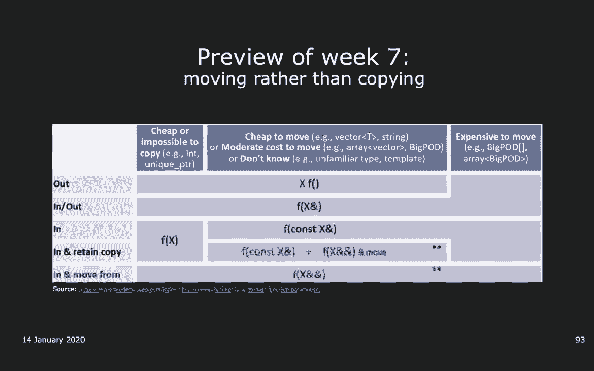

本节课中我们一起学习了：
1.  `cin`与提取运算符`>>`结合使用的三大陷阱：逐标记读取、缓冲区残留和失败状态蔓延。
2.  如何使用`getline`和自定义的`getInteger`函数实现稳健的用户输入。
3.  现代C++中的关键类型概念：无符号类型与`size_t`、类型别名、`auto`类型推导、以及`pair`/`struct`等复合类型。
4.  通过函数参数类型（值传递、常量引用、非常量引用）来表达意图的编程惯用法。


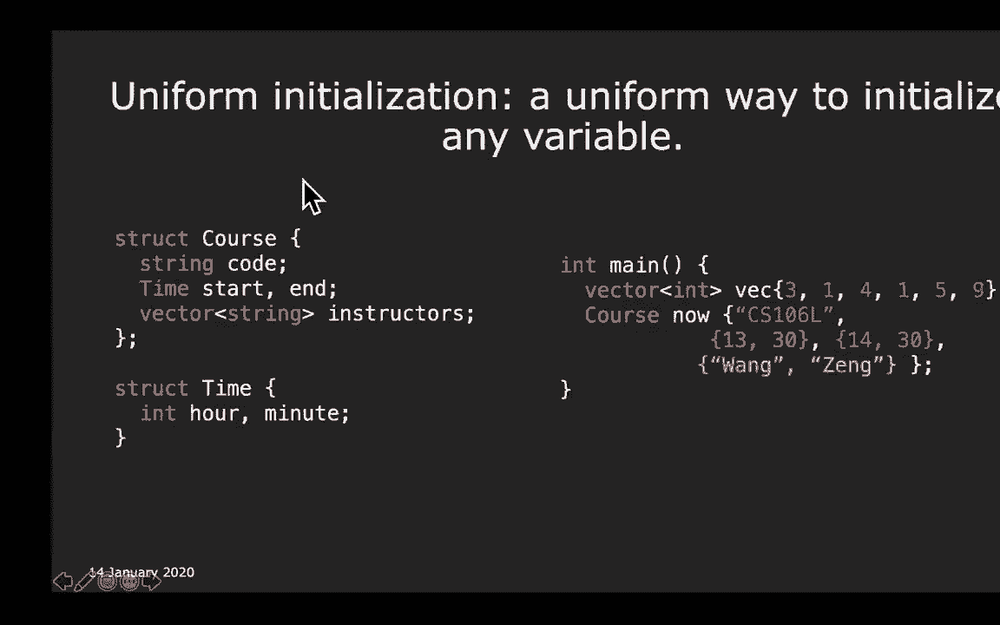

**本节挑战**：尝试编写一个函数`promptUserForFile`，该函数能稳健地提示用户输入一个有效的文件名，直到用户输入成功或选择退出。这对于处理文件操作的程序非常有用。