# 斯坦福大学《CS106L： C++编程｜ Stanford  CS106L C++ Programming 2019+2020》中英字幕（豆包翻译 - P4：[09]CS 106L Fall 2019 - Lecture 3_ Sequence Containers (Screencast) - GPT中英字幕课程资源 - BV1Fz421q7oh

好的，这个已经开启了，然后 Qt 也开启了，序列容器也开，启了，Vim 也开启了，好的，是的，然后只是，然后，我是说，你知道怎么使用终端，所以在序列中，序列，是的，你的两个，文件是你的基本向量，然后。

是的，好的，酷，然后，好吧，然。

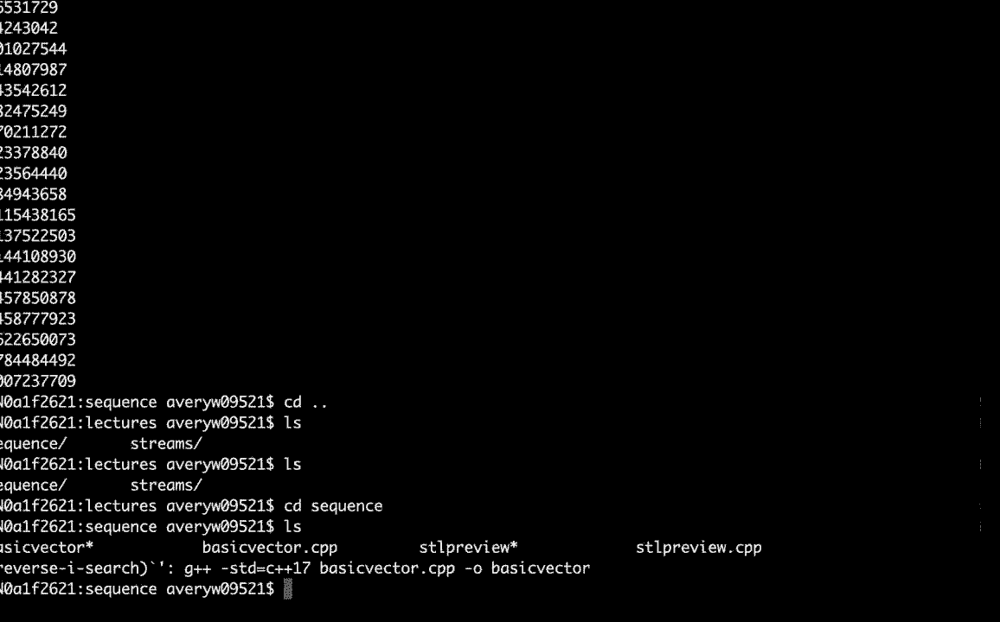

后你能按下那个吗？好的，你们，接下来我们将完成周二没有完成的部分，然后，我们会转到新话题，也就是标准模板库，这非常令人兴奋，但首先，完成序列的内容。好的，欢迎回来，每个人，所以你们以为在两节课后。

你们终，于结束了我，我还会讲大约 10 分钟，然后你们会听到 ，Anna，耶。好的，让我们完成一些类型，上次，我简要提到过结构体，我，真正谈论了 SCD 对的概念，对就是，你可以放入两种不同，的类型。

然后这允许你，将这两种类型打包成一个对，你可，以根据需要传递它们，返回它们。在 C++17 中，他们有一个新特性叫做结构化绑定，就是这，行，基本上，当你返回一个对时，你可以自动将变量解包到。

两个不同的变量中。此时，有问题吗？有吗？避免在 106B 中使用这个，是的，因为有些章节领导不知道，什么是 STD 对。这也是一个相对较新的特性，所以不能保证它甚至是一个，模板。是的。

假设 106B 自动评分系统使用的是一个比较旧的 ，C++ 版本，所以避免在 106B 中使用这个。是的，问题？这可以应用于自定义结构体吗？这是一个非常好的问题，这是我接下来的幻灯片。

让我们继续你的问题，预测接下来会发生什么。还有其他问题吗？有吗？你是说当我返回一个向量时，你能立即解包吗？是的，你也可以这样做。你需要小心。当你返回某物时，你必须确保你将其解包到正确数量的元，素中。

这最常用于对。顺便说一下，这就是一个对。还有一个叫做元组的东西，它本质上是一个对，但你可以有，尽可能多的东西。到目前为止有问题吗？让我简要谈谈结构体。如果你现在看看这个程序，返回一个对是很好的。

你可以一次返回两个东西。你能从这段代码中看到一个缺点是什么吗？这个程序只能返回两个东西，因为我们现在使用的是对。如果需要，你可以将其扩展为元组。你提到了一个很好的点，那就是对本身。你知道里面有两个整数。

但你怎么知道第一个是最小值，第，二个是最大值？阅读你函数的人可以说，哦，你返回两个整数，第一个一定，是最大值，第二个是最小值。没有自文档化的方式来说明哪个是最小值，哪个是最大值？

也许更好的办法是使用一个叫做结构体的东西。结构体是对或元组的更一般形式，其中每个组件可以是不，同的类型，你可以提供多种不同类型。此外，结构体中的组件是命名的，这意味着当你引用结构体，中的不同部分时。

你可以按名称引用它们。例如，对于一个结构体，我可以命名两个组件为 min 和 ，max，以便稍后当我想访问 min 或 max 时，我可以调用，好，的，这个结构体的 min 是什么。

这个结构体的 max 是什么，我看到这儿有一个问题。是的，问题。抱歉，在对或元组中，所有类型必须相同吗？我想我说错了。类型不需要相同。是的，在对或元组中，它们不需要相同。当我们下周深入 STL 时。

你会经常看到 STL 库返回一个，对，然后这个对通常是一个布尔值和其他东西。我认为 find，这个你会用到的比较常见的函数，它返回一，个布尔值和其他东西。布尔值表示是否实际找到了某个东西。

如果这个布尔值为，真，那么另一个组件就是你找到的实际东西。如果没有找到任何东西，那么就是假和一些随机的垃圾。好的，问题。还有其他问题吗？是的，问题。结构体是否较慢？我认为对和结构体。

它们的工作方式是一样的。我不是很确定，但我认为对可能在底层是作为结构体实现，的，所以我认为没有大的问题。你知道答案吗？比结构体更有可能一点。好的。它不需要存储在内存中的任何地方。是的。但在速度上。

它应该是。是的，应该是相似的。结构体是一个非常古老的构造。这不是现代 C++ 的事情。如果你在编程 C，你会经常看到结构体。所以结构体实际上是从 C 中借来的。现在。

如果你在编程 Java 或 Python，你会发现这实际上，和类很类似。一个类，你可以有实例变量，然后你可以引用这些实例变量，这有点像，但是结构体中的一切都是公共的。

你可以立即访问你创建的任何结构体对象的 min 或 max，结构体的工作方式和对象完全一样。问题，是吗？当你访问时，是访问变量的引用，还是访问那个的副本？你是在访问变量的引用。作为一个例子，看看这儿。

这里我们使用了一个结构体价格范围，其中价格范围有两，个组件，一个 min 和一个 max。然后你可以看到，我们可以通过说 p。min 和 p。max 来访，问价格范围的 min 和 max 字段。

如果你想改变 p。min，你可以说 p。min 等于某个值，因为，这是一个引用，它实际上在改变 p 内部的内容。问题，是吗？结构绑定？封装即私有变量隐藏。是的，我认为你不能说私有这个词。

结构体是类的一种非常轻量级的形式。如果你现在在上 106B，类将在学期中途讲解。结构体实际上是 C++ 被创建的原因，因为 C++ 的创建者，在使用 C 和结构体时，厌倦了只处理公共数字，所以决定。

让 C++ 成为一个更大的名称。还有其他问题吗？然后你可以使用结构绑定做同样的事情。当你返回结构体时，你可以访问变量并将它们提取到单独，的变量中，有点像我们对对所做的那样。我们不通过这个例子。例如。

另一个我们可以做的结构体，我本来打算做这个示例，但我们时间不够，是我们可以写一个叫做 course 的结构，体，在 course 里面可以有一个字符串 code，CS16L。

可以有一个开始时间和结束时间。时间是我们稍后可以创建的另一个结构体，它包含小时和，分钟。例如，开始时间可以是 3。30，结束时间可以是 4。30。

结构体还可以包含一个字符串向量 instructors 和一个，简要介绍。结构体的工作方式相同……，这只是另一个你可以使用结构体的例子。你可以拥有一个课程的向量，它本身就是一个结构体。

如果我们有时间的话，我稍后会详细讲解这些。我想简单提一下最后一个主题是初始化。在其他语言中，初始化并不是一个大问题。但在 C++ 中，显然，我刚刚查了一下，你可以用 26 种不同，的方法初始化一个变量。

然后这里有一个小表情包，或者这是一个小 gif，讲的是你，可以用多少种方法初始化。我不知道其中三分之二的内容。我们完成了吗？好吧，我们完成了。本质上，初始化的方法有很多，而且实际上不可能知道或记。

住所有这些方法。初始化的方法还取决于你使用的类型。具有讽刺意味的是，为了解决这个问题，C++ 决定再增加一，种初始化方法。有一种第 27 种初始化方法叫做统一初始化，它旨在解决，所有这些初始化问题。

你现在处理的许多对象本身都有一个叫做初始化列表构造，函数的特殊构造函数，它允许你通过给出一个参数列表来，初始化某些东西。例如，默认情况下，结构体，比如 course，我们可以通过将。

我们想要的课程的不同组件放在这些大括号内来初始化它，们。这将用课程代码 CS106L、时间 3。30 和 4。30 以及讲师，的向量（我和 Anna）来初始化我们的课程。有几个问题。是的，第一个问题。

第二个参数，15。30，应该是一个时间结构体。你不需要明确地称它为时间对象或时间结构体？好问题。请注意，我们从未提到 15。30，这里的蓝色部分，是一个时，间。原因是当 C++ 看到你的课程结构体时。

它看到你放置它们，的顺序。首先是一个字符串，然后是一个时间，然后是另一个时间，然后是一个向量。它进入你的初始化列表，就是这个。这不是初始化列表。它进入这里，并且说，第一个是字符串。第二个是时间。

要创建一个时间，我们可以进行另一个统一初始化。它会说，第一个部分是小时，第二个部分是分钟，其他一切，也是如此。它将第三项视为一个向量，因此将其转换为字符串向量。好问题。是的。你能改变……，哦，你是说。

我可以现在说 now。courseCode 等于某个值吗，像是改变它？是的。这将初始化一个课程，从这些值开始。你现在可以进去并说 now。code 等于 CS106B。是的，好问题。还有其他问题吗？

是的。统一初始化就是一次性完成所有操作吗？统一初始化的方式适用于很多不同的事物，不仅仅是结构，体。对不起，你能解释一下吗。我还是不太明白统一初始化的意思，这是一种特化。是的。例如，初始化一个向量。

这种初始化向量的方式会创建一个，包含这些元素的向量。现在，向量和课程，它们是不同种类的东西，但有一种通用，的方法来初始化各种不同的对象。如果你注意到，我们在初始化很多不同种类的对象。这是一个时间结构体。

这是一个字符串。这是一个向量。但是它们都可以用相同的方式初始化，使用花括号。问题，是的。所以OOP（面向对象编程）是一个话题，我们实际上会在本季，度晚些时候讲到。

结构体在某种程度上是OOP在C++中的前身，但C++有自己版，本的类等，因此不仅仅是结构体。好的。在第一次讲座中，我提到向量有很多构造函数。你会看到的构造函数之一是这个初始化列表，它会接受你。

给出的初始化列表，这是正在调用的构造函数。问题，是的。你可以传递一个结构体作为引用吗？是的。然后可以改变结构体中的特定值吗？是的，所以问题是你可以按引用传递结构体吗？答案是可以的。

它们的工作方式有点像对象，只是所有成员都是公有的。好的。是的，当你使用统一初始化时，它更倾向于调用带有初始化，列表的构造函数。所以在这里，如果你对3使用它，它会创建一个包含元素3的，向量。

如果你更愿意调用其他构造函数，你需要使用更常规的方，式，比如，传入3。如果你查看向量的STL规范，传入一个数字表示大小，即初，始大小。所以它会创建一个大小为3的向量，默认值为0， 0， 0。问题，是的。

等等，因为我以为Jeremy可能说过，比如，当你用大小3初始，化时，它不会自动默认为0， 0， 0。难道不是垃圾，垃圾，垃圾吗？

所以这实际上是一个棘手的问题。所以问题基本上是，C++是否会自动将你创建的对象初始化。

为0？事实证明，这实际上是一个比最初假设的更棘手的问题。我们能找到的共识是，当它是全局变量或某些变量时，你可，以依赖C++进行零初始化。有某些关键字表明它将自动进行空初始化。

但通常来说，如果它只是一个局部变量或对象，你不应该依，赖它进行空初始化。是的，这是个好问题。因为我认为这里有一个构造函数，它会指定某个类型的默，认值。对于int，是否有默认值？它是否只是给它0？是的。

所有原始数据类型也会自动进行空初始化。是的，所以我认为这里它有一个默认值。所以如果你没有给它默认值，它会说，好吧，你有一个计数，它的默认值将是0或类似的东西。好吧。

现在你知道了这一整件事情的一个小部分是什么意，思。你知道这意味着什么，初始化列表，以及你也知道什么是引，用。然后我们将在学期中覆盖其他所有内容。有问题吗？

那么我们需要自己创建一个带初始化列表的课程方法吗？是的。好吧，所以默认情况下，如果你不提供初始化列表，它所做，的是按声明每个变量的顺序实例化每个参数。所以我们做的顺序是一个字符串，课程代码。

然后是两个时，间，然后是一个向量。所以它就将每个匹配到不同的成员。是吗？所以如果你定义一个新课程而不指定任何参数，那就意味，着它会对每一个参数进行零初始化，或者像等效的零初始，化？会这样吗？对于整数。

它会这样做吗？我相信它对于整数确实会这样做。我们需要检查它是否对向量或其他东西进行零初始化。但是你完全可以先创建它，然后稍后再设置值。在创建时你不一定要设置值。好吧。

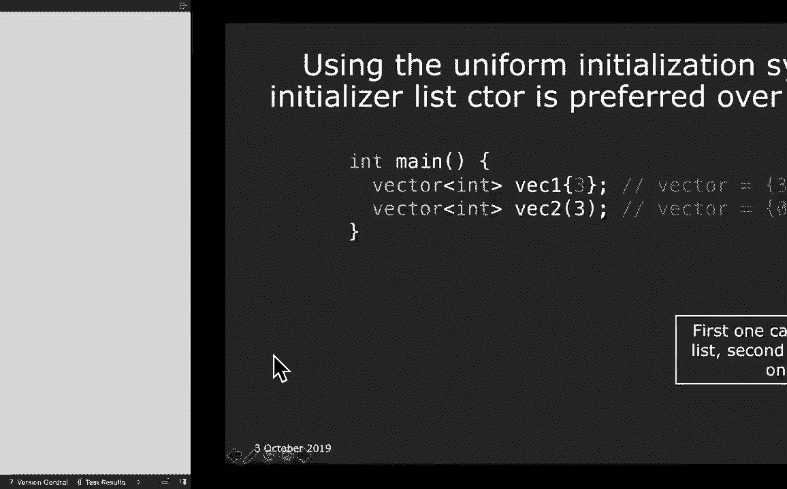

那我们就这样吧。太棒了。好吧，各位。所以我将休息一周左右。休息他的声音。他做了非常棒的工作。好吧，所以今天我们要讨论一些事情。不过，在我们进入新话题之前，有一件事我们想强调一下。

就是我们刚刚教过你们的这些话题，特别是，比如说，字符，串流，它是很多人其实没有听说过的东西，我们看到了一些，可以用它做的很酷的事情。然而，我们还想在这门课程中强调的是，不仅展示C++的独，特工具。

还要教会你们或者提醒你们总是要考虑好，我有这，些不同的工具。我还需要记住什么时候使用它们。所以我们刚教了你们字符串流，但我们想强调的是，它不一，定现在是你代码中所有字符串的替代品。

字符串流适合做一些事情，特别是这三种应用。比如说你想在代码中处理流。例如，那就是你文件目录中的一个路径。如果你现在不熟悉它也没关系。你会在107或者甚至106x中看到它，我相信。

如果你想将它简化为更短的版本，例如。格式化输入和输出字符串。所以我们没有机会讨论与输入输出流或字符串流相关的字，符串操控器，但像ndl或flush这样的东西，都是字符串操控，器。

像大写和十六进制也是如此。这些操控器的作用是，例如，如果你输出你的字符串，你可，以插入字符串操控器大写，它会将所有内容输出为大写。所以对于那些你想以特定方式格式化的流，字符串流也非，常棒。顺便提一下。

现在幻灯片的最后有关于操控器的幻灯片。所以如果你感到好奇，可以随时查看这些幻灯片。是的，如果我们今天有时间的话，希望能看到这些。如果没有，它们在幻灯片中等着你们。最后一点，例如。

当然是我们处理的字符串到整数。换句话说，当我们处理流中的不同类型时，这又是字符串流，的一个好用例。另一方面，例如，如果在你的程序中只是连接字符串，结果，是你实际上并不需要字符串流。

这是你实际上没有使用的额外功能，而你亲爱的老朋友 ，string。append 实际上是你可以使用的最佳工具。所以这是一个提醒，这确实是一个超级强大的工具。只要记住，例如，字符串也是有其存在的理由的。

好的，那么我们在开始新的话题之前想做的另一件事是调，查结果。感谢大家填写调查问卷。我不知道你们为什么会在没有某种动机的情况下这样做。不，我只是开玩笑。所以有几件事只是让你们知道一下。这就是课程的情况。

不同班级之间的分布很均匀。很多新生，但我们也有相当数量的二年级学生和研究生。听到这些真是太好了，这对我们非常有帮助，因为这让我们，知道我们实际上在处理更广泛的背景。与此类似，我们的专业当然是计算机科学。

但也涵盖了许多，其他专业，还有更多。最后，如果你们感兴趣的话，这就是你们今天坐在这间教室，里的原因。你们想学习 C++ 如何在工业中使用。你们想更多地练习 C++ 语言。你们想补充 106B 和 X。

这也是一个非常有效的理由。然后是具体应用。所以对于那些因为想学习如何将 C++ 应用到具体工作或，其他应用的人，我们不会直接在课堂上讲解这些，但我们鼓，励你们在办公室时间来找我们。

我们会在明天或今天发布，作业时公布。这样我们也可以与你们讨论你们感兴趣的具体内容。所以不会直接讲解这些，但我们会尝试专注于这三种应用，使课程对你们有用。酷。这很令人兴奋。

所以到目前为止你们学到了流和 C++ 类型以及 C++ 库中，的许多其他非常酷的新构建块。如果你们还记得，这就是 Avery 在学期开始时为我们制作，的地图。现在我们要做的是退后一步。

回到 C++ 中最早创建的东西，之一，即标准模板库，在右上角。这不是 C++ 的内置功能。在 1972 年，或者我希望我记对了年份，当 C++ 首次创建，时，它并不存在。

但在 C++ 的第一次广泛发布中，标准模板库是语言中最早，内置的功能之一。我们很快就会看到原因。所以今天，我们将专注于几个不同的方面。在我讲到这些之前，我认为这是标准模板库的一个很好的，总结。

正如数学家们试图将定理提升到最一般的设置一样，这位 ，Alex Stepanov 希望将算法和数据结构提升到它们最一般，的版本。所以，再一次，为了避免每个程序员都要自己实现一个查找，或排序算法。

这位先生想把它放到一个标准库中，人们可以，在一个源空间中工作并使其更高效。而这在现在我们有点视为理所当然，但在当时，绝对是一个，新特性。所以在这次讲座中，我们将覆盖标准模板库的两个部分：容，器和适配器。

这些词似乎很陌生，但你们会发现你们实际上已经知道大，部分内容。这将是好的。接下来的五次讲座中，我们将深入这三个标准模板库的核，心部分：迭代器、算法和仿函数与 Lambda 表达式。实际上。

这三件事就是为什么很多人，或者说，为什么我们，在向你们宣传这门课程时，说 C++ 是魔法的原因。我现在就给你们一个提示。但是，是的，一旦我们进入那三次讲座，你们会真正看到标，准模板库是多么强大。

我保证你们会感到惊讶。在 STL 中还有一些其他内容，但这些是更小的概念，我们，在这门课中不会涉及。我只是想补充一点。即使 STL 是 C++ 最古老的库之一，它也在不断演进。如果你现在查看文档。

你会看到有日期，比如自 C++14 以，来，自 C++17 以来。它们在不断增加更多功能，这些功能补充了 C++ 的新语言，特性。所以不要认为这是一个没人使用的超级古老的库。每个人都在使用这些。

并且它变得越来越复杂。是的，是的，绝对如此。是的，那里。再说一遍。是的，这是一个很好的。是的，这是一个很好的问题。是的，好的。所以他们有一个 C++ 大会，由。这个大会非常非常频繁地举行。

你可以在网上看到他们的会议记录，那里讨论了基本上要，添加到 C++ 中的新特性，并讨论 C++ 目前的问题，如何解，决它们。志愿者，这也是。你提到了一个关于志愿者的好点子。

这是一个关于 C++ 的重要点，即与一些其他语言（如 ，Java）不同，C++ 不属于任何特定的公司或行业。开源的。Java 属于。 Oracle。Oracle，是的。所以与那些不同。

C++ 可以在任何地方使用。如果你想在你的业务中使用它，没有许可问题。确切地说，这也是。这一直是 C++ 发展的核心特征之一。因为它是开源的，人们一直在为语言编写扩展。有一组库叫做 Boost 库。

也算是。它们有点像 STL++。它们像是 STL 的扩展，还提供了很多独特的功能。所以我忘了我们是否覆盖了 Boost 库，但只是为了说明 ，C++ 是超级可扩展的，这也是它的一大特性，部分原因是它。

是开源的。所以给你们一个提示，展示你们五次讲座后的样子，这里是。

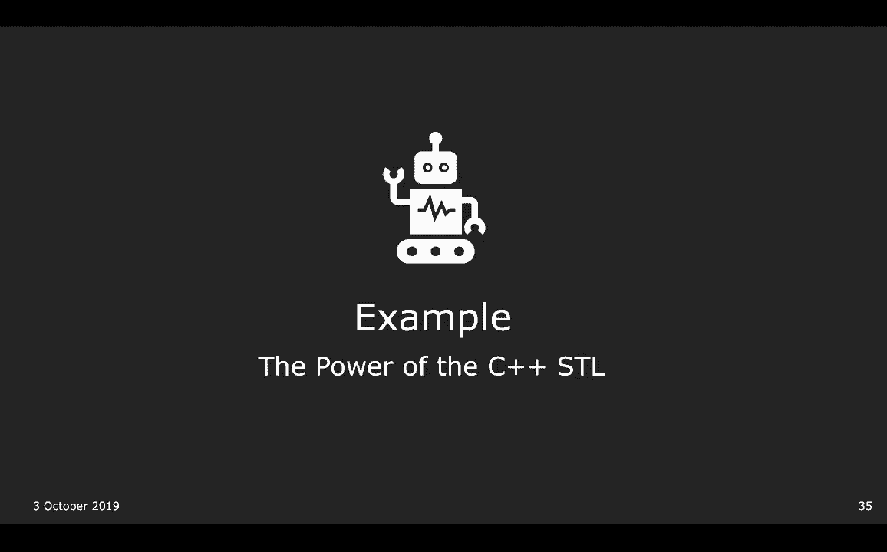

 STL 能做的一个例子。

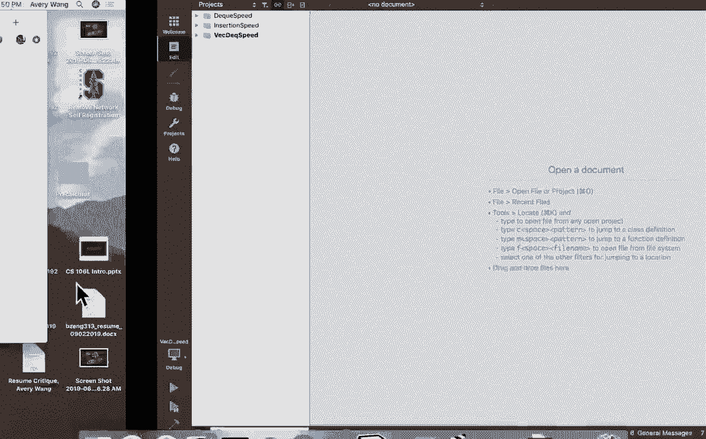

好了。好， 所以。

如果我们进入 STL 预览。好，这是一段我写的代码，用来做一些简单的功能。不要担心细节，但本质上，这段代码做的就是这三件事。它生成了 n 个随机数，并将它们放入一个向量中。

它使用某种随机排序算法对数字进行排序，在这个例子中，是冒泡排序，然后最终将它们打印出来。你会注意到，如果你们写过类似的程序，这可能看起来有些，熟悉。例如。

你使用 for 循环来遍历向量中的所有空间以填充它，们，然后你。不要在意冒泡排序。这只是这种特定实现的排序方式，但如果你实现过排序，那，可能就是你做过的排序之一。然后，再次，打印向量时。

向量没有内置的字符串，点到字符，串函数，所以你需要逐个遍历向量中的元素来查看。好的，我们来看看是否有效。

所以我们将。完美。看起来我们的程序做的就是生成了 20 个随机数，然后按，排序顺序输出它们。所以，如果你还记得你刚刚在程序中看到的所有内容，我们。

现在将其压缩成五行代码，看看会发生什么。所以，再次，我们从这个变成这个。让我们看看会发生什么。哎呀。让我。

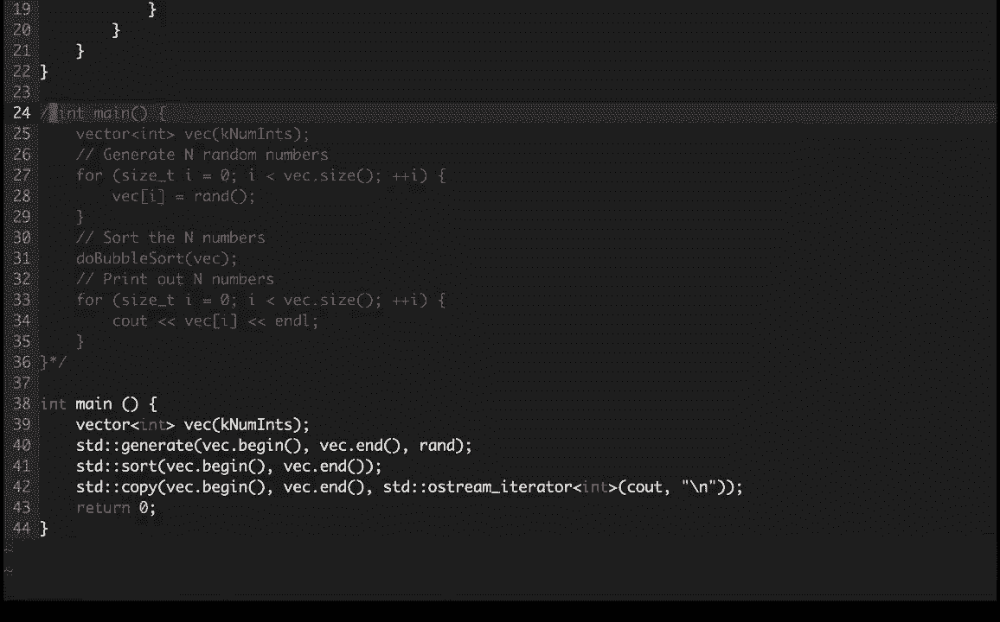

完全相同的事情。所以，实际上，这真的在做的就是使用标准模板库中的算法，和预构建函数，将我们通常编写的代码转换成超级简单的，东西。所以，无论如何，这只是一个暗示，表明你们在接下来几节，课中将能够做的事情。

我想强调的另一点是，你可能会。你可能会想，既然我将其压缩成这些其他函数，那会不会比，直接写更慢呢？因为现在你不再像之前那样。 像谁知道它们下面发生了，什么？事实证明，STL 的另一个好处是。

由于它已经成为 C++ 的，标准库，人们一直在努力使这些函数的实现尽可能高效。所以，即使你想重写其中一个函数，例如你可能自己见过的，生成函数，它也可能不如 STL 版本高效。

所以。我可以再加一句吗？可以。你能给我那边的代码吗？

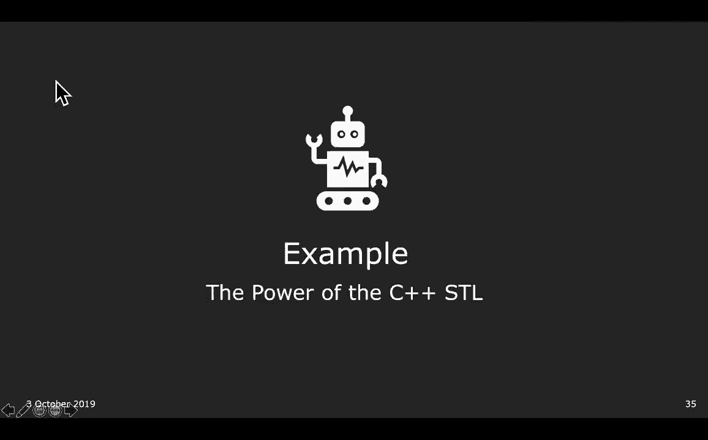

可以。所以，代码，是的。如果你看看之前的实现，这是一种非常机械的代码编写方。

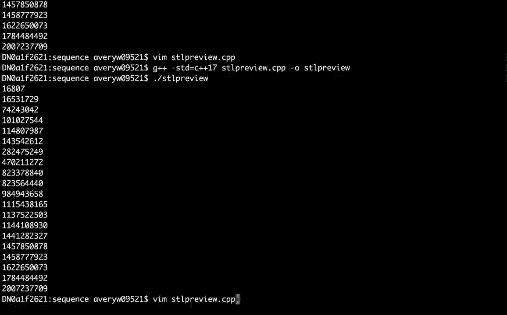

式，对吧？你实际上是一个一个地遍历元素。你在移动它们。你一个一个地打印它们。但如果你看看 STL 库所做的事情，比如仅仅看代码，你可，能不能完全看出它在做什么，但你可以大概猜测它在做什，么，对吧？它是。

好的，你创建一个向量。你生成一堆数字。你对它们进行排序，然后将它们复制到某个与 CL 相关的，东西中。对吧？我们从一个非常机械的、非常低级的过程转变为能够利用，这些算法来解决问题，专注于更大的问题。

而不是机械地移，动数字。这也是 STL 的一个好处。是的，既然我们在赞美 STL，我们还要预览一个其他好处，那就是，实际上，如果我们想的话，我们可以完全用比如栈。

或者我们自己定义的随机对象来替代这个整数向量。STL 的最大好处之一是它具有通用性。这个具体的函数可以在任何满足特定条件的数据结构上工，作。不过，这只是 STL 的一个预览。接下来的几节课里。

我们将详细讲解这些内容。但这只是给你们一个例子，让你们了解为什么我们要花时，间讲这个。酷，所以，这就是我们要去的地方。还有我们喜欢的 Alex Stepanov 的一句话，再次提到 C++。

 的目标之一就是追求效率，这真的帮助我们理解问题。是吗？你必须把它加上去吗？是的，绝对是。所以这些函数特别地出现在一个名为算法的头文件中。但我们也会在另一节课中深入讲解算法。是的。

我们会在那里展示给你们看。太棒了。所以在我们可以进入所有这些酷东西之前，我们也想专注，于序列容器、关联容器和适配器，所以请耐心等待，因为其，中很多内容你们可能已经很熟悉了。所以我想强调的是。

C++ 版本的这些熟悉对象与你们在 ，CS106B 和 X 中见过的东西有何不同。序列容器实际上只是提供对元素序列访问的数据结构。序列容器是容器的一个子集，而容器是 STL 的一个方面。

容器实际上就是存储其他数据集合的任何对象。序列容器是一种特定类型的容器，其中数据是按顺序排列，的。例如，你可能对 106B 或 X 中的向量非常熟悉，它刚刚介，绍过。

然后这些实际上是 STL 定义的其他四种序列容器。我们不会讨论这底下的两个，但我们会讲解前两个。所以 C++ 向量实际上与你们在 106B 或 X 中熟悉的非常，相似。向量，依旧。

表示任何类型元素的序列。再说一次，向量可以是任何类型对象的向量，无论是 int、，string、struct（正如 Avery 刚刚教过的），甚至是其他类，型容器的向量。所以，好吧。

在我继续讲解下一个幻灯片之前，我想强调的一点是 C++ ，向量比 Stanford 向量实际上有更多的函数。所以我们在下一页提供了一个很好的表格，以便你们真正。

了解 Stanford 的向量与 C++ 向量的不同，但要知道我们，的向量还有更多内容在页面上没有展示。所以不要担心屏幕上有多少文字。我们主要是为了给你们提供一个参考，以便你们以后需要。

时可以查看幻灯片。我们想突出的几个不同点是，与 Stanford 向量相比，你们，在向量中添加元素时，调用的是 v。addk。在标准向量中，类似的函数叫做 pushback。

你会发现 pushback、pushfront、popback 这种操作在其，他标准 C++ 数据结构中也会看到。另一个我们想强调的区别是，从向量中检索元素，在斯坦福，你使用 。

geti 函数或括号表示法。在 C++ 中，标准 C++ 中，get 的对应方法是 at。但是，括号表示法也有细微的差别，我们会很快讨论到这个，问题。最后，类似地，存储值到向量中时，使用的是 at。

而不是 ，get。在我继续之前，有没有什么问题？是的，请说。一般来说，你知道为什么在 B 和 X 中我们要使用斯坦福，的库吗？是的，所以问题是，为什么在 B 和 X 中我们使用斯坦福的，库？实际上。

这对讲师来说是非常有意义的，因为像 106B 和 ，X，甚至 A 这样的课程的目标，是教你 C++ 的通用设计原，则，或者像递归这样的概念，你们将在本季度稍后学习，这。

样他们不希望你被语言的具体细节困扰，因此他们提供了，一个比标准 C++ 更小但更清晰的接口，而标准 C++ 当然，是一个非常混乱的环境。我还要补充两点。一点是，要正确使用 STL 库，你必须理解迭代器。

安娜将在，下一节课中讲解。我首先要说的是，下一节课我认为是 CS106L 中最重要的，一节，关于迭代器。如果你没有听到，下一节课是 CS106L 中最重要的一节课，而且我们不会录制它。我们可能会录制。

我们可能会录制。所以，是的，要理解迭代器，你必须理解迭代器才能完全正，确地使用 STL。所以，迭代器可能需要一周时间来讲解，这就是我们正在做，的事情。所以，当你想要成功时，你只有 10 周的时间。

你没有一周时间来讲解这个内容。另一个问题，对不起，我还有一个问题。哦，STL，安娜会谈到这个，但根据 C++ 的理念，如果你做一，些事情，C++ 相信你会做得对。如果你做错了什么。

C++ 是非常不宽容的。STL 库如果你做错了什么也是非常不宽容的。所以，是的。这实际上是一个很好的引入，因为我们现在将看到一个例，子。我们时间怎么样了？哦，等一下，好吧。好的。

所以我提到有一个关键的区别，就是这种括号表示法，或者更普遍地说，是在向量中获取和替换元素的方式。所以，让我们快速看看原因。

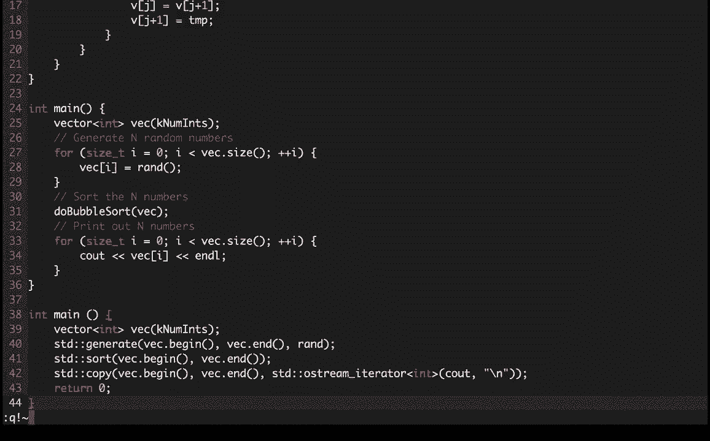

所以，你想看到的主要是，我实际上要删除。好的。所以，我已经写了一个函数，专门为我们打印向量。你会注意到我没有使用我们之前用过的漂亮的算法。这只是因为，一方面，展示另一种方法，另一方面，因为我们。

还没有讨论过它。所以，我们暂时保持原有的方法。你会注意到我使用了 Avery 刚刚教的 auto 关键字。所以，再次，如果我们想创建一个向量，称之为 vec。然后，实际上，我在这里展示给你。所以，再次。

就像斯坦福库一样，我们使用 pushback，而不，是 add。让我们做这个，让我们做这个。是的，谢谢。非常感谢。酷，然后如果我们想，我们可以打印出来。但在我们这样做之前，我还想展示一下，啊，好吧。

如果我想的话，我们还可以看到 vec。get zero。

那么，当前向量位置是什么？所以，它是 names。

实际上，谢谢你。

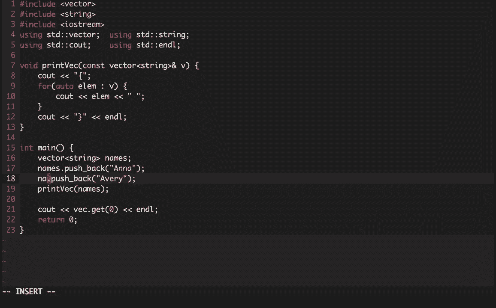

哦我的天，我骗了自己。实际上，这是一种，讲师们经常说的，但的确，这是一场突击，测试，你们。干得好，抓住了它。如果我们在这一点上可以的话。

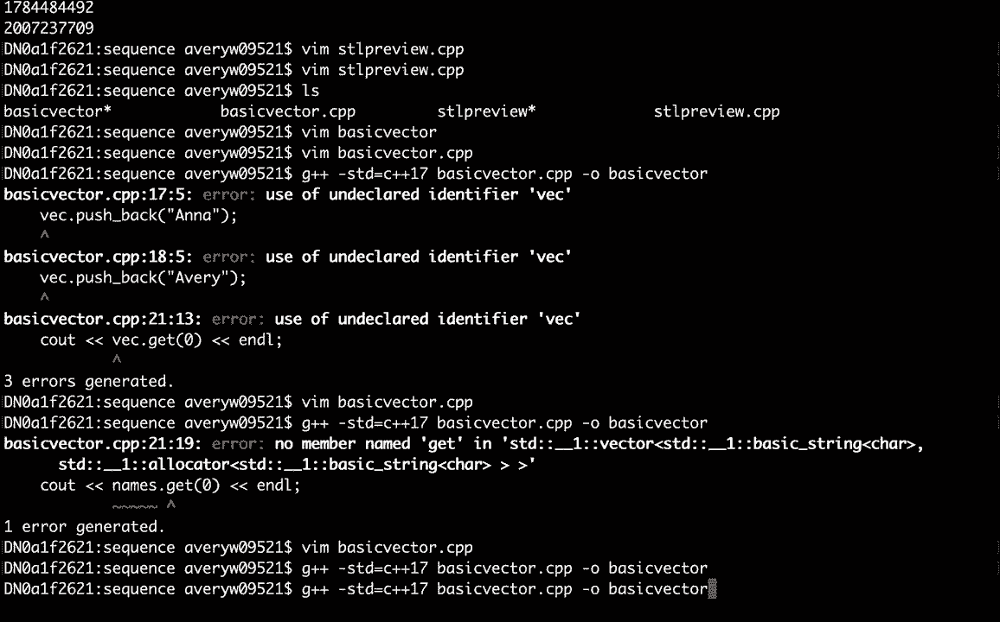

太棒了，所以我们再次看到，pushback 和 get，哦，对不起。

按预期的方式工作。好，那么现在我们可能会有一个问题，那就是如果我们尝试，在一个没有任何东西的索引上使用 at 会发生什么？所以，如果你在 106B 或 X 里试过的话，你会知道它抛出，的是什么。

那就是所谓的数组索引超出范围异常。那么，让我们用这个试试。我们使用 names。at2，这个索引应该不存在，因为目前程序。

中只有零和一这两个索引。

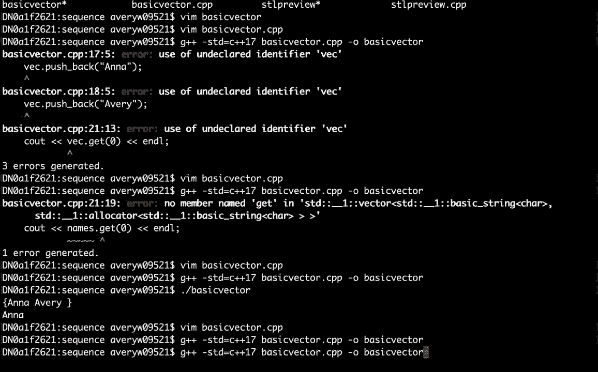

好的，所以事实证明，当我们使用 at 函数时，标准 C++ 的，做法与斯坦福库做的非常相似。我们得到一个超出范围的异常，如果我们愿意的话，我们可，以捕捉这个异常，并对其进行其他处理。

我们要强调的一个重要区别是，这个区别会让很多人在从，斯坦福切换到标准 C++ 时感到困惑，那就是注意有两种方，式来访问和存储向量中的内容。在斯坦福库中，你可以使用 names。get 或仅仅使用 。

names。bracket 符号。在 C++ 中，这两种符号仍然有效，names。at 和 ，names。bracket，但有一个关键区别在斯坦福库中是不存在，的。所以，如果我们尝试使用 names。

to，然后只是为了确认，我，们可以像这样说，嗨，我到了这一点。

结果 C++ 做的正是 Avery 之前谈到的那样。

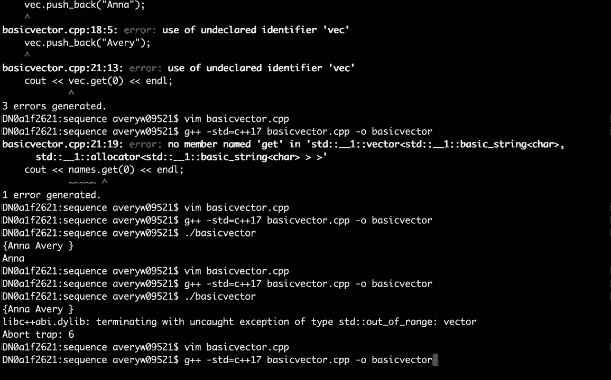

与斯坦福库抛出异常不同，当你超出范围时，C++ 不会这样。

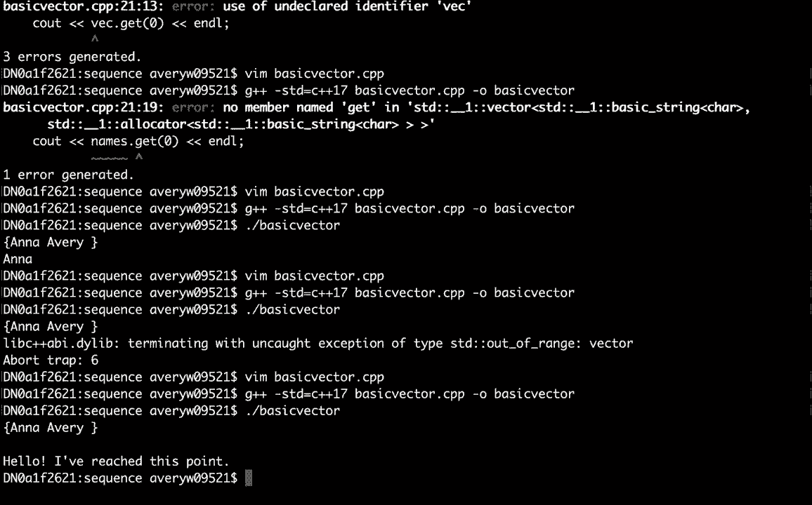

做，这是不应该发生的。再给我一点时间。这是正确的。它打印了补充会议。是的。实际上，这里。

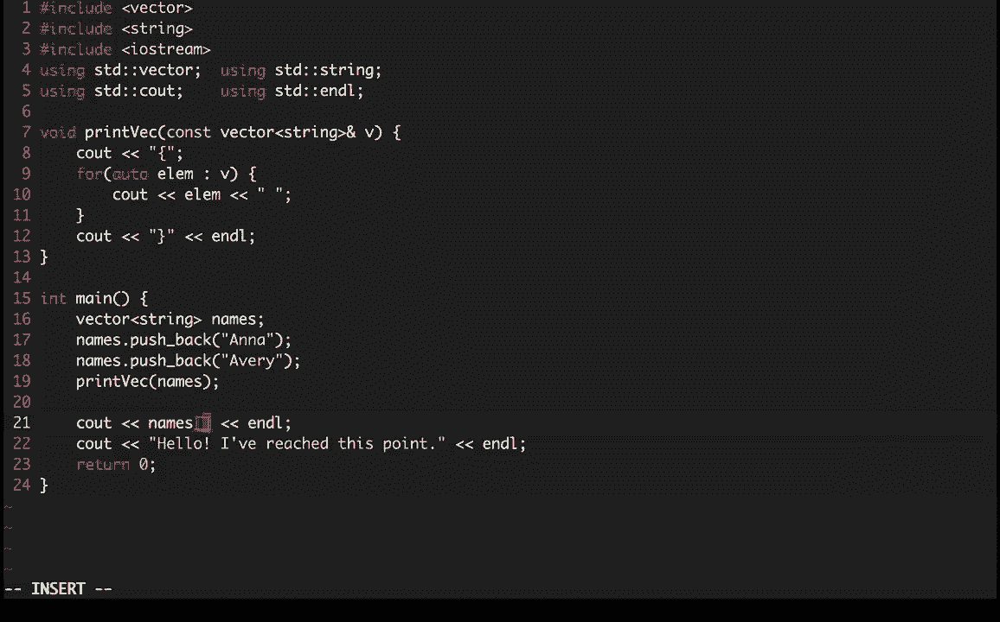

我们会更加小心。

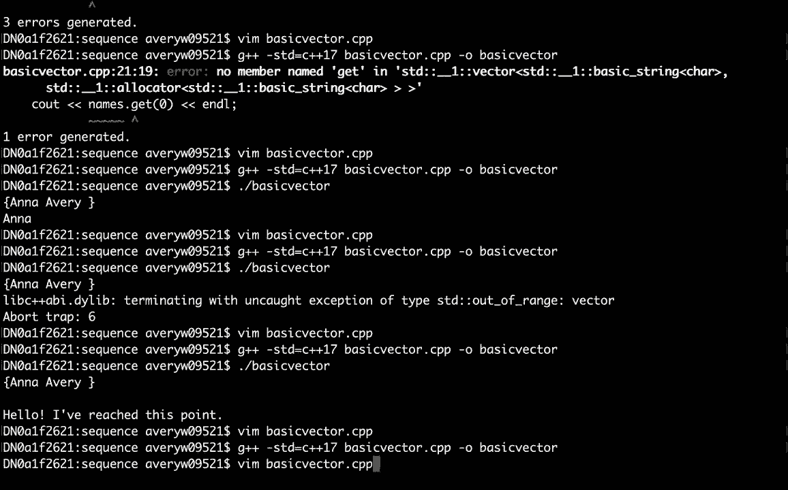

好的。所以，我会回去调试这个，但本质上标准 C++ 库中的 ，names。bracket 符号不会检查你是否超出范围，实际上，更，糟糕的是，它会悄悄地失败。所以。

类似于你们在 Avery 的直播讲座中看到的一些内容，它不会让你知道出了问题。即使在这种情况下，你也会注意到它实际上没有让你知道，实际上它不是向量的一个元素。我实际上对为什么这个会工作有些怀疑，但是的。

你们有问，题吗？这是一个很好的问题。那么，当你超出范围时，为什么不会出现所谓的分段错误呢，我相信这里可能发生的是。所以，不一定。分段错误会发生在你访问受保护的内存时，但在某些情况，下。

例如它是一个局部变量时，可能那段内存实际上是空闲，的。所以，你实际上是在获取垃圾数据。但的确，我会回去调试这个，不过从中得到的教训是。

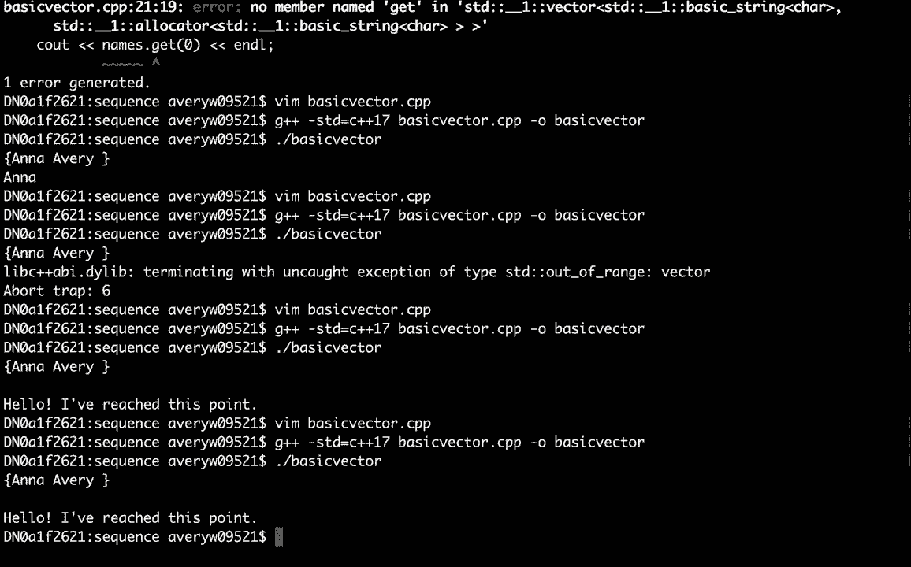

一个关键区别是，当你在标准 C++ 中使用括号符号时，要，知道你必须先检查是否在范围内，因为 C++ 不会为你告诉，你。好的，所以我想问你们一个问题，为什么 std 向量默认不，检查边界？

有人有快速的猜测吗？是的，在后面。如果你在检查这一点，或者如果你正确地设置你的东西，那，么你就不需要再检查它了。完全正确，C++，就是这样，完全对。所以，再次强调一下，C++ 真的不会手把手教你。

这在你想，做一些非常具体的事情时是很好的，因为你可以用它做很，多其他语言做不到的事情，但不好的地方是它不会告诉你，什么时候做错了。所以，是的，回到哲学上。是吗？

如果你使用括号表示法来设置向量的第400个元素，会发生，什么？比如，它会对中间部分做什么？是的，很好的问题。所以，事实证明，根据底层的实现方式，它实际上不会检查，中间部分。它所做的只是。

你可能会在107中学到更多，基本上是从开，始位置加400，然后只检查第400个元素，或者设置它。所以，当你遍历时，它会跳过所有的元素吗？所以，如果你遍历它，那将是另一个问题，因为你在尝试遍。

历一个不长于两个的向量。所以，你实际上是在遍历垃圾。是的，最后一个问题，然后我将继续。所以，这是否意味着括号表示法的运行速度会更快？没有人，或者实际上，Avery，你知道吗？我认为答案是肯定的。

我的意思是，因为如果你考虑一下边界栈在做什么，它实际，上就像一个if语句。是的，对，这是真的。所以，是的，括号表示法将少一个if语句。它不会，实际上，它不会抛出错误，而点表示法则会。括号表示法。是的。

完全正确。是的，在大多数C++代码中，你几乎不会看到有人使用点表，示法。是的，是的，不，实际上这是一个很好的观点。太棒了。好的，关于向量还有最后一件事。我相信Cynthia在106B中讲解过一个概念。

就是在向量的前，面添加一个元素。结果是，这个问题在C++标准向量中仍然存在。那么，有人可以告诉我，尝试在向量的前面添加一个元素与，在后面添加有何不同吗？有人知道吗？我们来讨论一下。

然后你必须移动所有在之后的元素。完全正确，他说的是，你必须移动所有在之后的元素。所以我们可以看到实际情况。如果我们想尝试移动七号，我们只需要在做之前将所有元，素向后移动。所以，是的。

这确实不是我们想做的事情。所以，事实证明，这也是一部很棒的电影。我认为，是的，如果你还没看过，《疯狂动物城》很棒。所以，事实证明，C++也考虑到了这一点，实际上构建了一个，很多人没听说过的数据结构。哦。

对不起，好吧，在我们做这件事之前，再次强调一下，何，时使用每种东西。你会发现，向量几乎总是正确的选择，因为向量是如此基础，以至于它非常快速、轻便、易于使用。然而，有时我们确实需要这种前插的额外能力。

所以，回到我的讲解，C++实际上发明了一种叫做双端队列，的数据结构。所以，双端队列，发音为“deck”，是一个双端队列。本质上，它只是一个具有这种高效地推到前面能力的向量，所以。

如果这个术语对你有意义的话，它实际上可以在常数，时间内推到向量的前面。我实际上会跳过双端队列是如何工作的，但可以在之后查，看幻灯片。本质上，它是其他固定大小数组的数组，这就是它能够不需。

要移动每个元素的原因。但是，是的，我推荐你回去查看幻灯片。你实际上不需要知道它是如何实现的就能使用它。这只是有点有趣。在 CS106B 中，你会在第六周或第七周学到更多关于它的，内容。哦，他们会这样吗？

是的。好的，是的，所以这有点酷。他们现在引入了双端队列。有时它会出现在考试中。啊，好吧，那很有趣。所以，你们现在有了一个提前了解的机会。所以，好吧，在我刚刚告诉你们的双端队列的描述中，它本。

质上是一个向量，但具有以非常高效的方式推到前面的附，加功能，可能会有一个自然的问题，那就是，我们为什么还，要使用向量呢？事实证明，就像生活中的一切一样，一切都是权衡取舍。所以，为了获得额外的速度。

双端队列在访问向量中的元素，时不如向量那么快。所以，像 names[i] 这样的操作在双端队列中的速度不如，在向量中快。所以，是的，实际上，我认为这有点酷。所以，我要给你们展示一个例子。

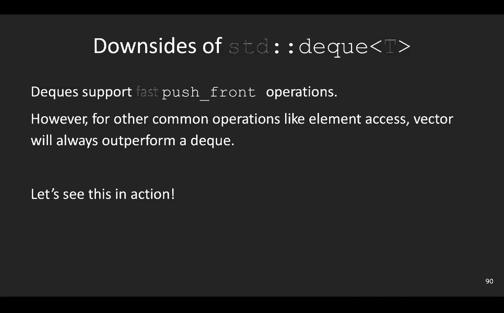

这实际上是为了强调向量和双端队列的不同优势，通过展，示时间来说明。所以，我们实际上可以。我明白了。我会为你们做插入操作。点击这里。点击它，是的，它会变成。哦，我明白了。是的，然后按运行。好的。

我们还想这样做，以展示我们实际上在使用 Qt Creator。命令行界面有点轻量级，但是。好的，所以这段代码是在向一个向量中插入大约一百万个，元素，并比较推到后面和推到前面的速度。

你可以看到紫色线代表推到前面，绿色线代表推到后面。所以，你可以从中看到向量实现推到后面和推到前面的速，度差异。这只是一个指示，哦，好吧，实际上，也许我们确实想要一个，特别专注于加快推到前面速度的东西。

所以，如果我们尝试使用双端队列。

是的，然后推到后面。是的。太棒了。再次，实际上是向一个双端队列中插入大约一百万个元素。

并比较推到后面和推到前面的速度。你会注意到推到。对不起，你会注意到。首先，你会注意到 y 轴非常小，而另一个的 y 轴上限大约，是 400 之类的。这个图表的推到前面和推到后面都在 20 的尺度上。

所以，这几乎快了 200 倍。是的。是的，很好的问题。y 轴的单位是毫秒。是的。是的。对于向量的情况，我想知道，为什么它不是完全线性的？啊，为什么它会呈指数增长？我意思是，它甚至不是指数增长。

我觉得这有点像是与你的问题在分段上有所不同。明白了。你必须遍历每一个吗？像，不应该直接根据元素的数量来进行吗？啊，所以，问题有点像是，为什么图的表现是那样的？我得再看一下图，但我的假设是图呈指数级增长。

因为随着，元素数量的增加，每次推送到前面，你每次都需要推送更多，的元素到后面。因此，它所需的时间应随着元素数量的增长而增加。指数级的二次方。是的，相同的概念。是的，明白了。所以，这再次向我们展示了，啊。

好吧，双端队列正在按预期，工作。它的插入尾部和插入头部都非常非常快。那么，最后，在我们的时间讨论中，为什么我们不总是使用。

双端队列呢？

嗯，因为如果我们尝试，这个程序将会比较向量和双端队列。

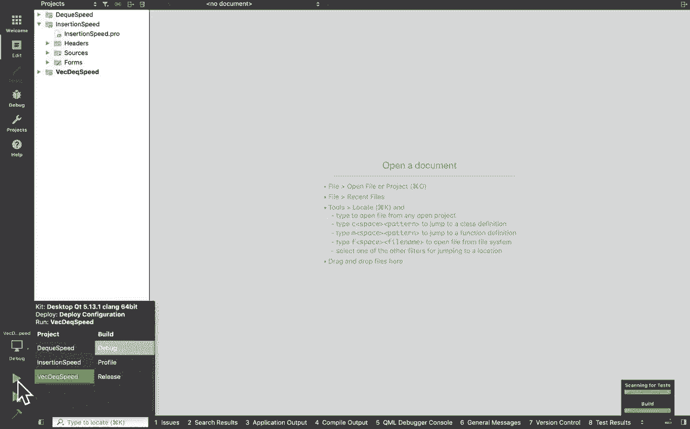

在插入，即访问向量或双端队列的元素时的表现。所以，在这种情况下，我们很快就会看到，你已经可以看到，它将要花费多长时间，我可以告诉你，花费长时间的原因是，因为双端队列。所以，再次，我们有一个向量。

这个程序告诉我读取该向量，或双端队列每个索引的值需要多长时间。哦，我明白了。对不起，你们，我实际上以为我去了五的地方。所以，之后，我会让你们离开，我可能会在周一抽出一些时，间来讲解最后几件事。提醒一下。

下一节课可能是整个学期中最重要的一节课。

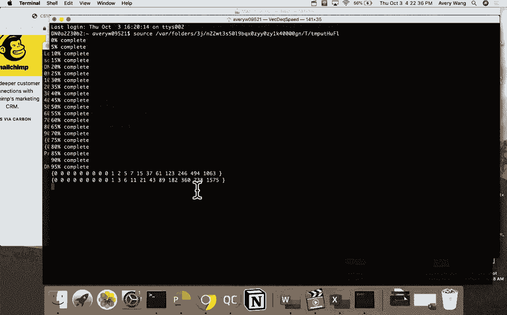

是的，再说一遍。在这种情况下，你可以看到我们在1500的数量级上，双端队。

列比向量访问要慢很多。所以，从中得到的结论应该是这样的。默认使用向量。当你真的只处理数据结构的前端或后端时，使用双端队列，太好了。课外问题。课外问题，并且作业已经在网站上发布了。祝你们好运。

我能问一个很快的问题吗？是的，问吧。所以，我今天刚来第一个课，并且我在Access上添加了它。除了复习以前的讲座和将自己添加到Piazza上外，我还需，要为我的课程做其他准备吗？是的，对不起。再说一遍。

除了将自己添加到Piazza上和查看讲座外，我还需要做其，他事情吗？这是个很好的问题。你应该已经准备好了。实际上，作业应该完全依赖于我讲解的内容。我们开始吧。哦，你们要离开了吗？我们必须出去。

但我们不想等到第二天早上再上课。

