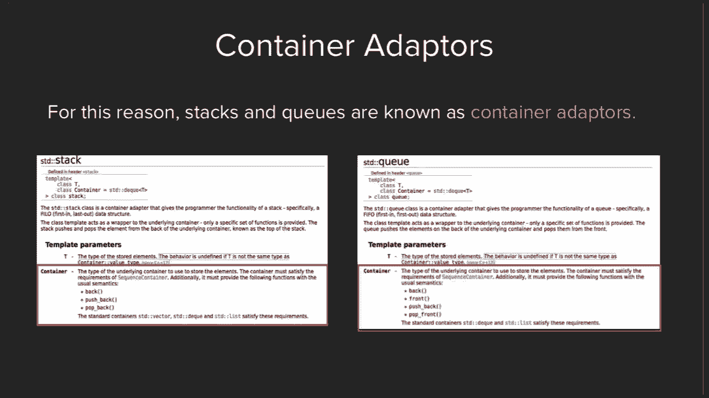

# 斯坦福大学《CS106L：C++编程》课程笔记 - 第4讲：关联容器与迭代器 🗺️➡️


在本节课中，我们将要学习C++标准库中两个核心概念：**关联容器**和**迭代器**。我们将了解映射（`map`）和集合（`set`）的工作原理，并探索如何使用迭代器来遍历这些非线性结构的数据。这是理解现代C++编程范式的关键一步。

***

## 课程回顾：序列容器与容器适配器

上一节我们介绍了序列容器（如`vector`和`deque`）以及容器适配器（如`stack`和`queue`）。本节中我们来看看另一种强大的容器类型。

***

## 关联容器简介

关联容器与序列容器不同，它们没有“索引”的概念。数据以**键值对**的形式存储，你可以通过一个“键”来快速访问其关联的“值”。


在C++标准库中，主要有四种关联容器：
*   `map`：存储键值对，键是唯一的。
*   `set`：只存储键，键是唯一的。
*   `unordered_map`：功能同`map`，但内部元素不排序。
*   `unordered_set`：功能同`set`，但内部元素不排序。


`map`和`set`在底层会根据键进行**排序**。这意味着如果你想用自定义的类（例如`Student`）作为键，你需要为这个类定义**小于运算符（`<`）**，以便容器知道如何比较和排序。




`unordered_map`和`unordered_set`不排序，这使得通过键访问单个元素通常更快，但遍历元素时没有顺序保证。


***

## 映射（Map）的核心操作

以下是使用`std::map`时需要掌握的几个核心操作和区别。

### 1. 访问元素：`[]` 与 `.at()`

使用`[]`（方括号）访问键时，如果键不存在，**会自动创建**该键并进行默认初始化（例如，`int`类型会初始化为0）。
```cpp
std::map<std::string, int> wordCount;
wordCount["hello"] = 1; // 如果"hello"不存在，会先创建
int count = wordCount["world"]; // "world"不存在，自动创建并返回0
```


使用`.at()`访问键时，如果键不存在，**会抛出异常**。
```cpp
int count = wordCount.at("hello"); // 仅当"hello"存在时安全
// 如果"hello"不存在，抛出 std::out_of_range 异常
```

### 2. 检查键是否存在：`.count()`

由于`map`中键是唯一的，`.count(key)`函数只会返回`0`（不存在）或`1`（存在）。因此，它常被用作隐式的布尔检查。
```cpp
if (myMap.count(someKey)) {
    // 键存在
}
```
> **注意**：在C++20中，引入了更直观的`.contains(key)`成员函数。


***


## 迭代器（Iterator）详解

迭代器是C++中用于**遍历容器元素**的通用工具。它提供了一种抽象的方法来访问容器中的元素，无论容器的内部结构如何（数组、链表、树等）。

### 迭代器的核心操作

可以将迭代器想象成一个指向容器中某个元素的“智能指针”。以下是四个基本操作：
1.  **获取起始迭代器**：`container.begin()` 返回指向第一个元素的迭代器。
2.  **解引用迭代器**：`*iterator` 获取迭代器当前指向的元素的值。
3.  **移动迭代器**：`++iterator` 将迭代器移动到下一个元素。
4.  **判断结束**：`iterator != container.end()` `container.end()`返回的是“尾后迭代器”（最后一个元素的下一个位置），用于判断循环是否结束。


### 使用迭代器遍历容器


以下是使用迭代器遍历一个`std::set<int>`的两种常见方式：


**使用while循环：**
```cpp
std::set<int> mySet = {1, 2, 3, 4};
std::set<int>::iterator it = mySet.begin(); // 1. 获取起始迭代器
while (it != mySet.end()) {                 // 4. 判断是否结束
    std::cout << *it << std::endl;          // 2. 解引用获取值
    ++it;                                   // 3. 移动到下一个元素
}
```

**使用for循环（更常见）：**
```cpp
for (std::set<int>::iterator it = mySet.begin(); it != mySet.end(); ++it) {
    std::cout << *it << std::endl;
}
```
C++11引入了更简洁的**范围for循环**，它在底层自动使用迭代器：
```cpp
for (const auto& element : mySet) {
    std::cout << element << std::endl;
}
```

### 为什么迭代器如此强大？

迭代器的真正威力在于其**通用性**。同一套迭代器逻辑可以应用于`vector`、`list`、`set`、`map`等几乎所有容器。这使得我们可以编写与容器类型无关的通用算法。

例如，一个计算容器中某个值出现次数的函数：
```cpp
template <typename Container, typename T>
int countOccurrences(const Container& container, const T& value) {
    int count = 0;
    for (auto it = container.begin(); it != container.end(); ++it) {
        if (*it == value) {
            ++count;
        }
    }
    return count;
}
// 这个函数可以用于 std::vector<int>, std::list<std::string>, std::set<double> 等等。
```
这为下一讲要学习的**模板**和**泛型算法**打下了坚实的基础。

***

## 课程总结与作业提示

本节课中我们一起学习了：
1.  **关联容器**：`map`和`set`用于存储和通过键快速访问数据。理解了`[]`和`.at()`访问方式的区别，以及如何使用`.count()`检查键是否存在。
2.  **迭代器**：作为遍历容器的通用“指针”，掌握了其四个核心操作（`begin`, `*`, `++`, `end`），并理解了其实现通用算法的强大能力。


**关于作业1的提示**：
*   作业中会用到类似讲座中展示的`getline`函数来处理用户输入。
*   作业规范较长，但实际需要编写的代码量并不大。请仔细阅读“建议、技巧和窍门”部分。
*   本作业要求使用**标准C++库**，而非斯坦福库，以熟悉工业级编程环境。
*   合理使用**常量**（如`PI`）和**分解函数**来保持代码清晰。
*   助教办公时间已公布，遇到问题请随时在Piazza上提问或参加办公时间。


***


> **下节预告**：在掌握了容器和迭代器之后，我们将进入C++最强大的特性之一——**模板**，学习如何编写真正通用的代码。