# 斯坦福大学《CS106L： C++编程｜ Stanford  CS106L C++ Programming 2019+2020》中英字幕（豆包翻译 - P6：[3]CS 106L Winter 2020 - Lecture 6_ Advanced Iterators and Containers - GPT中英字幕课程资源 - BV1Fz421q7oh

今天你有没有提到无效的迭代器？

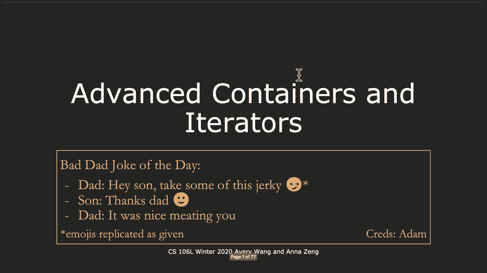

不用担心。如果最后有时间，也许我们可以提一下。否则，我下次开始讲。我会举一个快速的例子，比如说，假设你正在从一个向量中，移除东西。

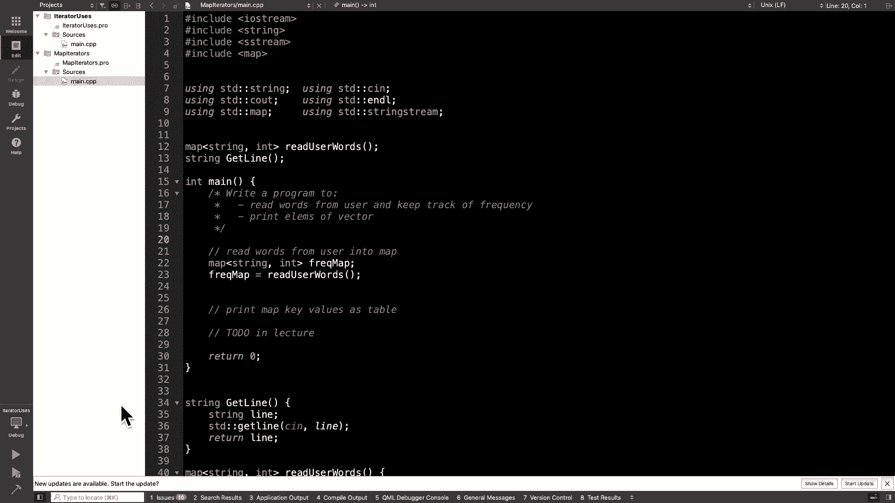

几英里之外，对吧？

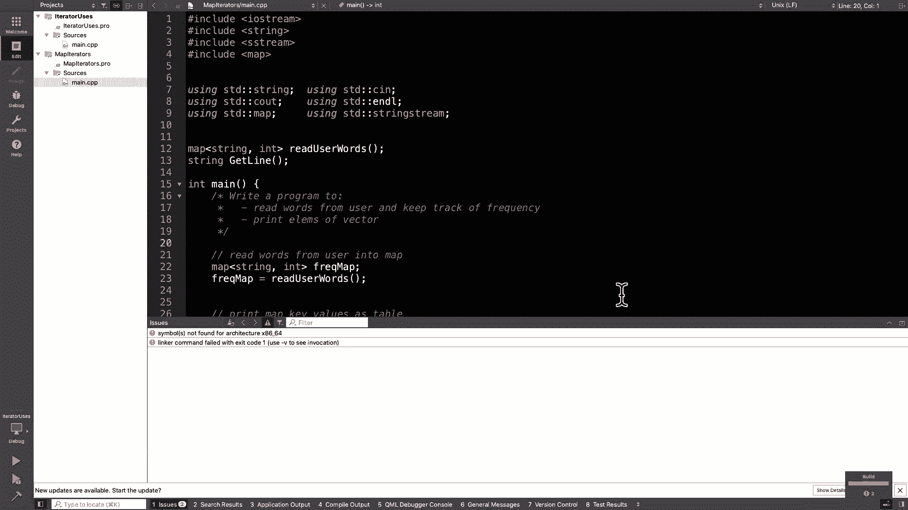

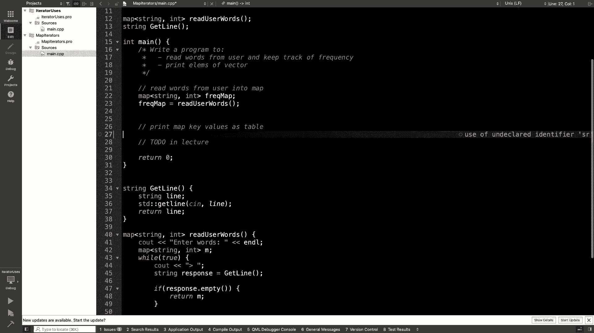

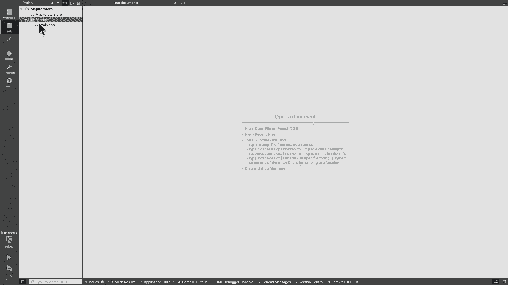

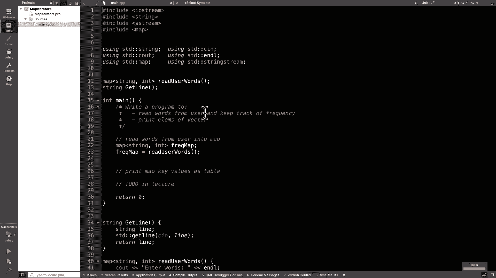

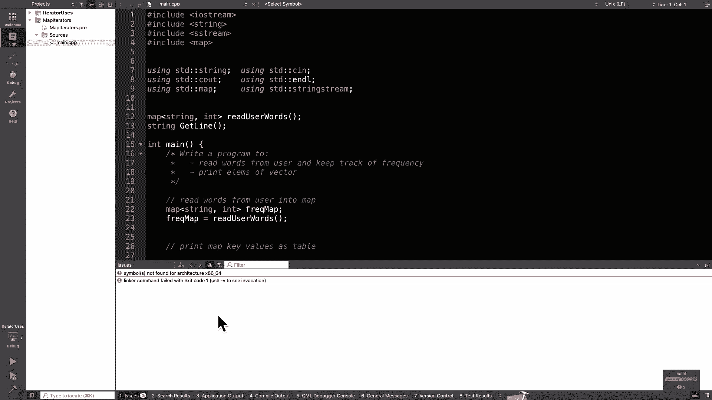

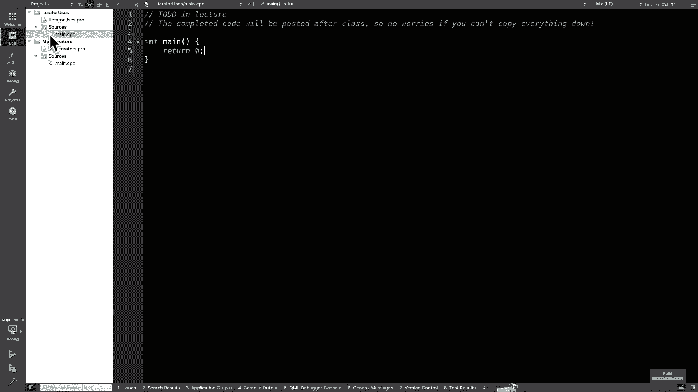

好的。好的，现在是1：30，我们开始上课，没有显示问题。感谢我们可爱的Avery。所以，今天的计划是我们将结束STL的前两部分。我们将完成容器和迭代器的部分。然后最后的两部分。

仿函数和Lambda表达式，我们实际上会，在下一次讲座后讨论。下一次讲座，我们将讨论模板，这实际上是STL中所有不同，部分的结合点。首先，回顾一下上次的内容，关联容器。到目前为止。

我们讨论了像向量或双端队列这样的顺序容，器。在上一次讲座中，我们讨论了像映射或集合这样的关联容，器。区别在于，关联容器不是按序列存储数据，而是将某种键数，据与某种值数据关联起来。因此。

我们对映射和集合使用相同的熟悉语法。然后，我们上次还学习了迭代器的概念。再次强调，迭代器的语法实际上归结为这四部分。那么，有人能告诉我我们怎么创建一个迭代器吗？

我们上次学习到的创建迭代器的一个函数是什么？有人记得吗？如果没有，我给你们讲第一个。我们还在重新进入状态。是的，我们创建迭代器的传统方法涉及调用容器的。begin，函数。在这种情况下，请记住。

迭代器的类型实际上是逻辑上的，std：set<int>：iterator，迭代器的名称。然后，为了创建迭代器，我们在这种情况下使用。begin。还有其他方法可以创建迭代器，比如我们也看到的。end函。

数。我们今天稍后会看到从这两个函数创建迭代器的方法。谁记得我们如何引用一个迭代器？是的，说吧。星号，完全正确。非常好。如果你对指针比较熟悉，这可能看起来有些相似。

我们实际上会在今天讲座的最后讨论指针和迭代器之间的，区别。所以请记住这一点。但是确实，通过解引用迭代器，它会跟随这个迭代器的指向，并读取迭代器所指向的值。Avery在上次讲座后想出了一个很好的比喻。

就是如果你看，过《玩具总动员4》，或者即使你没有看过，你也知道有一，个爪子机去捡不同的物品，这实际上就是迭代器。你可以把迭代器看作是那个爪子，然后解引用它就像让它，去捡起物品并把它带回给你。

如果这对你有帮助，所有的功劳都归于Avery Wong。我只是想提一下，我还花了很多时间放了一个电影片段。这是真的。也许在课结束时我们会有时间。下次吧。下次。迭代器的进阶。所以类似的语法。

我们可以使用 iter++ 或 ++iter。再次，这被称为后缀和前缀操作符。当它们单独使用时，就像一行代码，实际上这两者是等效的，但事实证明，++iter 略微更快，因此在 C++ 风格中，我们。

传统上倾向于在没有区别时使用它。最后，我们如何与另一个迭代器进行比较？事实证明，我们可以使用等于等于和不等于比较符号。我们最常比较的一个东西，特别是在处理循环时，是这个 ，container。

end 函数。这感觉很熟悉吗？有人有问题吗？好的。那么为什么迭代器这么酷呢？我会在接下来的几张幻灯片中讨论这一点，并提醒我们为，什么。所以再次，这就是如何使用迭代器的语法。但迭代器实际上做的事情。

你可以把它们想象成是将任何，形式的数据表示，不论是向量、集合、还是云，迭代器让我，们可以在代码中将这种数据表示视为线性数据集合，这意，味着它会始终保证以相同的顺序输出，并且进一步地，根据。

我们提供的某种排序函数，它会以排序的顺序输出。再一次，我在课程的最后提到过这一点，这真的很酷，因为，这意味着当我们有一个单一的逻辑概念，比如排序数据集，合时，之前在了解迭代器和下节课的模板之前。

我们需要为，这些不同类型的容器分别实现排序函数，因为向量的存储，方式与集合的存储方式不同。所以为了能够排序，你需要了解它们在底层的工作原理。但迭代器允许我们这样做，它们给我们提供了这个语法，就。

是这个 for 循环，它让我们说，无论我传入什么容器，我知，道那行代码总是会有效，因为迭代器在我们学过的每个容，器中都能工作。所以为了演示这个函数，它做的事情是取一个元素并计算。

它在那个数据结构中出现的次数。在这个案例中，它计算一个元素在向量中出现的次数。在这个案例中，它计算一个元素在链表中出现的次数。在这个案例中，它计算一个元素在集合中出现的次数，依此，类推。请注意。

唯一改变的是类型，逻辑没有变化。所以当我们学习模板时，我们会看到我们甚至不需要改变，类型，这有点疯狂，但那将是下节课的内容。太棒了。是的。有人对基本的迭代器有任何问题吗？今天我们将学习更多。好的。

我看到一些人摇头了。那很好。好的。在我们进一步探索之前，到目前为止，我们仅仅在数据结构，的开头开始，然后“++”直到到达结束。当然，你可能已经知道迭代器实际上有更多的用处。所以今天我们将探索这些。

另一个我们要提到的有点棘手的细节是 map 迭代器。所以到目前为止，或者好吧。在我们深入探讨之前，我们想重新介绍一下这个类。Avery 在他类型讲座的最后提到过这个类，但我们会再讲，一遍。

因为那时讲得比较快。我们之前引入这个的背景是，当我们想从一个函数中返回，多个东西时，我们以前除了通过引用传递然后在函数内修，改之外，没有其他方法。但现在有了所谓的对，我们可以返回一对东西。例如。

如果我们有一个名为 time 的结构体，那么在一个函，数中，我们可以在返回语句中同时返回小时和分钟。到目前为止，这就是对的用途。在语法上，声明它的方式就像声明其他 C++ 类一样。std 对。

两个对的类型，然后你可以使用 p。first 和 ，p。second 来访问和设置值。

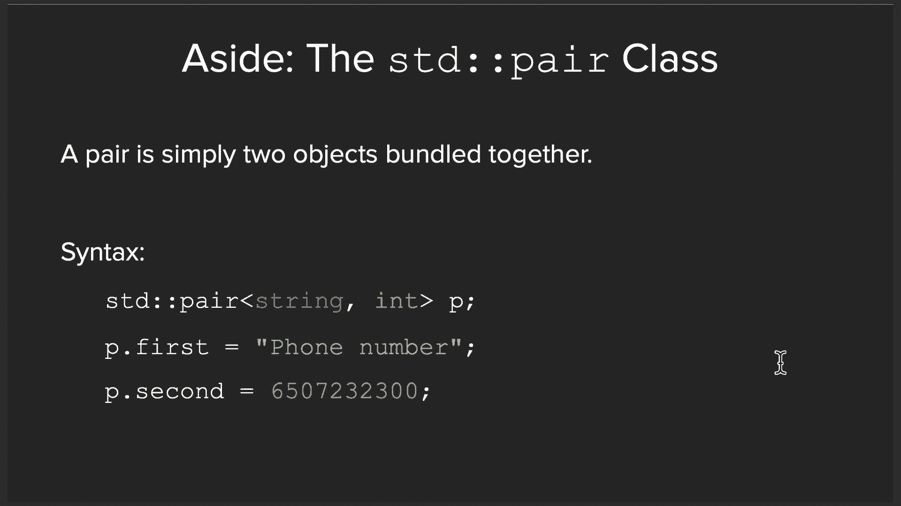

你可能见过这个。啊，结果是，我在做这个示例时。我查了一下，哦，斯坦福大学的电话号码是多少？斯坦福大学确实有一个电话号码。我不知道那是什么意思。但如果你碰巧打电话过去，我很想知道会有什么结果。

是 Leland Stanford 吗？

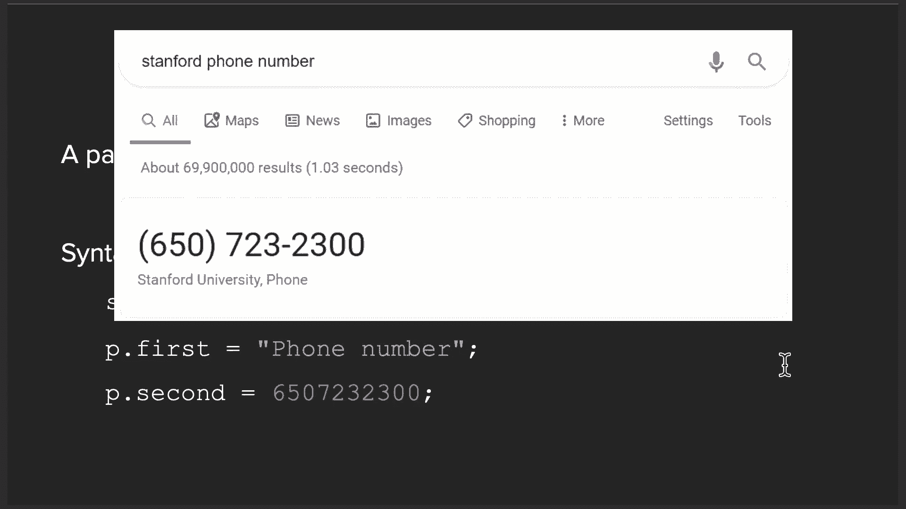

是校长吗？谁知道呢？好吧。其实还有几种其他方式可以创建对。我们传统上学到的一种是上面提到的统一初始化。实际上，还有一种创建对的方法，叫做 createPair。这两者之间的区别有点微妙。

但却是关键的区别，即使用 ，createPair 时，你不需要提前知道类型。这在我们开始处理像模板这样的东西时非常有用，因为我，们不会提前知道类型。所以有两种不同的方式来创建对。

这也是 auto 关键字非常有用的地方之一。把所有这些概念带入之前的讲座中。还有另外一点要提到。在上一讲中，我提到过多重映射的概念，再次强调，我们在，考虑关联容器时可以更改三种不同的特性。

我们有映射、集合。我们有无序映射、无序集合。我们有多重映射、多重集合，然后是无序多重映射和无序，多重集合。所以，随时可以去探索一下。但要记住，多重映射是允许具有相同键的多个条目的映射，通常。

映射和集合只允许每个键有一个实例。它们不允许有重复项。多重映射允许，但这实际上给我们带来了一些奇怪的语法，问题，因为这意味着我们不能真正拥有逻辑上的括号操作，符或点操作符，因为它们想知道返回哪个值。

所以，相反，我们将元素插入多重映射的方式是使用对。这又是 make pairs 非常有用的另一个例子。在这种情况下，它会自动推断 3 和 3 是整数，并正确插入，这是另一种将内容插入多重映射的方法。

这实际上不是一个对。这是一个被称为初始化列表的东西。所以如果你看到错误中出现初始化列表一词，你现在应该，知道它指的是什么。那么，现在的关键是，对于映射和集合，点计数函数总是返，回 0 或 1。

正如你们在上一节课告诉我的那样。在这种情况下，对于多重映射，它现在可以返回大于 1 的，值。很酷，所以我们回到映射迭代器。再次提到这种边缘情况，它们实际上与其他迭代器和容器，略有不同。

因为其他迭代器在解引用时，它们会给你一个单，一的对象，比如一个整数向量。当你解引用一个迭代器时，它会给你一个 int，依此类推。解引用映射是一个特殊情况，它实际上给你一个对。

所以你使用映射迭代器的方法是这样的。所以我们可以像往常一样，使用我们的 begin 和 end 来，声明它。注意，我们再次使用不等于进行比较，并使用加法运算符进，行递增。这里唯一的不同是。

当你解引用它时，你不能立即使用它。你必须使用点 first 或点 second，其中点 first 对应于，第一个 int 值，点 second 对应于第二个。大家明白了吗？有人有问题吗？好的。

还有一件事我想强调的是，这些括号的放置非常重要，因为运算符优先级的方式，即 C++ 执行不同运算符的顺，序。如果没有括号，它会尝试计算 I。dot first，然后解引用它。

但是 I 在这种情况下只是一个迭代器，所以没有点 first， 或点 second 的概念。有趣的是，另一种常见的语法是 I->second 或 I->first，这是这种括号解引用点的简写形式。

随着你上 107 课程和其他课程，这些都会变得越来越熟悉，因为它们与指针的语法是一样的。是吗？所以这基本上是打印出每一种语法？是的，绝对是。这是一个很好的翻译。

所以这个示例的作用是打印出映射中的每个键和值。是的，非常好。按键的排序顺序。太棒了。酷，所以给大家一个迭代器有多酷的预览，这里有更多的用，途。到目前为止，我们只是打印出整个数据结构中的所有值。

所以看看我们还可以做些什么。啊，哎呀，其实在此之前，我忘记放这个幻灯片了。这只是一个关于映射迭代器的简要示例。所以再一次，这个示例是我们用上次的相同示例。你会注意到我们有我们的 get line。

我们正在读取响应，并创建一个映射，统计每个单词出现的次数。上次，我们只是访问映射，查看是否存在。这次我们要做的是类似的事情。我们要做的就是打印出映射中的所有内容。这将正是那个讲座幻灯片所示的内容。所以。

这将是类似于，我们需要做的第一件事是创建一个到，开始的迭代器。所以这将是类型迭代器，类型 begin 等于，再说一遍。是的，谢谢，谢谢。非常好，确实很棒。是的，抓得很好，抓得很好。然后再次说一下。

我们可以有两种方式来做这个。我会这样做。所以假设当它的迭代器不等于 freak map 时，我们要做的，就是 cout。再一次，这只是演示我们必须先使用这个点。所以 cout dot first。

 second，然后完美。所以我们来试试运行它。你们很棒，真是好捕捉。非常感谢。哇，天哪，你们真是太棒了。我甚至不能开玩笑说这是故意的，因为那真的很棒。好的，那么我们来做点这样的事情。完美。

它完全如你所料的那样。所以我主要把这个放在这里，以便你们可以自己玩弄程序，但到目前为止，有人对这方面有任何问题吗？关于映射迭代器？很好。哦，Avery 有个问题。

你能对多重映射进行基于范围的 for 循环吗？是的，你能对多重映射进行基于范围的 for 循环吗？对多重映射还是普通映射？对普通映射。是的，绝对可以。所以再次说，就像上次一样，我们可以。

代替使用迭代器对，整个映射进行 for 循环，现在我们可以对映射做同样的事，情，只需用 for， 在这种情况下，映射中每个元素的类型实，际上仍然是一个对。所以这是一个字符串和整数的对。

但这样输入有点麻烦，所以我就写 auto。所以对于 auto 元素 在频率映射中，我只想做的是 cout，在这种情况下，再次因为元素是一个对，你仍然需要调用 ，sort 的 lm。first 和 lm。

second。如果你尝试仅仅 cout lm，我不记得会发生什么。它要么抛出错误，要么打印出默认的对。所以我们来看看。

试试这个。完美。

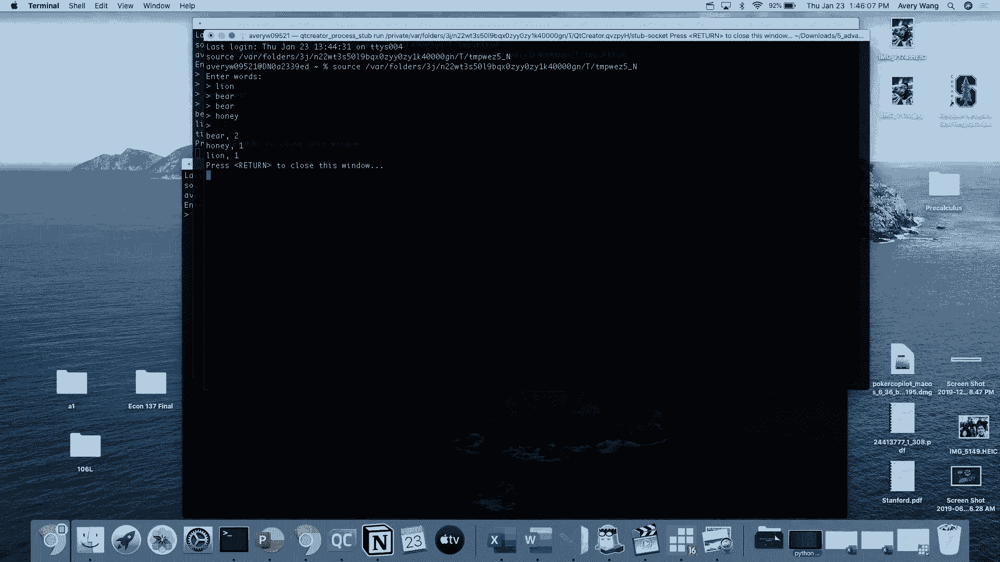

好的。实际上，这是一个很好的点，因为它回到这一点，即我们实，际上不需要迭代器，那我们需要迭代器做什么呢？所以让我们探讨一下迭代器的使用。我实际上是几周前才学到这个的。你实际上可以在里面使用结构化绑定。

在 auto 内部。哦，是的。所以结构化绑定 key， val，然后 cout。

key 和 cout， val。

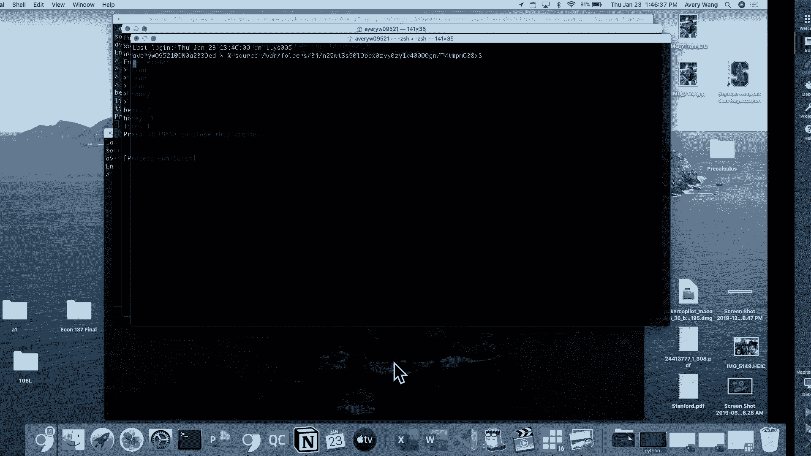

非常酷。

是的，因为我知道反复输入 item。first， item。second 非，常麻烦，所以你可以直接在 for eq 内部解包它。是的，这实际上是一个很好的点，也是对的的一个很好的特，性。很好。好的。

好的，所以我想在这次讲座中做的另一件事就是给你们一，个从头开始编写程序的感觉。在这种情况下，我们的程序不会做太多的事情。它只是做几个不同的示例，但这样你们可以看到你们可能，自己如何去做。

所以我们首先要做的，当然，我们基本上要做的三件事就是，对向量进行排序，找到一个元素，比如从集合中，然后我们，会看看接下来该做什么。我们会看看我们想做什么。所以我们来声明我们自己的向量，一个向量，当然。

如果我，们想声明一个向量，那么我们需要导入向量类。所以我们要包含向量，然后因为我不想在任何地方都写 ，std vector，我会说使用 std vector。很好。所以现在假设我有一个整数向量。

再次使用统一初始化，所，以我可以做，比如随机数，然后看看。好的。所以让我快速定义一个叫做 print vector 的函数，它将，接受某种向量。所以记住，你应该在106B课程或其他课程中学到的，因为我。

们传递的是一个比 int 或 bool 更复杂的数据结构，我们，总是想通过引用传递它，在这种情况下，因为我们不会改变，向量，我们将通过常量引用传递它。所以传递一个事件，然后我们可以做我们通常做的。

即对每，个 B 中的元素使用 for auto，输出该元素，然后我再输出，一次，或者实际上。另外，我会在课堂后发布所有这些代码，所以不用担心如果，你没有全部输入。好的，所以现在我们注意到几点。首先。

cout 和 endl 产生了问题，当然，因为我需要包含 ，iostream 类，它包括这两个。所以 iostream，再次，我可以在使用它们的地方说使用 ，std cout，但那样有点烦人。

所以我会改为使用 std endl，很好，到目前为止没有抱怨。好的，所以要排序一个向量，真正的关键是，实际上在这里。

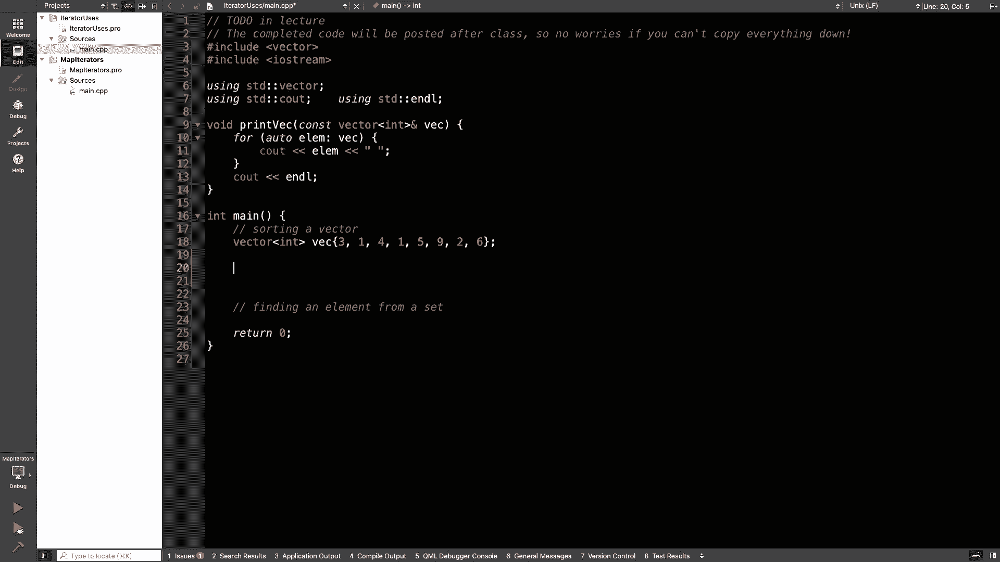

我们可以测试它是否已经正确排序。迭代器之所以有用的关键原因是它们如何与函数、函数对。

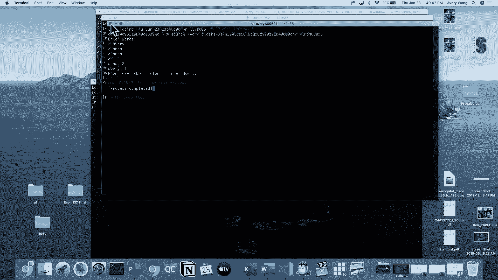

象和算法等一起工作，我们实际上将在下一节讲座中深入，探讨，但这些是你将会经常使用的一些基本算法。所以让我将其更改为迭代器使用，然后很好。它打印出了我们期望的结果。经典示例之一是被称为排序算法的东西。

所以 STL 中的所有这些算法都位于算法类中，除了其他几，个在 numeric 类中，与数字有关的。但在这种情况下，你如何使用算法？它是一个叫做排序的算法。所以你可以在这里看到。

它实际上会告诉你它期望的参数，在这种情况下，它期望的是一个第一个迭代器、一个第二，个迭代器，然后是比较函数。所以我们会做的就是，当然，我们想排序的是整个向量，所，以 vector first。

vector end，然后我们将使用默认比较。

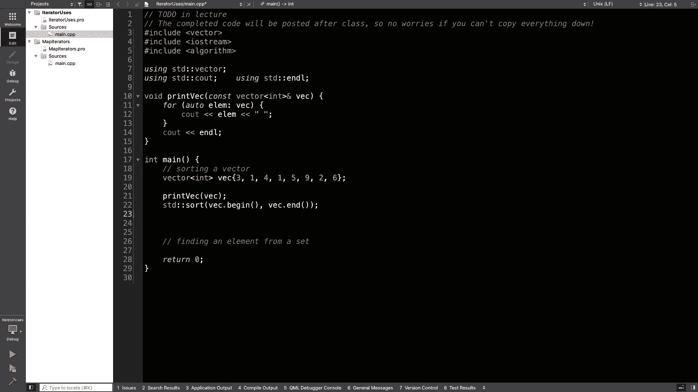

它会根据类型自动确定。所以让我们尝试一下，看看会发生什么。

很好，我们看到它已经排序了。这有点疯狂。

如果你记得，如果你在两节课前在这里，我展示了传统排序，与使用排序算法之间的区别，它将复杂的代码大约 10 到 ，15 行简化为这个算法。我们稍后会详细讨论，但 STL 算法已经优化为尽可能高效。

的排序算法。所以这就是我们从使用这些东西中获得的另一个好处。好的，所以如果我们想从集合中查找一个元素，让我们做同，样的事情。所以我们会做一个整数集合，再次，如果我想使用集合，那。

么我知道我必须包含集合库，并且我也不想到处输入 std ，set，所以我会直接使用 std set。请注意，这里我只输入了 std sort，因为我只用了一次。所以让我们看看。我们称之为元素。

然后我们将做同样的操作，3、1、4、1、，2、6。快速问题。你预计这个集合的大小是多少？多少人认为它会是一个大小为 8 的集合？多少人认为它会是一个大小为 8 的集合？好的。

多少人认为它会是一个小于那个的集合？好的。你认为它会是什么大小？你就在那儿。戴眼镜的你叫什么名字？哦。我想知道他的名字是有帮助的。哦，对。你叫什么名字？是的。再说一遍？你？好的，你。是的。

你期望它是什么大小？啊，正好。是的，完全正确。这有点棘手的问题。这只是为了展示，即使你用重复的元素初始化它，一旦创建，集合，它总是会移除这些重复的元素。所以我们可以看到 lms。size。

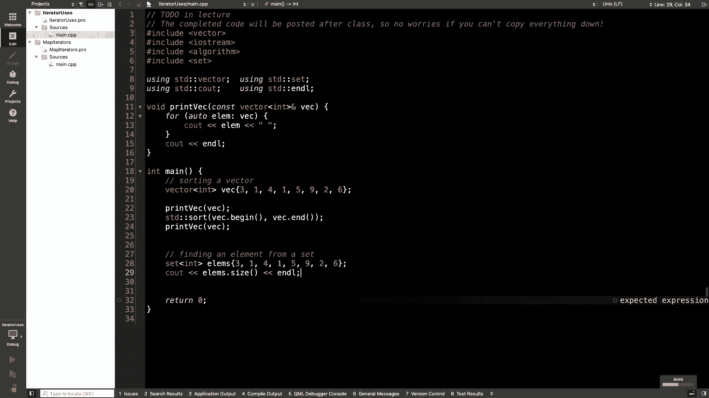

太棒了。好的。所以排序，是一个很常见的操作。另一个你会看到的非常常见的算法是，假设我们要查找元，素 5。实际上，上次我们确定一个元素是否在集合中的方法是使，用这个函数 lms。count。

然后它会打印出，好的，它在那个集合中找到了 1 次。我们实际上可以使用迭代器做同样的事情。这将会是这样，即再次使用这个来自算法类的 std find ，函数。在这里我们看到它需要一个第一个迭代器。

一个最后的迭，代器和一个值。所以，好的，我们的第一个迭代器将是 lms。begin。我们的最后一个迭代器将是 lms。end。然后我们要查找的值是 lm。find。

当我们说为了好的风格在赋值中使用像常量这样的东西时，这就是你将会使用的，像这样的全局常量。完美。所以如果我们然后打印出来，比如说，如果我们使用 find ，函数的方式是。

它将返回一个指向集合中那个元素位置的，迭代器，或者如果没有找到则返回结束迭代器。所以我们会说，让我们看看，如果 auto test test 迭代器，等于那样。所以如果测试迭代器等于 lms。end。

那么我们知道它不在，集合中。所以我们 cout 没有找到，否则。如果它在集合中，那么我们将 cout 找到了。然后我们将解引用测试迭代器。

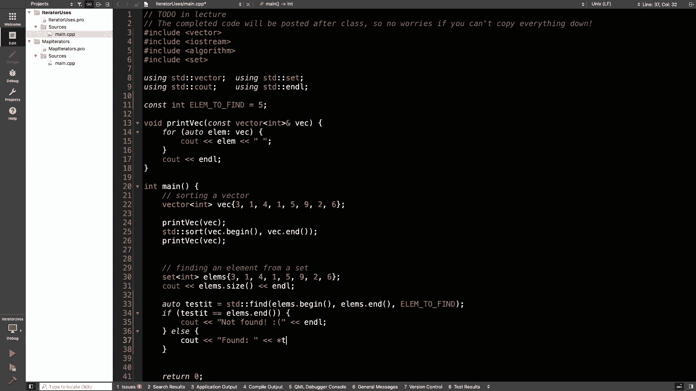

所以让我们看看它是否正确地执行了。

哦，完美。并且它说找到了 5，它确实在集合中。

而 lms 大小是 7。是的，那是什么？是的，这是一个很好的问题。确切地说。所以 lms。end 实际上并不指向集合中的任何东西。它指向最后一个元素加一。所以它在集合之外。非常好的问题。是的，是的。

到目前为止还有其他问题吗？我想指出的一件事是使用这些常见函数的便利性。比如排序，查找。好的。我想展示的最后一件事是迭代器的多功能性。到目前为止，我们总是遍历整个向量或整个集合。所以这里的一个方法是。

我们可以通过像 vector。begin ，然后 vector。begin 加三来仅对前面三个进行排序，而不，是使用 vector。begin 或 vector。end。所以我们现在实际上来看一下这个。

所以我们不如对前四个进行排序。

然后我们将剩下的部分保持不排序。很好。看起来只有前四个被排序了，剩下的四个保持不变。

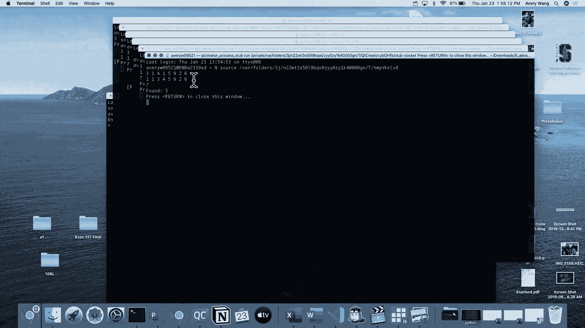

我们还可以做的另一件事是，即使在迭代一个集合或类似，的东西时，我们也可以使用，可以实际迭代数据结构的范围，而不是整个数据结构。所以你可能会这样做，比如取一个整数集合，然后创建一些，新的迭代器。

我们来看一下。这有一个函数叫做 lower bound 和 upper bound。lower bound 和 upper bound 的工作方式是，lower 。

bound 找到的是与给定元素相等或更大的元素。所以在这种情况下，它会找到 4，因为 4 是与 4 相等或更，大的最小元素。在 upper bound 函数的情况下，有点误导。

听起来它应该做一些类似的事情。抱歉。听起来它应该做一些与 lower bound 相反的事情，但实际，上它做的是非常类似的事情。所以与 lower bound 不同的是，我们来做六。所以。

lower bound 会找到大于或等于传入元素的最小元，素，而 upper bound 会找到严格大于传入元素的最小元素，所以这有一个小差别。可能会稍微让人困惑，所以你可以多想一想。但我们可以。

打印一下，看看。我们的开始将是那个数字。然后我们的结束将是 end 元素。然后我们可以从这里做之前我们会做的所有事情。所以这是 where the for loop。

即不是 for each loop ，实际上很有用的地方。因为使用 for each loop 时，它会自动遍历整个容器。当我们使用普通的 for loop 时，我们可以控制要遍历容，器的哪些部分。

所以在这种情况下，我们会有某种 iter。注意，由于我们已经声明了它，所以在 for loop 的第一个，语句中不需要初始化它。所以它实际上会是空的。第二个将是当它不等于结束迭代器时。最后。

我们将递增我们的迭代器。然后从这里，我们可以 cout，看看，cout 迭代器。

所以我们看看这会做什么。很好。所以注意到在这个集合中，它做了什么，就是找到 4 的 ，lower bound，结果是 4，然后找到 6 的 upper bound，结，果是 9。

因为 9 是严格大于 6 的最小数字。

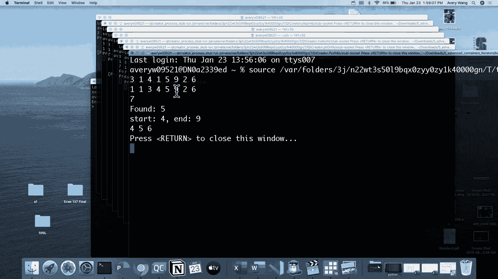

然后在打印出来时，它从不包括最后一个迭代器。所以在这种情况下，它会打印出 4、5、6。所以挺酷的。现在有很多不同的方式来操作你的数据结构，无论数据结，构是什么。

我们本可以轻松地用 vector 替换 set，所有这些代码仍，然会有效。所以这就像是建立我们的工具箱。然后当我们谈论函数和算法时，我们将真正了解这些工具，已经如何被使用的常见方式。

太棒了。所以再次回顾我们做了什么，我们使用了排序算法。我们使用查找功能找到了一个元素。请注意，我们上次讨论了类似的内容。所以上次，我们讨论了使用计数方法来查找键是否在数据，结构中。在这种情况下。

再次使用映射集合，它只会返回0或1。所以如果我们检查它是否等于0，那么我们就知道没有找到，结果是还有另一种方法来确定一个元素是否包含在映射集，合中，那就是使用这个查找功能，你们现在知道这个，因为。

你们知道迭代器是什么以及它们是如何工作的。所以这是检查是否找到某物的另一种方法。它看起来有点长。结果是查找实际上比计数稍微快一点，因为计数是使用查，找来实现的。所以如果你非常在意这个差异。

你可以随时使用查找。即使它看起来更长，但实际上稍微快一点。当然，最重要的一点是，在C++20中，你将不必担心这些，因，为他们终于推出了一个被称为包含键的方法。太棒了。最后，我们讨论了迭代器范围。

所以使用像下界或上界这样的函数来隔离你数据结构中的，范围，在你的排序数据结构中。作为参考，你会注意到这里的迭代器和结束都有下界和上，界或下界调用。这些调用在数学中是等效的。所以如果你想说。

从5到26（包括26），那么你需要为你的开，始和结束使用下界和上界等等。这不是特别重要，但作为一个好的参考，因为这些在脑海中，思考起来可能会有点棘手。是的，继续吧。是的。

这就是斯坦福库和标准库之间的区别。所以在106B中，106B的映射确实有一个包含键的方法。是的，所以这两个实际上是斯坦福包含键的等价物，因为标，准C++中不幸没有看起来像那样的方法。是的。

所以这些是某种解决方法。然后最后，今年我们实际上会得到一个类似的功能。是的。你会注意到斯坦福库中的很多函数，它们隐藏了所有的迭，代器。在斯坦福库中，你不必处理迭代器，因为这就是他们的目标。

他们不想让你处理迭代器。对，完全正确。现在我们正在展开，向你们展示如何实际使用迭代器。是的。所以如果你们真的想让你们的分组领导感到困惑，你们可，以提到迭代器，但不推荐，除非是在课后。好吧，最后。

我们触及的最后一点是再次提到基于范围的 ，for 循环，这是你在106B中学到的东西。现在你们知道它，是如何工作的。

结果是，如果你实际去查阅基于范围的 for 循环的文档，它实际上是按照我们迄今为止学习的迭代器 for 循环的，方式实现的。所以这非常酷。你们实际上隐式地实现了标准库中的一部分。这很不错。酷。

在我继续之前，大家对迭代器有任何问题吗？是的，朱莉，怎么了？

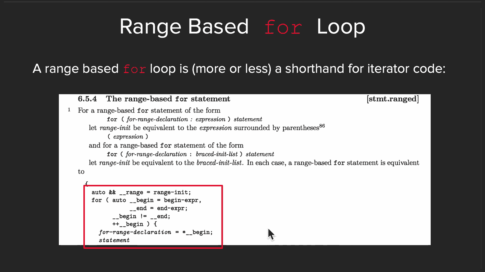

好问题。这样做更符合 C++，还是使用范围基于的 for 循环更符合， C++？所以，当你遍历整个数据结构时，考虑到风格上可能没有强，烈的意见，但大多数人会使用 for each 循环，因为它看起。

来更漂亮。实际上，只有在你真正需要迭代器时，例如，如果你在这里，调用排序函数或查找函数，或者你只想遍历数据结构的部，分而不是从头到尾时，这种方式才会派上用场。非常好的问题。我再补充一下。因为你会注意到。

第一个循环更简洁，更好看。然后你会发现差别，第一个循环有点受限，因为你必须遍历，整个集合，这实际上是 C++ 社区的一个常见问题。在 C++20 中，他们实际上提出了一种新东西叫做范围，它。

本质上允许你在 for each 循环中改变你想遍历的范围。现在，默认情况下，范围始终是整个集合。但在未来，你将能够构造这些范围，这样你就可以遍历每隔，一个元素。你可以遍历向量的前半部分，等等。是的。

你提了一个非常好的观点。这是 C++ 正在努力实现的目标。是的，这个点很好。如果有时间，我们可能会涵盖它。这是对的。有一堆很酷的 20 特性，我们可能会在最后涉及也可能不，会。很好。如果没有其他问题。

那就快速休息一下进行公告。首先，Assignment 1 的办公时间已经在 Piazza 上发布了，所以如果你们有任何问题，请查看 Piazza 帖子。我们都在正常上课后的时间增加了额外的办公时间。

如果你不能参加这些时间，请随时给我们发消息，因为我们，很乐意见面并找另一个时间。另一件事是，我们在学期开始时承诺你们有三次机会来创，建延期天数。这是第二次。这是一个中间的反馈表。

在这里你可以告诉我们像我们进，度太慢，或者太快，像我仍然不知道 std： 是什么，这真的，让我很困扰，因此如果你能花五分钟时间填写，我们会很感，激。是的，不过我保证我们会在后面学习它。是的。

任何类似的内容。所以我们很乐意听取你们的意见。反馈表的回复是匿名的，所以一旦提交表单后，会有一个链，接，你可以在其中添加你的名字，以表明你已完成填写。所以是的，请在下周四之前完成。

然后我们会整合你的反馈，以便改进课程。表单非常简短，所以请务必填写。请帮助我们。是的，很好。然后我还想做的一件事是，快速回顾一下 Assignment 1 ，的一些语法，这在去年让很多人感到困惑。

就是结构体的快，速回顾。所以这应该都只是复习。你们应该都对来自 106B 作业或者阅读这个作业的内容比，较熟悉。再次强调，结构体是一种将多种不同类型的数据组合在一，起的方式。初始化它的方法是。

再次使用这种统一初始化方式，然后你，可以访问它的方式感觉有点像一个对。你可以通过结构体内那个数据片段的名字来访问它。所以 object。var1 给你一些新的值。这些都在幻灯片里。事实证明。

在 C++ 中，声明某物时 struct 关键字是可选，的。在 C 中不是。所以在 107 中，你总是要使用关键字 struct。好的，这是针对作业的。所以在作业中，你会看到几个不同的结构体。

一个是简单图结构体，一个是节点，还有一个是边结构体，后者没有展示出来。我只是想快速让大家了解一下这的语法。再一次，声明一个简单图，实际上，统一初始化器是可选的，但在这里只是作为参考。快速地。

基于我们刚刚回顾的结构体语法，和你的同学讨论，并回答这个问题，你会如何添加一个新节点？假设值是 x1 和 y1。你会如何将一个值为 x1 和 y1 的新节点添加到简单图的，节点向量中？那样的语法是什么？

所以想一想，然后用 30 秒的时间和你的伙伴交流，看看你，们是否想出了相同的东西。再一次，我们有一个简单图，我想将一个节点添加到这个简，单图的节点向量中。那样的语法是什么？一个简单图是一个结构体。是的。

简单图就是这个结构体，而这个结构体包含了一个节，点向量和一个边向量。是的，这是一个好问题。它有点复杂，这也是我想在讲座中提到它的原因。你会怎么做？这就是你在第一项作业中会做的事情，如果你做的话。好的。

有没有人有什么想法或主意？是的，去吧。完美。好的，所以这是一个很好的主意。所以我听说我们要做简单图。所以在这种情况下，变量的名字是 graph。nodes 用于访问，节点向量。

然后使用加等于来添加一个节点。一个提醒是，实际上加等于在标准 C++ 中不存在。所以我们需要做的是使用点 pushback。但这正是正确的想法。确切地说。所以我们取我们的 graph 变量。

使用点 nodes 访问节点，向量，然后用 pushback 函数将节点推送到简单图中。然后再次使用统一初始化器来创建 x 和 y 值。这对大家来说有意义吗？如果这有意义。

那么我认为你会对作业的结构有一个好的，开始。好的，我会把它留在幻灯片中，你可以再次查看它。酷。

好的，所以你可能注意到我们之前的迭代器示例中有一些。

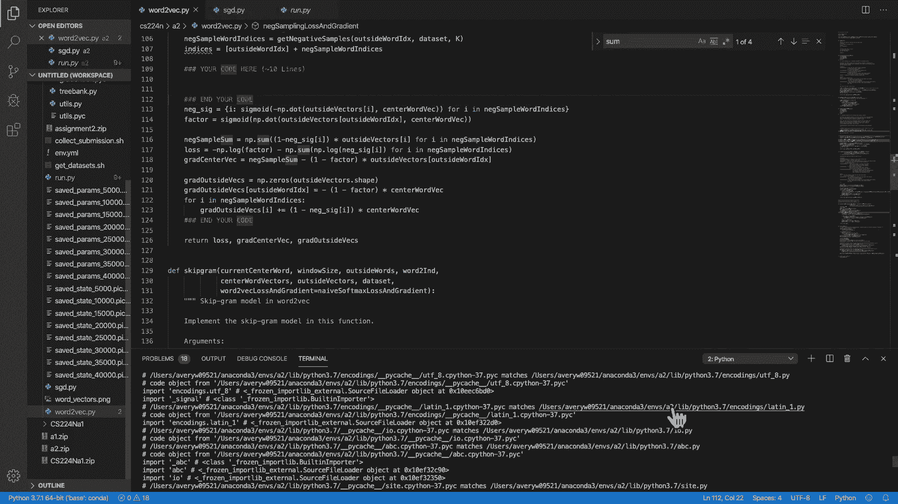

事情。哦，对不起。其中之一是你会注意到在我说我想排序，例如，我向量中的，一部分元素时，你会注意到我做了一些有点独特的事情。我做了 vector begin plus four，这种方式直观上是有意。

义的。它在说，好吧，我想要指向这个三的指针或者指向这个三的，迭代器，然后我会加上四，所以它应该指向这个五。这正是我们看到的。但这个运算符实际上不是我们之前讨论过的。到目前为止，我们只讨论过加加运算符。

它会将值增加一。让我们看看如果我们尝试对集合做同样的操作会发生什么，在我们脑海中，这似乎是合理的。我有，比如说，如果我做类似的事情，先让我快速注释掉剩，下的部分。在一个集合中。

我有类似于 std sort，begin，end，然后我，会做四，然后我会做之后。为了好的风格，我肯定会将其分解开来。实际上，周四，实际上，这是为什么模板如此必要的一个例，子，这正是这段代码的用途。

唯一的区别是这是一个向量，而那是一个集合。所以下一节课，你将学会如何对两者使用完全相同的打印，函数。所以很酷，提前告知。但是我们可以查看一下它会做什么。

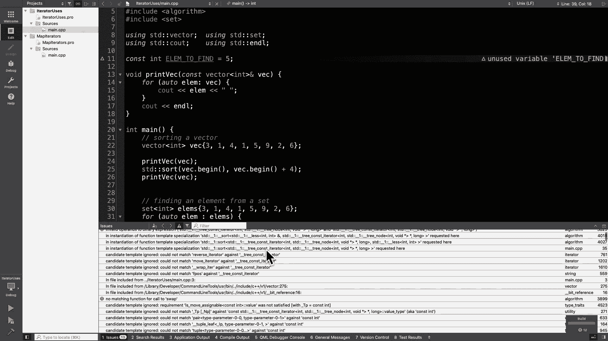

而且它实际上已经有错误提示了。这将引出我们下一个话题，即迭代器类型，但这种情况下为，什么这会出错，即使这不会。我们甚至可以将其改回 vec。end。为什么这个有效而这个无效，即使它们是不同的容器？

事实证明，sort 需要一种称为随机访问迭代器的东西。因为它实现排序函数的方式，它需要能够在容器中任意跳，转。而且事实证明，即使集合对我们来说似乎是有序的，由于它，们在底层并未排序。

你实际上不能在它们上调用 sort 函。

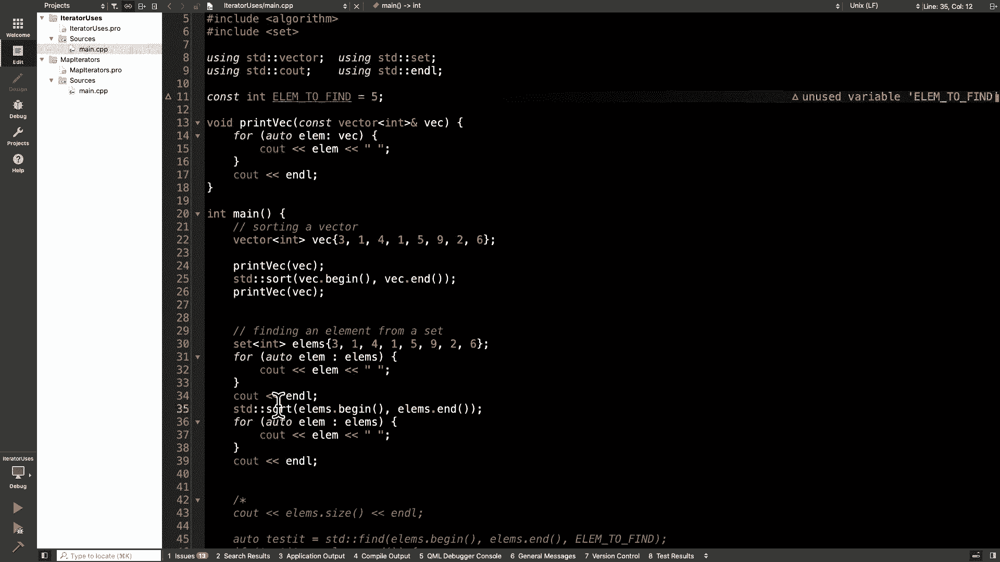

数。所以这引出了一个问题，那就是如何知道何时可以使用某。

些东西，何时不能使用某些东西？

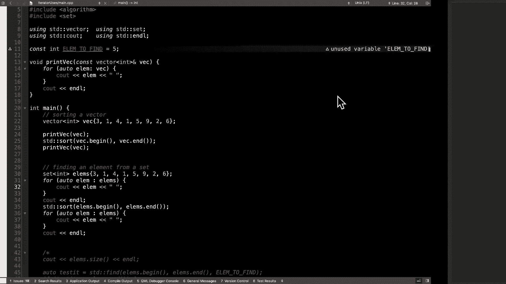

最后我要提到的是，你会注意到当我输入 std sort 并查，看这些时，它告诉我们模板是什么。很难看到，而且它不会增加。但你会注意到这里说的是随机访问迭代器，而我们之前做，类似 std find 时。

这里只说是输入迭代器。所以这会告诉你它需要什么样的迭代器，然后我们将学习，这些不同类型的迭代器。

所以迭代器类型。到目前为止，我们真的只使用加加运算符来递增它们，但对，于像向量这样的东西，能够做到例如将大小除以二添加到，那个迭代器是有意义的。同样适用于双端队列。看起来对。

看起来应该是我们能够做到的事情。问题是对于像集合或链表这样的东西，链表如果你不熟悉，的话看起来可能是这样的，如果这看起来陌生，不用担心。但观点是你不能在访问下一个元素之前跳过前面的元素。

你唯一知道下一步去哪里的方法是查看前面的元素。所以在这种情况下，做类似 my list。begin 加三的事情并，不真正有意义，因为要到达加三，不仅仅是加上三。这类似于你必须跟随箭头三次。

这种情况下你实际上只是，做 dot begin 到 dot end。那么 C++ 如何解决这个问题？再一次，你会得到这样一个不幸的部分，那就是你会得到非，常晦涩的错误信息。所以这个错误信息。

有点像是无效的操作数，你真的不知道，它是什么意思。但这实际上意味着你正在使用错误类型的迭代器。确切地说。那到底发生了什么？结果是有五种不同类型的迭代器。不用担心，因为对于每种容器。

迭代器的类型是非常明确的，所以这只是为了让你对每种类型的使用有所了解。这算是一个预览。结果是随机访问迭代器是最强大的，输入和输出迭代器是，最弱的。你会在几分钟内准确理解这意味着什么。首先。

每个迭代器都可以执行这四种基本功能，我们在讲座，一开始介绍过，即它们可以从现有的迭代器创建，可以使用， C++ 进行前进，并且可以进行比较。我们在最开始时就看到了这些。什么是输入迭代器？所以输入迭代器。

你可以把它想象成用于输入流的迭代器，有两个特点。第一个是它是只读的，意味着你只能从中读取值。你不能写入任何东西到那个迭代器中。换句话说，它只能在表达式的右侧引用。第二个是它是单次遍历的。

稍后我会详细讲解单次遍历和多次遍历的区别。结果是，我们已经看到这些了。我刚刚在 find 函数中展示了，所有它要求的都是输入迭，代器。所以只要你有像输入迭代器这样的东西，你就可以使用 ，find。

这意味着即使是像输入流这样的流，你也可以实际使用 ，find 函数，这挺酷的。然后还有像。哦，同样的 count 也是如此。同样，只要求输入迭代器。是的，同样适用于输入流。输出迭代器。和输入迭代器一样。

只是它们是只写的。所以你不能从输出迭代器中读取值。你只能写入东西到它里面。是的，它们只能在表达式的左侧引用。再次，你会看到这种情况与输出流，如输出流流或 CL 相关，以及一个叫做 copy 的函数。

这是另一个你可以查看的算法，它会将整个数据结构复制，到另一个数据结构中。好的，那么前向迭代器。前向迭代器可以做输入和输出迭代器可以做的所有事情，并且具有能够进行多次遍历的额外功能。因此，由于第一点。

它可以做输入和输出迭代器可以做的所，有事情。这意味着它既可以从迭代器中读取，也可以写入。最后一点是进行多次遍历。这意味着，本质上，如果你有两个指向同一对象的迭代器，比如说迭代器 A 和迭代器 B。

如果你对 A 和 B 都进行加，一操作，这些加一操作保证会再次指向同一元素。例如，如果你考虑一个向量，如果你对向量的 begin 进行，加一操作，然后创建另一个 begin，进行加一操作，它们保。

证指向相同的第一个元素，这似乎很直观。但如果你考虑一下，例如，一个输出流或一个输入流，比如，我们有 C in 并且你对 C in 进行递增，那么如果你尝试，调用，比如 C in dot begin。

虽然不完全是这样，但从直觉，上讲，大致是这样，那么它实际上会指向这个。所以如果你递增它，这两个将不会是一样的。这就是传递的总体思路。我会说，在这一点上，我给你提供所有这些细节只是为了让。

你了解发生了什么。实际上，在实际应用中，当我们使用这些不同类型的迭代器，时，你需要知道的只是，它是前向迭代器、输入迭代器还是，输出迭代器，这取决于文档说明。文档将告诉你它是什么类型的。这样。

你就可以知道何时可以使用每种迭代器。是的。所以，是的。如果传递的那些细节从你的记忆中消失了，也没关系。无意中的双关语。很好。我想在这里指出的另一点是，这些箭头存在的原因是因为，每一个都是其前一个的超集。

你会注意到前向迭代器是输入迭代器和添加迭代器的超集，加上了一些额外的东西。这在实际应用中意味着，如果有一个函数，例如在 find 中，要求一个输入迭代器，这意味着你不必只提供一个输入迭，代器。

你可以提供一个输入迭代器或任何比它更强大的迭代器。换句话说，如果一个向量只包含随机访问迭代器，那么你就，不能在它上面使用 find，这将是没用的。所以，是的。再一次，从实际角度来看。

你可以使用任何比所需类型更强，大的东西。如果你在之前的课程中学过继承，这基本上是一个继承层，次结构。每个随机访问迭代器都是一个双向迭代器，而所有双向迭，代器都是前向迭代器。有点像正方形和矩形。

如果你听说过这个。是的，怎么了？所以，你之前说的，如果你创建了两个输入迭代器并将它们，放入相同的元素中，并递增其中一个，它们两个都会向前移，动？哦，是的。这是个好问题。所以，实际上不是这样。所以。

让我更清楚地解释一下。所以，对于一个输入迭代器，比如我们创建了一个输入迭代，器指向一个点，另一个输入迭代器也指向那个点，当你递增，它们时，它们不一定会到达相同的位置，这有点奇怪。但可以这样理解：

像输入流一样，一旦你递增某样东西，它，就已经被消耗了。所以，如果你再次递增其他东西，就没有逻辑上的保证，它，几乎是未定义的行为。例如，它会去同样的地方吗？它会去新的地方吗？所以。

即使存在两个独立的迭代器？是的。但一个的行为会影响另一个的行为？我会这样想，这是理解它的一种方式。也许我认为更清晰的理解方式可能是，每个独立递增它们，的行为都不会产生定义的结果。比如。

它们可能都去同样的地方，也可能操作系统随意让它，们去两个地方之后的地方。此外，对于输入迭代器，你不能复制输入迭代器，你不能创，建两个输入迭代器。是的，你可以重新创建这两个，但你不能从一个复制到另一，个。

如果这也有助于澄清事情。那么，这是否意味着所有的输入形式都是相同的？这是一个很好的问题。所以，这实际上涉及到迭代器何时会变成，那个词是什么？哦，迭代器何时会失效？所以，这实际上是一个很好的问题。

我要把它搁置。我认为Avery会在下节课开始时讨论迭代器何时会失效。而且我实际上还得再查一下输入迭代器。我相信这可能是正确的，但我们会在下节课讨论时确认。是的。所以，是的，这是一个很好的问题。是的。

怎么了，Tim？很好的问题。所以，最强大的类型是由容器定义的。所以，一个向量会定义它的迭代器是什么，如果我们查看一。

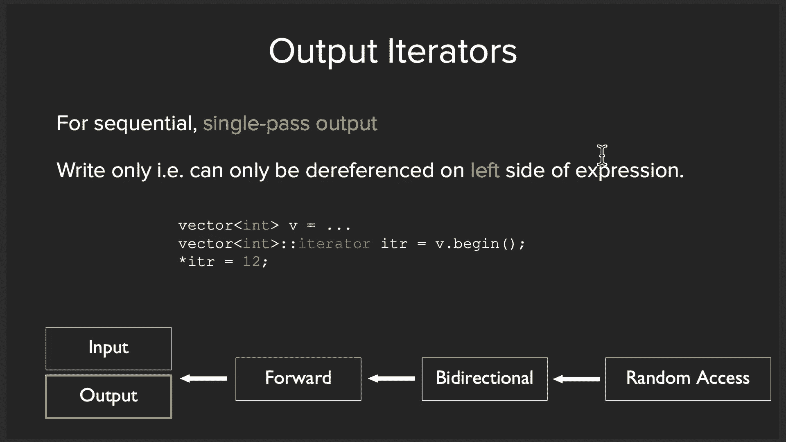

下，例如，向量CPP参考文献的话。如果你查看文档，查看一下叫做成员类型的东西，你会注意，到有一个成员类型是迭代器，它实际上会告诉你迭代器的。

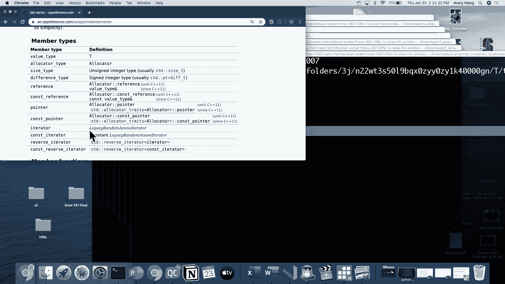

类型是什么，类似的东西。所以，是的，它是由容器定义的。至于是否可以将一个向量迭代器、随机访问迭代器声明为，输入迭代器或前向迭代器，这涉及到继承的概念。所以，继承是一个完整的讲座，因为它非常复杂。

我们实际上可能不会在这节课上教授它，但我们会在最后，一节课上提供它作为一个选项，让你们讲授任何内容。所以，是的，理论上是可能的。只是这个陈述中有很多“但是”。是的，很棘手的事情。好问题。

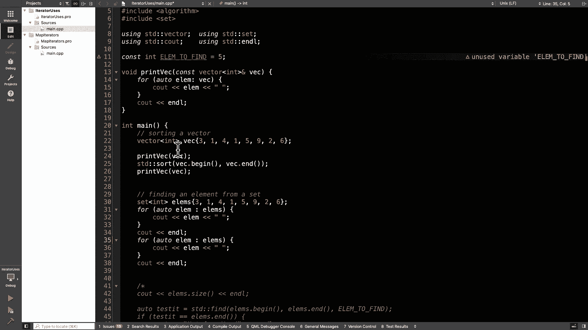

好的。所以，那是前向的。快完成了，最后两个。所以，双向迭代器，除了前向迭代器能做的所有事情外，还，具有递减运算符。所以，前向迭代器，即使它可以前进，抱歉，即使它有多次遍，历，它也不能向后移动。所以。

是的，双向迭代器，你会在像反向函数这样的函数中，看到它，你可以传递一些东西，它会反转其中的每个元素。实际上，双向迭代器是数学和集合类定义的。这就是为什么我们不能使用排序函数，因为排序函数要求。

的是随机访问迭代器，这比双向迭代器更强大。这也是链表定义的。所以，链表也是只有双向的。然后最后，随机访问。这些是最强大的，你可以使用任意量进行递增或递减，例如，三或一半的大小，类似的东西。

这些是向量、双端队列、字符串定义的。实际上，指针也是一种随机访问迭代器。是的，所以这实际上涵盖了我们所有的五种类型。有谁有任何问题吗？如果没有，那么最后我想说一下，指针和迭代器之间的区别，稍微有些混淆。

这主要是如果你之前学过指针并且试图弄清楚迭代器如何，适应指针的概念。你可以把指针想象成一种类。指针就像你可以声明的特定类，比如一个语音星指针或类，似的东西。迭代器，你应该更多地将其视为一种接口。

迭代器更像是一组承诺。因此，随机访问迭代器承诺你可以以任意量增加或减少你，的指针。这意味着，你可以把指针看作是随机访问迭代器的一种实，现。类似地，向量迭代器及其他也是如此。它们都是随机访问迭代器的实现。

是的，太棒了。下周二我们将讨论模板。非常强大，非常令人兴奋。不要忘记填写反馈表，因为我们很想听到你的意见。但大家做得很好。

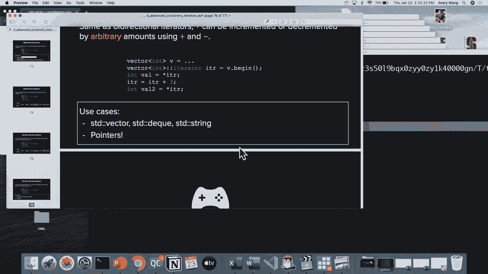