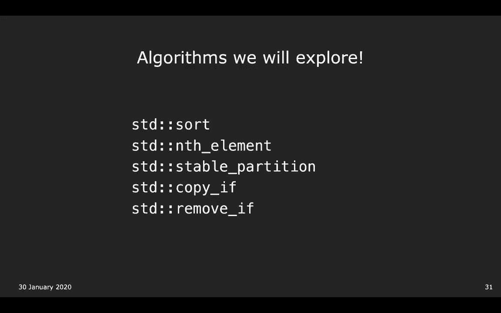
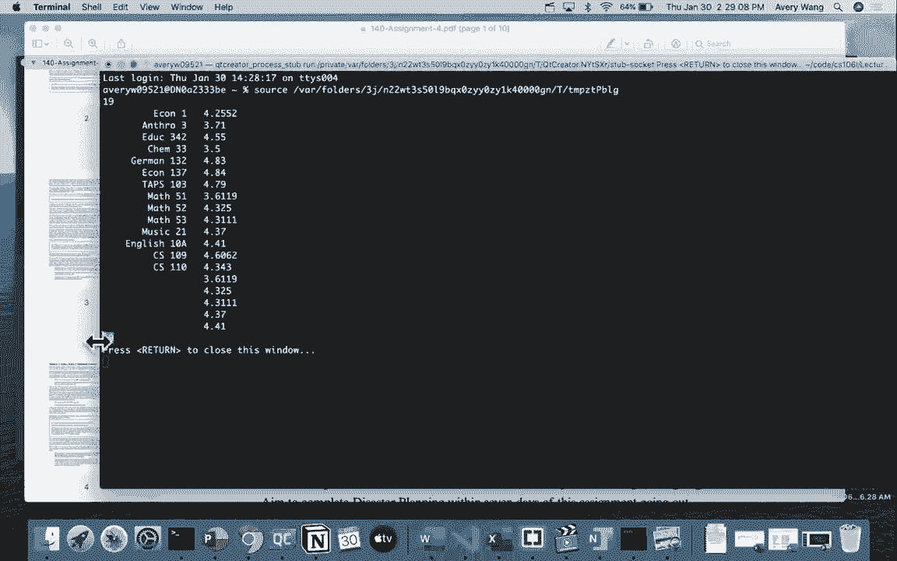
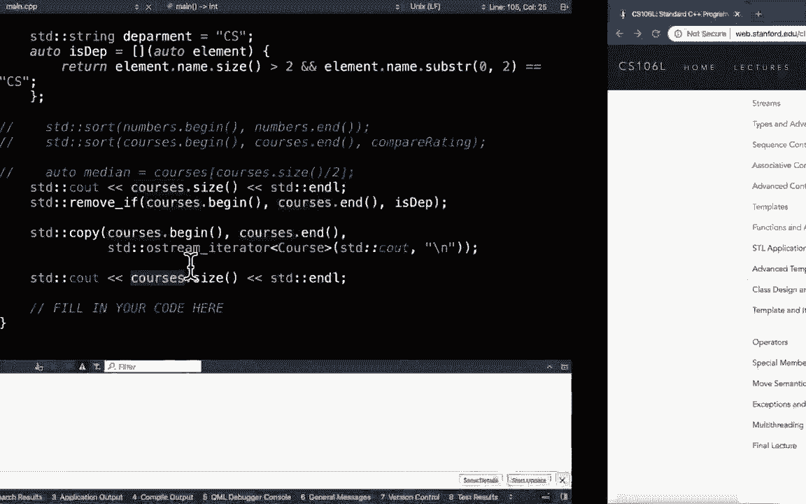

# 斯坦福大学《CS106L：C++编程》课程笔记 - 第8讲：函数与算法 🧮

在本节课中，我们将学习如何通过**谓词（Predicate）**和**Lambda表达式**来编写更通用的函数，并探索C++标准模板库（STL）中一些强大的算法。我们将从回顾模板函数开始，逐步深入到如何利用STL算法高效地处理数据集合。

---

## 回顾：模板与迭代器失效

上一节我们讨论了在STL容器（如`vector`）中删除元素时，迭代器可能失效的问题。例如，在`vector`中删除一个元素会导致其后的所有迭代器失效。我们通过谨慎管理迭代器的递增操作来解决这个问题。

```cpp
// 示例：安全地删除元素
for (auto it = vec.begin(); it != vec.end(); /* 不在循环内递增 */) {
    if (/* 删除条件 */) {
        it = vec.erase(it); // erase 返回下一个有效迭代器
    } else {
        ++it;
    }
}
```


本节中，我们将在此基础上，看看如何将这些概念应用到更通用的算法中。

---


## 从具体到通用：引入谓词


我们之前编写了一个计算特定值出现次数的函数`countOccurrences`。

```cpp
template <typename InputIt, typename DataType>
int countOccurrences(InputIt begin, InputIt end, const DataType& val) {
    int count = 0;
    for (auto it = begin; it != end; ++it) {
        if (*it == val) { // 核心比较操作
            ++count;
        }
    }
    return count;
}
```

这个函数解决了“值等于`val`的元素出现了多少次”的问题。但我们能否解决更广泛的问题，例如“满足某个**条件**的元素出现了多少次”？


这个“条件”就是一个**谓词（Predicate）**——一个接受参数并返回布尔值的函数。例如，“等于3”本身就是一个谓词。我们可以将函数通用化，使其接受一个谓词作为参数。


```cpp
template <typename InputIt, typename UnaryPredicate>
int countOccurrencesIf(InputIt begin, InputIt end, UnaryPredicate pred) {
    int count = 0;
    for (auto it = begin; it != end; ++it) {
        if (pred(*it)) { // 使用谓词判断条件
            ++count;
        }
    }
    return count;
}
```


这里，`UnaryPredicate`（一元谓词）意味着该函数对象只接受一个参数。这使得我们的函数能够统计任何满足给定条件的元素数量。


---


## 谓词的局限性与Lambda的登场

假设我们想统计“小于5”的元素。最初，我们可能需要写一个独立的函数：

```cpp
bool isLessThanFive(int val) {
    return val < 5;
}
// 调用
countOccurrencesIf(begin, end, isLessThanFive);
```


但如果我们想统计“小于limit”的元素呢？`limit`是一个变量。我们无法通过修改`isLessThanFive`来接受第二个参数，因为`countOccurrencesIf`要求谓词是**一元**的。

此时，**Lambda表达式**提供了完美的解决方案。Lambda允许我们在需要的地方内联定义一个匿名函数对象，并**捕获**外部作用域的变量。

```cpp
int limit = 5;
// 定义一个Lambda，捕获外部变量 limit
auto isLessThanLimit = [limit](auto val) {
    return val < limit;
};
// 调用
countOccurrencesIf(begin, end, isLessThanLimit);
```

---

## 深入理解Lambda表达式

一个Lambda表达式的基本结构如下：

```
[捕获子句] (参数列表) -> 返回类型 { 函数体 }
```

以下是各个部分的解析：

*   **捕获子句 `[]`**：指定哪些外部变量可以在Lambda体内使用。`[limit]`表示按值捕获`limit`，`[&limit]`表示按引用捕获。应避免使用`[=]`（捕获所有变量）或`[&]`（捕获所有引用），以保持代码清晰。
*   **参数列表 `()`**：与普通函数参数列表类似。在C++14及以上，参数可以使用`auto`。
*   **返回类型 `->`**：可选。编译器通常可以推断返回类型。
*   **函数体 `{}`**：包含要执行的代码。


Lambda在幕后会生成一个匿名的类（函数对象），这就是为什么我们通常用`auto`来接收它的原因——我们不知道编译器生成的类名。


---


## 探索STL算法


我们刚刚实现的`countOccurrencesIf`，在STL中已经有了对应物：`std::count_if`。STL提供了大量此类算法，让我们无需重复造轮子。



以下是几个常用算法的示例，我们以一个`Course`结构体的向量为例：


```cpp
struct Course {
    std::string name;
    double rating;
};
std::vector<Course> courses = { ... };
```


### 1. 排序 (`std::sort`)


对自定义类型排序需要提供比较谓词。


```cpp
// 按评分排序
std::sort(courses.begin(), courses.end(),
          [](const Course& c1, const Course& c2) {
              return c1.rating < c2.rating; // 定义“小于”
          });
```


### 2. 查找中位数 (`std::nth_element`)

要找到中位数，可以先排序，然后取中间元素。但更高效的方法是使用`std::nth_element`，它能在O(n)时间内将第n小的元素放到正确位置。


```cpp
auto mid = courses.begin() + courses.size() / 2;
std::nth_element(courses.begin(), mid, courses.end(),
                 [](const Course& a, const Course& b) { return a.rating < b.rating; });
// *mid 现在是评分的中位数
```


### 3. 稳定分区 (`std::stable_partition`)


将满足条件的元素移到前面，不满足的移到后面，并保持同类元素的原始相对顺序。


```cpp
// 将所有CS课程移到前面
auto it = std::stable_partition(courses.begin(), courses.end(),
                                [](const Course& c) {
                                    return c.name.substr(0, 2) == "CS";
                                });
// it 指向第一个非CS课程的迭代器
```


### 4. 条件复制 (`std::copy_if`)


将满足条件的元素复制到另一个容器。注意，目标容器需要有足够空间，通常使用`std::back_inserter`。


```cpp
std::vector<Course> csCourses;
std::copy_if(courses.begin(), courses.end(),
             std::back_inserter(csCourses), // 输出迭代器适配器，负责插入
             [](const Course& c) { return c.name.substr(0, 2) == "CS"; });
```




### 5. 移除-擦除惯用法 (`std::remove_if` 与 `erase`)




这是一个非常重要的惯用法。`std::remove_if` **并不会**真正从容器中删除元素，它只是将不满足条件（即要保留的）元素移动到范围前面，并返回一个指向新逻辑末尾的迭代器。要真正删除元素，需要结合容器的`erase`方法。


```cpp
// 错误：不会改变容器大小，末尾留下“垃圾”值
std::remove_if(courses.begin(), courses.end(),
               [](const Course& c) { return c.name.substr(0, 2) == "CS"; });


// 正确：移除-擦除惯用法
auto newEnd = std::remove_if(courses.begin(), courses.end(),
                             [](const Course& c) { return c.name.substr(0, 2) == "CS"; });
courses.erase(newEnd, courses.end()); // 真正删除元素
```


### 6. 查找 (`std::find` 与成员函数 `find`)


对于序列容器（如`vector`），使用`std::find`。对于关联容器（如`set`, `map`），使用其自身的`find`成员函数，后者效率更高（通常是O(log n)）。


---


## 总结


本节课我们一起学习了如何利用**谓词**和**Lambda表达式**来编写灵活、通用的函数。Lambda通过捕获子句解决了函数作用域和状态传递的难题。我们还探索了STL算法库中的几个强大工具：`sort`、`nth_element`、`stable_partition`、`copy_if`以及至关重要的**移除-擦除惯用法**。

记住，STL算法的力量在于**抽象**。当你需要对数据进行某种常见操作时，先查查STL是否已经提供了现成的、经过高度优化的算法。掌握这些工具能极大提升你的C++编程效率和代码质量。


---
**课程资源提示**：本教程内容整理自斯坦福大学《CS106L: C++ Programming》课程第8讲。演示代码可在课程提供的起始代码中找到。