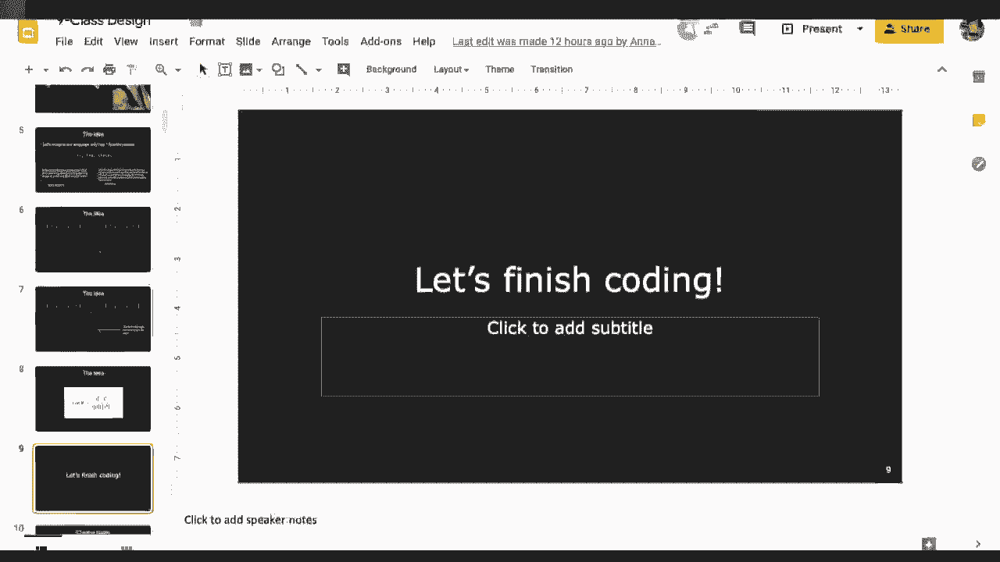
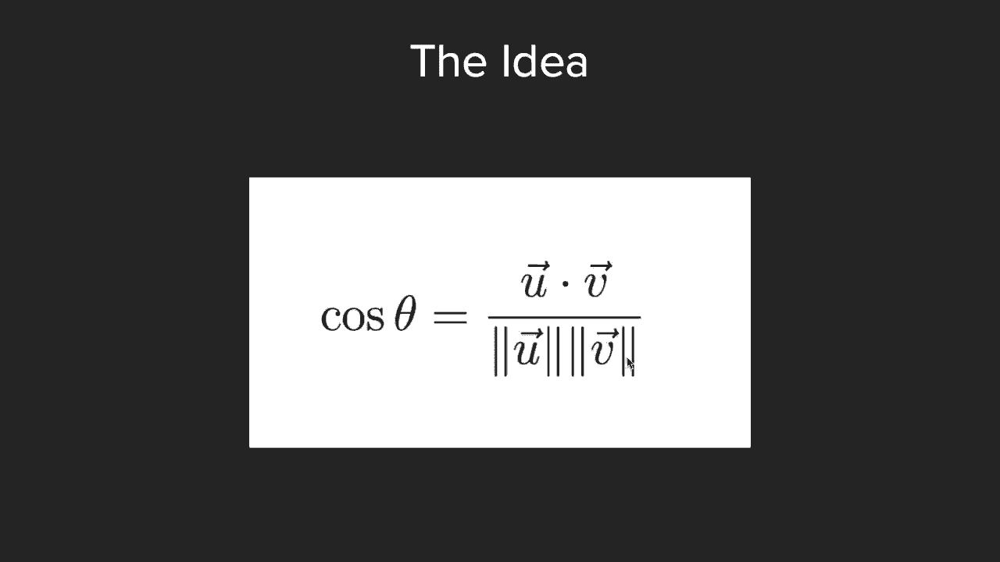
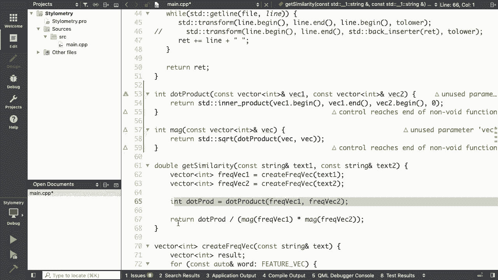
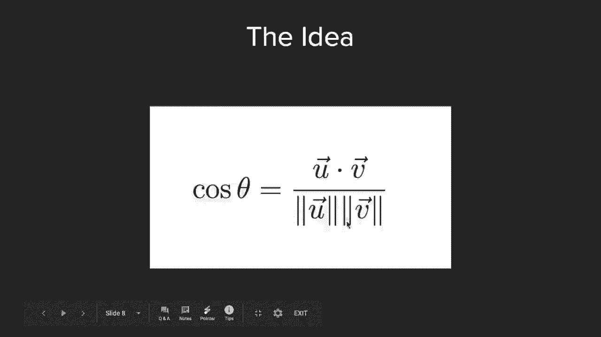
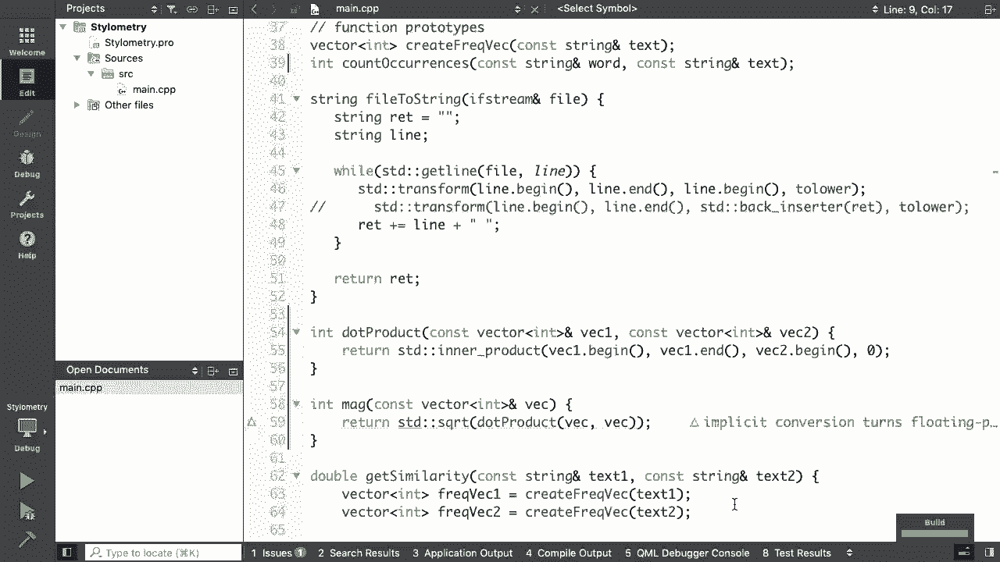
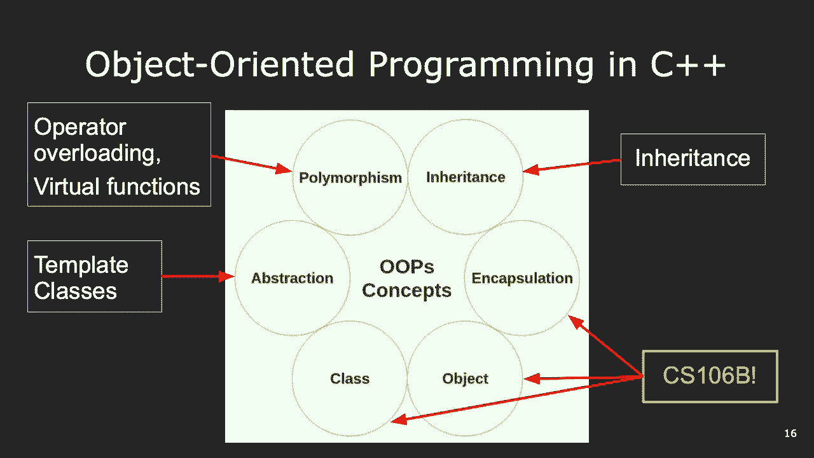
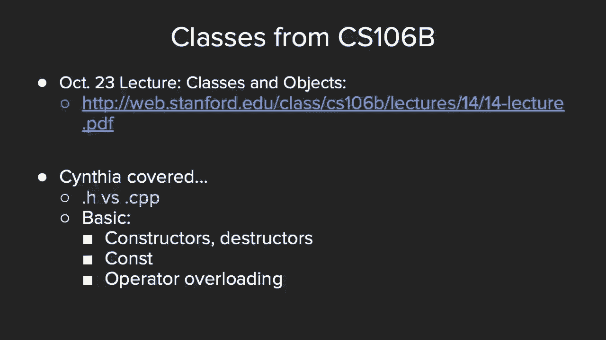
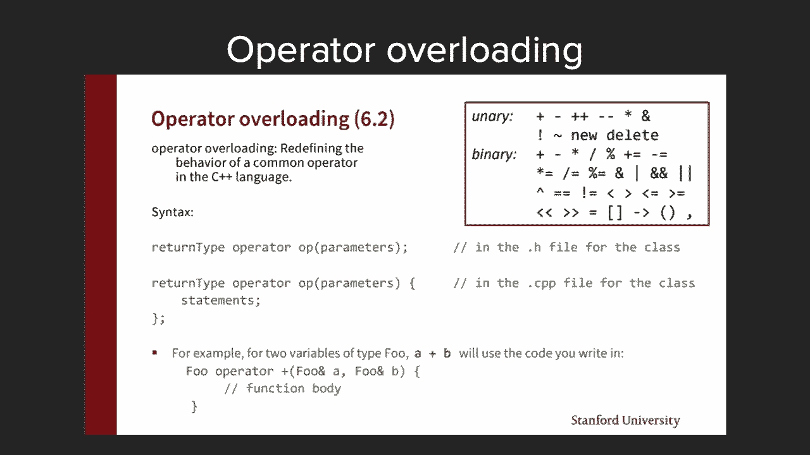
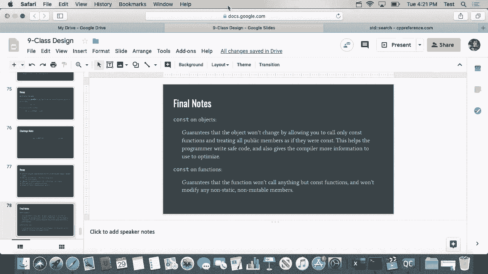

# 斯坦福大学《CS106L： C++编程｜ Stanford  CS106L C++ Programming 2019+2020》中英字幕（豆包翻译 - P11：[17]CS 106L Fall 2019 - Lecture 10_ Classes and Const Correctness - GPT中英字幕课程资源 - BV1Fz421q7oh

是的。好的。太棒了。很酷。Ben， Victoria， Shunran， Peter， Peter， Yuzu， Byron。

。好的。太棒了。很酷。好的。那么我们开始吧。哦，对了。另外，如果之前不太清楚的话，所有这些糟糕的笑话都是你，们在填写的介绍调查中提供的。我觉得这个笑话挺有趣的，因为写它的人在最后加上了哈，哈哈哈。

这对我来说非常有趣。不过。很酷。今天，我们将完成上次的STL总结，简要概述一下类，因为我，们要开始新的单元——现代C++中的面向对象编程。最后，还有一个令人兴奋的话题。

我们将讨论你们关于关键字const的任何问题。const是C++中的一个词，它在语言刚开始时就存在，但随着，语言的发展，它增加了更多的功能。所以它可能有点混乱。

所以我们会详细讲解const的所有奇怪细节。讲完这个讲座后，你应该会对它非常熟悉。完美。我们将用前五分钟来总结一下上次的讲座。回顾一下，我们尝试解决的问题是，有一系列名为联邦论文，的文章，共约85篇。

每篇由这三位作者中的一位撰写。我们试图解决的问题是，如果我们从这些作者那里获得一，篇文本，并且还有一篇我们不知道作者的神秘文本，我们是，否可以使用某种算法来确定作者是谁？我觉得有人告诉我。

他们实际上在其他课程中已经在解决，这个问题，使用了稍微复杂一点的解决技巧。但我们这里使用的是这样一个思路：我们可以列出一些非，常基本的词，如果我们可以计算这些词在文本中出现的次。

数，我们可以把它当作该作者写作的指纹。所以我们的想法是，对于每篇文本，我们都能生成一个包含，这些常见词的特征向量。然后通过比较该向量与未知论文的向量，我们可以通过它，们之间的距离来判断作者是谁的可能性。

所以再次强调，角度越接近，文本越相似。

我们要用来做这个的数学方法是点积。不重要，只是如果你们感兴趣的话。

那么我们快速总结一下编码部分。再一次，我们上次做的是从这个主文件开始。我们读取了文件，将其转换为字符串。现在我们的目标是计算这些特征向量中每个词在我们从文，件中创建的那个长字符串中出现的次数。

我们到了这个名为count occurrences的函数，函数的目标，是计算在这里传入的特征向量中的一个词在这里传入的文，本中出现的次数。我让你们查看了STD算法库，看看你们认为应该使用哪个算，法？

因为这实际上不是立刻显而易见的。我们可能会认为，从名为count occurrences的函数中，我，们会使用之前见过的count算法。但是，有人能从你们周末看到的内容，或者凭直觉，给我解。

释一下为什么我们在这里实际上不能使用计数算法来找出，一个单词在字符串中出现的次数吗？花 30 秒和你的邻座讨论一下。为什么我们不能用计数？然后如果你知道了，我们应该想用什么算法来代替？

而且我们不期望你们凭直觉就知道。

你们可以查阅 CPP 算法库，看看那里有哪些算法。

但是，再次花 30 秒互相解释一下为什么在这种情况下我，们不能用计数。好的，所以我听到了一些质疑的想法，一些不错的想法在被，讨论。我很高兴你们在尝试，即使你们不一定确定这会走向何方。

有人有想法可能是什么吗？随意大声说出任何猜测。为什么我们不能用计数？黄色衬衫。你叫什么名字？埃利奥特。埃利奥特。哦，埃利奥特。当然我认识你。好的。是的。你的想法是什么？它分开了。

所以这里有这种找出被消除的元素的空间的问题。是的，所以这实际上完全在正确的轨道上。实际上，从那引出，这里更普遍的问题是我们接收一个代表，文本的单个字符串。

而我们想做的是我们想计算一个字符序列在那个文本中出，现的次数。但是注意，如果你们仔细阅读计数的文档，它有点回到每个，字符都相同的这个想法。我们没有单词和空白字符的概念。所以在这种情况下，明确地说。

我们不能用计数的原因是因，为我们怎么能用它？我们要做的是我们会传入一个字符串的迭代器。但是字符串的迭代器指向什么？是的，火。完全正确。你明白了。它指向一个字符，不是一个字符串。所以使用计数的问题在于。

如果我们尝试使用这个函数，我，们每次只能搜索一个字符，这不是我们想要的。所以这是这个解决方案的一个棘手部分。这个问题的解决方案是实际上有另一个叫做搜索的函数，它允许我们在传入的迭代器中搜索一个元素序列。

所以这不是真的通用的。这只是一个很好的点，提醒我们回去仔细检查我们的算法，在做什么，也让你们知道有一个叫做搜索的东西存在。所以，好的，干得好。让我们看看。好的。在那种情况下，让我们完成这个函数的编写。

所以我们知道，实际上，我们现在想用 std：search 。好的。所以为了节省时间，我不会让我们一起写这个的逻辑，但我，会把它给你们。如果之后不明白，随意查看。但我在做的时候会说出我的想法。

所以我们想要在字符串中找出这个单词出现次数的一般算，法本质上是使用一个 while 循环。所以当字符串未结束时，我们想要不断地在文本中找到该，字符串的下一次出现。那么让我们从我们想要开始搜索的位置开始。

然后是我们，想要结束搜索的位置。然后让我们有出现次数的计数。然后我们会说当 cur 不等于 end 时。所以当我们还没有到达文本的末尾时，我们想要使用我们，新的搜索算法。再一次。

在 Qt Creator 中，您会注意到它会告诉您我们正，在使用的算法的参数，这是一个方便的提示。所以在这种情况下，我看到我们想要第一个迭代器，最后一，个迭代器，然后是第一个和最后一个。让我再检查一下。

是的。好的。搜索从 s 第一个到 s 最后一个的首次出现，所以是前两，个迭代器中的第二个。所以我们想要传入的是我们在两者之间搜索的东西，然后，我们想要传入针，即我们正在搜索的东西。到目前为止这有意义吗？

有任何问题吗？好的。太棒了。然后我们可以说，所以，对。所以我们要说 std_search 所做的是它返回指向找到位置，开头的迭代器，如果未找到则返回结束指针。所以我们要做的是，如果未找到。

所以如果 found 等于 ，end，跳出循环。否则，我们在我们的文本中找到了字符串的一次出现，所以，我们增加计数。然后我们想要做的是我们想要将我们搜索的起始位置立即，设置为刚刚找到的位置之后。

所以我们要做 curr 等于 found 加 1。请注意我不必做 curr 等于 found 加上字符串的长度。我们完全可以，但请注意，即使移动一个，我们已经将其从，类似于“the”变为“he”。

所以这不是我们程序中的错误。有了这个，我们在 count_occurrences 函数中要做的最后，一件事就是返回计数。太棒了。到目前为止有人有任何问题吗？好的。太棒了。

所以这个计算一个字符串在另一个字符串中出现次数的函，数，提示，提示，可能对您在本课程中即将面临的某些作业，有用。是的。所以这是一个很好的函数，我们将在这之后将此代码发布，到网上。

但您也可以随意重新创建此函数。实际上，我们在这里使用的关键算法是搜索算法。好的。然后很快，我们完成程序所需的最后两件事是在获取相似。

度时，我们记得我们确定两个文本或两个特征向量的相似。

度的方式是通过取点积。所以我们要打印出这个相似度，余弦θ，最后要做的是能够。

计算点积和幅度。好的。所以乍一看，我们首先需要做的是计算两个特征向量之间，的点积。这似乎有点棘手。看起来我们将不得不做某种 for 循环，在其中我们将相同，元素的两个东西相乘。

我们应该从 Python 中压缩某些东，西等等。结果我们最喜欢的算法库实际上为我们提供了一些东西。有人马上知道那个算法叫什么吗？我会说 5，4。所以这是一个很有趣的算法，实际上它不在算法课程中。

它实际上在另一个叫做 numeric 的课程中。在那里你也会找到像 accumulate 这样的算法。我们今天使用的是 inner product。太棒了。是的。所以我不会在这上面花费太多时间。

因为现在主要是了解，有哪些算法。这只是为了展示，即使是像点积这样理论上复杂的东西，STL 已经为我们提供了现成的工具。所以我想说的关键点是，当你实现自己类型的代码时，如果。

有某种功能你认为应该足够常见以至于有人已经为它写了，代码，它很可能已经在 STL 或 Boost 库中存在。所以我总是建议在尝试自己重新创建之前，先查查已经有，什么工具。

除非你必须为了作业或类似的原因自己重新创建。但是如果你查找 inner product，它的作用是接收一个向，量的起始和结束位置，然后是第二个向量的起始位置。然后是你想要开始点积的初始值。

所以假设你想用五作为初始值，你可以输入五而不是零。但这实际上会为我们计算点积。所以我们要做的就是返回那个点积。然后对于 magnitude，我们将实际使用的是一个数学属性。

。

有人知道一个向量的大小等于什么吗？再说一遍。确切地说。是的。所以实际上，另一种写法是，一个向量的大小等于它与自身，点积的平方根。这只是另一个数学概念。再次强调，对这个课程来说并不是特别重要。

但只是为了完，善我们的实现。所以有了这些，我们在这个函数中，计算两个文本之间的相，似度。我们通过计算文本中出现次数来创建了两个频率向量。我们计算了这两个频率向量之间的点积。

最后，我们返回这个方程式，即点积除以各自的大小的乘积。

。好了。在我运行代码之前，有人对这个最后的例子有任何问题吗？很酷。那么我们准备好查看它的运行情况了吗？祈祷吧。通常来说，作为一种编码策略，这不一定是最好的方法。对。平方根在 C math 中。对了。

我不是一开始就知道这一点。如果你不确定一个函数的来源，可以去浏览器中输入比如，平方根 C++。然后在文档的顶部，会说明它来自哪个头文件。但确实，它来自 C math。是的。作为一般编码建议。

我会推荐尽早测试，而不是在你写完所。

有代码后才测试。但以此为例。让我们看看。好了。为了节省时间，我会稍后进行调试。

我也会发布原始代码，如果你们想自己试运行的话。这就是所有的算法了。至此，我们完成了算法和容器的内容。我们尚未涉及的是模板的内容。但你可以想象回到这里，将其泛化为任何东西的向量，例如，而不是字符串的向量。

类似这样的东西。假设你想在词语之外创建一个特征向量。是的。54。55。是的。这很有趣。所以，这基本上是在说，要计算点积，我需要知道的只是第，一个向量的开始、第一个向量的结束和第二个向量的开始。

我们实际上不需要知道第二个向量的结束，因为这个函数，假设你传入的两个向量长度是相同的。或者说，你只想计算第一个向量长度内的点积。所以原因是。所以这个第四个参数不必是向量到末尾。

这个第四个参数实际上是一个初始值。所以假设你想计算点积，但在前面加上一些常量。比如说我们想计算两个向量的点积加上五之类的。它允许我们提供一个起始值。我不完全确定他们为什么这样实现。

我认为是因为还有其他函数，比如累加函数，你也可以提供，一个起始数来开始累加。我相信这样做是为了与这种格式保持一致。是的。好问题。是的。彼得。是的。那么，为什么不阻止在这里识别为一个实例呢？

我们用来粗略防止这种情况的方法是在这个计数出现次数，中。我们在词语前后加了一个空格。所以这并不是万无一失的，因为它不处理标点符号的情况，所以一个很好的扩展是回去真正处理标点符号的正确方法。

处理标点符号的方法实际上是使用 SDL 的正则表达式库，如果你们对其他课程中的正则表达式有所了解，C++ 也有，相应的功能。而且它实际上是标准库的一部分。好问题。是的。再说一遍。这解释了为什么是零。

非常感谢。是的，就是这样。所以与其说是词语，不如说是查找。我实际上不知道这是否是唯一的错误，但这绝对是一个大。

问题。好的。是的。所以这不是唯一的错误，但这是一个错误。

谢谢。谢谢。很好地发现了问题。好吧。还有其他问题吗？目前的问题都很好。好的。在这种情况下，我会稍后发布这段代码，并且我还会发布一，个关于它在讲座中为什么不起作用的解释。

这样你们可以看到错误在哪里。但现在，有了这个，我想再次说明，这对作业也有用，我们已。

经结束了 SDL 单元。所以，大家做得很棒。SDL 说实话是 C++ 中最重要的部分之一。但即使它如此核心，很多人仍然不知道它的存在或使用。所以，很酷。好的。所以在我们进入下一个单元之前，有几个通知。

首先，A 部分的作业截止日期是本周六。如果您已经看过，您就会知道它超级简单。它实际上包括测试您的网络连接，然后基本上重新实现我，们在课堂上刚刚做的事情。所以我鼓励您在周六之前完成。是的。

如果花费超过两个小时，请来找我们。然后应在线请求，我们将在本次讲座之后的今天或明天发，布 B 部分。截止日期仍将是原来的 11 月 14 日星期四。但这样，如果有人想早点开始，他们可以。太棒了。是的。

哦，是的。所以作业三将在我想是 11 月 10 日左右发布。是的。因为我们想早点发布，只是为了让您觉得我们不是试图强，迫您在感恩节期间做某事。您在感恩节期间不必做任何事情。我们只是想给您一些额外的时间。

以便在那一天和感恩节，之间您有一些喘息的空间。好的。我猜大多数学生不会做作业三，这有点令人难过。但是，如果您正在做作业三，只是提醒一下，我们会早点发，布。是的，没错。是的。所以，是的。提醒一下。

在这门课中，您只需要完成三个作业中的两个。是的。梅森。是的。作业一应会返回。它会在作业二截止日期之前一点返回。主要是因为我们交给评分者，我们想给他们足够的时间评，分。是的。是的。

因为评分者他们本周也在评期中考试。然后他们也会感到困惑。所以我们想给他们多一点时间。他们都有自己要负责的部分。所以给他们一两周的时间。是的。另一件事是，关于这门课作业的反馈，因为它们主要是关于，功能。

而不是那么多关于风格。所以更多的评论也会不如您可能习惯的 B 或 X 那么详细，所以如果你们收到反馈并且或者想要更详细的反馈，比如，请在办公时间来找我们，我们也可以坐下来查看您的代码，并更仔细地看一看。

因为作业评分者可能只会提供一些一，般性的。是的。要么是错误，要么是反馈建议。

酷。太棒了。好的。那么在这个房间里，你们中有多少人熟悉面向对象编程。我能看到举手吗。好的。太棒了。好的。好。所以我看到对于一些人来说这仍然是有用的。对于其他人，我猜我也仍然会讲得快一点。

所以正如我们之前提到的，C++ 不仅仅是一种面向对象编，程语言。这是我们使用 C++ 的方式之一，但您也可以将 C++ 用作，函数式语言等等。也就是说，面向对象编程是人们使用它的最常见方式之一。

所以这将是我们剩余课程（除了最后几节）的重点。所以作为提醒，大概讲讲我们这门课要专注的面向对象编，程的方向。嗯，谈到多态性，接下来的几节课我们将讨论运算符重载和，虚函数。

模板类涉及到抽象和面向对象编程的概念，然后继，承就是继承，这也是我们要讨论的。然后类、对象和封装，这三个术语实际上你们在 CS16B 中，应该都熟悉。有人吗。我实际上不确定。X 讲过这个吗。

或者有没有人不熟悉这三个概念。好的。好的。是的。如果你们是但感觉不舒服，请课后跟我交流。

所以先简要回顾一下类，确保我们都在同一页面上。首先，如果你们熟悉这些，或者如果你们想复习，辛西娅大，概上周讲过。所以是的，请查看那些幻灯片。你们在 106B 中涵盖的内容，如果你们在 106B 中。

应该已，经看到了。h 与。cpp 文件的使用。你们应该熟悉基本的构造函数和析构函数、基本的常量、，基本的运算符重载。所以这就是我假设我们进入这门课所具备的，关于这些有，几点说明。那么，首先有人能告诉我。

h 和。cpp 文件的区别吗。举手。没错。是的，没错。所以正如梅森所说，h 文件是你可以定义类和类中的函数，的地方，而。cpp 是你实现这些的地方。更普遍的思考方式是，h 是你为你的类指定接口的地方。

所以这有点像是面向公众的，比如你希望其他类能够从你，的类中使用的 API。而。cpp 是你隐藏所有复杂细节的地方。所以你们可能之前都听说过这些。

但是，是的，这又是来自辛西娅的 106B 讲座。关于头文件的小细节。我们不一定会关注这些，但如果你们不熟悉，我绝对鼓励你，们回去再看一看。你们可能会注意到的一件事是，在顶部我写了头文件。h 啊。

与源文件。cpp 啊等等。你们可能会想知道所有这些扩展名之间的区别。

这是一个完全合理的问题。事实上，结果发现对于。h 和。cc 甚至还有更多的扩展名。有。hpp、。csx、。cxx、。c++、。C。相当令人困惑。所以这只是有趣的琐事，在某些小的边缘情况下稍微重要。

这就是我看到时的反应。结果发现你使用哪个扩展名取决于编译器。所以如果你们看底部的这个链接，实际上有一个列表，列出，了哪些编译器接受哪些扩展名。例如，G++或者抱歉。

GCC 我相信接受五个 CPP 扩展名中的，四个等等。并且就你们所知，C 实际上是最初的 C++扩展名。但是当文件系统开始使文件名不区分大小写时，就产生了，混乱。换句话说，C 和。

c 开始表示相同的东西。所以这就是他们开始提出。cc、。cpp 的原因。现在一般的标准是，任何 Unix 系统、Unix Linux 系统都，使用。cc。其他系统，例如 Windows 会使用。cpp。

实际上，这种情况可能只在您混合 C 代码和 C++代码时才，重要。所以，如果这种情况发生，请再次查看扩展名。但是，这主要只是有趣的事情，因为我知道人们一直对此感。

到困惑。所以，构造函数，这又是来自 106b 讲座的内容。这应该看起来很熟悉。在这个课程中，我们实际上将深入研究更复杂的构造函数，所以，复制构造函数、移动构造函数之类的，艾弗里将进行，讲解。下周。

实际上下周，是的。析构函数。老实说，关于析构函数，我们不会深入太多。是的，基本的想法是当一个类的对象或类的实例超出作用，域时，它会调用析构函数。那通常是您释放内存之类的地方。在课程快结束时。

我们将讨论这个称为 RAII 的重要概念，是的，这是真的。有没有更简单的发音方式？RAII。RAII。好吧，有一种最重要的 C++惯用法叫做 RAII，它与析构函，数有关。所以我们将讨论这个。是的。

这就像是使 C++与其他所有语言不同的东西之一。

太棒了。好的。是的。实际上让我讲完这些。

所以您可能也从 106B 讲座中看到过。辛西娅应该提到过 const 的这两种用法。一种您应该从本课程和 106B 或 X 中看到的是将其用作，参数。所以通过引用传递的常量参数非常常见。

您现在看到的另一种是将 const 用作函数。就是说一个函数是 const。有人能为我总结一下 const 函数的作用吗？它在旁边有说明。但是，是的。完全正确。完全正确。

所以 const 函数不能修改任何类变量或传递给它的任何，变量。完全正确。太棒了。然后今天我们要做的实际上是复习 const 的其他所有内，容。所以这只是略作探讨。但这实际上是我最喜欢的讲座之一。

我想我会使用之前讲座的幻灯片，我觉得超级有趣。但在我们开始之前，最后一件事是运算符重载，艾弗里将在。

下一讲中讲解。辛西娅真的讲过运算符重载吗？只是非常简略地讲了。只是非常简略地讲了。好的，很酷。没有像朋友那样的。我在下一讲也有足够的内容可讲。绝对的。好的。所以在我开始讲 const 之前。

有人对面向对象编程类有任，何问题吗，一般性回顾？好的。谁对 const 感到兴奋？好的。我看到那只手。我看到那只手。太棒了。是的。所以 const 实际上是我刚开始学习 C++时让我感到困惑。

的关键字之一。有点像我看到了它的常见用例，但我也在一些奇怪的用例，中看到了它，不确定它到底是什么意思。好的。所以我们有 22 分钟。

我相信我们可能会完成整个幻灯片，但是我们可以在下次，讲座中覆盖最后两个杂项主题。好的。是的。感谢Mike使用他的幻灯片。好的。所以我会给你们30秒来阅读这些，因为我认为这是非常常，见的。

这是一个关于为什么我们使用const的普遍问题。对不起字体太小了。好了。那就是我们从一个很酷的家伙那里得到的建议。是的。所以为什么使用const的整个想法。对不起，如果那段时间不够让你阅读。

这些幻灯片也会在网上发布。是的。所以在我们这样做之前，其实有一个更一般的问题。为什么我们不使用全局变量？你可能以前听过这个问题。全局变量可以被程序的任何部分修改或读取，这使得很难，推理它们的使用。

它们也可以被程序的任何部分获取或设置，并且通常被视，为不安全的。const也是一样的情况。所以实际上，这不仅仅是一个风格问题，我们会看到。使用const实际上对确保我们程序的安全性非常有帮助。是的。

一般来说，它涉及安全性、风格，以及确保我们承诺的接口，实际上是我们提供的接口。很棒。好的。那么为什么使用const的另一个动机是什么。有没有人发现这段代码中的错误？花30秒时间和你旁边的同学讨论一下。

看看你是否能找出，导致这段代码不按预期执行的原因。有点难以看清。好吧。实际上，这有点像是一个技巧性问题。基本上是不可能看到的。你会发现这里，其实这是我在学习CS106B时花了三个小时，调试的一个错误。

所以这对我来说非常重要。但你可以明显看到这段代码是一个人为设计的例子。但是当你构建越来越复杂的数据库时，你所做出的承诺变，得非常关键，以确保你的代码按预期工作。所以如果我们使用常量X和常量Y。

既然我们只是在这个函，数中进行cout操作，我们会收到这个错误。这会让我们知道。话虽如此，const的作用就仅仅是给我们提供编译器错误吗，它仅仅对我们提供编译器错误有用吗？不。那么我们以地球为例。好的。

假设我们是一些地质学家，我们想做一些无害的事情，比如，计算地球上的人口。所以我们调用这个函数来计算地球上的人口，我们期望它，返回某种人口数量给我们。然而，我们函数中的一个恶意圣诞老人实际上实现了这个。

计算人口的函数，添加了一个小帽子到地球上。所以，当我们只想计算人口时，结果是我们实际上还给地球，添加了一个小帽子，把它变成了火星，并用尘土星射死了它，这一切，当我们只想做的只是计算地球的人口。

那么这怎么发生的？正如我们所说的，当我们调用 count people 函数时，它调，用了三个实际上修改了我们传递进去的 Earth 对象的函，数，这并不是我们所期望的。是的，这里有一些政治评论。那么。

如果我们把这个方法改成 const 方法会发生什么呢，再说一遍，如果我们把这个方法改成 const planet 引用 ，P，会发生的事情是编译器会提前通知我们传递了错误的参，数。这点很重要。

因为当我们为其他人设计类时，我们首先要尽，可能地将它们设置为 const。其次，要让他们知道我们已经将其设置为 const，以便他们，可以按照他们的意图使用它。是的。

它们允许我们推断我们传递给这个函数的变量是否，会被修改。这对我们的客户很有用，也对我们有用。这样，Earth 也不会被破坏。再一次确认，当我们传递 const 参数时，const 方法保证。

不会改变我们传递的值。因此，我们可以确定顶部的 x 的值与底部的 x 的值是相，同的。好的，在我继续之前，有没有问题？是的，Elliot。

这里的假设是 count people 函数内的三个函数都通过引，用传递 x，而不是 const 本身吗？是的，这是个好问题。所以我是否正确理解你的问题，如果我们不通过引用传递 ，x。

那么它们也不会被修改呢？是的，完全正确。所以这里一个更好的例子是使用一个 planet 对象，而不，是 int，因为我们希望通过引用传递以节省空间。因此 const 关键字真的很重要。或者，例如。

对于任何非原始类型，我们希望通过引用传递，以节省空间，但仍然需要某种保证它不会被修改。是的，很好的问题。是的，Peter。它会返回运行时错误还是编译时错误？是的，好的问题。关于 const。

它会返回运行时错误还是编译时错误？关于 const 的好处在于它返回编译时错误。是的，因此编译器可以为我们检查是否意外修改了不应该，修改的内容。是的，很好的问题。还有其他问题吗？是的，Shiran。

如果我们将 x 参数改为 const 引用 x，我们是否也需要，将这个 x 参数改为 const int？是的，这是个好问题。答案是肯定的。const 所做的事情之一是，它不仅确保这个一级函数是 。

const 正确的，还确保你从那里调用的任何函数也满足 ，const 属性。如果你不这样做，你会看到编译器错误，提示尝试将 const， 对象传递给非 const 函数，类似这样的信息。是的。

Byron。是的。再说一遍。是的，很好的问题。是的，这是个好问题。那么，如果我们尝试使用一个不遵循这些良好 const 属性，的库，会发生什么呢？Avery，随时可以插话，但我首先的回应是。

那么在这种情况，下，真的完全取决于我们作为客户，确保我们在自己的端上，强制修改参数。在像计数人员的例子中，假设我们不知道计数人员是如何，实现的，这就是进入模糊领域的地方。是的，我一时还想不到，哦，好吧。

实际上，一种防止这种情况发生的办法是，如果你知道在初，始化后不需要再修改它，那么你可以将 Earth 声明为常量，变量本身。这样即使它被传递到一个尝试修改它的函数中，也会抛出，编译器错误。

但是如果你确实需要修改 Earth 并且还需要传递它，我相，信你可以将它传递为其常量版本。我很确定。我只是补充一下 Anna 的回答。那么你的问题是库本身不是常量，对吗？所以它没有做任何常量的事情。

但你声明了某个常量变量，而你不能传递它。这就是问题吗？是的。哦。哦，好吧。哦，是的，我明白了。我明白了。谢谢。是的，所以这肯定不是理想的，但有一种解决方法。有一种叫做常量转换的东西。

它基本上可以去掉常量。现在，这不好，因为基本上是别人的代码有问题，所以我们，将这个坏问题传播下去。所以通常这不是一个好主意，但如果你真的必须调用他们，的函数，那么你可以使用常量转换来去掉常量。

这是一个好点子。是的，因此如果你有一个常量对象，要么你将无法调用该函，数并且会抛出编译器错误，要么你将不得不使用常量转换，不过在这种情况下，我会质疑为什么你一开始要将变量设，为常量。

如果你知道在某个时候会改变它。但是，是的，好问题。这表明如果你在实现一些库时是多么重要。你必须确保你的代码是常量转换的，否则使用你的库的人，将会遇到很大的困难。还有一个旁注。

CS110 在某些作业中使用常量转换，因为他，们的起始代码写得不好。是的，实际上我们会看到，我不知道我们是否有时间去这节，课，或者我忘记是否实际上包含在这些幻灯片中。

实际上使用常量转换就是我们如何在类中实现重载函数，其中有常量函数和非常量函数。事实证明，最佳的实现方式实际上是使用常量转换。所以有其用途，但，是的，一般来说，当我们编写自己的代码，时。

我们希望避免丢弃常量。是的，好问题。到目前为止还有其他问题吗？好的，很棒。好的，那么我们看到的第二件事是，啊，是的，我们不仅可以，使参数成为常量，我们还可以使函数本身成为常量，也就是。

所谓的常量成员函数。为了了解这一点，常量如何与类交互？假设我们有一个定义对象类的 cloud，其中有一些我们不，需要担心的私有成员变量。之前，我们对类的理解是，我们有一个对象类，我们有操作，该类的函数。

现在我们意识到，实际上，那些函数可以分为两种类型。一种是常量成员函数，或者它可以是非常量成员函数。实际上，非常量成员函数能够处理常量和非常量变量，而常，量成员函数只能提供常量接口。因此。

以我们的例子为例，我们看到我们将这个计数人口函，数定义为常量函数，而死亡之星函数定义为非常量函数。那么假设我们有一个接受常量参数的函数。如果我们然后尝试在常量参数上调用常量函数，我们能够，这样做。然而。

如果我们尝试在常量参数上调用非常量函数，我们无，法这样做。所以有点直观。但是，是的，有人对此有任何问题吗？每个人都明白为什么这最后一行无法编译吗？有点回到我们之前所说的关于常量如何确保其下面的所有。

内容也是常量。好的。好的。我认为，关于常量，最棘手的事情之一是当涉及到常量指针，时。所以我们将经历这个。我们将慢慢地逐步处理这个。所以这个第一个例子，指向常量的整型指针是指向非常量，整数的常量指针。

换句话说，你能做的是你可以解引用指针并更改该值并将，其设置为其他值，但你不能更改指针本身。所以另一种思考方式是你有指针手指。你被允许更改它所指向的任何内容，但你不能移动这个手，指。这有意义吗？

所以再次读取的方式，从右到左。你有一个指向非常量整数的常量指针。另一方面，你也可以有一个常量整型指针 p，这是一个指向，常量整数的非常量指针。并且，再次，从右向左读取。和这个一样。

对于相同概念的两种不同语法。然后最后，我们也可以有一个指向常量整数的常量指针。这有意义吗？有人有问题吗？我们对这个感觉有多舒服？好的，现在我看到那些了。所以再一次，这三者之间的区别，再次。

这只在你使用指针，时发生。所以这会发生在，比如说，你在 C 中工作并且在 C++中使，用指针，例如当你在堆上声明某些东西时。所以这再次是，常量如何与指针相互作用，就是有两件事你，在处理。

你可以有一个常量或非常量指针，意味着箭头本身，手指本，身，是否被允许移动。所以在说常量指针和常量指针的情况下，你知道指针不被，允许移动。并且你也可以控制指针所指向的东西的常量性。所以在这种情况下。

指针是常量整数类型，意味着你不能更，改它所指向的整数。而在这种情况下，指针是常量整数类型，意味着你不能更改，指针所指向的东西。所以再一次，你可以从右向左读取。

第一个有一个常量指针和它所指向的非常量的东西。第二个有一个变量指针。你可以移动指针本身，但无论你指向什么，你都不能改变它，然后最后一个，你不能改变任何东西。好的。好的，我们也会在最后看一个快速的例子。

以防它没有意义，但还是，重新看一下。是的，记住你可以把它分成这两个部分。再次强调，当你处理对象而不是原始数据类型时，一切都适，用。例如，如果你在堆上声明了一个小部件之类的东西。啊，是的。

所以使用带有 const 的指针确实有点棘手。好的。当涉及到迭代器时，迭代器如何与 const 交互，实际上，迭，代器比指针更像是指针的超集。但我们现在不会深入讨论这个问题。

这里的关键棘手点是 const 的迭代器行为类似于常量迭，代器。换句话说，当我们说 const 然后是一个迭代器类型时，我，们是在说指针本身不能改变，这与常量迭代器相同。

那种情况同样表明迭代器本身是不能改变的。之所以棘手是因为，如果我们希望指向的对象不能改变，我，们必须定义一个新的类型叫做常量迭代器。所以，如果你查看在线的 C++ 规范，你可能会看到每个类。

都有迭代器和常量迭代器，这就是原因。所以再举个例子，假设我们有一个包含 1 和 2312 的向量，一个常量向量迭代器意味着迭代器本身不能被改变。你的指针不能被改变，这意味着你不能增加迭代器，但你可。

以修改迭代器所指向的内容。所以在这个例子中，它会把 1 替换为 15。到现在为止有明白吗？有问题吗？好的，好的。再次强调两者之间的区别，第一个可以改变迭代器指向的，内容，但不能改变迭代器本身。

第二个则不能改变迭代器指向的内容，但可以改变迭代器，本身。好的，是的，如果你还没理解，随时查看幻灯片。另外，常量迭代器在 C++ 中出现的频率比常量指针要高一，点。所以我建议查看幻灯片。

确保你理解了发生了什么。但记住，我认为最重要的是，你在处理指针和迭代器时，总，是要处理两种类型的常量。一种是指针或迭代器本身是否可以移动，另一种是它所指，向的内容是否可以改变。太棒了。作为总结，哦。

是的，Brian。好问题。是的，我们可以将 const 与 auto 一起使用吗？绝对可以。所以 const 和引用符号 (&) 是 auto 无法处理的两个方，面。所以是的。

你完全可以将 const 与 auto 一起使用。是的，好问题。还有其他问题吗？好的，那么作为简要总结，你们刚刚在比大多数人见过的地，方看到更多的 const。

我们看到了它在所有类型的参数、局部变量、返回值以及，函数中的应用。所以函数可以是常量的。作为对你们的挑战，我认为如果你们愿意，可以在Piazza上，看到我们发布的额外挑战，理解这个函数在做什么。

虽然看起来很吓人，但我保证，如果你逐一拆解每个const，你可以准确地翻译它的意思。所以下次讲座开始时，我会发布一张幻灯片，解释这些，const的作用。但这确实是一个不错的挑战。如果你能理解这些。

我必须说你已经完成了常量卓越证书，好的，所以再看一遍这张幻灯片。然后回顾的第二部分，总体而言，从哲学角度来看，当你编，写自己的类时，你要标记所有不会被修改的内容为const。

这不仅仅是为了阅读者的风格问题。它实际上对你代码的有效运行和其他人使用你的类是重要，的。通过const引用传递，const对象和值比按值传递更好，除非，是bool、int、double等基本类型。这点。

我们将在稍后讨论的第三个要点中提到，它涉及到，const_cast来定义类中的const和非const函数。然后，最重要的是，我们热爱地球，不想去火星。太棒了，所以花点时间阅读这个。这只是总结幻灯片。

解释对象和函数const之间的区别。但之后，我今天就讲这些了。下次讲座中，我们将讨论类中的运算符重载。是的，这些幻灯片都会发布，以便你们在未来使用const时，有一个参考。然后，是的，Byron。

再说一遍。是的。等一下，我没有听清最后那部分。是的。是的，你完全可以。是的，你可能会想，当你想初始化成员变量时，构造函数该，怎么办。我们下次会更多讨论这个问题。你将不得不使用一种叫做初始化列表的东西。

因为如果你声明一个const对象，那么在构造函数中，你甚，至不能初始化私有成员变量。解决这个问题的方法是使用初始化列表，我们会在讨论构，造函数时讲到这个。太棒了。太棒了。大家做得很好。祝好运。

或者如果你已经完成了期中考试，恭喜你。我们将在外面回答问题。感谢你们今天的到来。另外，有人打算今晚来我的办公时间吗？很好。因为我可能需要调整它们。是的，我可能还会取消本周的一个办公时间，所以请留意。

Fiato的更新。好的，谢谢大家的到来。

好的。我会确保保存所有内容。好了，停止录制。