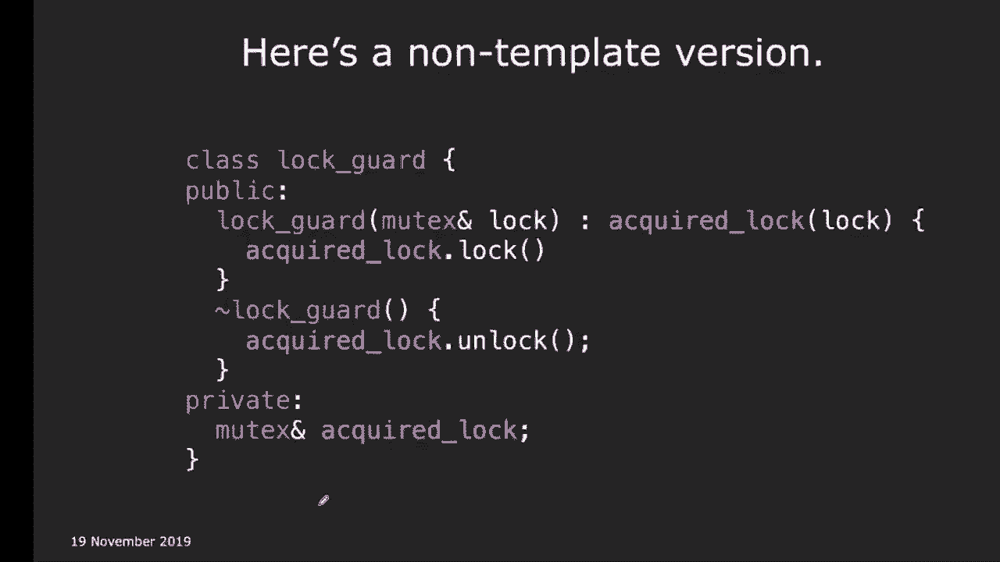
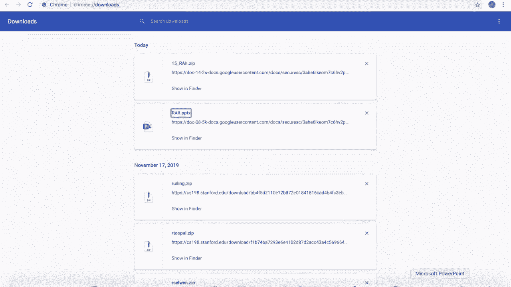
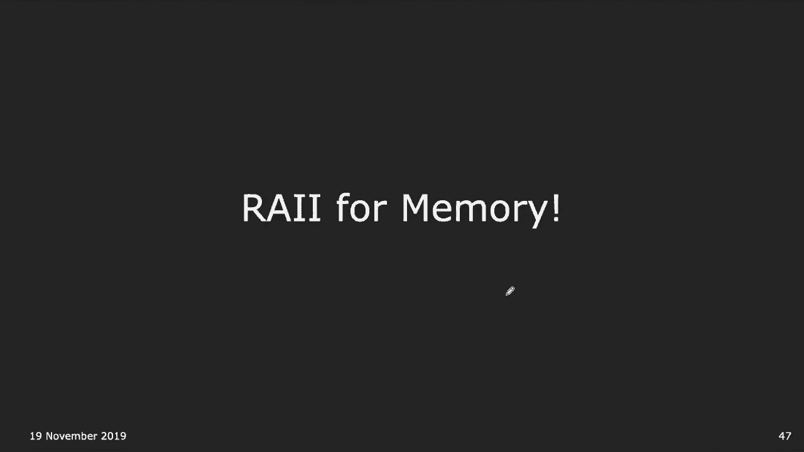
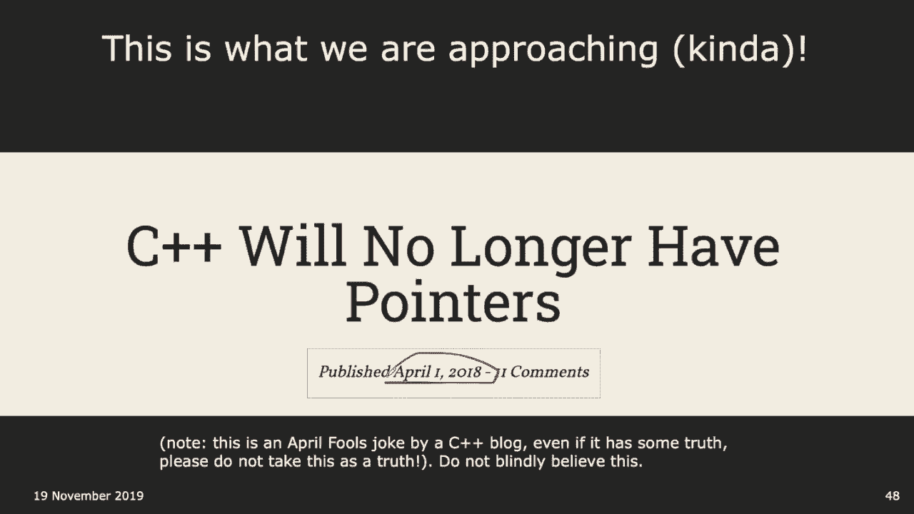
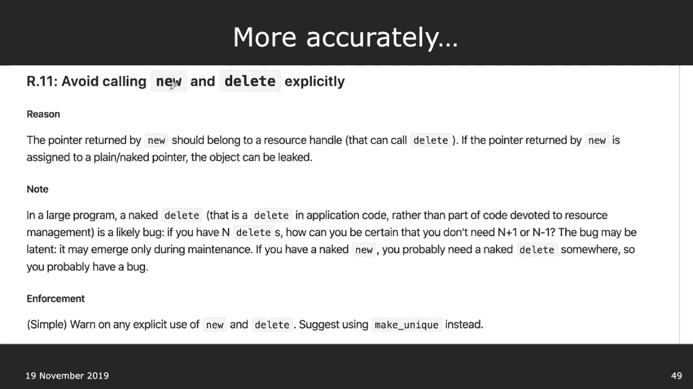
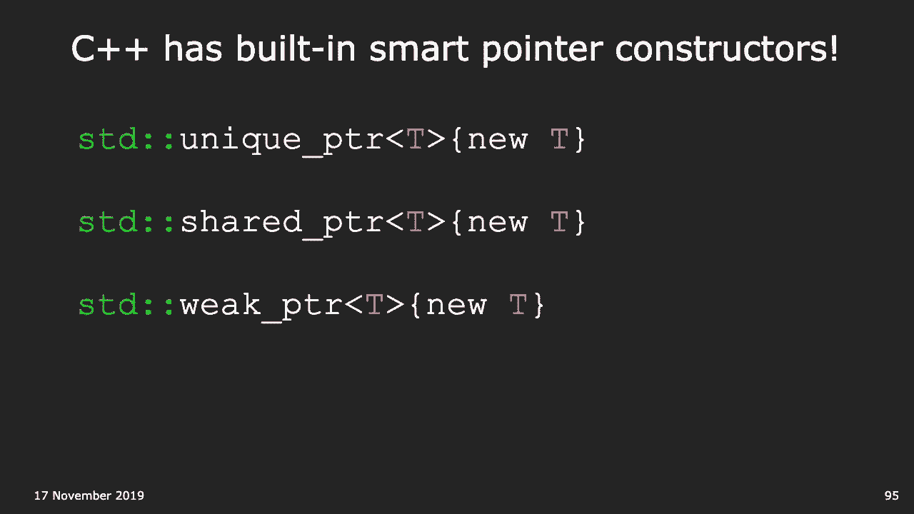
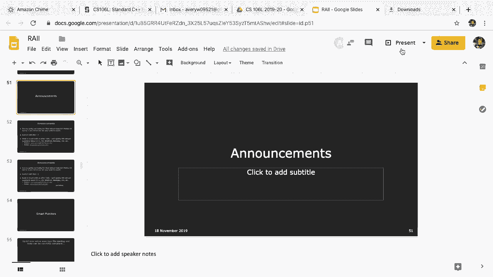
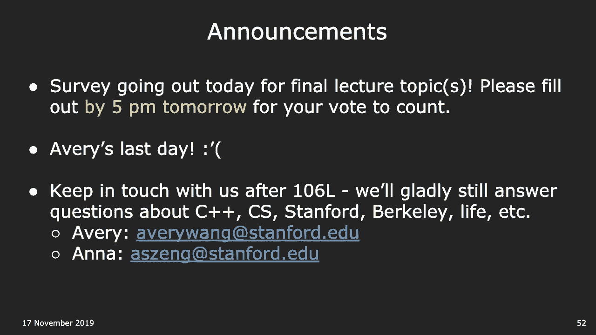

# 斯坦福大学《CS106L： C++编程｜ Stanford  CS106L C++ Programming 2019+2020》中英字幕（豆包翻译 - P17：[23]CS 106L Fall 2019 - Lecture 16_ RAII and Smart Pointers (Screencast) - GPT中英字幕课程资源 - BV1Fz421q7oh

你看到的这瓶水，我用完了Itoen，所以现在里面装的是水，第二件事，实际上我明天会提到面试的事情。接下来，我今天确实有一个面试，我被问到了关于RAII的内，容。所以这是一个重要的话题。

这是你必须了解的最重要的C++习惯用法。好的。所以我们今天要讨论这个话题。在我们开始之前，我想让你看看这个例子。这只是一个非常简单的函数。问题是，这个函数里有多少个代码路径？代码路径的意思是。

当你执行这个函数时，控制流有多少种，不同的方式可以进行并退出函数？这讲得通吗？你能通过这个函数多少种方式？你可以通过这个函数并退出的不同路径有多少条？是的，例如，一条路径可能是，你。

一条路径可能是你完全跳过if语句，直接返回。这是一条代码路径。这段代码里有多少条代码路径？好的，我听到的是三条。还有其他答案吗？有趣的问题，没有额外信息。六条，有趣。好的。

我想知道你们这些数字从哪里来的。好的，有趣。好的，谁认为是1？好的，没有人说1。2条？2条？好的，那么3条？4条？有趣。超过4条？超过10条？好的，好吧，你们都错了。答案绝对是超过10条。但首先。

我们先来看一下最明显的三条路径，好吗？所以这个问题最常见的答案是三条。我们快速浏览一下。所以你从开始处开始，好吗？你评估它，结果是假的。所以我们评估另一个表达式，结果也是假的。所以我们返回。

这是一条代码路径，好吗？第二条代码路径，我们开始这个函数。这部分返回真。当这个返回真时会发生什么？是的，确切地说，短路。由于短路，你不会评估其他部分。哦，不，实际上，如果第一个是假的，第二个是真的。

那么你，评估这一部分，然后退出，好吗？第三部分就是你说的那样。如果这个是真的，那么我们不需要评估第二部分。所以你评估这一部分，返回，好吗？所以三条代码路径。我只是好奇，第四条是什么？

对于那些回答四条的人，第四条是什么？哦，好吧，我明白了。还有其他代码路径吗？你提到六条。好的，那么还有其他代码路径吗？嗯？是的，好的。好的，那么它们来自哪里？提示是。

你可以假设这些调用是像原子操作一样的。就像你只是进行函数调用。不要过多考虑调用中发生了什么。有没有其他方式可以在返回语句之外退出这个函数？你可以抛出错误，对吧？你可以抛出异常。没有任何额外信息的情况下。

这段代码可能在多少个地方，抛出异常？所以答案是23减去3，即20。这段代码在20个不同的地方可能会抛出异常。好，让我们快速浏览一下代码，好吗？所以员工 e，在这里可能会抛出异常吗？好的。

那么在这里调用了什么函数？在这里调用了一个函数。是的，正如你所说，拷贝构造函数被调用了，如果输入无效，那么这可能会抛出异常。好的，这是一个地方。抛出异常的下一个地方是哪里？E。title。

那里可能会抛出异常。好的，还有其他地方吗？即使这是等于等于，理想情况下这可能有效，但你实际上不，知道 e。title 返回什么。它可能返回一个字符串。它也可能返回不是字符串的东西，然后用户重载了等于等。

于。明白了吗？不知道你为什么想这样做，但可能是可能的。所以等于等于也可能抛出异常。同样的情况，stally 可能抛出异常，大于号也可能抛出异，常，如果用户重载了这些运算符。好的。

你没有被告知任何额外信息。或运算符可能抛出异常吗？所以你实际上可以重载或运算符。我不知道你为什么要这样做，但你可以重载或运算符。这是另一个可以抛出异常的地方。好的，那这些呢？这里可以抛出异常吗？好的。

你可以在这里抛出异常多少次？所以 e。first，你可以在那里抛出异常。E。last，你可以在那里抛出异常。还有其他地方可以抛出异常吗？好的，每次调用流插入运算符时，你都可以抛出异常，对吗？你可以。

假设你尝试将某些内容打印到 cout，然后你的对，象无效。所以这些也可能抛出异常。一、二、三、四、五。这些都可能抛出异常。还有其他地方吗？好的，是的，e。first 可以抛出异常，e。

last 也可以抛出异，常。加法运算符可能是用户定义的，对吗？因为即使这是一个字符串，那么字符串加字符串，好，这是 ，C++ 的事情，不会抛出异常。但你可能没有字符串，这可能不是一个字符串，加上一个字。

符串。那么用户定义了，加法运算符。所以你可以在那里抛出异常，也可以在那里抛出异常。明白了吗？还有一个地方。返回，返回调用了什么？返回调用了字符串的拷贝构造函数。我认为字符串确实有，对于某些值。

字符串确实会抛出异常，对吧？所以答案是至少23。好问题，可能会超过23吗？哪些函数可能抛出异常？我们还没有讨论析构函数，对吗？所以有很多析构函数在进行。有这个，我认为有一个析构函数。我不确定其他的。

当这个员工对象到达这里时，也会被析构。所以这也可能抛出异常。通常我们假设析构函数不会抛出异常，因为如果析构函数，抛出异常，会发生一些奇怪的事情，明白了吗？所以如果你把这些都加起来。

至少有 23 条代码路径，对吧，三个明显的，再加上 20 条由于异常导致的。现在你可能会想，嗯，那又怎么样呢？有 23 条代码路径，这有什么关系呢？好，跟进的问题。假设你有这段代码，问题是。

你能保证这段代码没有内存泄，漏吗？哦，我的错，那不是 delete，那应该是 E。好，把这个改成 E，对不起。我复制粘贴错了，这应该是 E。所以它在删除指针。我可以做一个标记吗？把这个改成 E。好了。

好吧，你在这里调用 new，所以我们在堆上分配了一些东西，我们对它进行了一些操作。好，这些应该是箭头。对不起，我昨晚做这个时很晚了。好，这些应该是箭头，这些应该是箭头，这些都应该是箭头，好。

这里有内存泄漏吗？所以，我在这里分配了堆上的东西。我能保证在这个函数结束时，我已经释放了内存吗？对于那三条正常的代码路径，没问题，因为你调用了 ，delete result。

你在这里调用了 delete eat。所以当你调用 new 时，你在堆上分配了内存。当你调用 delete 时，你释放了堆上的内存，对吧？所以对于我们讨论的那三条正常控制的代码路径，这没问，题。

那其他的 20 条呢？例如，如果我在这里调用 new，然后如果我尝试做 E arrow， title，如果这抛出异常，我们就会退出这个函数，甚至不，会到达 delete。这样说清楚了吗？对吧？

为什么这 20 条代码路径重要，因为如果我们经过这 20 ，条其他代码路径，它们可能不会到达 delete E，这样就会，有内存泄漏。所以这是个大问题，考虑到你现在拥有的工具，你实际上不。

知道怎么解决这个问题，对吧？是的，有问题吗？为什么呢，因为这只是一个函数。这仅仅是构造了一个新的泄漏。那么仅仅有这个 delete，是不是不好？是的，我认为 106b 讲过内存泄漏，对吧？

106x 讲过内存泄漏。等等，Cynthia 没有讲过内存泄漏？什么？好，嗯。好，是的，这实际上是个很好的普遍性问题。为什么内存泄漏总体上不好？有几个不同的原因。

其中之一是实际上有大量的安全漏洞是基于内存可以泄漏，的事实。我现在不详细讨论这些，但如果你搜索一下，你会意识到这，种不确定行为通常是非常糟糕的。另一个你可能更熟悉的实际问题是，比如说，在这里我们只。

创建了一个新的员工。但假设我们恰好调用这个函数一百万次，比如在 Google ，这样的大型公司，他们每天有超过一百万次交易。在这种情况下，假如你没有创建这个指针，你的计算机会把，它当作无法再分配的内存。

这意味着如果你调用它一百万次，而你的计算机没有超过，一百万次的空间，比如说一个字节的空间，那么你的计算机，将会用尽RAM。这就是内存泄漏出错的一个例子。

还有很多其他大小不一的解决方案来处理内存泄漏的问题，这是一个有效的问题，但确实，它是编程中的一种大经典规，则，说的是我们不希望出现内存泄漏。好吧，我们要不要快速回顾一下什么是内存泄漏？

只是一个简单的定义，对吧？好吧，因为如果你现在正在做瓦片操作，你不希望瓦片中出，现内存泄漏。你们现在都在做瓦片操作，对吧？好吧，不要在瓦片中出现内存泄漏。是的，所以内存泄漏是当你。

知道你通常在栈上声明变量，它们的生命周期是那个函数调用，对吧？然后当函数完成时，那块内存就会被释放。如果你使用关键字new，就像你们在处理列表节点时那样，它们是在堆上分配的，所以这些对象会持续存在。

好帽子。所以它们的生命周期会在函数完成后仍然存在。问题是，因为如果你在堆上声明东西，它不会自动被释放。你必须自己释放它。想象一下如果我们不断尝试分配更多的内存，然后如果你，继续在这里分配内存。

这个指针将在函数完成后不再存在，但指针最初指向的是在堆上分配的内存，对吧？所以如果函数完成了，你不再有这个指针。你只是有在堆上分配的内存，你无法访问，但操作系统不知，道你必须释放它。

所以delete关键字的作用是，它本质上告诉你的操作系统，可以重新使用那块内存。否则，你的系统将假定它仍在使用中。我不这样认为，对吧？我不这样认为。我说过“是”吗？

我认为这是谷歌浏览器变得非常慢的原因之一。所以如果你打开很多标签页，然后如果你不完全退出谷歌，浏览器，它会随着时间变得越来越慢。是的，我记得我在某处读到这个原因是因为它有大量的内，存泄漏。现在。

这不是特别重要。它仍然可以工作，但只是你会有内存被浪费。它不能再被使用，但也没有被回收，明白吗？所以这就是为什么内存泄漏是不好的。是的，所以这里的问题是你不能保证这个函数没有内存泄，漏。

因为如果代码在这里的任何地方抛出异常，从这里到这，里，如果在这里的任何地方抛出异常，那么你将跳过结果，删除E这一行，对吧？所以这个函数可能有内存泄漏，特别是如果抛出了异常。好吧，我们怎么解决这个问题？

更普遍的关注点是，通常在C++中，有一些资源，你可以获取，它们，但一旦获取了它们，你必须记住稍后释放它们，以便，其他程序或函数能够使用那块内存，对吧？所以堆内存就是一个例子。

你可以使用new来获取堆内存，然后可以使用delete来释放它。是否有其他资源，如果你获取了它，你必须记得释放它？有一个大资源，我们在 Windows Excel 中讨论过。PDF 文件？对，嗯哼？

正是如此，流，明白吗？在流中你什么时候获取东西？例如，文件流就是一个例子。它们获取什么？文件流在打开文件时获取某物，对吧？当它调用 。open 时，它拥有那个文件的使用权。它可以从文件中读取。

然后当你读取完文件时，你必须记得，做什么？你必须关闭文件，对吗？好，所以是的，这些是其他一些例子。文件，当你打开一个文件时，你必须记得关闭它，好吗？类似地，还有其他东西。这些东西叫做锁。

这里有 110 的人吗？没有，好吧，其实，Anna 可能会在下次讨论多线程，但锁本，质上是当你有多个程序尝试同时运行时。你有时需要一个锁来防止它们同时竞争同一个数据结构。

所以如果它们都试图编辑同一个数据结构，你需要使用锁，来防止一个在另一个写入时访问。这样说清楚了吗？所以锁做的就是这些不同的函数，它们可以尝试获取一个，锁，实际上就是它们拥有了锁的使用权。

其他线程不能做任何事情。然后当它们用完时，它们必须解锁，好吗？你可以想象如果你锁住了某物但没有解锁会有多糟糕，对，吗？其他的，是的，套接字，我们不会讨论太多套接字。所以作为一个快速插曲。

我们不会深入讨论异常，但异常只，是你将控制权和信息转移到一个叫做异常处理器的东西的，方式，好吗？你在 106B 中使用过异常，throw 关键字？对，好。你从未需要编写这个 try-catch。

try-catch 的东西，但我，认为主文件的起始代码中有一个 try-catch，以便如果你，在这里抛出异常，它能捕捉到这种异常，好吗？这是在 106A 中教授的，如果你用 Java 学过。

隐约记得这个，也许？好，所以，是的，这是处理异常的一种方式。我们不会过多讨论异常，因为 106B 会教这个，而且它们也，很容易弄清楚。这实际上只是一堆语法，所以我们不会深入探讨。但是异常安全的概念。

你必须小心如果抛出异常，这是面向，对象编程中一个非常重要的概念。好，所以在这里，我们不能保证这个 delete，我必须更改所，有这些，这个 delete 在函数退出时被调用，因为你可能在，这里退出函数。

这样说清楚了吗？有任何问题吗？你有什么问题？是吗？异常是否仍然连接到程序中？不，因为你可以在抛出时退出函数，但如果你将其包装在 ，try-catch 中。

如果你可以将任何代码包装在 try-catch ，语句中，如果你抛出某物，那么控制流会立即转到这些 ，catch 语句中的一个，具体取决于你抛出了什么异常。如果像这样，异常会抛出当前函数。

但接着它会去下一个标，签吗？实际上，你可以在这里放任何东西，比如抛出语句，如果你，抛出异常，那么这些中的一个会捕获它，具体取决于是什么，类型的异常。明白了吗？是的，我们不会深入探讨它们如何工作。

因为它们真的很容，易用 Google 查找。异常没有什么太难的。这只是语法问题。但是如何保护以应对异常的思想非常重要。那么我们如何保证一个类释放资源，不管是否有异常发生？所以即使在这里抛出异常。

我还是要确保释放我在这里分，配的堆内存。明白了吗？顺便提一下，还有一个叫做异常安全的概念，其中一种解决，这个问题的方法是你可以说，这些函数是不允许抛出异常，的，明白吗？你可以告诉一个函数你不能抛出异常。

那就是我们在 no throw 关键字中做的事情。记得那个 no throw 关键字吗？我在几节课前有点困惑？是的，有些函数绝对不应该抛出异常，因为这会导致未定义，的行为。例如。

如果你在析构函数中抛出异常，那么你会有点疑惑，这个对象到底是已经被销毁了还是仍然存在，对吧？如果你在析构函数中半途而废，那是什么意思？是的，因为这实际上没有真正的逻辑意义，你不能在析构函，数中抛出异常。

交换函数、移动构造函数也是一样，你不允许在这些函数，中抛出异常。好吧，这就是所谓的 no throw 异常保证。还有其他较弱的保证类型，如强异常、基本异常、无异常，今天。

我们想尝试编写满足基本异常保证的代码，在这种情，况下，即使抛出异常，你的程序仍然处于有效状态，你仍然，可以从中恢复，明白吗？好吧，另一种避免这样问题的方法是完全避免异常。

这段代码来自 Google 的风格指南。所以 Google 不使用异常，至少对于 C++ 是这样。好吧，他们的理由其实很有趣。你可以在这里阅读更多内容，你可以查看链接，但原因是他。

们在最初开发 C++ 时忘记了这一点，所以他们甚至不打算，去碰这个问题，明白吗？处理异常困难的地方在于，如果你的代码中有些地方处理，异常不当，那么如果你编写新代码，你真的不能抛出异常。好吧，明白了吗？

所以一些公司实际上禁止使用异常，但异常非常强大，因此，你仍然应该学习如何使用异常。是的，有问题吗？嗯嗯，对，因为这里的原因就是如果你允许异常，你不能保，证释放这个资源。是的，嗯嗯，没错。例如。

这样你就不能安全地使用文件流，因为如果抛出异常，流可能仍在访问某些文件。是的，这很糟糕。所以如果你想使异常可用，你必须确保你能够处理这个问，题，明白吗？好的，我们来讨论一下如何处理这个问题。好的。

这是一种叫做RAII的技术。它代表的是资源获取即初始化。好的，我有一个旁注吗？好的，是的，我这里有一个旁注。父亲是C++。我忘了怎么念他的名字。这是他对为什么叫RAII的解释。好的。

我将很快解释RAII是什么，你会发现这其实不完全准，确，但也算有点道理，好吗？一个更好的名字是SVRM。另外，M不应该被突出显示。R应该被突出显示。作用域基础内存管理。所以，作用域在这里非常重要。

我们将使用作用域的思想来自动释放内存。我最喜欢的名字是CADR，C-A-D-R-E，CADR，CADRE？CADRE，是的，CADRE。是的，它代表构造函数获取，析构函数释放。仅从这个。

你能猜到RAII是什么意思吗？嗯，是的。这是最好的名字了。简而言之，这意味着什么？好的，是的，嗯。所以，当你创建对象时，你知道对象创建时会有构造函数，当对象超出作用域时会有析构函数，好吗？

因为析构函数总是在你超出作用域时被调用，你可以把释，放资源的代码放在析构函数中。这有意义吗？好的，所以，总结一下，如果你回到这里，如果你把删除操作，放在这里，问题在于即使内存超出作用域，它可能也不会被。

调用。所以，更好的做法是你可以把释放资源的代码放在析构函，数中。这样，无论如何，如果你退出函数，资源将会被释放。问题，是的，嗯，嗯。这是个好问题。所以，你通常会，有一些方法可以解决这个问题。

有一种方法是你可以设置自己创建作用域。你知道你实际上可以把大括号放在那里，它会创建自己的，作用域吗？是的，所以，你有时候会想，为什么有时候会看到随机的大，括号在那里？原因是因为那些创建了一个内部作用域。

如果你在其中声明对象，它会在函数结束时释放。你需要小心在析构函数中进行释放，同时在其他地方进行，释放，因为那样你可能会遇到问题，比如，你是否会释放两，次？你是否只释放了一次？是的，所以，嗯，继续。哦。

是的，所以，通常你可以仍然只在析构函数中进行释放，但你可以潜在地调整作用域。这有意义吗？好的，我知道这真的很无聊。你们看起来很无聊，但这是一个非常重要的，哦。这是一个非常重要的例子。好的。

这与RAII无关，但既然我们谈论了糟糕的缩写，这里，有另一个，我是认真的。这是一个实际的习语。它叫做指针到实现，他们决定把它命名为PIMPL。潜在的最后一个话题，如果你们真的感兴趣的话。是的，所以。

实际上，在类本身中，你会看到PIMPL，它确实有，意义。这意味着指向实现的指针，所以你实际上会在代码中看到 ，PIMPL。好的，如果你在任何代码库中使用 Control-F，你会看到 ，PIMPL。

如果你输入 PIMPL，你会看到它出现很多次。好的，你永远无法摆脱它。酷，RAII 的想法是，如果你获取了一个资源，你应该总是在，构造函数中进行。如果你释放资源，你应该在析构函数中进行。明白了吗？

理由是，你要把它放在构造函数中，这样就不会有半有效状，态。一旦构造函数完成，资源就可以使用了。然后析构函数，你总是在它超出作用域时调用析构函数，所，以你应该把资源的释放放在析构函数中。举个例子。

你在 CS106B 中学过这段代码，对吧？这有点熟悉吗？对，你正在打开一个文件，然后逐行读取，打印，然后关闭它，这符合 RAII 吗？为什么不符合？嗯，对，你会发现你在这里获取资源，不是在构造函数中。

而，是在一个单独的函数调用中获取的。然后你释放资源，不是在析构函数中，而是在一个单独的函，数调用中释放的。这很有趣，因为，比如说，你有时会忘记调用关闭，但如果你，忘记调用关闭，你的代码仍然可以工作。

好吧，谁实现了流库，在析构函数中，他们会为你关闭文件，如果你还没有关闭它的话。嗯，对，所以这是正确的 RAII 代码。文件流库已经符合 RAII 规范。只是为了向后兼容，他们提供了一个打开和关闭函数。

以免，破坏现有代码。但是你不应该使用打开和关闭。嗯？不，你根本不应该使用它。你应该立即在创建 if 流时直接传入文件名，这样在这个，对象创建时，if 流是有效的，好吗？这也确保了没有无效的代码。例如。

如果你在这里插入一些东西，那可能会无效，因为你，还没有实际获取资源。所以，把它放在这里，你可以保证每当你使用输入时，它在，这个点是有效的。然后我们不需要关闭调用，因为流的析构函数会释放它，好，吗？

有一学期，我和一个讲师争论，他们决定如果你忘记调用关，闭，就扣一分。然后我说，好吧，你不应该调用关闭，好吗？是的，所以，你不应该调用关闭。如果你调用关闭也没关系，但实际上，if 流类是符合 RAII。

 规范的。所以即使你抛出异常，比如在这里，你也能保证即使你离开，这个函数，流仍然会关闭。好的，这是另一个例子。我们不想多谈锁，但互斥锁基本上就是一个锁。所以，你可以说，好吧，我想锁定锁，修改数据库。

然后解锁，数据库。这符合 RAII 吗？不符合，因为你实际上有一个获取和释放的函数调用。好的，那么，有什么更好的方法？你可以使用一种叫做锁管理器的东西。好的，锁管理器真的很可爱。它只有一个功能。

它基本上获取锁，然后它基本上一直持有锁，直到锁保护器，被析构，然后它释放锁。它没有做其他任何事情，只是获取锁，持有锁直到它的析构，函数被调用，然后释放锁。这样，即使你在这里抛出异常。

你也可以保证始终释放锁。如果你们上升到110，你们肯定会使用锁保护器。这是实际的 C++ 代码。好，酷的事情。我今天有个面试，他们真的问我，为什么使用锁保护器？我当时想，哦，是的，我该拿出我的幻灯片吗？

好，实际上，人们确实，这实际上是一个超级重要的事情，所，以锁保护器非常重要。好，我想讨论这个吗？好，当然。你认为锁保护器是如何实现的？它看起来是这样的。它实际上有两个方法，一个构造函数，接受锁。

并保存锁，记，得锁住锁，然后在其析构函数中解锁锁。问题，嗯？这个锁实际上是这样做的，对吧？哦，好，好，这是一个好的，好的，让我做一个例子。所以假设安娜，好吧，为了模拟一个多线程程序，假设安娜。

和我都在尝试访问这个糖果罐，好吗？你的工作，安娜的工作是计算里面有多少块糖果。我的工作是从罐子里取糖果。我想确保艾弗里有一块新的。好，所以想象我们两个同时尝试去做，对吧？所以你在尝试计算。

而我在尝试拿东西，对吧？是的，所以这种情况会破坏数据结构的完整性，因为你在尝，试计算东西，而我在尝试从中移除东西。是的，所以。这是一种情况。是的，锁的作用就像是一个许可条。是的，很酷。比如说。

谁拿到这个许可条，然后其他人就必须等到我释放，它。把它想象成一个许可证。你必须拿到许可证才能对数据结构进行操作，然后每次完，成后，你必须释放它，以便其他人可以使用这个许可证，好，吗？

为什么不使用 RAII 锁保护器，而可能导致你的解锁函数，永远不会被调用是如此危险，因为这意味着如果，假设，只，要一个线程在解锁函数调用之前退出，那么没有其他线程，可以再次访问它。是的，所以类比是。

没有人能进去。是的，所以类比是，如果我尝试拿这个，然后我突然绊倒，摔，倒，躺在那儿，那么这个罐子会在那里，但安娜永远无法拿，到它。安娜会一直等到永远。哦，是的。哦，我只是想说 RAII，但继续。是的。

所以，对，这是一个好的事情。当程序结束时，锁系统，或者说，一切都会像那样被重置，嗯，是的。所以我们可以重新启动你的程序，但是。对，不，你真的不想重新启动谷歌，对吧？正是如此。是的，所以是的。

确保遵循这些，以便，即使我摔倒，这个程，序也能返回到这里，其他人仍然可以接手程序。当你说“永恒”时，你通常指的是，像，持续时间。问题，嗯？所以，比如，我们有，还是说？是的，当你调用 unlock 时。

其他线程就能访问，嗯哼。在这种情况下，对的。所以如果你需要这个，那就是下一个问题，我们可以定义一，个值超范围，这样那个构造就会被调用，你可以让其他线程。

访问它。我可以试着输入它。

那打开了，嗯，好吧。快完成了。哦，快速插个话。互斥量是特殊的。它们不能被复制，也不能被移动。对，因为想象一下，如果你尝试复制它，那就会破坏整个系，统的完整性。对，如果我制造多个许可证。

那就违背了这个目的。如果你能够把它移动到其他地方，那也违背了这个目的。所以互斥量不能被复制，这就是为什么你必须使用这个引，用的原因，这也是初始化列表很重要的原因。回到正题。好，嗯。总结一下。好。

所以问题在于内存，这里是去年发布的一篇文章标题。

只要看日期。是的，这只是一个半心半意的愚人节笑话，但其中确实有些，真相。好，C++ 将不再有指针，我会很快讲解这个将内存管理变成，自动的 RAII 想法。

好，所以如果你查看 C++ 的风格指南，它说你不应该显式，调用 new 和 delete。就像你不应该调用 open 和 close，你也不应该调用 lock， 和 unlock。

你不应该显式调用 new 和 delete。

所以，轮到安娜了。这实际上非常重要，这也是我们今天结束时讨论的最后一，个内容。就是说，不是现在，而是在我完成我的幻灯片之后。哦，你在利用你的时间。是的，不。好，只想再提一点关于自动内存管理的事情。

人们总是对 C++ 进行批评，因为它没有内存管理，但一个，反对的论点，你可以告诉你的 Python 朋友，是自动内存管，理有时并不是一个好事，好吗？例如，在 Java 中，Java 有一个垃圾回收器。

垃圾回收器的问题在于你实际上不知道对象何时会被释放，没有确定对象何时会被释放。对象会被释放，但你不知道何时会发生。这是不确定的。与 RAII 不同，RAII 保证析构函数会在对象超出作用域时，被调用。

这时对象将被释放，好吗？所以，这就是为什么 Java 不好的一个原因。好，我讲完了。哦，是的。我应该保留这些注释记录吗？好，太棒了。所以，这就是为什么艾弗里和我都认为，这是最重要的讲座，之一。

因为这是现代 C++ 从每一代 C++ 中出现的最大风，格变化之一。所以，我认为这是从 BRX 学到的东西到实际行业中使用的，最大风格差异之一。它回到了你刚刚看到的整个事情，即现在使用现代 C++，你。

几乎不会使用 new 或 delete。这很疯狂。而我们不需要这样做的原因就是我们接下来要讲的内容。所以，作为刚才讲座的简要回顾，我们到目前为止已经看到，文件读取和锁的操作可能不符合 RAII 原则。

在这种情况下，这两个命令是打开和关闭，或者锁定和解锁，我们修复它的方法是创建一个新的 C++ 对象，确保在析构，函数中释放资源。在这种情况下，它是一个包装对象。在这里，IF 流已经是一个包装对象。

在这种情况下，一个新的类叫做锁保护，正如 Avery 说的，它唯一的作用是在构造函数中获取锁，在析构函数中释放，锁，确保它总是被释放。所以，还有一个地方可以应用这个方法。你们已经见过这个了。那么。

多少人对此感觉熟悉？有人见过这个吗？好的，完美。这是符合 RAII 原则的吗？不符合。好的。正是如此。原因是，因为正如我们之前看到的，如果在处理我们创建的，指针时抛出了异常，我们不能保证 n 被删除。

那么，大家有什么想法关于我们如何修复这个问题，从一般，的角度来说？大声说出来。是的，Brendan。是的，不，稍微大声一点。那么，我们如何确保它在退出时？在什么析构函数中？啊，我们可以。

所以这是一个好的，然而请注意，在这种情况，下，我们想要删除的不是节点本身。我们并没有对节点调用 delete。我们要对什么调用 delete？对指针，确切地说。所以，按照相同的思路。

修复的方法是将其包装在另一个 ，C++ 对象中，这个对象为我们完成所有这些逻辑。在这种情况下，完全相同的思路。我们将把它包装在一个叫做智能指针的 C++ 对象中，它将，确保它为我们做相同的事情。所以。

今天我们没有时间，但我会在讲座后发布代码。你不想编辑以删除代码吗？不，不，我们没有时间做这个。所以，我们没有时间，但讲座后，我会发布代码。它基本上只是向你展示这些包装类并没有什么神奇的地方，本质上。

它们做的只是，在构造函数中获取资源，在析构函，数中释放资源。所以，如果我们愿意，完全可以自己构建这些包装类的实现，但幸运的是，C++ 已经为我们内置了一些。你们将在 C++ 代码中看到这三个术语。

特别是 unique ，pointer 和 shared pointer，几乎无处不在。我们将一个一个地介绍这些。结果是，还有许多其他智能指针。在之前提到的 boost 库中的这些额外库中也有。

你们还可能看到一个叫做 auto pointer 的东西，但它实，际上在 C++ 11 中已被弃用，并在 C++ 17 中完全移除。所以，是的，基本上你永远不想使用 auto pointer。

但这实际上是在 C++ 98 中引入的，这表明 C++ 创建者早，在很久以前就开始考虑 RAII 和异常安全代码的想法。那么，unique pointer 是什么？独占指针。

你可以基本上将其视为指针的锁守卫等同物。因此，它将像许可单一样唯一地拥有其资源，正如Avery所，说，并且在对象被销毁时，它将在析构函数中删除该资源。我们很快会回到无法复制的问题。所以，再次说明。

以前我们有这个显式的new和delete，现在，我们可以使用C++中的一个类，称为独占指针，它保证当对，象本身超出作用域时，内存将全部释放。有人知道为什么这不能被复制吗？类似于Avery说的，嗯。

后面那位。完全正确，再说一遍。如果你可以复制它，那么它将不会，正是这样，它不会唯一，地拥有资源。为了让你明白为什么这会是一个很糟糕的事情，假设我们，尝试复制独占指针。所以。

假设我们有一个指向堆上某些数据的独占指针。并且假设我们能够复制它。所以，我们有一些复制y，它仍然指向堆上的相同数据。然后假设y超出作用域并删除了堆数据，因为，再次，任何时，候析构函数被调用。

它会删除它所指向的内容。那么x会发生什么呢？好吧，如果我们然后尝试解引用x，或者当x超出作用域时，当它尝试删除堆上的数据时，这些数据已经不再存在。因此，你会崩溃，这被称为双重释放，实际上还会引发一系。

列其他安全漏洞。我们感到遗憾。好的。所以，这就是为什么这个类，独占指针，不允许复制。另外，作为复习，你如何告诉一个类不允许复制？我们如何在语法上做到这一点？是的，请继续。所以，这是其中一种方法。

你可以在拷贝构造函数和析构函数中手动告诉它，去死。事实证明，还有一种方法可以在语法上做到这一点。我实际上没有写出语法，但Avery实际上在今天之前的幻灯，片中展示过，对于我相信是锁守卫的实现。所以。

你会看到你可以，正如你可以让构造函数设置为默认，一样，你也可以将构造函数设置为删除，这样它就会被删除，你可能会看到很多时候，如果你去探索你的Stanford代码，你会看到很多类。

他们做了叫做删除拷贝构造函数和拷贝，赋值的操作。是的，所以，这只是你如何删除的语法方面的内容。但这会是个问题，因为如果，比如说，你一直在处理代码，你，可能会意识到，好吧。

有时候我确实希望有多个指针指向同，一个对象。比如说，我为什么只能对一个对象有一个指针？这几乎看起来违背了指针的目的。似乎不够灵活。是的，好吧，我没有复制这些更改，但我们的答案是C++已经。

预见到了这一点。实际上还有另一种智能指针的类，称为共享指针。简要背景是，共享指针的目的是执行相同的RAII合规性，以，确保资源始终被删除，但在这种情况下，该资源可以被任意，数量的共享指针共享。

只有在没有指针指向它时才被删除，例如，这可能的语法用例是，我们声明一个指向新 int 的，共享指针 p1，然后，您会注意到，我们使用了 Avery 提到，的内部作用域。

其中我们使用两个大括号来表示这应该是，一个单独的作用域。在这种情况下，我们声明另一个共享指针，并注意到要声明，另一个共享指针，我们使用了拷贝构造函数。所以，现在我们有了 p1 和 p2。我们到达这行时。

p2 超出了作用域，然后我们到达这行时，p1 超出了作用域，最后，现在没有指针引用那个新 int，因此，int 被释放了。这样说清楚吗？有没有人对共享指针有任何问题？好，所以，你可能会问的一个问题是。

是的，再次重要的是，你要声明共享指针的方式是，在创建第一个指针后，使用拷，贝构造函数声明所有后续的指针。所以，一个问题可能是，这些是如何实现的？为什么 unique pointer 不做同样的事情？

事实证明，有一种称为引用计数的技术，它本质上遵循了你，的直觉，即在我们的共享指针类中，我们有一个计数器来跟，踪对同一堆数据存在多少个指针，因此，实际上，你的做法，是每次拷贝构造函数或拷贝赋值被调用时。

计数器增加一，每次任何析构函数被调用时，计数器减少一，最后，只有当，引用计数为零时，才释放堆数据。所以，在我们之前的例子中，啊，哎呀，好吧，所以，在我们之，前的例子中，当 p1 被声明时。

我们将引用计数设置为一。在这里，拷贝构造函数被调用，因此我们将其增加到二。在这里，p2 的析构函数被调用，因此我们将其减少回一，最，后，在这里，p1 的析构函数被调用，因此减少到零，因此，我。

们知道可以安全地删除堆内存。对这一点有任何问题吗？没有，太棒了。好，所以，我会完成这部分内容，然后，我们可以在最后一讲，中完成剩余的内容。首先，请注意我们之前的例子，其中我们使用了 unique 。

pointer 来处理我们之前不符合 RAII 的函数，这仍然有，效。我们可以使用共享指针，实际上，这个函数仍然可以完美地，工作。为什么会这样？为什么我们可以在这里使用共享指针，并且它仍然有效？是的。

Zach，继续。完全正确，正是如此。对于共享指针，你不必有多个引用，但它确实允许你有多个，引用。完全正确。太棒了，然后，最后，实际上在 C++ 中还有一种称为弱指针，的东西。它的作用类似于共享指针。

但它不会增加你的引用计数。所以，它允许你有另一个引用，但不会增加你的引用计数，这没关系，因为有一些其他的实现细节，弱指针。我们不会深入探讨这些内容，因为这只是额外的材料，但如，果你有兴趣使用这样的东西。

现在你知道它的作用是什么，可以查看 C++ 文档，你会理解如何使用它的细节。好，所以，我会在下一次讲解这个最后的部分。

在我们离开之前，有一件事我们要做，Avery 星期四会不在，城里，所以，如果 Avery 想解释一下的话。所以，我可以和大家一起拍个自拍，所以，请。

嗨。嗨。对，你看不到，你在这里，有多少人，15？15 人中的 15 人，好吧，是的。所以，学期开始的时候，我在想，好吧，这张自拍会很难，但，实际上并没有比普通自拍更难，因为在讨论班上，人们通常。

都会到场。好吧，往前站。你觉得我们应该在哪里拍照？这里？对。这里？还是那边？我们可以让大家坐在这一部分。对对，这样我们可以拍到高度。但这边有点亮。哦，我明白了，我明白了。哦，好吧，这样就好。大家。而且。

我觉得，哦，是的。好吧，你们，笑一笑。如果你能看到相机，相机就能看到你。好吧，大家都在相机里吗？确定，大家都在相机里吗？是的，我会拍很多照片，其中一张大家的眼睛会睁开。好吧，一张搞笑的照片？来吧。等等。

你想做吗？不，我不想做。好吧，认真一点的照片。认真一点的照片？认真，好吧，搞笑的照片。快速问一下，你带这个只是为了自拍吗？不，不，是为了自拍。好吧，好，酷。好吧，再来一张。你对，怎么说呢。

你的期末考试有什么感觉？走吧。期末考试？我不参加。期中考试。好吧，期中考试，当然。绝对不参加，绝对不参加。好吧，好吧，谢谢。好的，做得很好。非常感谢。好吧，在你们离开之前，关于最后一节课的后勤安排。

传统，上我们会发送一个调查问卷，或者说我们，而不是我，我们，会发送一个调查问卷，询问你们希望我在最后一节课上讲，什么内容。这可以是任何东西。可以是多线程，可以是区块链。

不知为何，一直都很受欢迎。