# 斯坦福大学《CS106L： C++编程｜ Stanford  CS106L C++ Programming 2019+2020》中英字幕（豆包翻译 - P18：[24]CS 106L Fall 2019 - Lecture 17_ Multithreading (Screencast) - GPT中英字幕课程资源 - BV1Fz421q7oh

好的，完美。

好的，我再给一分钟。和上次一样，他们没有能从 VGA 接到笔记本电脑的适配器，所以我们要通过屏幕共享来做。所以我把链接发到 Piazza 上了。实际上课程开始不需要任何屏幕。所以这将是一个惊喜演示。

是的，感谢你们所有人在介绍表格中提交的糟糕的爸爸笑，话。是的，我保证所有这些都来自你们。我觉得这个特别元。所以我想把它用作最后一个。好的。好的，酷。所以这次讲座挺令人兴奋的。所以首先。

欢迎来到 CS106L 的最后一次讲座。这是一段美好而漫长的旅程。但是，我们会讲到的。但首先，感谢你们为最终讲座主题投票。如果能来点鼓声就好了。好的，谢谢。最终选定的主题是多线程。实际上非常有趣。

除了一个人之外，每个人实际上都选择了多线程作为他们，想要涵盖的主题。所以我很高兴。紧随其后的是制作文件，我们今天没时间讲了。所以相反，我会发布一个 PPT，里面有我们本来要讲的关于，制作文件的内容。

所以是的，如果你们感兴趣可以看看。好的。好的。所以因为这是最后一次讲座，我想同时我们也尝试一些有，趣的东西。所以我能找三个志愿者吗？好的。我看到两个。还有一个。好的。好的。好的。准备好了吗？

你们要到前面来。这可能会占用课程开始的前五分钟左右。好的。所以在我们今天进入线程之前，我真的想让你们了解一下，为什么多线程到底重要？所以稍微介绍一下背景，很多时候当人们想到多线程时，他。

们实际上想到的是多处理。他们想到像数据中心里的很多并行计算机之类的东西，在，那里他们可以同时运行操作。但多线程有不同的用例。例如，假设我们只有一台只有一个 CPU 的计算机。

在那种情况下我们为什么要做多线程？因为在那种情况下，似乎你仍然一次只能运行一个线程。那么多线程的意义是什么？所以为了给为什么即使在那种情况下多线程仍然有用提供，一种动力，我们要做这个现场演示。好的。

所以今天的演示，将会发生的是，让我看看，谁想当第一个，写作者？好的。伊娃。所以伊娃的任务是在黑板上写 1 到 10 这些数字。好的。所以你先别开始。你先别开始。这个的运作方式，然后，好的。

假设我们还有另一个想当另，一个写作者的人。好的。完美。扎克将成为第二个写作者，他也试图在黑板上写 1 到 10 ，这些数字。事情是这样的，我将会是决定谁先开始写的控制者。所以我会告诉Eva。

当我说出Eva的名字时，她将开始写字，并且会尽可能快地写，直到我让她停下来，然后我会让Zach，开始写。好。准备好了吗？所以让我们来做个演示。哦，对了。抱歉。所以你只有一块粉笔。

因为我们只有一块来打败你。好吧。Eva。做得很棒。这很简单，还是很难？竖起大拇指。这有点尴尬。好。尴尬，但还算不错。好。所以我们又回到了这样一个问题：我们为什么要使用多线，程呢？现在。

我们有两个不同的线程，但在任何时刻只有一个人能，控制粉笔。现在我们要引入一个随机因素。好。Brian。所以你的角色是随机数生成器。因此，Eva作为第一个写字的人，当她到达数字二时，她必须，停下来。

等待你给她一个随机数。然后她将写下那个随机数，然后继续写到10。好。不过，Brian，你非常，非常，可以说是有点小故障。假设你花很长时间才想到你要说的随机数。这是一个很重要的问题。好。让我们再来一次。

Eva。太短了。再来一次。再来一次。更长一点。更长一点。你今天很困。好吧。Eva。好。所以整个概念是，Eva必须等待Brian的输入，而Zach本可以，在这段时间内写字。所以。

这就是为什么在一个CPU中使用多个线程的目的是什，么呢？有人能告诉我吗？一个进程必须等待某些东西。另一个进程可以继续进行，而第一个进程在等待。完全正确。所以这真的就是关键思想。做得好。

让我们为我们的现场演示参与者鼓掌。是的。一个很常见的问题是，你可能会问，实际中有多少时候你必，须等待某些东西呢？结果是比你想象的要多得多。例如，每当你从文件或磁盘中读取时，你必须等待磁盘被找，到。

这涉及到许多物理方面的因素。或者说你在向网站发出请求时，你必须等待网站响应。这些延迟时常发生。即使是在我们之前见过的简单的C输入中，我们也必须等待，用户输入。所以等待实际上在很多地方都会发生。

这也是为什么多线程而不是多进程是有意义的原因。所以是的。这就是我们今天讨论的大致范围。回到我们的幻灯片。你们中有多少人见过多线程或者听说过它？好的。好的。明白了。所以实际上不少人了解这个概念。

那么我就相对快速地讲解这一部分吧。对于那些不熟悉的人来说，线程的概念就是你刚刚看到的，那样。其实过去，在这门课上，对你们中许多人来说，你们写的所，有代码都是顺序执行的。这意味着每当你执行一行代码时。

下一行代码会跟着执行，以此类推。线程的作用就是并行化执行。在单个 CPU 的情况下，它们并不真正并行。并不是两个操作同时发生。但你可以想象结果可能会感觉像是并行的。稍后我们会更详细地讨论这个问题。

以图形化的表示来看，你可以想象我们有一个程序正在运，行。假设这个程序生成了两个新线程。比如说我们演示中的两个写线程。同时，我们的主程序仍然继续运行，就像之前一样。然后在某个时刻，所有线程重新汇合。

我们的程序输出我们想要的结果。多线程有几个棘手的地方。你们可能已经能猜到一些可能会出现的问题。但为了清楚说明，假设在我们的程序中，我们将变量 A 设，为 2，将变量 B 设为 1。

然后假设我们生成的一个线程将 A 设置为 5。这个线程的工作就是将 A 设置为 5。然后另一个线程说，好的，我的工作是将 A 加到 B 上，然，后将结果赋值给 B。这里的问题是什么？

这里的潜在问题是什么？可能会有什么问题？对。正是这样。具体来说，这里可能有哪两种结果？结果可能是 B 加 2 或 2。对，你说对了。确切地说。在这种情况下，棘手的部分是我们不知道 B 最终会变成什，么。

因为这取决于哪个线程先执行。这就是所谓的数据竞争，或与竞态条件相关的概念。这在 CS 110 中你们会非常熟悉。对，如果你们继续上这些课程的话，不是 107，只是 110。但我们这里只会讲解基础知识。

好，到目前为止对多线程的基本概念还有什么问题吗？好。那么这就引出了锁的概念。我们实际上已经见过锁。Avery 已经简要解释过它们的作用。我们在 RAII 中也见过它们。之前我们有一个叫做互斥量的锁。

我们可以锁定和解锁它，我们意识到，哦，实际上有一个更好的解决方案，就是将它，包装在锁保护器中。这自动确保锁在项被销毁时总是会被解锁。

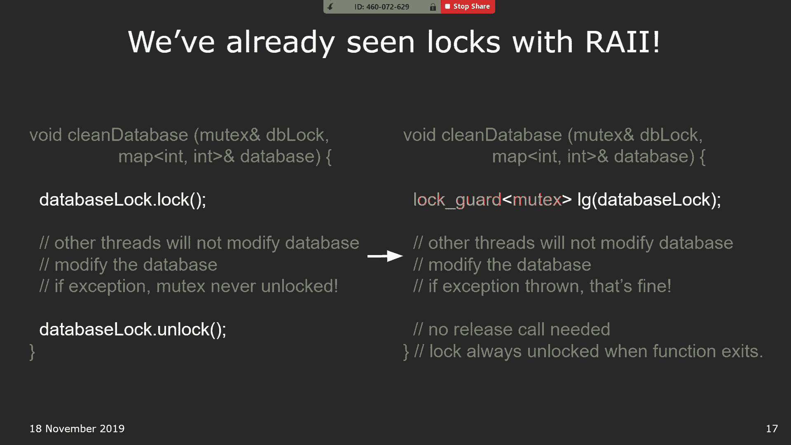

所以我想做的就是再给你们展示一下，C++ 中多线程是如，何工作的。所以要做到这一点，我们实际上要回到我们最喜欢的标准。

库。所以我要点击这个链接。太棒了。原来多线程是程序的一个核心特性，实际上它是 C++ 标准，库下的核心标题之一。所以在这个链接上，我们看到了它的五个主要部分。并且每个部分都有几件我想强调的事情。

所以第一个是原子标题。从这个原子头文件中要记住的是，如果您在程序中使用多，线程，您不想使用的是整数、布尔值、字符串之类的东西，您实际上想要使用的是这种原子等价物。所以您会注意到，如果您查看这个链接。

不是布尔值，他们，有一种称为原子布尔值的东西。而不是整数，他们有一种称为原子整数的东西。实际上，这所做的是告诉我们，这是一个类，应该保证在单，个变量类型中没有数据竞争。为了更清楚一点，这到底是什么意思？

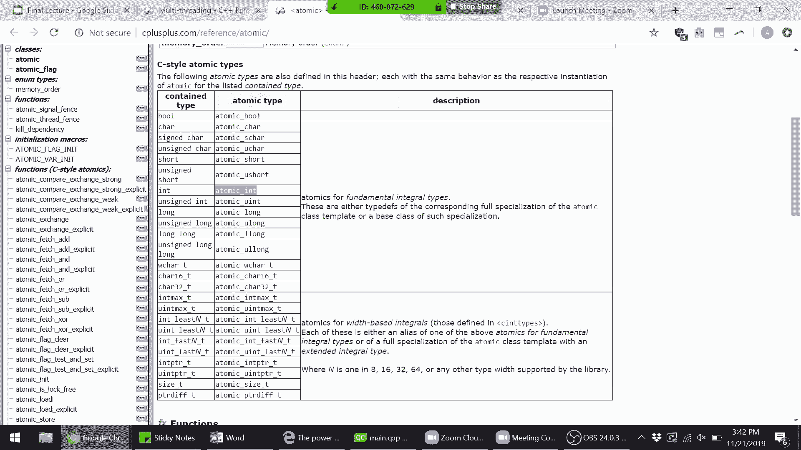

您会记得，比如在我们的例子中，我们有 B += A。

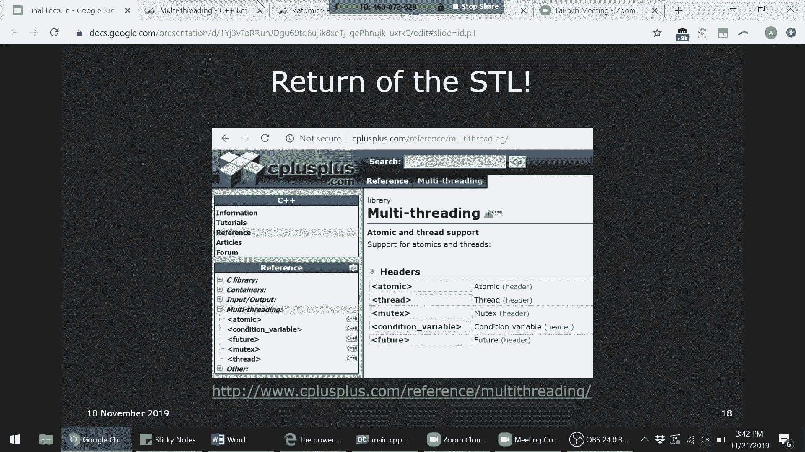

原来这个简单的加法运算实际上在底层是一系列的多个指，令。所以实际上，虽然它看起来是一行代码，B += A，但在底层，它所做的实际上类似于获取 A 的值，将 A 加到 B 上，用 。

B 的新值替换 B 的值，诸如此类。所以实际上有一系列不同的事情要做才能执行这一行代码。

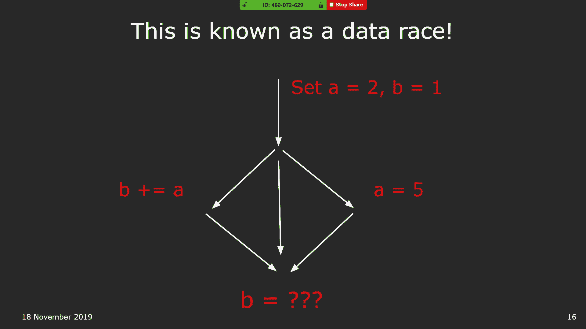

。所以原子类，哦，无限递归。

让我们看看。是的，好了。好的。所以这个原子类为我们所做的是，C++ 的设计者已经为我。

们提供了一个类，向我们保证基本上我们期望的原子操作，换句话说，一次完成所有操作的操作，实际上是一个原子操，作。所以例如，如果我们要使用，如果说 B 和 A 是原子整数，那么要添加 B += A。

我们可以使用这个称为原子取加的方，法。实际上，这就相当于加号。所以是的，所以您可以回去阅读这些。再次强调，如果您想自己使用多线程编程，这些是您想要使，用的变量和函数。我想在库中引用的其他几件事。是的。

对。是的。所以另一件事是，即使您在编写多线程程序时，也不一定必，须将每个操作都设为原子操作。所以实际上只有在事情执行的顺序确实重要的情况下。在那种情况下，那就是您想要使用原子操作的地方。

但在您程序的其他情况下，也许没关系，您不必在那里使用，它。是的。好的。所以 STL 中的线程类就是我们刚刚处理的。所以我们稍后实际上会有一个关于它的代码演示。所以我现在先跳过这个。我想提一件事。

所以上次我们有一个很好的问题，就是我们引入了锁守卫，这个概念，有人问了一个问题，这可能吗？所以似乎存在一个奇怪的问题，即锁保护器只有在离开作，用域时才会解锁，但你可能想要在函数内部进行解锁和加，锁。

我们之前说过，你可以使用这种作用域操作符，只需插入两，个大括号来形成一个新作用域。这实际上是一个完全有效的解决方案。结果是还有另一种解决方案。所以我想在上次的答案基础上再补充一点。

锁保护器是你可以用来包装锁的包装类之一，并且仍然符，合 RAII 标准。实际上还有另一种类型的保护器，叫做唯一锁，就是这个。它的功能实际上是我们上次寻找的那种，它允许你在声明，锁保护器时。

可以在函数内部加锁或解锁，但它保证当保护，器离开作用域时，它会确实解锁。所以它做的事情和锁保护器一样，只是你可以在中间加锁，或解锁，但它仍然保证你的锁在作用域结束时会被解锁。所以是的，我想提到这一点。

因为有人对这个问题提出了很，好的问题。所以实际上库中确实有可以做到这一点的东西。嗯，到目前为止对这两个类有什么问题吗？是的，这部分是让你了解标准库中的内容，以便你知道在编，写自己的程序时要寻找什么。

然后这部分将更具概念性，比如，如何处理多线程程序？是的，它们为什么有趣？是的，好的，让我们看看。所以这最后两个，我不会深入讨论条件变量，你将会经常使，用。如果你继续上更高阶的 CS 课程。

你可以把它们看作是两，线程之间的通信方式。条件变量允许你发信号或等待信号。所以是的，条件变量可以看作是两线程在运行时相互通信，的方式。这个未来类有点有趣。有没有人使用过 JavaScript？好的。

有一点。好的，是的。所以在 JavaScript 中，有一个 await 的概念，或者说异，步函数的一般概念。结果是 C++ 也有这个。它就在这个未来类中，位于最底部。所以是的，只是提醒你一下。

如果你需要异步函数，你可以，使用未来类。对于异步函数的简要概述，你可以把它们看作是一种启动，自己的线程并等待该线程响应的方式。所以通常的做法是，你会做一些像是，在一个新线程中发送，网络请求。

所以它会构建网络请求并在一个独立的线程中发送它。只有在收到响应后，它才会返回到你的原始线程并带回响，应。所以这就是异步函数的想法。是的，如果你之前没听说过也没关系。

这是在像 JavaScript 这样的语言中常见的东西。是的。对这方面有任何问题吗？

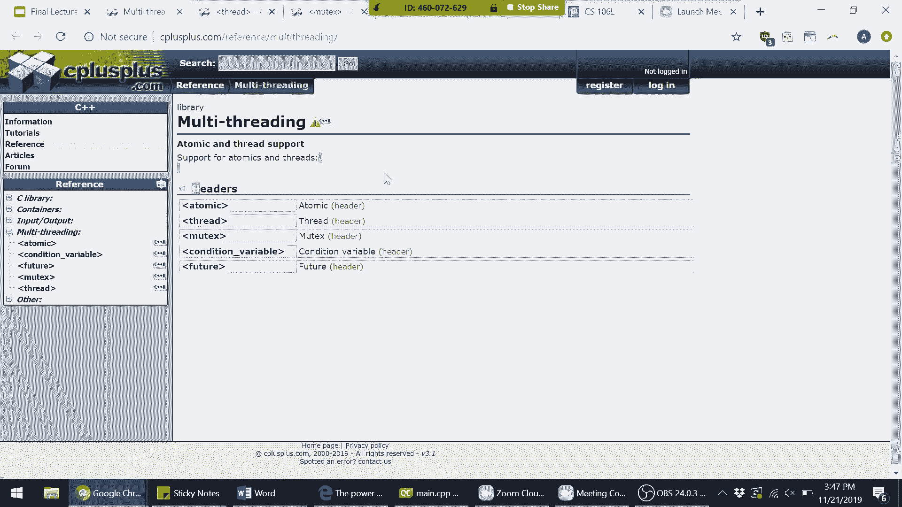

没有。好的，完美。

在这种情况下，我们将做的是，是的。

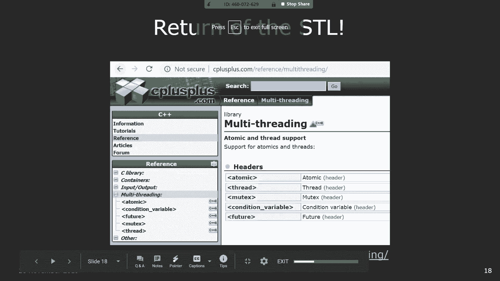

好的。所以这张幻灯片列出了我所说的内容。再次提到，锁保护与唯一锁。有几种不同类型的所谓互斥量，你可以使用。是的。其中一个有趣的类型是递归互斥量，它表示一个线程可以，多次获取该线程的锁。

你可以把它想象成拿着一块粉笔，但可以对这块粉笔声称，拥有权利多达七次。然后要释放对粉笔的拥有权，你需要说，啊，我释放这块粉，笔的拥有权七次。这就是递归互斥量的概念。再次，旨在给你一个广泛的了解。

让你知道你可以使用和尝，试的东西。好的。现在，我认为我们将进入比较有趣的部分，即看到多线程的，实际应用。在我进入代码之前，有人对多线程、锁、数据竞争等概念，有任何问题吗？好的。是的，布莱恩。

当你实现计时器时，你需要使用这个吗？是的。所以当你实现计时器时，你需要使用这个吗？实际上，如果你继续学习所有系统类，你实际上会实现多个，计时器，这有点有趣。但是是的，绝对需要。

计时器的工作方式类似于这个。根据你实现它们的方式，它们可能会使用我们提到的条件，变量，这些变量依赖于等待信号或发出信号给其他线程等，是的。是的，对。是的。这是个很好的问题。在这种情况下，我们仍然。

使用原子类。所以再说一次，为了记录，问题是原子类，使用原子变量和，原子方法如何实际影响这个场景？在这种情况下，它实际上没有影响。原因是，因为在这种情况下，我们调用的唯一原子操作是加。

法等于本身或像 A 等于 5 本身。但我们没有保证像 A 等于 5 然后 B 加等于 A 这样的操，作是整体原子的。所以在这种情况下，使用那个类仍然会导致我们得到 B 的，任意值。

你可以想象它可能更重要的地方是在一些情况下，这是一，种你在 CS110 中肯定会看到的情况。这是一种被称为“你有牛奶吗”的情况，一般概念是，假设你，和一个室友住在一个房子里。你有一天回到家，打开冰箱。

发现牛奶用完了。然后你当然去商店买一瓶。但问题是，当你去买牛奶时，你的室友回家了，检查了冰箱，看到冰箱开着，看到是空的。然后室友想，好吧，我最好去商店买两瓶。然后你们现在有了两瓶牛奶。

这比你想要的要多得多。所以在这种情况下，你会发现问题的原因是你检查是否需，要某样东西，然后真正满足这个需求的过程不是原子的。因此，你可以通过类似的方式使用原子操作来确保它们是，原子的。在那种情况下。

特别是情况，我相信你仍然不能做到，因为，这不是像加法等于那么基本的操作。是的。但这保证了，例如，当你检查 A 的值时，当你存储 B 的值，时，它仍然是一致的。是的。是的。好问题。好问题。是的。

还有其他问题吗？

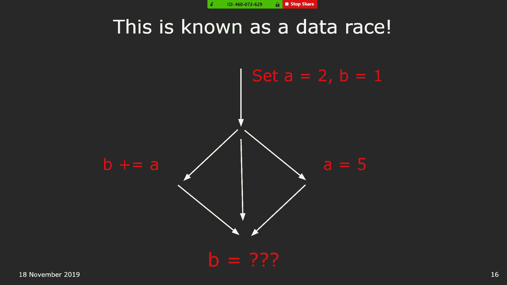

好的。好的。那么在这种情况下，我们来看看线程是如何工作的。

所以我们要去这个文件。

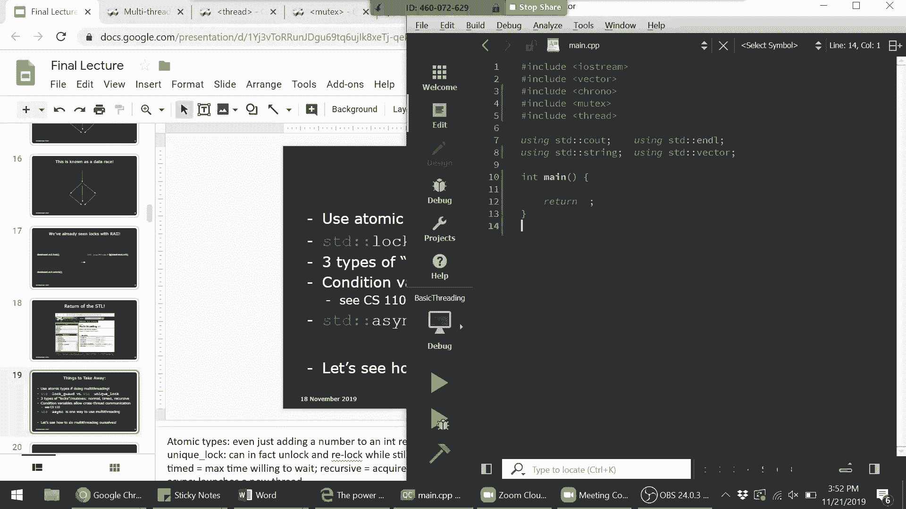

好的。所以在这里，我有一个文件，它不多，但我已经导入了一些，我们需要的库。所以这个想法是，我会写一点，并在进行中解释我在做什么，线程的想法是这样的。假设我们想要有两个线程。我们将使用它们的方式是。

再次使用这个线程类，叫它们 ，Thread1 和 Thread2。你使用线程的方式是，你可以将它们想象成工人。你可以将它们想象成早些时候为演示自愿参与的人。所以线程总是需要它要做的工作。在这种情况下。

假设我们要定义一个叫做 greet 的函数。这些线程的唯一工作就是运行那个函数，然后完成后返回，所以在这种情况下，我们会说 greet，然后我们实际上来写，那个 greet 函数。

第二个线程也会做相同的事情。所以我们来写一个函数 greet，它会接收一个 int i，作为，线程的 ID。所以我们叫它 int ID。它所做的就是，假设它会输出，大家好，我的名字是，好的。

然后它就做这些。回到声明线程的语法，所以每次你声明一个线程时，你都要，告诉它要做什么工作，在这个情况下就是 greet 函数。然后在语法上，你只需要在之后传递参数给那个函数。在这种情况下，只有一个参数。

ID，所以我们把它叫做 ID 1，然后对于这个 greet 函数，我们叫它 ID 2。在这里，我们实际上可以做的就是，你可以想象线程在你的，程序中如何工作的，一旦你在程序中声明了一个线程，它会。

立即开始尝试执行它的工作。所以一旦你声明了 std thread， thread 1， greet， 1，它，会立即开始尝试输出它想要输出的内容。同样当你声明线程 2 时也是如此。

所以我们来看会发生什么。啊，好吧，实际上，在我们这样做之前，最后我们来看看所有，绿色完成的情况。好的，所以有人猜测一下如果我现在尝试运行程序会发生，什么？这有点棘手。具体来说，你认为它会输出任何内容吗？

除了线程的问候和所有问候完成之外的内容？它可能连这些也不会输出，因为你使用了一个未编码的标，识符。这是个很好的观点。这是确切的问题。这是确切的问题。更好。好的。好的。这是热身环节。你们做得很好。好的。

所以让我重新陈述我的问题。有多少人认为，“大家好，我的名字是 1”会被输出？每个人都觉得这一定是个难题问题。有多少人认为，您好，我的名字是 2 将会被输出？好的，是的，这公平。如果你不认为 1 会。

那么 2 也不会。所以实际上，你们的直觉，在某种意义上，哦，给我一秒钟。

为什么是 Greek comma 1？是的，这只是声明线程的语法。

不，我不是故意这样做的。

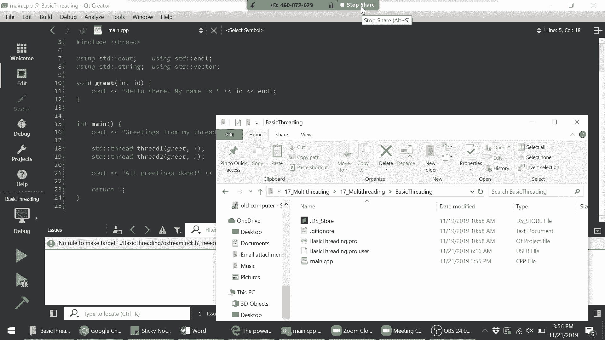

啊，是的。好的，这个原因是因为，回答 Brian 的问题，之所以是 。

Greek comma 1，仅仅是因为从语法上讲，将任务传递给工，作线程的方式是列出任务的名称，然后在逗号后面列出该，函数所需的所有参数。是的，这只是语法问题。好的，这有点有趣。

所以这里有很多事情发生。首先要注意，好的，我们确实打印了来自我的线程的问候语，并且我们确实打印了所有问候完成。但所有问候完成发生在任何的，您好，我的名字是 之前。而且进一步来说。

这两个输出的顺序非常混乱。所以现在先忽略这些，集中在这两个上面。为什么所有问候完成发生在任何两个“您好，我的名字是” ，的输出之前？啊，是的，确切的。更一般的想法是，我们不能忘记主函数本身仍然是一个运。

行中的线程。所以如果你记得我们之前的图示，我们有两个线程分支出，去，但主函数仍然在中间运行。是的，这就是一般的想法。实际上，我之前的问题是个陷阱问题。

数据竞争的难点在于它们是不可预测的。所以我们实际上不能预测主函数是否会完全结束，才会出，现任何输出，或者是否不会。为了使其更清楚，我们可以使用，让我确认一下我是否正确，地得到语法。我们可以使用。

这是 STD 线程类中的一个函数。它允许我们告诉特定的线程休眠一定的秒数。所以让我们让它休眠五秒钟，以确保安全。所以现在我期望的是，主线程在这两个线程可以执行它们，的输出语句之前完全返回。

所以让我们测试一下这个假设。

好的，完美。有人能告诉我为什么添加睡眠语句实际上帮助我更有保障，地使这两个输出不打印吗？

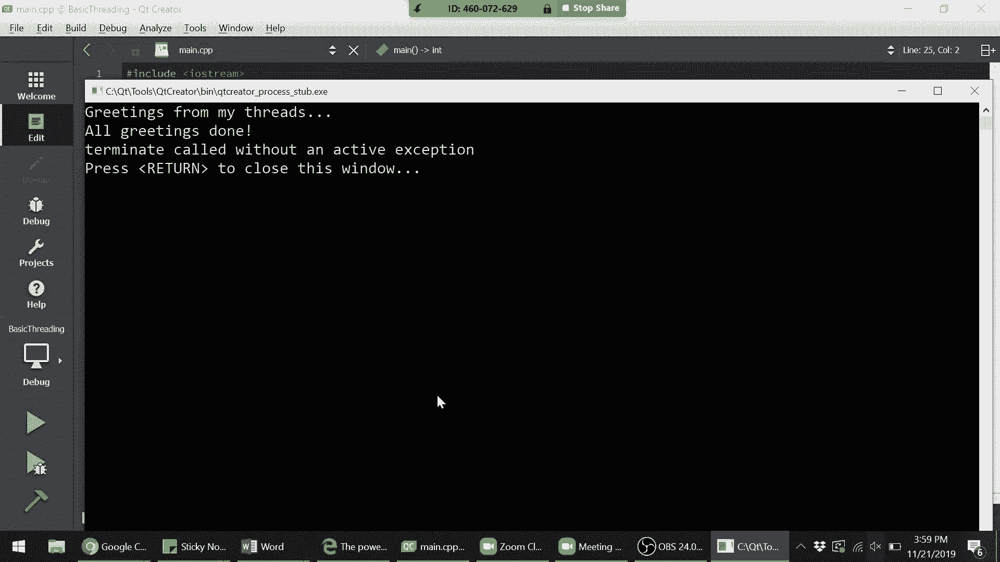

为什么会这样？绝对正确。完全正确。所以再说一次。因为我们迫使这两个线程等待，我们确保主函数先结束。而当主函数结束时，这两个线程也会超出作用域。正如 Byron 所注意到的那样，我们在主函数中声明了这两。

个线程。所以一旦主函数结束，这两个线程也超出作用域。

这就是为什么我们得到这个错误，终止调用没有活动异常，它抱怨这两个线程由于某种未知原因被终止。

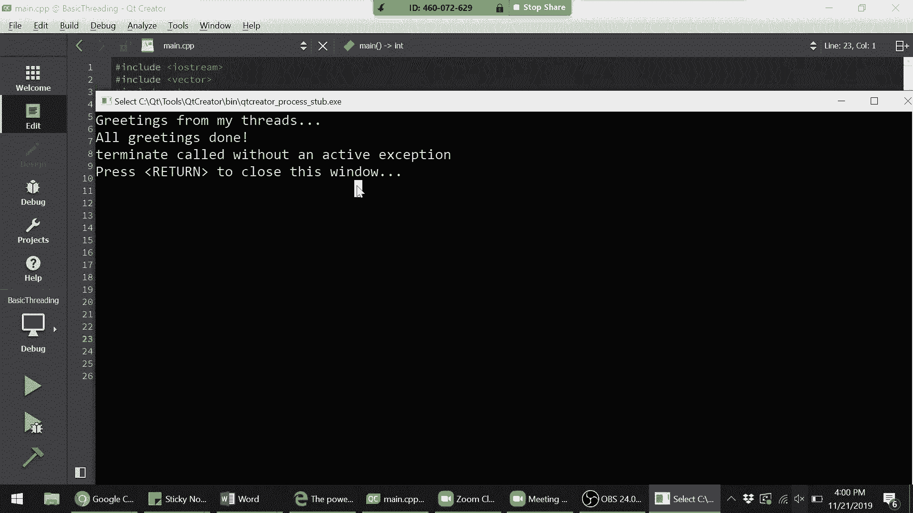

好的。是的。到目前为止，有人有任何问题吗？关于基本线程使用的？没有。好的。所以就像多个东西，同时作为字符串字符串？是的。所以这是个好问题。你能再澄清一下你的问题吗？所以把多个东西放进去。

因为这次我注意到你没有，当你运，行它的时候，就像上次你运行它的时候，你有像 T2ERMI、。

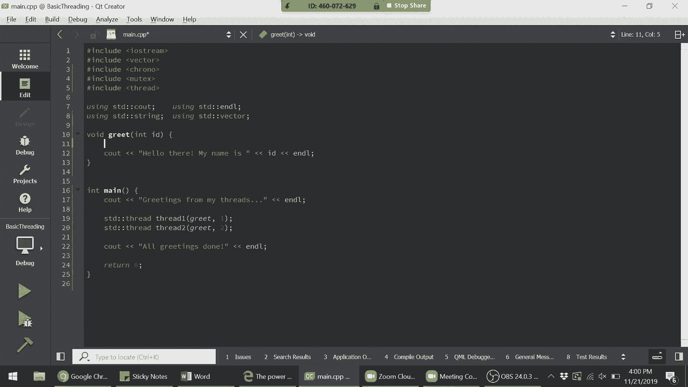

T2 terminate，因为这两个进入了 C。正是如此。是的。像你还在试图查看其他东西时，所以你看到它如何能够自，动一次接受多个东西？是的。所以这是个好问题。所以问题是，为什么这些输出会重叠呢？

为什么，这个 terminate 为什么会和这个“我的名字是 ，2C”重叠？所以答案是，再次查看 C out。

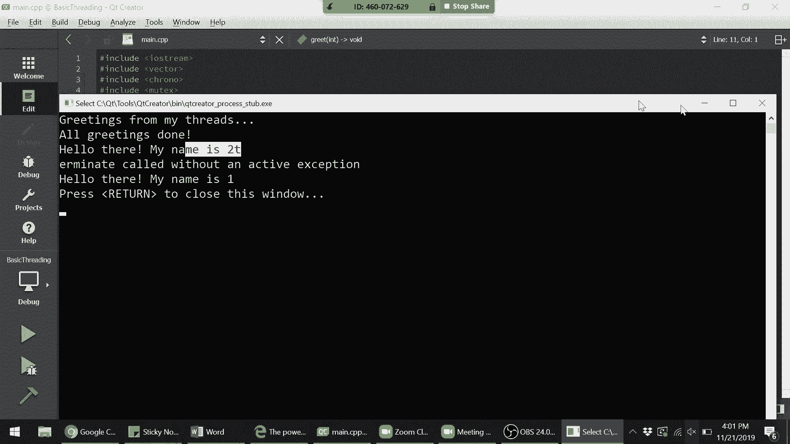

你认为这一行是一个原子操作吗？谁认为是的？谁认为不是？好的。能有人解释一下为什么吗？是的。所以，实际上即使只看这一行，我们会发现实际上有多个操，作在进行。注意到即使显式地。

我们在这一行有三个不同的、类似的，操作。而且记住，这是因为这个插入运算符返回的是流本身。这就是允许我们改变 C out 表达式的原因。所以正是如此。所以我们不能保证这一行会一次性执行完。

所以实际上我要问你们，我们如何才能保证所有这些 C ，out 会在同一时间发生？你们认为我们可以使用什么？说得大声点。一个锁。好的。我不知道这是否大声一些，但就这样吧。我们绝对需要一个锁。好的。

所以我们可以做一些像我们有一个，这叫做互斥量。所以我们叫它一些互斥量。然后我们如何声明这个互斥量？一个想法可能是，我们可以说像这样。这引起任何人的注意吗？哦，好的。梅森，绝对是的。是的，正是如此。

所以我们如何使它符合 RAII？完美。正是如此。所以，再次，锁保护器的语法。再一次，如何使其符合 RAII 的想法是，将其包装在另一个，可以处理析构函数和构造函数的类中。在这种情况下。

语法是使用 STD lock guard。结果是锁保护器实际上是一个模板类，因为它可以接受我，们讨论过的递归互斥量。它可以接受定时互斥量。所以这就是为什么我们必须使用互斥量并且必须是 STD。

我也可以在上面声明 STD mutex，但，然后我们将其称为 ，lock guard。然后在括号中指定我们要保护的锁。在这种情况下，就是这个互斥量。太棒了。然后注意到我不需要做任何显式的解锁。

因为当锁保护器，超出范围时，会为我处理这个问题。好的。现在谁认为 C outs 会很好看？好的。好的。有多少人认为 C 输出看起来不会好看？好的。好的。有几个。好的。不错。不错。

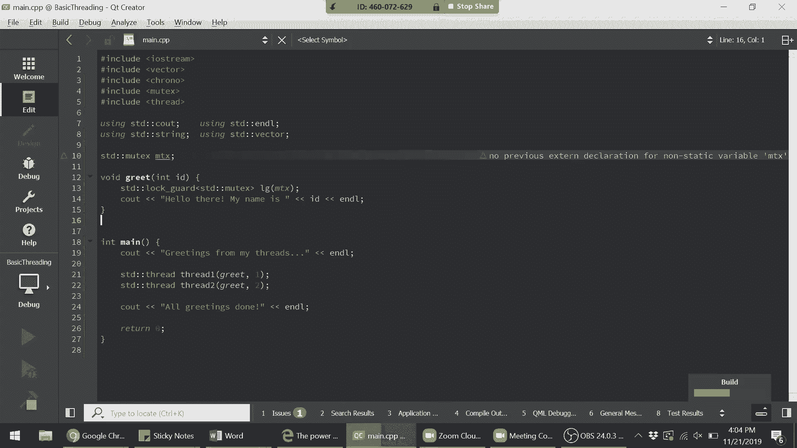

我认为在这种情况下我们总是开的玩笑是，啊，关于，关于，投票，美国的投票比例，比如十个人里有三个，类似这样。好的。太棒了。所以，啊，对。所以我们实际上仍然没有解决主函数先结束的问题，这就。

是为什么这仍然有重叠，但您会注意到不管怎样，“你好，我，的名字是一”和“你好，我的名字是二”确实完美执行了。所以实际上，是的。所以那个 T 实际上来自这个，这个终止消息。所以实际上。

为了使其不那么令人困惑，并且因为这很重要。

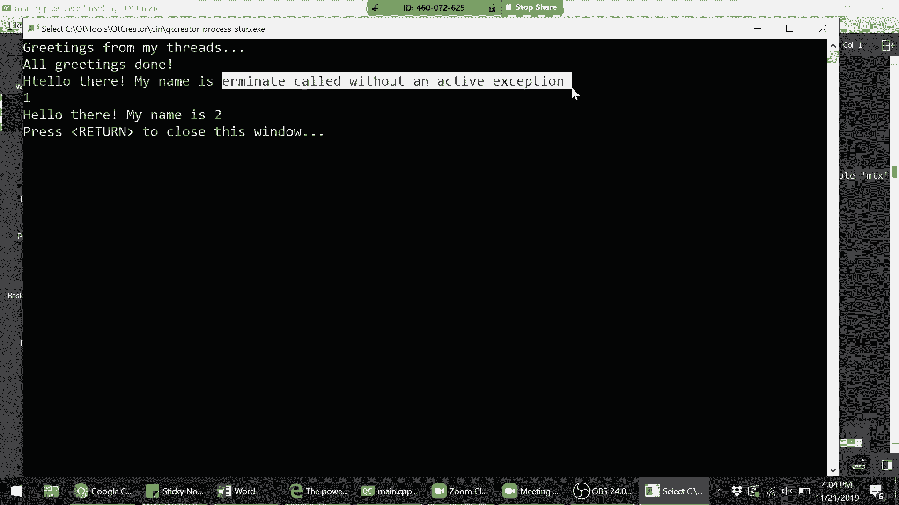

，让我们实际上修复那个消息。所以再一次，问题是现在我们的主线程，在它的两个线程能，够自己结束之前就完成了。所以我们解决这个问题的方法是，我们必须告诉主线程在，我们希望。

在我们希望它结束之前明确等待它的线程完成，运行。所以我们这样做的方式是，我们，那个语法就是，我们获取，我们想要等待的线程。然后这是一个叫做 join 的函数。所以您可以这样想，啊，好的。

我们希望线程一重新加入主，线程，主线程和线程二重新加入主线程，然后主线程才能继，续执行。所以会发生的是，这个主函数实际上会在这里等待，直到线，程一完成，并在这里等待直到线程二完成，然后才继续执行。

其他任何行。好的。所以让我们看看现在会发生什么。

啊，我们终于有了我们期望的程序。好的。所以问题，只是为了确认理解，这两行可以交换吗？“你好，我的名字是一”和“你好，我的名字是二”。谁认为它们实际上可能以相反的顺序结束？谁认为它们不能。

必须是一然后是二。

好的。是什么，为什么，解释一下为什么您认为它们必须是这个顺，序？啊，好的。是的。所以这是从我们编写的方式来看完全有效的、有效的假设，所以这是一种棘手的事情，这就是为什么我想提出来。而且对不起。

大多数问题通常不是故意刁难的问题。这个也不是。所以是的，所以这实际上是一个非常常见的误解，这也是为，什么提出来非常重要。所以即使主线程在等待线程二加入之前等待线程一加入，线程本身可以在任何时候结束。

所以另一种演示方式是假设这个主函数实际上有，比如说，让我们做很多非常，非常繁重的工作在中间。当它在做那个繁重的工作时，很可能在某个时候这两个线，程完成了。所以实际上这个 join。

这个 join 调用所做的实际上是，您可以想象成只是在任何时候检查这个线程是否完成的布，尔值？如果是，那么好的，我可以立即返回。如果不是，那么我必须在这里等待直到它完成。所以是的，所以在这种情况下。

这两个线程可以在任何时候，执行。但确实主线程在线程一完成之前不会检查线程二是否完成，这是否有意义？因为这有点儿，这有点儿难。很好。好的，我看到赞成的手势。非常好。好的。是的。

我们正慢慢地涵盖所有最基本的线程方面。所以这非常好。好的。所以我还想强调的是，至今我们只使用了两个线程，但实际，上这可以与任何数量的线程一起工作。假设，我们在顶部有一些常量。假设我们想要运行10个线程。

那么在这里，我们可以使用像向量这样古老的东西，而不是，显式声明每个线程。所以我们实际上可以有一个线程的向量。线程就像其他类一样，你可以使用我们学过的数据结构。所以我们称之为线程的向量。

然后为了按预期初始化它们，对于i小于k个线程，我们将执，行threads。push_back。然后和之前一样，在这种情况下，如果我们想的话，我们可，以使用到目前为止在这个课程中学到的统一初始化器，但。

也不是必须的。所以这个默认初始化器，就像之前一样，我们传入函数和id，然后最后一次，我们要等待所有线程返回。所以我们将执行像std：thread t for threads，然后，t。join。好的。

大家明白我刚才做了什么吗？是的，好的。所以为了再次测试理解，如果我们不是在这里有一个单独，的for循环，似乎，哦，为什么我们有两个for循环？如果我们在这里直接执行threads[i]。

join会发生什么？会有什么问题？是的。正是如此。所以再大声一点，这将调用一个线程，然后等待它结束，然，后另一个线程，然后等待它结束。你会注意到这听起来像是串行执行，就是非并行化的执行。

所以你实际上写的就是与我们迄今为止编写的串行程序完，全一样的程序。正是如此。所以这就是为什么我们首先要启动所有线程，以便它们可，以同时执行。然后在最后，我们要测试所有线程是否已经加入。是的，Byron。

这是一个很好的问题。所以是什么控制了每个线程的执行顺序，基本上，是什么控，制了线程的执行顺序？这实际上是大量研究的主题。是的，事实上，如果你继续上系统课程，这也是你将广泛学，习的主题。

所以这是一个非常关键的问题。大致的原理是，你的CPU中有一个调度器负责调度哪些线程，同时运行。为了让你对这如何工作有一个感觉，你可以想象实际上每，个线程在CPU上获得的时间片通常非常短。

你可以想象每个线程，线程一得到一毫秒，然后线程二得到，一毫秒，然后线程一再次得到一毫秒，以尽可能多地执行。然后，调度程序的角色，实际上是一个独立于任何线程的特，殊内核线程。

负责决定接下来要运行哪个线程以及如何在，其他线程运行时保存每个线程的状态。是的，这些算法如何最佳调度不同线程，这实际上是很多研，究的主题。是的，这是个好问题。是的，有什么事吗？是的，实际上。

这正是我接下来要问的问题。所以这是个好问题。是的。那么我们为什么会有这个线程和？那么这个和有什么重要的呢？或者它是否根本不重要？是的。是的。所以你可以想象一下，如果我们没有这个和会发生什么，你。

会记得每次。首先，你会注意到它有一个错误信息，提示删除复制构造函，数。但这就是原因，因为记住，当我们不进行引用传递时，我们，在传递什么？复制。是的，更大声一点。是的，完全正确。通过复制传递。

那么当我们声明一个新线程时会发生什么？我们刚才说，当我们声明一个新线程时会发生什么？对了。所以正是这样。所以如果他们没有删除复制构造函数，那么在这里发生的，情况是，我们实际上会启动10个新线程。

因为我们刚复制了，10个新线程。是的，完全正确。所以这就是为什么我们需要通过引用传递。而这个&符号只是表示我们通过引用而不是通过值进行访，问。是的，很好的问题。好的。所以我们可以看到。

运行一下以确保我们正确运行了。

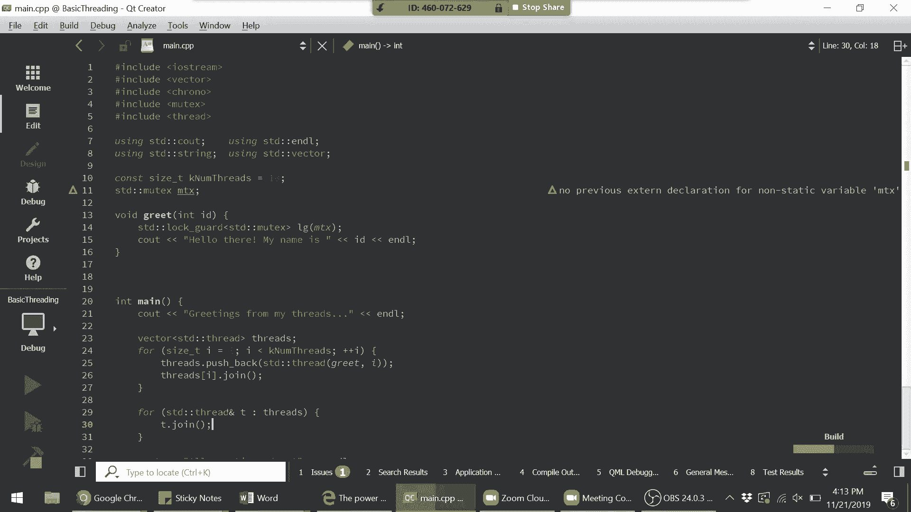

那太完美了。

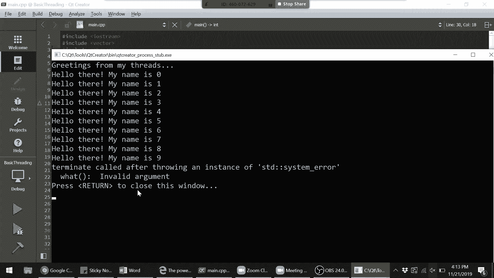

好的。我认为那是系统错误。我实际上不确定那是从哪里来的。我得查看一下。但好的，这就是我们关于多线程和C++的速成课程。你们到目前为止有任何问题吗？是的，继续说。是的。

多线程和多进程之间的区别就像我们上课开始时的，演示一样，这实际上也有更详细的答案。它们确实有不同的优点和缺点，例如进程比线程隔离得更，多，等等。完全正确。所以多进程。

你可以将其想象为多线程的一个更大版本，但，具有一些额外的特性。我们可以课后再讨论这个问题。是的。所以，如果你在线搜索多线程和多进程之间的区别，你会得，到一些答案。但这实际上是一个比较细致的问题。是的。

你有问题吗？对的。是的。有没有工具可以查看同时运行的多个线程？在GDB中确实可以查看线程。不过我忘记了确切的语法。在GDB中确实可以做到。我在想是否有其他的软件。我几乎可以保证有。

但我也可以在讲座后再看看，看看是否能找到什么。但绝对可以在GDB中检查。是的。对的。所以这会检查所有正在运行的进程。你说它还检查不同的线程吗？好的。好的，完美。所以看起来这是否是一个Linux命令？

好的。好的。是的，正是如此。H top。H top。哦，top也是。哦，是的。好的。当然了。当然了。明白了，你使用的。是的，绝对的。是的。谢谢。谢谢。这是一个很好的参考。是的。布莱恩，你也有问题吗？

太棒了。是的。所以讲座后我会再次把这段代码发布到网站上。所以我们只剩下四分钟了。我本来打算多讲一点我们的AI。

但我大部分时间会浏览一下，告诉你们需要注意的事项。如果你们感兴趣，可以回去深入了解。但首先是公告。这是我们最后一节课。所以我想给大家一个掌声，感谢你们作为优秀的学生，整个，学期都坚持下来了。

给自己一个鼓励吧。希望你们现在都能互相认识了，并且在街上见到时会打招，呼。是的。然后也代表我和艾弗瑞，课后保持联系，随时给我们发邮件，即使我们的Piazza可能会停用，但我们心中的Piazza永远。

有效。所以，是的，随时发邮件给我们。我们也很希望保持联系。是的。我们也会在街上向你们打招呼。是的。所以。所以，再次感谢你们。所以我会再次简要概述一下这些幻灯片中的重点。如果你们想回顾RAII。

大体思想是，再次强调，我们使某物，符合RAII的方式是使用一个包装类，这个包装类处理在对，象超出作用域后销毁的逻辑。我们上次看到，有两种方法可以使用指针来实现这一点。我们可以使用独占指针或共享指针。

我想在你们心中，重新考虑一下这两者之间的区别？这里有一个稍微复杂的点，就是如何创建独占指针或共享，指针？这里有一种创建方法。但实际上，课堂的后半部分的主要 takeaway 是，这实际上。

不是你想要声明独占指针或共享指针的方式。事实上，你想要声明它的方式是使用这两个内置的智能指，针创建函数。创建函数不是一个官方术语。它们只是没有官方术语，所以我造了一个。具体而言，有这两个函数。

make_unique 和 make_shared。每当你尝试创建一个新的独占指针时，你要做的是使用 ，make_unique 这个类型或 make_shared 这个类型，而不是。

传入这个 new node。然后，实际上所有接下来的幻灯片都是关于为什么这样做，的。而且这实际上非常有趣。如果有人感兴趣的话，我可能会在第十周的某个时间主持，一个简短的讲座来谈谈这个话题。

因为这确实是一个非常，有趣的内容，实际上涉及到竞态条件。所以它非常与我们学习的多线程相关。但你也可以浏览这些幻灯片。不过，最重要的是你总是希望使用 make_unique 或 ，make_shared。

而不是明确地调用 new node。

而且，可以告诉程序员的是，在 C++ 中，我们现在几乎不会，调用 new 或 delete。即使在处理原始指针时，即使我们仍然想使用像 int* 这，样的东西。

这个 int* 几乎不会来自我们明确调用 int* n， = new int。它总是会是对另一个现有引用的引用。这是其中一个重要的收获。再说一次，现代 C++ 最大的新概念之一是我们基本上已经。

摆脱了 new 和 delete，这非常棒，因为它消除了很多过去，困扰 C++ 的内存泄漏问题，并且导致了很多安全漏洞。

因此，有一个问题在论坛上有人问，接下来我该怎么做？我怎么继续学习更多的 C++？如果我想学习新的东西会发生什么？首先，继续提升你的 C++ 技能的最佳方法就是使用 C++。无论是你想建立的个人项目。

还是你去工作的地方，或是在，你的课程中，是的，多使用 C++。使用现代 C++。然后，如果你真的感兴趣，还有很多 C++ 的阅读材料你可，以参考。我会推荐的有这五本书。并不是说你必须读完这五本书。

而是看哪一本对你有吸引力。例如，"Effective Modern C++" 提供了现代 C++ 关键新，特性的一个很好的概述。另一个好的在线资源是赫布·萨特，他是 C++ 的共同创始，人之一。

他写了一个非常好的在线博客。所以如果你搜索“赫布·萨特 C++ 博客”，你会找到他的博，客。这个博客解释了很多 C++ 的独特特性和一些需要注意的，复杂点。所以，谢谢大家。祝贺你们完成了。哦，天哪。

是的。从物流上讲，我们下周仍会为第三次作业提供办公时间，如，果你感兴趣的话。是的。我可能会举行一个小讲座来完成第二部分，因为这部分非，常有趣。但你们做得很好。祝你们有一个愉快的感恩节。

祝你们有一个愉快的感恩节。祝你们期末考试好运。等一下。是的。对于三重指针，我们可以做像 unique、shared、shared ，这样的吗？一个 unique、shared、shared 指针。是的。

你完全可以。你完全可以。所以你会得到一个独占指针，指向一个共享指针，指向另一，个共享指针。

