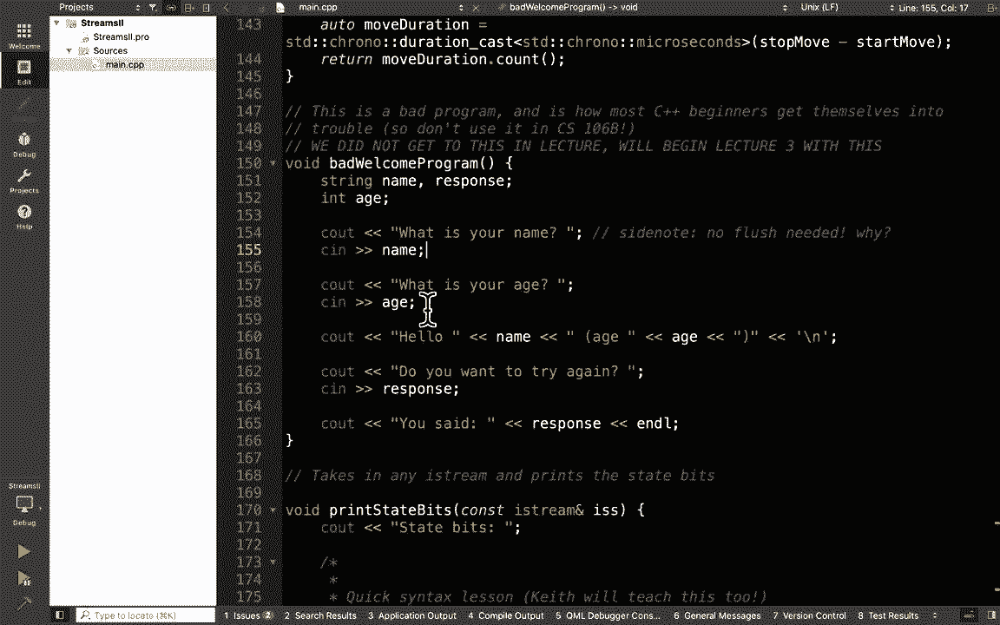
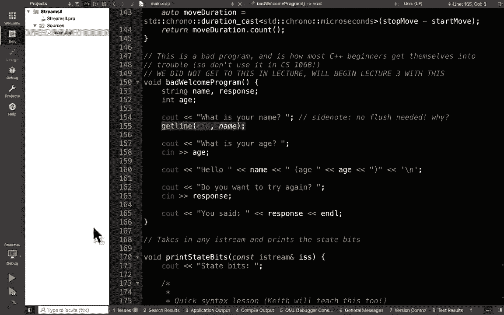

# 斯坦福大学《CS106L： C++编程｜ Stanford  CS106L C++ Programming 2019+2020》中英字幕（豆包翻译 - P3：[4]CS 106L Winter 2020 - Lecture 3_ Types and Advanced Streams - GPT中英字幕课程资源 - BV1Fz421q7oh

好的，我们开始吧。那么，今天的计划是，我们将完成对输入输出流的讨论，然，后我们会先做简单的 I-O，再讨论现代 C++ 类型。文件流你们在 106B 里已经学过了，所以我们不再重复讲，解。明白了吗？

但文件流的工作原理与输入输出流类似。我们会简单讨论一下它们的区别。好的，那么简单回顾一下，上周我们使用字符串流来解析字，符串，并将其拆分成不同的标记。例如，我们学习了输出字符串流。

然后我们可以利用字符串流的功能在字符串类型和我们想，要的其他类型之间进行转换。所以，在这个例子中，我们尝试将 STR 中的不同标记转换，为整数类型。大家，这个对上周的内容还记得吗？是吗？好的。

现在有关于这个的任何问题吗？这基本上是我们上周写的代码。唯一的区别是，上次我们有两个 if 语句。这次我把两个 if 语句合并成了一个，没有提供详细的错，误信息。明白了吗？很棒。是的。

我们还没有到达这个点。好的，那么让我们来看看这段代码。

所以，这段代码写在这里。明白了吗？写在这里。坏的欢迎程序。所以，我希望你们尝试运行坏的欢迎程序。在你的主函数中尝试运行它。然后，好的，尝试运行这个函数，随便玩一玩，看看你得到什。

么。所以，我猜大家都在玩这个函数。你可以对它有一个很好的了解。它是做什么的？它会询问你的名字，询问你的年龄。然后打印出“你好，名字”和给定的年龄。你想再试一次吗？你输入一些东西，它会告诉你你说了什么。

好的，这里没有重新提示。这只是一个简单的程序。现在，代码写在这里。

C 输入，读取到一个字符串变量中。C 输入，读取到一个整数变量中。然后我们打印出名字和年龄。在这个例子中，我添加了一个额外的空格。然后 C 输入响应读取响应。明白了吗？那么，作为一个快速示例。

假设我们来看看 C 输入和 C 输，出是如何工作的。C 输入和 C 输出，有点像输入字符串流，但有一个主要区，别，那就是当你尝试读取更多的标记时，如果缓冲区中没有，标记，换句话说。

如果你尝试读取并且显示 EOF，那么 C 输，入会使整个程序停滞，等待用户输入一些东西。明白了吗？所以，当你请求 C 输入，箭头，箭头，名字时，C 输入缓冲区，中没有内容。

这就是为什么当你尝试在程序中运行它时，程，序会冻结并等待你输入一些东西。好的，大家都遇到过这种情况吗？程序冻结了，然后你可以在键盘上输入一些东西，对吧？

作为一个明确的演示。

是的，请注意我们没有打印其他内容。它说“你叫什么名字”，然后在这里暂停，因为它在等待用户，输入一些东西。所以，如果我输入 Avery，那么它会进入下一个阶段，我们。

输入了 Avery。并且记住，当你在Avery中输入并按下回车键时，它也会将，那个新行字符包含到缓冲区中。一旦它能够将某些内容读入缓冲区，它就会尝试读取一个，标记。所以，它在这里读取一个标记。

它并不会读取到空白字符。它只会读取到遇到空白字符为止。明白了吗？在未来的CN操作中，它会跳过空白字符，然后尝试继续读取，所以，在这里，在这个调用中，它首先跳过初始的空白字符，并且注意到，哦。

剩下的什么也没有了。EOF（文件结束）已开启。

然后它能够提示用户输入另一个标记。所以，在这里，这就是为什么它现在提示你输入年龄。

明白到目前为止了吗？好的，提示和缓冲区之间的关系，你明白了吗？到目前为止有任何问题吗？好吧，是的，需要注意的是提取器，它会跳过任何前导的空，白字符，并且读取到空白字符，但不会消耗下一个空白字符，好的。

所以在这里，CN读取到空白字符，但不会消耗空白字，符。只有当你再次调用CN时，它才会跳过空白字符，然后尝试读，取标记，好吗？这将在稍后我们讨论常见的CN错误时出现。所以，假设我输入了20。

那么它能够读取20并且意识到它是，一个整数，因此成功将年龄转换为20。然后，当你能够打印CNAME和年龄时，它能够打印我的名字，和20。当它到达CN并且响应时，缓冲区为空，因此它能够提示用户。

输入另一个响应。所以，你输入“是”或其他内容，好吗？关键点，让我们看看。让我们通过关键点来回顾一下。程序何时提示用户输入？Andy？是的？等等，这是什么？我们将在下一个幻灯片上看到，是的。但确实。

这是一个非常糟糕的欢迎程序。好的，所以我们来快速回顾一下。程序何时提示用户输入？是的，那CN具体发生了什么？所以，当缓冲区中没有剩余内容时，CN才会被提示，对吗？这时它能够询问用户更多内容。好吧。

为什么说操作不会立即打印？我们可以跳过这个。位置指针跳过了吗？位置指针是在标记之前还是标记之后跳过空白字符？之前还是之后？之后。位置跳过空白字符，它跳过标记之前的空白，对吗？所以，在这个例子中。

如果你输入任何内容，一旦你输入，它，只有在这次操作中才会跳过空白字符，明白了吗？但当你输入其他内容时，当CN尝试提取年龄时，它读取到空，白字符，但不会消耗空白字符。只有在下一次操作时，才会消耗空白字符。

明白了吗？这是一个小细节，将来会成为错误的来源。很酷。跳过这些。现在，让我们尝试理解为什么这是一个糟糕的输入程序。

事实上，我希望你尝试一下。尝试输入一些内容来使程序失败。好的？所以，一个明显的就是，好的，不输入年龄，输入一些不是数，字的随机内容。这会失败。有没有其他方法可以让程序失败？空字符串。好吧，所以空字符串。

如果你输入空字符串，缓冲区仍然是，空的，所以没有任何反应。好的，很好。还有其他方法可以让程序失败吗？这里有一种方法。我要输入我的全名。好吧？现在，看看会发生什么。好吧，坐在你旁边的人，看看这个输出。

尝试解释一下，暂时，不要解释为什么。只需解释一下你看到的症状是什么。开始吧。是的，我想，大约20个。好的，所以，一步一步来。从最上面，你注意到的第一个症状是什么？好的，所以，注意到我输入了我的全名。

然后它就直接跳到，了结尾。程序从未询问我的年龄。好的，它确实询问了我的年龄，但从未提示我输入我的年龄，它也确实问了，是否要再试一次，但从未提示我输入任何内，容。好吧？还有其他吗？还有其他症状吗？是的。

所以，我们从未输入任何年龄，但它认为年龄是零。好的，所以，这有点奇怪。还有其他吗？还有一个。你注意到这个程序还有什么奇怪的地方？是的。对，它基本上跳过了所有其他的CN调用。好的，有趣。是的。所以，是的。

这就是最后一点，当我输入我的全名时，它只读，取了我名字的第一部分，好吗？为了可视化为什么会这样，我做了一个小动画。

好的，CN尝试读取一个名字。缓冲区为空，所以我们输入了我的全名。好的，此时，CN读取了什么？为什么只读取到Avery？为什么到Avery？确切地说，它读取到空格，但不消耗空格，所以空格之后的。

所有内容都留在缓冲区中。好吧？所以，这就是为什么在名字变量中你只看到Avery。好的，CN尝试读取年龄，它会去消耗前导空格。当它尝试读取一个整数时会发生什么？对不起？太棒了，所以，缓冲区不为空。

所以程序不会停止询问你输，入，好吗？当它尝试读取一个整数时会发生什么？不是一个整数，记住上周，如果你尝试读取一个整数，但不，能读取一个整数，会发生什么？失败标志位被设置为打开，对吧？是的，所以这里。

它无法读取一个整数，所以失败标志位被，设置为打开。好的，现在当你尝试读取一个名字时，能打印出名字Avery，年龄不像一个初始化的变量，所以它可以打印任何东西。在这种情况下，它打印了零。

它实际上可以打印任何东西。好的，然后最后一行，这里发生了什么？该死，我的答案在这里。不要看答案。好的，缓冲区不为空，所以用户从未被提示。它能成功读取响应吗？因为如果你考虑一下，从技术上讲。

响应是一个字符串，对，吧？那边是一个字符串，为什么它不能读取这个字符串？对，失败标志位被设置为打开，对吧？所以当失败标志位或 EOS 标志位被开启时，所有未来的操，作都被冻结，对吧？

所以我的总结幻灯片中，为什么 cin 和提取运算符的结合，是个噩梦。第一，cin，如果你输入一整行，它会将整行放入缓冲区，但，当你尝试提取内容时，它只会逐个标记提取。

所以即使你输入 Avery Wang，它提取到的标记就是 Avery，第二，如果你输入多个标记，如果你不主动考虑缓冲区中剩，余的内容，那些垃圾内容会导致 cin 不能在正确的时间提，示用户，对吧？

在这里，我们希望让 cin 再次提示用户，但由于缓冲区中，还有内容，cin 从未再次被提示。最后，当 cin 失败时，它就会放弃，然后每次你使用 cin，它也会失败，对吧？

所以如果你曾经在自己的程序中使用过 cin，你会发现如，果你尝试测试错误输入，基本上 cin 会冻结整个程序的其，余部分。所以让我们尝试实现简单的 IO。我们想要做的简单 IO 是，改用这样的方式。

看看，程序去。

哪了？

这里，糟糕的欢迎程序。好的，现在，有些东西你在周五的 CS106B 中学到的，可以，帮助我们解决其中一个问题。所以有三个问题，对吧？它只逐个标记读取。

第二个问题是什么？缓冲区中的垃圾不会在正确的时间提示用户，然后当 cin 。

失败时，所有未来的操作也会失败。你确实在 106B 中学到了一些东西，可以帮助我们解决这，些问题中的一些。在 106B 中，你使用了文件流，并且你学到了一种通过提取，运算符读取输入的方法，对吧？

Keith 没有讲解流？没有讲解流。好的，那真是太遗憾了。所以，是的，想法是这样，它逐行逐标记读取，但有一种方法，可以提取整行内容，对吧？Keith 介绍过 getline 吗？他在周五讲了什么？好的。

因为周五的讲座确实提到了流和字符串，所以这很奇，怪。他只是改变了它。他会讲解流吗？好的，那真是太遗憾了。是的，基本上，还有另一个函数叫做 getline，它可以让你，读取整行内容，对吧？

所以你可以用 getline 代替提取运算符，它读取到下一个，换行符为止，对吧？所以假设我们这样做。好的，这样可以解决这个问题，因为，看看。

是的，我们试着用我的全名替换第一个吗？好的，我仍然可以输入我的年龄，然后它可以读取我的全名。

，对吧？让我们快速处理一下这在动画中的意义。

Keith 在做什么？好的，我没有那个动画，不幸的是，但基本上，getline 读取。

到下一个空白字符。它读取到换行符为止，所以它可以移动整个，消耗整个缓冲，区中的换行符。好的，问题，嗯？在 parison 中，你说 C 读取到空白字符，但不会消耗它。那个空白字符实际什么时候被消耗？

所以当你使用箭头，当你使用提取运算符时，它读取到下一，个空白字符，但不会消耗空白字符。当你再次调用提取操作符时，它会跳过所有前导空白，读取，标记，并在遇到下一个空白时停止，好吗？你提出了一个很好的问题。

那就是，getline 是做什么的？getline 读取到下一个换行符，并且也会消耗换行符，好吗，你能想象一下，如果你将这两个混合在一起，会发生奇怪的，事情吗？

我有一个例子吗？我在最后有一个例子，所以我会回到那个问题，好吗？

很好，好的，那么我们可以修复这一行，也可以修复下面这，一行。你需要一个响应吗？好的，就把整个响应放进去。好的，目前有什么问题吗？有吗？嗯，这是来自这段代码吗？我认为 getline 在这些代码中都有。

它在 iostream 中，对吗？好的，因为我很确定我在最顶部包含了 iostream，所以你，能再检查一下吗？好的，你在使用小写的 getline 吗？所以，getline。

像小写的 getline 那样。好的，然后，对于参数，确保你传入，嗯，确保你传入流，即 ，cin，然后你还需要传入一个变量，它是一个引用变量。getline 读取到的内容会放到那个变量中。是的。

这有点奇怪。有些人认为 getline 应该返回它读取的内容，但实际上它，是将读取到的内容放入变量中。好的，有没有猜到 getline 的返回值是什么？是的，嗯？是的，差不多。

它和提取操作符做的是一样的事情。提取操作符返回流，这个流会隐式转换为一个布尔值，表示，操作是否成功，好吗？很好，好的，那么我们能够修复这个问题，但问题是我们仍，然不能修复这一行。

因为这一行我们尝试读取一个 int，但，我们不能直接做到这一点。所以，这里我们要尝试读取，我们要尝试使用我们的函数 ，getinteger。好的，我们将实现 getinteger。好的。

Keith 讲过 getinteger 的内容，对吧？函数 getinteger？是的，我很确定他讲过。是的，所以 getinteger 的原型看起来像这样，然后我认为，你还需要传入一个字符串提示。

好的，这听起来有点熟悉吗？有一个提示，你调用 getinteger，可以从用户那里读取数。

据。好的，所以实现 getinteger 的一个简单方法就是使用我。

们上次写的内容，对吧？上次我们写了什么？我们写了将字符串转换为整数。所以，你可以做的是，比如从 cin 读取一行，字符串 line，从 cin 读取一行，然后将其转换为整数。所以。

记得我们是怎么把东西转换为整数的吗？我们使用了字符串流，对吧？我们使用了 iStringStream，我们把那一行放入 ，iStringStream 中，然后怎么读取一个 int？int val，对。

然后你只需执行 iss val。好的，所以这基本上是使用我们上次写的内容，将字符串转，换为整数，我们只是将那一行的内容直接读入 ISS 中，好，吗？这有什么问题吗？与我们上次遇到的问题一样。对。

所以当用户没有输入整数时，这会失败，好吗？所以，就像我们上次尝试通过状态位修复那样，让我们把那，个代码复制到这里。所以，我打算把整个代码从这里复制到这里。我们肯定要改变这个。好吧，这是我们上次写的代码。

然后，这不是 s，对，这就是我们上次写的代码，然后如果你。

尝试将这段代码结合起来，你会得到像这样的东西，对吧？你打印提示，尝试读取令牌，将其转换为字符串流，尝试从，中获取一个整数。如果失败了，重新提示。好吧，一种重新提示的方法是使用递归，对吧？但你不想这样做。

更好的方法是使用 while 循环来进行重新提示。明白了吗？好的，你现在有什么问题吗？哦，对了，一般来说，除非问题本身具有自相似性，否则不要，使用递归。你有时会看到学生写这样的代码。

这将在 106B 中更详细地讲解，但除非你解决的问题本身，是自相似的，否则不要使用递归。所以，获取整数，嗯，这并不完全是自相似的问题。这不是你在课堂上学到的那种，像阶乘那样。所以，是的。

基本上每当有更简单的方法来解决时，尽量使，用 while 循环。在这种情况下，你并没有真正将问题分解成更小的部分。你实际上只是每次都重复做完全相同的事情。所以，这可能让你觉得更像是一个循环。

while 循环，而不，是递归，递归更像是将事情分解成越来越小的部分。好的，那么最后我们需要担心的是，我们已经提到过 ，getline，但当你读取 cin 并且你正在读取一个令牌时，它，并不会读取整行。

它只读取第一个空白符号的令牌。所以，你可以通过将其替换为 getline 来修复。好了，现在，我希望你们花两分钟时间，和你旁边的人聊聊，尝试回顾一下这里写的内容。好吧，尝试解释每一行。

并且尝试理解每一行为什么是必要，的。好的，开始吧。好的，当你们还在讨论的时候，现在有问题吗？你们有什么问题？哦，双和符号？那只是逻辑与。所以，我们要尝试读取结果。如果失败了，因为这是一个与运算符。

所以如果其中一个失，败了，那么你就跳过第二个。然后你只需跳过整个操作，那么返回值不会运行，你会重新，填充它。如果成功了，那么第一个部分是真的，所以你尝试第二部分。

并且你要确保 ISS 不能读取更多的垃圾。如果它能够读取垃圾，那意味着在整数之后还有其他东西，那不是一个有效的整数，所以你也不想读取 pop。只有当这两个条件都正确时，你才能返回。好的，还有其他问题吗？

好的。所以，我想，我们还需要讨论什么吗？你的问题，嗯？如果只有一行的话，你是否需要大括号？哦，如果只有一行的话？哦，这是个好问题。我认为你可能需要大括号。好的，我不太记得操作顺序是什么，但。哦。

你是否需要大括号，记住了吗？按照某种运算顺序，我认为这个比那个高。是的，逻辑运算的优先级比较低。不过，为了清晰起见，也可以在这里加上括号。很好，我们来运行一遍这个过程吧。假设我输入了20 lol，好吗？

那么，getline 会把20 lol 读入 line 中。ISS，我们将把20 lol 转换成输入字符串流，然后尝试读取，到结果中，所以你读入了20。这成功了，然后你尝试读取垃圾，你读取了L。

你能够读取到另一个字符意味着用户输入的内容无效。所以，我们跳过返回语句，重新尝试，好吗？假设用户输入了其他内容，比如负数2013。getline 读取了整个行，包括换行符，存入变量中。

我们将其转换为字符串流，你尝试读取结果，然后尝试读取，垃圾。没有垃圾剩下，所以这个操作失败了。所以，这个函数返回 false，你取反得到 true。因为这两个条件都为真，所以你返回结果。明白了吗？

这有帮助吗？有问题吗？哦，好吧，那么为什么允许限制开放括号呢？在 C++ 和 Java 等一些语言中，如果你的 if 语句没有加，括号，那么它就会假设下一行是 if 语句的专用行。是的。

现在从风格上来说，不要这样做。因为如果你需要在 if 语句中添加更多内容，有些人可能，会不小心在这里下方写入，导致 if 语句无法正常工作。所以，当有疑问时，还是加上大括号。我这样做是因为简洁。

通常情况下，如果你的 if 语句非常简短，比如如果这个返，回 true，那么你可以把它放在一行中。当你做递归时，我觉得很方便做“如果字符串为空，返回空，字符串”，当你没有太多要做的事情时。是的。

为了强调，这只适用于 if 条件只有一行的情况。即使你把所有内容写在一行上，但中间有几行，这样会变成，多行，这样是不行的。但是，是的，它不受空格的影响，而是受语句数量的影响。一个常见的错误是。

当你没有加大括号时，比如你试图调试，这个，并且在调试时加了一个 cout 语句，然后忘记在这里，加大括号，那样可能会出现“哦，为什么这个突然工作得完，全不同于我预期”的情况。有问题吗？

抛出域错误的部分是简单 IL 的语法的一部分吗？是的，这是个好问题。每当你进行从 cin 中读取的操作时，你通常需要检查返回，值以确认是否成功。现在，getline 什么时候会失败呢？你会注意到。

如果类型不匹配，提取操作会失败。getline 什么时候会失败？getline 需要一个字符串。那怎么会失败呢？如果内部类型为空，那么 technically，getline 会给你一，个空字符串。

所以，这没问题。不坏的猜测。是的，这确实是个比较难的问题。实际上，嗯，我想要深入探讨一下吗？我让你尝试随机操作，看看你能否让 getline 失败。是的，实际上 getline 很难失败。

但有一种情况 getline ，可能会失败，明白了吗？但一般来说，你要检查返回值，以确保没有返回任何东西。一个原因可能是 cin 在其他地方失败了。如果你有一个程序同时运行多个操作。

cin 可能在其他地，方被使用，如果那里的 cin 失败了，那么这个 getline 也，会失败，对吧？如果 cin 有一些失败标志位被设置了，那么这一行代码就，不会正常工作，好吗？

在这个问题的上下文中，cin 总是能正常工作，因为 cin ，在其他地方没有被使用。好，我们快完成了。那么，这是带有重新提示的完整实现。这是标准库中最难编写的函数，所以你刚刚编写了这个最，难的函数。

对于作业一非常有用。仅供参考。好，最后的流问题。我之前有提到过这一点，但如果你将提取运算符与 ，getline 混合使用，会发生奇怪的事情，因为当你尝试使用，提取运算符读取时，它读取到空白字符。

但不会跳过空白字，符。实际上，这一页上有一个小错误。好，换个例子。

去掉盎司。让我在这里写出这个例子。好，假设我们有这个例子。这是一个可能会出现该错误的示例。我们有一个字符串流。我们称之为，给它 16。9，然后是换行符，然后是 24，好吗？所以。

如果我尝试读取一个 double 值，ISS val，ISS 箭头，箭头 val 会给我什么？val 是 16。9，好吗。当这完成时，指针的位置在哪里？它在空白字符之前，因为它不会跳过之后的空白字符。

假设我在这里尝试做一个 getline。所以，getline ISS，假设，string line。line 是什么？是的，line 是空字符串，因为指针的位置技术上是在换行，符之前。所以。

如果你尝试使用 getline 读取，getline 会读取到，换行符并消耗它，对吧？所以，如果你从这里尝试读取 getline，它只会读取到换行，符，消耗它，然后完成。所以。

line 在这里会给你这个，这不完全是你想要的，对吧，好，明白了吗？所以，当 Keith 最终讲解流时，他会解释为什么你不应该，将提取运算符与 getline 混合使用。有一个解决方案。

我会在两秒钟内展示。是吗？是的，如果你再调用一次 getline，到这时，指针的位置已，经跳过了换行符。所以，如果你在这里再调用一次 getline，那么你会得到正，确的答案。所以。

line 等于 24。是的，getline 读取到换行符或缓冲区的末尾。问题，是吗？这会返回一个好问题，它会返回空格 24，因为提取运算符，跳过了初始空白字符，然后读取下一个标记而不跳过下一。

个空白字符。getline 做的正好相反。getline 从起始位置开始，读取到换行符。它消耗换行符，然后将换行符之前的内容作为新的行。所以，在这种情况下，空白字符会被包含在内。

好问题。还有其他问题吗？是的，幻灯片中有一个小错误。它应该读取到空白字符，即换行符。

是的，然后简单的解决办法是你可以让流向前移动一个字，符。所以，在这里，你可以使用 ISS。ignore。这会忽略一个字符。所以，当我们完成 16。9 时，我们忽略一个字符，这样我们，就跳过了空白字符。

然后，最后，当 getline 函数在这里运行时，这将给你空间， 24，而我们不需要这个。明白了吗？好，这是一种非常常见的错误，好吗？

我可以保证在 Windows XP 上的 Piazza 会出现一个帖子，问为什么这个不起作用？我使用了所有正确的构造，但原因是你不应该将换行符与 ，getline 混合，除非你仔细考虑并跳过正确的字符。

好的，很棒。好了，你周四的挑战。所以，这是你的挑战。编写一个函数提示用户输入文件。这对第一项作业也很有帮助，这也是一个非常重要的斯坦，福库函数。我不认为 CS106B 的第一项作业要求你调用这个函数。

但，我很确定第二项作业会要求你调用这个函数。太棒了。好的，我们还有 10 分钟。让我们快速讨论一下现代 C++ 类型。我不，好的，让我们快速回顾一下类型。关于类型的一件事是。

你会经常看到这种非常烦人的错误，信息。有人开始做 CS106B 的第一项作业并遇到这个错误信息了，吗？有吗？好的，C++ 中整数的问题是什么？在一些其他语言中也是一样，整数，它们实际上是有符号的。

这意味着它们可以是正数也可以是负数。还有另一种类型叫做无符号整数。这些只能是非负的，好吗？现在，有些情况下，比如你尝试查询字符串的大小，因为大，小不能是负数，所以它返回的是无符号整数类型。好的。

当你尝试将一个普通整数与无符号整数进行比较时，这可能不是一个好主意，所以你会收到这样的警告。明白了吗？是的，所以，我只是想解释一下为什么会出现警告。其他接受无符号整数的函数。

例如 dot size 返回的是无，符号整数。当你进行括号操作时，它也期望 i 是无符号整数，因为你，在索引字符串，好吗？解决这个问题的方法是什么？你可以自己声明一个无符号整数。

我们通常使用一种叫做 size_t 的类型，它表示一个表示，大小的变量，好吗？所以 size_t i = 0。这将清除所有错误，对吧？因为在这里我们比较的是无符号整数，所以这没问题。

我们不会深入讨论无符号整数到底是什么，那是 CS107 的，内容，但只要知道，如果你遇到这样的错误，这就是原因。你们有任何问题吗？有吗？右边，size_t。它是平台相关的，是四个字节还是八个字节？

好问题。这取决于你的平台。现在，几乎总是，它是八个字节，但如果你使用的是旧的 32， 位系统，那么，size_t 的大小会在这里指定。它在你的机器上定义的宽度是否和 long 相同？

所以它们有两个不同的定义，你的机器会告诉你你写的定，义，但也有一些默认值说它会有所变化。一些规格会说这两者几乎相同。有些会说它们是相同的。所以你可以自己查一下。如果你不明白这些字节是什么，不用担心。

在 CS107 中，它会被广泛覆盖。好了，快速挑战。如果你做面试、实习的编码挑战，这会是你常见的一个错，误。我因为这个错误而没能通过编码面试。找出这个错误。

这个函数的想法基本上是返回一个去掉第一个字符和最后，一个字符的字符串。有人发现错误了吗？是的。好的，所以如果你输入一个空字符串，哪里有问题？是的，因为如果你在这里输入空字符串，str。size 是零。

零是无符号的。零减一是负一，但负一不是无符号整型。所以你会得到一个非常奇怪的值。结果是你会得到一个巨大的值。所以你的程序崩溃了。好的，仅供参考，这是一种非常常见的错误。是的，所以在这种情况下。

你可能要单独处理空情况。酷，好的。我将快速浏览这些内容。这些只是一些需要注意的事项。类型别名基本上是，它们允许你给一个非常长的类型另一，个名字。当我们处理集合时，我们会常常看到这一点。

有时你会有这些巨大的名字，你只是想给它们一个较短的，名字。所以你可以使用 using something equals another ，type。

然后你可以将 map iterator 用作那个非常长的类，型的别名。好的，非常简单。你什么时候使用这个？当类型名非常长时，以及当你想要为每种类型使用一个常，见的名称时。所以我们将使用的每个集合。

vector、list、所有其他类，型，它们都有很好命名的类型。所以它们有 vector、vector iterator。有一个 map iterator。

有 vector reference、map reference。这些类型的名称实际上并没有被引用，但只是因为它们使，用一个名称，类型别名来命名所有这些类型，以便它们有相，似的名称。好的，酷。Auto。

这真的是 Keith 最喜欢的 C++ 特性。Auto 基本上是做任何之前的事情的一种超级懒惰的方法，当你使用关键字 auto 时，编译器会为你确定类型。所以你不必指定类型是什么。

编译器会确定 yin 应该是什么。好了，来个快速测试。我们逐行查看。Multiply equals 2。4。Auto，这是什么类型？Double，好的。第二个，name 等于字符串 Avery。

不完全正确。它是一个 char star。这是一个 C 字符串。所以，好的，至少 Keith 在周五讲解过这个，对吧？关于 C 字符串与常规字符串。没有，天哪，Keith 在干什么？好的。

在 C++ 中，有两种字符串。一种是 C 字符串，还有一种是 C++ 字符串。如果你只是写字面量，这将给你一个 C 字符串。通常，当你声明一个字符串名称等于Avery时，它会将C字符。

串转换为C++字符串，因此你不必担心它。但如果你在C字符串中使用auto，你必须确保明确地将其传，递给字符串构造函数，以便better name one是一个字符串，好的，明白了。好的。

我现在已经放弃了，但Keith谈到const了吗？哦，他谈到了？哦，好吧，很好。很好，所以你们都知道const是什么，对吧？const引用。所以如果你需要声明一个const或一个引用，auto会去掉所。

有这些。所以即使你的变量是一个const变量，如果你尝试将其赋值，给auto，auto会去掉其中的任何const。所以如果你想让const继续存在，你必须加上const，明白了，吗？

auto或copy的类型是什么，auto copy等于decode？这是一个vector string，明白了吗？不是一个const vector string，而是一个vector string。

auto引用，ref multiplier等于multiplier是什么？所以multiplier是一个double，我们将其声明为引用。所以ref multiplier是对一个double的引用。

好的，Keith可能没有讲到引用，没关系。好的，然后你可能会想，auto只是一个懒惰的方式，对吧？实际上有些情况你必须使用auto。在最后一个例子中，我们稍后会解释这是什么。这叫做lambda函数。

这是它的一个例子。这叫做lambda函数。lambda函数的酷之处在于你实际上不知道类型是什么，因，为发生的事情是编译器接收它，创建一个新的类，并给它起，个名字。问题是，你不知道编译器给它起了什么名字。

所以在这种情况下，你必须让编译器给你提供类型。我们将在几周后的讲座中详细讲解lambda函数。所以现在如果你不理解这是什么意思也没关系。是的，我们会指出auto在许多场景中实际上是有用的。是的，问题？

所以字符串a，假设你用那个绿色箭头做name加better ，name one。名称。名称加better name one。这将会使加号运算符隐式地将C字符串转换为C++字符串。我认为这是对的。

这些之间有什么区别？所以，不想深入探讨这个，但在CS107中，你会很快学习到，实际上你会很快学到指针。C字符串实际上只是一个指针，实际上是一个字符数组。你可以把字符串看作是最原始的形式。

它是一个包含大量，字符的数组。所以，C字符串基本上就是，这里是一个字符数组，你处理它，它本身没有任何方法，而字符串有它自己的方法。C字符串最糟糕的部分是你不知道C字符串的大小。你必须实际尝试弄清楚。

所以，C字符串，C字符串很奇怪。如果你尝试将两个C字符串相加，你会得到奇怪的结果。是的，所以避免使用C字符串，使用C++字符串，特别是当你，在C++中编程时。是的，在C++编程中，另一点。

可能是你最常遇到的情况之一，你会担心某些东西是C字符串还是C++字符串。通常情况下，这不重要。通常来说，几乎所有的时间，你通常只是说，比如，字符串 ，name 等于引号，每个引号，然后它就能正常工作。

也许有一种错误，你有时会看到，尤其是那些从 C 语言派，生的函数，因为 C++ 是最初在 C 语言的基础上编写的，这，些函数只接受 C 字符串。所以发生的情况是，你会有某种变量，比如 name。

你已经在，其他程序中使用了，为了使用那个函数，你必须记得将其显，式地转换回 C 字符串，以作为参数使用。但通常来说，你不需要这样做，通常你可以同时使用两者，并且你不会真正注意到它们的区别。好了。

我们快完成了。我们快没时间了。但你可以为返回类型使用 auto。这确实是有争议的。你也可以使用 auto，注意你不能为参数使用 auto。好的，这里有一个特殊的原因，为什么你不能在参数中使用。

 auto。那么什么时候使用 auto 呢？一种情况是，当你不关心类型是什么时。通常有些情况下你只需要那个项，你并不在乎它的具体类，型。好的，稍后在两节课后，我们会处理一些称为迭代器的东西。

有许多类型的迭代器，但我们只关心它是某种迭代器。所以在这种情况下你可以使用 auto。好了，还有其他情况下 auto 是非常好用的。通常，我告诉学生不要在 CS106B 中使用 auto，因为大多。

数助教都不喜欢 auto。好的，但问题是 Keith 非常喜欢 auto，所以你可以使用它，你会在你的代码中使用 auto。现在，有些人说总是使用 auto，甚至对于整型也使用 auto。

另一派则是绝不要使用 auto。我们倾向于使用 auto，当类型非常长并且你不太关心类型，时。所以基本上如果它超过四五个字符，随意使用 auto。但如果是像 int 或 double。

使用 auto 也不是必需的。它可能使代码更具可读性。好的，你可以直接搜索 auto 使用时机，然后你可以找到互，联网上关于如何使用 auto 的争论。好的，这确实有争议。哦。

关于 auto 的一个酷点是，如果你在编译器中查看，你。

实际上可以看到类型是什么。所以假设我说 i 等于 16。9 盎司。我们说这是一个 C 字符串，你可以，如果你将光标放在 ，auto 上，它会告诉你类型是什么。

所以你可以看到它是 const char star。好的，这意味着 C 字符串。如果我将它包裹在字符串构造函数中，那么你可以，如果我，将光标移到那儿，你会看到它说，哦，这是一个字符串。好的？所以是的。

 auto 很好用的原因是，现代编译器会告诉你类，型是什么。所以你能够使用 auto。问题，嗯？对于那个，和那个有多大不同？字符串字面量是奇怪的。所以是的，字符串字面量在它们具有奇怪的常量性方面很。

奇怪。所以我不想深入讲解，但在讲座后可以随时问我们。是的，因为字面量很奇怪。稍后，我们会讨论 L 值和 R 值。字符串字面量有点奇怪。

好的？是的，我觉得我们基本上完成了。哦，是的，你可以看看这些对和元组。你有没有想过怎么从一个函数返回两个东西？Python 让你非常容易地做到这一点。Java 不允许你这样做。在 C++ 中。

你通常会使用引用参数，但还有一种叫做对的，东西，它允许你返回值对，明白了吗？而我最喜欢的东西之一是叫做结构化绑定的东西。它两年前推出，基本上让你可以做 Python 中非常方便的，事情。

在 Python 中，你可以将价格的不同组件提取到两个变量，中。在这里，我们做的是一样的事情。Auto 会自动推断 A 和 B 的类型，并将价格的两个组件提，取到其中。明白了吗？是的，这就是结构化绑定。

是吗？对，并给它什么？嗯哼。是的，是的。我没有深入讲解这个。我有吗？哦，好吧。好吧，是的，我试图删除我的幻灯片，我觉得我删除了太多，幻灯片。是的，所以对是一种类型。是的，对是一种类型。

它实际上是一个模板。你可以在对中放入任何东西。你可以放入一个整数对。你可以做一个整数和字符串的对，如果你使用 auto，它会，为你推断出所有内容，所以你不必担心这些。明白了吗？要获取第一个和第二个组件。

你可以使用 。first 和 ，second。如果你有元组，你需要使用奇怪的括号来获取不同的组件，好吧，对非常常用，特别是在 STL 中。元组则不那么常用。结构体，它们有点像元组。Keith。

有 Keith 讲解结构体吗？可能没有，是的，可能没有。是的，所以结构体有点类似，但你可以给这些组件命名，这，使得 coupon 到 。expression date 更加清晰。好吧，这些叫做结构体。

它们是将不同类型打包成一个一致类型的变量。这正是类所做的，对吧？一个类有不同的成员，但结构体本质上只是一个轻量级的，类。结构体通常没有很多方法。没有隐私。结构体中没有公有和私有。它只是内存中分开的变量。

你将在作业 1 中使用结构体，无论是 106B 的“欢迎使用 ，C++”作业，还是在本课程中的作业 1，如果你选择使用括号，哦，106B 作业 1 吗？哦，哇，好吧。等一下，Keith 没教过吗？

他在作业中讲解了它。哦，真是典型的 Keith。好吧，当你完成作业 1 后，我们可以多谈谈，到时候你会了。

解我在说什么。好吧，我不想谈论引用。哦，好吧，这里有一个非常常见的图表，如果你想传递参数，你会看到一些通用的模式。在 C++ 中，记住，一个主要的目标是使代码尽可能自我文，档化。

我忘了确切的术语是什么了。你想在代码中表达意图，好吗？根据参数类型，你可以猜测它的意图。所以记住Keith提到的const something ampersand吗？那是为了处理大型集合。

当你想将集合传递给函数时，但这，些只是输入，不是输出，在这种情况下，你将它们作为const， x ampersand传递，以表示这是仅作为输入的。你不能改变它。与此相反，如果你传递像这样的东西。

这意味着调用函数的，那个人应该期望x被改变。你明白了吗？记住，当你阅读代码时，很多时候你只是在阅读头文件，你，在阅读函数的作用，所以没有其他方法可以记录这一点，除，了通过注释或者明确地说明。

这是仅作为输入的参数，这是，一个输入输出参数。你传递进去，然后修改它以便传递出去，对吧？还有一件事。在过去的CS106B中，他们喜欢使用这样的输出参数，但现在，更常见的是直接返回集合本身。

所以如果你在函数内部构建了一个集合并返回它，只需将，其作为返回值使用。明白了吗？是的，以前106B有这个争论，不想返回大型集合。现在完全没问题，特别是因为Keith在教我。是的，一个你可能记得的原因是。

为什么你应该永远只使用，这种值传递。我们稍后会讨论值传递。值传递应仅用于复制成本较低的情况，比如int、double，这些复制成本非常低。实际上，如果你传递的是int或double，使用引用的开销远。

高于直接复制的开销。所以如果你使用的是非常便宜的类型，直接使用值传递，这，样更简单。如果你传递的是昂贵的集合，使用常量引用。明白了吗？好的，是的。你会知道值传递会创建副本。在第七周，我们会讨论移动。

对吧？因为与其复制内容，你可以选择移动内容吗？你将看到这些更复杂的内容，我们会在第七周讨论。这个双重ampersand，就是在不复制的情况下进行移动。

好了，我们快完成了。我的意思是，我们实际上不需要这些。统一初始化，Keith会讲这个。对，我觉得Keith会讲这个。好吧，可能在第二次作业中。可能是第二次作业。所以是的，你也会自己学习统一初始化。

一个例子中包含所有内容。这是一个包含所有内容的例子。你可以随意查看一下。我们完成了。所以，只有几件事。星期四，Anna将讲解STL和序列容器。然后Anand将在下周二讲解，对吧？你想在星期四做吗？好的。

他只能在星期二做。他星期四有课。好的，我们看看，是的。是的，我们会有一位来宾讲师。是的，他找我说，他真的很想为106L做一个来宾讲座。所以，你们会听到Anand讲座。他是那个，如果你参加过CS106B。

他会在Piazza上发很直白，帖子的人。他是在Piazza上回复很直接的人。好的，我不确定他这学期是否在使用Piazza，但过去，他会，对Piazza上的问题给出非常直截了当的回答。在CS106B中。

每个人都会说，哦，哦，我不敢问问题，因为，Anand给出的回答很直截了当。好的，是的，他是个非常有趣的人。

他可能会在明年某个时候过来。好的，很好。谢谢你的到来。如果你想要巧克力，来前面拿一些吧。

