# 斯坦福大学《CS106L： C++编程｜ Stanford  CS106L C++ Programming 2019+2020》中英字幕（豆包翻译 - P5：[11]CS 106L Fall 2019 - Lecture 4_ Associative Containers (Screencast) - GPT中英字幕课程资源 - BV1Fz421q7oh

好的，然后，等等，让我再检查一下，嗯，没问题，然后，嗯，我。

们也可以尝试运行所有示例，以确保它们能正常工作，虽然。

由于我们没有这些 SAMHSA 库，它们应该会编译得非常快，等等，等等，祈祷吧，是的，我不知道，好吧，我不知道，好吧，酷，那你怎么退出？

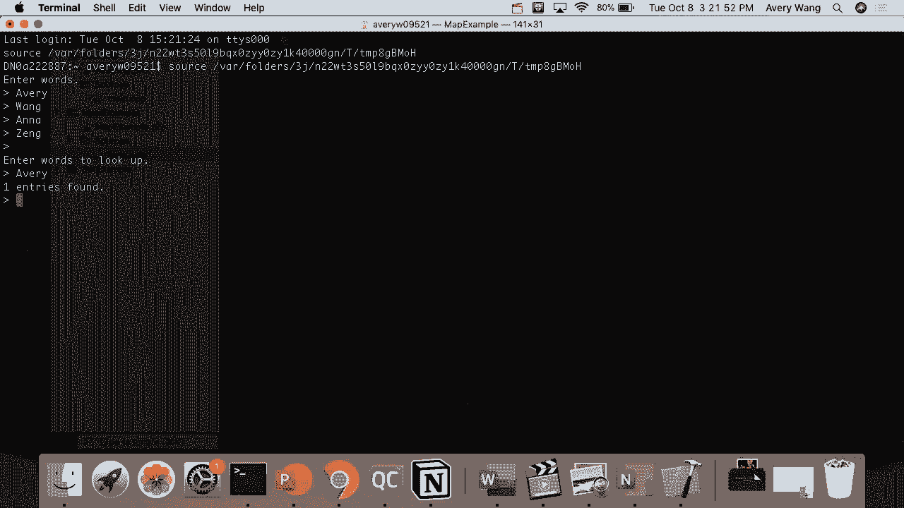

好的，好的，如果它不工作，就再运行一次，好吧，如果有人。

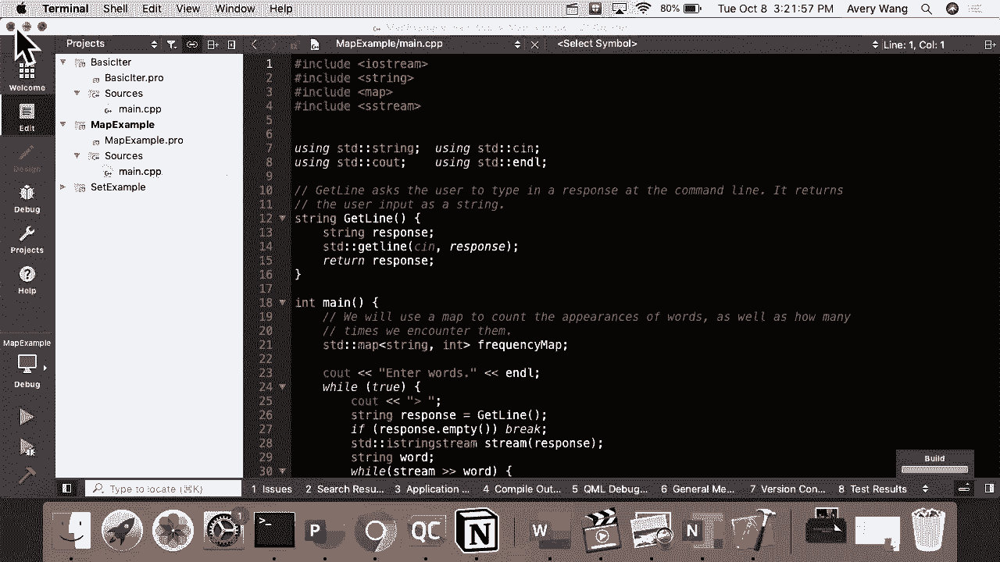

问，那个错误是什么？我们会说，Qt Creator，给我一点提示。好的，这样可以，很好。

是的。

它已经在那里了。是的，但我有点想改一下，我有点想做。哦，等一下，好吧，我会重新上传 PDF。哦，它在这里？是的，它在那儿。好的，好的，没问题，我会在 Piazza 上宣布的。它在幻灯片中。它在幻灯片中。

好的，没问题，我会在 Piazza 上更新的。是的，我可能今晚会有办公时间，我会看看是否有人来，因，为我在考虑周四晚上，谁会在周四晚上来，因为 Windows ，XP 是周五的新作业。哦，是吗？是的。

哦，这样说得通。是的。明白了。但是，他们可能会在周四早上来，肯定会，然后我可能会有，一个像。今晚。是的，我会看看是否有人今晚想来，然后。明白了。是的。我会问一下。所以，关于办公时间的奇怪问题是。

如果我们要有办公时间，你会来吗？人们想要交流。因为这是一个重要的问题，我们正在尝试确定何时安排办，公时间。比如说，如果没有人来，那对我们来说会很尴尬。所以，你真的会来吗？是在晚上，是的。

Avery 的会在晚上，我的是周四早上，以防一个时间对人们，不合适。好的，好吧，好吧。我们会看到的。太棒了。所以，我在考虑做的事情是，因为周四晚上，我在想实际上，没有人想要在周四晚上做。

Windows XP 作业是周五到期的，Windows XP 什么时候到，期？周三。周三？周三，下午 5 点。好的，那么也许。所以，周三晚上。你说了什么？本周末下午 4 点。好的，我们来。周四。好的。

是的，因为那将在周四晚上。好的，我今晚会有办公时间。我会确定时间，然后可能，应该不是。哦，好的。好的，我今晚肯定会有办公时间，然后让我更新一下周四晚，上。周四早上，Anna 会有办公时间。是的。

周四早上，我会有办公时间，但 Avery 的是到。所以，我今晚会有办公时间。我会尽快在 Piazza 上发布。今晚大约 5 点到 7 点左右。好的，应该会很轻松。我会在那里做我自己的事情。

除非有人来找我。好的，即使你还没有开始做作业，也可以来。你不需要准备好任何问题。你可以直接来，你可以坐在那里做你的事，如果你有问题，我会就在那儿回答。确实，这点很好。是的，这点很好。是的。

如果你对我们讲过的任何内容有疑问，我知道我们在，过去两周中讲了很多东西。随时过来也可以，好吗？Anna 的办公时间是周四早上 9 点到 11 点？早上 9 点到 11 点，早上 9 点到 11 点。

好吗。然后，记住，你可以随时在 Piazza 上发帖。好的，我们接受私人帖子。如果里面有代码也没关系。只要确保是私人帖，我们才能私下回复。是的，我们今天会在讲座中快速概述作业 1。所以。

你们会觉得准备充分。今晚，我可能会在像 Old Union Pub 这样的地方做一些事，情。我通常是这么做的。好的，我知道我的一位老分组成员在这里，但如果你曾经参，加过我的分组。

我会在 Old Union 举办办公时间。我在 Old Union 举办办公时间，并且我会在 Realistic ，购买他们。看看。你在那儿吗？不，我不在那儿。你不在？好的，你错过了很多。是的。

我们在 Old Union。所以，由于作业在这两周到期，所以我们会有更多的办公时，间。我今天会有办公时间，从 5 点到 7 点，或者到人们离开为，止。然后 Hannah 会在周四有办公时间。周四，是的。

9 点到 11 点。如果你想在其他时间见面，请告诉我们，我们会想办法解决，是的，这些只是为了安排每周的时间，但我们非常灵活。我的办公时间现在是在 Trusseter 二楼的露台上，面朝 。

Dinko Street 大礼堂，虽然名字很长，但非常值得。视野非常好。但如果人们找不到那里，可能会有变化。你介意我再用一次你的浏览器吗？我会迅速写一个帖子。你想以你自己名义登录吗？

我可以以你的名义发帖吗？是的，你可以以我的名义发帖。好的。我会说我的办公时间是。我会用第三人称提到自己。我还想统计一下有多少人来。23 人。23 人中有 60 人。你呢？是的。比。 229 要好。

可能比 106B 好。比大多数要好，我认为。嘿，106B 的同学们，礼堂还爆满吗？不。不，还是有人到场。好的。礼堂有多满？半空。半空？好的。我们正在做。实际上，他们已经超额注册，所以我们做得稍微好一点。

在这方面我们做得稍微好一点。干得好，你们。是的，嗯。我会在大约一半的地方。大家好。对不起。好的。我们开始吧。正如你们从上节课可能记得的，Avery 说这节课是最重要，的课，所以你们已经做得很好了。

但这是真的。今天，我们有一些非常令人兴奋的主题要教你们，所以我们，将开始，希望能覆盖所有内容。首先，如果你们还记得，我们在调查中询问了关于任何糟糕，的爸爸笑话的问题，所以你们将听到一些来自同伴的精彩。

片段。如果你是写这个笑话的人，请随时自我介绍。否则，我只是用首字母给你们归功。好了。今天，我们将覆盖。我们会迅速回顾一下上次没完成的主题——容器适配器。然后我们有几个公告要宣布。

之后我们将深入探讨关联容，器和迭代器，这将基本上是你们在这门课程中学到的最基，本的概念，几乎高于其他任何内容。好了。简要回顾一下，如果你们还记得上周四，也就是第二周，我，们讨论了序列容器。

在标准C++库中，有五种类型的序列容器。向量和双端队列是我们周四讨论的两种类型。还有列表、数组和前向列表。这些仍然很有用。如果你们有兴趣了解更多，我强烈建议去cppreference网，站查阅。

但我们不会在这里讨论它们。作为提醒，斯坦福的向量和标准向量之间的主要区别是。at，和括号函数之间的区别。请记住，at会在访问超出范围的索引时抛出异常，而括号，表示法会导致未定义行为。

你们还记得上次的例子其实有问题。当时我说它不会工作，但不知怎么的，它却仍然工作了。事实上，我们都不知道，那正是预期的行为。事实证明，当你尝试使用括号表示法访问超出范围的索引，时。

它实际上会导致未定义的C++行为。这个术语，未定义行为，是你们在许多C++文档中会看到的，基本上，这意味着事情出了非常大的问题。原因是因为行为实际上是不可预测的。例如，在像我这样的Windows机器上。

调用vec i超出范围的，索引后，你的程序可能会直接停止运行，但也不会告诉你有，什么问题。在Mac上，例如，它可能会继续运行，好像什么都没有发生，这意味着你不能预测它，这也是需要记住的一个重要区别。

我们讨论的另一个部分是双端队列。简要回顾一下，双端队列做的所有事情都与向量相同，但它，增加了一个功能，就是你可以非常快速地将元素推送到数，组的前面。但它的缺点是访问中间元素会比较慢。再次强调。

如果你想学习你拥有的工具并了解何时使用每，一个，现在你们知道了双端队列和向量之间的权衡，因此你，们知道在不同的应用场景中该使用哪一个。再一次，使用我们最喜欢的思考者雕像，默认使用向量，如。

果你主要在开始或结束时工作，则使用双端队列。在我们继续之前，有谁对上节课的内容有任何问题吗？有吗？我知道斯坦福库里有一个叫做栈的东西。栈是否与双端队列有关？再说一遍。栈适合这个吗？对，栈。

你们真是太贴心了，因为这正是我们接下来要讨论的内容，很好的问题。在我们继续讨论序列容器之前，还有其他问题吗？完美。谢谢。这是一个很好的问题。你们可能从 1。6b 或 x 里记得你们学过一些叫做栈和队。

列的东西。事实证明，标准 C++ 库中也有这些，只是被包装在一个不，熟悉的名字——容器适配器中。稍后我们会看到为什么会叫这个名字。简要回顾一下，你们应该最近刚刚学习过这些内容，但如果，已经有一段时间了。

栈有两个主要功能。你可以将一个元素推入栈顶，或者你可以从栈顶弹出它。后进先出。另一方面，队列，你可以添加。哦，底部有一个 PDF 的东西要出现。你可以将一个元素添加到队列的末尾，或者从队列的前端，弹出。

就像你在商店里看到的排队一样。其实我有一个问题要问你们。鉴于你们对 C++ 中的 vector 和 deque 了解的内容，标，准 C++ 中，实际上没有同时存在的魔法，一切看起来都像，是魔法。

但你们认为 C++ 是如何在底层实现栈和队列的？有人有想法吗？是的，最后面的那位。再说一遍。是的，这是一个很棒的猜测。事实证明，C++ 的栈和队列在底层其实就是向量和双端队，列，但功能有限。

如果你查看在线规范，它的样子，我们实际上会在下一张幻，灯片上看到，但只是确认一下，栈实际上就是一个向量或双，端队列，但仅允许我们看到的 push_back 和 pop_back 函，数。

而队列实际上就是一个双端队列，只允许你将东西推入，双端队列的后端，并从双端队列的前端取出东西。此外，栈和队列都确保你只能访问栈和队列的最顶部元素，是的，Brian？如果它们实际上是作为向量实现的。

那它们真的会更好吗？也许因为我以为我们被告知由于功能的限制，它们更好，但，如果它们在底层实际上是向量，那。很好的问题。问题是，既然它们实际上只是向量和双端队列在底层，它们。

的速度或效率是否与向量或双端队列基本相同？我将在下一张幻灯片上回答这个问题。做得好。我们继续预测接下来会发生什么，正如 Avery 所做的那样。

。非常快，你们可以自己看到这一点。再次强调，我们希望在这门课程中教会你们如何阅读 C++ ，文档。如果你查看栈或队列的 C++ 文档，你会看到在你们笔记本，上的小字体中。

实际上写着栈和队列实际上只是建立在向，量和双端队列上的。正因如此，它们被称为容器适配器。它们实际上不是容器本身。它们实际上只是将向量和双端队列容器适配到这个特定需，求上。我认为这是个很好的问题。

我的问题是，既然如此，当你有一个向量或双端队列时，为。

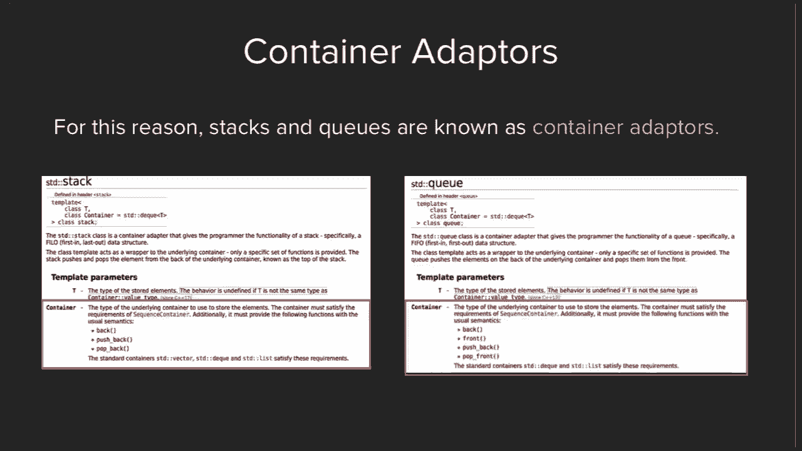

什么还要使用栈或队列？为了解答这个问题，我们再次回到我们最喜欢的 C++ 设计，哲学之一，那就是我们希望在代码中直接表达思想和意图，当我们有类似于星巴克的排队情境时，我们知道我们需要。

的唯一功能是将某人添加到队伍末尾或从队伍前端取走某，人，我们希望在代码中直接表达这种意图。这就是为什么像队列或栈这样的常见用例最终有了自己的，类型，称为容器适配器，其中有我们可以直接使用的类型。

另一种风格是，我们希望向开发者展示，我们实际上不需要，向量或双端队列的其他功能，我们只需要这种特定的功能，那么来回答Brian的问题，哪个更有效率？事实证明，因为我们保证在栈或队列上唯一可以使用的操。

作是pushback、popback和popfront函数，这些函数实际上，都是常数时间函数，如果这对你来说没有意义也没关系，但，它们实际上比向量或双端队列要快，因为它们只使用了向。

量或双端队列上的最快函数。向量或双端队列对这些特定函数的效率是相同的，但栈或，队列确保你只使用这些快速函数。是的，然后Avery想要补充。我可能会补充一些，即你看到的第一个哲学给程序员完全，的控制权。

如果你回到前一张幻灯片，再看一张幻灯片，是的，如果你，查看文档，你会在那模板的部分看到，哦，是这个你看到的，红色框，这个框。你打算谈论这个吗？不，你说吧。好的，是的。假设你正在编写自己的程序。

你不喜欢栈或队列使用双端，队列的事实。假设你想要栈使用其他数据结构。那么你实际上可以在创建栈时，指定不使用双端队列，使用，其他数据结构。如果你喜欢向量而不是双端队列，当你声明栈时，你可以说。

栈括号T逗号向量。那是你看到的第二个参数，即容器。默认情况下，它给出的默认值是双端队列，但你实际上可以，给它任何你想要的容器。

这是一个很好的观点。关于C++的一点是，这些类尝试隐藏它们下面的内容。如果你不想考虑它们，你可以像你期望的那样使用栈。但如果你关心的是挤出最后一点性能，你可以自定义它。

你可以创建自己的特殊数据结构来作为栈使用。是的，实际上这是一个很好的观点。是的，那么在我们继续之前，有人对栈或队列有问题吗？

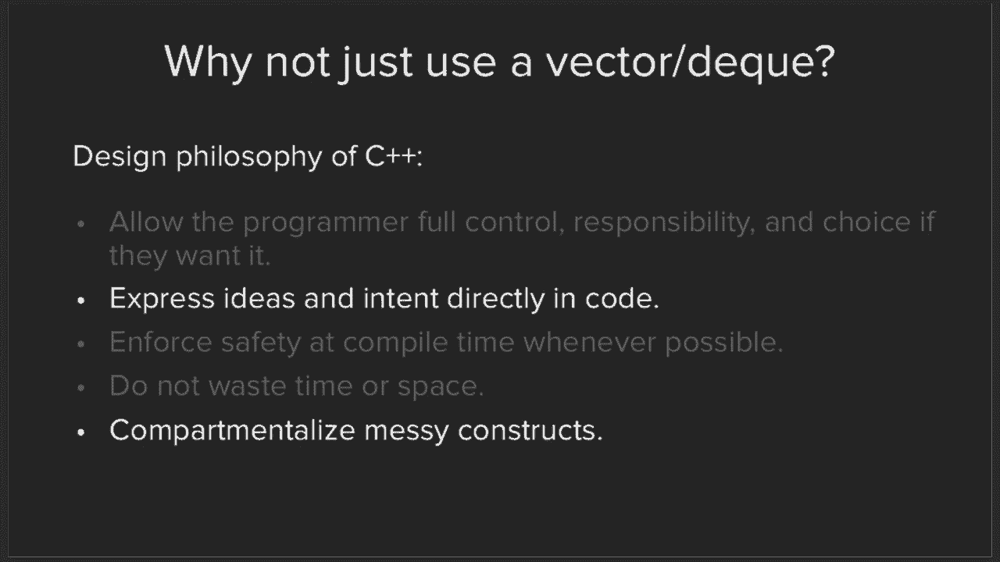

是的，问题很棒。问题基本上是，你如何使用自己定义的数据结构？事实证明，C++有，或在这个特定情况下，您的自定义数据结，构需要满足特定的要求。在这种情况下，它们必须满足称为序列容器的类型的要求。

只要你满足这些要求，在这种情况下，例如，栈的pushback，和popback功能，你就可以使用你自己的类。但是的，你需要为你的定义它们。是的，这是一个很好的问题。还有其他关于栈或队列的问题吗？

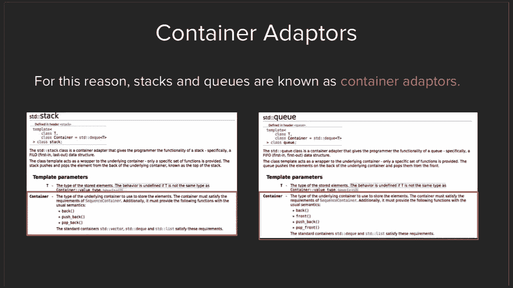

太棒了。好的，到目前为止，我们实际上已经涵盖了标准库中的两个，大部分，序列容器和容器适配器。所以实际上还有另一种类型的容器，称为关联容器，它们也，是一种你可能在106B或X中已经熟悉的类型。事实上。

如果你现在正在上这门课的话，我相信你们上周五，刚刚学到过这个内容。所以再次强调，关联容器是一种没有序列概念的容器类型，你不能通过索引0、1、2、3、4等来访问它们。相反，数据以键值对的形式存储。

在C++标准库中，有四种类型的关联容器，映射和集合你可，能已经很熟悉了。还有两种叫做无序映射和无序集合的东西，我们今天不会，详细讨论它们，但会简要解释一下它们是什么。如果你感兴趣的话。

你可以自己去查找它们。在106B或X中，你可能已经学过映射或集合是什么了。那么有人能快速告诉我，映射是什么吗？映射的定义是什么？是的，请说。所以它基本上就是一个存储两种不同类型数据的大集合。

你定义这两个数据类型的集合组成是什么。然后当你调用映射时，你有一个键，即第一种数据类型，它，将检索关联的第二种数据。完全正确。这正是为什么它们被称为关联容器的原因。

你将一种键的数据类型与一种值的数据类型关联起来。完全正确。还有一个问题，你们认为在映射或集合中可以有多个相同，的键值吗？谁认为可以？谁认为不可以？好，好，非常好。是的，你们已经非常熟悉了。那么。

与C++版本或标准C++版本中的映射和集合之间的一，些区别。一个需要了解的事情是，在底层，映射和集合会根据其键的，一些排序属性来对元素进行排序。它们不一定存储在像我们熟悉的向量那样的数组中，但它。

们是以排序的方式存储的，这意味着，例如，回到Avery提到，的定义你自己的类的想法，如果你想创建一个学生的映射，类，那么你需要定义自己的小于运算符，以便知道如何比较，学生，以便映射可以保持它们的排序。

这是我们在讨论类时会更详细地讲解的内容，但需要记住，的一点。所以再次强调，你必须在类上定义特定的操作，以便能够与，映射或集合等数据类型一起使用。无序映射和无序集合在功能上与映射和集合完全相同，只。

是它们在底层不会进行排序，这也意味着，如果你试图遍历，一个映射或集合，你不能保证它会以字母顺序出现。这些是无序映射和集合的工作细节。再次强调，如果我们定义自己的类，如我们将在学期后期做，的那样。

我们需要定义特定的内容以便能够使用这些数据，类型。但现在，我们不会深入探讨无序映射和集合。还有一件事我们想提的是，什么时候使用每一种？所以，结果是，常规的映射和集合，键是排序的，并且它们在。

迭代元素范围时非常快，因为它们是排序的，而无序映射或，集合，通过键访问单个元素更快。所以，我们不会深入讨论，但如果你们自己构建东西并想知，道使用哪种数据类型，那就是应用场景。我看到后面有两个问题。是的。

Manuka。是的，你提到运算符是为了小于运算符进行预测的。是的，这是一个很好的问题。所以，我得再看一下，看看是否有其他的运算符，除了小于，运算符。我相信对于映射和集合来说，小于运算符是唯一的要求，但。

我需要查找一下以确认。是的，这也是我们下周会讨论的一个概念，比如每个类是否，具有小于运算符这样的特殊属性。它们是否具有一些特定的属性，使得你可以将它们放入映，射和集合中？

我们将在下周讨论模板时讲解这个问题。是的，因为我认为映射和集合还要求元素是可复制的，类似，这样的要求。是的，确实如此。确实如此。是的。标准库中的集合是否也包括像引用所有运算符那样的操作，不是。

但下周我们会讨论一些算法，其中有通用算法会处理，这些功能。以重现这些确切的功能。是的。还有其他问题吗？是的。C数组是序列容器的一种吗？是的。所以，序列容器往往描述标准库中的东西，而C数组是C的一，部分。

实际上不属于STL。但它本质上是一个序列容器。好的。向量是建立在数组上的吗？这是一个很好的问题。这实际上与实现方法有关。这确实是C++讨论中的一个棘手问题。C++其实只是一个语言。

不同的组织可以选择以不同的方式，实现C++语言。也就是说，大多数人倾向于使用许多标准实现。例如，你可能听说过GCC，那是一个非常常见的标准实现。所以这取决于实现，但数组是最常见的实现方式。是的。

CS106B或X涉及数据结构的实现，可能会在两周内讨论。我们不会涵盖这个，但在两周内探讨这个是个好主意。是的，好问题。还有其他关于集合或映射的问题吗？社交容器。是的，再一个问题。Indica。关于映射。

是什么使得它们的查找时间如此快？这是个好问题。所以，这实际上是你将在其他课程中也会探索的问题。问题是，为什么映射中的查找比其他数据结构快得多，这是，你可能在106B或X中学到的内容。

所以你实际上会在像CS161这样的课程中探索这个问题。106B的最后一周，有时会涉及这个问题。有时106B的最后一周会讨论这个问题。但为了给你们一个初步了解，实际上映射和集合是通过一。

种叫做二叉搜索树的结构来实现的，如果你们听说过这个，的话。你们将会学习到更多的内容，但基本上这些结构被设计成，具有相对较快的搜索和访问时间，你们会学到更多的内容，并且在课后随时可以问我们更多问题。是的。

那是106B，第七周。明白了。是的。是的。抱歉，我只是想到，嗯，我的朋友说集合实际上是无序的。那么你说的“是的”是什么意思？所以，这实际上涉及到集合和映射的基本思想之一。我们教给你们的是，与向量相比。

它们并不是按顺序排列的，你不能说索引零包含这个元素一、二、三。我们把它们教成像云一样，基本上，集合中的一切都在某个，地方。但是你会注意到，如果你尝试打印集合中的内容，它们总是，以排序的顺序返回。例如。

如果你记得你学过一个叫做“每个循环”的东西，你对，集合中的元素进行循环，打印出这些元素，你会发现它们总，是以排序的顺序返回。这是因为我们不能通过索引零、一、二或三来访问元素。

但它们在底层仍然保持排序状态。所以它不是线性序列的桶，而是有序的。所以，这是一种奇怪的区别，这让我在第一次学习时感到困，惑。很好的问题。好的。太棒了。如果我们有进一步的问题，我们会在讲座结束时继续提问。

但是，作为C++映射的快速示例，我们想展示这个例子，部分。

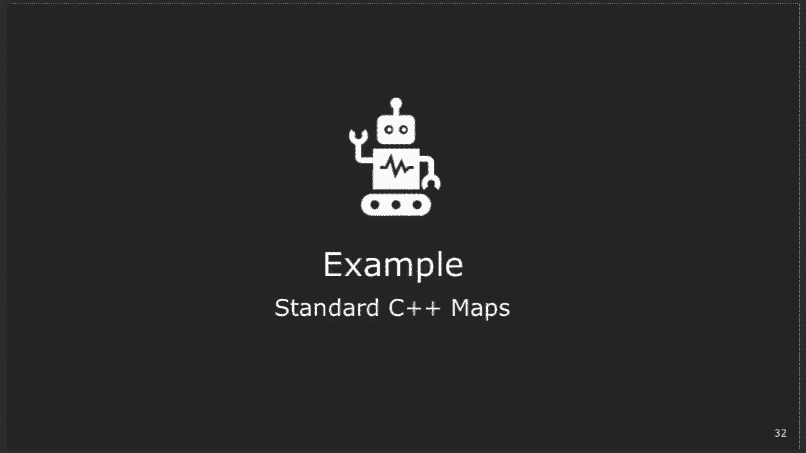

原因是它与你们的作业也是相关的，作业一。所以我们在这里做的是，我们实现了一个叫做get line的，函数，它会要求用户输入响应，这个函数类似于你们在作业，中需要做的事情。如果你读过作业说明。

在建议提示和技巧部分，它会说类似，于参考讲座中的get line。就是我们提到的那个get line。然后对于这个程序，我们想要做的是，大部分程序已经写好，了。

我们只是想再次指出一些映射在实际使用中的例子。所以再一次，就像其他任何对象一样，这就是如何声明一个，映射，未初始化的映射，以及我们想指出的一些其他功能。那么如何访问映射的值，你可能在106B或X中见过。

是你做，类似frequency map，然后是键，然后设置它，你会说类似于，A，或者访问它，你会做类似于，呃，int，呃，int A等于，frequency map点单词。

所以我们想强调的一个重要区别是，哦我的天，就像使用向，量一样，frequency map点at，呃，对不起，点get函数与，frequency map括号单词函数之间的区别。所以在斯坦福库中。

我很确定这两者做的是一样的事情。但是在 C++ 的标准库中，点取函数会做，它会做的是它会，搜索映射以查看键是否已存在，如果不存在，它将抛出一个，错误。而在括号表示法中，它会检查是否存在，如果不存在。

它会，自动创建一个条目并进行默认初始化。大家明白括号表示法和点取表示法之间的区别吗？好的，非常棒。然后，我们要强调的最后一件事是，是的，你可以回去阅读，这段代码，它已发布在网站上。

但这是我们要强调的一个大，区别。是的，Manuka。是的，这是一个很好的问题。所以你使用点取函数还是括号表示法取决于你的功能需求，如果你想要它在条目不存在时自动创建条目，那么可以使，用括号表示法。

如果你想在添加之前检查它是否在其中，那么这实际上是，我们接下来要讲的内容。所以，这是一个很好的问题。如果你想知道，如何检查一个元素是否已经在集合中？你可能还记得从 Stanford 库中。

有一个叫做 map dot ，contains key 的东西，你可以用它来检查映射是否已经包，含一个键。我们实际上会教你 Stanford 库是如何实现这个的。而且事实证明有几种不同的方法。

其中一种方法就是你在这里看到的。所以映射有一个叫做 count 的函数，计算某个东西在你的，映射或集合中出现的次数。所以有人能告诉我 count 在映射集合中可能返回什么值，吗？所以再次说。

它是在计算一个键在集合中出现了多少次。你说对了。干得好。是的。所以这看起来有点奇怪。为什么会有一个只能返回零或一的函数呢？事实证明，C++ 确实有数据结构，可以有多个相同值的键指，向不同的值。

所以这就是 count 函数存在的原因，但正如你所说，对于，映射或集合，在无序映射或无序集合中，count 始终返回零，或一。所以在这种情况下，我们将其用作隐式布尔值来表示，如果，它存在，如果返回一。

那么我们知道它在函数中存在。否则，它不存在。大家明白了吗？有什么问题吗？

我再加一个超级不重要的旁注。如果你不喜欢 count 函数，我认为 C++ 20 正在发布一个，叫做 contains key 的函数。是的。真的吗？好的。太好了。

如果你不喜欢这个 count 函数的名称，你认为它返回一个，整数，但实际上你把它当作布尔值使用，那么我认为是 C++， 20 的 contains key。使用隐式布尔值，比如返回零或一，这最终会发生。

对吧？这是个很好的问题。问题是，使用隐式布尔值是否比手动检查是否等于一更快？我猜实际上设置了高优化级别的编译器会使这些结果一样，嗯，不过在这种情况下，使用隐式布尔值的方式是非常常见，的风格构造。

所以可以随意使用它。嗯，最后，它很可能会对你的程序产生影响。是的。很好的问题。是的。是的。是的。很好的问题。所以当你使用括号表示法而找不到时，它会自动添加默认，初始化，无论值的类型是什么。所以对于整数。

它会自动将值设置为零。是的。好的问题。好的。所以，这只是执行程序。你们可以去网站上查看代码，大家可以自己玩一玩。

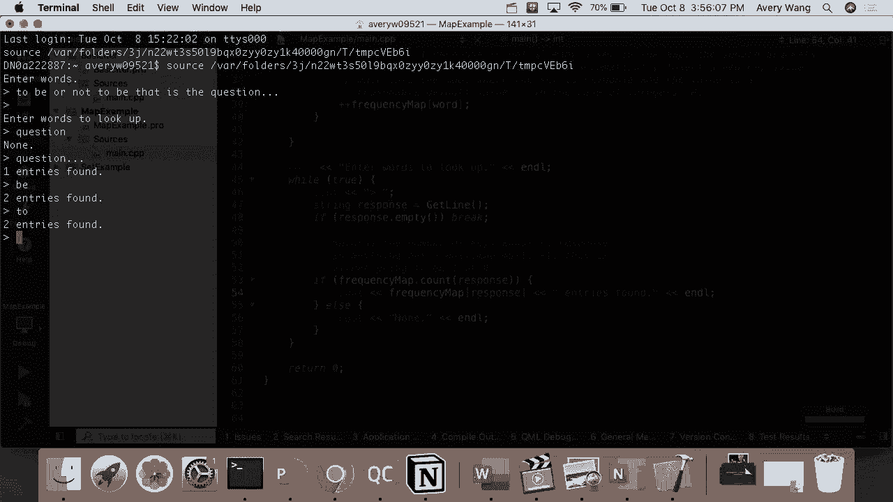

嗯，不过只是为了展示一些函数的练习，嗯，是的。在我们继续之前，还有其他问题吗？太棒了。好的。所以，嗯，再总结一下关键点，嗯，再次，那应该是“get”而不，是“at”，嗯，获取和括号表示法的区别。嗯。

然后，嗯，如何判断它是否包含一个键。我们看到了“count”，嗯，在C++ 20中，将会有一个，“contains key”。实际上还有另一种方法来确定一个元素是否在映射或集合，中。嗯。

我们将在下节课学习那个方法，使用迭代器，这就是我，们今天晚些时候学习的概念。嗯，所以你们会看到多种不同的实现“contains key”的方，法。嗯，然后，嗯，集合，我们没有看到它的实际使用，但它的工。

作方式与映射非常相似。事实上，你可以把集合看作是一个映射，其中隐含的值是“，真”或“假”。如果它在集合中就是真的，如果不在集合中就是假的。所以如果你想知道什么函数在集合和映射上工作，嗯，几乎。

每个在映射上工作的函数也在集合上工作，除了“dot get”，和括号表示法，因为集合中没有值的概念。所以给你们的一些实用技巧，不过，嗯，我们也发布了一些，代码，如果你们想看看集合是如何工作的。嗯。

但我们会把这些在线保留，如果你们想稍后再玩。很酷。在我们进入下一部分之前，有关于我们所涵盖内容的任何，问题吗？好的。是的。一个问题。是的。我们实际上会讨论哪个方法检查键是否在映射或集合中更，有效。

我们将在覆盖时讨论这个问题。是的。不过这是一个很好的问题。很酷。所以我们时间安排得很好，你们。嗯，所以我们有几个公告，让你们暂时从C++中休息一下。首先，第一个作业已经发布了。嗯。

截止日期是这个星期四之后的那个星期四。嗯，但记住你们也有三个延期天数可以使用，其中两个可以，用在任何作业上。还记得你们需要完成三个作业中的两个。嗯，前两个作业通常比第三个作业短得多。嗯。

不过第三个作业真的很有趣。所以由你们决定。嗯，Avery和我会有办公时间。嗯，我的办公时间是每周四上午九点到十一点。嗯，在信托，大楼二楼的露台上，面对丁克拉格球场。请随时在 Piazza 上留言。

如果你不知道 Piazza 在哪里，嗯，那是一个很好的学习地，点。嗯，还有一个小修改，嗯，这周可能仅限于这一周，嗯，我会，有办公时间。我想我说了，嗯，今天是周二，下午五点半到七点半，嗯，在。

老联盟大楼内。虽然如果你没看到我，我可能在其他地方。嗯，然后我会在周三在那里。我说是什么时间来着？某个时间。我在 Piazza 上说了些内容。那是关于周三的 Piazza 帖子。是的。

所以幻灯片有些过时了。Piazza 上有我们的最终办公时间。嗯，酷。还有一件事，我们实际上想告诉大家，嗯，申请助教和担任，助教的申请现已开放。嗯，Avery，如果你想要提供帮助的话。哦，对不起。是的。

所以，嗯，每学期，嗯，CS1 项目，嗯，会联系到当前的学生以，及那些完成了 CS1 的学生，看是否有任何有趣的申请者。现在，既然你们都在 CS106L 课程中，想学习 C++，嗯，我相。

信你们所有人都会成为优秀的助教，教授，嗯，CS106 课程，现在，嗯，基本上，这个过程包括，嗯，你们可以在线申请，然，后，CS106L 协调员会联系你们获取更多关于面试过程的信，息。嗯。

如果你被选中进入这个，嗯，令人惊叹的社区，那么，嗯，这是一项为期两个学期的承诺，担任 CS106 课程的助教。是的。一个六的课程。好的。是的。可以在课后跟我或 Avery 讨论。嗯。

这真的是一个很棒的社区。嗯，这实际上是我们了解到这个工作的途径。CS106L 讲师。嗯，然后你会有很多很酷的机会，比如和教授、我、行业人，士在特别活动上交流，诸如此类的事情。所以绝对推荐。是的。是的。

所以，如果你在 CS106 课程中，或者你刚好在 CS106A 或 ，X 课程中，你的助教，嗯，就是这样做的。这正是你将要做的工作，就是教授你自己的一节课。是的。哦，对了。我们有点奇怪的术语。嗯。

TA 在技术上指的是，嗯，是 Catherine 吗？Catherine？是的。是的。所以，嗯，是的。所以你可能会听到一些人交替使用这个词。这个工作是为了担任一个 CS106 课程的助教。是的。去做吧。

你想知道，嗯，它是否与 CS1060 一样，即一个迟到的天数，是下节课的时间。很好的问题。所以问题是，迟到的天数是 24 小时还是下节课的时间？因为我们在周二和周四上课，嗯，将迟到的天数从周四到周。

二有点奇怪，因为这段时间非常长，而从周二到周四则正常，嗯，我们决定设定为 24 小时。也就是说，我们这是一门单元课程。在截止日期方面，我们非常灵活。所以如果你有问题，可以先跟我们沟通，我们总是可以找到。

解决办法。但确实，延期天数是24小时。而且你有三天延期时间可以使用。是的。实际上，这也是一个很好的引子。所以今晚我们还会发布一份反馈表，因为我们希望听到你，们的意见。我们如何改进？比如说。

我们的进度是太慢还是太快？你们还想学些什么？类似的东西。所以，按照惯例，如果你填写了反馈表，你还可以再获得一，天的延期时间。是的。所以再次强调，我们在这里是为了与你们合作，但我们希望。

听到你们对这门课的想法，以及你们对我们的任何反馈。另外，那些通过视频观看的朋友，也请你们填写这份反馈表，是的。对视频观看的人致敬。唯一一个不应该写的评论是，视频质量差。好的。但其他的呢？是的。

请评论我们真正想听到的内容。这门课的内容也是灵活的。所以我们真的希望知道你们想学什么。完全正确。太棒了。是的。还有其他问题吗？如果没有，那就好。所以第一份作业在这个周末发布了。我们非常快速地想做的是。

让你们了解你们到底在做什么。

。你们可能已经在网上看到过这个，但如果你去106L网站上。

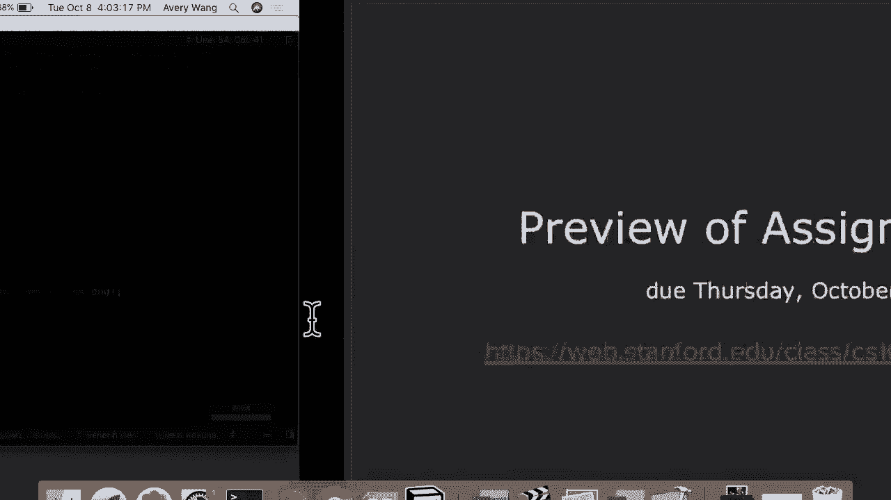

的作业页面，你会看到，如果你点击作业，它链接到一个实。

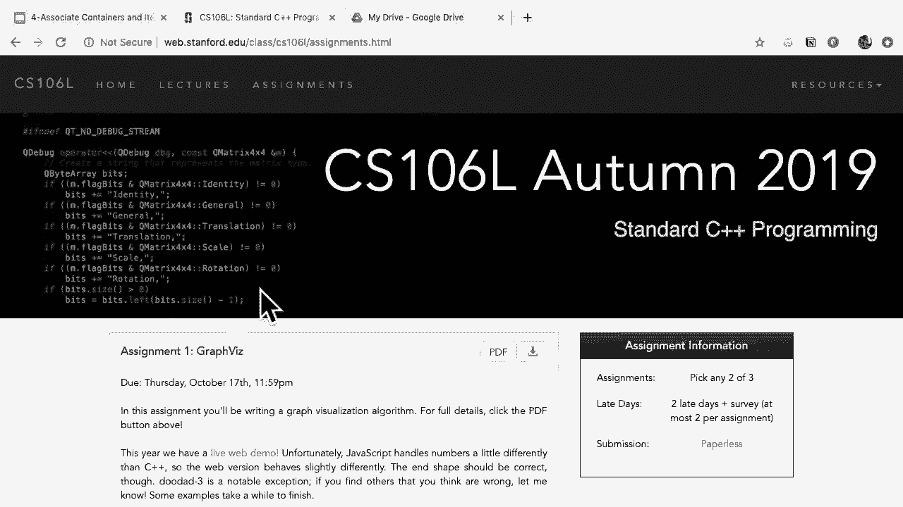

时网络演示。所以，这与你们将要构建的东西有些许不同，因为这个是在，网络上实现的，而你们的是用C++实现的。但这基本上是你们编程的输出结果。所以，为了给个概念，我们可以点击查看，我会把它调小一，点。

你们可以看到像这样的三网格，它开始时是一些随机的点，排列，最后变成一个美丽的图形可视化。所以如果你还没有阅读作业说明书，一定要去看一下，但你，们也可以在网上找到这个并进行操作，了解你们最终的程。

序应该做什么。这也是为了激励你们，看看你们所构建的东西——虽然是非，常简单的标准C++工具——是多么酷。还有一件事我们想提的是，嗯，顺便看看列表上的内容，看，所有的东西如何工作也挺有趣的。

但我们还想提的是，作业规范看起来比较长。大约有14页，我相信。实际上作业本身并不长，我们向你们保证。实际要写的代码行数不会太多。所以如果你遇到任何困难或者规范中有不清楚的地方，绝，对要联系我们。

我们在这里是为了回答问题，帮助解决问题。是的。有问题吗？

实际上，在我开始之前，有几个我想强调的点，以防它们对，你们有用。在作业的底部，有一个叫做建议、技巧和窍门的部分。他们提到有一个建议的循环结构，你应该在课程阅读材料，的第三章中使用。嗯，有些人可能会觉得。

课程阅读材料在哪里？所以这个公告的目的部分是宣布，实际上，我们有课程阅读，材料。这个课程阅读材料是由Keith Schwartz编写的。如果你上过他的课，你可以在网站的右上角找到它，在课程，阅读材料下。

这门课实际上并不完全遵循那个课程阅读材料，但它是一，个很好的参考。

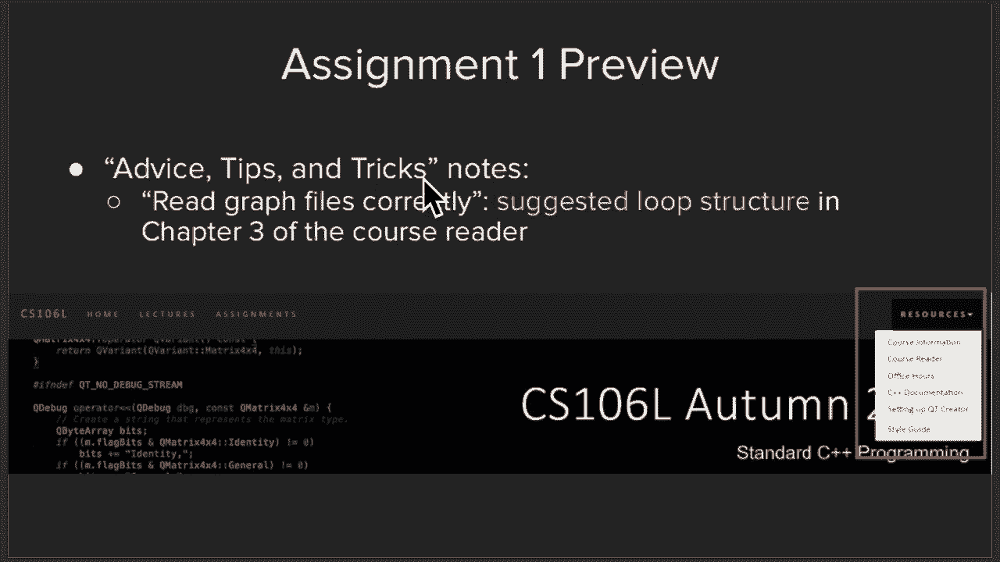

这就是我们所说的课程阅读材料。然后，我们今天在我们的地图示例中刚刚看到 get line。所以这就是我们在作业中所说的内容。最后一点是，关于风格建议，一般来说，在这门课中，我们不。

会像第一个六门系列那样强调风格。不过，作为程序员，养成一些好习惯对你自己是很有好处的，其中之一就是分解，比如将你的程序分解成更小、更易读，的部分。然后，例如，在这个作业中使用常量。

比如很多随机数像 pi，嗯。所以，如果你们对这些有任何问题，一定要告诉我们。是的。好问题。我们可以使用斯坦福库来完成这个作业吗？答案是不能。所以，这个问题很棒。这可能是你们习惯的。

但这个作业的目的是让你们真正动，手使用真正的行业标准C++。所以，再次强调，斯坦福C++库在我们离开斯坦福后不会存，在于现实世界中。遗憾的是，它们对学习概念非常有用，但这部分不是挑战你，们的概念。

而是让你们真正挑战语法的正确性。所以，是的，我们确实希望你们使用标准C++。如果你们有关于如何开始的问题，请问我们，一定要问我们，是的。好问题。我会补充一点，就是在过去的四节课中，我们已经学到了足。

够的内容，实际上可以实现大部分斯坦福库函数，特别是像，文件IO和其他各种内容。在第二节和第三节课中，我们实现了 get integer。如果你记得的话，这可能对你的作业有帮助。而且。

网上的示例代码还展示了更多示例，比如如何实现像， prompt user profile 这样的功能。好了。所以我不推荐直接复制粘贴讲座代码。确保你理解代码，并能够在作业中编写类似的代码。太棒了。是的。

另一个问题。PowerPoints 都在 cs106l。stanford。edu 网站上。是的。点击讲座标签。是的。好问题。是的。嗯，是的，这是一个很好的问题。在这种情况下。

像 PI 这样的常量应该是全局的，因为我们，的东西只是一个单独的文件。我们没有与多个类进行交互。可以将它们设为全局。嗯，如果你对全局的意思感到困惑，可以来找我们。嗯。

我不确定 cs106b 和 x 是否涵盖了这个。没有。嗯，所以你可以将它们设为全局常量。是的。是的。如果有时间的话，我会在讲座结束时运行一个全局常量的，简单示例。但这确实是个好问题。

几周后我们会讨论命名空间。太棒了。好的。在我们深入之前，我想说的是，这一部分实际上是 C++ 的，基础构建块。所以要兴奋，因为它非常非常酷。再一次。嗯，这就是我们现在在课堂上的位置。

我们正在学习标准模板库。到目前为止，你们基本上已经学习了关于容器和容器适配，器的所有内容。你们已经学习了 SDL 中五部分中的两部分。嗯，你们会注意到容器和适配器都指向迭代器，也就是说。

它们都使用一种叫做迭代器的东西。我们会在稍后讨论这个。但所以，是的，我们正在逐渐完成这张图表。嗯，迭代器。嗯，有多少人之前听说过迭代器？快举手。好的。哦，好吧。所以这是一个相当不错的数量。嗯。

你们可能已经被震撼了，但我们今天会继续震撼你们。那么，迭代器为什么有用呢？嗯，你们可能注意到，当我们讨论关联容器时，我们不能像，使用向量或双端队列那样仅用普通的 for 循环来迭代它，们。比如说。

像 for i 等于零到长度。嗯，i 加加。嗯，再次强调，因为我们可以把映射和集合想象成数据的云，嗯，不一定以一种非常整齐的线性方式排列。嗯，那么问题是我们如何迭代一个映射或集合？嗯，首先。

这是一点小提示，来自我们之前讲师 Ali 的迭代，器。从现在开始，我们真的要深入研究 C++ 特别之处，那就是，它的通用性。嗯，为了强调，我们正在进行一段旅程。嗯，我们可以理论上飞到最终目的地。

直接告诉你们迭代器，是什么。嗯，但那样我们会错过经验，也会错过三本畅销书。所以，我们将慢慢来。即使你们可能已经听说过迭代器，我们仍然想强调它们的，具体使用方式和原因。好的。好的。所以迭代器。

迭代器是在斯坦福 C++ 库中允许迭代任何容，器的东西。所以你们刚学到的所有序列和关联容器，迭代器都可以用，于它们，无论它们是否有序。嗯，为了对迭代器的工作原理有一个心理模型，对于那些还。

没见过它们的人，假设我们有一个像这样的集合。它是一、二、三、四的集合。迭代器，嗯，是一种让我们以线性方式查看这个非线性容器，的工具，嗯。所以它允许我们把这片云当作是一种不错的序列，一个类，似向量的对象。

嗯，它们怎么能够做到这一点？对于这门课的目的，我们实际上并不关心，但这又回到了马，努卡的问题，呃，关于它们是如何，地图和集合在底层是如，何实现的，这就像是二叉树的遍历。如果您感兴趣，课后随时再问我们。

所以为了对如何使用迭代器有一个思维模型，嗯，所以，呃，在迭代器上有几个常见的函数，你们将会使用，嗯，基本上，对于从这门课往后你们将学习的所有函数。嗯，其中之一是点 begin 函数，它返回，哎呀。

它返回一个，迭代器，呃，幻灯片有个问题，但它返回一个指向集合中第，一个元素的迭代器。如何将其存储在变量中？所以这实际上给我们带来了一个问题，即迭代器的类型是，什么，嗯，如果我们想将其存储在变量中？嗯。

一方面，呃，所以如果你实际上，Qt 创造者的一个不错，的特性是，如果你开始在 Qt 创造者中输入函数，它实际上，会自动为您建议要使用的函数。嗯，在这种情况下，您可以看到，呃，它建议了一个名为 。

begin 的函数，其类型为迭代器，呃，begin。所以实际上迭代器的类型就是字面上的迭代器。并且迭代器取决于您正在使用的集合的类型。所以在这种情况下，嗯，它是一个整数集合的迭代器。嗯，很容易记住。嗯。

然后你们将要使用的另一个常见函数是解引用。呃，在这种情况下，呃，解引用这个指针意味着您将输出值，一，呃，这就是它所指向的。嗯，你们将要使用的第三个常见函数是++，呃，它递增一个，迭代器。嗯，等等。

所以再次，呃，解引用以读取值，递增以移动迭代器，呃，等，等。然后我们对迭代器做的最后一件常见的事情，嗯，是通过读，取我的集合点 end 并将其与我们当前的迭代器进行比较，来检查，呃。

我们是否已经到达了集合的末尾。所以这是对迭代器的四个常见函数的一个非常简短的介绍，但为了让您了解迭代器是如何工作的。我看到后面有个问题。是的，说吧。这是个很好的问题。所以您可能已经看到的是，嗯，呃。

从一类如 1 到 7 或 1 ，到 10 ，是有这些被称为指针的东西，您也可以做。您通过引用获取值吗？嗯，我相信迭代器在底层可能被实现为指针。呃，四个向量。是的。对于四个。是的。四个向量。呃。

迭代器就是纯粹的指针。是的。所以对于顺序容器，呃，迭代器在底层实际上就是指针。嗯，我，我得为关联容器查一下。呃，不，不，因为，这个，这个，++必须做一些不同的事情。明白了。嗯，引用是一样的吗？

我不太确定。我们，我们，我们会查一下然后回复您，但是是的，为了使这，个，呃，迭代器函数通用，有一些小的差异。是的。问题。一个，什么，引用运算符和解引用运算符之间有什么区别，或者，嗯，好的问题。好的。

所以，是的。我们刚刚很快地讲过这个。嗯，对于那些之前没有见过这个的人来说。所以，解引用运算符就是这样一个语法，你把它放在迭代器，前面，本质上是告诉迭代器，我不想要箭头本身。我想要箭头指向的值。好的。

是的。所以这就是解引用运算符的区别。好问题。为什么在这种情况下你在开头使用加一而不是在结尾？是的，那么，为什么加一在左侧而不是右侧？嗯，这叫做前缀运算符与后缀运算符的区别。嗯，你可能在课堂上见过。

比如在 for 循环中，你经常看到， i++ 与 ++i 的区别。嗯，在这种情况下，它们做的是完全相同的事情。加一在迭代器的开头与在结尾的唯一区别就是你执行加一，的时机。这是一个非常小的细节。

但实际上对你的 106B 或 x 考试，很有用。所以我实际上会在课堂上说一下这个。嗯，加一意味着你在使用之前先递增迭代器，而当加一在右，侧时，意味着你先使用迭代器然后再递增它。所以在这种情况下。

使用迭代器意味着只是检索值。所以无论你在什么侧边加一，都没有关系。是的，还是个好问题。还有其他问题吗？是的，那里。迭代器在集合和映射上工作吗？再说一遍。迭代器在集合和映射上工作吗？好问题。

迭代器在集合和映射上工作吗？实际上，这正是迭代器被发明的一个动机原因。所以绝对是的，我们会在接下来的几张幻灯片中再次看到，这个。是的，后面的那个问题。是的。是的，所以问题是。

直接索引一个向量是否比解引用迭代器，更快？或者，抱歉，再说一遍。或者通过迭代器循环。我明白了，所以使用像 for 循环与使用迭代器的区别。嗯，我想想它们是如何实现的。我认为是类似的。

我相信它们基本上是相同的，因为当你在向量上进行 for ，循环时，实际上你是在做的是，我相信 C++ 可能实际上在，底层使用了迭代器来实现这一点。嗯，比如说。

当你做类似于 for element in vector 的操，作时，它实际上是在底层实现这个确切的迭代器循环。对于数组来说可能会有所不同，但在速度上，它应该几乎是，相同的，如果不是完全相同的话。

我还想提到标准库，它们确实使用了迭代器。只是我们没有向你展示这些迭代器。是的。但如果你实际上查看标准实现，它们到处都使用了迭代器，是的，对的。嗯，所以迭代器本身是盒子的内存地址，对吧？你可以这样理解。

是的，它- 它和指针有些不同，嗯，我们需要稍后再回到这，个问题上。嗯，但你可以基本上把它当作一个内存地址来看待。现在，关键的概念是迭代器是一种抽象。正是如此。你实际上不需要担心它- 它是如何实现的。

你只需要知道它指向某个元素，然后你可以在那个迭代器，上调用 next 或 previous 来获取下一个元素。好的。那么，在最后一分钟，我们想做的事情是，再次，迭代器通常，用于的四件事是。

创建、解引用、使用加法进行前进，然后，与结束迭代器比较以检测何时完成。

嗯，在最后一分钟，我要做的事情是，向你展示一些常见的。

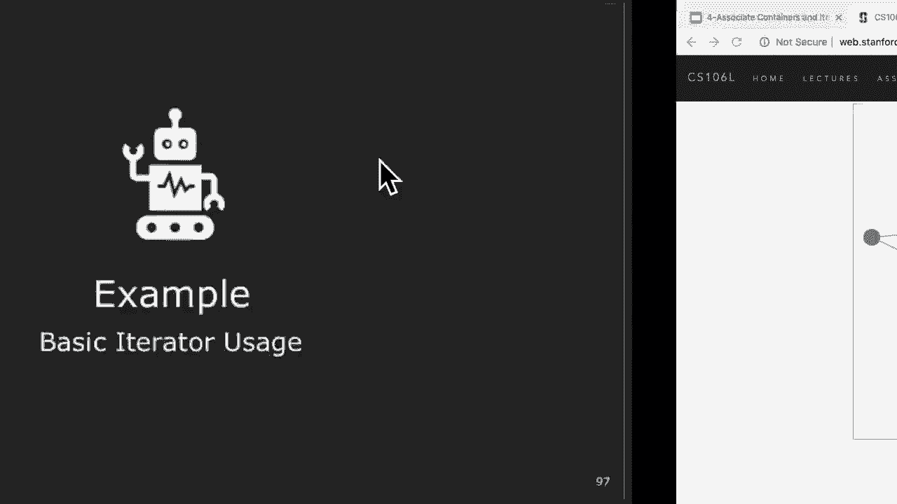

迭代器函数。好的。所以主要的就是这个 while 循环。所以我们实际上，你可以看到这里，基本上有两种使用迭代，器遍历容器的方法。嗯，你可以看到我们在这里使用了它们四次集合。所以这部分回答了你的问题。嗯。

但如果我们要重新写一遍，我们想做的是，创建一个 ，int 迭代器的集合，等于容器的 begin，以获取一个指向该，容器开头的迭代器。嗯，我们会解引用它以打印出一个值，然后递增它以将其移。

动到我们假想的线性向量中的下一个元素，对不起，集合，集合，元素字符串。嗯，然后最后，我们可以通过将当前迭代器与结束迭代器进，行比较来判断我们是否完成了遍历容器。嗯。

你们会看到的另一个常见结构是使用 for 循环。所以做的事情和 while 循环完全一样，只是将其包裹在 ，for 循环版本中。所以我们想把这个放上去，以便你们有一个参考，然后可以，在家里运行这个。嗯。

那么，我要问的是，最后一分钟关于迭代器有没有人有，问题？是的，就在那里。使用迭代器而不是 for 循环，这样你就不需要搞清楚 for。

 循环的开始和结束，这基本上是唯一的优点吗？是的，这是个很好的问题。那么，迭代器的优点是什么？所以我们真的只是讲解了如何使用迭代器的功能，但我们，还没有告诉你们。

为什么它们很酷或为什么 C++ 实现了它，们。所以实际上，让我在最后几分钟里讲一下这个问题。我不确定是否应该留到下一节课讲。那么，为什么迭代器很强大？嗯，很多场景要求我们查看某种容器。

而不实际知道容器的，类型。而迭代器允许我们抽象掉容器是什么。我会在一会儿向你们展示我所说的更多内容。嗯，再次强调，关键的概念是，它允许我们以标准化的方式，遍历任何容器中的元素。嗯，这是一个例子。

所以假设我们有一个整数向量，并且我们想计算某个特定，值的出现次数。嗯，你可以想象我们会写一个这样的程序。我们可以让它适用于另一个数据结构，比如列表吗？是的，我们可以。实际上，当我们使用迭代器时。

我们通过更改迭代器的类型，来实现这一点。嗯，我们可以做同样的事情。假设我们想使用集合而不是列表。我们做同样的事情。你可以真正看到，关键在于，除了数据结构之外，我们程序，的逻辑没有任何改变。

这为我们将在周四讨论的内容做了一个预示，也就是迭代，器使我们能够在任何类型的容器集合中标准化函数。所以这是一个关键的收获点。迭代器可以在任何容器中使用。接下来，我们将介绍模板。

那是- 你将看到另一个- 那是我们将概括所有这些的地方，是的。太棒了。好了。

