# 斯坦福大学《CS106L： C++编程｜ Stanford  CS106L C++ Programming 2019+2020》中英字幕（豆包翻译 - P9：[5]CS 106L Winter 2020 - Lecture 8_ Functions and Algorithms - GPT中英字幕课程资源 - BV1Fz421q7oh

顺便说一下，这是你的，这是你的作业四。我一直在帮助，嗯，我一直在做这个作业，测试它，所以这是，你的作业四。只有三个问题，而最后一个，灾难规划相当难。在下周之前提个醒，灾难规划相当难，但这是你的作业四。

哦，它只有十页。这是个新低。你好，欢迎。

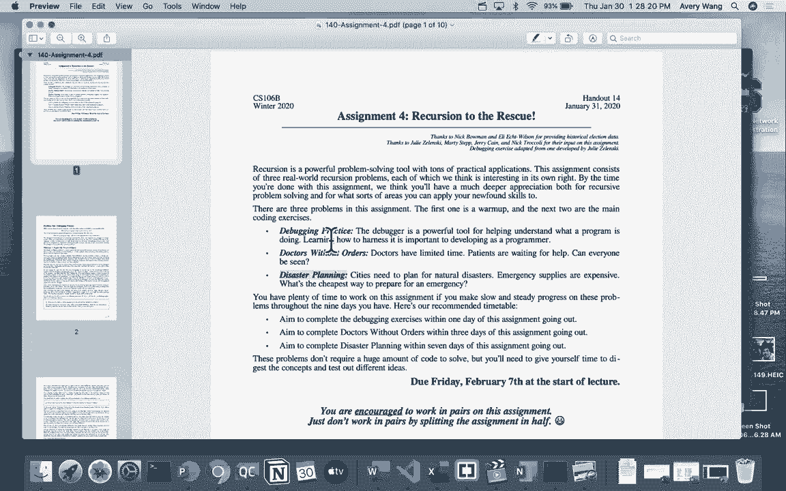

有一个有趣的调试练习。哦，但我是说，Keith 甚至给了你伪代码。没关系，这个问题不那么难，因为他，因 为他，Keith 真的，给了你做这个问题的伪代码。好吧，大家怎么样？好吗？好的。现在是第几周。

是第四周吗？是的，第四周结束。期中考试快到了吗？好的，你们中有多少人是新生？只是好奇。好的，新生，然后其他人，你们是大二生，大三生，大二生吗？好的。好吧，嗯，哦，Anna 还没到。嗯，知道了。

在过去的讲座中，我可能超时了一点。我保证今天，我可能甚至会在时间之下，所以，嗯，在我们进，入正题之前，我想从上次的回顾开始。好吧，简单回顾一下。上次我们讲到了在 SCL 容器中删除元素的问题。

我们讨论了如果你删除一个元素，这会使一些其他迭代器，失效，具体取决于你使用的是什么类。例如，对于向量，因为如果你删除一个元素，所有元素必须，向下移动，之后的所有迭代器都被删除了。好的，然后。

我们讨论了这样一个问题：如果你删除某个东，西，你要确保不能递增一个无效的迭代器。所以我们通过使用这样的东西解决了这个问题。好吧，然后我们会今天再讲一次，因为我们今天要使用实际，的算法。好吧，模板。

模板函数。模板函数的目标是我们可以编写基本上使用不同类型的不，同变体函数，但基本上共享完全相同的代码。所以这个想法是因为你注意到函数除了类型外完全相同，你可以通过一个任意的 T 来替代。

并将其声明为模板。好的，上次关于这个有任何问题吗？好的。是的，这就是模板的含义。然后你必须小心模板，因为如果你没有指定类型，它会试图，弄清楚 T 是什么。而且，它没有足够聪明地为你做转换。

所以如果你使用类似 C 字符串的东西，它不会为你正确进，行类型推导。明白了吗？很好。只是，嗯，仅仅是检查一下理解，你们有没有在其他地方使，用这些尖括号？在 CS106B 中。

你们应该已经使用过带有尖括号的东西，对，吧？嗯嗯。嗯嗯。嗯嗯。嗯嗯。嗯嗯。是的，你完全正确。我们在尝试声明另一个类的对象时使用了这些尖括号。例如，当你尝试创建第一个向量、集合或映射时，你总是使。

用那些尖括号来指定类型。所以这里的想法有点类似，我们在指定要用什么类型来实，例化这个模板。明白了吗？然后，你可能猜到斯坦福库中的这些类也是模板类。对吧？这意味着如果你在其中放入某种类型。

它将为该特定类型，实例化该类。明白了吗？我们还没有讨论模板类，但我们将在几节课后讨论。明白了吗？本质上，你可以将所有这些扩展到编写自己的类，你可以用，任何你想要的类型来实例化该类。很酷。

然后我们做了一些例子。我们将一些函数泛型化了。我将跳过这一部分，因为我会再讲到这些内容。隐式接口呢？有没有人能简要总结一下什么是隐式接口？有人记得隐式接口是什么吗？是的，继续。嗯，对，正是这样。

所以在那个函数内部，你以某种方式使用了你的参数。例如，你可能取一个参数，然后做，哦，这个参数。dot size ，来获取 size 字段。然后对于模板，编译器实际上并不强制你放入那些模板类。

型中的什么类型。唯一出现的错误是在函数内部的一些代码无法编译，因为，你实例化模板的类型不满足隐式接口。例如是这样。我们讨论了对于这个函数，即使编译器不强制输入和数据，类型是什么。

但强制的是你如何使用这个 begin 和 end ，类型。例如这里，begin，虽然我们说是输入的，但这并不真正强制，它必须是输入迭代器。真正强制 begin 必须是输入迭代器的是我们尝试复制 。

begin，然后尝试递增 begin。我们尝试对这个迭代器解引用。这在一定程度上强制 begin 必须是输入类型。所以这被称为隐式接口。由于隐式接口，因为这些接口不是显式的，当你将类型插入，时。

它实际上确认你插入的是输入迭代器。因为它不是显式的，所以你会得到这些巨大的错误信息。好了，我们做了更多的练习。我们讨论了重载解析。我不确定有多少人觉得这有用，但我觉得它很有趣。

我希望你们中的一些人觉得它有趣。但否则，大多数 C++ 程序员不会主动思考它。所以无论如何，那就是关于函数和算法的内容。上次我讲这个内容时，不太顺利。所以我删掉了一个完整的例子。所以今天的讲座不会超时。

明白了吗？很酷。让我们谈谈概念提升第二部分。所以下次我们以这个函数结束，对吧？我们尝试过，我们写了一个函数来计算出现次数，这基本上，可以解决这样一个问题：在某个范围内，某个特定值的特定。

类型出现了多少次？对吧？你们，还记得这些吗？太棒了。好吧，所以在这里，我们来看看这个部分，那就是在一系列，元素中，某个类型、某个值出现了多少次？对吧？如果你考虑计数出现次数，我们是在计算某个值在一个范。

围内出现了多少次。但是，这能否更广泛地概括一下？我们试图计算某事发生了多少次。对吧？是否必须是特定元素出现的次数？好吧，例如，我们可以将其重新表述为：在一个范围内，某个。

元素满足某个条件等于值的次数是多少？好的，这是另一种表述我们试图解决的问题的方式。而我用绿色突出显示的部分，实际上就是所谓的谓词。谓词是一个接受一些参数并返回布尔值的函数。好的，你可以看到。

当我们说“等于3”时，这实际上只是一个，谓词，它是一个布尔函数，接受一个整数，并返回它是否等，于3。到目前为止有什么问题吗？关于谓词有什么问题吗？好的，所以我们在绿色部分写的，确实是一个谓词。实际上。

我们可以用任何其他谓词来替代那个谓词。对吧？在一系列元素中，元素满足某种条件的次数是多少？那个条件可以是，那个谓词可以是任何东西，对吧？你可以问，它等于3吗？它等于4吗？你甚至可以问一些更广泛的谓词。

比如，它小于5吗？它大于5吗？好的。你能想到其他的谓词吗？好的，那么包含，抱歉，它包含什么？当然。好的。是的。如果我们处理的元素范围是字符串，那么你可以说，哦，有，多少元素包含某个字符？明白了吗？是的。

那将是一个有效的谓词。本质上，谓词是任何可以接受一个元素并返回真或假的东，西。我们的函数做的是计算其中多少个返回了真。明白了吗？我们如何更改这里的代码？好吧，我们可以用某种谓词函数来代替直接使用等于。

由于谓词是一个函数，你要像调用函数一样调用它。所以我们在这里传递一个函数，一种谓词，然后在里面，我，们对一个元素调用那个函数，这个元素通过解引用获取。

明白了吗？为了使其更加具体，我们实际上来编写这个代码。

大家今天都有起始代码吗？今天的起始代码相当短，因为代码也很短。明白了吗？所以我们试着运行计数出现次数5。是的。所以我们在这里运行了这个东西，对吧？我们运行了，上次我们写了，好的，我们有一个电话号码，若。

干数字，然后我们计算了在第二部分之间多少次，开始，加，上大小的一半。这给了我们到第二半部分开始的位置的迭代器，到结束位，置。元素5出现了多少次？如果你运行它，你会得到，我不知道，大概是3，可能是3。对。

你会得到3，因为5在第二半部分出现了3次。明白了吗？对我们写的这段代码的第一部分有什么问题吗？好吧，但我们来考虑一下如何解决这个问题。第二半部分的电话号码中，有多少个元素小于5？有多少个小于5？

明白了吗？好吧，想法是我们仍然可以解决，我们可以修改我们上面的，函数。目前，它接受两个迭代器，它还接受一个要比较的数据类型，实际上，我们可以通过说，好的，不仅仅是接受这个数据类，型。

而是接受一个通用的谓词，来解决一个更通用的问题。所以uni pred，改成uni pred。明白了吗？谓词通常很小，所以你不需要通过常量引用传递它们。我们称之为pred。明白了吗？稍等一下。嗯。

好的问题。所以我为什么，好的，你知道吗？我会关闭这个，然后再重新打开一次。取消。好的，那么为什么我们称之为uni pred？好吧，uni的意思是unary（一元）。一元？

一元？好的，一元的意思是这个谓词专门只接受一个参数。明白了吗？所以它接受一个int，一个int。明白了吗？对于这个函数是有意义的，因为我们会遍历范围中的所有，元素，并且会在一个元素上调用它。明白了吗？

所以这就是为什么我们称它为一元谓词的原因。后面会有更多的谓词，你可能会希望传递两个不同的参数，进去。明白了吗？稍后我们将看到一个叫做equal的函数，它基本上接受两个，范围。所以两个范围，它遍历范围。

并检查所有元素是否匹配。你可以想象，在这里我们调用一个二元谓词，检查这里的第，一个元素是否与这里的第一个元素匹配。第二个元素匹配第二个元素。所以每次我们一次接受两个元素。明白了吗？所以，是的。

有些情况下我们接受一个二元谓词，其中我们。

接受两个参数。让我关闭这个，因为我不知道为什么它是只读文件。

不要保存。然后让我再打开一次。好的，为了方便，我将从106L网站重新下载它。好了。

好了。所以我们将编写这个函数。当我将这个函数更改为不仅仅接受一个数据类型，而是接，受一个一元谓词时。它很小，所以你不需要作为常量引用传递它。然后在这里，不是检查那个元素本身是否等于val，我们要。

检查当你在val上评估谓词时，它是否返回true。如果返回true，那么就增加计数。明白了吗？然后这里有一个错误，因为现在我们错误地调用了这个函，数。让我将这一部分注释掉。好吗？那么在这里。

让我们考虑一下如何调用这个函数。好吗？所以我们这里写的谓词函数是 less than five。我在这里写了一个谓词函数。你会怎么调用它？你会怎么调用 count occurrences？

和你的伙伴讨论一下，搞清楚 count occurrences 的参数，是什么。好吗？开始。好的。另外，下次开始，让我们都坐在前面的五排，这样我们可以，互相交谈。不过，好的。

有谁对参数应该是什么样的有想法吗？那么第一个参数应该是什么？是的，所以我们要放入 begin 迭代器，并且由于我们想从，第二部分开始，就说 phoneNumber。begin 加上 。

phoneNumber。size 除以 2。第二个迭代器是结束迭代器，所以我就放 ，phoneNumber。end。这叫什么，phoneNumber？哦，我甚至注释掉了 phoneNumber。

这就是原因。好的，那么我们的第三个参数应该是什么？嗯。是的，是谓词函数，对吧？所以我们将这个函数放进去，放在这里。所以是的，记住这是一个函数，但如果你只传递这个名字，它实际上会将整个函数传递进去。

我们不是调用函数，而是把函数作为对象传递，然后把它传，递到函数中，然后在函数内部，实际上是通过说 pred 括号，来调用函数的。开始迭代器。问题，嗯？好问题。所以，问题是，除了谓词函数。

我们可以传递其他类型的函，数吗？是的，答案是可以的。稍后我们肯定会传递很多不同类型的函数。所以不一定要是谓词函数，明白吗？大多数 STL 库使用谓词函数，因为你实际上是在遍历一个，范围。

试图找出哪些是正确的，哪些是错误的。所以大多数 STL 函数使用谓词函数。有一个很大的例外，那就是，有一个叫做 transform 的函，数，你猜猜 transform 是做什么的，对吧？

transform，它遍历范围，通过调用你的函数来转换每个元，素，对吧？所以在这种情况下，你不会返回 true 或 false。你会，那个函数是用来转换每个元素，将其变成其他东西的，好吗？好问题。

所以是的，这是一个相对新的概念，对吧？现在我们实际上是将一个函数作为参数传递，对吧？我们以前从未将函数作为参数传递过。好吗？然后很酷的一点是，这个一元谓词的类型，它是用什么实例，化的。

这实际上有点难以弄清楚。好吗？我不想详细讲解函数指针是什么，但，想法是，当你传递一，个函数时，你实际上是在传递一个函数指针，然后当你使用，括号调用它时，你实际上是在解引用那个函数，然后调用它，好吗？

我不想讨论函数指针，因为我们会很快转移开这个话题。因为，使用编写一个单独的函数的想法，如“少于五”然后调，用它，这不是一个好主意。

明白了吗？那么，让我们快速讨论一下为什么这不是一个好主意。所以，嗯，是的。所以，我们通过谓词函数调用它，然后我们可以用一个谓词，来调用这个函数。明白了吗？好的，现在，这里有一些问题。首先。

我们实际上编写了一个名为“is less than five”的，函数。对吧？好的，你可能会问，如果我想把它改成六或者七怎么办？好的，现在我们必须编写很多这样的副本，这真的很糟糕。明白了吗？所以。

如果你试图解决这个问题，并且看到像这样的代码，你会怎么尝试修复它？好的，这是一个很好的主意。所以，好的，那么我会尝试添加，我在做这个吗？不。好的。是的，但实际上你会想尝试添加另一个参数，对吧？

你会尝试添加，好的，int val，然后你还会说，哦，int ，limit，然后你会说 is val less than limit。好的，是的，这是一个很好的主意。这种方法有一个问题，那就是。

来看这个。好的。所以，如果你尝试做这样的事情，在调用这个函数时尝试设，置某种限制，你实际上会遇到一个错误。有人看到为什么现在传递这个函数会出现错误吗？是的，因为这个函数是一个一元谓词。嗯。

它应该接受一个一元谓词，一个在一个函数中调用的谓，词，但是当你传递一个额外的参数时，它不再是一个一元谓，词。这是一个二元谓词，我们实际写出来，你可以看到错误信息。

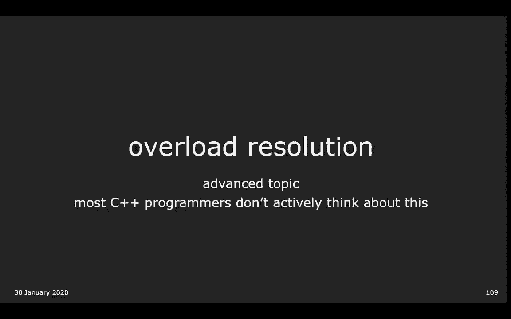

，因为这是少数几个错误信息实际上有用的情况之一。嗯，好吧，算是有用。所以，如果我传递 is less than limit，好的，你首先应该，注意到的是，我们甚至没有传递五，这将是一个问题。

我们从未真正说 limit 是五，但是如果你尝试传递这个，你会看到函数调用的参数太少，期望有一个，错误信息在这，里，注意我们如何调用谓词函数，我们传递一个参数。我们没有传递两个参数。好的。

这个函数确实将谓词函数当作一元谓词来使用，这样，是不行的。好的，这样明白了吗？此时你们有什么问题？让我们暂停一下回答一些问题。好的，是的，然后，哇，只有四个错误信息，我还期待更多。

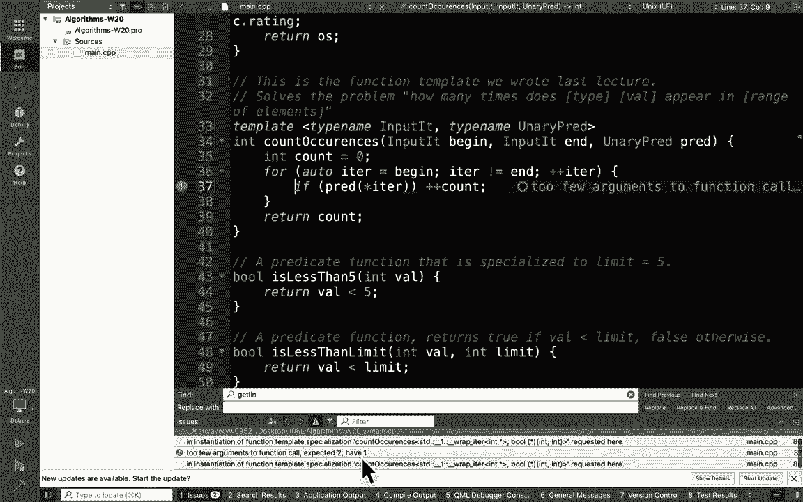

好的，是的，这样是不行的。你可能有另一个想法是，是的，然后你需要以某种方式将那。

个限制传递到函数中。你需要将那个整数限制传递到函数中而不使用参数。这有点烦人，对吧？如何在不使用参数的情况下将其传递到函数中？哦，有什么建议？好的，是的。所以你是说添加。

将那个 limit 参数传递到函数中？到哪个函数？到这里？好的，当然，是的，这是一个好主意。

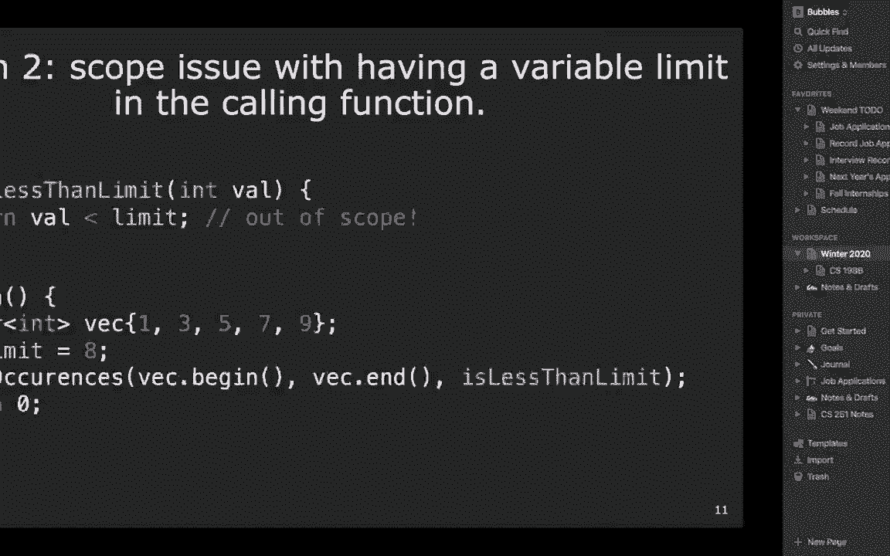

所以我们可以将我们的计数出现次数函数更改为接受一个，额外的参数，对吧？是的，是的，这是一个很好的函数。这是个好主意。这样的问题在于，我们的函数不再很好的通用，因为，不，因，为你不。

总是想要将这个限制与某种谓词函数进行比较，对，吧？是的，我们并不总是会使用限制。

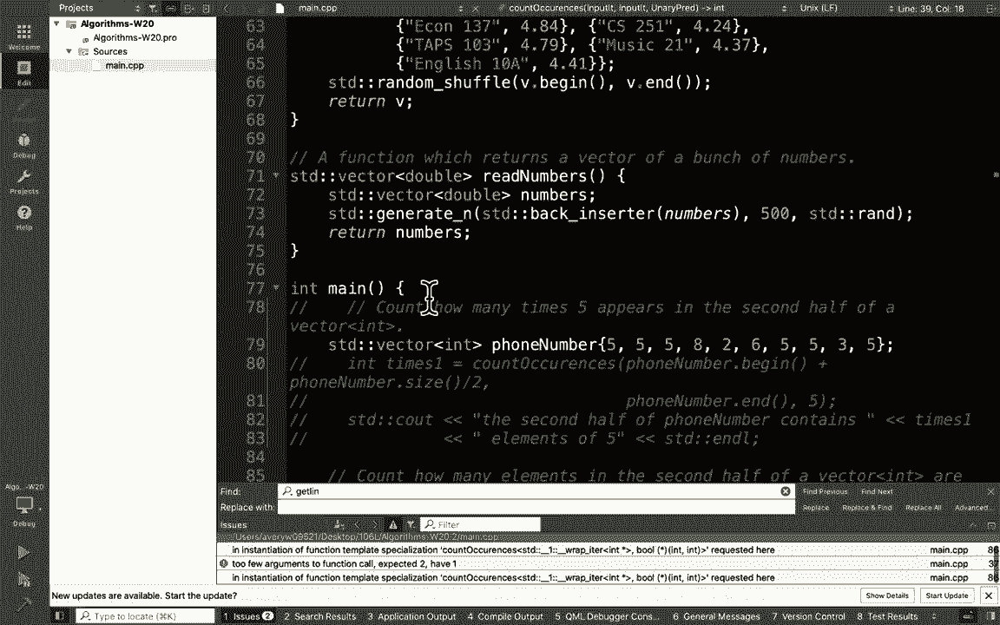

我们要尽量把我们的谓词函数写得尽可能通用。哦，错了，是这个。我们要尽量把这个函数写得尽可能通用，并且不总是会使，用限制这一点并不是真的。是的，所以是的，这是一个好的尝试，但我以为有人会提到，全局变量。

因为，技术上这是传递参数的一种方式，而不使，用参数，显然，不要使用全局变量。这是不好的。希望我不需要再解释这一点，但问题是因为这是一个一元，谓词，基本问题是作用域，对吧？你需要在那个函数内部使用限制。

你不能将其作为参数传递进去。我们来谈谈 Lambda 函数。问题，嗯？

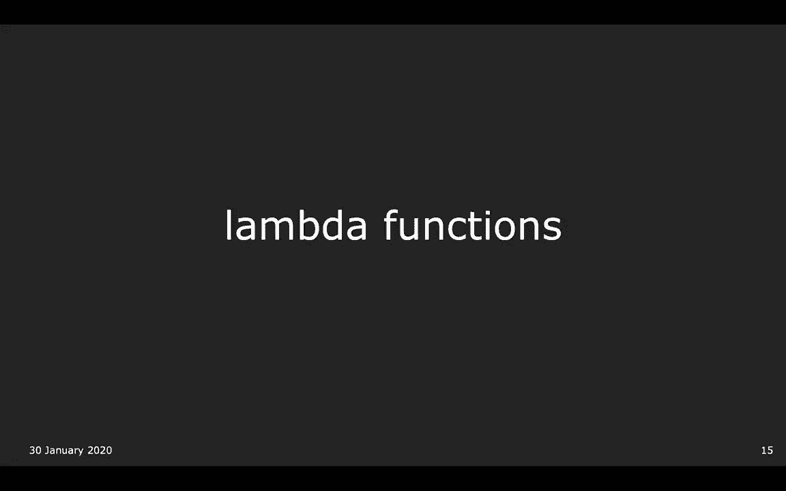

所以模板会接受任何类型的谓词，但由于隐式接口，由于我，们如何定义这个函数，对吧？在这个函数中，我们将谓词当作一个一元函数来使用。这是一个一元谓词。嗯，是的。是的。

所以这里的隐式接口是谓词应该是一个一元谓词。它应该接收一个参数。好的，明白了，具体来说，这里它期望一个 int，因为你传递。

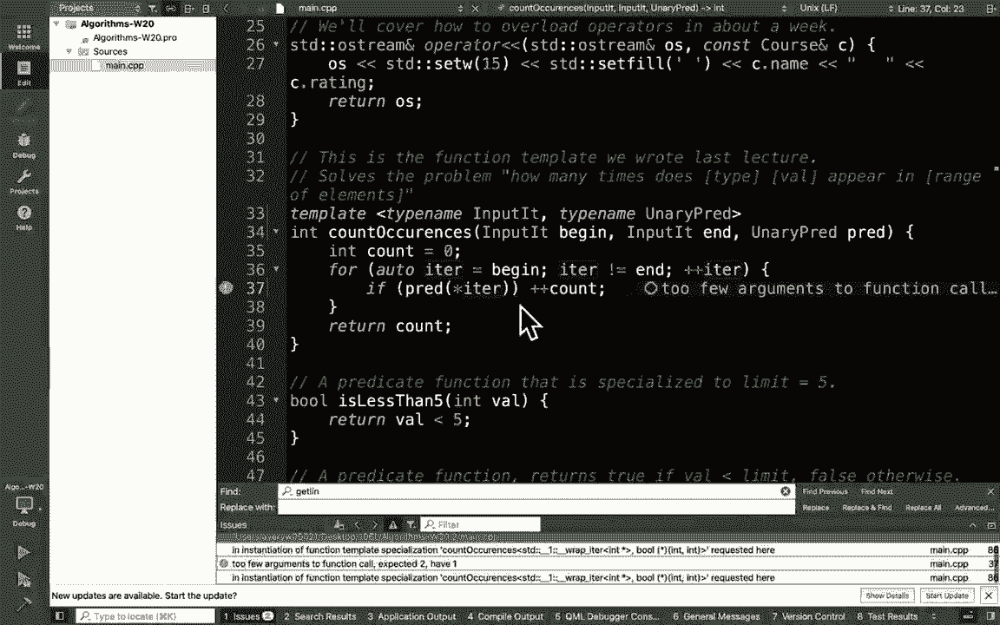

的谓词接收一个 int，但这不起作用，所以我们来谈谈 。

Lambda 函数。之前我这里有一张幻灯片，那样的，Lambda 函数从 C++ 11， 开始。在 C++ 11 之前，要解决这个问题，你必须写一个完整的类，来解决这个问题。你， 你。

 你编写了一个称为函数对象的东西，而这个话题，对我来说非常重要，因为这是我在面试时展示的主题。好的，但我必须说，函数对象类有点过时了，所以很遗憾，我，把它从我的幻灯片中删去了，但如果你对此感兴趣。

我们可，以在课程的下半部分作为额外的话题来讨论，好吗？是的，有一种方法，你实际上写一个完整的类，然后你，能够，将额外的参数作为字段保存在你的类中，但无论如何，这不，重要。我们来谈谈 Lambda 函数。

所以，现在我们使用的是这种旧方法。这被称为函数指针，因为，如果你深入一点，这些是作为指，针实现的，但我们希望做的是使用这种叫做 Lambda 的东，西。所以，我就把这个放在这里，观察它。

观察 10 秒钟。好了，我很好奇。那么，你的第一印象是什么？嗯，我的第一印象是，我从未见过这样的语法。这到底是什么，对吧？我的意思是，你以前见过这种奇怪的语法吗？没有，对吧？所以，这是一种非常新的语法。

你可能会对这种语法感到有，些不知所措，但我们会逐一解析这些部分来解释每个部分，是什么。你可以猜测一些部分是什么，对吧？我的意思是，例如，这就是一个函数体。在这里，你实际上把函数体放在里面，好吗？

需要知道的是，less than limit 的行为与我们之前的基，本相同。这是 less than limit。这本身就是一个函数对象。这是一个函数对象。你可以把它当作函数传递进去。

然后其他的一切就会正常，工作。让我们，嗯，再详细地分解一下。嗯，哦，这有点令人不知所措。是的，所以这里是 Lambda 的各个部分。让我们逐一看看。让我们从，嗯，最容易讨论的开始，就是这个参数列表 。

autoval。好吗？所以，这个参数列表 autoval 和这个 intval 是一样的。Lambda 的酷炫之处在于，你可以用 auto 作为参数。在普通函数中，你不能用 auto 作为参数。好吗？

所以，在这里，你可以使用 auto。通常，我只是非常懒，所以我就直接写 auto。好吗？第二部分，很容易理解，就是这个箭头 bool。这指定了你正在创建的函数对象的返回类型。好，所以这里是 bool。

因为这是一个谓词函数。我们之前也有 bool。好，就这两个部分。你对这两个部分有什么问题吗？好吗，让我们来看看一些更麻烦的部分。哦，还有，返回类型是可选的。你不需要写这个。

因为编译器可以推断出返回类型是什么，所以，通常我们根本不会写这个。好吗？但是，如果你写了这个，编译器会检查它是否实际返回了一，个 bool。好吗？但通常，我们只是完全不写它。好的。那么。

Lambda 的作用域是什么？这个 Lambda，有这个内部作用域，它以括号开始并以括号，结束。好吗？

嗯，让我们快速讨论一下作用域。所以，我要快速在这里写这个 Lambda 函数。好吗？所以，让我们在这里写一个 Lambda。好的，那么，Lambda 看起来是什么样的？Lambda 看起来是这样的。嗯。

我们注释掉 less than limit，因为我要称它为 less ，than limit。所以，auto less than limit。好的。所以，它首先以这个奇怪的括号开始。稍后再考虑这个。

Auto val。嗯，我们可以选择性地写这个，但现在没人真的写了。然后我们只需说 return val is less than limit，其中 ，limit 是，假设为五。

Auto 在 Lambda 中不被允许。好的。抱歉。所以，好的。所以，在 C++11 中，技术上说 auto 在 Lambda 中是不被，允许的。但是，如果我更改。

点击这个 dot profile 并把它改为 ，17，那么应该可以解决问题。不？好的。一个 Z。应该可以工作。来吧。看？那个错误信息就消失了。如果你遇到奇怪的错误信息，确保你使用的是 C++17。嗯。

我认为这个只在 C++14 中被允许。无论如何，好吧。嗯，是的。所以，我们声明了 Lambda。哦，我打了一个小错字。确保你在末尾加上分号，就像结构体一样。所以，现在你要注意的是，嗯。

它仍然显示 limit 有编译器，错误。所以，这就是关于 lambdas 的事情。Lambdas 生成它们自己的作用域。它们生成，呃，有时被称为闭包，因为它们实际上，它们在内，部有一个封闭的作用域。

外部的变量不能作为内部的变量使用。所以，那里 limit 不在与外部 limit 相同的作用域中。所以，这就是为什么你在这里得到编译器错误的原因。好的。如果你考虑一下。

这与我们之前遇到的问题是完全一样的，对吧？你不能把 limit 作为参数传入。我们不能在这里添加一个参数，因为那样就不再是线性谓，词了。但我们也无法，将作用域带入，无法以某种方式获取 limit，好的。

有什么猜测如何解决这个问题吗？作为提示，还有一部分 lambda 我们还没有讨论过。正是方括号。好的。所以，这个方括号是，呃，它就在那里，你可能会想它是用来，做什么的。方括号被称为捕获子句。好的。

这个想法是方括号能够捕获外部的变量，以便在内部使用，好的。所以，我们只需把 limit 放在那里，突然一切都能编译了，好的。这就是，嗯，我应该把它放在上面，因为我们会在这里调用，它。好的。

这就是捕获子句的用途。好的。再说一些。嗯，这个捕获子句，如果你这样写，它是按值捕获的。如果你想捕获，比如说，集合或向量，显然你不想按值捕获，你想按引用捕获。所以，你可以在这里加一个 & 符号。

这样就按引用捕获。好的。到现在为止有任何问题吗？是的。嗯哼。呃，多个东西捕获，对吧？是的，绝对的。所以，呃，我的意思是，在这个例子中不太有用，但假设你想，捕获一个，呃，比如说，总数或其他的，10。好的。

假设我想要，哦，哦，哦，这真的很酷。嗯，每次我调用这个 lambda 递增一次。所以，这真的很酷。呃，num 被调用了。好的。所以，每次调用这个 lambda 递增一次，我会按引用传递它。

以便每次你编辑它时，这将改变它在外面的值。呃，这有效吗？Num。哦，times。就是这样。好的。然后在这里我们做 num times 调用，嗯，++。好的。所以，这真的很酷。

每次我们调用这个 lambda，那个变量都会递增一次。而且因为我们按引用传递，它实际上会改变这个变量的值，哦，我，我，我刚刚想到的。这真的很酷。所以，你实际上可以看到这个 lambda 被调用了多少次。

好的。是的。所以，这是一个合法的方法，当你想通过引用传递时。好的。就像所有的事情一样，如果，有问题，是的。嗯。好。好问题。所以，我，我认为，基本上如果你在这里使用auto，那么，幕，后。

实际上是创建了一个模板，它创建了一个，基本上创建，了这个模板，模板t，然后用t替换这个。它基本上是这样做的。这不是编译的，但它基本上做的是类似的事情，它将那个东，西当作一个模板处理。

然后它尝试推断传入的内容作为类型。嗯。很好的问题。所以，假设在这里我们将它更改为double。所以，假设这个列表是double而不是int。他们必须为所有的元素加上小数点。但是，我的意思是。

你明白我的意思。如果你将它更改为double，这仍然会有效，因为我们会推断，出auto应该是double而不是int。这实际上是一个好点子。这实际上是我们想在这里使用auto的一个更大原因，以便。

你不需要为每个不同的类型创建一个新的。好的？酷。呃，我们将其改回，哦，对不起，不，不是在这里。我们要将其更改为double的向量。好了。是的。然后这仍然会有效，因为我们在这里使用了auto。好的。所以。

是的，这就是你调用它的方法。显然，就像在所有编程语言中一样，如果你想要偷懒，也有，偷懒的方法来捕获内容。你可以使用等号。如果你在这里使用等号，它会按值捕获所有内容。不，对不起，按值。如果你使用&。

它会按引用捕获所有内容。你也可以做，好的，我想按值捕获所有内容，除了num times， called，我想按引用捕获。好的？好的。大提示，永远不要使用这个，因为，这样会使函数中的所有。

内容都像是全局变量。函数内部的所有内容都是可用的，这不是好的。所以一般来说，避免使用这个，避免使用等号，或者像这样，捕获所有内容。好的。你可以在这个main函数内部使用每一个变量。

所以你甚至可以使用电话号码如果你想的话。好的。显然这是一个坏主意，因为你可能会不小心使用不该使用，的变量。所以一般来说，不要捕获所有内容。要有选择地捕获。只捕获你需要的变量。好的。酷。有问题吗？是的。

好问题。所以这是捕获子句的混合。所以当它看到这个捕获子句和参数列表时，它知道这是一，个Lambda。是的。是的。所以，因为我认为如果你只是做括号，我认为括号还有其他，用途。我不记得是什么了。

但我认为括号还有其他用途。可能吧。对。是的。但一旦它看到这个，它知道，这就是一个Lambda。嗯，我是说，即使你不给它一个函数体，你只是这样做，这也，是有效的。这只是一个空函数。还有其他问题吗？问题。

所以，如果你这样做，那么它就变成了这个的全局变量。它变成了全局变量。然后，嗯，我们还没谈到命名空间，但你实际上可以把东西，包装在命名空间里，对吧？是的。你可以把东西放在命名空间中。

这样就可以将这个全局变，量限制在特定的命名空间内。所以你是说，如果你这样做，如果你，也限制那个，对吧？假设在这里。嗯，如果你使用 static 的话，这样有效吗？不行。好的。那你有什么想法吗？

限制不能被捕获。好的。我认为原因是，因为如果你这样声明，就会有关于这些初始，化顺序的事情。可能会有关于这些初始化顺序的问题。所以，嗯，我认为正因为如此，这可能会发生。好的。我不完全确定如何解决这个问题。

嗯，我不是，嗯，我不是一个静态如何工作的专家。嗯，我可以再回到这个问题上吗？好的。我想展示的最后一件事是，嗯，就像函数一样，你可以使用，默认参数。所以我可以默认设置为零。好的。你可以使用默认参数，然后。

嗯，算了。好的。酷。问题？是的。是的。所以 Lambda 函数是一个对象。嗯，Lambda 函数是一个，嗯，在幕后，实际上有一个类在你，写这个的时候被创建，它为你创建了那个类的一个实例。

所以我认为这可能是为什么，嗯，如果你把它放在函数外面，那么有一个奇怪的静态编译时的东西，它必须创建类，但，它不知道你现在要在那个类中创建对象的确切意思。这个本身，我认为不是。我认为不是。

我可以再回到那个问题上吗？我不太确定。是的。嗯，是的。原因是因为这个实际上，像我之前暗示的那样，这实际上只，是一个类。我，我，当我暗示时，是的，这个 Lambda，它在幕后做的事情，是生成一个类。

它创建了那个类的一个实例，而那个实例小于限制。好的。你可能会想，这个的类型是什么？为什么我在这里使用 auto？这里有一个地方，你实际上只能使用 auto。好的。因为当编译器生成一个类时。

你不知道那个类的名称是什，么。编译器会为那个类生成一个名称，然后你想要创建一个实，例。你不知道那个类叫什么。所以你必须在这里使用 auto。如果我滚动到这里，它说这是某个 Lambda。它甚至不知道。

直到它尝试编译它。好的。酷。是的。所以，如果你尝试运行这个，这将会有效。问题？是的。是的。这是个好问题。嗯，我在想，也许你可以使用默认值。好的。我不太确定默认值的使用。我只是突然想到的。

然后我有点后悔了，觉得可能不适用。所以让我再考虑一下关于默认值的事。是的。默认值相对较新。所以我觉得这可能是一个非常新的东西。所以我不是很确定。让我再考虑一下这个问题。好的。除了这些细节。

你们对Lambda的创建和使用有清楚的了解。

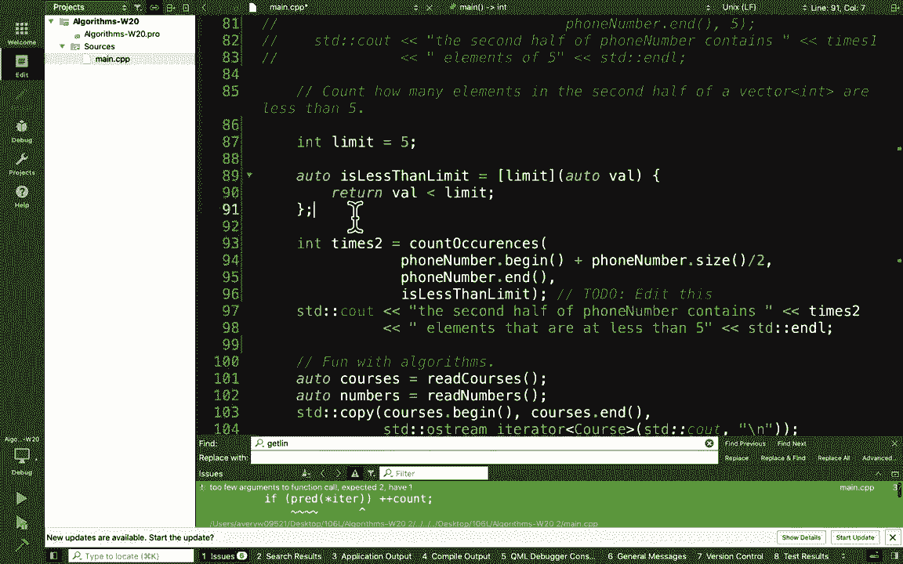

吗？我们来看看吧。是的。你可以通过引用捕获。你也可以通过值捕获，或者像这样捕获所有内容。嗯，当我最初展示这个时，我有一个幻灯片，上面写着“宝可，梦，全都抓住”。是的。所以这基本上是捕获所有范围内的符号。

语法就是这样。你会字面上捕获范围内的所有内容。好的。呃，我不想详细讲这个。我应该讲吗？不，我不会讲这个。是的。所以Lambda本身是函数对象，这意味着你可以像使用函数，一样使用它们。

所以在这里你可以看到，好的，我声明了一个仿函数，一个，二元谓词，或者说只是一个二元函数，然后我们可以像调用，普通函数一样调用它。我不想讨论bind，因为我们时间不多了，但如果你想了解，bind是什么。

稍后告诉我。好的。呃，我们不讨论bind了。算法。我们来讨论一下STL算法。所以我们终于到了可以讨论STL算法的阶段。

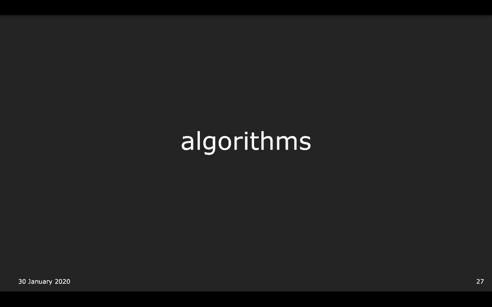

好的。所以我们写的函数，实际上就是一个叫做count ，occurrences的函数。那个确切的函数实际上是STL库中的一个函数，叫做count，和count if。count是没有谓词的。

它是你只需提供数据值，然后它会检查有多少个实例。count if是那个实际上需要谓词的。嗯，是的。所以有很多这样的函数。嗯，还有几个新的。这真的很酷。其中一些函数实际上是并行运行的。

所以你可以让它进行计数并计算东西。它会并行计算向量的不同部分。

好的。也许我们将来会讨论这个。还有很多其他算法。嗯，这里有一张所有算法的完整图。是的。这是一张很大的图。呃，我想提到的是有一个关于堆操作的部分。嗯，有人知道堆是什么吗？好的。你们之前上过CS106B吗？

是的。好的。所以有一个作业，作业五，基本上要求你实现一个堆。而且，如果你使用堆算法，你可以在大约四行代码中解决那，个作业。好的。所以，仅供参考，作业五中不要使用堆操作。好的。如果使用的话，你会得到零分。

但是只是为了让你知道，嗯，确实有一个堆操作的部分，它，可以让你实现一个堆。好的。所以让我们做一些，嗯，一些基本的算法示例。我将讲解一些你可能会遇到的大算法。然后安娜将展示一个大示例。

说明你如何使用这些算法，以，及如何使用整个 STL 来解决问题。所以这里，让我们对一些课程进行基本操作。好的。如果你查看启动代码，你会注意到，让我把这个移除，因为。

我们不再需要它了。你会注意到，我创建了一个名为 course 的结构体，它包含，一个名称和一个 double 类型的值。课程的名称，比如 CS106B，CS106L，然后是他们的 Carta ，评分。

好的。嗯，以前，我会写一个读取文件的函数，它读取我从 Carta ，上抓取的整个文件。但是，我懒了。所以我真的只是写了一堆课程。所以你会看到 CS core 在这里。其他一些常见的入门课程也在这里。嗯。

是的。然后一些我上个季度修的课程也在这里。好的。然后它随机打乱了，虽然它没有，嗯？没有叫做 random shuffle 的函数。哦，我想在 C++17 中，它现在只叫做 shuffle。来吧。好的。

那应该可以工作。不行。三个参数。为什么需要三个参数？不，不行。嗯。好的。嗯，不过没关系。我们不需要打乱顺序。我们不需要打乱顺序。这有点，让我移动一下这些。让我调整一下顺序，以便稍后。

当我们调用这个叫做 ，stable partition 的东西时。那样会更酷一点。好的。所以这里，嗯，我只是改变了这些或那个的顺序。嗯，稍后的分区会很酷。好的。所以让我们讨论一下算法。

所以这里我有一个课程的向量。

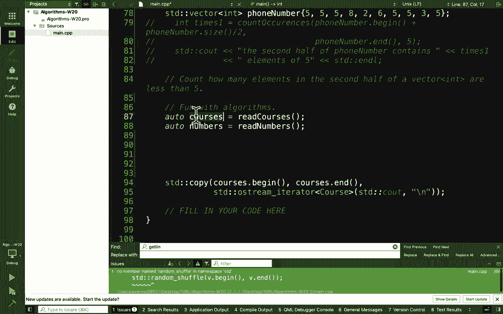

这是一个数字的向量。它只是一些随机数字。我们将尝试对它们进行一些操作。

所以首先，这可能是你想做的事情。嗯，这里是我们将要探索的一些算法。这些是你可能会使用的非常常见的算法。所以首先，嗯，让我们进行一些排序，嗯，进行一些处理，试，图找到向量中的中位数。好的。

那么你有什么主意来找到向量的中位数吗？如果你有一个整数向量，你会如何找到它的中位数？好的。排序。然后，是的。然后找到中间的元素。如果有平局，我们不必太担心平局。

好的。就假设有一个奇数数量的课程。只需找到中间的元素。好的。器。所以 numbers。begin，numbers。end。然后它就接受这些参数，并为你排序数字。好的。嗯，还有什么？好的。

假设我们想要对课程进行排序。所以假设我们想要按照评分对课程进行排序。好的。所以如果我这样做，可能会得到一个编译错误。好的。猜猜看，我们为什么没有得到编译错误？这很奇怪。好的。

所以我认为发生的情况是默认情况下，它只是按，我们应该，得到编译错误。是的，我们得到了。

最后。是的，我们确实得到了编译错误。你会发现编译错误是有点吓人的。哦。是的。它，呃，它在这里做的是，它在尝试调用各种排序。这实际上是，呃，这与我们上次所说的重载解析有关。有很多种排序变体。

它尝试最佳的变体，但是失败了。但由于，呃，由于SFINAE，它尝试每一个变体，并且显示所有，的都失败了。所以这是一个错误。所以它必须逐一遍历每一个，每一个排序和每一个可能的。

情况。并且显示，哦，没有一个有效。每一个排序和每一个排序的实例化，没有一个有效。所以，这就是为什么你会得到那个吓人的错误。而这背后的原因，呃，有人知道为什么，呃，为什么我们不能。

这样简单地对课程进行排序吗？这是一个自定义结构体，对吧？没有，没有像默认的方式来比较两个结构体。你怎么知道一个结构体比另一个结构体小？所以在这里你会想传入一个谓词函数。这个谓词函数叫做compare。

一个比较谓词函数应该做的是它应该接受两个参数，并且，返回第一个是否小于第二个。明白了吗？所以它应该本质上实现小于的定义，即小于的含义。所以在这里，例如，嗯，让我们为此写一个Lambda。

我们的Lambda应该接受auto，呃，假设，呃，compare rating，它应该接受两个课程。假设课程C1，课程C2。我们实际上不需要返回值。然后我们想要返回C1小于C2的含义。

所以C1小于C2是什么意思？很好。所以，你怎么知道C1小于C2？好的。嗯，这意味着如果C1的rating小于C2的rating，不要忘记分，号。

然后我们可以将其传递给compare for rating。好的。我现在还不打算讨论这是什么，但这是一个将内容打印到，输出流的花哨的方式。

好的。所以如果我现在打印出来，哦，哇。

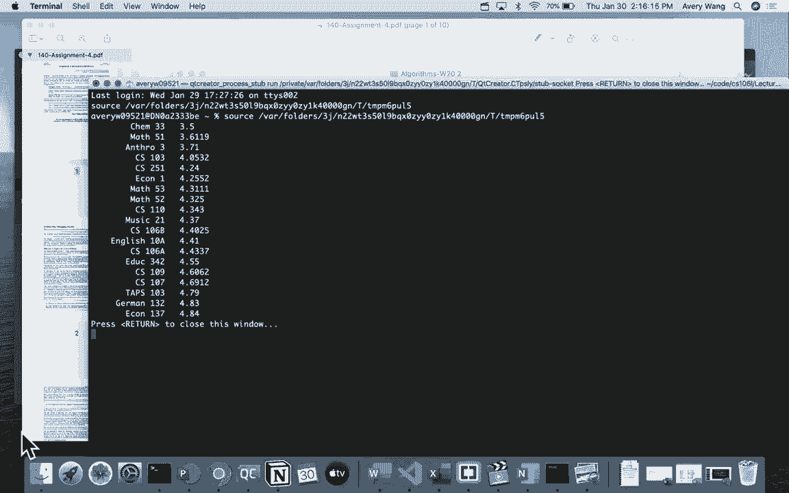

一切都是，一切都是，从最低到最高。对不起，Chem 33。对不起，Math 51。还有，嗯。这是所有的课程，呃，按照它们的评分排序的。好的。是的。我在查看时，嗯，我想到的所有课程评分都太高了。

所以我主要想到，嗯，Chem 33，我们来看一下Chem 33。是的，它是最低的。Math，Math 51也挺好的。好的。所以，嗯，这里是评分，然后你可以按默认方式对其进行排，序。好的。呃。

还有另外一件事你可以做。呃，如果我想按名字排序怎么办？所以我想按字母顺序排列。好吧，你可以直接做，因为这些是字符串，你可以直接比较，流。呃，是的。所以我们可以按名字进行比较，这样的话，我们会得到，嗯。

课程按名字排序了。好的。明白了。然后，呃，正如你所说，我们可以，呃，尝试找出中位数。为了定义中位数，我们可以做 auto median 等于，呃，courses dot，嗯，这里我们想按评分排序。

所以让我再把这个改为评分。这里我们只需要找出中位数。所以我们直接找 courses dot size 除以二。好的。如果是偶数，可能会有一点偏差，差不多就好。好的。所以这会给你中位数课程。

好的。呃，哦，我们快没时间了。真遗憾。好的。好吧，嗯，有一种更快的排序方法。排序，我们还没有讨论过，呃，算法分析。如果你已经上过 106B，你知道这需要 n log n。

有一种方法可以在 O(n) 中完成，这就是使用这个叫做 ，nth element 的花哨函数。我们没有时间详细讲解，但这真的很酷。如果你想知道它的作用，来上课后找我们。好的。呃，稳定分区。

所以稳定分区很酷，它的作用是，它查看所有谓词返回 。

true 的元素，查看所有谓词返回 false 的元素，然后重新，排列向量，使得所有返回 true 的元素在前面，所有返回 ，false 的元素在后面，并且返回 true 和返回 false 的元。

素之间的相对顺序与之前相同。这意思明白了吗？好的。所以第一个想法基本上是所有返回 true 的元素出现在前，面，所有返回 false 的元素出现在后面。好的。然后这些元素的相对顺序不变。

所以如果两个返回 true 的元素，一个在另一个前面，那么，在稳定分区之后，第一个仍然应该在第二个前面，但都在前。

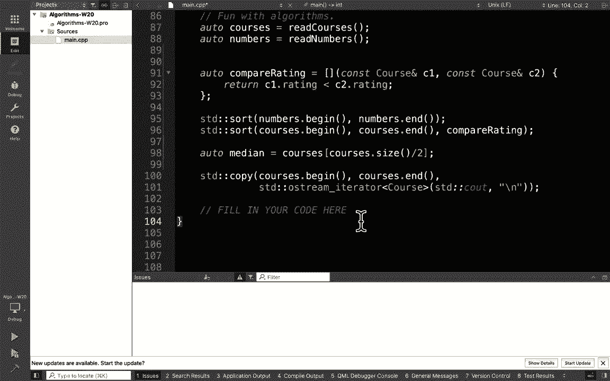

面。所以本质上，如果我想找所有 CS 课程，这意味着什么？

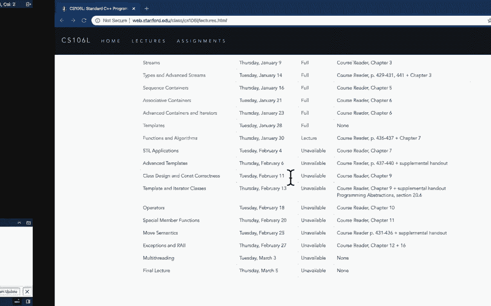

如果我调用稳定分区，谓词是判断这是一个 CS 课程吗？结果是，它会把所有 CS 课程放在前面，把非 CS 课程放在，后面，返回值是一个指向那个分区点的迭代器。所以使用起来很不错，对吧？

所以我们就快速实现一下吧。呃，假设我们想，嗯，好吧，已经 2：20 了，所以其他的可能，只是实验时间了，我猜。所以试着自己实现一下。你需要实现一个二元谓词，它如果是 CS 课程就返回 ，true。

如果不是 CS 课程就返回 false。好的？其实有点复杂，所以让我来实现一下。呃，然后我想使它更通用，不仅仅用于 CS 课程。所以假设是部门，我们指定一个特定的部门。假设这里我们说 CS。

所以这里我们想说 auto，呃，implement，然后我们想返回 ，true。为什么会有奇怪的语法？哦，我，我，我忘了把那个，放进去。好的。然后我想说，好的，如果元素，如果，元素的课程代码，如果。

它以，嗯，让我们看看，substr零开头。好的，这太复杂了。我，我，我只会用CS。呃，如果元素点substr的零到二，这必须等于部门，返回元，素点大小大于二并且那个。是的，来吧。好的。

所以本质上这个想法是，嗯，STD字符串。这里的想法是，我们要检查，嗯，我们要检查前两个字符是，否是CS，并且你还需要确保大小大于二。好的。所以这检查了元素，我们检查的课程代码是否以CS开头。

在这种情况下，我们就不需要再排序了。这里我们可以直接做，嗯，stable STD，stable partition，我们传入courses点begin，begin courses点end，然后我们。

传入is department，检查它是否是CS课程。运行它。哦，不。怎么了？有什么想法？不，哦，不。哦，我们要检查名字的大小是否大于二。来吧。这边也是一样的。运行那个。

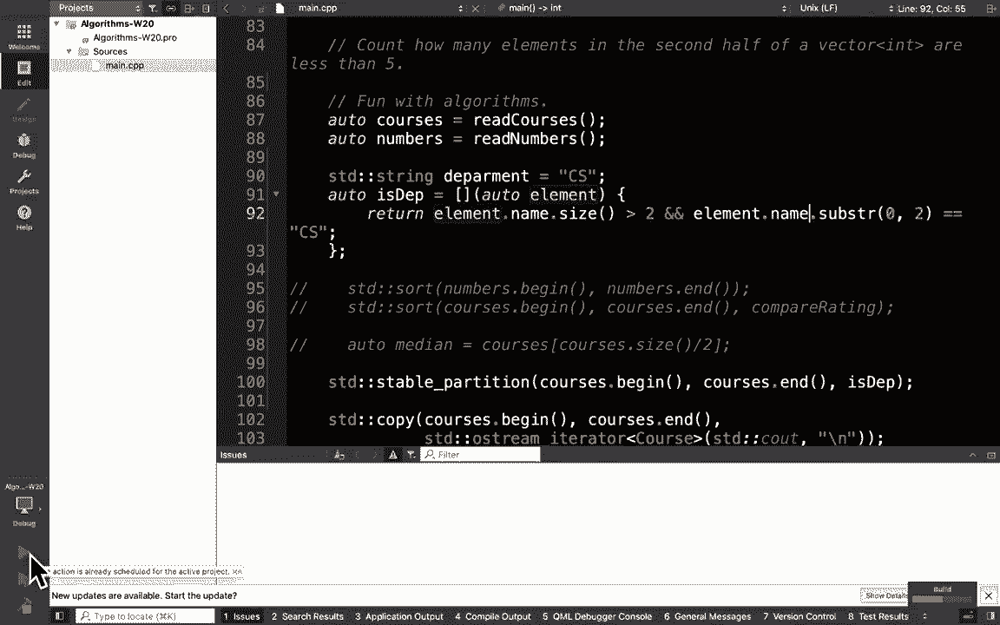

嗯，是的，你会看到它已经被分区，使得所有的CS课程都在，前面，所有的非CS课程都在后面。它们的相对顺序也是，呃，保持不变的。

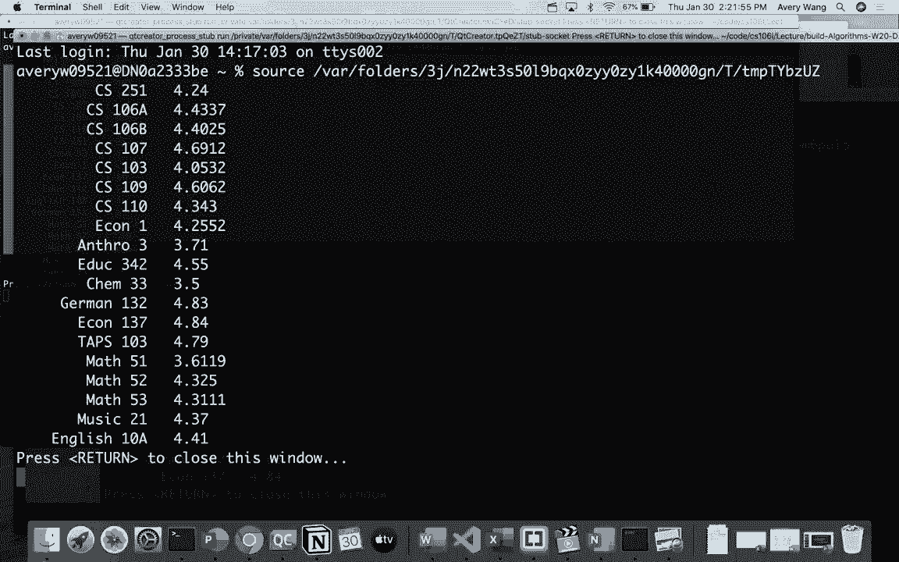

好的。所以这很酷。这是一个你会用到的常见函数。呃，好吧。为什么我们使用算法？它是抽象的。好的。我们，下次我会简要讲一下这个。嗯，好的。另一个是叫做copy if。copy if做的事情是。

它查看一个范围，并将所有满足谓词，的元素复制到，嗯，另一个函数中。好的。所以你可能会这样做，cscourses点begin，cscourses点end，我想把它放到一个新的向量叫做cscourses中。

然后在这里，放入谓词，以便它调用所有返回true的。顺便问一下，你到目前为止有任何问题吗？我讲得很快。基本上，这些是非常有用的，嗯，不要记住这些。也许是非常常见的那些，但你不必记住这些，你总是可以。

Google，像，你总是可以Google一些东西。如果你想到一个你想做的操作，并且你觉得它很常见，那么，可能有一个STL算法来做这个。好的。所以是这样，嗯？为什么vector在这之间不工作。

为什么它不起作用？

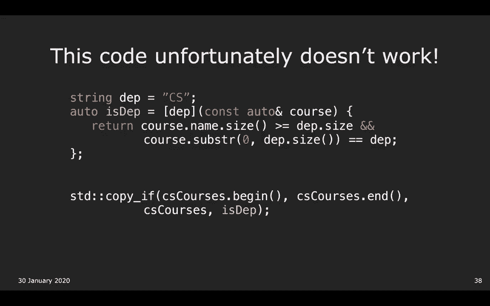

好的，很好的问题。是的。所以那边确实有个错误，但这不起作用，因为，呃，首先copy。

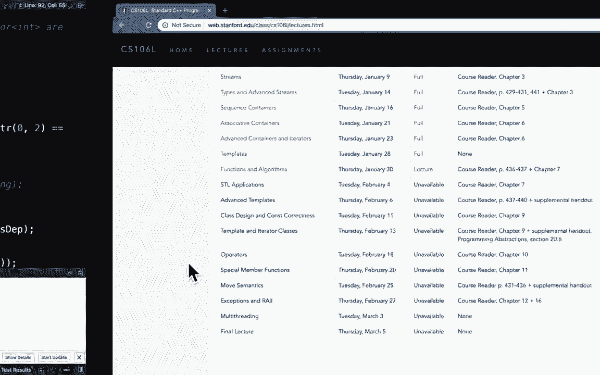

 if接受一个，输出迭代器。

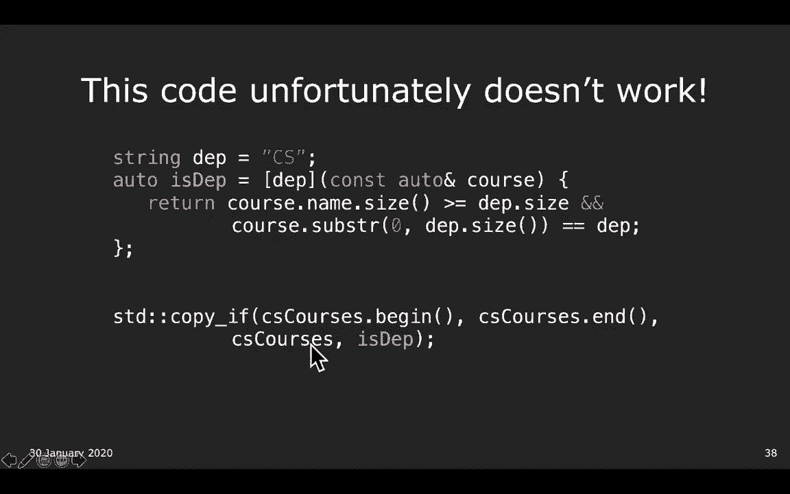

哦。是的。所以它接受一个输出迭代器，而不是向量本身。好的。但即使你放了输出迭代器，它实际上也不起作用。

原因是这样的。这是原因。所以假设我们在运行，假设算法正在尝试复制东西。所以它说，好的，这是一个CS课程，我要复制它。这是一个CS课程，我也要复制它。这是一个CS课程，我也要复制它。我只是会继续复制。

对吧？问题是，嗯，向量有一个默认的大小，但这些算法并不是向，量本身的成员函数。所以它们不能，它们实际上没有改变那个向量大小的方法，所以它，只是尝试写入向量，超出了结束迭代器，它只是继，续写入东西。好的。

有趣的是，你需要某种特殊的迭代器，它可以扩展你向量的，容器的大小。

所以让我，把它写出来。假设我们想要做，嗯，复制，如果，嗯，假设我们有一个新的，向量。假设它叫做向量课程，CS 课程，std 向量，CS 课程。假设我们想要查看 ，v。courses，courses。

begin，courses。end。如果，嗯，我们的猜测是做一些像 cs。cscourses。begin 然，后，嗯，作为部门，对吧？但这不起作用，因为，嗯，这个迭代器无法扩展容器的大小，所以。

要找到一个能够扩展容器大小的迭代器，你基本上只，需调用一个叫做 backinserter 的函数。哦。然后你传入容器。好的。Backinserter 是一种叫做迭代器适配器的东西。它接收某种容器。

然后输出一种特殊的迭代器，它可以插入，东西。

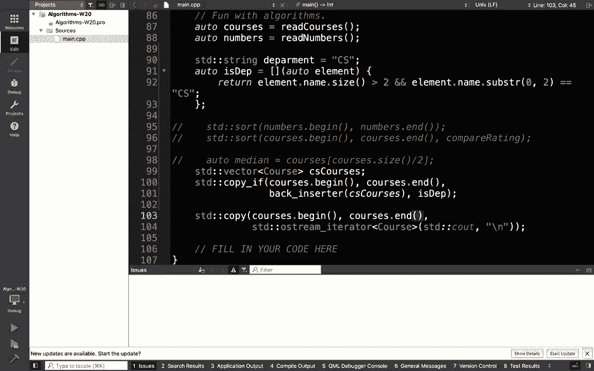

好的。所以在这里，具体发生的是，嗯，哦，不是什么。所以如果你做这样的事情，你在向量本身上使用 ，backinserter，然后你可以做，然后当它达到这一点时，每，次你，尝试添加一个。

每次迭代器尝试写入一些东西时，容，器都会被扩展。好的。这有意义吗？好的。我只是想简单、快速地解决这个问题，因为如果你想使用，复制函数，那真的是非常重要的。你必须确保在需要时确实扩展容器。

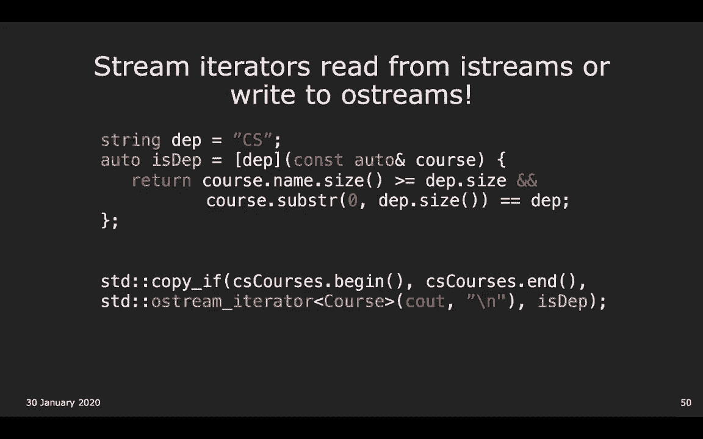

酷。嗯，是的。流迭代器，嗯，它们不是那么重要。这个概念是，假设我们想要将元素复制到，嗯，流中，对吧？你实际上可以使用 cout 并调用这个，这是一个，嗯，这是，一个迭代器适配器。

它输出一个针对 cout 的迭代器，这意味着你可以使用复，制函数向 cout 写入东西。在这里我们只是将所有课程复制到一个流迭代器中，该迭，代器写入课程。当我们将它们放入这里，因为我们像这样写。

这就是为什么，当这个函数被调用时，它实际上是将一切打印到 cout。它本质上是去向量，将所有内容复制到 cout。好的。对这个有任何问题吗？所以这些只是你会用到的非常常见的函数。复制，排序，复制，分区。

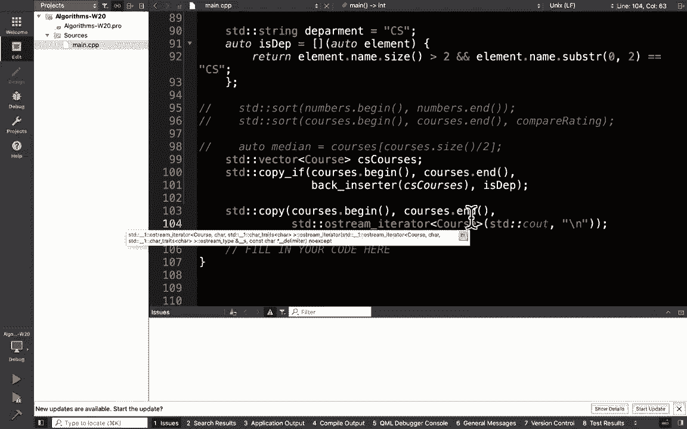

还有一个更多的 remove if，但我们有时间来覆盖它吗？好的。让我们快速覆盖一下。

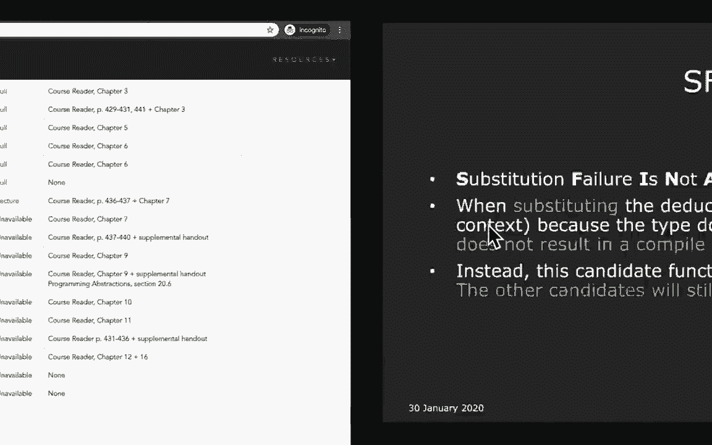

这非常快。如果你必须走，可以随时离开。这不是特别重要。上次我们讨论了如何，如果你想要移除，嗯，remove if 做，的是它去向量中移除所有满足谓词返回 true 的项。对吧？好的。所以，嗯。

假设我们试图移除所有绿色的。上次我们讨论了这种逻辑，其中我们尝试移除这些元素，以，便不需要移动所有元素太多次。好的。但是问题是，如果你调用 `remove_if`，比如我们想要移除。

所有的计算机科学课程。好的。假设我们想要以这种方式移除所有计算机科学课程。我将在最后输出 `courses。size`。我也会在开始时输出 `courses。size`。好的。所以，我们将这样做。

然后移除所有计算机科学课程。我们会打印所有计算机科学课程，然后在最后打印向量的，大小。你认为会发生什么？呃，迭代器，呃，所以 `remove_if` 是这样实现的，它确保，所有迭代器都是有效的。所以。

这没问题。奇怪的是 `remove_if` 实际上并不会移除向量中的元素。

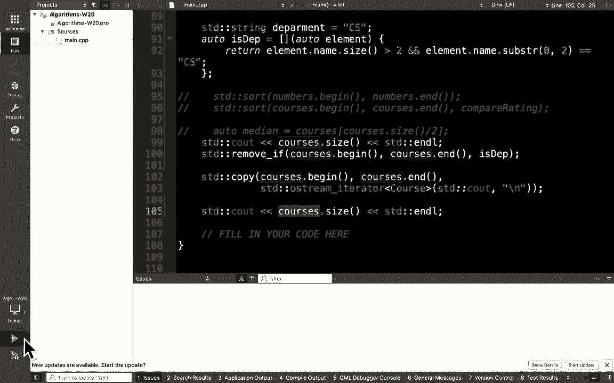

。

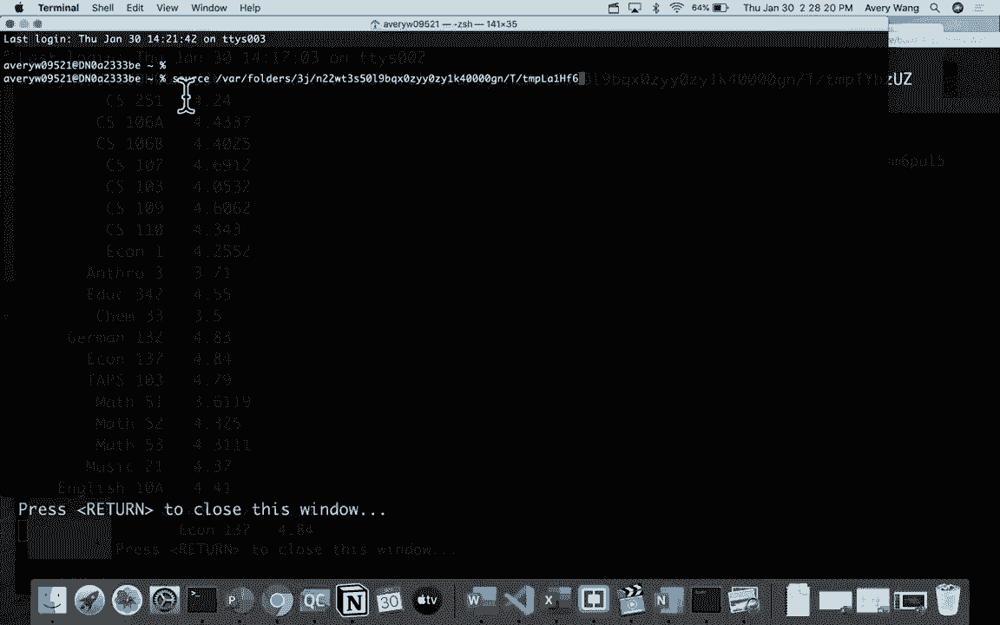

哦，天哪。这是什么？这是正确的吗？

再试一次运行它。

好的。所以你会看到发生了一些奇怪的事情，对吧？向量开始时大小是19。它执行了整个移除操作，然后向量看起来有点奇怪，某些元，素也有点奇怪，最后大小还是19。

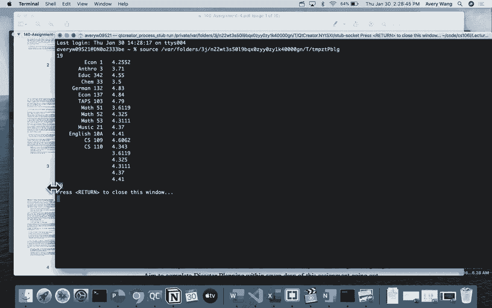

有点奇怪，对吧？是的。所以 `remove_if` 所做的是，`remove_if` 不能实际从向。

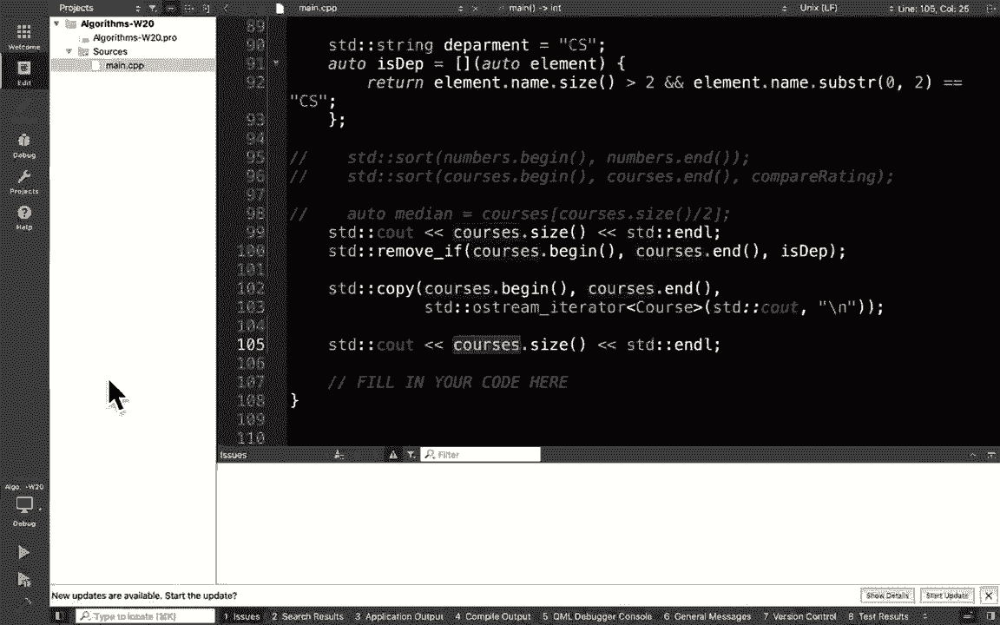

量中移除元素，因为 `remove_if` 不是向量的成员。关键点是，算法本身不能实际改变向量的大小。它们可以改变内容，但不能改变大小。

好的。所以 `remove_if` 实际上是高效地将你想要移除的元素。

移动到向量的末尾。

就像这样。呃，所以基本上在你调用 `remove_if` 后，它返回一个指，向空单元的迭代器，这就是你想要删除的部分。好问题。

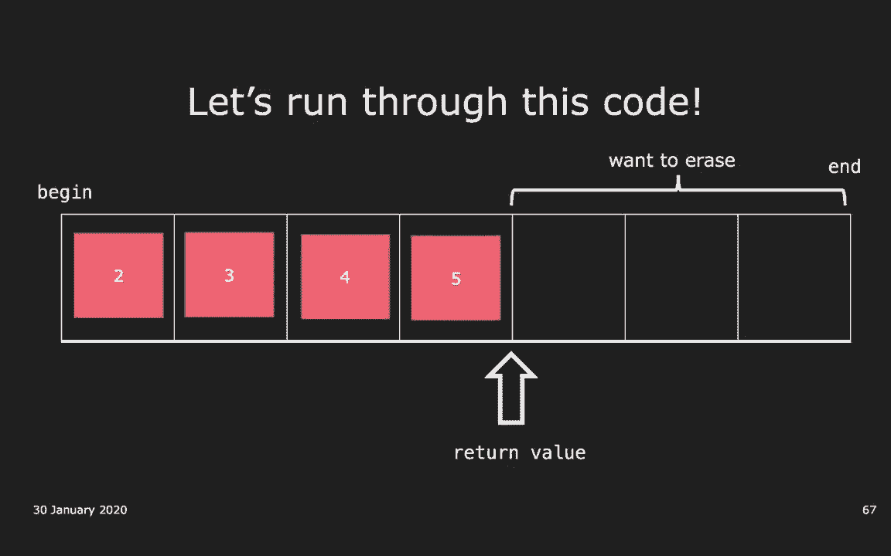

所以为什么这里还有两个课程标记为计算机科学？所以 `remove_if` 所做的是使用某种算法尝试将课程交，换到末尾，但没有保证这些被移除的课程会是什么。没有保证会是什么。算法可以对它们做任何事情。

它只需要，呃，课程甚至不需要在那儿。它们只需要被移动出去。课程可能甚至不在那里。但问题是，末尾仍然有垃圾，你必须直接调用 `erase` 才。

能更改向量的内容。这样理解吗？

好的。所以，这被称为 `erase-remove` 惯用法，你在两个迭代器，上调用 `erase`。第一个迭代器是 `remove_if` 返回的那个。`remove_if` 返回这个迭代器。

然后你要移动到 `V。end`，就是这个。好的。这是非常常见的，呃，非常常见的，呃，惯用法。这被称为 `remove-erase` 惯用法。

好的。我们再试一次。嗯，这里我们做 `courses。erase` 然后 `courses`。所以如果你运行这个，现在一切都会被移除。

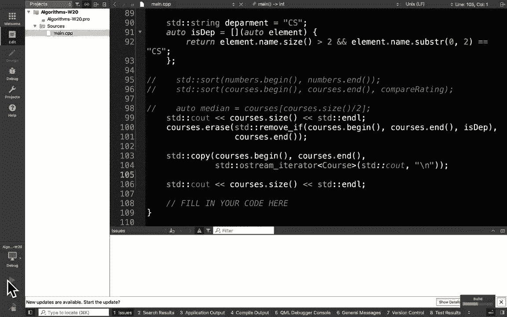

是的。所以你可以看到。它从19开始。垃圾不再存在，最终大小是12。好的。是的。所以，嗯，我们将继续讲解这系列，嗯，命名不佳的C++函数，好的。所以上周我们讲了SFINAE，它的名字真的很糟糕。

这周我们讲了remove_if，它实际上并不会移除。嗯，我们很快会讲到PIMPLE。然后，嗯，总的来说，很多C++函数的名字，并没有真正告诉，你它们的功能。好的。

所以这就是为什么C++对于初学者来说很难使用，因为它有，很多小技巧，你需要有经验才能知道。好的。但这只是一个你需要知道的重要技巧，叫做erase-remove，习惯用法。

我觉得我差不多讲完了。嗯，最后我想讲的是，嗯，find。所以Anna在两节课前演示了find。find本质上是遍历一个范围，尝试找到最合适的元素。也就是，嗯，找到匹配的元素。你还需要知道，嗯。

对于find，每个类本身也有一个find函，数。你应该使用哪个？结果发现，对于集合和映射，find成员函数比std：find函，数更快。好的。我只是想提一下。

我会在下次再总结一次。好的。谢谢，感谢大家的到来。嗯，今天就到这里。哦，我还是超时了。你的作业是实现remove_if。好的。这实际上有点难。我这里有答案吗？没有，我没有答案。好的。

remove_if实际上有点难。好的。谢谢大家的到来。嗯，我今天没有食物。嗯，我这里有午餐。但，嗯，是的。所以感谢大家的到来。如果你有任何问题，请在课后留下，让我们回答你的问题。是的。另外。

周二的讲座是STL的最后一讲，我们将把到目前为止，学到的内容整合在一起。嗯，请带上你的笔记本电脑，因为我们可能会尝试一些新的，内容。我还不确定，但也许吧。所以带上你的笔记本电脑。太棒了。

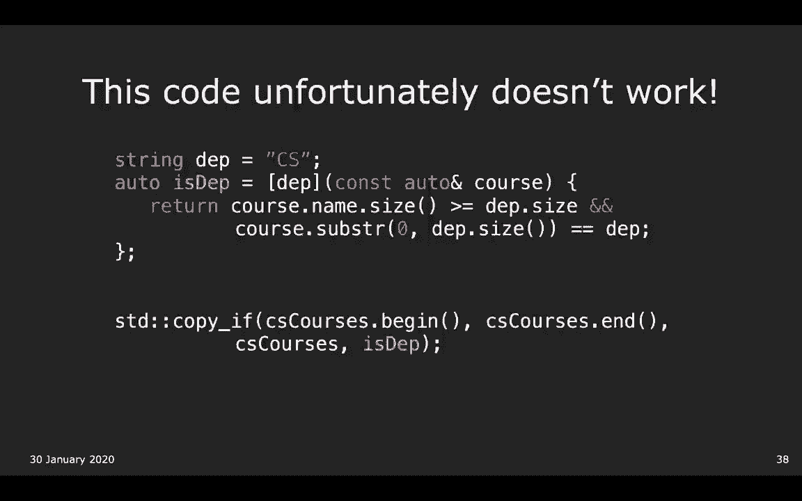

哦，哇。好的。所以，Lambda的内容很有趣，但算法真的很无聊。即使我谈论它们，也觉得哦，哇，它们真无聊。是的。好的。是的。呃，上次我讲了太多，这些才是真正重要的内容。是的。所以我希望这对你们有帮助？

好吧，我们上次没有覆盖到。是的。但，嗯，因为我觉得这很重要。比如你必须知道怎么移除东西。是的。所以在我修正后，尽管我说i不等于j，但这仍然没有解决问，题。我觉得是因为，嗯。

你正在对每对i和j进行两次遍历，对吗？i等于0，j等于1，然后j等于1，i等于1，j等于0。这些实际上是相同的计算。对的。是的。所以你能尽量避免重复计算吗？避免出现 I 等于 1。

J 等于 0 和 J 等于 0，I 等于 1 的，情况。因为这些是相同点对之间的排斥力。啊，对了。尽量避免这种情况。绑定。哦，好吧。

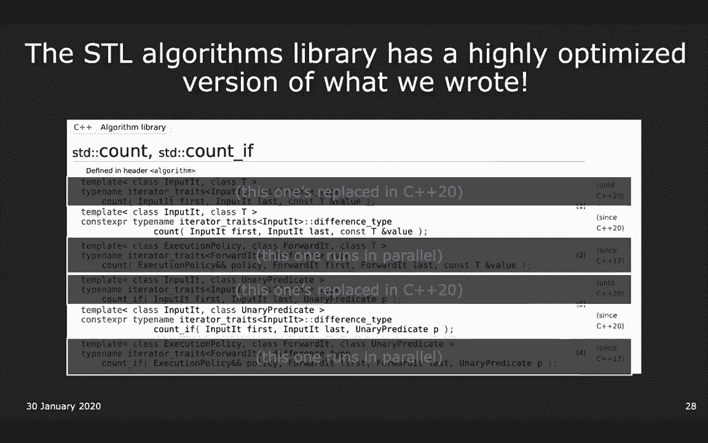

那么，绑定是怎么工作的？绑定是相当简单的。

呃，在 Lambda 函数发布之前，绑定对你非常有帮助。所以假设你仍然想要使用这个。哎呀。假设你仍然想要使用这个函数，对吗？这个函数的问题是它有限制。它有一个限制，并且你不想要那个额外的参数。

所以你可以做的是，你可以把这个函数绑定到一个特定的，值，然后它会变成第一个函数。是的。所以是的，绑定接受一个函数和一些参数，然后它返回一个，新的函数，该函数将所有参数绑定到那个函数本身。是的。是的。

好的。嗯，你能给我两分钟吗？让我演示一下这个。所以，呃，让我首先做这个简单的例子。呃，简单的例子是，嗯，好的。

它在幻灯片上。让我写下来。所以简单的例子是这里，是这里。好的。所以你有那个两个参数的函数，你想找到它。所以它变成了一个单参数函数。你会把那个函数对象传入。所以绑定接受任意数量的参数。好的。

然后你按照你想要绑定的顺序放置参数。有这些特殊的，嗯，东西。是的。我认为它们在枚举中。我不确定，但这些是特殊常量，它们表示不绑定任何东西到，那个位置。所以如果你这样做，没问题。

它会将什么值传递给这个东西？

是的。这不是一个值。别担心。这绝对不是一个值。

呃，虽然现在有一个争论，是否应该使用绑定？

嗯，因为替代方案是，你也可以写一个函数对象，它包装了，你的原始函数。这基本上是实现绑定。

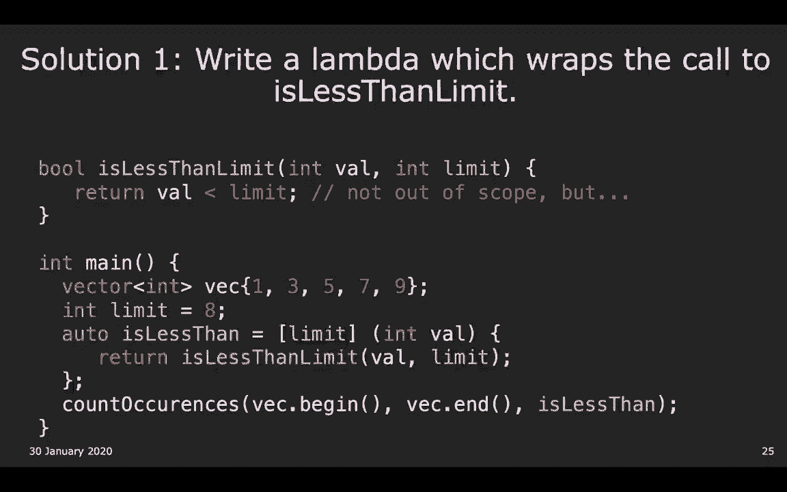

嗯，那个下划线是什么？是的。所以，你可以看到这些，比如说，你也可以切换参数的顺序，你也可以切换参数的顺序。是的。是的。你可以按不同的顺序放置它们。你可以将相同的东西放在两个不同的位置，如果你愿意的，话。

呃，什么？哦，这里，这里来。这些是什么？这些叫做占位符对象。见下文。好的。所以它们的类型是未指定的。它们有未指定的类型，这意味着它们没有被标准定义。编译器可以，嗯。它可以选择是什么类型。是的。基本上。

我很确定他们只是创建自己的类，然后不告诉你类，的名字，但他们，嗯，他们创建了一些不可用的类，但你有这，些全局对象，嗯，它们是未指定的类。这很奇怪。

我真的很感兴趣。我们来看看是否小于限制。你需要，呃，我们先试试看。所以，是的，让我检查一下。嗯，没有名为 edit 的成员，导入函数式。所以 bind 来自函数式。函数式。好了。好的。嗯，它是一些常量。

我不知道它的占位符是什么。好的。嗯，是的，你明白了。这是一些常量。嗯，是的，有一些常量。我觉得你不能用它们做任何有意义的事。我很确定如果你用它们做其他事情会导致未定义行为。是的。是的。但顺便说一下。

这是个很酷的问题，因为我真的不知道它们，的作用。嗯，我只知道你可以将它们作为参数传递给 bind。

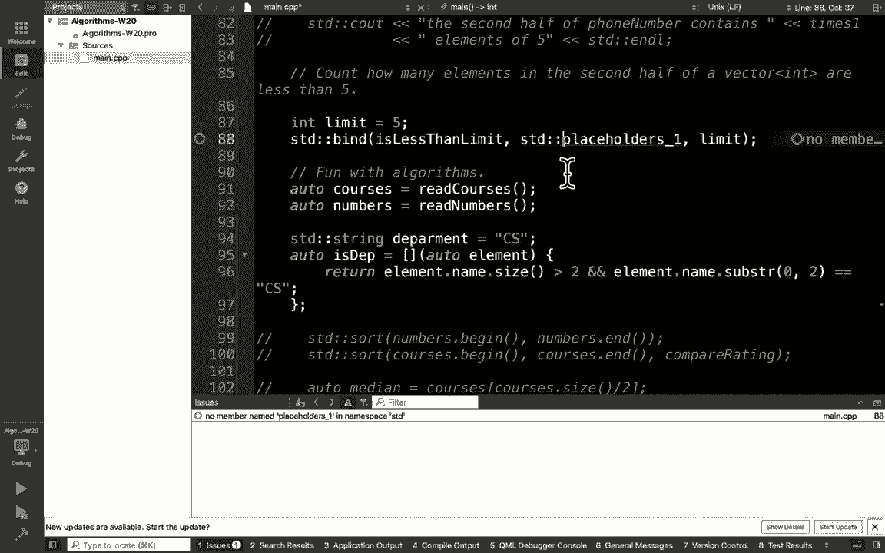

好的。是的。函数式命名空间有很多非常酷的东西。是的。它有，嗯，是的，像，呃，我认为虽然现在很多都被移除了，因，为，因 lambda 的出现，它们不再需要了，但过去会有一个，函数，它接受一个函数。

并且它接受一个谓词函数，并返回，该函数的取反。所以真正的变成假，假的变成真。是的。有很多不同的东西。有一个引用包装器。你在 CS110 中会用到这个，你可以把某些东西转变为某种，引用。呃。

还有很多基本操作，然后，这些都在 C++20 范围内。是的。是的。所以这有点涉及到函数式编程，你会使用函数，并尝试组合，它们来创建高阶函数。是的。我本来打算讨论这个，但我们显然总是没时间了。所以不。

我做了阶梯的事。好的。太棒了。好的。还是不起作用。你确定，嗯，我检查了几次。我觉得应该是对的。我通过调试器运行了几次，它确实，确实经过了这个 ，while，但我无法指出在哪里。好的。

你确定这个东西看起来，那个绘制节点是正确的吗？它以圆形绘制。哦，是的。所以当我运行它很长时间的时候。哦等等。这个，应该是这样开始的吗？我不知道。有时它以圆形开始。好的。你能尝试运行像一毫秒的情况吗？

是的，我想。是的。不应该是这样开始的。所以检查你绘制图的数学。我认为这是对的。是节点减去一还是两个节点？是节点的数量。应该是节点的数量，而不是 numb 节点，对吧？是的。我认为应该是 numb 节点。

也许这样可以修复它。是的，它有点起作用了。我无法让它动画化。哦，是因为它运行得太快了。嗯，你能尝试运行 cube 吗？是的。正在写 cube。是的。检查是否正确的方法是我总是在第10行使用立方体。

它应该看起来像一个立方体。是否因为我输入的时间过长？不，不，这不会成为问题。是的。好的。好的。你能提交你的代码吗？然后我会查看一下。是的。好的。是的。啊，是的。因为我必须离开，但是，嗯，是的。好的。

如果你不能弄明白，提交你的代码，然后我会查看一下。

