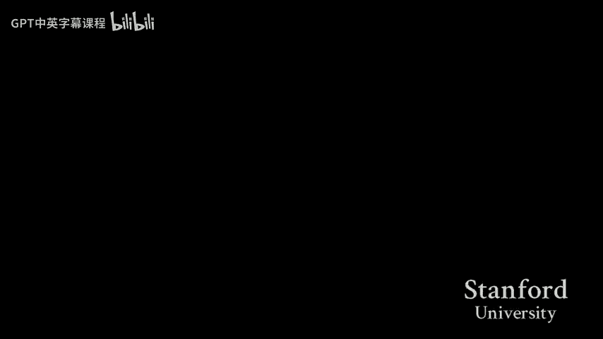
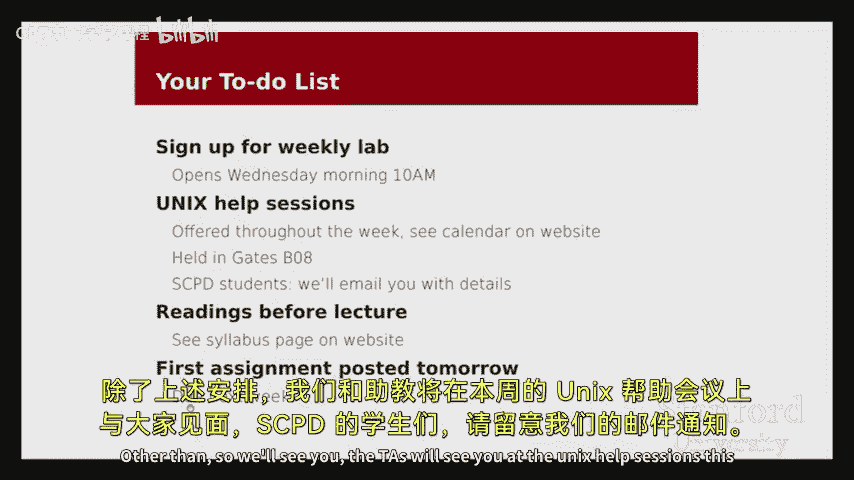

# 001：课程介绍与概述 🎓



在本节课中，我们将学习CS107课程的基本信息、课程目标、学习资源以及课程的核心价值。我们将通过一些简单的代码示例，初步了解本课程将要探讨的系统级编程概念。

## 课程概述

欢迎来到春季学期的CS107课程。本课程旨在帮助你深入理解计算机系统的工作原理，从底层硬件到高级编程语言。通过本课程的学习，你将掌握C语言编程、内存管理、调试技巧以及计算机体系结构的基本知识。

## 课程团队与资源

课程由两位讲师共同负责：Julie Zelenski和Michael Chang。此外，还有16名助教提供支持，他们将负责答疑、批改作业和主持实验课。

### 主要学习资源

以下是本课程的主要学习资源：

*   **课程网站**：`cs107.stanford.edu`。所有课程公告、作业、实验安排和课程政策都将在此发布。
*   **Piazza论坛**：用于课程讨论和提问。
*   **助教邮箱**：用于联系课程团队。
*   **答疑时间**：助教将定期安排答疑，帮助你解决学习中的问题。
*   **同学互助**：鼓励与班上近400名同学交流学习。

### 课程政策提醒

本课程强调独立完成作业。请务必阅读课程网站上关于学术诚信和合作政策的详细说明。课程的核心学习价值在于你亲自编写程序、调试代码并解决问题的过程。

## 课程目标与定位

上一节我们介绍了课程的基本信息，本节中我们来看看本课程的核心目标及其在计算机科学体系中的定位。

CS107是一门**系统课程**。它旨在帮助你理解计算机如何执行程序，并培养你在接近机器层面的编程和调试能力。

### 核心学习目标

我们的学习目标分为三个层次：

1.  **精通掌握**：熟练编写和调试C代码，深入理解内存和指针的工作原理。
2.  **熟悉了解**：接触并理解汇编语言、计算机运算和程序性能分析等概念。
3.  **初步接触**：了解计算机硬件（如处理器）的基本工作原理。

### 课程的广泛价值

即使你未来不专攻系统领域，本课程培养的技能也具有广泛价值：

*   **提升编程自信**：通过解决复杂的底层问题，全面提升你的编程和问题解决能力。
*   **理解系统行为**：学会探究计算机和程序在底层的行为，能够评估bug的成因和严重性。
*   **解读技术事件**：能够更深入地理解新闻报道中的技术问题（如安全漏洞），形成自己的判断。

## 初探系统概念：代码示例

为了让你对本课程将要面对的问题有一个直观感受，我们来看两个简单的C程序示例。这些例子展示了当程序在接近机器的层面运行时，可能出现的“反直觉”行为。

### 示例一：整数溢出的平方

第一个程序读取一个整数，计算其平方并输出。

```c
int num = read_int();
int square = num * num;
printf("%d squared is %d\n", num, square);
```

运行这个程序时，输入较小的数字（如5，7）会得到正确结果。然而，当输入一个较大的数字（如50000）时，输出竟然是一个**负数**。输入100000时，输出变成了一个正数，但却是错误的值。

**发生了什么？**
这涉及到**整数溢出**。计算机使用固定数量的比特位存储整数。当运算结果超出这个范围时，就会发生“环绕”，导致结果异常。我们将在课程中详细研究其原理。

### 示例二：数组越界的后果

第二个程序试图计算从1到N（N由用户输入）的整数和，但它使用了一个有缺陷的方法：它声明了一个仅能容纳5个整数的数组，却试图填充更多元素。

```c
int sum = 0;
int numbers[5]; // 数组大小固定为5
// ... 尝试填充超过5个数字到数组中 ...
// ... 然后求和 ...
```

当输入的数字N小于等于8时，程序似乎能正常工作。但当N等于9时，程序崩溃，并输出：`Segmentation fault (core dumped)`。

**发生了什么？**
程序访问了分配给数组`numbers`之外的内存区域（**数组越界**）。C语言本身不会阻止这种行为。最终，操作系统检测到程序访问了不该访问的内存，于是强制终止了它，这就是“段错误”。与高级语言（如Java）会抛出清晰的异常不同，在系统编程中，我们需要学习使用调试器等工具来诊断这类错误。

## 系统概念的现实意义

你可能会想，这些刻意编写的小程序bug与现实有何关系？实际上，类似的底层问题在真实世界中时有发生。

*   **波音787客机软件bug**：2015年发现，如果飞机连续通电超过8个月，一个负责计时的计数器会因溢出而变为负数，导致系统故障。这正与我们第一个示例的原理相同。
*   **Linux系统安全漏洞**：2015年底发现，在某些Linux系统的登录界面，连续按28次退格键再回车，竟能绕过密码验证。其根源之一就是类似于第二个示例的**缓冲区溢出**漏洞。攻击者通过精心构造的输入，越界改写了关键数据，从而控制了系统。

学习本课程后，你将有能力阅读并理解关于上述漏洞的详细技术分析报告。你将不仅能理解问题如何发生，还能评估其真实影响，而不被媒体的过度渲染所误导。

## 课程安排与下一步

本节课我们一起学习了CS107的课程框架、目标和一些引人入胜的入门示例。最后，我们来看看近期的安排。

以下是开学第一周你需要完成的事项列表：

*   **实验课注册**：从周三上午10点开始，在课程网站注册固定的实验时间段。名额有限，请尽早注册。
*   **Unix帮助课程**：本周将举行（替代第一次实验课），帮助你熟悉命令行环境。即使你毫无经验，也请务必参加。
*   **课前阅读**：为周五的课程完成指定的阅读材料。
*   **作业0**：第一个编程作业即将发布。你可以先浏览，在参加Unix帮助课程后再正式开始。



我们周五的课程再见。