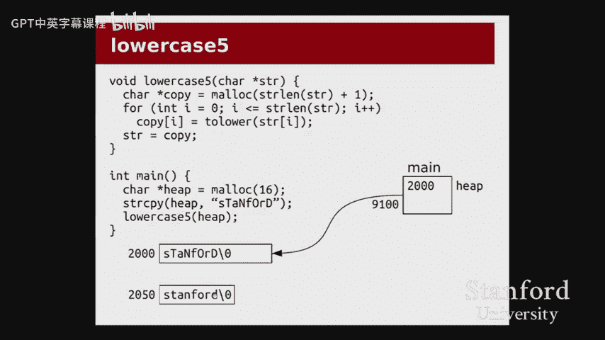
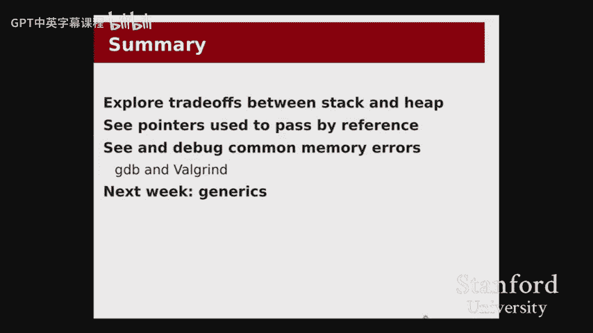

# 003：指针与内存管理实战 🧠

在本节课中，我们将要学习指针在C语言中的实际应用，特别是如何通过指针传递变量引用、如何正确地在栈和堆上分配内存，以及如何使用调试工具（如GDB和Valgrind）来诊断常见的内存错误。我们将通过一系列代码示例，深入探讨这些概念。

---

## 概述

上一讲我们讨论了数组，特别是C字符串。本节我们将继续深入，探讨何时使用栈内存与堆内存，如何通过指针实现“按引用传递”，并通过实际的代码示例来演示指针操作、常见的内存错误及其调试方法。

---

## 栈与堆内存分配对比 📊

在C语言中，我们有两种主要的内存分配方式：栈（Stack）和堆（Heap）。以下是两者的核心对比：

*   **栈分配**
    *   **声明方式**：`int arr[5];`
    *   **优点**：
        1.  **自动管理**：函数返回时，内存自动释放，无需手动调用 `free`，避免了内存泄漏。
        2.  **高效**：分配和释放速度极快，常数时间开销极小。
    *   **缺点**：
        1.  **生命周期固定**：内存仅在声明它的函数作用域内有效。
        2.  **大小固定**：声明后无法调整数组大小。

*   **堆分配**
    *   **声明方式**：`int *arr = malloc(5 * sizeof(int));`
    *   **优点**：
        1.  **控制生命周期**：内存可以持续存在，直到显式调用 `free` 释放。
        2.  **可调整大小**：可以使用 `realloc` 函数调整已分配内存块的大小。
    *   **缺点**：
        1.  **手动管理**：必须手动释放内存，否则会导致内存泄漏。
        2.  **效率较低**：虽然也是常数时间，但分配和释放的开销比栈大得多。

**核心原则**：在可能的情况下优先使用栈。仅当需要控制变量的生命周期（例如，函数返回后数据仍需保留）或需要动态调整大小时，才使用堆。

---

## 通过指针实现“按引用传递” 🔄

在C++中，可以使用 `&` 语法实现按引用传递参数。C语言没有此语法，但我们可以通过指针达到相同效果。

以下是一个示例，演示如何修改函数外部的变量值：

```c
// 错误示例：按值传递，无法修改外部变量
void change(int x) {
    x += 10; // 只修改了局部副本
}
int main() {
    int num = 107;
    change(num); // num 仍然是 107
}

// 正确示例：通过指针按引用传递
void change(int *p) { // 参数是指向int的指针
    *p += 10; // 解引用指针，修改其指向的值
}
int main() {
    int num = 107;
    change(&num); // 传递num的地址
    // 现在 num 的值是 117
}
```

**关键点**：要修改函数外部的变量，需要传递该变量的地址（`&variable`），并在函数内部通过解引用指针（`*pointer`）来访问和修改其值。

---

## 字符串处理与内存错误实战 🛠️

我们将通过一个将字符串转换为小写的程序，来探索不同的实现方式及其潜在问题。程序涉及栈字符串、堆字符串和字符串常量。

### 函数1：原地修改（`lowercase1`）

此函数直接修改输入字符串。

```c
char *lowercase1(char *str) {
    for (int i = 0; i < strlen(str); i++) {
        str[i] = tolower(str[i]);
    }
    return str; // 返回原指针，返回值非必需
}
```

*   **优点**：高效，无额外内存分配。
*   **问题**：
    1.  修改了原始字符串。
    2.  **对字符串常量调用会导致段错误（Segmentation Fault）**，因为字符串常量存储在只读内存区。

**调试技巧**：使用GDB定位段错误。
1.  在GDB中运行程序。
2.  程序崩溃后，使用 `backtrace`（或 `bt`）查看调用栈。
3.  使用 `up` 命令切换到调用函数（如 `main`），查看是哪一行代码引发了问题。

### 函数2：未初始化的指针（`lowercase2`）

此函数尝试返回一个新字符串，但指针未初始化。

```c
char *lowercase2(const char *str) {
    char *copy; // 错误：指针未初始化，指向垃圾地址
    for (int i = 0; i <= strlen(str); i++) { // 注意：需要复制终止符 ‘\0‘
        copy[i] = tolower(str[i]); // 段错误：向非法地址写入
    }
    return copy;
}
```

*   **错误**：`copy` 是一个未初始化的指针，解引用它会导致访问随机内存地址，通常引发段错误。
*   **编译器警告**：现代编译器通常会给出“变量未初始化”的警告。
*   **Valgrind诊断**：运行 `valgrind ./program`，它会明确报告“Invalid write of size 1”以及尝试写入的地址（如 `0x0`，即NULL）。

### 函数3：返回指向栈内存的指针（`lowercase3`）

此函数在栈上分配数组并返回其地址。

```c
char *lowercase3(const char *str) {
    char copy[strlen(str) + 1]; // 在栈上分配数组
    for (int i = 0; i <= strlen(str); i++) {
        copy[i] = tolower(str[i]);
    }
    return copy; // 危险：返回局部变量的地址！
}
```

*   **问题**：函数返回时，栈内存 `copy` 被释放（或标记为可重用）。返回的指针变成了“悬空指针”（Dangling Pointer）。
*   **现象**：可能偶尔“工作”，但极其脆弱。如果后续函数调用重用了这块栈内存，之前返回的数据就会被覆盖。
*   **编译器警告**：通常会提示“返回局部变量的地址”。

### 函数4：堆分配但大小错误（`lowercase4`）

此函数在堆上分配内存，但分配空间不足。

```c
char *lowercase4(const char *str) {
    // 错误：分配长度不足，应为 strlen(str) + 1
    char *copy = malloc(strlen(str));
    for (int i = 0; i <= strlen(str); i++) { // 循环会写入第 strlen(str) 个字符（‘\0‘）
        copy[i] = tolower(str[i]); // 写入越界！
    }
    return copy;
}
```

*   **错误**：`malloc(strlen(str))` 只为字符分配了空间，没有为终止符 `\0` 分配空间。循环中的 `copy[i] = ...` 当 `i == strlen(str)` 时，会向分配的内存块之后写入一个字节。
*   **潜在后果**：
    *   可能覆盖堆管理器的关键数据，导致程序崩溃或诡异行为。
    *   可能不会立即崩溃，成为难以发现的隐患。
*   **Valgrind诊断**：Valgrind会报告“Invalid write of size 1”，并明确指出写入发生在“0 bytes after a block of size X alloc‘d”，即刚好在分配块之后写入，这是数组越界的典型标志。

**修正**：始终确保为字符串分配 `strlen(str) + 1` 的空间。

### 函数5 & 6：修改传入的指针本身

有时我们不仅想修改字符串内容，还想让调用者的指针变量指向新的内存块。

**错误尝试（`lowercase5`）**：
```c
void lowercase5(char *str) {
    char *copy = malloc(strlen(str) + 1);
    // ... 复制并转换为小写 ...
    str = copy; // 这只改变了局部参数 `str` 的值
    // 内存泄漏！原始的堆字符串未被释放，新的 `copy` 也无人指向。
}
```
这无法修改 `main` 函数中的原始指针（如 `heap`），因为参数传递仍是按值传递（只不过这个“值”是一个地址）。

**正确方法（`lowercase6`）**：
要修改调用者的指针变量，需要传递该指针变量的地址，即一个指向指针的指针（`char **`）。

```c
void lowercase6(char **str_ptr) { // 参数是 char**
    char *copy = malloc(strlen(*str_ptr) + 1); // 解引用一次得到原始字符串
    // ... 复制并转换为小写 ...
    // 释放旧内存（如果来自堆）以避免泄漏
    // free(*str_ptr);
    *str_ptr = copy; // 解引用 str_ptr 来修改调用者的指针
}
int main() {
    char *heap = malloc(...);
    // ...
    lowercase6(&heap); // 传递指针的地址
    // 现在 heap 指向新的小写字符串副本
}
```

**重要限制**：此方法**不能**用于栈数组（如 `char stack[] = “...“;`），因为不能对数组名使用 `&` 来获得一个 `char **`。它仅适用于堆指针或可修改的指针变量。




---

## 总结

本节课我们一起深入探讨了C语言中指针与内存管理的实战应用：


1.  **栈与堆的选择**：默认使用栈以求高效和安全；需要长生命周期或可变大小时才使用堆。
2.  **按引用传递**：通过传递变量的地址（`&`）并在函数内解引用指针（`*`）来实现。
3.  **字符串操作陷阱**：
    *   修改字符串常量会导致段错误。
    *   未初始化的指针是常见错误源。
    *   切勿返回指向栈内存的指针。
    *   为字符串分配内存时，牢记为终止符 `\0` 预留空间（`+1`）。
4.  **调试工具**：
    *   **GDB**：用于定位段错误和检查程序状态。
    *   **Valgrind**：不可或缺的内存错误检测工具，能发现越界访问、使用未初始化内存、内存泄漏等问题。
5.  **双指针的使用**：当需要改变调用者手中的指针本身时，需要使用指向指针的指针。




理解这些概念并熟练使用调试工具，是写出健壮、无内存错误C程序的关键。