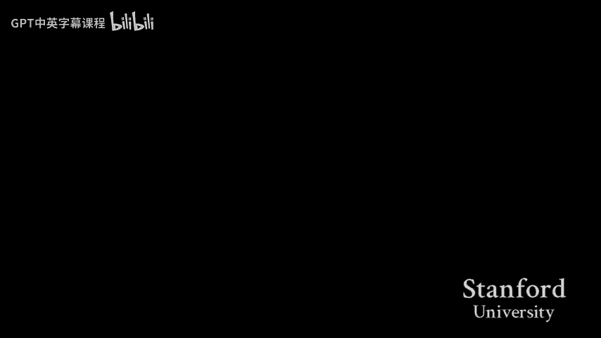
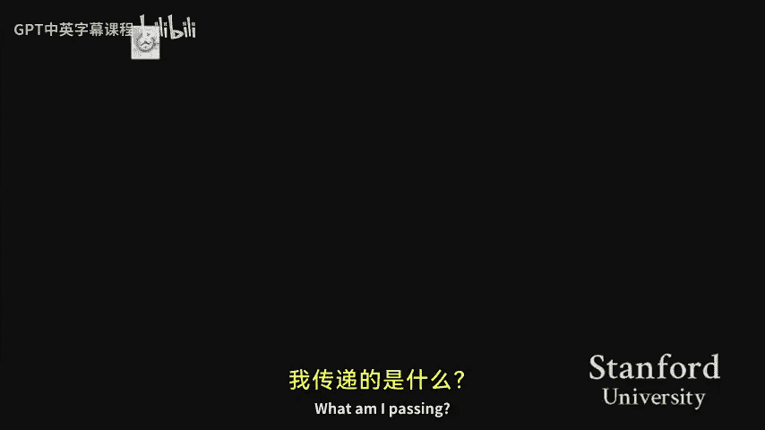

# 005：void* 的深入探讨与实现



在本节课中，我们将继续探讨 `void*` 指针。上一节我们介绍了 `void*` 的概念以及如何从客户端（调用者）的角度使用它。本节中，我们将重点关注实现层面，学习如何编写操作 `void*` 的函数，并了解如何绕过 `void*` 的一些限制。我们还将花时间分析一些在使用 `void*` 时常见的错误，特别是“间接层级”错误。

## 实现通用函数：以 `find_max` 为例

首先，我们来看一个具体的例子：将一个查找数组中最大值的函数 `find_max` 改造成通用版本。原始函数只能处理整数数组。

```c
int find_max(int *arr, int n) {
    int max = arr[0];
    for (int i = 1; i < n; i++) {
        if (arr[i] > max) {
            max = arr[i];
        }
    }
    return max;
}
```

我们的目标是让这个函数能处理任意类型的数组（例如字符串数组、双精度浮点数数组等）。为了实现这一点，我们需要回答四个关键问题。

### 问题一：参数 `arr` 应该是什么类型？

由于我们不知道数组的具体类型，不能使用 `int*` 或 `char*` 等具体类型的指针。唯一的选择是使用 `void*`，表示一个指向未知类型数据的指针。

**答案：** `arr` 应该是一个 `void*`。

### 问题二：函数应该返回什么？

通用函数无法直接操作或返回元素本身，因为它们不知道元素的具体类型。因此，通用函数通常返回一个指向元素的指针，而不是元素的值。

**答案：** 函数应该返回一个 `void*`，指向数组中的最大元素。

根据前两个答案，我们可以更新函数原型和部分代码：

```c
void* find_max(void *arr, int n, size_t elem_size, int (*cmp_fn)(const void*, const void*)) {
    void *max = arr; // max 指向第一个元素
    // ... 循环比较逻辑待更新
    return max;
}
```

### 问题三：如何访问数组的第 `i` 个元素？

在原始代码中，我们使用 `arr[i]` 来访问元素。但对于 `void*`，我们不能直接进行指针算术运算（如 `arr + i`），因为编译器不知道每个元素的大小。

**解决方案：** 我们需要一个额外的参数 `elem_size` 来告知函数每个元素占用的字节数。为了进行指针运算，我们可以将 `void*` 临时转换为 `char*`，因为 `char` 的大小是1字节，这样指针加法就能以字节为单位进行。

访问第 `i` 个元素的公式如下：

```c
void *ith_element = (char*)arr + i * elem_size;
```

**答案：** 通过将 `arr` 转换为 `char*`，然后加上 `i * elem_size` 来获取指向第 `i` 个元素的指针。

### 问题四：如何比较两个元素？

我们无法使用 `>` 或 `<` 直接比较 `void*` 指向的未知类型数据。解决方案是让客户端提供一个比较函数（回调函数），这个函数知道如何比较特定类型的两个元素。

比较函数的原型应与 `qsort` 库函数所使用的类似：

```c
int cmp_fn(const void *a, const void *b);
```
它接收两个指向元素的 `const void*` 指针，并返回一个整数：正数表示 `a > b`，负数表示 `a < b`，0 表示相等。

在 `find_max` 中，我们这样使用它：

```c
if (cmp_fn(ith_element, max) > 0) {
    max = ith_element;
}
```

**答案：** 通过客户端提供的回调函数来比较元素。

### 完整的通用 `find_max` 实现

综合以上答案，我们可以写出完整的通用 `find_max` 函数：

```c
void* find_max(void *arr, int n, size_t elem_size, int (*cmp_fn)(const void*, const void*)) {
    void *max = arr; // 指向第一个元素
    for (int i = 1; i < n; i++) {
        void *ith_element = (char*)arr + i * elem_size;
        if (cmp_fn(ith_element, max) > 0) {
            max = ith_element;
        }
    }
    return max; // 返回指向最大元素的指针
}
```

### 客户端调用示例

以下是客户端如何调用这个通用函数来查找整数数组和字符串数组的最大值。

**对于整数数组：**
```c
int nums[] = {10, 20, 99, 15};
int count = sizeof(nums) / sizeof(nums[0]);
// 提供比较整数的函数
int cmp_int(const void *a, const void *b) {
    int ia = *(const int*)a;
    int ib = *(const int*)b;
    return ia - ib;
}
// 调用 find_max，并将返回的 void* 转换为 int* 再解引用
int *max_ptr = (int*)find_max(nums, count, sizeof(int), cmp_int);
int max_val = *max_ptr;
```

**对于字符串数组（`char*` 数组）：**
```c
char *strs[] = {"apple", "zebra", "banana"};
int count = sizeof(strs) / sizeof(strs[0]);
// 提供比较字符串的函数（按字母顺序）
int cmp_str(const void *a, const void *b) {
    const char **sa = (const char**)a; // 注意：元素是 char*，所以参数是指向 char* 的指针
    const char **sb = (const char**)b;
    return strcmp(*sa, *sb);
}
// 调用 find_max，并将返回的 void* 转换为 char** 再解引用得到 char*
char **max_str_ptr = (char**)find_max(strs, count, sizeof(char*), cmp_str);
char *max_str = *max_str_ptr;
```

**关键点：** 通用函数操作的是指向元素的指针。因此，如果数组元素类型是 `T`，那么：
*   `find_max` 返回 `T*`。
*   比较函数接收 `const T*` 类型的参数。

## 实现通用交换函数：`generic_swap`

接下来，我们看看如何实现一个通用的交换函数 `generic_swap`，它可以交换任意类型的两块内存。

### 挑战与解决方案

对于具体类型的交换（如 `int`），我们可以直接解引用指针：
```c
void swap_int(int *a, int *b) {
    int temp = *a;
    *a = *b;
    *b = temp;
}
```
但对于 `void*`，我们面临两个问题：
1.  **如何分配临时存储空间？** 我们不知道要交换的数据类型，因此无法声明一个具体类型的 `temp` 变量。
2.  **如何进行复制？** 我们不能使用 `*a = *b` 这样的解引用赋值。

**解决方案：** 使用 `memcpy` 函数和基于字节的操作。
1.  使用一个 `char` 数组（大小为 `elem_size` 字节）作为临时存储空间。`char` 的大小是1字节，因此 `char` 数组可以精确地按字节存储任何数据。
2.  使用 `memcpy(dest, src, size)` 函数来复制指定字节数的内存。

### 通用交换函数实现

```c
void generic_swap(void *a, void *b, size_t size) {
    char temp[size]; // 在栈上分配 size 字节的临时空间
    memcpy(temp, a, size);   // 将 a 指向的内容复制到 temp
    memcpy(a, b, size);      // 将 b 指向的内容复制到 a
    memcpy(b, temp, size);   // 将 temp 的内容复制到 b
}
```

### 客户端调用与间接层级错误

正确调用 `generic_swap` 的关键在于传递正确的指针和大小。这里最容易犯的错误是“间接层级”错误。

假设我们要交换两个字符串指针 `char* s1` 和 `char* s2`：
*   **正确调用（交换指针本身）：**
    ```c
    generic_swap(&s1, &s2, sizeof(char*));
    ```
    我们传递的是指针变量 `s1` 和 `s2` 的地址（即 `char**`），并交换这两个地址值。这改变了 `s1` 和 `s2` 指向的字符串。
*   **错误调用1（交换指针指向的字符）：**
    ```c
    generic_swap(s1, s2, sizeof(char*));
    ```
    我们传递的是 `s1` 和 `s2` 的值（即它们指向的字符串的首地址）。函数会尝试交换这两个地址开始处的 `sizeof(char*)`（通常是8）个字节。这不会交换指针，而是会破坏字符串数据的前几个字符，导致未定义行为。
*   **错误调用2（意图交换整个字符串内容，但大小错误）：**
    ```c
    generic_swap(&s1, &s2, strlen(s1)+1);
    ```
    我们传递了指针的地址，但指定的大小是整个字符串的长度。函数会尝试交换 `&s1` 和 `&s2` 这两个内存地址处的大量字节，这极有可能导致段错误，因为我们在操作本不该触碰的内存。

**核心教训：** 当使用 `void*` 和通用函数时，编译器无法进行类型检查。你必须非常仔细地考虑“间接层级”——你传递的是数据的地址，还是数据本身的地址？你指定的大小是否与你要操作的数据类型匹配？画图分析是避免此类错误的有效方法。

## 总结

本节课中我们一起学习了：
1.  **实现通用函数**：我们通过改造 `find_max` 函数，深入理解了如何利用 `void*`、元素大小 (`elem_size`) 和客户端回调函数来实现操作任意类型数据的算法。
2.  **绕过 `void*` 的限制**：我们学会了通过将 `void*` 转换为 `char*` 来进行以字节为单位的指针运算，并使用 `memcpy` 进行内存块的复制，从而克服了 `void*` 不能解引用和进行指针算术运算的问题。
3.  **警惕间接层级错误**：我们通过 `generic_swap` 的例子，强调了在使用 `void*` 时精确控制指针层级和数据大小的重要性。这类错误编译时通常没有警告，但会导致运行时逻辑错误或崩溃，需要开发者格外小心。





掌握这些概念对于后续课程、作业和实验都至关重要。