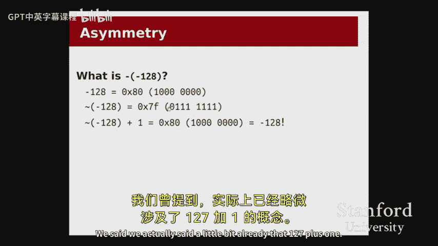
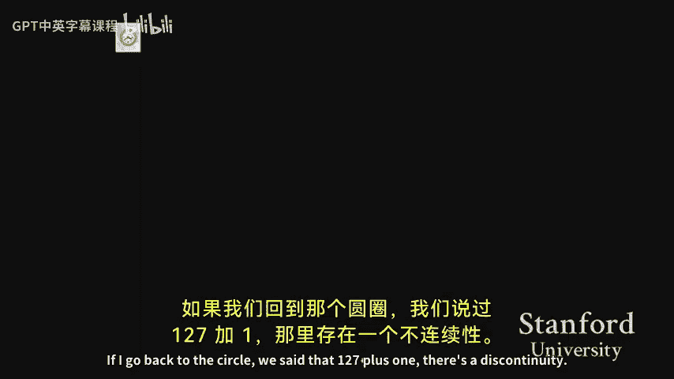
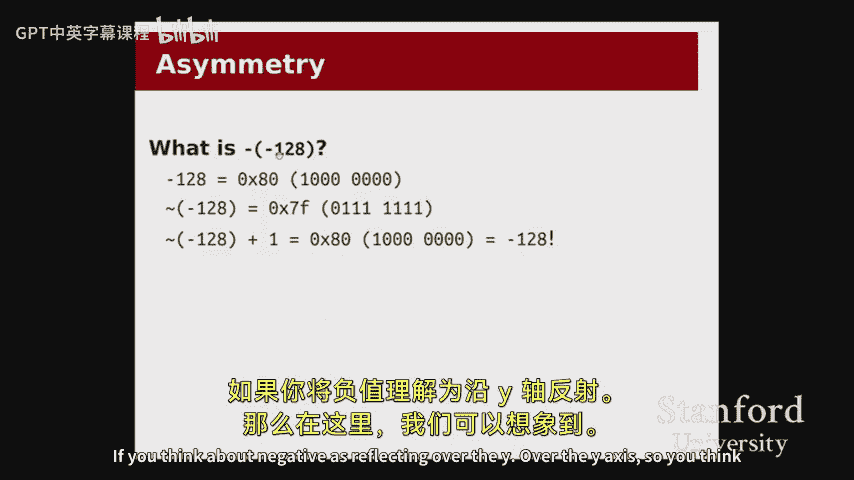
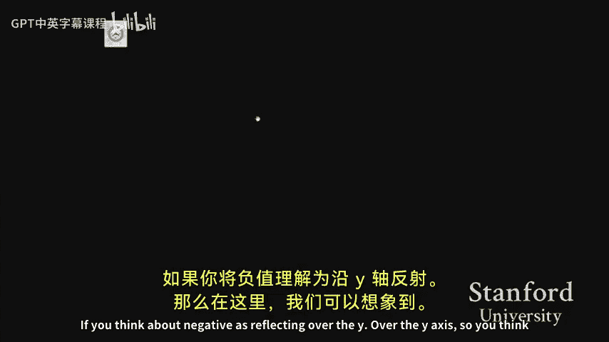
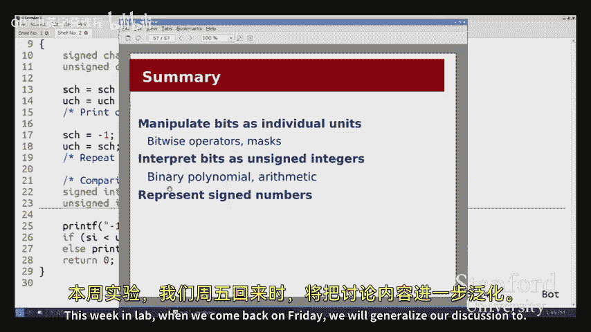
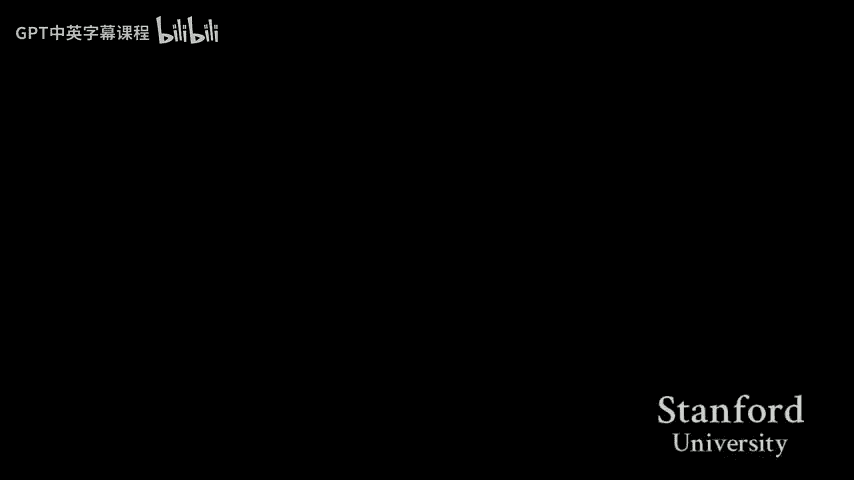

# 006：数据表示入门

在本节课中，我们将要学习计算机如何表示数据。我们将从最基本的单位——比特（bit）和字节（byte）开始，探讨如何将它们解释为独立的开关值，以及如何将它们组合起来表示整数。理解这些底层表示是理解计算机如何工作的关键。

## 比特、字节与位运算

在深入探讨之前，我们首先需要明确一些基本定义。

*   **比特**：比特是“二进制数字”的缩写，其值只能是 `0` 或 `1`。我们可以将其视为一个开关，`1` 代表“开”或“真”，`0` 代表“关”或“假”。
*   **字节**：一个字节由 8 个比特组成。在 C 语言中，字节是最小的可寻址单元，我们可以通过 `char` 类型的变量来操作一个字节。

由于 C 语言无法直接操作单个比特，我们需要一组新的运算符来操作字节中的各个比特位，这些运算符被称为**位运算符**。

以下是 C 语言中主要的位运算符及其功能：

*   **按位与 (`&`)**：当两个操作数的对应位都为 `1` 时，结果位才为 `1`。
    *   **公式**：`result_bit = a_bit & b_bit`
*   **按位或 (`|`)**：当两个操作数的对应位至少有一个为 `1` 时，结果位就为 `1`。
    *   **公式**：`result_bit = a_bit | b_bit`
*   **按位异或 (`^`)**：当两个操作数的对应位不同时，结果位为 `1`。
    *   **公式**：`result_bit = a_bit ^ b_bit`
*   **按位取反 (`~`)**：将操作数的每一位取反，`0` 变 `1`，`1` 变 `0`。
    *   **公式**：`result_bit = ~a_bit`
*   **左移 (`<<`)**：将操作数的所有位向左移动指定的位数，右侧空出的位用 `0` 填充。
    *   **代码**：`a << n` （将 `a` 的位左移 `n` 位）
*   **右移 (`>>`)**：将操作数的所有位向右移动指定的位数。对于无符号数，左侧空出的位用 `0` 填充。
    *   **代码**：`a >> n` （将 `a` 的位右移 `n` 位）

## 位运算的应用：位掩码

上一节我们介绍了位运算符，本节中我们来看看如何使用它们来操作一组独立的开关标志，这通常通过**位掩码**技术实现。

以下是一个使用位掩码管理字体属性（粗体、斜体、下划线）的示例：

```c
// 定义字体属性标志，每个标志对应一个独立的位
enum FontTrait {
    BOLD = 1 << 0,   // 二进制: 001
    ITALIC = 1 << 1, // 二进制: 010
    UNDERLINE = 1 << 2 // 二进制: 100
};

int main() {
    unsigned char myTraits = BOLD; // 初始为粗体: 001

    // 1. 开启下划线位：使用 按位或 (|)
    myTraits |= UNDERLINE; // 结果: 001 | 100 = 101 (粗体+下划线)

    // 2. 关闭粗体位：使用 按位与 (&) 和 按位取反 (~)
    myTraits &= ~BOLD; // 结果: 101 & ~001 = 101 & 110 = 100 (仅下划线)

    // 3. 翻转斜体位：使用 按位异或 (^)
    myTraits ^= ITALIC; // 结果: 100 ^ 010 = 110 (下划线+斜体)

    // 4. 检查特定位是否开启：使用 按位与 (&) 创建掩码
    unsigned char mask = BOLD | UNDERLINE; // 掩码: 001 | 100 = 101
    if (myTraits & mask) { // 检查 myTraits 中是否有 BOLD 或 UNDERLINE 位为1
        printf(“Bold or Underline is on.\n”);
    }

    return 0;
}
```

通过这种方式，我们可以将多个布尔标志紧凑地存储在一个变量中，并高效地进行设置、清除、翻转和检查操作。

## 将比特解释为数字：无符号整数

了解了如何操作单个比特后，我们现在来看看如何将一串比特解释为数字。我们首先从**无符号整数**开始，即所有数字都是非负的。

将二进制比特模式转换为十进制数字的过程，类似于我们熟悉的十进制“位值”概念。在十进制中，数字 567 表示 `5*10^2 + 6*10^1 + 7*10^0`。在二进制中，我们使用 2 的幂次。

例如，比特模式 `01101011` 可以解释为：
`0*2^7 + 1*2^6 + 1*2^5 + 0*2^4 + 1*2^3 + 0*2^2 + 1*2^1 + 1*2^0 = 107`

然而，直接使用二进制或十进制表示比特模式都不够方便。二进制太长，十进制又无法直观看出比特模式。因此，我们引入了**十六进制**表示法。

十六进制使用 0-9 和 a-f（或 A-F）共 16 个字符来表示 0-15 的值。其优势在于，每 4 个二进制位恰好对应 1 个十六进制位，转换非常方便。

*   `0110` (二进制) = 6 (十进制) = `0x6` (十六进制)
*   `1011` (二进制) = 11 (十进制) = `0xb` (十六进制)

因此，`01101011` 这个字节可以简洁地表示为 `0x6b`。在 C 语言和系统编程中，十六进制是表示比特相关常量的标准方式。

对于一个字节（8 位）的无符号整数，其可以表示的范围是 `0` (比特模式 `00000000` 或 `0x00`) 到 `255` (比特模式 `11111111` 或 `0xff`)。

## 二进制运算与溢出

上一节我们介绍了如何表示无符号数，本节中我们来看看对它们进行数学运算时会发生什么，特别是**溢出**现象。

二进制加法的规则与十进制类似，只是逢二进一。例如，计算 `107 (0x6b)` 加 `58 (0x3a)`：
```
  01101011 (107)
+ 00111010 (58)
---------------
  10100101 (165)
```
计算过程正确无误。

但是，当结果超出数据类型所能表示的范围时，就会发生**溢出**。例如，用单字节计算 `255 + 1`：
```
  11111111 (255)
+ 00000001 (1)
---------------
 100000000 (256，理论结果)
```
结果需要 9 个比特位 (`1 00000000`)，但一个字节只能容纳 8 位。最高位的 `1` 会被丢弃，最终我们得到 `00000000`，即 `0`。计算机会静默地执行这个操作，不会发出警告。

我们可以将无符号数的所有可能值想象成一个圆圈。从 `0` 开始，每次加 `1` 就顺时针移动一步，直到 `255`。再加 `1`，就会“溢出”并回到 `0`。这个圆圈代表了**模运算**，对于单字节，就是模 `256` (2^8)。

## 表示有符号整数：补码

现在，我们面临一个更复杂的问题：如何用有限的比特位表示负数？我们无法在圆圈上无限扩展，必须用一部分比特模式来表示负数。

一个直观的想法是**原码表示法**：用最高位表示符号（`0` 为正，`1` 为负），其余位表示绝对值。例如，`-1` 表示为 `10000001`。但这种方法有两个主要缺点：
1.  存在 `+0` (`00000000`) 和 `-0` (`10000000`) 两种零值。
2.  加法和减法的硬件逻辑需要特殊处理，不能统一。

因此，现代计算机普遍采用**补码**表示法。其核心思想是：重新排列圆圈上的数字，让加法和减法运算可以统一用相同的硬件逻辑完成。

在补码中：
*   圆圈的上半部分（大约 0 到 127）仍然表示正数。
*   圆圈的下半部分则用于表示负数。具体来说，`-1` 被放置在 `0` 的逆时针方向第一步。`-2` 在 `-1` 的逆时针下一步，依此类推。
*   这样，`正数 + 负数` 的运算就变成了在圆圈上顺时针移动相应的步数，硬件实现与无符号加法完全相同，溢出位同样被丢弃。
*   例如，`5 + (-2)` 在圆圈上就是从 `5` 顺时针移动 2 步（因为加负数等于减正数），到达 `3`，结果正确。

对于一个 `n` 位的补码整数，其表示范围为：`-2^(n-1)` 到 `2^(n-1)-1`。对于单字节（8位），就是 `-128` 到 `127`。

将一个数转换为其相反数（取负）的公式是：**按位取反，然后加 1**。
*   **公式**：`-x = ~x + 1`
*   例如，`2` (`00000010`) 取反得 `11111101`，加 `1` 得 `11111110`，这正是 `-2` 的补码表示。
*   一个需要记住的特殊值是 `-1`，其补码表示为所有位都是 `1` (`11111111` 或 `0xff`)。

## 有符号与无符号的注意事项

补码设计的一个美妙之处在于，加、减、乘等运算以及相等比较 (`==`) 的硬件电路对于有符号数和无符号数是完全相同的。然而，两者之间仍有一些重要区别：

1.  **溢出点不同**：无符号数在 `255 -> 0` 处溢出；有符号数在 `127 -> -128` 处溢出。
2.  **右移操作 (`>>`)**：对于无符号数，右移后左侧空位补 `0`。对于有符号数，右移是**算术右移**，左侧空位会复制原来的符号位（即最高位）。这可以保证负数右移后仍然是负数。
3.  **关系比较 (`<`, `>`, `<=`, `>=`)**：当比较一个有符号数和一个无符号数时，C 语言标准规定会将**有符号数隐式转换为无符号数**再进行对比。这可能导致反直觉的结果。
    *   例如：`-1` (有符号，补码为 `0xffffffff`) 与 `130` (无符号) 比较。`-1` 被转换为无符号数，变成了一个非常大的正数 (`2^32 - 1`)，因此 `(-1 < 130)` 的结果为假 (`0`)。

在实际编程中，混合使用有符号和无符号类型时需要格外小心，避免这类陷阱。

## 字符表示：ASCII 码

在结束对整数表示的讨论前，我们简单提一下字符的表示。计算机同样用数字代码来表示字符，最常用的系统是 **ASCII 码**。

ASCII 码用 7 位二进制数（扩展版本用 8 位）定义了 128 个字符，包括：
*   数字 `0-9`
*   大写和小写英文字母 `A-Z, a-z`
*   标点符号和控制字符（如换行符 `\n`、空字符 `\0`）





例如：
*   字母 `‘A’` 的 ASCII 码是 `65` (`0x41`)。
*   数字 `‘9’` 的 ASCII 码是 `57` (`0x39`)。
*   空字符 `‘\0’` 的 ASCII 码是 `0` (`0x00`)。





因此，字符串 `“Stanford”` 在内存中就是一系列对应字母 ASCII 码的字节，最后以一个值为 `0` 的字节结尾。

---





本节课中我们一起学习了数据表示的基础知识。我们从比特和字节的定义出发，学习了如何使用位运算符和位掩码来操作独立的标志位。然后，我们深入探讨了如何将比特序列解释为无符号整数和有符号整数（补码），理解了二进制运算和溢出行为。最后，我们简要了解了字符的 ASCII 表示，并指出了有符号与无符号数在比较和移位时的关键区别。这些概念是理解计算机如何存储和处理信息的基石。在下节课中，我们将把这些概念推广到更大的整数类型，并开始学习另一种重要的数据类型——浮点数的表示方法。