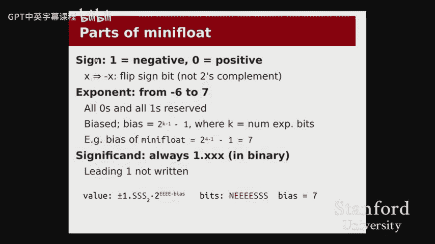
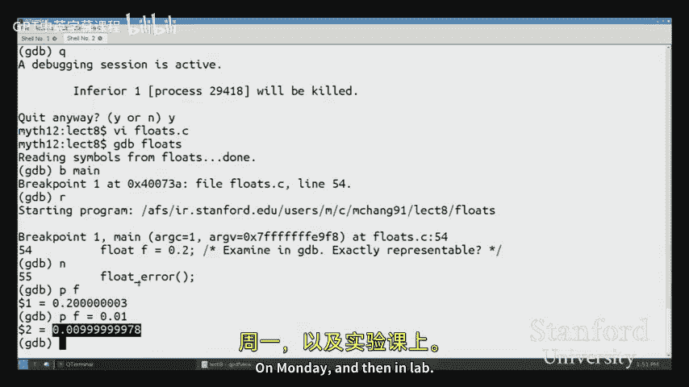

# 007：浮点数表示

## 概述
在本节课中，我们将要学习如何表示非整数的实数。我们将从回顾有符号和无符号整数的差异开始，然后深入探讨两种表示实数的方法：定点表示法和浮点表示法。我们将重点介绍浮点数的表示原理，包括其组成部分（符号位、指数位和尾数位）以及如何在实际计算中使用它们。

---

## 有符号与无符号整数的回顾

上一节我们介绍了有符号和无符号整数的表示方法，本节中我们来看看在实际代码中混合使用它们时可能遇到的问题。

以下是需要注意的几个关键点：

1.  **赋值操作只是复制位模式**
    当在有符号和无符号类型之间进行赋值时，不会进行数值转换，只是简单地复制位模式。这可能导致对相同位模式的解释完全不同。

    ```c
    unsigned char uch = 250; // 位模式：11111010， 值：250
    signed char sch = uch;   // 复制相同的位模式：11111010， 值：-6
    ```

2.  **右移位运算符的行为不同**
    对于无符号数，右移时左侧填充0。对于有符号数，右移时左侧填充符号位的副本（算术右移），以保持数值的符号。

    ```c
    unsigned char u = 250; // 11111010
    u >>= 1;               // 结果：01111101 (值 125)
    signed char s = -6;    // 11111010
    s >>= 1;               // 结果：11111101 (值 -3，填充了符号位1)
    ```

3.  **混合类型比较可能导致意外结果**
    当比较有符号和无符号数时，C语言会将有符号数转换为无符号数，这可能导致逻辑错误。

    ```c
    int si = -1;
    unsigned int ui = 2;
    if (si < ui) { // 条件为假，因为 -1 被当作一个很大的无符号数
        // 不会执行
    }
    ```

**总结**：通常，我们只在需要直接操作位时才使用无符号类型。在其他情况下，应谨慎使用，以避免因混合类型而导致的意外行为。

---

## 从整数到实数：定点表示法

上一节我们回顾了整数表示，本节中我们来看看如何表示实数。我们的第一个尝试是**定点表示法**。

定点表示法是二进制多项式表示法的直接扩展。我们不仅使用2的正幂次方（如 8, 4, 2, 1），还使用2的负幂次方（如 1/2, 1/4, 1/8）来表示小数部分。

**公式**：一个二进制数 `b3 b2 b1 b0 . b-1 b-2 b-3` 的值为：
`值 = b3*2^3 + b2*2^2 + b1*2^1 + b0*2^0 + b-1*2^{-1} + b-2*2^{-2} + b-3*2^{-3}`

例如，二进制 `0101.1100` 表示：
`0*8 + 1*4 + 0*2 + 1*1 + 1*(1/2) + 1*(1/4) + 0*(1/8) + 0*(1/16) = 5.75`

在定点表示法中，我们预先决定用多少位表示整数部分，多少位表示小数部分（例如，用4位表示整数，4位表示小数）。这种表示法进行加减运算非常方便，就像处理整数一样。

然而，定点表示法有显著的缺点：
*   **范围狭窄**：整数部分位数固定，限制了可表示数字的大小。
*   **精度分配不灵活**：无论数字大小，小数部分的精度（如1/16）是固定的。对于非常大的数字（如3.5万亿），我们可能不关心能否区分3.5万亿和3.5000001万亿，更希望用这些位来表示更大的数字范围。

这些局限性促使我们寻找更高效的表示方法。

---

## 浮点表示法：科学记数法的思想

上一节我们看到了定点表示法的局限，本节中我们来看看一个更强大的解决方案：**浮点表示法**。其灵感来源于十进制的科学记数法。

在科学记数法中，一个数字被表示为 **有效数字 × 10^指数**。例如：
*   3500 写作 3.5 × 10^3
*   0.0035 写作 3.5 × 10^{-3}

这种方法将数字分解为两部分：
1.  **有效数字 (Significand/Mantissa)**：表示数字的精度部分。
2.  **指数 (Exponent)**：表示数字的规模或数量级。

关键优势在于，我们可以用相同的空间（例如“3.5”和指数值）来表示数量级差异巨大的数字，而无需写出所有的零。二进制浮点数采用了完全相同的思路。

---

## 深入浮点数：IEEE 754 格式与“迷你浮点数”

为了理解浮点数的细节，我们引入一个简化的8位模型，称为“迷你浮点数”。它虽然不是真实的C语言类型，但能清晰地展示原理。

一个迷你浮点数包含三部分：
1.  **1位符号位 (s)**：0 表示正数，1 表示负数。
2.  **4位指数位 (exp)**：表示2的幂次，但采用**偏置编码**。
3.  **3位尾数位 (frac)**：表示有效数字的小数部分。

**核心公式**：一个浮点数表示的值为：
`值 = (-1)^s × (1.frac_2) × 2^(exp - bias)`

其中：
*   `s` 是符号位。
*   `1.frac_2` 是一个**二进制**小数。我们总是假设整数部分是1（称为“隐含的1”），只将小数部分 `frac` 存储在尾数位中。
*   `exp` 是将4位指数位当作无符号整数解读的值。
*   `bias`（偏置值）是 `2^(k-1) - 1`，对于4位指数（k=4），`bias = 2^(3)-1 = 7`。偏置编码使得指数 `exp` 可以表示负指数（当 `exp < bias`）和正指数（当 `exp > bias`）。

**示例：将位模式转换为数值**
假设位模式为 `0 0111 000`。
*   符号位 `s = 0`（正数）。
*   指数位 `exp = 0111_2 = 7`。
*   尾数位 `frac = 000`，所以 `1.frac = 1.000_2 = 1`。
*   计算指数：`exp - bias = 7 - 7 = 0`。
*   最终值：`(-1)^0 × 1 × 2^0 = 1.0`。

**示例：将数值转换为位模式**
要表示 `-5.0`。
1.  转换为二进制：`-101.0_2`。
2.  规格化（使其成为 `1.xxx` 形式）：`-1.01_2 × 2^2`。（将二进制点左移两位）
3.  因此：
    *   符号位 `s = 1`（负数）。
    *   有效数字小数部分 `frac = 01`（`1.01` 中的 `.01`）。
    *   真实指数 `E = 2`。
    *   计算偏置后的指数 `exp = E + bias = 2 + 7 = 9 = 1001_2`。
4.  最终位模式：`1 1001 010`（尾数补足到3位）。

---

## 浮点数的特性与挑战

上一节我们学习了浮点数的编码方式，本节中我们来看看这种表示法带来的重要特性和必须面对的挑战。

1.  **精度与范围之间的权衡**
    浮点数用有限的位模式实现了巨大的表示范围（例如32位`float`可达约±10^38），这是通过牺牲均匀精度换来的。数字在数轴上的分布是不均匀的：
    *   靠近0的地方，数字非常密集，可以表示像 `1.175494 × 10^{-38}` 这样极小的数。
    *   远离0的地方，数字间隔（称为 **ε** 或 **ULP**）变得很大。例如，在数字 `8.0` 附近，下一个可表示的浮点数可能是 `9.0`，这意味着我们无法精确表示 `8.5`。

2.  **无法精确表示许多数字**
    由于使用二进制分数，许多简单的十进制小数无法被精确表示，例如 `0.2` 或 `0.1`。它们在二进制中是无限循环小数，存储时会被舍入。
    ```c
    float f = 0.2; // 实际存储的值是 0.20000000298023224 的近似值
    if (f == 0.2) { // 这可能为假！
        // 谨慎进行浮点数的相等比较
    }
    ```


3.  **特殊值**
    *   **零**：通过指数位全为0且尾数位全为0来表示。有 `+0.0` 和 `-0.0` 两种表示。
    *   **无穷大**：通过指数位全为1且尾数位全为0来表示，符号位决定正负。
    *   **NaN (非数字)**：通过指数位全为1且尾数位非零来表示，用于表示无效操作的结果（如 `sqrt(-1)`）。




---

## C语言中的浮点类型

在实际的C语言编程中，我们主要使用两种浮点类型，它们遵循IEEE 754标准：

| 类型 | 位数 | 符号位 | 指数位 | 尾数位 | 偏置值 | 大致范围 | 大致精度 |
| :--- | :--- | :--- | :--- | :--- | :--- | :--- | :--- |
| `float` | 32 | 1 | 8 | 23 | 127 | ±1.2×10^{-38} 到 ±3.4×10^{38} | 约6-7位十进制数字 |
| `double` | 64 | 1 | 11 | 52 | 1023 | ±2.2×10^{-308} 到 ±1.8×10^{308} | 约15-16位十进制数字 |

**注意**：C语言中没有 `unsigned float` 或 `unsigned double` 类型。

---

## 总结
本节课中我们一起学习了实数的计算机表示。
1.  我们首先回顾了有符号和无符号整数混合使用时可能出现的位复制、移位和比较问题。
2.  接着，我们探讨了**定点表示法**，它直接扩展了整数的二进制多项式表示，但存在范围和精度固定的局限。
3.  然后，我们引入了**浮点表示法**的核心思想，它借鉴了科学记数法，将数字分解为**有效数字**和**指数**两部分，从而在有限位数内实现了极大的表示范围和灵活的精度。
4.  通过分析简化的“迷你浮点数”模型，我们详细了解了浮点数的三个组成部分：**符号位**、采用**偏置编码**的**指数位**和存储小数部分的**尾数位**，并掌握了其转换公式 `值 = (-1)^s × (1.frac) × 2^(exp - bias)`。
5.  最后，我们讨论了浮点数的关键特性：**不均匀的精度分布**、**许多十进制小数无法被精确表示**以及**特殊值（如零、无穷大、NaN）的存在**，并介绍了C语言中 `float` 和 `double` 类型的基本参数。




理解浮点数的表示方式和局限性对于进行科学计算、图形处理或任何涉及非整数运算的编程都至关重要，它能帮助我们预见并避免常见的数值精度错误。