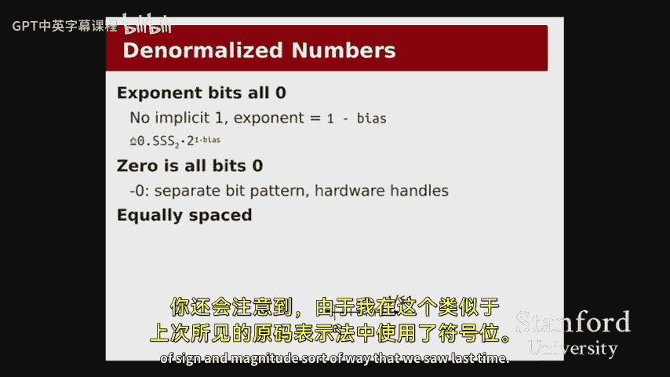
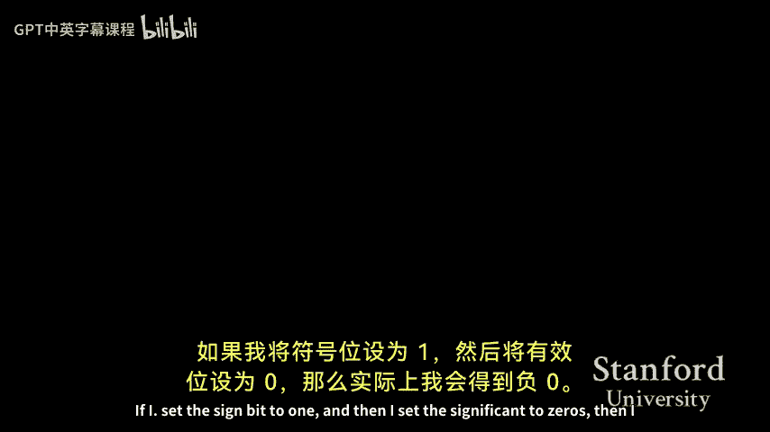

# 008：浮点数与汇编语言入门


在本节课中，我们将要学习两个主要部分。首先，我们将完成对浮点数表示和运算的讨论，重点关注程序员应如何有效使用浮点数并避免常见陷阱。其次，我们将开启一个全新的主题——汇编语言，了解C代码如何被翻译成机器能够执行的指令。

## 浮点数总结与实用指南

上一节我们详细探讨了浮点数的表示细节。本节中，我们来看看如何从更宏观的角度理解和使用浮点数。





浮点数系统的核心思想是将一个数字拆分为两部分：有效数字（Significand）和指数（Exponent）。这类似于科学计数法，但底数是2。我们可以将指数部分理解为衡量数字的“单位”。例如，数字1.5本身没有意义，除非我们知道它的单位是纳米还是光年。浮点表示法的设计目标是在不同的“单位”（即数量级）下，都能保持相对误差在一定范围内，而不是绝对误差。

### 特殊值的表示：零与非规格化数

在浮点数的标准公式 **值 = 1.xxx × 2^y** 中，我们无法通过任何xxx和y的组合得到零。因此，IEEE标准使用特殊位模式来表示零。

在我们的8位“迷你浮点数”（1个符号位，4个指数位，3个有效位）示例中，当指数位全为0时，我们进入“非规格化数”区域。此时，值的计算公式变为 **值 = 0.xxx × 2^(1 - 偏移量)**。通过将有效位设置为0，我们就能表示数字0。由于存在符号位，我们同样可以表示 -0。系统会正确处理这种情况，使 -0 与 0 在比较时相等。

非规格化数填补了0和最小规格化正数之间的空白，使得数值表示在0附近更加稠密。

### 浮点数的精度与相对误差

理解浮点数的关键在于区分绝对误差和相对误差。随着数字数量级（指数）的变化，相邻可表示浮点数之间的绝对间隔（称为epsilon）会剧烈变化。然而，相对间隔（epsilon除以该数量级的数值）大致保持恒定。这意味着，当处理非常大或非常小的数字时，我们能够容忍的绝对误差可能很大，但相对精度是可控的。

### 浮点数运算的陷阱

由于上述表示特性，浮点数运算并不总是符合纯数学的直觉。例如，结合律和分配律可能不成立。

以下是一个运算顺序影响结果的例子：
```c
float trillion = 1e12;
float thousand = 1000.0;
float result1 = (trillion + thousand) - trillion; // 结果可能为 0
float result2 = trillion + (thousand - trillion); // 结果可能为 1000
```
在第一个计算中，`trillion + thousand` 的结果在浮点数精度下可能仍然是 `trillion`，因为1000相对于1万亿来说变化太小，无法在有限的精度位中体现出来，从而导致后续减法结果错误。

另一个需要注意的问题是，不应直接比较两个浮点数是否完全相等。由于表示误差，理论上相等的两个计算可能产生略有不同的结果。更安全的做法是检查两个数的差值是否小于一个极小的容忍值（epsilon）。

**核心建议**：作为程序员，我们应当时刻意识到浮点数的精度限制。通过理解误差来源，我们可以重新组织计算顺序、选择合适的数据类型（如有时使用`double`代替`float`），或采用更稳定的数值算法来规避问题。

## 汇编语言入门

上一节我们结束了关于数据表示的讨论。本节中，我们将开启全新的篇章，探索代码本身是如何被表示和执行的。

当我们编写C代码并编译成可执行文件时，编译器会将高级语言转换为**机器码**，这是CPU能够直接理解和执行的二进制指令。为了便于人类阅读和理解这一转换过程，我们研究**汇编语言**，它是机器码的文本表示形式，与机器指令一一对应。

### 为什么学习汇编语言？

学习汇编语言有以下几个重要原因：
1.  **理解编译器行为**：了解编译器如何将C代码优化或翻译成底层指令，有助于我们写出性能更好的代码。
2.  **进行底层调试与优化**：在调试复杂问题或进行极致性能优化时，查看汇编代码是必不可少的技能。
3.  **理解系统工作原理**：它是理解函数调用、内存布局、程序执行流程等计算机系统核心概念的基础。

### 指令集架构

我们学习的是 **x86-64 ISA**。ISA是硬件设计者和软件开发者之间的一份“契约”，它定义了：
*   CPU支持哪些指令（如加法、乘法、内存读取）。
*   指令的格式和编码。
*   程序可用的资源（如寄存器）。
*   函数调用约定（如参数和返回值如何传递）。

x86-64架构经过数十年的发展，包含了大量指令，但入门阶段我们只需掌握其中最核心的一部分。

### 核心组件：寄存器

在C语言模型中，我们操作内存中的变量。但在实际硬件中，CPU无法直接对内存中的数据进行运算。数据必须先从内存加载到**寄存器**中，运算完成后再存回内存。

x86-64有16个通用寄存器，每个64位宽（8字节），用于存放整数、指针等数据。它们的名字有些历史原因，如`%rax`, `%rbx`, `%rcx`, `%rdi`, `%rsi`等。寄存器可以单独访问其低32位（如`%eax`）、低16位（如`%ax`）或低8位（如`%al`），以方便处理不同大小的数据。

### 第一个汇编指令：MOV

`mov`指令用于在寄存器和内存之间，或在寄存器之间移动数据。其语法是 `mov 源, 目的`，表示将源操作数的值复制到目的操作数。

以下是一些`mov`指令的示例及其含义：

*   `movq $-1, %rax`
    *   将**立即数** -1（64位）移动到寄存器 `%rax`。`$`表示立即数，`q`表示“四字”（8字节）。
*   `movq %rdi, %rax`
    *   将寄存器 `%rdi` 中的值移动到 `%rax`。按照调用约定，`%rdi`通常存放函数的第一个参数，`%rax`存放返回值。
*   `movq (%rdi), %rax`
    *   从内存中加载数据。`(%rdi)`表示以`%rdi`中的值作为内存地址，取出该地址处的8字节数据，放入`%rax`。这对应C语言中的解引用操作 `*ptr`。
*   `movq 16(%rdi), %rax`
    *   带偏移量的内存加载。计算地址 `%rdi + 16`，取出该地址处的8字节数据。这对应C语言中的数组访问 `array[2]`（假设`long`类型，每个元素8字节）。
*   `movq (%rdi, %rsi, 8), %rax`
    *   带比例因子的索引寻址。计算地址 `%rdi + %rsi * 8`，取出数据。这对应 `array[index]`。比例因子可以是1, 2, 4, 8。
*   `movl $0, (%rdi)`
    *   将32位（双字）立即数0写入`%rdi`指向的内存地址。`l`后缀表示操作32位数据。

**关键点**：汇编语言中没有高级语言中的“类型”概念，只有数据的大小（通过指令后缀如`b`-字节, `w`-字, `l`-双字, `q`-四字来区分）。是解释为整数、指针还是浮点数，完全取决于程序员（或编译器）的意图。例如，同样的`movq %rdi, %rax`指令，在C语言中可能对应 `return (long)param;`， `return (long*)param;` 或 `return *(long**)param;`，汇编代码无法区分这些情况。

---


本节课中我们一起学习了浮点数使用的核心要点和常见陷阱，并初步认识了汇编语言的世界。我们了解了程序如何从C代码编译为机器指令，介绍了x86-64架构的基本组件——寄存器，并详细讲解了最基础的`mov`指令及其多种寻址模式。理解这些内容是后续深入学习函数调用、控制流和程序优化的基石。在接下来的课程和实验中，我们将继续探索汇编语言的奥秘。