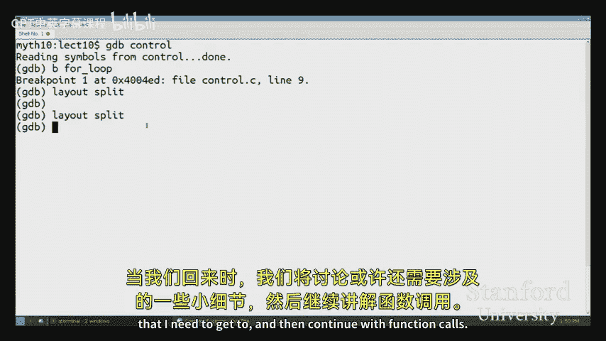
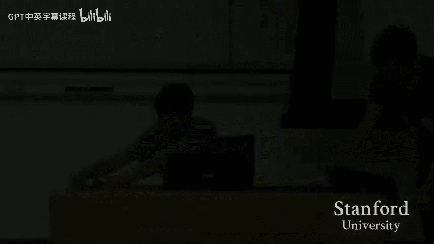
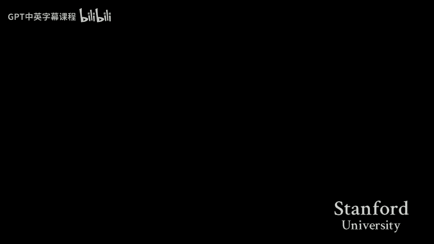

# 009：汇编语言中的算术运算与控制结构

## 概述
在本节课中，我们将继续学习汇编语言，重点探讨C语言中的算术运算、逻辑运算以及控制结构（如`if`语句和循环）是如何被翻译成汇编指令的。我们将通过具体的代码示例，理解高级语言结构在底层机器上的实现方式。

---

## 回顾与引入
上一节我们介绍了汇编语言的基础，包括`MOV`指令和多种内存寻址模式。本节中，我们将看看C语言中的其他常见操作是如何被翻译成汇编指令的。

### 类型转换与汇编
首先，我们回顾一下类型转换在汇编层面的表现。类型信息在编译到汇编时基本丢失，汇编指令只关心对内存字节的操作。

**示例：指针类型转换**
```c
long *ptr;
*(ptr + 3) = 0; // 对 long* 进行指针运算和解引用
```
对应的汇编指令是`MOVQ $0, 24(%rdi)`。这里`24`是`3 * sizeof(long)`。

如果将`ptr`转换为`char*`：
```c
char *cptr = (char*)ptr;
*(cptr + 3) = 0;
```
对应的汇编指令变为`MOVB $0, 3(%rdi)`。指令从`MOVQ`变为`MOVB`，偏移量从24变为3。**类型转换本身不产生单独的指令**，它只影响编译器对代码的解释，从而生成不同的内存访问指令（按1字节而非8字节访问）。

### LEA 指令：加载有效地址
`LEA`指令用于计算地址，而不进行解引用。它的语法与`MOV`类似，但含义不同。

**示例：返回地址**
```c
long* func(long *ptr) {
    return ptr + 1; // 返回 ptr[1] 的地址，而非值
}
```
对应的汇编指令是`LEAQ 8(%rdi), %rax`。这条指令将`%rdi`中的地址值加上8（一个`long`的大小），结果存入`%rax`，**并不访问该地址处的内存**。

在C语言中，`&ptr[1]`等价于`ptr + 1`，都可能被编译为`LEA`指令。

---

## 算术与逻辑运算
以下是C语言中一些基本运算对应的汇编指令介绍。

### 加法指令 `ADD`
`ADD`指令执行加法操作，其格式为`ADD src, dst`，效果是`dst = dst + src`。

**示例函数**
```c
int arithmetic(int a, int *b) {
    int local = a + *b;
    return local;
}
```
对应的汇编核心部分：
```assembly
movl    %edi, %eax      ; 将参数a存入%eax
addl    (%rdx), %eax    ; 将*b的值加到%eax上
```
*   `ADDL`中的`L`后缀表示操作4字节数据。
*   许多算术指令都采用这种`目标操作数 += 源操作数`的模式。

### 减法与乘法
`SUB`和`IMUL`指令分别用于减法和乘法，模式与`ADD`相同。

**示例**
```c
int local2 = local - param2 * param1;
```
可能被编译为：
```assembly
subl    %esi, %eax      ; %eax = %eax - %esi (param2)
imull   %edi, %eax      ; %eax = %eax * %edi (param1)
```
**一行C代码可能对应多条汇编指令**，因为硬件没有复合运算指令，编译器需要将其分解。

### 位运算
位运算指令如`AND`, `OR`, `NOT`, `XOR`以及移位指令`SAR`（算术右移）、`SHR`（逻辑右移）也遵循类似的模式。

**有符号与无符号的差异**
对于加、减、乘、位与、位或等运算，**有符号数和无符号数使用相同的机器指令**。这是二进制补码表示法的优势之一。
区别主要体现在右移操作：
*   `SAR` (算术右移)：用于有符号数，高位填充符号位。
*   `SHR` (逻辑右移)：用于无符号数，高位填充0。
编译器根据源代码中的类型信息决定使用哪条指令。

### 巧用 LEA 进行算术运算
`LEA`指令因其能计算`[基址 + 偏移量 + 索引*比例]`这种形式的地址，常被编译器巧妙地用于执行普通的整数算术运算。

**示例**
```c
int result = 5 + param1 + param2 * 4;
```
可能被编译为：
```assembly
leal    5(%rdi, %rsi, 4), %eax
```
这条`LEAL`指令计算了`%rdi + %rsi*4 + 5`，并将32位结果存入`%eax`。这证明了在汇编层面，**地址计算和整数算术在本质上是相通的**。

### 类型提升与扩展指令
当从小尺寸类型转换到大尺寸类型（如`char`到`int`）时，需要进行符号扩展或零扩展。

**符号扩展 `MOVSBL`**
```c
int promote_signed(char c) {
    return (int)c; // 符号扩展
}
```
对应指令：`MOVSBL %dil, %eax`。将1字节的`%dil`符号扩展为4字节的`%eax`。

**零扩展 `MOVZBL`**
```c
unsigned long promote_unsigned(unsigned char uc) {
    return (unsigned long)uc; // 零扩展
}
```
对应指令可能为`MOVZBL %dil, %eax`，然后自动零扩展至高32位。

**数组访问中的扩展**
```c
int array_access(int *arr, int i) {
    return arr[i];
}
```
在计算地址`arr + i * 4`前，需要将32位的索引`i`符号扩展为64位：
```assembly
movslq  %esi, %rsi      ; 将 int i 符号扩展为 long
movl    (%rdi, %rsi, 4), %eax ; 访问 arr[i]
```

---

## 控制结构
控制结构（如条件分支和循环）在汇编中通过**跳转指令**和**标签**实现。

### 无条件跳转 `JMP`
`JMP`指令使执行流无条件跳转到指定标签处。

**示例：无限循环（goto形式）**
```c
void infinite_loop(int *ptr) {
    loop:
        (*ptr)++;
        goto loop;
}
```
对应汇编：
```assembly
.L2:
    addl    $1, (%rdi)
    jmp     .L2
```

### 条件跳转与 `IF` 语句
条件跳转依赖于`CMP`（比较）指令设置的标志位。

**`IF-THEN` 结构**
```c
if (param == 107) {
    *ptr += 5;
}
```
对应汇编通常采用“条件不满足则跳过”的逻辑：
```assembly
cmpl    $107, %edi      ; 比较 param 和 107
jne     .Lskip          ; 如果不等于(Not Equal)，跳转到 .Lskip
addl    $5, (%rsi)      ; if 语句体
.Lskip:
    ...                 ; 后续代码
```

**`IF-ELSE` 结构**
```c
if (param1 < 5) {
    *ptr ^= param2;
} else {
    *ptr = -param2;
}
```
对应汇编需要两个跳转：
```assembly
cmpl    $4, %edi        ; 比较 param1 和 4 (因为 param1 < 5 等价于 param1 <= 4)
jg      .Lelse          ; 如果大于4，跳转到else块
xorl    %edx, (%rsi)    ; then 语句体
jmp     .Lend           ; 跳过else块
.Lelse:
    negl    %edx
    movl    %edx, (%rsi) ; else 语句体
.Lend:
    ...
```

### 循环结构
`WHILE`和`FOR`循环在汇编中本质相同，都包含初始化、条件检查和循环体。

**`WHILE` 循环示例**
```c
int i = 1, sum = 0;
while (i < n) {
    sum += i;
    i++;
}
```
其汇编结构通常将条件检查放在循环体底部（优化后）：
```assembly
    movl    $1, %edx           ; i = 1
    movl    $0, %eax           ; sum = 0
    jmp     .Lcondition        ; 先跳转到条件检查
.Lloop:                        ; 循环体开始
    addl    %edx, %eax         ; sum += i
    addl    $1, %edx           ; i++
.Lcondition:                   ; 条件检查
    cmpl    %edi, %edx         ; 比较 i 和 n
    jl      .Lloop             ; 如果 i < n，跳回循环体
```

**`FOR` 循环**
将上述`while`循环改为`for`循环，生成的汇编代码**完全相同**。这印证了`for`循环只是`while`循环的语法糖，在汇编层面没有特殊指令。

---

## 在GDB中查看与调试汇编
我们可以使用GDB来验证和单步执行汇编指令。

*   **查看汇编代码**：`disassemble function_name`
*   **单步执行汇编指令**：`stepi` 或 `si`
*   **查看寄存器值**：`print $rax`
*   **布局模式**：使用`layout split`可以同时查看源代码和汇编代码。

在调试时，你可能会发现C源代码的执行顺序与汇编指令的顺序不完全一致，这是编译器优化的结果。通过单步执行汇编指令，可以精确跟踪程序的真实执行流程。

---

## 总结
本节课我们一起学习了C语言中多种结构到汇编语言的翻译：
1.  **算术与逻辑运算**：如`ADD`, `SUB`, `IMUL`, `AND`, `OR`等指令，通常采用`目标操作数 += 源操作数`的模式。
2.  **类型处理**：类型信息在汇编中基本丢失，但类型转换和提升会影响指令的选择（如`MOVS` vs `MOVZ`, `SAR` vs `SHR`）。
3.  **控制流**：`IF`、`ELSE`、`WHILE`、`FOR`等结构通过`CMP`指令结合条件跳转（`JE`, `JNE`, `JG`, `JL`等）和无条件跳转（`JMP`）来实现。
4.  **地址计算**：`LEA`指令不仅用于计算地址，也常被用于高效的整数算术运算。







理解这些翻译规则，能够帮助我们阅读汇编代码，推断其对应的C语言结构，并在调试时深入到机器指令层面分析程序行为。