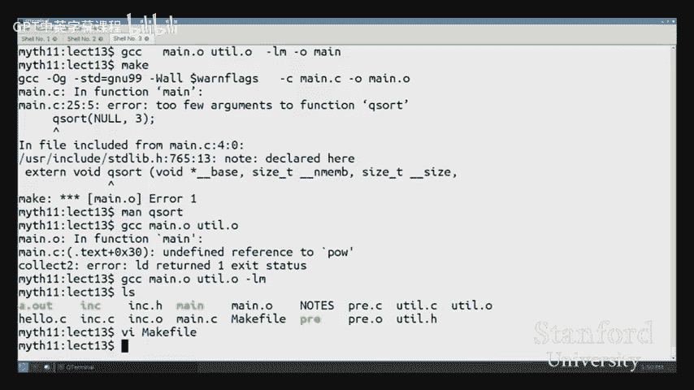

# 010：程序构建过程详解 🛠️


在本节课中，我们将要学习一个C程序是如何从源代码一步步变成可执行文件的。我们将深入探讨构建过程中的四个主要步骤：预处理、编译、汇编和链接。理解这些步骤不仅能帮助我们更好地理解程序是如何工作的，还能让我们在面对各种构建错误时，能够快速定位问题所在并找到正确的解决方案。

## 预处理阶段

上一节我们介绍了构建过程的概览，本节中我们来看看第一个步骤：预处理。

预处理是构建过程的第一步，由预处理器负责。它的主要工作是处理所有以 `#` 开头的指令，例如 `#include` 和 `#define`。预处理器并不理解C语言的语法，它只是进行简单的文本查找和替换。

以下是预处理器处理的主要指令类型：
*   `#include`：将指定头文件的内容复制到当前文件中。
*   `#define`：定义宏，在代码中进行文本替换。
*   `#ifndef` / `#endif`：条件编译，常用于防止头文件被重复包含。

我们可以使用 `gcc -E` 命令来让GCC只运行预处理步骤并输出结果。例如：
```bash
gcc -E hello.c -o hello.i
```
这将生成一个 `.i` 文件，其中包含了经过预处理后的C代码。

预处理器能捕获的错误类型非常有限。它主要检查 `#include` 的文件是否存在。例如，如果包含了一个不存在的头文件，预处理器会报错：
```bash
fatal error: bogus.h: No such file or directory
```
然而，预处理器**不会**检查 `#define` 宏定义中的语法错误。例如，如果你错误地在宏定义中加了分号，预处理器会忠实地进行替换，而将语法错误留给后续步骤处理。

## 编译阶段

现在，我们已经有了经过预处理的C代码（`.i` 文件），接下来进入编译阶段。

编译器是构建过程中最复杂的部分，它的任务是将C语言源代码翻译成汇编语言。这个步骤包含了语法分析、语义分析、类型检查和代码优化等一系列复杂操作。

我们可以使用 `gcc -S` 命令来让GCC在编译后停止，生成汇编代码文件。例如：
```bash
gcc -S hello.i -o hello.s
```
生成的 `.s` 文件是文本文件，包含了可读的汇编指令。

编译器负责捕获我们在编程时遇到的大多数错误。以下是编译器会检查的主要错误类型：
*   **语法错误**：例如缺少分号、括号不匹配等。
*   **类型错误**：例如将整数赋值给指针、函数参数类型不匹配等。
*   **未声明的标识符**：使用了未声明或未定义的变量或函数。

**一个关键点**是：类型检查**只发生**在编译阶段。一旦代码被翻译成汇编语言，所有的类型信息就都丢失了。汇编指令只操作寄存器和内存地址，不关心它们原本代表的是整数、浮点数还是指针。因此，确保类型正确的责任完全落在编译器身上。

## 汇编阶段

编译完成后，我们得到了人类可读的汇编代码（`.s` 文件）。下一步是将这些文本指令转换成机器能直接理解的二进制格式。

汇编器的工作相对直接，它基本上是将每一条汇编指令一对一地翻译成对应的机器码。我们可以使用 `gcc -c` 命令来执行编译和汇编，生成目标文件。例如：
```bash
gcc -c hello.s -o hello.o
```
生成的 `.o` 文件是一个二进制文件，称为**可重定位目标文件**。

由于汇编器只是简单地进行翻译，它本身**几乎不进行错误检查**。只要编译器生成的汇编代码是有效的，汇编器就能顺利工作。我们可以使用 `objdump -d` 工具来反汇编 `.o` 文件，查看其汇编内容：
```bash
objdump -d hello.o
```
需要注意的是，在 `.o` 文件中，调用其他文件中的函数（例如 `printf`）的地址还没有被确定，只是一个占位符。我们可以使用 `nm` 命令查看目标文件中的符号定义和引用：
```bash
nm hello.o
```
输出中，`U` 表示未定义的符号（需要链接时解决），`T` 表示在文本段中定义的函数。

## 链接阶段

到目前为止，我们的操作都是针对单个源文件（`.c`）的。一个程序通常由多个模块组成，链接器的作用就是将多个独立编译的目标文件（`.o` 文件）以及所需的库文件组合成一个完整的可执行程序。

链接器主要完成两项关键工作：
1.  **符号解析**：将每个目标文件中未定义的符号引用（如 `printf`）与另一个目标文件中该符号的定义关联起来。
2.  **重定位**：将每个目标文件的代码和数据节分配到最终的内存地址中，并修改所有对这些地址的引用。

链接器错误通常表现为“未定义的引用”。例如：
```bash
undefined reference to `function_name`
```
这通常意味着链接器找不到某个函数或变量的定义。

然而，链接器**有一个重要的局限性**：它**不进行类型检查**。因为它处理的是已经失去类型信息的机器码。这可能导致一些在编译阶段未被捕获的错误。例如：
*   如果函数原型声明错误（参数个数或类型不匹配），但调用时看起来正确，编译器可能只会给出警告，而链接器会成功链接，导致运行时行为错误。
*   如果没有包含头文件（缺少函数原型），编译器会假设函数参数类型，并生成调用代码。链接器只要能找到同名函数就会链接成功，这几乎必然导致运行时崩溃。

**关于库的链接**：C标准库（如 `stdio.h`, `stdlib.h` 中的函数）默认会被自动链接。但有一些库需要手动指定，最典型的例子是数学库 `libm`。要使用 `math.h` 中的函数（如 `pow`, `sin`），需要在链接时加上 `-lm` 标志：
```bash
gcc main.o -o main -lm
```
请注意，`#include <math.h>` 只为编译器提供原型声明，而 `-lm` 是告诉链接器去连接包含函数实现的数学库文件，两者缺一不可。

## 静态函数与作用域

`static` 关键字用于函数时，会改变其链接属性。一个被声明为 `static` 的函数只在定义它的源文件内部可见，链接器不会将其暴露给其他文件。

这使得我们可以在不同的 `.c` 文件中定义同名的 `static` 函数而不会发生冲突。如果没有 `static` 修饰，链接器会发现两个同名的全局函数定义，从而产生“多重定义”错误。

## 总结

本节课中我们一起学习了C程序构建的完整流程。我们深入探讨了四个核心步骤：
1.  **预处理**：处理 `#` 指令，进行文本替换和文件包含。
2.  **编译**：将C代码转换为汇编代码，并进行严格的语法和类型检查。
3.  **汇编**：将汇编代码转换为机器码，生成可重定位的目标文件。
4.  **链接**：合并多个目标文件和库，解析符号引用，生成最终的可执行文件。

理解这些步骤的输入、输出和职责，能帮助我们：
*   **精准定位错误**：根据错误信息判断问题是出在语法（编译期）、缺少头文件（编译期）、未定义符号（链接期）还是缺少库（链接期）。
*   **理解工具行为**：明白为什么 `#include` 无法解决“未定义的引用”错误，以及为什么需要同时使用 `#include <math.h>` 和 `-lm`。
*   **进行高级调试**：可以在不同阶段中断构建过程，检查中间输出（如 `.i`, `.s`, `.o` 文件），以诊断复杂问题。



掌握程序构建的底层过程，是成为一个精通系统和底层细节的程序员的重要一步。