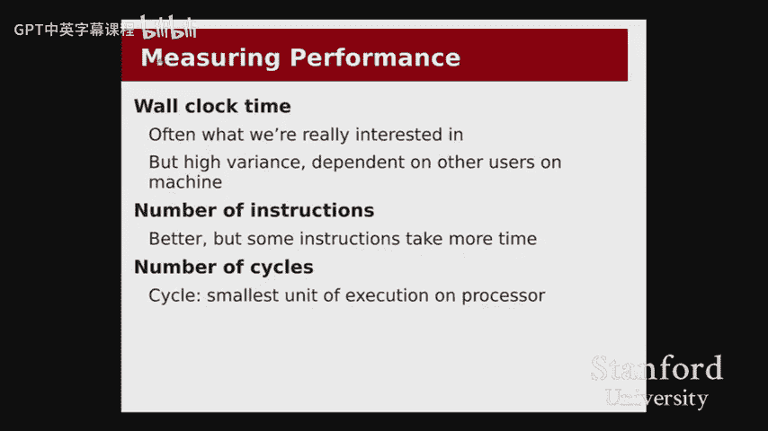

# 011：程序优化 🚀

在本节课中，我们将学习如何量化程序性能，并探讨编译器能为我们自动完成哪些优化，以及哪些优化需要我们手动进行。我们还将学习如何使用性能分析工具来定位代码中的“热点”，从而进行有针对性的优化。

## 测量性能 📏

上一节我们介绍了课程的整体安排，本节中我们来看看如何量化程序的性能。到目前为止，我们主要通过大O表示法来讨论算法效率。大O表示法关注的是输入规模增长时，算法运行时间的渐进行为。它是一个与机器和语言无关的度量标准，非常适合比较不同算法。

然而，大O表示法也有其局限性。当我们深入到系统层面，关心具体的汇编指令执行效率时，大O表示法无法帮助我们比较两段功能相同但实现不同的汇编代码。此外，大O表示法忽略了常数因子，但在实际优化中，常数因子可能带来巨大的性能差异。

那么，有哪些替代的测量方法呢？

以下是几种常见的性能度量方法：

*   **挂钟时间**：即程序从开始到结束实际经过的时间。这对于用户体验（如网页加载时间）非常重要。但其缺点是容易受到系统负载等其他进程的影响，导致测量结果波动较大。
*   **指令计数**：统计程序执行过程中运行的汇编指令总数。这种方法的问题在于，并非所有指令的执行时间都相同。例如，乘法和除法指令就比加法指令昂贵得多。
*   **时钟周期**：这是我们将要重点使用的度量标准。处理器有一个内部时钟，其频率（如3GHz）表示每秒可以执行30亿个时钟周期。我们可以将周期视为处理器在一个步骤中可以完成的最小工作量单位。通过测量程序运行所消耗的周期数，我们可以得到一个相对稳定且能反映真实计算成本的性能指标。

## 编译器优化 🛠️

上一节我们讨论了如何测量性能，本节中我们来看看编译器能为我们自动完成哪些优化。在整个课程中，我们一直使用 `-Og` 标志进行编译，它允许编译器在基本不影响调试的前提下进行一些优化。

编译器可以执行多种优化，以下是一些常见的例子：

*   **常量折叠**：如果代码中包含大量常量计算，编译器会在编译时直接计算出结果，而不是在运行时计算。例如，对于表达式 `107 * 5 + sqrt(2)`，编译器会直接计算出最终数值。
*   **公共子表达式消除**：如果同一个表达式在代码中多次出现且值不变，编译器会计算一次并将其结果复用，避免重复计算。例如，对于 `param + 107` 这个在多个地方使用的表达式，编译器会先计算一次并存储在寄存器中。
*   **强度削弱**：用更廉价的操作替换昂贵的操作。例如，编译器会将乘以7的操作 `x * 7` 转换为 `(x << 3) - x`（即先乘以8再减去自身），因为位移和加法比乘法更快。对于除以3的操作 `x / 3`，编译器可能会转换为乘以一个魔数的位移操作。

值得注意的是，编译器在优化时遵循“只要输出结果不变，就可以改变实现方式”的原则。这意味着它可能会引入新的变量、改变循环结构，甚至完全消除函数调用（如将递归阶乘转换为迭代计算）。只要这些改变不影响程序的可观察输出，并且假设没有人在调试器中逐行检查中间状态，编译器就有权进行这些优化。

然而，编译器的优化能力也有限制。它基于启发式方法，并非总能做出最佳选择，有时过于激进的优化（如 `-O3`）甚至可能降低性能。因此，我们通常从编写清晰、直接的代码开始，然后依赖编译器进行基础优化。

## 编译器无法完成的优化 🎯

上一节我们看到编译器能完成许多优化，但有些优化需要程序员的介入。编译器无法优化那些它无法完全推理或保证正确性的代码。

以下是编译器难以优化的几种情况：

*   **无法确定不变性的循环**：例如，在一个将字符串转换为小写的循环中，每次迭代都调用 `strlen(s)`。编译器无法确定 `tolower` 操作不会意外地在字符串中插入空终止符，从而改变字符串长度，因此它不敢将 `strlen` 移出循环。这会导致算法从 O(n) 退化为 O(n²)。程序员需要手动将长度计算提到循环外部。
*   **过于复杂或特殊的模式**：编译器擅长优化简洁、通用的代码，但对于手动展开的一长串硬编码 `if-else` 语句，它可能无法识别其中的算术模式并将其优化。有时，直接使用一个清晰的算术表达式（如 `index / 10`）会比一长串 `if` 语句更快，且更易于阅读。
*   **算法选择**：这是最重要的限制。编译器无法改变算法本身的时间复杂度。如果你写了一个选择排序（O(n²)），编译器无法将其自动替换为快速排序（O(n log n)）。算法的选择必须由程序员完成。

因此，优化的正确策略是：首先用最清晰的方式编写代码，并选择正确的算法。然后，如果性能不达标，再使用工具定位瓶颈，并针对性地进行手动优化。

## 使用性能分析工具定位热点 🔍

上一节我们了解了哪些优化需要手动进行，本节中我们来看看如何系统地找到代码中的性能瓶颈。我们不应该盲目猜测哪部分代码慢，而应该使用性能分析工具。

我们将使用 Valgrind 工具套件中的 Callgrind。Callgrind 是一个分析器，它通过模拟运行程序来记录每个函数、每行代码甚至每条指令被执行的次数（或消耗的周期估算）。

以下是使用 Callgrind 的基本步骤：

1.  使用 `valgrind --tool=callgrind ./your_program` 运行程序。这会生成一个 `callgrind.out.<pid>` 文件。
2.  使用 `callgrind_annotate --auto=yes callgrind.out.<pid>` 命令生成可读的报告。

报告会显示程序中各个函数的指令计数占比。我们可以从中找到“热点”，即那些消耗了绝大部分执行时间的代码区域。例如，在一个排序程序中，分析报告可能清晰地显示 `selection_sort` 函数占据了大部分指令，而其中的内层循环又是该函数内的热点。

通过分析一个哈希表程序的例子，我们看到当哈希桶数量设置过小时，`CMapPut` 函数（即插入操作）会消耗惊人的指令数，成为主要瓶颈。在调整哈希桶数量后，新的分析报告显示 `scanf` 和内存分配（`malloc`/`free`）成为了主要开销。这告诉我们，优化内存分配策略（例如，对于已知大小的数据，考虑使用栈而非堆）可能是下一步的优化方向。

使用性能分析工具可以让我们避免无谓的猜测，将优化精力集中在真正影响性能的关键部分。

## 总结 📝

本节课中我们一起学习了程序优化的核心知识。我们首先探讨了如何超越大O表示法，使用时钟周期等更精确的指标来测量性能。接着，我们了解了编译器能够自动完成的多种优化，如常量折叠和强度削弱，但也明白了其局限性。我们认识到，对于算法选择、编译器无法确定的不变性以及复杂逻辑，需要程序员进行手动优化。最后，我们学会了使用 Callgrind 性能分析工具来科学地定位代码中的性能瓶颈，从而进行有针对性的、高效的优化。记住优化的黄金法则：先写清晰正确的代码，再测量性能，最后针对热点进行优化。