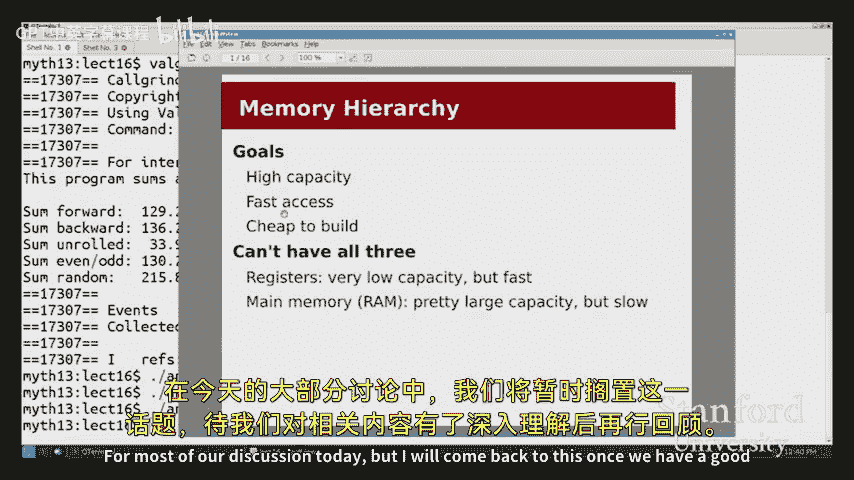

# 012：内存层次结构与缓存优化 🧠

在本节课中，我们将学习计算机系统中的内存层次结构，理解缓存的工作原理，并探讨如何编写对缓存友好的高效代码。我们将通过具体的代码示例和性能分析工具来揭示内存访问模式对程序性能的巨大影响。

## 概述

到目前为止，我们一直假设每次内存访问（例如 `array[i]`）所花费的时间是相同的。本节课我们将揭示这个假设是错误的。我们将介绍内存层次结构的概念，解释为什么缓存至关重要，并学习如何利用局部性原理来优化程序性能。

## 内存层次结构：速度、容量与成本的权衡

上一节我们介绍了优化技术，本节中我们来看看一个不同的优化角度：内存层次结构。

在设计计算机系统时，我们通常有三个主要目标：
1.  **高容量**：我们希望内存能存储大量数据（例如数GB的RAM）。
2.  **高速度**：我们希望访问内存像访问寄存器一样快（理想情况下只需一个CPU周期）。
3.  **低成本**：我们希望内存价格在可承受范围内。

然而，我们无法用单一类型的内存同时满足这三个目标。让我们比较一下我们已经熟悉的两种存储：

*   **寄存器**：容量极小（例如16个，每个8字节），但速度极快（访问时间小于1个周期）。
*   **RAM（内存）**：容量巨大（数GB），但访问速度相对较慢（可能需要数十到数百个周期）。

此外，CPU性能的提升速度（遵循摩尔定律）远快于RAM性能的提升速度，导致“内存墙”问题日益严重——CPU和内存之间的速度差距越来越大。

那么，我们该怎么办？解决方案是引入**缓存**。

## 缓存：一个折中的方案

缓存是一种容量较小但速度较快的内存，位于CPU和主存（RAM）之间。它由硬件自动管理，对软件（汇编语言）是透明的。虽然它既不是最大的也不是最快的，但通过巧妙的策略，它能显著提升整体性能。

为了理解缓存为何有效，让我们看一个现实世界的类比：写论文时查阅资料。
*   **你的书桌（寄存器）**：手边的资料，访问极快，但空间有限。
*   **你房间的书架（缓存）**：存放一些可能用到的书，访问较快，容量中等。
*   **图书馆（主存RAM）**：藏书海量，但每次取书都需要花费较长时间。

如果每次需要一句话都跑去图书馆，效率极低。更聪明的做法是：当你需要一本书时，从图书馆借出并放在书架上。之后如果需要查阅同一本书的其他部分，直接从书架上拿取即可，省去了往返图书馆的时间。

缓存工作的关键在于一个核心假设：程序的内存访问不是完全随机的，而是具有**局部性**。

## 局部性原理

缓存之所以有效，是因为程序通常表现出两种类型的局部性：

1.  **时间局部性**：如果一个数据项被访问，那么它在不久的将来很可能再次被访问。
    *   **例子**：在循环中反复使用的累加变量 `sum`。
    *   **代码示例**：`sum += array[i];`

2.  **空间局部性**：如果一个数据项被访问，那么其邻近的数据项也可能很快被访问。
    *   **例子**：顺序遍历一个数组。
    *   **代码示例**：`for (int i = 0; i < n; i++) sum += array[i];`

如果程序的内存访问是完全随机的（就像在图书馆随机挑一本书），那么缓存将毫无帮助。幸运的是，大多数程序都表现出良好的局部性。

## 缓存术语与性能指标

在深入探讨之前，我们需要了解一些关键术语：

*   **命中**：要访问的数据在缓存中找到。
*   **未命中**：要访问的数据不在缓存中，需要从更慢的内存（如RAM）中获取。
*   **未命中率**：内存访问中发生未命中的比例。我们希望这个数值尽可能低。
    *   **公式**：`未命中率 = 未命中次数 / 总访问次数`
*   **命中时间**：缓存命中时，获取数据所需的时间。
*   **未命中惩罚**：缓存未命中时，从下级存储器获取数据所需的额外时间。

平均内存访问时间可以通过以下公式估算：
`平均访问时间 = 命中时间 + 未命中率 × 未命中惩罚`

这个公式表明，即使未命中率仅有微小的上升（例如从1%到3%），如果未命中惩罚很大（例如100个周期），平均访问时间也可能翻倍，导致程序性能显著下降。

## 现代系统中的缓存层次

我们的机器通常具有多级缓存，每一级都在速度、容量和成本之间进行权衡：

1.  **L1缓存**：容量小（例如32KB），速度极快（1-2个周期）。目标是让命中访问尽可能快。
2.  **L2缓存**：容量更大（例如4-6MB），速度较慢（约10-20个周期）。目标是尽可能减少需要访问主存的情况。
3.  **主存（RAM）**：容量最大（数GB），速度最慢（50-200个周期）。

随着CPU与内存性能差距的拉大，现代高端处理器甚至引入了L3和L4缓存来进一步缓冲。

## 缓存的组织与工作原理（高层视角）

缓存通常被划分为大小固定的**块**（例如64字节）。当程序访问某个内存地址时，硬件不仅会加载该地址的数据，还会将整个数据块加载到缓存中。这利用了空间局部性——相邻的数据很可能很快被用到。

硬件需要快速判断一个地址是否在缓存中。一种简化的策略是使用地址的一部分位来索引缓存行，并用剩余的位作为“标签”进行比较。如果标签匹配，则为命中；否则为未命中。实际的硬件实现更为复杂，但核心思想是提供一种快速、确定性的查找机制。

## 代码示例分析：缓存对性能的影响

现在，让我们回到课程开始时提出的问题：为什么以不同顺序求和数组，性能差异如此巨大？

我们有以下五种求和一个百万元素数组的方法：
1.  顺序求和（`sum_forward`）
2.  逆序求和（`sum_backward`）
3.  循环展开求和（`sum_unrolled`）
4.  先奇后偶求和（`sum_odds_then_evens`）
5.  随机顺序求和（`sum_random`）

使用性能分析工具 `callgrind`（开启缓存模拟）进行分析后，我们发现：

*   **顺序/逆序求和**：性能相近。缓存未命中率约为 `1/16`（因为64字节缓存块可容纳16个4字节整数）。这是**不可避免的冷未命中**。
*   **循环展开**：减少了循环控制指令，但缓存未命中次数不变，因此性能提升有限。
*   **先奇后偶求和**：破坏了空间局部性。访问元素0后，接下来访问的是元素2、4、6...，而缓存预取的是元素1、3、5...，导致未命中率翻倍（约 `1/8`）。这是**可避免的未命中**。
*   **随机顺序求和**：完全破坏了空间局部性。几乎每次访问都是未命中（未命中率约99.3%），导致运行时间比其他方法慢6倍。

这个例子清晰地展示了**访问模式**对缓存效率，进而对程序性能的决定性影响。

## 编写缓存友好代码

理解了缓存原理后，我们如何编写对缓存友好的代码呢？以下是核心原则：

1.  **关注内存访问模式**：尽量使用顺序、连续的内存访问。数组是最缓存友好的数据结构之一。
2.  **利用时间局部性**：频繁使用的数据（如循环内的累加器）应尽量保存在寄存器或栈帧中。
3.  **注意数据结构的布局**：
    *   **数组 vs 链表**：遍历链表时，节点在内存中可能分散分布，导致缓存未命中率高。示例显示，遍历链表的性能可能比遍历数组慢一个数量级。
    *   如果必须使用链表，尽量在访问一个节点时，集中访问其所有字段（如 `data` 和 `next`），以利用加载整个缓存块带来的空间局部性。
4.  **进行测量，而非猜测**：使用 `valgrind`、`callgrind`（带 `--simulate-cache=yes`）等工具来量化程序的缓存未命中率。不要盲目优化，要用数据指导决策。

## 总结

本节课中我们一起学习了计算机系统中的内存层次结构和缓存机制。我们了解到：

*   内存访问并非等时，缓存的存在是为了弥补CPU与主存之间的速度差距。
*   缓存的有效性依赖于程序的**局部性**（时间局部性和空间局部性）。
*   缓存未命中会带来巨大的性能惩罚，即使未命中率的小幅上升也可能导致程序运行时间显著增加。
*   作为程序员，我们可以通过设计**缓存友好的数据结构和访问模式**来提升程序性能。这包括优先使用连续存储、优化循环、以及利用性能分析工具进行实证优化。

掌握这些知识对于编写高效的系统程序至关重要，尤其是在实现像堆分配器（He allocator）这样性能敏感的项目时。请务必使用工具进行测量，让数据成为你优化的指南针。