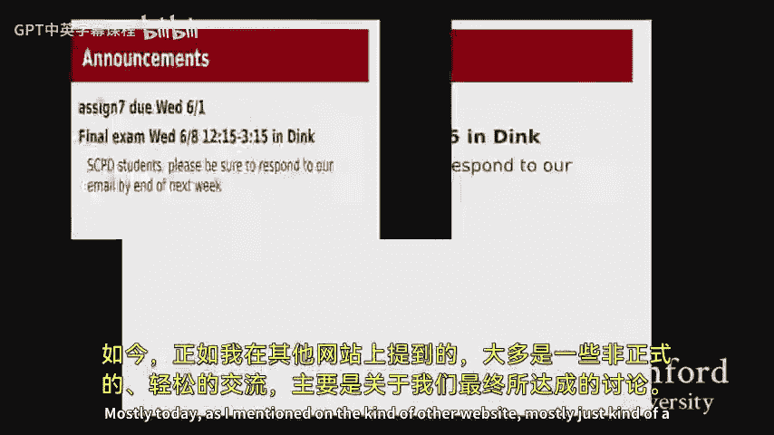
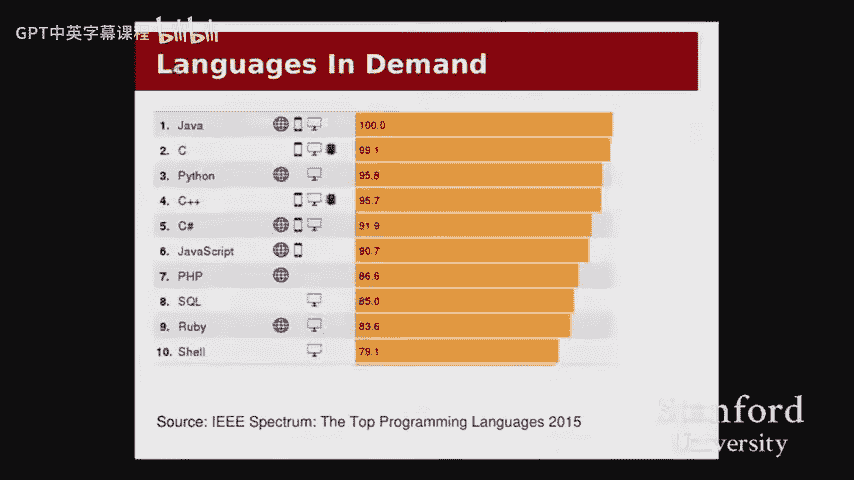
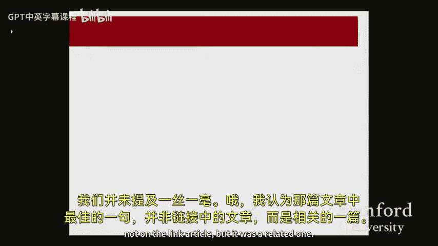

# 013：课程总结与展望 🎓




在本节课中，我们将回顾CS107课程的核心内容，探讨其在实际世界中的应用，并展望未来的学习与发展方向。我们将一起总结课程的价值，并讨论如何将所学知识应用于后续的课程、研究或职业生涯中。

---

## 课程回顾与价值总结

上一节我们介绍了课程的基本情况，本节中我们来看看CS107在整个计算机科学领域中的定位和价值。根据课程顾问的反馈，CS107常被推荐为计算机科学学生应优先选择的三门核心课程之一。这反映了本课程在培养学生深入理解计算机系统方面的重要性。

以下是学生们认为从本课程中获得的最有价值的几点收获：

*   **深入理解底层细节**：掌握了高级语言背后被忽略的系统级细节，例如内存管理和指针操作。
*   **掌握调试工具**：学会了使用GDB等调试器以及Valgrind等内存检查工具，这是后续课程和开发工作中的基本技能。
*   **理解汇编语言**：具备了阅读和理解汇编代码的能力，这在系统编程、性能优化和安全领域非常有用。
*   **洞察高级语言原理**：理解了Java、Python等高级语言在内存、指针和地址层面的工作原理，即使这些语言试图隐藏这些细节。
*   **培养问题解决能力与信心**：通过完成具有挑战性的作业，培养了在压力下解决问题、查阅文档（如man page）和按时交付项目的能力和信心。

## C语言与系统知识的现实应用

我们了解了课程的理论价值，现在来看看这些知识在现实世界中的具体应用。C语言远非过时的语言，它在当今的软件开发中依然占据核心地位。


根据2015年基于职位招聘需求的编程语言排名，C语言高居第二位。这表明市场对掌握C语言和系统编程技能的人才仍有大量需求。许多对性能、效率或硬件控制有要求的领域，如操作系统、嵌入式系统和高性能计算，都严重依赖C语言。



一个具体的例子是2015年发现的一个存在于广泛使用的引导程序中的安全漏洞。相关代码如下：
```c
mset(buff + klen - 1, ...);
```
如果变量 `klen` 的值为0，执行减1操作会导致其值变为最大的无符号整数（发生回绕）。当将其与指针 `buff` 相加时，`mset` 的操作起始位置将远在缓冲区开始之前，可能覆盖关键数据（如返回地址），从而导致严重的安全问题。理解指针、内存布局和整数溢出是发现和修复此类漏洞的关键。



## 平衡抽象与底层控制

在掌握了强大的底层控制能力后，我们需要学会平衡使用抽象和底层工具。系统领域的独特之处在于，完成任何有意义的项目都需要大量的协作，并依赖于许多已有的抽象层（如操作系统、编译器、硬件架构）。

重要的教训是：**为工作选择合适的工具**。在大多数情况下，可以信任编译器、类型系统和库函数。例如，通常使用 `array[i]` 而非复杂的指针运算，使用 `x + y` 而非担心整数溢出。只有在必要时（如实现特定算法或与硬件交互），才应使用 `void *`、`memcpy` 等底层操作。理解底层是为了更好地使用和信任抽象，而非总是抛弃它们。

## 未来学习与发展路径

基于对课程内容的不同感受，学生未来的路径可以大致分为几个方向。以下是针对不同兴趣点的建议：

*   **热爱系统编程的学生**：建议继续深入学习系统相关课程，如CS110（计算机系统原理）。这门课可以作为探索操作系统、编译器、网络等更广泛系统领域的入门课程。
*   **偏好高级语言与应用开发的学生**：CS110同样是一门核心课程，可以将其视为对系统知识的拓展和应用。之后，可以自由探索人工智能、理论、图形学、人机交互、数据管理等计算机科学的其他丰富领域。107课程培养的调试、问题解决和系统理解能力在这些领域同样宝贵。
*   **非CS专业或兴趣广泛的学生**：本课程培养的自学能力、解决问题的毅力和对计算机工作原理的深刻理解，在任何需要技术思维和分析能力的领域都是极具价值的资产。

## 问答与拓展

关于斯坦福的课程、研究或职业发展，学生们提出了一些具体问题。

**关于喜欢的课程**：除了CS107，操作系统（CS140）和高级项目课程（CS194）也备受推崇。后者提供了从零开始设计大型软件、定义接口和协作开发的宝贵经验。

**关于成为课程助教（Section Leader）**：通过CS198项目申请成为课程助教是一个极好的途径。它不仅能锻炼教学和调试能力，也是成为高阶课程（如CS107、CS110）研究生助教的重要资历，同时也是一个充满活力的社区。

**关于系统研究前沿**：当前活跃的系统研究领域包括编译优化（如概率优化）、虚拟化技术、软件定义网络（SDN）、可扩展性与高性能计算等。学术界的研究与工业界的应用（如谷歌的数据中心）之间存在大量的技术转化。

**关于实习与工作**：CS107的经历是进入技术行业的重要敲门砖。即使职位不直接使用C语言，课程所培养的扎实功底、解决复杂问题的信心和对系统原理的理解，也深受招聘者看重。

**关于代码审查的意义**：我们编写代码是为了让人阅读，而不仅仅是让机器执行。严格的代码风格审查旨在培养学生编写清晰、可维护、可协作代码的习惯。这种能力在未来的团队项目和职业生涯中至关重要。

---

本节课中我们一起学习了CS107课程的总结与展望。我们回顾了课程带来的核心技能，探讨了C语言和系统知识在现实中的持续重要性，强调了平衡抽象与底层控制的智慧，并为大家规划了未来的多种可能路径。希望大家能带着从本课程中获得的知识、技能和信心，在计算机科学或其他领域继续探索，取得更大的成就。祝大家在期末作业和考试中一切顺利！