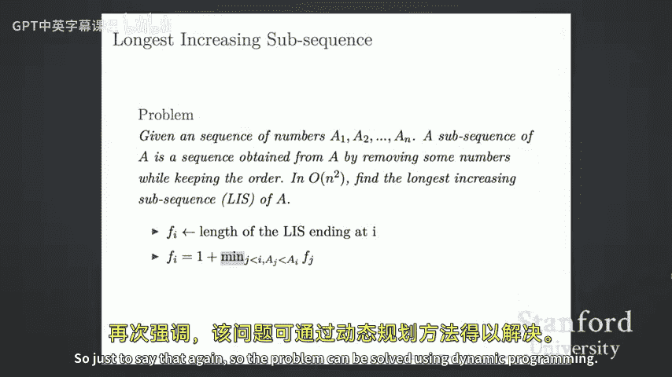

# 014：期中后内容复习与习题讲解 📚

在本节课中，我们将回顾期中考试后所学的核心算法与概念，包括图算法、动态规划等，并通过具体习题来巩固理解。课程结尾会进行总结。

## 图遍历算法 🗺️

上一节我们介绍了课程的整体安排，本节中我们来看看图遍历算法。图遍历是探索图结构的基础，主要有两种方法：深度优先搜索（DFS）和广度优先搜索（BFS）。

以下是两种算法的核心要点：
*   **深度优先搜索 (DFS)**：沿着一条路径深入探索，直到尽头再回溯。
*   **广度优先搜索 (BFS)**：从起点开始，逐层向外探索所有相邻节点。

这两种算法的运行时间均为 **O(m + n)**，其中 `m` 是边数，`n` 是顶点数。通过它们可以解决许多问题，例如检查图的连通性、寻找连通分量、进行拓扑排序（DFS）以及寻找无权图中的最短路径（BFS）。

关于寻找强连通分量，虽然理论上可以通过多次运行 BFS 来尝试，但通常使用基于 DFS 的专门算法（如 Kosaraju 或 Tarjan 算法）更为高效和直接。

## 最短路径算法 🛣️

在能够遍历图之后，我们很自然地想知道图中两点间的最短路径。我们讨论了三种主要的最短路径算法。

以下是三种算法的对比：
*   **Dijkstra 算法**：用于在**边权非负**的图中寻找单源最短路径。它是三者中最快的，但适用条件也最严格。
*   **Bellman-Ford 算法**：用于在**边权可为负**的图中寻找单源最短路径。它还能检测图中是否存在负权环。
*   **Floyd-Warshall 算法**：用于寻找图中**所有顶点对**之间的最短路径。

你需要掌握这些算法的适用场景和大致时间复杂度，具体细节和证明请参考讲义。

## 动态规划 💡

接下来，我们离开图算法，看看另一种强大的算法设计范式——动态规划。动态规划通过解决重叠子问题来高效求解复杂问题。

设计动态规划算法通常遵循以下步骤：
1.  **定义状态**：确定要计算什么，通常用数组（如 1D, 2D, 3D）来表示，并明确每个维度的含义。
2.  **建立递推关系**：找出状态之间的转移方程。
3.  **确定基础情况**：设置最小子问题的解。
4.  **计算顺序**：确定填表的顺序，以确保计算当前状态时，其所依赖的子状态已被计算。

动态规划与分治法思想类似，都是将大问题分解为子问题。区别在于，动态规划的子问题通常大量重叠，因此需要存储子问题的解以避免重复计算。

## 最小生成树算法 🌲

现在让我们回到图论，看看如何寻找连接图中所有顶点的最小代价树，即最小生成树。我们学习了三种算法。

以下是三种算法的简要说明：
*   **Borůvka 算法**：每一轮为每个连通分量选择一条最小边，然后合并分量。
*   **Kruskal 算法**：按边权升序考虑所有边，如果加入当前边不会形成环，则将其加入生成树。其时间复杂度涉及反阿克曼函数，非常高效。
*   **Prim 算法**：从一个顶点开始，不断添加连接当前树与树外顶点的最小边。它类似于 Dijkstra 算法，但维护的是连接到树的边的权重，而非到源点的距离。

## 全局最小割与 Karger 算法 ✂️

我们讨论了一个具体的图分割问题：全局最小割。其目标是将图顶点划分为两个集合，使得连接这两个集合的边的总权重最小。

对于此 NP-Hard 问题，我们学习了一个随机算法——**Karger 算法**。其核心操作是**边收缩**：随机选择一条边，将其两端点合并为一个“超点”，并处理关联的边。重复此过程 `n-2` 次，最后剩余两个超点之间的边数（或权重和）即为一个割的值。

该算法的时间复杂度为 **O(n²)**。关键结论是：在包含 `n` 个顶点的图中，单次随机收缩**不**命中全局最小割中任何一条边的概率至少为 **(n-2)/n**。通过重复运行算法多次并取最佳结果（蒙特卡洛方法），可以高概率找到全局最小割。

## 最大流与最小割 📊

我们讨论了另一种割：**s-t 最小割**。给定源点 `s` 和汇点 `t`，目标是找到一个割，使得 `s` 和 `t` 分属不同集合，且割的容量最小。

与此紧密相关的概念是**最大流**。流是对图中每条边分配一个非负值，满足容量限制和流量守恒（流入等于流出）。**最大流-最小割定理**指出：从 `s` 到 `t` 的**最大流**值等于分离 `s` 和 `t` 的**最小割**容量。

为了计算最大流，我们介绍了 **Ford-Fulkerson 方法**。其思想是：
1.  从零流开始，构造残量图。
2.  在残量图中寻找一条从 `s` 到 `t` 的增广路径。
3.  沿该路径推送尽可能多的流量（路径上最小剩余容量）。
4.  更新残量图（减少正向边容量，增加反向边容量）。
5.  重复步骤2-4，直到无法找到增广路径。

增广路径的选择策略（如最短路径-BFS、最大容量路径）会影响算法运行时间，但核心框架不变。

---
**问题解答与习题讲解环节**
---
（注：此部分为课堂互动内容整理，涉及具体算法实现思路的讨论。）

**问题1：半连通图判定**
给定一个有向图，判断是否对于任意两个顶点 `u` 和 `v`，至少存在一条从 `u` 到 `v` 或从 `v` 到 `u` 的路径。
**思路**：
1.  首先使用 DFS 或 Kosaraju/Tarjan 算法找出所有强连通分量（SCC），并将每个 SCC 收缩为一个超点，得到一个有向无环图（DAG）。
2.  对这个 DAG 进行拓扑排序。
3.  检查拓扑序列中**每一对相邻的超点**之间，是否存在至少一条从前一个超点指向后一个超点的路径（在原DAG中表现为存在有向边）。如果这个条件对所有相邻超点都成立，则原图是半连通的。
4.  理由：在拓扑序中，如果存在一对相邻超点间没有路径相连，则分属这两个超点的原图顶点之间将无法按题目要求互通。反之，若所有相邻超点间都有路径，则利用拓扑序的传递性，可以证明任意两个超点间都有路径，从而原图任意两顶点间至少有一个方向的路径。

**问题2：最长递增子序列 (LIS)**
给定一个整数序列，找到最长的（严格）递增子序列的长度。
**动态规划解法**：
*   **状态定义**：设 `dp[i]` 表示以第 `i` 个元素结尾的最长递增子序列的长度。
*   **递推关系**：`dp[i] = max(dp[j]) + 1`，其中 `0 <= j < i` 且 `nums[j] < nums[i]`。即，查看所有在 `i` 之前且值小于 `nums[i]` 的元素，从它们结尾的 LIS 中选取最长的，然后接上 `nums[i]`。
*   **基础情况**：每个位置的初始 LIS 长度至少为 1（即只包含自身）。
*   **答案**：`max(dp[0...n-1])`。
*   **时间复杂度**：**O(n²)**，因为对每个 `i` 需要遍历其之前的所有 `j`。
*   **优化提示**：存在 **O(n log n)** 的贪心+二分查找算法。维护一个数组 `tails`，其中 `tails[k]` 存储长度为 `k+1` 的所有递增子序列中末尾元素的最小值。该数组是递增的，可以通过二分查找来更新。

---
**总结** 🎯

本节课中我们一起回顾了期中考试后的核心内容：
1.  **图算法**：包括遍历（DFS/BFS）、最短路径（Dijkstra, Bellman-Ford, Floyd-Warshall）、最小生成树（Borůvka, Kruskal, Prim）、全局最小割（Karger）以及最大流/最小割（Ford-Fulkerson）。
2.  **动态规划**：作为一种重要的算法设计范式，其核心在于定义状态、建立递推关系和处理基础情况。
3.  通过两个习题（半连通图判定和最长递增子序列）我们实践了将图论概念（强连通分量、拓扑排序）和动态规划应用于具体问题。

请务必理解这些算法背后的思想、适用条件以及它们之间的联系，这对于应对期末考试至关重要。