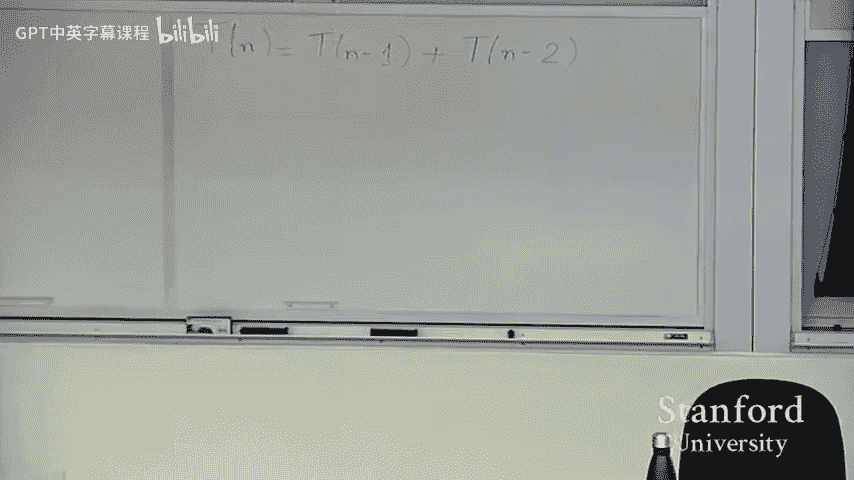
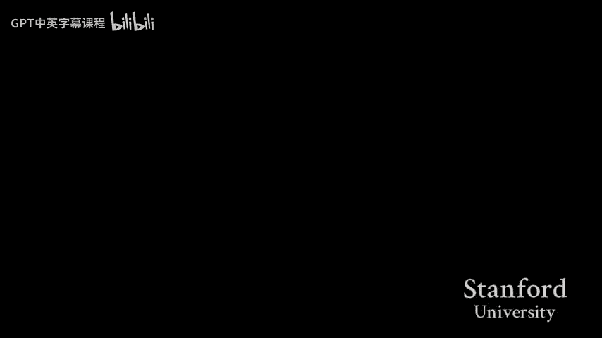

# 015：期中复习课

在本节课中，我们将对CS161课程期中考试所涵盖的核心主题进行一次全面的回顾。我们将快速梳理图论、算法分析、递归、分治、排序、二叉搜索树和哈希表等关键概念，并通过示例帮助你巩固理解。

## 算法分析：渐进符号

上一节我们介绍了课程概述，本节中我们来看看算法分析的基础——渐进符号。这是评估算法效率的核心工具。

我们使用大O、大Ω和大Θ符号来描述函数的增长级别。其定义如下：
*   若存在正常数 **c** 和 **n₀**，使得对所有 **n ≥ n₀**，有 **f(n) ≤ c·g(n)**，则 **f(n) = O(g(n))**。这表示**上界**。
*   若存在正常数 **c** 和 **n₀**，使得对所有 **n ≥ n₀**，有 **f(n) ≥ c·g(n)**，则 **f(n) = Ω(g(n))**。这表示**下界**。
*   若 **f(n) = O(g(n))** 且 **f(n) = Ω(g(n))**，则 **f(n) = Θ(g(n))**。这表示**紧确界**。

在实践中，我们最常用大O符号来表示算法运行时间的上界。以下是一些有用的运算规则：
*   **O(f(n)) + O(g(n)) = O(max(f(n), g(n)))**
*   **O(f(n)) * O(g(n)) = O(f(n) * g(n))**

以下是应用大O符号分析算法复杂度的步骤：
1.  将程序分解为多个独立的代码块。
2.  分析每个代码块的复杂度。
3.  对于嵌套循环，使用乘法规则。
4.  对于顺序执行的代码块，使用加法规则，并保留增长最快的一项。

## 递归求解方法

理解了如何分析线性结构代码后，本节我们来看看当算法复杂度以递归形式表达时该如何求解。主要有三种方法。

### 主定理

主定理是求解特定形式递归式的最直接方法。它适用于形如 **T(n) = aT(n/b) + f(n)** 的递归式，其中 **a ≥ 1, b > 1**。

主定理包含三种情况，你需要记忆或将其写在备忘单上：
1.  若 **f(n) = O(n^(log_b a - ε))**，其中 **ε > 0**，则 **T(n) = Θ(n^(log_b a))**。
2.  若 **f(n) = Θ(n^(log_b a) * log^k n)**，则 **T(n) = Θ(n^(log_b a) * log^(k+1) n)**。
3.  若 **f(n) = Ω(n^(log_b a + ε))**，其中 **ε > 0**，且满足**正则条件** **af(n/b) ≤ cf(n)**（**c < 1**），则 **T(n) = Θ(f(n))**。

**注意**：在情况1和情况3中，**ε** 必须严格大于0。在情况3中，必须验证正则条件。

### 代入法

代入法用于证明一个递归式的解（上界或下界），但它本身不提供猜测解的方法。

使用代入法的步骤如下：
1.  猜测解的形式，例如 **T(n) = O(g(n))**。
2.  使用数学归纳法证明该猜测。关键步骤是假设对于所有小于 **n** 的 **m**，有 **T(m) ≤ c·g(m)** 成立，然后利用递归式证明 **T(n) ≤ c·g(n)**。
3.  在证明过程中，可能需要调整常数 **c** 和起始点 **n₀** 的值以使归纳步骤成立。通常，只要归纳步骤正确，可以选取足够大的 **n₀** 来处理基本情况。

### 递归树法

当递归式是多项式的和时（例如 **T(n) = T(n/3) + T(2n/3) + n**），递归树法非常直观。

使用递归树法的步骤如下：
1.  将递归式展开成一棵树，每个节点代表一次递归调用的成本。
2.  计算每一层所有节点的总成本。
3.  将整棵树所有层的成本相加，通常涉及对等比数列或等差数列求和。

**关于递归式的其他注意事项**：
*   在渐进分析中，可以忽略递归式中的**向下取整（floor）** 和**向上取整（ceiling）** 函数。
*   当递归式中包含如 **O(1)** 或 **O(n³)** 项时，应将其理解为 **≤ c·1** 或 **≤ c·n³**，不能直接替换为 **1** 或 **n³**，但常数 **c** 通常不影响最终的渐进复杂度。

## 分治算法

分治是一种重要的算法设计范式，它将一个大问题分解成若干个相似的子问题，递归解决子问题，再合并结果得到原问题的解。

分治算法的核心步骤是：
1.  **分解**：将原问题划分为多个子问题。
2.  **解决**：递归地求解各个子问题。若子问题足够小，则直接求解。
3.  **合并**：将子问题的解合并成原问题的解。

许多经典算法都采用了分治策略，例如归并排序和快速排序。分治算法的时间复杂度通常可以用递归式来描述，这又回到了我们上一节讨论的递归求解方法。

## 排序算法

排序是分治思想的典型应用。我们重点讨论两种重要的排序算法。

### 归并排序

归并排序是分治算法的典范。其步骤如下：
1.  **分解**：将待排序数组平分为两半。
2.  **解决**：递归地对左右两半分别进行归并排序。
3.  **合并**：将两个已排序的数组合并成一个有序数组。合并操作使用双指针法，在线性时间内完成。

归并排序的递归式为 **T(n) = 2T(n/2) + Θ(n)**。根据主定理，其时间复杂度为 **Θ(n log n)**。这是一个**最坏情况**下的保证。

### 快速排序

快速排序同样采用分治思想，但策略不同：
1.  **分解**：选择一个**基准**元素，将数组划分为两部分：小于基准的元素和大于基准的元素。
2.  **解决**：递归地对两个子数组进行快速排序。
3.  **合并**：由于基准元素已在正确位置，且子数组已排序，因此无需合并操作。

快速排序的性能高度依赖于基准的选择。最坏情况下（例如总是选择最大或最小元素），时间复杂度为 **O(n²)**。但若随机选择基准，**期望**运行时间为 **O(n log n)**。

### 决策树与排序下界

决策树是一种模型，用于表示基于比较的排序算法的执行过程。树的每个内部节点代表一次元素比较，每条路径代表一种可能的比较序列，每个叶子节点代表一种可能的排序结果。

对于一个有 **n** 个元素的数组，共有 **n!** 种可能的排列。因此，对应的决策树至少要有 **n!** 个叶子。一棵高度为 **h** 的二叉树最多有 **2^h** 个叶子。由此可得：**2^h ≥ n!**。利用斯特林公式 **n! ≈ √(2πn)(n/e)^n** 近似，可以推导出 **h = Ω(n log n)**。这证明了任何基于比较的排序算法，其最坏情况运行时间的下界是 **Ω(n log n)**。

## 顺序统计量

顺序统计量问题是指在包含 **n** 个元素的集合中寻找第 **k** 小（或第 **k** 大）的元素。一个经典的最坏情况线性时间算法（BFPRT算法）也使用了分治思想。

算法步骤如下：
1.  将 **n** 个元素划分为 **⌊n/5⌋** 组，每组5个元素（剩余不足5个的为一组）。
2.  找出每组的中位数，构成一个中位数集合。
3.  递归地调用本算法，找出中位数集合的**中位数**，作为基准 **x**。
4.  利用基准 **x** 将原数组划分为三部分：小于 **x**、等于 **x**、大于 **x**。
5.  判断第 **k** 小的元素落在哪个部分，并在相应的部分中递归查找。

该算法的关键在于基准的选择保证了每次递归调用至少能减少一定比例的元素。其递归式约为 **T(n) ≤ T(n/5) + T(7n/10) + O(n)**，可以证明其解为 **T(n) = O(n)**。

## 二叉搜索树

二叉搜索树是一种用于维护动态集合的数据结构，它支持高效的搜索、插入和删除操作。

**性质**：对于树中任意节点，其左子树中所有节点的值都小于该节点的值，其右子树中所有节点的值都大于该节点的值。

**基本操作**：
*   **搜索**：从根开始，若目标值等于当前节点值则找到；若小于则进入左子树；若大于则进入右子树。时间复杂度为 **O(h)**，**h** 为树高。
*   **插入**：先执行搜索，在搜索终止的位置（空节点）创建新节点插入。时间复杂度为 **O(h)**。
*   **删除**：找到目标节点后，分三种情况处理：
    1.  无子节点：直接删除。
    2.  有一个子节点：用其子节点替代它。
    3.  有两个子节点：找到其**后继**节点（右子树中的最小节点），用后继节点的值替换当前节点值，然后递归删除后继节点。时间复杂度为 **O(h)**。

**旋转操作**：旋转是维护BST平衡（如AVL树、红黑树）的基础操作，用于局部调整树的结构而不破坏BST性质。
*   **左旋**：围绕一个节点向右子方向“旋转”，使其右子节点成为新的子树根。
*   **右旋**：围绕一个节点向左子方向“旋转”，使其左子节点成为新的子树根。
旋转操作通过重新链接几个指针完成，保持了子树的中序遍历顺序不变。

## 哈希表

哈希表是一种通过哈希函数将键映射到表中位置来实现高效查找的数据结构。它主要需要解决**哈希冲突**（多个键映射到同一位置）的问题。

### 链地址法

在链地址法中，哈希表的每个槽位都指向一个链表。当发生冲突时，新元素被添加到对应槽位的链表中。

**性能分析**：定义装载因子 **α = n / m**，其中 **n** 是元素数量，**m** 是槽位数量。在简单均匀哈希的假设下，一次不成功查找的期望时间复杂度为 **O(1 + α)**。插入和成功查找的期望时间也是 **O(1 + α)**。当 **α = O(1)** 时，所有操作都是 **O(1)** 期望时间。

### 开放地址法

在开放地址法中，所有元素都直接存放在哈希表数组里。当发生冲突时，会按照一个预定的**探查序列**寻找下一个空闲槽位。

两种常见的探查序列生成方式：
1.  **线性探查**：第 **i** 次探查的位置为 **h(k, i) = (h'(k) + i) mod m**。
2.  **双重哈希**：使用两个哈希函数，第 **i** 次探查的位置为 **h(k, i) = (h₁(k) + i·h₂(k)) mod m**。

**性能分析**：在开放地址法中，装载因子 **α** 必须小于1。在均匀哈希假设下，一次不成功查找的期望探查次数约为 **1/(1 - α)**。当 **α** 接近1时，性能会急剧下降。

## 总结

本节课中我们一起学习了CS161期中考试的核心主题。我们从算法分析的渐进符号开始，深入探讨了求解递归式的主定理、代入法和递归树法。接着，我们回顾了分治算法的设计范式，并分析了归并排序和快速排序这两种经典排序算法及其理论下界。我们还了解了在线性时间内寻找顺序统计量的算法，以及二叉搜索树的基本操作、旋转和哈希表的两种冲突解决策略及其性能分析。希望这次复习能帮助你巩固知识，为考试做好充分准备。