# P1：Lecture 1 Introduction - ___main___ - BV1ED4y1R7RJ

 All right。 Welcome to CS110。 I'm Chris Gregg teaching CS110 this quarter。 Welcome。 The。

 room we actually we were going to be in the nice spaces from next door but。

 turns out 106 AS gigantic as you might imagine。 So we're kind of in here。 The。

 bad news is every single one of you is going to be coming to every single。

 lecture so all the seats will be taken I'm sure。 We'll talk more about if you。

 decide not to attend lecture what what that means and as we go along。 CS110。

 principles of computer systems I assume at this point you have gone through either。

 CS106A or some AP class CS106B and CS107。 If you haven't gone through those。

 that series of courses welcome to everybody come on you can find a seat I'm。

 sure there's some seats in the middle you can I'm sure you can find some if you。

 haven't taken that sequence especially CS106B and CS107 this class is going to be。

 challenging now the class is challenging in general as you can imagine but it's。

 kind of in some sense you do we will do a lot of things in here that you have seen。

 in one of six be because you're going to be building big programs that mean you。

 have to use a bunch of the data structures you've used in CS106B and a lot。

 of the classes in C++ so you have to remember that sort of thing and then CS107。

 the systems these stuff well this is also a systems class and so you need to know。

 what pointers are you need to know what void stars are not too too much but you。

 need to understand those need to understand what structs are and and all。

 those things so we'll do like one minute of assembly code but that's it so you。

 have passed that that barrier from 107 and that's that so what is this class。

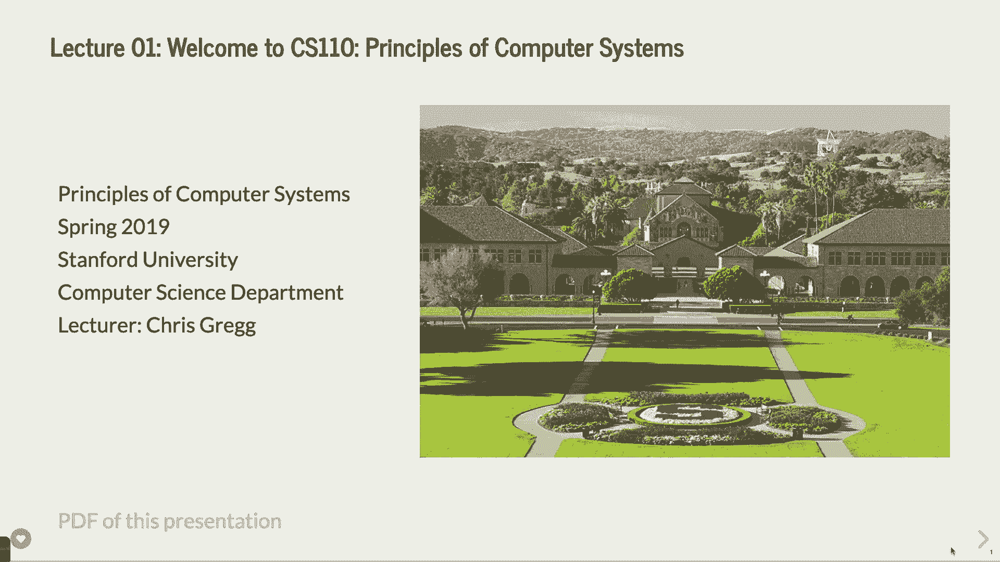

 all about there are actually five main topics and the odds are very good that you。

 have not seen any of those topics before in great detail you may have kind of。

 seen some of them and if you've done some programming on your own you may have。

 seen some of them which is basically five main things the first thing we're。

 gonna cover and I'll go over some more in detail in a few minutes as well but。

 here's the big thing Unix file system so you know a little bit about files and。

 you've used Unix if you've done if you've logged into myth from CS107 etc。

 but we're gonna talk about how the actual file system itself is built like what。

 does it mean to be a file system how do you actually take keep track of where。

 the various bytes are in a file and how do you keep track of the file names and。

 how you look up file names and all that sort of stuff so that's kind of the first。

 big topic and you'll have an assignment on that then we go into this thing called。

 multi-processing okay on your computer you guys know that you can be browsing the。

 internet at the same time they can be printing a document at the same time that。

 you can be downloading a file at the same time etc etc etc this all happens。

 because your computers are running multiple programs at exactly the same。

 time okay even if you only have one processor on your computer the operating。

 system is smart enough to say hey I've got two programs or twenty programs。

 running I'm going to time slice them and give a little bit of this program some。

 time to do its thing and then a little bit of this program etc etc and and。

 as it does that you it seems to the user more or less that all these things are。

 actually happening at the same time now if your computer does have multiple。

 processors or multiple cores things can literally happen at the same time so。

 we're going to write we are going to write a bunch of programs that utilizes。

 this we're going to write a program that does what we call forking and sets off。

 another process at the exact same time as the first process and they go at the。

 same time okay the tricky part of this is debugging it you guys think you're。

 great at debugging what wait till you have two or twenty things to going at the。

 same time trying to debug it's a little bit trickier so we have to talk about。

 those sorts of things that's the next thing the third thing which is kind of。

 part of multi-processing is signal handling it turns out that if you have。

 multiple processes going at the same time on your computer you might want to。

 talk you might want them to talk to each other okay turns out when you do this。

 thing called for which we'll talk about again later you actually get a parent。

 process and then a child process and if you want to talk between them or if the。

 parent wants to know when the child has finished well signals get set so those。

 are the things we're going to talk about there all right then we're going to go。

 and we're going to shift into this thing called multi-threading which is a very。

 similar sort of topic but it involves these things called threads which means。

 one program is now running well one process is now running multiple things。

 at once very similar but handled in a much different way so we're going to。

 transition to that and then finally we're going to go into talking a little。

 about networks so we're going to build some servers and we're going to build。

 some clients and we're going to have them talk to each other on different。

 machines and through the internet and so forth and that's going to be the kind。

 of a culminating part of the course so those are the big topics now what are。

 all those topics all about well most of them happen to do with have to do with。

 operating system sort of things so 110 a lot of times is considered like。

 operating systems late and it's kind of an introduction to operating systems if。

 you do want to take operating systems you can take CS 140 and and go take an。

 actual operating systems class but we're going to talk about all these things that。

 the operating system has to help you do in this course okay there are eight。

 assignments there will be eight assignments roughly one a week a little bit more。

 than one a week in the midterm we're extending the assignment a little bit。

 little longer so you have time to study etc。 The you can look at what what all。

 those are but they're basically assignments that test all the things we。

 talk about obviously and there's a couple multi processing ones and a couple。

 threading ones and and so forth and then there's a culminating project called。

 MapReduce which is a which has threading and processes and networking is all kind。

 of tied into one and it's kind of a cool data set last assignment all right so。

 that's kind of the overview of the course who am I I've seen I see some friendly。

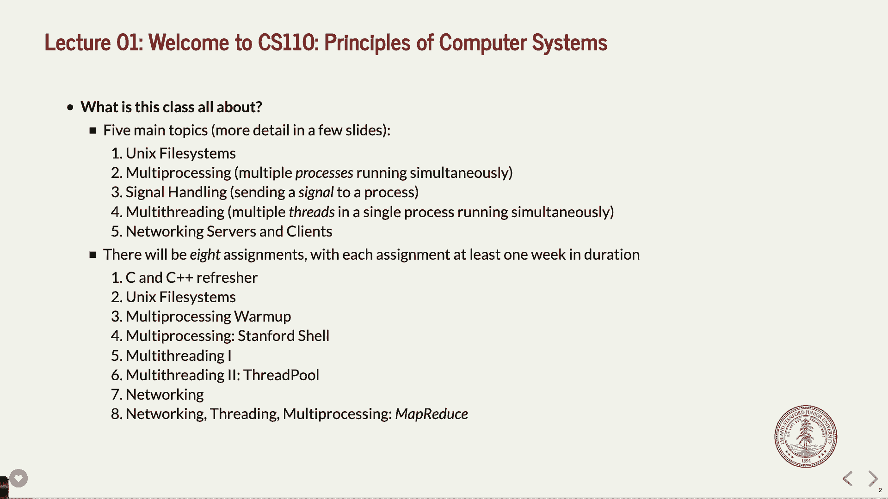

 faces out there that I've seen all of you are friendly I hope I've seen some。

 people I know before but if you haven't had me for a class before I am my。

 original bachelor's degree was in electrical engineering at Johns Hopkins。

 then I decided I actually went to the Navy right after that and then decided to。

 go into teaching so I went and got a master's degree in education and then。

 decided a little bit later on that I still had some GI Bill which is the Navy's。

 or the military's kind of money for college that they let people use and I。

 still had some of that so I decided to go get a PhD in computer engineering and。

 thinking that I still wanted to teach and so that kind of led me to Tufts。

 University in Massachusetts and then out here I've been here for three years。

 I'm technically a junior now so some of you guys are more have been here longer。

 than me and that's that so I've lectured a whole bunch of classes this is why I。

 recognize some of you is because I've lectured 106 B 106 X 107 107 E 208 E。

 which is a great ideas in computer science I'm gonna do it again next year。

 and it's a fun course and it's very generally very small and we talk about。

 all these big ideas in computer science over the years kind of like a history。

 class that was fun and then now CS 110 the as far as teaching CS 110 my first。

 quarter was last quarter normally Jerry Kane teaches this course he's actually。

 not here this quarter and I kind of wanted to roll into 110 so I co-taught it。

 with Jerry last quarter the class is ostensibly his class and he put most。

 of it together we are not going to change too much okay I'm a very different。

 lecturer than Jerry but the material is all the same so except for a couple minor。

 tweaks here and and there so I'm going to keep it mostly mostly the same a little。

 bit more about me I love to tinker you haven't seen my typewriter project my。

 musical typewriter project you can just look it up Chris Greg typewriter on the。

 internet you can find it and then or you can come by my office and actually see。

 it in real life I love kind of doing you know everything from soldering to our。

 doinos to raspberry pie stuff so you have any projects you're working on in that。

 feel free to stop by and chat with me about that all right okay so who else。

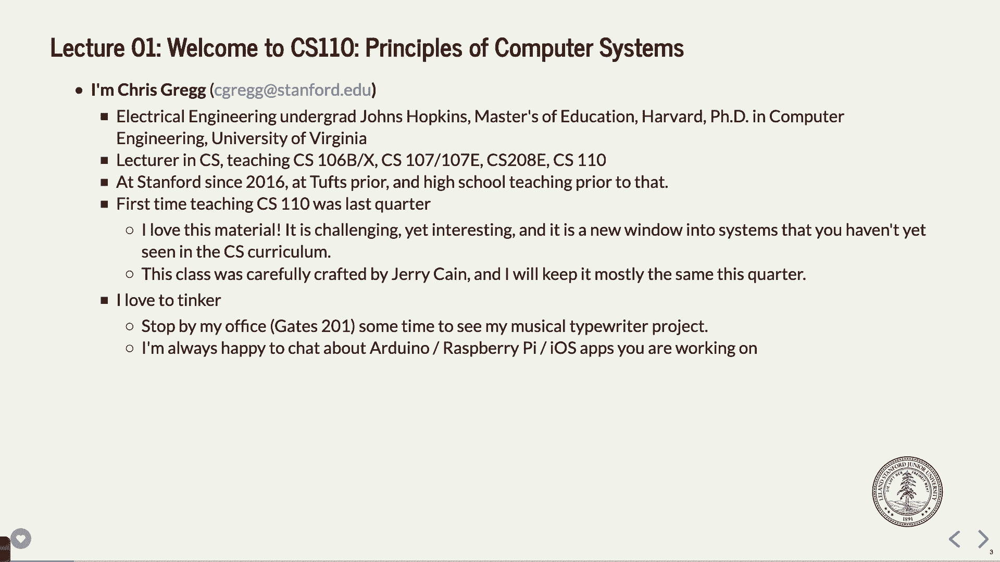

 is going to be involved in this class well as of noon today there's 209。

 students enrolled it's not a huge huge class but it's still relatively big what。

 do you need to know for the class well we're gonna be primarily programming in。

 a combination of C and C++ most of the projects are actually going to be C++。

 reason for that is it's much easier to use C++ strings we've got all these。

 cool things like maps and and sets and things that you can use by the way we。

 will be using the standard template library not the Stanford library so for。

 instance if you want to use a if you want to use a cue you do if you want to。

 get the front value off the cue you do pop underscore front and that pops the。

 value off but it doesn't give it back to you if you just do front it gives it。

 back to you so there's a couple nuances that you have to learn most of those。

 things will come relatively naturally it will not take long to to learn that。

 there's a few few things about using maps that are a little tricky I will do my。

 best to kind of preview you on any new C++ things that you might not have seen。

 in CS 110 for instance there's these things called closures which we're gonna。

 have for the first assignment and then through most of the other assignments and。

 you have to learn how to use those and I'm gonna explain how to use those so don't。

 don't worry too too much about that we do write pretty complex programs in this。

 class what does that mean well it means you're going to have a large code base。

 that you are going to have to build part of and you kind of did this a little bit。

 for CS 110 and maybe a little for CS 107 this is kind of even more so people。

 always go and they look at the first assignment they go the assignments like。

 15 pages long or whatever right and and the number of files you get is like 22。

 files and half of them are header files and whatever you really need to be able。

 to comprehend those things before you even start writing any code so I'll try to。

 what will the first assignment is a good example of hey there's a bunch of code。

 here you have to figure out where to put your pieces and that's sometimes one of。

 the harder parts about the course itself you should be able to trace memory。

 diagrams and you should understand memory if you took CS 107 I'm confident you。

 understand enough about memory to do just find this class you should also。

 understand Unix and Linux and the terminal and so forth GCC and Valgrind if。

 you took CS 107E for instance you probably have no idea what I mean when I。

 say Valgrind it's just a program you run that tells you when your programs leaking。

 memory or you haven't closed files etc not very hard to use and then make and。

 so forth you won't have to write any make files but you might want to modify。

 them so not a bad idea to to do that there are 10 CAs this is roughly the same。

 proportion of CAs as you would have seen in 107 that means that there's 200 of。

 you and there's 10 CAs well it means that there's possibly longer lines than you。

 might hope for in ops hours that's the way it goes the one thing about office。

 hours and I think this is covered on other slide too is the difference in 110。

 versus 107 is the CAs are not going to look at your code so you bring a bug to。

 the to off-side you go I got this bug and they go great tell me about your。

 bug what's going on what did you do here what do you do there they're not。

 gonna sit down and try to help you find the bug you guys are believe it or not。

 you're good enough programmers now you can probably track down where your bug。

 is right it is harder when you get into multi-threading and multi-processing。

 things but by this point your you are fairly advanced and we expect you to do。

 that and it does make off-sours go smoother I mean if you unfortunately。

 some of the assignments are very they're not open-ended so much as we say write。

 this function and you just kind of go and write it and your decisions might be。

 very different than your neighbors decisions and it would be impossible for。

 the CAs to sit down and try to figure out what the differences are in the 10。

 minutes they might be able to give to you so so that's that for what it's worth。

 most people think it's a it works pretty well like you you'd be surprised at how。

 talking through what you think should be happening in your program translates。

 into you being able to fix your own bugs surprise you're not more or six be。

 anymore one or seven where you can you know you can rely on the TAs and CAs to。

 do that okay the CAs are also going to hold lab sections I'll talk about labs。

 in a few minutes so for what it's worth the class is held Monday Wednesday 1 32。

 2 50 and then Fridays are most of the labs during the same timeframe there are。

 also some labs on Thursdays so you'll be able to sign up for those I'll talk。

 more about labs in a minute labs are just they're they're not sitting out of。

 computer all they should bring your laptop but it's run by a CA and they。

 people like those two because you get a little bit more small kind of feel for。

 the teaching all right what questions you have so far thing we'll get to more。

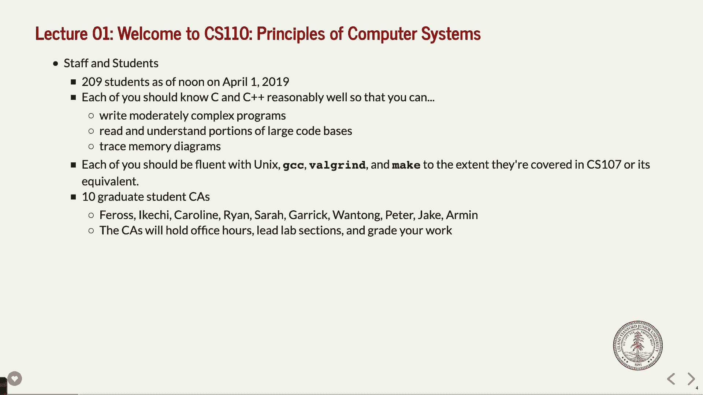

 logistics I promise not to all logistics we're gonna get into some real stuff。

 today - of course website CS 110。stanford。edu as you might imagine the。

 website is not you know super detailed with stuff it's got the lectures on it。

 it's got the lecture slides it's got the handouts it's got discussion section。

 information and the links and so forth that's about it's got a calendar which。

 lists all of the list right now lists when all the assignments are going to be。

 given out the due dates are kind of still to be a little bit determined as well。

 we also have a Piazza as you can imagine Piazza gets pretty busy because lots。

 we love lots of questions and keep up to that keep up to date on that and you'll。

 be in pretty good shape and then we'll also have a slack channel just in case。

 you want to check I'm not having the CAs go to the slack channel I'll keep my。

 eye on it if you have specific questions but it's more for you guys to chat。

 amongst yourselves if you want questions and things generally go to Piazza as you。

 can imagine but if you have something you want to chat about then slacks a better。

 better place for that I have some off-sours you can find out when those are if。

 you can't make my off-sours and you really want to chat with me directly。

 shoot me an email and we'll find a time to meet CAs of course we'll have their own。

 off-sours and we will probably start them this week but they will be official as。

 of next like the the weekend because your first assignment is coming out on。

 Wednesday okay as I said CAs don't look at your code during off-sours neither。

 will I for it is worth now if you've got something you don't understand of error。

 message certainly we'll look you thought like we're like no that can't you see。

 your screen right we're gonna be able to see like they can help you at least get。

 figure out what error messages are and so forth and if you haven't done much C++。

 programming you'll know that error messages in C++ are ridiculous so that。

 does take a little bit of time to get your head wrapped around okay there's two。

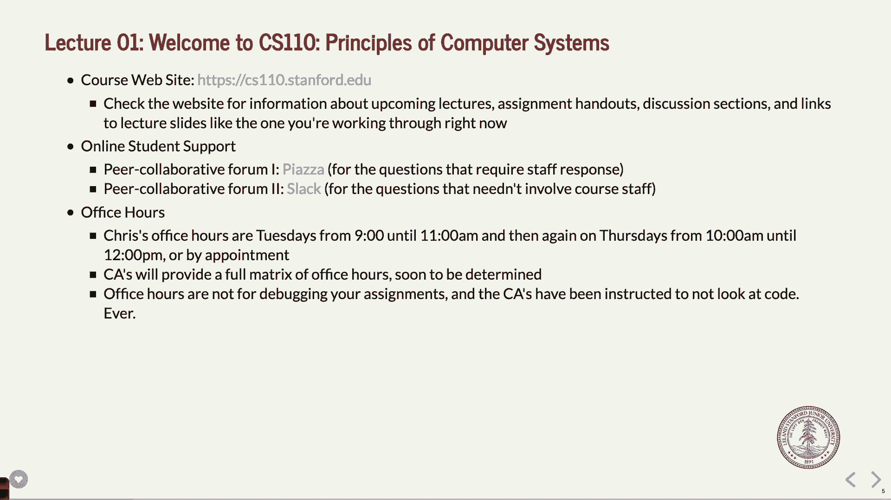

 textbooks for the course the textbook that you may have used for 107 the bright。

 and a Halloran Halloran Halloran if you're gonna pronounce his name textbook is。

 the same one there is actually a custom version just for 110 which has you know。

 the six or eight chapters we're gonna cover in 110 if you want to buy that or。

 if you bought the whole book last time continue to use it it doesn't really。

 matter so much if you haven't a slightly older version it's basically for you to。

 read I'm not assigning anything from the book and most of the things haven't。

 changed and it's not like 107 where the older versions were in 32-bit。

 architecture and now we're talking about 64-bit architecture we really don't get。

 into those details in this class so still fine question yeah all right there's。

 another textbook which will primarily be for the first couple of weeks on file。

 systems that talks about file systems it's it's called principles of computer。

 system design and if you want to do well on assignment to read the book because。

 it has all the details for the for the the way the an old Unix file system was。

 built so when we get to that you'll see those reading assignments come up you。

 can buy it it's also available free online okay all right lecture example so。

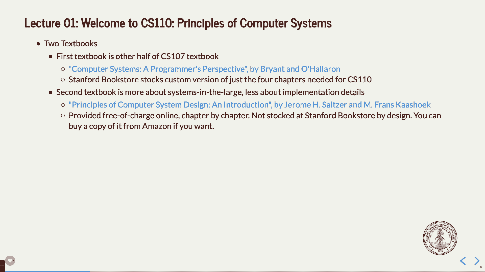

 this class is I'm gonna have slides but I'm also gonna do lots of coding kind of。

 live or kind of from my notes etc where you're gonna see lots of code put up and。

 run in real life and the code examples if you want to either follow along or。

 look at them yourself you can get them by you can get them online I generally have。

 links on the slides or you can actually clone the entire repository of all the。

 examples I would really suggest looking at those examples and understanding how。

 they work especially if they fly by and lecture and you're right and don't really。

 know what that is go down and look at them line-by-line test some things try。

 it out yourself and that's a good way to get yourself up to speed on those。

 assignments or those those code examples okay everything we do is gonna be done in。

 the myth machines if you need to you could do it on cardinal I believe to but。

 the machines that we'll use for class are myth the myth machines if for some。

 reason you're going out of town you're gonna be on an airplane and don't have。

 internet access we can figure out how to get most things working on your laptop。

 itself especially if you have a Mac but you can also get a you can also put a。

 Linux machine VM on your computer and that will work too so we can we can get。

 that work but most all the assignments just like 107 are going to be on the。

 machines okay all right what else the slide so I'm gonna try to make the slides。

 as comprehensive as possible I think putting sometimes you'll the complaints。

 I sometimes get there's too many words and the slides too much stuff on the。

 slides I'll try not to focus on like the stuff and I certainly will try not to。

 read like whole slides and so forth but you can use them a little bit for a。

 reference as well so it's not a not a bad idea to to do that they're not a。

 substitute for attending lecture because we do go off script and you'll ask lots。

 of good questions and that will get those we're gonna answer and we'll try。

 things and so forth that aren't gonna be reflective in the slides and and anything。

 we talk about in class really is going to be covered on the midterms and short。

 answer questions and so forth I mean it's way off topic it won't be of course but。

 you should be responsible for that now while I'm thinking about it as far as。

 the class itself being videotaped it is not being videotaped wearing a microphone。

 and looks like it's being videotaped it's not I will generally put together a。

 screencast which means it's just gonna be what you see on the board and me talking。

 you won't see me at all and some people like to rely on those if you do rely on。

 those just know that sometimes my computer breaks or I forget to do the。

 screencast or whatever don't blame me if you don't want to come to class don't。

 blame me but but I would do my best to try to have the resources available I do。

 that not so that you can miss class and timeshift the lectures but more so that。

 if you need to go back and look at something from lecture it's a good idea。

 to do that that's why I do it some people time shift it and I'm not gonna。

 complain about it but it's nice to see yours my own faces here regardless okay。

 well questions so far it's lots of logistics so far okay I talked I talked。

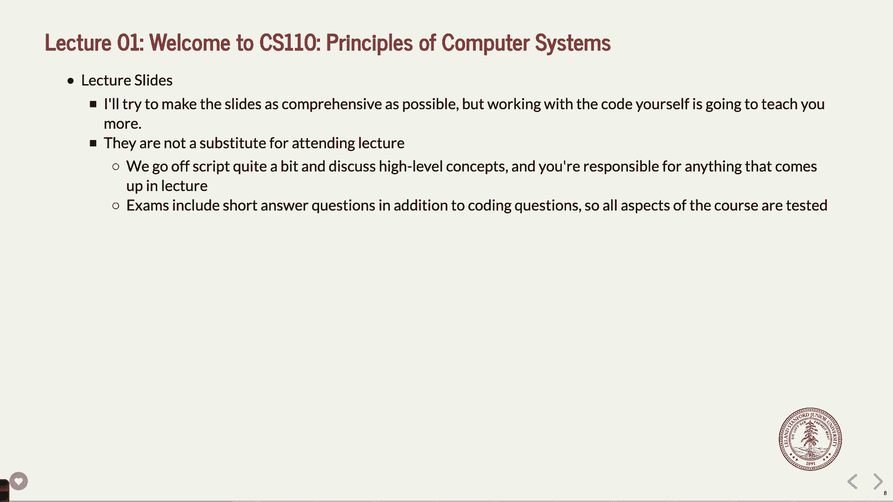

 most about this mostly about these things already the the and this kind of。

 goes over some of the syllabus again and you can get the the syllabus online and。

 I've already put these some of the details on the calendar as well but as I said。

 the first thing we're gonna talk about starting today is Linux file systems and。

 how file systems actually work and some of the different system calls that we。

 will use and by the way that word system call is something that you may not have。

 heard before it's basically a function that ends up getting run by the kernel。

 which is run by the operating system so you've got your program doing its thing。

 and then it does a system call which looks just like a function call into the。

 kernel and the kernel does all the stuff that that touches the system like files。

 and networking and and so forth and that's so that you don't have access。

 directly in your own programs and it's a security feature of the of the operating。

 system okay so we'll do that we'll talk about naming and layering and we'll talk。

 about we'll talk about these things called iNodes which are the the way that。

 computer keeps track of your files lo and behold computers actually put a。

 number associated with all your files go figure all right of course it does。

 right because computers like numbers better than words so that's there's this。

 thing called an iNodes which kind of distinguishes your file from some other。

 one and it's just a number as it turns out we'll talk about that then as I said。

 we'll go into multi processing and we'll do these things called forking which is。

 branching of your program as it almost sounds like and then there's you have to。

 be able to coordinate those things so we'll use things like weight PID and。

 executive CVP which means which basically means take your take another。

 program and start running it immediately that's already that's on your system。

 it's a cool way to run external programs while your program is doing things one。

 of the assignments for that is called Stanford Shell which is basically what。

 your shell is doing I mean if we go over here and we say LS right well there's a。

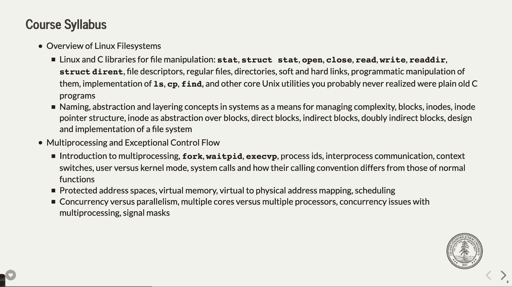

 program running the shell which is what the which is what you're typing right and。

 then when I take LS that's another program and your shell says to the。

 operating system hey run that LS program and then come back to me and go from。

 there so that's what's happening when you type LS it's a multi processing endeavor。

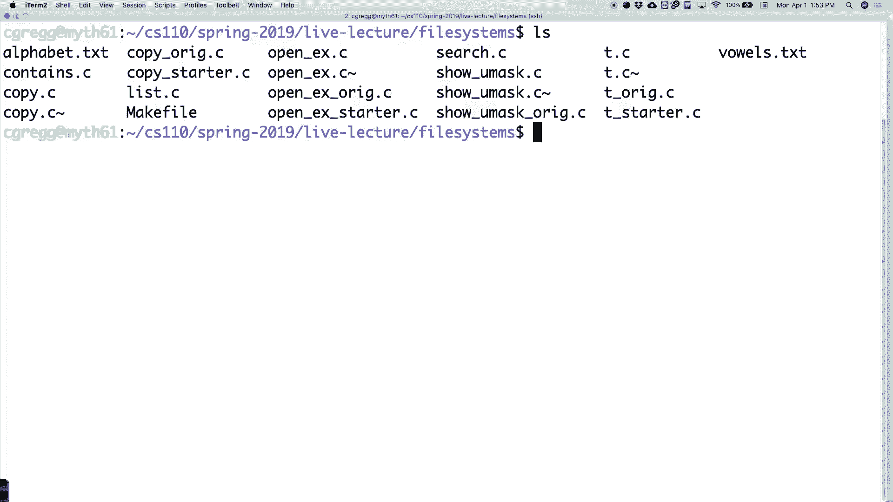

 right there okay all right we are going to also talk about protected address。

 spaces and a little bit about virtual memory you know how you you know on the。

 let's see if I can do this you know how on you know how on in your like CS 107 we。

 drew all these memory diagrams and we said that well it's not gonna look。

 very good here other time here do these memory diagrams and like here's the heap。

 and here's the stack and like or around sorry the stack grows down stacks up here。

 and then the heaps down here I'm doing it backwards depends on which class you。

 teach about how you draw those anyway stack goes down heat goes up and and this。

 like starts to some value in this okay it's all along for what it's worth it。

 turns out that every program thinks it has access to the entire memory system。

 and it's all faked out by that right the entire program like the your program says。

 oh I have access to all the memory well really whenever it accesses memory the。

 operating system gets in a way the way and says okay you're actually looking at。

 over here but you think you're looking at this part of memory and it's it's a。

 it's kind of a neat way to to virtualize things and we call it virtual memory。

 because of that and it the reason we do that is so that it simplifies your。

 program it's not like your program needs to know oh I'm shoehorned into this little。

 part of memory here I get the entire system well we'll make it look like you。

 have the entire system and we'll take care of the the handshaking that makes。

 makes it go back to to the original or to make it look like you know what you're。

 doing and actually stores things where it really is we'll get into the details of。

 that that's all part of multi processing exceptional control flow etc。 okay we'll。

 also talk a little about concurrency versus parallelism concurrency is this。

 idea that two or more things are happening at the same time parallelism is。

 the idea that you've got a big problem that you're breaking into chunks and。

 solving at the same time so there's there's a little bit of a difference。

 there in like idea and abstraction we'll get to those things and we'll also talk。

 about how to send signals between different programs okay then I said we're。

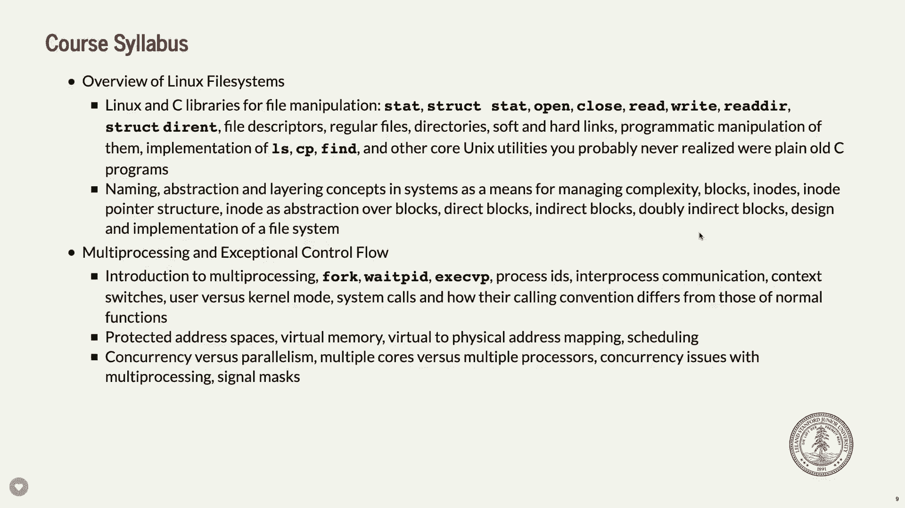

 gonna talk about threading which is another concurrency kind of idea and this。

 is where you can actually emulate many real world things using this threading。

 idea where you basically say hey I've got a whole bunch of tasks to do and they。

 might communicate between each other I'm gonna set part of my program off doing。

 these things independently of everything else until it receives a message to go。

 do like work with something else so they're happening kind of all at the same。

 time and it models some nice problems for us so we will we'll do that we also。

 have to talk about this idea that if you have two things both trying to access a。

 data structure at the same time let's say they both are trying to add things to a。

 set or read from a set or so forth if they're trying to do that at the same。

 time and we only have one copy of the set guess what we're gonna run into。

 problems unless we say hey you go first and then you go first or then you go。

 second right and one one after the other and we may not be able to order those。

 necessarily that's the other thing about this class there's a lot of non-deterministic。

 things that are gonna happen in your programs okay and I don't mean things that。

 are just bugs I mean like you have things that when you run it two times in a row。

 and it's perfectly written it will produce two different outputs because it。

 just happens that the operating system grabbed this part of the program first。

 before this one and it did in a slightly different order so those sorts of things。

 are we'll have to contend with those as we go through the as we go through the。

 course okay but anyway point is that when you're trying to access that one。

 data structure with two different threads you need to do what we call locking。

 where you basically say I'm going to access it now anybody else has to wait。

 and then the next and then the next thread can can go and do it so we will。

 get into those details it's kind of fun when it works and it is a little。

 challenging to get it right but it is fun when it works okay all right and then。

 we're gonna talk about there's some differences between the way threads。

 working C and C++ most of the stuff we do will be in C++ but we'll see the。

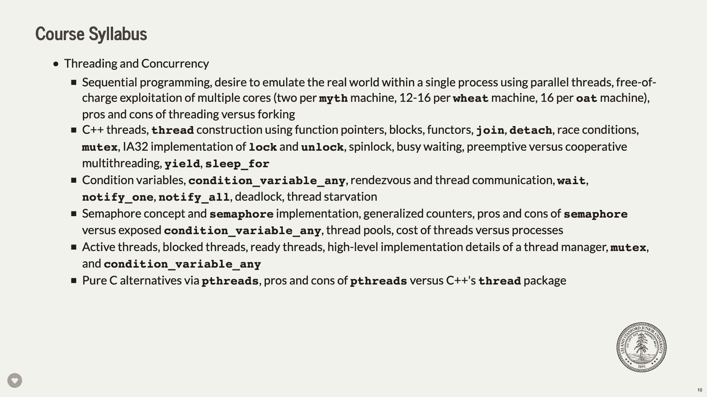

 differences okay all right then finally as I said we're gonna do networking and。

 networking is as you might expect it's two computers talking to each other or or。

 a computer talking to itself through this thing called a port and this this。

 involves IP addresses which is how the internet determines what computer your。

 computer is if you type myth。stanford。edu it goes to a particular bank of。

 computers and that's over the network of course I will write some very trivial。

 web pages that will actually be accessing to so that you can test some of your。

 programs with your browser and we'll go into that and we'll also go into some of。

 the details of HTTP which is the protocol used on the internet to send。

 and receive data like it has to be two computers when they're talking to each。

 other had better agree on what language they're using and what protocol they're。

 using otherwise they'd never be able to talk and HTTP happens to be the way the。

 way that works okay and then finally as I said we're gonna end up doing this。

 program called MapReduce which is an idea of taking a problem breaking it into。

 many parts having lots of different computers work on all those parts and。

 then collecting the data back again for a final answer so that's that's the the。

 final thing and then the last thing we'll talk about for the last couple days of。

 class there's not an actual assignment on it is what we call non-blocking I/O and。

 by blocking we mean we're gonna see an example of blocking later today by。

 blocking we mean the program when you're asking for data we'll wait for that。

 data to arrive and that's called blocking otherwise we can have it asked for。

 data and then keep going if the data doesn't it hasn't available yet and then。

 comes back later and checks again so that's the last thing we're gonna do okay。

 so that's the big thing like I said most of the stuff in this class is all about。

 like operating systems sort of thing so you're gonna we're gonna get into some。

 of the details of what the operating system is actually doing for you in。

 particular the Linux operating system but guess what the Mac governing system。

 and the Windows operating system and the Raspberry Pi's operating system all。

 that are really the same sort of thing they're they're all doing the same have。

 the same sort of features because some people decided a while ago hey those are。

 cool features that we'd like to have that's the other thing by the way in this。

 class we'll talk about a lot of things and you'll say to yourself huh that seems。

 really specific like doing this this way seems like a really specific way of。

 doing it and you're absolutely right it was some people some very clever people。

 in my opinion who made decisions to do something this way there are many many。

 other ways to do it we're gonna look at a file system for our second assignment。

 and you're gonna have to know all the nuances of how that file system works。

 and all these things about block numbers and I know numbers and how to how to。

 access and how much data is stored and so forth that wasn't the only way to do。

 this in fact newer operating systems have different file systems and your。

 Mac is in file system and Windows is a different file system it's just one way。

 of doing it and we want you to appreciate that aspect of it not。

 necessarily to say oh my gosh this is the one way to do it and I better。

 memorize this exact way of doing it I mean you do have to know it but you you。

 don't have to specifically think oh that's the only way of doing it please。

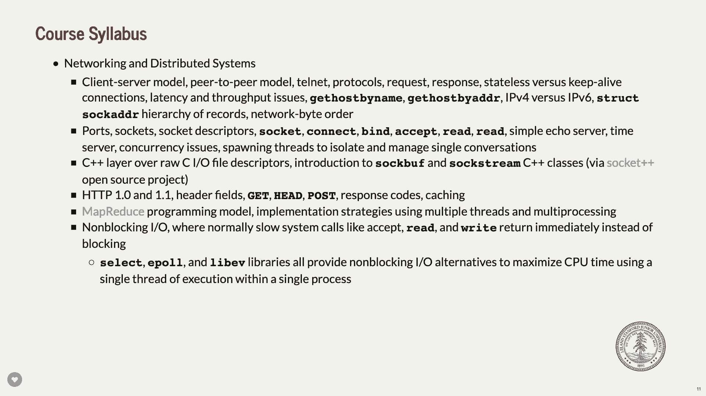

 don't think that okay all right a little bit more logistics here programming。

 assignments 40% of your grade they're the most important part all at once is。

 there's eight assignments as I said some of the assignments are like one file do。

 your thing and you're done like the first assignment I think you have to write。

 basically code in one file most of the programming assignments you have to write。

 in a few different files you generally don't have to write like 20 different。

 files were things but there's key things in each file as I said a few minutes ago。

 there are lots of files involved in these in these programs we want to give you。

 programming assignments that are both challenging and interesting and to do。

 that a lot of times we have to have a lot of back-end kind of things to make it。

 kind of work and then you do that kind of the meat of it and that's why there's。

 lots of different types of header files and things really really really when you're。

 going and reading your through your assignment just spent an hour or two。

 looking through the header files going oh that's that and that's what this is oh。

 I better remember this because you'll use it later and you'll and that will help。

 you kind of trigger your memory that oh that's what I can go use you wouldn't be。

 you'd be surprised at how many questions on Piazza are all about oh how do I do。

 this and somebody's looking this header files right there and that are files。

 have a lot of comments in them too so that's my comment on that the late policy。

 for this class as it turns out the late policy may or may not cost you points。

 it's a little different than lots of other classes here's how it works if you。

 submit on time obviously you get you can get up to a hundred percent of the。

 points that makes sense if you submit 24 up to 24 hours later your assignment is。

 capped at 90 percent so if you get an 80 percent on the assignment and you hand。

 it in a day late doesn't matter you're still gonna get that 80 percent it's。

 not gonna take more points off okay but if you had a 95 it gets capped at 90。

 that's how that works the same thing is true for 24 hours it goes down to 60%。

 cap so you're sorry for the next 24 for 48 hours later so you probably want to。

 try to hand it in at most day late otherwise you do get kind of penalized。

 on lots of points we generally don't accept assignments after 48 hours unless。

 there's very good extenuating circumstances you're ill or you've got。

 something that's curricular related that's not another class but something that's。

 that's related to why you can't actually do the assignment job interview or。

 something like that email me will probably I'll probably give you a little。

 extension for free that's that let's see the part that oh discussion sections。

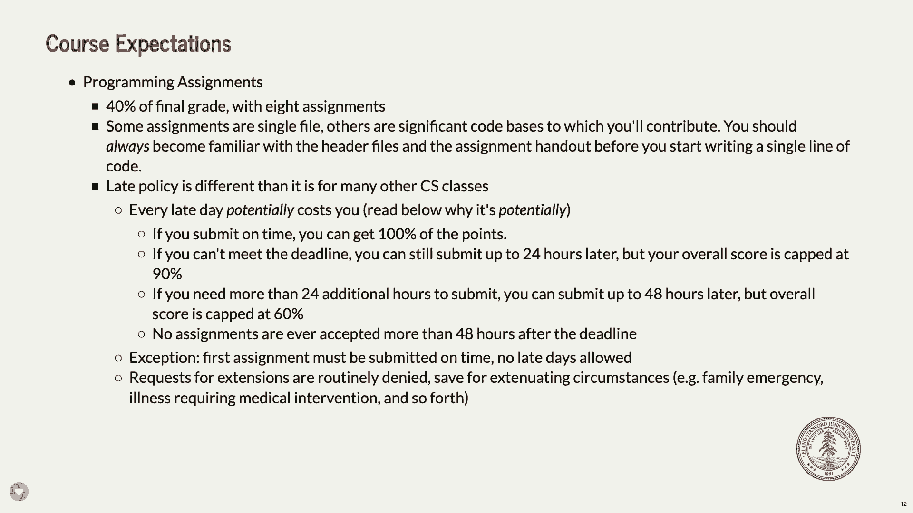

 that's next as I said Monday Wednesday's your lectures the one exception Friday we。

 are having lecture labs sections start next week we're doing three lectures this。

 week just so that we can get through some material for your project next or for。

 your assignment next week on our three this week following this just Monday。

 Wednesday not Friday Fridays are generally the like the labs the discussion。

 sections as I said a CA is leading them I think I'm gonna be leading a section。

 too and they're a little bit of theoretical things talking about stuff we。

 talked about in class but then there's a lot of looking at code and going through。

 code and then answering questions about that code and doing some other kind of。

 looking at the details of things okay they are not mandatory in the sense that if。

 you go to all of the lab of all the discussion sections is 5% of your final。

 grade and you just get 100% for showing up okay every time you miss a discussion。

 section you your great council a little it counts a little bit less and your。

 final exam counts a little bit more right so that's all it's not so much a。

 penalty if you don't go to sections it's just that I gotta do a little bit。

 better on the on the final and this is for people who are like I hate going to。

 sections they're boring I don't need them well great you don't have to but they。

 are there for your benefit okay discussion section signups Sunday April 7th。

 this Sunday at noon is when it's gonna open up like I said most of the sections。

 are gonna be Friday during this time slot some of the sections are going to be。

 on Thursday so if you really want a Thursday section get in there early on。

 Sunday like Sunday around noon and sign up for them okay I don't know exactly。

 how many sections yet in each one but that will be available then okay all right。

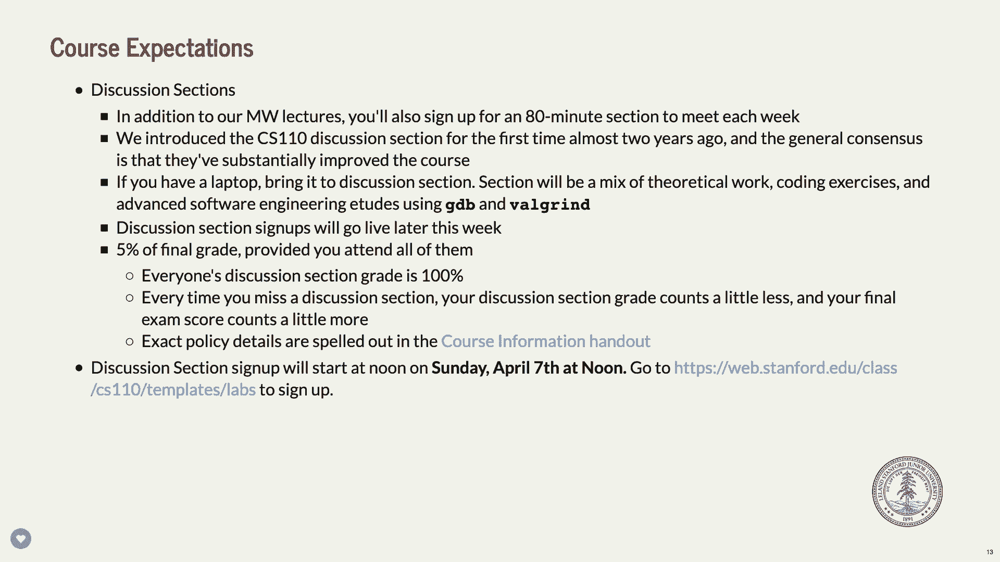

 midterm there are exams in this class the midterm is going to be Thursday May， 2nd 6 to 8 p。m。

 it's outside of class we're gonna use blue book who has used blue。

 book before yeah most of you guys you've never used it it's just a program that。

 you use that you kind of written in house and it's enabled to type your answers。

 people tend to like and it makes grading a little bit easier and like you don't。

 have to worry about your handwriting and you can erase and delete and so forth I。

 think it's pretty good it does require a laptop if you don't have a laptop that。

 has a good enough battery the last two hours let me know we'll try to get you。

 one okay don't want anybody to not be able to do it because of that the exams。

 are closed book closed notes you do get one page back in front notes for the。

 midterm here's the big thing you have to pass the midterm to pass the class all。

 right now what does that mean well it means that most of you will pass the。

 midterm okay I mean we don't sit there and go oh 40% of you are out of the class。

 because you failed midterm no the number of people who fail a midterm is very。

 very small but it is possible to fail a midterm so you do have to do well on。

 you have to do a passing grade don't stress about that too much just know that。

 you do have to do that that does bring me to another point how many graduating。

 seniors do we have here a few of you guys right first of all give everybody I。

 want to give you guys our applause all right you made it to Stanford well almost。

 haven't quite made it through Stanford yet you decided to take a really hard。

 class is your last quarter some of you had to do that I'm sorry that if you had。

 to do that that was the way it worked out this is a challenging course the odds。

 are good that you haven't taken follow-on systems classes because you would have。

 had to take this first so this may be a very very challenging course for you if。

 you find yourself falling behind and this goes particularly for seniors who can't。

 retake the course or over there or you have to take it with some or whatever。

 please please get the help early okay I know that's we say it in every class but。

 that's really really important okay now multiple practices we're gonna give。

 multiple practice exams we're going to do that if you have an if you have。

 another competing thing at the midterm time I know lots of people have I think。

 Thursday evenings might be like symphony or something like that that's fine you。

 can take it earlier in the day we'll have those details a little bit later okay and。

 of course you do have testing accommodations email me goes as soon as you can。

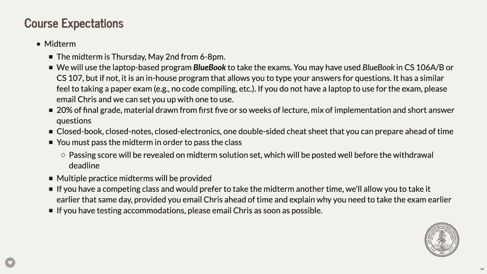

 the earlier kind of the better there's a final exam the final exams 35% of your。

 grade it is cumulative there are gonna be problems you'll see on file systems on。

 the final exam also closed book you get two pages of notes and it's going to be， June 10th 7 p。m。

 I'm sorry June 10th 3 30 p。m。 there's an alternate is 7 if you。

 have another class that conflicts a lot of times you say you can't have。

 conflicting classes look I understand some people have conflicting classes you。

 can take it at the second time if you have two conflicting classes well figured。

 out all right or three conflicting classes or whatever figured out the let's。

 see what else about the final you do it past the final past class as well again。

 very few people fail the final it does happen okay all right I think those are。

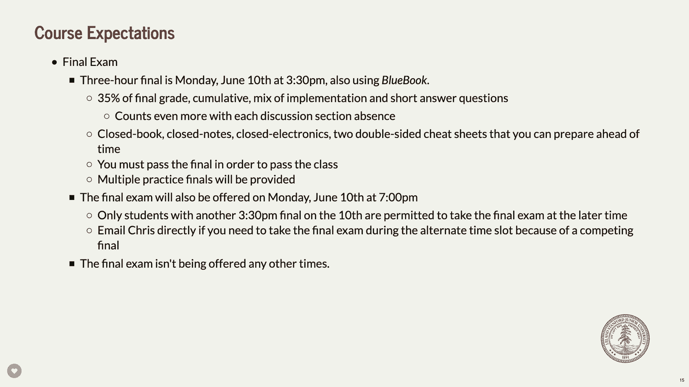

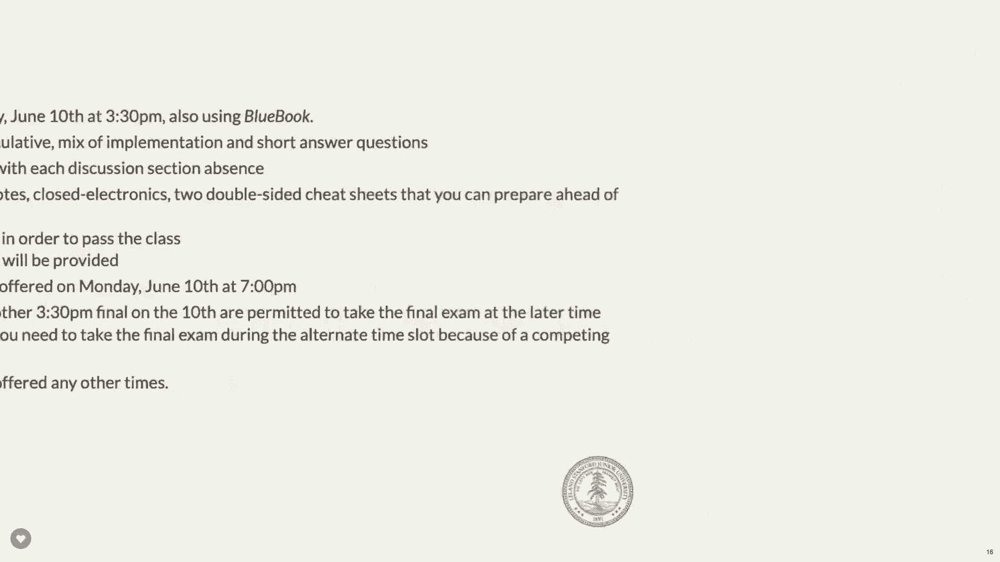

 that's the biggest thing about the logistics a final thing that really should。

 not be even need to be mentioned is honor code look some of these assignments are。

 out there okay your friends took these this class before or assignments are。

 online or whatever because people put them there you should not be putting any。

 of your assignments on public repositories please we'll ask you to take。

 them down but if you find things online please disregard you want to do the。

 assignments and we have ways of checking them so I will leave it at that all right。

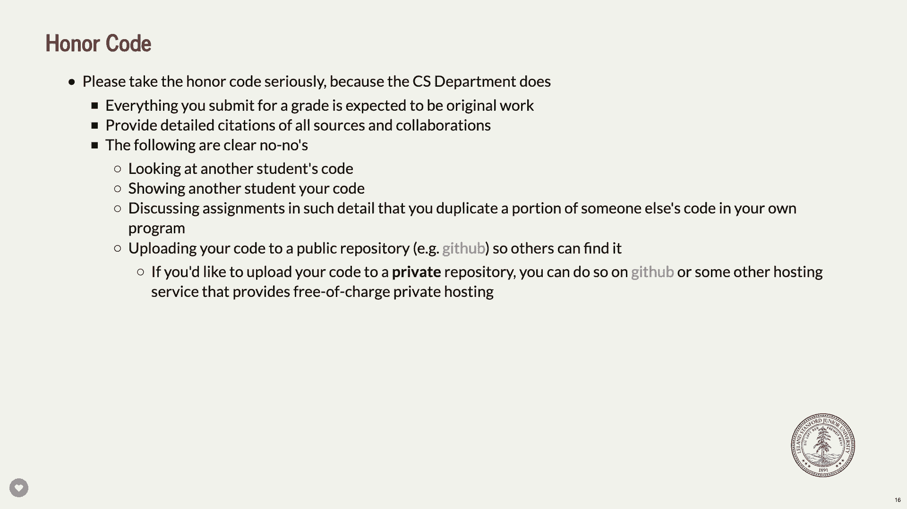

 what questions you have on logistics before you go into some details about。

 final systems any logistics questions， no okay let's jump right in file systems so you guys should be familiar with。

 Unix and Linux at this point right if you go and you type LS right you type LS。

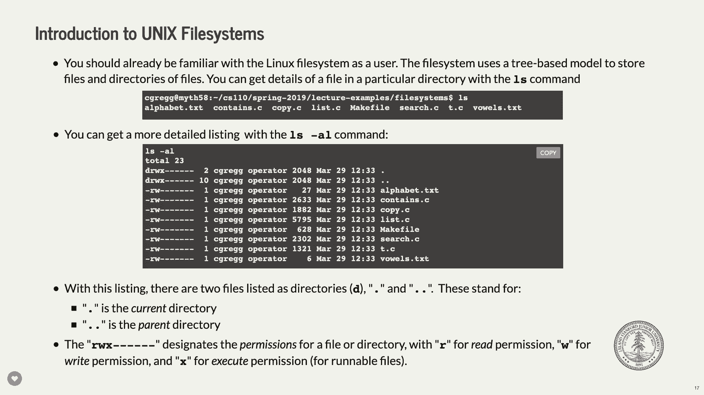

 you get a list of the files that are in some directory that happen to be in and。

 you may and you may have traversed down the directory some some distance like。

 this you may have traversed down the directory some some distance to actually。

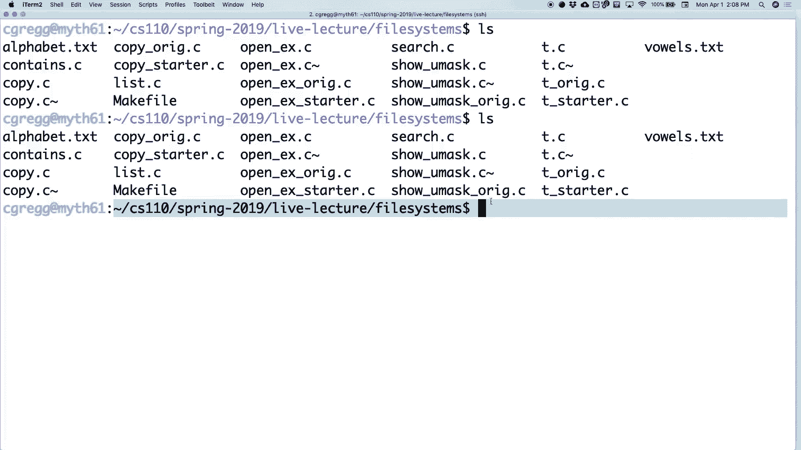

 get there okay and there are other things that you can do aside from just。

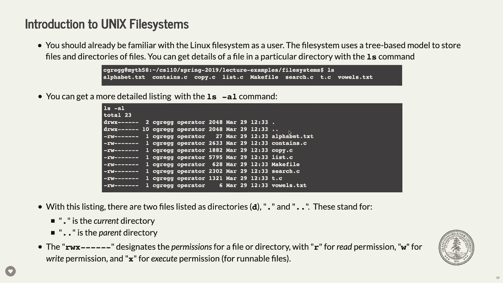

 typing LS you type LS - AL for instance it gives you a more detailed list the A。

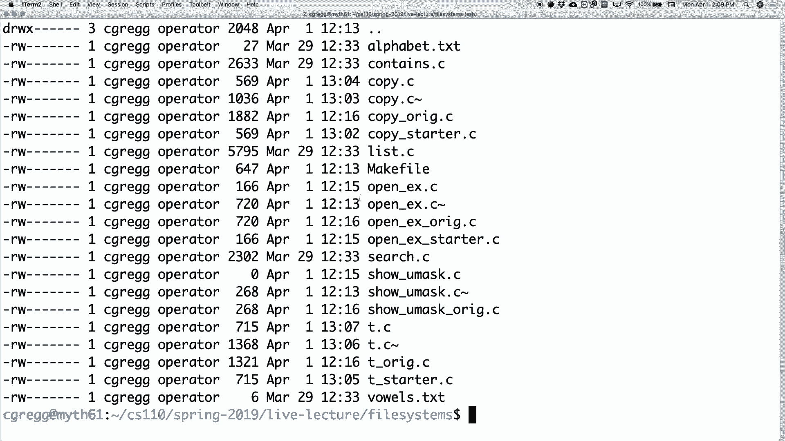

 stands for all files which includes all the hidden ones would start with a。

 period and it include the L stands for give me a nice big listing of more。

 details about the files okay in here there are two files in particular that are。

 interesting one is called dot and one is called dot dot you probably know about。

 those from 107 as well but those those files stand for directories stand for the。

 current directory dot and the previous directory dot dot and this is how you。

 traverse backwards and forwards through a directory okay and then the other files。

 in here just the ones that exist any others I don't think there's any other ones。

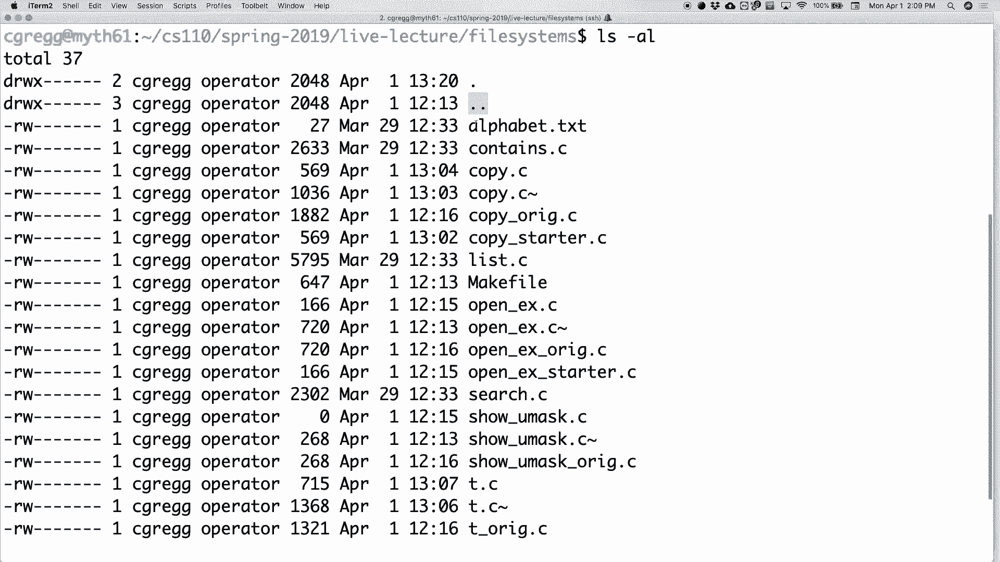

 that start with a period in here but those the hidden ones and then there's all。

 this other information like this stuff out here we're gonna go into more。

 details in a second on that that's your well it tells you whether or not it's a。

 directory and it's also the permissions for the file so you talk about permissions。

 at all in 107 I don't think you did yeah okay permissions are basically who has。

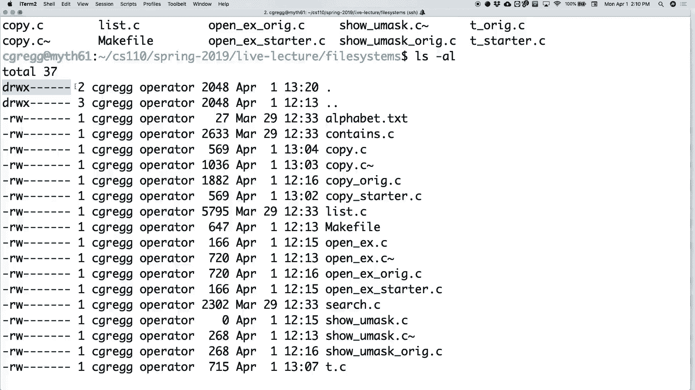

 access to your files okay and on this list right here it looks like I am the。

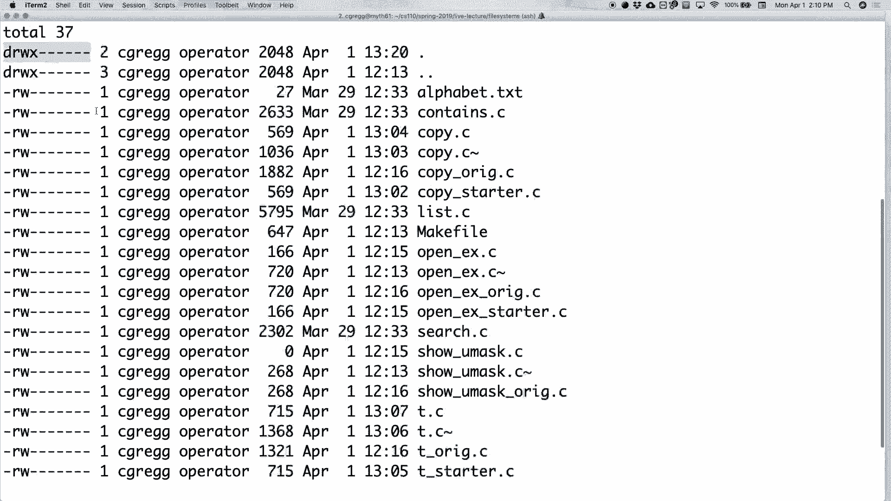

 only one of that has access because the first three things after the first dash。

 are the users permissions and only the only ones that have anything in there are。

 are for the user which is me in this case all the rest of those dashes are for。

 the group which you guys all belong to various groups like the course group and。

 some other groups and you also belong to the other category which everybody else。

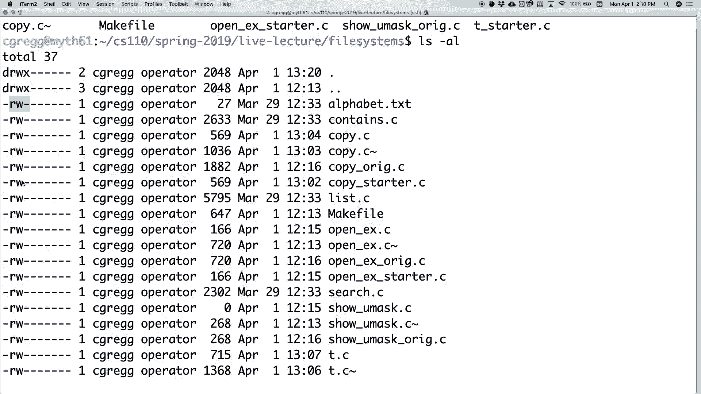

 those are the other two parts we'll get into more details about that in a minute。

 okay who's sending me messages stop sending you messages thank you um you can。

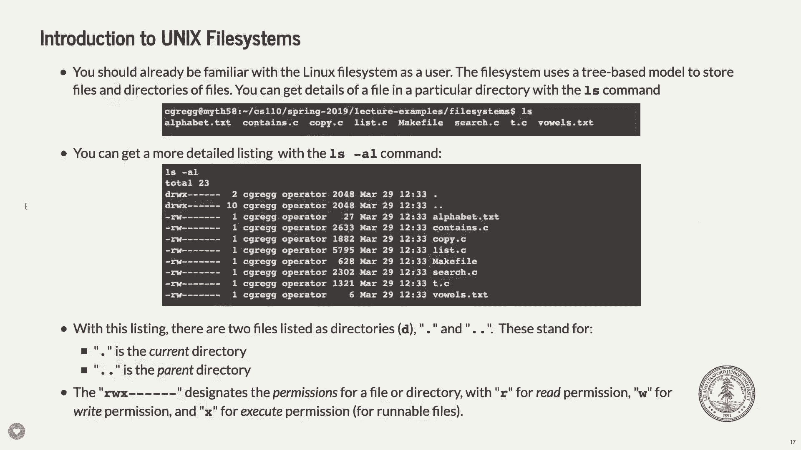

 do that you can do that please don't learn how to do that it's not it's not。

 it's not it's the messes things up sometimes anyway very nice all right so。

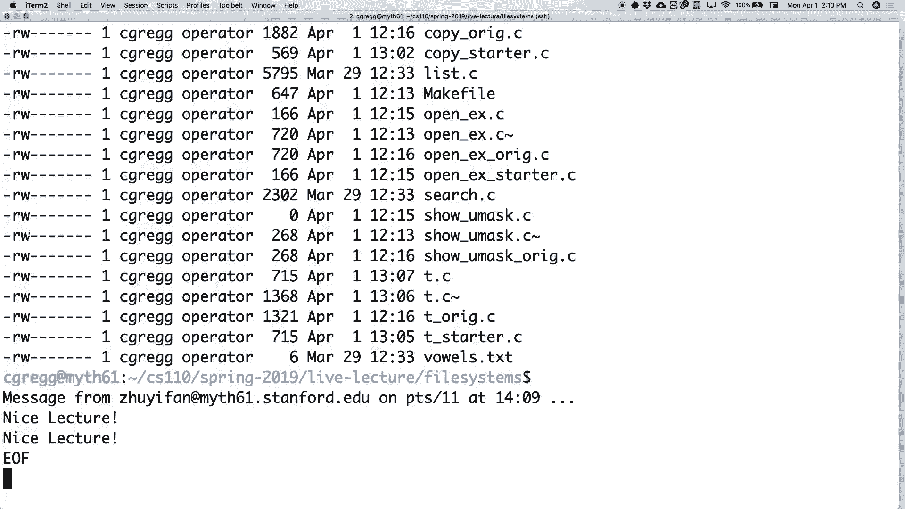

 oh by the way the permissions that you have are read write and execute the only。

 things you can execute are files that are binary files or files that are like。

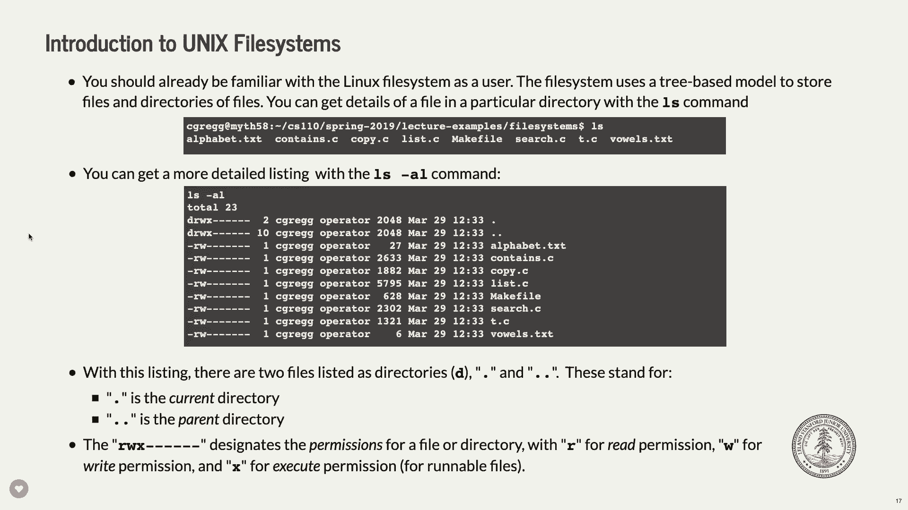

 scripts written in language like Python and so forth okay that's that's when the。

 x becomes important as I said there's three parts to these files there's the。

 owner part the group part and the other part and each one can have its own type。

 of permission its own permissions like if this this up here like if I had this。

 file called list and it had these permissions - R W X R - X R - X that's down。

 here this basically means okay that the owner has read write execute privileges。

 the owner being in this case me let's say the group can also read the file and。

 execute it and anybody else can also read the file and execute it that's how。

 permissions work okay and we do this for security reasons we also do it for。

 sharing reasons if you want to share things and so forth here's the interesting。

 part about it because it's R W and X that means there's three bits of。

 information which means three with three bits of information bits of。

 information you can encode that in one value that goes from zero to seven which。

 would maybe make you think that we could actually use the octal base 8 system for。

 this and you're going why would we ever do this well here's why okay if you have。

 the following permissions R W X assume that a one means that permission is set。

 so that you can do that a zero means it's set so you can't do it or it's。

 unset so R W X would be one one one that's seven right that's a one or seven sort。

 of thing convert binary to to in this case either decimal or hex decimal or for。

 that matter octal and then one zero one would be R - X and that would be five well。

 if you take the number 7 5 5 that number is an octal number okay so it's a 7 it。

 can't go if you added one to that it would not be 7 5 6 it would be 7 6 0 right。

 oh no sorry it wouldn't unlike you had if you had a wonder it would be 7 5 6 if you。

 added three to it it would or if you had a yeah if you had a three to it it would。

 flip over because it's base 8 the only part the important part is you will。

 often see this just think of them as individual digits each being those three。

 bits of information that's all you really need to know about that okay now in C we。

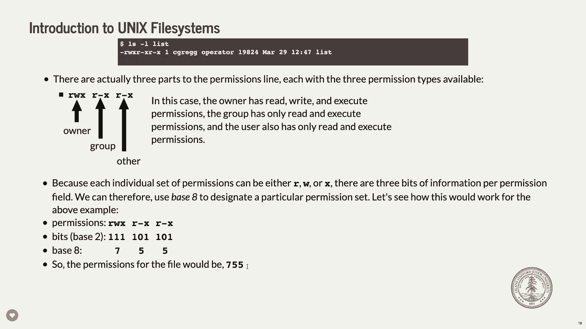

 can open files now you have done that before I assume in other in other classes。

 like 107 if you want to open a file there's actually two different kind of。

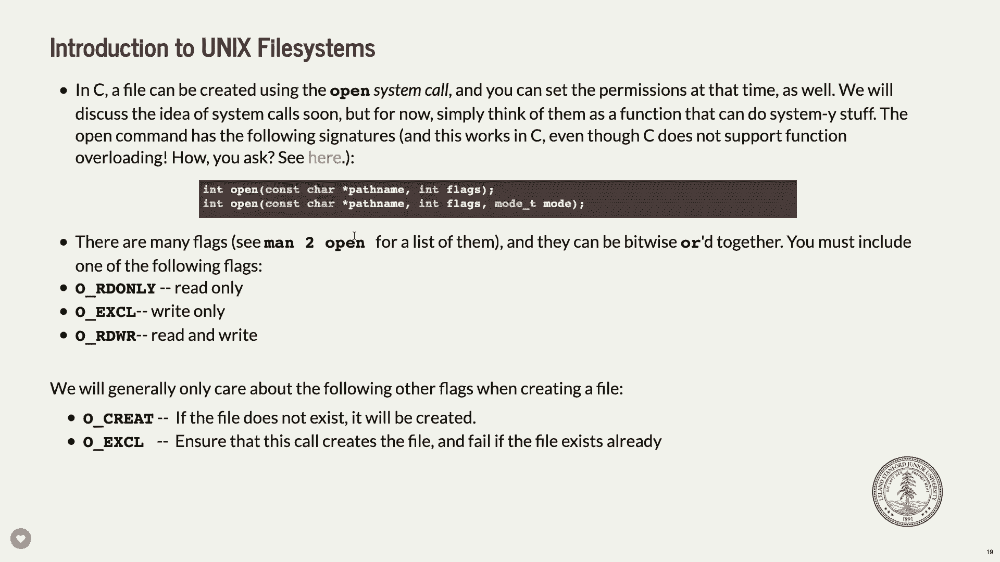

 overloaded ways to do it you can use the open command the open function which is。

 actually a system call number I said it looks like a function it's just basically。

 a function and you can put the path name and then some flags and some of those。

 flags need a mode which is those permissions we talked about okay and you。

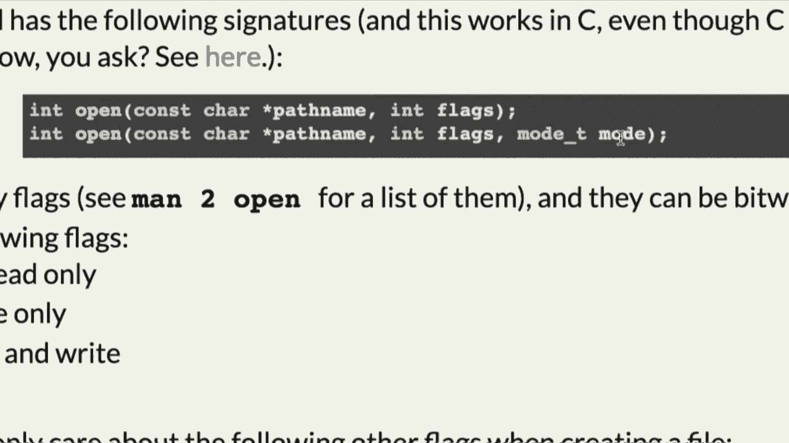

 might be saying to yourself oh great I know how to overload functions I know。

 all about that you can do that in C I don't know if you remember from 107 but。

 it turns out you can't overload functions in C so how does this work well go look。

 you can go look at stack overflow and see that anybody happen to look at stack。

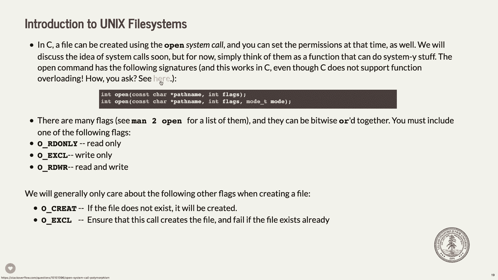

 overflow today yeah it looks kind of looks kind of like ugly it's your。

 mouse goes and it puts little stars behind it and there's banners and。

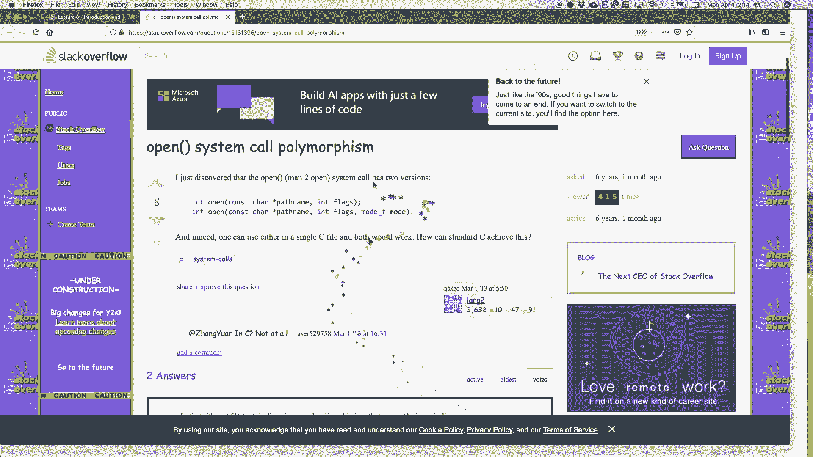

 everything and banners whatever it's like it says just like the 90s they tried。

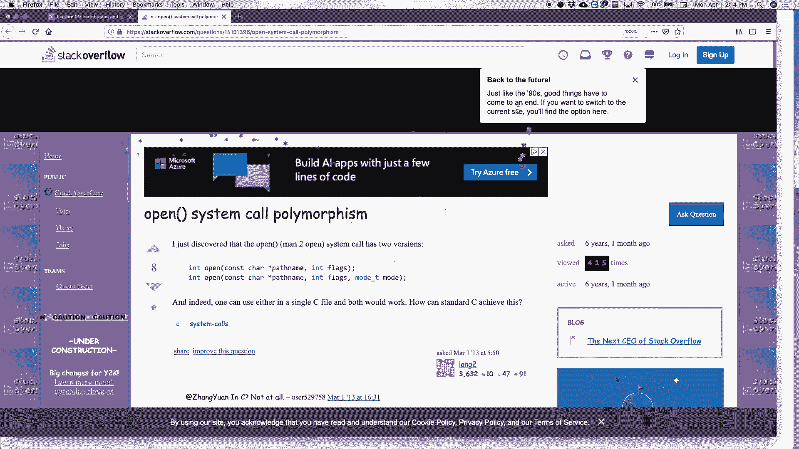

 to make it look like the 90s because April Fool's Day anyway that's that let's。

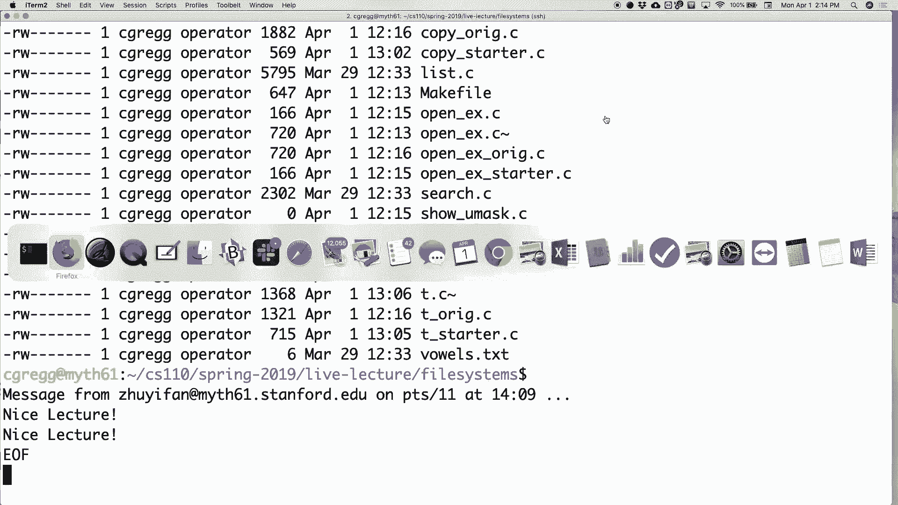

 see here we go okay hold on there we go okay you don't want to try this again。

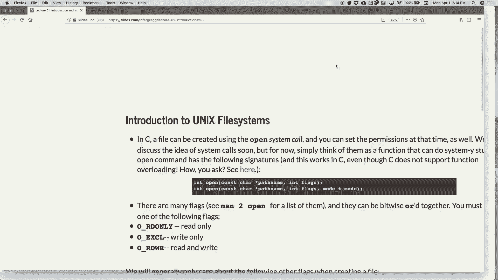

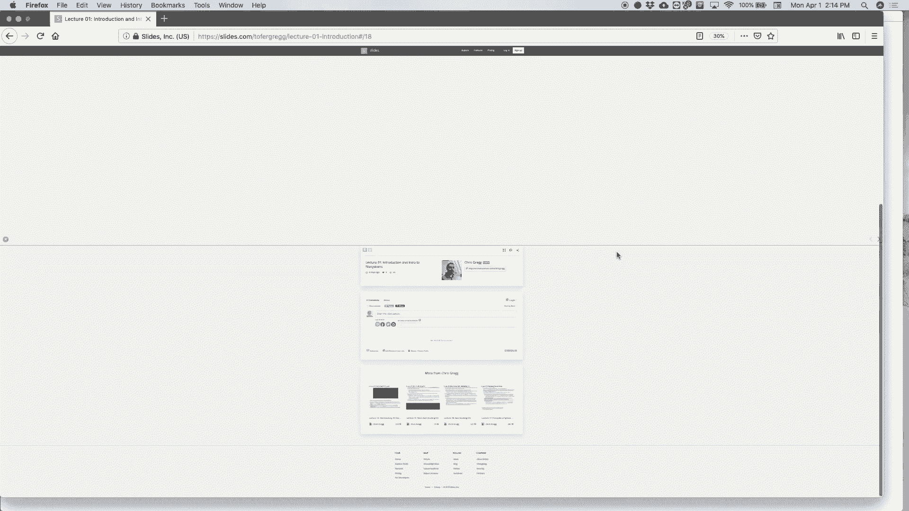

 make it a little bit bigger and then go right here there we go okay。

 there we go well still not getting bigger okay well anyway about the same all。

 right so you can you can open a file in Linux by using the open command okay you。

 can open a file to be either read only which means you can only read from it。

 can't write to it right only which means you can I think that's actually not the。

 right flag I'll look it up but you can read it read only or write only or you。

 can do read right which means you can read to it and write to it which is a。

 little bit I don't do that too often okay and then you can when you can do。

 that you can actually say I want to create a file and I want to create the。

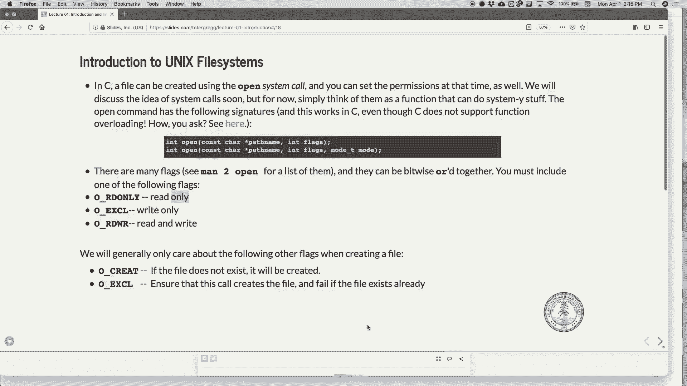

 file and when you create a file you have to pass in the permissions you want to。

 use for it okay and you can do this by doing the O_create without the E this is。

 because they wanted a safe space I guess they decided they don't want that an。

 extra letter in there but you have to do the O_create without the E that tells。

 you create the file and then O_excl says only create the file if it doesn't。

 exist already that might be important to you like try to create the file and if。

 it exists fail don't recreate like recreate the file and so we're going to。

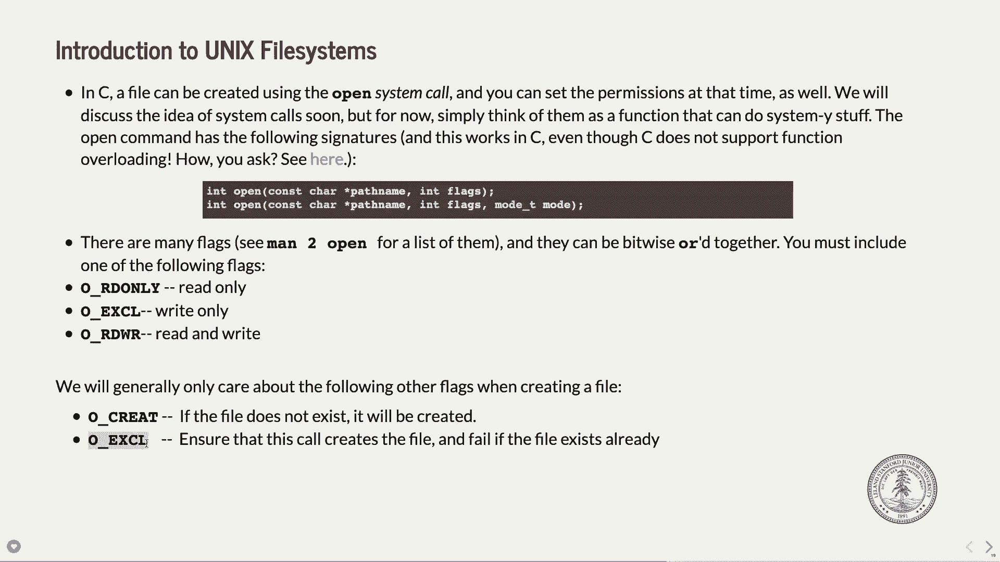

 care about those things okay let's actually and by the way the third mode is。

 the permissions this is actually used to attempt to set the permissions operating。

 systems are a little weird okay one of the things that the operating system does。

 it says I'm going to give you a default set of permissions that I'm going to。

 create this file with and if you tell me to create more explicit permissions I。

 won't let you which sounds a little weird but I'll show you an example of how。

 that works you figure that out with a command called or a function called you。

 mask which is basically says what default permissions do we have and it if the bit。

 is set right then if you try to set that bit for the permissions it doesn't work。

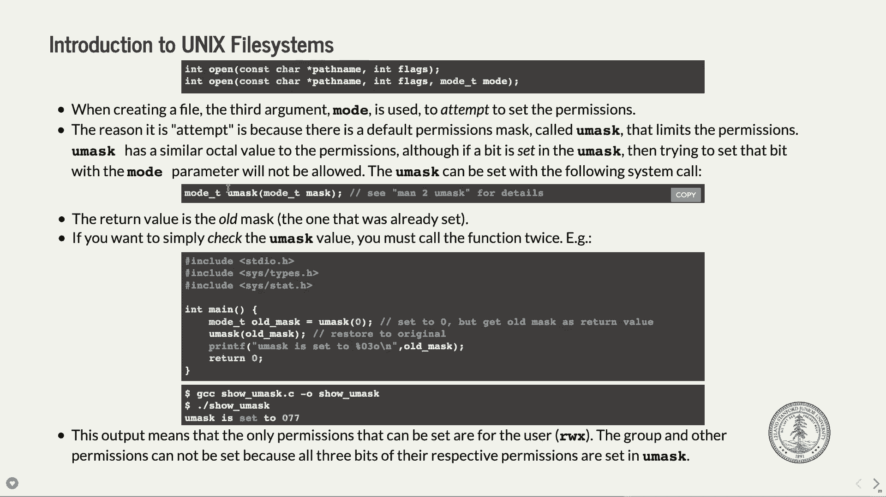

 let me show you what I mean okay let's actually write our first program here。

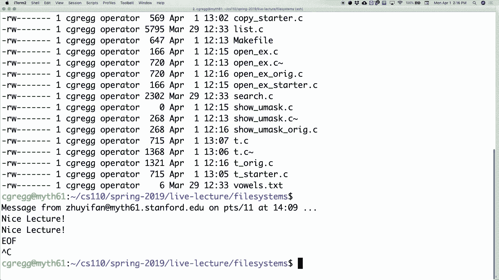

 let's see we'll call it I already have a program here we're gonna call it show。

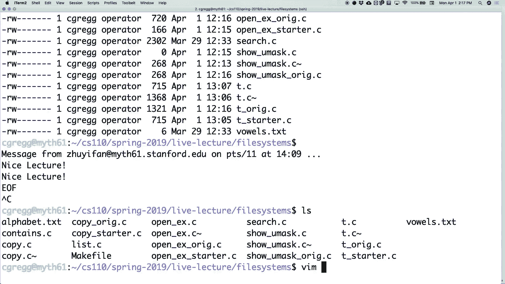

 you mask dot see okay and in here what we're gonna do is we're gonna pound。

 include some things pound includes h pound include cis slash types dot h。

 that's and then another one also you have to pound include to be able to use this。

 u-mask thing and include by the way I'm I always make mistakes mistakes when I'm。

 typing these things in so catch me if you find remember if you find them catch me。

 or tell me cis slash stat dot h okay and then you can do our main functions it's。

 just in C I'm gonna go put the return 0 in there now and then there's a type。

 called mode underscore T I'm gonna call it the old mask here's how this works。

 equals u mask which is the it's saying hey get me the permissions that you are。

 going to allow me to set okay and I'm actually gonna set it to zero which says。

 allow any permissions here's the dirty little secret you can make any。

 permissions actually set it's a little bit weird okay but anyway it's gonna do。

 that and then this is how you get the result it's kind of dumb you have to set。

 the result to get it back so what we can do is we can say okay fine let's just。

 set it back to our old mask it's I think it's a kind of a it was a weird choice。

 but that's the way they did it okay and then if we print F you mask is set to。

 remember it's octal these things are octal if you do if you do percent zero three。

 will pad it with zeros and then you do oh that means do an octal number with。

 three with three places in it okay and then we'll do the old mask and we'll。

 just hold mask and then or return zero okay this all this is doing it's going to。

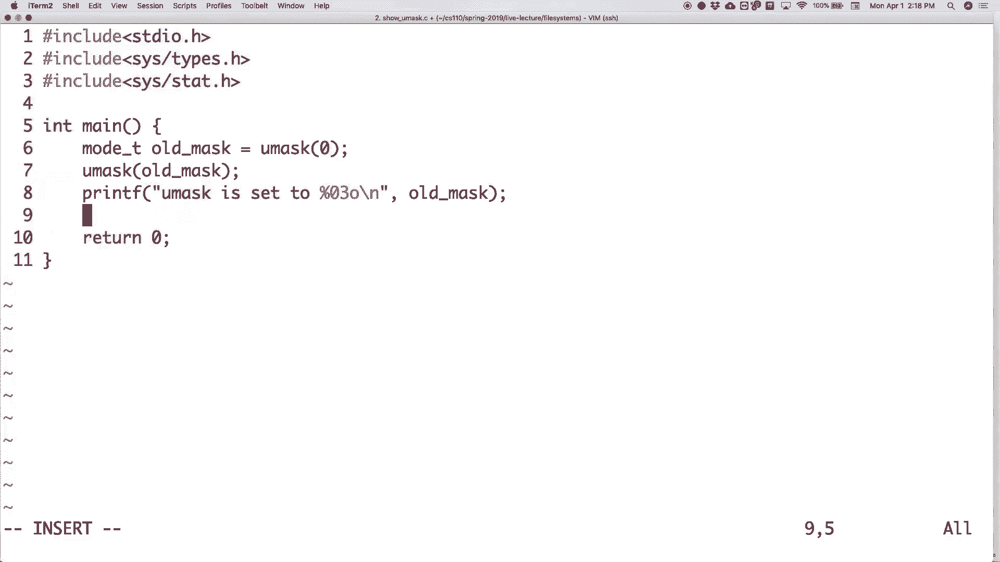

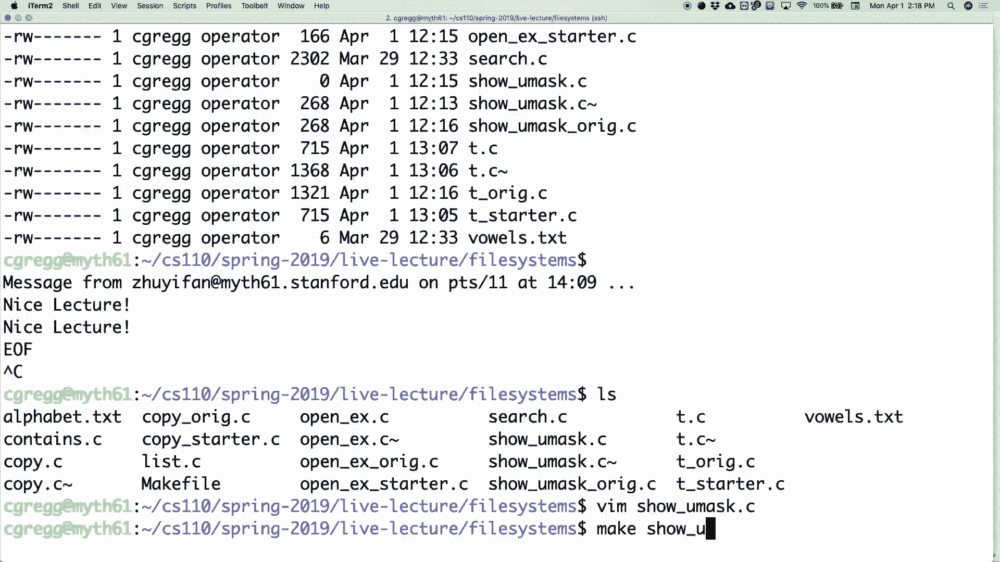

 know you mask what it's gonna do is gonna tell us what permissions are right。

 now all right 077 what are those three bits what's the zero mean 0 0 0 right。

 what's the seven mean one one one well what this mean and then there's another。

 one one one what it means is the user can set any permissions and then the group。

 and for the group and for anybody else you're not allowed to set the permissions。

 or in other words it won't set those permissions it'll just be - - - that's what。

 that means it kind of seems a little backwards but that's what it what it's。

 all about why do we do that again part of it is because somebody decided they。

 want things to be a little more secure and they also want things to be able to。

 have some defaults I was talking with you guys know Michael Chang somebody took。

 CS 107 from him he was telling me today that the UMass thing is actually a really。

 good idea for this and this and this reason then I said yeah nobody really。

 knows that he goes I know nobody knows it but anyway that's what it's all about。

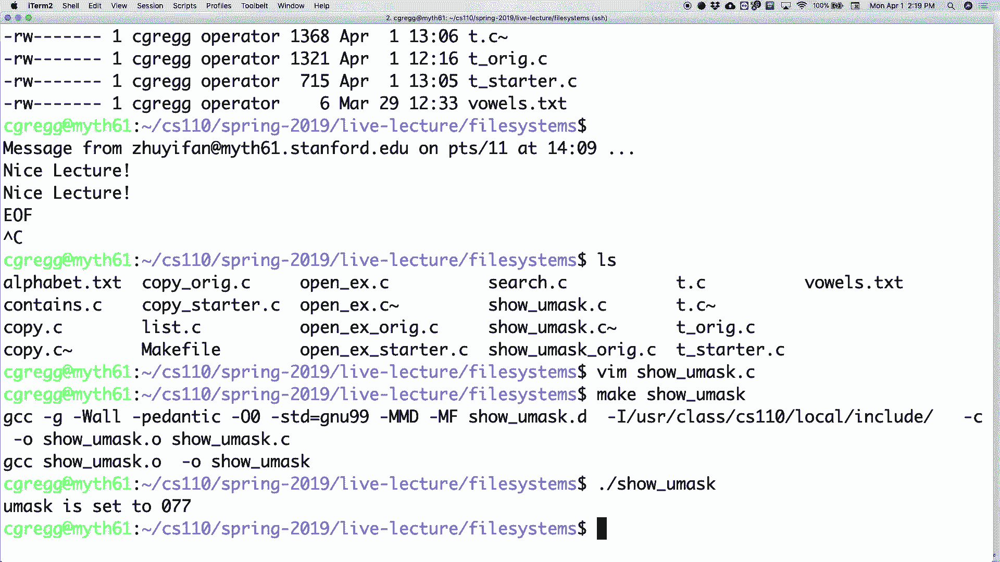

 as far as doing that it's just basically saying what permissions can you set okay。

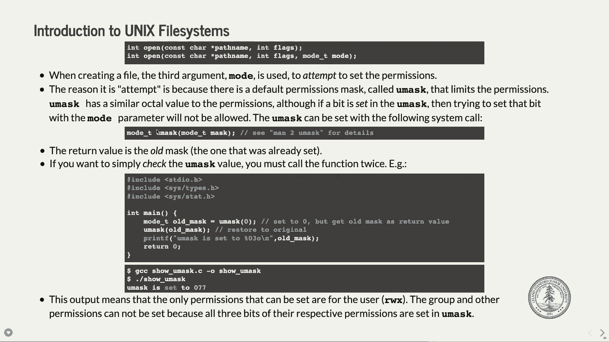

 so we just did that let's actually we're actually gonna write a quick program and。

 these programs are all as I said available for you to download or to actually to。

 clone into your own myth directory somewhere and as you clone when you。

 clone them you can actually look at them okay every time I mentioned new。

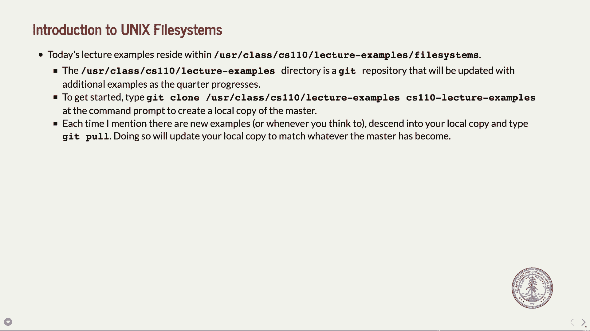

 examples I'll put them into the into that repository on the next one I want to。

 write is a little program that actually opens a file up or creates a file and。

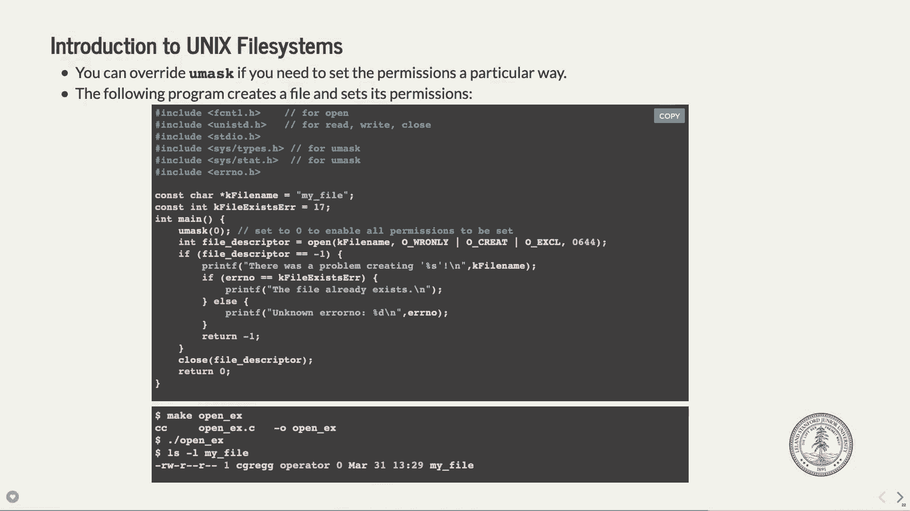

 then set some permissions okay so let's actually do that right now this one we're。

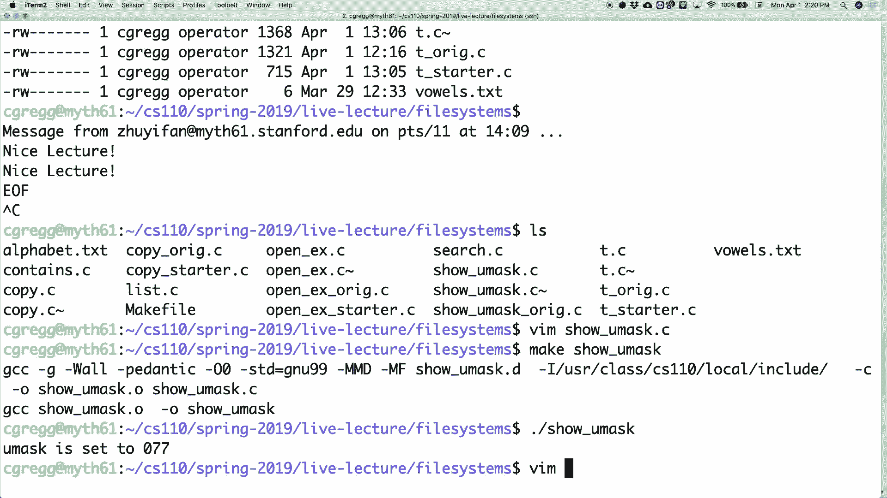

 gonna call it open X dot C and I've already put some stuff in there for us。

 here okay and we are going to to do this we're basically as I said we're gonna。

 open a file up and then we are going to set its permissions to some value okay。

 while we're opening it up okay all right in C we generally don't like global。

 variables but constants are okay okay we'll call this one K file name and we'll。

 just call it my file okay that is a global variable it is a constant all。

 right anyone know what the case stands for constant of course that's for some。

 reason that's a C thing I don't know why they always did that but that's what it。

 is I'll have another one that I looked up K file exists error and by the way it's。

 nice to put the K there so that anytime you use it in a file in the rest of the。

 program you know it's a constant it's just kind of tells you that okay we'll get。

 to what this is in a in a second okay and then in main we're simply going to say。

 you masked zero because I actually want to set the permissions the way I want to。

 set them as it turns out so you have to set it to tell the system hey I'm gonna。

 set the risk the whatever however I want so I don't care what the u mask is in。

 this case okay and then we do this thing we get a what we call a file。

 descriptor the scriptor we're going to three to two fifty right yeah we go to two。

 fifty file descriptor which equals in this case open K file name okay and then。

 we have to tell it yeah this is what it was wrong on the slide I'll fix the slide。

 read right only is what we're going to do with this I can bitwise or it with oh。

 create and I can bitwise with it with oh excl which means what right only create。

 the file and only create the file if it doesn't already exist that's what those。

 three flags mean okay and then I'm going to change I'm going to make the。

 permissions 0 6 4 4 okay 6 4 4 6 is what one one zero right and four is one。

 zero zero and one zero zero zero the other four notice that I prepended this。

 number with a zero what base do you think that means it's in octals it turns。

 out that's how you make an octal number in C okay all right and then we'll check。

 a file descriptor this is our error checking you won't have to do too much。

 error checking for class but we generally try to do it as much as we can in the。

 lecture or in the real slides to show you how to do it because you should do it in。

 real life print F okay there was a problem opening or creating let's call。

 a percent S like that and K file by the way in Vim I don't know if you know how。

 many people you took one of seven last quarter and learn emax Nick telling you。

 emax is fine if you want to use a match you can use emax I'm a good person these。

 days anyway okay if there was an error we can actually use this thing called。

 air no to determine the error and file exists error if error number equals file。

 exists there we can print out okay the file already exists right like that okay。

 if we don't know the filing we just print out unknown error error no okay。

 percent D and error no did you use air no in CS 107 you may have a little bit。

 maybe not air no is a global variable it's based in C and it basically gets。

 set when your program has some error it's a little bit strange that they do it。

 that way but that's what I do it and this is gonna return negative one to。

 basically say hey our program is not did not do so well and then we're gonna。

 close this file descriptor like that and we're just gonna return zero all right。

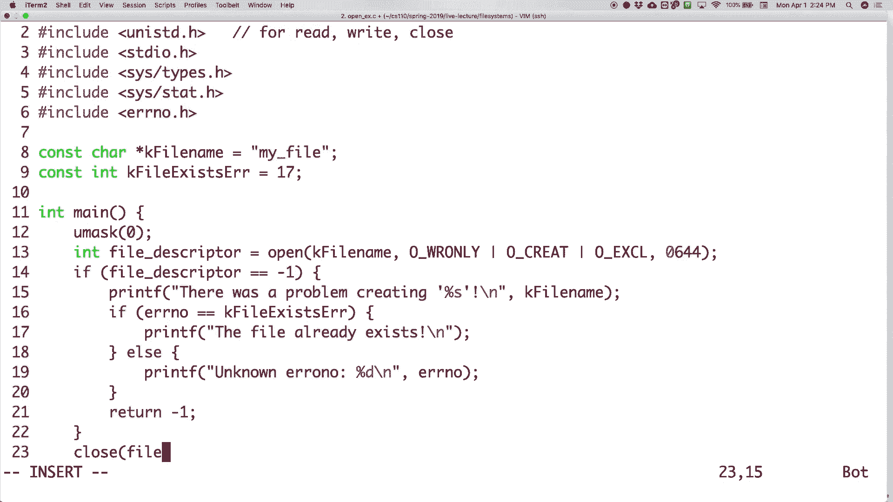

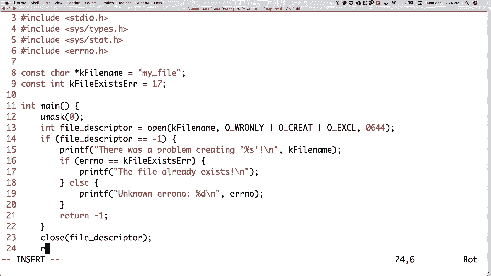

 so what type is a file descriptor an integer when you open a file you get back。

 an integer a lot of times the very low-numbered integer like five or four or。

 something like that file descriptors are a low level way of saying here's the。

 number for a particular file we're gonna go into details about that later in the。

 week about how that actually works get anybody see any typos in there we'll。

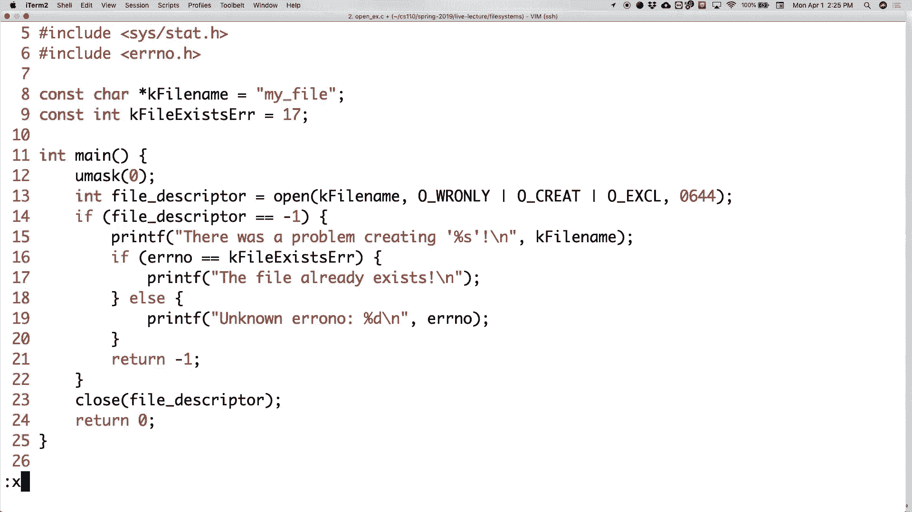

 find out open X okay so if I do open X right I just does just runs right and the。

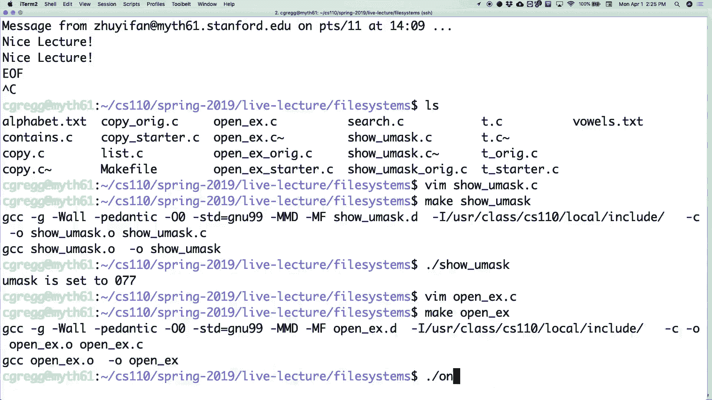

 file that I call created was called what my file oh my file and there it is。

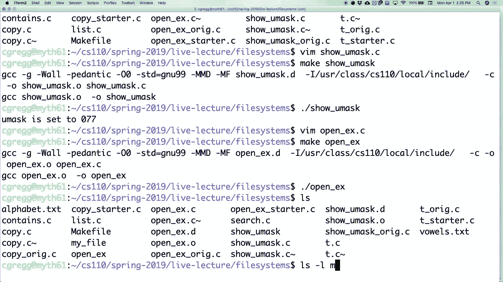

 notice that permissions are read and write right and then and remember it。

 starts after the second after the second one here so the permissions were。

 reading right for the owner read for you for group and read for others and that's。

 how we set that right what's gonna happen if I run it again。

 there's a problem creating my file it already exists right we checked that right。

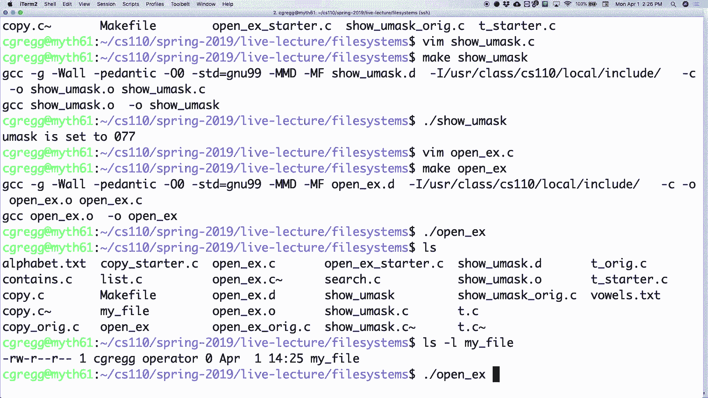

 if you want to find out all these error numbers I'd look this up air no - L will。

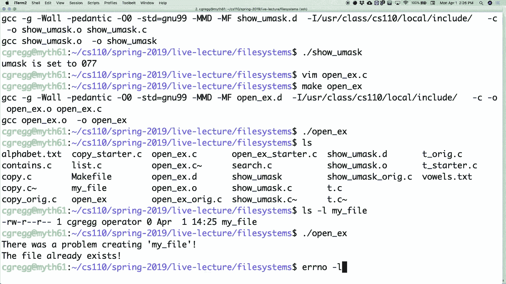

 give you a list of all the different file numbers and if we go up here and we。

 look at there's a lot of them we look at 17 it says file exists and that one will。

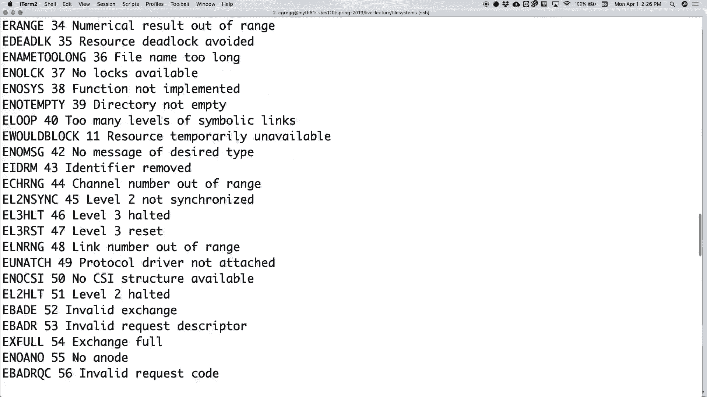

 be in there we will use a lot of error numbers as we go through the course for。

 various things in some cases we use it there was an error but we don't care。

 about the error we want to know that it was that error that we were expecting。

 sounds a little weird now but we will get there and you will use these to do。

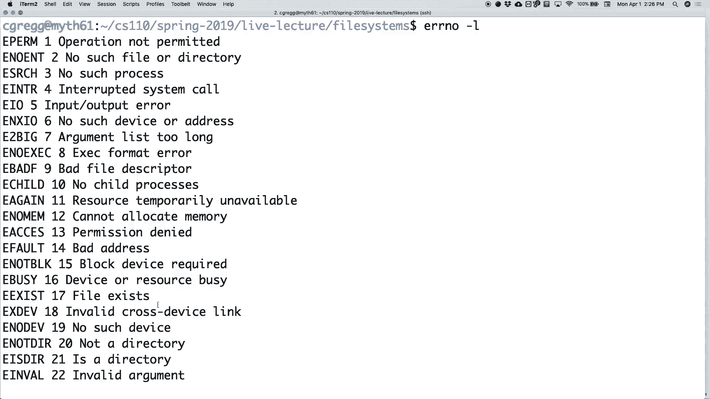

 that so you'll get familiar with that okay and by the way how on Linux would I。

 say error number L and then be able to stop the file halfway through or part of。

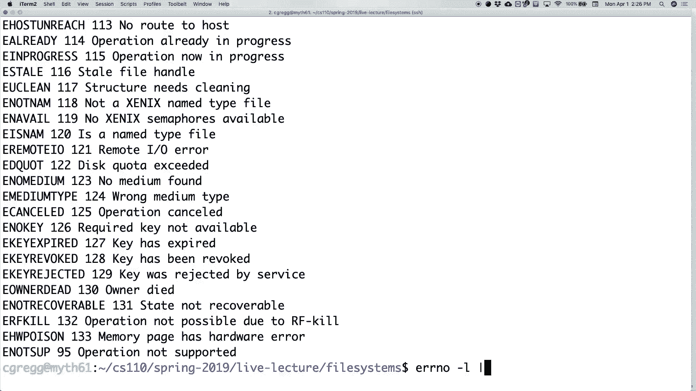

 the way after one page anyway no command less works just fine and then you can。

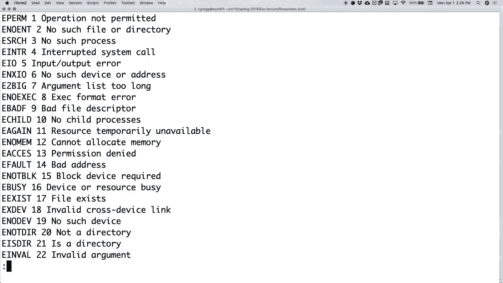

 go up and down in less and see it right that works pretty well that's a nice way。

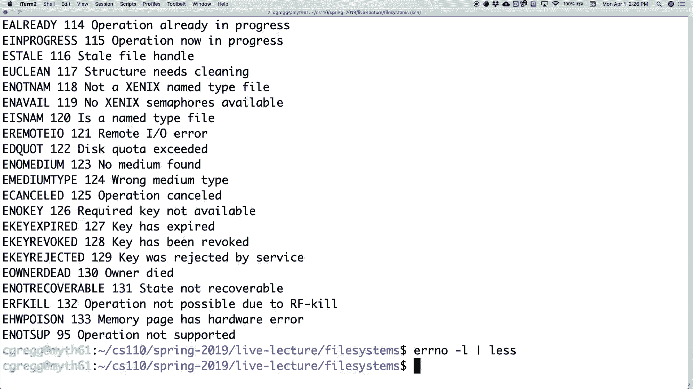

 of doing it so you should get used to those sorts of things as well okay so。

 that's the basics of file systems okay the we're gonna look at a lot of other。

 low-level operations and by the way you mask and open are two two of these。

 functions that aren't really functions their system calls when you say open your。

 program transfers control over to the operating system and the operating systems。

 kernel does the work to open the file and then gives you back your program back。

 control as far as your concern it looks just like a file a function call but we。

 have to know some of the details about what's happening under the hood okay um。

 let's let's do one other thing and then I'll let you guys go because it is the。

 first class um let's emulate the copy command CP okay if you do CP right if we。

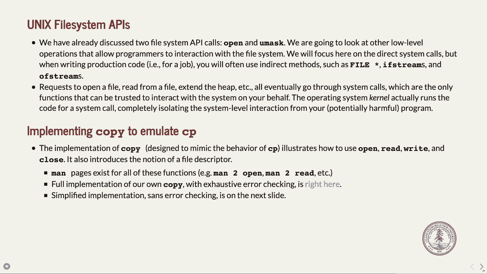

 do CP I've got a file called copy。c and I'll call it copy copy。c this is getting a。

 little meta right if you do that now there's two files copy。c and copy copy。c。

 right which are exactly the same okay let's remove copy copy。c okay and what we。

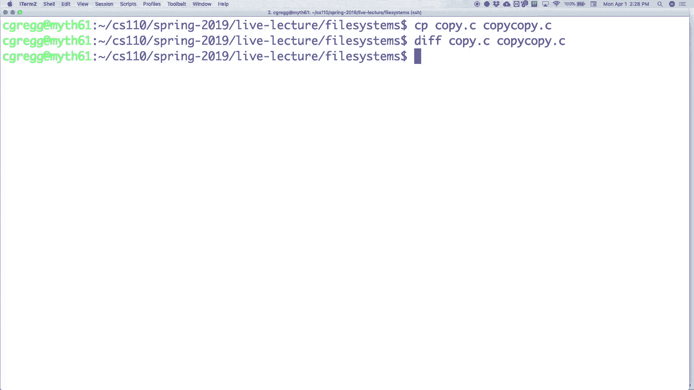

 want to do is we just want to write a quick little program to copy a file okay。

 and we use that by doing the the open command and also okay we're going to use。

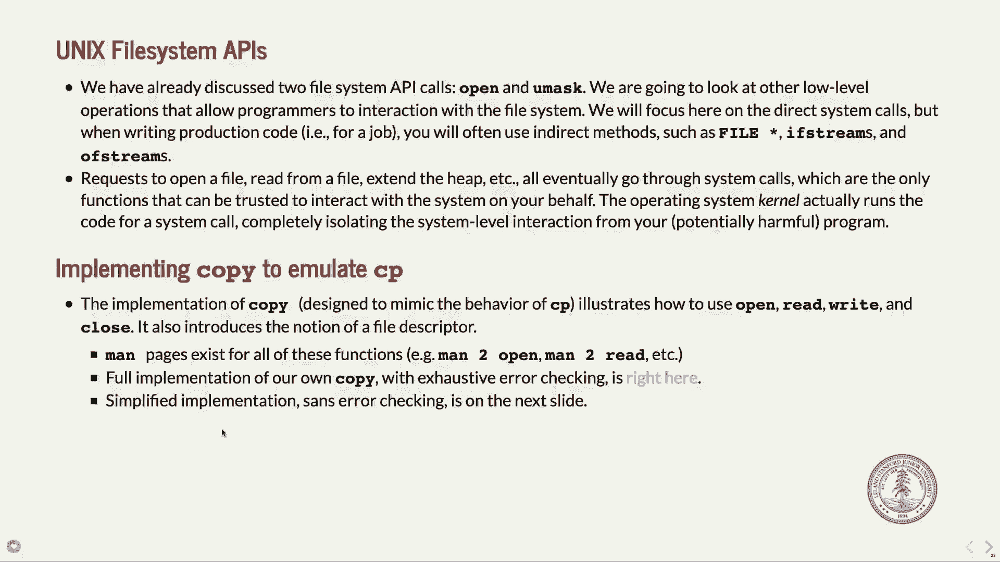

 two other system calls called read and write which do what you imagine reading。

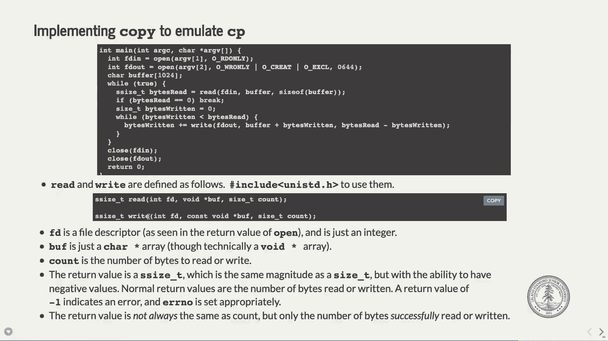

 from a file and then writing to a file okay let's actually just quickly do this。

 one up right now let's see copy。c okay I've got most of it I've got the beginning。

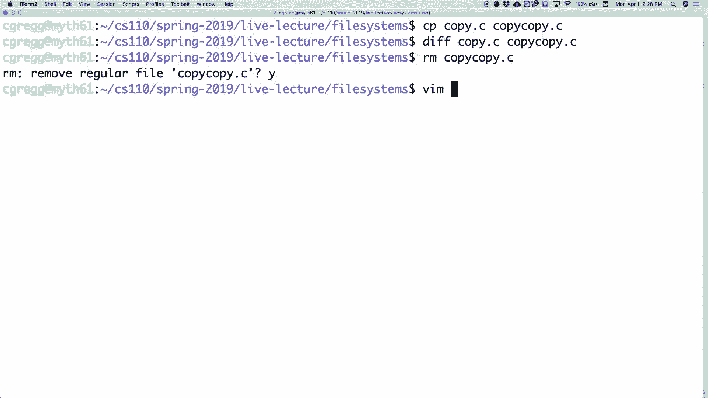

 parts of it in here so I want to be able to just do that format and correctly。

 there we go okay this is basically it says to run this you do you have the。

 file name or the copy command file one and gets copied into file two like that。

 okay well how does this actually work okay we need an in file so the file。

 descriptor open argv one which is the first one and oh read only okay says I'm。

 only gonna read from that file so I should open it as such and then we have。

 the out file which is another open which is the other one open argv two and this。

 one we are going to do oh write only and o create without the e and o e x c l and。

 then we'll do 064 for again is it going to create it with 064 for if I don't do。

 the u-mask probably not but who care we don't know that okay you can set your own。

 u-mask as the user by the way through Linux if you want it to do that okay。

 anyway that's how we do that now let's do this let's create a buffer one。

 thousand twenty four bytes long okay and then we will do s size t bytes red equals。

 now an s size t let's a weird one you might have used size underscore t in 107。

 and s size underscore t is a signed size underscore t it allows us to have。

 negative values for the specific purpose of negative one saying that's going to。

 be like the it's going to say there was an error it's the only reason they use an。

 s size t otherwise it would use a size t but that's c for you all right so。

 anyway bytes red okay equals well we're gonna read and how do we do this we read。

 from a file descriptor we read into the buffer so we pass the buffer in and we。

 read the number of bytes not over buffer there we go okay there we go we read。

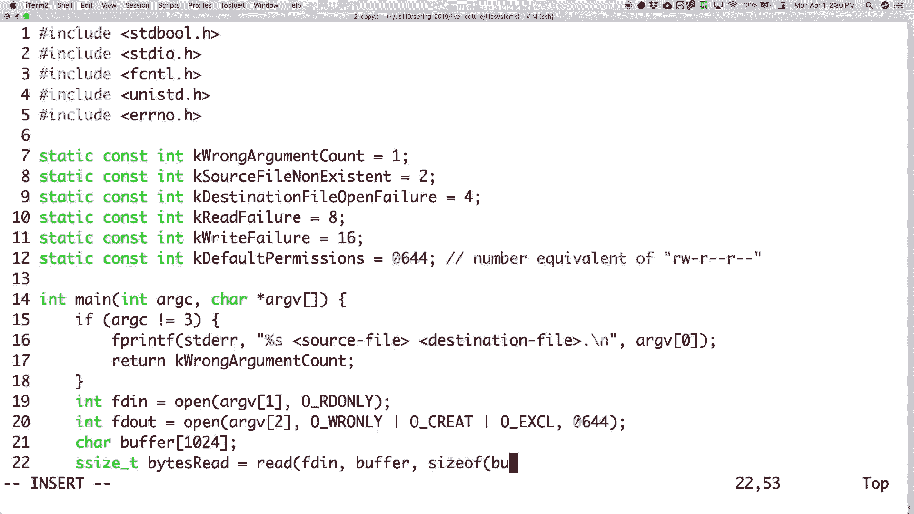

 the number of bytes into that okay and then and that tells us how many bytes。

 read now what could cause a program to not read all the number of bytes we pass。

 in to the size of buffer if it's smaller if the file was only 10 bytes long it's。

 not going to read all thousand twenty four what else there's actually one。

 there's actually a very interesting way thing that might happen it might be that。

 you tried to read in so much data that your program got time shifted by to start。

 got taken off the processor some other program could run and it only returned。

 so many bytes this will almost never happen with reading local files but。

 happens all the time when you're reading network data okay if you're reading。

 network data you try to read a thousand twenty four bytes you might get 480。

 bytes even though there's plenty more bytes there they're not not available。

 this is all about time slicing so you have to be a little bit careful with that。

 and you have to make sure to only try to write the number of bytes you read。

 okay for a number of different reasons now if bytes read equals zero break now。

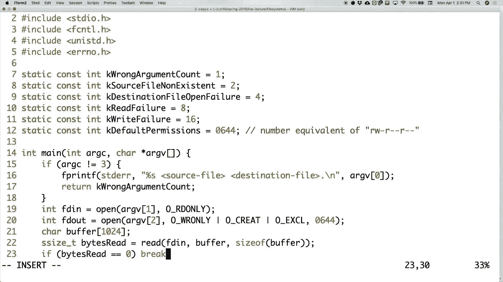

 one thing that I kind of just lied to a little bit in the sense that the other。

 reason you might not get a read of all the bytes this will block until all the。

 bytes are available as it turns out that that happens if there are more than a。

 thousand twenty four bytes it will or well if there are a thousand twenty four。

 bytes to read it will wait until they're all read in in this case but in general。

 you can for networking and things we don't necessarily block on that okay if。

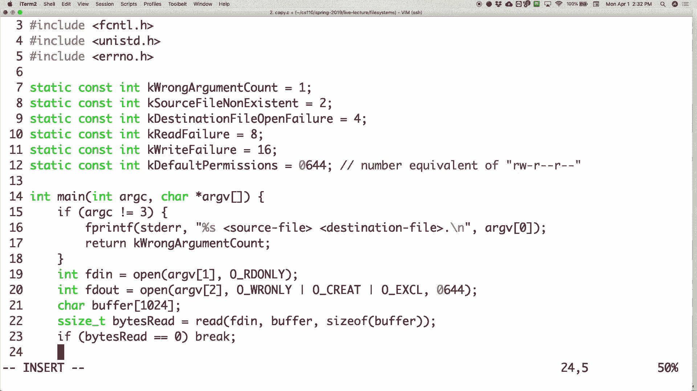

 the number of bytes read is zero that means that we're done reading because no。

 bytes came back as it turns out okay and then we now have a regular size t bytes。

 written equals zero while bytes written is less than bytes read okay bytes written。

 plus equals okay right we also write to a file descriptor this time the out one。

 buffer plus bytes written and then that's the location we are going to look for in。

 the buffers it turns out okay and then bytes read minus bytes written like that。

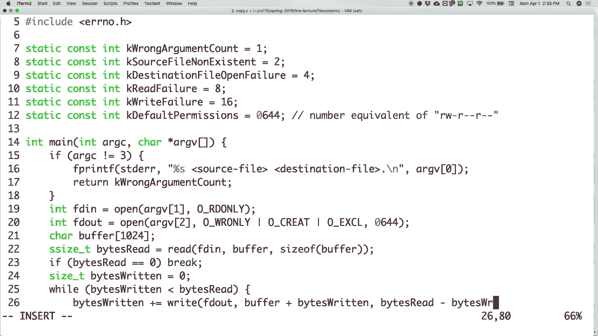

 okay and we are going to have this strange while loop like that okay I'm。

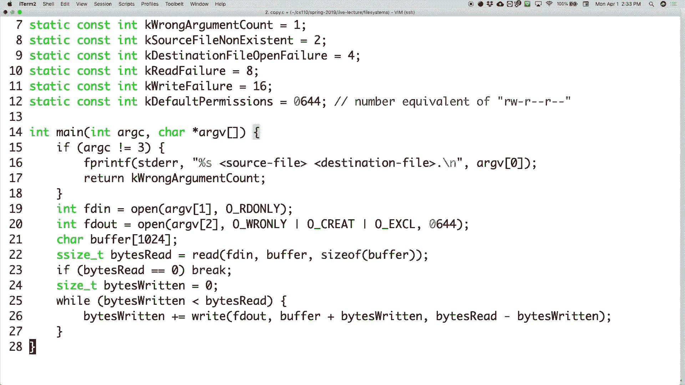

 missing one let's see where did I go wrong here let's see there's one， hang on I bet my phone be。

 yeah that was a spam call anybody get those these days I heard that that's。

 like tripled in the past year the number of like robot calls kind of crazy okay。

 hold on a second let's see while by trade well we'll check it when we get it but。

 anyway point is that after you do this then you want to actually close the file。

 and then close the two files and then return zero but there's an error here I'm。

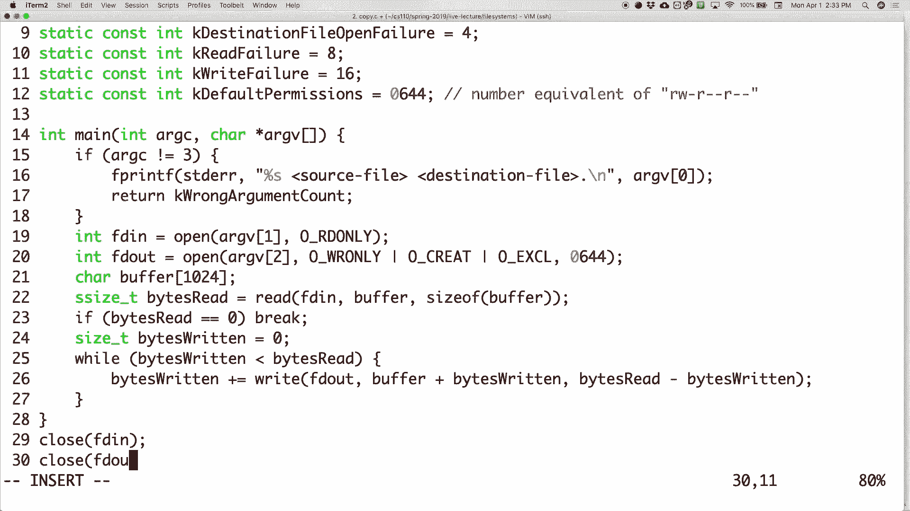

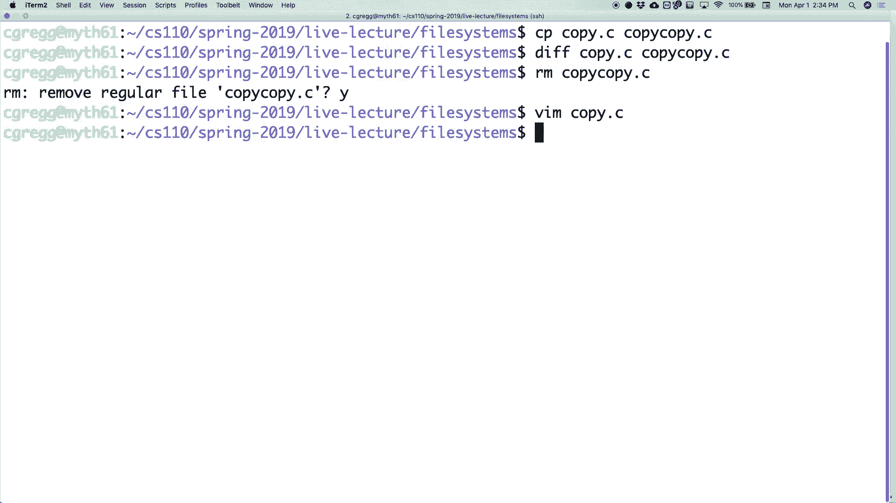

 just gonna make it see what happens there it is okay if but not inside the。

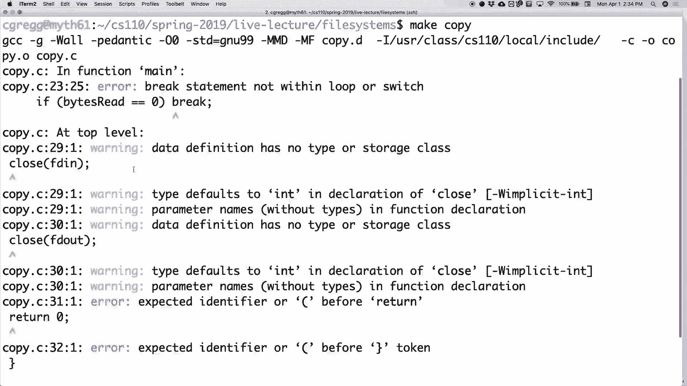

 break or not 23 yeah all right let's see did I miss a while still I did miss a。

 while statement okay right here we need a while statement that says while true this。

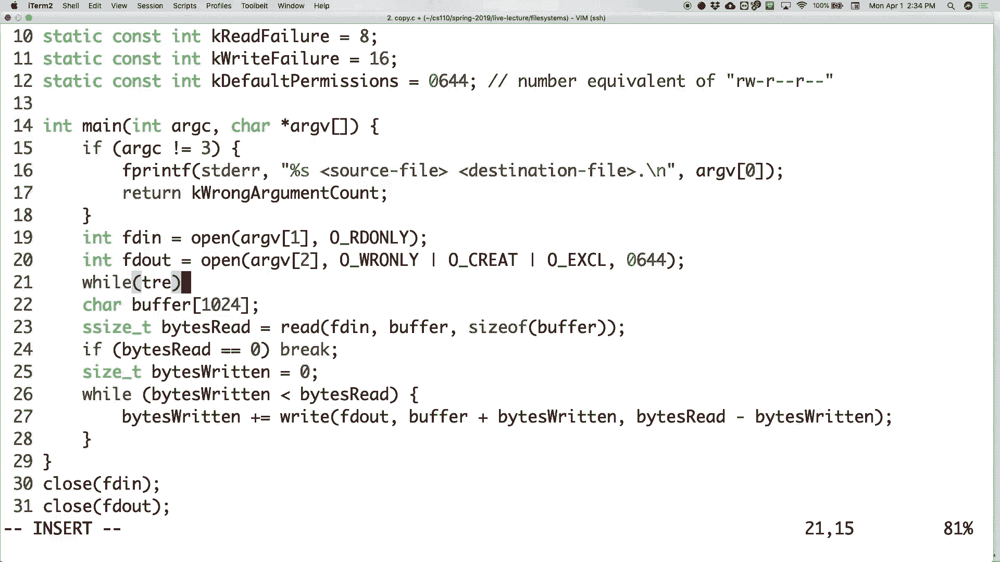

 basically says do this until the file is I was a big mistake there do this until。

 the file is done so what have we done here we have opened two files one that。

 we're gonna read from one that we're gonna write to that we could create okay。

 then we are going to read one thousand twenty four bytes at a time okay and if。

 we get back zero it means there were no no bytes left to read okay so we can。

 stop reading because we're done with the file and then we have this weird while。

 loop where we say while the bytes written is less than the bytes read read get back。

 the number of bytes we've written using the write command and then go down into。

 the buffer a certain distance of the number of bytes we've already written to。

 get the rest of it this is the same idea where you're not sure if all your。

 bytes are going to be written all at once so you have to do this weird while okay。

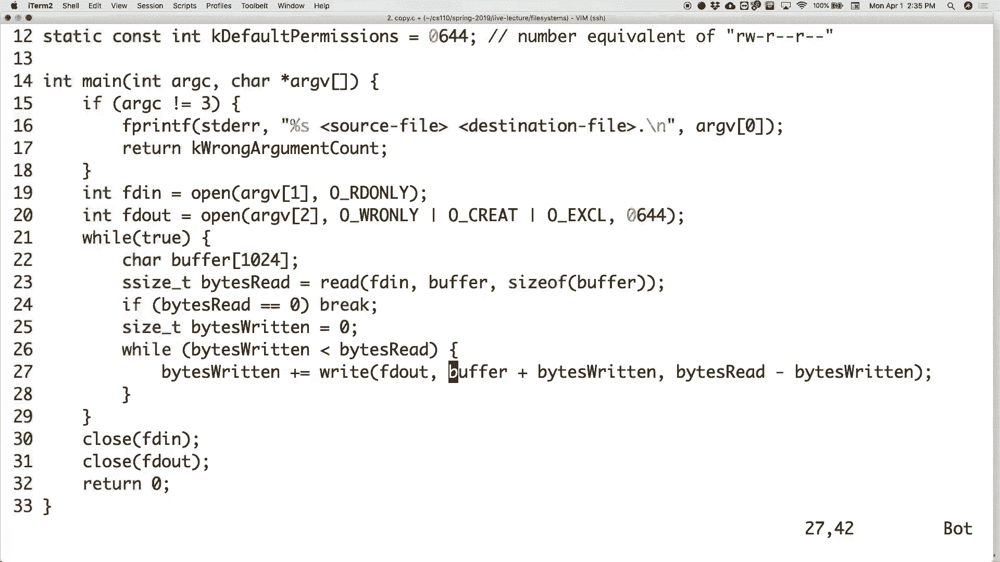

 and that's how it works okay and then you should remember to close your files at。

 the end we do use value grind to make sure that you do that okay make copy there。

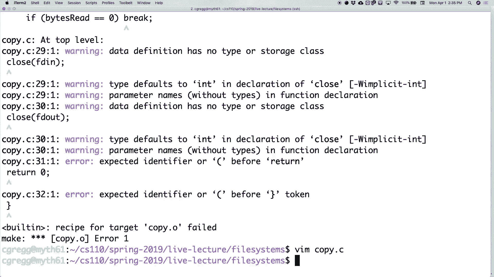

 is copy okay let's do copy dot c to copy copy dot c and diff copy dot c and copy。

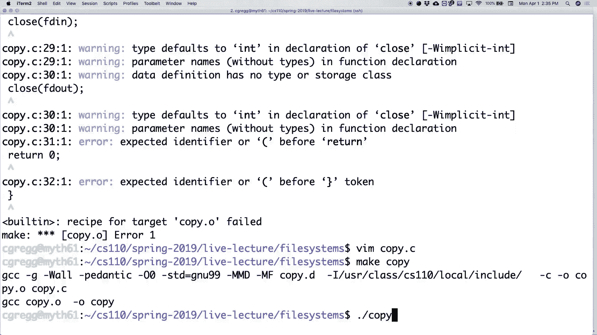

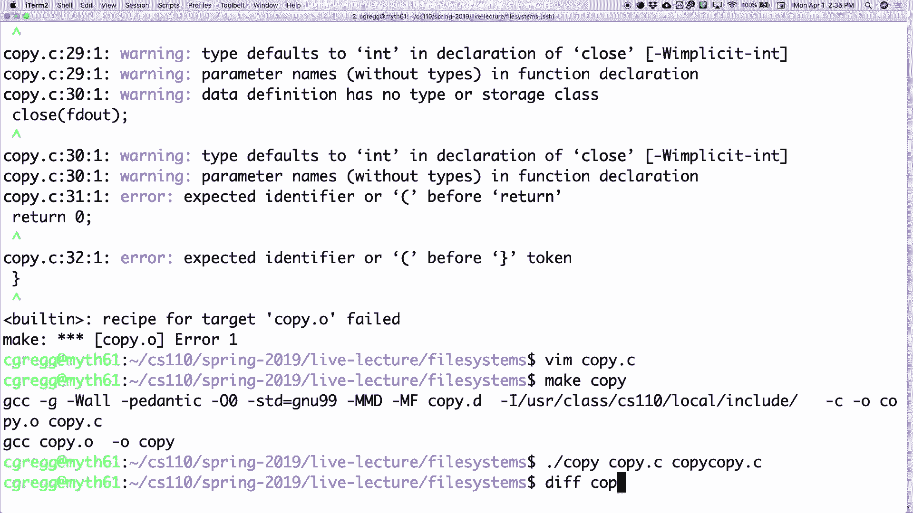

 copy dot c and copy copy dot c there we go they're the same okay so that's how。

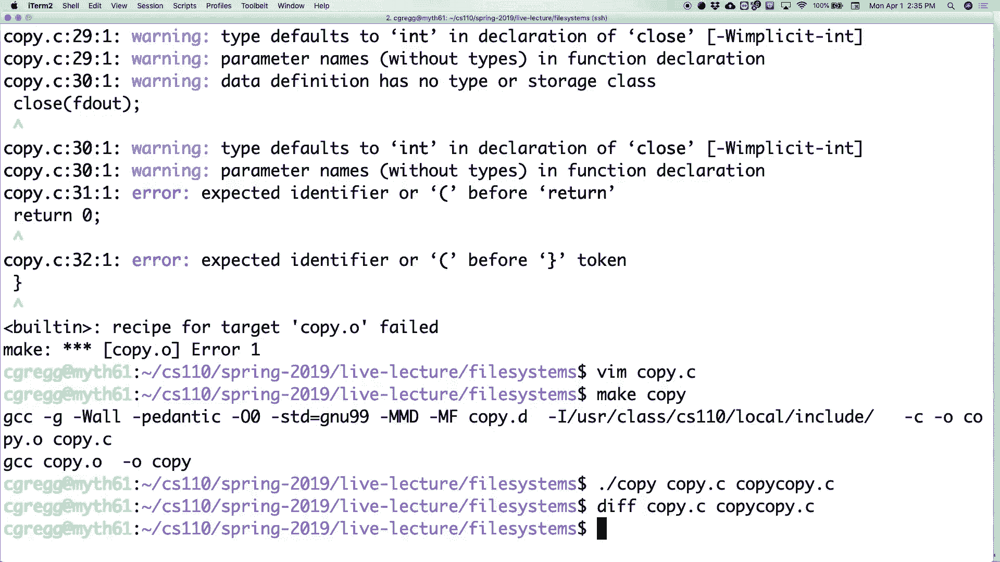

 that worked not too difficult as far as like what's going on but there's some。

 nuances in there you can't write all the bytes at once and expect that they all。

 wrote you can't read all the bytes at once necessarily and expect they already。

 except in this case it does we know that it blocks before it does that okay and。

 that's the that's the way the copy program works and the copy program on。

 your computer is not that much more the CP command is not that much more advanced。

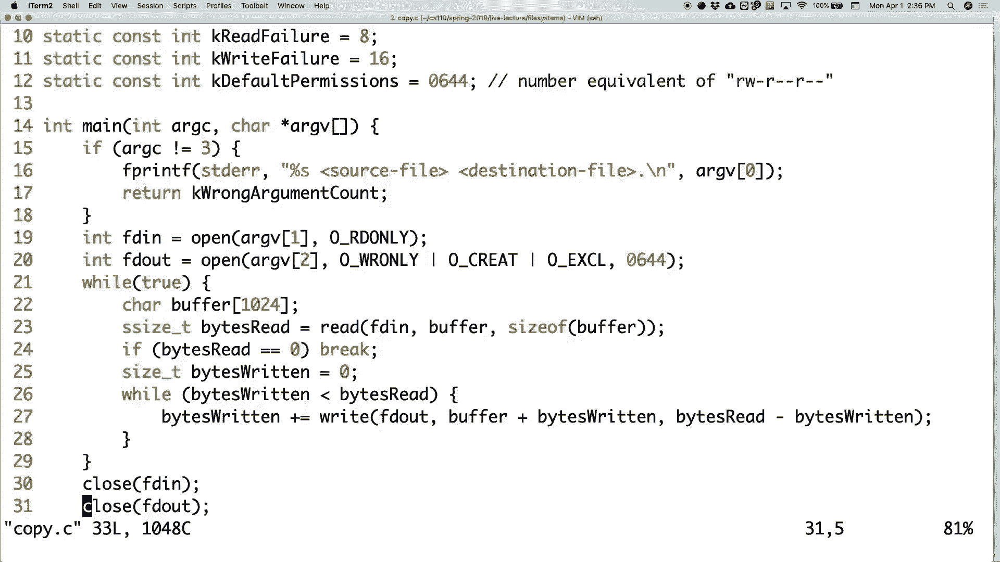

 than this okay all right so a couple other things about this like I said you。

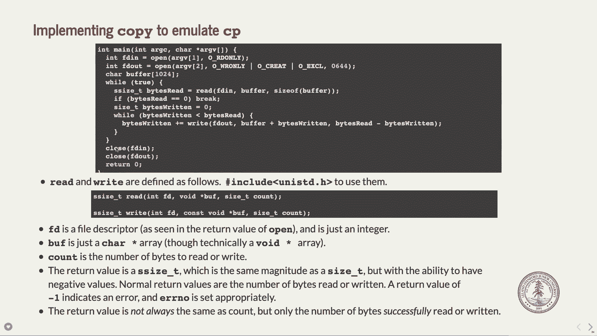

 should close your files as you do that and let's see what else oh if you are。

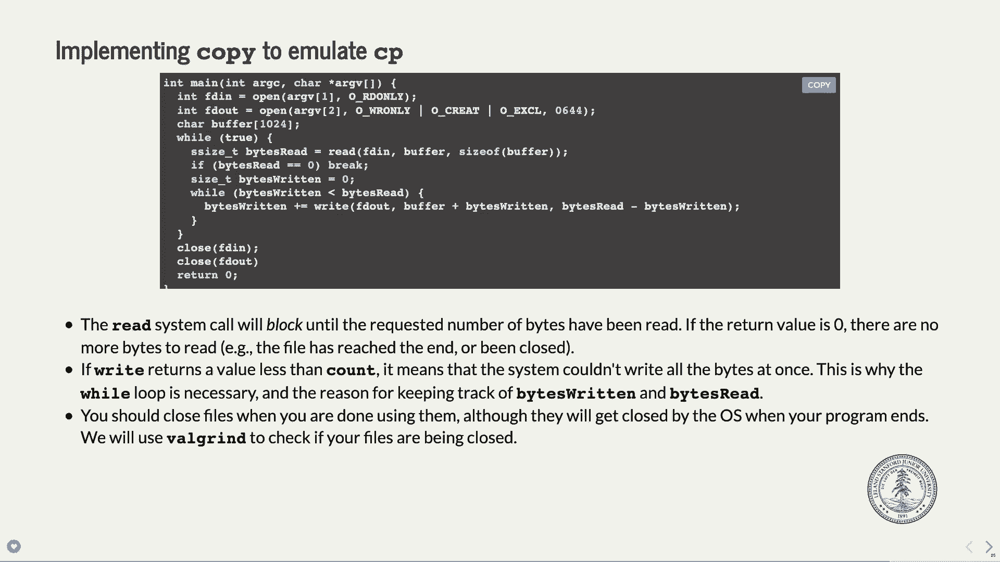

 used to C and C++ lots of times you'll use what we call file pointers uppercase。

 F I L E and IO streams and so forth that's a higher level that uses read and。

 write I don't for you basically it knows how to do those those while loops and。

 so forth why are we doing it in this class where we use read and write。

 sometimes you have to because of the types of things you're doing and。

 sometimes you want to because you you know you want to get that lower level。

 access which might be faster which isn't buffered and so forth and you might。

 actually want that okay a lot of times you use streams and other than file pointers。

 because it's just easier go for it in this class most of the time we use read。

 and write because we need to for various reasons okay let's stop there ten。

 minutes early if you have questions come on up I'll stick around until the。

 end of class Wednesdays next class and we'll see you then。

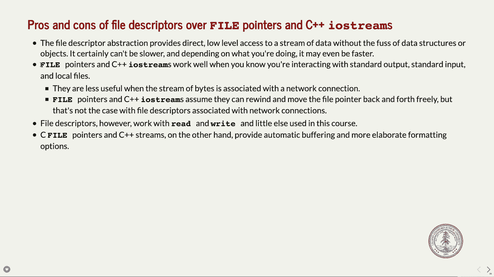