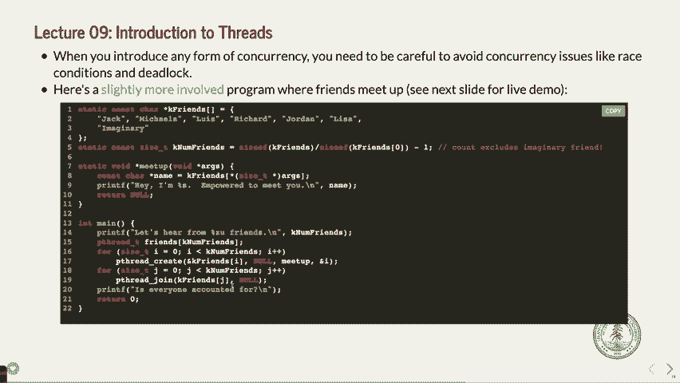
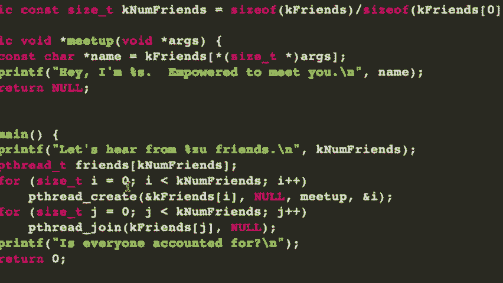

# P10：Lecture 9 Introduction to Threads - ___main___ - BV1ED4y1R7RJ

 Well， it must be sunny in 92 degrees outside because it looks like half of the people are here。 Welcome。 Thank you for coming on this nice beautiful sunny day。 You get air conditioning if you're in this building， so that's good。 So。 a couple of quick announcements。 Hopefully， hopefully assignment three is going well。 I will stay。

 I will kind of have many officers right after lecture today in 219 in gates for about an hour。 hour and 15 minutes or so。 So， if you want to come by and ask some questions about the assignment。 feel free。 Remember， the assignments do on Sunday。 There won't be any office hours Friday， Saturday。 So， you'll be a Catholic Lion， Piazza， or Sunday office hours。

 which may be jammed because lots of you will go。 So。 just keep plugging away before the weekend if you can on the assignment。 Second quick announcement is that the midterm is next Thursday。 Yeah， next or week from Thursday。 and it's going to be in the evening。 If you do have an OAE accommodation。

 haven't sent me something about that yet， please do。 Otherwise。 or if you have to take an exam during a different time because you've got some conflict。 also please email me sooner than later。 I will put up some practice exam exam exam exam。 I told somebody on Piazza today， I may do it tomorrow， but it will be in the next day or two。

 some practice exams。 And we're going to go over a couple more practice problems today that are from previous exams and the kind of things you might see that it's good to get your answers out now。 You have those。 Alright， so let's go back。 Let's actually do a quick review on this problem because right after class。

 about 20 of you had lots of good questions still about this problem。 So。 let's talk about a particular answer， which is this one。 I think this is the answer that most people said， "Wait。 I don't understand why this answer couldn't happen。"， So。 let's quickly just go back over this program again。 Here's what it is。 We've got the main function has a signal handler in it。 And the signal handler is going to be for SIG user one。 That is not any particular type of signal。 It's for the user or your program to use to send to a different process。 So。

 you don't need to send some specific signal。 That's the signal。 It's kind of a generic one to send。 And what this says is set up whenever a SIG user one comes in， call the bat function。 which is up here。 The bat function simply prints pirate and then does an exit zero。 And exit zero means that it never makes it back to the main program。

 which got interrupted when the signal handler comes in。 Okay。 It does， there's a fork in here。 And then the fork， if you're the child， you're going to print ghost and then return zero。 That doesn't immediately exit the program， but it does close the program because you're returning from main。 So that's that's that。 And then if you are not the child in this case。

 we are going to send the SIG user one signal to the PID。 which in this case is the return value from fork means it's the child that we're actually sending this to。 And then after that， it will print ninja。 So that's how it works。 We are assuming a couple things about this program that I might not have been quite clear about。

 Print apps are atomic in this case。 That means that if you are in the middle of a print app statement。 you will the print app statement will happen。 Okay。 And to completion。 So first of all。 you won't get things like G H and then it'll go into the signal handler。 You will get the print of the whole print app or not。 So this is true for all operating systems。

 We don't know， but we're assuming that for here。 The second thing we're assuming is that if a signal handler comes into the child process。 let's say， it will， unless you are like finished with the program， like it's already completed。 then it will actually get called。 So even if you print ghost and then the signal handler happens in the middle of that。 it will before this return zero go and call this function here。 Okay。

 So that's the basic ideas here。 Now， the question is。 can you get ninja ghost to print out using our assumptions here？ Okay。 And we say that that's no。 And you might have some questions about what's what could happen。 Let's just look at what that would entail doing printing ninja and then ghost。 Well。

 it would mean in Maine， we would fork。 Okay。 And then before ghost got printed。 the parent process would call the kill or call a signal， the child， and then print ninja。 Okay。 Now。 the parent could signal the child and print ninja before the child does anything。 That absolutely could happen。 So you certainly could get ninja to print first。 Okay。

 That could be a thing。 But let's see if you could get it so that it prints ghost after you print ninja。 but before pirate would ever get printed。 And that's actually not really possible in this program。 And let's see why。 Let's see what would have to happen for that to be the case。 Okay。 So let's say that you fork， we're not going to be inside print F yet by the time print F ninja happens。

 Okay。 Or even if we were that even if that even if we were， that's okay。 But the point is that print F ghost， if it's happening。 then the signal has not reached the child yet。 Okay。 So that's the， that's going to happen。 Now。 you'll agree， hopefully that if you print print F ghost before you even send this signal。

 obviously ghost is going to get printed before ninja and then you could not print ninja first。 So that's the first thing。 Okay。 Let's assume then that maybe you're in the mid。 maybe the child is about to print ghost。 And this signal comes in。 Well。 if it's about to print ghost， then the signal could happen。 Okay。

 If the signal happens then pirate would get printed and then the program would exit。 So that's not going to happen。 That's not the case here。 Let's say that even in the like most generous case。 let's say we were just about to print ghost or maybe we were just in the middle of print， just。

 you know， one line away in the assembly code for printing ghost。 The signal happens and then the。 and then it's， it stops right before it prints ghost and let's even assume。 we can even assume that the signal handler won't get called。 Let's just even assume that。 And then ninja gets printed。 So we do get ninja and then we get ghost printed， let's say。 Okay。

 If we get ghost printed， the signal has already been sent to the child。 It will because there's still the return here before that the signal handler will happen。 And therefore you would end up going into the signal handler and printing pirate。 So there's really no way to have print ups be atomic print ninja first somehow call the signal handler or have the signal handler not actually trigger the signal in the child。

 Print ghost and then have this program or the child go to completion， not really possible。 Okay。 Question。 You could。 I mean， if you， so I guess your question is why， why right before print F。 Let's say that the signal came in before print F。 Well。 we would assume that it would get it would get signal。 Here's what happens in a program。

 The when you when it's program gets a signal， it immediately happens for that process。 When a process gets a signal。 So it will happen if it's have， if it comes in before the print F。 then the signal will happen before the print F comes in during the print F。 It'll happen right after the print F。 Okay。 And then that's。

 and then it would still happen in that case。 It wouldn't be the case that you get two statements happening before the signal handler if the signal has already been come into the program。 but it wouldn't happen necessarily in the middle of the print F。 Yeah。 Awesome。

 Is it safe here in the child when you return zero or you can then turn the signal with a parent？

 Yeah。 Good question。 You return zero before you send the signal to parent。 Yeah。 Is there the only way in which pirate would get printed out？ Now， there's。 I was talking to somebody after class， but this is definitely a little nuanced。 When you do return zero， well， there's， there's still another function which called main。

 It's begin with in not in your program， but it still might be the case that your signal handler is still set up。 So it still might get called even right after the return zero。 But at some point later。 the signal handler will be destroyed while the program is being destroyed。 Okay。 Any other questions on that one？ I think that was a tricky one because you have to kind of be really nuanced about when the signal is happening in relation to all the print F's and so forth。

 Pretty good on that one。 Okay。 Let's look at another one here。

 I will zoom in a little for this one。 So this is another program。 Same sort of thing。 This was a problem on a midterm exam in the past。 You should assume that print F's are atomic processes run to completion。 et cetera。

 And then everything succeeds。 And I want you to list all the possible outputs for this program。

 Okay。 Why don't you do this？ Take about a minute， two minutes or so。 look through the program and just start thinking about it。 Talk to your neighbor about that。 I'll walk around and you can do that。 Start thinking about it。 Then we'll go through how I would think about it。 Okay。 Don't be too scared of like， "Oh。

 how am I going to analyze this whole thing？" But you do need to kind of dig in and go， "Okay。 I've got to think about all the different parts here。"。 So go ahead and do that for a couple minutes， two or three minutes， let's say。 And we'll talk about it。 I'll feed that。 [silence]， [silence]， [silence]， [silence]， [silence]。

 [silence]， [silence]， [silence]， [silence]， [silence]， [silence]， [silence]， [silence]， [silence]。 [silence]， Let's take one more minute。 One more minute。 [silence]， [silence]， All right。 First of all， you probably should not be able to do this problem in the five minutes that I gave you。 So don't think， "Oh， no， he's assuming we can do this so quickly。"。

 That's okay。 At least， hopefully you thought about it for a second。 I guess my first question about this， what's going to absolutely get printed out first？ One。 What's absolutely going to get printed out last？ Five。 Yeah。 it's the middle stuff that we have to actually think about a little bit almost。

 What's going to get printed second to last always？ Six， actually。 It's that middle stuff that we have to think about。 Here's how I would do that。 Now， if that。 if you're like， "I know that，" let's go through how I would have figured that out。 Okay？

 So the program's going along。 Okay， there's a counter。 Here's what I would generally do。 If I was looking at this program， I would say， "Fine。 I have a parent here。" Okay？

 And the parent has a counter that starts out at zero。 Okay？ And I would go down and say， "Okay。 fine。 This while loop， the counter is definitely less than two， and then we immediately fork。" Well。 when we fork， I'm going to say， "Okay， fine。 Now there's a child，" child。 There we go。 with a counter that's also zero。 You get why that's the case， it gets copied。 Okay？

 The counter gets copied。 Then I would just keep going here and I'd go， "Alright， well。 let's look at the next line。"， And remember， there's two processes doing this now。 If the PID return value for fork is greater than zero， well， it means we're the parent。 We immediately break out of this while loop， and we never go back to the while loop。

 So the parent comes down， and well， the parent is down now down here。 If the counter is greater than zero， well， the parent's counter is not greater than zero。 It doesn't do that。 If the PID is greater than zero， sure。 the parent's return value for PID is greater than zero because it's the child's PID。 Therefore。

 we have to wait for the child。 Wait for child。 And in fact。 I'll put child one because there's going to be another child in here in a minute。 Okay？

 Wait for child one， and then after that happens， well， then we add five to the counter。 Meaning the counter is not going to be five。 Counter equals five for the parent。 and then we print five。 But that has to happen after the child won't end。 So it's certainly not going to happen first if anything else happens in the middle。 So far so good。

 Okay。 Then let's start looking at what the child's doing。 We're done with the parent for now。 We'll get back to when that happens in a minute。 The child won。 Well， all right。 So we say if PID is greater than zero， break， we don't break。 So child won。 Well。 its counter becomes one， and then it immediately prints one。 Print one。

 So we're definitely going to get one printed。 Before anything else happens。 there's no other way that could logically， anything else could logically happen。 Okay。 All right。 And we've updated counter。 Now we go back in the while loop。 This is the child now。 Goes back into the while loop。 Counter is still less than two。 Looks like it there。

 And we fork again。 So you go， oh boy。 Okay。 Well， now we've got child two。 And child two has a counter that starts out with what's value。 One because it's being produced from the child。 Okay。 And then you kind of consider this now the new， like， parents。

 It gets a new value of PID because it's changed it。 It actually reset its value of PID to the turn value of fork。 It's no longer zero。 So PID is greater than zero for this child。 What does this child do？ Well， it breaks。 And so then it goes down here and counter is greater than zero。 Okay。

 So then we definitely print one。 Now， we don't necessarily do this immediately。 We've got some other things that are happening here。 We didn't do any waiting in here。 We definitely know we're going to print the one down here somewhere。 So that's going to happen at some point。 We just don't know exactly when yet。 Okay。

 Then what is it going to do？ Well， PID is still greater than zero because it's the return value for the child ones fork call。 which means it's the PID of child two。 Therefore， we're going to wait for child two。 And then we're going to print what？ Counter plus five。 So counter is going to be equal to six。 And then we're going to print six。 Okay。 And that's going to happen at some point。

 It's definitely true that the six is going to happen after the one because there's no other way in this logic。 It could happen。 But you don't know when in the relationship to the rest of the program is going to happen yet。 So then you go over to the child two and you go， okay， fine。 What's happening here？ Well。 child two is not。 It's PID that return value from fork is not greater than zero。

 It's zero because it's the child of the fork call。 Therefore， we update its counter to two。 And then we print it out。 Print two。 Okay。 But we don't really know when that happens。 That doesn't necessarily happen before this one。 It could。 But it might not happen。 We don't know yet。 Okay。 And that's a race condition in that case。 All right。

 But then what does it do？ It goes back to the top of the while loop counter is not less than two anymore。 Therefore， it exits the while loop。 And then if counter is greater than zero。 it's going to print the counter。 Well， guess what？ It's got to print two again。 We don't know exactly when we know this two is going to happen after this two。

 But it's not really easy to tell in that case。 Like it doesn't really matter in that case because the first。 one goes to and it doesn't really matter。 But that's going to happen there。 And then it goes here and PID is greater than zero。 Well， it's not。 It's the final child。 And so it's PID value。 It's return value from fork was zero。 So it's just going to end。 Okay。

 So logically， let's see what happens。 We definitely print this one first。 That has to happen。 Okay。 Then we have a couple different things could happen。 We could print this one or this two or this two in any or this one。 So we could print one， two。 two or we could print one and then one two or sorry two one two。 That's a one in there two。

 one two or we could do one and then two， two， one。 Because any of those things could happen anywhere。 Nobody's waiting for anybody between this one and these two twos。 Okay。 They could have two。 Okay。 They could happen in kind of anywhere。 Then by the time this two does finally print， right。

 well then we definitely go back into the waiting here。 And what happens there？

 We have to print the six because this one's waiting for a child to end。 Okay。 And the only time that can happen is after that other two there。 Okay。 And it has to end。 The six has to happen after this one because there's no other way for that to do that in child number one。 Okay。 And so then the six happens in all of them。 And then this child ends。

 Therefore we're waiting for that child。 We definitely then definitely print five。 So those are the three possible outputs。 Okay。 I think that would be hard to do in your head。 Right。 So I think you should like catalog this stuff and write it down as you go and you should be able to like get there eventually。 What questions you have about that？ Everybody good on that one？ Good。 That one's not。

 That one takes a little bit of thinking but hopefully isn't too too bad。 And five minutes is probably not quite enough time to go from the beginning there。

 Now what would happen if we now change the counters greater than zero to the counter greater than or equal to zero？

 Right here。 Well now you've got all sorts of other things that could happen。 Now the both the parent of the basically the original parent now is going to print its own counter which at that point is what？

 Zero still。 Well that could happen before the one。 If it happened before the one that would give you three more different outputs。 It could happen after the first one。 That's going to be three more。 It could happen after the second one because nobody's waiting for anybody in this case。

 It could happen after the next one。 Three more。 Could happen after the next one。 Three more。 Could it even happen after the six？ Probably。 Right。 Because you could actually get the six happens after the or is it this would take a lot of like weirdness kind of in the schedule but it could nothing stopping it from saying the other two process are going to go and go to completion。 before we even get to here in the original parent。 So it could happen there。 That's another three。

 Three six nine twelve fifteen eighteen eighteen new total cases now that you could do and you wouldn't want to write all those out of guess but you wouldn't ask it necessarily。 Right。 Question。 No question。 You're good。 Yeah。 That's definitely a like that's a more I think that's kind of the more challenging one at the moment because you have to go oh now it's happening and you don't really want to write all eighteen out although probably students did。

 Okay。 Other questions on this question before we go on to the next one。 All right。 Good。 Okay。 Let's see。 There we go。 Eight more。 Okay。 Here's another one。 Consider the following program。 That's a pattern here。 Right。 Assume that each call flushes to output to the console and full that basically means that it's atomic and further assume that none of the system calls fail same sort thing before fork doesn't fail wait PID only returns negative one because there are no child processes at the moment that it。

 decides to return its return value。 Okay。 And the first question is what's the output of this program。 And notice that what is the output of the program。 You'll probably want to look through this and go oh that means no。 That means there's probably only one output。 Let's see if I can figure it out。 So go ahead。

 Take a few more minutes and do that。 Okay。 Okay。 Okay。 Okay。 Okay。 Okay。 Okay。 Okay。 Okay。 Okay。 Okay。 Okay。 Okay。 Okay。 Okay。 Okay。 All right。 30 more seconds。 Okay。 Okay。

 Okay。 Okay。 Okay。 Okay。 Okay。 Okay。 Okay。 Okay。 Okay。 Okay。 Okay。 Okay。 Okay。 Okay。 Okay。 Okay。 Okay。 Okay。 Okay。 Okay。 Okay。 Okay。 Okay。 Okay。 Okay。 Okay。 Okay。 Okay。 Okay。 Okay。 Okay。 Okay。 Okay。 Okay。 Okay。 Okay。 Okay。 Okay。 Okay。 Okay。 Okay。 Okay。 Okay。 Okay。 Okay。 Okay。 Okay。 Okay。 Okay。 Okay。 Okay。 Okay。 Okay。 Okay。 Okay。 Okay。 Okay。 Okay。 Okay。 Okay。 Okay。 Okay。 Okay。 Okay。

 Okay。 Okay。 Okay。 Okay。 Okay。 Okay。 Okay。 Okay。 Okay。 Okay。 Okay。 Okay。 Okay。 Okay。 Okay。 Okay。 Okay。 Okay。 Okay。 Okay。 Okay。 Okay。 Okay。 Okay。 Okay。

 Okay。 Okay。 Okay。

 Okay。 Okay。

 Okay。

 Okay。 Okay。 Okay。 Okay。 Okay。 Okay。

 Okay。 Okay。

 Okay。 Okay。

 Okay。 Okay。

 Okay。 Okay。 Okay。 Okay。 Okay。 Okay。 Okay。 Okay。 Okay。

 Okay。 Okay。

 Okay。 Okay。

 Okay。 Okay。 Okay。

 Okay。

 Okay。

 Okay。

 Okay。

 Okay。

 Okay。 Okay。 Okay。 Okay。 Okay。

 Okay。

 Okay。

 Okay。 Okay。

 Okay。

 Okay。

 Okay。

 Okay。

 Okay。

 Okay。 Okay。

 to all ours。 See you in lab or next week。

