# 课程 P10：进程与信号分析实战 🧩

在本节课中，我们将通过分析几个涉及进程创建（`fork`）、信号处理以及进程间同步的复杂C程序，来深入理解并发编程中的竞态条件和确定性输出。我们将逐步拆解每个程序，明确其执行流程和所有可能的输出序列。

---

## 概述

本节课将重点分析三个具有挑战性的编程问题。每个问题都涉及`fork`、信号和`wait`系统调用。我们的目标是运用对进程和信号机制的理解，推导出程序所有可能的输出结果。关键在于理解操作执行的原子性、信号处理的时机以及进程间的父子等待关系。

---

## 问题一：信号处理与输出顺序

上一节我们回顾了进程的基本概念。本节中，我们来看看一个结合了信号处理的程序，分析其输出的可能性。

考虑以下程序：
```c
#include <stdio.h>
#include <stdlib.h>
#include <signal.h>
#include <unistd.h>
#include <sys/wait.h>

void bat(int sig) {
    printf("pirate\n");
    exit(0);
}

int main() {
    signal(SIGUSR1, bat);
    pid_t pid = fork();
    if (pid == 0) {
        printf("ghost\n");
        return 0;
    } else {
        kill(pid, SIGUSR1);
        printf("ninja\n");
        wait(NULL);
    }
    return 0;
}
```
**假设条件**：
1.  `printf`语句是原子的（即执行时不会被中断）。
2.  信号处理器会在子进程结束前被调用（除非程序已完全终止）。

**核心问题**：输出序列 `ninja` `ghost` 是否可能出现？


**分析过程**：
1.  父进程`fork`出子进程。
2.  父进程执行`kill(pid, SIGUSR1)`向子进程发送`SIGUSR1`信号，然后打印`ninja`。
3.  子进程打印`ghost`，然后`return 0`。

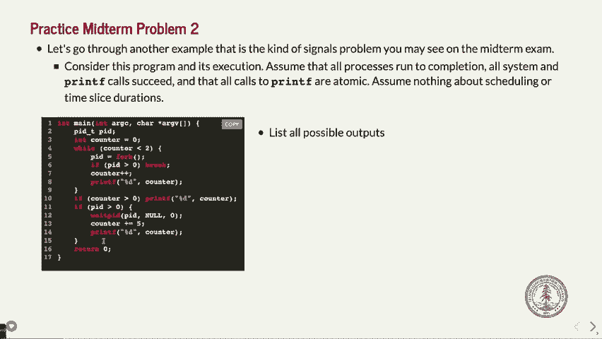


要出现`ninja`先于`ghost`打印，父进程必须在子进程打印`ghost`前发送信号并执行自己的`printf`。这在理论上是可能的。


然而，要使得`ghost`在`pirate`之前打印，则要求信号在子进程打印`ghost`之后、但在其从`main`返回之前才被传递和处理。但一旦信号发出，在子进程执行流程中（包括`printf("ghost")`和`return 0`之间），信号处理器随时可能被触发。如果信号在`ghost`打印后、返回前被处理，则会执行`bat`函数打印`pirate`并`exit(0)`，导致`ghost`后的`return 0`不会执行。

因此，**输出序列 `ninja` `ghost` 不可能出现**。可能的序列是`ghost` `ninja` `pirate`或`ninja` `pirate`（后者发生在信号在子进程打印`ghost`前就已传递并处理的情况下）。

---

## 问题二：多级fork与循环计数器

理解了信号的影响后，我们来看一个更复杂的多进程创建案例。本节将分析一个包含循环和条件分支的`fork`程序。

考虑以下程序：
```c
#include <stdio.h>
#include <unistd.h>
#include <sys/wait.h>

int main() {
    int counter = 0;
    while (counter < 2) {
        pid_t pid = fork();
        if (pid > 0) {
            break;
        }
        counter++;
        printf("%d", counter);
    }
    if (counter > 0) {
        printf("%d", counter);
    }
    pid_t pid = fork();
    if (pid > 0) {
        wait(NULL);
        counter += 5;
        printf("%d", counter);
    }
    return 0;
}
```
**假设条件**：`printf`是原子的，所有系统调用成功。

**问题**：列出程序所有可能的输出序列（每个数字代表一次`printf`输出）。

**逐步分析**：

1.  **初始状态**：`main`开始，`counter = 0`。
2.  **第一次循环**：
    *   `fork()`创建子进程1（Child1）。
    *   父进程：`pid > 0`，执行`break`跳出循环。随后`counter`为0，不满足`counter > 0`，跳过第一个`if`。执行下一个`fork`。
    *   子进程1：`pid == 0`，`counter`增至1，打印**1**。
3.  **子进程1的第二次循环**：
    *   `counter`为1，满足`while`条件。
    *   `fork()`创建子进程2（Child2）。
    *   子进程1（作为Child2的父进程）：`pid > 0`，跳出循环。此时`counter`为1，满足`counter > 0`，打印**1**。执行下一个`fork`。
    *   子进程2：`pid == 0`，`counter`增至2，打印**2**。`counter`为2，不满足`while`条件，退出循环。`counter > 0`成立，再次打印**2**。执行下一个`fork`。
4.  **关键执行路径与等待关系**：
    *   父进程在等待其`fork`产生的子进程（即Child1）终止。
    *   子进程1在等待其`fork`产生的子进程（即Child2）终止后，才执行`counter += 5`（变成6）并打印**6**。
    *   子进程2没有子进程需要等待，直接结束。
5.  **确定性与非确定性**：
    *   第一个打印的**1**（来自Child1）是确定的。
    *   最后一个打印的**5**（来自初始父进程，在等待Child1结束后`counter=0+5`）是确定的。
    *   子进程1打印的**6**（在等待Child2结束后）是确定的，且位于第一个**1**之后、**5**之前。
    *   子进程1打印的第二个**1**和子进程2打印的两个**2**，它们之间的执行顺序是**非确定性的**（竞态条件）。

以下是所有可能的输出序列（括号内为打印进程）：
*   1(Child1), 1(Child1), 2(Child2), 2(Child2), 6(Child1), 5(Parent)
*   1(Child1), 2(Child2), 1(Child1), 2(Child2), 6(Child1), 5(Parent)
*   1(Child1), 2(Child2), 2(Child2), 1(Child1), 6(Child1), 5(Parent)

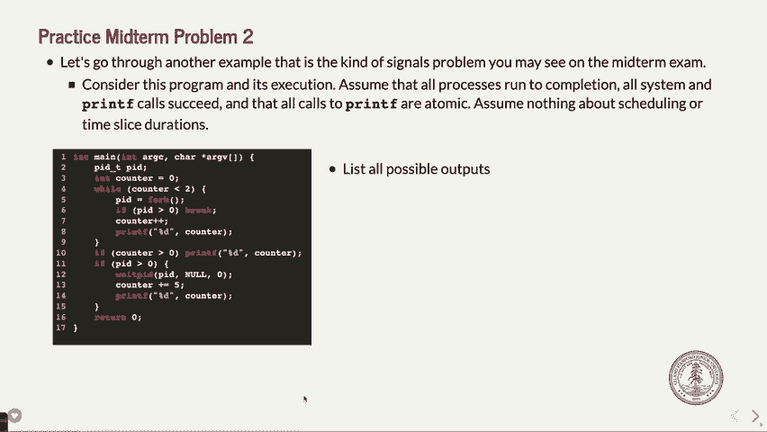

**变体思考**：如果将`if (counter > 0)`改为`if (counter >= 0)`，那么初始父进程也会打印其`counter`值0。这个0可以出现在第一个1之前、之后或中间两个数字的任意位置，导致可能的输出序列数量大幅增加。

---

## 问题三：waitpid与进程链


分析了平行分支后，我们最后考察一个线性进程链的场景，重点在于`waitpid`的返回值如何影响流程。

考虑以下程序：
```c
#include <stdio.h>
#include <unistd.h>
#include <sys/wait.h>


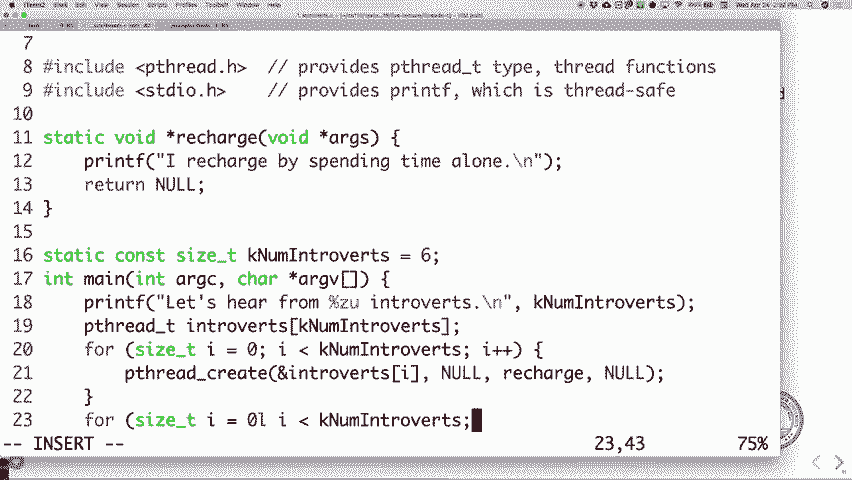


int main() {
    printf("0");
    pid_t pid = fork();
    if (pid == 0) {
        printf("1");
        pid_t pid2 = fork();
        if (pid2 == 0) {
            printf("2");
            return 0;
        } else {
            waitpid(pid2, NULL, 0);
            printf("3");
            return 0;
        }
    } else {
        // 父进程
        int status;
        // waitpid 可能失败，因为子进程可能已结束
        pid_t ret = waitpid(pid, &status, 0);
        if (ret > 0) {
            printf("4");
        } else {
            printf("5");
        }
        printf("6");
    }
    return 0;
}
```
**假设**：`printf`原子且刷新，`fork`成功。`waitpid`在目标子进程不存在时返回-1。


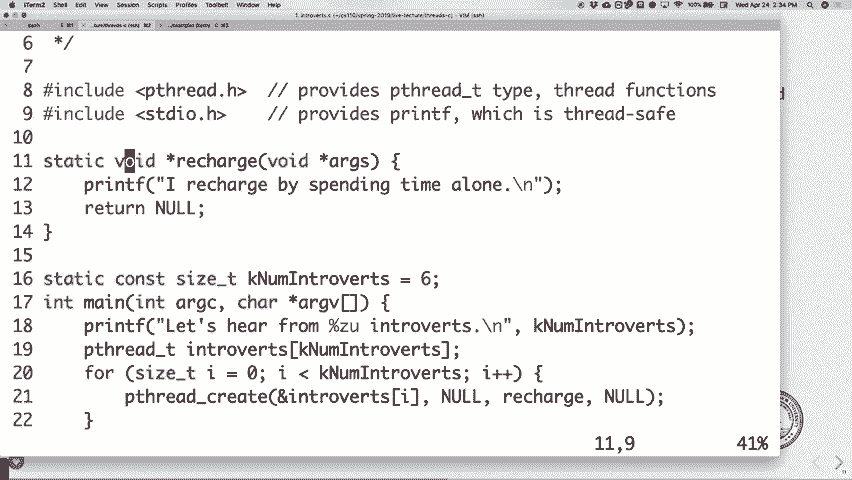


**问题**：程序的输出是什么？


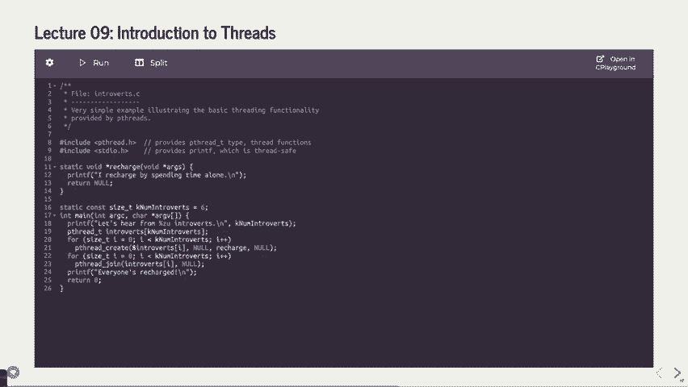

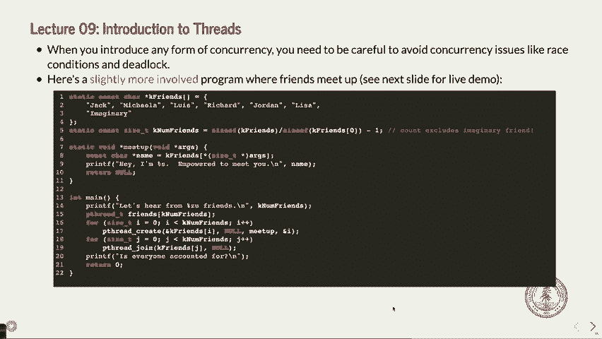

**分析过程**：
1.  初始进程（P0）打印**0**，然后`fork`出子进程P1。
2.  **P1（子进程）执行流**：
    *   打印**1**。
    *   `fork`出孙子进程P2。
    *   P2（孙子进程）：打印**2**，然后`return 0`结束。
    *   P1：调用`waitpid(pid2, ...)`等待P2。P2结束后，P1打印**3**，然后`return 0`结束。
3.  **P0（父进程）执行流**：
    *   调用`waitpid(pid, ...)`等待P1。
    *   **关键点**：这里存在竞态条件。P0的`waitpid`调用时，P1可能已经结束（如果P0被调度得较晚），也可能尚未结束。
    *   如果P1尚未结束，`waitpid`成功等待到P1，返回P1的PID（>0），打印**4**。
    *   如果P1已经结束，`waitpid`失败，返回-1，打印**5**。
    *   最后，P0总是打印**6**。


因此，该程序有**两种可能的输出**：
1.  **0 1 2 3 4 6** （当P0的`waitpid`成功等待到P1时）
2.  **0 1 2 3 5 6** （当P1先于P0执行`waitpid`而结束时）

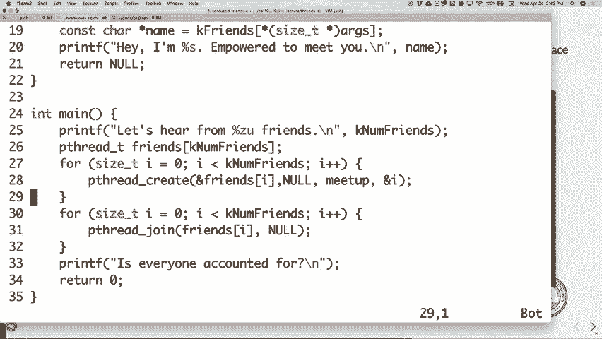


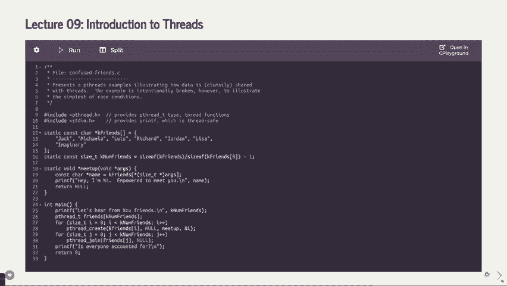

---

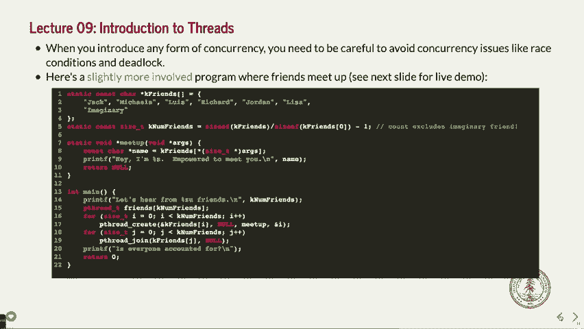


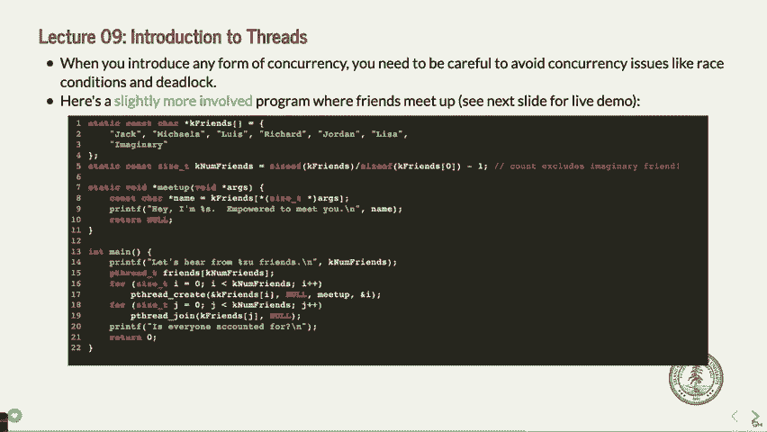

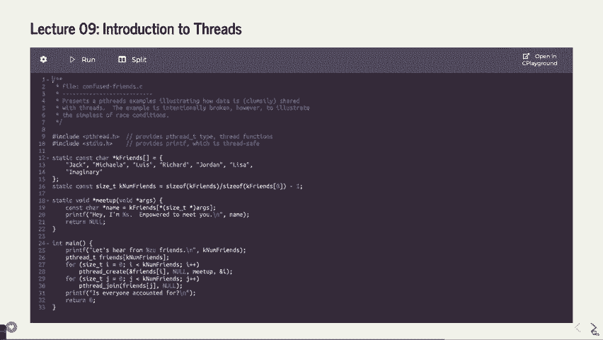

## 总结


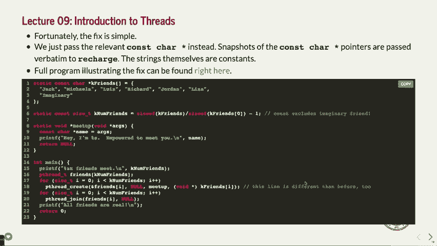


本节课中，我们一起深入分析了三个涉及多进程和信号的复杂编程问题。

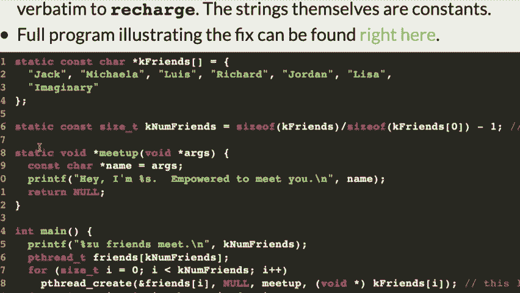


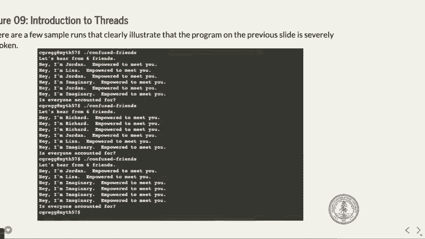

*   在**问题一**中，我们学习了信号处理函数的执行时机如何严格限制输出序列的可能性，`ninja ghost`的顺序由于信号处理的必然介入而无法实现。
*   在**问题二**中，我们练习了通过画进程树或跟踪执行流来分析多级`fork`和循环，明确了确定性与非确定性（竞态条件）输出的部分，并推导出所有可能结果。
*   在**问题三**中，我们看到了`waitpid`的返回值如何依赖于进程调度的时序，导致程序存在两种不同的合法输出路径。


掌握这些分析技巧对于理解和调试并发程序至关重要，也是应对相关考试题目的关键。