# P11：第10讲 从C线程到C++线程 - ___main___ - BV1ED4y1R7RJ

欢迎大家。好，欢迎来到现场的19位同学。不是的，观看视频的同学更多。现场的人比这多。所以第三次作业，希望大家都做得还不错。关于竞争条件的问题，Piazza上有很多提问和讨论，这类问题会经常遇到。

你将在做多进程时遇到这些问题，也包括多线程，这是我们今天要讨论的内容，你将在这周的作业中进行更多的多进程实践，然后在期中考试中也会做一些相关练习。所以这一周任务重。虽然我觉得自己有点落后了，但今天我们会继续往前走。期中考试定于星期四。

考试时间是晚上6点到8点，地点是Hewlett 200教室，就在大厅对面。不是这里，不要坐在这里想“大家在哪里？”考试在对面。如果你需要参加替代考试，希望你已经通过邮件联系我了。如果还没有，请今天发邮件给我，以便我可以做好相关安排，其他需要特殊安排的同学也是如此。

做好准备。我计划今晚给已经和我联系过的同学发邮件。期中考试将使用Blue Book。谁用过Blue Book？请举手。大约一半同学用过。对另外一半同学来说，Blue Book是这样的：你将你的笔记本电脑加载一个程序。

你将使用它来参加考试并提交给我们，然后我们会以数字方式批改。Blue Book的好处在于，你可以键入答案。一些人认为这很不错，但它和纸质考试很像，因为我们不能编译代码，也不能查找资料。

你不能在应用程序中复制粘贴等，但你应该在来参加期中考试之前先在电脑上把它弄好。考试内容是加密的，我们会在周三晚上或周四早上发布，你可以下载并开始考试。

当你进入考场时，我们会给你一个密码，然后考试会在电脑上开始，并且是限时的。如果因为某种原因你没有笔记本电脑，或者你的电池在五分钟后就没电了，你应该尽早联系我，这样我们可以为你提供另一台笔记本，或者如果是电池问题，我们会提供一些插座，但这些插座并不是每个人都能用到的。现在大多数同学的笔记本电池能用两个小时，虽然我知道有些同学的电脑电池可能更差。

考试会持续一个半小时，你需要靠近电源插座。我们会提供一些插座，但并不是每个人都有。你可以带一张纸，前后可以写上自己的笔记。请不要带放大镜之类的设备，普通眼镜就可以了，不要带显微镜这种设备。我记得我在106D课上也和同学们说过类似的话。

我曾经听说过，也曾提到过，最近有人说过，一个教授曾经说过，你可以带任何东西进入考试，无论是笔记还是其他什么东西。结果有个人带进来了一个研究生，直接把他放在旁边就完事了。不是，你只能带一张纸进入考场。

我们还会，那个，刚才那个笑话终于说完了。我们还会给你一张稍微有限的资源表。它看起来大致是这样的，基本上给你提供所有的。

函数所需的原型之类的东西，然后是一些你会需要的特定常量之类的内容。我们并不是要让你记住这些东西。所以在考试过程中，如果你忘了怎么做，那大概也不重要。我们并不会真的去编译你的代码。

但是不管怎样，我们并不是要测试你在这一方面的能力。尽力去做这些事情吧。我们来看看。我觉得差不多就这些了。这是我在期中时的所有评论。有问题吗？

关于期中评论。它是一个两个小时的考试。我会尽量让大多数人在一个半小时内完成。我不想让这次考试成为测试你们能否快速完成难题的能力，因为有时候这些题确实很难。

很棒的问题。格式会是什么样的？会像练习题那样吗？

我会说，它会和上次的练习比较相似，包含一些编程问题。我会尽量带你们走一遍这些细节。我不想给你们一堆文字，如果我能避免的话。然后可能会有一个问题，比如让你们弄明白这些信号的情况，像是输出是什么之类的。然后还有一些会稍微难一点的内容。

然后会有一些简答题，涵盖各个方面。大概就是这样的形式。我还在做最后的整理。还有别人吗？好吧。那么我们有另外一个作业。这个作业，斯坦福Shell。我会做一个小演示，向你们展示它是什么。这个作业还挺有意思的。

这基本上是在构建你每天使用的外壳，从107开始你就一直在使用它。它需要处理一些特定的事情。你需要能够做一些基本操作，比如退出它或者结束它。你会把进程放在后台或前台，就像我们在简单的shell中做的那样。所以你可以用那个作为一个参考，看看我们是如何做到的，然后现在需要做些什么不同的事情。

你还需要跟踪所有的进程。所以你将能够有多个进程，你可以将它们抛到后台，然后也许还有一个程序进程。你的程序必须处理所有这些。好的。所以你需要能够使用 FG 将一个后台进程调到前台。

你需要能够执行 BG，重新启动一个停止的后台进程。你还可以指定是哪个进程。你还必须能够杀死一组进程。这是一个有趣的命令。我们有一个命令叫做 slay，它基本上会向一个进程组发送信号。进程组就是一组进程，比如下面这个。

我们有 LS 管道通过 grep 管道通过 cut。嗯，它们都会在同一个进程组中。但如果你杀掉进程组，它们都会死掉。所以这就是你在做这件事时需要考虑的事情。你还可以停止当前正在运行的进程。你需要发送一个 SIG 停止信号给它，或者实际上，嗯，我想应该是一个 SIG 停止信号。

你将能够继续一个进程。你还能够使用一个命令查看正在运行的作业，这样你就可以看到所有这些作业的进程 ID。你将负责设置管道。我认为这是这个任务中更难的部分。它就是让你能够实现 LS 管道通过 grep 管道通过 cut。

对于这些任意数量的任务。你还需要做的事情包括对文件输入进行排序，作为标准输入错误，我从标准输入读取，然后可能输出到另一个文件。所以这些也是你需要考虑的事情。所以这件事有很多活动的部分。关于管道，你需要考虑这里发生了什么，并且你要说，好的。

LS 需要将其标准输出通过 grep 作为标准输入。听起来很像管道吧，对吧？你已经做过了，但这是一个更强大的版本。然后对我们来说也是一样，grep 必须将其输出发送给 cut。所以，猜猜看，这里会有一个管道，那里会有另一个管道。

它们不会是相同的管道，你必须在不同的地方启动它们和停止它们。所以让这一切顺利进行是稍微有点复杂的。你还需要将终端控制交给前台进程。有时候，当你输入一个进程时，你的终端其实已经不再接收输入了。

它是任何正在运行的程序。所以在这里有一些交接的过程。这其实不是这个程序最难的部分。你只需要考虑清楚。问题。>> 所以它会依赖于上次的管道和子进程。>> 这是个好问题。

这不会依赖于管道子进程。你需要以我们给你的形式重建它们，至少管道部分是我们会提供的形式。对了，到目前为止有什么问题吗？好的，今天晚上，我会尽力上传一个小视频，更详细地描述一些细节。

这个任务有很多复杂的部分，明白吗？有很多复杂的部分，因为你必须转变为这个形式。你需要考虑所有与这个 shell 相关的细节。总有一些头文件，首先一定要阅读这些文件。如果你已经下载了任务文件，先通读一下这些内容。

你只需要修改一个程序。至少这点好，它不会像要处理六个不同的程序一样复杂。你可以通过运行程序来测试 shell，我一会儿会给你演示，或者通过一个驱动程序，基本上是通过一些输入运行 shell，这样你可以看到输出并更好地进行测试。

这是一个很好的测试方法。所以，习惯使用这个小驱动程序。你肯定需要有一个 SIG 子进程处理程序，因为所有的子进程都会启动、继续、停止，等等。这些操作会由 SIG 子进程处理程序来控制，处理哪些程序何时停止等问题。在某种程度上，它有点像农场管理，你必须使你的 SIG 子进程处理程序非常健壮，才能成功完成这些任务。

你还需要有另一个处理程序，或者可能是两个。顺便说一句，如果你愿意，也可以将这些处理程序合并成一个。比如说，我进入 shell，然后输入 Ctrl+C，这时我的 shell 不会死掉。你也需要让你的 shell 在输入 Ctrl+C 时不会崩溃。

其实，要做到这一点，你必须处理并捕获 SIG INT（中断信号）和 SIG STOP（控制 Z 信号）。这些信号应该会影响你正在运行的进程，但不会影响 shell 本身。所以在这方面也需要注意一些细节。如我所说，进程间的管道传输有点复杂。

你需要花些时间来完成这个任务。这个任务有很多里程碑。你应该按照这个顺序做，接着做这个，再做这个。如果你能按照这些里程碑来做，你将能够进行一些测试，整个过程也会更加直接。

不要尝试跳到最后部分，也不要只走某一条路。尽可能多地进行测试是关键。现在，这是一个详细的任务。我们本周还有期中考试。任务的截止日期是下周三，也就是一周半后。这个任务大约需要一周时间。所以我给你留了一些缓冲时间。

如果你等到周五才开始做，你是能完成的。但那样的话你得花很多时间在周末以及下周初。所以我建议你至少先开始做作业。顺便提一下，它包含了你需要了解的所有信号处理内容，这些对考试很有用。

我们不会问具体问题，虽然练习期中考试中有涉及Stanford Shell，但从本质上说，材料是一样的。所以你开始做作业后，至少会开始思考这些问题。好的。好的，然后我们看看下周初，大家的进展如何。

好的。到目前为止，有关作业的任何问题吗？还有其他问题吗？这个作业也很有趣，确实包含了很多部分。所以我说，好吧。好的，那我们继续讨论线程。记住，我们已经离开了多处理世界，现在进入了多线程世界。最大的区别是，线程都在一个单独的进程下运行。

这意味着它们共享内存。每个线程有一个独立的栈空间，但它们可以访问彼此的栈帧。你可以传递全局变量的引用，这完全没问题。而且你可以让线程轻松地与一个全局数据结构进行交互。这就是线程的一个优势。

线程被认为是轻量级的进程，意味着它们实际上在做不同的事情。你可以设置线程的亲和性，使其在不同的核心上运行。它们确实能并行运行，尤其是当你有多个核心时。所以，使用线程是有好处的，但你需要考虑很多小细节。

就像多处理一样。你需要注意，线程与多处理之间有很多相似之处。周三，我们看的就是P线程的C语言版本。现在，线程在Unix中不是标准配置的。这有点像测试，它在如今差不多已经添加进来了，但它是我们将要使用的另一个库。

这是另一个你必须运行的库。所以我们才有了P线程。对于C语言来说，当然，你必须通过void指针和指向各种数据块的指针来处理这些事情。这其实有点麻烦。事实证明，在我们使用的C++11版本中，C++11内置了对线程的实际支持。

它运作得稍微好一点，实际上，一旦你理解了它，它比P线程要更简洁。所以我们将迅速过渡到这部分，然后再也不提P线程了。虽然如果你上了网络课程或者操作系统课程，未来可能还需要实现和考虑它们。是的。

>> 线程在期中考试里吗？ >> 不，不是的。期中考试没有线程。没有。好问题。对。除非你希望我放上去。[笑声]，好吧。无论如何，我们回到之前的内容，再看一下充电或内向程序。

好的。那么我们实际上登录到 myth 上吧。哦，我忘了给你们看。我打算给你们展示斯坦福 shell。我忘记了。[听不清]，好了。斯坦福 shell 看起来是这样的。你可以做类似 `LS` 的操作。你也可以在后台做类似 `sleep` 的操作。然后它会——哎呀。

需要一个像 10 这样的后台睡眠。然后它就进入后台，你可以输入 `jobs`，它会告诉你有一个正在运行的睡眠任务。

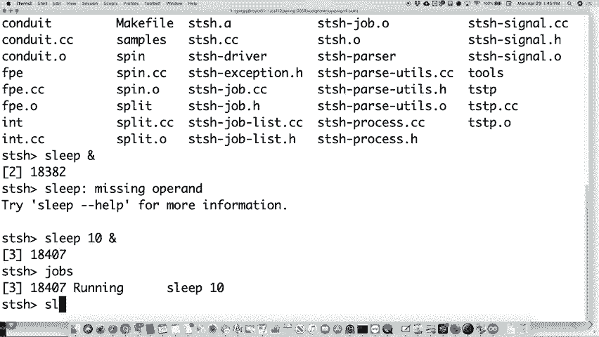

如果我快速做另一个，我就没有时间了。让我们做 `sleep 20`，然后输入 `jobs`。

`jobs`。然后还是只有一个。我们再做一个。让它在后台睡眠 20。

现在如果我们输入 `jobs`，应该有两个。现在后台有两个任务。我们应该能够——我想是可以杀死的——我是不是说它不能杀死？那么我们回到下一张幻灯片。

所以让我们回到下一张幻灯片。让我们回到下一张幻灯片。让我们回到下一张幻灯片。让我们回到下一张幻灯片。让我们回到下一张幻灯片。让我们回到下一张幻灯片。让我们回到下一张幻灯片。让我们回到下一张幻灯片。

那么我们回到下一张幻灯片。让我们回到下一张幻灯片。

所以让我们回到下一张幻灯片。然后你可以把它通过 `word count` 之类的处理。你也可以这样做，然后把输出保存为 `word count out.txt`。

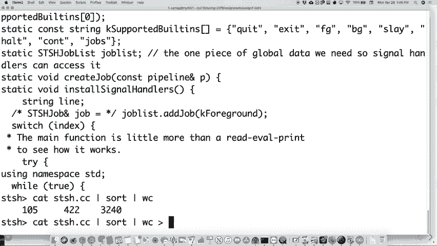

然后我们可以做 `cat word count out.txt`。它应该看起来非常像一个终端。

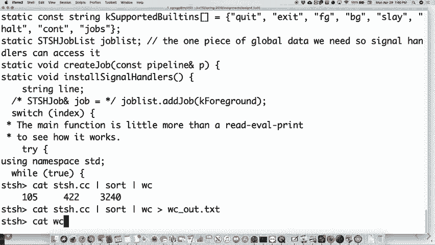

就是这样。我不应该能够按下 `Ctrl+C`。实际上它说是 `Ctrl+C`，但它不会杀死 shell。

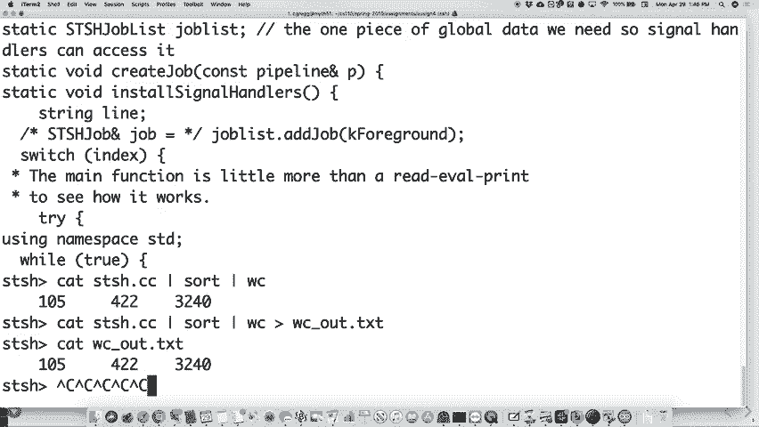

至少不应该这样。然后 `Ctrl+Z` 也不会做同样的事情。如果我做一些像是……让我们做 `sleep 20`。

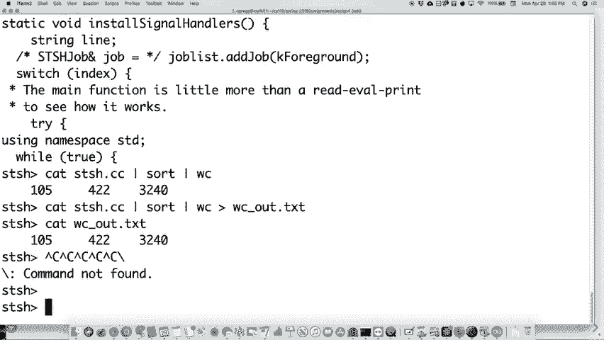

然后我现在按 `Ctrl+Z`。它应该会让你返回，并且保持一个后台任务在那里。确实如此。

所以这是你需要做的作业中的所有不同部分。12是什么意思？12表示你在Shell中实际启动的第12个作业，我想。大概就是这个意思。没错。[听不清]，哦，问题是为什么我们使用`STSH`来做`cat`？`cat`实际上会打印出特定的文件。

这就是我们在那里做的所有事情。而且我恰好在那个文件夹中有它，所以我知道那个文件在那里。所以我才说用`cat`来打印那个。我刚好知道那个文件就是这个。还有其他问题吗？好的，然后退出，输入`quit`或者`exit`。

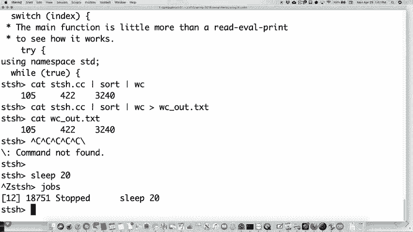

那是斯坦福的Shell。你会习惯的。

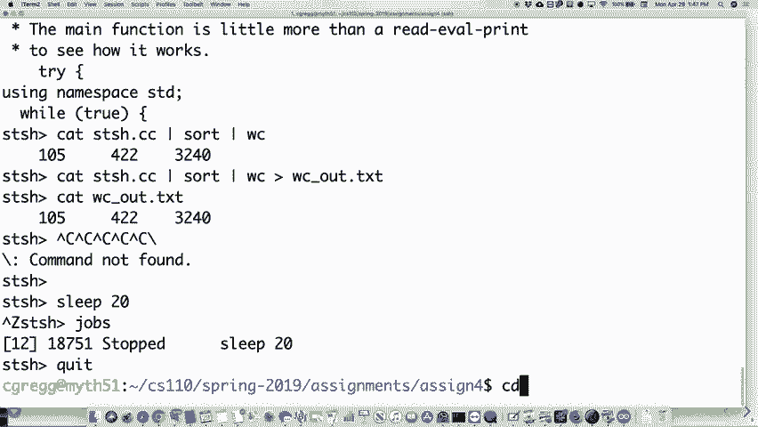

顺便说一下，使用那个解决方案1来查看输出应该是什么样的。有些人有时会错过这一点。好吧，我们来看看。

现在是C++。

好的，让我们看看一个新的内向者程序。这是充电程序。基本上我们要做的和之前一样——和我们做的相同程序一样。它基本上有10个线程，或者在这种情况下是6个线程。它们都将在你独处时打印出一些关于充电的内容。好的。事实上。

我们现在就来做这个。我们现在在C++中，所以可以开始使用`C out`了。好的。如果我们做`C out`，我通过独处来充电。好的。然后——然后是N到L。关于`C out`的一件事是，与`printf`不同，它实际上不是线程安全的。这意味着——而且事实证明，它不线程安全的方式是这样的，顺便提一下。

每个这些小于小于符号（`<<`）都是一个新的函数。所以基本上它们可以独立于`endl`进行打印。所以我们实际上想避免这种情况。嗯，你可能不想避免这个，但假设你想避免这种情况，通常我们会这样做。如果我们想要整个`C out`语句打印出来而不被其他线程打断。

线程中断——顺便说一下，可能不会在时间和独立之间发生中断。但它会在你有这个情况时发生。所以如果我们不想中断它，我们可以做的是，实际上使用一个函数，这是Jeri Caine创建的。它只是对它加了一个锁，意思是：“嘿，在我说OS锁定之后，在`C out`语句或者`C out`函数内部执行。”

我只是想要在它完成之前，不让其他线程进入并做一些事情。然后在这个之后，我们还应该使用`OS unlock`。这使用了一个名为`OS stream lock`的头文件，我们会提供链接给你。好的，问题。Chase。[听不清]，难道你不可以直接使用`printf`吗？当然可以。

但是可能有一些事情你想要查看，它们更容易做到。而且也许查看一些其他的输出——我不知道，某种类型的东西，或者有内建重载的输出，之类的。不过是的，你可能还是应该坚持使用`cout`来做C++中的输出。这也是做C++的更好方式。对吧？

[听不清]， 在这种情况下，你可以使用换行符。 是的， 尽管换行在这种情况下可能无法刷新，但你可能可以在这种情况下使用换行符。但有时候，如果我们想做像这样的事情呢？

我就做这个。 比如，看到， 这是——我应该用 var a: a。 你明白我的意思吗？ 就是那样， 你知道的， 句号或其他什么的。 然后我们仍然想把它包裹在那个 OS 锁（OS lock）， OS 解锁（OS unlock）中。

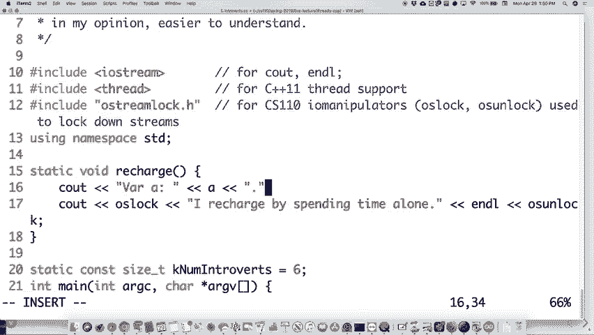

反正很容易使用。 好的， 就这样。 这里有人有问题吗？ 或者可能是一样的。 不？ 好吧。 总之，这就是我们要做的事情。

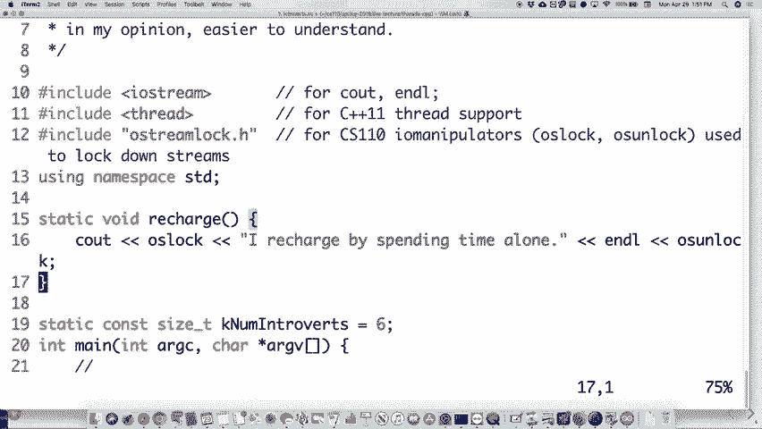

事实上，这就是这个函数的实际作用。 好吗？

然后我们要做的是使用 C++ 内置的线程库。 好吗？ 所以我们来听一下 K-num-introverts 空格 introverts 句号。 为什么我没有在这里使用 OS 锁？ 因为我们还没有进入线程。 就像我们甚至还不在线程中，所以其实并不必要。

尽管如果我们使用它，程序不会崩溃，但如果你不需要的话，最好不要使用。 好吗？

有一个线程库。 我会在我们看到示例之后再详细讲解线程库。 好吗？ 它是这样工作的。 我们将执行接下来的操作，内向（introverts）。 好吗？ 然后 K-num-introverts。 内向（introverts）。 好吗？ 这实际上是正在设置。 所以我们正在调用线程类的默认构造函数。

它正在一个接一个地将它们放入那个数组中。 现在你会想，哦。 这是不是意味着它实际上在启动一个线程？ 结果发现，默认构造函数并不会这么做。 然后我会给你展示我们接下来怎么做。 这是 C++11 中的一个细节，我会向你展示。

但现在，只需知道它设置了线程数组。 然后我们可以做接下来的操作。 所以对于线程，肯定需要加上“&”符号以使其成为引用。 顺便说一下，你也可以在这里加上引用。 我喜欢把它放在这里，但有些人喜欢把它放在前面或者留一个空格什么的。

就 C++ 来说，这没关系。 内向（introvert）是内向的。 好吗？

然后我们要做的是接下来的操作。 所以，内向（introvert）等于线程重载（thread recharge）。 这就是你需要做的，实际上是说，嘿。 这是一个具有重载功能的新线程，启动它。 好吗？

你可以在这里添加任意多的参数。如果你想传入其他参数，稍后我们会处理。

你可以这样做。但这是一个简单的示例。你只需要做这些。现在，真正有趣的部分发生在这里，你做了这个奇怪的操作。如果我正确拼写 introvert，那会更好。事实证明，你在做的是交换操作，而不是简单地将其赋值。稍后我会详细讲解。

但你可能会想，等一下，我不是已经启动了 10 个线程了吗？

现在我正在复制另外 10 个线程。这是怎么做到的呢？等等，实际上这是因为 C++ 允许它正常工作。对吗？

然后我们可以做另外一种相似的操作。在线程中，遍历 introverts。对的？然后我们只需要做 introvert，因为这是 C++ 中的一个类。

`Join`，它与 C 中的 `join` 函数做的是完全相同的事情，它会等待特定线程结束后再继续执行下一个线程，发生在第四步。明白了吗？

这是开始的部分。我们来看一下它是否有效。有谁注意到什么问题了吗？

看看。创建 introverts。好，看来没问题。Introverts。好了，我通过独处六次重新充电了。明白吗？

那么让我们回到这里，详细讨论一下这个问题。再详细一点。到目前为止，有人对这个内容有特别的问题吗？

所以，关于你获得引用传递的语法是什么？是的，问题问得很好。你在下面这一行获得了引用。对的。在这里，你是从实际的 introverts 数组中按引用获得的。嗯，是的，问题问得很好。为什么要这么做？我们需要这样做，事实证明，这是 C++ 部分的内容。

我猜我们应该现在就讨论这个问题。我们试图将我们创建的线程放入一个数组中。通常发生的情况是，你会将线程的所有资源复制出来，然后放入那个数组中。对吗？那么，这就意味着现在有两个线程在执行，而且没有真正的。

比如如何关闭某个线程并重新启动数组中的线程。恰好的是，这种操作在 C++ 中通常不起作用。好吧，C++ 本身，我想这是下一页的内容，提供了一个新函数，就是这样。`operator equals thread two ampersands other`。这只是一个语法上的问题。

它基本上意味着我们在设置这种“移动类型”的等式。基本上是交换这两个东西。明白了吗？而你真正需要知道的是，这样做是有效的。所以，重点是，当你这样做时，当你在这里执行实际的 `equals` 操作时，你会发现，嗯，创建的线程是。

实际上将被放置到数组中引用的位置。它实际上会完成一次交换，并将我们构建的非工作线程放入数组中，作为右侧的线程。所以，我们将要做这个。我们将要做这个。

我们将要做这个。我们将要做这个。我们将要做这个。我们将要做这个。我们将要做这个。我们将要做这个。我们将要做这个。我们将要做这个。我们将要做这个。我们将要做这个。我们将要做这个。我们将要做这个。

我们将要做这个。我们将要做这个。我们将要做这个。我们将要做这个。我们将要做这个。我们将要做这个。我们将要做这个。我们将要做这个。我们将要做这个。我们将要做这个。我们将要做这个。我们将要做这个。

我们将要做这个。我们将要做这个。我们将要做这个。我们将要做这个。我们将要做这个。我们将要做这个。我们将要做这个。我们将要做这个。我们将要做这个。我们将要做这个。我们将要做这个。我们将要做这个。

我们将要做这个。我们将要做这个。我们将要做这个。我们将要做这个。我们将要做这个。我们将要做这个。我们将要做这个。我们将要做这个。我们将要做这个。我们将要做这个。我们将要做这个。我们将要做这个。

我们将要做这个。我们将要做这个。我们将要做这个。我们将要做这个。我们将要做这个。我们将要做这个。我们将要做这个。我们将要做这个。我们将要做这个。我们将要做这个。我们将要做这个。我们将要做这个。

我们将要做这个。我们将要做这个。我们将要做这个。我们将要做这个。我们将要做这个。我们将要做这个。我们将要做这个。我们将要做这个。我们将要做这个。我们将要做这个。我们将要做这个。我们将要做这个。

我们将要做这个。我们将要做这个。我们将要做这个。我们将要做这个。我们将要做这个。我们将要做这个。我们将要做这个。我们将要做这个。我们将要做这个。我们将要做这个。我们将要做这个。我们将要做这个。

我们要做这个。我们要做这个。我们要做这个。我们要做这个。我们要做这个。我们要做这个。我们要做这个。我们要做这个。我们要做这个。我们要做这个。我们要做这个。我们要做这个。

我们要做这个。我们要做这个。我们要做这个。我们要做这个。是的，好的问题。有没有像W-No-Hang和W-On-Trace之类的东西？

其实不是。你在做这个时不会有相同的模型。基本上，你通常会在最后进行合并。并不像你会用SIGSTOP来停止一个线程之类的。它本身不是一个进程。我们做的与线程相关的大部分操作实际上是进程。就这一点而言，它们并不完全是线程模型中的一部分。好的。

线程大多数时候是将一个问题分解成许多子问题，独立地解决。我们几分钟后会看到一个例子。这就是它与多进程的不同之处。记住，大多数时候多进程是fork exec。Fork exec fork exec。

大多数时候我们用进程做的就是这样，这样我们就可以启动其他程序。现在这是在说，一切都会在我的一个程序中进行。但我要让它们都并行发生。是的。好的问题。好的。那么，这就是实际的程序。我们来看看。还有什么我们可以讨论的？

这是重要部分。我们声明一个空线程。空线程处理数组。这是重要的一部分。好的。然后我们将重载函数安装到临时线程中。那只是说线程，然后是函数的名称。然后它们被复制或应该说是移入数组中。好的。

这是C++的新部分。好的。你可以在继续学习时了解更多细节。Join方法。我们讨论过函数可以是任何我们想要的。通常我们只是有一个void函数，因为我们实际上从来不会获取它的返回值。你不能像在wait PID中那样获取返回值。

但是函数可以是任何东西。所以你会看到很多你写的函数，实际上是我们在一个线程中启动的。实际上它相当不错。在某些方面，它比多进程要简单得多。而且你不需要任何特殊类型的函数。

只需调用你想要的参数的函数。就这样。现在它在自己的线程中运行。实际上相对干净。是的。>> 你能传递参数吗？

>> 你可以传递参数。我们现在就来讨论这个。好的问题。好的。那么，让我们换一个例子。好的。这将是一个问候程序。它将是一个程序，在这个程序中，我们将有多个线程运行，并基于此打印出一个简单的问候语。

我们正在分配给它的线程编号。

那么我们来看看。哎呀。好了。也许就是这个。我希望就是它。好了。好了。在这个函数中，我们将有一个接收a的函数。

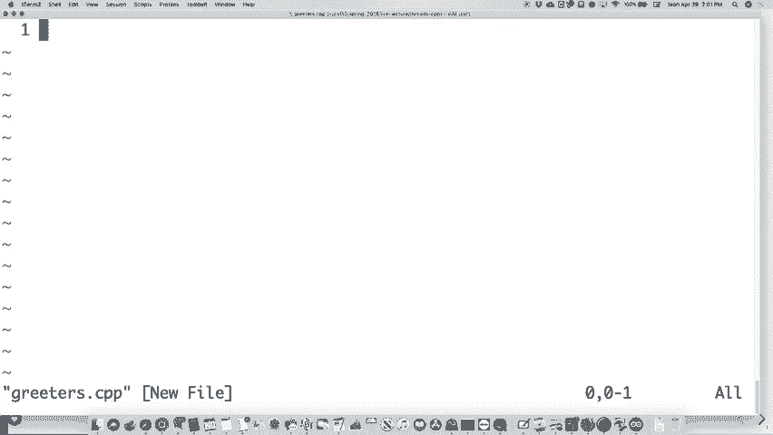

参数。然后这是如何实际传递该参数的方法。你可以通过值或引用传递它。

结果发现你可以做任何一个。我们可以 -- 我们会向你展示如何做这两种方式。好的。在这种情况下，我们将有每个问候者和一个不同类型的参数。我们将有这两者。好的。在这种情况下，我们将有每个问候者，评估器，评估器a。

整个次数。我会向你展示我的意思。好了。`size t` -- `size t`。I等于零。I小于id。所以无论我们传递什么id，它都会问候那么多次。为什么不呢？

这有点傻的程序。好的。所以每当我们需要做`osloc`时，因为我们在一个线程中。然后我们可以说，问候者号码和ID说了你好。然后L。然后我们做`osloc`，因为那是在整行之后。好的。好了。然后我们要做的事情是，我们实际上将做。

这里有一个地方，我们暂停一会儿时间，这样你就可以看到线程的交替执行。我们将做一些有趣的事情。我们只需要使用一个叫做time spec的小时间结构。你不需要了解它。我是说，我们永远不会要求你了解它。`ts` 等于，然后你可以像这样设置它。

它有一些不同的随机元素。然后我们将要做 -- 哎呀，随机模。1，2，3，4，5，6，7，8，9。一个大数。好了。我们来看看。我想就是这样。好了。然后我们将做一个叫做nano sleep的操作，暂停那个时间，这个时间会稍微短一点，因为它是时间除以十亿。

好的。然后我们将结束我们的循环。

我不知道为什么这没有。好了。

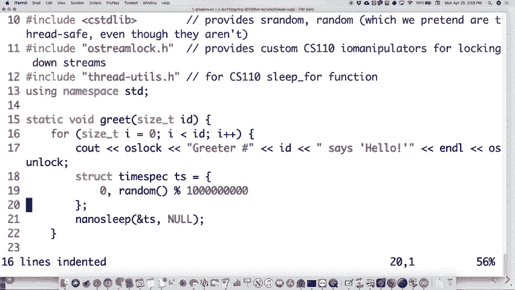

好的。然后我们将再做一个`cout`，`os lock`。我们会说，创建者号码ID已经发出了所有的问候，逗号。然后你可以 -- 我猜因为下一行我们将在下一行做。所以让我们看看。然后他们回家了。然后L。然后`os unlock`。就这样。好的。这就是我们的问候函数。

好的。问题。>> 是否有类似get-de-ed的电话？你能在这个函数中加入它吗？

>> 是否有get-de-ed？你能在这个函数中加入它吗？有一个`get-thread-id`。你可以获取你的线程ID，它或多或少是一个进程ID，如果你想这么做的话。没有。你不会在线程内部加入。你不想在线程内部加入。你希望主程序来做这个加入。是的，也许有一些微妙之处。

但一般来说，不要尝试连接另一个线程。顺便说一下，**多处理**和**多线程**其实不太兼容。你不应该在线程内进行分叉操作。否则可能会有很多问题。你可以在你分叉的进程内创建线程，但不能反过来做。

就是这样工作的。

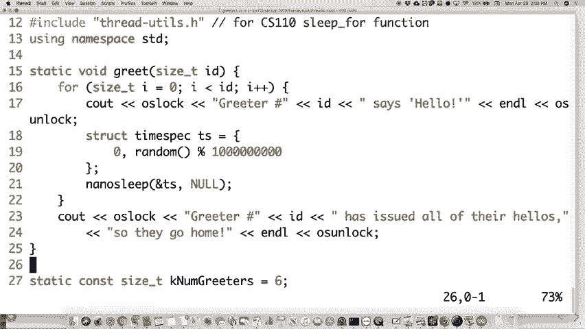

你得习惯这个。好了。总之，这就是我们的网格。

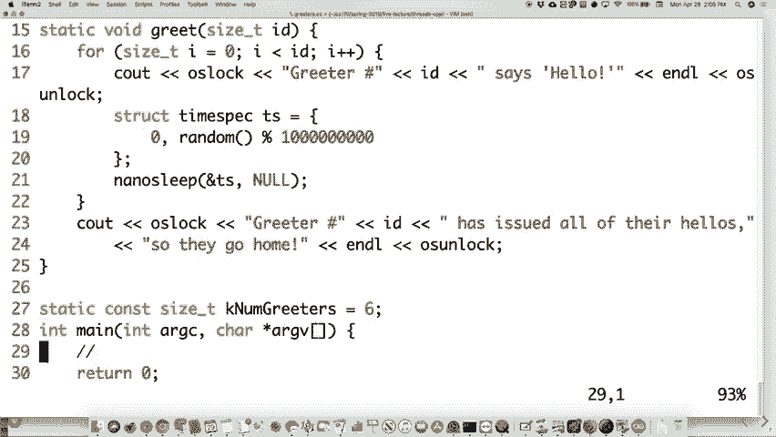

让我们确保我们让 make-readers 看起来不错。定义了，使用了好的。好了。接下来在主函数里，我们要做的是，像这样做，`see out`。欢迎来到格雷特兰。欢迎来到格雷特兰。我们要去格雷特兰。如果它是一个专有名词，我们应该大写。好了。然后是 L。好了。

然后是线程。欢迎语。这个应该很熟悉。K-nom-greeters。然后是四。大小 t。我等于零。我小于 K-nom-greeters。分号 I 加加。

好的。我们可以做问候语。我们本来可以按之前的方式做，但这只是一种略微不同的做法，没有使用引用。我们还是会像之前那样做一个拷贝，并且像之前一样移动。好了。问候语 I 等于线程和问候语。然后我们要做的是传递下一个参数作为参数。

就是这样。它调用问候语，并传递参数 I 加一作为值传递。我做错了吗？是 I 加一。哦，不是 I 加 I。那会是一个有趣的程序。好了。好了。

我加一。就这样。好了。然后就是这样。接下来我们需要根据大小将它们连接起来。

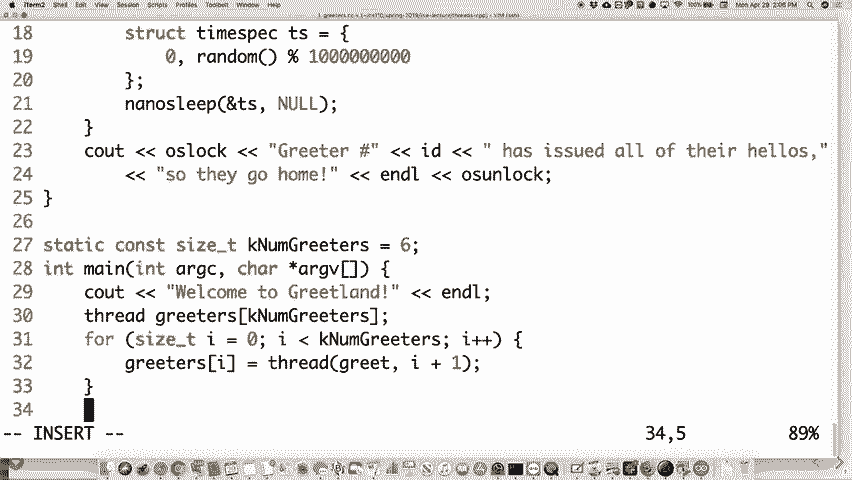

我就这样做吧。结果是一样的。好了。对于大小 t，K-nom-greeters。好了。接着我们只需要做一个问候语。不对，实际上在这种情况下我们不想这么做。我们需要做实际的线程。我不能按照我想要的方式做。我想我们可能可以。可以。但在这种情况下，我们还是按照之前的方式来做。然后我们要做线程。

然后是百分比问候语。混合搭配。问候语。那个。然后在这种情况下，我们要做 greeter。join。

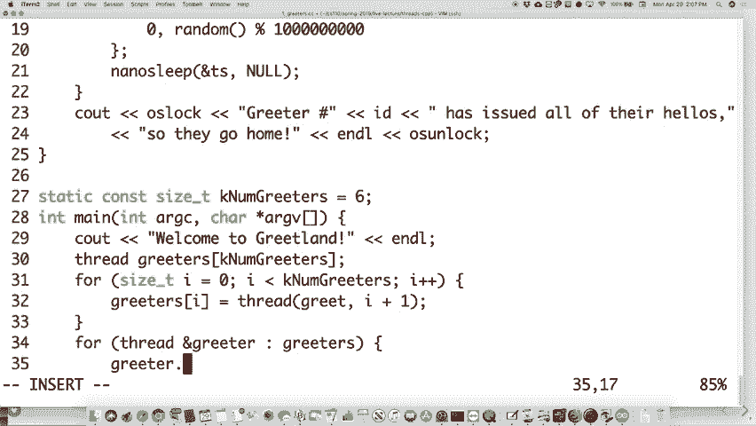

好的。那样会等待它们全部完成。好了。然后我们只需要说 `see out`，每个人都被问候过了。然后输出。好了。这就是我们要做的。好问题。等等，为什么你说那个原始的形式--，原始的形式应该能工作。我只是决定用不同的方式做。原始的形式应该是这样。

我们本来可以做那个--，我们本来只需要做 greeter 的 I。join 就行了。那样也能工作。是的。但这是另一种做法。让我们展示给你看。问题。如果你在创建后立即加入，会发生什么？好问题。如果你在创建后立即加入，会发生什么？你告诉我。

因为什么都不做是件好事，这样它就不会变得像不同的时间那样。它会做什么？它会做什么？它会--，不会加入并等待直到那个线程完成--。是的。它会序列化一切。如果你创建了线程然后立即加入，那么它不会继续，甚至不会进入下一个循环，直到那个线程完成。

所以你需要两个循环吗？因为你想启动所有的线程。让它们都并行工作，然后之后再等待它们。事实上，这是一个非常好的观点。这实际上是关键。这是非常非阻塞的。这个循环非常快速地发生。发生了什么？它基本上是调用这个线程函数并传入一个函数名和。

说的是在你自己的时间，尽快启动这个线程，并且它。继续执行循环的下一个迭代。

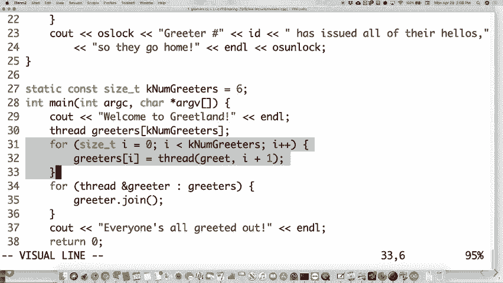

所以这里完全没有等待，这实际上是关键。好吧。让我们看看我们是否做对了。创建读取器。到目前为止都好。问候者。好吧。然后是问候者。就这样。好的。

所以记住，里面稍微有一点等待暂停。这就是它做那样的原因。六应该说多少次你好？六，应该说六次你好，我相信。除非我做了小于而不是大于。

小于或等于。但不管怎样，这就是它的意思。

有一个只说一次你好，然后恰好是第一个已经说完所有你好的人，所以他们可以回家，依此类推。

是的。如果你想做这一切，我认为我们会做这一切。你能为--做一个操作系统锁吗？好吧。首先，操作系统锁并不是为进程准备的。它仅仅是为了C输出。所以操作系统锁仅仅是--我们稍后会谈论锁和其他东西。如果你想按顺序执行，你可能就不会使用线程，第一点。

第二点，如果你真的可以在每个线程完成后就加入，那么它会这样做。那其实并不是你通常使用线程的方式。好吧。

对于这个问候者函数，你实际上可以传递参数进去。

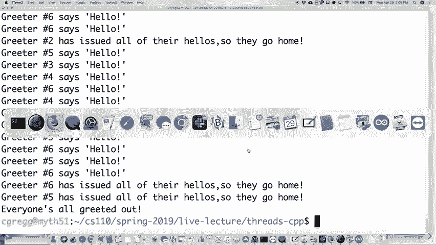

是的。我是Mark。[听不清]，哦。[听不清]，对。这个问题很有意思。问题是。等一下。我觉得你是指那个等待PID，你可以说，哦，这个结束了。我先处理这个。其实不是。在这种情况下，你只需要--你必须按某种顺序等待它们--按你想要的任何顺序。

但实际上没有什么办法——就我所知，我会查一下。但我从未见过你等待事情发生时会——你会按顺序等待线程的结束。你只能说，我将暂时处理这些线程，然后等待它们最后完成。不能说我要等待任何一个线程就这样。

这与多处理的模型不同。好问题。好的。好的，这就是问候程序。

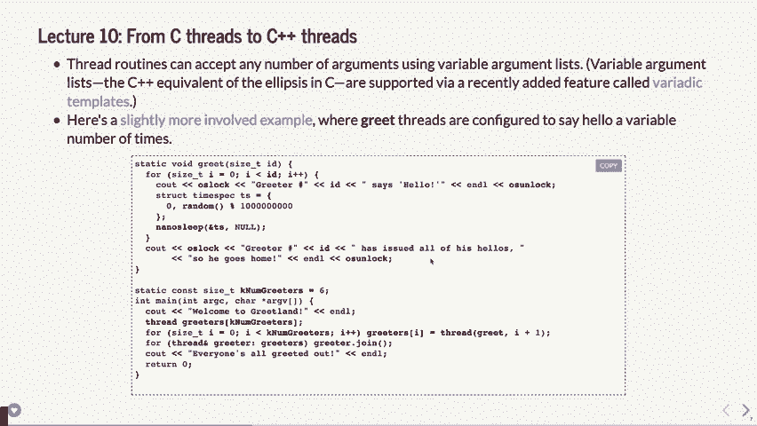

注意，你可以传入一个参数。好的。我们可以做的是，我们通常想使用线程来分解一个更小——或者更大的问题。这样，一组线程可以独立地处理这个问题的各个部分。这就是我们拥有多个核心和多个处理器的原因，这样我们就可以实际做到这一点。

这实际上是线程的一个好处，可能是线程最初创建的主要原因。所以我们将做另一个小程序，我们将模拟售票。好的。基本上，这就是你打电话给，例如，联合航空之类的公司。现在你不再这么做了。以前人们确实会打电话，而不是在线办理。

但是你会给他们打电话。假设我们有10个售票员来接电话。当他们接到电话时，他们就卖出了一张票。我们有250张票可以卖。好的，256张票可以卖。当他们接到电话时，他们会接到一个来电者，然后卖出那张票。好的。他们卖出了一张票。现在。

可能会出现有人想飞往一个荒无人烟的地方，或者类似的情况。然后，售票员可能需要稍微多一点时间来处理这个票务。也可能有其他的售票员接到一些只想从纽约飞往波士顿的乘客。这是一个很简单的，比如说，知道的，两个秒钟的电话之类的。

那个——所以我们不一定要限制所有的——我们不想限制——哦，不。好的。为什么要这样做？等一下。我们不想限制每个售票员的实际票数，比如说限制为10%的票数。好的。具体来说，这样可以使他们更有效地工作。好的。所以我们可能会做类似这样的事。好的。让我实际开始——我会在程序中做这个，因为我们一会儿会为你运行这个。

让我们看看我能否弄明白。好的。让我们看看。这个将被命名为“混乱”。

我们马上就会看到为什么需要售票员。好的。这里可能有点混乱。但是这就是我们可能开始时的样子。好的。我们可能会从类似这样的情况开始。好的。线程代理10。好的。我们可以为此设置一个常量。就是这样。线程代理10。大小T剩余票数。票数等于250。好的。所以我们将剩余250张票。

好的。然后四个。Size T。I 等于零。I 小于10。

I 加一。好的。我们将在这里做的是，我们会说代理。I 等于线程票务代理，因为这是我们要创建的函数。票务代理。我们将给每个票务代理分配一个介于101和I之间的小数字。我不确定为什么我们给了它101，但我们确实这样做了。好的，100和I。

然后我们需要通过引用传递剩余票务。好的。现在线程对引用参数和常规参数没有概念。所以如果你尝试像这样说剩余票务，那么发生的事情是，你实际上会按值传递，这并不是你想要的。

好的。没有真正简单的方法——嗯，实际上有一个简单的方法。但可能是你之前没见过。如果你想特定地通过引用传递参数，你实际上需要将其包装在一个引用函数中。好的。或者可能是一个操作符。不过不管怎样，它基本上就是告诉你，通过引用传递，而不是按值传递。好的。

所以我们将对每个操作执行相同的操作，因为现在我们将有一个剩余票务，所有代理都将从中提取。好的。好的。让我们看看。这是不是函数的结束？嗯，我们已经运行了那个语句。

好的。然后那边，然后实际上会启动所有的线程。然后我们有一个针对红色和符号代理的循环，代理点连接像这样。

然后我们会说，输出工作日结束。好的。基本上我们将在每个人完成后，说工作日结束。好的。大家都明白主函数中的操作了吗？好的。让我们来看一下实际的剩余票务代理函数，看看我们能提出什么。

好的。我们将让每个代理抓取一个票据并卖出，基本上就是这样。然后我们将有一个票据，就像是一个剩余票务的循环。

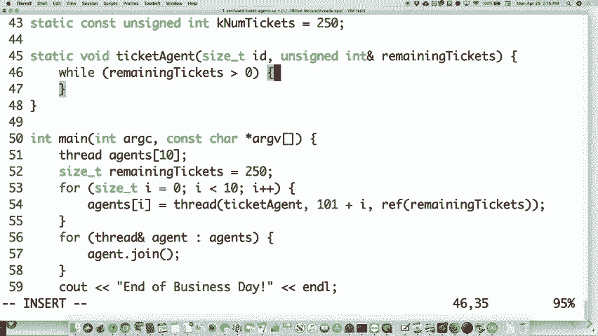

它大于零。

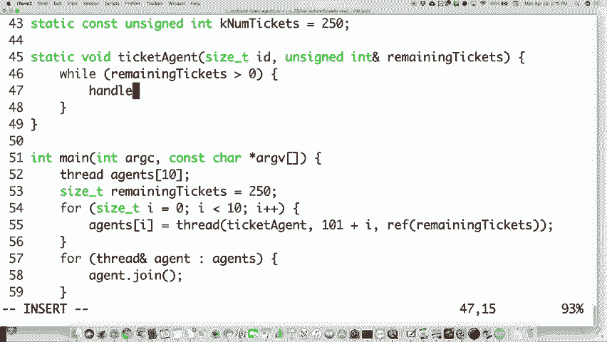

好的。那么在这里我们将说，我有一个处理调用的函数。

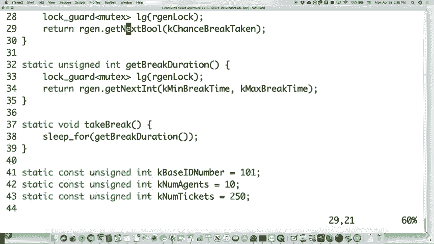

好的。你不需要担心上面某些点。

你实际上可以稍后阅读它。但不要——实际上。它基本上是让程序睡眠一段时间，以模拟处理调用的过程。

好的。那么我们将处理这个调用。

好的。然后这个将睡眠一会儿，基本上模拟处理调用的时间。现在。它需要多长时间，这是一个随机数。好的。

然后我们会说剩余票数减1，因为我们刚刚卖掉了一张票。好的。然后让我们在这种情况下打印出OS锁定和代理编号。然后是同样的事情，ID售出了一张票。

好的。然后我们会说剩余票数，像那样还需售出更多票。然后我们需要像那样解锁OS。好的。所以基本上我们是在说，好的，票已经售出。好的。然后如果代理该休息了，我们就让他们休息一下。这只是为了让事情稍微交替一下。如果该休息就休息。

然后我们基本上就要休息了。好的。好的。有时候这些事情会变得有点傻。但那就这样。然后输出。实际上这是在while循环之后，对吗？

我们得到 -- 然后我们说，哦太好了。我们已经卖完所有的票，因为剩余的票已经没有了。好的。然后我们可以说类似“代理编号ID注意到，所有票已售完，然后回家”。好的。然后解锁LOS。我忘了在开始时做OS锁定。锁定它。

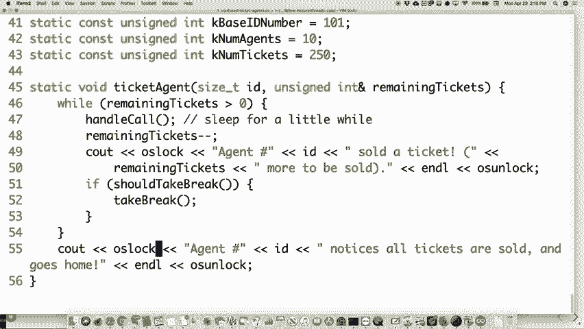

好的。好的。这是我们第一次尝试。有人看到什么bug了吗？好的。这是我们第一次尝试。基本上，我们会让每个代理保持倒计时，然后继续操作。

让人困惑。票。

代理。哦不。我们来看看。没有名称类型在线。哦天。真爱C++错误。好的。等一下。不是那里。实际的错误在哪？不是那里。不是那里。不是那里。不是那里。呃哦。哦，找到了。62。也许。62。好的。我们在这里做了什么？我们要做一个红色票务代理。我们剩余票数用完了。代理。我们设置了代理。然后还需要做什么？是代理端。

它通过票务代理。然后加上引用剩余票数。我想你没有定义票务代理。我没有定义票务代理。

呃，它在这里，不是吗？我想应该就在那儿。

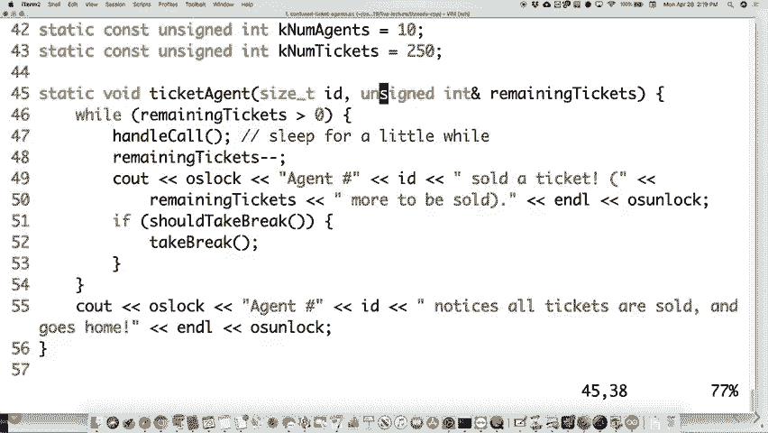

这是我们试图发送的函数。嗯。让我们看看。

我们需要引用吗？需要的。就在那儿。会发生的。我们需要这个。你需要导入一些东西吗？我不这么认为。嗯，让我们看看。

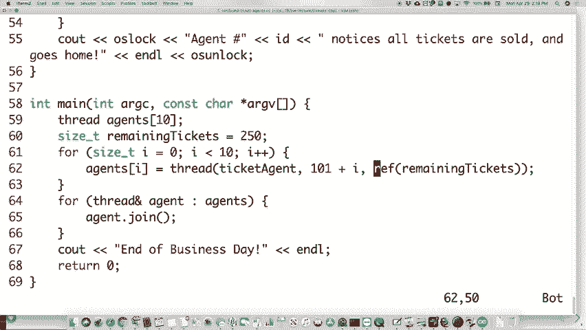

我在想是否有其他问题。让我们再看一下错误。没有名称类型。嗯。红色137。已知的类型名称在类中为空。不是很确定。嗯，为了节省时间，我手头正好有原始的。我们就这样做吧。我们就这样做吧。这只是万一发生这种事，我也不会不行。够好，能找到这个。让我困惑的票代理原始CC。

嗯，让我们看看。我们在这里做了什么？

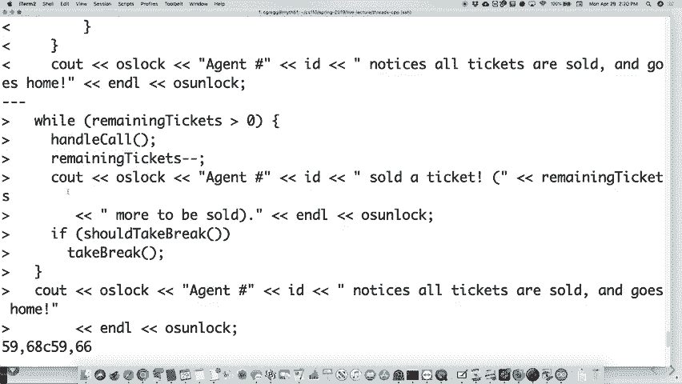

哦不，看起来并没有太大变化。我觉得它没有。

它就是我承诺的那个。现在等一下。它使用了所有常量。是的。也许我在这里确实忘了一部分。没有，我不这么认为。好了，这就是我们要做的。我们将把它复制过去，执行它。嗯，因为我会看这里。我会这样做。

我现在就复制一份。

困惑的售票员。cc 转给困惑的售票员。Chris 感到困惑。

我稍后检查一下，然后再看困惑的售票员。

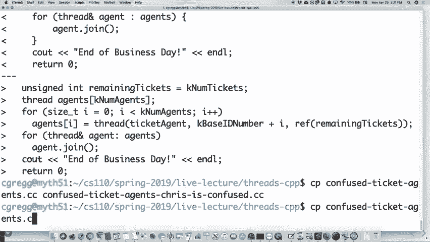

嗯，原始的转给困惑的售票员。cc。

对，好的。我们再试一次。困惑的售票员。那次成功了。好的。现在我发誓我尝试时它会工作。好的。那么它将会做什么呢？它将会倒计时所有的250。每个售票员都在等待一段时间。某些售票员可能在过程中等待5秒，某些可能等10秒，某些可能等20秒，某些可能等30秒。无论如何。

最终它将继续进行并倒计时。然后，这将需要很长时间才能再卖出一个票。好的。那么这将基本上永远持续下去。对，实际上，当它倒计时到接近零时，可能会再次回绕。好的。那么我们有一个问题。我们的问题是什么，这是个问题。好的。

让我们来看一下我们本应该在这里做的实际代码。好的。这是主函数。然后这是主函数2。我们已经知道那部分了。我们来看看。这里是售票员。也许它看起来还好。那么我们在做什么呢？这里有竞争条件吗？

你们中的一些人已经注意到了。可以看得出来，当我写代码时，我就知道会有这个问题。这里的竞争条件是什么？

是的，Emily。他们都可以访问剩余的票。对。然后当剩余票数递减时，如果剩余票数大于零，那么剩余票数减一。这时，剩余票数是否依然大于零就不一定成立了。

零，因为其他线程可能已经进入并做了完全相同的事情。好的，这就是问题所在。这是其中一个问题。事实上，问题比这还要微妙。好的，有这样一个想法，你可以这样做。那么，结果是什么呢？我们可以看到这里发生了什么，实际上最终它还是会继续进行下去。

下降并回绕，因为两件事尝试递减。如果之前确实已经递减了线程计数，而另一个线程出来时说，“哦，还有剩余的票”。哦，是的，还有四十亿张票。所以，这就是问题所在。正如我所说，这甚至比那还要微妙。即使是剩余票数减一本身也不一定是原子操作。

好的，C++语句是原子性的，因为它是独立执行的。但记住，C++语句做什么呢？所有上过107课的人都知道，它会被转换成可能是一大堆汇编代码指令，每一条指令或多或少是原子性的，但它们加在一起就绝对不是原子性的。好吧。所以，当你执行remaining tickets--时，实际上。

如果你去反编译，你会看到它最终会变成像这样的汇编代码，你会看到五个不同的指令。任何一条都可能被下一个线程中断，导致问题。那么我们实际上在做什么呢？我们获取内存，然后将其减去1。

记得我们最喜欢的命令 LEA，给那些上过107课的人。然后我们将它减去1。接着，我们把它移回内存。好吧。如果其他线程在这些操作执行的过程中做了某些操作，像是…那内存就不一定是1，或者可能无法移动。这就是经典的竞争条件。好吧。

绝对经典的竞争条件，你需要能够处理它。好的，那我们可以做哪些事情呢？好吧，我们可以做的事情，实际上它已经内置于线程库中了，我们可以说，好的，某个程序将不会运行，或者某个线程将有权访问这个数据结构。

换句话说，或者，或者，或者数据结构会保留在票务变量中，而所有其他线程必须等待它。好的。顺便说一下，我刚意识到我可以做些什么来简化我们的代码，就像是，看看。然后搞乱票务代理，不是CC。我只是要做以下的修改。那是哪个？

那就是票务代理。

再次，我会回家仔细研究这个问题，看看为什么我之前犯了这个错误。但无论如何，我们会把那个放进去，然后我们也会改变主函数。

然后让我们看看，名字应该放在这里。好的，我们要做的是，好的。

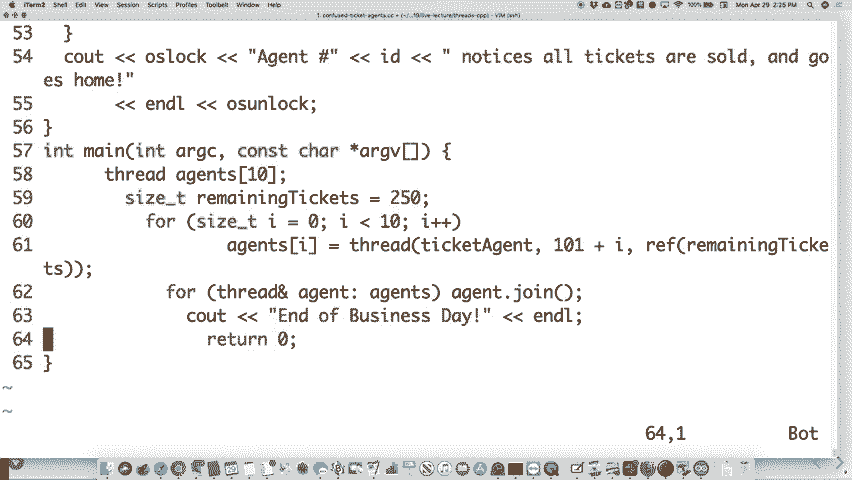

那么让我们看看现在是否能正常工作。让我们搞乱票务代理。哦，不。一定是我的，等一下。我发誓我在前面输入过这个。好吧，等一下，也许我们不这么做了。好吧，我要做的是，我来给你们展示一下我们实际要做的事情，来，没错。我们需要做的是，使用这个叫做互斥锁（mutex）的方法。好吧，互斥锁就是。

它在哪里？我们已经讲过了。互斥锁，这个我们已经讲过。互斥锁本质上就是一个锁，当某个线程调用互斥锁的锁定操作时，任何其他线程也想调用这个互斥锁，就必须等到前一个线程通过解锁释放它。好吧。它是一个叫做互斥锁（mutex）的类。

你需要做的是为某个互斥量定义一个变量，比如说 mutex m。好的。然后如果一个线程执行 mutex.lock，另一个线程也可以进来执行 mutex.lock。但是如果前一个线程已经锁定了它，新线程就得等待，直到它解锁。好的。如果多个线程都在尝试锁定同一个互斥量。

然后其中一个线程会在解锁竞争中获胜，其他线程会再次回去等待。好的。所以它的作用是告诉你，只有一个线程可以在同一时间处理这个区域。它只是通过这个变量作为信号，表示你被允许使用它，或者你不能使用它。它就是这样工作的。好的。它锁定了我们所说的内存中的关键区域。好的。

它非常有用。而且我们还会学习到其他几种互斥量类型。非常有用的是能够说，“哦，太好了，现在我们有多个线程可以使用这个资源。”但没有线程会在其他线程执行递减操作时互相干扰。问题追问：是否有可能线程总是输掉竞争？这是一个很好的问题。

是否有可能一个线程总是输掉竞争？当然。有可能一个线程总是输掉竞争。但是最终，当其他线程都完成时，它最终会获得锁。如果你的逻辑是对的，它最终会得到锁。但你不能承诺任何一个线程说下一个是你。用互斥量无法做到这一点。

好主意。有些类型的锁具有优先级。我们稍后会讨论到这一点。但我们现在要集中讨论的是那些没有优先级的锁，你目前还没有能力控制优先级。是的。所以这是关于 C++ 的原子操作语句。因为它们会被转换成汇编语言，就像 C++ 的文化一样。是的。

问题是，C++ 的语句是否不是原子操作，因为它们会被翻译成汇编语言。对于 C 语言来说也是一样的历史。是的。你在 107 课程中做的所有事情，你必须把 C 语句翻译成汇编语言，你会发现每个 C 语句对应很多汇编语句。所以这是完全一样的事情。那么，这不会比单纯的挂起锁变得更昂贵吗？嗯。

非常好的问题。是否会变得更昂贵，因为它们可能会被阻塞？

让我们看看如果我们在这里做一个更改会发生什么，然后我们会看到它实际是如何表现出来的。非常好的问题，而且是一个非常紧迫的问题。还有其他问题吗？好的。那么，互斥量是从哪里来的？它代表互斥，它的基本作用就是标记代码中可能会有多个线程同时操作的关键区域。好的。

当你创建一个互斥锁时，它是解锁状态。某个线程调用 `lock` 时，其他线程就不能再调用 `lock`。它们只会等待直到锁被解锁。唯一可以在锁定后调用 `unlock` 的线程是锁定它的那个线程。其他线程如果尝试解锁，则会导致未定义行为，而且你不应该这么做。只有在你的复杂逻辑中才确保没有其他线程尝试解锁它没有持有的锁。

你会看到，这其实并不难做到。然后就是这样。好的。那么，让我们看看实际需要做些什么，才能让我们的票务代理搞清楚。呃，稍等。票务代理搞不懂了。

程序。做这个。好的。那就是我们遇到的问题。好的。那么，我们需要做的是，我们需要有一个互斥锁，并将其传递给所有线程。这样它们每个线程都有一个互斥锁。好的。

所以让我们回到主函数，实际操作一下。好的。那么，再次说明，我们现在要做的是，说，哦，好吧。

让我们在这里定义一个互斥锁，假设它叫 `mutex`。让我看看，我还没有做，嗯，还没做。是的，互斥锁 `tickets lock`。好的，明白了。那就是你需要做的全部工作。好的。那么我们现在可以做的是，我们要在这里，实际上我们现在需要，呃，传入它。好的。所以我们就这么做。

我们要说的和之前一样。我们要说，呃，将剩余票数放在这里。然后我们只需要再加一个参数，它和之前的参数一样。`ref tickets lock`。好的，就像这样。然后它就会把其他参数传入其中。我们还需要更新函数的参数列表，以便能够接受正确的函数。

好的，除此之外，这就是我们在主函数中需要改变的全部内容。我们只需要在主函数中创建并将其传递给各个线程。

好的。现在我们需要做一个互斥锁引用。

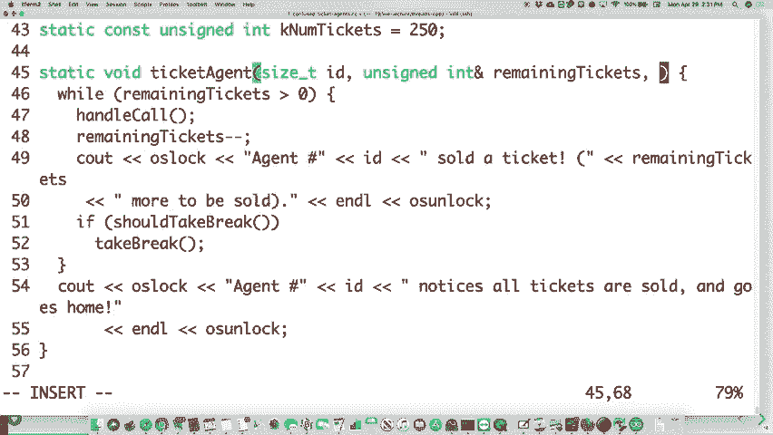

互斥锁引用 `tickets lock`。好的。那么我们在这里改变了什么呢？嗯，不再使用 `remaining tickets > 0`，我们改成这样。好的，我们做一个 `while true`。

好的。然后我们做这个：`tickets lock dot lock`。

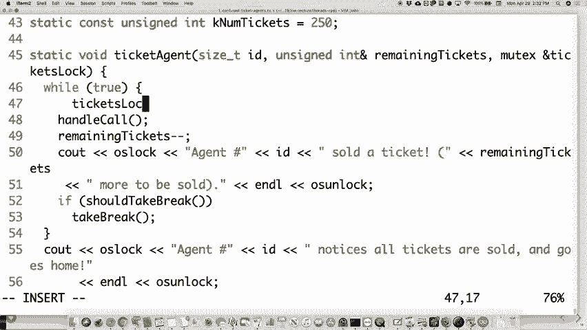

好的，实际上，我要重新格式化一下。好啦。`ticket lock tickets lock dot lock`。好的。然后我们将检查，看剩余票数，逐个查看。

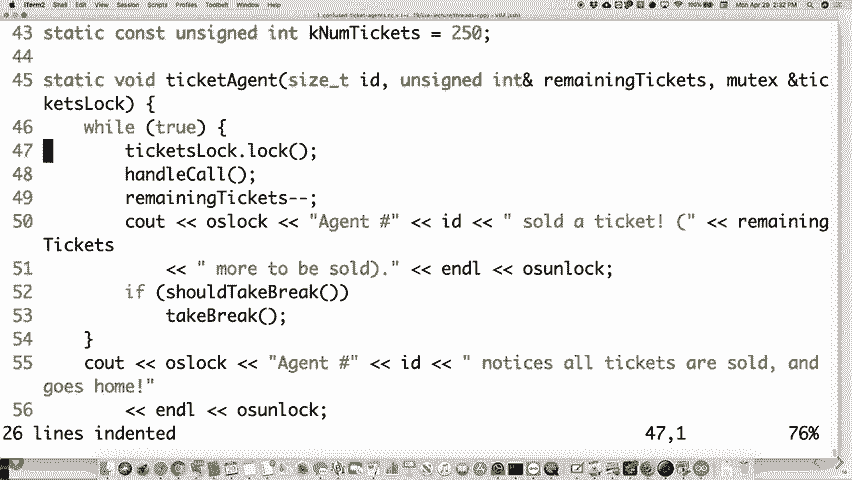

等于零，对吧。换句话说，现在是我们来访问剩余票的时间。其他人不能在中途修改它。我们将进行修改和检查。如果它恰好是零，那就完成了，没有票可以再去处理了。你有问题吗？那么，这个锁是不是锁住了这个函数中的所有变量，还是你必须在某个地方做其他操作？

然后你必须为一个模型指定剩余的票。是的。好问题。问题是，锁是不是锁住了所有剩余的变量？其实比这简单多了。锁的意思是：别人可能也需要这个确切的数据结构，或者需要这段关键代码。我基本上就是把锁放在这里，没人能访问这段关键代码，因为他们也会请求锁。

好的。其他的事情，它们也会做类似的操作。所以你必须把逻辑弄对，这样你才能知道，哦，所有想要这个关键数据结构或者在这个案例中剩余票的人，只需要在它周围加个锁，然后就是这样。我们只需要做这些。好的。那么在实际的 `while` 语句之后，我们需要做什么呢？

票，锁，解锁。对。我们必须这么做，如果我们要在这里跳出并解锁，那么到那时，大家都可以继续操作了。不过我们还没完全结束。在继续之前，你有问题吗？所以在那时，他们可以加锁吗？之后没有线程会再运行吗？所有线程最终都会到达这行代码。然后它们会去。

我想锁定那个变量。最终会有一个线程获胜，其他的线程会等着直到这个线程完成。好的。现在这可能会引发一个问题，我们稍后会讨论。它们在等待那个锁。是的。它们什么都不做。它们在等待那个锁。是的。嗯。好问题。

所以特别是因为那个 `break`，我们跳出，但我们仍然保持锁定状态，所以最好解锁。不过，正如我所说，我们还没有完全结束。我们还需要解锁。其实我想我们可以在这里做，也可以在其他地方做。

说不行。假设我们想在这里锁定，比如解锁。这时会正常工作，因为我们不想做的是重新加锁，尝试重新加锁。再次加锁实际上会导致死锁，因为你已经持有了锁，然后再试着加锁，结果会一直等待直到释放锁，而这是不可能的。

但是就是这样，我们在这个例子中分别在两个不同的地方做了操作。下次，或者说在周三，我们将学习另外一种方法，这样你就不需要两个解锁了。这是另一种，其实是一个非常巧妙的代码。稍后我们会学习那个方法，但这就是我们在这里这么做的原因。

好。那么，我相信到目前为止，我们所做的就是为了确保这一过程现在是安全的，对吗？问题。 >> 原始的那个调用锁定的。当它解锁时，不同的线程会来调用锁定，然后你按下“对”。 >> 对。问题是，一旦你获得了锁，在它解锁后，另一个线程可以立即进入吗？

如果它在等待那个锁，然后解锁。可能有两个或更多的线程正在尝试这样做，而其中一个会赢。另一个则会回去，保持锁定一段时间，或者保持在那个位置。没有竞争条件。嗯，意思是说，虽然它们都在寻找它，但希望你在那时锁定的内容不重要，因为你并没有试图去改变里面的东西。

你并没有尝试将其序列化，或者类似的操作。好。那么，看看我们这么做会发生什么。

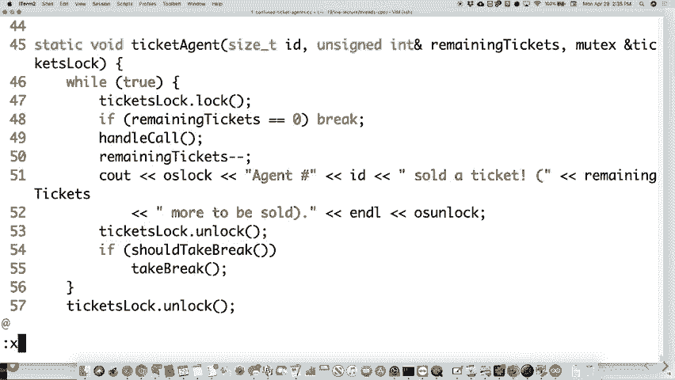

使得票务代理感到困惑。这些问题希望已经解决了。我们来看看这样做会发生什么。困惑的票务代理。好。现在，你首先注意到什么？ >> 更慢了。 >> 更慢了。对。所以这里有一个问题，因为现在每个票务代理都在说，好。

有票可卖。我将去卖票。对吧。然后我会减少剩余票数，再释放锁。好。这是我们创建的方式，本质上还是序列化的。对。现在。休息时间不是序列化的。那没关系。我的意思是。

我们能获得一点好处，因为我们不需要休息时间。任何人都可以同时休息。它们不会争夺咖啡机或者其他需要做的事。但是否则，这个过程要花很长时间。实际上，现在运行这一过程要超过一分钟，你会想，嗯，这似乎有点……

有点疯狂。好。那么，是否有办法修改它，使得我们能做到这一点，并且最终不会像现在这样阻塞，导致我们拖慢进程？顺便说一句，我们来确认一下，看看它是否有效。我们将减少到零。应该是每个人都上去。好，耶，成功了，对吧？

因为它们都达到了接近结束的一个点，在那里没有更多的票可卖了。顺便说一下，你，看看，是不是在说，还是没有？它们都，所有人都在等。注意，票已售出。实际上，它们恰好在同一时刻等待。好。然后，因为它们都等，所以最终都到了那个地方。

锁定以进行检查。那么，你怎么看？我们能否修复这个问题，甚至让它更快一些？

也许我们需要改变自己对卖票这个概念的理解。像是有时候你无法避开这个问题。好吧。那么在这种情况下，我们能做点什么让这个过程更高效吗？

你觉得怎么样？太棒了。把剩余的票放在那里，然后继续。我要走这条路。

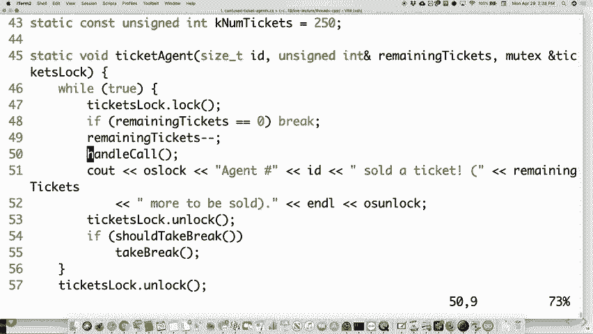

这里面上面的这个。那能行吗？我觉得可以。对吧？

现在我们假设票已经卖出。对吧？

假设售票员接到电话。售票员已经说过了，“哦，我得说票已经卖完了”。然后假设有些逻辑，比如，“我不想要这张愚蠢的票，航空公司很糟糕，我得挂掉电话。”对吧？嗯，他们必须以某种方式把票退回去，但我们这里没有这部分逻辑。

如果我们，呃，我们可以把它构建进去。你可以以某种方式把它构建进去，比如说，“哦，如果你卖的是最后一张票，你最好继续卖下去。你得等它卖掉才行。”之类的。

对吧？但我觉得这个其实会起作用。让我们看看。生成混乱的票，然后，啊，速度还是快了很多。对吧？并不是说快得离谱，但绝对更快了。我可以说它快多了。事实上，这个速度确实快了很多。让我们看看接近结尾时会发生什么。看看它是否还会继续工作。

好的，事情就这样结束了。许多代理人说没有票了，他们就离开了，回家了，而其他的代理人还在继续卖票。对吧？但在那个时候，谁在乎呢？

我们假设每个代理人都会卖出他们的票。好吧？这是一种处理方式。那么你明白了，重点是，如果你能让你的逻辑让你进行锁定的话。

在短短的一段时间内，这是最好的处理方式。不要在处理重要的事情时进行锁定，像是处理电话。它与票是否已被减去无关。现在也许我们需要更多的逻辑来处理票未卖出去的情况，你知道的，事情就是这样。

从某种意义上说，这是一个不同的程序。但你确实需要，确实想要避免在不重要的地方进行锁定。不要让售票员说，“直到我卖完我的票，你不能碰票队列。”这就是我们刚才做的事。对。所以在那个代理空白的地方卖了票，并且有多个这样的声明。

比如说，不同的代理人，然后剩余的票数保持不变。因为现在的锁会锁住这个地方，你知道的，票数的减少。

在打印语句发生之前会发生什么？对的。所以像这里说的，从两个不同的代理商出售六张票。那是你的担心吗？是的。如果它可能不重要，你仍然会有其他的。也许如果我们想要的话，应该把打印语句放在它们被解锁之前。我们本来也可以这样做。但在这种情况下，那只是一个打印语句。

我们可能能清理一下。事实上，我们可以试试，看看它是否适合我们这里的情况。我们看看。是的。我的意思是，你需要在这里拆开，先放置要售出的票数，再把代理商出售票的部分放在下面。你可以把这个 `see out` 语句拆开来做。不过，是的。

那在某种意义上也是另一个竞态条件。哦，两个人认为剩下的票数是一样的。那似乎有点奇怪。但最终，他们停止的逻辑还是有效的。但对，是的。这是另一种你需要修复的异常情况。是的。好问题。好。有没有办法让它像这样快，完全不加锁？

即使那样，它也不如预期的那么快？有没有办法让它接近这么快？

这实际上很接近了。我不知道你是否还记得之前的内容。这差不多。但不是，我的意思是，加锁会涉及一些开销，因为在某些时刻，两个线程正在试图访问相同的数据结构或变量，而这将花费更多的时间。这就是一个弊端，但也是让它能够正常运行的必要弊端。

所以程序是可以运行的。但好问题。是的。我们做的类似条件锁的方式就像是唯一锁，在那里像是有10张票剩下。是的，好问题。那么萨姆说，等等，如果是，是否有一种方法可以在剩下某个特定数量时加锁？

剩余的票数或者其他类似的东西，这样更多的人可以进入并告诉他们，那些被称为条件变量。实际上还有另外一种方法，我们会自己构建一个叫做信号量的方法来做这件事。它允许你基本上有一个计数器，在这个计数器为零时，你才会加锁。然后在那之前，任何人都可以进入并尽可能多地抓取票，直到计数为零。

计数变为零。很好。好问题。我们会讨论到的。好问题。是的。你能解释一下为什么锁内的锁调用会更慢吗？是的，好问题。为什么，为什么当 `handle call` 在锁内被调用时，会更慢？那么，`handle call` 做了什么？

它只是处于睡眠状态，对吧？如果你在 `handle call` 被调用时还没有解锁的话。每个人，其他人都在站着看那个售票代理，试图卖票，因为他们无法进入去修改它。对吧？所以这里就是之前内在的慢速发生的地方。每个售票代理都是独立的，在卖票，而其他人都在等着。

围绕着进行，我连票都卖不出去，因为我甚至无法把东西拿出来。所以从这个意义上来说，我们的模型并不完美。对吧。但知道票总是能卖出去，这样就使我们能够做到这一点。好的，关于这个有其他问题吗？好的。线程是有点有趣的东西，但你可以看到很多问题。随着我们继续前进，我们将接触到更多不同类型的锁。

好的，我周三见。
