# 课程 P11：第10讲 ä»C线程到C++线程 🧵


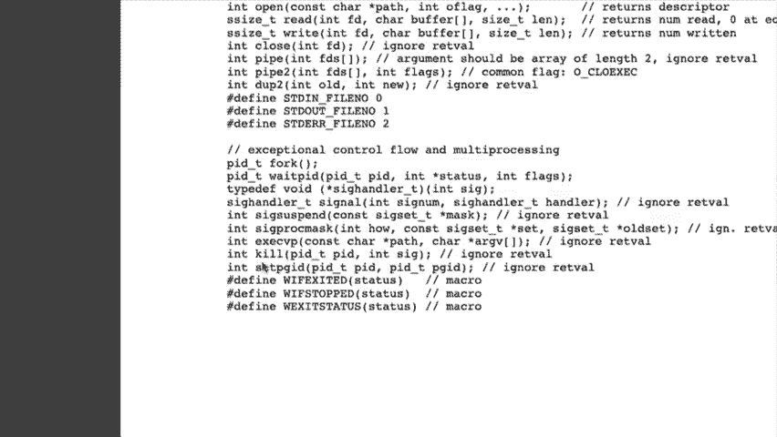

在本节课中，我们将学习如何ä»C语言的Pthreads过渡到C++11内置的线程库。我们将æ¢è®¨C++线程的基本用法ã€å¦‚何传递å‚æ•°ã€ä»¥åŠå¦‚何处ç†å¤šçº¿ç¨‹ç¼–程中常è§çš„ç«äº‰æ¡ä»¶é—®é¢˜ã€‚


---

## æœŸä¸­è€ƒè¯•å®‰æ’ ğŸ“

上一节我们介ç»äº†å¤šè¿›ç¨‹å’Œå¤šçº¿ç¨‹çš„基本概念，本节中我们æ¥çœ‹çœ‹æœ¬å‘¨çš„é‡è¦å®‰æ’。

期中考试定äºæœ¬å‘¨å››æ™šä¸Š6点到8点，地点在Hewlett 200教室。考试将使用Blue Book系统进行。

以下是关äºè€ƒè¯•çš„é‡è¦ä¿¡æ¯åˆ—表：
*   考试形å¼ä¸ºåœ¨ç¬”记本电脑上使用Blue Book程åºç­”题并æ交。
*   考试内容加密，将在考å‰å‘布，进入考场åè·å¾—密ç å³å¯å¼€å§‹ã€‚
*   考试时长为两å°æ—¶ï¼Œä½†é¢„计多数åŒå­¦å¯åœ¨ä¸€ä¸ªåŠå°æ—¶å†…完æˆã€‚
*   å…许æºå¸¦ä¸€å¼ æ­£åé¢å†™æœ‰ä¸ªäººç¬”记的纸张进入考场。
*   考试时会æ供一份有é™çš„å‚考资料，包å«å¸¸ç”¨å‡½æ•°åŸå‹å’Œå¸¸é‡ã€‚
*   如æœéœ€è¦ç‰¹æ®Šè€ƒè¯•å®‰æ’，请务必æå‰é€šè¿‡é‚®ä»¶è”ç³»è€å¸ˆã€‚


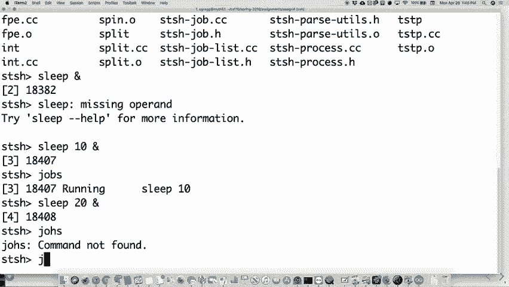

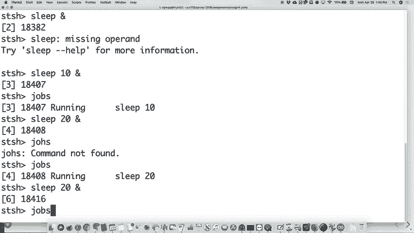

考试内容将涵盖信å·å¤„ç†ã€å¤šè¿›ç¨‹ç¼–程等，形å¼ä¸ç»ƒä¹ é¢˜ç›¸ä¼¼ï¼ŒåŒ…括编程题和简答题。


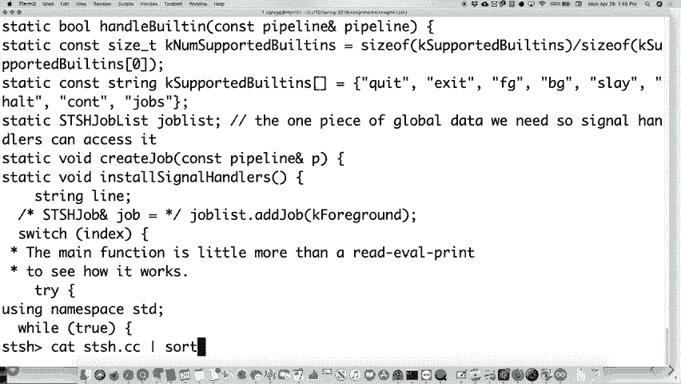


---


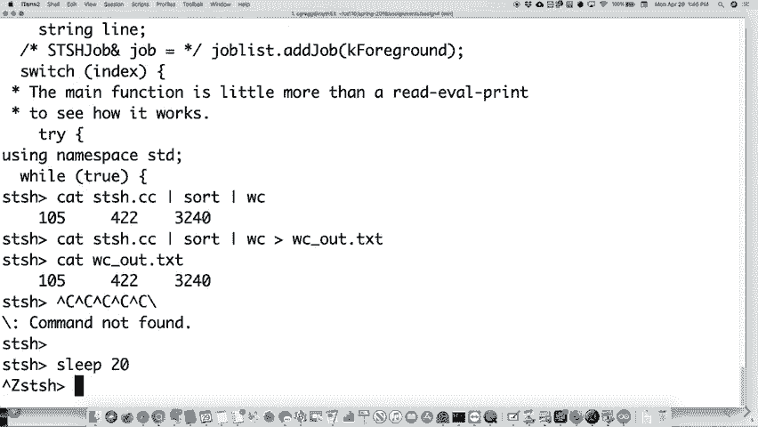


## 本周作业：斯å¦ç¦Shell ğŸš

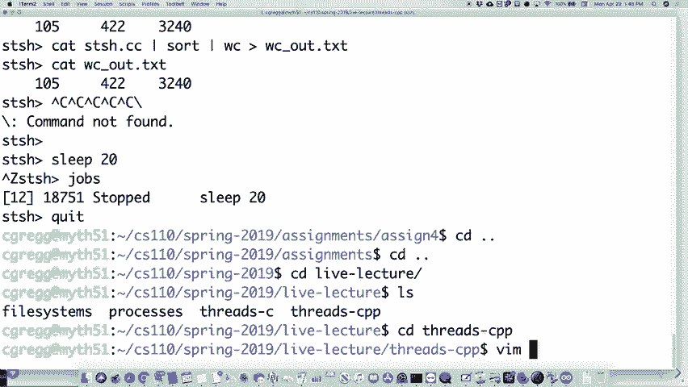

æ¥ä¸‹æ¥ï¼Œæˆ‘们看看本周的作业。这是一个æ„建简易Shell的程åºï¼Œå为“斯å¦ç¦Shellâ€(Stanford Shell)。


这个作业è¦æ±‚ä½ å®ç°ä¸€ä¸ªåŠŸèƒ½ç›¸å¯¹å®Œæ•´çš„Shell，需è¦å¤„ç†ä»¥ä¸‹æ ¸å¿ƒåŠŸèƒ½ï¼š
*   执行基本命令，并支æŒå‰å°/åå°è¿è¡Œã€‚
*   使用 `jobs` 命令查看所有åå°ä½œä¸šã€‚
*   使用 `fg` 命令将åå°ä½œä¸šè°ƒè‡³å‰å°ã€‚
*   使用 `bg` 命令é‡å¯ä¸€ä¸ªå·²åœæ­¢çš„åå°ä½œä¸šã€‚
*   使用 `slay` 命令å‘整个进程组å‘é€ä¿¡å·ä»¥ç»ˆæ­¢ä¸€ç»„进程。
*   支æŒç®¡é“æ“作，例如 `ls | grep | cut`。
*   支æŒè¾“å…¥/输出é‡å®šå‘。
*   æ­£ç¡®å¤„ç† `Ctrl+C` (SIGINT) å’Œ `Ctrl+Z` (SIGTSTP) ä¿¡å·ï¼Œä½¿å…¶å½±å“å‰å°è¿›ç¨‹è€ŒéShell本身。

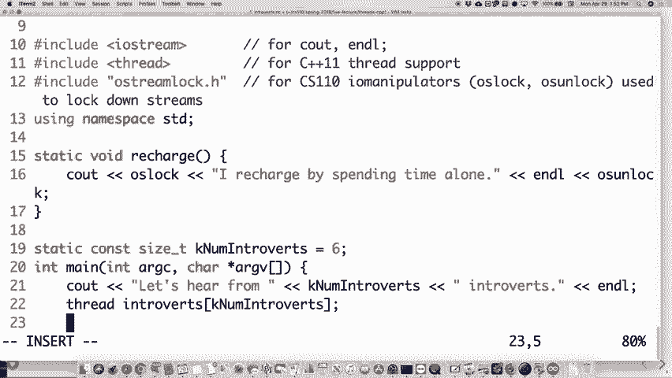

作业的核心难点在äºç®¡ç†å¤šä¸ªå­è¿›ç¨‹ã€å®ç°ç®¡é“以åŠå¤„ç†ä¿¡å·ã€‚建议按照æ供的里程碑顺åºå®Œæˆï¼Œå¹¶å……分利用测试驱动文件进行调试。作业截止日期为下周三。

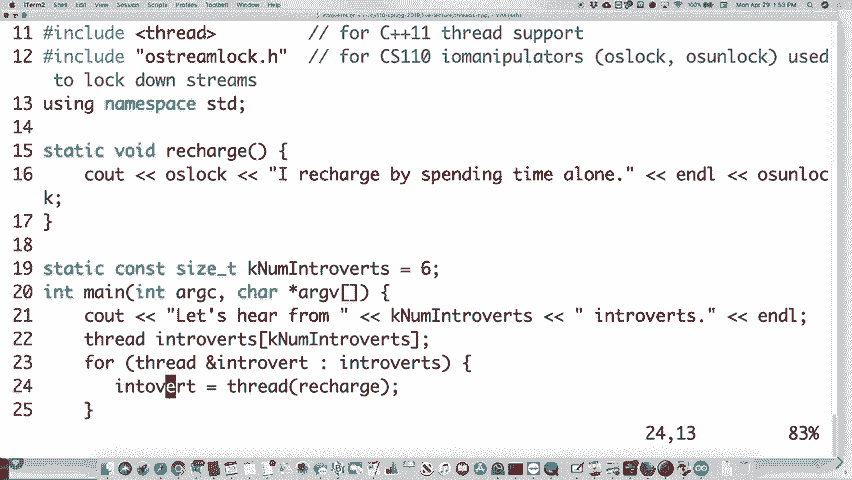

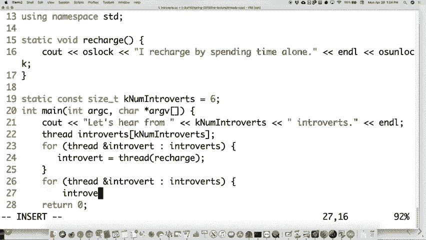


---

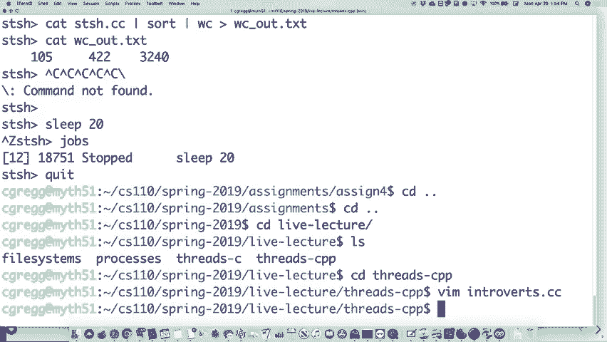

## ä»Cçš„Pthreads到C++线程 🔄

ç°åœ¨ï¼Œè®©æˆ‘们正å¼è¿›å…¥C++线程的世界。ä¸Cçš„Pthreads相比，C++11内置的线程库语法更简æ´ï¼Œé›†æˆåº¦æ›´é«˜ã€‚

C++线程åŒæ ·å…±äº«è¿›ç¨‹å†…存，æ¯ä¸ªçº¿ç¨‹æ‹¥æœ‰ç‹¬ç«‹çš„栈，但å¯ä»¥è®¿é—®å…±äº«çš„全局数æ®ã€‚它们被认为是“轻é‡çº§è¿›ç¨‹â€ï¼Œèƒ½å¤ŸçœŸæ­£åœ¨å¤šæ ¸CPU上并行执行。

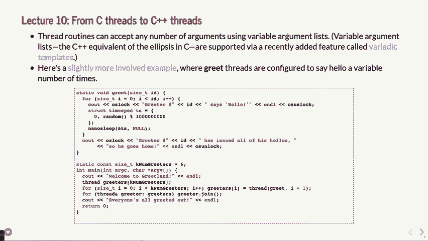


### 基础示例：充电程åº


我们ä»ä¸€ä¸ªç®€å•çš„程åºå¼€å§‹ï¼Œåˆ›å»ºå¤šä¸ªçº¿ç¨‹ï¼Œæ¯ä¸ªçº¿ç¨‹æ‰“å°ä¸€æ¡ä¿¡æ¯ã€‚


```cpp
#include <iostream>
#include <thread>
#include <vector>
// 需è¦åŒ…å«è‡ªå®šä¹‰çš„ oslock.h æ¥ä¿è¯ cout 的线程安全
#include "oslock.h"


void recharge() {
    oslock lock;
    std::cout << "I recharge by spending time alone." << std::endl;
    osunlock unlock;
}


int main(int argc, char *argv[]) {
    const size_t kNumIntroverts = 6;
    std::vector<std::thread> introverts(kNumIntroverts);
    for (size_t i = 0; i < kNumIntroverts; ++i) {
        // 创建线程并执行 recharge 函数
        std::thread t(recharge);
        // 使用 swap 将线程对象移入数组
        introverts[i].swap(t);
    }
    for (std::thread& introvert : introverts) {
        introvert.join(); // 等待所有线程结æŸ
    }
    return 0;
}
```
**关键点说æ˜**：
*   `std::thread t(recharge)`：创建并å¯åŠ¨ä¸€ä¸ªæ‰§è¡Œ `recharge` 函数的新线程。
*   `introverts[i].swap(t)`：这是一个C++的“移动â€æ“作，将新创建的线程对象 `t` 移入数组 `introverts`，é¿å…ä¸å¿…è¦çš„æ‹·è´ã€‚
*   `introvert.join()`：主线程等待该å­çº¿ç¨‹æ‰§è¡Œå®Œæ¯•ã€‚


---

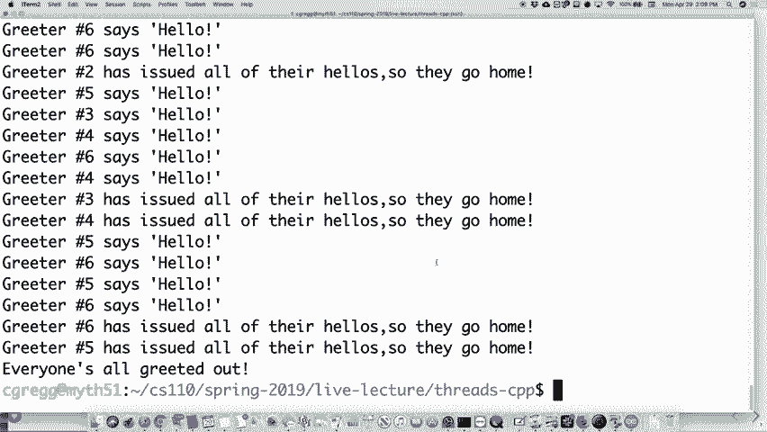


### å‘线程传递å‚æ•° 📨

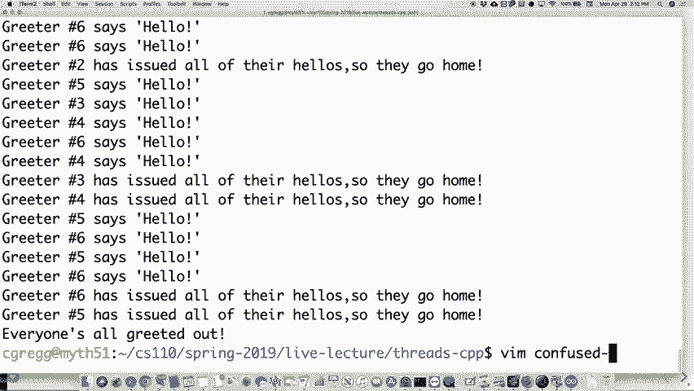

线程函数å¯ä»¥æ¥å—å‚数。C++线程库å…许你以值传递或引用传递的方å¼å‘线程函数传å‚。


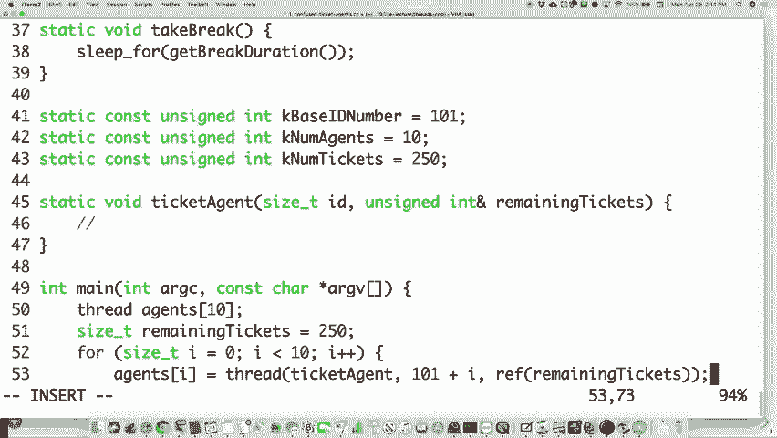

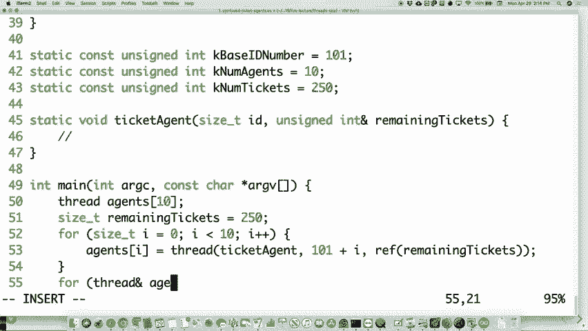

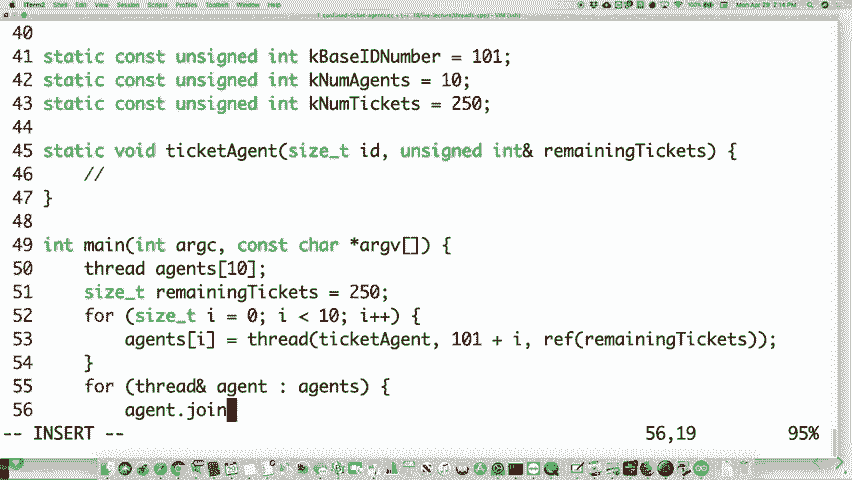

以下是传递å‚数的示例程åºï¼š
```cpp
#include <iostream>
#include <thread>
#include <vector>
#include "oslock.h"


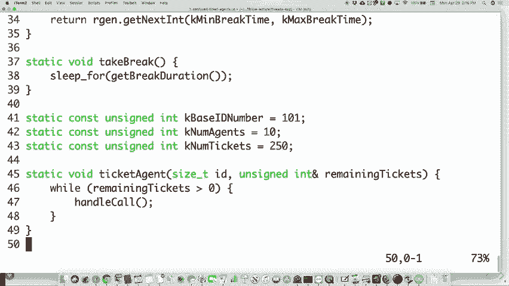


void greeter(size_t id, size_t numTimes) {
    for (size_t i = 0; i < numTimes; ++i) {
        oslock lock;
        std::cout << "Greeter #" << id << " says 'Hello!'" << std::endl;
        osunlock unlock;
        // 模拟一些处ç†æ—¶é—´
        struct timespec ts = {0, random() % 1000000000};
        nanosleep(&ts, NULL);
    }
    oslock lock;
    std::cout << "Greeter #" << id << " has issued all greetings and goes home." << std::endl;
    osunlock unlock;
}


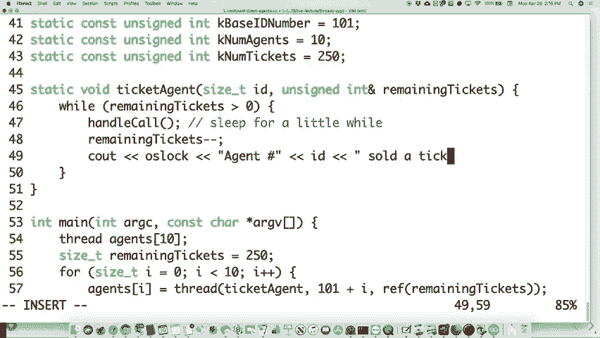


int main(int argc, char *argv[]) {
    std::cout << "Welcome to Greetland!" << std::endl;
    const size_t kNumGreeters = 6;
    std::thread greeters[kNumGreeters];
    for (size_t i = 0; i < kNumGreeters; ++i) {
        // 创建线程，并传递å‚æ•° i+1 (值传递)
        greeters[i] = std::thread(greeter, i + 1, i + 1);
    }
    for (std::thread& greeter : greeters) {
        greeter.join();
    }
    std::cout << "Everyone has been greeted. The end." << std::endl;
    return 0;
}
```
**关键点说æ˜**：
*   `std::thread(greeter, i + 1, i + 1)`：第一个 `greeter` 是函数å，åç»­å‚æ•° `i+1` 将按值传递给 `greeter` 函数。
*   若需传递引用，需使用 `std::ref()` 进行包装，例如 `std::ref(sharedVariable)`。

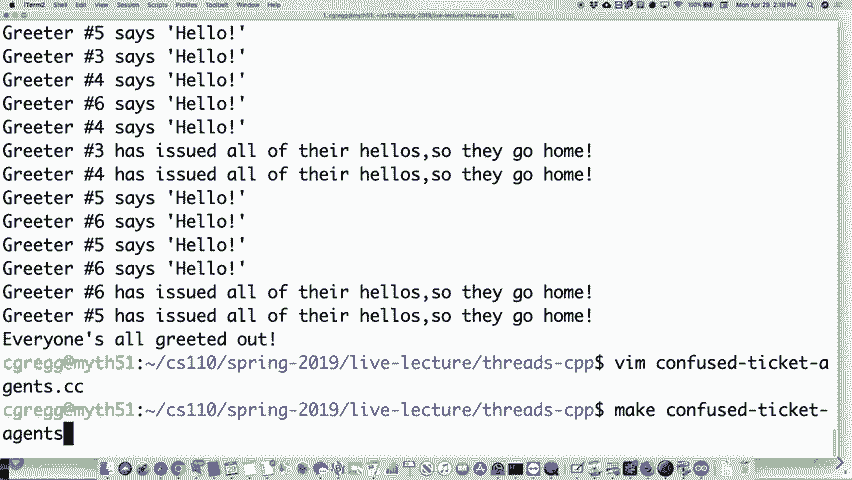


---

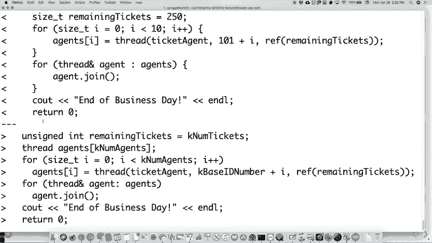


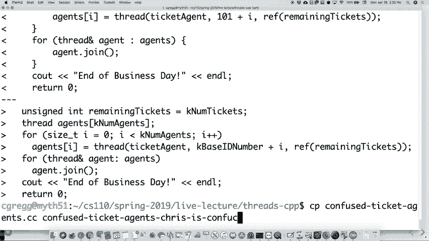


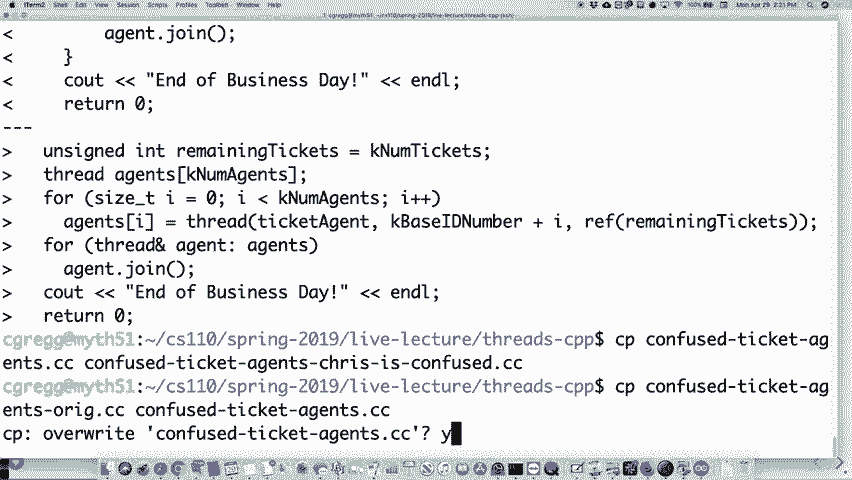

## 处ç†ç«äº‰æ¡ä»¶ä¸äº’æ–¥é” ğŸ”

多线程访问共享资æºæ—¶ï¼Œä¼šäº§ç”Ÿç«äº‰æ¡ä»¶ã€‚我们通过一个模拟售票的程åºæ¥æ¼”示这个问题åŠå…¶è§£å†³æ–¹æ¡ˆã€‚


### 存在ç«äº‰æ¡ä»¶çš„版本


å‡è®¾æœ‰å¤šä¸ªå”®ç¥¨ä»£ç†çº¿ç¨‹å…±äº«ä¸€ä¸ªå‰©ä½™ç¥¨æ•°å˜é‡ã€‚
```cpp
size_t remainingTickets = 250; // 共享å˜é‡

void ticketAgent(size_t id, size_t& tickets) {
    while (tickets > 0) {
        // 模拟处ç†ç¥¨åŠ¡çš„时间
        handleCall();
        tickets--; // éåŸå­æ“作，存在ç«äº‰æ¡ä»¶ï¼
        oslock lock;
        std::cout << "Agent #" << id << " sold a ticket (" << tickets << " more to be sold)." << std::endl;
        osunlock unlock;
        takeBreak();
    }
    oslock lock;
    std::cout << "Agent #" << id << " notices all tickets are sold and goes home." << std::endl;
    osunlock unlock;
}
```
**问题**：`tickets--` ä¸æ˜¯åŸå­æ“作，多个线程å¯èƒ½åŒæ—¶è¯»å–ã€ä¿®æ”¹è¯¥å˜é‡ï¼Œå¯¼è‡´ç¥¨æ•°è®¡ç®—错误（如å–超或负数）。

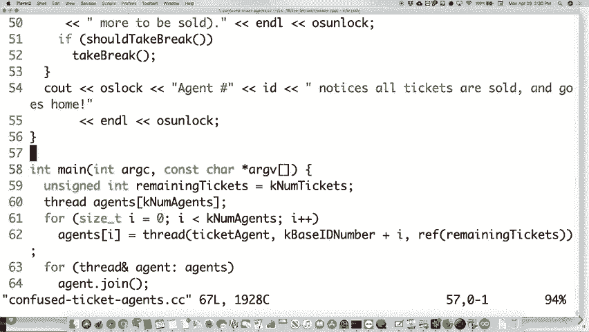

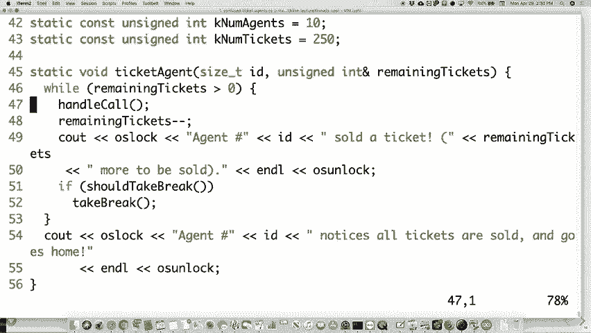


### 使用互斥é”解决问题


互斥é”å¯ä»¥ç¡®ä¿åŒä¸€æ—¶é—´åªæœ‰ä¸€ä¸ªçº¿ç¨‹èƒ½è¿›å…¥è¢«é”ä¿æŠ¤çš„“临界区â€ä»£ç ã€‚
```cpp
#include <mutex>


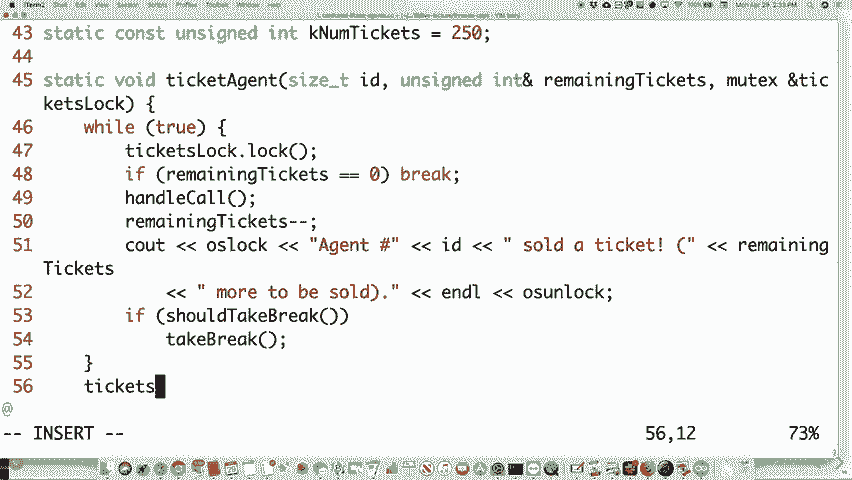

std::mutex ticketLock; // 全局互斥é”
size_t remainingTickets = 250;


void ticketAgent(size_t id, size_t& tickets, std::mutex& lock) {
    while (true) {
        lock.lock(); // 加é”
        if (tickets == 0) {
            lock.unlock(); // 检查åç«‹å³è§£é”
            break;
        }
        tickets--; // 在é”çš„ä¿æŠ¤ä¸‹ä¿®æ”¹å…±äº«å˜é‡
        size_t myTicket = tickets;
        lock.unlock(); // 尽快解é”，让其他线程进入

        // 在é”外执行耗时的æ“作（如打å°ã€æ¨¡æ‹Ÿå·¥ä½œï¼‰
        handleCall();
        oslock outLock;
        std::cout << "Agent #" << id << " sold a ticket (" << myTicket << " more to be sold)." << std::endl;
        osunlock outUnlock;
        takeBreak();
    }
    oslock lock;
    std::cout << "Agent #" << id << " notices all tickets are sold and goes home." << std::endl;
    osunlock unlock;
}

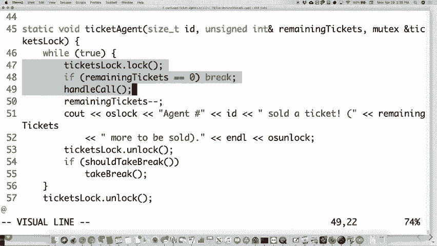

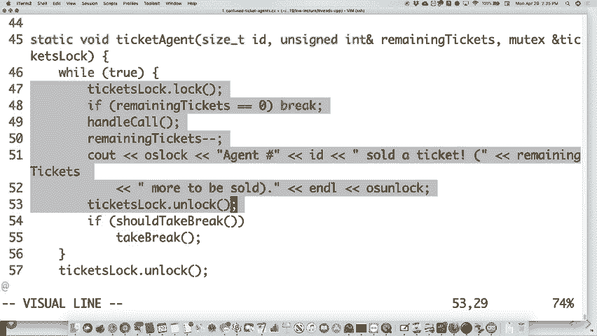


int main() {
    std::thread agents[10];
    for (size_t i = 0; i < 10; ++i) {
        // 传递共享å˜é‡å’Œäº’æ–¥é”的引用
        agents[i] = std::thread(ticketAgent, 100 + i, std::ref(remainingTickets), std::ref(ticketLock));
    }
    for (std::thread& agent : agents) { agent.join(); }
    return 0;
}
```
**关键点说æ˜**：
*   `std::mutex`：定义互斥é”。
*   `lock.lock()` / `lock.unlock()`：手动加é”ä¸è§£é”。确ä¿é”的粒度尽å¯èƒ½å°ï¼ŒåªåŒ…围访问共享资æºçš„代ç ï¼Œé¿å…长时间æŒæœ‰é”导致性能下é™ã€‚
*   `std::ref()`：用äºå‘线程函数传递引用类å‹çš„å‚数（如 `remainingTickets` å’Œ `ticketLock`）。


---

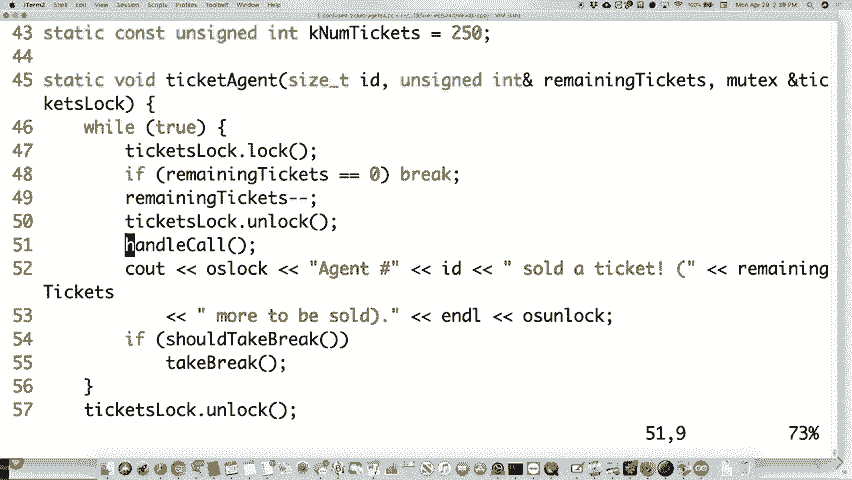

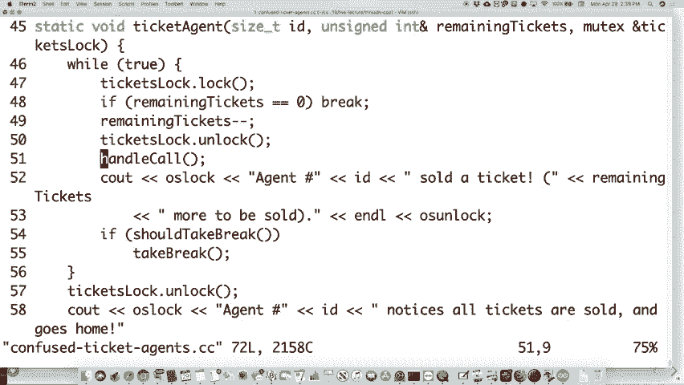

## 总结 ğŸ¯

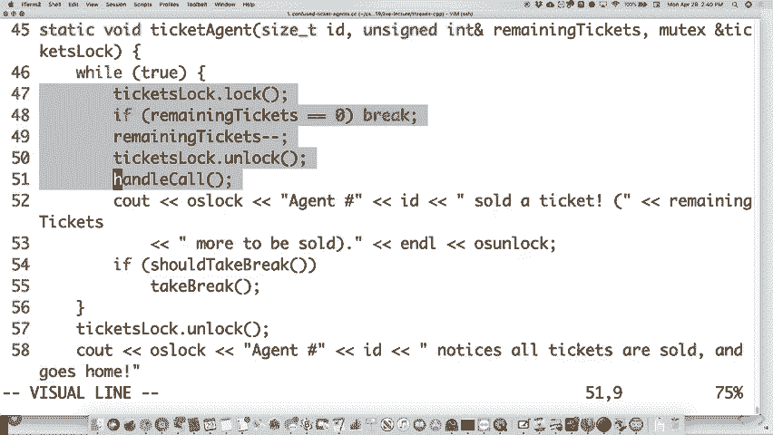


本节课中我们一起学习了：
1.  **C++线程基础**：如何使用 `std::thread` 创建线程ã€ä¼ é€’å‚数以åŠä½¿ç”¨ `join` 等待线程结æŸã€‚
2.  **线程安全输出**：通过自定义的 `oslock`/`osunlock` ä¿è¯ `std::cout` 在多线程ç¯å¢ƒä¸‹çš„输出完整性。
3.  **ç«äº‰æ¡ä»¶**：ç†è§£äº†å¤šçº¿ç¨‹å¹¶å‘修改共享数æ®æ—¶å¯¼è‡´çš„问题。
4.  **互斥é”**：æŒæ¡äº†ä½¿ç”¨ `std::mutex` ä¿æŠ¤ä¸´ç•ŒåŒºï¼Œè§£å†³ç«äº‰æ¡ä»¶çš„基本方法。记ä½è¦å°½é‡ç¼©çŸ­é”çš„æŒæœ‰æ—¶é—´ä»¥æ高程åºæ•ˆç‡ã€‚

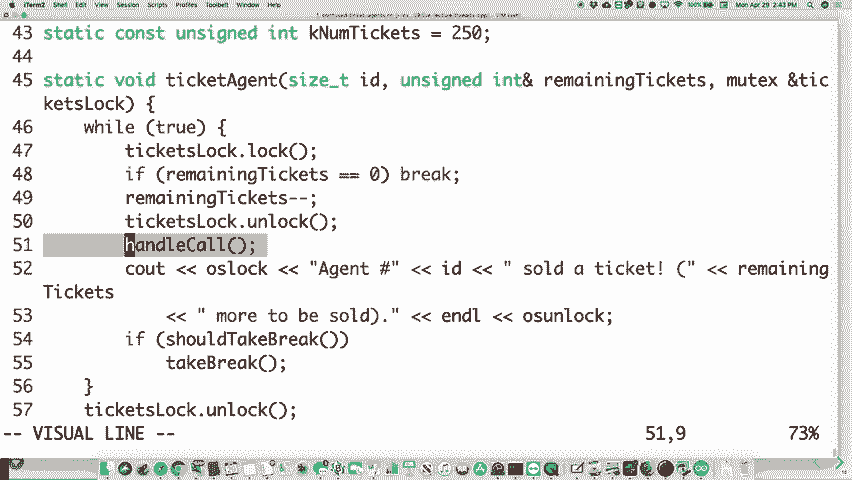

ä»Cçš„Pthreads到C++线程，我们拥有了更ç°ä»£ã€æ›´æ˜“用的工具æ¥å¤„ç†å¹¶å‘编程。在æ¥ä¸‹æ¥çš„课程中，我们将æ¢è®¨æ›´é«˜çº§çš„åŒæ­¥æœºåˆ¶ï¼Œå¦‚æ¡ä»¶å˜é‡å’Œä¿¡å·é‡ã€‚