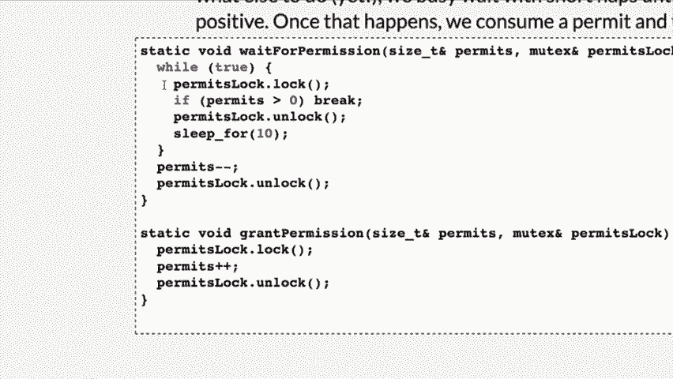
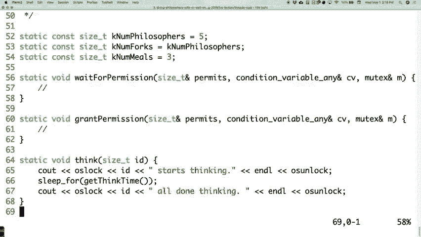
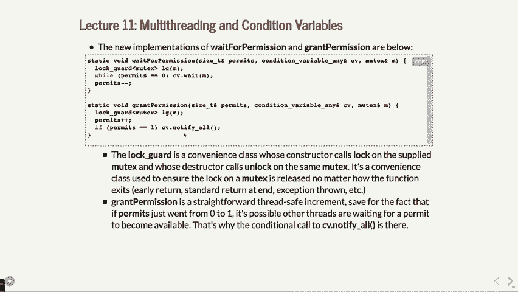

# P12：Lecture 11 Multithreading, Condition Variables and Semaphores - ___main___ - BV1ED4y1R7RJ

 Alright， we might as well get going， but it seems a little odd。 I'll try not to blaster yours out。 Okay， so definitely the day before midterm。 We've got lots on your plate。 I can see why some people might not be showing up。 Wouldn't it be terrible if this was the day that the screencast failed？

 You guys all here would be happy， but everybody else wouldn't be I suppose。

 A couple things。 First things， no labs this week。 They're instead。 we're just asking that you watch a little short video。 It's five minutes long。 Some of you have actually already seen it。 If you took CS106A maybe like last summer or two summers ago or something。 you might， have also seen it。 But anyway， it's a short little video。

 literally five minutes and it's other graduates from， Stanford mostly who have。 we're just going to talk about CS a little bit。 So give it a watch。 That's going to be your lab check-in for the week。 Otherwise。 you probably want the hour and 20 minutes back to study， do work on them， Stanford， Shell， etc。

 Alright， so enjoy that and that's what we'll be instead of lab for this week。

 The other day， what did I do？ I got confused。 So I teach another class。 Is Mark here？

 I don't see him。 I teach another class and a couple people in this class are actually in that class as。 well。 I'm teaching computer science， an introductory computer science class。 Now you literally used the example from what happened in class the other day as I was talking。 about， hey， guess what？ Sometimes professors mess up and they。

 or they can't fix their live code or they can't， find the bugs and this is exactly what happened on Wednesday。 So I apologize about that。 But as promised， I did go back and figure out what was going on with that compiled bug。 It was a little bit subtle。 Not to say that was a good reason why I didn't figure it out but it was a little bit subtle。 as to why the error happened。 Here was the code again。 This was the error。 We were focusing。

 I was focusing in the lecture on this line right here。 Ticket age is line 62 near the end of the line actually which is this line right here， near。 the end here。 So let's say right around here。 That turns out to be where the issue was。 What are we doing here？ We are sending a reference to remaining tickets to a function。

 to the thread function which， will repackage it and forward it on to the ticket agent function。 So that's kind of what's going on there。 There's a little bit of C++ black magic under there that happens at that point。

 But if you look up here， we've got ticket agent and so this is what's going on with the remaining。 tickets there。 Anybody notice what might be the issue at this point？

 It wasn't that I just passed it。 I did pass it correctly and it is a reference。 The problem is that little error message just told me to look here。 It didn't say anything about up here and it also explicitly didn't say anything about， a type issue。 So what's the type of remaining tickets？ Size T。 What type did I tell this to look for？

 Unsigned int which is kind of like a size T except an unsigned long is what a size T， is。 So the compiler went， "You're trying to do two different types here。 Give me a break。"。

 Then gave me some terrible error message about that。 Anyway， that was the issue。 Once I went back and fixed that made it size_t， ampersand then it worked just fine。 Yeah。 so bugs happen to everybody who was ever programmed so don't think you're on your。 own when you hit all those bugs。 They're tough to find and they're tricky。

 I had somebody in Offsiers yesterday who had a bug that honestly the only reason I figured。 out what it was because I have 25， 30 years worth of program experience。 It was such a subtle little bug that I thought， "Oh， that one's a hard one to find。"， So anyway。 it was a good thing that that person came into Offsiers。 But these are things that happen。

 It's just， you know， bugs are hard， programming， challenging。 So anyway。 there's what happened the other day。 All right， so let's move on to a very cool problem that if you take a multi-threading。

 or even a multi-processor type class like this one in particular， if you don't cover， this problem。 it's kind of like never ever reading a Shakespeare play in an English class， somewhere。 Like this is like the quintessential deadlock problem for multi-processing， multi-threading。 sort of situations。 It is called the Dining Philosophers。

 It's actually got a fun name and it's Dining Philosophers。 Here's how it works。 Let me see if I can get my whiteboard here going。 Here's how it works。 There is a table and in the table， okay， my drawings those are terrible by the way。 That's supposed to be a circle。 There's a table here。

 There are five philosophers and philosophers have like big brains or whatever。 There's one， two。 right？ Okay， three over here and then four sitting at this table here and then of course they're。 not， I guess there should be， they should be even there。 You can see why I was an art major when I did this。 Okay。

 five philosophers sitting around the table。 They each have bowls of like spaghetti in front of them。 Okay， they each have bowls spaghetti and they want to do a few things。 They want to both think and then eat。 Okay， and this is what they do。 They're going to actually go through this three times。

 They're going to think for a while and then they're going to eat and then they're going。 to think again， eat， think again and then eat three times。 And what the situation here is is that there are one， I'm going to just kind of draw them。 like this。 Two， three， four， five forks。 Okay， those are my little forks。 Okay。

 and here's how the dining philosophers eat。 If you are， if you are about to eat。 you grab the fork on your right and then you grab。 the fork on your left and for some reason you eat spaghetti like this， right， which is ridiculous。 This should have been， whoever did this should have just used chopsticks because that actually。

 makes sense and that's a legitimate like you need two chopsticks to eat， right？ But anyway， well。 the original problem was forks because whoever did it had possibly， never heard of chopsticks。 I don't know。 But anyway， point is that it's forks in this case。 but they each need one and they're going， to eat for a little while and they are going to。

 when they're done eating， put the forks， down in the same order。 they pick them up in like right and then left and then， or I guess， in that。 here's the option or we'll see what the code does anyway。 But the point is that's what's happening。 Now， in the end， this， if you do this， like how many people， how many philosophers can。

 actually eat at the same time？ Two， right？ Like that's the maximum， right？

 Even though they all might be going for the forks。 Okay？ So that's the big issue。 Like there's two people that but we want to make it so that they all kind of share this。 because we don't know when they're going to be thinking when they're going to be trying。 to eat and that's that。

 Okay？ So that's the setup for the problem and what we're going to do is we're going to just write。 a little code to try to test this out。 Okay？ And try to actually write this。 model this in the in-ceivos-phosome。

 In fact， let's just go straight to code and we will do this。 Dining philosophers with deadlock which means we're going to probably cause an issue here。

 Okay？ So here's what's going to happen。 All right， let's start with how a philosopher thinks。 Okay？

 A philosopher thinks by basically in our program basically just taking some time， some kind。 of random amount of time to actually go ahead and think。 So we're going to do something like this。 Remember we have， we're in threading mode。 This will be in a thread by the way。 Each philosopher will get its own thread and we're going to do the OS lock。 Okay？

 And then we're going to say something like， let's see。 The ID。 Okay？

 That's the philosophers ID that we're passing in here。 Zero through four because there's five dining philosophers。 Okay？ ID and then starts thinking。 Okay？

 And when the philosopher is thinking then we have to spend some， we have to actually take。 some time to do this。 So we're going to do that and then。 and L and then we are going to do OS on lock like。

 that。 Okay？ And then， I don't know why it never， never， well anyway， it doesn't do the indentation。 for whatever reason sometimes。 Okay。 So anyway， we're going to， we're going to print that out。 Then we are going to do a sleep。 Now in a thread you call sleep four and then some number of like milliseconds。 generally， it's milliseconds。 So let's sleep for some amount of time。

 We have another function that's just going to kind of randomize it。

 It's not really important what it is， but we're going to just get think time like that。 Okay？

 And then once it's done sleeping， we're going to say same thing， OS lock， ID， done， all。 done thinking。 Okay？ And L and OS on lock。 All right。 That's all the philosopher has to do to think。 Okay？ Pretty straightforward。 All right。 All right。 And to eat。 we're going to use our mutex that we learned about last time。 Okay？ Remember what a mutex is。

 A mutex is a data structure such that many different threads might be trying to grab。 control of that lock in the data structure。 The other ones， if they。 if it's already locked when they try to grab control， they just wait。 around until it unlocks and then they try to grab it again。

 And at that point you might have contention between the two。 So because we've got two forks。 we're going to have a left fork and a right fork。 And we are going to have the philosophers actually try to eat。 So what we're going to do， they're going to pick up the left one as it turns out first。 I think I might have said right before。 They are going to do the left lock。

 Okay？ And then right lock。 Okay？ And then we're going to say， okay， look。 At this point now they can start to sleep or they can start to eat， which is kind of sleeping。 in this case。 Okay？ So they're going to say， oops， ID starts eating。 Okay。 Nom， nom， nom。 nom like that。 Okay。 And L and then OS on lock like that。 Okay。

 And we're going to model this by again doing some sleep for thread wave sleeping for get， each time。 A slightly different one which just basically says some amount of time that is going to。 get in fact， I just realized I actually didn't call the function up here。 There we go。 Okay。 So we're going to do sleep free time。 And then we're going to say， see out OS lock， ID。

 all done eating。 And L and then OS on lock like that。 And then of course now we're done eating so we can put the forks back down。 We are going to do it in the same order。 We picked them up and as it turns out。 So left dot unlock and right dot unlock。 Okay。 Now we are going to have to pass the forks that are next to the dining philosophers in。

 there。 Right？

 So if you looked at that circle again before， right， it's whichever one， whichever two forks。 were next to a particular philosopher here and here is the left for this one and the。 right for that。

 Okay。 All right。 So that's how that works。 And that's the， that is the eat function。

 Okay。 Let's go and look at what a philosopher actually does。

 Okay。 A philosopher does the following。 The philosopher is four size t i equals zero。 i is less than three， i plus plus。 Remember， they're going to do this three times in a row。 What are they going to do？ They are going to think and then they are going to eat and we have to pass in the left。 and be right。

 Okay。 So far so good on what's going on there。 Okay。 That's what's happening。

 That's a philosopher。 Now we have to do our main function here。 Okay。 And the main function。 we have to set up these mutexes for each fork。 Okay。 So let's do that。 Mutex forks will do five of them。 Okay。 And then we'll have philosophers。 We'll have five of them。 Okay。 And then four size t i equals zero， i is less than five， i plus plus。

 Okay。 And in here we're going to actually launch each thread like we've done in the past before。 here。 Okay。 What we want to do though first is we need to set up which who gets what fork， right？

 So we can do mutex left， oops， left equals forks i。

 Okay。 And then we can do， oops， maybe I need a semicolon there， mutex right equals forks i。 this way， i plus one， mod five。 Right？ That'll just give you the one around the corner。 the other side。 Okay。 The mod in there wraps around if necessary。

 Okay。 And then we actually have to do philosophers i equals threads。 And now we're calling thread that we are， or we're setting up a thread。 Philosopher was the name of the philosopher， I just believe， right？ The name of the function。 And then we are passing in the id。 We are passing in a reference to the left。

 a reference to the right。 And we are passing in a ref permits。 Okay。 And then， oops， sorry。 Not permits wrong， wrong， looking at the wrong one here。 We're passing in just a reference to the right， reference to the right。 And that's it。 That's all we need。 Okay。 All right。 After you do all the threads， you need to join them all。 Okay。

 So another for size t i equals zero， i is less than five， five plus plus。 And you can just do。 can we do it that way？ We'll do it the way we did before。 Like。 the way we've been doing it in the past was just thread， ampersand t equals， thread， ampersand。 well， call p for philosophers， doesn't really matter。 Philosophers and then p。join like that。

 And then we can return。 Okay。 So that's our whole program。 And it's going to set it up so the world。 Let's see what happens when we run it。

 Okay。 Make dining philosophers with deadlock。

 Of course there's an error。 Of course there's an error。

 Let's see。 [laughter]， [inaudible]， On 82 and 83 like that to me。 And that we are trying to， yes。 Thank you very much。 Although did that。

 Oops。 Ah。 That make。 Ah。 Thank you very much。 Okay。 So anyway。 if we do dining philosophers with deadlock， if we do that， now you'll watch。

 And it actually seems to go all right。 Okay。 We go， oh， our program is correct。 Right？

 What happened was， let's look at exactly what happened here。 Okay。 Zero start。 They all start thinking。 And then three happen to finish first as it turns out because of the timing or whatever。 And then it starts， and three start eating。 So three grab the left fork and the right fork。 I should go back because you guys left them right。 And then did that。

 And they all ended up working just fine。

 Okay。 And you might say， "Hey， this is great。 We're done。"。

 But what happens if we artificially put in a race condition that would like not be a。

 very good， like it would make it so that they all try to start eating at the same time。

 Okay。 What if we did the following？ Okay。

 What if we put a little sleep for， let's say five seconds in there。 Five seconds。 Right in there。 Basically saying all of them are going to do a little bit of waiting and they're all。 going to try to eat at the same time。 And then they're all going to grab their left forks at the same time。 Can you kind of see what's going to happen here？

 Make dining for us strong and that。 Okay。 Well， they all get to a point where they all think and someone will get done in various。 orders but then they're waiting around after they pick up their left fork until each one。 of them picks up a left fork。 Well， what's the next thing they're trying to do？

 They're waiting for them。

 They're trying to pick up the right fork。 Right？ So if we go back to our diagram here， right。 we've got this one。 Let's go from the top here。 This one picks up their left fork which is this one and then this one picks up left and。 then left and then left and then left。 And then this one goes and tries to pick up the right fork at some point。 Well this one is not there because the other ones are all waiting to pick up their right。

 forks as well。 They just pick them up。 This is deadlock。 Right？

 It's deadlock specifically because everybody's waiting on everybody else to be done eating。 because you've only got those five forks and there's five people vying for them。 Okay？

 So do you see what the issue is？ Right？ The deadlock actually ends up happening。

 Okay？ And what we want to do is we want to try to avoid that。

 Okay？ Because when you have these kind of race conditions that lead to something like this。 you're going。

 to be in trouble。

 So we end up having to have to do quick that。 Okay？ All right。 So this is all the code that we just just went through。 And here's an important part by the way。 We should be able to insert the sleep forecall pretty much anywhere in a thread and not have。 it matter to the rest of the program。 Like that's one of the ways to check for deadlocks and for other kind of race conditions。

 You just say， look， let's artificially make it such that some weird condition happens where。 you could end up doing that。 Okay？ Questions？ [inaudible]， Yeah， the good question。 Did we get lucky that it worked before？ Yeah， you just kind of got lucky。 The odds are pretty good the way we set up the timing that it turns out that all five。

 won't be trying to eat at exactly the same time until。 And even if one ever gets both forks。 well then they're going to be done eating and that， will open it up for others and so forth。 But there is that weird condition where they all go for the left fork at the same time。 Oops。 now you've got five forks and everybody's waiting for that other fork and nobody's eating。

 and that's the issue。 Yeah。 Does lock ever return value？ Does lock ever return value？

 I don't believe lock has a return value at all。 I just think it， I think it's void。 If it does。 we really never use it。 There's no way to feel like， oh。 the fork's taken and don't think of it before。 There's a drop over it。 Oh no。 can you check a lock before you do that？ In this case， it really wouldn't matter。 I mean。

 because what are you going to do there？ I mean， I guess you could， I guess you， if you， yeah。 it's not a bad idea。 I hadn't thought about that。 If you like somehow check and see， wait。 are all them taken？ All of them taken。 If you keep track of them， yeah。 and that's kind of what we're going to do。 Like keep track of them in the bigger picture。 Yeah。

 [ Inaudible ]， Yes， the question is when you do sleep for 5，000， that's saying by five seconds。 everyone's， going to be done thinking trying to grab their left fork。 Okay。 And remember。 they only grab their left fork first， right？ And they already did that。 Sorry。 they already all grabbed the left fork or at least they're trying to。

 And then they're waiting around to grab the right one。 By that time。 everybody has grabbed the left fork and that's that。 Other questions？ Okay。 We get this idea though。 This is the classic， like you will at some point again here， dining philosophers and go， oh。 I know what that is。 Right？ I know all about that。 And that's where it happened。 So。

 how are we going to actually fix it？ Well， new Texas are going to probably be one way to solve this。 We just need to have some more logic in there to make it so that it actually works。 Okay。 So。 what we kind of talked about， it's impossible for three philosophers to be eating at the， same time。 right？ You can only have two philosophers eating at the same time。

 But you could have four philosophers trying to eat at the same time。 But as long as there are all five trying to eat at the same time， somebody will be able。 to get that other fork and start eating。 Does that make sense？

 If you have four of them and the fifth one is just kind of waiting around not doing anything， yet。 at least one of those four will be able to eat。 It may not be two in that case。 but at least one of them will be able to eat。 Does that make sense？ There's some。 I'd see some people going， "Oh， it doesn't quite。 Think that one through it for a second。"， Right？

 The diagram might help a little bit more。 Right？ As long as one of them is not， you know。 say this one is not eating at all， not doing anything。 then this one will eventually be able to get its right fork。 Okay？ All right。

 So， that's so we can do that。 Now， we could do this in a couple of different ways when we're going to actually solve this。 You could say， "Well， let's just make it so that only two can ever eat at the same time。"。 That's fine。 I mean， that would probably be relatively efficient。 but you could also make the argument that， "Well， we don't know how long any of them are going to be waiting。

 so let's at least， make the maximum number possible be able to eat so that it kind of continues through。"， There's arguments on both sides。 We're going to go with the preference to say。 "Let's make a limited amount of bottleneck， and it will just make sure that we can't do deadlock。"。 And that would be， "Let four of them vie for it。 Just make the fifth one have to wait。"， Okay？

 That's what we're going to end up doing。 Okay。 So， how are we going to do this？ Well。 we are going to introduce an idea of a permission slip。 Okay？

 And the permission slip is basically going to be basically saying， "Hey， there's going。 to be four permission slips。 The first four philosophers who get those permission slips are going to be able to try。 to eat。 They're going to be able to vie for those forks。"。 The fifth one just has to wait until one of the other ones is done eating。 Then we'll have that。

 Okay？ We're going to call it permits in this case， okay？ Permission slips。 And we're just going to use a counter to count them up and down。

 Okay？ So let's actually look at this。 Dining philosophers with， we'll call it busy waiting。

 Do we like busy waiting？ No。

 Well， we've got to get there。 We'll get to trying to fix that in a little bit。 Okay？

 But let's see how we might solve this first of all。 Okay？ Some of the things are the same。

 So I'm not like， "Think is exactly the same。 I haven't changed that at all。"。 We're going to have a wait for permission and a grant permission。

 But before we do that， let's actually set up main first。

 Most of main is going to be roughly the same。 Okay？

 But some of main is going to be a little different。 We're still going to have five forts。 we're still going to have five philosophers and so， forth。 Okay？

 But what we're going to do now is we're going to say size t permits equals four because。 we're saying we're going to start out and there's going to be four permits。 And every time a philosopher grabs， like gets a permit， that number is going to go down。 And when it gets to zero， too bad， there's no more permits left。 Makes sense？ Okay。

 So that's what we're going to do there。 Okay？ We're still going to have the forks set up like this。 Okay？ We are also going to have another mutex for the permits lock。 Okay？ Well。 if we have a permit and if we have this permit variable and any of the threads are。 going to try to modify it， we better lock around that so that they don't both try to。

 modify it and we get a race condition there。 So that's another issue with race condition that we're going to have to fix that。 Okay？ Same thing， we're going to start all them， we're going to get the left and the right。 Nothing's going to change there。 What we are going to change now is we're going to do the same thing。 Philosopher i equals thread as before。 Okay？ We're still going to same function。

 We'll write those in a minute or finish those up in a minute。 Perfur and i and a ref for the left and a ref for the left and a ref for the right。 And we are also going to have to send a ref for the permits because we have the permits。 and we're also going to have to send a ref for the permits lock as well。 Okay？

 Because now we have to send more information so that they can actually use these permits。 effectively。 Okay？ And then we're still going to join them at the end。 So is permits a sort of global variable for the permits？

 Is permits a global variable for the permits？ It's not a global variable but it is going to be passed to each philosopher so that each。 three is one。 Is it the same， it's the same actual variable for each one。 Remember threads can share variables in the same space。 So yes。 it's exactly the same one and that's how it's going to work because all the threads。

 are going to go， hey， are there any permits left？ Oh， I'm going to grab them。 And it's going to use the other。 Say again？ When one philosopher takes the permit。 the other sees a change。 Yes， you'll see how that works but exactly。 Okay？

 It's exactly what's going on there。 Okay。 So let's go change， modify some of these other ones here。

 Let's go modify。 We've got think。 Eat is going to have to change a little bit。

 Let's do that one right now。 Okay？ For eat， we're basically going to have to get permission。 So let's create a function and we'll do that in a minute。 We'll say wait for permission。 Wait for permission。 We're going to pass in permits to this function and then we're going to pass in permits lock。 as well。 Okay？ And then if we get a permission slip， then we can go and do our locking。

 That's actually going to work just fine。 Okay？ Then after we are done eating， we can say okay。 well let's give back like our permit。 So basically we can say grant。 We'll have a one called grant permission and this will be permits and it will be permits。 lock again， same sort of thing。

 Okay？ And then after that is when we can do the unlocking lock。 Okay？

 So it's going to wrap those in the get a permission slip and then give one back。 Question。 I don't know if you have to unlock the permit after you go to sleep。 Like isn't it deadlock about locking the force？ So could we unlock for a minute after you've locked our force？

 Good question。 So the question is can we， could we unlock it after we've locked the forks？ Well。 I guess you could but then you still might have a race condition in there。 You still might have a race condition where， let's see， in that， yeah， I think in that。 case you still could get to a point where you're all still trying to get the same one。

 even though you have a permit。 Maybe not。 Maybe you could rewrite it that way。 But in this case。 let's not worry about that。 Let's only get grant permission again。 Once we're done eating and once we're done with everything。 So there might be a way to do it。 But yeah， in this case I would say let's not do that yet。

 We could probably analyze it a little bit more and see but not， not at this point。 Let's just say just direct permission once you're done eating。 You certainly could do it before you do all that eating and so forth but I don't know。 that I'd do it before you sleep。 In that case， right？

 It might not actually change the logic as it turns out but either way， somebody's going。 to be waiting around and they aren't going to get a permit until they aren't going to。 actually be able to eat until or do the locks until later。 Okay。 All right， so anyway， that's that。

 Let's go write these other functions up here。 Let's go write wait for permission。 Actually。 let's write grant permission。 This is the easier one。 Grant permission is going to simply permits lock。lock because it has to， it's about to。

 like do something to the permit。 So it's got to be the only thread that's doing that changing the permits。 And then basically it does permits plus plus because we're going to give back the permit。

 so you'll see that wait permission decrements it。 Give back permits and then permits block unlock like that。 That's all that's doing。 Okay。 It's just basically incrementing the permits。 Now。 wait for permission is a little bit more involved because it's got to actually do the。 actual waiting。 Well， what does it have to do？ All right。

 The wait for permission basically we're going to wrap it in a while true loop。

 Okay。 And it's going to check the permits。 Well， how do you check the permit？ Well。 you'd better lock first。 Permits lock lock。

 Okay。 And then if permits is greater than zero we're going to break。

 We're going to be done。 That means that there is a permit available。 Let's go get it。 Okay。 And then we are going to do permits lock unlock。

 Okay。 And then we are going to if we're still and then the reason we do this here by the way。 is we were not successful。 Like if permits was not greater than zero。 In other words。 permits was zero。 Well let somebody else try because we're not going to keep that lock for now。 We need because there needs to be people who can increment it。

 Anybody who's eating now has to be able to use that lock later and increment it。 Does that make sense about why we're doing there？ Okay。 And then after we do that， well。 if we just left this while loop as it was， this would， be a spinning loop that would be really bad。 It would really like hammer for every thread。 It would hammer a processor。

 So let's at least do something at least somewhat nice sleep for let's say 10 milliseconds or。 something like that。 At least that throws it off the process for a second and does that。 Questions？

 Any question？ Do we determine the term of the theory？ Not quite yet。 Okay。 We will do that after we check and make sure there's a permit available。 Oh。 that's not what this is doing。 It is。 But we haven't decremented that。 You'll see。 Okay。 Well。 think about what's happening here。 The final loop is basically saying， okay， look。

 grab the lock so nobody else can check， whether do anything with permits。 Is permits greater than zero？ If it's not， give back the lock。 sleep for a little bit and then try again。 That's what this loop is doing。 If the permits was greater than zero， then we go， great。 There's a permit available。

 Let's break out of this loop so then we can go and do the deck of it。 You certainly could。 you could do it。 You could do it in here and then break if you want。 It doesn't really matter。

 The point is that it's actually here that we're going to say permits minus minus。

 And then because we broke before we unlocked here， we then have to do permits lock unlock。 Okay。 And that means that we're the ones who have taken the permit， decremented it and gone， with it。 Is that your question？ Yeah。 That's， it's a little tricky。 And by the way。 I'm about to show you something where this weirdness where you have to unlock。

 two places when you only lock once， we're going to get rid of that in a very， with a very。 cool class in a second。 Yeah。 So for the sleep for ten， if that's just。 what would happen if we could do that？ Good question。 If we left out the sleep for ten。 the only thing that would happen is that we'd really。

 be spinning like crazy and the processor would peg to 100% and it would， the fans would come。 on your computer and warm up and want to send the students wouldn't get their， their， their， their。 their， their， their， their computers done。 What's that？ It would behave differently。 It would behave differently。 No。 But this is， this is called busy waiting。

 not really spinning quite as much。 The reason it's busy waiting is because we are waking up every 10。 every 10 milliseconds， and going， is there a permit left？ Oh， actually。 because there are permit left back to sleep。 And that's not the best way to do that。 In fact。 that's not really a good way of doing anything。 We kind of want just like， to suspend for processes。

 we want the kernel to go or somebody， else。 In fact， not the kernel necessarily。 Nobody else to say。 go ahead and check now。 I've， I've let， I've released this so that you can check。 So it just completely sleeps until it gets a message that says， oh， I， now I could go。 look and hopefully it'll be ready。 Okay。 Ah， there are five philosophers。 Good question。

 Who else is there？ There are five different philosophers all vying for the permit。 Yes。 somebody else。 One of the other red。 You'll see。 Good question。 You'll see。 No， I know。 What， what。 we'll see。 And then notice what's going on down here。 We'll， we'll get to this later。 Okay。 Down。 down here， right？ We are unlocking there。 Isn't this a great opportunity to tell all the other threads that are waiting？

 Guess what？ I just released one。 You can go grab a fork now。 All right。 So that's what we're going to end up doing。 We just have to figure out a way to do that。 And you actually need a little more support from the operating system to do that as it， turns out。 Okay。 What questions you have about this so far before we test it？ No other questions？ Okay。

 Let's test it。 Anybody seen any bugs？ Make， dining。 Now I'm all worried that I'm going to find a bug。 I can't fix again。 Oh well。 You can do it Chris。

 Okay。 Make dining philosophers with busy waiting。 All right。 Oh， there we go。 There it is。 Oh。 let's see。 I， oh， thank you for telling me now。 Which one？ In Maine。 All right。 Let's see。

 Whoops。 Wait a minute。 You know what else we didn't do。 We actually didn't do philosophy yet because we have to do that。

 I'm going to do it too。 So I'm glad it actually broke。 Which one did I spell wrong？ Yeah。 I did that earlier when I took the， hang on a new， mute text。 I did that earlier when I did this too。 I think because I'm used to typing text instead of there。 There。

 Thank you。 Thank you。 Good catch。 All right。 Let's go on and actually try this。

 It would have been really ugly if it didn't work at all。 We just kind of didn't do anything。 Let's actually do our philosophers， a philosopher here。 Okay。 We're still going to do a forlip。 We're still going to think。 Okay。 But now we just have to pass in the other details。 That's the only other difference here is left， right。

 And then we have to do the permits and then permits lock like that。 Okay。 Why don't we have to wrap around this one？ Any ideas？

 I guess my bigger question is why haven't we ever used ref before until one day ago in。 any C++ class you've ever taken？

 They've always been what？ Yeah。

 They've always been in the right context。 Let's go look and see what EAT is expecting here。 EAT is expecting a permit reference， right？ So you don't need to say ref around it because it's actually already expecting it。 If you did wrap it around it， it actually wouldn't matter but you don't need to in this。 case because it's not like the thread class which has no idea what these parameters are。

 It's just going to take them and pass them along。 If you don't pass a ref that case。 it's just going to go， "I don't know which one you， want。"， And that's that。

 So in this case， we don't have to。 Just like we always haven't had to。 So that's that。 Okay。 I'll see if this works now。 Make dining philosophers。 There we go。 Okay。 Dining philosophers with busy way。 This is not going to look any different。 It's basically going to work them。

 And if we put those， if we put that sleep in there， which we put， where did we put that。

 in here？ We put it right after here， right？

 Sleep for 5，000。 Let's see what happens when we do this。

 And then now it's going， everybody's going to start thinking and sleeping。 And now we're all sleeping， it should wake back up again。

 There we go。 This can continue on because now we've got the right permits in there。

 Okay。 Now I just artificially put all these weights in there， but that's how that's how it will。

 go。 Okay。 All right。 What questions do you have about this going to continue for a little bit？

 What other questions do you have about that？ Anything else？ Yeah。 We could explain why we need a lot of permits that hold you for a minute。 Good question。

 Why do we need to see if we can find it in here？ Why do we need to lock the permits before we decrement it or increment it here？

 Yeah。 So let's say two threads end up stopping at exactly the same time， which would be possible。 and going and trying to release their permit， right？ Well， couldn't you end up with。 they both did permits plus plus。 You could end up with a situation where the assembly code。 one of them increments it and， the other one is reading it。

 but gets the wrong value and then increments it and there might。 be two increments or there might only be one increment instead of two。 It's actually。 it's a race condition there。 So you always want to wrap around your data structures that multiple threads could be。 modifying。 Does that help or is it still？ Why？ Yes。

 If permits was zero and they both tried to increment it once， then you could end up with。 just permits being one instead of two because of that race conditioning， because of the。 assembly language like we talked the other day， it's not， plus plus is not an atomic operation。 In other words， you can't guarantee that inside there another one of the threads will。

 end up reading， both will read one will update and the other one will also， you know， it'll。 be a little bit different。 It won't necessarily be the exact be correct。 Question。 Question。 Why do you have to lock when you're looking at permits？ Good question。 What if someone else came in and decremented after you checked， then you would both decrement。

 and then you'd be negative one permits and then all of a sudden you'd be in a deadlock。 condition again as well。 Right？ So it's again， even if you're reading it。 Now。 there are times where you will be able to read from a data structure as long as you。 can guarantee no one else is writing to it。 That's fine。 Okay？ This。

 in things like maps and sets and things， you can read from some of those without worrying。 that someone else will be overstepping it。 It's a little more subtle than that。 but you'll get to some assignments where that's possible， but in this case it's not。 Okay。 Second question。 [inaudible]， Why do you have to say rats instead of like hamper sand？

 Right。 Good question。 Why do you have to say ref instead of ampersand？

 And that's definitely bears repeating。

 We do that right here。 Remember the thread class has this interesting function signature where it says I will take。

 as many parameters as you want to give me。 And what I will do is then I will take all of the parameters after the first one and pass。

 them into the first one as the parameters for that function when I start the thread。 That makes sense？ Okay， when that happens， the thread has no idea if this function philosopher is going。 to take a reference or is going to take a value。 So when you pass the value into the thread。 it just goes， I don't know。 I suppose maybe you could go right a compiler that goes and looks at philosopher and goes。

 oh， this one needs this， but it's not going to be， it's not necessarily going to work。 the way around。 So this is why I just say， look， make it a reference and there you go。 In fact。 I think if you didn't make it a reference， it would probably cause that same。 silhouette error we had the other day and you have to go fix it。 But then， you know。

 the fix is to put that ref in there and say， look， it has to be a， reference。 Okay， good question。

 Yeah。 So I thought you'd problem with the incrementing that is that either increment to much or。

 that prevents too much？ I mean， because they could happen to where they interpret what an increment together is。

 one。 Yeah， so the question is， look， are you sure that the part of that， like I thought it was。 that the permits were you could either increment or decrement too much， but no， it's actually。 more likely that it's going to be too few。 Like they will both try to increment and you want it to increment。 Well， let's say two threads come in， they both increment， you could get two， right， which。

 is what you want， but you could also just end up getting one increment because they both。 go back to last， go back to a Monday's lecture and take a look at the， take a look at the。 assembly code and see that， oh， look， if。 If this one reads the value before it updates。 then the other one reads the value and then， updates。

 This one will update to the same value and not one more than it should be。 Go back and look at that。 You'll， you'll figure that once you go through the assembly code。 And then the permits dot lock makes sure to nothing like only one thing is access and。 then it blocks the rest of the accessing through that line。

 Yes。 And this， this also bears repeating。 And we say permits dot lock。 Think about what's happening。 Many threads are all going to be at that same line at the same time。 Okay。 They're all maybe。 Let's assume they all go and try to run that line at the same time。 Only one of them will actually get the hold of the lock。

 The rest will have to wait until that lock gets released。 So that's what it does。 It doesn't like tell anything to anybody else。 It basically says if everybody's trying to access that variable。 that lock， only one， will win， all the rest will just wait until that one releases it with an unlock。 That's the difference there。 Good question。 And that's critical to kind of get what lock is doing。

 It's not like telling the colonel， hey， don't let anybody else touch this。 It's just。 it's much more simple than that as it turns out。 How is which？ How is the waiting implemented？ Oh。 how is the waiting implemented？ Yeah。 Good question。 It's a， it's a nice sleep weight。 I mean。 it basically the， it's a， it's a， it's a nice sleep weight。 I mean， it basically the。

 when lock unlocks， it will actually， it will actually set like。 a global variable more or less that everybody else reads。 And then one， and they do it atomically。 There are other instructions underlying assembly code instructions that are atomic。 And so the way it's built is on those instructions such that only one is successful as it comes。

 out。 But it is a， it does wait until it doesn't do anything like spinning or anything。

 Don't even worry about that。 Okay。 Now let's see a couple of different ways of doing this。

 This was one way of doing this。 Okay。 Except that we still have this busy wait。 We still go to sleep for 10 milliseconds， wake up， go， hey， is there a permit available。 go back to sleep and so on。 And that's not really that great an idea。 Okay。 It's not the end of the world， but it's not a particularly good strategy。

 In order to have this set up so that we can actually wait for the next， for the permits。 to become available， we have to use another language feature， which in this or another。 I guess another type of variable， which is going to be called a condition variable any。 Okay。 There's also just a condition variable。 You can use either。

 We'll just use very condition variable any because it works with multiple different types， of locks。 But basically what it does is it allows you to say， okay， I'm about to wait for some lock。 to be ready。 Please put me to sleep until that happens。 So it's very analogous to six to spend in that case。 It's very analogous to that。 All right。

 Here's how what it actually looks like。 A couple of details about it。 By the way。 this is not meant to scare you。 Jerry Kane thinks this is the hardest thing to understand in 110。 I'm not sure I agree。 Well， condition variable any take a little bit of like， oh。 and then you get it， right？ It took me a little while， but I'll try to do my best explaining it。

 And then you'll have to test it and see what happens。 But here's what happens。 You have a declare condition variable any and it has a weight function in it。 Okay。 It actually has two weight functions。 We'll talk about the second one in a minute。 but it takes a weight and it takes a new text， variable as the parameter for weight。

 So you have some lock that you've locked。 Then you call this condition variable any weight function with that lock。 What it does is it puts the thread to sleep and then unlocks the lock until some other。 thread basically signals。 In fact， there's a notify to notify commands here。 The other threads notify the weight condition to wake up。 Okay。 So that's what's happening here。

 There are actually two notifies。 Always use notify all as it turns out。 Notify one is a little wonky sometimes。 It doesn't matter。 Notify one would be if you know that there's only one thread waiting， you do notify one。 and that one thread is the only one that will get notification。 Or if you have multiple ones。

 it will only notify one of the multiple ones waiting。 It's just better to write your logic to use notify all as it turns out。 That's not particularly important。 Just know that we're generally going to see notify all to say anybody waiting for this。 It's yours to try to get for the lock。 That's kind of what's going on。 Okay。 So to reiterate。

 we have this condition variable， this condition variable any variable。 And you use it。 you declare the variable， everybody shares it by the way。 Okay。 Same thing like just like a mutex。 And then you pass in a lock that needs to be waited on。 It unlocks that， waits on it。 and then when it gets a signal， it relocks the lock if it， gets the lock and then goes on。

 That's how it works。 Okay。 And you might be asking yourself， why is it unlocked？

 We'll see why it has to unlock。 It doesn't unlock while it's waiting。 That things could happen。 It's just like why does SIGs suspend， unblock the signals when it's actually waiting because。 it kind of has to in order for the rest of the logic to work。 Okay。 All right。 So does that start to make sense about how that works？ Yeah。 >> Is there a general question？

 Is there a conditional variable of any or C++？ They want something that can make the--。 >> Good question。 That's a very good question。 This conditional variable。 any is a C++ standard class as it turns out。 We will see one in a few minutes that's actually could be。 but they never built it， so we'll， use a different one。 You'll see。 I'll explain that in a minute。

 But another thing。 But that's why it's your question。 Because yeah。 this one happens to be built for you。 And you do need it to be built for you because you need the kernel to help out with this。 waiting business。 Just like you did in SIGs suspend。

 You're going to have a raised condition otherwise。 So that's that。 Okay。 Let's actually go and build this one。

 Then dining philosophers with CV， wait one。

 We will do two of these。 Oops。 That would be a CC。 Okay。

 And what we're going to do here is it's basically going to be the same sort of thing。 I'm waiting on-- there we go。

 The computer。 Basically the same idea as before。

 We have to do a wait for permission， grant permission， et cetera。 Let's start with Maine。 Some of these are going to stay the same by the way。

 We're not going to have to do any change-- make any change to eat or think。 We'll probably make philosopher changes just because of some variables that we have to。

 pass in。 But that's that。 Okay。 Well， we might have to change the parameters a little bit as well。 In fact， I've already got it in here。

 There's a condition variable any already in there。 I guess I left in。

 But here's what we're going to do。 For Maine， again， same idea。 We're still going to have the permits。 Okay。 We're still going to have the mutex-- the mutexes for the actual forks in there。 We're going to have another mutex。 Just kind of like what we did before。 We called it permits lock before。 We're just going to call it m。

 You will see this one a lot for mutex。 And we're just going to use that name for now。 And then we're going to have this condition variable any。 Condition variable any。 And we'll call that cv for condition variable。 Okay。 Same sort of thing here。 We're going to have a philosopher。 We're going to walk through each philosopher and start the threads。

 We have to do the-- we have to start them off again。 Philosophers i equals thread。 In this case。 philosopher。 Philosophers the function， i ref， left， ref， right， ref permits again。 And in this case， we're going to have ref cv for the condition variable。 And we need that permits lock as well。 Because remember， wait takes a mutex itself that's。

 going to use to actually do the unlocking and locking。 So we have to do ref m as well。 Thank you。 I'm missing prints on ref， right。 All right。 There we go。 Let's see。 Let's see if this one-- yes。 it looks right there。

 Thank you。 Okay。 So that's that。 I don't believe there's anything else we have to do here。 We're still going to join same things before。

 All right。 Let's go look at some of these other functions。

 that we have to do。 Let's see。 Are we going to have to change-- oh。 I already changed each in this case。 So what we're going to do is we are going to do our wait for permission。 and our grab permission。 Now， this is where I'm going to show you a very cool new way。 to use a lock around a variable。 It is called a lock guard。 Here's how it's going to work。

 Lock guard-- it goes like this， mutex， because it takes a parameter like that。

 Lock guard m。 And here's what this does。 This is why it's such a cool class。 It's the easiest class in the world。 All it has is a constructor and a destructor。 In the constructor， the only thing it does， is calls lock on that mutex。 When you create this-- so at this point， after this line， the mutex has been locked。

 The only thing the destructor does is call m。unlock。 What's nice about classes like this-- and in C++， this is true--。 whenever a variable goes out of scope， what happens？ The destructor gets called。 So we don't need to worry about unlocking this。 As long as we want to unlock as we leave。

 we just say， well， it's out of scope， it's going to get unlocked。 It's the cleverest little class I've ever seen because of that。 Now。 what we're going to do here is we are going to do a while loop， permits equals 0。

 And then we're going to do cv。weight。

 And then we're going to wait on the lock that we already just locked。

 And then if at any time we get notified that the permits has， actually gone above 0。 as it turns out--， whenever we get notified， we will check again to see if it's still 0。 then we will do that。 But after the cv。weight， it unlocks so that it can go back。 and do the check again--， I'm sorry， relax。 So it can do the check again so that you。

 don't have two different threads trying to do that。 I'll go over that again。 And then after here。 we know that at this point， we have gotten to a place where permits equals 0。 We have the lack still。 So we know that we can do permits。 Permits is not equal to 0 at this point。 I should say。 We could do permits minus， minus， like that。 OK。

 At what point does the lock unlock for reals when it after 62？ After we leave the function。 it's out of scope。 The destructor gets called。 The lock gets unlocked。 OK。 So let's walk through it one more time。 This is definitely challenging。 We lock the lock using this lock guard so we know it's， going to get unlocked。 We now hold it。 Now。

 many threads could be contending on this， but one of them is going to get it。 So assume that our thread is the one that gets it。 Then we go down and we say， oh， if permits is 0。 then we'd， better wait because there are no permits available。 What happens is we tell wait。 use my mutex variable to wait on， and unlock it after you push me off the processor。

 It unlocks the mutex and then sits around waiting for， to be notified。 When it gets notified。 it reacquives that lock if it can， and then it goes and checks and then comes back up to the top。 of the while loop again and checks to see if permits is， 0 again。 At this point。 hopefully it is not。 In fact， it wouldn't be if we acquired the lock and we got， notified。

 then it wouldn't be。 And then it would get out of the while loop。 Deck my permits because we are now holding one。 Yes？

 So it's waiting to be told that it isn't checked again or it's。 waiting to be told that it's re-locked？ It's waiting for whatever who ever notifies it。 Now。 let's see who notifies it。 Let's go on to the next thing you notice。 Somebody else had a question？

 Yeah？ [INAUDIBLE]， Oh， yeah。 If you unlock it， good question。 If you unlock it。 it's not even guaranteed that the same， thread will get the lock again。 The CV wait tries to unlock。 If it can't unlock it， it just goes back to sleep until it， gets another notification。 Because it tried and it can't do it， so that's that。 It tries to-- sorry， it tries to re-lock。 Yes。

 thank you。 It tries to re-lock。 If it can't， it just goes， oh， I'll wait around again。 I'll keep waiting until I get another notification。 Let's see who notifies it。 Well。 there's only one other thing that really could， notify it in this case。 It's grant permission。 Let's see how that works。 Grant permission is also going to use a lock guard for a。

 mutax， LGM。 And now all lock guard-- remember all lock guard need， to do before was update permits。

 Permits plus plus， because it's releasing the lock， or the， permit， that it just finished the。 philosopher just finished eating。 Therefore， it's going to release this， and we're good to， go。 Well， now， once it's released it， what does it need to do？ Well， it needs to tell everybody else。 hey， guess what？ There is a permit there。 Now， what is the only case where it would matter if we。

 have four permits？ One。 One。 That's the only one that would matter， right？ So if permits equals one。 because we're the ones who just， made it go from 0 to 1， meaning there's going to be。 someone possibly waiting for that， then we might as well， notify--， oops， our CV。 I should say CV。notify。 And that will send a notification to the other。

 threads that are waiting for them all to try to wake up and， re-acquire that lock。 And when they re-acquire that lock， then the one that does， gets the permit and moves on。 Question。 Is that only for clarity， or would something break if we， didn't actually keep it up？ Like， hey。 if we didn't make it， only a permit， couple is more。 Oh， is it only for clarity？ Like， you know。

 if you just said， CV notify after you do， that， it probably wouldn't matter， actually， because。 they're all checking for 0 anyway。 So if there's one available， then-- yeah， I don't think。 that would-- I think that would--， it's not necessarily just for clarity， it's just for--。 let's not send more notification than we need to， either。

 There's definitely not going to be any worry if there's two， or more than one at that point。 I was already feel about this one at this point。

 Let's try it。 Anybody see any bugs？

 Make dining philosophers with CV weight 1。

 All right， dining philosophers with CV weight 1， and there we， go， and it should， or there they go。 continue， continue， continue until they all do it。

 So that's how that works。 Question。 How does it maybe a very helpful， how did you spread it。

 there？ How does CV know how many threads are there？ It has no idea。 Does it need to？

 It doesn't really need to。 Your logic is what kind of dictates when these things--。 we do know that permits is what we're looking for。 We're looking for four permits。 There's four permits available。 If four dining philosophers already have those permits。 we are not going to let another dining philosopher even， pick up for the first fork。

 That's what's happening there。 And we are using this idea that we。 are trying when we first go into lift up the left fork， we're going in and saying。 get us permission first。

 And that's where the weight permissions comes into play。

 which says， OK， everybody's going to do this first。 They are going to try to acquire the lock。 If they acquire it， they are going to check and see， if there are permits available。 If there are not permits available， then they are going to wait for a permit to be available。 When one becomes available， they're， going to try to reapply that lock。

 and then decrement permits such that they actually hold one。 One second。 So notify all。 How does it know？ Oh， notify all。 It's like some global variable that everybody's looking at。 basically。 I mean， I think the kernel has some role in this as well。 as a thread manager or whatever。 But it's built in such that when you say notify all。

 anybody who happens to be waiting has， registered to get that notification when it happens。 Why didn't we use the lambda function one？ We will。 We're going to see a different one in a second。 Because this while loop is here。

 this is a really common way of doing this。 You can't really say if permits equals equals zero。 because there is going to be some sort of a race condition。 in there to actually re-acquire that lack later。 So this while some condition is true， wait on it。 That's so common that they've built it， into the condition variable any。

 OK？ You didn't have to the while loop， that you used for about a week。 If you didn't have the while loop。

 you will。 Yeah， let's see what that lambda function。 that you're talking about looks like in a second。 So let's see。 We talked about all of this with the acquiring lock。 OK。 Like I said。 because this is such a common thing to do。

 we have it built in such that it looks like this。 It's actually a templated function。 which basically means that you don't know exactly what， the type is going to be， but that's OK。 Here's what you do。 Instead of doing a while loop， you。 let the wait statement kind of do that while loop for you， by passing in some other function that。

 makes the decision and returns true or false based， on that decision or based on that question。 So in this case， you would say-- and this is exactly what， it's doing in here--， is that while loop。 It's just doing it for you。 So what could this predicate be？ Well。 it could be a function that checks to see if permits is， zero or not。 That's what it is。

 You can't just pass in the value permits equals zero， because you need to check it every time。 and it could change。 So if you try to pass it in directly as that， you could。 So what do you do？

 You pass it in as a function or， since we're in C++， as a lambda function。 which is the way we can actually do this， here， let's think about what this is actually doing。 You would say-- and this is the same function we had before--， Cv， wait， there's your mutex lock。 which remember it's going to unlock and then， reacquire it later-- you are going to say。

 give me access， in here to the reference of the permits variable in that， function。 And in that function， you are going to check and see if， permits is greater than zero。 and return true if it's greater， than zero。 That's basically the exact same check you were doing before。 It's the inverse of the check if it's equal equal zero。 Right there。 [INAUDIBLE]。

 The lambda that you pass has to be a Boolean return。 Because it's asking-- it has to know when to get out of that。

 Remember， here's how it's built。 Right？ While that， which is true or false。 So that's that。 It could return something that can be converted into a， true or false。 but that has to be true or false in that sense。 So that's how you use that。 and then you don't need to。

 worry about even the while loop。 OK， so this is why these CV variables are relatively common。 So we can go one step further。 This idea that maybe we're waiting for a whole bunch of， threads。 some concrete maximum number of them can do， something。 we could use the CV with this permits variable。 Why not wrap it into another type of data structure or class。

 that actually allows us to do this for any number of， various site permits， et cetera。

 This is what we call a semaphore， which is basically， this whole idea of I have x number of threads。 and I have， only some of those allowed to do something at a given time。 In our case。 it's pickup forks， which seems a little silly。 In a real life scenario。 one you're going to code up for， the next assignment， you're going to be querying the， internet。

 and you're going to be doing it in many threads。 And what we want to do is we want to limit the number of。 threads that are actually accessing a， particular web page。 I don't know if you know that--。 have you ever heard of a DDOS， a distributed denial of， service attack？

 Basically means that you have a website and it's able to。 take a bunch of connections for people who want the web， pages。 And what happens is various nefarious people get lots of。 servers that try to hammer away at asking for requests from， that web server。

 and it can't field them all。 And so people who aren't nefarious are trying to access， it。 and it basically brings the website down， where it makes， it really hard to access it quickly。 You don't want to do that if you're nice。 So you want to limit the number of threads that can access a。 particular website at a given time。 We're going to do it somewhat artificially， but you want。

 to be able to do that。 So you want to be nice， and many times you want to limit the。 number of things that can happen at a particular time。 This is how you'll do it。 So you might have 100 threads ready to go to that website， asking for something， but you say， no。 no， let's only let， them do it at a time so that we're nice so other people can。

 get in there and do that。 That's what's happening。 And this is a very common sort of idea。 And in this case， we are going to use a thing called a， semaphore to do this。 Your question came up earlier is， are condition variable， entities built into C++？ Yes。 they're a library。 The bigger question is， why isn't a semaphore built into， the library？ Who knows？

 Turns out it's really easy to build one， because all we're。 doing is really wrapping around that variable that's the， number of kind of count we have。 Why didn't they just build it in there？ Who knows？

 Maybe the next some other version of C++ will have that in， there， but they don't have it。 But let's actually see how it's built。

 The semaphore constructor， it says the semaphore， instructor is so short that it's in line。 Let me actually show you this。 C-D/user/class CS110。

 Local include， I had to look up what this was。 And then semaphore。h， here we go。

 Here's the class itself。

 There's the class definition right there。 And notice that constructor has an integer as the value。 and， it just either sets it to zero， or it sets it to whatever。 value number you pass in in the constructor。 So if you say I want five dining philosophers。 you would， say semaphore parentheses five， and it just sets that， variable to five。

 Just like we did with permits equals， or I guess semaphore， equals four， let's say。 permits equals four。 It's exactly what that's doing here。

 That's all the semaphore needs to do for this case。

 All right。 And then there is a weight function as part of the semaphore。

 It's very simple。 It's exactly what we've already kind of seen here。 It basically puts a lock around the mutex that it's got。 And then it calls the weight function to try to wait for it。 based on the value being greater than zero。 And the value being greater than zero is the number of。

 permits， if you will， that we have。 If that number is greater than zero， then it。 decrements it and ends up making it so that it can keep， track of those permits。 So it's really a very simple wrapper around a condition。

 variable， any， that does all the stuff we wanted to do。 Again， it's because we do this so often。 That's how the mutex works， like that。 At the end when you are done with your permit， all you need。 to do is call signal。 You don't need to worry about whether or not the permits are。 greater than or equal to zero。 It just does exactly that。

 It does what we did before in the actual class。 It increments it。 We'll talk about another interesting use of this， by， the way。 as we'll see this kind of next week when we get on， there。 But in this case。 let's see how we might modify our dining。

 philosophers in this case。 Well， we can say semaphore permits。 We can say semaphore permits of however many we want。

 No more need for a condition variable， any。 It's already built into the semaphore。

 Meaning that all we need to do now is pass in a reference， to that semaphore as the permits。

 And everything else stays the same， except now we don't need。

 to call a particular function on this。 We've got the semaphore， which is doing all of that like。 checking for us。 So we just say permits。wait。 What does that mean？

 It will wait until there are at least one permit available。 And that's where we're doing。 If you want to， when you're done with your permit， you call， permits。signal。 So it's all that stuff。 We just talk about it， simplifies it。 And it says， oh， now we've got this thing called a semaphore。 which says you have x number of things that can do it at a， time。

 and maybe x plus y number of things that want it。 Wait until there are at least one available to do that。 And we'll--， [INAUDIBLE]， When can't you use semaphore？ When is it better to use that？

 You will see a couple examples in lab next week。 No labs this week。 You'll see a couple examples in lab。 You can actually put the week after where you'll see this。 C of any of the-- oh， now I see why that might be important， to use that。 But better generally。 we're going to almost always use--， you will probably need one for a future assignment where。

 you're not really waiting for a whole bunch of things。 And by the way。 a mutex is just a semaphore with a value of 1。 Because a mutex is going to lock or unlock for one thing。 That's really all it is。 So mutex is like a special version of semaphore for only， one thing。 But yeah， we'll see some more examples where you will， probably need a condition variable， any。

 But in general， most of the time， you'll be able to use。

 semaphore for this。 All right， I think we should probably stop there。 You guys have mid-term coming up。 You have other things。 And that's that。 Are there any last-minute questions？ I'm going to also go back from here， back to my office， for。 another hour and a half or so， for office hours， if you want， to come back。 All right。

 we'll see you tomorrow for the midterm。

