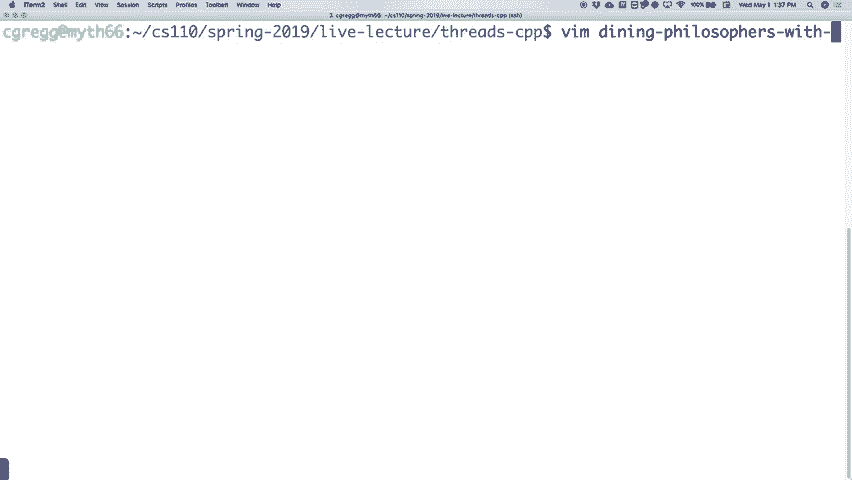
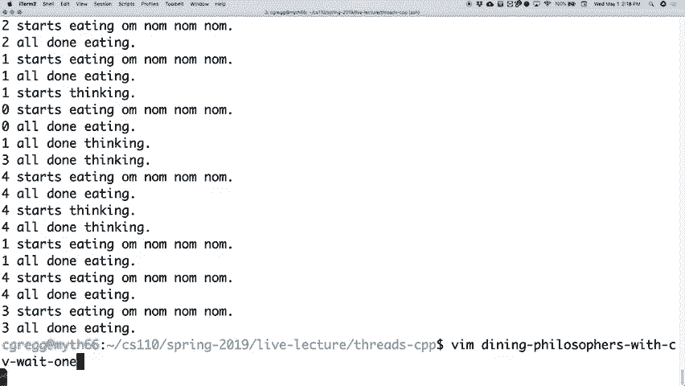

# P12：第11讲 多线程、条件变量和信号量 - ___main___ - BV1ED4y1R7RJ

好的，我们还是开始吧，但感觉有点奇怪。我会尽量不把你的问题搞砸。好了，正好是期中前一天。你们有很多事情要做。我能理解为什么有人可能不来。如果今天是录屏失败的那天，那该有多糟糕？

你们这些人都在这里会开心，但我猜你们其他人可能不会吧。

几件事。首先，这一周没有实验。相反，我们要求你观看一个简短的视频。它只有五分钟长。有些人实际上已经看过了。如果你可能在去年夏天或者两年前上过 CS106A，或者类似的课程，你可能也看过。但无论如何，这只是一个简短的视频。

字面意思上五分钟，其他的毕业生，主要是斯坦福的毕业生，他们有……我们就聊一点计算机科学。所以，去看看吧。那将是你本周的实验签到。否则，你可能希望用这一个小时二十分钟来学习，做些工作，斯坦福，Shell 等等。

好的，享受吧，这就是本周代替实验的内容。

前几天，我做了什么？我有点迷惑。嗯，我还教另一门课。Mark 在吗？

我没看到他。我教另一门课，这门课里有几个学生也在这门课上。我教的是计算机科学，一门入门级的计算机科学课程。实际上，昨天我就用课堂上发生的例子作为讲解内容，跟大家说，“嘿，猜猜看？有时候教授也会犯错。”

或者他们无法修复实时代码，或者他们找不到 bug，这正是周三发生的情况。所以我为此道歉。但正如承诺的那样，我确实回去查找并弄清楚了编译 bug 的原因。问题有点微妙。并不是说这就是我没能解决问题的好理由，但确实有些微妙，关于错误发生的原因。以下是代码。这就是错误所在。我们当时正在专注于此。

我在讲座中专注于这一行。票证年龄是第 62 行，实际上是这行代码，在末尾附近。所以我们就假设大概在这里。结果证明问题就在这里。我们在这里做了什么？我们将剩余票证的引用传递给一个函数。

传递给线程函数，它将重新包装并将其转发到票务代理函数。所以这就是发生的情况。那时，下面有一些 C++ 的黑魔法。

但如果你看这里，我们有票务代理，所以下面就是剩余票证的情况。有人注意到这个时候可能会是什么问题吗？

不是我刚好跳过去了。我确实是正确通过了它，而且是一个引用。问题在于那个错误信息只是让我看这里。它并没有提到上面的部分，也没明确说是类型问题。那么剩余票的类型是什么？`size_t`。我告诉它找什么类型？

`unsigned int`有点像`size_t`，不过`unsigned long`是`size_t`的类型。所以编译器说：“你在尝试使用两种不同的类型。给我一个休息时间吧。”

然后给了我一个可怕的错误信息。总之，那就是问题所在。一旦我回去修正了，把它改成了`size_t`，并且加了`&`，然后就正常工作了。对，程序员都会遇到bug，所以当你遇到那些bug时，不要觉得自己孤单。它们很难找，很棘手。

昨天在办公室里遇到一个人，他有一个bug，说实话，只有我有25、30年的编程经验时才能够搞清楚是什么。那是一个非常微妙的小bug，我当时想：“哦，这个问题很难找到。”所以总之，很高兴那个人进了办公室。可是这些问题就是这样发生的。

只不过，像bug很难解决，编程充满挑战。所以，不管怎样，前几天发生了那样的事情。好了，接下来我们来看看一个非常酷的问题，如果你学习多线程的话。

或者像这种多处理器类型的类，如果你没有覆盖这个问题，那就有点像从未在英语课上读过莎士比亚的戏剧。就像这是多处理、多线程这种情况中的典型死锁问题。它被称为“哲学家就餐问题”。

这个问题的名字实际上很有趣，它被称为“哲学家就餐问题”。下面是它的工作原理。让我看看能不能启动我的白板。这个是它的工作方式。桌子上有一些东西，嗯，我画得真差。那个应该是一个圆圈。这里有一张桌子。

有五个哲学家，这些哲学家大脑非常聪明或者其他的什么。这里是一个，两个，对吧？好的，这里是三个，然后四个坐在这张桌子旁边，当然他们应该是对称的。你可以看出为什么我当时是学艺术的。好了。

五个哲学家坐在桌子旁。他们每个人面前都有一碗像意大利面一样的食物。好吧，他们每个人有碗意大利面，他们想做几件事。他们既想思考，又想吃饭。好吧，这就是他们的做法。他们将实际上重复做这三件事。

他们会思考一会儿，然后吃一会儿，然后再继续思考，再吃，再思考，然后再吃三次。这里的情况是有一个，我就画给你们看。像这样。两个，三个，四个，五个叉子。好，这些就是我画的小叉子。好的。

这是用餐哲学家的吃饭方式。如果你准备吃饭，你会先拿起右手边的叉子，然后再拿左边的叉子，然后你就会以某种方式吃意大利面，虽然这样很荒谬。其实，这本来就应该是做这个的人直接使用筷子，因为那样。

这是有道理的，这也合情合理，你需要两根筷子才能吃饭，对吧？不过不管怎样，原始的问题是叉子，因为做这个的人可能从未听说过筷子。我也不知道。但无论如何，重点是，这里使用的是叉子，但每个人都需要一个，他们要吃一会儿，然后就会继续。

当他们吃完后，会把叉子放下，按照他们拿叉子的顺序，先是右手再是左手，或者我猜是按照这个顺序。这里有个选择，或者我们看看代码怎么做。但重点是，事情就是这样发生的。现在，最终如果你这样做了，嗯，多少人，多少哲学家可以。

两个人能同时吃饭吗？对吧？这就是最大的问题，对吗？

即使他们可能都在争抢叉子。好的？所以这是一个大问题。虽然有两个人，但是我们希望能让他们共享这些资源。因为我们不知道他们什么时候在思考，什么时候在尝试吃饭，这就是问题所在。

好吗？这就是问题的设置，我们接下来会写一点代码，尝试测试这个问题。好的？然后尝试在这个模型中实际实现它，试试看。

实际上，我们直接进入代码，我们将这样做。死锁情况下的用餐哲学家，这意味着我们可能会在这里引发一个问题。

好吗？那么接下来会发生什么呢？好吧，让我们从一个哲学家是如何思考的开始。好的？

一个哲学家思考的方式基本上是在我们的程序中，就是用一些时间，某种随机的时间来进行思考。所以我们会做类似这样的操作。记住，我们在使用线程模式。顺便提一下，这将会是在一个线程中。每个哲学家都会有自己的线程，然后我们会进行操作系统锁定。好的？

然后我们会说类似这样的东西，看一下。ID。好的？

那就是我们传入的哲学家ID。0到4，因为有五个用餐的哲学家。好的？ID，然后开始思考。好的？

当哲学家在思考时，我们必须花一些时间来做这个。所以我们将进行这个操作，然后。然后L，然后我们要进行操作系统解锁。

好吗？然后，我也不知道为什么它从来没有，嗯，好吧，不管怎么样，它有时不会做缩进。无论什么原因。好吧，反正我们要输出那个。然后我们要进行睡眠。在线程中，你调用`sleep`并指定一个类似毫秒的数字。通常是毫秒。所以我们让它睡一段时间。

我们有另一个函数，它将做一些随机化。

这并不重要它是什么，但我们将像这样得到思考时间。好吧？

然后，一旦它完成睡眠，我们将说同样的事情，操作系统锁，ID，完成，全部。完成思考。好吗？然后L和操作系统解锁。好吧。这就是哲学家思考时需要做的所有事情。好吗？非常直接。好了。好了。然后吃饭时，我们将使用上次学习的互斥锁。好吗？记得互斥锁是什么吧。

互斥锁是一种数据结构，许多不同的线程可能会尝试获取该数据结构中的锁。其他线程如果在尝试获取控制时发现锁已经被占用，它们就会等待，直到锁被解开，然后它们会再次尝试获取它。

到那时，可能会发生两个哲学家之间的竞争。因为我们有两把叉子，我们将有一把左叉和一把右叉。哲学家们将尝试吃饭。所以我们将这样做，他们会首先拿起左叉。其实我之前可能说的是右叉。他们将进行左叉锁。

好吗？然后右叉锁。好吧？然后我们会说，好吧，看。到这个时候，他们可以开始睡觉，或者开始吃饭，这在这个例子中相当于睡觉。好吧？他们会说，哎呀，ID开始吃饭。好，吃吃吃，像这样。好了。然后L，然后是操作系统解锁。好。

我们将通过再次进行一些睡眠模拟线程波动来建模，每次都稍微不同，基本上是说某个时间段。实际上，我刚刚意识到我其实没有在这里调用函数。好了。好了。现在我们要做的是睡眠空闲时间。然后我们会说，看看操作系统锁，ID。

吃完了。然后L，然后是操作系统解锁。然后当然，现在我们吃完了，可以把叉子放回去了。我们将按照我们捡起它们时的顺序放回去。事实证明，左叉解锁和右叉解锁。好了。现在我们得传递下一个餐桌旁边的哲学家的叉子。

在那里。对吧？

所以如果你再看一看之前的那个圆圈，没错，就是那两个叉子。是哪个哲学家的旁边的那两个叉子，这里是这个哲学家的左边叉子，而那是右边叉子。

好的。好了。就是这样工作的。那就是吃饭函数。

好的。让我们去看看哲学家实际上是做什么的。

好的。一个哲学家做如下操作。哲学家的大小为t的i等于0，i小于3，i加1。记住，他们会连续做三次。那他们要做什么呢？他们会先思考，然后吃饭，我们需要传入左边的和右边的。

到目前为止，事情进展得还不错。好的。就是这样发生的。

这是一个哲学家。现在我们需要做的是主函数。好的。在主函数中，我们需要为每个叉子设置互斥锁。好的，那我们就来做吧。互斥锁叉子，我们会做五个。好的。然后我们会有哲学家。我们会有五个。好的，然后是四个大小为t的i等于0，i小于5，i加1。

好的。在这里我们将实际启动每个线程，就像我们以前做过的那样。这里。好的。不过我们想先做的是，我们需要设置好谁拿到哪个叉子，对吧？

所以我们可以做互斥锁左，哎呀，左等于叉子i。

好的。然后我们可以做，哎呀，也许我需要一个分号，互斥锁右等于叉子i。这个时候，i加1，模5。对吧？那样就会给你角落那边的那个叉子。另一边。好的。里面的模运算会在必要时进行环绕。

好的。然后我们实际上需要做的是哲学家的线程i等于线程。现在我们在调用线程，或者说我们正在设置一个线程。哲学家是哲学家的名字，我相信，没错吧？就是函数的名字。然后我们传入的是id。我们传入的是左边的引用。

右边的引用。然后我们传入的是一个许可的引用。好的。然后，哎呀，抱歉。不是许可，错了，错了，看错了。我们传入的只是右边的引用，右边的引用。就是这样。就是我们需要的全部。好的。好了，在你做完所有线程之后，你需要将它们全部连接起来。好的。

所以另一个大小为t的i等于0，i小于5，i加1。你可以这么做。我们能这么做吗？我们还是像以前那样做吧。像以前做过的那样就是线程，&t等于，线程，&。嗯，叫p代表哲学家，也没关系。哲学家然后p。就这样连接。

然后我们可以返回。好了，这就是我们的完整程序。它会设置好，所以世界上会发生什么呢？让我们看看运行它会发生什么。

好的。让我们来做一个死锁的用餐哲学家问题。

当然会出错。嗯，当然会出错。

让我们看看。[笑声]，[听不清楚]，在82和83那个时候是这样的。我们正在尝试，没错。非常感谢。尽管做了那个。

哎呀。啊。那就变得。啊。非常感谢。好了，总之，如果我们做死锁的用餐哲学家问题，如果我们这么做，你会看到。

其实似乎还挺顺利的。好了，我们走吧，哦，我们的程序是正确的。对吧？

发生了什么，咱们来看看究竟发生了什么。好了，零开始。大家都开始思考。然后三号恰好先完成，因为时间的原因或者其他什么原因。然后开始了，三号开始吃饭。于是三号抓起了左叉和右叉。我应该回去，因为你们把它们放对了。然后做了这个。

他们最终都能正常工作。

好的。你可能会说，“嘿，这太棒了，我们完成了。”

那如果我们故意引入一个竞态条件，像是这样的话，那会怎么样呢？

非常好，像是这样会让他们都试图在同一时间开始吃饭。

好的。那如果我们做了以下的事情呢？好了。

如果我们在里面加一点延迟，假设五秒钟。五秒钟。就在这里。基本上就是说，他们都得稍微等一下，然后他们都将尝试同时吃饭。然后他们都会同时抓起左叉。你能大概看出会发生什么吗？

让我们来强化用餐的条件。好了，他们都会有一个时间点，每个人都在思考，然后某些人会先做完，但是接着他们在拿起左叉后等待，直到每个人都拿起了左叉。那么，接下来他们尝试做的是什么呢？

他们在等待他们。

他们正在尝试拿右边的叉子。对吧？所以如果我们回到我们的图示，看看，从上面开始，这个人拿起了左边的叉子，也就是这个，接着这个人拿起左边的叉子，然后依次是左边、左边、左边。然后这个人去尝试拿右边的叉子。好吧，这个叉子没了，因为其他人都在等着拿他们的右叉子。

叉子也是如此。它们只会拿起来。这就是死锁。对吧？

这是死锁，特别是因为每个人都在等别人吃完。因为你只有那五把叉子，而五个人在争抢它们。明白了吗？

所以你明白问题出在哪了吗？对吧？死锁最终会发生。

好吗？我们要做的就是尽量避免这种情况。

好吗？因为当你遇到这种竞态条件导致这样的情况时，你就会……

遇到麻烦了。

所以我们最终不得不快速处理它。好吧？好了，这就是我们刚刚讲过的所有代码。顺便提一下，这是一个重要的部分。我们应该能够在任何线程中几乎随便插入 sleep 调用，并且不会影响程序的其他部分。这就是检测死锁和其他竞态条件的一种方法。

你只需要说，看，我们就人为地让某些奇怪的条件发生，这样你就能最终做到。好吧？有问题吗？[听不清]，是的，问得好。之前它能正常工作是运气好吗？是的，你确实算是运气好。我们设定的时机相当好，结果是五个人都能成功拿到叉子。

不会在完全相同的时间尝试吃东西。即使某个人拿到了两把叉子，那么他们就会吃完，这也会让其他人有机会吃。可是有一个奇怪的情况，就是他们会同时去拿左边的叉子。哎呀，现在你有五把叉子，而每个人都在等另外一把叉子，结果谁也吃不成。

这就是问题所在。是的。lock 有没有返回值？lock 有没有返回值？

我不认为 lock 会有返回值。我觉得它是 void 类型。如果有，我们其实从来没有使用过它。没有办法感觉到，“哦，叉子被拿走了”，而不考虑它之前。它已经被丢弃了。哦不。你能在执行前检查 lock 吗？在这种情况下，其实没有什么关系。我的意思是。

因为你打算怎么办呢？我的意思是，我猜你可以，如果你，嗯……这不是个坏主意。我之前没想到过。如果你以某种方式检查一下，等等。所有叉子都拿完了吗？如果你能追踪它们，嗯，是的。那就是我们要做的事。就像在更大的背景下追踪它们。是的。

[听不清楚]，是的，问题是，当你睡五秒钟时，意味着大家在五秒内都会停下来，尝试抓住他们的左叉子。好的。记住，他们首先只会抓左叉子，对吧？而他们已经都抓住了左叉子，或者至少他们在尝试抓。

然后他们就在等待抓住合适的叉子。到那个时候，大家都已经抓住了左叉子，问题就解决了。还有其他问题吗？好的，我们明白这个思路了。这就是经典的，你会在某个时候再次听到的“就餐哲学家”问题，哦，我知道那是什么了，对吧？我完全了解这个问题。就是这里发生的事情。所以。

我们怎么解决这个问题呢？好吧，新技术可能是解决这个问题的一种方式。我们只需要在其中加入一些逻辑，让它能够正常工作。好的。那么，我们刚才讨论过，三个哲学家不可能同时吃饭，对吧？你只能有两个哲学家同时吃饭。

但是你可能会有四个哲学家同时尝试吃饭。但只要五个人都在尝试同时吃饭，总会有人能够拿到另一只叉子并开始吃饭。这个说得通吗？

如果你有四个哲学家，而第五个哲学家只是站在一旁，什么也不做，那么至少有一个哲学家会吃到东西。虽然那时可能不会是两个人同时吃饭，但至少有一个人能吃东西。这个理解了吗？有些人可能会觉得，“哦，这个不太对，想一想再说。”对吧？

这个图可能会稍微帮到一点。对吧？只要其中一个人没有，比如说这个人根本没在吃东西，也没做任何事情，那么这个人最终就能拿到他的右叉子。好吗？好了。

所以，我们可以这样做。现在，当我们实际解决这个问题时，有几种不同的方法可以选择。你可以说，“好吧，我们就只允许两个哲学家同时吃。” 那样也可以。那样可能会相对高效，但你也可以辩称，“我们不知道他们中的任何一个人会等待多久。”

所以，至少让最多的人能吃到东西，这样它才会继续进行下去。这个问题双方都有争议。我们会选择偏向说，“让我们制造一个有限的瓶颈，它只会确保我们避免死锁。” 那样的话，“就让四个人争抢吧，让第五个人等着。” 好吗？

这就是我们最终要做的事情。好的，那么我们该怎么做呢？嗯，我们将引入一个“许可条”的概念。好吗？

许可单基本上就是说，“嘿，将会有四个许可单。前四个获得这些许可单的哲学家将能尝试吃饭。他们将争夺这些叉子。”第五个哲学家则必须等到其他人吃完后才能吃饭。然后我们就会有这样的情况。

好吗？我们这次会把它叫做`permits`，好吧？许可单。我们将用一个计数器来对它们进行计数。

好吗？那么我们来看看这个问题。带有**忙等待**的餐厅哲学家问题。

我们喜欢忙等待吗？不喜欢。

好的，我们必须解决这个问题。稍后我们会尝试解决它。好的？

但是让我们看看我们如何解决这个问题。好的？有些事情是相同的。

所以我不是说，“它完全一样，我一点都没改。”我们会有一个等待许可和一个授予许可的过程。

但在我们做这些之前，让我们先设置`main`函数。

大部分的`main`部分将大致相同。好的？

但是`main`部分会稍微有所不同。我们还是会有五个叉子，还是会有五个哲学家，依此类推。好的？

但是现在我们要做的是，我们要设定`size t permits`等于四，因为我们说我们要开始时会有四个许可。每当一个哲学家获得一个许可时，这个数字会减少。当它减少到零时，很遗憾，没有剩下的许可了。明白了吗？好。

所以我们会这么做。好的？我们还是会像这样设置叉子。好的？我们还将拥有另一个用于`permits`锁的互斥锁。好的？如果我们有一个许可，并且如果我们有这个许可变量，并且任何线程要修改它，我们最好在修改时加锁，以避免它们同时修改。

如果修改它，我们就会遇到竞态条件。所以这是我们必须解决的另一个竞态条件。好的？同样的事情，我们将启动所有线程，获取左边和右边的叉子。那里不会有变化。我们现在要做的变化是做同样的事情。哲学家`i`等于线程，如之前一样。好的？我们仍然会使用相同的函数。

我们待会儿会写这些，或者稍后完成它们。`Perfur`和`i`，左边的引用和右边的引用。我们还需要传递一个`permits`的引用，因为我们有这些许可。同时，我们还需要传递一个`permits lock`的引用。好的？

因为现在我们必须传递更多信息，这样它们才能有效地使用这些许可证。好吗？然后我们最后还会将它们连接起来。那么，许可证是类似全局变量的东西吗？

许可证是一个全局变量吗？它不是全局变量，但它会传递给每个哲学家，所以每个哲学家都有一个。它们是相同的变量。记住，线程可以共享同一空间中的变量。所以是的，它们完全是相同的，这就是它工作的方式，因为所有线程共享同一变量。

我们要走了，嘿，还有剩下的许可证吗？哦，我去拿它们。然后它会使用另一个。再说一遍？当一个哲学家拿到许可证时，另一个看到变化。是的，你会看到它是如何运作的，没错。好吗？

这就是正在发生的事情。好吗？那么让我们去修改一下其他的部分。

让我们修改一下。我们得想想。吃饭的部分需要稍微改动一下。

现在就来做这个。好吗？对于吃饭的部分，我们基本上需要获得许可。所以让我们创建一个函数，我们稍后再做。我们会说等待许可。等待许可。我们将传递许可证到这个函数中，然后我们也会传递许可证锁。好吗？然后如果我们拿到许可，我们就可以开始锁定了。

这样就能正常工作了。好吗？然后在我们吃完之后，我们可以说好吧，让我们归还许可证。所以基本上我们可以说授予。我们会有一个叫做授予许可的函数，这个函数会传递许可证，并且它会传递许可证锁，再次是相同的操作。

好吗？然后在那之后我们就可以进行解锁操作了。好吗？

所以它会将这些包装在获取许可和归还许可的操作中。问题是，我不确定你在睡觉之后是否需要解锁许可证。就像是锁叉子时是不是会导致死锁？那么，我们可以在锁定叉子之后解锁一会儿吗？

好问题。那么问题是，我们可以在锁定叉子之后解锁它吗？嗯，我想你可以，但那样你还是可能会有竞争条件。你仍然可能会有竞争条件，比如说，在这种情况下，你还是可能会遇到所有人都想获得同一个叉子的情况。

即使你有一个许可证。也许不行。也许你可以那样重写它。但在这种情况下，我们不需要担心这个。我们只在吃完饭后，再次获取许可。所以可能有一种方法可以做到，但在这种情况下，我会说暂时不要做这个。

我们可能可以再分析一下，但现在不行。就说，一旦你吃完，就可以直接归还许可。当然，你也可以在吃之前就归还许可等等，不过我不确定。我不会在你休息之前就做这件事，对吧？

实际上这可能不会改变逻辑，但不管怎样，某个人会在等待，他们直到稍后才能获得许可，直到他们能进食或操作锁时才能继续。好，行吧，总之就是这样。

让我们去编写上面其他的函数吧。先写 `wait for permission`。其实，让我们先写 `grant permission`。这是一个比较简单的操作。`grant permission` 就是简单地获取 `permits` 锁，锁定它，因为它马上就要操作了。

就像是对许可做些处理。所以必须是唯一一个更改许可的线程。然后基本上，它会做 `permits++`，因为我们将要归还许可。

所以你会看到 `wait permission` 会减少许可。归还许可，然后 `permits lock unlock` 就是这样。那就是它在做的事。好了，基本上就是增加许可。现在，`wait for permission` 要稍微复杂一些，因为它必须真正执行等待。好，那么它需要做什么呢？我们来看看。

等待许可的基本流程是，我们将它包裹在一个 `while true` 循环中。

好的。它会检查许可。那么，如何检查许可呢？首先，你最好先锁住它。`permits lock lock`。

好的。如果 `permits` 大于零，我们就跳出循环。

我们就要完成了。这意味着有一个许可可用。让我们去获取它吧。好了，然后我们将做 `permits lock unlock`。

好的。那么接下来我们要做的，如果我们还在这里，顺便提一下我们这么做的原因是因为我们没有成功。如果 `permits` 小于等于零，换句话说，`permits` 为零。那就让别人试试看吧，因为我们现在不会继续持有这个锁。我们需要做的是，有些人可以去增加它。

任何现在正在用餐的人都必须能够稍后使用这个锁并增加它。这样理解我们这么做的原因了吗？好。接下来，如果我们就这么保持这个 `while` 循环不变，这会变成一个空转循环，那将是非常糟糕的。它会让每个线程都很忙碌，简直是过度消耗处理器。

至少我们得做点事情，至少稍微好一点，睡个 10 毫秒之类的，或者其他什么的。至少这样可以让进程暂停一下，做一下这个操作。有问题吗？

有问题吗？我们确定理论的术语吗？还不完全是。好的，我们将在检查并确保有许可证可用后再做。哦，这不是它在做的事情。是的。但是我们还没有减少那个。你会看到的。好的。那么，想想这里发生了什么。最后的循环基本上是说，好，看看。

获取锁，以便没有其他人能检查，是否能做任何事情，是否许可证大于零？如果没有，释放锁。稍微休眠一下，然后再试一次。这就是这个循环在做的事情。如果许可证大于零，那么我们就说，太好了，有许可证可用。

让我们跳出这个循环，这样我们就可以去做剩下的部分。你当然可以。你可以在这里做，然后如果你想的话跳出循环。这没什么关系。

关键是，实际上在这里我们要说许可证减一。

然后因为我们在解锁之前就中断了，所以我们必须执行许可证锁定和解锁。好的。那意味着我们是拿到许可证的人，减少它并带走它。这是你的问题吗？是的。这有点棘手。顺便说一下，我马上会展示给你看一个很奇怪的地方，你必须解锁。

两个地方，当你只锁一次时，我们将在稍后用一个非常酷的类来解决这个问题。是的。所以，对于休眠10秒，如果我们能做到这一点，会发生什么？好问题。如果我们省略了休眠10秒，唯一会发生的事情就是我们实际上会。

会疯狂旋转，处理器会达到100%，风扇会启动，电脑会变热，学生们无法完成他们的作业，他们的， 他们的， 他们的， 他们的， 他们的， 他们的电脑做不完。那是什么？它会表现得不一样。它会表现得不一样。不是的。但这就是， 这就是所谓的忙等待。

不完全像以前那样旋转。之所以叫忙等待，是因为我们每10毫秒就会醒来一次，检查是否还有许可证？哦，实际上。如果许可证还在，就继续休眠。这不是做事情的最佳方式。事实上，这根本不是一种好的方式。我们实际上希望像是暂停进程。

我们希望内核去做，或者是其他某个人。事实上，不一定是内核。任何其他人说，去检查吧，我已经释放了这个，你可以检查了。所以它完全休眠，直到收到一个消息，告诉它“哦，我现在可以去看了”，希望它已经准备好了。好的，啊，有五个哲学家。好问题。

还有谁在那里？有五个不同的哲学家都在争取许可。是的，还有其他人。你会看到的。好问题，你会看到的。不，我知道。什么，什么？我们会看到的。然后注意这里发生了什么。我们稍后会处理这个。好了，在这里，对吧？我们正在解锁。这里难道不是一个很好的机会，告诉所有等待的线程吗？

猜猜看？我刚刚发布了一个。你现在可以去拿个叉子了。好了，这就是我们最终要做的。我们只需要找出一种方法来实现它。事实上，你还需要操作系统提供更多的支持，才行。好的，在我们测试之前，你们有什么问题吗？没有其他问题？好的。

让我们测试一下。有人发现什么bug了吗？做得好。现在我有点担心我会发现一个bug，而我又修不好。唉，好吧。你能做到的，Chris。

好的。用忙等待实现餐哲学家问题。好了，来吧，成功了。哦，看看。哦，谢谢你现在告诉我。哪个？在 Main 中。好，来看一下。

哎呀，等一下。你知道我们还没做什么吗？我们实际上还没做哲学部分，因为我们得做这个。

我也要做这个。所以我很高兴它真的出了问题。我到底拼错了哪个？对，我早些时候就做过这个，当我拿到新的，静音文本时。我早些时候做这个时也是这样。我想是因为我习惯打文本，而不是打那里。那里。

谢谢。谢谢。好眼力。好了，接下来让我们来试一下这个。

如果完全没有作用，那会真难看。我们只是没有做任何事。好吧，让我们实际上做一个哲学家，一个哲学家。好的，我们还是要做一个 forlip。我们还是要思考。好的，但现在我们只需要传入其他细节。这是唯一的不同，就是左右。

然后我们得做许可，然后许可就像这样锁定。好的，为什么我们不需要包裹这个呢？有什么想法吗？

我想我更大的问题是，为什么直到昨天我们才第一次使用 `ref`？你上过的任何一门 C++ 课程里有讲过吗？

它们一直是什么？对吧。

它们总是处在正确的上下文中。让我们去看看 EAT 在这里期望什么。EAT 期望一个许可引用，对吧？所以你不需要再加上 `ref`，因为它已经在期待这个了。如果你加上了它，也不会有什么影响，但在这种情况下你不需要加，因为它不像线程类那样，不知道这些参数是什么。

它只会获取它们并将它们传递下去。如果你没有传递引用，它就会说，“我不知道你想要哪个。”就是这样。

所以在这种情况下，我们不需要这样做。就像我们之前一样，也不需要这样做。就是这样。好了，我看看这个现在能不能正常工作。运行“就餐哲学家”。好了。好了。带有忙碌方式的就餐哲学家。这看起来不会有什么不同。基本上它将正常运行。

如果我们把那个睡眠加进来，那个睡眠放在哪里了呢？

在这里？我们把它放在这里之后，对吧？

睡眠 5,000 毫秒。让我们看看这样做时会发生什么。

然后现在开始了，每个人都会开始思考并进入睡眠状态。现在我们都在睡觉，它应该会重新唤醒。

好了。现在可以继续了，因为我们已经将正确的许可放入其中。

好的。现在我只是人为地加入了所有这些延迟，但它就是这么工作的。

好的。好了。你对这部分内容有什么问题吗？我们会继续讲解一会儿。

你对这个有其他问题吗？还有别的什么问题吗？是的。我们可以解释一下为什么我们需要这么多许可来等待片刻。好问题。

为什么我们需要在这里检查它是否存在？为什么我们需要在递减或递增许可之前锁定它？

是的。那么假设两个线程恰好在相同的时刻停止，这种情况是可能的。然后它们都尝试释放它们的许可，对吧？好吧，难道不会出现这种情况吗？它们都执行了 `permits++`。你可能会遇到这样的情况：汇编代码中的一个线程执行了递增，另一个线程正在读取它。

但是它读取到的是错误的值，然后递增了，可能会有两个递增，或者可能只会有一个递增，而不是两个。实际上，这是一个竞争条件。所以你总是希望将多个线程可能修改的数据结构进行封装。这样有帮助吗？还是说为什么？是的。

如果许可是零，而它们两个都试图一次递增，那么你可能会得到许可为 1，而不是 2，因为竞争条件的原因，因为正如我们前几天所说，`++` 不是原子操作。换句话说，你不能保证在其中另一个线程会。

最终，两个都会读取，一个会更新，另一个也会，你知道，它会稍微有点不同。它不一定会完全正确。问题。问题。为什么你在查看许可时必须加锁？问得好。如果有人在你检查后进来并递减，那你们俩都会递减。

然后你就会变成负一许可，突然间你又会进入死锁状态。对吧？所以即使你在阅读它时也是如此。现在，有时候你可以从数据结构中读取数据，只要你能保证没有其他人在写它。这样是没问题的。好吗？这个。

在像映射和集合这样的东西中，你可以读取其中的一些数据，而不必担心别人会修改它。比这要微妙一点，但你会遇到一些赋值情况，那时这是可能的，但在这个情况下不行。好的，第二个问题。[听不清]，为什么你必须说“rats”而不是像“hamper sand”之类的？

对。问得好。为什么你必须说“ref”而不是“ampersand”？

这绝对值得重复。

我们就在这里做。记住，线程类有这样一个有趣的函数签名，它说：“我将接受。”

你可以传递任意多个参数给我。我所做的是，将第一个参数之后的所有参数传递下去。

当我启动线程时，我把它们作为参数传递给第一个函数。这样说得通吗？好的，当发生这种情况时，线程根本不知道这个函数的哲学家是会接收一个引用，还是会接收一个值。所以当你将值传递给线程时，它只会说：“我不知道。”我猜也许你可以编写一个编译器，去查看哲学家，看看。

哦，这个需要这样做，但它不一定会按预期工作。所以这就是为什么我只是说，嗯，做成引用就好了。事实上，我认为如果你不将它做成引用，可能会导致我们前几天遇到的那个同样的“轮廓错误”，你必须去修复它。但之后，你知道的。

修复方法是把那个引用放进去，并说，看，它必须是一个引用。好的，问得好。

是的。所以我觉得你在递增时的问题是，要么递增太多，要么。

这样防止过多了吗？我的意思是，它们可能会解释增量操作是什么。

一个。是的，问题是，看看，你确定那个部分吗，像我原本以为是的。那个权限是你可以增加或减少太多，但不，实际上。更可能的是它会增加得太少。就像它们都会尝试增加，而你希望它能增加。好吧，假设两个线程进入，它们都增加，你可能得到两个，对吧，那个。

这是你想要的，但你也可能只会得到一个增量，因为它们都会。回到上一个，回到周一的讲座，看看，看看那个。汇编代码，并看到，哦，看看，如果。这个先读取值再更新。然后另一个先读取值再更新。

这个会更新为相同的值，而不是它应该有的更多。回去看看那个。你会明白的，一旦你看完汇编代码。然后权限点锁确保没有像只有一个访问的情况。然后它会阻止其他的访问，直到那条线被释放。

是的。这个也值得重复。我们说权限点锁。想想发生了什么。许多线程都会同时到达那一行。好吧。它们可能都会，假设它们都去尝试同时运行那一行。只有其中一个会真正获得锁的控制。

其他的必须等到那个锁被释放。所以这就是它的作用。它并不会告诉其他任何人。它基本上说，如果每个人都试图访问那个变量。那个锁，只有一个会成功，其它的都会等着直到那个释放它。那就是它的不同。好问题。这对于理解锁的作用至关重要。

它不像是告诉指令，嘿，别让其他人碰这个。其实。它比这简单得多。那个是如何实现等待的？哦。如何实现等待？是的。好问题。它是一个很好的睡眠等待。我的意思是。基本上，它是，基本上它是。

当锁解锁时，它实际上会，实际上会设置像。一个全局变量，其他人也能读取。然后它们会以原子方式进行操作。底层的汇编代码指令中还有其他原子指令。所以它的构建方式是基于这些指令的，确保只有一个能成功。

出去了。但它是一个，直到它不做任何像旋转或者其他什么的等待。

不用担心那个。好了，现在让我们看看几种不同的做法。

这是一种做法。好的。只是我们仍然有忙等待。我们仍然会睡眠 10 毫秒，醒来后检查，嘿，是否有可用的许可证。然后继续睡觉，依此类推。其实这个主意并不是特别好。好的，这并不是世界末日，但也不是一种特别好的策略。

为了让这个设置能够使我们真正等待许可证的下一个可用，我们必须使用另一个语言特性，即条件变量 any，或者说是另一种类型的变量，这种类型被称为条件变量 any。好的。你也可以使用普通的条件变量，两者都可以。

我们将使用非常条件变量 any，因为它与多种不同类型的锁兼容。但它的基本作用是允许你说，好的，我准备等待某个锁的准备状态。请让我睡眠直到那个时刻。所以它在这种情况下与锁是非常相似的。确实是那样。好吧。

这就是它的实际样子。关于它的一些细节。顺便说一下，这并不是为了吓唬你。Jerry Kane 认为这是 110 中最难理解的内容，我不太同意。嗯，条件变量 any 需要一点时间才能理解，不过很快就能明白，对吧？我花了一点时间，但我会尽力解释清楚。

然后你需要测试一下，看看会发生什么。但事情是这样的：你声明了一个条件变量 any，并且它有一个等待函数。好的，实际上它有两个等待函数。稍后我们会讨论第二个，但它需要一个等待参数，并且需要一个新的文本变量作为等待的参数。

所以你有一个已经加锁的锁。然后你调用这个条件变量 any 的等待函数，并且传入这个锁。它的作用是将线程休眠，然后解锁，直到其他线程基本上发送信号。实际上，这里有一个通知命令。其他线程会通知等待条件来唤醒它。好的，这就是这里发生的事情。

实际上有两个通知。最终还是建议总是使用 notify all。因为 notify one 有时候有些不稳定。没关系。如果你知道只有一个线程在等待，你可以使用 notify one，这样只有那个线程会收到通知。或者如果有多个线程的话。

它只会通知多个等待中的其中一个。实际上，最好是编写你的逻辑来使用 notify all。这个并不是特别重要。只要知道我们通常会看到 notify all 来通知任何在等待的线程。它是用来获取锁的。这就是事情的运作方式。好了，重申一下。

我们有这个条件变量，这个条件变量是任何变量。而且你用它。你声明这个变量，顺便说一句，大家都会共享它。好了。就像是一个互斥锁一样。然后你传入一个需要等待的锁。它解锁那个锁，等待它。然后当它收到信号时，如果拿到锁，它就重新锁定，并继续执行。

这就是它的工作方式。好了。你可能会问，为什么它是解锁的？

我们将看到为什么它必须解锁。在等待时它不会解锁。因为可能会发生一些事情。这就像为什么 SIGs 暂停时，当它正在等待时，信号会被解锁一样。因为，它实际上必须解锁，才能使其余的逻辑正常工作。好了，明白了吗？嗯。>> 有什么一般性的问题吗？

是否有 C++ 中的条件变量 any？他们需要某种能够做到——。>> 好问题。非常好的问题。这个条件变量。any 实际上是 C++ 标准类。几分钟后我们会看到一个，实际上可能是的。但是他们从未构建它，所以我们将使用另一个。你会看到的。我一会儿会解释。

但还有另外一件事。这就是你问的问题。因为是的，这个是为你构建的。你确实需要它为你构建，因为你需要内核来帮助处理这件事。就像你在 SIGs 暂停时所做的那样。

否则你会有一个提升的条件。就这样。好了。我们实际上来构建这个。

然后是带有条件变量的哲学家问题，等待一个。

我们将做两个这样的操作。哎呀。那应该是 CC。好了。

我们要做的其实就是类似的事情。我在等待——好了，开始了。

计算机。基本上和之前的想法一样。

我们必须做一个等待许可、授予许可等操作。我们从主程序开始。顺便说一下，其中一些内容会保持不变。

我们不需要对吃或思考做任何修改——不会做任何修改。我们可能会做哲学上的修改，因为有些变量我们必须处理。

传入。但是就这样。好了，实际上我们可能还需要稍微改变一下参数。事实上，我已经把它加进去了。

那里已经有一个条件变量 any 了。我想我把它留在了那里。

但是我们要做的是这样。对于 Main，仍然是同样的思路。我们仍然会有许可证。好的。我们仍然会有互斥锁——用于实际的叉子，我们会有另一个互斥锁。就像之前做的那样，我们称之为 permits lock。我们现在就叫它 m。

你会经常看到这种用法用于互斥锁。我们现在暂时就用这个名字。接着我们会有一个条件变量 any。条件变量 any。我们把它称为 cv，表示条件变量。好的，类似的东西。我们将有一个哲学家。我们将遍历每个哲学家并启动线程。

我们必须重新启动它们。哲学家 i 等于线程。在这种情况下，哲学家。哲学家的函数，i 引用，左叉子，引用，右叉子，引用许可证，再次。并且在这种情况下，我们会引用 cv 作为条件变量。我们还需要 permits lock。因为记住，等待操作本身也需要一个互斥锁。

将用来实际进行解锁和加锁。所以我们还必须引用 m。谢谢。对了，我忘了在引用时加上打印。好的，搞定了。让我们看看。看看这个——是的，看起来对了。

谢谢。那么就是这样。我相信这里没有什么别的需要做的了。我们还是要像之前一样加入相同的内容。

好的。我们来看一下其他一些函数。

我们需要做的事情。让我们看看。我们是不是需要改变——哦，我已经在这种情况下改变了。所以我们要做的是执行等待许可和获取许可操作。现在，我要给你们展示一种非常酷的新方法，来用锁保护一个变量。它叫做锁守卫。它的工作方式如下。

锁守卫——它是这样的，互斥锁，因为它接受这样的参数。

锁守卫 m。这就是它的作用。这就是为什么它是一个非常酷的类。它是世界上最简单的类。它只有一个构造函数和一个析构函数。在构造函数中，它做的唯一事情就是调用该互斥锁的 lock。创建它时——所以在这一行之后，互斥锁已经被锁定了。

析构函数做的唯一事情就是调用 m.unlock。像这样的类有什么好处——在 C++ 中，这是真的——每当一个变量超出作用域时，会发生什么？析构函数会被调用。所以我们不需要担心解锁这个变量。只要我们在离开时解锁它就行。

我们只是说，嗯，它超出了作用域，它会被解锁。这是我见过的最聪明的小类了。现在，我们要做的是进入一个 while 循环，许可证等于 0。

然后我们要做的是 cv.weight。

然后我们将等待我们已经锁定的锁。

然后，如果我们在任何时候收到通知，表明许可实际上已经超过了0。结果是——每当我们收到通知时，我们会再次检查，看它是否仍然是0。然后我们会这么做。但在cv.wait之后，它解锁了，以便可以返回。然后再做检查——抱歉，放松。这样它就可以再次检查，确保你。

不要让两个不同的线程尝试做这件事。我会再说一遍。然后在这里，我们知道此时我们已经到达了一个许可等于0的地方。我们仍然持有锁。所以我们知道我们可以执行许可。此时许可不等于0。我应该这么说。我们可以执行许可减1，像这样。好的。

锁什么时候会真正解锁？是在62之后吗？在我们离开函数后。它超出了作用域，析构函数会被调用，锁会被解锁。好的，我们再过一遍这个过程。这确实有挑战性。我们使用锁守卫锁住锁，这样我们就知道它会被解锁。现在我们持有锁了。现在。

可能有多个线程争用这个锁，但其中一个会成功。假设我们的线程是那个获得锁的。然后我们继续往下走，说，如果许可是0，那我们最好等待，因为没有许可可用。发生的情况是我们告诉它等待，使用我的互斥量变量等待，并在你把我从处理器中移除后解锁它。

它解锁互斥量，然后等待通知。当它收到通知时，如果可以，它会重新获取锁，然后再去检查，接着回到while循环顶部，再次检查是否许可是0。如果此时它不是0，那就好了。实际上，如果我们已经获取了锁并且收到了通知，它就不会是0。

然后它就不会再是0了。然后它将跳出while循环。因为我们现在持有一个许可，所以我就暂停了。对吧？

所以它在等待被告知它没有被再次检查，或者它在等待被告知它重新加锁了吗？它在等待任何通知它的信号。现在，看看谁会通知它。接下来，让我们看看你注意到的其他事情。有人有问题吗？

是吗？[听不清]，哦，没错。如果你解锁它，问题很大。如果你解锁它，甚至无法保证同一个线程会再次获得锁。CV等待会尝试解锁。如果它无法解锁，它会再次进入休眠，直到收到另一个通知。因为它尝试过但做不到，所以就是这样。它尝试——抱歉，它会尝试重新加锁。没错。

谢谢。它尝试重新加锁。如果失败了，它就会说：“哦，我等会儿再试。”它会继续等待，直到收到另一个通知。让我们看看谁会通知它。嗯，实际上只有一个东西可以通知它，那就是授予权限。让我们看看那是怎么运作的。授予权限也会使用锁守卫。

mutax，LGM。现在所有的锁守卫——记住，所有锁守卫之前需要做的就是更新许可。

许可加一，因为它正在释放锁，或者说，正在释放许可，表示哲学家刚刚吃完。因此，它会释放这个许可，接下来就可以继续执行。那么，现在它释放后需要做什么？它需要告诉其他线程：“嘿，猜猜看？有一个许可。”现在，只有在什么情况下，如果我们……

有四个许可吗？一个。一个。那是唯一重要的，对吧？所以如果许可等于 1，因为我们是刚刚将它从 0 设置为 1，意味着可能有人在等待这个许可，那么我们不妨通知——哦，应该说是 CV.notify。这样就会通知其他线程。

所有等待的线程都尝试唤醒并重新获取锁。当它们重新获取锁时，成功获取锁的线程会获得许可并继续执行。问题是，这只是为了清晰起见吗？如果我们没有继续这样做，会有什么问题吗？比如，如果我们不这么做，只有许可，一个许可以外的其他东西就没有了。哦，这只是为了清晰吗？你知道的。

如果你只是说，在你执行之后，CV 通知，那可能也没关系，因为它们反正都会检查 0。所以如果有一个许可可用，那么——是的，我认为那不会——我认为那不会——它不一定只是为了清晰，而是为了——我们也不需要发送更多通知。

如果此时有两个或更多线程，就肯定不会有任何问题。我在这一点上已经感觉到了。

让我们试试看。有人看到什么 bug 吗？

使用 CV 权重为 1 来实现哲学家就餐问题。

好了，使用 CV 权重为 1 的哲学家就餐问题，我们开始吧，它应该继续，或者说它们会继续，继续，继续，直到所有线程都完成。

所以就是这样运作的。问题是，怎么样可能非常有帮助，你是如何传播的？

那么，CV 如何知道有多少个线程？它根本不知道。它需要知道吗？

它实际上不需要。你的逻辑决定了这些事情何时发生——我们知道我们在寻找许可证。我们正在寻找四个许可证。如果四个哲学家已经持有了这些许可证，我们就不允许其他哲学家去拿第一个叉子。

这就是发生的事情。而我们正在使用这个思想：当我们第一次去拿左叉时，我们会先说，先给我们一个许可证。

这就是权重权限的作用。

它说，好吧，每个人首先都会做这个。他们将尝试获取锁。如果成功获取，他们将检查是否有可用的许可证。如果没有许可证可用，他们将等待许可证变得可用。当许可证变得可用时，他们将尝试重新申请该锁。

然后减少许可证的数量，使得他们实际上持有一个。等一秒钟。然后通知所有。它怎么知道呢？哦，通知所有。就像是某个所有线程都在关注的全局变量。基本上。我的意思是，我认为内核在这方面也有一定作用，作为线程管理器或其他什么的。但它被设计成，当你说通知所有时。

任何正在等待的人，都会注册在事件发生时接收到通知。为什么我们不使用 lambda 函数呢？我们会的。我们将在稍后看到不同的实现。因为这里有一个 while 循环。

这是一种非常常见的做法。你不能简单地说如果许可证等于零。因为那样会出现某种竞争条件，导致后续重新获取锁时出现问题。所以，这个“当某个条件为真时，等待它”非常常见，以至于它已经被构建进条件变量中。

好吗？你不需要再用你大约一周时间使用的那个 while 循环了。如果没有这个 while 循环。

你会看到的。是的，稍后我们来看你提到的那个 lambda 函数到底是什么样的。好，我们已经讨论了关于获取锁的所有内容。好吧。就像我说的那样，因为这是一个非常常见的操作。

我们的设计是这样的。实际上，这是一个模板化函数。基本上意味着你不知道类型究竟是什么，但没关系。你应该这么做。与其使用一个 while 循环，你不如让等待语句通过传递其他函数来替代这个 while 循环。

它做出决策并根据该决策或该问题返回true或false。所以在这种情况下，你会说——这正是它在这里做的——就是那个while循环。它为你做了这一切。那么这个谓词可能是什么呢？嗯。它可以是一个检查permits是否为零的函数。就是这个。

你不能直接传递permits等于零的值，因为你需要每次检查它，而且它可能会改变。如果你尝试直接传递它，就可能会出问题。那么你该怎么做呢？

你将其作为函数传入，或者由于我们使用的是C++，作为lambda函数传入。这是我们能够实际完成这件事的方法，来想一想这实际上在做什么。你会说——这就是我们之前的相同函数——Cv，wait，这是你的互斥锁。记住它会解锁，然后稍后重新获取——你将会说。

在那个函数中，给我提供访问permits变量的引用。然后在那个函数里，你将检查permits是否大于零。如果大于零，则返回true。这基本上就是你之前所做的完全相同的检查。它是检查是否等于零的反向操作。就在这里。[听不清]。

你传递的lambda必须是布尔值返回类型。因为它正在询问——它需要知道什么时候退出。

记住，这是如何构建的，对吧？当那件事为真或假时。所以就是这样。它可以返回可以转换为真或假的东西，但它必须在那个意义上是对或错。所以这就是你如何使用它。然后你不需要。

甚至不用担心while循环。好了，这就是为什么这些CV变量相对常见的原因。所以我们可以再进一步。这个想法是，也许我们在等待一大堆线程，其中一些具有具体的最大数量可以做某些事情。我们可以将CV与这个permits变量结合使用。为什么不将它封装到另一种类型的数据结构或类中呢？

这实际上允许我们为任何数量的各种网站许可证等执行此操作。

这就是我们所说的信号量，基本上就是这个概念：我有x个线程，而在特定时间内，只有其中一些线程可以做某些事情。在我们的案例中，是获取叉子，虽然这看起来有点傻。在现实生活中的场景中，你需要编写代码处理下一个任务，你将会查询互联网。

而且你将使用多个线程来进行操作。我们想做的是限制实际上访问某个特定网页的线程数量。我不知道你是否知道——你听说过DDOS攻击（分布式拒绝服务攻击）吗？

基本上，这意味着你有一个网站，它能够接受一大堆想访问网页的连接。而发生的事情是，一些恶意的人利用大量的服务器，不断向该网站的服务器发送请求。

它无法处理所有请求。因此，那些并非恶意的人也在尝试访问它。结果就是它会导致网站崩溃，变得非常难以快速访问。如果你是个好人，是不希望发生这种情况的。所以，你希望限制每次能访问特定网站的线程数量。我们将通过一种人工的方式来实现，但你会想要这么做。

你希望能够做到这一点。所以你希望对别人友好，并且很多时候你希望限制特定时间内能发生的事情数量。以下就是你如何做到的。你可能会有100个线程准备访问那个网站，提出请求，但你可以说，不，不，我们只允许一个线程一次执行，以便对别人更友好。

进去看看发生了什么。这就是正在发生的事情。这是一个非常常见的概念。在这种情况下，我们将使用一个叫做信号量的东西来实现。你早些时候问的那个问题是，条件变量是C++内置的实体吗？是的，它们是一个库。更大的问题是，为什么信号量没有内置到库中？谁知道呢？

事实证明，构建一个信号量非常简单，因为我们只是在包裹那个变量，那个变量是我们所拥有的计数的数量。那为什么他们不直接把它内置进去呢？谁知道呢？

也许下一个版本的C++会包含这个功能，但目前它没有。让我们来看一下它是如何构建的。

信号量的构造函数，它的写法非常简短，以至于就写在一行中。让我实际展示给你看。C-D/user/class CS110。

本地包含，我必须查找这是什么。然后是semaphore.h，来吧。

这是类本身。

这里就是类的定义。注意，构造函数有一个整数作为值，它要么将其设置为零，要么将其设置为你在构造函数中传入的任何值。所以，如果你说我想要五个哲学家，你会说`semaphore(5)`，然后它就会把那个变量设置为5。

就像我们做的那样，`permits = 4`，或者说`semaphore = 4`，让我们假设，`permits = 4`。这正是它在这里做的事情。

这就是信号量在这个案例中需要做的全部工作。

好的，然后作为信号量的一部分，有一个等待函数。

这非常简单。它基本上就是我们之前所看到的那样。它实际上把锁放在它拥有的互斥量上。然后它调用等待函数，试图根据值大于零来等待。而值大于零就是。

许可，如果你愿意，就是我们拥有的。如果这个数值大于零，它就会减少这个数值，并最终使其能够继续追踪这些许可。因此，它实际上是对条件的一个非常简单的封装。

变量，任何，做了我们想做的所有事情。再说一次，这是因为我们这么常做。互斥量就是这样工作的。在你完成许可后，你所需要做的就是调用信号。你不需要担心许可是否大于或等于零。它只是完全照做。

它做的就是我们之前在实际课堂上做的事情。它增加了它的值。顺便说一句，我们会讨论这个的另一个有趣的用法。下周我们开始时就会看到这一点。但在这种情况下，让我们看看如何修改我们的就餐哲学。

在这种情况下的哲学家们。好吧，我们可以说信号量许可。我们可以说信号量许可，数量可以是我们想要的任何数。

不再需要条件变量，任何。它已经内置在信号量中了。

这意味着我们现在需要做的就是传递一个引用，作为信号量的许可。

其他的一切都保持不变，除了现在我们不需要。

调用这个特定函数。我们有信号量，它做了所有这些像检查的事情。所以我们只需要说许可。等待。那是什么意思？

它将等待直到至少有一个许可可用。这就是我们正在做的。如果你想，当你完成你的许可时，你调用许可。信号。所以就是这些。我们只是谈论它，简化了它。然后它说，哦，现在我们有了这个东西叫信号量。它表示你有 x 个东西可以同时做这件事。

也许是 x 加 y 个需要它的东西。等到至少有一个可用来做这件事的资源。然后我们会——，[INAUDIBLE]，什么时候不能使用信号量？什么时候使用它会更好？

下周你将在实验中看到一些例子。这个星期没有实验。你会在实验中看到一些例子。你实际上可以放在下下周，这时你会看到这个。C 类的任何——哦，现在我明白了，为什么使用它可能很重要。但通常来说，最好是，我们几乎总是会使用——你可能需要一个，在未来的某个任务中使用。

你其实并不是在等待一大堆东西。顺便说一句，互斥锁（mutex）其实就是一个值为1的信号量。因为互斥锁是用来锁定或解锁一个东西的。就这么简单。所以互斥锁就像是信号量的一个特例，只不过它只适用于一个东西。嗯，我们会看到一些例子，你可能会需要条件变量。

但总的来说，大多数时候，你将能够使用。

用于这个的信号量。 好的，我想我们应该到此为止了。你们有期中考试要准备，其他的事情也很多。就这样了。还有什么最后的问题吗？我稍后会回到我的办公室，再待一个半小时左右，进行办公时间，如果你们想来的话，可以回来。好的。

我们明天见，期中考试时见。

