# ğŸ½ï¸ 课程 P12：第11讲 多线程ã€æ¡ä»¶å˜é‡å’Œä¿¡å·é‡


在本节课中，我们将学习多线程编程中的ç»å…¸é—®é¢˜â€”—哲学家就é¤é—®é¢˜ã€‚我们将æ¢è®¨å¦‚何通过互斥é”ã€æ¡ä»¶å˜é‡å’Œä¿¡å·é‡æ¥è§£å†³çº¿ç¨‹é—´çš„资æºç«äº‰ä¸æ­»é”问题，并编写代ç è¿›è¡Œå®è·µã€‚


---

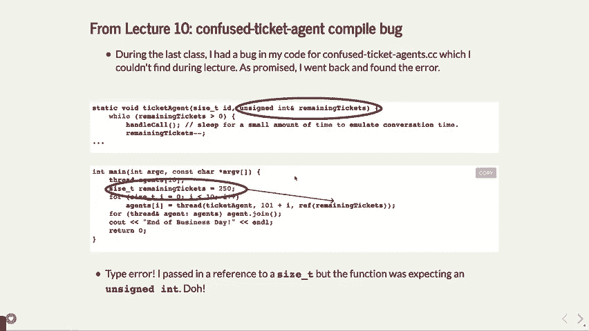

## 📅 课程安æ’ä¸æœŸä¸­æ醒

本周没有å®éªŒè¯¾ã€‚å–而代之的是，è¦æ±‚大家观看一个约五分钟的短视频。这个视频是斯å¦ç¦æ¯•ä¸šç”Ÿå…³äºè®¡ç®—机科学的简短分享。观看该视频将作为本周的å®éªŒç­¾åˆ°ã€‚大家å¯ä»¥åˆ©ç”¨è¿™ä¸€å°æ—¶äºŒå分钟的时间进行学习或完æˆå…¶ä»–课程作业。


---

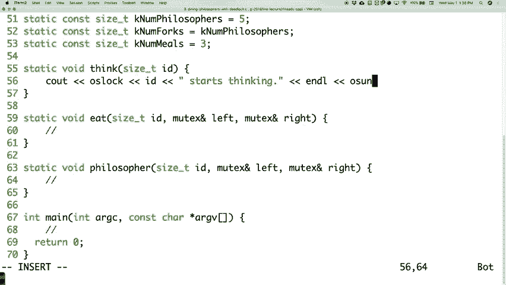

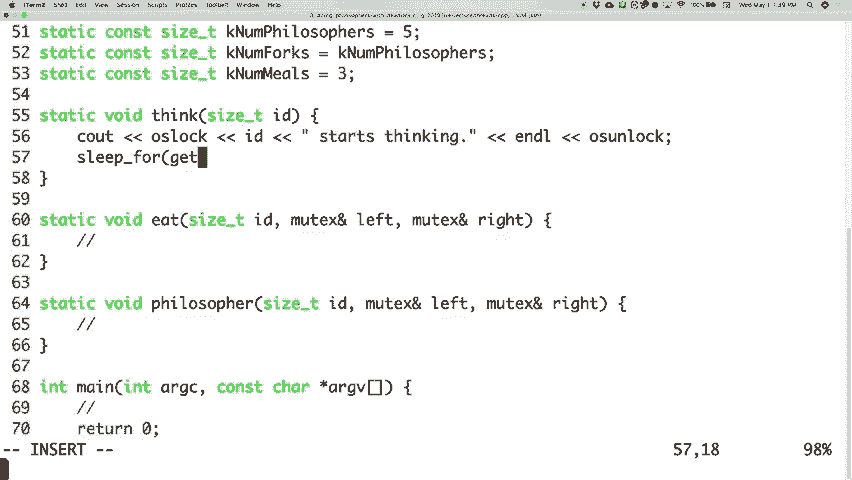

## 🔠å›é¡¾ä¸è°ƒè¯•ï¼šä¸€ä¸ªç¼–译错误的解决


在上一节课的编ç æ¼”示中，我们é‡åˆ°äº†ä¸€ä¸ªç¼–译错误。问题出ç°åœ¨å‘线程函数传递å‚数时，类å‹ä¸åŒ¹é…。具体æ¥è¯´ï¼Œæˆ‘们试图将一个 `size_t` ç±»å‹çš„å˜é‡ä»¥ `unsigned int` ç±»å‹çš„引用进行传递。编译器因此报错。


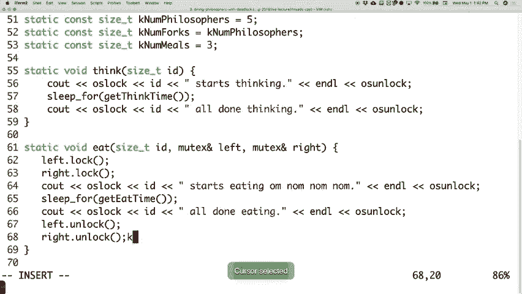

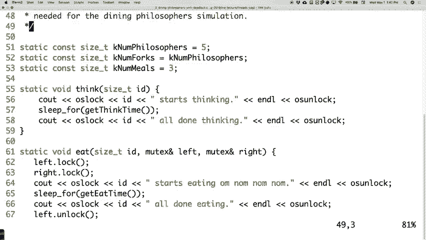

**解决方案**是修正类å‹å£°æ˜ï¼Œç¡®ä¿ä¼ é€’的引用类å‹ä¸å‚数期望的类å‹å®Œå…¨ä¸€è‡´ã€‚修正å代ç å¦‚下：


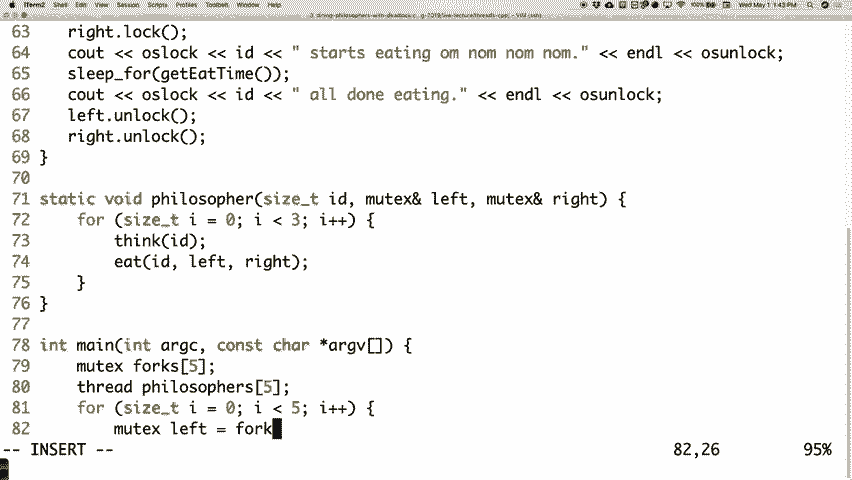

```cpp
// 修正å‰ï¼šä¼ é€’了错误的类å‹å¼•ç”¨
threadFunction(..., (unsigned int&)remainingTickets, ...);


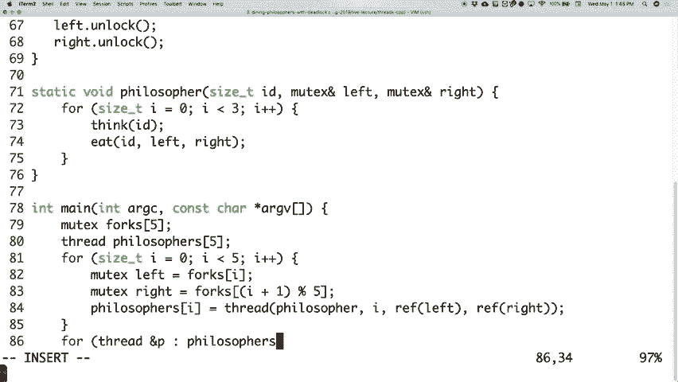

// 修正å：使用正确的 size_t ç±»å‹
threadFunction(..., (size_t&)remainingTickets, ...);
```


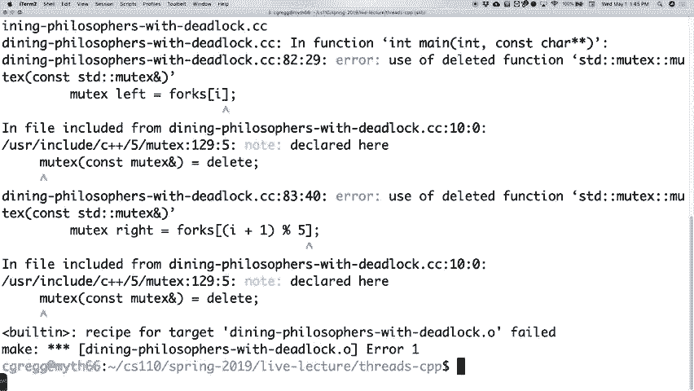

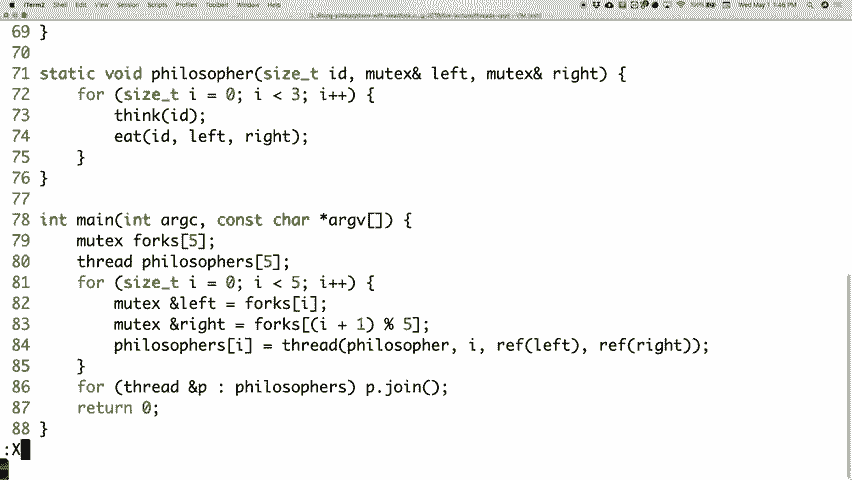

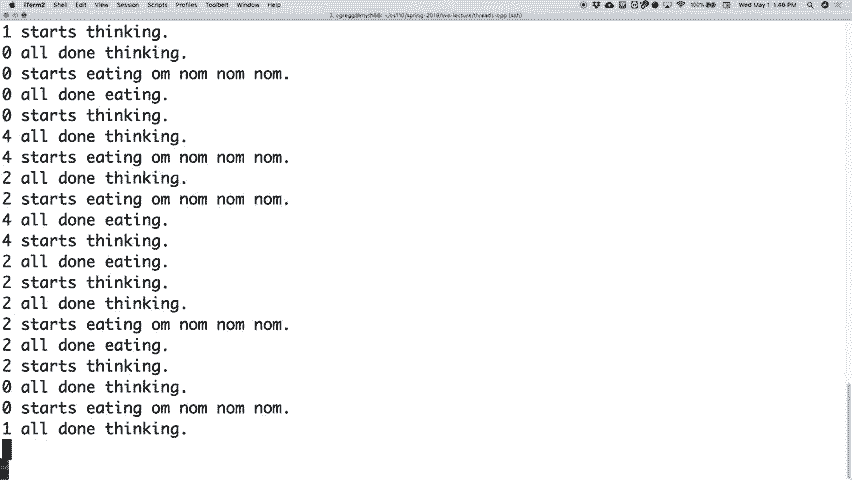

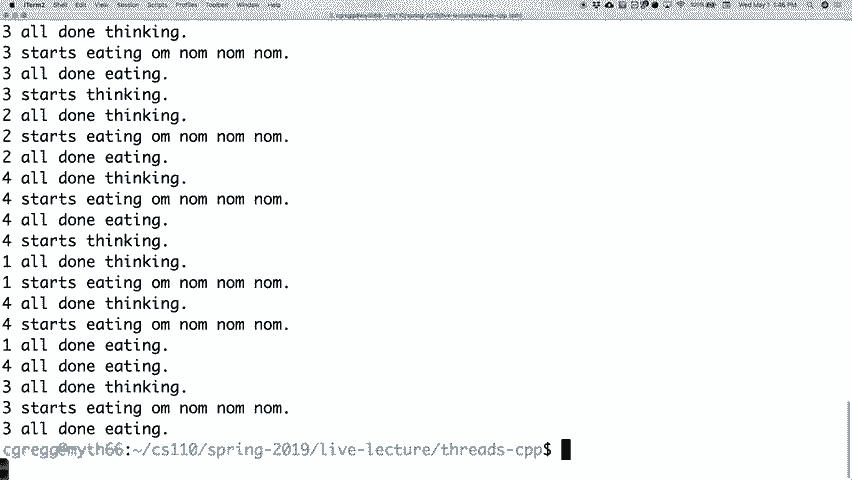

这个错误æ醒我们，编程中é‡åˆ°éš¾ä»¥å‘ç°çš„ Bug 是常事，å³ä½¿ç»éªŒä¸°å¯Œçš„程åºå‘˜ä¹Ÿä¸ä¾‹å¤–。关键在äºè€å¿ƒåˆ†æ和调试。

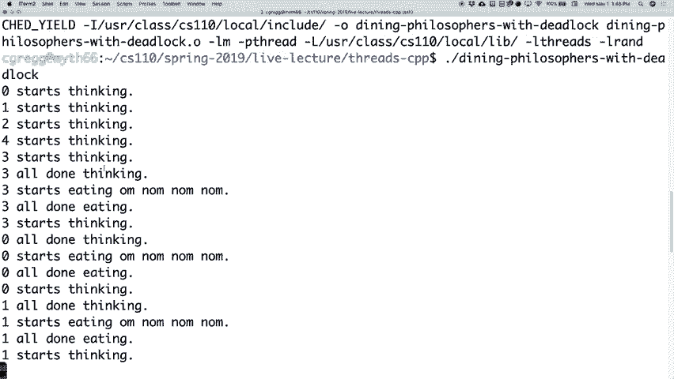


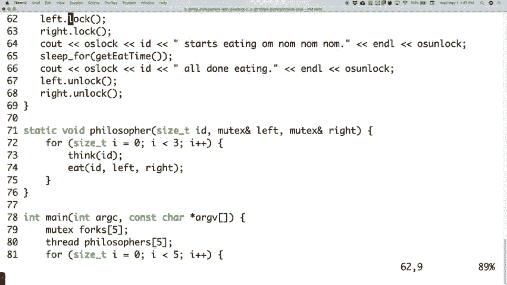


---


## 🧠 哲学家就é¤é—®é¢˜ä»‹ç»


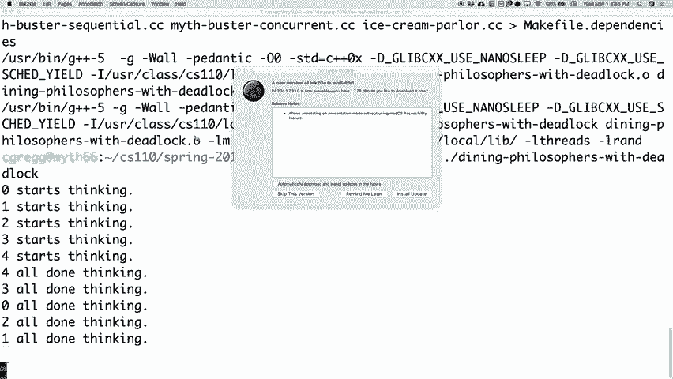

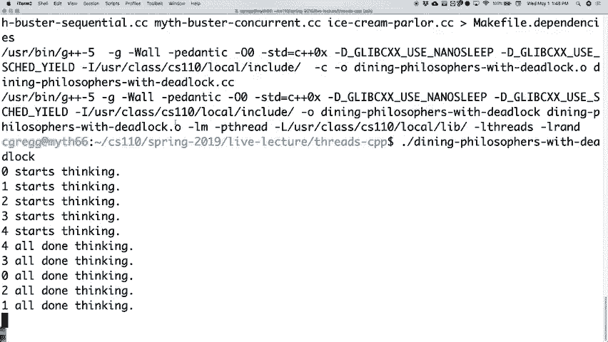

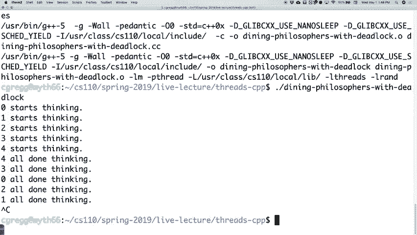

哲学家就é¤é—®é¢˜æ˜¯å¤šçº¿ç¨‹ç¼–程中的一个ç»å…¸æ­»é”案例。它æ述了五ä½å“²å­¦å®¶å›´å在圆桌æ—，æ¯äººé¢å‰æœ‰ä¸€ç¢—æ„é¢ï¼Œæ¯ä¸¤äººä¹‹é—´æ”¾æœ‰ä¸€æŠŠå‰å­ã€‚哲学家交替进行æ€è€ƒå’Œè¿›é¤ã€‚

**è¿›é¤è§„则**：
1.  哲学家必须åŒæ—¶æ‹¿åˆ°å·¦æ‰‹è¾¹å’Œå³æ‰‹è¾¹çš„两把å‰å­æ‰èƒ½è¿›é¤ã€‚
2.  è¿›é¤å®Œæ¯•å，哲学家会放下两把å‰å­ï¼Œç»§ç»­æ€è€ƒã€‚

**核心矛盾**：如æœæ‰€æœ‰å“²å­¦å®¶åŒæ—¶æ‹¿èµ·è‡ªå·±å·¦æ‰‹è¾¹çš„å‰å­ï¼Œé‚£ä¹ˆæ¯ä¸ªäººéƒ½ä¼šç­‰å¾…å³æ‰‹è¾¹çš„å‰å­è¢«é‡Šæ”¾ï¼Œä»è€Œå¯¼è‡´**æ­»é”**——所有人都无法进é¤ã€‚


æ¥ä¸‹æ¥ï¼Œæˆ‘们将通过代ç æ¨¡æ‹Ÿè¿™ä¸ªé—®é¢˜ï¼Œå¹¶å°è¯•è§£å†³å®ƒã€‚

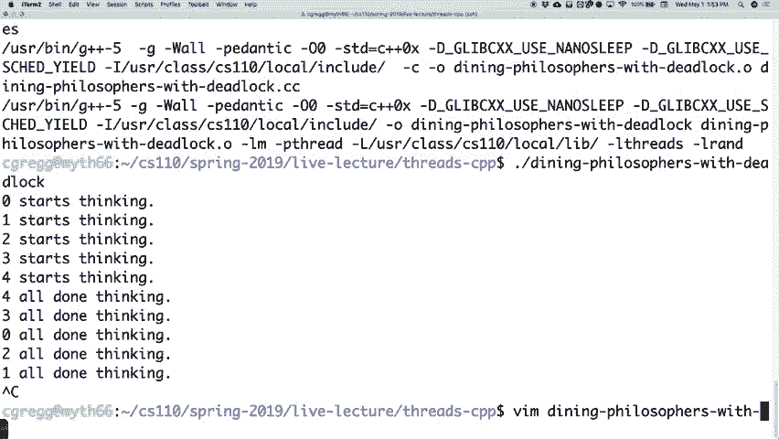

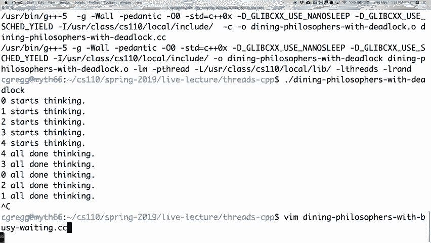


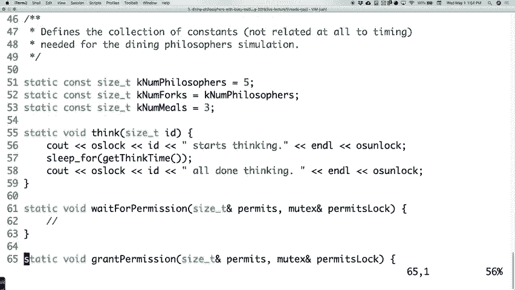


---

## âš™ï¸ åŸºç¡€å®ç°ï¼šä½¿ç”¨äº’æ–¥é”模拟


首先，我们使用互斥é”（`mutex`）æ¥æ¨¡æ‹Ÿå‰å­ã€‚æ¯ä¸ªå‰å­å¯¹åº”一个互斥é”，哲学家必须æˆåŠŸé”定（拿起）左å³ä¸¤æŠŠå‰å­æ‰èƒ½è¿›é¤ã€‚


以下是哲学家线程的主è¦è¡Œä¸ºé€»è¾‘：


```cpp
void philosopher(size_t id, mutex& leftFork, mutex& rightFork) {
    for (size_t i = 0; i < 3; ++i) { // æ¯ä¸ªå“²å­¦å®¶è¿›è¡Œ3è½®æ€è€ƒ-è¿›é¤
        think(id); // æ€è€ƒä¸€æ®µæ—¶é—´
        eat(id, leftFork, rightFork); // å°è¯•è¿›é¤
    }
}

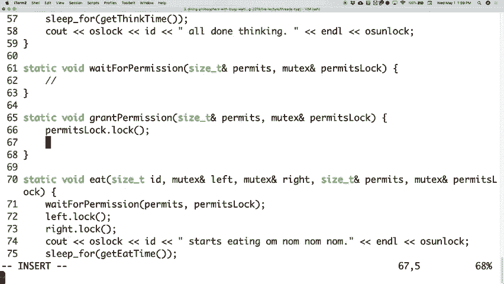

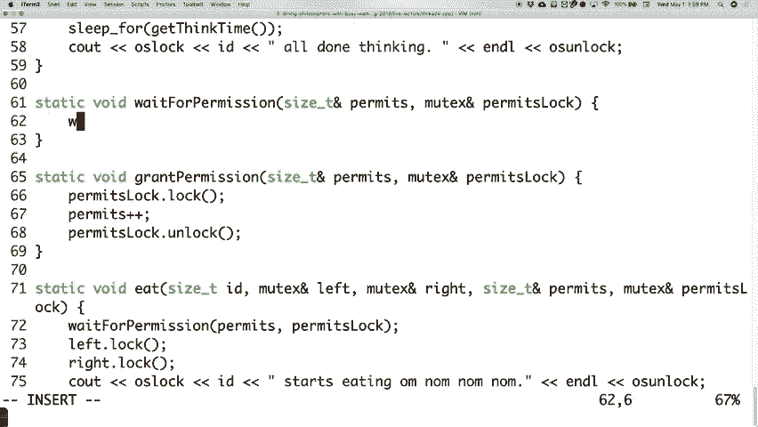


void eat(size_t id, mutex& leftFork, mutex& rightFork) {
    leftFork.lock();   // 拿起左手边的å‰å­
    rightFork.lock();  // æ‹¿èµ·å³æ‰‹è¾¹çš„å‰å­
    // ... æ¨¡æ‹Ÿè¿›é¤ ...
    rightFork.unlock(); // 放下å³æ‰‹è¾¹çš„å‰å­
    leftFork.unlock();  // 放下左手边的å‰å­
}
```


在主函数中，我们创建5个哲学家线程和5个å‰å­ï¼ˆäº’æ–¥é”），并为æ¯ä¸ªå“²å­¦å®¶åˆ†é…其左å³å‰å­ã€‚

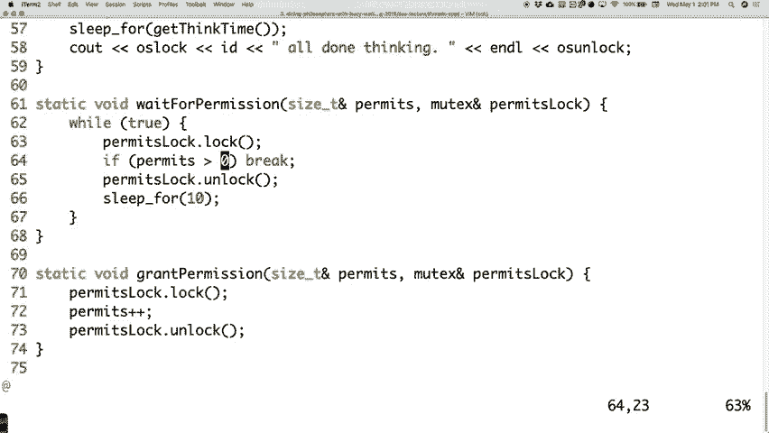


**è¿è¡Œé£é™©**：如æœæ‰€æœ‰å“²å­¦å®¶åŒæ—¶æ‰§è¡Œï¼Œæ有å¯èƒ½å‘生死é”。我们å¯ä»¥é€šè¿‡åœ¨æ‰€æœ‰çº¿ç¨‹å¼€å§‹è¿›é£Ÿå‰æ’入一个统一的延迟æ¥äººä¸ºè§¦å‘è¿™ç§æ­»é”æ¡ä»¶ã€‚

```cpp
// 在主线程中，å¯åŠ¨æ‰€æœ‰å“²å­¦å®¶çº¿ç¨‹å‰
sleep_for(milliseconds(5000)); // 等待5秒，让所有线程准备就绪
```


这样，所有哲学家线程会几ä¹åŒæ—¶å°è¯•è·å–å‰å­ï¼Œä»è€Œæš´éœ²å‡ºæ­»é”问题。


---


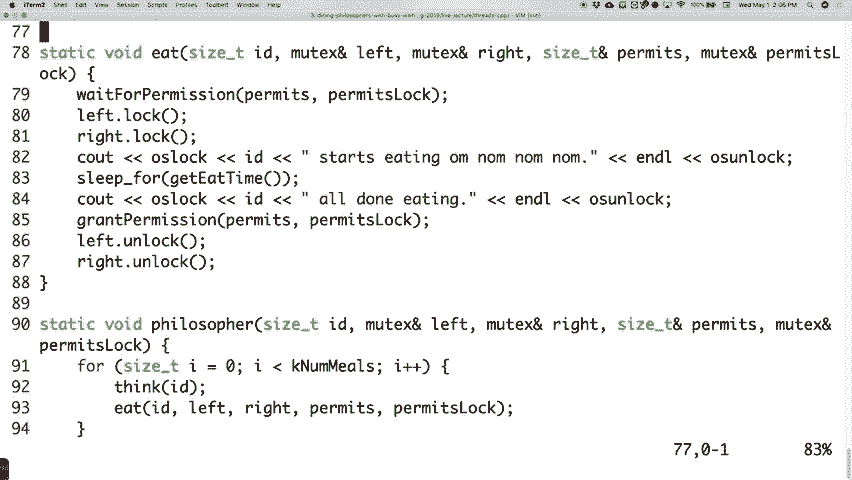


## 🚫 解决死é”方案一：引入许å¯è¯ï¼ˆå¿™ç­‰å¾…）


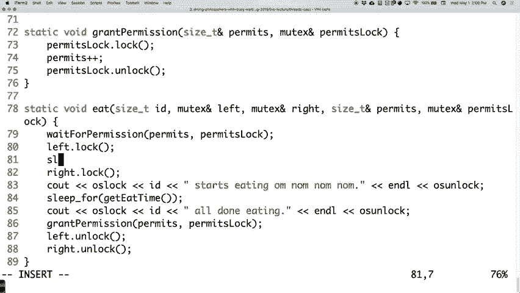

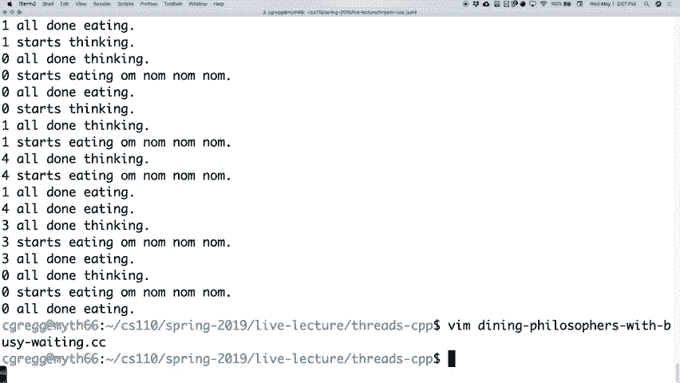

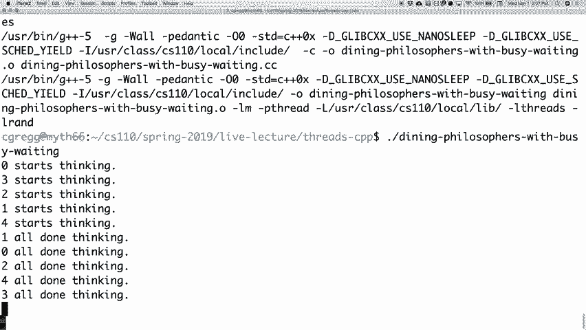


为了防止死é”，一个æ€è·¯æ˜¯é™åˆ¶åŒæ—¶å°è¯•è¿›é¤çš„哲学家数é‡ã€‚例如，åªå…许最多4ä½å“²å­¦å®¶åŒæ—¶å°è¯•æ‹¿å‰å­ã€‚我们引入一个“许å¯è¯â€è®¡æ•°å™¨æ¥å®ç°è¿™ä¸ªé™åˆ¶ã€‚

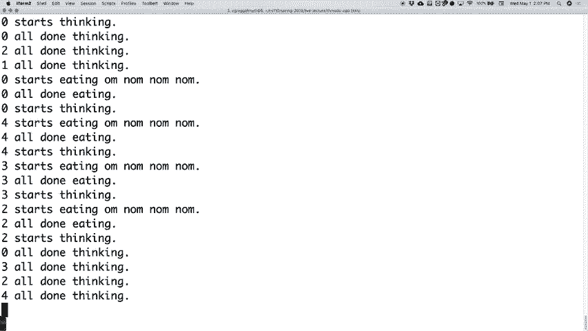

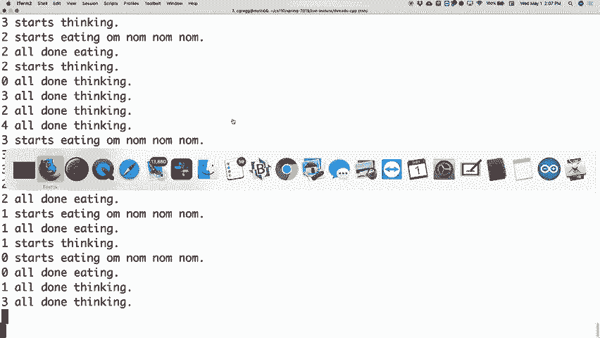


**å®ç°é€»è¾‘**：
1.  设置åˆå§‹è®¸å¯è¯æ•°é‡ä¸º4（比哲学家总数少1）。
2.  哲学家在å°è¯•æ‹¿å‰å­å‰ï¼Œå¿…须先è·å¾—一个许å¯è¯ã€‚
3.  如æœæ²¡æœ‰è®¸å¯è¯å¯ç”¨ï¼Œå“²å­¦å®¶å¿…须等待。


以下是“等待许å¯è¯â€å‡½æ•°çš„åˆæ­¥å®ç°ï¼Œå®ƒé‡‡ç”¨â€œå¿™ç­‰å¾…â€ç­–略，å³ä¸æ–­å¾ªç¯æ£€æŸ¥ï¼š


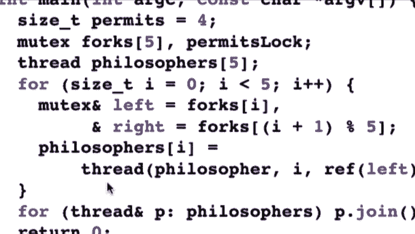


```cpp
void waitForPermission(size_t& permits, mutex& permitsLock) {
    while (true) {
        permitsLock.lock();
        if (permits > 0) {
            permits--; // è·å–一个许å¯è¯
            permitsLock.unlock();
            break; // æˆåŠŸè·å¾—，退出循ç¯
        }
        permitsLock.unlock();
        // 忙等待：未è·å¾—许å¯è¯ï¼Œä¼‘眠一å°æ®µæ—¶é—´åé‡è¯•
        sleep_for(milliseconds(10));
    }
}
```


**缺点**：忙等待会æŒç»­æ¶ˆè€—CPU资æºï¼Œæ•ˆç‡ä½ä¸‹ã€‚哲学家线程在等待时会ä¸æ–­è¢«å”¤é†’和休眠。

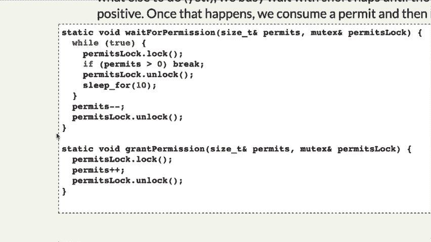

---


## ✅ 解决死é”方案二：使用æ¡ä»¶å˜é‡

为了更高效地等待，我们使用**æ¡ä»¶å˜é‡**。æ¡ä»¶å˜é‡å…许线程在æŸä¸ªæ¡ä»¶ä¸æ»¡è¶³æ—¶ä¸»åŠ¨è¿›å…¥ä¼‘眠状æ€ï¼Œå¹¶åœ¨æ¡ä»¶å¯èƒ½æ»¡è¶³æ—¶è¢«å…¶ä»–线程唤醒。

我们使用 `condition_variable_any` å’Œ `mutex` é…åˆå·¥ä½œã€‚关键工具是 **`lock_guard`**，它能自动管ç†äº’æ–¥é”的上é”ä¸è§£é”。

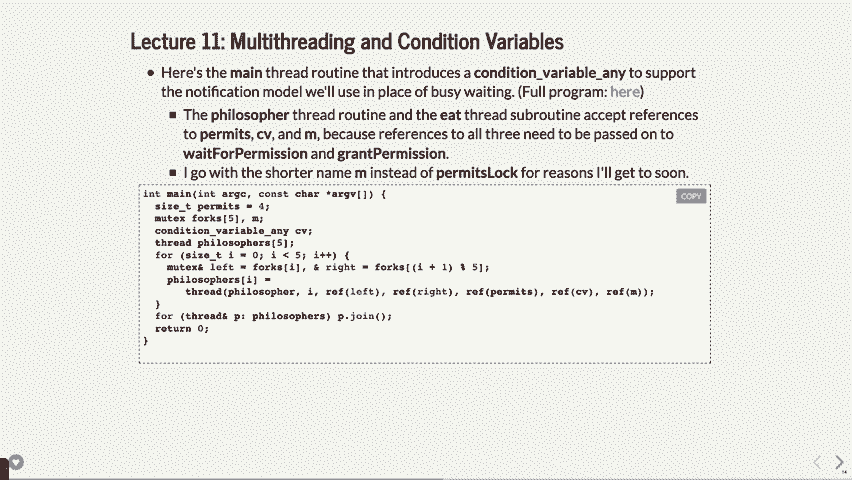

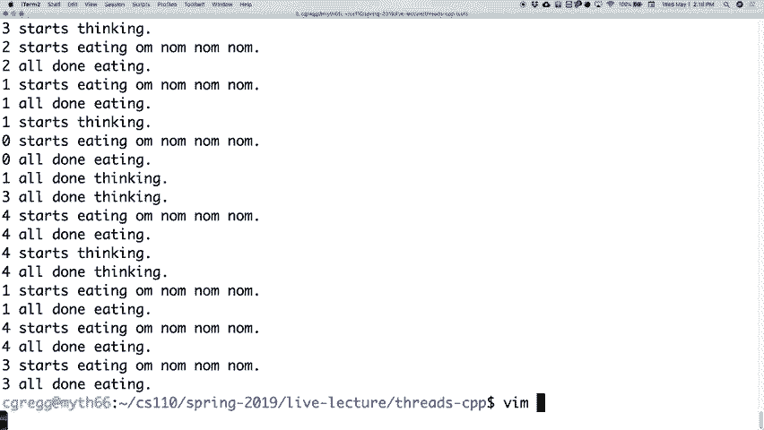


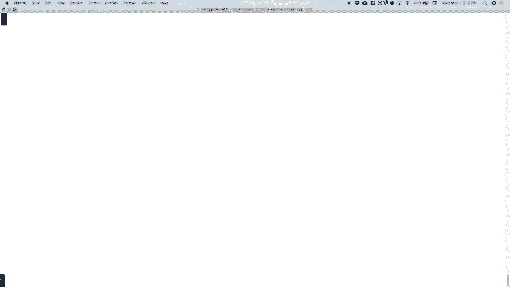

**改进åçš„ `waitForPermission` 函数**：


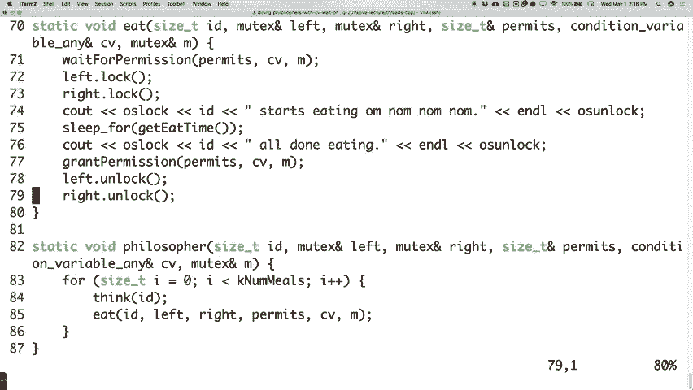


```cpp
void waitForPermission(size_t& permits, mutex& m, condition_variable_any& cv) {
    lock_guard<mutex> lg(m); // æ„造时上é”，ææ„时自动解é”
    // 使用lambda表达å¼ä½œä¸ºç­‰å¾…æ¡ä»¶
    cv.wait(m, [&permits] { return permits > 0; });
    permits--; // è·å¾—许å¯è¯
    // lock_guard 超出作用域，自动解é”m
}
```

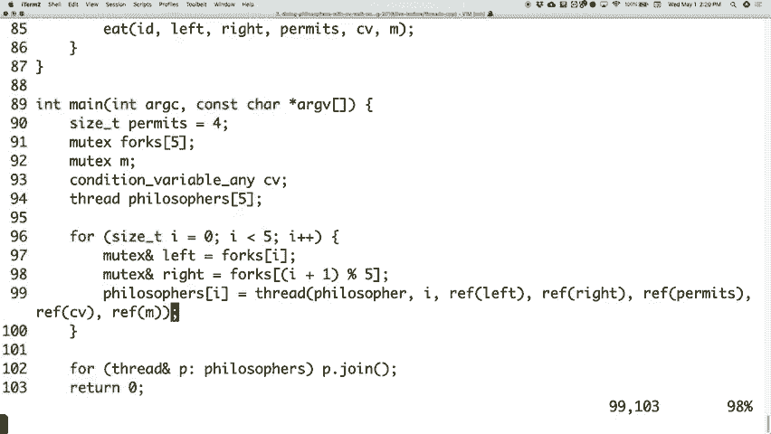

**对应的 `grantPermission` 函数**：

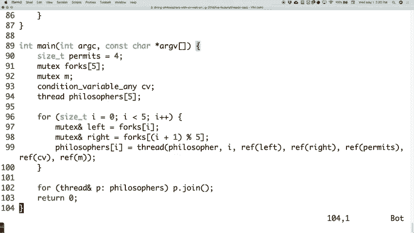

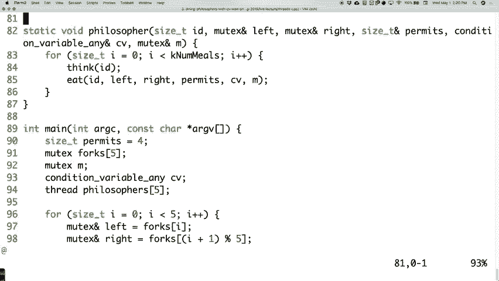


```cpp
void grantPermission(size_t& permits, mutex& m, condition_variable_any& cv) {
    lock_guard<mutex> lg(m);
    permits++; // 释放一个许å¯è¯
    if (permits == 1) { // 如æœè®¸å¯è¯ä»0å˜ä¸º1，å¯èƒ½æœ‰çº¿ç¨‹åœ¨ç­‰å¾…
        cv.notify_all(); // 通知所有等待的线程
    }
}
```


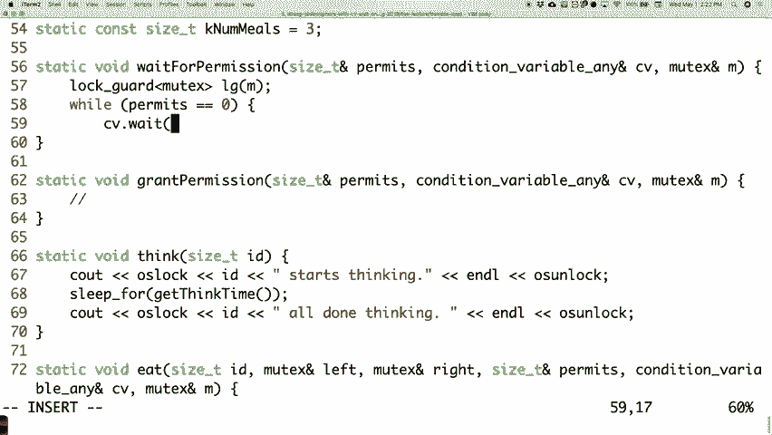

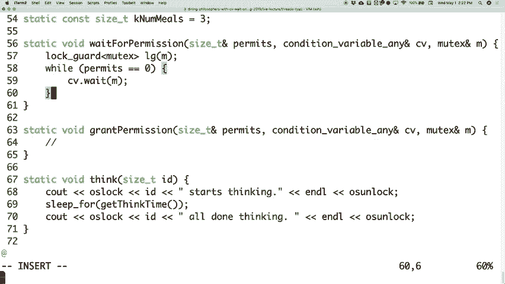

**工作æµç¨‹**：
1.  哲学家线程调用 `waitForPermission`ã€‚å¦‚æœ `permits > 0`，则立å³å‡å°‘许å¯å¹¶ç»§ç»­ã€‚
2.  å¦‚æœ `permits == 0`，`cv.wait()` 会解é”äº’æ–¥é” `m` 并使线程休眠。
3.  当有哲学家进é¤å®Œæ¯•ï¼Œè°ƒç”¨ `grantPermission` å¢åŠ è®¸å¯ï¼Œå¹¶è°ƒç”¨ `cv.notify_all()` 唤醒所有等待的线程。
4.  被唤醒的线程会é‡æ–°è·å–é”并检查æ¡ä»¶ï¼ŒæˆåŠŸè€…è·å¾—许å¯è¯ã€‚

è¿™ç§æ–¹å¼é¿å…了忙等待，让线程在等待期间完全ä¸æ¶ˆè€—CPU资æºã€‚


---


## 🚦 解决方案三：使用信å·é‡


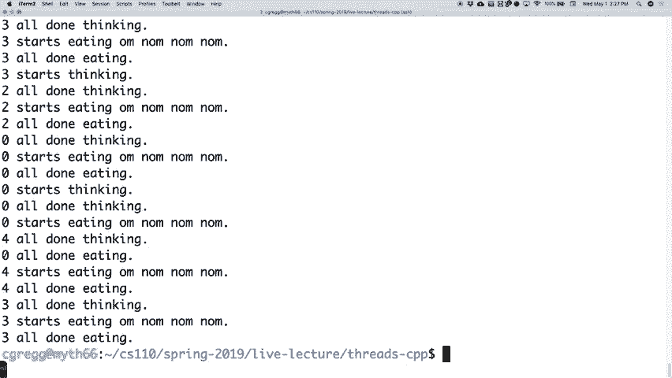


æ¡ä»¶å˜é‡çš„模å¼é常通用，以至äºå¯ä»¥è¢«å°è£…æˆä¸€ä¸ªæ›´é«˜çº§çš„工具——**ä¿¡å·é‡**。信å·é‡ç»´æŠ¤ä¸€ä¸ªè®¡æ•°å™¨ï¼Œæ供了 `wait`（è·å–资æºï¼‰å’Œ `signal`（释放资æºï¼‰ä¸¤ç§åŸå­æ“作。


在C++标准库中并没有直æ¥æ供信å·é‡ï¼Œä½†æˆ‘们å¯ä»¥å¾ˆå®¹æ˜“地利用 `mutex` å’Œ `condition_variable_any` å®ç°å®ƒï¼Œæˆ–者使用课程æ供的å°è£…类。


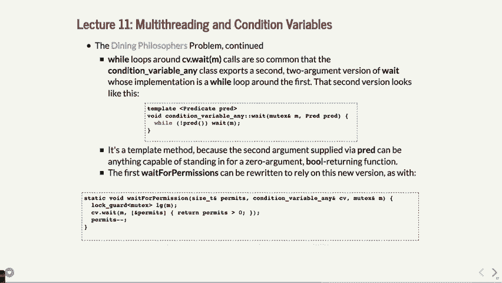

**使用信å·é‡ç®€åŒ–哲学家问题**：

```cpp
// 声æ˜ä¸€ä¸ªåˆå§‹å€¼ä¸º4çš„ä¿¡å·é‡
semaphore permits(4);


// 在哲学家线程中，替æ¢ä¹‹å‰çš„ waitForPermission å’Œ grantPermission
void philosopher(size_t id, mutex& leftFork, mutex& rightFork, semaphore& permits) {
    for (size_t i = 0; i < 3; ++i) {
        think(id);
        permits.wait();    // 等待并è·å¾—一个许å¯è¯ï¼ˆä¿¡å·é‡å†…部æ“作）
        eat(id, leftFork, rightFork);
        permits.signal();  // 释放许å¯è¯
    }
}
```

ä¿¡å·é‡çš„ `wait()` å’Œ `signal()` 方法内部已ç»å°è£…了é”å’Œæ¡ä»¶å˜é‡çš„逻辑，使得代ç æ›´åŠ ç®€æ´æ¸…晰。**互斥é”本质上就是åˆå§‹å€¼ä¸º1çš„ä¿¡å·é‡**。

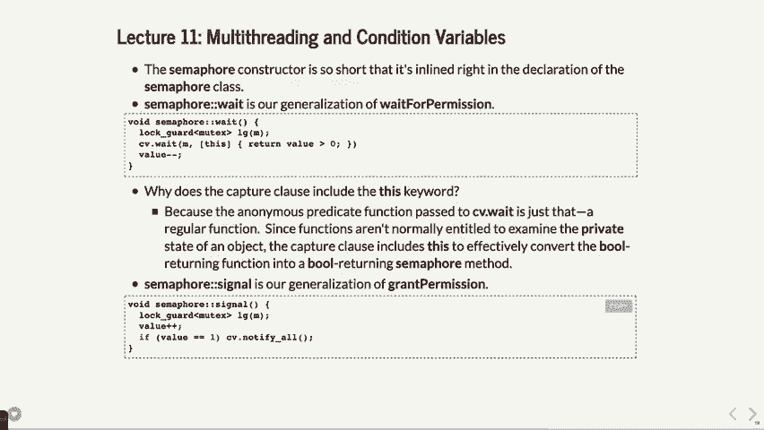

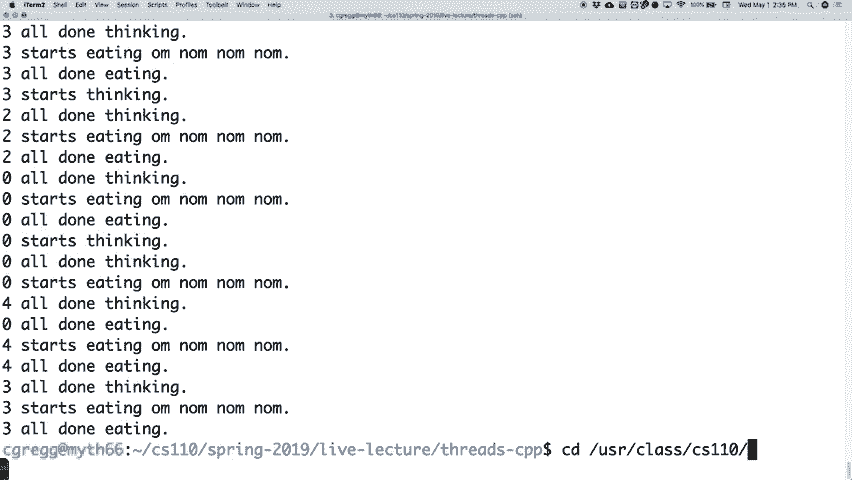


---


## 📚 本节课总结

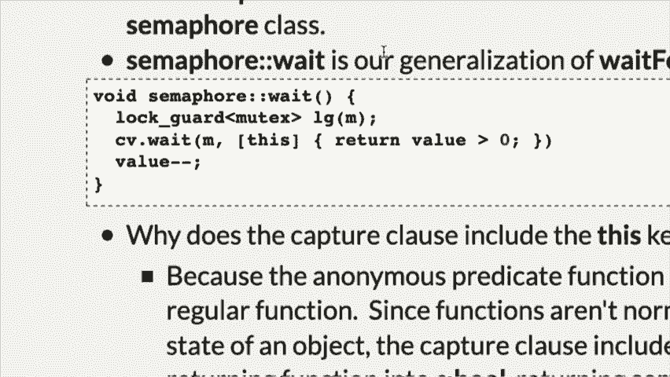

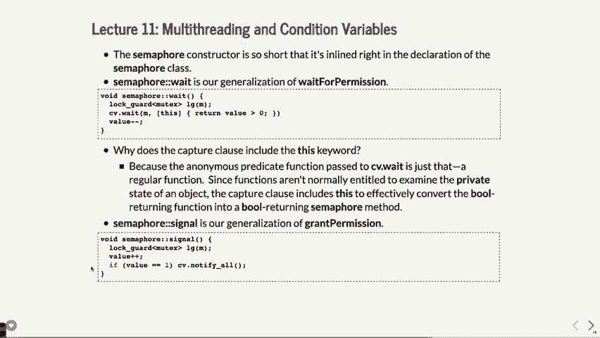


在本节课中，我们一起学习了：

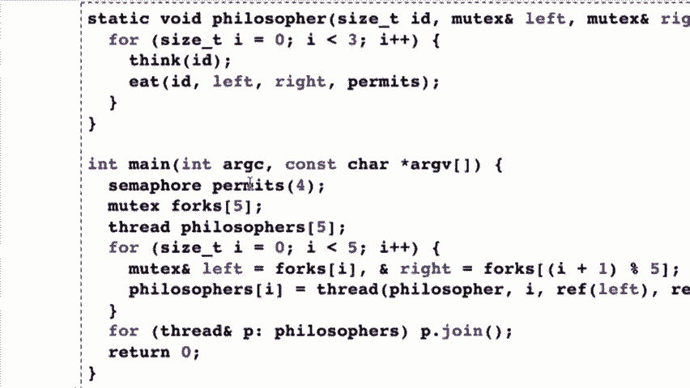


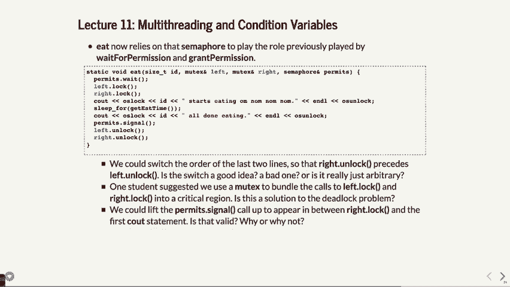

1.  **哲学家就é¤é—®é¢˜**：一个ç»å…¸çš„多线程死é”场景。
2.  **互斥é”**：用äºä¿æŠ¤å…±äº«èµ„æºï¼ˆå‰å­ï¼‰ï¼Œä½†ç›´æ¥ä½¿ç”¨å¯èƒ½å¯¼è‡´æ­»é”。
3.  **许å¯è¯æ¨¡å¼**：通过é™åˆ¶å¹¶å‘æ•°é‡æ¥é¢„防死é”。
4.  **忙等待的缺点**：ä½æ•ˆä¸”消耗CPU。
5.  **æ¡ä»¶å˜é‡**：ä¸äº’æ–¥é”é…åˆï¼Œè®©çº¿ç¨‹èƒ½é«˜æ•ˆç­‰å¾…æ¡ä»¶æˆç†Ÿï¼Œå¹¶é€šè¿‡ `lock_guard` 自动管ç†é”的生命周期。
6.  **ä¿¡å·é‡**：一个更高级的åŒæ­¥åŸè¯­ï¼ŒåŸºäºæ¡ä»¶å˜é‡å°è£…，用äºç®¡ç†ä¸€ç»„资æºçš„访问许å¯ï¼Œæ大简化了代ç ã€‚


通过ä»åŸºç¡€å®ç°åˆ°é«˜çº§åŒæ­¥åŸè¯­çš„演进，我们æŒæ¡äº†è§£å†³å¤æ‚线程åŒæ­¥é—®é¢˜çš„多ç§å·¥å…·å’Œæ€è·¯ã€‚在å®é™…编程中，应根æ®å…·ä½“场景选择最åˆé€‚的方法。