# P13：Lecture 12 Review of mutex, conditional variable, semaphore - ___main___ - BV1ED4y1R7RJ

 Okay， we might as well get started。 Welcome。 So the midterm is over。 I hope everybody did alright。 I'll have a couple， comments about that。 And then Stanford Shell。 I hope that's going okay。 As I said， there's like， if you haven't really gotten going on it， get going soon。 It's a。 those of you who did who have started it， you realize there's just lots of parts to it。

 and lots of things to think about。 And there's been lots of Piazza questions。 lots of questions about the assignment。 So I hope that's going alright。 And we will。 have lots of officers this week。 And when did they say it was due Wednesday night or。 Thursday night？ Did you say make it Thursday night？ So you said， let's talk in a。

 couple days。 We'll see。 So the midterm， a couple comments on that。 You should have。 gotten your midterm scores back。 If you didn't， please let me know so we can。 make sure that happens。 Overall， I was pretty pleased with it。 I think the， there。 were a couple questions on there that I knew would be difficult。 And there were a couple。

 questions that I thought， hey， everybody should do alright on this。 And most people， did。 The answers to the file system stuff。 I mean， I think that was hopefully， relatively open ended。 but straightforward。 Most people did okay。 Problem one D。 Actually， problem one。 I think was the most challenging problem， which it was， kind of meant to be。 One D。

 let's go kind of in reverse order here。 One D was the， question about， hey。 how do you deinterleave these outputs？ Is it possible to， really deinterleave these outputs？

 The answer is not really。 The way we set up the， input and output such that they had to track each other directly made it really。 impossible no matter what solution you came up with。 Unless you were allowed to。 collect all the data first and then pipe it to one， then pipe it to the other and， so forth。 And my。 the idea for this problem was you don't know how much data。

 there is coming in and you're not allowed to store it all before you start piping。 away and it's not possible。 Very few people got that part correct for D， but that's， okay。 That happens on exams。 Definitely go and look at it。 If you do have， questions about， hey。 I don't really understand what the answer is all about。 Trust me。

 we had some TAs during grading who were like scratching their heads going， oh， wait a minute。 what is this？ And they did it all on the board and they convinced， themselves eventually。 So it was a difficult， difficult problem。 For the actual code， for that， two things。 First thing。 you know how we can use the pipe to and then you， have like FDS and then O， Clo， ex。

 EC or whatever it is。 You know how you do that， and then you don't have to close some。 but you might have to close others or whatever。 We didn't even worry about that。 All right。 for the exam。 There were too many， like corner cases where you could have done one or the other and we just pretended。 everybody used O that pipe to and we pretended that everyone closed everything。

 inside the children correctly。 There were two pipes you had to close correctly or。 two five the scriptures you had to close correctly outside of the children and that。 one we cared about。 But inside the children， if you went and if you said， oh， I'm not。 sure I got that right， that's okay。 We didn't worry about that。 The other thing。

 that people tended to miss quite frequently was we didn't say you should wait。 PID for the children to end the program。 But let's just go look at the program。 the actual question again。 Okay， and or I should say let's look at the actual code。

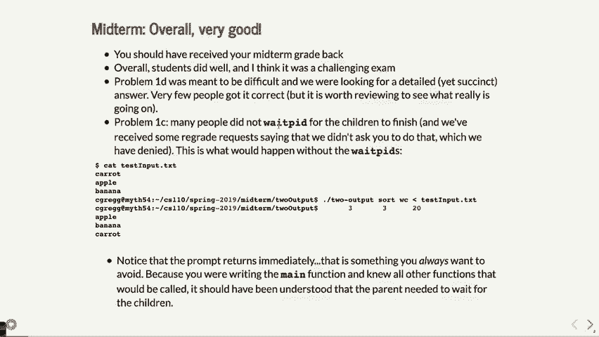

 that you may or may not have typed up to。 Remind me later。 There we go and then there we go。

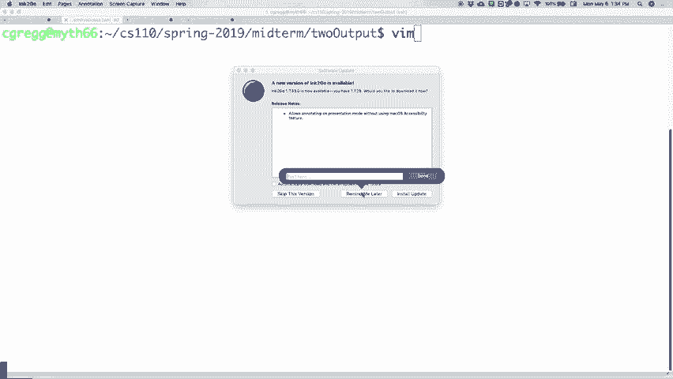

 Then two output。cc。 Okay， so you wrote all this for the actual pipes and so forth。

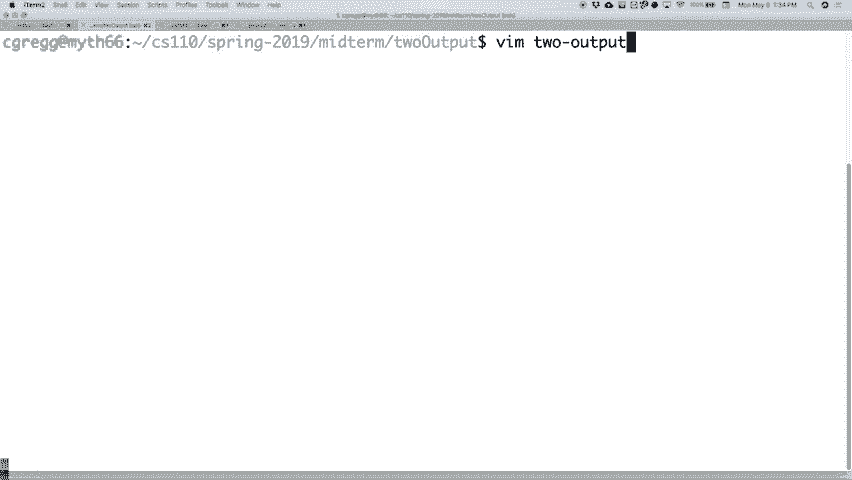

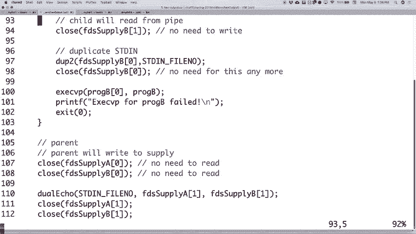

 You did all that and you were writing where？ You were writing in Maine， right？

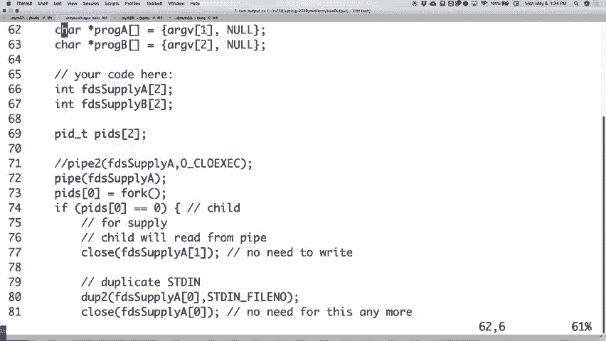

 You were writing the actual main part of this program which called the dual echo。

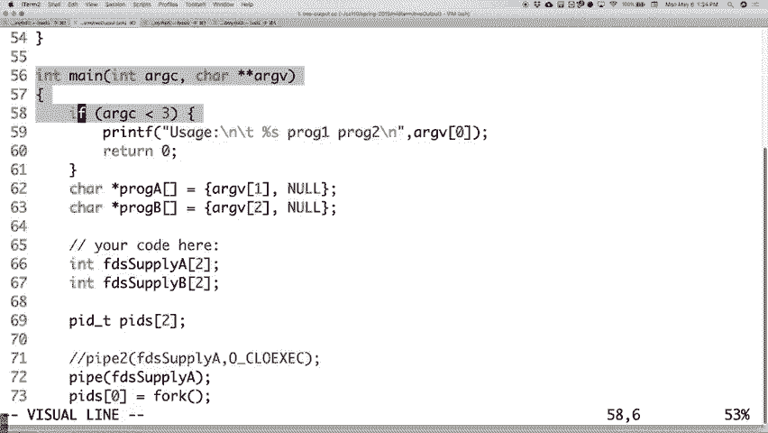

 down here， okay， which called the dual echo down here and that was what you did。

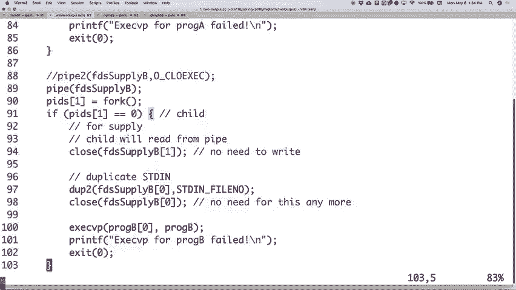

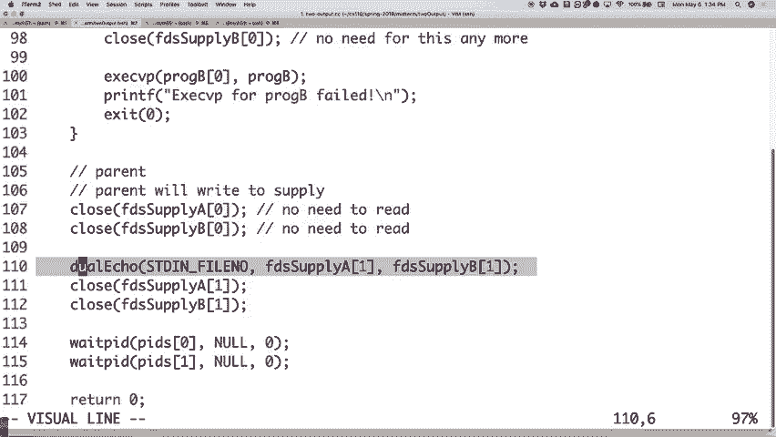

 And then Maine ended。 And Maine ended and if you forgot the weight PID， this is what。

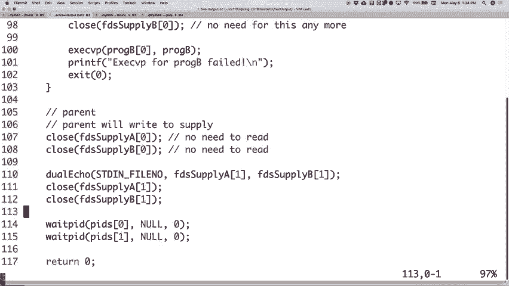

 it should have looked like by the way。 Let's see。 Two output。 Let's do the same。 example to do sort and then I'll pipe in a little test， test input。 Okay， so that。 was actually relatively nice in that it did sort and WC in the word count actually。 did come first but it didn't have to。 It could have come somewhere in the middle。

 That was the interleaving part。 But you'll notice that the prompt didn't come back until。 after both children finished。 That's what you want in programs。 You want your。 programs to end nicely such that the prompt comes back。 Well， if we took out those。

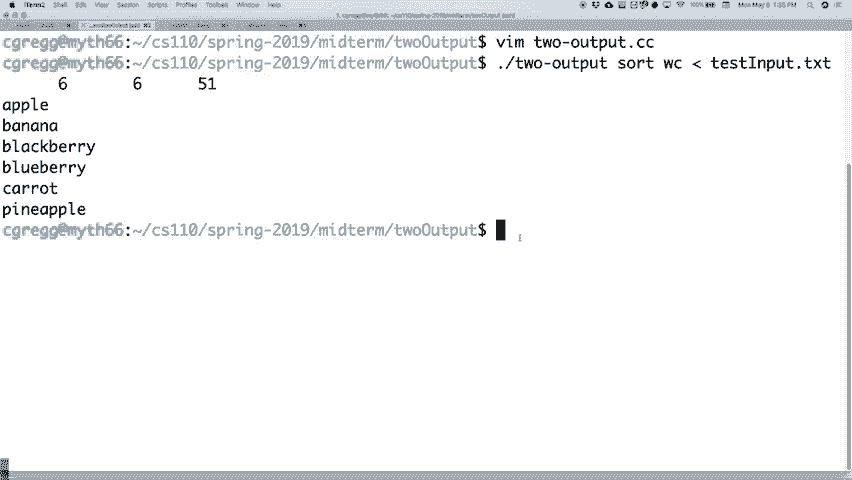

 two weight PIDs， right， let's see what might happen。 Okay， it's not guaranteed to happen but。

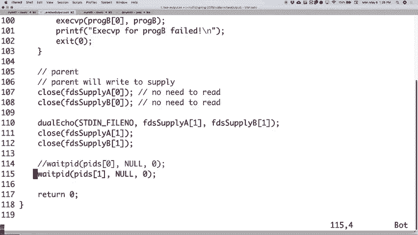

 let's see what happens here。 I'll put， oops， put， there we go。 Two output and let's do the same thing。

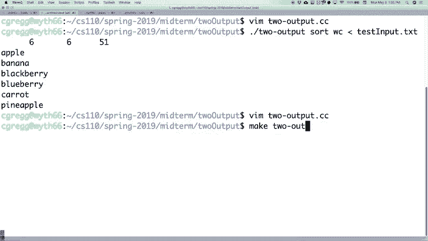

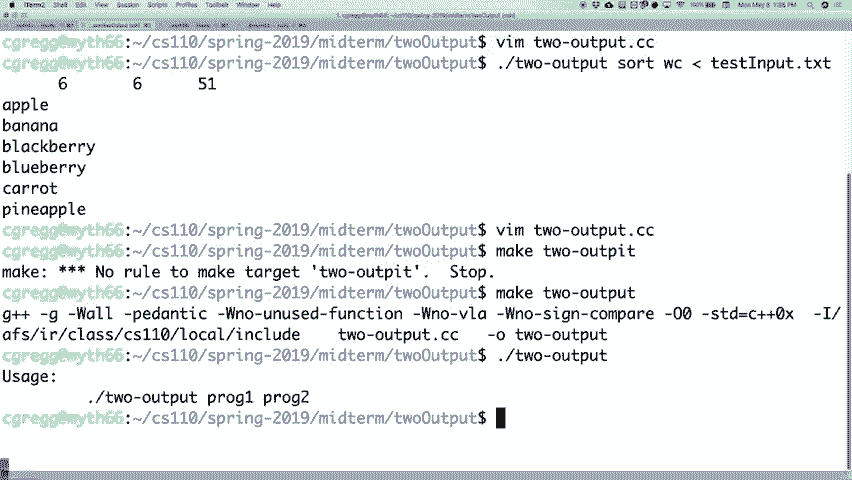

 before。 Let's do it up at the top of the screen。 There we go。 Okay， look。 So here's what happened。 Up here we got the prompt back and then the program went and then it just sits here like， that。 Is that a nicely behaved program？ No， not very nice。 So we kind of expected you to go， oh。 if I'm writing the main and I want and I'm doing this two output thing for children。

 you should wait for the children。 So I apologize to people who didn't pick that up but。

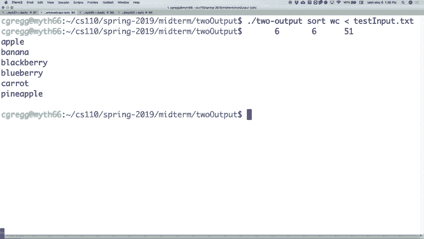

 you kind of should get that that that's the what you want to do。 All right。 If you have， other。 there are regrade requests still open。 We're relatively strict about regrade requests。 and that you can't like for the pro and con when you go， well， I really meant this。 and try to explain away what you really meant。 If it wasn't on the page， that's it。 The other， one。

 there were some people who were saying， ah， I wrote 125 words and you took off points and， whatever。 I kind of， you know， kind of warned you that the point， we thought those。 answers could be well within 100 words。 And so if you made， if you made a few more， we didn't。 care that much。 And if you do want to regrade requests， I'll go count your words and make。

 a decision but like 120 probably too much in that case。 Question。 >> [inaudible] >> Good question。 The question is， hey， wait a minute。 I didn't know about this， pipe filling up business。 Is that the way right works or is that the pipe thing？ It actually is， a pipe。 It's a built in Linux issue is that pipes can fill up。 They only make so much。

 space for the pipe in Linux。 And so what all it does， it generally doesn't break things。 Although if you don't understand that like this code， it would break our code if we tried。 the D interleave because we never really talked about that。 No。 We didn't talk about that in。 the sense that there might have been a piazza question about it。 Maybe it was last quarter。

 But the point is that the pipes can fill up。 What do they do？ They just block until things。 lessen up again。 And if for some reason you're doing something walky like that program and。 trying to collect all the data at once， that can be a problem。 So that's kind of why I gave。 it on the exam was， hey， here's something new。 Oh， what do you think about this？ Oh， now。

 the pipes can fill up。 What do you think about it？ That's kind of why I put it on there。 Is this what I mean？ No， you didn't know the pipes could fill up。 No， what I'm saying is。 you might have known that。 The midterm said it。 Oh， yeah， yeah， there was a section。 Oh， sorry。 Yeah， sorry。 The Mitch， go back and read the midterm。 It did say that that was the whole， point of。

 yeah， the pipes could fill up。 Sorry， you didn't read that question。 One of the pipes could not physically close the file。 No， good question to when the pipes。 fill up is a closed file。 No， no， it just blocks on it and says， oh， if you want to write。 more data， I can't accept more data。 I'm just going to block you from writing more data until。

 somebody else reads and then you'll be able to block。 I'm doing it。 We're going to see an。 example of something similar to that in threading today where there's this， there's this， reader。 writer， kind of dance that has to happen where you've only got so much space and you need。 to figure that part out。 So good question on that。 Very good question。 Yeah。

 A little more technical question about main。 Yes。

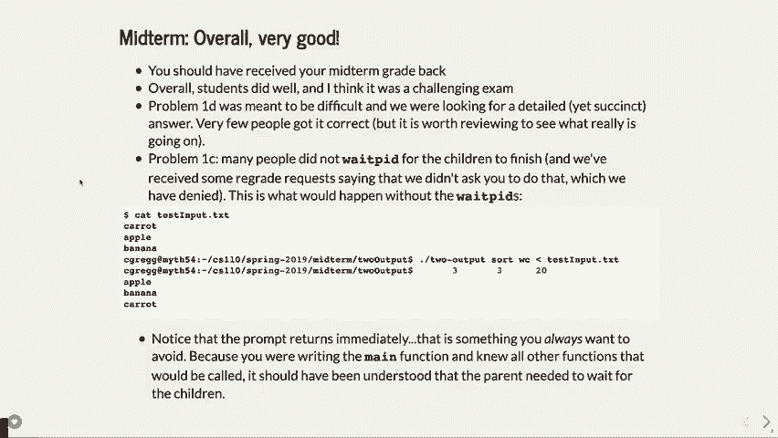

 So in my phone， I have four loop。 You had a four loop。 It's kind of around this。 Okay， that。

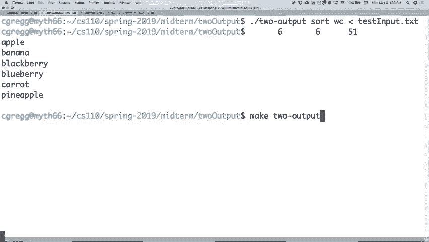

 probably could work。 Sure。 It's still such that I didn't get that。 Oh， put a regurg question。 if you think that's right。 That's a doing the weight PID in a loop where you check for all。 the children waiting is perfectly legitimate。 You absolutely could do that。 So put a regurg。 question for that。 Any other questions on the？ I don't want to get into too many details。

 about the exam， but if you do think we graded it incorrectly， please let us know。 As I said。 we're trying to be fair in the regrade process， but we're going to be， you know， we're going。 to be not going to just let you kind of redo your test and the regrade process。 You've been。 through that。 Okay。 All right。 And as I said， overall， pretty good on the midterm。 I think。

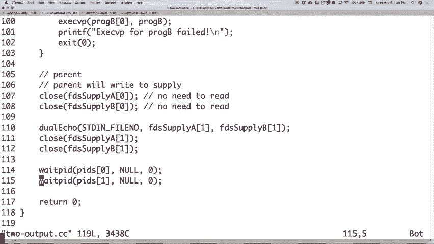

 it was a challenging midterm， but overall people did all right。 And if you didn't do so great。 feel free to email me and we can chat about going forward and trying to pick things up， a little。 And you've also got the final and other assignments and so forth。 Okay。 All right。

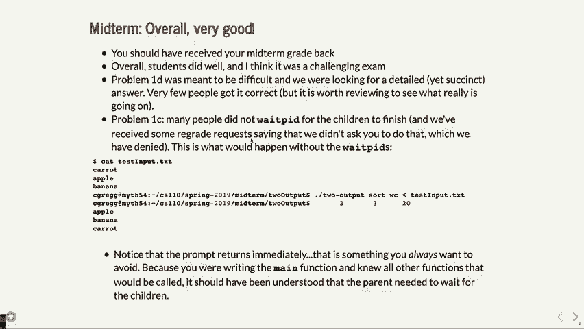

 So I know you're all thinking about Stanford Shell， which has nothing to do with threading。 but I did figure that last week you were all thinking， Oh my gosh， I got this midterm coming。 up and we went over， we went over mutexes and then CVs and semaphores and it was all wicked， fast。 And what I wanted to do is kind of go back and just kind of review what they are。 Let。

 you get all the questions out that you might still have about those or new questions or。 and then we'll see a couple more small examples。 Okay。 I'm not going to actually do any like。 live like stuff today。 I just have some examples and we'll go over them as we go。 Okay。 So in。 threading， we have to have this ability to handle race conditions。 We have to have the。

 ability for two or more threads to to either act in a similar section of code or act on a。 data structure in a way that won't corrupt the data structure。 And this is just something。 that you have to deal with。 Race conditions happen all the time when you're doing this。 threads just like， just like multi crossing。 We have a different， a few different ways of。

 doing that。 We kind of walked through them last week。 The main one is， and this is the kind。 of the underlying one for most of these is a mutex。 Okay。 A mutex and we'll go over the， details。 I'll just kind of list through here。 The mutex is the first one we learned about， and we'll。 we'll see examples of that in a minute。 A conditioned variable， any mutex has。

 no ability for two threads to signal another thread that they're done。 Right。 Now the。 signaling can happen by the fact that one thread will actually release the lock and the。 other thread will gain the lock。 So that is in some sense a signal， but it's not a， distinct like。 Hey， anybody who's waiting， go ahead and continue。 So there has to be some。

 ability to do that if you don't want to busy wait or， or if you don't want to just have。 a regular straight up lock。 Okay。 This is particularly important when you have multiple， things。 trying to access a particular data， a particular like section of code， and it。 could be more than one。 You can't really handle that directly with a mutex。 So that's where。

 a conditioned variable， any comes in。 And then there are all sorts of things you can do。 with a conditional variable， any that we happen to do a lot， namely waiting for permits and， saying。 Hey， here's a whole bunch of thread or a whole bunch of permits that a bunch of。 threads can work at once。 And so what we said was， well， let's， we can use a， conditioned variable。

 any， but let's actually， let's actually build it up such that we。 build it into this other thing called a semaphore， which is a different type of， data structure。 Fairly easy to build has some nuances that we'll talk about later， today。 And it allows you to。 whoops， allows you to go ahead and build more structures a， little easier than a conditional。

 a conditioned variable， any。 Okay。 So let's review these。 Okay。 Let's review all of them。 In fact。 the， let's see， here we go， maybe not。 There we go。 Okay。

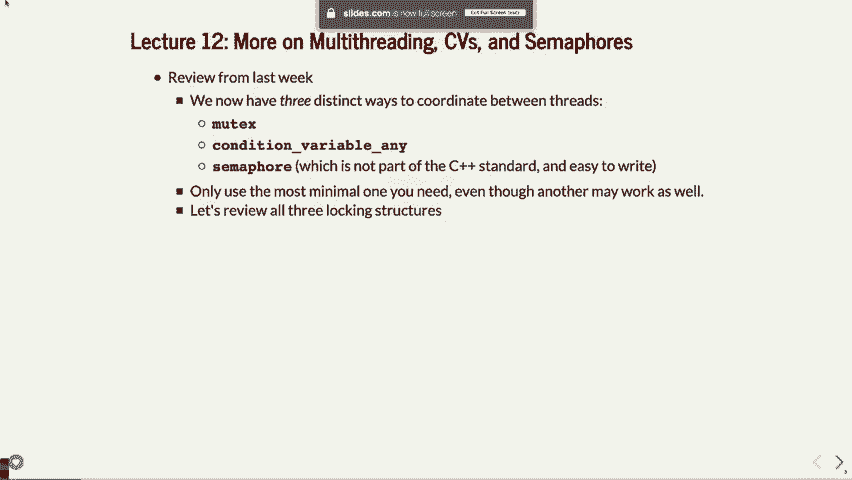

 So the mutex， okay。 And you can use these slides as kind of a reference to if you'd like。 The mutex is a， it's a lock。 Okay。 And it has two things you can do with it。 You can say。 either lock or unlock。 And what happens is when a thread takes this mutex and locks it， if no。 one else is locked it yet， it gets that and it moves on to the next line of code。 Okay。

 And it's that straightforward。 If another thread comes in and attempts to use the lock， but the。 first， the first thread is still using it， then what happens is the， the second thread。 blocks until the other thread unlocks it。 Okay。 And that's the big details there that you。 should care about。 Okay。 You have to pass a mutex by reference or by pointer。 Why？ Because they。

 actually need to share the same mutex。 It can't be a copy of a mutex because then the data。 wouldn't be shared。 And that's how it works。 And by the way， under the hood， if you take。 a parallel processing class or you take maybe an operating systems class， they might talk。 about it uses atomic instructions under the hood to create the mutex so that two threads。

 can't get it at the same time。 So there's a little more hardware support and operating system。 support for doing this。 But that's basically how it works。 Okay。 The thread obtains to lock。 and then executes the next line of code。 If it， if the other thread can't get it because the。 lock is already taken， the code waits and then until the lock is unlocked。 The only thread。

 available to， the only thread allowed to unlock is the one that locked it。 Okay。 It's all。 it's undefined behavior if another thread tries to unlock a lock thread and it wasn't the。 one that did it。 Yeah。 Question。 Go ahead。 I'm listening。 I'm trying to get this tablet。

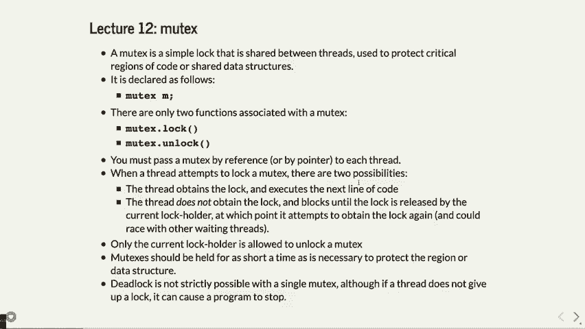

 thing working。 Yeah。 You don't remember your question？ Oh， okay。 What's that？ Okay。 All， right。 So let's see。 I'm going to try this one more time with the tablet and see if it。

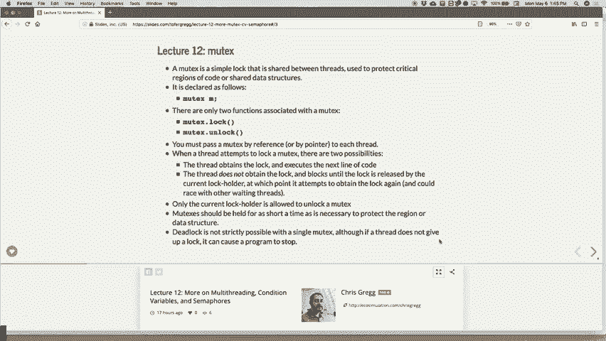

 were。 Go ahead。 What's your question？ Is that the boot waiting or is that like okay？

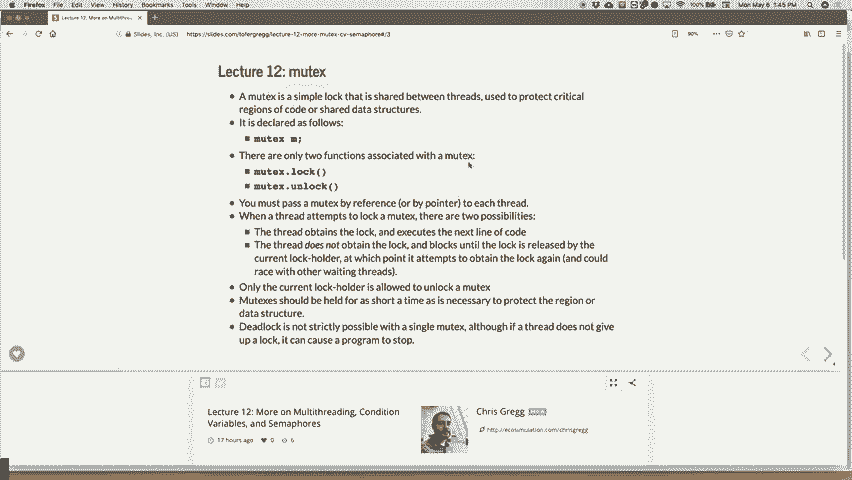

 Oh， that is okay waiting。 Okay。 Good question。 The question was， "Is that busy waiting or。

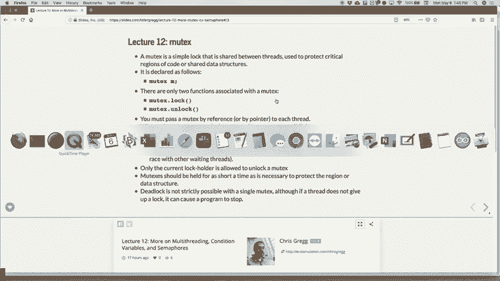

 is it okay waiting？" That is okay waiting。 But it is， but it doesn't always solve all。 of our problems。 Right。 So the permits part can't really do that one mutex or even just。 a few mutexes because as we saw with the traveling， or the traveling philosopher， I'm mixing my。 my big problems in the world with the， with the dining philosophers， you can't， you have。

 to have the ability to say， "Oh， I'm limiting it to so many people being able to do this。 So many threads doing something with that。" So it's， you have to， you have to wait on， that。 Okay。 All right。 So。 Other question？ Yes。 Eva。

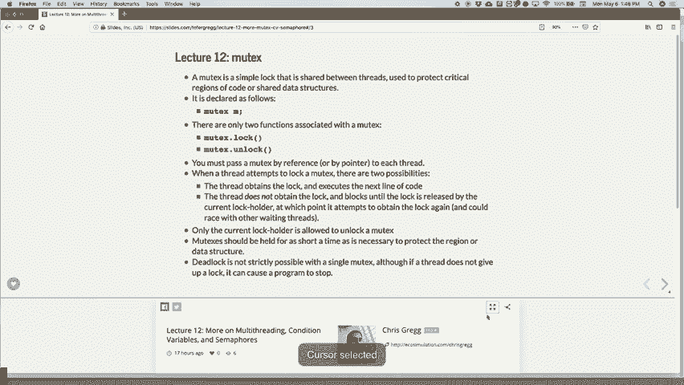

 What is the text look like in terms of boxers or friends？ Sure。 The same problem。 [inaudible]。 It's an interesting question。 The question is， "What is going on with when， when there's。 locks and file descriptors？" Remember， a lock has no information about the rest of the， system。 Okay。 If a thread， if two threads happen to be working on the same file descriptor。

 if one thread reads a bit， the other thread will read later in the file descriptor， but， there's no。 they， they could read at the same time and it would just interleave it as， as， is necessary。 But yeah， if you want to read only apart from one thread and then something， from another thread。 having a mutex is perfectly fine and you can order it that way if you want， to。 But yeah。

 there's no， no other reason。 Remember， mutexes are relatively simple。 You either hold the lock or you don't and anybody， any other thread that tries to get the lock。 can't while you're holding it。 That's the， the whole business with a， with a mutex。 Okay。 All right。 Let's move on to， oh， let's see。 A couple other things about it。 Oh， you should。

 try to hold a mutex for as short a time as possible。 Okay。 Why？ Because if other threads。 are trying to access that lock and you're still holding it because you're doing something， else。 if it doesn't matter to your， if it doesn't matter to your logic that the lock is still， held。 release it earlier。 Sometimes it's inevitable and you have to release it， you know， later。

 on because you're still using that data structure， but you want to really hold them for as short。 a time as possible。 Okay。 Let's see。 Deadlock， which is when two threads are kind of waiting。 on each other， that's not really possible with a mutex， with a single mutex because either。 one lock or one thread has it or not， it's not like they both can have it。 If you have。

 multiple mutexes， that's when we start getting into the deadlock problem， which is why we have。 to go on to figure out other ways of doing this。 Okay。 So one nice， very nice helper class。

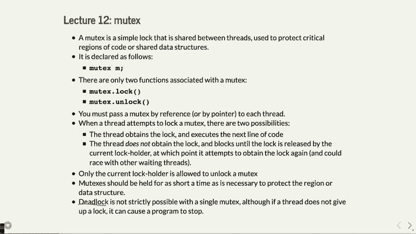

 that's the easiest class in the entire world is this thing called a lock guard。 And a lock。 guard is as simple as this。 It has two methods， a constructor and a destructor， the constructor。 locks the lock， the destructor unlocks the lock and that's it。 There are no other functions。 no other variables， nothing。 Okay。 Just， you know， locks that are unlocks it and that's， it。

 It takes a mutex as its parameter， so I guess that's the one variable it may hold as a reference。 to the mutex。 And what it's nice for is if you know that you are going to use a lock and。 then like leave a function or leave a while， the whole function， you might as well put a。 lock guard around it so you don't have to remember to unlock before you leave。

 It'll happen automatically， for you。 And it's nice in cases where you have conditional behavior where maybe your。 insides on while loop and you return from that while you're great， the lock gets unlocked， for you。 You don't have to remember to do it。 Or if you're out， if you break out of the。 while loop and then leave the function， the lock， the mutex will get unlocked for you as， well。

 This is a very nice convenience class to use。 If you know that you have to do that。 Sometimes you can't get away from it because you do need to unlock。 And again， don't keep。 don't put a lock guard at the top of your function just because it's nice to use。 If you。 know that there's other things you're going to be doing in that function that other threads。

 might want that lock。 That would be a bad use of it。 Okay？ But you'll see more examples。 of doing this。 Okay？ All right。 That's a lock guard。 Now， a conditional variable， any。

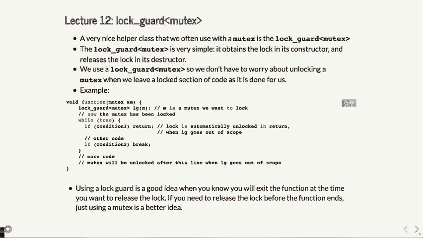

 This is the one that's a little trickier to understand。 Let's review what it does。 Okay？

 It works in conjunction with a mutex。 So you have a mutex and then a conditional variable。 any has the ability to wait for a signal based on that mutex。 Okay？ So， based on that， okay？

 So basically what it does is it takes the mutex and you lock the mutex and then you。 do a wait on that mutex which is this conditional variable， any that uses the mutex。 The conditional variable， any， will push you off the processor because you're waiting for。 something to happen and then it will unlock the lock。 So it's very similar to SIG suspend。

 in that case。 Okay？ You can think of it as an analogous to that。 But the user should always。 lock the mutex first。 Then you're generally going to check some condition。 Okay？ And you。 are going to， if the condition is met， you are going to go on to the next bit of code。 So this is where conditional variable， any， could be a little bit easier to use。 We will。

 make it easier to use in a minute。 Okay？ And when you get this notification， the， thread， the。 the wait function tries to reacquired that lock。 It may not be possible because two。 threads are waiting and if they both get a signal at the same time， which often happens。 when we do conditional variable， any notify all， CV notify all。 When those two get that。

 signal at the same time， they race to acquire the lock。 One of them gets it。 The other one。 just continues waiting。 Okay？ So that's the deal with conditional variable， any's， and， their。 their ability to， to do that。 And when the wait， on， when the wait comes out of the。 wait that you are not， you now have the， you have the lock again。 So when you get a signal。

 once you get the wait， then you actually acquire the lock again。 So you should unlock it later。 Okay？ That's how the conditional variable， any works。 We use this often to do permitting。 where you say I have these x number of permits and I have those number of， you know， y number。 of threads， which is more than x， trying to access this and I say only that many can do， it。 Okay？

 And the general idea is you're going to have something you're waiting on， the， permits in this case。 while it's equal to zero， you're going to just keep waiting。 And the， the。 the other function will say， increment the number of permits and then notify everybody。 Okay？

 That's how， and then that's when you would check， you would try to acquire the， lock。 you'd acquire the lock， you'd recheck the permits， see that it's one， go out of， that thing。 and then you would decrement the permits because now you've got your holding， one。 So the conditional variable， any， if you understand it， you go， oh， I see what's going， on here。

 There's lots of， you know， lots of nuance to say， or lots of incrementing and。 decrementing because you're trying to keep track of this one variable， which is a permits。 type variable。 Okay？ So that's， that's what you have to do。 That's what the conditional， variable。 any does。 Because of this weight being a really， or because of this while loop being， really common。

 well， they built into a conditional variable， any， the weight into another variable。 or they built that， while loop into a second version of weight， which works like this， it。 takes the mutex， just like the regular conditional variable， any weight， and then it takes a。 predicate， which means a function that returns true or false。 Okay？ That's the while condition。

 and it actually does it in the opposite way， which is， you can read it like this。 Okay？ And。 this is important。 If you read it， it basically this down here， and often we make that function。 into a lambda function because we can。 Otherwise， we'd have to call it as a separate function。 which sometimes is a little awkward。 But in this case， we just call， do it as a lambda， function。

 We say like in this case， C V weight on the mutex， on mutex M， we pass in the。 number of permits so that we can access it。 This is in the capture clause。 And then we， say。 return permits greater than zero。 So you can say， wait until permits is greater than， zero。 That's basically what this is saying。 Okay？ I like to use that， that， like， until， in this case。

 wait until permits is greater than zero。 Because it's really while not。 permits is greater than zero， keep waiting。 That's kind of what it really is。 But in this， case。 we just think， I just think of it as like， okay， well， when permits becomes greater， than zero。 that's when I can exit this wait。 Okay？ That's what we're looking for， the， untill part of that。

 Okay？ So that's how conditional variable n is work。 You'll see， those in lab this week。 and you will practice using those a bit in lab。 Okay？ But again， you still have to。 with using these conditional variable n is you still have to do the things。 like keep track of the permits directly yourself。 Okay？ And that's maybe or maybe not what you。

 want to do。 If you don't want to do that， well， we have another way。 Okay？ The next thing。

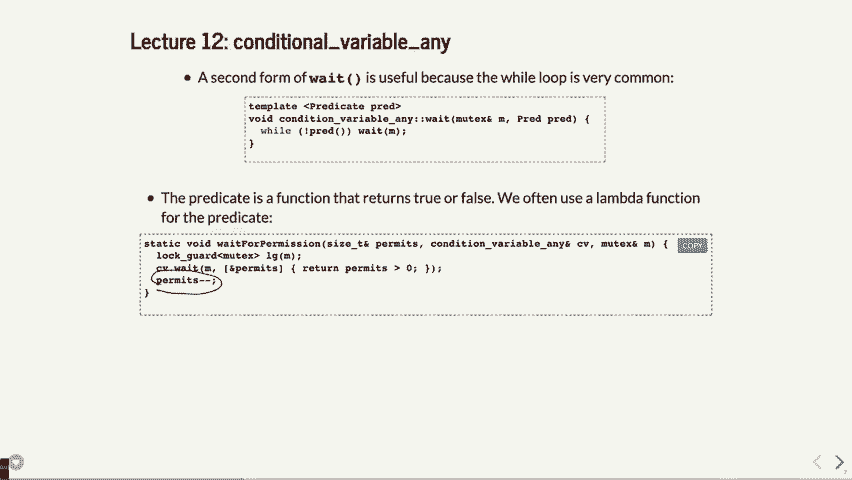

 we're going to look at is the semaphore class。 So a semaphore is also relatively low level。 although for whatever reason， it's not built into C++ for us。 Okay？ Why？ Could be because。 it's actually really easy to build。 We'll take a look at the code again in a second。 But second of all， once we build it， we can use it and we will allow you to use it for。

 the rest of the assignments。 We've already built it for you and I'll show you that。 But here's how it works。 It takes away all of that increment and decrement the permits。 and does it for you。 It's very nice。 Okay？ It's really easy to set up a semaphore。 Okay？

 You basically say semaphore permits five and that says there are five permits。 Okay？ And。 if you do permits dot wait， what it does is it looks and goes， oh， how many of the five。 have been used？ Oh， none of them？ Okay。 You get one。 And it gives you one and then it。 decrements the permits。 Now four are available。 All the way down to zero。 When there are。

 zero available， it just waits。 Okay？ And then when you say permits dot signal， that。 is you giving up the permit， telling anyone else waiting for the permit to， waiting。 for the semaphore， I have released one， go fight for the one I just released。 Okay？ And。 the only time that actually signal gets sent is when you go from zero to one because。

 that's the only way it matters。 Otherwise it will always be able to get the permit。 Okay？

 So that's how that works。 You can think of a mutex as a special case of a semaphore。 with one permit， kind of。 Okay？ You shouldn't， in fact， if you go look at this up on like。 stack overflow， there's lots of people saying， don't think of it that way。 That's not a good， way。 It's not exactly the same。 Some people have said， oh， this is exactly the same。 It's not， really。

 But you can think of it as being one permit， except that now you can actually do。 a signal when you're done with it。 And the interesting thing about a semaphore is you。 can signal from， well， you don't have to be the one acquiring the lock to signal。 Like。 that's the big difference there。 Mutex， the only person， the only thread that can unlock。

 the mutex is the one that locked it。 That's kind of the other difference there。 Okay？ Now。 a couple things we didn't talk about， semaphores。 What would a semaphore。 initialized with zero mean？ What do you guys think？ If I do the semaphore， initialized to one。 it would mean there's one permit。 And if I do a semaphore， two threads， fighting for it。 And one。

 they both try to get it， one will get it， then when that one， signals， the other one will get it。 What would a semaphore with permits of zero mean？ What， do you think， Cosner？ [inaudible]， Well。 so it's a good question。 The question is， would it just hang？ If you had two threads。 trying to get there， it would， they would both wait。 Until what？ What do you think？ [inaudible]。

 Only the parent can access the data。 Not quite。 You're on the right track。 Somebody else has to do something。 What do we say locks for mutex？

 The only thing that can release the mutex is to unlock it， is the one that locked it。 Is that true for semaphores？ No。 Anybody can signal on a semaphore。 Right？ So this。 so you're getting there。 Anybody else want to take a step at what this， actually means？

 This is actually an interesting case。 Yeah， go ahead。 [inaudible]， Yeah。 you're waiting for some other thread to signal you。 And it doesn't matter if the other thread。 never needed to wait for that permit necessarily。 Right？ It's just a way to say， hey。 let some other signal， some other thread signal me。 Is that what you're going to say as well？ Yeah。

 there you go。 Okay， so that's what it is here。 We don't have any permits necessarily。 Okay？

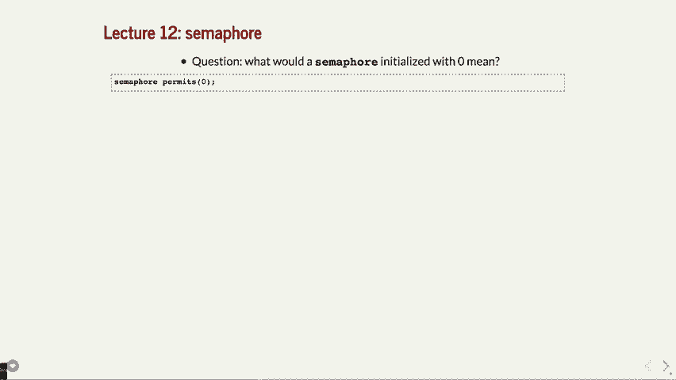

 The permit wait means you just have to wait for a signal which can come from any other thread。 I'm going to show you an example of where this is another case of this where it's actually more interesting。 Yeah。 [inaudible]， Yeah， any thread can say permits。signal。 Okay？

 It doesn't matter that it didn't have any locked begin with。 It might be that your logic says， hey。 this thread， this one thread needs to wait for something。 In fact。 I'm going to show you an example in a second where it actually is useful。 But it might say this thread needs to wait for a whole bunch of other stuff to happen and it's going to。

 one of them is going to signal it。 When it finishes， it just waits。 It doesn't have a permit necessarily。 It doesn't need to lock anything until it just needs to get the signal。 It's really what it needs to do。 Okay？ I'll see that in a second。 My next question is what if you then it said permits negative number？ What does that mean？

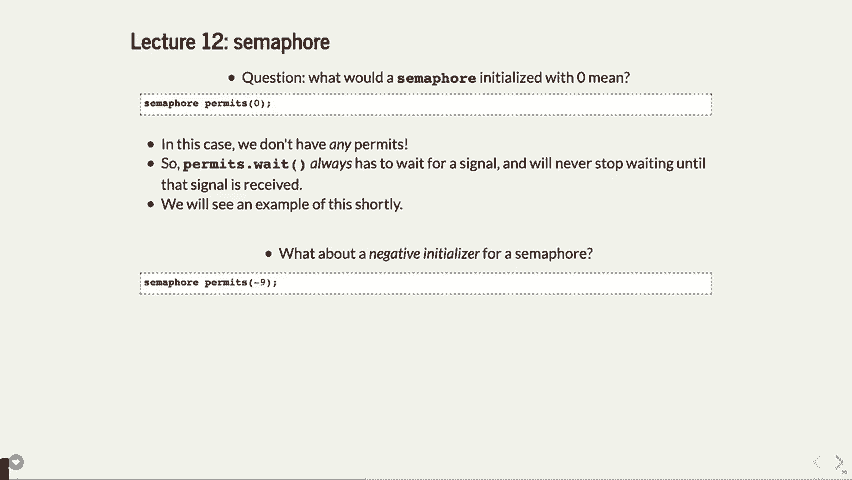

 Let's look at the code too。 What are you going to say？ What are you going to say？ Yeah。

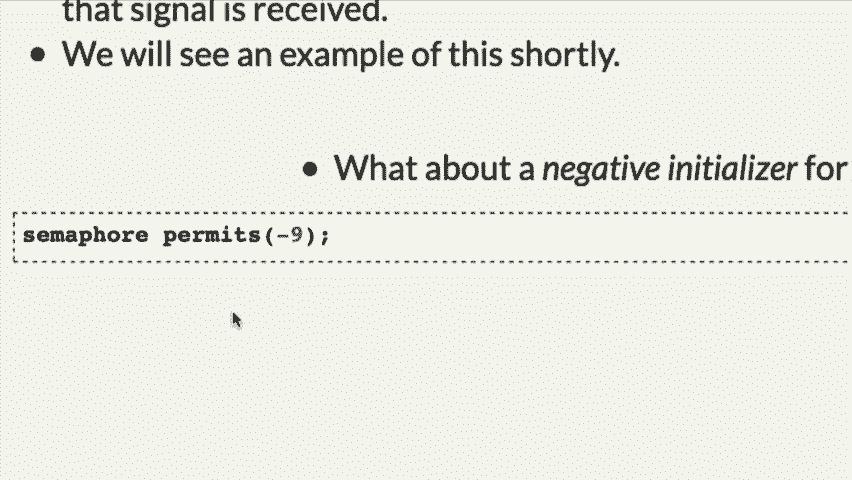

 [inaudible]， Yeah， that's exactly where that many different threads need to signal before it can actually do anything。 Let's go look at the actual code for semaphore。 I've got to remember where it is。

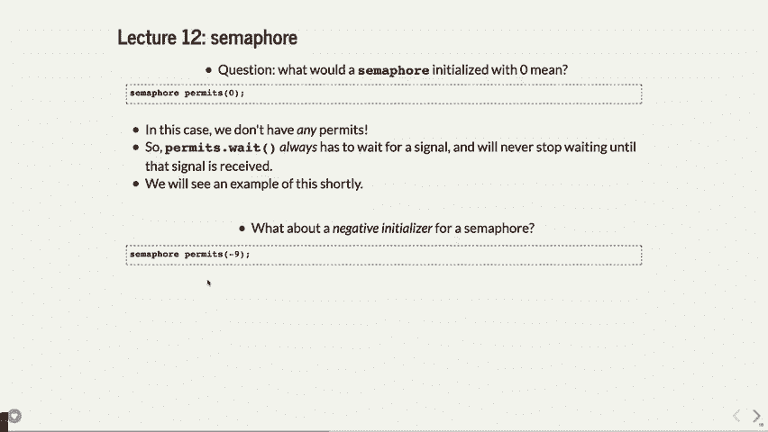

 Let's see， slash user， slash class， CS110。 I think it's local source， I believe， and then threads。 There it is。 Okay。

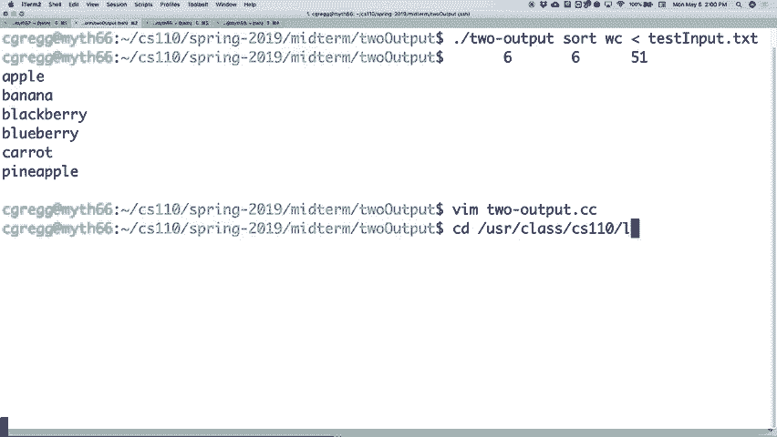

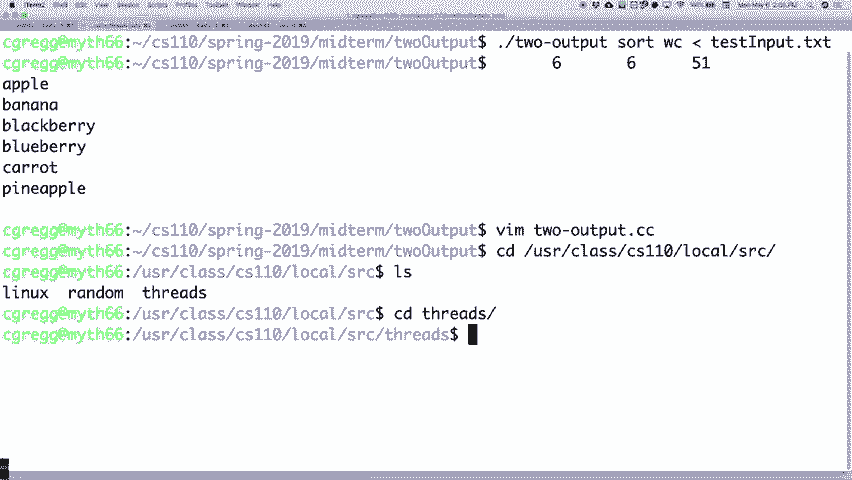

 Semaphore。cc and you can all go look at this。 Okay。 Let's look at how this actually works。

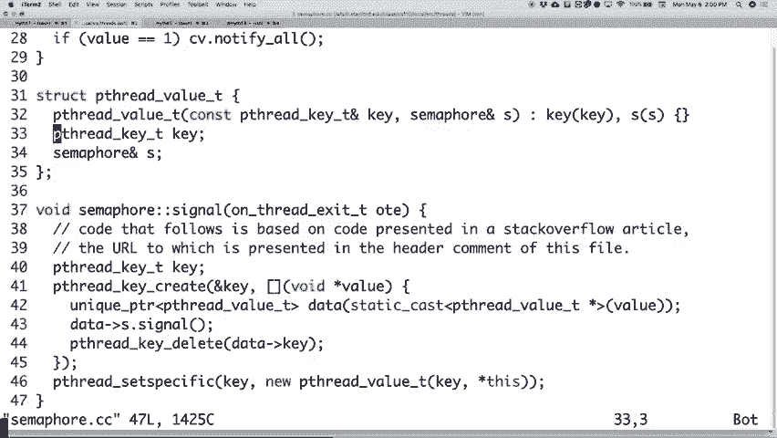

 By the way， it's got a bunch。 It's got a CV in there。 It's got a conditional variable because that's how we built it。 Let's look at the weight and the signal。 Okay。 Weight does the following。 Okay。 Weight has this new text that it actually tries to acquire because it does need to update that value。

 Okay。 So you have to have that lock in there in some case， in some sense。 Okay。 Then it does a CV weight and it does basically wait until the value is greater than zero。 Okay。 And then it decrements the value once it actually acquires that lock。 Okay。 That's what weight does。 What does signal do？ Well， signal acquires the lock。 Okay。 And then increments the value。

 And then if the value becomes one， it notifies everyone。 Okay。 Yeah。 [inaudible]。 MutexM is a class variable。 Yep。 It's a class。 If you look at， let's see if I can do this。 Actually。 we'll do it here。 Let's see。 It's there。 Include。

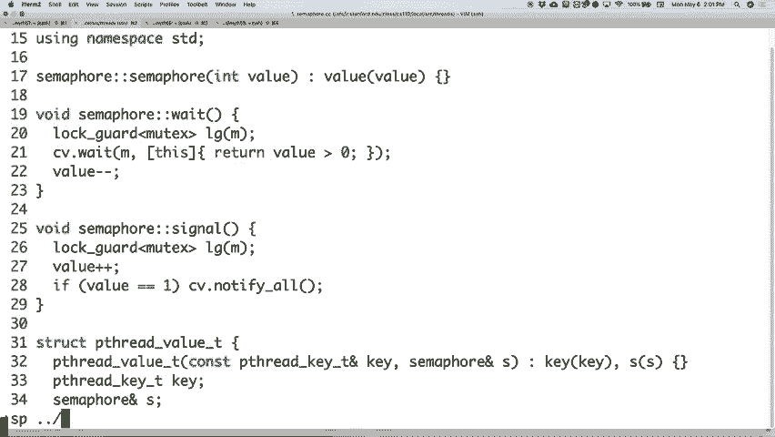

 Some four dot eight。 There we go。 It is a， there it is。 It's a class variable。 Right。 So when you create this， when you create the class， now you've got the mutex in there。

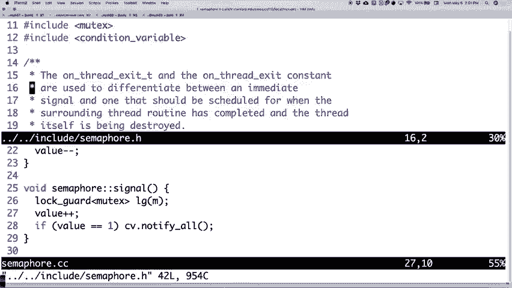

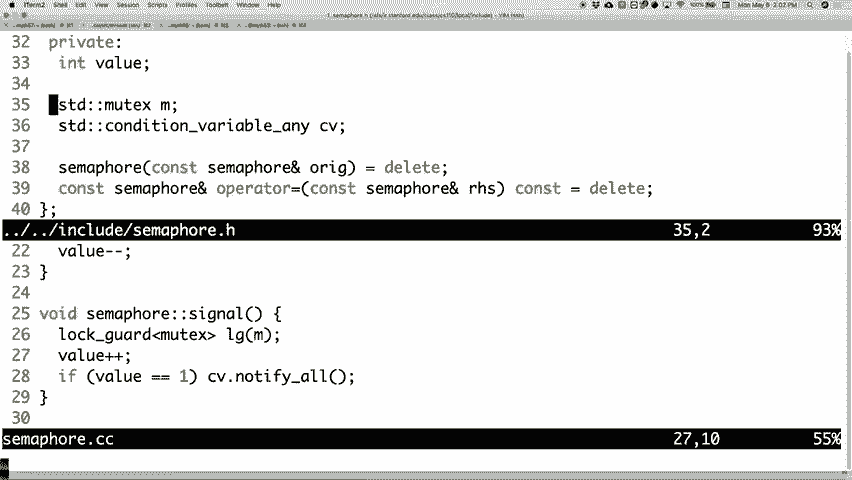

 So it's shared between the functions。 Okay。 All right。 So that's how signal and weight work。 Well。 notice that if the value， it's only， it's really only either incrementing or decrementing that value。

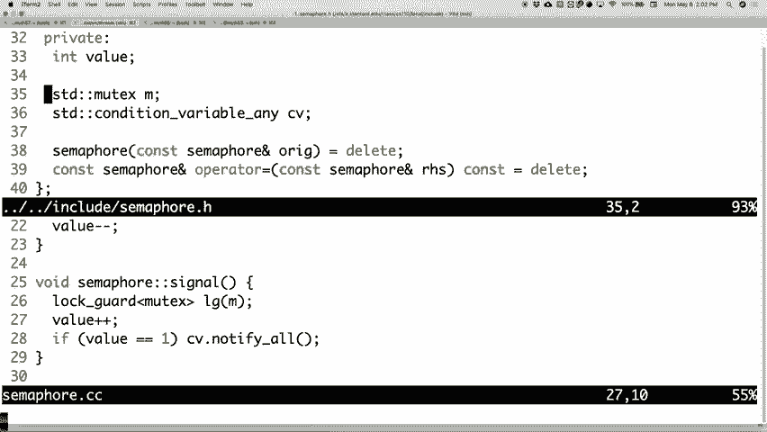

 So if you start that value off at some negative number， well， it's going to take a whole。 but that number kind of minus one number of signals to get up to one to actually。 to actually notify the weighting threads that it's actually been done。 Okay。 So what might this。 what is a， an example of when you might need this？ Well， what if we did the final？

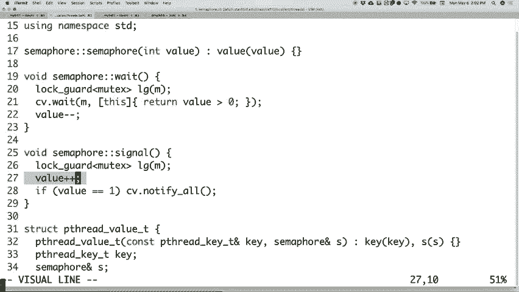

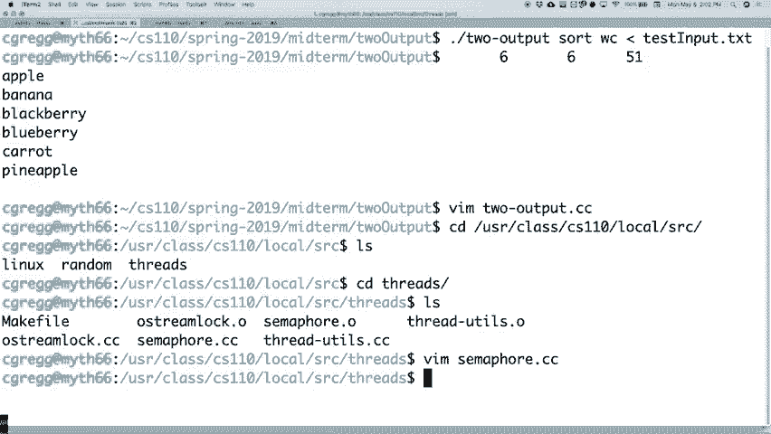

 Okay。 Let's say we had a program where we had 10 threads we're creating and they each need to do something。 And then one more thread needs to wait for it to actually proceed with its thing。 Now。 you could do something like join all the 10 other threads and then do the next thing if you wanted to。 but maybe you want to keep those threads going。 Maybe you don't want to。

 maybe you want to do other logic that's going to eventually， you know。 do something else in those threads or something like that。 So what you can do in this case is you can say， let's actually go and create these threads and then each thread does its thing。 In this case， it's just going to do a see out。 And then it's going to send a signal on that seven for it。

 And these， these thread has no idea which like number it's incrementing。

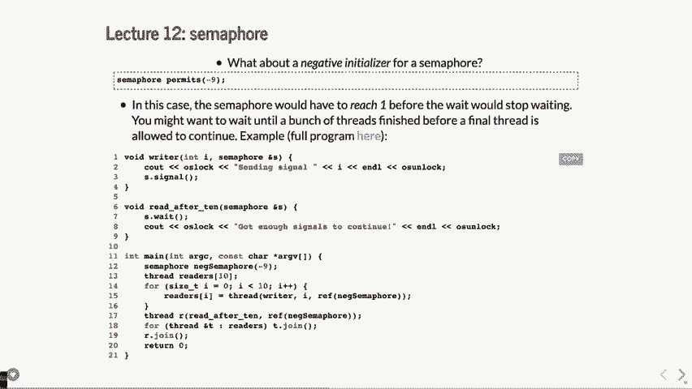

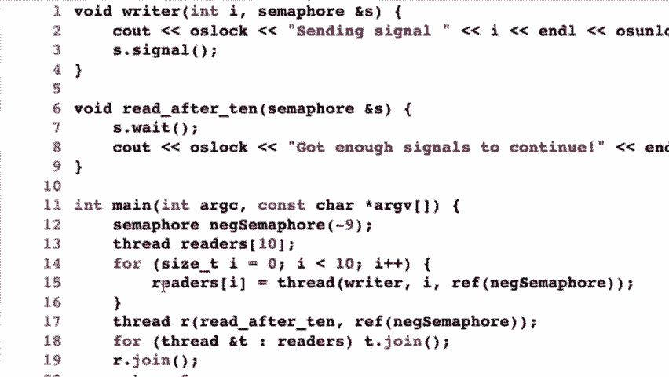

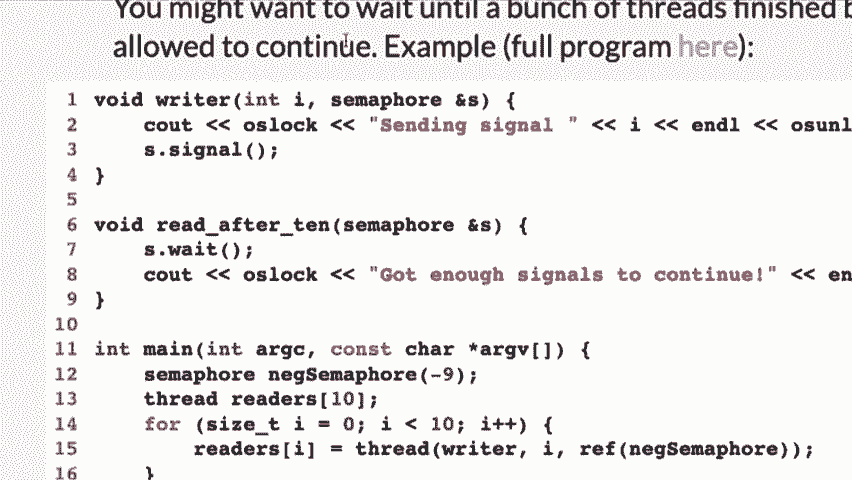

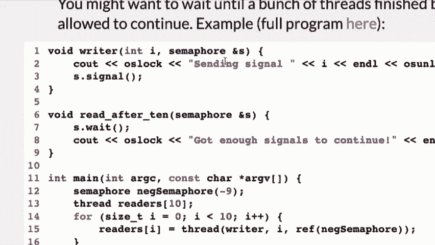

 It's because look， I'm done with my stuff。 I'm signaling anybody cares。 I'm done。 And it signals it。 Right。 And then the read after 10 function here。 Well， it just waits。 And because we。 we started out this semaphore in this case， negative nine。 Okay。 Once there's 10 things that happen。 it gets incremented to one。 And that's when the signal， the way it happens。

 And that's when the actual semaphore will allow the， like to continue。 By the way。 bring you back down to zero as it turns out。

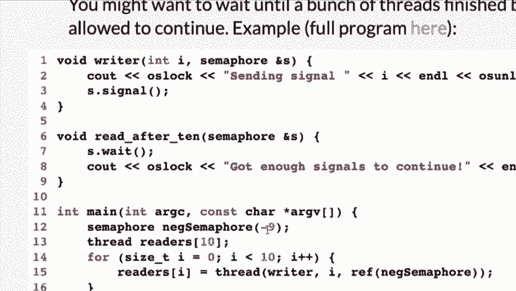

 But that's a way to do a signal like that through a thread that makes it so that you can do 10 things in a row。 And the last one gets to work last like that。 So let's try this。

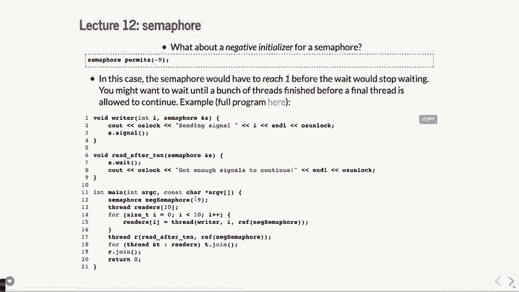

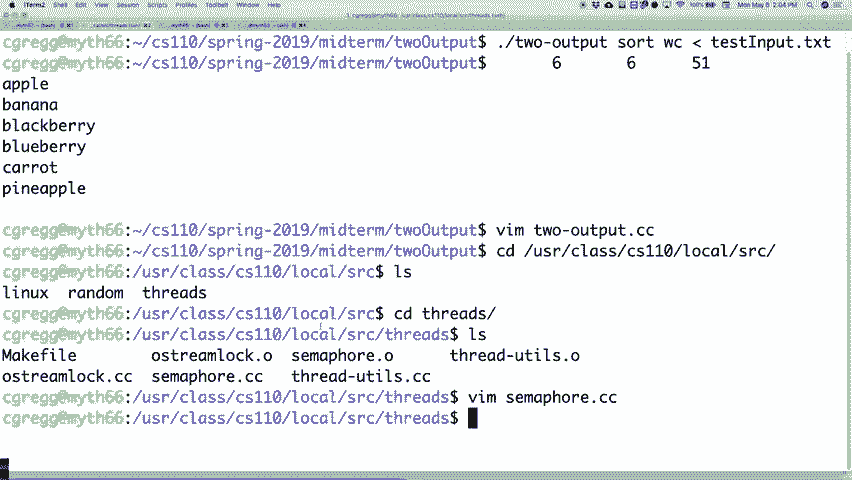

 Let's see。 My lecture。 Red。 CPP。 I think it is negative semaphore。 Okay。 So it's negative semaphore which should be exactly what I just said it is。

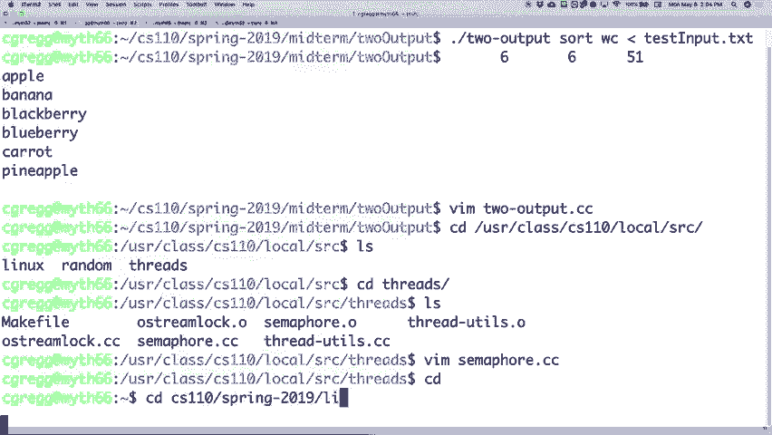

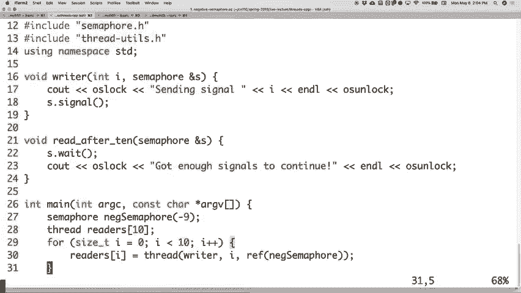

 And there's where， by the way， there's where we're creating the semaphore negative nine。 Okay。 And then passing that semaphore is reference into all the other。 all the 11 threads we happen to have。 And negative semaphore， there we go。

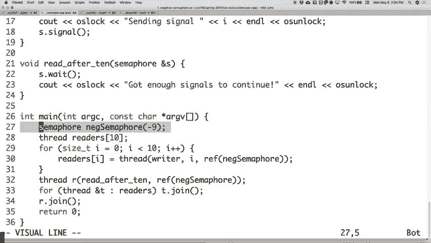

 So the threads， they all did in their own order， which they're going to。 Each one signaled after it got done。 And then when the last one received all those signals。 it proceeded。 And that's how it worked。 Okay。 So questions on the new kind of way we might use。 So we're going to see an example in a second。 A bigger example in a minute。

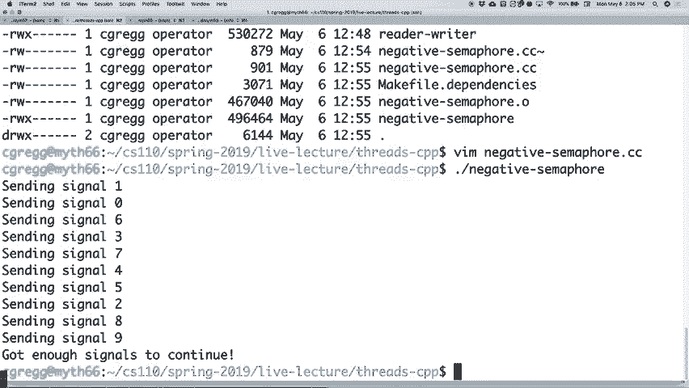

 Alright。 Three different types。 Mutex， conditional variable， any semaphore。 We will use conditional variable any less frequently because we've got semaphore。 You will still use mutexes a lot。 You use those two much more than conditional variable any on its own。 Although you may have a reason to use that at some point。

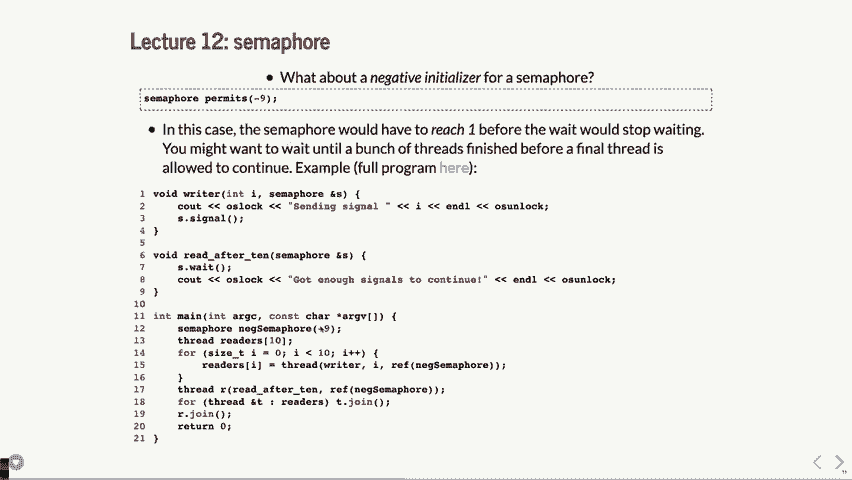

 Okay。 Let us talk about another pattern here。 So here's a pattern that's going to come up occasionally。 And this is going to leverage the fact that we can use like zero， not necessarily negative。 but we can use zero for our semaphore to go。 Okay。 It also can be kind of a way to not have to use thread join until you absolutely need to。 Okay。

 So here's what we're going to do。 We're going to look at a program that has two threads that are both acting on a particular data structure。 One of the threads is writing things to it。 The other thread is going to read from it。 Okay。 And it's in fact going to read the data that was just written。 Okay。 It's very similar to a pipe。 Okay。 In fact， pipes may use some of this kind of under the hood as well。

 But it's very similar to the idea of you're writing some data and another one's reading the data from that data structure。 Okay。 It's kind of like a web server and a client where the client to the web server like you type in www。google。com。 That request goes out to the Google server and Google gives you back the data。 There's kind of a handshake there where you're requesting something and then the data has to come back。

 It's kind of like that。 And we will do more of that。 If we get time today。 we'll see another example of that as well。 And as I said， it's kind of like a pipe。 Okay。 Here's the initial program that I will zoom up and we'll look at in a little bit of detail。 Okay。 How many people remember， well， you remember cues from CS106B？

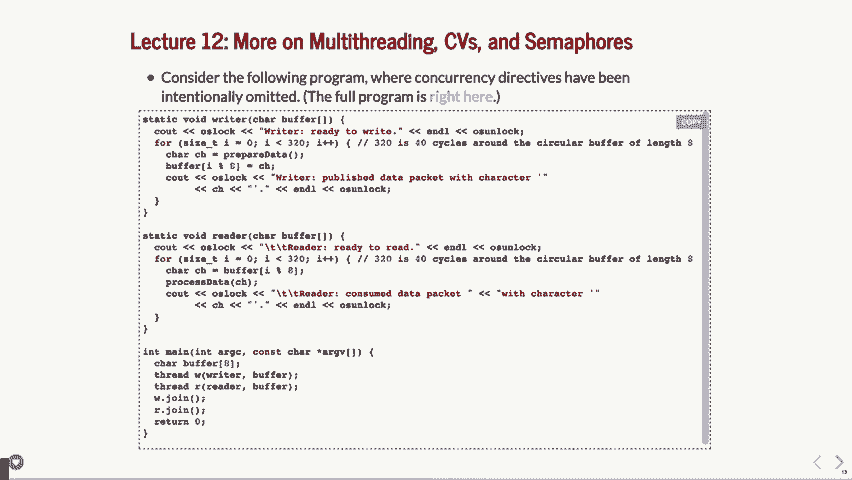

 You ever talk about like a circular cue or a circular buffer？ You may remember those。 Okay。 Well。 some people do。 And if you took 170， you definitely don't know those because I know it's part of the assignments。 Here's what a circular buffer is。 Let me actually un-zoom and draw a little bit here。 I can。 Hey。 look at that。 So， one from last time。 Okay， clear。 Okay。

 My horrible drawing skills will come back again。

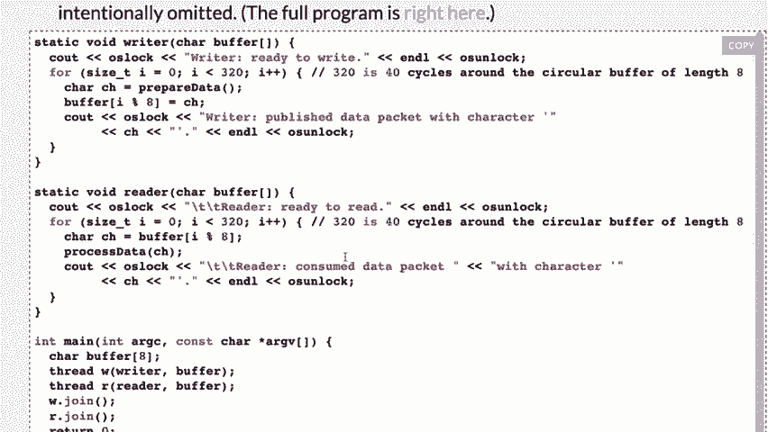

 Okay。 So a circular buffer is simply like this。 You can model it like this anyway。 You can think of it as a circle if you want to。 But a circular buffer is like if you start writing here。 the next place you're going to write is here， then here， then here， then here， then here， then here。 then here。 And then you just wrap around and continue to write here。

 So you need a head and a tail more or less。 Okay。 In fact。 you can keep track of that in your program with just a mod operator to keep track of where in the actual circular buffer is。 So you can have the buffer partially filled or whatever。 The next place you write is here。 And let's say that one's filled， that one's filled， that one's filled。

 I guess if you're next when you're writing is here， this was not filled yet。 And so forth。 But the idea is， let me erase that like this。 So let's say that everybody else up to here。 Let's say it was like this was filled。 Let's say that was filled。 That was filled。 We're about to write here。 We would then fill this one。

 We would then fill this one and then come over here。 And this would be the next one。 Then we'd fill this one。 And then we would， the next one would be filled with over here and so forth。 If you ever get to the end where it's completely filled。 you should not continue to write to it because it's too full。 That's a circular buffer。

 And it makes it nice instead of having to create nodes at each time and walk through them one at a time。 You just have one array and go through it in a circular way。 Okay。 Anyway。 that's what a circular buffer is。 So what we're going to do is we're going to write a little program or look at a little program that has this circular buffer where one of the threads is going to be doing the writing。 And the other thread is going to be doing the reading。

 And it's going to hopefully keep track of who's writing where such that and reading so that it doesn't ever trample on the other one or read data that might not be available yet。

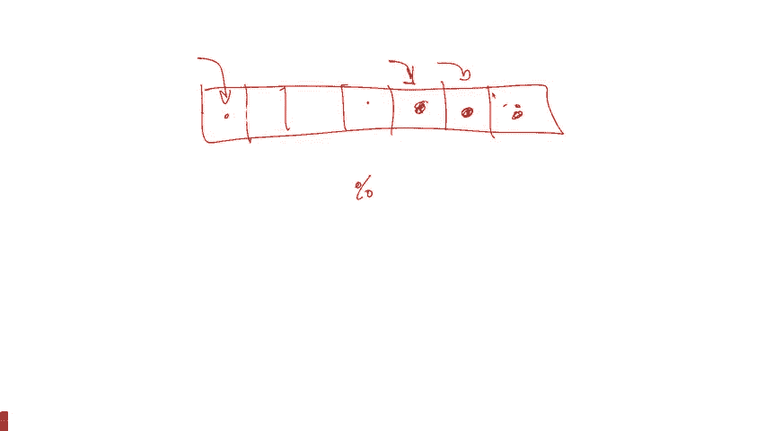

 Okay。 So what does that mean in terms of this program？ Well。 let's just look at how the program is implemented so far。 Okay。 We have a writer。 which basically is going to write random characters。

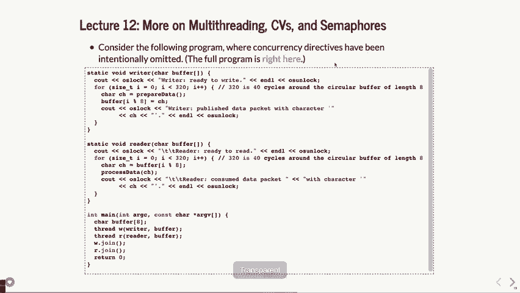

 It's going to randomly add a character and it's going to randomly put it's going to put that character into the buffer one after the other。 And it's only an eight buffer with eight positions in it。 But we're going to do this 320 times。 Okay， so it's going to write right and then wrap around and write right right right right right right right right。 Now， if everything went correct went well， the reading and writing would happen at the exact same rate so that you could do that。

 And then the writer might be a little bit ahead of a reader and they would keep going in that circular pattern。 That would be ideal。 Okay， but it's a very simple like thing that's happening here。 It's just taking that random character， putting it somewhere in the buffer。 And then when the i variable gets bigger than bigger than seven。

 it wraps back around to the beginning and keeps going。 And it just does that 320 times putting the data in there。 Okay， that's what it does。 No one it's done。 It says or actually each time it says that it's put that data in there。 Okay。 The reader does the kind of the reverse。 It goes through and it reads the data one character of time and then just wraps around and keeps reading data。

 Okay， so in a perfect world， the writer might be one or two steps ahead of the reader and everything would work perfectly。

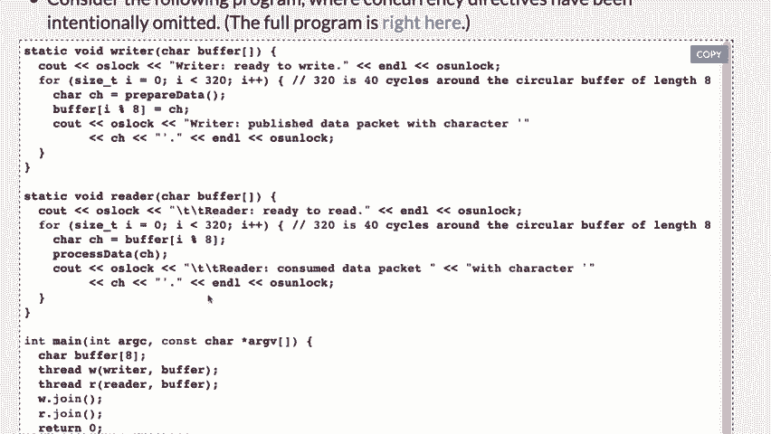

 Okay， and these are in different threads so you might think， oh， there's a raised condition here。 Ah， there is。

 Let's actually look at it here。 Okay， this is called confused reader writer。 Okay。

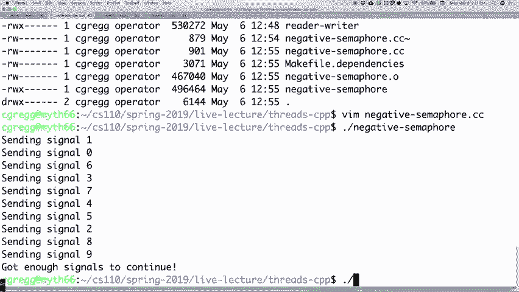

 And remember it's taking random characters and then writing them and then reading those random characters out。

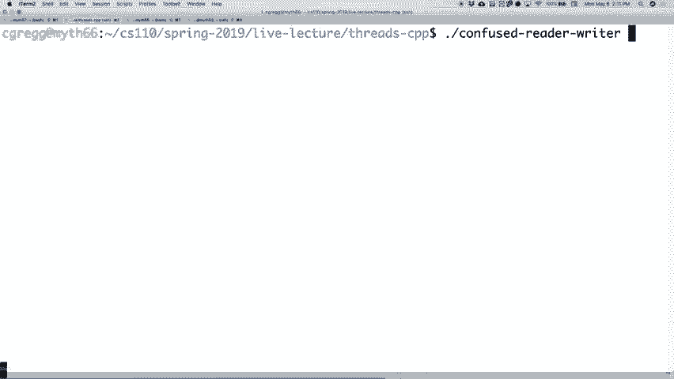

 So it's going to look a little funny here at first。 I will actually stop it while because it's doing that。

 Let's look at what's happening here。 Okay， so the writer is ready to write and the reader is ready to read。 And the writer publishes S。 Okay， well the reader and then the reader consumes sphin。 What's going on with that？ And then it says the reader consumes G and then the writer wrote in J and the reader consumed at。 Well， what's happening here is the reader is trying to read before the writer has ever even written anything and whatever the garbage was in there to begin with is what gets read out。

 Okay， and so eventually and then it reads consumed data with like nothing and blah blah。 I can't even write it。 Eventually you might see some of the data getting in there but it's all garbled and the writer is writing over parts and it's not working the way we want it to。

 Are they writing to and reading from the same file？

 They're writing to and reading from the same buffer which is just a charged dog buffer。 You don't worry about any cursor。 You don't worry about any cursor。 We kind of are worrying about the cursor。 Let me go back to the drawing again。

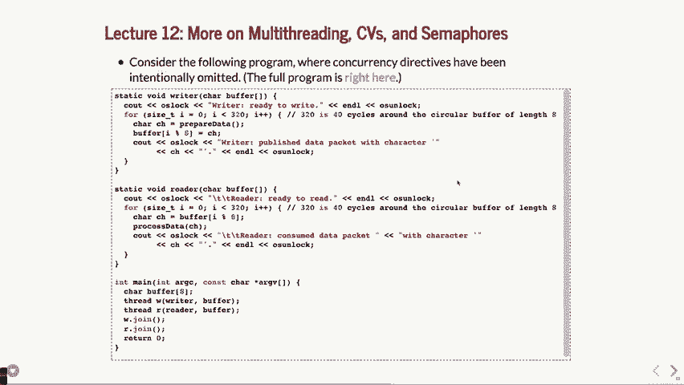

 Let me actually redo the drawing like this。 Here is the buffer。 Let's do it in a little more。 Let's say that one， two， three， four， five。 Let's only say there's six places。 Let's say that this is where the first read is going to happen but it's also where the first write is going to happen。 Let's call this the read head and the right head there。

 Where is the last thing that could possibly get read？ It turns out this is well。 like if you go all wrap all the way around but that's kind of a nuance。 But for now let's think about it。 Let's say that the writer tries to read first。 Well it's going to read garbage here。 So that's going to be garbage if it gets ahead。

 Let's say the writer did get to write A。 Okay the writer writes A and then the writer writes B and then the writer writes C and D。 Let's say the reader is nice and starts reading now。 Well the reader will read A and then be here and the reader will read B and B there and then B there and the reader will read D。 et cetera。 And let's say E， F and then it comes around here and reads G。 Well good。

 Let's say the reader for some reason stalls reading right here。 Well this is G and then this is going to be H and then this is going to be I。 it's going to be J before the reader ever reads it。 So that's the big issue here。 Okay if they're not in perfect sync they're going to be in trouble。

 Okay now the perfect sync is actually a little bit nuanced as well。 To be perfectly sync how many things can get read before anything's written？ Zero right？

 You have to write something before you can read any of it。 So things can be written before something must be read。 The max number of things right？

 So you could write all the way to the end here before going back but if the instant you go back if nothing's been read yet you'd better wait。 Okay so that's going to be the idea of what we're going to do with this program here。

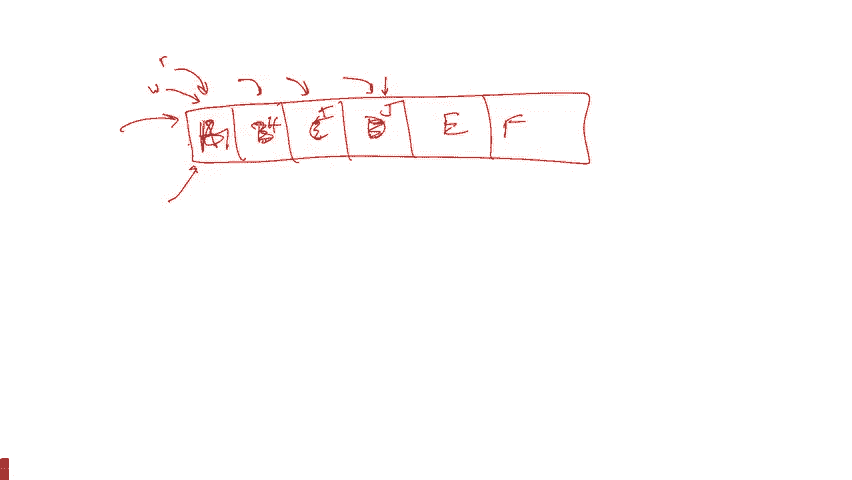

 Okay so anyway we go back and we look at it again and we go out。 So we go back to the completely garbled。 Nobody's in the right order。 It should have been。 it should have read SJCNN。 Let's see there's an SJCNN。 It did read it starting down there but eventually there's not necessarily in sync。

 A bunch of stuff got read first and whatever。 Not so good。 Okay how can we fix this？

 Well there are different ways of fixing it。 Okay you could。 you probably could use a couple of mutexes maybe if you wanted to and try to set it up like that。 That's the one way of doing it。 One， the way I want to show you is by using two semaphores。

 Okay what we're going to do is we're going to， this is actually kind of what we just went through。 Why it's broken。 There's nothing basically， there's nothing that tells the reader that a slot can be read from yet。 And there's nothing to tell the writer that all the slots are full。 That's the big problem。 Okay all right so what can we do？ Well we can have two semaphores。

 Okay if we have an eight character buffer we can initialize an empty buffers to eight。 In other words it starts out with eight empty buffers。 There's eight spots that are empty。 So far so good。 Okay and then we can also set up a semaphore that says full buffers。 Well how many are full initially？ Zero。 So let's do a semaphore starting at zero which is that weird case where it's always going to require a signal to at least get going。

 Because it started with no permits available and it's， that's what's happening there。 Okay so we can do that。 We can set up the semaphore full buffers and empty buffers。 The full buffers， if you say a semaphore with no parameter it starts at zero。 Okay if you do an empty buffer， if you do the parameter here that's how many permits there basically are。

 And this one says there's eight empty buffers。 Then you have to of course pass both the full and empty into both the reader and the writer because they're both going to be handling both reader and writer。 One's going to be waiting and then signaling the other and the other's going to be waiting and the other one and signaling the first one。

 So that's where we're going to have to be working on。 Let's see how this works in the actual functions。 So what do we have？

 All right we've got the full and the empty semaphores here。 Okay we are still going to do the same logic as before。 We're just going to do the for loop through the entire buffer。 The first thing the writer is going to do is it's going to wait on the empty buffers。

 But we initialize those to eight and for a semaphore if the count is eight permits will it wait at all？

 No it says great。 I can start writing。 And so boom it starts writing and then it tries to wait again and now there's seven available and boom it starts writing and that's that。 And we'll keep going。 After it writes a character it signals the full "hey there's a character I just wrote"。

 So that increments the full counter in the semaphore to one and it signals because it incremented to one and it signals the other thread。 Hey there's something available I just put something there。 Okay。 All right let's look at the reader。 The reader does kind of the opposite。 It still goes through the loop and does it starts by waiting for full。

 Well nothing's full at the beginning so reader has to wait at least one iteration of the writer putting something in there because the semaphore it's using starts out at zero。 Okay。 But then it immediately gets a signal once the first thing goes into the writer or runs the writer writes one and it originally immediately gets a signal and can read it immediately。

 It might be just one step behind because maybe the writer hasn't written the next one yet and then it then it does that the wait again but it will do it immediately when there is a spot available。 And there may be many depending on how many the writer wrote in。

 There might be there might be many in there up to eight。 Okay。 And then let's see。 And then it signals empty saying hey I just emptied one and that's when the the empty which the writer when it's waiting could end up going forward。 Okay。 So this one by the way will do this up to eight times without the reader doing anything。 And we can test that as we go and then it will it should work。

 So this is now how the semaphores are going to be useful to us to keep everything in order。 And then actually look at that one。 This one is just called reader writer the correct one so I'll let that go in there for a bit。 And let me just zoom up to the top here。

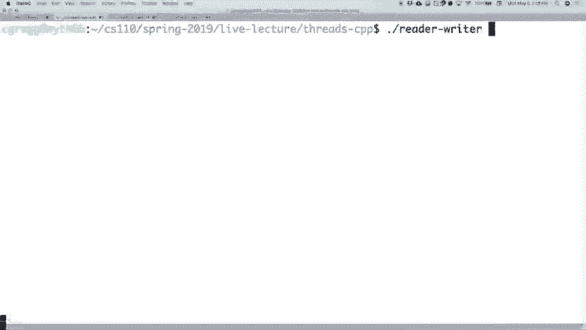

 Okay。 The readers or the writers writer writing the readers ready to read。 Great。 The writer published a well guess what the reader immediately consumed a。 And there's by the way I shouldn't have said this to the sentence before。 There's random sleeping going on here too so that that this is you know why it is just one after the other because there's some random sleeping going on here。

 The reader got a in order and then why goes in and then why comes out and then W。 I。 Q。 W。 Well it must have been that the reader went to sleep for a while because the writer got a chance to put four new things into the reader W。 I。 Q。 W。 But what gets read out。 Oh good W。 I。 Q。 W。 Gets read out。 So we know it's going to be in order there。 And then it continues going through。

 I'm not sure we get to a point where we might get to a point where eight things go in and it waits that long but we can we can do that but anyway it is definitely going to do it in order。 Okay。 Make sense。 Everybody why that's the case。 It doesn't go back and look at the code again and remember go look at the semaphore code and see how that actually works as well。

 All right let's look at the code yeah。 Does it matter if you join the reader writer first。 Yeah good question does it matter if you let's actually look at the the actual code here because I didn't put that in the one main again down here。 Does it matter which one you join first I don't believe it does why because as long as they all get to finish then the buffers will be will be filled in that case right。 If you try to actually。 Let's see if you try to wait on the reader first。

 There might get that the writer ends up let's see tried to wait on the read it might be might be that you have to do it in order just because you have to write before you can read and if you wait on the let's see if you waited on the reader first you might end up not being able to read it all and therefore。

 I don't think about it more yeah I don't think about it more but I don't think it's actually a race just in that case the final waiting it might be I'll get back to you on that。 Yeah good question yeah。 Yeah so I mean we can try it I don't know that's a good we can absolutely try it but I don't know that it's going to prove our case will prove the negative but let's try it。

 Okay and then read a writer there we go okay let's just see if it goes all the way through it would only happen near the end we would care because one would end before the other。

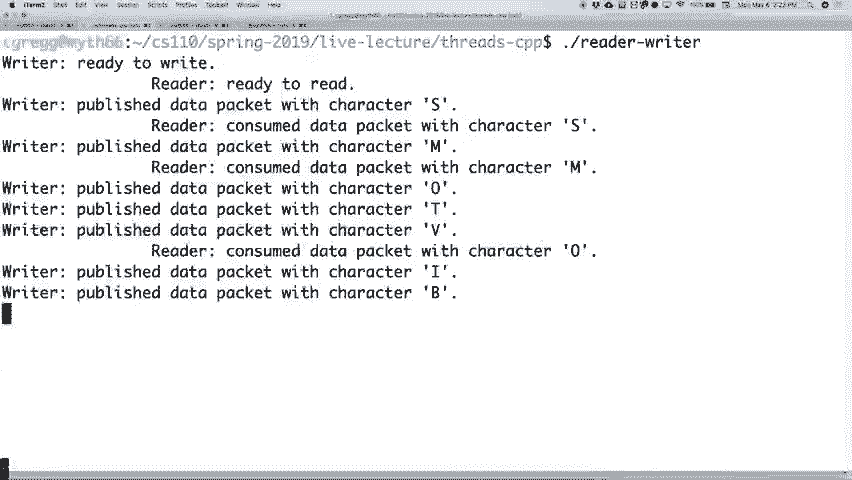

 But no again not only think about it I don't think it's possible for if one ends and it's waiting for the other who cares if it's waiting for the first one and hasn't ended yet who cares so if the data hasn't come the other one wouldn't have ended yet so I think it doesn't matter。

 I'm pretty sure I'll confirm that but it did finish so at least we know that it can work but again these sorts of things don't。 Let it let's do this though let's put in on just a little bit more waiting we'll put in let's see let's put a let's put us。

 Let's put a little sleep for in here for like three seconds right before it even starts to try to read。 This is going to mean that the writer is going to try to put it's going to put eight things in there and then hopefully it will wait。 Let's see if that works。 Okay there we go so it's put one two three four five six seven eight things in there and then it went going after the reader finally woke up and I'm going to start reading some things。

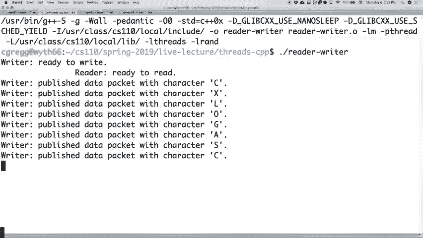

 That's how that works。 And the other way if we put the if we put it in the writer or rather in the yeah if we put it in the before the writer what's going to happen here。 What do you think if I put the sleep there what's going to happen now。 What do you think it should wait three seconds before doing almost anything right because the yeah I think that's a good good good answer。 Make reader writer and then we're going to there we go okay there everybody's ready then finally the writer starts writing up three seconds then boom it goes。

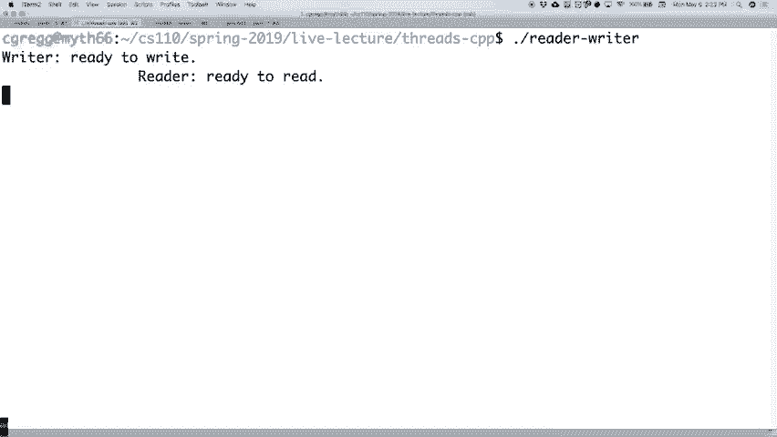

 Okay nothing's ever written the reader can't bother to or can't do the reading in question。 Good question how does it get nine there let's actually run in this case and see what happens if we get a whole bunch of it。 Did it do nine or it might just be probably just a race condition would who would write in reading that's my guess。 It can't read nine without nine with it can't read nine a row because there aren't nine spots right but it's probably the last right the reads already printing out or isn't printing out yet or something like that so it's just a race condition there。

 If it were like 20 I'd be a little suspect but I think eight or nine or ten not one two three four five seven nine yeah last one and it did do two S's at the end so that wasn't a weird。 So I think it's just that the it's probably just a race condition there it's also that maybe the writer's got a little more is writing a little faster than the reader anyway and the readers doesn't never quite catches up until the last part goes out finally I can read all the rest of the data。

 There's no questions。 Do you have more questions？ No you're sure？ Okay。 Anybody else？ All right。 So that's the that reader writer paradigm。 Let's reach out。 All right。 I think we have time to take a look we may not get to the whole thing but let's take a look at this thing called myth buster。 Okay this is a Jerry Kane special it's called myth buster because what all it does is it basically you ever log on to a myth and you go wow there's a thousand other people on here and it's really slow and it's kind of annoying and maybe it'd be kind of nice to know which myth has the least number of like CS one ten people slamming it。

 Okay。 Well that's what this myth buster does。 Okay basically goes to all I guess 10 or 12 myth machines and it queries them using a kind of a wonky hack to actually see how many threads for people in this class are using that。 Now I also think it should check one oh seven or just in threads in general but whatever it checks this class。

 Okay。 Now I'll show you it running before you anything else。 Okay。 Myth buster let's do it concurrent that's the one we don't love but okay。

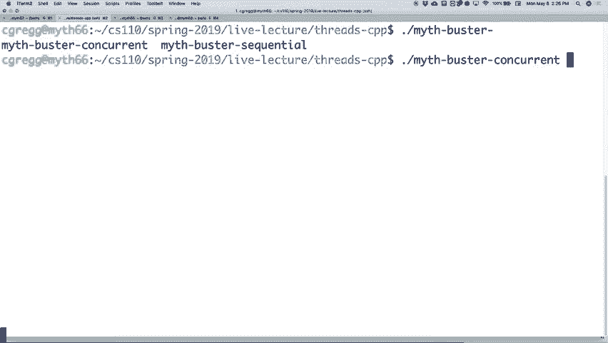

 Okay so holy smokes who's using all these processes。 What is this？

 Machine and there's a little race cushion there anyway with a number of least oh no machine least loaded by CS machine number process and least loaded machine 74 so if you were to use it you would want to log on a myth 52 but I'm actually really curious myth 65。

 As to say it's myth 65。 Myth 65 h top let's see。 Okay somebody's let's see so there's that let's see factor Python factor。 Who is this？ Emma you have a hand。 Okay so you left a whole bunch of factors like going in your program possibly when you when you started。

 I don't mean to call him out but she's happy to look good we could there are thousands of them so you said it's not alone I guarantee you that there there's some more。 Okay there's some more。 All right let's see if we can find a bunch more。 Yeah there's a bunch more so so yeah so you should kill all your processes so I literally when I when I ran this earlier I noticed some of these and I'm going to have to write a little note to next quarter make it so that every time you submit it just kills all your outstanding processes that are still running on whatever myth going you have because。

 that's it so anyway that's you guys are all doing that and those poor 107 students can't use the myth machines because you're neither can you so Emma what you can do by the way is you can say I think kill all Python it will kill all your Python things on that。

 that machine I believe you can try that and see if it see if it works and maybe it will do that and if we're all nice we can do that the good news the good news by the way is that all these processes while they are taking up memory they should all have tea under the status which actually means stopped so they're not actually spinning which is good so thank you for not like running spin。

 But but yeah that the it they're generally not good to like happen sitting there doing nothing until the machine reboots that's kind of what's going to happen so anyway but anyway that's what myth buster does and myth buster runs somewhat slowly in that it has to pull each。

 And so that's the concurrent ones this is the fast one the sequential ones ones going to be slowly that was nice fast one sequential one is going to be slowly because it has to do each one in order and it's just got to go and do this query and thing some of the myth machines by the way are down or like not available for us is aging into for whatever reason and it has a two second time out on that so it has to wait for that。

 And so this mean well the concurrent one which was much faster did it in threads。 Okay just said oh I'm going to have a different thread asking this myth machine how many threads or how many processes and if it takes a little while great some other ones are still going to be running。

 You'll notice it's out of order we could figure out how to order it a little bit better but you have 56 52 58 etc。 This one at least is in order and some are missing because it's not they're not like myth 57 is down or whatever but maybe it should just say myth 57 is down。

 But the point is that you do it concurrently it's slow once you have threading you can wait for all those servers to reply to you or for a broken down you can do that。 So let's take a look at some of the code for this。 Okay here's the various data structures we're going to have。 I happen to make an idea list of all the student's soonets in the class。

 And that's what it's asking for so reads that file and then it checks the Smith machine against all those names。 It just looks for the process numbers。 Okay it has a set of all this that's a set it reads that you can read this to file it's got a map that counts the processes for each for each myth to how many processes it has。

 Okay compile the process count map is going to pass in those two details and in there we're going to do all the threading and then it's going to publish the least loaded data so that's how the program is going to work。 Okay let's see how I already mentioned all these things went over those things see anything important there that we need to know。

 Nope I think we talked about it all。 The details are in a get num processes。 Okay this is where it actually goes and gets the for like myth 54 it gets the processes and then it checks them all against the students in the class based on their username。

 Okay and this is how it would work in the sequential version。 Okay it's pretty straightforward basically goes through each myth。 Okay from 51 to 56 and then it counts number of processes in each one by calling this getting on process。 Well that's the slow part because you've got 10 different product 12 and processes 10 different myths and each one could be stalling。

 Okay so that's what we're going to have to try to avoid。 This is what we showed you at working already。 Okay the point is that each call spends most of its time waiting around for the myth machine to respond to it。 Whenever you log in a myth and you're waiting well that's what your program has to do too。 Right it can't go on to anything else if you if you do it sequentially so that's the that's the big deal。

 Okay so when you're counting these what you want to do instead is do it in friends。 Okay so let's see how this might work。 Well we're going to have account CS 110 processes again。 We're still going to pass in the num we're still going to pass in the set of students and we're still going to set pass in the process count map and this or I guess this time we're going to pass it in and not just get a return value。 Now we're going to have a mutex to lock on the process count map。 Why？

 Because you don't want different threads trying to update the map at the same time。

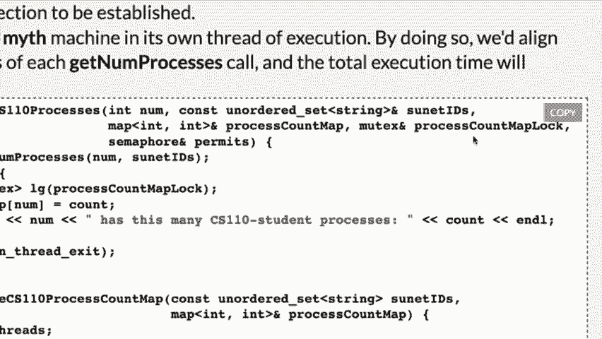

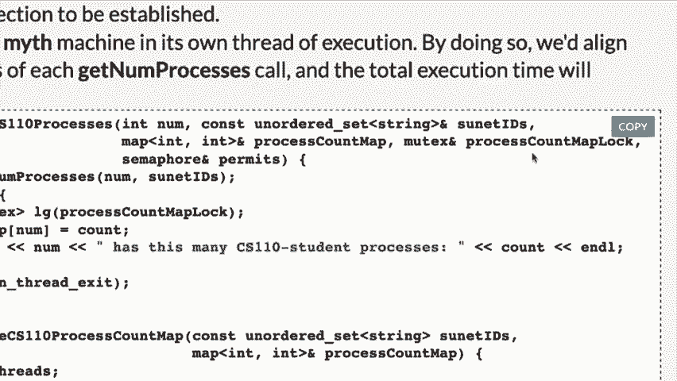

 Okay you might think well why does it matter if two threads with two different myths updates the map at the same time。

 Well do you remember how maps are built under the hood back to CS 110 or 106 B days。

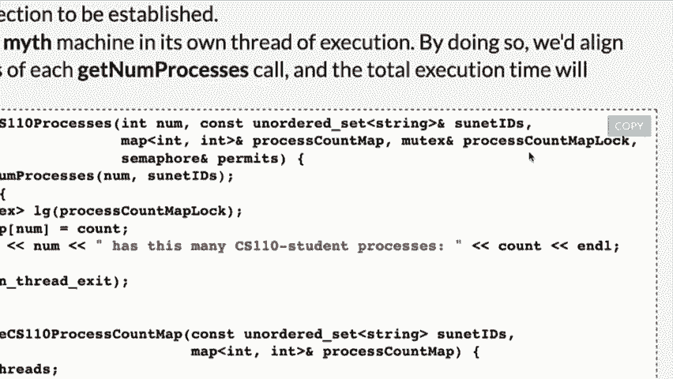

 Remember how maps are generally some like maps are generally built if it's a regular old map you know it's a tree yeah and if you have a tree and if it's a balanced tree well that means that you have to actually move nodes around when you're inserting。

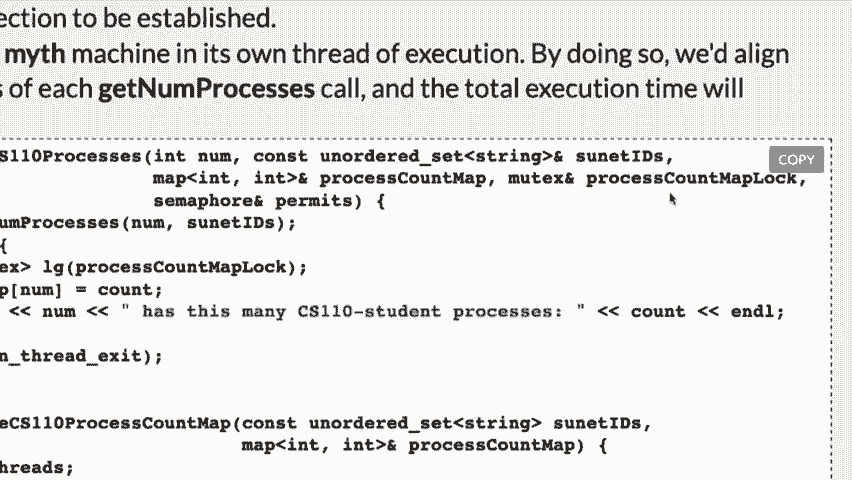

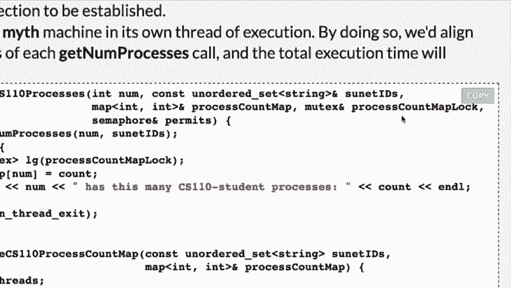

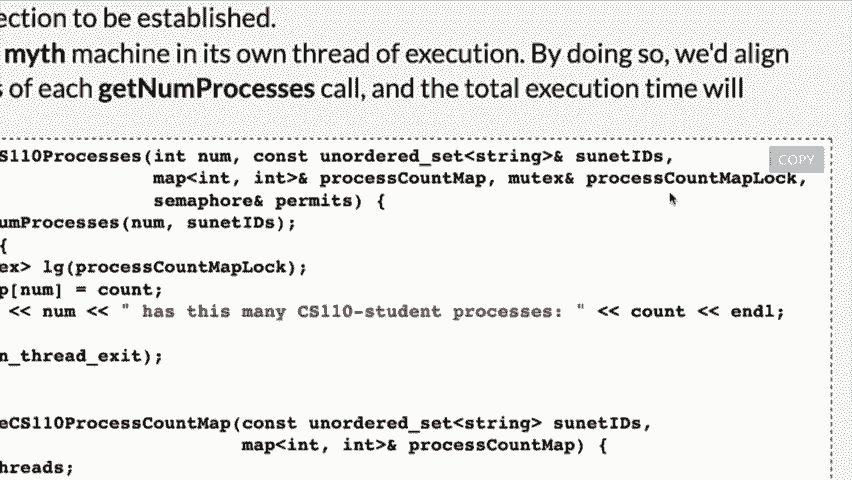

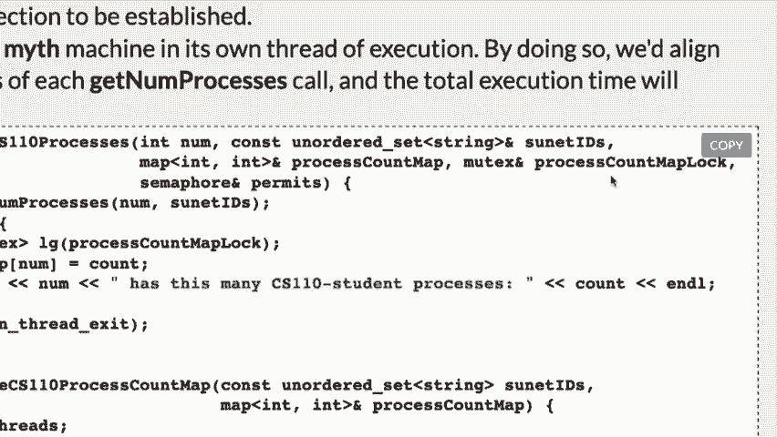

 and that would be bad if two things tried to insert at the same time they'd be moving things around and it would go haywire。

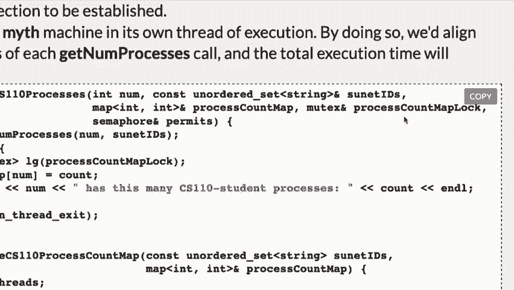

 And an unordered set is using a hash table which also might cause similar issues especially if you have hash collisions and so forth。

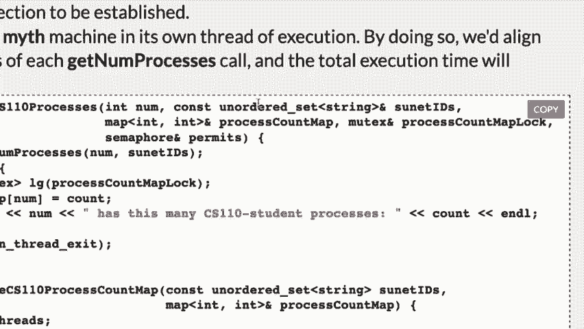

 So either way you don't want two threads to try to write to that map at the same time so you lock around the map but the map writing is very quick。

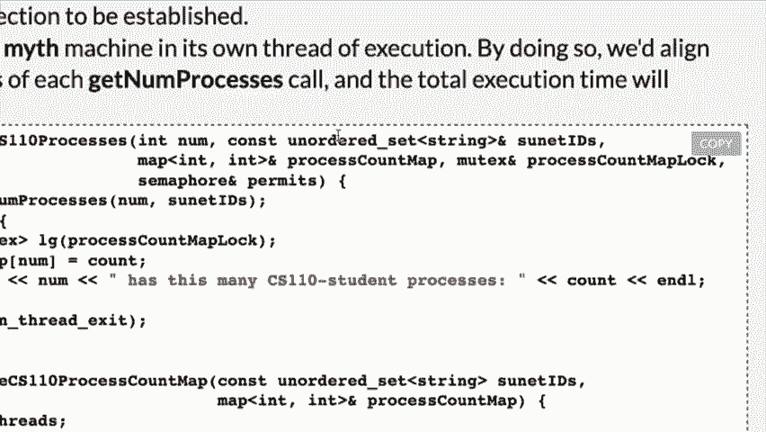

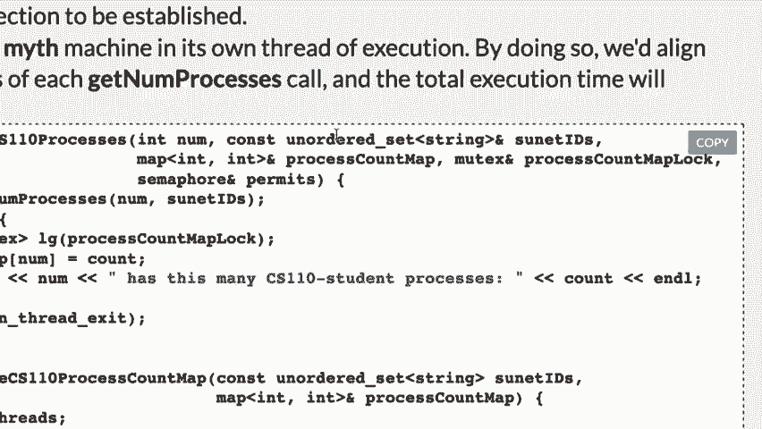

 Writing to the map or reading from it very very quick。 Okay so we can we can do that we can not worry too much about that。 Okay in fact we're just going to do a lock guard around it。

 Okay we're going to change the up we're going to let's see we're going to do the actual count process or get number process in here。 Once we get the number of processes we're going to if the count is greater than zero we're going to update the minute count number and put it in the map。

 And that's a very short this this whole section here is very short to update the map。 This is the part that takes a long time。 If you're trying to wait that's the part that takes a long time but if you're doing it in 12 different threads to 12 different machines it's actually fine。

 Okay but you have to lock around updating that map for everybody。 And then we have permits in here this is so that we don't slam all the myths at once I guess it's not a big deal for 12 different myths having 12 different threads。 But in this case how many did we set up here did we did we say how many we set up we're I guess we're going to we're going to see how many so here we go。 So we're going to say only allow eight threads to go to time。

 That's just kind of nice when you're doing networking things to limit it to some reasonable amount but we could get away with thousands if we really wanted to in this case but there's only 12 minutes or something。 So that's that。 Okay and then we signal on the end there we let's see when do we actually get the permits。

 I don't see a permit's weight in there so。 Oh it's down here。 Let's see。 Oh right okay when we're actually send setting up the threads that's when we're doing it。 We will see a different model next week for a different model for this in this case this is where we're setting up the threads down here。 Okay so how are we doing that we're saying eight permits and we are going through and if we only we're only going to launch eight threads at a time when one of those threads。

 Finishes it will signal this to start the next thread。 We are not joining on any threads until all the way at the end。 Okay those threads will end but we're only allowing eight to kind of go at the same time。 At some point there will probably be nine threads going at this time because the signal is going to happen and another thread is going to get spun up and then this one's going to close。

 So in this case we could have an off by one but it doesn't matter but now there's nine threads instead of just eight。 Yeah。 Oh sorry yeah I didn't tell you about that one。 So in this case I guess there wouldn't be there probably doesn't after the thread just as a thread ends。 The semaphore allows you to say on thread exit do the actual semaphore releasing。

 I don't know the magic that has to go into that we could probably look it up in the actual cut。 Let's go look it up real quick。 But yes if you want the if you want the signal to happen after the thread is when the thread is closing down that's what you would use for it。

 Good answer on there good question on that。 User class CS110 local source threads semaphore。cc。 Okay let's look for on thread exit。

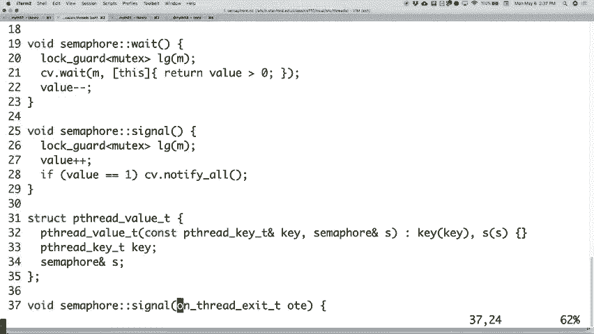

 Okay here we go。 Let's see。 Yeah so it looks like there needs to be some p thread magic going on there to basically say hey do this when the threads exiting and you can do that。 So it's a little bit of a little bit of under the hood magic happening there with leveraging that we're using threads to do all this。

 You do not need to know that for anything specifically just know that if you want to exit the thread or if you want to send that signal as the thread shutting down that's when to do it。

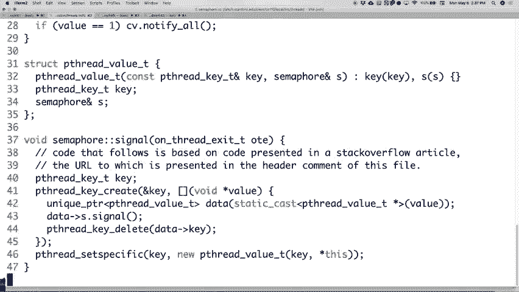

 Good question。 The question is that thread won't shut down until join。 It will shut down it won't get cleaned up until join。 So in other words it still stops and it's no longer taking up any cycles on the processor。 It's just waiting the operating system just the thread manager is waiting to clean it up until you join it。

 Yeah other questions on this。 Alright let's see。 Think。 Yeah let's see。 I think the myths concurrently。 What does that do for us？

 That allows us to wait on the dumb flow network or the connection to happen。 Okay because we've got lots of them happening。 Your computer has the ability to send lots of messages to different machines all at once。 That's fine。 It's got its own waiting and de-interleaving happening with that。 But as far as you're concerned your program can send as many messages it wants to different servers。

 In this case all the different myths at the same time through various threads。 Okay。 They semaphore limits the number of threads and yeah here's the on thread exit that we talked about。 It's an overloaded version of signal。 It schedules after the entire thread is exited so that makes it so there's not nine threads at once going。 Although maybe for a very short amount of time but not long anyway。 And that's it。

 You can see the concurrent one versus let's do this。 Let's do it in two different windows。 So let's do it this way。 Alright so I guess it's a little it's interesting that I'm running this on the myths and checking。

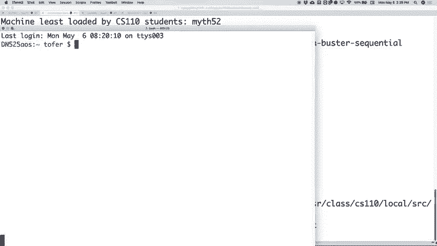

 all the myths so it's a little。 Okay I think we can do it this way。 Here's what I'll do。 Let's do it。 Yeah I want to make this window a little smaller。 And okay so we're going to run myth buster。 Let's do the sequential on this side and then。 Let's see。 Let's let's go。 Let's do the myth buster concurrent on this side。

 Now try to hit return and then really quickly hit the other one。 We could time that if we wanted to but I said okay ready boom boom。 Okay and the myths buster sequential on is still going while the other one's already done。 Alright did it all on threads all once this is the other one still one after the other after the other after the other。

 Alright what questions do you have about this stuff？

 You see how this threading you're going to have to think about race conditions a lot。 There's lots of cool models that we can do。 Next week we're going to or this week and then next we're going to talk about some other cool problems where we're modeling bigger ideas。

 The particular one is an ice cream shop kind of fun。 They were going to model that allows you to do threads that are waiting on other threads and using this whole idea of permits and so forth。 Question。 If you don't specify a myth it checks all of them in this case。 Like umber as a day time。 Oh if you just yeah yeah good question if you this is just about logging on to the myths in general。

 If you just say SSH myth it will pick one there is a load balancer that's doing exactly what our program just did kind of。 Basically it says who is busy right now now I think it's kind of continually looking at who's busy。 It's kind of got connections that are open all the time going who's busy who's busy and it tries to send you to the one that's least busy。 Right it can't figure out if I've got all those crosses stopped though so sometimes that won't。

 But no it definitely it's doing the exact same thing it's really doing more or less the same thing for you。 Yeah good question。 Alright any other questions think we'll get out here a couple minutes early。 Alright we'll see you Wednesday。