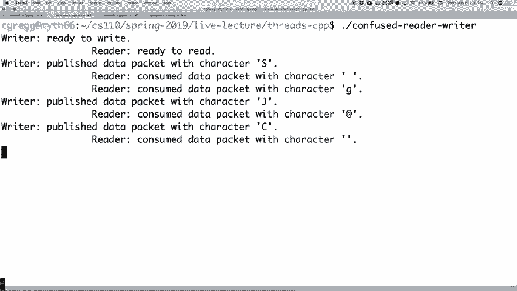
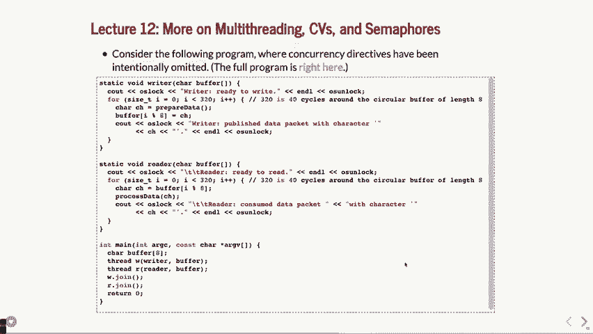

# P13：第12讲 互斥量、条件变量和信号量的复习 - ___main___ - BV1ED4y1R7RJ

好的，我们可以开始了。欢迎大家。那么期中考试已经结束了，希望大家都做得还不错。接下来我会有几点关于考试的评论。然后是斯坦福 Shell，希望大家进展顺利。如我所说，如果你还没有开始，赶紧开始吧。对于已经开始的同学，你们应该意识到，这个作业有很多部分。

还有很多要思考的东西。并且有很多关于 Piazza 的问题，很多关于作业的问题。所以希望大家都没问题。我们这周会有很多助教。考试的截止时间是星期三晚上，还是星期四晚上？你说是星期四晚上对吧？那我们就说，稍后再讨论。

几天前。我们看看。关于期中考试，我有几点评论。你们应该已经收到了期中成绩。如果没有，请告诉我，这样我们可以确保分数能够发放。总体来说，我对结果还是挺满意的。我认为，里面有几个问题我知道会比较难。还有几个问题。

我认为应该每个人都能做好的问题，结果大部分同学确实做得不错。关于文件系统的题目，我觉得应该算是比较开放的，但也挺直接的。大多数人做得还不错。问题1D，实际上问题1是最具挑战性的问题，这也是它的设计目的之一。1D题。

让我们倒着顺序讲。第一题是关于“如何将这些输出去交织？”的问题。真的能去交织这些输出吗？

答案其实并不是很明显。我们设置输入输出的方式使得它们必须直接关联在一起，这样无论你想出的解决方案是什么，都几乎不可能实现，除非允许你先收集所有数据，再传输到一个输入，接着传到另一个输出，依此类推。我的思路是这个问题的关键在于你不知道有多少数据。

数据正在进来，但你不允许在开始传输之前把它全部存储好，这样做是不可行的。很少有人在D题部分做对了，但没关系，考试中总会有这样的情况。一定要去看看，如果你对答案有疑问，别担心，我会帮助你理解。

在评分时，一些助教开始头痛，想“等等，这是什么？”他们在黑板上做了演示，最后自己也明白了。所以这是一个很有挑战性的问题。至于实际代码，涉及两个问题。首先，你知道我们怎么用管道去做，然后你有像 FDS 和 O，Clo，ex 这样的东西。

EC 或者其他东西。你知道怎么做，然后你就不必关闭一些，但你可能需要关闭其他的或者什么的。我们当时根本没有担心这些。好了，考试时。这里有太多像是边缘案例，你可能做其中之一或者另一个，我们只是装作没事。大家都用了 O 管道，我们假装每个人都关掉了所有东西。

在子进程内部正确处理。你必须正确关闭两个管道，或者说，正确关闭两个脚本，这些是我们在乎的。但是在子进程内部，如果你去了，假设你说，哦，我不确定自己做对了，那也没关系。我们不为此担心。还有其他的事。

大家经常忽略的一点是，我们没有说你应该等待 PID，直到子进程结束。我们还是来看看程序，实际问题是什么。好的，或者我应该说，我们来看看实际代码。

你可能已经或者没有输入的部分。稍后提醒我。好了，然后接着。

然后两个输出。cc。好的，你为实际的管道等写了所有这些。

你做了所有这些，而你写的地方在哪里？你是写在主程序中，对吗？

你正在编写这个程序的主要部分，叫做双回声。

在这里，好的，这里叫做双回声，这是你所做的。

然后主程序结束。如果你忘记了加权 PID，就会发生这种情况。

它应该是这样的。让我们看看。两个输出。做同样的例子来排序，然后我会管道一个小的测试输入。好了，这其实相对不错，因为它确实排序了，并且 WC（单词计数）实际上先执行了，但也不一定。它可以在中间任何地方执行。

那是交错部分。但是你会注意到，提示并没有在两个子进程完成之前返回。这才是你在程序中想要的。你希望程序能够正确结束，让提示能够返回。好了，如果我们去掉那些。

两个加权 PID，好的，来看看到底会发生什么。好吧，这并不能保证一定会发生，但是。

让我们看看这里会发生什么。我会放，哎呀，放，这样就好了。两个输出，做同样的事情。

在之前。我们把它放在屏幕顶部。好了，看这里。发生了什么。上面我们得到了提示，然后程序就开始执行，然后就停在这里了，像这样。那是一个行为良好的程序吗？不，挺差劲的。所以我们大概是希望你能意识到，哦，如果我在写主程序并且做这两个输出的事情来处理子进程。

你应该等待子进程。所以，我对没有理解这一点的人表示抱歉。

你应该理解这就是你想做的事情。好的。如果你有其他问题，仍然有一些重新评分请求。我们对重新评分请求相对严格，你不能仅仅因为有正反两面，就说“我其实是这个意思”，并试图解释你真正的意思。如果没有出现在页面上，那就算了。还有，另一个问题。

有些人说，啊，我写了125个单词，你扣了分，什么的。我有点提醒过你们，答案应该控制在100个单词左右。所以如果你写了多一点，我们并不介意。如果你确实想要重新评分请求，我会去数一下你的单词数并做出相应处理。

这是一个决策，但在这种情况下，120可能太多了。问题。 >> [听不清] >> 好问题。问题是，嘿，等一下。我不知道这个管道填满的事儿。那是对的吗？还是管道的事？实际上是的，它是一个管道。它是一个内置的Linux问题，管道会填满。它们只有这么多空间。

在Linux中，管道的空间。它的作用是，通常不会打破东西。虽然如果你不了解的话，就像这段代码，如果我们尝试并行解交错，它会破坏我们的代码，因为我们从未真正讨论过这个。没有。我们没有从这个角度讨论过。可能在Piazza上有过一个问题。也许是上个学期的事。

但关键是，管道会填满。它们会怎么做？它们会阻塞，直到情况稍微好转。如果因为某种原因你做了一些奇怪的事情，比如那个程序，试图一次性收集所有数据，那可能会是个问题。所以我在考试中给了这个题目，是为了让大家知道，“嘿，这是个新问题，你怎么看？”

管道可能会填满。你觉得怎么样？这就是我为什么把它放在那里。是这个意思吗？不，你不知道管道会填满。不是，我是说，你可能知道。期中考试上说过。哦，是的，确实有一部分。哦，抱歉。是的，抱歉。米奇，回去看一下期中考试。它确实说了，那个就是重点。

是的，管道可能会满。抱歉，你没有读到那个问题。一个管道可能无法物理上关闭文件。没有，问题很好，当管道填满时文件会关闭吗？不，不会，管道会阻塞并说，哦，如果你想写入更多数据，我不能接受更多数据，直到。

其他人阅读后，你就可以阻塞。我会做的。今天我们会看到一个类似的例子，关于线程中的情况，这里有一个读写者的“舞蹈”，必须进行一些操作，因为你只有有限的空间，你需要弄清楚该如何处理。这个问题问得很好，非常好。

关于主函数的一个更技术性的问题。是的。

所以在我的手机上，我有一个循环。你有一个循环。它大致围绕这个展开。好的，那个。

可能是可行的。当然，它仍然是这样，我没搞明白。哦，放一个回溯问题。如果你认为那是对的。那是做循环中等待 PID 的问题，你检查所有子进程的等待是完全合法的。你绝对可以这么做。所以为此放一个回溯问题。还有其他关于这个问题的问题吗？我不想进入太多的细节。

关于考试，如果你认为我们批改错了，请告诉我们。正如我说的，我们会尽力做到公平，但我们也不会让你重新做测试并在重新评分过程中作弊。你们都经历过这个过程了。好了，明白了。正如我所说，期中考试整体来说还不错，我认为。

这次期中考试很有挑战性，但总体来说大家表现还不错。如果你发挥得不好，随时可以给我发邮件，我们可以讨论一下如何改进，稍微提升一下。而且你们还要准备期末考试和其他作业等等。好的，明白了。

我知道你们都在想斯坦福 Shell，它和线程没什么关系。但我发现上周你们都在想，天啊，我有期中考试要来了，我们复习了互斥锁、条件变量和信号量，都讲得非常快。我想做的是回过头来复习一下这些内容。让我。

你可以把你可能还有的问题或者新问题提出来。然后我们再看几个小的例子。好的，今天我不会做实际的现场操作。我只会提供一些例子，我们在讨论时一一讲解。好的。在多线程中，我们必须具备处理竞态条件的能力。我们必须有这个能力。

使得两个或多个线程能够在同一段代码中或以不会破坏数据结构的方式操作数据结构。这是你必须处理的问题。竞态条件在做这些操作时总是会发生。线程就像，多线程交叉。我们有几种不同的方法来解决这个问题。

做这些事情。我们上周大致讲过这些。主要的那个是，这是大多数这些情况的基础，就是互斥锁。好的，我们将讲解细节。我会在这里列出这些内容。互斥锁是我们学到的第一个，我们稍后会看到它的例子。条件变量，任何互斥锁都有。

没有能力让两个线程相互通知另一个线程它们已经完成。对，现在，信号可以通过其中一个线程释放锁，另一个线程获得锁的方式发生。从某种意义上说，这是一个信号，但它不是那种明确的，像“嘿，任何正在等待的人，都可以继续”的信号。所以必须有一些。

如果你不想进行忙等，或者不想仅仅使用常规的锁，这项能力就非常重要。好的，这在你有多个实体试图访问某个特定的数据或特定代码段时尤为重要，可能不止一个。你不能仅仅用互斥锁直接处理这种情况。所以这时候就需要。

条件变量，于是就出现了。接着，你可以用条件变量做各种各样的事情，其中我们常做的一件事就是等待许可，并且说，“嘿，这里有一大堆许可，很多线程可以同时工作。”所以我们说，嗯，我们可以使用一个条件变量。

任何，但实际上，让我们来一步步构建它，将其构建为另一种数据结构——信号量，它是一种不同类型的。相对容易构建，但有一些细微之处，我们稍后会讨论。它允许你，哎呀，它允许你构建更多的结构，比条件变量更容易一些。

条件变量，任何。好的，来复习一下这些内容。好的，实际上，让我们复习所有的内容。实际上，让我看看，可能不行。好了。

所以互斥锁，好。你可以把这些幻灯片当作参考，互斥锁是一种锁。好的，它有两个操作。你可以说，要么锁定，要么解锁。当一个线程获取到这个互斥锁并锁定它时，如果没有其他线程已经锁定它，它就可以拿到锁并继续执行下一行代码。好的。

就是这么简单。如果另一个线程进来并尝试使用锁，但第一个线程仍在使用它，那么发生的情况是，第二个线程会阻塞，直到第一个线程解锁。好了。这些就是你应该关注的重点。你必须通过引用或指针传递互斥锁。为什么？因为它们。

实际上需要共享相同的互斥锁。不能是互斥锁的副本，因为那样数据就无法共享了。这就是它的工作原理。顺便提一下，如果你上过并行处理课程或操作系统课程，他们可能会提到，底层是通过原子指令来创建互斥锁，以便两个线程能够共享。

无法同时获取它。所以在硬件和操作系统方面会有更多支持来执行这个操作。但基本上就是这样。好了，线程获取锁之后，会执行下一行代码。如果另一个线程无法获取锁，因为锁已经被占用了，代码就会等待，直到锁被解锁。只有线程。

只有锁定它的线程才能解锁。好了。如果另一个线程尝试解锁一个线程，但它并不是锁定它的那个线程，那就是未定义行为。是的。问题。继续，我在听。我正在尝试弄清楚这个平板。

工作正常。是的。你不记得你的问题了？哦，好的。那是什么？好的。那么，让我们再试一次，我要用这个平板试试，看看它是否。

是的。继续。你的问题是什么？是等待启动，还是可以继续？

哦，等待是可以的。好的，问题很好。问题是，“那是忙碌等待吗，还是？”

等待是可以的吗？" 是的，等待是可以的。但它并不总是能解决我们所有的问题。对吧？所以许可证部分不能真的做那种单一的互斥锁，甚至几个互斥锁。因为正如我们在旅行中的哲学家问题中看到的，我把世界上的大问题和用餐哲学家问题混在了一起，你无法，你必须。

必须有能力说，“哦，我限制了只有这么多人能做这件事。所以很多线程会做这件事。”所以，你必须，你必须等待那个。好了。其他问题？是的，Eva。

这个文本在拳击手或者朋友之间看起来是什么样的？当然。是一样的问题。[听不清]。这是一个有趣的问题。问题是，“当有锁和文件描述符时，发生了什么？”记住，锁并没有关于系统其余部分的信息。好了，如果两个线程碰巧在同一个文件描述符上工作。

如果一个线程读取某个位置，另一个线程会稍后在文件描述符中读取，但没有冲突。它们可以同时读取，程序会按需交替执行。但是，如果你想从一个线程中读取，然后从另一个线程读取，使用互斥锁是完全可以的，你可以按需要进行排序。但是，是的。

没有，没有其他原因。记住，互斥锁相对简单。你要么持有锁，要么不持有，任何其他线程尝试获取锁时，无法在你持有锁的情况下获取。互斥锁就是这么回事。好了，接下来，我们来看看，哦，关于它的其他一些事情。哦，你应该。

尽量将互斥锁持有的时间缩短。好了，为什么？因为如果其他线程正在尝试访问那个锁，而你仍在持有它做其他事情，如果这对你的逻辑没有影响，你可以提前释放它。有时候是不可避免的，你不得不稍后释放它。

因为你仍在使用那个数据结构，但你希望尽可能短地持有它们。好了，让我们看看。死锁，是指两个线程相互等待，这在使用单个互斥锁时是不可行的，因为只有一个线程可以持有它，不能同时由两个线程持有。如果你有。

多个互斥锁，这就是我们开始遇到死锁问题的时候，这也是我们必须继续研究其他方法的原因。好了。那么有一个很好的，非常好的辅助类。

世界上最简单的类就是这个叫做锁保护（lock guard）的东西。锁保护就是这么简单。它有两个方法，一个是构造函数，一个是析构函数，构造函数锁定锁，析构函数解锁锁，仅此而已。没有其他功能，没有其他变量，什么都没有。好了，就这样，锁定后解锁，就这么简单。

它将互斥锁作为参数，所以我想这是它作为引用持有的唯一变量。它的好处是，如果你知道你将使用锁，然后离开一个函数或 `while` 循环，整个函数，你最好围绕它放一个锁保护，这样你就不需要记得在离开之前解锁了。

它会自动为你处理。在需要条件行为的情况下，它非常有用，比如当你在 `while` 循环中，而你从循环中返回时，锁会为你自动解锁。你无需记得去做。如果你跳出 `while` 循环然后离开函数，锁也会为你解锁。

这是一个非常方便的类。如果你知道必须这么做。有时候你无法避免它，因为确实需要解锁。而且再次提醒，不要仅仅因为它好用，就在函数的开头放上锁保护。如果你知道函数中还有其他操作，可能会被其他线程打断。

可能会想要那个锁。这会是一个不好的用法。明白吗？但你会看到更多的例子。好吗？好了，这就是锁保护。现在是条件变量`any`。

这个稍微有点难理解。我们来回顾一下它的功能。好吗？

它与互斥锁一起工作。所以你有一个互斥锁，然后条件变量`any`能够基于该互斥锁等待信号。明白吗？所以，基于这个原理，明白了吗？

基本上它的工作原理是：它获取互斥锁，然后你在这个互斥锁上执行等待操作，这个条件变量`any`使用的是这个互斥锁。条件变量`any`会把你从处理器中移除，因为你在等待某些事情发生，然后它会解锁。因此，它和SIG suspend非常相似。

在这种情况下。你可以把它想象成类似的情况。但用户应该始终先锁定互斥锁。然后你通常会检查一些条件。好吗？如果条件满足，你就会继续执行下一段代码。所以，这就是条件变量`any`可能稍微容易使用的地方。我们将会继续讨论。

我们稍后会让它更容易使用。好吗？当你收到通知时，线程中的等待函数会尝试重新获取那个锁。这可能不可行，因为两个线程在等待，如果它们同时收到信号，通常会发生这种情况。这就是我们在使用条件变量`any notify all`时常见的情形。当这两个线程同时接收到信号时。

同时发出信号，它们竞相获取锁。一个线程获取到锁，另一个则继续等待。明白了吗？这就是条件变量`any`的工作方式，它们的能力就是这样。当等待条件满足后，你就会重新获取锁。所以当你收到信号时，情况就是这样。

一旦你获得了等待信号，你就会重新获取锁。所以你应该稍后解锁它。明白吗？这就是条件变量`any`的工作原理。我们常常用它来做许可控制。比如你说我有x个许可，而有y个线程，数量大于x，试图访问这个资源，我只允许这么多线程去访问。明白了吗？

总体的思路是你会等待某些东西，在这个例子中是许可。当许可数为零时，你就会一直等待。然后，另一个函数会说，增加许可数量，并通知所有人。明白吗？

就是这样，然后在那时你会检查，你会尝试获取锁。你会获取锁，然后重新检查许可数，看到它是1，跳出那个东西。然后你会递减许可数，因为现在你持有了1个。所以条件变量`any`，如果你理解它，你会明白，哦，我明白这里发生了什么。

这里有很多，你知道，有很多细微的差别，或者有很多递增和递减，因为你试图跟踪这个变量，它是一个许可类型变量。好吗？所以那就是，你必须做的事情。这就是条件变量`any`的作用。因为这个权重非常常见，或者因为这个`while`循环非常常见。

好吧，他们把条件变量`any`的权重内嵌到另一个变量中，或者他们把`while`循环内嵌到第二个版本的权重中，它是这样工作的，先获取互斥锁，就像常规的条件变量`any`等待一样，然后它接受一个谓词，即一个返回`true`或`false`的函数。好吗？这就是`while`条件。

它实际上是以相反的方式做的，你可以这样阅读它。好吗？这是很重要的。如果你读它，基本上是下面这样，通常我们会把那个函数转换成一个`lambda`函数，因为我们可以。否则，我们就必须把它作为一个单独的函数调用，这有时会有点尴尬。但在这种情况下，我们直接调用它作为`lambda`函数。

我们说，在这种情况下，`C V`在互斥锁`M`上等待，我们传入许可数，以便我们可以访问它。这是在捕获子句中。然后我们说，返回许可数大于零。所以你可以说，等待直到许可数大于零。基本上这就是它的意思。好吗？我喜欢在这种情况下使用`until`。

等待直到许可数大于零。因为实际上是当许可数不大于零时，持续等待。那基本上就是它的意思。但在这种情况下，我只是把它想象成，好吧，许可数大于零时，我就可以退出等待。好吗？那就是我们要寻找的，`until`部分。

好吗？所以这就是条件变量`n`的工作方式。你们本周在实验中会看到它们，并且会在实验中稍微练习一下。好吗？但再说一次，使用这些条件变量`n`时，你仍然需要像直接自己跟踪许可数这样的事情。好吗？也许是，也许不是你想要的。

你想做的。如果你不想做那个，嗯，我们有另一种方式。好吗？接下来。

我们要看的是信号量类。所以信号量也是相对低级的，尽管不知道为什么它没有被内建到 C++ 中。好吧？为什么？可能是因为它其实非常容易构建。我们马上再看看代码。但是第二个原因是，一旦我们构建了它，我们可以使用它，并且允许你在剩下的作业中使用它。

我们已经为你构建好了，我会展示给你看。但它是这样工作的。它移除了所有的递增和递减许可，并为你完成这些。非常好。好吧？设置信号量真的很容易。好吧？

基本上，你说 semaphore permits 五，这意味着有五个许可。好吧？然后，如果你执行 permits dot wait，它会查看，哦，五个许可中有多少个被使用了？哦，没用过一个？好吧。你得到一个。然后它给你一个，并且减少许可。现在剩下四个。一直减少到零。当有。

如果可用为零，它就会等待。好吧？然后当你说 permits dot signal 时，那就是你放弃许可，告诉任何其他等待许可的人，等待信号量，我已经释放了一个，去争夺我刚刚释放的那个。好吧？而且，唯一会发送信号的时刻是从零到一的时候，因为。

这就是唯一重要的地方。否则，它总是能获得许可。好吧？

所以这就是它的工作原理。你可以把 mutex 看作是信号量的一个特例，带有一个许可，差不多。好吧？你不应该，事实上，如果你去查找，比如 Stack Overflow 上，有很多人说，不要这么想。这不是一个好方法。它并不完全一样。有些人说哦，这是完全一样的。其实并不是。

但你可以把它看作是一个许可，只不过现在你实际上可以在完成后发出信号。而信号量的有趣之处在于，你可以发出信号，即使你不是获得锁的那个。就这是其中的一个大区别。mutex，唯一能够解锁的是持有锁的那个线程。

mutex 是锁定它的那个。那就是另一种区别。好吧？现在，有几件事我们没有谈到，信号量。一个初始化为零的信号量意味着什么？你们觉得呢？如果我做一个信号量，初始化为一，它意味着有一个许可。如果我做一个信号量，两个线程在争夺它。然后其中一个。

它们都试图获取它，一个会获得它，然后当那个发出信号时，另一个会获得它。一个许可为零的信号量意味着什么？你觉得呢，Cosner？[听不清]，好吧。所以这是个好问题。问题是，如果它只是挂起呢？如果有两个线程在争取，它们会都等待。直到什么？你觉得呢？[听不清]。

只有父线程可以访问数据。不完全是。你在正确的轨道上。别人需要做一些事情。我们说互斥锁用来做什么？

唯一能释放互斥锁的就是那个锁定它的线程。这对于信号量也适用吗？不。任何人都可以对信号量进行信号操作，对吧？所以这样，你慢慢理解了。还有人想尝试解释一下这到底意味着什么吗？

这实际上是一个有趣的案例。是的，继续。 [听不清]，是的，你在等待其他线程给你信号。无论其他线程是否必须等待那个许可都无关紧要，对吧？这只是表示，嘿，让其他信号，其他线程给我发信号。这也是你要说的吗？是的。

就是这样。好的，这就是它的样子。我们不一定有许可证。好吗？

许可证等待意味着你只需要等待一个信号，这个信号可以来自任何其他线程。我将展示一个例子，说明这是另一个更有趣的情况。是的。[听不清]，是的，任何线程都可以发出许可证信号。好吗？

它是否没有任何锁定开始时并不重要。可能是你的逻辑说，嘿，某个线程，只有这个线程需要等待某些事情。事实上，我马上会给你展示一个例子，说明它实际上是有用的。但它可能会说，这个线程需要等待一大堆其他事情发生，然后它会继续。

其中一个线程会发信号。当它完成时，它会等待。它不一定有许可。它不需要锁定任何东西，直到它需要获取信号。实际上，它只需要做这个。好吧？稍后我会展示给你。我的下一个问题是，如果它说许可证为负数呢？那是什么意思？

让我们看看代码。你打算怎么说？你打算怎么说？是的。

[听不清]，是的，正是这样，许多不同的线程需要发信号才能实际执行任何操作。让我们去看看信号量的实际代码。我得记住它在哪儿。

看看，slash user，slash class，CS110。我想它是本地源，我相信，然后是线程。就在那里。好的。

Semaphore.cc，你们都可以去看看这个。好的。让我们看看它是如何工作的。

顺便说一下，它里面有很多东西。它有一个条件变量（CV）。它有一个条件变量，因为我们就是这么构建的。让我们看看权重和信号。好吧。权重做了以下事情。好吧。权重有这段新文本，它实际上尝试获取，因为它确实需要更新那个值。

好的。所以在某些情况下，你必须有那个锁。好的。然后它会执行一个条件变量的等待，基本上是等到那个值大于零。好的。然后它会在实际获得锁后减少那个值。好的。这就是`wait`的作用。`signal`是做什么的呢？嗯，`signal`会获取锁。好的。然后递增那个值。

然后如果值变为1，它就会通知所有人。好的。是的。[听不清]。`MutexM`是一个类变量。对。它是一个类。如果你看一下，嗯，我看看能不能做到。实际上，我们在这里做。看看。就在那。包含。

大约是四点八。好了，就是这样。它是一个，那里它就是了。它是一个类变量。对。 所以当你创建这个，创建类时，现在你已经有了互斥量。

所以它在函数之间是共享的。好的。好吧。这就是`signal`和`wait`的工作原理。嗯。注意，如果值，它实际上只能递增或递减那个值。

所以如果你把这个值设为负数，那它就需要一段时间。但这个数字需要减去一个信号，才能增加到一，实际上，来通知等待的线程它已经完成了。好的。那么，什么时候你可能需要这个呢？嗯，如果我们做的是最后一步呢？

好的。假设我们有一个程序，里面创建了10个线程，它们每个都需要做某些事情。然后，还有一个线程需要等待，直到它继续做它的事情。现在，你可以做一些事情，比如将其他10个线程都加上`join`，然后做接下来的事情，如果你愿意的话。但也许你想让这些线程继续运行。也许你不想这么做。

也许你想做其他逻辑，最终，你知道的，做些其他事情或者在这些线程中做类似的事情。所以在这种情况下，你可以这样做：我们实际创建这些线程，然后每个线程执行它自己的任务。在这里，它只是会输出一个`cout`，然后它会在信号量上发出一个信号。

而这些线程根本不知道它们正在递增哪个数字。

就是因为，看，我已经完成了我的任务。如果有谁在乎，我会发出信号。我做完了。然后它发出了信号。对。然后这里的`read after 10`函数呢。嗯，它只会等待。因为我们一开始把这个信号量设置为负9。好的。等到发生了10件事情后，它就会递增到1。然后信号就会发出，事情也就发生了。

然后，实际的信号量就会允许线程继续执行。顺便提一下，最终会将信号量的值降到零。

但这就是通过线程传递信号的方式，它让你可以依次完成10件事。最后一件事会最后执行。我们试试这个。

看看我的讲座文件，应该是Red.CPP。我想它应该就是负数信号量。好的，确实是负数信号量，正是我刚才所说的。

这时，顺便说一句，我们在这里创建了一个值为负9的信号量。好的。然后将这个信号量的引用传递给所有其他线程——我们有11个线程。负数信号量，就是这样。

所以这些线程，它们都按照各自的顺序执行，依次完成。每个线程在完成后会发送信号。然后当最后一个线程收到所有这些信号后，它才会继续执行。这就是它的工作方式。好了，关于这种新方法的使用方式，大家有什么问题吗？我们稍后会看到一个例子。过一会儿会有一个更大的例子。

好的，三种不同的类型。互斥量（Mutex），条件变量，任意信号量。我们会更少使用条件变量，因为我们有信号量。你仍然会经常使用互斥量。你会使用这两个远多于单独使用条件变量，尽管你可能在某个时刻有理由使用条件变量。

好的，让我们来讨论另一个模式。这里有一个模式，它偶尔会出现。它将利用我们可以使用零（不一定是负数，但我们可以使用零）作为信号量的事实。好的，它也可以是一个方法，在绝对需要时才使用线程连接（join）。好的。

所以我们接下来要做的就是，查看一个程序，它有两个线程，两个线程都在操作一个特定的数据结构。其中一个线程在写入数据，另一个线程会从中读取数据。好的，实际上它会读取刚刚写入的数据。好的，这很像管道。好的，实际上，管道也可能在后台使用类似的机制。

但这与写入一些数据然后另一个线程从该数据结构中读取数据的想法非常相似。好的，这就像一个Web服务器和客户端的关系，客户端向Web服务器发送请求，比如输入www.google.com。这个请求会发到Google服务器，然后Google返回数据。这中间有一个握手的过程，你在请求某些数据，然后数据必须返回给你。

就是这么回事。如果今天有时间的话，我们还会做更多的操作。我们也会看到另外一个例子。就像我说的，它有点像管道。好的，这是初始程序，我将放大一部分，我们会稍微详细看一下。好的，有多少人记得，嗯，你们记得 CS106B 中的队列吗？

你有谈到过像是循环队列或循环缓冲区吗？你可能记得这些。好的，好吧，有些人记得。如果你修过170课程，你肯定不知道这些，因为我知道它是作业的一部分。这个就是循环缓冲区的概念。让我实际上缩小视图并在这里稍微画一下。我可以，嘿，看这个。所以，上次的内容。好了，清除。好了。

我的糟糕画画技能又回来了。

好的，循环缓冲区就像这样。你可以把它建模成这样，或者你想的话，你可以把它想成一个圆形。循环缓冲区的作用是，如果你从这里开始写入，下一个写入的地方就在这里，然后是这里，然后是这里，然后是这里，然后是这里，然后是这里。然后你就回绕过来继续在这里写。

所以你需要一个头和尾，差不多是这样。事实上，你可以在程序中通过一个模运算符来追踪实际循环缓冲区的位置。所以你可以让缓冲区部分填充或者其他什么情况。你接下来写的地方就是这里。如果这个位置填满了，那个位置也填满了，那个位置也填满了。

我猜你如果是接着写的，当前位置是这里，这个位置还没填满。以此类推。但重点是，给我擦掉它，像这样。假设其他的已经填充到这里。假设这是填充了的。那个也填充了。这个也填充了。我们准备写到这里。接着我们会填充这个位置。

然后我们填充这个位置，再到这个位置。接下来填充这里，然后下一个位置就填充在这里，以此类推。如果你遇到缓冲区已经填满的情况，你就不应该继续写入，因为它已经太满了。这就是循环缓冲区。

它的优点是，你不需要每次都创建节点并一个一个地遍历它们。你只需要一个数组，然后以循环的方式遍历它。好的，反正这就是循环缓冲区的概念。所以我们要做的是写一个小程序，或者查看一个有循环缓冲区的程序，其中一个线程将负责写入，另一个线程将负责读取。

它将希望能够追踪谁在什么地方写入，以及谁在读取，以确保不会相互干扰，也不会读取尚未可用的数据。

好的。那么这对程序意味着什么呢？嗯，让我们先看看目前程序是如何实现的。好的。我们有一个写入者，它基本上会写入随机字符。

它将随机添加一个字符，并且会随机地将字符一个接一个地放入缓冲区。缓冲区只有八个位置。但我们将执行这个操作320次。好的，所以它会写入然后回绕，继续写入，写入，写入，写入，写入，写入，写入。如果一切顺利，读取和写入会以相同的速度发生，这样你就可以做到这一点。

然后，写入者可能会稍微超前于读取者，他们会继续沿着那个循环模式进行。这是理想的情况。好的，但这里发生的其实是非常简单的事情。它只是把那个随机字符放到缓冲区的某个位置，然后当`i`变量大于七时，继续执行。

它会回绕到开始，并继续执行。它就这样做320次，把数据写入其中。好的，这就是它所做的。每次执行时，它都会说它已经把数据写入其中。好的。读取者则执行相反的操作。它遍历并逐个字符地读取数据，然后回绕继续读取数据。

好的，在一个完美的世界里，写入者可能会比读取者领先一两步，一切都会完美地工作。

好的，这些是在不同的线程中，所以你可能会想，哦，这里有一个竞态条件。嗯，确实有。

让我们实际看看这里的情况。好的，这叫做混乱的读写者。好的。

记住，它是先取随机字符，然后写入，再把那些随机字符读取出来。

所以最开始这里看起来会有点奇怪。我会实际停止它，因为它正在做那个操作。

让我们看看这里发生了什么。好的，写入者准备好写入，读取者准备好读取。然后写入者发布了S。好的，读取者接着消费了sphin。那么发生了什么？接着它说读取者消费了G，写入者写入了J，读取者消费了at。那么这里发生了什么呢？实际上是读取者在写入者还没有写入任何内容之前就开始尝试读取，而最开始缓冲区中存在的垃圾数据就是被读取出来了。

好的，最终它读取了消耗的数据，像是空的，等等，我甚至无法写下来。最终你可能会看到一些数据进去了，但它们都被弄乱了，写入者覆盖了某些部分，它的工作方式不是我们想要的。

它们是在同一个文件里读写的吗？

它们在同一个缓冲区进行读写操作，这只是一个充电的狗形缓冲区。你不需要担心任何游标。你不需要担心任何游标。我们有点儿在担心游标。让我再回到图示。

让我实际重新画一下这个图。这里是缓冲区。我们再做一点更多的事情。假设有一，二，三，四，五。假设只有六个位置。假设这里是第一次读取发生的地方，但也是第一次写入发生的地方。我们叫它读取头和写入头。

最后可能会被读取的东西在哪里？事实证明，这就是——如果你绕一圈回去的话，不过这有点微妙。但现在我们先考虑这个问题。假设写入者先尝试读取。好，它会在这里读取垃圾。所以如果它提前读取了，那就是垃圾。

假设写入者确实写了A。好，写入者写了A，然后写入者写了B，再写了C和D。假设读取者很友好，现在开始读取。那么读取者会读取A，然后到这里，读取者会读取B，然后到B这里，然后B这里，接着读取者会读取D，依此类推。假设是E，F，然后它绕到这里读取G。好。

假设由于某种原因，读取者在这里停下了读取。那么这里是G，接下来是H，然后是I，接着是J，直到读取者读取它。所以这是一个大问题。如果它们不完全同步，可能会出问题。

好的，现在完美同步其实是有点微妙的。要完美同步，多少数据可以在写入前被读取？零，对吧？

你必须先写入一些东西，才能读取它。所以，某些东西必须在读取之前被写入。最大数量的东西，对吧？

所以你可以一直写到最后，再返回去，但如果你一回去什么都没读取过，那你最好等一下。好吧，这就是我们将在这个程序中要做的事情。

好的，所以不管怎样，我们再看一遍，然后我们出去。所以我们回到了完全混乱的状态。没有任何东西是按顺序的。它应该是。它应该读取SJCNN。我们来看看，确实有SJCNN。它从那里开始读取，但最终它不一定是同步的。

一堆东西先被读取了，不管怎样。不好。好吧，我们怎么修复这个问题？

有不同的方法可以修复它。好吧，你可以，可能你可以使用几个互斥量，也许如果你想这样做并尝试设置它。这是一种做法。我要给你展示的方式是使用两个信号量。

好吧，我们将要做的是，这实际上是我们刚刚经历的过程。为什么它会坏掉。基本上没有任何东西能告诉读者某个位置可以读取了。而且没有任何东西告诉写入器所有位置都已满。这就是大问题。好吧。那么我们能做什么呢？我们可以使用两个信号量。

好吧，如果我们有一个 8 个字符的缓冲区，我们可以将空缓冲区初始化为 8。换句话说，它一开始有 8 个空缓冲区。有 8 个空的位置。目前一切正常。好的，然后我们还可以设置一个信号量，表示满缓冲区。那么最初有多少是满的？零。所以我们做一个从零开始的信号量，这是那个奇怪的情况，始终需要一个信号才能开始。

因为它一开始没有许可可用，那就是发生的事情。好吧，我们可以这么做。我们可以设置信号量满缓冲区和空缓冲区。满缓冲区，如果你说一个没有参数的信号量，它会从零开始。好吧，如果你做一个空缓冲区，如果你在这里做参数，那么这就是基本上有多少许可的意思。

而这个信号量表示有 8 个空缓冲区。然后你必须当然将满缓冲区和空缓冲区都传递给读者和写入器，因为它们都会处理读者和写入器。一个会等待并向另一个发信号，而另一个会等待并向第一个发信号。

所以我们需要在这里工作。让我们看看这个在实际功能中是如何运作的。那么我们有什么呢？

好吧，我们有了满缓冲区和空缓冲区的信号量。好的，我们仍然会做和之前一样的逻辑。我们只会通过整个缓冲区执行 for 循环。写入器做的第一件事就是它会等待空缓冲区。

但我们将这些初始化为 8，对于信号量，如果计数为 8，许可会等待吗？

它说很好，我可以开始写了。然后砰，它开始写入，然后它再次尝试等待，现在有七个可用的缓冲区，砰，它开始写入，就这样。我们会继续。当它写入一个字符时，它会向满缓冲区发信号：“嘿，我刚刚写了一个字符”。

所以它将信号量中的满缓冲区计数器递增到 1，并且它发出信号，因为它递增到 1，并且它向另一个线程发信号。嘿，有东西可用，我刚刚放入了一些东西。好吧。好了，我们来看读者。读者做的是相反的事情。它仍然会通过循环，首先等待满缓冲区。

开始时没有任何东西是满的，所以读者必须至少等一次写者插入一个东西，因为它使用的信号量从零开始。好的。但是一旦第一个东西写入，信号量就会立即被触发，读者可以立刻读取。

它可能会稍微滞后一步，因为可能写者还没有写下一个东西，然后它会再次等待，但只要有位置，它会立即执行。而且这个过程可能会有很多次，取决于写者写了多少东西。

里面可能会有很多项，最多到八个。好了，我们来看一下。然后它发出信号说“空了”，意思是我刚刚清空了一个，这时空的信号会通知写者继续。好了，顺便提一句，它最多会这样做八次，而读者什么都不做。我们可以继续测试这个，应该是有效的。

现在信号量如何帮助我们保持一切有序。然后我们来看看这个。这个只是叫做读写者的正确示例，我会让它运行一会儿。让我放大到顶部。

好的，读者或写者在写作，读者准备好读取了。太好了，写者发布了一个，猜猜读者立刻消费了a。顺便说一下，我不应该在前面的句子里说这个，这里也有随机休眠，所以这就是为什么它们是一个接一个执行的原因。

读者按照顺序获取了a，然后y进入，y出来，再到W.I.Q.W。一定是读者睡了一会儿，因为写者有机会插入四个新的东西到读者W.I.Q.W。但是读出来的是什么呢？哦，W.I.Q.W。被读取。所以我们知道这里一定是按顺序的。接下来它继续进行。

我不确定，可能会出现一种情况，八个项目会进入，但它会等待这么久，虽然我们可以这样做，但它肯定会按顺序执行。明白吗？大家为什么是这样？不明白的可以再看一次代码，记得去看看信号量的代码，看看它是如何工作的。

好的，我们来看一下代码。加入读写者的顺序有关系吗？是的，问题很好，加入哪个先并不重要，为什么呢？因为只要它们都能完成，缓冲区就会被填满，对吧？如果你尝试先等待读者那边。

可能是作家最后结束了，让我们看看试着等一下读者，可能是你必须按顺序做，因为你必须先写才能读，如果你先等读者，你可能就完全无法读取它了，因此。

我没有再想它了，嗯，我没有再想它，但我认为在这种情况下它并不是一场比赛，最终的等待可能是，我会回来告诉你。嗯，好问题，是的。所以，我的意思是我们可以试试，但我不知道这是否能证明我们的观点，证明否定，但我们还是试试看。

好的，然后再读写器，好了，让我们看看它是否能够完全通过，这种情况通常发生在接近结束时，我们会在意，因为一个会先结束。

但是不，再想一下，我觉得如果一个结束而另一个还在等待，那又怎么样呢，如果它在等待第一个而还没结束，那又怎么样呢？所以，如果数据还没有到来，另一个应该还没结束，所以我认为这无关紧要。

我很确定我会确认这一点，但它确实完成了，所以至少我们知道它是可以工作的，但这些事情通常不会。让我们这样做吧，让我们稍微再等一下，我们再看看，看看我们能不能放进去。

让我们在这里稍微加个暂停，等三秒钟才开始尝试读取。这意味着写入器会尝试放进去八个东西，然后希望它会等待。我们来看看能不能成功。好了，它放入了一二三四五六七八个东西，然后它在读者终于唤醒后继续运行，我开始读取一些内容。

就是这样工作的。另一方面，如果我们把它放在写入器之前，或者更准确地说，如果我们把它放在写入器之前，发生什么情况？你认为如果我在这里放个暂停，会发生什么？你认为它应该在做几乎任何事情之前等待三秒钟，对吧？是的，我认为这是个很好的回答。让我们创建读者写入器，然后好吧，大家都准备好了，最后写入器开始写作，三秒钟后，砰，它就开始了。

好的，什么都没有写，读者无法处理或者无法完成需要的读取任务。好问题，怎么会有九个呢？我们其实可以跑一下看看会发生什么，如果我们得到一堆数据。它是做了九个吗？可能只是一个竞争条件，谁在写谁在读，这是我的猜测。它不能在没有九个的情况下读取九个，因为没有九个位置，但很可能是最后一个写入的，读取已经打印出来了，或者还没有打印出来，或者类似的原因，所以这只是一个竞争条件。

如果是20个的话我可能会有点怀疑，但八个、九个或者十个，倒是不会怀疑，1，2，3，4，5，7，9，最后是那个，确实做了两个S的结尾，所以没有什么奇怪的。总的来说，我觉得这只是一个竞争条件的问题，可能是因为写入的速度比读取的速度快，反正读者总是赶不上，直到最后一部分输出时，才终于能读取到其余的数据。

没有问题。你有更多问题吗？你确定吗？好。还有其他人吗？好，那么这是读写者范式。让我们继续。好，我觉得我们有时间看看，可能不会看完，但我们来看看这个叫做神话粉碎者的东西。好的，这是一个杰瑞·凯恩的特别项目，叫做神话粉碎者，因为它的功能就是，当你登录一个神话时，你会发现哇，那里有一千个其他人在用，而且非常慢，挺烦人的，也许了解一下哪个神话的CS 110用户最少，感觉会更好。

好的。这就是神话粉碎者的作用。它基本上会访问所有的神话机器，可能是10台或12台，然后通过一种有点怪异的hack查询它们，看看这个班级的学生使用了多少线程。我还觉得它应该检查一下107号机，或者只检查线程，但不管怎样，它检查的是这个班级的。

好的。现在我先展示一下它的运行情况，然后再说其他的。好的。神话粉碎者，我们就让它并发运行吧，这是我们不太喜欢的那个，但也没关系。

好的，天呐，谁在使用这些进程？这是什么情况？

机器上也有一点竞争条件，没错，最少的机器是CS机器号最少加载的机器74，所以如果你要使用它，你应该登录到神话52上，但我现在真的很好奇神话65。

是神话65。神话65，查看h top。好的，有人在看，让我看看，看看因子Python因子。这个是谁？Emma，你有问题吗？好的，看起来你在程序中留下了很多因子，可能是你启动程序时的操作。

我并不是故意点名批评他，但她很高兴看起来不错，我们可以，成千上万的这些人，所以你说的并不孤单，我向你保证，还有更多。好的，还有更多。好了，让我们看看能不能再找到更多。是的，还有一大堆，所以你应该终止你所有的进程。所以实际上，当我之前运行这个时，我注意到其中的一些，我得写一个小笔记给下个季度，让每次提交时都能终止所有你仍在运行的进程，不管你在哪个 myth 环境中。

就这样，反正你们都在做这些，那些可怜的107个学生无法使用 Myth 机器，因为你们自己也不能用。所以Emma，顺便说一下，你可以说“kill all Python”，它会终止你所有的Python进程。

那台机器我相信你可以试试看，看看它是否有效，也许它能做到，如果我们都很友好，我们可以做到。顺便说一下，好消息是，所有这些进程虽然占用了内存，但它们的状态应该都是“T”（即停止状态），这意味着它们实际上并没有在不断循环，这很好，谢谢你们没有让它们一直运行。

但对，通常情况下它们并不好，比如说就那样坐着什么都不做直到机器重启，这大概是会发生的情况，不管怎么样，这就是 Myth Buster 做的事情，而且 Myth Buster 的运行有些慢，因为它必须拉取每个。

所以这是并行处理的，速度快的那种，顺序处理的那种会很慢，因为它必须按顺序处理每一个，它必须去执行这个查询，而一些 myth 机器顺便说一下，可能因为某些原因出现故障，无法使用，它对这种情况有2秒的超时设置，因此必须等到超时。

所以这意味着，嗯，并行的那种，速度快得多，是用线程处理的。好的，基本上就是说，我会开一个不同的线程，询问这个 myth 机器有多少个线程或多少个进程，如果需要一点时间也没关系，其他的一些线程还会继续运行。

你会注意到它是乱序的，我们可以找办法让它更有序一点，但你会看到56，52，58等。至少这个是有序的，虽然有些缺失，因为它们不是像 myth 57 那样挂掉，但也许应该直接说 myth 57 挂掉了。

但重点是你要并行处理，虽然慢，但一旦有了线程，你可以等待所有服务器的回复，或者处理故障。我们来看看这部分代码。好的，这是我们要使用的各种数据结构。我恰好列出了班上所有学生的列表。

这就是它所要求的，所以它读取那个文件，然后检查Smith机器与所有这些名字的匹配。它只是查找进程号。好的，它有一个所有这些的集合，这是一个集合，它读取这个文件，它有一个计算每个神话的进程数的映射，告诉你每个神话有多少个进程。

好的，编译进程计数地图将传入这两个细节，然后我们将在其中进行所有的线程操作，然后它将发布最少负载的数据，这就是程序的工作方式。好，让我们看看我已经提到的这些东西，回顾一下这些，看看有没有什么重要的东西我们需要知道。

不，我想我们已经讨论过了。细节在`get num processes`中。嗯，这就是它实际去获取的地方，比如神话54，它获取进程，然后根据用户名检查它们与班级中的学生是否匹配。

好的，这就是它在顺序版本中如何工作的。基本上它逐一处理每个神话。好，从51到56，然后它通过调用这个获取进程来统计每个神话中的进程数。嗯，这就是慢的部分，因为你有10个不同的产品12个进程，10个不同的神话，每个神话可能都会卡住。

好的，这就是我们需要避免的情况。这是我们已经展示给你们的工作原理。嗯，关键是每个调用大部分时间都在等待神话机器的响应。每当你登录到一个神话并等待时，嗯，你的程序也必须做这个。对，它不能继续做其他事情，如果你按顺序执行的话，所以这是关键所在。

好的，所以当你在计数这些时，你要做的不是顺序执行，而是用线程处理。好，让我们看看这如何工作。嗯，我们将再次计算CS 110的进程。我们仍然将传入num，我们仍然将传入学生集合，我们仍然将传入进程计数地图，这次我们将传入而不是仅仅得到返回值。现在我们将使用一个互斥锁来锁定进程计数地图。为什么？

因为你不希望不同的线程同时更新地图。

好的，你可能会想，为什么两个线程在两个不同的神话中同时更新地图有什么关系呢？

你还记得在幕后是如何构建地图的吗？回到CS 110或者106 B的日子。

记得一般情况下地图是如何构建的吗？如果是普通的地图，你知道它是树形结构，如果你有一棵树，而且如果是平衡树，那意味着在插入时你必须实际移动节点。

如果两个元素同时尝试插入，就会很糟糕，它们会互相移动，最终导致混乱。

无序集合使用哈希表，这也可能引发类似的问题，特别是如果发生哈希冲突等情况。

所以无论如何，你不希望两个线程同时写入那个映射，所以你会在映射周围加锁，但映射的写入非常快。

写入映射或读取它是非常非常快的。好的，所以我们可以做到这一点，不用太担心。事实上，我们只会在它周围加一个锁保护。

好的，我们要更改，我们要……我们来看看，我们将要在这里进行实际的计数过程或者获取数量的过程。一旦我们得到进程的数量，如果计数大于零，我们将更新分钟计数并将其放入映射中。

这一部分非常简短，更新映射的部分。这个部分需要花很长时间。如果你在等待，那部分确实是耗时的，但如果你在12个不同的线程、12台不同的机器上进行处理，实际上是没问题的。

好的，但你必须在更新映射时对其加锁，以确保所有人都能安全操作。然后我们在这里有许可证，这样我们就不会一次性处理所有线程。我想，处理12个不同的线程在12台不同的机器上并不是一个大问题。但在这种情况下，我们设置了多少线程？我们是不是说过要设置多少个线程？我猜我们要看看具体设置了多少。好了，所以我们说只允许同时运行八个线程。

当你在做网络操作时，限制到一个合理的范围是挺好的，虽然在这种情况下我们实际上可以处理成千上万的请求，但时间只有12分钟左右。所以就是这样。好了，然后我们在结束时发出信号，看看我们什么时候实际获得许可。

我没有看到许可的等待在那里。所以……哦，它在这里。让我们看看。哦，对了，好的，当我们实际上设置线程时，就是在这个时候。我们下周会看到一个不同的模型，这个模型是我们在这里设置线程的地方。好的，那么我们是怎么做的呢？我们说允许八个许可，然后我们会遍历，如果我们只……我们一次只会启动八个线程，当其中一个线程……

完成后它会发信号启动下一个线程。我们直到最后才会对任何线程进行 `join`。好吧，这些线程会结束，但我们只允许最多八个线程同时运行。到某个时候，可能会有九个线程在运行，因为信号会触发，另一个线程会启动，然后这个线程会关闭。

所以在这种情况下，我们可能会遇到“多一个”的问题，但这没关系，现在有九个线程，而不是仅仅八个。是的，哦，对不起，没告诉你这一点。所以在这种情况下，我猜在线程结束后，应该没有问题。信号量允许你在线程退出时释放信号量。

我不知道需要什么魔法才能做到这一点，可能可以在实际代码中查找。让我们快速查找一下。但没错，如果你想要在线程关闭时发信号，这就是你需要使用的方式。

很好的回答，关于这个问题。用户类 CS110 本地源线程信号量。cc。好了，接下来让我们看看线程退出时的情况。

好的，我们来看看。是的，看起来需要一些 pthread 的魔法来基本上说“嘿，线程退出时做这个”，然后你就可以这么做。所以，这里发生了一些背后的魔法，利用线程来做这一切。

你不需要专门了解这些内容，只需要知道，如果你想在线程关闭时退出或者发出信号，应该在那时执行。

很好的问题。问题是，线程在调用 `join` 之前不会关闭。它会关闭，但在调用 `join` 之前不会被清理。所以换句话说，线程停止运行了，但它不再占用处理器的任何周期。它只是等待，操作系统线程管理器会等到你调用 `join` 才会清理它。

是的，关于这个问题的其他问题吗？好吧，让我们看看。嗯，看看。我的意思是，竞争性执行的迷思。那对我们有什么帮助？

这让我们可以等待流网络或连接的完成。好吧，因为我们有很多连接在发生。你的电脑有能力同时向不同的机器发送很多消息。没问题。它有自己的等待和解交错机制。但就你来说，程序可以向不同的服务器发送任意多的消息。

在这种情况下，所有不同的神话同时通过多个线程运行。好的。它的信号量限制了线程的数量，是的，这是我们讨论过的线程退出的内容。它是信号的一个重载版本。在整个线程退出之后，它才会调度，这样就避免了九个线程同时运行。虽然也许在非常短的时间内会有，但总的来说不会持续很久。就这样。

你可以看到并行的和让我们这样做的区别。让我们在两个不同的窗口中做。就这样做吧。好的，所以我猜有点有趣的是，我在运行这些神话并进行检查。

所有的神话，所以有点儿。好的，我想我们可以这样做。接下来我会这样做。我们开始吧。是的，我想把这个窗口缩小一点。好的，所以我们将运行神话破解者。让我们在这一边做顺序的，然后。让我们看看。让我们开始吧。我们在这一边做神话破解者并行的。

现在试着按回车键，然后迅速按另一个键。如果我们想要的话，我们可以计时，但我说好了，准备好，砰砰。好的，顺序的神话破解者仍在运行，而另一个已经完成了。好的，它所有的任务都在线程中完成，而这个则是一个接一个地完成。

好的，你对这些内容有什么问题吗？

你看到了吗，这个线程，你得经常考虑竞态条件。我们可以做很多很酷的模型。下周我们要讨论一些其他有趣的问题，讨论我们如何建模更大的概念。

这个特别的例子是一个冰淇淋店，挺有趣的。他们将建模一个允许你使用等待其他线程的线程，并使用这种许可的想法等等。问题是，如果你没有指定某个神话，它会检查所有的神话，在这种情况下。比如说，“ umber ”是一个白天时间。哦，如果你只… 是的，是的，好的问题，如果你，这只是关于一般登录到神话的内容。

如果你只输入 SSH 神话，它会选择一个，实际上有一个负载均衡器在做我们程序刚刚做的事情。基本上，它会说谁现在忙，接着我想它会持续查看谁忙。它有持续开放的连接，一直在看谁忙，谁忙，然后尽量把你送到那个最不忙的。对，它无法判断我是不是所有的那些交叉点都停了，因此有时候它会失败。

但不，它确实在做完全相同的事情，实际上它为你做的几乎是相同的事情。是的，好问题。好的，还有其他问题吗？我们可能会提前几分钟离开。好的，我们周三见。
