# P13：第12讲 互斥量、条件变量和信号量复习 🧵

在本节课中，我们将复习多线程编程中的三个核心同步原语：互斥量、条件变量和信号量。我们将通过分析期中考试中的典型问题，并结合具体的代码示例，来深入理解它们的工作原理、使用场景以及如何避免常见的并发陷阱。

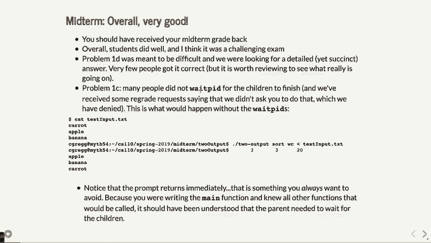

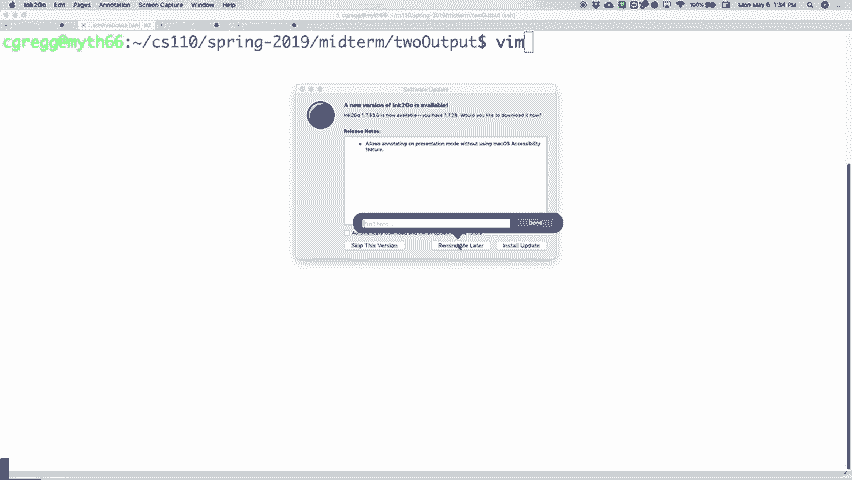


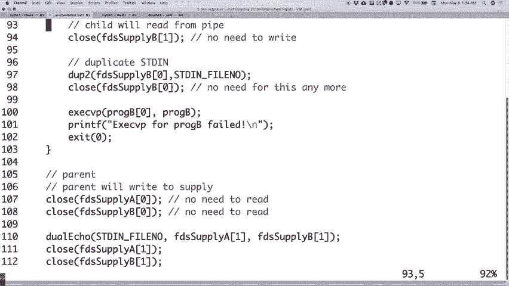

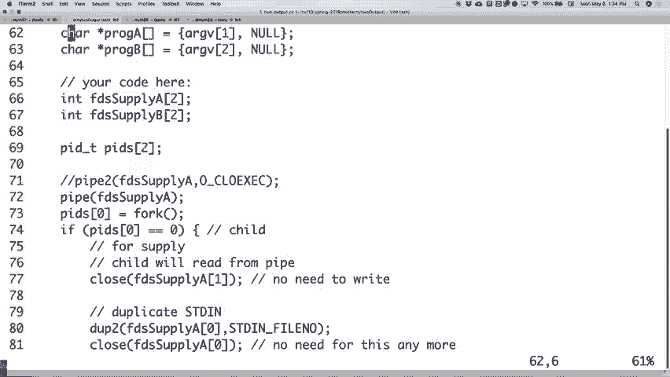


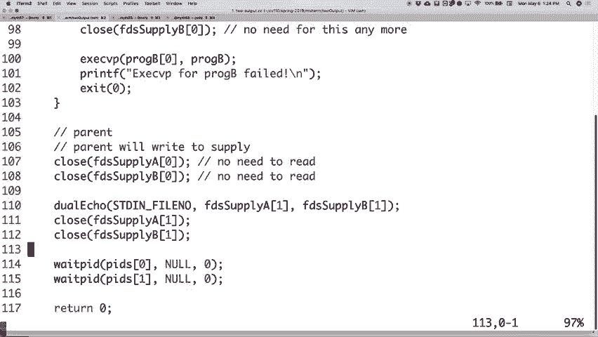

## 期中考试回顾与要点

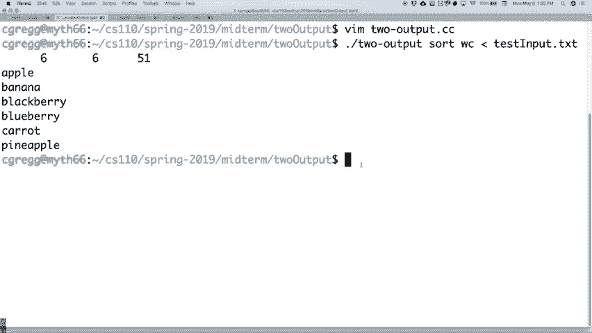

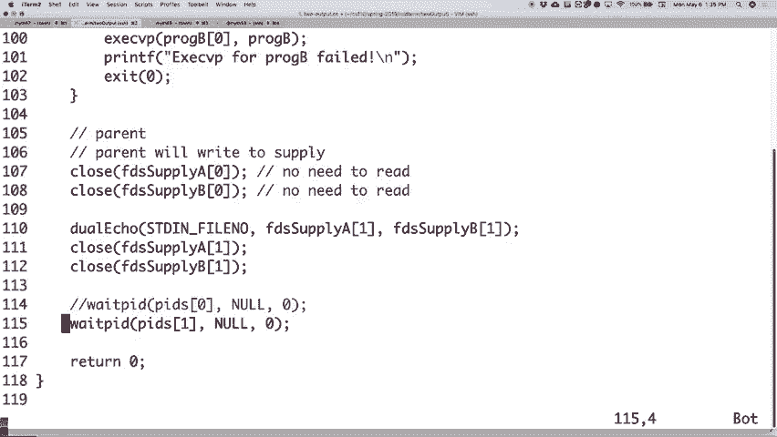


期中考试已经结束，总体结果令人满意。有几个题目设计得比较有挑战性，特别是关于文件系统和进程间通信的部分。以下是对一些关键问题的总结。


### 关于管道与进程间通信


在涉及管道和进程间通信的题目中，一个常见的难点是处理输出的“去交织”问题。核心挑战在于，数据流是动态到达的，你无法在开始传输前收集所有数据。一个可行的解决方案是使用管道，但需要注意管道缓冲区有限，可能会被填满并导致写入阻塞。


**关键代码模式示例：**
```cpp
// 创建管道
int pipefd[2];
pipe(pipefd);

// 在子进程中重定向标准输出/输入
dup2(pipefd[1], STDOUT_FILENO);
close(pipefd[0]);
close(pipefd[1]);


// 父进程读取子进程输出
```
此外，一个重要的细节是父进程必须使用 `waitpid` 等待子进程结束，否则可能导致 shell 提示符过早返回，程序行为异常。


### 关于互斥量的基础

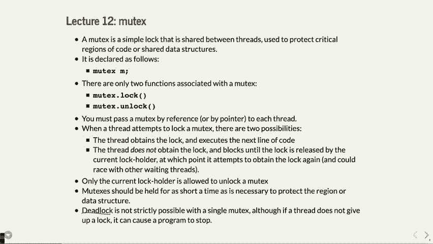

上一节我们回顾了考试中的进程问题，本节中我们来看看线程同步的基础——互斥量。

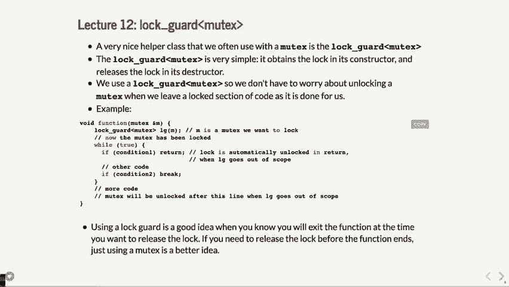

互斥量是最基本的锁，用于保护临界区，防止多个线程同时访问共享数据，从而避免竞态条件。

*   **锁定 (`lock`)**: 线程尝试获取锁。如果锁未被占用，则获取成功并继续执行；如果已被占用，则线程阻塞等待。
*   **解锁 (`unlock`)**: 持有锁的线程释放锁，允许其他等待的线程获取它。

**核心要点：**
*   互斥量必须通过引用或指针在线程间共享。
*   只有加锁的线程才能解锁该锁。
*   应尽量缩短持有锁的时间，以减少对其他线程的阻塞。
*   使用 `lock_guard` 可以自动管理锁的生命周期，避免忘记解锁。


**`lock_guard` 示例：**
```cpp
std::mutex mtx;
{
    std::lock_guard<std::mutex> lg(mtx); // 构造函数中加锁
    // ... 操作共享数据 ...
} // 离开作用域，析构函数自动解锁
```

### 关于条件变量


仅使用互斥量时，线程间通信效率较低。条件变量允许线程在某个条件不满足时主动等待，并在条件可能满足时接收通知，从而避免忙等待。


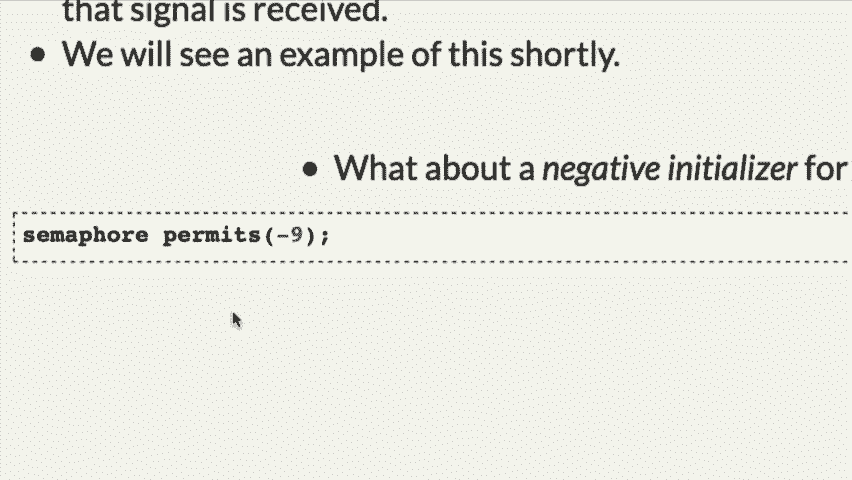


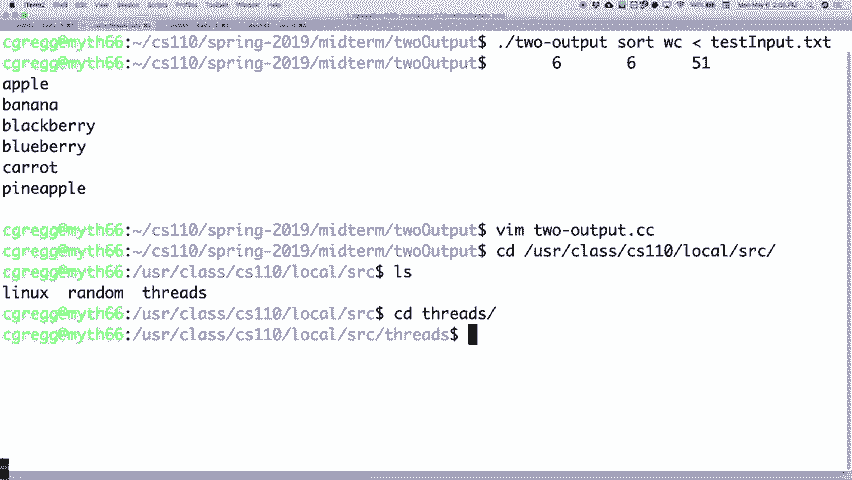

条件变量总是与一个互斥量配合使用。其基本工作流程为：
1.  线程获取关联的互斥锁。
2.  检查条件。如果条件不满足，则在该条件变量上 `wait`。`wait` 操作会原子性地释放互斥锁并使线程休眠。
3.  当其他线程更改了条件并调用 `notify_one` 或 `notify_all` 时，等待的线程被唤醒，并尝试重新获取互斥锁。
4.  线程再次检查条件（通常使用 `while` 循环），条件满足则继续执行。


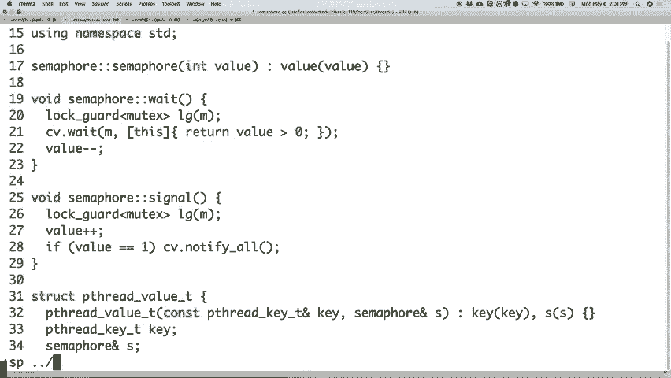


**使用 `wait` 的标准模式：**
```cpp
std::mutex mtx;
std::condition_variable cv;
bool ready = false;

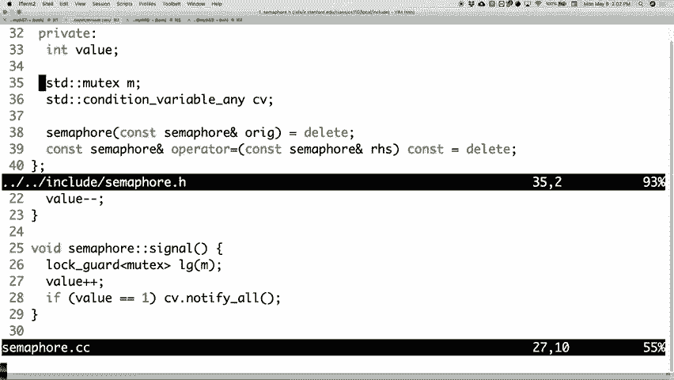

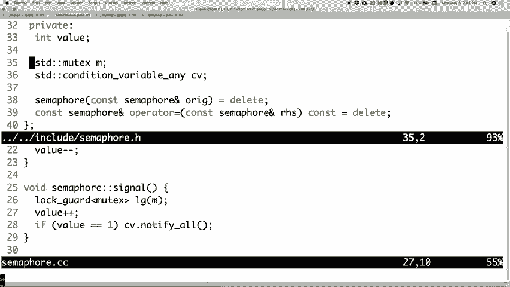


// 等待线程
std::unique_lock<std::mutex> lock(mtx);
while(!ready) { // 必须用循环防止虚假唤醒
    cv.wait(lock);
}
// ... 条件满足，执行操作 ...


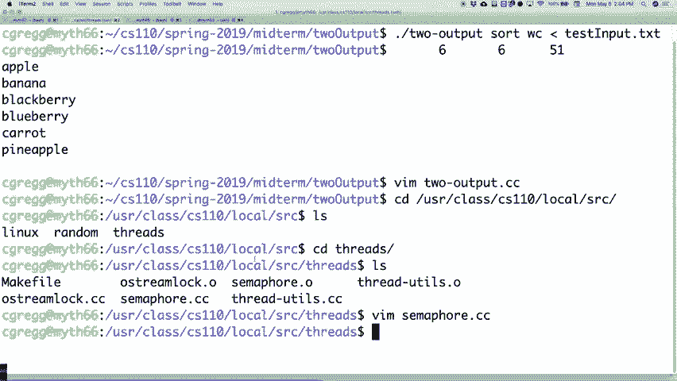

// 通知线程
{
    std::lock_guard<std::mutex> lg(mtx);
    ready = true;
}
cv.notify_one(); // 或 notify_all()
```
C++11 提供了带谓词的 `wait` 重载，可以简化代码：
```cpp
cv.wait(lock, []{ return ready; }); // 等价于上面的 while 循环
```


### 关于信号量


条件变量常用于实现更高级的同步模式，信号量就是其中一种。信号量维护一个计数器，表示可用“许可”的数量，提供了更直观的“许可”管理机制。

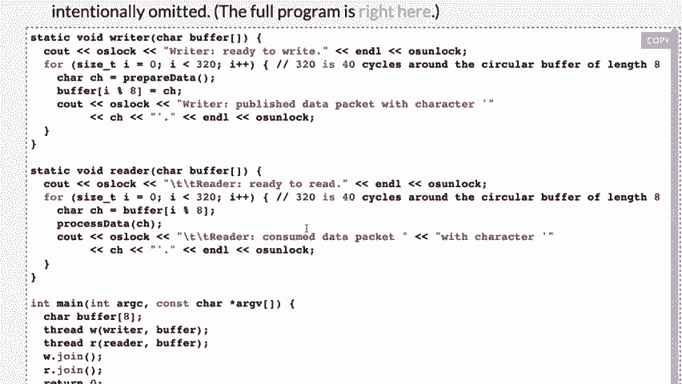

*   **`wait()` (或 `P` 操作)**: 获取一个许可。如果许可数大于0，则减少计数并继续；如果为0，则阻塞等待。
*   **`signal()` (或 `V` 操作)**: 释放一个许可，增加计数。如果有线程在等待，则唤醒其中一个。


**信号量初始化含义：**
*   `semaphore s(5);`：初始有5个许可。
*   `semaphore s(1);`：可作为互斥锁使用（二元信号量）。
*   `semaphore s(0);`：初始无许可，用于线程间的等待-通知机制，类似于“门闩”。


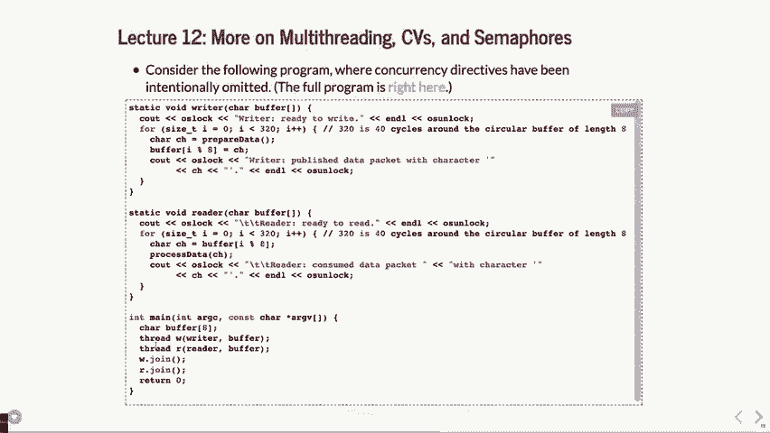


以下是一个使用初始为0的信号量实现线程等待的示例：
```cpp
semaphore done(0); // 初始许可为0
std::thread worker([&done] {
    // ... 执行任务 ...
    done.signal(); // 任务完成，发出信号
});


// 主线程等待工作线程完成
done.wait();
std::cout << "Worker finished!" << std::endl;
worker.join();
```

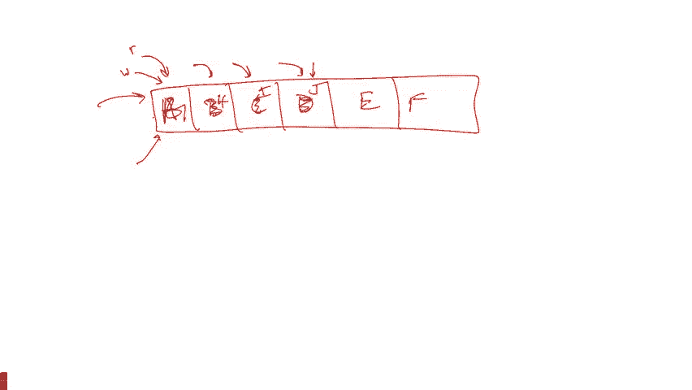


## 同步原语应用实例

理解了基本概念后，我们通过两个经典例子来看看如何应用这些原语解决实际问题。

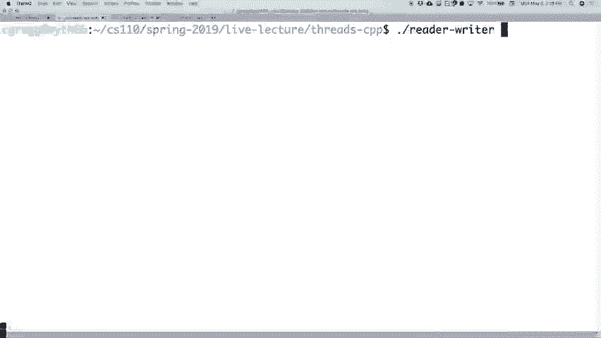

### 生产者-消费者问题（循环缓冲区）

这是一个经典的同步问题：一个或多个生产者线程向固定大小的缓冲区放入数据，一个或多个消费者线程从缓冲区取出数据。需要保证缓冲区满时生产者等待，缓冲区空时消费者等待，且生产消费过程线程安全。


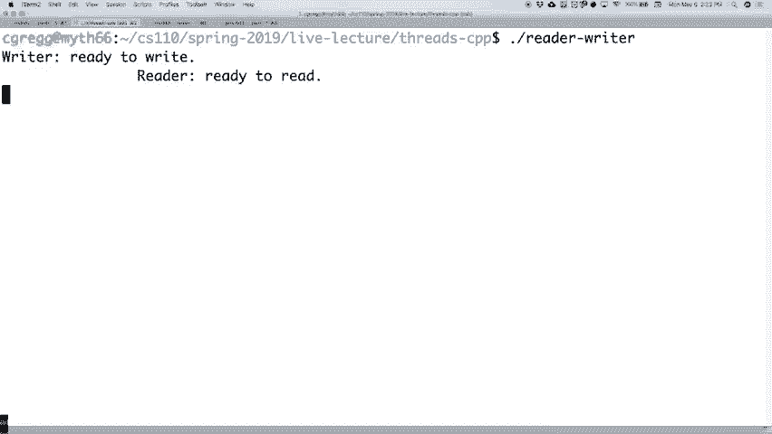

**解决方案（使用两个信号量）：**
*   `emptySlots`: 表示缓冲区中空位的数量，初始值为缓冲区总大小 `N`。
*   `fullSlots`: 表示缓冲区中已存放数据的数量，初始值为 `0`。
*   还需要一个 `mutex` 来保护对缓冲区指针（`head`, `tail`）的并发修改。

**伪代码逻辑：**
```cpp
// 生产者
emptySlots.wait(); // 等待有空位
mtx.lock();
// 向缓冲区写入数据
mtx.unlock();
fullSlots.signal(); // 通知消费者有新数据


// 消费者
fullSlots.wait(); // 等待有数据
mtx.lock();
// 从缓冲区读取数据
mtx.unlock();
emptySlots.signal(); // 通知生产者有空位了
```
这个模式优雅地协调了生产者和消费者的速度，避免了竞态条件。

### 并行任务与限流

考虑一个需要查询多台远程服务器状态的任务（如“MythBuster”程序）。顺序查询会非常慢，因为大部分时间在等待网络I/O。使用多线程可以并行查询，但无限制地创建大量线程也可能导致资源耗尽。


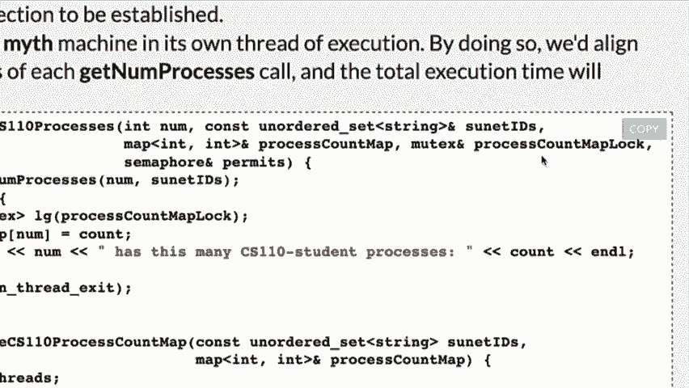


**解决方案（使用信号量限流）：**
我们可以使用一个信号量来限制同时运行的查询线程数量。


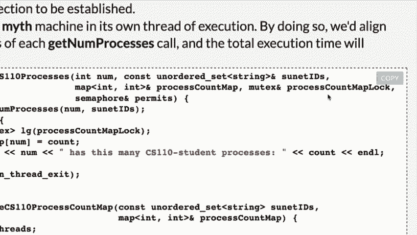


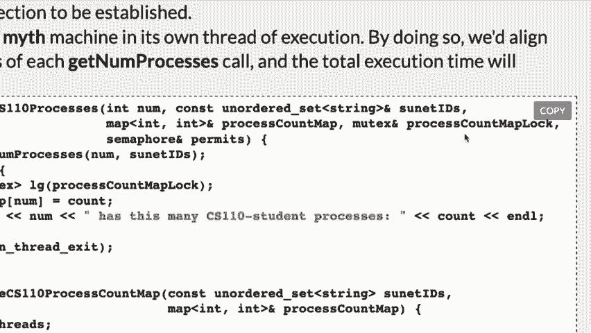


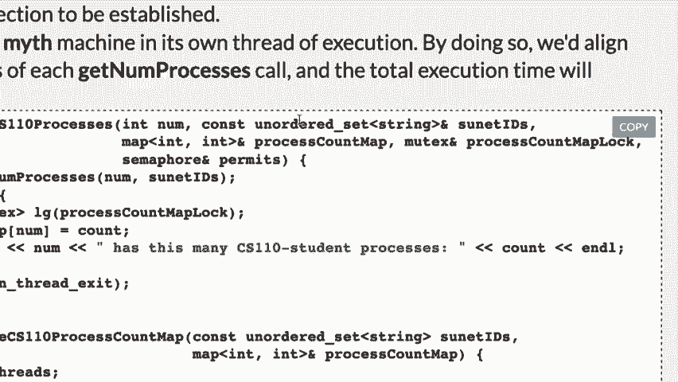


```cpp
const int kMaxConcurrency = 8;
semaphore limiter(kMaxConcurrency); // 同时只允许8个线程“活跃”
std::vector<std::thread> workers;
std::mutex resultMtx; // 保护结果集合

for (const auto& server : servers) {
    // 等待，直到有可用的“并发许可”
    limiter.wait();
    workers.emplace_back([&limiter, &resultMtx, server] {
        // 执行网络查询（耗时操作）
        auto result = queryServer(server);
        {
            std::lock_guard<std::mutex> lock(resultMtx);
            // 安全地更新共享结果
        }
        // 查询结束，释放许可，允许新线程启动
        limiter.signal();
    });
}
// 等待所有工作线程结束
for (auto& t : workers) t.join();
```
这里，信号量 `limiter` 确保了无论有多少个服务器，同时进行查询的线程数都不会超过 `kMaxConcurrency`。注意，`wait` 和 `signal` 的调用巧妙地在线程开始和结束时管理着许可。


## 总结


本节课我们一起复习了多线程编程中三个核心的同步机制：
1.  **互斥量**：提供了基础的互斥访问，是构建线程安全数据结构的基石。
2.  **条件变量**：在线程间提供了更强大的等待/通知机制，常用于实现复杂的同步条件。
3.  **信号量**：基于计数器，提供了更高级的“许可”控制抽象，非常适合用于资源池管理、生产者-消费者模式以及并发度限制等场景。

正确使用这些工具需要仔细分析程序中的共享数据和操作序列，识别潜在的竞态条件，并选择最合适的同步原语来封装它们。记住，目标是在保证正确性的前提下，尽可能减少锁的持有时间，提高程序的并发性能。