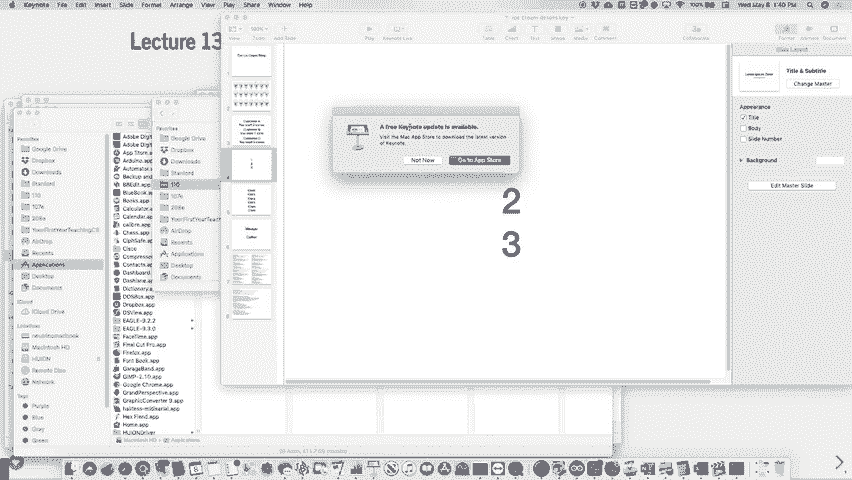
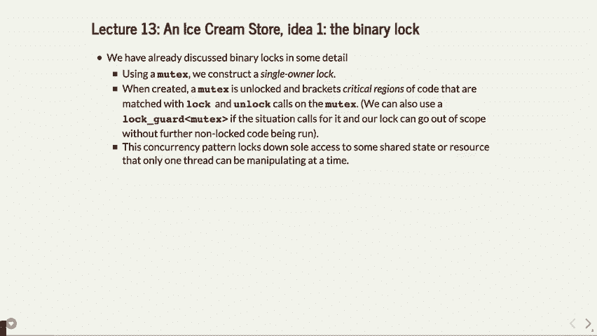
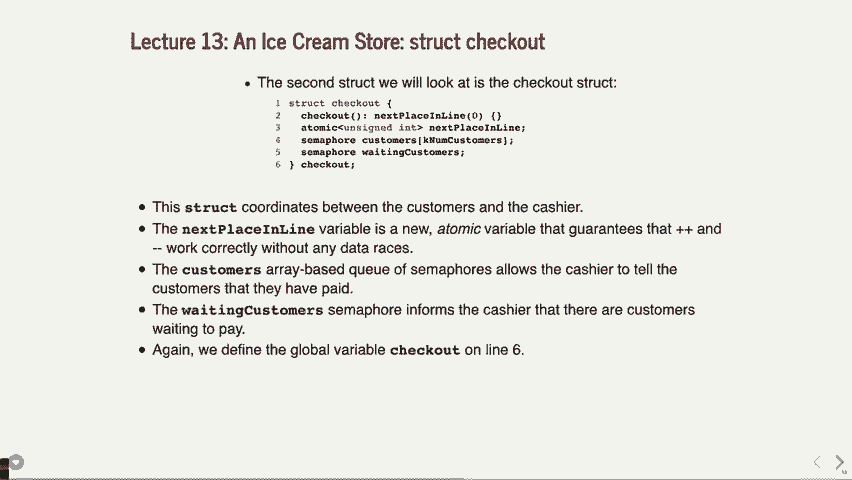
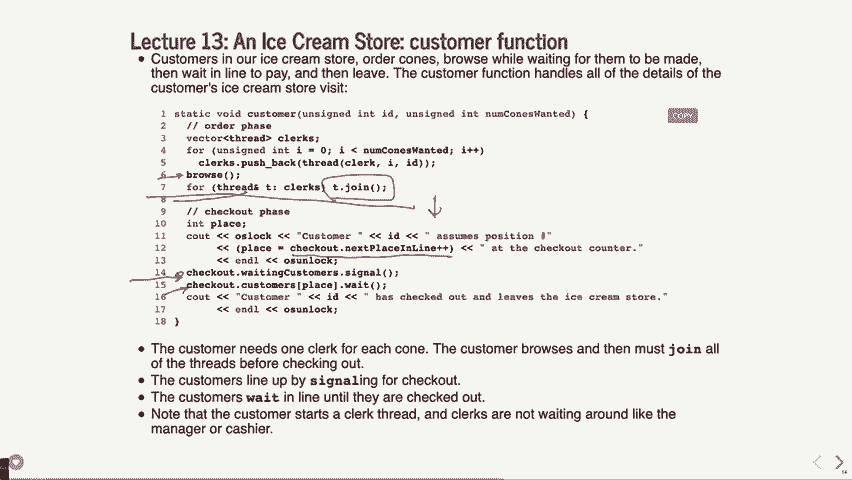
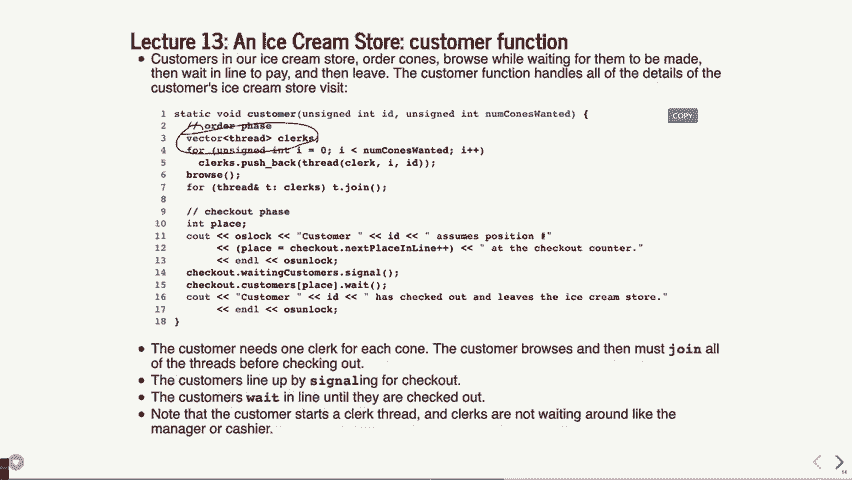
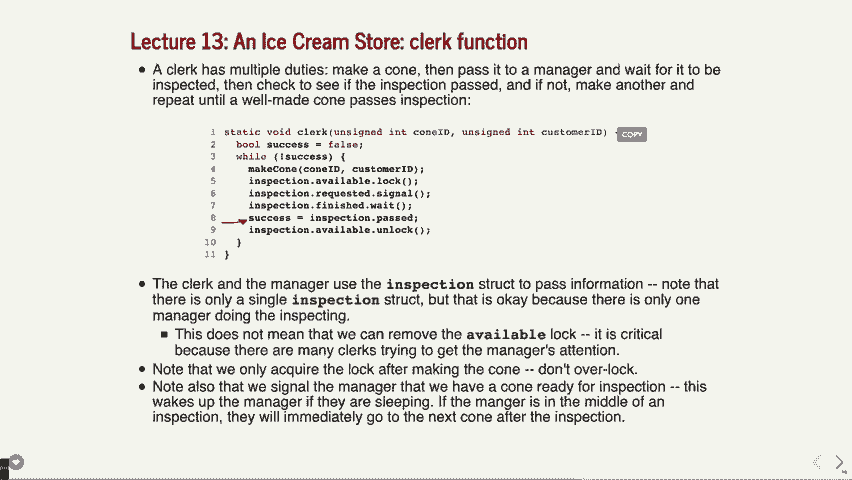
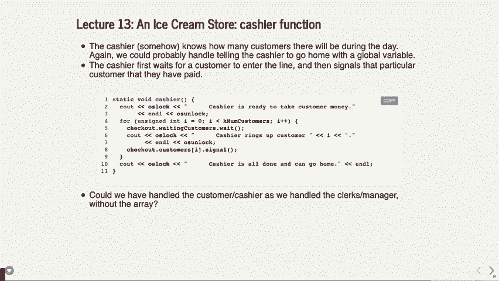
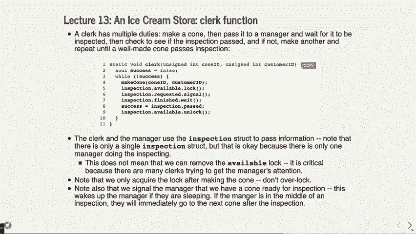
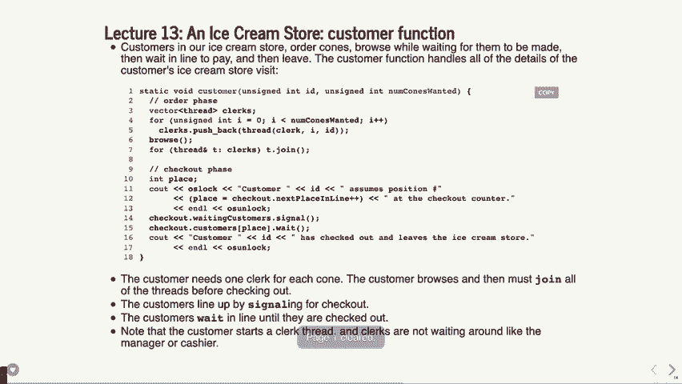

# P14：讲座13 冰激凌店模拟 - ___main___ - BV1ED4y1R7RJ

好的，今天我们开始了。今天有一个问题。希望你们已经拿到了讲义。如果你们有问题，我准备了很多份。今天我们要看一个程序，它将会模拟。它在哪里？

这就是模拟冰激凌店的场景。实际上，我们要进行一次真人示范。我们现在开了一家冰激凌店。抱歉视频前的观众，你们看不到即将发生的混乱。接下来我需要的是11个志愿者或者征召人员。来吧，前三位来做大客户。

这意味着如果你真的买了冰激凌，你就能拿到冰激凌。好，看看。好的，一，二，三。好了。其他人，接下来的人，你们将成为服务员。有人将会是经理，还有人将会是收银员。我觉得有几个服务员。还有其他人上来吗？好的。

非常感谢你们。服务员们，请到这边来。哦，顺便说一下，每个人也拿一本，这是你们的操作手册。好的，应该每个人都有一份。好了，接下来我们要做的事情是模拟一个冰激凌店。实际上，我们要模拟的是一个问题，这个问题曾经在很久以前的 CS107 课程中提出，当时多处理和线程处理的问题让 ANSES-1 出现了麻烦。

以前是这样做的。我们从那时开始已经做了些调整。好吧，接下来我们要做的事情是这样。我们正在设置。经理在哪里？请过来，好，你是经理。你将会是……实际上，大家会为你争夺职位。好，收银员在哪里？你差不多要在最后出现。好，明白了，你有。

这里有一个小小的编号系统。所以1，2，3号，他们，顾客将按顺序取号。我这里有编号，我们有冰激凌甜筒。好的，谁是顾客？顾客在这里吗？好的。现在这是怎么运作的。好，我们现在只用三位顾客来模拟。一个顾客的操作是这样的。

客户进入我们的冰激凌店，告诉你，“我要 X 个冰激凌甜筒。”然后你会知道他们需要多少个甜筒。好的，他们会进来，说要 X 个甜筒。因为他们想尽快拿到自己的甜筒。

或者至少尽可能快，他们会去找一个服务员。出于某种原因，我们的服务员数量和当天要送出的冰激凌甜筒数量相同。每个服务员负责做一个完美的冰激凌甜筒。事实上，每个服务员只能尽力做出一个完美的冰激凌甜筒。

但是经理会保持公正，如果结果糟糕的话。我曾经有个朋友，他曾在一家冰淇淋店工作，他和他的朋友常常比赛，看看谁能做出最小的冰淇淋球，而不被人抱怨。

这真的是一件很刻薄的事。你知道那个小小的勺子，你就会想，“哦，我就是太好心，不忍心抱怨。” 不管怎样，你是不能这么做的。你实际上会有更多或更少的决定因素。这是随机的，但在冰淇淋蛋筒上是确定的。好的。

所以他们看着我，然后他们会拉一个店员。每个冰淇淋蛋筒需要的店员数量。好的，每个店员然后会实际让其他店员走到桌子那边去拿一个冰淇淋蛋筒。这是一个时间上的问题。那里会有冰淇淋蛋筒，你将要制作。当你做完一个冰淇淋蛋筒时，你要走回来并呈交给经理。

好的，顺便说一下，在这个时候，你会在四周走动，等待你的冰淇淋蛋筒。你并不会挡路，你只是等着你的冰淇淋蛋筒。当你做出了一个你认为完美的冰淇淋蛋筒，换句话说，你已经拿了一个，你要把它带回给经理。

如果有两个人同时向经理走去，你们可以争夺谁把蛋筒交给经理。好的，现在你并不需要真正参与这场争斗。基本上随便拿一个，知道吗，谁先拿就给谁，反正那是你的选择。好的，然后经理。

你要决定这个冰淇淋蛋筒是否好。不要告诉店员你不喜欢。 "e" 代表不好，"g" 代表好。哦，好极了。不要告诉店员这些。好的，反正，然后你要么告诉他们，“是的，那是一个美丽的冰淇淋蛋筒。” 在这种情况下，你要说。

"现在我已经做了今天必须做的六个冰淇淋蛋筒中的一个。" 好的，一旦你做好了，可能你会想要跟踪一下进度。你可以说，“我要做六个”，然后你可以说五个，四个。当你做完所有六个，且它们都合格，或者你已经批准过的，你就可以回家了。” 好的，好的。店员们，如果经理说，“不行。”

那不是一个好蛋筒，"你必须把那个蛋筒扔掉，随便扔在地上任何地方，然后去拿另一个蛋筒，回来继续挑战。好的，为了引起经理的注意。好的，顾客们正在等着。现在，如果经理说，“这是一个很棒的蛋筒，完全没问题。”

"你可以把它交给顾客，然后你就可以回家了。" 好的，好的。现在，一旦你拿到所有三个蛋筒，你来拿个号码，好吗？收银员在等着有人处理。好的，现在，一旦你看到有人拿了号码，你就可以说，“哦，我拿一号。”

然后，花你们想花的时间，结账时，确保顾客付对钱。无论他们想要什么。好了，但你必须帮他们结账。一旦结账完成，你就可以标记一位顾客。你必须结账三位顾客，然后你才能回家。好，好的。然后，顾客们，当她帮你结账时。

然后你可以拿着冰淇淋回家。好吧，在那之后，你应该拿到多少个冰淇淋就有多少个。现在，大家都明白了吗？那真的是一大堆东西，一下子说完了。好吧，你们手里有自己的指令。好，实际上，我会调出指令，让大家看看发生了什么。让我们看看。

我要这么做。我会把它调出来。

这里应该是这里，然后是冰淇淋的详细信息。好了。如果这能正确加载，我们就应该执行那个步骤。

然后好了，等一下，现在不行。

这里是指令。我会尽量把它放大。好了。那么，虽然这里有很多内容，但你大概能看到发生了什么，对吧？

顾客拿着冰淇淋筒，拿着冰淇淋筒去找店员，四处走动。店员做他们的事。当顾客拿回冰淇淋筒时，他们去收银台，拿一个号码，等等。大家大概明白发生了什么吗？我意思是，这可能看起来有点疯狂。让我们看看能不能在没有真正争吵的情况下完成这个。

但你可以看到会发生什么。好吧。那么，顾客们。尽情进店，做你们想做的事。好，去做你们的事情。好，店员在那边。好了，我现在要为视频中的听众做点说明。我们是冰淇淋筒的顾客正在问店员，他们在抓住店员。

一位店员走过去拿冰淇淋筒。店员走到经理那里，说：“这是一个好筒吗？”“是的，这是一个好筒。”好的。所以，我们得到了一个好筒，你把它还给那边。好了。然后现在有些人在四处游荡，但有一点，哦，坏筒。我们有一个坏筒在里面。好，这是一个好筒。好吧。所以。

你可以看到这里可能会有一点瓶颈。这里有点不太顺畅。哦，不，我们又有了坏筒。好，坏筒。好的。你有一个好筒吗？这是一个好筒。好的。好的。好了。所以，好的。那么，收银员有没有做什么事情呢？

一个人。好，看来你已经拿到了所有的冰淇淋筒。你只拿了一个筒吗？是的。只拿了一个筒。好。然后，你可以拿个号码。好的，这是一个好的冰淇淋筒。好了。让我们看看。二号。二号来了。好。一个人还在等冰淇淋筒。你拿了所有六个筒吗？我说的是六个。好了。你可以回家了。好的。

经理就是这样结束一天的工作。店员也是。如果你把到目前为止所有的冰淇淋都抓到手了，是的，你们都可以回家了。你们都很好，准备好走了。现在我们就这么做，工作完成了。好的。而且收银员是最后一个回家的。可惜。但是，就这样了。好的，你们都完成了。

然后你得到了你的冰淇淋。好的。现在，这里稍微有点混乱，对吧？没有打架。我没看到任何真正的打架。但是你们是不是看到这是我们即将尝试在一个程序中建模的那些混乱？

好的。这就是我们试图在这里建模的内容。你有程序，而且内容很多。但是我们可以一小部分一小部分地进行。好的。那么关于上面发生的事情有什么问题吗？有人看到什么奇怪的地方，或者没搞明白的地方吗？

有点弄不清楚发生了什么事情。没关系。是的。好的。所以一个顾客问一个人，然后他们都等着。就像，因为技术上只有一个“线程”可以收到信息，然后所有人都等着。是的。好的。好的。那么，第一个好问题是，看看，我对它是怎么工作的，像编程方面，如何运行，我有些困惑。

所以一切都发生得有点并行。每个顾客都可以通过告诉一个店员一次一个店员来要求制作任意数量的冰淇淋。那就是发生的事情。所以有一个顾客去找一个店员，说做一个冰淇淋。出于某种原因，我们有很多店员，每个冰淇淋一个店员，这个模型有点奇怪。

所以我承认这个冰淇淋店的模型有点奇怪，可能在现实生活中行不通。你当然可以让它更好。但是这就是模型——一个想要任何数量冰淇淋的人，去找任何数量的店员，告诉他们做一个冰淇淋。

然后他们去找经理，经理说这个是好冰淇淋，那个是坏冰淇淋，而店员必须继续制作冰淇淋，直到做出一个好的冰淇淋。Emma，你可能做了三次冰淇淋，或者其他任何的尝试，直到做出一个好的冰淇淋，对吧？所以我觉得她应该是来回走了几次，脸上带着皱眉，手里拿着几份冰淇淋。然后收银员必须处理。而注意到，店员们似乎在争抢经理的注意力。

好的。顾客们没有争抢收银员的注意力，你可能希望是这样的情况。就像在一家真正的冰淇淋店，你会希望顾客排到队后，轮流处理，接着一个接一个地被处理。至于店员和经理嘛，他们可以稍微等待，直到有一个人做出决定。好的。我们是否看到了这个基本的想法呢？好的。

现在我们将尝试使用线程技术来建模，希望我们现在已经有了一些理解，但我们将一步步地走过这些技术。

好的，我们实际上会在这个程序中讲解五种不同类型的东西。这是一个比较有分量的程序。我真不敢想象它怎么会成为一题期末考试题。也许是两题，但无论如何就是这样。我们要讨论的是一个二进制锁，到目前为止，嘿，做一个互斥锁。

就是一个二进制锁。我们要做一个广义计数器。你应该在想，也许是信号量。你应该想到这一点。一个二进制会合。二进制会合基本上是，当两个线程试图协调时。比如说，一个店员和一个经理试图做决策，比如店员必须等经理告诉他们冰淇淋是否好，而经理必须等店员过来等等。

所以这将是我们要做的事情。广义会合是指你有多个事情同时发生。这可能是，比如说，要求冰淇淋的人必须等到所有的冰淇淋都做好。它们是广义的，就像是我在等许多事情发生，然后才可以做任何事情。

然后层次化构造或多或少就像是你如何在一个事情之上做另一个事情。我们将做这个，并且看看它是如何工作的。你当然可以去下载代码。你有多线程的所有代码都在你面前。所以如果你正在看某个部分，想回去看看另一个部分是怎么运作的，尽管去做。 

我知道你可能还没有机会真正看过这个内容，但我们会一项一项地讲解。

好的，那么二进制锁是什么？它本质上是一个互斥锁。好的，提醒你一下，互斥锁什么都不做，只是允许两个线程尝试进入某个临界区。而且它们不一定要进入同一个临界区，它们只是基本上在争夺某个资源。只有其中一个线程可以在某个时刻访问该资源。

许多时候，这是一个全局变量或一些共享变量，它们都想要更新，你要做我们所谓的操作。好的，然后再一次，它全是关于单线程访问。

好的，广义计数器，这是我们开始讨论信号量的地方。在这里，计数器本身，信号量本身可以原子性地递增一个变量。换句话说，只有一个线程可以在任何时候执行递增或递减操作。

如果我们有一个计数为零的信号量，比如没有许可，它基本上只是用来进行信号的往返传递。好吧，所以一个线程可以通知另一个正在等待的线程，表示这里没有许可，只有一个线程在等待。

所以我们在后面会看到这些用法。好吧，这就是你在协调一些有限资源时使用的方式，这些资源有一定数量的东西。可能是一些列数或一列，或者你知道的某种数量的东西，你可能希望将其连接起来。

好吧，好的，二进制会合就是在这里，你再次使用信号量，这是为了线程间通信。好吧，下面的这个例子很不错。假设我们有线程A需要知道线程B什么时候完成某些事情。好吧，比如当经理需要判断冰淇淋是不是好坏时，店员就得等着，必须等另一个线程完成它们的任务。好吧，我们可以做的是，让这个会合信号量初始化为零，因为我们关心的只是信号部分。

好吧，线程A实际上在等待这个信号量。好吧，在线程B完成后，它会通知线程A，线程A继续执行。好吧，线程B不关心其他线程在那时做的事情。它只是发出信号，然后继续。好吧，这就是二进制信号量工作原理，或者说在这种情况下的二进制会合。

好吧，只有一个事件需要发生，这就是我们关心的全部。好吧，这有时也用来唤醒其他线程，比如某个线程一直在等待，直到有人用这个信号将它唤醒。这是一个很好的理解方式。你可以进行双向会合。这与广义的会合不同。这基本上是一个线程等待另一个线程，而另一个线程又等待其他线程。

你必须非常小心这样做，避免它们同时等待，因为那样会导致死锁。所以你需要小心这一点。好吧，所以你得理清一些逻辑。好吧，好的，广义会合是指你有一个二进制会合和一个广义计数器。好吧，这可能就像冰淇淋顾客等待店员做某些事，或者实际上是在等待多个店员做某些事，他们必须等在那。

所以在这种情况下，线程A生成了五个线程B。听起来就像是冰淇淋顾客去问五个不同的店员。好吧，线程A生成了五个线程B，并且需要等它们都完成某个进度后再继续。这时我们会使用这种技术。好吧，再次强调，信号量初始化为零。当线程A需要和其他线程同步时，它会被阻塞，直到它们都完成。

好的，当所有人都完成后，线程a将能够继续执行。好的，这个部分的普遍性在于你有一个任务要分配。你说“我需要做三个冰激凌球”，然后将这三个任务分给三个不同的店员，你需要将这个过程普遍化，然后等待所有这些任务完成。这就是通用的会合（rendezvous）模式。好的，接下来这个层级结构基本上是将所有这些内容结合起来使用，意味着我们有一个互斥量，然后可以有一个使用该互斥量的信号量，如何将它们组合在一起。

你们有一些全局计数器，使用了这个计数器，它将与互斥量（mutex）关联，你需要等待计数器的值变化或达到某个值等等。所以这里的主要内容是，你需要能够将这些构造一起使用，以适应你需要做的事情。

好的，没问题，让我们看一下实际的代码。好的，我们已经讨论过这个了，我们已经把它建模得相当清晰了，好的，冰激凌店员、经理、顾客、收银员，很多店员，一个经理，一个收银员。顾客比较着急，所以每个冰激凌球都会配一个店员，然后一旦他们拿到冰激凌球，就去找收银员。我是说，这个模型还算不错。

然后每个店员只制作一个冰激凌球，是的，这有点奇怪，但这就是在这个世界中的运作方式，经理必须决定这个冰激凌球是否合法。好的，收银员面临的最大问题是，必须使用先进先出（FIFO）队列，否则就会一团混乱，因为顾客会说“我先到的，为什么你没有照顾我”，而布伦达是不希望那样的，因为她可以帮忙处理其他顾客。

好的，然后我们实际上需要在某个时刻决定每个人什么时候下班，这有点奇怪，因为经理必须在那之前做完六个冰激凌球，虽然有点怪，但我们本来可以用其他方法来实现，不过在这个例子中，我们直接决定从一开始就这么做。

你们将看到代码是如何体现这一点的。好的，开始之前，有没有问题？你们现在已经看过了整个大致框架，我们接下来将看一些代码，你们应该已经有个大概的了解了。好的，很好，那么接下来我们将看一些具体的内容。好的，我们将看代码的各个部分，你们已经有这些内容了，我会尽量告诉你们这些内容在哪一页，因为它们在代码中并不是按照顺序排列的。

但我们首先要看的内容是随机数生成器，只是为了了解它在哪，这个内容实际上在手册的第4页。

我把它也写在这里了。基本上我们这里有很多随机因素，为什么呢？因为我们想让它看起来像是某种实际的时间限制，并且时间并不总是一样的。好的，我们经常用这些方法，这让调试变得有些困难，因为它有点随机，但它肯定能测试很多不同的情况。

好的，这些大多是时间，我们有获取数量的功能，实际上有几个标记获取数量的甜筒，比如顾客走进来告诉我们他们想要多少个甜筒，这就不是一个时间。而有浏览时间，是顾客在周围转悠的时间，这是其中的一部分。

这里有准备时间，这是指店员制作冰淇淋甜筒所需的时间，可能好也可能不好。然后是检查时间，这个时间是经理所需要的，最后是检查结果，这是关于甜筒的二元决策——好与不好。

好的，相对简单，不需要特别关注它，只是使用了我们自己写的库函数来获取这些值。好的，我们来看一下这些结构体，所以如果你在106 B或者106 A，你可能会对看到这种全局结构体感到不适。

好的，为什么呢？因为我们并不一定喜欢全局变量，但在使用线程时，有时传递全局变量或者使用全局变量会比传递结构体更简单。出于封装的原因，我们可能会希望将它传递给一个更健壮的程序，但现在我们只是创建了一个名为inspection的结构体，它包含了这些字段。

好的，它有一个可用的互斥锁，这基本上是它与经理之间的握手，实际上是店员与经理之间的二进制交互。好的，所以有一个可用的互斥锁，这基本上意味着在同一时间只有一个店员可以和经理打交道，经理每次只能检查一个冰淇淋甜筒，这就是互斥锁。

好的，有一个信号量用于通知经理“嘿，我有一个冰淇淋甜筒给你”，还有一个信号量用于通知店员“嘿，这是你的冰淇淋甜筒，它糟糕或者很好”。还有一个布尔值，用来表示它是否通过，顺便提一下，在这里我们创建了一个名为inspection的结构体，并立即将其声明为一个变量。

似乎它过载了这个名称，但就是这样，这仍然是一个全局变量，尽管我们不一定非要做成全局变量，但这样做更简单。现在有几个有趣的点，如果只有一个值表示是否通过对吧？那在任何时候，有多少个东西可以使用这个结构体呢？

一件事，好的，一个经理或者一个职员一次只能检查或使用它，只有一个经理，这样挺好的。实际上，如果我们做了多个经理，比如看看多个经理或者助理经理之类的，那么我们就得重新考虑这个问题。我们可能需要其他东西，比如这些检查结构体的数组，或者其他什么，因为现在它的工作方式是，一次只有一个值，表示冰淇淋是否合格。

好的，好吧，这就是结构体的工作原理。到目前为止，你对这个结构体有什么问题吗？也许你没有问题。我们很快就会看到它的实际应用。

好的，还有另一个结构体，就是结账的那个，我们有点提前跳到结账阶段了，但结账有一个信号量，用于排队等待的下一个人。好的，这是一个新的整数类型，它是一个原子无符号整数，这意味着这个变量可以被多个线程同时更新，而永远不会发生重复计数。

所以是原子性的，这使得它无论 10 个线程同时操作，`++` 都能正常工作，这就是我们所说的线程安全。无论 10 个线程是否更新，它都会得到 10 次递增。是的。啊，好问题，问题是，嘿，是否有时候你不想使用原子变量？大多数情况下你不会使用，因为大多数时候你并没有使用线程，对吧，而原子操作比较慢。

好的，因为它需要做其他一些操作，而且实际上需要硬件来支持它，所以它是一个不同的指令，并且有其他硬件支持，这意味着它会稍微慢一些。如果你了解 C 和 C++，底线是让用户按需快速完成任务，但也给他们提供正确完成任务的工具，如果这成为一个问题的话。

所以这是那种仅在需要时才使用原子数值的情况，否则使用更快的类型，因为大多数时候你并不需要它。非常好的问题。是的，如果你只用了一个普通的无符号整数，并且进行了 `++` 操作，它会比进行原子 `++` 操作更快，因为后者有额外的开销。

哦，对对，没错，当然你知道，最后一次我们本可以使用一个，也许我们可以用一个自主编号的信号量来实现，或者我们也可以使用条件变量。在这种情况下，我们将看到它是如何递增或被记录的，然后你会明白，如果我们有这个原子操作，我们不妨使用它。

我们会在实际操作中看到。我们会看到某人如何在“下一个排队位置”处进行操作。很好，这是我们将使用的几个结构体之一，依然是全局结构体。好的，其他的结构体也是全局的，可能有多个类型的线程同时访问它。实际上这是可以的，但收银员还是会按顺序根据数组中的顾客处理他们。

好的，也许你会明白，如果你能原子性地更新下一个排队位置，那么你就可以将其作为实际的索引来访问数组，并确保每个顾客都能在数组中得到自己的位置。你会看到这个过程的发生。好的，等待顾客的信号量通知收银员有顾客在等待，所以收银员将开始工作，然后等待顾客完成，最终顾客会发出信号通知收银员。

嘿，我准备好结账了，能结账吗？好的，有其他方式可以做这件事，但这只是其中之一。好的，我们继续下一个内容。好了，这是第一个真正的主要功能，这是顾客功能，顾客功能在页面上。

是的，第九页，接近最后，主顾客队列之前。好的，那么顾客要做什么呢？顾客一进入就知道自己想要多少个冰淇淋，我们会在主函数中初始化这一点。

然后顾客会创建一个服务员的向量。好的，它本可以创建一个服务员数组，数量无关紧要，在这种情况下我们只是创建一个向量，在C++中我们可以使用向量。然后它会调用线程来执行服务员功能，并传递它的变量i，虽然i在这里并不是顾客的ID，ID会根据实际情况传递，因为我们有两个东西要处理——冰淇淋的数量（即i）和顾客的ID。

好的，这个信息将传递给服务员，所以服务员需要知道该去找谁。顾客会触发一个请求，告诉服务员：“我的ID是某某，我是某某”。然后顾客去浏览，花点时间做其他事。

好的，接下来顾客必须做的事情是，顾客必须等待，直到所有的冰淇淋已经做好才可以结账。没问题，这意味着他们需要等到所有的服务员都做好了冰淇淋。

现在他们可能还在浏览，所有职员也已经结束了，但无论如何，当你走到第八行时，客户就知道所有的冰淇淋已经做好了。问题？是的，好问题，这里的 `join` 仅仅是阻塞直到线程完成，这就是 `join` 的全部意义，并且在线程完成后它会清理线程。

好的，到此为止，我们知道，接下来客户可以结账，因为所有职员都已经完成了冰淇淋的制作。好的，现在没有那种“这是你的冰淇淋”之类的业务，我是说，这一切本应发生在别的地方，我们没有把这些内容整合到这个环节，但你可以假设，如果我们真的在做这件事，实际上这里会有一个冰淇淋交接的过程。

但在这种情况下，职员只知道，或者客户知道，他们已经有了三只冰淇淋，可能正在等结账，谁知道呢。好了，接下来客户必须去找下一个排队的位置，看看这一行，这里可能会有你的问题。

查看下一个排队的位置，这个操作将把下一个排队的位置分配给这个客户，并原子性地递增该变量。好的，这意味着如果两个线程在同一时间到达，如果两个客户同时到来，那么其中一个将获得下一个排队的位置。

另一个客户将获得下一个排队的位置，这是有保证的。好的，这里没有竞争条件，特别是因为我们使用了原子变量，否则我们可能会在上面加一个锁，再更新排队位置，最后再解锁。

如果我们有了这个原子整数，这会让事情变得稍微简单一些，反正我们可以用它。这样一来就不再需要锁了。是的，是的，好问题，实际上你确实需要锁的情况并不多，原子操作的种类并不多，递增恰好是其中之一，我们可以在整数上执行递增和递减操作，并且能原子性地改变它。

我觉得你也可以对它做加法、减法、乘法，任何你想要的操作，你可以对它应用 `map`，它会原子性地执行，但如果是 `map` 操作，并没有原子性的 `map`，所以仍然需要锁和解锁，这样做虽然简单一些，但你完全可以用锁和解锁来实现这个操作。

是的。我们无法知道它会是什么吗？是不是类似的事情？

你想知道它是如何原子性地执行的吗？是的，这超出了本课程的范围，但有一些机器指令，当你调用它们时，会原子性地执行这个操作，你只需要设置它，以确保这比你所能做的稍微复杂一点。

这不仅仅是使用那个操作就像是使用那个操作一样。可能说的就是，它可能真的只是那一类操作上加了一个锁。可能就是这么简单，我没有查过，但我认为在其他情况下，会有机器指令，它会加速过程，所以你可能会想要使用这个。[听不清]，是的，问题是，嘿，看看我们在进程中如何进行阻塞和解锁，如果多个进程能够更改其中一个。

它其实不是一个全局变量，因为它可能会调用一个信号处理程序，因为成员进程不共享内存。但在这种情况下，如果你使用原子变量，你就不需要锁了，只要你做的只是更新变量本身。

你不需要担心，因为它将以一种方式完成，这样你就不需要在它上面做锁。只是另外告诉你，如果是这种情况，你可以使用它。不要过度使用，因为它会稍微慢一点，但如果你能使用它，或者你也可以选择加锁，这不会有人因为你选择其中一个而扣分。好了，那么当客户排队后会发生什么呢？客户告诉收银员继续结账，所以收银员会在等待时收到信号，哦，有信号了，开始处理。

下一个客户和收银员将根据相同的变量查看下一个客户是谁。好的，你会看到当我们到达收银员时它是如何运作的。并且在收银员结账的时候，客户必须等。好了，所以客户会说“结账”，客户会等。记住，这是每个客户对应一个信号量，或者说，实际上是每个客户的信号量。

让我们再看一下信号量，它是一个信号量的客户，它只是一个零值的信号量，仅用于信号传递，不需要任何像许可证之类的东西。

你能用许可证来做吗？也许吧，不过关于许可证的问题是，仍然会有一点竞争条件，关于谁会先处理的问题。比如用许可证的方式，如果你向所有人发信号，它们就不一定按顺序处理。

这会是个问题。好的，我们需要基于我们的模型按客户到达收银员的顺序处理客户，这是最重要的部分。好了，一旦收银员传回信号，客户就结账离开了。

好的，问题来了，看看这里的等待，告诉我那是什么等待？顾客刚刚做了什么？顾客刚刚给收银员发送了信号。那么顾客接下来需要做什么？等待收银员结账，这就是发生的事情。

好的，所以这里有两个信号：一个是信号收银员说，“嘿，你能帮我结账吗？”然后等待收银员的信号回复。现在收银员必须按正确的顺序进行回复，因为这个信号没有等待的过程，你发送信号后就可以继续前进。

所以可能所有顾客都在这里等待，收银员需要发出信号给下一个正确的顾客，然后我们将看到这个是如何运作的。好的，问题来了。收银员会按顺序发出信号，我们将看到这个是如何发生的。

有没有可能排在后面的顾客会先完成他们的冰淇淋，或者是他们还没向收银员发送信号呢？对，所以第二个问题基本上是，如果排队的某个人是否可能比排在前面的顾客先完成他们的冰淇淋呢？

记住，顾客会一直在等，直到他们的冰淇淋做好，然后才会排队。好了，这不是那种大家都去拿东西然后排队的情况，不是的。你是只有在冰淇淋做好时才去排队，所以你排队的顺序就是这样。

当然，也有可能是两个顾客同时拿到冰淇淋，然后争抢谁先排队。这没问题，但无论如何排在第一位的人会先由收银员处理，我们稍后会看到面试中是怎么处理的。

还有其他问题吗？是的。有点困惑的是，这看起来有点奇怪。所以整个结账顾客的流程。这是因为你实际上有一个顾客的信号量数组，每个顾客一个信号量，或者你有一个信号量用来跟踪所有顾客的位置。

不，我们来看一下。有一个顾客数组，每个顾客有一个信号量。对，所以每个顾客都有一个自己的信号量，他们如何知道自己在排队中的位置？

他们就在这里，按顺序获得他们的位置，通过获取下一个排队位置的变量，每个顾客进来时更新这个变量，然后递增它，这样下一个顾客就能得到下一个排队位置。这就是我们在做的事情。收银员只是稍微浏览一下，按顺序处理每个人，知道下一个应该处理谁。

对，收银员知道要处理谁的唯一方式是因为收银员收到了信号。所以这就是信号传递的部分。好的。现在是不是有点开始明白这些东西是如何运作的吗？

很好。好了，如果你现在心里想：“哦，我明白了，非常棒。”那我会很高兴的。如果那是你脑海中的想法，那就太好了。

好的。顾客是如何浏览的呢？非常简单。顾客只需要获取一个浏览时间，然后按这个浏览时间休眠。好了，`sleep for`是线程休眠一段特定时间的方式。它们执行`sleep for`，然后是微秒或毫秒为单位的时间，然后它们就这样做，顾客就这么度过了多少秒。

好的，明白了，就这样。

好的。我们来看一下职员函数。记住一点。

哦，顺便说一下，发生了什么？我们有点跳过了这一部分。这是职员线程开始的地方。回到顾客函数中。这是一个有趣的点。我们会看到，到了主函数中，经理、顾客和收银员都是在主函数中创建的。然后，收银员和经理几乎立即进入睡眠状态，因为他们暂时没有事情做，但他们的线程已经启动了。

是的，他们的线程已经启动了。所以这意味着唤醒他们所需的时间其实更少。实际上，这将直接进入下一个内容。事实上，不是下一个作业，我会在今晚某个时刻发布它，或者是下一个作业。你将学习到一种叫做“线程池”的东西，它是准备好等待执行的线程。

这听起来像你见过的其他作业吗？可能是农场作业。对吧？农场作业是进程在等待启动。它们已经准备好了。它们是我们所说的“已启动准备就绪”。这是同样的情况。我们正在启动顾客、经理和收银员的线程，但直到顾客实际执行时，我们才启动职员线程。

所以就像顾客去“雇佣”一个职员。你可以这么理解，虽然那样说有点怪。

现在我们进入职员函数，看看职员会发生什么。职员需要做什么？制作一个圆锥，如果圆锥不完美，那就需要再做一个，直到经理说“你已经做出了完美的圆锥”。

所以这里有一个小的循环，表示“当没有成功时”。这个成功是一个局部变量，不需要锁定什么。它在职员本身之前，所以就是这么回事。挺不错的。每个职员都有自己的成功变量。没有必要在那个上加锁，也没有理由加锁。

职员做什么？职员制作一个圆锥。职员锁定可用的锁。可用的锁是指经理是否可用。所以职员说：“我需要锁定这个经理锁。”如果一个线程尝试锁定，而另一个人已经持有锁，会发生什么情况？

就是这样被阻塞了。所有职员都可能来到这里，这时他们在与经理争抢。经理正在看着一个锥形物，然后说经理解锁了这个锁并可以继续，或者另一个职员拿着锁并解锁它，这时经理变成了一个自由角色。

其他所有职员试图立刻抓住那位经理。然后，一旦锁定完成，职员就说：“哦，我要给经理发信号。嘿，请检查我的锥形物。”然后它会做什么？它等待。这看起来完全像之前的情况。第一次信号发出后，你会等待，因为你在告诉另一个线程。

“做点什么，我会等你完成。” 好吗？问题，怎么样？

>> 那么，是否请求了检查部分并且已经完成，或者两者都已完成半信号？

>> 它们都是半信号和零许可的。只是在这种情况下，它是一个信号半信号。完成的那个或请求的是请求经理的。顺便问一下，你觉得经理此时在做什么？

如果经理在等待请求的信号，它就会等待。所以这就是它正在做的事情。然后经理必须向线程发送信号：“哦，现在你可以继续了。”所以只有一个请求和一个完成。那么，这意味着一次能处理多少事物？

事实证明，只有经理和职员是相关的。但没有其他职员，因为他们都将被卡在这个锁上，直到他们能够去更改任何东西。这就是为什么这里只有一个零一的需求。>> 所以像是下面的方式。>> 总是有一个在等待，总是有一个说：“是的，然后经理发信号。”也许吧。

也许不会，取决于这些事情需要多少时间。经理可能正在睡觉，这意味着经理会一直等，直到收到信号。或者可能立刻发生。我是说，所有这些的好处是，我们设置的方式，只要事情进展顺利，它就能尽可能高效。

可能会有一些等待时间，但这种等待时间超出了我们的控制范围。我们会让它尽可能高效，所以不会有额外的等待时间。而且这里肯定没有忙碌等待。我们不是在旋转等待，也没有进行任何处理。我们只是在想，“看，我知道我在等其他线程。”

我会一直睡觉，直到事情发生。事件发生后，我继续前进。”这就是它的走向。>> 为什么要在请求和完成之后继续？它是如何等待信号请求并且然后在请求上等待的？

>> 是的，问题很棒。为什么我们不能在请求和完成时发信号？然后再等待请求。我在考虑这个问题。我认为那里会有竞争条件。如果你先发信号，然后再等待，你可能实际上是在接收自己的信号。如果一切必须按照一定的顺序发生，你不能，必须按顺序进行。

它可能会按顺序发生，你发送一个信号，去休眠并等待。然后，当信号传播通过操作时，它会回到你这里，而不是另一个在等待。而且，不仅如此，信号量会再次下降，然后实际上需要两个信号。

所以那可能是更好的方式。实际上，两个信号会导致其中一个必须等待，除非它恰好按顺序发生。所以你应该避免那种排序的噩梦。在这种情况下，使用两个信号，因为你知道一个线程会等待请求。

另一个会等待完成，然后你就没问题了。你可以试试看。事实上，去试试用一个去构建，看看你是否能让它发生死锁。但我想你应该能做到。好问题。好了，店员方面还有别的内容吗？

店员在做什么？哦，对了，店员在做什么？这里，店员说。等待经理回来。然后，店员检查是否成功，并说，哦，要么通过，要么没有，对吧？如果没有通过，首先，它解锁。如果没有通过，那么它再做一个圆锥，对吧？否则。

如果不这样做，它会离开。所以它可能会停留在这个循环中，只要它一直在做坏的圆锥。它将一直停留在那个循环中。真正理解发生了什么。好的。好的。

做一个圆锥很简单。它将再次等待。它就像说，我马上要做一个圆锥了。然后它会花点时间，休眠一段时间。然后告诉花了多少时间。最后我将运行这个程序。它会滚动屏幕，就像，哦，天哪，发生了什么？

但你会看到它发生时的情形。

好吗？好的。让我们看一下经理函数。所以经理，记住。经理一开始就知道今天要做多少个圆锥。这有点奇怪。我们本可以做其他事情，比如有一个布尔标志，表示所有圆锥都会做完。所有其他信号都会处理，或者甚至没有信号。

你还可以有另一个信号，如果你愿意的话。或者你也可以说信号可能会很好用。再加一个总结，表示经理已经完成了。它说，回家吧。你完成了。也许你还可以将它和收银员的信号联系起来，之类的。

尽管经理实际上可以先回家，虽然这不是最好的业务流程。因为收银员可能还在照顾其他顾客。但这就是它所做的。所以它需要知道——它知道需要做多少个圆锥。经理知道需要做多少个圆锥。然后他们将尝试做一大堆。

我们这样做只是为了记录它，事实证明如此。然后他们会批准一堆圆锥。直到批准了他们需要的圆锥总数，他们才能离开。他们首先要做的事是，确定是否能离开，但他们不能立刻离开。接着他们会等待请求。因为他们在等职员来给他们一个冰激凌圆锥并说。

请在这里调查。请检查这个。然后他们检查圆锥。只是再检查一遍。它只需要一些时间。然后会花一些时间，实际上会更新结构，标明圆锥是否通过了检查。然后在检查之后，它会向等待的职员发出信号。

去检查你的圆锥。我刚检查过了。然后它会把尝试的圆锥数量加一。如果检查通过，它会显示验证的数量。现在，能否同时发生呢？这可能和职员查看检查是否通过的过程同时进行。如果他们同时查看同一个变量，这样可以吗？其实是可以的。

只要没有线程能够在另一个线程查看时更新它，许多线程可以同时查看同一个变量，因为它不会改变。所以这是完全可以的。它们可能会以某种奇怪的顺序进行，可能是在汇编语言中，但这不重要。没关系。好的，那么他们之后做什么？接下来是什么？

经理在检查一个圆锥之后做什么？他们检查圆锥编号，可能会更新圆锥的验证数量。然后他们会返回到循环中。如果他们已经达到需要的圆锥数量，就退出循环，结束这一天。这个问题就到这里。[听不清]，再说一遍。[听不清]，哦，真是个好问题。好的。是的。

所以你是说，看，锁在这里发生，哦，锁在这里发生。这个是这里的那个吗？

对。所以这里发生了锁定。好的。你只需要记住，锁并不关心有什么数据结构存在。它不知道。它并没有说你不能触碰这个数据结构。它只是说任何尝试获得这个锁的人都会被拒绝。对吧？它只做这件事。它并没有封装一个数据结构。它只是说没有其他人能触碰它。

它只是在说，嘿，如果你要尝试获得我的锁，你是无法得到的。所以在这种情况下，它是非常抽象的。对吧？它只是说没有人可以跨越这条线，直到锁被解开。这就是故事的结尾。好的，明白了。

好问题。这个回答能帮到你吗？它并不会影响实际操作。所以不会，经理可以去做任何事。

到那时，数据结构的操作就不需要锁了。如果是两个线程尝试更新该数据结构，那么你就需要加锁，这样只有一个线程能够基于你的锁定逻辑进行更新。所以，它可能会进行一整块操作，直到它成功修改，或者它会怎么样？不会的，你会收到一个通知。

如果尝试，嗯，非常好的问题。如果经理试图更新这里的内容，实际上它会更新，实际上它会更新检查员 Cohen，我们稍后会看到。它会更新是否通过的布尔值。完全可以做到这一点。这个不是子任务。

店员在得到信号之前不会查看它，在那种情况下会没问题。所有的内容都会更新，没问题。好的，其他关于这个的疑问吗？

听起来你们已经开始理解了。太好了。好的。那么，接下来，我们来看一下，为什么只能有一个等待中的店员？因为那个锁。这就是整个问题所在。之前的锁，如果所有店员都在那儿，他们会说：“我还不能做任何事情。”好的。那么，让我们看看，这就是检查员 Cohen。

这并不太有趣，基本上就是在检查系统时，它会睡一段时间，然后根据从 `get inspection outcome` 返回的随机数更新检查结果，并报告是否通过。然后结束。这就是检查 Cohen 的全部功能。但再次强调。

它确实会更新检查是否通过的结构体，但这完全没问题，因为我们知道从逻辑上讲，没有其他线程在查看它。好的。顺便提一下，它做不到的是不能访问顾客，顾客不能……如果店员去说，“哦，我没能通过这个检查。”

即使检查结果不理想，我也会把它交还给顾客。"并不是说顾客可以去检查这个，因为顾客不应该访问它。这个只是经理和店员之间的事。我可能在强调这个比喻，但这就是你不希望顾客知道的方式。

你不会希望顾客访问这个值，因为这个数字会发生变化。每次检查通过都会改变，每个通过的 Cohen 都会改变。而且它只有一个值，除了在顾客和经理，或者店员和经理关心的时候，它并没有被存储在任何地方。

然后它会再次更新，以便下一个通过的项目。这种情况下是单个结构体。好吧，为什么这里不需要锁呢？因为我们已经锁定了我们需要的部分。我们逻辑上知道唯一的更新会发生在这里，而且此时店员根本没有读取这个值。

我们知道这一点是基于我们的逻辑，而这有时是最难记住的东西。解决它，弄清楚。还有其他问题吗？

好的。现在我们终于到了收银员那儿。好了。那么收银员知道当天会有多少顾客。嗯，有点奇怪。嗯。从这个角度来看，我们本可以做一个队列来保持，或者说这个向量或队列，可能是一个队列，嗯，最终收银员会，嗯。

得到一个信号，表示没有更多的人会进入队列。当队列为空时，收银员就可以回家了。我们并不是完全按照这种方式做的。记住，这是一个期末考试问题，不像这是一个作业问题。但是，嗯。但就是这样，收银员。现在，这就是开始变得有趣的地方。

收银员确实按顺序处理。对。收银员从零开始，到顾客的总数。好的。然后，收银员做的第一件事是等待那个，嗯，等待的顾客。换句话说，如果还没有顾客在那儿，就什么都不做，只是坐在那里等。好了。等待那个信号。你能不能做到先处理第一个顾客，然后信号才到呢？

也许。这可能是另一种做法。但在这种情况下，我们只有这个。某些资源在等待多个顾客。那么它接下来做了什么呢？好了。它结账了顾客，因为每当它接收到第一个信号时，它就知道。那个信号必须是来自第一个，嗯，来自那个，第一个，嗯。

顾客。好的。那么它就调出了顾客。然后它做了什么？嗯。它知道这是刚刚结账的顾客。所以它通过那个顾客的信号灯向该顾客发出信号，表示“你已经结账了，可以去拿你的冰淇淋了”。然后它就去处理下一个顾客。那么在这期间，如果另一个顾客进来了并在排队等待，会发生什么呢？

嗯，这个权重，正是这个权重，将会直接突破。它会突破，因为另一个顾客已经发出了信号。这就是不同之处。这是信号灯和进程中信号传递的区别。记住，信号是什么？它是在一个信号灯上。它只是递减或递增一个计数器。

所以那儿有一个计数器，在信号传递的情况下已经递增。到这个权重发生时，如果另一个顾客已经在那儿，直接通过并立即处理下一个顾客。好了。这是一个重要的部分。好了。然后，嗯，它向那个顾客发出信号，去处理下一个顾客，如果有的话，可能需要等待。

顾客还没准备好。嗯，如果顾客准备好了，那么，嗯，它就会继续，接着和那个顾客一起结账。但是它是按顺序进行的。这就是这里重要的部分，因为这是一个排队的系统。好的。一旦它处理完所有需要的顾客，它就可以回家了。好的。问题。是的。

好问题。它是怎么按顾客的顺序进行的呢？不仅仅是按订单的顺序。抱歉，不是他们到达的顺序，而是他们到达结账的顺序。换句话说，顾客拿到了她的冰淇淋蛋筒，然后她走到收银员那里，或者走到队伍前面，那里可能有其他顾客，然后站在那里。

此时，让我们快速回顾一下顾客做了什么，嗯，嗯，看看，嗯，顾客做了什么。

看，这就是顾客正在做的事。

这是顾客正在做的事。记住，顾客通过检查队列中的下一个位置变量来获得他们的排队位置，然后这就是它最终会等待的信号，对吗？因为它实际上，记得，这里它是怎么做的？它会在排队的位置等待。

所以它排队的唯一方式就是去拿下一个位置，然后更新计数器，让下一个排队的人得到下一个位置。它有点像在超市里把那个小条形标放在你的商品后面，就像，你知道，下一个人会站在那个后面，对吧？这就是你正在做的事。

你就像，哦，这是我的位置，然后我会把那个条形标放在下一个人后面。这就是那个更新正在发生的事情。好的。还有其他问题吗？

好的。

让我们回顾一下，看看，之前我们做了经理尊重收银员的部分。好的，收银员。收银员在检查每个订单时完成。是的。好的，你明白了。那是什么？

这有什么有趣的地方吗？不，这正是她所说的等待的内容。好的。那它是如何知道按顺序等待的呢？是的。顾客得到了订单。因为如果我们正在更新顾客的数组并记录他们的订单，然后我们只是在查看那个数组的信号。是的。所以它就是这样，是的，这就是，嗯，我的意思是。

这是一个有趣的方法。这个函数并不真正知道有多少顾客，像是哪个顾客在哪儿，除了它正在通过这个循环。它之所以能通过这个循环，唯一的原因是它必须先等待那个信号量。就是等待信号量，意思是，是否有顾客在排队？这其实就是它的意思。

然后当顾客进来的时候，当信号发生时，这个过程就被记录下来。再来一次。但是如果有另一个顾客进来并被递增，假设有两个顾客进来，它就会足够高，表示队列中有两个人。然后程序继续进行。但因为有这个循环，它会按顺序执行。

强制程序按0、1、2顺序进行。实际上它信号的顺序是怎样的呢？它是先信号0，再信号1，然后信号2。就是这样。对了，记住，这个程序实际上非常非常简单，基本上几乎没有线程之间的实际通信。我的意思是，顾客基本上就是在等待信号。

然后那个信号突然传来，程序继续运行。你知道的，程序知道它在队列中的位置，但此时它并不在乎。它只是等待，然后收到信号，“我完成了，可以离开这个商店了。” 所以，是的。好问题。

好吧。如果我们没有使用数组，处理收银员和顾客的事务时，是否还能处理好员工经理？

不太对吧？问题在于我们需要按顺序执行这一操作。所以我们需要为每个线程准备足够的信号量，让它们在各自的位置上等待。否则，如果只有一个信号量，就会发生争抢情况，当信号传递过来时，排在最后的人可能突然就跳到最前面。

这样可就不好了，我们可不希望那样。就像超市排队的情形，排队的最后一个人突然走到另一个收银员那里。你和其他人会想，“这顺序不对。” 混乱。就是这样。好了。

关于收银员的操作有其他问题吗？好吧。所以，是的，我们必须这么做。

主函数 —— 我们终于到了主函数。好。主函数负责设置一切。让我们看看它是如何设置的。好。它设置了顾客、经理和收银员。记住，它没有做任何关于员工的事情，因为员工的操作发生在顾客那里。

顾客某种程度上神奇地创建了一个收银员线程。好吧，就是这样运作的。好。然后，顾客 —— 总订单的锥形数组 —— 其实就是用来记录日志的。它在这里设置。然后顾客 —— 我们知道会有多少顾客进来，因为我们在编写这个程序。也许这可以是一个随机数。

但这是 —— 就是 —— 我们把它做成了常量。好吧。对于每个顾客，我们该怎么做？

我们得到他们想要多少个冰淇淋。这就是我们确定每个顾客想要多少个冰淇淋的地方。然后我们为每个顾客设置一个线程，基本上是顾客ID，并且是他们想要的冰淇淋数量。就这样每个顾客知道去找多少个收银员——每个冰淇淋一个收银员——然后它将自己的ID传递给收银员和收银员。

然后我们实际上只需跟踪总的冰淇淋订单，因为我们想要报告这个。好吧，我们需要在某个时候加入这些线程，因为它们都是线程，而且它们——当它们结束时我们需要加入它们，我们会处理这个。好吧。然后我们需要一个线程给经理，一个线程给收银员。

我们不需要告诉他们任何事情。此时——好吧，我们需要告诉经理——总共订购了多少个冰淇淋。这时收银员会使用全局常量来告诉有多少个顾客。所以不需要传递进去。可能应该考虑到封装问题。

所以注意到——我注意到收银员在经理之前就被加入了。这里有什么想法吗？

这是故意的吗？收银员在经理之前被加入。我觉得这没关系。是的，我觉得这些不相关，因为它们都会结束，它们结束了并且——它们没有协调，实际上也不需要担心这个。是的。[听不清]。最大收银员数就是总共订购的冰淇淋数，没错。是的。

这是因为我们知道每个收银员只制作一个冰淇淋。不是的，这不对。每个收银员可以制作无限多个冰淇淋，但他只制作一个合格的冰淇淋。他只制作一个通过检查的冰淇淋。所以另一个问题是，是否有可能收银员在经理的任务完成之前就发出信号？

是否有可能收银员在经理的任务完成之前就发出信号？当然。那时不会发生任何事情，因为没有人——发生的只是你发出信号。记住，这和进程中的信号不一样。这只是更新信号量。所以信号量无论如何都会被更新。

谁在乎是否已经有经理线程了？除非经理线程准备好并检查该信号。否则如果它等待这个信号，它会直接继续。是的。好问题。这个信号并不是在相同的意义上进行的。很遗憾它被称为信号，因为它并不完全像我那样发信号。你发的是信号量，然后其他人可能会在等待这个信号量。

这就是抽象信号部分的作用。好问题。其他人对此有问题吗？

那么，在我们接下来做什么呢——现在这是最有趣的部分。我已经稍微提到过了。经理线程——顾客们只是都在启动并忙着他们的事务。他们在创建收银员等等。经理和收银员，他们最初可能做的事情就是等待。

但它们已经在运行并且准备好，只是在等待那个信号的发生。当通过条件变量任何时候发生时，啪，它们就开始工作，开始执行。你不需要重新创建一个线程，而创建线程会花费一些时间。这是一个很好的方法。这将为我们设置接下来讨论的线程池内容做准备，大约在两次作业后。

我们到时候会讨论这个。线程池是一个很好的方法，可以减少创建线程时带来的延迟。确实会有一些延迟。好吧，那么我们该怎么做？我们先让所有顾客都完成任务。然后我们让职员和经理完成任务。我不认为这些任务的顺序有什么关系，因为我们只是等待它们全部结束。那意味着我们不会结束程序，直到所有任务完成。好的。

有很多代码需要查看。希望我们是分段讲解的，这样你就能理解每一部分它们做了什么。这样比我现场打字要好得多。那会是一个噩梦。到目前为止，关于代码有任何问题吗？

从中你能学到什么？这里有很多内容。我们做了一个很大的模型。其实并不算很大，但足够大，有很多活动的部分需要管理所有线程、等待。你确实需要计划好这一切。这不是你可以随便拼凑一下，然后就说，“哦，现在我需要些什么”。

你必须坐在那里种植。相信我，朱莉·泽伦斯基，一旦你创建了这个，肯定花了一些时间在想，“好吧，我真正需要什么？”

我希望所有这些事情都能发生。我需要一些经理，那里将需要一个信号量。职员也会有另一个信号量，我只需要这些，其他的都可以。并不是她一开始就写代码的。她显然已经计划过这一切。虽然我想我知道朱莉足够了解她，她可能只是开始写了，但她很厉害。

足够做这些事情。我不会做这些的。无论如何，你甚至没有计划好这些。这并不是唯一的方法。你可以以无数种不同的方式修改这个模型。你可以让职员们一直被激活，然后你就能在某个时刻拿到一个。这将是一个线程池的类似实现，职员们。

一旦他们做出一个好的冰淇淋，就会回到泳池，再拿一个。也许你会想要一个信号量，或者一些许可数量来限制每次能处理的职员数之类的东西。谁知道呢？但你会这么做的。如果我们有多个经理，我们已经讨论过相关细节。那将不会涉及更多的结构。

不同的结构，信号量。然后你可能做一个主程序，再稍微启动它们。是的。所以我一直在谈论这个线程池的东西。线程池基本上是一些线程，它们都在等待执行任务。我认为它就像农场那样，所有那些Python进程。

仍然在全球范围内的机器上运行。你有所有这些已经准备好的进程，等待着做事情，然后轰的一下，它们就做了。它们不需要启动其他任何东西。你将在作业中看到这个。你实际上会构建一个线程池，并了解它是如何工作的。但其实它并不复杂。你有很多线程，然后你说开始，但只是等待一下，然后我就会。

最终信号会传达给你。这其实就是所有的内容。然后，嗯，那个就是线程池。等待中。我们想避免启动一个线程，浪费时间去做这件事。如果可以的话。但对于这个程序，我们是为店员做的，或者说我们并没有为店员做这件事。我们是为经理和收银员做的。好吧。这就是程序。

让我实际展示给你看。我们去找一个终端。哦，跳过这个版本。需要回到光标。跳过这个版本。稍等。好了。好的。所以我们需要去看看。我们在神话中吗？是的，我们在。我们需要去110和Spring。直播讲座线程。CPP。

好的。在这里，我已经创建了冰淇淋店。我们来看它的运作。现在。这个会持续下去。它会一直接着，一直接着。如果我们往上看，看看这里发生了什么，店员开始为顾客7制作冰淇淋锥形杯。经理拿到一个冰淇淋锥形杯。店员刚花了0。

做一个冰淇淋锥形杯需要287秒。对吧？等等，等等。它会一直继续，一直继续，继续下去。你可以看到，最终它会继续下去。我不知道有多少个。好吧。到最后，这里会发生什么呢？嗯。它显示经理拿到一个冰淇淋锥形杯。然后经理完成了。

经理在批准27个冰淇淋锥形杯之前，检查了总共333个冰淇淋锥形杯。真是糟糕的店员。结果是这样的。对吧？浪费了大量的冰淇淋。90%的冰淇淋被浪费了。不好，不会做生意很长时间。然后经理离开了。对吧？然后最后的顾客。最后一位顾客在柜台上排队，看看，是14号位置。为什么会这样？

我们如何进行顾客排队呢？我不知道。我得调查一下。为什么它不是第10位。我会翻转一下。我得看看。哦，我知道为什么了。因为12、11、5，等等。它们都发生在之前。结果，制作顾客10的冰淇淋花费了最多的时间。而顾客的顺序不是这样，顾客10会排队。顾客10的顺序是第14次切割。

最终顾客拿到他们的冰淇淋锥形杯，这是发生的情况。明白吗？

然后收银员已经把每个人的账都结了。结账花费的时间更少。我给收银员打个好评。是的。[听不清]，好了。问题是，技术上来说，收银员的线程在经理线程之前结束。经理线程是在收银员线程之后加入的。所以，如果你想考虑这个问题。

收银员必须在离开前向门口挥手。是的。虽然线程实际上已经结束了，但线程的所有清理工作还没有完成。所以我要说，收银员。经理把咖啡杯留在了桌子上。有人必须去清理。它还在那里。但是经理早就走了。一切都完成了。好的。好了。随时可以查看这段代码，修改它。

检查一下，试着做一些其他的信号灯，做些更改，看看会发生什么。这对我们的期末考试来说并不是一个坏题目。如果你想做的话，如果这是那种——现在。设计Hall并使其工作是，最难的部分，就像设计这个问题一样。所以它是明确无误的。但这个问题还是挺好的。

所以如果你回去看幻灯片，看看代码，运行代码，我真的建议你要理解这一点，可能在期末考试中会看到类似的内容。我们会通过结果来见面。
